# (9) 用数据拟合模型

> 作者：[谢天](https://www.zhihu.com/people/xie-tian-55-77)
> 
> 来源：[POST 馆](https://zhuanlan.zhihu.com/c_150977189)

## 基于模型的增强学习：框架

在上一篇中，我们在假设模型动态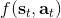已知的情况下，发现可以利用模型动态做很多事情。在连续控制中，我们提到了使用 iLQR/DDP 的轨迹优化方法，这些方法主要要用到模型动态的一阶微分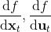；我们甚至了解到，Tassa et al. (2012) 使用 iLQR 做模型预测控制，在我们知道模型是什么的情况下可以不通过学习步骤制定出非常鲁棒的控制（使用 MPC，哪怕模型是错的，也有很强的鲁棒性）。如果我们不知道模型的话，要利用这个方法，就得去学习这个模型，然后对其进行微分。在离散问题中，我们也提到了蒙特卡洛树搜索 (MCTS) 方法。在 MCTS 方法中，我们要去模拟状态的转移，就要知道模型系统的动态，这样我们才能返回到祖先节点进行其他行动的搜索。因此，如果我们知道模型动态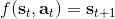，或者随机的分布，那么我们就可以使用上一篇的方法。因此我们考虑去从数据中学习，然后根据它来进行之后的计划。这样的方法被统称为**基于模型的增强学习** (model-based reinforcement learning)。

一个最简单版本的基于模型的增强学习算法（v0.5 版），执行以下三步：

1.  运行某种基本策略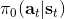（如随机策略）来收集样本数据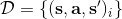。
2.  通过最小化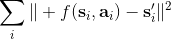的方法来学习模型动态。
3.  根据来计划未来行动。

第一步的策略对于驾驶汽车来说可能是随便转方向盘，显然不是什么好策略，但是也可以用这个来得到一些数据。第二步是去构建一个损失函数并最小化用模型预测出来的状态和真实发生的状态来拟合。第三步则是使用上一篇中的方法来进行计划。这样简单的方法在有些时候也可以起作用。本质上，这正是经典机器人学中系统识别 (system identification) 问题中在使用的方法：现在已经有一个参数形式的了，如已经有了机器人的运动方程，但是很多参数譬如质量和长度什么的不知道，而需要通过回归等方法去估计（有点像待定系数法）。此外，这样的方法中，这个“基本策略”还是要有所讲究的：譬如说不能总是执行一个行动，因为这样我们学习到的模型可能无法适应很多从来没见过的行动；即便基本策略执行各种情况，但是执行它可能错过重要的状态空间部分，这样也是不行的（当然这个说法本身就很玄学了）。总体来说，这个 v0.5 版本对于我们有一个利用物理知识手工推导的模型系统动态方程（我们有丰富的先验知识），只有个别（如 10-30 个）参数不知道的情况下还是很好用的：这时候随机策略可能足够好。

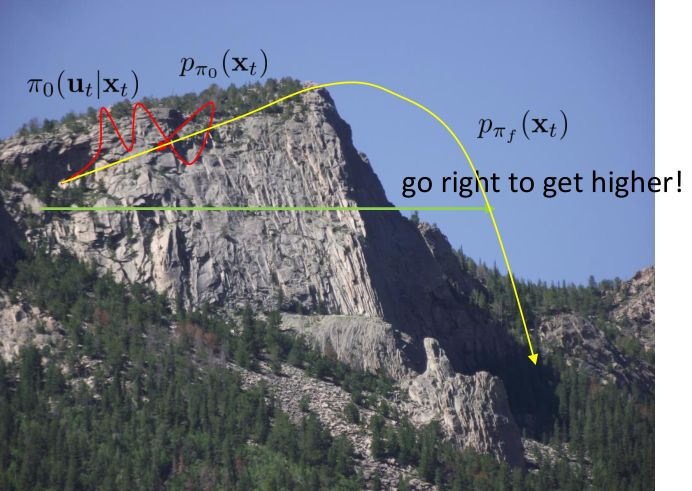

但在一般情况下，v0.5 版本明显是有缺陷的。如现在智能体在这样一个斜坡坡面上训练，我们的目标是到达山顶。我们第一步进行一些随机走动，训练数据如红色曲线；然后我们需要拟合一个模型，来预测行动如何影响智能体的高度（因为我们的目标是尽可能往高处爬）：我们通过红色部分的数据，得到的结论可能是越往右走，高度越大；最后一步，我们使用这个模型去进行规划，得到的结果就是如黄色轨迹一般坠落山崖。这里出现的问题主要就是如我们之前在[模仿学习](https://zhuanlan.zhihu.com/p/32575824)一篇中讲到的**分布不匹配** (distribution mismatch) 问题：我们的训练数据分布和实际遇到的情况不匹配。在这里，我们通过分布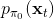来收集数据，但是实际用于规划行动时，我们不再执行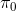下的分布，遇到的是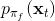，与之前遇到的分布是不同的。即便我们训练了一个在分布下很好的模型，但这个模型在所遇到的状态下可以任意差。值得一提的是，这样的分布不匹配问题在使用越具表达力的模型簇时越严重。因为如果像我们跟前面所说的一样只缺少几个待定参数，而模型具体形式已经知道了，那么其实对数据要求还是不高的；而使用如深度神经网络这样具有高表达力的模型，则会把红色部分的数据拟合得相当好（_ 我觉得是一种过拟合 _），然后尝试去遵循这个模型，就掉下去了。因此，越具有表达能力的模型事实上能越好地拟合分布下的数据，而这并不代表我们更加了解实际面对的分布。

为了解决这个问题，我们跟之前模仿学习相似，收集更多我们更关心的“实际分布”下的数据，以使得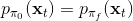。因此我们的 v1.0 版基于模型的增强学习算法如下：

一个最简单版本的基于模型的增强学习算法（v0.5 版），执行以下三步：

1.  运行某种基本策略（如随机策略）来收集样本数据。
2.  通过最小化的方法来学习模型动态。
3.  根据来计划未来行动。
4.  **执行这些行动，并得到一系列结果数据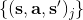加入到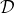中。反复执行 2-4 步。**

前三步与 v0.5 版无异，而 v1.0 版增加了第四步，收集新数据加入样本中并重新学习模型动态，希望藉此消除分布不匹配的问题。这个算法和 DAgger 不同，因为 DAgger 是为了适应策略的改进，而这里只是一些独立的强化学习步骤。

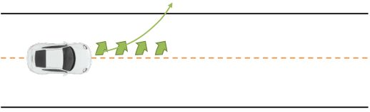

现在我们再对这个算法进行一些改进。考虑到如果我们犯了一个错误如何纠正：如果智能体失足坠落山崖，那么它就牺牲了，没什么进一步好做的了，这个是致命错误；但并不是所有错误都是致命的。如我们驾驶一辆车，每次问我们的模型，如果我们方向盘朝正前方，那么汽车会往什么方向走？然后模型总是回答，会稍微往右一点点：实际答案是我们的车会往正前方开，但是稍微往右一点点这个答案也相当接近正确答案了。但是麻烦在于，如果我们按照这个模型去行动，每一个时刻开车我们都以为需要加一些向左方向进行补偿，每一时刻方向盘都向左一点点的话，加起来很快这个车就会开出道路了。因此，即便我们的模型只有些许错误，我们在每个时刻尝试进行一些补偿，那么最后这些补偿加起来会成为很严重的错误。

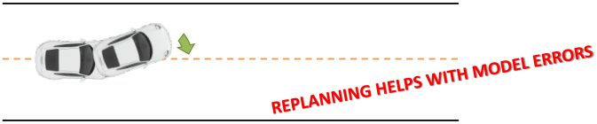

基于模型的增强学习 v1.5 版跟上一篇中的稳健算法类似，进行一些 MPC。如果我们发现根据我们的规划走，这个车却向左偏了，当误差到一定程度时，我们就可以重新进行规划，希望这个重新规划的方法可以补偿。框架如下：

1.  运行某种基本策略（如随机策略）来收集样本数据。
2.  通过最小化的方法来学习模型动态。
3.  根据来计划未来行动。（如使用 iLQR）
4.  **基于 MPC 的思想，仅执行计划中的第一步行动，观察到新的状态。**
5.  **将这一组新的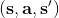加入到中。反复执行若干次 3-5 步之后，回到第 2 步重新学习模型。**

也就是说，每次我们仅执行整个计划序列中的第一步，然后走一步后对整个问题进行重新规划。重新规划路径有助于解决模型误差问题。第三步规划做得越频繁，每一次规划需要达到的精度越低，可以容忍更差的模型和更糟糕的规划方法。相对更简单的规划方法也可以起到作用，如可以接受更短的时长（也就是更加短视地规划问题），甚至一些随机采样的方法经常也可以做得很好。Tassa et al. (2012) 的演示中就说明了即便模型很离谱，MPC 也在倾向于做一些正确的事情。

在这个 v1.5 版本中，最难的一点是做规划。越精密的模型和方法，计划未来行动的代价越大，使得在线进行越困难。如玩 Atari 游戏，然后使用 MCTS 的方法，那么计算代价就会相当高。而 Guo et al. (2014) 使用模仿学习训练策略，则能更好地实现在线进行游戏。

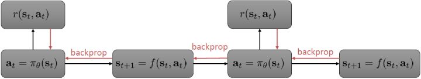

MPC 方法可能很好，但是计算代价有可能会很大。我们之前的想法是构造一个策略函数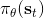来得到具体的行动。为了得到策略函数，我们可以写出如上图的计算图来表明策略函数如何影响收益，从而我们将梯度或者什么东西进行一系列反向传播。这个做法对确定性策略非常容易，也能拓展到随机策略。基于这种想法吗，我们有了基于模型的增强学习算法 v2.0 版：

1.  运行某种基本策略（如随机策略）来收集样本数据。
2.  通过最小化的方法来学习模型动态。
3.  **通过，使用反向传播的方法来优化策略函数。**
4.  **执行****，将新的****加入到****中。反复执行 2-4 步。**

在第三步，我们不再是去用某种方法来规划未来路径，而是使用收益的梯度通过反向传播的方法来优化策略函数。第四步还是为了解决分布不匹配的问题，收集新数据用来重新训练模型动态。需要明确的是， 只是去最小化损失函数，而 则是通过有点类似于 BPTT 训练 RNN 的方法进行求解的。当然这个方法本身并不是很好的，主要原因和训练 RNN 难度很大一致。我们的 可能是很复杂的函数，我们对其求导，然后反向传播很多阶以后梯度可能会消失或者爆炸，在数值上很病态。有一些技巧可以对这些问题进行改善。对以上四个版本的框架进行比较，得到以下小结：

*   v0.5 版：我们收集随机样本，训练模型动态，并进行规划。比较适合模型动态形式基本已知，只需要去求解少数参数的情形。优点在于方法简单，没有迭代过程；缺点主要在于分布不匹配问题。
*   v1.0 版：针对分布不匹配问题，采用交替进行收集数据和重新训练模型并规划的方法。优点在于同样简单，而且解决了分布不匹配的问题；缺点在于它还是一个开环控制过程，在误差下容易出现“小车跑出道路”的问题。
*   v1.5 版：在 v1.0 版的基础上加入了 MPC 进行闭环控制，在每一步运行后进行重新规划。优点在于对小的模型误差鲁棒性较好，在模型不准确的时候也可以得到很好的控制；缺点在于它的计算代价比较大，需要一边在线运行规划算法，一边收集数据。
*   v2.0 版：不再使用 MPC 进行反复重新规划，而考虑构建一个策略函数，通过反向传播去更新策略函数。优点在于它在运行时计算代价较小，只需要根据策略函数执行行动，比规划算法容易很多；缺点在于它可能在数值上非常不稳定，尤其是在一些随机域之中。

这些算法很多都已经被用于实际问题中。如 Deisenroth et al. (2011) 在 RSS 的一文"[Learning to Control a Low-Cost Manipulator using Data-Efficient Reinforcement Learning](http://link.zhihu.com/?target=https%3A//rse-lab.cs.washington.edu/postscripts/robot-rl-rss-11.pdf)"中，使用 PLICO (Deisenroth and Rasmussen, 2011, ICML, "[PILCO: A model-based and data-efficient approach to policy search](http://link.zhihu.com/?target=http%3A//mlg.eng.cam.ac.uk/pub/pdf/DeiRas11.pdf)") 方法进行真实物理系统中的机器人控制。该文中，模型动态并不是一个神经网络，而是一个相对比较简单的高斯过程 (Gaussian Process, GP)。里面的方法本质上是 v2.0 版的框架，只是中间的 被确定为高斯过程。

1.  运行某种基本策略（如随机策略）来收集样本数据。
2.  **通过最大化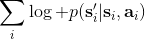的方法来学习模型动态。**
3.  **通过****，使用反向传播的方法来优化策略函数****。**
4.  执行，将新的加入到中。反复执行 2-4 步。

其中最难的一点是第三步，在这里针对 GP 模型有比较特定的方法，但是大意对其他模型也是适用的。假设初始分布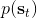已经给定为高斯分布，我们可以用当前学到的模型动态来计算分布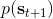。初始分布如果没有给定，可以使用一些拟合高斯分布的手段。现在我们已经有了一个策略函数，也有了转移分布（模型动态），我们可以将其复合，然后求其边缘分布得到下一个阶段的分布。如此这般，反复得到之后每个阶段的分布，然后使用这些边缘分布来求期望收益，再求解这个期望收益关于策略函数中参数的梯度。具体来看，如果边缘分布是一个高斯分布，那么如果我们的系统被认为是一个高斯过程的话，我们可以得到下一阶段状态的边缘分布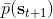的积分表达式，但这个分布通常不是一个高斯分布（可以是混合高斯）：因此我们采用矩方法（匹配前两阶矩）将边缘分布投影到高斯分布上，作为一个近似。（_ 具体表达式请参见论文，RSS 和 ICML 两篇都有 _）对于每一阶段，我们都使用其边缘分布来对收益求期望，最后总的期望收益就是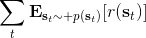，如果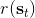性质较好（一般收益函数的采用都会去限制在一个比较好求解的范围内，以方便求解）且是一个高斯分布的话，那么实际上这个期望是容易求的，对其使用链式法则求导即可（_ 收益是与均值、方差有关的，而均值、方差是和策略参数有关的，因此使用链式法则求导 _）。

Deisenroth et al. (2011) 使用这个方法去控制廉价的机械臂（摄像头 130 美元，机械臂 370 美元），来堆叠彩色立方体块。状态是立方体块的踪迹，行动是对机械臂的致动。在视频中，机械臂有 4 个关节的自由度，代价函数使得立方体块尽可能接近目标；学习实验次数很少，只用几十次。方法很简单，但是在实际问题中还是处理得很好。

在基于模型的增强学习中，我们非常关注的一点是我们应该用什么样的模型簇，这其实是一个权衡的问题。

*   和上一个例子一样，我们可以使用诸如**高斯过程**这样非常有效的贝叶斯方法。如果我们使用高斯过程，输入是，输出是；优势在于，高斯过程和其他非参数贝叶斯模型的数据效率很高，这是因为它们可以在先验知识和现有证据之间做出取舍，以抵抗过拟合或者数据不足 (low-data regime)：这对于基于模型的增强学习是很重要的，因为这种学习的速度取决于前期训练得有多好，而前期训练通常是数据不足的，如果前期严重过拟合了，就很容易卡住，后期也很难进行推进；缺点在于，高斯过程对于非光滑的系统动态效果不佳，而且对于数据大的情况下这个计算就会非常慢，训练是关于数据量立方级增长的，而神经网络则快很多。
*   第二个选项是使用诸如**神经网络**这样非常强大的参数模型，输入是，输出是。如果用一个欧氏（）损失函数的话相当于训练一个高斯分布的均值，也可以使用更复杂的损失函数，处理多峰问题（见[第二篇](https://zhuanlan.zhihu.com/p/32575824)），或者选择除了高斯分布外更具表达能力的分布。它的优点不言自明，模型表现力非常强，而且非常擅长使用大量的数据，也适合推广到高维系统；它的缺点在于在数据不足的时候表现不佳，因此在基于模型的增强学习中使用神经网络要倍加小心，因为在早期训练中可能会做出非常诡异的举动。
*   其他选项譬如高斯混合模型 (Gaussian Mixture Model, GMM)，在机器人学中用得挺多的。它用很多元组来训练 GMM，使用来确定是在状态行动联合空间中的哪一块，然后再确定。如果相信模型是譬如分段线性的，那么这样的混合线性模型可能比较适用。（_ 这块我自己不是很熟悉，请大家多指教 _）同样也有很多其他特定领域的模型，如果你对你的系统比较了解，就可以写出一些方程，然后去学习那些未知参数，通常表现很好。
*   其他能做的事情譬如说给定视频的一帧，来预测某行动后的之后帧会是什么，这种高维预测问题在之后会涉及。

Nagabandi et al. (2017) 最近的"[Neural Network Dynamics for Model-Based Deep Reinforcement Learning with Model-Free Fine-Tuning](http://link.zhihu.com/?target=https%3A//arxiv.org/abs/1708.02596)"一文中使用了 v1.5 版本的框架（同时使用了一些无模型的方法来进行微调）来进行模拟机器人控制。这里基于的模型是神经网络，而第三步的行动规划只是做较短期的的随机采样（随机采样多条行动轨迹，然后选取最好的一条）。这样做的原因是对神经网络数据不足时的过拟合倾向进行补偿，只进行短期规划使得错误不会积累太多；同时进行 MPC 重新规划，最佳路径只选取第一步行动。如果模型预测错误，也问题不大，可以重新规划。在不同种类机器人沿着检查点一步一步走的问题中，机器人移动速度不算很快，但是方案相对比较灵活，适应各种检查点的摆放轨迹。在 OpenAI Gym 的游泳项目中（游泳前进提高速度），如此基于模型的方法可以用很少的数据点（12k 个）完成无模型方法需要很多数据点（4m-11m 个）才能达到的目标，即便可能游得没有无模型方法那么快，但至少样本效率很高。基于模型的方法样本效率很高，但是渐进偏倚很大，因为最后动作精度都受限于模型。基于模型的方法使用 12k 个样本点达到收益函数 900，而无模型的方法通过 4m-12m 个样本点达到收益函数 4800；这个例子清晰地告诉我们两者区别原因在于**基于模型的方法尝试的是提高模型拟合程度（需要的样本数可能只是无模型的百分之一、千分之一），而无模型的方法则是去提高收益函数。**

## 从全局模型到局部模型

从最开始到现在，我们讨论的模型几乎都是**全局模型** (global models)，也就是说，我们学习一个，对于整个系统中都起作用。出于这个目的，我们尝试使用单一的函数去拟合，譬如一个巨大的神经网络。它对于我们所能访问到的状态行动处表现不俗，也可以用它来进行很好的决策。在我们的 v1.0 版框架中，问题在于如果一开始估计不好，那么规划步就会去探索因为模型错误而被乐观估计的区域（模型指向了错误的，恰好比较优秀，规划器以为会访问到，而实际不会）。譬如说对于一个只会行走的生物，模型却认为它下一步能飞起来，那么规划器会尝试去规划它下一步怎么飞，而事实上它并不能飞。（_Levine 教授的题外话是如果在编写一个物理模拟器的话，调试过程中不妨尝试使用一些增强学习算法，能帮助我们了解怎么样的行动会导致这个模拟器出 bug。如早期版本的 MuJoCo 有很多 bug，可能会使只能在地上爬的机器人站起来甚至飞起来，只是优化算法能弄清如何在这里面作弊。_）

要把一个模型学习得很好其实是压力山大的，我们需要弄出一个很好的模型，在状态空间的绝大多数区域都收敛到一个很好的解。有些时候我们可以使用较短的规划期、MPC 等手段，但总体来说还是问题很大的。**在某些任务中，模型比行动策略要复杂很多**。譬如把一个有柄的杯子拿起来，我们的策略很简单，拿住杯柄握起来放到对应位置就行，跟各种物理关系不大；而这样一个问题的物理模型则非常复杂，如手可能是软的会变形，接触点可能很多，等等。因此将这些东西全盘考虑进来进行准确预测会很难。

相较于训练很好的全局模型，有一些我们可以做的事情，譬如训练**局部模型** (local models)。在我们之前所述的方法中，做轨迹优化通常需要的仅仅是模型在某点的导数，而这正是局部信息。因此，我们某种程度上也可以认为不见得一定要训练好一个全局模型才能做好优化问题，而训练一些能对梯度等局部信息有表征的模型也可以：事实上这个就简单很多了。

现在我们只来关心。知道了这些信息之后，我们就可以用 iLQR 等方法来进行轨迹优化了。因此，我们的想法不是去拟合模型动态，而仅仅是去拟合关于当前轨迹或者策略的，譬如使用线性回归的方法。注意到 LQR 很好的特性是它是线性的，而且这个策略是可以在真实环境中运行的。

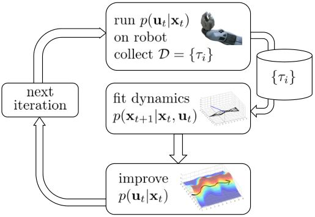

我们尝试对一个增强学习过程进行拆解（_ 注：这边图里也变成了，但我还是尝试把它区分开 _）。首先我们通过运行策略函数，来收集轨迹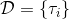。然后我们拟合模型动态：为了简单起见，我们假设模型动态是一个高斯分布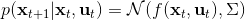，均值可能是比较复杂的非线性函数，然后有一个方差，基本上比较确定但是稍微有一些噪音。这个假设对连续系统还是比较合理的。我们假设在每个时刻，都有一个线性化表达式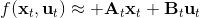，对于不同时刻矩阵是不同的。这样近似其实已经很有表达力了，因为在不同的时间，前面的系数矩阵可能完全不同，但在给定时间下只是线性而已。这样近似更是因为我们通常只会用到的一阶导，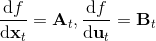：因此如果我们能拟合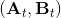，那么我们就能得到这两个微分结果。从而，我们可以用这个来使用 iLQR 方法改进我们的策略函数，然后重新下一个循环。

在这个大框架下，其实有很多值得探讨的问题。第一个问题是，**使用怎样的策略**（这里也是控制器 controller）**去收集数据**。我们现在不尝试去拟合一个全局模型了，所以选用怎么样的策略的重要性就更强了。如果我们只是随便选策略的话，那么我们很难去拟合当前策略下的局部信息。回顾 iLQR，执行完毕以后可以得到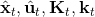，然后最优控制策略是。一个非常简单的选择（v0.5 版）是直接把 iLQR 的选取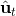作为锚点，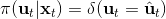，当在行动中有偏差或者漂移的时候就会出问题。进一步我们选择 iLQR 给出的最优控制（v1.0 版），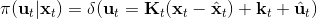，看起来这样的确定性策略有点儿“太好了”，如果我们想拟合局部信息，可能总是采取某种意义上的最优策略并不好，可能会总是往一个地方不停钻，使用基本一样的数据去拟合会使局部信息非常病态。一个更好的版本（v2.0 版）执行高斯分布：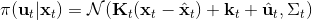，其中均值是 iLQR 做出的最优控制，并**加入了一些噪音，使得数据不总是基本一样**，数据多样性稍微加强。在方差的选择上可能需要注意，因为我们想得到不同的轨迹，但也不是彻底不同：这样我们尝试的就是去拟合全局模型而不是局部模型了，但这样的线性化模型对全局模型的效果是很差的。

一个比较建议的方差是设置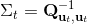。这个原因是代表了我们从状态执行后直到最后的最小代价的，而如果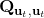很大的话，变动对 Q 值影响就很大：如果变动对 Q 值很敏感，那么我们就不要变动很多；反之，它对噪音的承受力就强，我们可以选择噪音的余地就大。我们加入噪音并不想很去干扰 Q 值，因此我们更愿意去加入一些对 Q 影响较小的噪音。相较于我们之前提到的 LQR 是去优化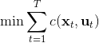，有一个有趣的结论是，使用 v2.0 方法我们事实上是在最小化一个有定义的目标函数：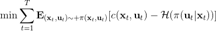，也就是期望代价减去熵。其中熵函数定义为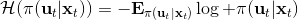。这样的目标其实是试图去找到噪音最大并且代价最小的的策略（双目标规划），也就是使策略尽可能随机，同时保持一个低代价（高收益）：我们去学习一个局部模型，想做的恰好是这样的事情。这样的解又被称为**最大熵** (maximum entropy) 解。

第二个问题是如何去**拟合这个局部模型**。假设我们已经收集了一些轨迹转移数据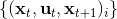。我们使用高斯分布的模型动态，因为我们在上一篇中已经提到过对于这样的问题直接做 LQR 还是能得到最优解，我们可以忽略噪音的影响。最简单的拟合方法是我们直接使用线性回归，譬如假定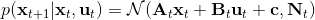（可以有个截距项）。一种更好的做法是考虑到在相近的时间点，模型动态可能是比较接近的，因此贝叶斯线性回归（[一个很细致的讲解在这里](http://link.zhihu.com/?target=http%3A//blog.csdn.net/daunxx/article/details/51725086)）可能是一个比较好的选择，可以使用某些全局模型作为先验分布：我们可以把所有数据用来拟合一个全局模型，并把它作为先验，这样可以提高数据的使用率。这样的想法比较像是我们有一个全局模型，效果还可以但是不够完善，由此我们把它作为先验来提高局部模型的拟合。

当然，学习全局难度的模型需求量远比局部模型高，因为局部模型的矩阵形式比诸如神经网络全局模型简单很多，但是局部模型的难点在于每次策略更新之后，局部模型就得推倒重来，以收集更好的样本（也可以说是在线 (on-policy) 的基于模型的增强学习）：两者是有权衡的，在一个盈亏平衡点后可能学习全局模型的代价相对更小了。具体代价和具体问题紧密相关，有些问题很容易去拟合全局模型，但是有些问题则很难。

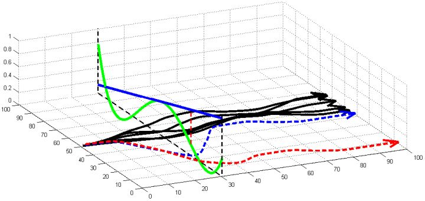

第三个问题是，我们更新策略函数总是希望让它能与现在有所不同，那么**如果策略函数变化太大会怎么样**？在上图中，真实模型是绿色线的非线性函数，我们使用一个蓝色线的线性模型去拟合（因此在中部一点相切）。我们进行一步更新的时候，可能到达一个比较远的位置（红色竖虚线投影），此时蓝色拟合模型和绿色真实模型有很大的差别。在蓝色线性模型下，我们认为轨迹只会是蓝色的虚线；而我们实际运行时，由于蓝色拟合模型完全是错误的，实际上我们拐到了红色虚线这样很远的地方，就完全在计划之外了。我们之所以叫蓝色模型为局部模型，是因为它只能告诉我们在局部范围内如何改进策略，而如果我们策略变动过大，则这样不见得是一个改进（甚至可能是完全错误的），因为我们的局部模型太只关注局部了。我们要做的事情，是去限制每次迭代中，策略函数改变了多少，使得每一步走得不远。

那么我们怎么做才能使得新的策略与原策略接近呢？我们的策略函数是，那么根据 Markov 性，一个轨迹的发生是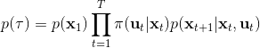。如果我们的新的轨迹分布和老的轨迹分布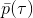比较相近，那么模型动态也会比较接近。[KL 散度](http://link.zhihu.com/?target=https%3A//en.wikipedia.org/wiki/Kullback%25E2%2580%2593Leibler_divergence)是一个描述两个分布之间差异度的常见度量标准，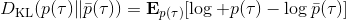。从而，我们在更新策略的时候，如果加入一个限制条件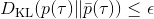，就能保证两个策略下轨迹分布的差异能被控制在一个局部之内。顺便一提，使用 KL 散度来控制轨迹分布差异的想法在除此之外的很多其他无模型的增强学习算法（如 TRPO）中也有应用。

现在我们来对 KL 散度的具体形式进行一些推导。因为两个轨迹分布的初始分布和模型动态是一样的，只有策略函数有所区别，因此现在有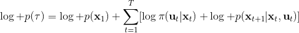和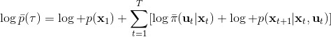。有点类似于策略梯度法，它们相减以后很多项也可以消去，得到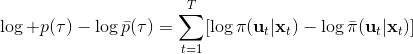，从而 。将前一项进行重写，，然而。因此，。回顾我们刚才使用加入高斯噪音的 v2.0 版本策略函数是去优化的，因此如果我们能把搞到目标函数里面，那么我们就能用 iLQR 作为均值加上随机高斯噪音来优化这个问题。

一般我们会采用拉格朗日乘子法来把约束放到目标函数里面。一个对偶梯度下降法（Dual Gradient Descent，DGD，其实在这里是上升）是这么做的：考虑问题，则拉格朗日函数，因此对偶问题为，其中（_ 假设强对偶，感觉意思是不强对偶的话也强行这么做先 _），从而通过优化对偶变量的方式，最优对偶变量下的优化问题正是原始问题的解。假设在给定拉格朗日乘子下，，对其求导得，这是因为一阶最优性条件保证了。因此对偶梯度法做循环迭代以下三步：

1.  在给定拉格朗日乘子下，求解最优的。
2.  求解。
3.  拉格朗日乘子走一个梯度步。

这里面最难实现的应该是第一步。我们要用 DGD 方法来求解之前所说的约束下问题。其中，。那么它的拉格朗日函数是，现在给定拉格朗日乘子下，要去最小化这个函数，求出。后面是常数项先扔掉，然后把整个式子除掉（不严格地，假设乘子不为 0），那么原优化问题和同解。那么我们只需要构造一个新的代价函数，然后执行 LQR，加入高斯噪音就可以了。迭代执行以下步骤：

1.  构造，并使用 LQR 加入高斯噪音的方法得到。
2.  ，更新乘子。

控制两个策略间的 KL 散度在很多场合下都是非常有意义的（譬如在无模型增强学习中也存在采样的误差），而且控制两个策略间的 KL 散度等价于控制轨迹分布之间的 KL 散度。

Levine et al. (2015) 发表在 ICRA 上的"[Learning Contact-Rich Manipulation Skills with Guided Policy Search](http://link.zhihu.com/?target=https%3A//arxiv.org/abs/1501.05611)"一文阐述了使用局部模型，使用 KL 散度信赖域，结合 iLQR 进行规划来控制机器人的应用。机器人学习堆叠乐高块（插入动作），通过旋转机械臂来拟合模型动态，每收集一些（10 条）轨迹就停下来几秒用来更新局部模型，并更新策略函数。机械臂在反复试验后，逐渐倾向于完成插入乐高块的任务。这个工作并不训练神经网络，只是做局部的线性模型拟合来研究怎么去做这个任务。高斯噪声使得机器人倾向于进行一些探索。

Fu et al. (2016) 的发表在 IROS 上的"[One-shot learning of manipulation skills with online dynamics adaptation and neural network priors](http://link.zhihu.com/?target=http%3A//rll.berkeley.edu/iros2016onlinecontrol/online_control.pdf)"一文将全局模型和局部模型结合起来，使用全局模型做先验，进行贝叶斯回归来训练局部模型，来控制机器人完成任务。特别的是，机器人使用过去的经验来完成新的任务（任务不同，但有相似结构）。机器人使用过去的经验来训练一个全局模型，然后接受新任务的很多轨迹信息，在线训练一个经验估计，从而得到后验局部模型，做 MPC 每一步重新规划。在视频中可以看到，因为在线学习，所以在试验过程中一边就把局部模型给学习了，逐渐适应任务以提高执行水平。