## 第2章多层网络

本章简要概述了计算机视觉中应用最突出的多层结构。值得注意的是，虽然本章涵盖了文献中最重要的贡献，但它不会对这些结构进行全面的介绍，因为这样的介绍可以在别处获得（例如参考文献[17,56,90]）。相反，本章的目的是为文档的其余部分奠定基础，并详细介绍和讨论目前对应用于视觉信息处理的卷积网络的理解。

### 2.1多层架构

在最近成功开发基于深度学习的网络之前，用于识别的最先进的计算机视觉系统依赖于两个独立但互补的步骤。首先，通过一组手工设计的操作（例如。具有基组，局部或全局编码方法的卷积）将输入数据转换成合适的形式。输入引起的变换通常需要找到输入数据的紧凑和/或抽象表示，同时根据手头的任务注入若干不变性。这种转换的目标是以一种更容易被分类器分开的方式改变数据。其次，变换后的数据用于训练某种分类器（例如支持向量机）来识别输入信号的内容。使用的任何分类器的性能通常都会受到使用的转换的严重影响。

具有学习的多层体系结构通过提出不仅仅使用分类器来学习，而且还直接从数据中学习所需的转换操作，从而对问题产生了不同的展望。这种学习形式通常被称为表示学习[7,90]，当在深层多层体系结构的前后层结构中使用时，称为深度学习。

多层体系结构可以定义为允许从输入数据中提取多个抽象级别有用信息的计算模型。通常，多层架构被设计为放大较高层输入的重要成分，同时对较不显着的变化变得越来越稳健。大多数多层架构交替使用线性和非线性函数堆叠简单构建模块。多年来，学者们提出了多种多样的多层架构，本节将介绍计算机视觉应用中最突出的这种架构。特别是由于显著性，人工神经网络架构将成为焦点。为了简洁起见，下面将更简单地将这种网络称为神经网络。

#### 2.1.1神经网络

典型的神经网络架构由输入层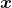，输出层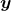，和多个隐藏层组成的堆栈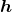组成，其中每层由多个单元或单元组成，如图2.1所示。通常，每个隐藏单元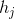接收来自前一层所有单元的输入，其输出由输入的加权组合与非线性计算得到，计算公式见（2.1）

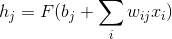（2.1）

其中，是控制输入单元和隐藏单元之间连接强度的权重系数，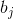是隐藏单元的微小偏移量，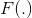是饱和非线性函数，如Sigmoid函数。

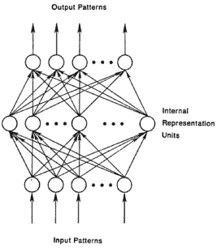

图2.1：典型神经网络架构的图示。复制自文献[17]。

深度神经网络可以看作是Rosenblatt所提出的感知器[122]和多层感知器[123]的现代版实例。虽然，神经网络模型已存在多年（神经网络由1960年代首次提出），它们直到最近才被大量使用。神经网络的沉寂多年原因复杂。最初，实验的负面结果表明感知器无法对XOR这样的简单操作进行建模，这一失败在一定时间内阻碍了对感知器的进一步研究，直到感知器由单层推广到多层[106]。此外，缺乏适当的训练算法亦使得研究进展缓慢，直到反向传播算法的普及[125]。然而，阻碍多层神经网络发展的更大障碍是它们依赖于非常大量的参数，这反过来意味着多层神经网络需要大量的训练数据和计算资源来支持参数的学习。

通过使用受限玻尔兹曼机（RBM）[68]，深度神经网络领域在分层无监督预训练方面取得重大进展。受限玻尔兹曼机可以看作受限只允许前馈连接的两层神经网络。当应用于图像识别时，用于训练RBM的无监督学习方法可以归纳为三个步骤。首先，每个像素作为输入，随机权重设为，偏差为，每个单位的隐藏状态值为的概率设为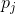。概率由式（2.2定义）

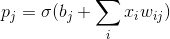（2.2）

其中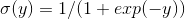。其次，一旦基于等式2.2随机地设置了所有隐藏状态，通过以概率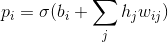将每个像素设置为以尝试重建图像。第三，通过基于由式（2.3）给出的重建误差更新权重和偏差来校正隐藏单元

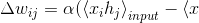（2.3）

其中是学习率，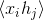是像素和隐藏单元在一起的次数。整个迭代过程最大重复为次，或当直到误差下降到预设阈值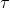时迭代结束。当完成一层的训练后，该层的输出将作为层次结构中下一层的输入。下一层亦将循环该过程。通常，在完成所有网络层的预训练之后，使用梯度下降，通过误差反向传播进一步对标记数据进行微调[68]。通过使用该分层无监督预训练方法，深度神经网络不需要大量标记数据亦可进行训练，因为无监督RBM预训练提供了用于经验上有用的初始化各种网络参数的方式。

依赖于堆叠RBM的神经网络首先成功地在人脸识别应用中作为一种降维方法进行部署[69]，其中它们被用作一种自动编码器。简而言之，自动编码器可以定义为由两个主要部分组成的多层神经网络：首先，其中编码器将输入数据转换为特征向量;第二，解码器将生成的特征向量映射回输入空间;见图2.2。通过最小化输入与其重建版本之间的、误差来学习自动编码器的参数。

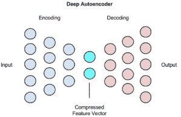

图2.2：典型自编码器网络的结构。复制自文献[17]。

除了基于RBM的自动编码器之外，后来学者们又提出了几种类型的自动编码器。每个自动编码器都引入了一种不同的正则化方法，即使在执行不同的不变性时，也能阻止网络学习不重要的解决方案。主要范例包括稀疏自动编码器（SAE）[8]，去噪自动编码器（DAE）[141,142]和压缩自动编码器（CAE）[118]。稀疏自动编码器[8]允许中间表示的大小（即由编码器部分生成的）大于输入的大小，同时通过惩罚负输出来强制实现稀疏。相比之下，去噪自动编码器[141,142]通过尝试从人为损坏的版本重建干净的输入来改变重建本身的目标，其目的是学习稳健的表示能力。类似地，压缩自动编码器[118]通过进一步惩罚对注入噪声最敏感的单元来构建去噪自动编码器。各种类型自动编码器的更详细介绍可以在其他地方找到，如参考文献[7]。

#### 2.1.2循环神经网络

在解决依赖于顺序输入的任务时，其中一种最成功的多层架构是循环神经网络（RNN）[9]。如图2.3所示，RNN可以看作是一种特殊的神经网络，其中每个隐藏单元从当前时间步骤观察到的数据以及前一时间点的状态中获取输入。 RNN的输出定义为

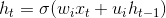（2.4）

其中是非线性挤压函数，和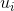是控制当前和过去信息相对重要性的网络参数。

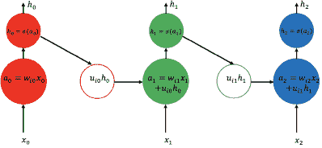

图2.3：标准回归神经网络的工作流程说明。每个RNN单元在当前时间帧处获取新输入，并且从之前的时间步长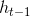和当前单元的新输出可根据式（2.4）计算，并可被输入至多层RNN的另一层处理中。

虽然RNN看似是强大的架构，但它们的主要问题之一是它们对长期依赖性建模的能力有限。这种限制归咎于由于在通过多个时间步骤传播误差时可能发生的梯度爆炸或者消失导致的训练困难[9]。特别是，在训练期间，反向传播的梯度将与从当前时间步长一直倒退到初始时间步长的网络权重相乘。因此，由于这种乘法累加，权重可以对传播的梯度具有重要的影响。如果权重很小，则梯度消失，而较大的权重导致梯度爆炸。为了解决这个难题，学者们提出了长期短期记忆（LSTM）[70]。

LSTM是配备了存储或者记忆器件的循环网络，如图2.4所示，它可以随时间累积信息。 LSTM的存储器单元可被门控，以便允许从中读写信息。值得注意的是，LSTM还包含一个遗忘门，允许网络在不再需要时擦写信息。 LSTM由三个不同的门（输入门，遗忘门和输出门）以及存储器单元状态控制。输入门由当前输入和先前状态控制，计算公式定义为

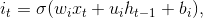（2.5）

其中，，，分别表示控制与输入门的连接的权重和偏移量，通常是S形函数。遗忘门同样被定义为

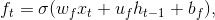（2.6）

它由相应的权重和偏差，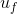，控制。可以说，LSTM最重要的方面是它可以应对梯度消失和爆炸渐变的挑战。在确定存储器单元的状态时，通过遗忘门和输入门状态的相加组合来实现该能力，该状态又控制信息是否经由输出门传递到另一个单元。具体地，以两个步骤计算单元状态。首先，根据估计候选结构状态

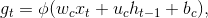（2.7）

其中通常是双曲正切函数。其次，最终的单元状态最终由当前估计的单元状态和先前的单元状态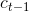控制，由输入和遗忘门调制根据式(2.8)计算得到

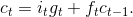（2.8）

最后，使用单元的状态以及当前和先前的输入，输出门的值和LSTM单元的输出根据

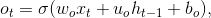（2.9）

其中

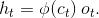（2.10）

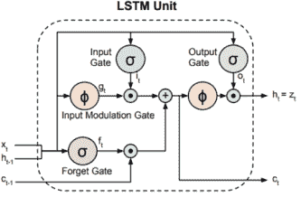

图2.4：典型LSTM单元的图示。该单元在当前时间输入，从之前的时间获取输入，并返回下一次输入的输出。 LSTM单元的最终输出由输入门，遗忘门和输出门以及存储单元状态控制，它们由分别式（2.5），（2.6），（2.9）和（2.8）定义。本图复制自文献[33]。

#### 2.1.3卷积网络

卷积网络（ConvNets）是一种特别适用于计算机视觉应用的特殊类型神经网络，因为它们能够通过本地操作进行分层抽象表示。两个关键的设计理念推动计算机视觉中卷积体系结构的成功。首先，卷积网络利用图像的2D结构以及邻域内的像素通常高度相关的事实。因此，卷积网络避免在所有像素单元之间使用一对一连接（即大多数神经网络的情况一样），这有利于使用分组本地连接。此外，卷积网络架构依赖于特征共享，因此每个通道（或输出特征图）由在所有位置使用相同滤波器的卷积生成，结构如图2.5所述。卷积网络的这一重要特性，使得其与标准神经网络相比依赖于更少参数的架构。其次，卷积网络还引入了一个池化步骤，该步骤提供了一定程度的平移不变性，使得架构受到位置的微小变化的影响较小。值得注意的是，由于网络感知字段的大小增加，池化还允许网络逐渐看到输入的较大部分。接收场大小的增加（加上输入分辨率的降低）允许网络在网络深度增加时表达输入的更抽象的特征。例如，对于对象识别的任务，卷积网络层首先将边缘聚焦到对象部分以最终覆盖层次结构中较高层的整个对象。

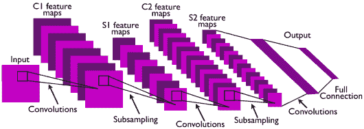

图2.5：标准卷积网络结构的图示。本图复制自文献[93]

卷积网络的体系结构很大程度上受到了视觉皮层中处理过程的启发，如Hubel和Wiese在文献l [74]的开创性工作所述（这将在第3章中进一步讨论）。事实上，最早的卷积网络实例似乎是Fukushima在文献[49]中提出的神经认知机(Neocognitron)，它也依赖于本地连接，其中每个特征图最大限度地响应特定特征类型。 神经认知机由一系列层组成，其中每层交替出现S细胞单元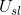和复杂细胞单位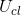，它们松散地模仿生物简单和复杂细胞中发生的过程，分别如图2.6所示。简单细胞单元执行类似于局部卷积的操作，然后执行线性整流单元（ReLU）非线性函数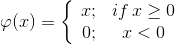，而复杂单元执行类似于平均合并的操作。该模型还包括一个分裂的非线性过程，以实现类似于当代卷积网络中规范化的过程。

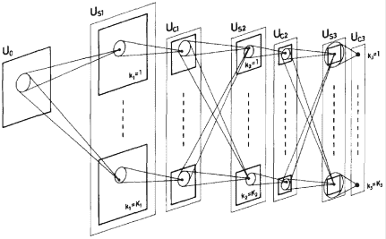

图2.6：神经认知机结构图。本图复制自文献[49]

与大多数标准卷积网络架构（例如[91,88]）相反，神经认知机不需要标记数据进行学习，因为它是基于自组织映射设计的，通过重复学习连续层之间的局部连接一组激励图像的演示。具体地，训练神经认知机以学习输入特征图和简单细胞层之间的连接（简单细胞层和复杂细胞层之间的连接是预先固定的），并且学习过程可以在两个步骤中概括地概括。首先，每次在输入处呈现新的激励时，选择最大响应它的简单细胞作为该激励类型的代表性细胞。其次，每次响应相同的输入类型时，输入和那些代表性单元之间的连接就会得到加强。值得注意的是，简单的单元层被组织在不同的组或平面中，使得每个平面仅响应一种刺激类型（即类似于现代卷积网络架构中的特征映射）。对神经认知机的后续扩展包括监督学习的允许[51]以及自上而下的注意力机制[50]。

在最近计算机视觉应用中部署的大多数卷积网络架构都受到LeCun在1998年所提出的成功架构的启发，现在称为LeNet，用于手写识别[91]。如关键文献[77,93]所述，经典卷积网络由四个基本处理层组成：（i）卷积层，（ii）非线性或整流层，（iii）归一化层和（iv）池化层。如上所述，这些成分主要存在于神经认知机中。 LeNet的一个关键附加功能是结合反向传播，以便相对有效地学习卷积参数。

虽然允许优化架构的卷积网络，与完全连接的神经网络相比，所需要的参数要少得多，但它们的主要缺点仍然在于它们严重依赖学习和标记数据。这种数据依赖性可能是直到2012年卷积网络未被广泛使用的主要原因之一，因为大型ImageNet数据集的可用性[126]和相应的计算资源使得学者恢复对卷积网络的兴趣成为可能[88]。 卷积网络在ImageNet上的成功引发了各种卷积网络架构研究的突飞猛进，并且该领域的大多数贡献仅仅基于卷积网络的基本构建块的不同变化，稍后将在2.2节中讨论。