#### 2.1.4生成对抗网络

生成性对抗网络（GAN）是利用多层体系结构强大的代表性功能的相对较新的模型。 GAN最初是在2014年推出的[57]虽然它们本身没有提出不同的架构（_即_。例如，在新型网络构建模块方面），它们具有一些特殊性，这使得它们略有不同不同类型的多层架构。 GAN响应的一个关键挑战是采用无监督的学习方法，不需要标记数据。

典型的GAN由两个竞争块或子网组成，如图2.7所示;发生器网络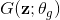和鉴别器网络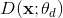，其中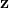是输入随机噪声，是实际输入数据（_，例如_。图像）和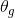和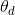分别是两个块的参数。每个块可以由任何先前定义的多层体系结构构成。在原始论文中，发生器和鉴别器都是多层全连接网络。鉴别器被训练为识别来自发生器的数据并且以概率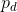分配标签“假”，同时以概率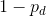将标签“真实”分配给真实输入数据。作为补充，生成器网络被优化以生成能够欺骗鉴别器的伪表示。这两个块在几个步骤中交替训练，其中训练过程的理想结果是鉴别器，其将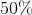的概率分配给真实和伪造数据。换句话说，在收敛之后，生成器应该能够从随机输入生成实际数据。

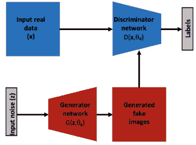

图2.7：通用生成性对抗网络（GAN）结构的图示。

自原始论文以来，许多贡献都参与了通过使用更强大的多层架构作为网络的主干来增强GAN的能力[114]（_，例如_。用于鉴别器和反卷积网络的预训练卷积网络，学习发电机的上采样滤波器。 GAN的一些成功应用包括：文本到图像合成（其中网络的输入是要渲染的图像的文本描述[115]），图像超分辨率，其中GAN从较低的生成逼真的高分辨率图像分辨率输入[94]，图像修复GAN的作用是从输入图像填充缺失信息的孔[149]和纹理合成，其中GAN用于从输入噪声合成真实纹理[10]。

#### 2.1.5多层网络培训

如前几节所述，各种多层架构的成功在很大程度上取决于其学习过程的成功与否。虽然神经网络通常首先依赖于无监督的预训练步骤，如2.1.1节所述，但它们通常遵循最广泛使用的多层架构训练策略，这是完全监督的。训练过程通常基于使用梯度下降的误差反向传播。梯度下降因其简单性而广泛用于训练多层架构。它依赖于最小化平滑误差函数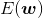，遵循定义为的迭代过程

（2.11）

其中表示网络参数，是可以控制收敛速度的学习速率，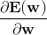是在训练集上计算的误差梯度。这种简单的梯度下降方法特别适用于训练多层网络，这要归功于使用链规则进行反向传播并计算相对于不同层的各种网络参数的误差导数。虽然反向传播可追溯到多年[16,146]，但它在多层架构的背景下得到了普及[125]。在实践中，使用随机梯度下降[2]，其包括从连续的相对小的子集中近似整个训练集上的误差梯度。

梯度下降算法的主要问题之一是学习率的选择。学习率太小会导致收敛缓慢，而较大的学习率会导致围绕最佳状态的过冲或波动。因此，提出了几种方法来进一步改进简单的随机梯度下降优化方法。最简单的方法，称为随机梯度下降与动量[137]，跟踪从一次迭代到另一次迭代的更新量，并通过进一步推动更新，如果梯度从一个方向指向同一方向，进一步推动学习过程时间步骤到另一个定义，

（2.12）

用控制动量。另一种简单的方法涉及根据固定的时间表以递减的方式设置学习速率，但这远非理想，因为该时间表必须在训练过程之前预先设定并且完全独立于数据。其他更复杂的方法（_，例如_ .Adagrad [34]，Adadelta [152]，Adam [86]）建议通过执行较小的更新，在训练期间调整学习率到每个参数。频繁变化的参数和不常见的更新。这些算法的不同版本之间的详细比较可以在其他地方找到[124]。

使用梯度下降及其变体进行训练的主要缺点是需要大量标记数据。解决这一困难的一种方法是采用无监督学习。用于训练一些浅层ConvNet架构的流行的无监督方法基于预测稀疏分解（PSD）方法[85]。 Predictive Sparse Decomposition学习一组过度完整的滤波器，其组合可用于重建图像。该方法特别适用于学习卷积体系结构的参数，因为该算法被设计用于学习以补丁方式重建图像的基函数。具体地，预测稀疏分解（PSD）建立在稀疏编码算法的基础上，该算法试图通过与基组B的线性组合来找到输入信号X的有效表示Y.形式上，稀疏编码的问题广泛地存在。制定为最小化问题，定义为，

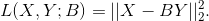（2.13）

PSD通过最小化定义为的重构误差，在卷积框架中调整稀疏编码的思想，

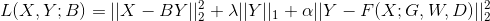（2.14）

其中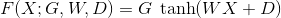和，和分别是网络的权重，偏差和增益（或归一化因子）。通过最小化方程2.14中定义的损失函数，算法学习表示，重建输入补丁，同时类似于预测表示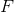。由于等式的第二项，学习的表示也将是稀疏的。在实践中，误差在两个交替步骤中被最小化，其中参数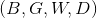是固定的并且在上执行最小化。然后，表示被固定，同时最小化其他参数。值得注意的是，PSD以补片程序应用，其中每组参数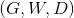是从输入图像重建不同的补丁中学习的。换句话说，通过将重建聚焦在输入图像的不同部分上来学习不同的内核集。

#### 2.1.6关于转学的一个词

培训多层体系结构的一个意想不到的好处是学习特征在不同数据集甚至不同任务中的令人惊讶的适应性。例子包括使用ImageNet训练的网络识别：其他物体识别数据集，如Caltech-101 [38]（_，例如_。[96,154]），其他识别任务，如纹理识别（_例如_。[25]），其他应用，如物体检测（_，例如_。[53]）甚至基于视频的任务，如视频动作识别（_，例如_）。 [134,41,144]）。

使用多层体系结构在不同数据集和任务中提取的特征的适应性可以归因于它们的层次性，其中表示从简单和局部到抽象和全局。因此，在层次结构的较低层提取的特征往往在不同的任务中是共同的，从而使多层架构更适合于转移学习。

对不同网络和任务中特征的有趣可转移性进行系统探索，揭示了考虑转移学习时需要考虑的几个良好实践[150]。首先，它表明仅微调更高层，与微调整个网络相比，系统性能更好。其次，这项研究表明，任务越多，转移学习效率就越低。第三，更令人惊讶的是，人们发现，即使经过微调，网络在初始任务下的表现也不会受到特别的阻碍。

最近，一些新兴的努力试图通过将学习问题作为连续的两步程序，_，例如_ [3,127]来强制执行网络“转移学习能力。首先，所谓的快速学习步骤如通常所做的那样，在网络针对特定任务进行优化的情况下执行。其次，在全局学习步骤中进一步更新网络参数，该步骤尝试最小化不同任务之间的错误。

### 2.2空间卷积网络

理论上，卷积网络可以应用于任意维度的数据。它们的二维实例非常适合于单个图像的结构，因此在计算机视觉中受到了相当大的关注。随着大规模数据集和功能强大的计算机的可用性，视觉界最近看到ConvNets在各种应用中的使用激增。本节介绍最突出的2D ConvNet架构，它将相对新颖的组件引入2.1.3节中描述的原始LeNet。