#### 2.2.1最近ConvNets演变中的关键架构

重新引起对ConvNet架构兴趣的工作是Krishevsky的AlexNet [88]。 AlexNet能够在ImageNet数据集上实现破纪录的对象识别结果。它由8层组成，5个卷积和3个完全连接，如图2.8所示。

AlexNet介绍了几种架构设计决策，允许使用标准随机梯度下降进行有效的网络训练。特别是，四项重要贡献是AlexNet成功的关键。首先，AlexNet考虑使用ReLU非线性而不是先前最先进的ConvNet架构中使用的饱和非线性（如sigmoids）（_，例如_ .LeNet [91]）。 ReLU的使用减少了消失梯度的问题，并导致更快的训练。其次，注意到网络中最后一个完全连接的层包含最多参数的事实，AlexNet使用了丢失，首先在神经网络[136]的背景下引入，以减少过度拟合的问题。在AlexNet中实现的Dropout，包括随机丢弃（_，即_。设置为零）一个层参数的给定百分比。该技术允许在每次通过时训练略微不同的架构并且人为地减少每次通过时要学习的参数的数量，这最终有助于破坏单元之间的相关性，从而防止过度拟合。第三，AlexNet依靠数据增强来提高网络学习不变表示的能力。例如，网络不仅训练在训练集中的原始图像上，而且还训练通过随机移动和反射训练图像而产生的变化。最后，AlexNet还依靠几种技术使训练过程更快地收敛，例如使用动量和预定学习率降低，从而每次学习停滞时学习率都会降低。

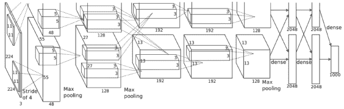

图2.8：AlexNet架构。值得注意的是，虽然描述建议采用双流体系结构，但实际上它是单流体系结构，这种描述仅反映了AlexNet在2个不同的GPU上并行训练的事实。图[88]再版。

AlexNet的出现导致试图通过可视化了解网络正在学习什么的论文数量急剧增加，如所谓的DeConvNet [154]，或者通过对各种架构的系统探索[22,23]。这些探索的直接结果之一是认识到更深的网络可以实现更好的结果，如19层深VGG-Net中首次证明的那样[135]。 VGG-Net通过简单堆叠更多层来实现其深度，同时遵循AlexNet引入的标准实践（_，例如_。依靠ReLU非线性和数据增强技术进行更好的培训）。在VGG-Net中呈现的主要新颖性是使用空间范围较小的滤波器（_即_。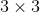在整个网络中过滤而不是_，例如_。在AlexNet中使用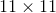过滤器），它允许增加深度而不会显着增加网络需要学习的参数数量。值得注意的是，在使用较小的过滤器时，VGG-Net每层需要更多的过滤器。

VGG-Net是遵循AlexNet的许多深度ConvNet架构中的第一个也是最简单的。后来提出了一个更深层的架构，通常称为GoogLeNet，有22层[138]。由于使用了所谓的初始模块（如图2.9（a）所示）作为构建块，因此GoogLeNet比VGG-Net更深，所需参数要少得多。在初始模块中，各种尺度的卷积运算和空间池并行发生。该模块还增加了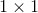卷积（_，即_。跨通道池），用于降低维数以避免或衰减冗余过滤器，同时保持网络的大小可管理。这种跨渠道汇集的想法是由以前的一项名为网络网络（NiN）[96]的研究结果推动的，该研究揭示了学习网络中的大量冗余。堆叠许多初始模块导致现在广泛使用的GoogLeNet架构如图2.9（b）所示。

|  |
| （一个） |
| 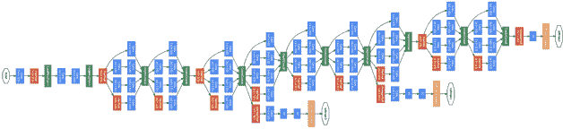 |
| （b）中 |

图2.9：GoogLeNet架构。 （a）典型的初始模块，显示顺序和并行发生的操作。 （b）典型“初始”架构的图示，其包括堆叠许多初始模块。图[......]转载

GoogLeNet是第一个偏离简单堆叠卷积和汇集层的策略的网络，很快就出现了迄今为止最深层的架构之一，称为ResNet [64]，它还提出了一个超过150层的新架构。 ResNet代表剩余网络，主要贡献在于它依赖于剩余学习。特别是，构建ResNet使得每个层在输入之上学习增量变换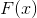，根据

（2.15）

而不是像其他标准ConvNet架构那样直接学习转换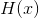。这种剩余学习是通过使用跳过连接来实现的，如图2.10（a）所示，它使用身份映射连接不同层的组件。信号的直接传播在反向传播期间对抗消失的梯度问题，从而能够训练非常深的架构。

| 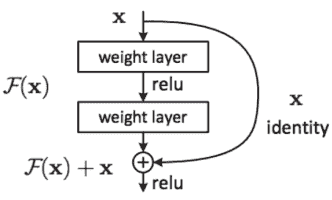 |
| (a) |
| 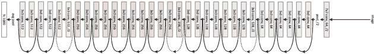 |
| (b) |

图2.10：ResNet架构。 （a）剩余模块。 （b）典型ResNet架构的图示，包括堆叠许多剩余模块。图[64]转载。

最近，一个关于ResNet成功的密切相关的网络就是所谓的DenseNet [72]，它进一步推动了剩余连接的概念。在DenseNet中，每个层通过跳过连接连接到密集块的所有后续层，如图2.11所示。具体地，密集块将所有层与相同大小的特征图连接（_，即空间池层之间的_。块）。与ResNet不同，DenseNet不会添加前一层的特征映射（2.15），而是连接特征映射，以便网络根据以下内容学习新的表示。

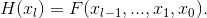（2.16）

作者声称，这种策略允许DenseNet在每一层使用更少的过滤器，因为通过将在一层提取的特征推送到层次结构中更高层的其他层，可以避免可能的冗余信息。重要的是，这些深度跳过连接允许更好的梯度流，因为较低层可以更直接地访问损耗函数。使用这个简单的想法，DenseNet可以与其他深层架构竞争，例如ResNet，同时需要更少的参数并减少过度拟合。

| 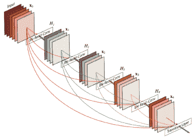 |
| (a) |
| 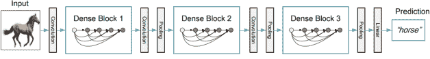 |
| (b) |

图2.11：DenseNet架构。 （a）密集的模块。 （b）典型的DenseNet架构的图示，该架构包括堆叠许多密集模块。图[72]再版。