#### 2.2.2走向ConvNet不变性

使用ConvNets的挑战之一是需要非常大的数据集来学习所有基础参数。即使像ImageNet [126]这样拥有超过一百万张图像的大型数据集也被认为太小而无法训练某些深层架构。处理大数据集要求的一种方法是通过例如随机翻转，旋转和抖动来改变图像来人为地增加数据集。这些增强的主要优点是所得到的网络对各种变换变得更加不变。事实上，这项技术是AlexNet取得巨大成功背后的主要原因之一。因此，除了改变网络架构以便于培训的方法之外，如前一节所述，其他工作旨在引入能够产生更好培训的新型构建模块。具体而言，本节讨论的网络引入了新的块，这些块直接包含来自原始数据的学习不变表示。

一个明确解决不变性最大化的着名ConvNet是空间变压器网络（STN）[76]。特别地，该网络利用了一种新的学习模块，该模块增加了对不重要的空间变换的不变性，_，例如_。在物体识别过程中由不同视点产生的那些。该模块由三个子模块组成：定位网，网格生成器和采样器，如图2.12（a）所示。执行的操作可以分为三个步骤。首先，定位网络（通常是一个小的2层神经网络）将一个特征图作为输入，并从该输入中学习变换参数。例如，转换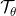可以定义为一般的仿射变换，允许网络学习翻译，缩放，旋转和剪切。其次，给定变换参数和预定义大小的输出网格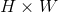，网格生成器为每个输出坐标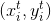计算应从输入中采样的相应坐标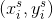，，根据

（2.17）

最后，采样器采用特征图和采样网格，并插入像素值，以填充位置的输出特征图，如图2.12所示（b） ）。在任何ConvNet架构的每一层添加此类模块，使其能够从输入中自适应地学习各种变换，以增加其不变性，从而提高其准确性。

| 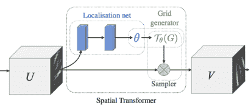 | 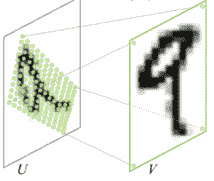 |
| （一个） | （b）中 |

图2.12：空间变压器网络运营。 （a）空间变换器模块的描述，典型的变换操作在（b）中示出。图[〜]复制。

为了增强ConvNets的几何变换建模能力，两种现代方法，即Deformable ConvNet [29]和Active ConvNet [78]，引入了灵活的卷积块。这些方法的基本思想是避免在卷积过程中使用刚性窗口，以有利于学习进行卷积的感兴趣区域（RoI）。这个想法类似于空间变换器模块的定位网络和网格生成器所做的事情。为了确定每层的RoI，修改卷积块以使其从初始刚性卷积窗口学习偏移。具体来说，从在给定的刚性窗口上的卷积运算的标准定义开始

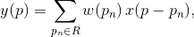（2.18）

其中是执行卷积的区域，是区域内的像素位置，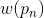是相应的滤波器权重，添加新术语以包括根据的偏移量

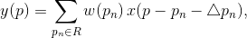（2.19）

其中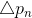是偏移量，现在最终的卷积步骤将在变形窗口上执行，而不是传统的刚性窗口。为了学习偏移量，可以修改可变形ConvNets的卷积块，使其包含一个新的子模块，其作用是学习偏移，如图2.13所示。与可交替学习子模块参数和网络权重的空间变换器网络不同，可变形控制器可同时学习权重和偏移，从而使其在各种体系结构中的部署速度更快，更容易。

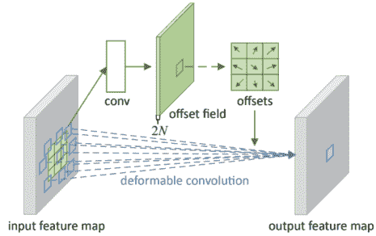

图2.13：可变形或主动卷积。从固定的窗口大小开始，网络通过一个小的子网络（在图的顶部显示为绿色）学习偏移，最后在变形的窗口上执行卷积。图[29]再版。

#### 2.2.3走向ConvNet本地化

除了简单的分类任务，例如对象识别，最近ConvNets在需要精确定位的任务中也表现出色，例如语义分割和对象检测。用于语义分割的最成功的网络是所谓的完全卷积网络（FCN）[98]。顾名思义，FCN没有明确地使用完全连接的层，而是将它们转换为卷积层，其感知域覆盖整个底层特征映射。重要的是，网络学习上采样或反卷积滤波器，恢复最后一层图像的完整分辨率，如图2.14所示。在FCN中，通过将问题转换为密集像素分类来实现分割。换句话说，softmax层附加到每个像素，并且通过对属于相同类的像素进行分组来实现分割。值得注意的是，在这项工作中报告说，在上采样步骤中使用来自架构的较低层的特征起着重要作用。它允许更精确的分割，因为较低层特征倾向于捕获更细粒度的细节，与分类相比，这对于分割任务而言更为重要。学习反卷积滤波器的替代方法依赖于使用atrou或扩张卷积[24]，_，即_。上采样稀疏滤波器，有助于恢复更高分辨率的特征映射，同时保持可学习的参数数量可管理。

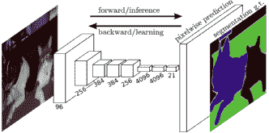

图2.14：完全卷积网络。在上采样以在最后一层恢复图像全分辨率之后，使用softmax对每个像素进行分类以最终生成片段。图[98]再版。

在对象本地化方面，ConvNet框架中最早的方法之一被称为Region CNN或R-CNN。该网络将区域提议方法与ConvNet架构相结合[53]。尽管R-CNN是围绕简单的想法而建立的，但它产生了最先进的物体检测结果。特别地，R-CNN首先使用用于区域提议的现成算法（_，例如_。选择性搜索[140]）来检测可能包含对象的潜在区域。然后将这些区域扭曲以匹配所使用的ConvNet的默认输入大小，并将其馈送到ConvNet以进行特征提取。最后，每个区域的特征用SVM分类，并在后处理步骤中通过非最大抑制进行细化。

在其天真的版本中，R-CNN简单地使用ConvNets作为特征提取器。然而，它的突破性结果带来了改进，更多地利用了ConvNets的强大代表性。例如，快速R-CNN [52]，更快的R-CNN [116]和掩模R-CNN [61]。快速R-CNN ，提出通过网络传播独立计算区域提议，以提取最后一个特征映射层中的相应区域。这种技术避免了从图像中提取的每个区域的昂贵的网络传输。此外，快速R-CNN避免了重载 - 处理步骤通过改变网络的最后一层，使其学习对象类和精炼的边界框坐标。重要的是，在R-CNN和快速R-CNN中，检测瓶颈在于区域提议步骤，该步骤是在ConvNet范例。

更快的R-CNN通过在ConvNet的最后一个卷积层之后添加称为区域提议网络（RPN）的子模块（或子网络）来进一步推动使用ConvNets。 RPN模块使网络能够学习区域提议，作为网络优化的一部分。具体来说，RPN被设计为一个小的ConvNet，由卷积层和一个小的完全连接层组成，两个输出返回潜在的物体位置和物体分数（_，即_。属于一个物体类的概率）。按照迭代的两步程序完成整个网络的培训。首先，使用RPN单元优化网络以进行区域建议提取。其次，保持提取的区域提议固定，网络被微调用于对象分类和最终对象边界框位置。最近，引入掩模R-CNN以增强更快的R-CNN，其具有分割检测区域的能力，从而在检测到的物体周围产生紧密掩模。为此，掩码R-CNN将分段分支添加到更快的R-CNN的分类和边界框回归分支。特别是，新分支实现为一个小FCN，它被优化用于将任何边界框中的像素分类为两个类中的一个;前景或背景。图2.15说明了从简单的R-CNN到屏蔽R-CNN的差异和进展。

| 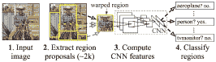 | 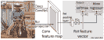 |
| (a) | (b) |
| 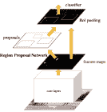 | 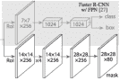 |
| （C） | （d） |

图2.15：突出区域提案网络的进展情况。 （a）原始R-CNN的结构。图[...]转载。 （b）快速R-CNN的结构。图[...]转载。 （c）更快的R-CNN的结构。从[116]再现的图。（d）掩模R-CNN的结构。图[〜]复制。