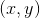
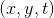
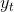
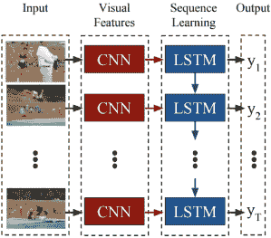
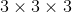
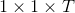
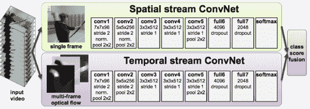

### 2.3时空卷积网络

通过使用ConvNets为各种基于图像的应用程序带来的显着性能提升，如第2.2节所述，引发了对将2D空间ConvNets扩展到用于视频分析的3D时空ConvNets的兴趣。通常，文献中提出的各种时空架构只是试图将2D架构从空间域扩展到时域。在基于训练的时空ConvNets领域，有三种不同的建筑设计决策是突出的：基于LSTM（_例如_。[112,33]），3D（_例如_。[139] ，84]和双流会议（_，例如_。[134,43]），将在本节中描述。

#### 2.3.1基于LSTM的时空ConvNet

基于LSTM的时空转换，_，例如_。 [112,33]是将2D网络扩展到时空处理的早期尝试。他们的操作可以分为三个步骤，如图2.16所示。首先，使用2D网络处理每个帧，并从其最后一层提取特征向量。其次，这些来自不同时间步骤的特征然后被用作产生时间结果的LSTM的输入，。第三，然后将这些结果平均或线性组合并传递给softmax分类器以进行最终预测。

图2.16：基于LSTM的时空ConvNet示例。在该网络中，输入包括来自视频流的连续帧。图[33]再版。

基于LSTM的ConvNets的目标是逐步整合时态信息，同时不受限于严格的输入大小（暂时）。这种架构的一个好处是使网络能够生成可变大小的文本描述（_，即_ .LSTMs优秀的任务），如[33]中所做的那样。然而，虽然LSTM可以捕获全局运动关系，但它们可能无法捕获更精细的运动模式。此外，这些模型通常较大，需要更多数据，因此难以训练。迄今为止，除了正在整合视频和文本分析的情况（_，例如_。[33]），LSTM通常在时空图像分析中取得了有限的成功。

#### 2.3.2 3D ConvNet

第二种突出类型的时空网络为标准2D ConvNet处理提供了最简单的图像时空概括。它直接与RGB图像的时间流一起工作，并通过应用学习的3D，，卷积滤波器对这些图像进行操作。这种泛化形式的一些早期尝试使用过滤器，这些过滤器延伸到具有非常浅的网络的时间域[80]或仅在第一卷积层[84]。当仅在第一层使用3D卷积时，在每3或4个连续帧上应用小抽头时空滤波器。为了捕获更长距离的运动，并行使用多个这样的流，并且由堆叠这样的流产生的层级增加了网络的时间接收场。但是，由于时空滤波仅限于第一层，因此这种方法与基于朴素帧的2D ConvNets应用相比没有产生显着的改进。现在广泛使用的C3D网络提供了更强的泛化，它在所有层使用3D卷积和汇集操作[139]。 C3D从2D到3D架构的直接推广需要大量增加要学习的参数数量，这可以通过在所有层使用非常有限的时空支持来补偿（_即_。卷积）。最近略有不同的方法提出通过修改ResNet架构[64]来集成时间过滤，以成为时间ResNet（T-ResNet）[42]。特别是，T-ResNet使用滤波器增加剩余单位（如图2.10（a）所示），该滤波器沿时间维度应用一维学习滤波操作。

最终，此类3D ConvNet架构的目标是在整个模型中直接集成时空滤波，以便同时捕获外观和运动信息。这些方法的主要缺点是其参数数量的增加。

#### 2.3.3双流ConvNet

第三种类型的时空架构依赖于双流设计。标准的双流结构[134]，如图2.17所示，在两个平行路径中运行，一个用于处理外观，另一个用于运动，类似于生物视觉系统研究中的双流假设[55]。输入到外观路径是RGB图像;输入到运动路径是光流场的堆栈。基本上，每个流都使用相当标准的2D ConvNet架构单独处理。每个途径进行单独分类，后期融合用于实现最终结果。原始双流网络的各种改进遵循相同的基本思想，同时为各个流使用各种基线架构（_，例如_。[43,443,144]）或提出连接两个流的不同方式（_例如_。[43,40,41]）。值得注意的是，最近的工作称为I3D [20]，建议通过在两个流上使用3D卷积来使用3D滤波和双流架构。然而，除了网络在基准动作识别数据集上获得稍好的结果之外，作者还没有提出令人信服的论据来支持除3D过滤之外的冗余光流流的需求。

图2.17：原始的双流网络。网络将RGB帧和光流堆栈作为输入。图[134]转载。

总体而言，双流控制系统支持外观和运动信息的分离，以便了解时空内容。值得注意的是，这种架构似乎是时空ConvNets中最受欢迎的，因为它的变化导致了各种动作识别基准的最新结果（_，例如_。[43,40,41,144]） 。

### 2.4总体讨论

多层表示一直在计算机视觉中发挥重要作用。实际上，即使是标准广泛使用的手工制作的特征，如SIFT [99]，也可以看作浅层多层表示，松散地说，它包括卷积层，然后是汇集操作。此外，前ConvNet最先进的识别系统通常遵循手工制作的特征提取与（学习的）编码，然后是空间组织的池和学习的分类器[_，例如_。[39]），也是一种多层代表性方法。现代多层体系结构推动了分层数据表示的思想更深层次，同时通常避开手工设计的特征，转而采用基于学习的方法。在计算机视觉应用方面，ConvNets的特定架构使它们成为最具吸引力的架构之一。

总的来说，虽然处理多层网络的文献非常庞大，每个派系都提倡一种架构优于另一种架构，但已经出现了一些常见的“最佳实践”。突出的例子包括：大多数架构依赖于四个常见构建块（_即_。卷积，整流，规范化和池化），深度架构与小型支持卷积内核的重要性，以实现具有可管理数量的抽象参数，残余连接以应对学习过程中误差梯度传播的挑战。更一般地，文献同意关键点，输入数据的良好表示是分层的，如前面几个贡献中所述[119]。

重要的是，虽然这些网络在许多计算机视觉应用中取得了竞争性成果，但它们的主要缺点依然存在：对学习表示的确切性质的理解有限，对大量训练数据集的依赖性，缺乏支持精确性能界限的能力以及缺乏关于网络超参数选择的清晰度。这些选择包括滤波器大小，非线性选择，池功能和参数以及层数和架构本身。在ConvNets“构建块”的背景下，其中几个选择背后的动机将在下一章中讨论。