## 第3章了解ConvNets构建块

鉴于ConvNets领域中过多的未解答的问题，本章研究了典型卷积网络中每层处理的作用和重要性。为此，将审查处理这些问题的最突出的努力。特别是，各种ConvNet组件的建模将从理论和生物学角度进行介绍。每个组成部分的介绍以讨论结束，总结了我们目前的理解水平。

### 3.1卷积层

可以说，卷积层是ConvNet架构中最重要的步骤之一。基本上，卷积是线性的移位不变运算，包括在输入信号上执行局部加权组合。根据所选择的权重集（_，即_。所选择的点扩展函数），显示输入信号的不同属性。在频域中，点扩散函数的相关性是调制函数，其告知如何通过缩放和相移来修改输入的频率分量。因此，选择正确的内核来捕获输入信号中包含的最重要和最重要的信息是至关重要的，这些信息允许对信号内容做出强有力的推断。本节讨论了处理内核选择步骤的一些不同方法。

#### 3.1.1生物学观点

在mamalian视觉皮层中进行分层处理的神经生理学证据为空间和时空ConvNets提供了潜在的启发。特别是，假设一系列简单和复杂细胞逐渐提取视觉输入的更抽象属性的研究[74]特别重要。在视觉皮层处理的最早阶段，简单细胞显示出能够检测原始特征，例如定向光栅，条形和边缘，在后续阶段出现更复杂的调谐。

用于对皮质简单细胞的所述特性进行建模的流行选择是一组定向的Gabor滤波器或各种尺度的高斯导数。更一般地，在该处理级别选择的滤波器通常是定向带通滤波器。几十年后，大多数生物模型仍然依赖于层次结构初始层的同一组简单单元[117,130,131,79,5,48]。事实上，这些相同的Gabor核也被扩展到色彩[155]和时间[79]域，分别解释了颜色和运动敏感神经元。

然而，当涉及在视觉皮层的更高区域表示细胞时，问题变得更加微妙，并且在Hubel和Wiesel的工作上建立的大多数贡献都在努力寻找这些区域的适当表示。 HMAX模型是解决这个问题的最着名的模型之一[117]。 HMAX模型的主要思想是通过组合来自先前层的滤波器获得层次结构的较高层处的滤波器，使得较高层处的神经元响应先前神经元的共激活。这种方法最终应该允许模型在更高层响应越来越复杂的模式，如图3.1所示。这种方法与Hebbian理论很好地相关，即“一起发射，连接在一起的细胞”[65]。

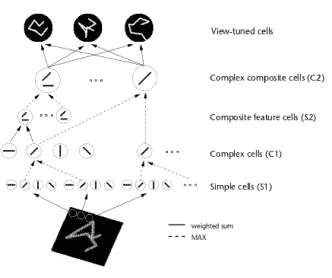

图3.1：HMAX模型的图示。该模型由具有交替的简单（）和复杂（）细胞的细胞层次组成。过滤操作发生在单元的级别。在该图中显示，初始层的简单细胞（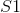）通过使用定向Gabor过滤器检测简单定向条（_，即_。）。另一方面，较高层的简单单元（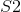）响应模板的过滤，模板是前一个（）层使用的过滤器组合，这样层次结构中较高层的单元检测到比定向更复杂的形状酒吧。复合复合单元（C1，C2）介于简单单元层之间，以跨越空间位置聚集类似调谐的单元，从而实现一定程度的移位不变性。图[......]转载。

HMAX模型的另一个标志是假设学习发挥作用以便识别相似视觉序列的各种观点。此后该工作的直接扩展明确地介绍了学习在更高层建模过滤器。最成功的此类方法之一是由Serre _等人_引入的生物学动机网络。 [131]试图模拟在视觉皮层的初始层发生的过程，其中由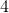层组成的网络，其中简单（）和复杂（）细胞交替，如图3.2所示。可以看出，每个简单细胞后面都是复杂细胞，因此网络的整体结构可以概括为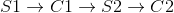。在这个网络中，卷积发生在和单元的层面。虽然单元依赖于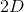导向的Gabor滤波器，但第二层使用的内核基于学习组件。这种选择的动机是生物学证据表明学习发生在皮层的较高层[130]，尽管也有证据表明学习在视觉皮层的早期层面起作用[11]。在这种情况下，学习过程对应于从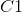层的训练集中选择随机的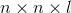补丁，其中是补丁的空间范围，对应到方向的数量。 层特征图是通过在每个尺度中的特征与所有方向上的学习补丁的同时执行模板匹配而获得的。

视频处理[79]存在对这项工作的直接扩展。用于视频处理的内核旨在模拟背侧流中细胞的行为。在这种情况下，单元涉及具有3D定向滤波器的卷积。特别地，使用三阶高斯导数滤波器，因为它们具有良好的可分离性，并且采用类似的学习过程来为和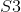单元选择卷积核。

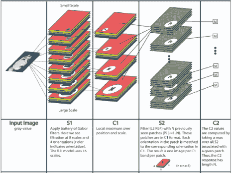

图3.2：Serre _等_提出的网络架构。与HMAX模型[117]类似，它由交替的简单和复杂小区组成，因此所提出的网络的总体架构可以概括为。然而，与HMAX模型相反，在训练集中明确地学习在S2单元级别使用的模板，使得该层检测复杂对象（_，即_。当用对象识别数据集训练时）。该过程的细节总结在该图的第二行。图[131]转载。

已经提出了上述基本思想的许多变化，包括更高层的各种学习策略[147,145]，基于小波的滤波器[71]，不同的特征稀疏化策略[73,147,110]和滤波器参数的优化[147， 107]。

另一个相关但有些不同的思路表明，在层次结构的更高层次上存在更复杂的单元，这些单元专用于捕获中间形状表示，_，例如_。曲率[120,121]。虽然HMAX类模型通过来自先前层的特征类型的组合建议建模形状，但是这些研究提出了一种直接模拟超复杂细胞（也称为终止细胞）而不求助于学习的方法。特别地，属于该范例模型的模型通过简单和复杂细胞的组合来复杂化细胞以产生新细胞，其能够最大程度地响应不同程度和符号的曲率以及不同位置处的不同形状。在建议超复杂细胞进行曲率计算时，这项工作建立在早期工作的基础上，这些工作表明了类似的功能，_，例如_。 [32]。

另一个研究机构，主张在视觉皮层中发生的分层处理（称为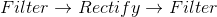）逐步处理高阶图像结构[5,48,108]。因此提倡在第一层（_，即_取向的带通滤波器）存在的同一组核在较高层重复。然而，假设相同的内核集合现在对从前一层获得的不同输入进行操作，则每层的处理揭示了输入信号的不同属性。因此，在连续层提取的特征从简单和局部变为抽象和全局，同时捕获更高阶的统计。此外，联合统计也通过跨不同尺度和方向的分层响应的组合来解释。

##### 讨论

人类视觉皮层在识别世界的同时对各种变化保持不变的能力一直是该领域许多研究人员的驱动力。尽管已经提出了几种方法和理论来模拟视觉皮层的不同层，但是跨越这些努力的共同点是存在将视觉任务分成更小块的分层处理。然而，虽然大多数模型都同意初始层的内核集合的选择，但是由Hubel和Wiesel [74]的开创性工作推动，负责识别更抽象特征的建模区域似乎更复杂和有争议。此外，这些生物学上合理的模型通常会对其设计决策的理论基础留下开放的关键问题。这个缺点也适用于更多的理论驱动模型，将在下一节中讨论。

#### 3.1.2理论视角

更多的理论驱动方法通常受到生物学的启发，但努力为其模型注入更多的理论依据。这些方法通常根据其内核选择策略而有所不同。

查看内核选择问题的一种方法是考虑自然界中的对象是一组原始形状的集合，从而采用基于形状的解决方案[47,45,46]。在这种情况下，所提出的算法首先使用一组定向Gabor滤波器在图像中找到最原始的形状（_，即_。定向边缘）。使用这些边缘，或更一般地说是部分，算法通过查看每个部分周围越来越大的邻域来找到下一层中的部分的潜在组合。基本上，每次向网络呈现新图像时，收集关于在前一层中给定部分的直接邻域中存在其他部分类型的投票。在网络看到训练集中存在的所有图像之后，使用来自前一层的部分的组合来构建网络的每个层。组合的选择基于在无监督训练期间学习的概率。实际上，这种基于形状的方法更多地是概念证明，其中只有层级的较低层可以以这种无监督的方式学习，而较高层是使用类别特定图像学习的，如图3.3所示。因此，只有当网络仅从该对象类中看到示例时，才能在更高层中获得对象的良好表示。但是，由于这种限制，这种算法无法合理地部署在具有以前未曾见过的不同类别的对象的更具挑战性的数据集上。

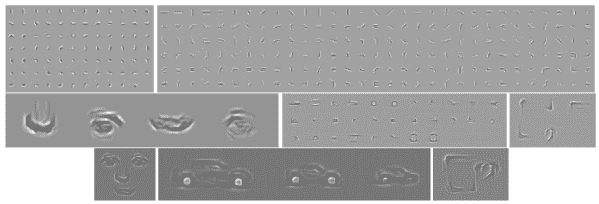

图3.3：由Fidler _等_提出的多层结构学习的样本部分。第1行（从左到右）：第2层和第3层样本部分。第2行和第3行：使用面部，汽车和马克杯学习第4层和第5层部分。图[......]转载。

内核选择过程的另一个展望是基于许多基于训练的卷积网络学习冗余过滤器的观察。此外，在这些网络的前几层中的许多学习过滤器类似于定向带通滤波器; _例如_。见图3.8。因此，最近的一些调查旨在将先验注入其网络设计中，特别关注卷积滤波器选择。一种方法提出在2D导数算子[75]的基础集上学习分层滤波器，如图3.4所示。虽然此方法使用固定基础的滤波器集，但它依赖于监督学习来在每个层的基础中线性组合滤波器以产生有效的分层滤波器，因此它与数据集相关。尽管如此，使用一组过滤器和学习组合可以很好地与生物模型保持一致，例如HMAX [117]及其后继者（_，例如_。[131,79]），并简化网络“架构，同时另外，由于学习是现代ConvNets的瓶颈之一，使用基础集也可以通过极大地减少要学习的参数数量来简化这一过程。由于这些原因，这些方法在最近的文献中越来越受欢迎[75] ，28,148,100,158]。

有趣的是，跨越这些最近努力的共同点是减少冗余内核的目标，特别注重建模旋转不变性（尽管它不一定是生物视觉的属性）。关注旋转的动机是观察到，通常，学习过滤器是彼此的旋转版本。例如，一项工作通过对一组圆谐波进行训练来有针对性地学习旋转等效[148]。或者，其他方法试图通过改变网络结构本身来硬编码旋转不变性，使得对于每个学习的滤波器，直接基于预定义的一组取向_例如_自动生成一组对应的旋转版本。 [158]，或者通过将每个学习的滤波器与定向Gabor滤波器的基组进行卷积[100]。

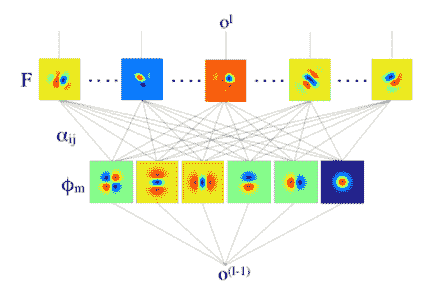

图3.4：接收域CNN（也称为RFNN）的示意图。在该网络中，所有层使用的滤波器（通过学习）构建为基本滤波器组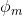的线性组合，其是一组阶高斯导数。该网络不是学习过滤器的内核参数，而是学习用于线性组合基组中的过滤器的参数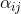。图[〜]复制。

其他方法通过将内核选择问题作为基于群论的_例如_的不变性最大化问题，通过完全手工制作其网络，进一步推动将先验注入其网络设计的想法。 [15,113,28]。例如，可以选择内核，使得它们最大化对小变形和变换的不变性，以进行纹理识别[15]或最大化对象识别的旋转不变性[113]。

可以说，散射变换网络（ScatNet）具有迄今为止最严格的数学定义之一[15]。散射变换的构造从断言开始，即根据手头的任务，良好的图像表示应该对小的局部变形和各种变换组不变。此方法中使用的内核是一组扩张和旋转的小波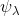，其中是小波的频率位置，定义为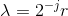，其中表示扩张，表示旋转。网络由卷积层次构成，使用以不同频率为中心的各种小波，以及下一节中讨论的各种非线性。所选择的内核的频率位置选择为在每层较小。整个过程总结在图3.5中。

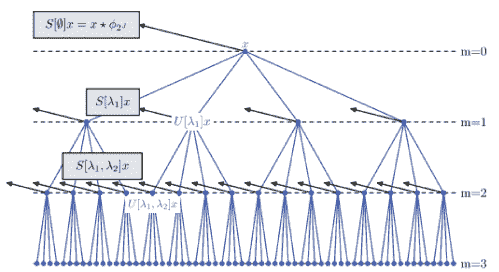

图3.5：散射变换网络。在该网络中，[15]中提出的散射变换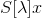在来自前一层的所有输出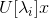的每一层上重复应用。实质上，每层的输出反复进行相同的变换，然而，变换针对每层的不同有效频率，从而在每一层提取新的信息。在该图中，具有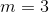层的网络的实例化被描绘为图示。图[15]转载。

一个名为SOE-Net的相关ConvNet被提议用于时空图像分析[60]。 SOE-Net依赖于理论动机，分析定义的过滤器。特别是，它的卷积块依赖于一组3D定向高斯导数滤波器，这些滤波器在遵循类似于ScatNet的频率减小路径时重复应用，如图3.6所示。然而，在这种情况下，网络设计是根据时空定向分析进行的，并且通过所使用的基组的多尺度实例化来实施不变性。

松散地说，SOE-Net和ScatNet都属于某些基于生物学模型所倡导的范式[5]。由于这些网络基于严格的数学分析，因此在每层处理时，它们还会考虑信号的频率成分。这种设计的直接结果之一是能够做出关于网络中使用的层数的理论驱动决策。特别地，假设使用频率减小路径计算网络的不同层的输出，则信号最终衰减。因此，一旦信号中剩余的能量很少，就停止迭代。此外，通过选择允许有限基组（高斯导数）的滤波器，SOE-Net可以分析地指定所需的方向数。

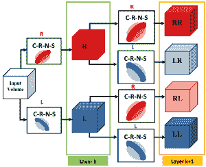

图3.6：SOE-Net架构。使用初始处理层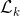提取各种方向的局部时空特征。 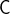 - 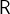 - 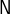 - 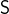表示卷积，整流，归一化和时空汇集，而R和L表示向右和向左滤波数据，分别为符号串（_，例如_ ]。LR）表示多次过滤。仅示出了具有2个滤波器（_，即_ .2方向）的网络用于说明。层处的每个特征图被视为新的单独信号并被反馈到层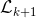以与同一组滤波器卷积，但由于时空池而具有不同的有效分辨率。图[〜]复制。

内核选择过程的另一个简单而强大的前景依赖于使用PCA学习的预先固定的过滤器[21]。在这种方法中，有人认为PCA可以被视为最简单的自动编码器类，可以最大限度地减少重建误差。只需在整个训练数据集上使用PCA学习过滤器。特别地，对于每个图像中的每个像素，拍摄尺寸为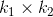的贴片并进行去义操作以产生一组贴片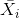。来自每个图像的这种重叠贴片的集合被堆叠在一起以形成体积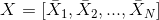。使用的滤波器对应于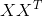的第一个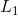主特征向量。将这些载体重新整形以形成大小的核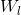并与每个输入图像卷积以获得特征图。对于网络的更高层重复相同的过程。

与ScatNet [15]和SOE-Net [60]相比，PCA方法的工作在数学上要少得多，并且更多地依赖于学习。然而，值得强调的是，最基本的自动编码器形式能够在包括人脸识别，纹理识别和物体识别在内的多个任务上获得可观的结果。一种密切相关的方法也依赖于通过k均值聚类学习的无监督内核选择[35]。再一次，尽管与基于标准学习的体系结构相比，这种方法不会产生最先进的结果，但值得注意的是，即使在像MNIST这样经过深入研究的数据集上，它仍然具有竞争力[91]。更一般地说，这种纯无监督方法的有效性表明存在可以简单地从数据的固有统计数据中利用的非平凡信息。

##### 3.1.2.1最佳内核数量

如前所述，多层体系结构的最大瓶颈是学习过程需要大量的训练数据，这主要是由于需要学习大量参数。因此，仔细设计网络架构并确定每层的内核数量至关重要。不幸的是，即使是手工制作的ConvNets通常也会随机选择内核数量（_，例如_。[15,113,131,79,21,45]）。先前讨论的分析定义的ConvNets中的一个例外是SOE-Net，其如前所述，由于其使用有限基组（_，即_。取向的高斯导数）而分析地指定滤波器的数量。

最近建议使用基组来减少每层内核数量的方法[75,28]提供了解决这个问题的优雅方法，尽管过滤器集的选择和集合中的过滤器数量很大基于经验考虑。解决此问题的其他最突出的方法旨在在培训过程中优化网络架构。处理这种优化问题的简单方法，称为最佳脑损伤[92]，是从合理的架构开始，逐步删除小幅度参数，其删除不会对训练过程产生负面影响。更复杂的方法[44]基于印度自助餐过程[59]。通过训练网络以最小化作为三个目标的组合的损失函数来确定最佳滤波器数量

（3.1）

其中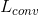是卷积层的数量，是层的总数。在（3.1）中，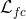和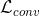分别是完全连接和卷积层的无监督损失函数。他们的作用是尽量减少重建错误，并使用未标记的数据进行培训。相比之下，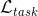是为目标任务设计的监督损失函数，并且经过训练以使用标记的训练数据最大化分类准确度。因此，通过最小化重建误差和任务相关的损失函数来调整每层中的滤波器的数量。该方法允许所提出的网络使用标记和未标记的数据。

实际上，三种损失函数可以最小化。首先，滤波器参数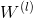是固定的，并且使用所有可用训练数据（即标记和未标记），使用Grow-And-Prune（GAP）算法学习滤波器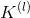的数量。其次，通过使用标记的训练数据最小化任务特定的损失函数来更新滤波器参数。 GAP算法可以描述为双向贪心算法。正向传递增加了滤波器的数量。反向传递通过删除冗余过滤器来减小网络大小。

##### Discussion

总的来说，大多数理论驱动的卷积核选择方法旨在将先验引入其层次表示中，最终目标是减少对大规模训练的需求。在这样做时，这些方法或者依赖于通过基于群论的方法最大化不变性，或者依赖于基组上的组合。有趣的是，类似于更具生物学启发的实例化，通常还观察到存在明显倾向于使用具有定向带通滤波器外观的滤波器对早期层进行建模。然而，更高层“内核”的选择仍然是一个开放的关键问题。