### 3.2整改

多层网络通常是高度非线性的，并且整流通常是将非线性引入模型的第一阶段处理。整流是指将点状非线性（也称为激活函数）应用于卷积层的输出。该术语的使用借鉴了信号处理，其中整流是指从交流到直流的转换。这是另一个处理步骤，从生物学和理论点观点中找到动机。计算神经科学家引入整流步骤，以寻找最佳解释手头神经科学数据的适当模型。另一方面，机器学习研究人员使用整改来获得学习更快更好的模型。有趣的是，两个研究流程都倾向于同意，不仅仅是需要纠正，而且它们也趋同于同一类型的整改。

#### 3.2.1生物学观点

从生物学的角度来看，整流非线性通常被引入到神经元的计算模型中，以便解释它们作为输入函数的激发率[31]。生物神经元的射击率一般被广泛接受的模型被称为漏泄积分和火（LIF）[31]。该模型解释了任何神经元的输入信号必须超过某个阈值才能使细胞发射。研究视皮层细胞的研究也特别依赖于类似的模型，称为半波整流[74,109,66]。

值得注意的是，Hubel和Wiesel的开创性工作已经证明，简单单元包括线性滤波后半波整流的非线性处理[74]。如前面3.1节所述，线性算子本身可以被认为是卷积运算。众所周知，根据输入信号，卷积可以产生正或负输出。然而，实际上细胞的“放电速率是定义为正。这就是为什么Hubel和Wiesel建议采用剪切操作形式的非线性，只考虑正反应。更符合LIF模型，其他研究建议略有不同的半波整流，其中削波操作基于某个阈值（_即_。除了零之外）[109]。另一个更完整的模型也考虑了可能出现的负面反应在这种情况下，作者提出了一种双路半波整流方法，其中正负输入信号分别被截断并在两条不同的路径中传输。另外，为了处理负数响应两个信号之后是逐点平方操作，因此整流被称为半平方（虽然生物神经元不一定共享这个属性）。在这个mo del将细胞视为编码正负输出的相反相的能量机制。

##### 讨论

值得注意的是，这些具有生物学动机的神经元激活功能模型已成为当今卷积网络算法的常见做法，并且部分地对其成功的大部分负责，这将在下面讨论。

#### 3.2.2理论观点

从理论的角度来看，机械学习研究人员通常会引入整改，主要有两个原因。首先，它通过允许网络学习更复杂的功能来用于增加提取的特征的区分能力。其次，它允许控制数据的数字表示以便更快地学习。历史上，多层网络依赖于使用逻辑非线性或双曲正切的逐点S形非线性[91]。虽然逻辑函数在生物学上更合理，因为它没有负输出，但更常使用双曲正切，因为它具有更好的学习性质，例如周围的稳态（见图3.7（a）和（b），分别）。为了说明双曲正切激活函数的负部分，通常后面是模数运算（也称为绝对值整流AVR）[77]。然而，最近由Nair _等_首次引入的整流线性单元（ReLU）。 [111]，很快成为许多领域的默认整流非线性（_，例如_。[103]），尤其是计算机视觉以来，它首次成功应用于ImageNet数据集[88]。在[88]中显示，与传统的S形整流功能相比，ReLU在过度拟合和加速训练过程中起着关键作用，即使在导致更好的性能的同时也是如此。

数学上，ReLU定义如下，

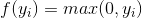（3.2）

并在图3.7（c）中描述。对于任何基于学习的网络，ReLU运营商有两个主要的理想属性。首先，由于正输入的导数为，因此ReLU不会对正输入饱和。这种特性使得ReLU特别具有吸引力，因为它消除了依赖于S形非线性的网络中通常存在的消失梯度的问题。其次，鉴于当输入为负时，ReLU将输出设置为，它引入了稀疏性，这有利于更快的训练和更好的分类准确性。实际上，为了改进分类，通常希望具有线性可分的特征，稀疏表示通常更容易分离[54]。然而，负输入的硬饱和度具有其自身的风险。这里有两个互补的问题。首先，由于硬零点激活，如果从未激活到这些部分的路径，则网络的某些部分可能永远不会被训练。其次，在退化的情况下，给定层的所有单元都有负输入，反向传播可能会失败，这将导致类似消失梯度问题的情况。由于这些潜在的问题，已经提出了对ReLU非线性的许多改进以更好地处理负输出的情况，同时保持ReLU的优点。

ReLU激活函数的变化包括漏泄整流线性单元（LReLU）[103]及其密切相关的参数整流线性单元（PReLU）[63]，它们在数学上被定义为

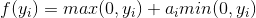（3.3）

并在图3.7（d）中描述。在LRelu中是固定值，而在PReLU中学习。最初引入LReLU是为了避免反向传播期间的零梯度，但没有显着改善测试网络的结果。此外，它在选择参数时严重依赖交叉验证实验。相比之下，PReLU在训练期间优化了该参数的值，从而提高了性能。值得注意的是，PReLU最重要的结果之一是网络中的早期层倾向于学习更高的参数值，而对于网络层次结构中的更高层，该数字几乎可以忽略不计。作者推测这个结果可能是由于在不同层次学习过滤器的性质。特别是，由于第一层内核通常是带状滤波器，所以响应的两个部分都保持不变，因为它们代表输入信号的潜在显着差异。另一方面，更高层的内核被调整为检测特定对象并且被训练为更加不变。

| 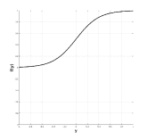 | 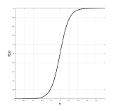 | 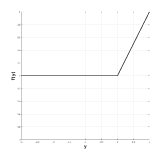 |
| （a）物流 | （b）tanh | （c）ReLU |
| 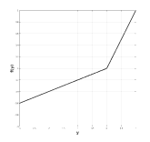 | 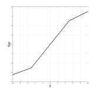 | 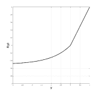 |
| （d）LReLU / PReLU | （e）SReLU | （f）EReLU |

图3.7：多层网络文献中使用的非线性校正函数。

有趣的是，基于类似的观察[132]提出了另一种整流功能，称为级联整流线性单元（CReLU）。在这种情况下，作者建议CReLU从观察开始，在大多数ConvNets的初始层学习的内核倾向于形成负相关对（_即_。过滤器度异相）如图所示在图3.8中。这一观察意味着ReLU非线性消除的负响应被相反相位的学习核所取代。通过用CReLU替换ReLU，作者能够证明设计用于编码双路径校正的网络可以带来更好的性能，同时通过消除冗余来减少要学习的参数数量。

图3.8：由ImageNet数据集训练的AlexNet学习的Conv1过滤器的可视化。图[132]转载。

ReLU系列的其他变化包括：S形整流线性单元（SReLU）[82]，定义为

（3.4）

并在图3.7（e）中描述，其被引入以允许网络学习更多的非线性变换。它由三个分段线性函数和4个可学习参数组成。 SReLU的主要缺点是它引入了几个要学习的参数（_，即_。特别是如果参数不在多个通道之间共享），这使得学习变得更加复杂。考虑到这些参数的错误初始化可能会损害学习，这种担忧尤其如此。另一种变体是指数线性单位（ELU）[26]，定义为

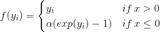（3.5）

并且如图3.7（f）所示，其动机是希望通过迫使信号饱和到由负输入的变量控制的值来增加噪声的不变性。 ReLU家族中所有变体的共同点是，也应该考虑负面输入并进行适当处理。

在散射网络[15]中提出了对整流非线性选择的另一种展望。如前面3.1节所述，ScatNet是手工制作的，其主要目标是增加表示对各种变换的不变性。由于它在卷积层中广泛依赖于小波，因此它对于小的变形是不变的;但是，它仍然适用于翻译。因此，作者依赖于定义为的积分运算

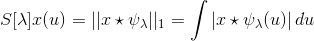（3.6）

并实现为平均合并，以增加移位不变性水平。因此，预期随后的汇集操作可以将响应推向零，_即_。在正响应和负响应相互抵消的情况下，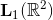范数运算符用于整流步骤以使所有响应为正。再一次，值得注意的是，依赖于双曲正切激活函数的传统ConvNets也使用类似的AVR校正来处理负输出[91,77]。此外，更多生物学动机模型，如半平方整流[66,67]，依赖于信号的逐点平方来处理负响应。该平方操作还允许在能量机制方面对响应进行推理。有趣的是，最近一个理论驱动的卷积网络[60]也提出了一个定义为两路径整流策略

（3.7）

其中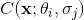是卷积运算的输出。该整流策略结合了保持滤波信号的两个相位和逐点平方的思想，从而允许在考虑光谱能量方面的结果信号的同时保护信号幅度和相位。

##### Discussion

有趣的是，从理论的角度来看，广泛的ReLU非线性明显成为整流阶段最受欢迎的选择。值得注意的是，完全忽略负输入（_即_。在ReLU中所做的）的选择似乎更值得怀疑，因为提出替代选择的许多贡献证明了这一点[103,63,82,26,132] ]。将ReLU的行为与ScatNet [15]和旧的ConvNet架构[77]中使用的AVR校正进行比较也很重要。虽然AVR保留了能量信息但是擦除了相位信息，但另一方面，ReLU通过仅保留信号的正部分来保持某种意义上的相位信息;然而，它不会保留能量，因为它会丢弃一半的信号。值得注意的是，尝试保留两者的方法（_，例如_ .CReLU [132]和在SOE-Net [60]中使用（3.7））能够在多个任务中获得更好的性能，并且这些方法是也与生物学研究结果一致[66]。