### 3.3规范化

如前所述，由于在这些网络中发生的非线性操作的级联，多层体系结构是高度非线性的。除了上一节中讨论的整流非线性之外，归一化是另一个非线性处理块，它在ConvNet架构中起着重要作用。 ConvNets中使用最广泛的标准化形式是所谓的Divisive Normalization或DN（也称为局部响应标准化）。本节阐述了归一化步骤的作用，并描述了它如何纠正前两个处理块（_，即_。卷积和整流）的一些缺点。再次从生物学和理论的角度讨论规范化的作用。

#### 3.3.1生物学观点

早期由神经生理学家提出标准化来解释视网膜中光适应的现象[13]，后来扩展到解释哺乳动物视皮层中神经元的非线性特性[66]。实际上，从生物学的角度来看，对标准化步骤的需求源于两个主要观察[67,66]。首先，虽然细胞反应被证明是刺激特异性的[74]，但也表明细胞反应可以相互抑制，并且存在交叉定向抑制现象，其中神经元对其优选刺激的反应被减弱。如果它与另一种无效的刺激叠加[67,14,19]。线性模型（卷积步骤中的_即_。）和前一节中讨论的不同形式的整流，例如计算神经科学家提出的半波整流，都没有解释这种交叉定向抑制和抑制行为。 。其次，虽然已知细胞响应在高对比度下饱和，但仅依赖于卷积和无界整流器（例如ReLU）的模型将具有随着对比度增加而不断增加的值。这两个观察结果表明，需要一个折扣其他刺激反应的步骤，以保持每个细胞的特异性，并使其对比不变，同时解释细胞的其他抑制行为。

处理这些问题的一种流行模型包括在数学上描述如下的分裂归一化块

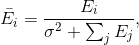（3.8）

其中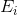是平方半波整流卷积运算的输出，汇集在一组方向和尺度上和是一个饱和常数，可以根据两种适应机制中的任何一种来选择[66] ]。在第一种情况下，从细胞的反应历史中学习的每个细胞可能是不同的值。第二种可能性是从所有细胞的反应统计数据中推导出来。这种分裂归一化方案丢弃了关于对比度大小的信息，有利于在归一化操作中，根据输入响应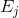的相对对比度对基础图像模式进行编码，（3.8）。使用该模型似乎可以很好地适应哺乳动物视皮层的神经元反应[67]。还表明它也很好地解释了交叉方向抑制现象[14]。

##### 讨论

有趣的是，大多数研究分裂归一化作用的研究表明，包括它的神经元模型很好地符合记录数据（_，例如_。[66,67,14,19]）。事实上，最近的研究表明，分裂正常化也可以解释IT皮层的适应现象，其中神经反应随着刺激重复而降低（_，例如_。[83]）。此外，在皮质的几个区域中建议的分裂正常化的普遍性导致了这样的假设：分裂归一化可以被视为哺乳动物视觉皮层的规范操作，类似于卷积的操作[19]。

#### 3.3.2理论观点

从理论的角度来看，归一化已被解释为在表示自然图像时实现有效编码的方法[102]。在这项工作中，标准化步骤的动机是关于自然图像统计的发现[102]，这些结果已知是高度相关的并且包含非常冗余的信息。根据这些发现，引入了归一化步骤，目的是找到最小化图像中统计依赖性的表示。为了实现这一目标，在[102,101]中彻底讨论的流行推导开始于使用基于高斯尺度混合的统计模型来表示图像。使用该模型和目标函数，其作用是最小化依赖性，非线性以形式导出

（3.9）

其中和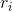分别是输入和输出图像，而，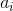和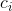是可以从训练集中学习的分裂归一化的参数。值得注意的是，在处理冗余时引入的分裂归一化的定义与自然图像中的高阶依赖性之间存在直接关系，（3.9），并且建议最佳地拟合视觉皮层中的神经元响应，（3.8）。特别是，随着我们设置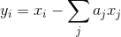的变量的变化，我们看到这两个方程通过元素运算（_即_。平方，与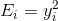相关，受平方根差异的影响。 ]），从而两个模型都达到了在满足神经科学观察的同时最大化独立性的目标。

另一种看待ConvNets标准化的方法是将其视为一种强化特征之间局部竞争的方式[77,91]，类似于生物神经元中发生的竞争。该竞争可以通过减法归一化在特征地图内的相邻特征之间实施，或者通过在特征地图上的相同空间位置处操作的分裂归一化在特征地图之间实施。或者，分裂归一化可被视为一种最小化对乘法对比度变化的敏感性的方法[60]。在更深层次的网络架构中，还发现分裂归一化有助于提高网络的泛化能力[88]。

最近的ConvNets依赖于所谓的批量标准化[129]。批量标准化是另一种分裂标准化，它考虑了一批训练数据来学习标准化参数（_即_。方程式（3.10）中的均值和方差）并且它还引入了新的超参数，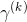和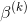，以控制每层所需的标准化量。

批量标准化可以分为两个步骤。首先，在具有维输入的任何层，每个标量特征根据以下内容独立标准化。

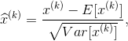（3.10）

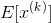是小批量平均值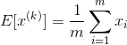计算的小批量平均值，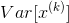是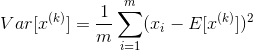计算的相同小批量的方差。其次，等式（3.10）中归一化的输出经历线性变换，使得所提出的批量归一化块的最终输出由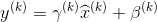给出，其中和是在参数期间学习的超参数。训练。

批量标准化的第一步旨在确定每层输入的均值和方差。但是，由于该规范化策略可以改变或限制层可以表示的内容，因此包括第二个线性转换步骤以维持网络的表示能力。例如，如果输入处的原始分布已经是最优的，则网络可以通过学习身份映射来恢复它。因此，归一化输入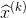可以被认为是在网络的每一层添加的线性块的输入。

批量归一化首先被引入作为对传统分裂归一化的改进，其最终目标是减少内部协变量移位问题，这是指每层输入分布的连续变化[129]。每层输入的变化规模和分布意味着网络必须在每一层显着调整其参数，因此训练必须缓慢（_即_。使用小学习率）以保持损失在训练期间减少（_即_。以避免训练期间的分歧）。因此，引入批量标准化以保证所有输入处的更规则分布。

这种规范化策略的灵感来自为ConvNets的有效培训而建立的一般经验法则。特别是，为了在ConvNets中获得良好的泛化性能，通常的做法是强制所有训练和测试集样本具有相同的分布（_，即_。通过归一化）。例如，已经表明，当输入始终变白时，网络收敛得更快[91,77]。通过考虑每个层可以被视为浅层网络，批量标准化建立在这个想法的基础上。因此，确保输入在每一层保持相同的分布是有利的，并且这通过学习训练数据的分布（使用小批量）并使用训练集的统计来标准化每个输入来强制执行。更一般地说，重要的是要记住，从机器学习的角度来看，这种规范化方案还可以使特征更容易分类。例如，如果两个不同的输入引起两个不同的输出，如果响应位于相同的范围内，则它们更容易被分类器分离，因此处理数据以满足该条件是重要的。

与分裂归一化类似，批量归一化也证明在ConvNets中起着重要作用。特别是，已经证明批量标准化不仅加速了训练，而且在一般化方面起着非常重要的作用，它能够超越以前最先进的图像分类（特别是在ImageNet上）同时消除了对Dropout正则化的需求[88]。

相比之下，批量归一化有点类似于分裂归一化，因为它们都使得每层输入的比例相似。但是，Divisive Normalization通过将每个输入的值除以同一层内同一位置的所有其他输入来标准化每个输入的值。另一方面，批量标准化相对于在相同位置处的训练集的统计（或更准确地说，包含来自整个训练集的示例的小批量的统计）对每个输入进行标准化。批量标准化依赖于训练集的统计的事实可以解释这样的事实，即它提高了表示的泛化能力。

批量标准化的一个问题是它对小批量大小的依赖：如果选择它太小，它可能无法正确表示每次迭代的训练集;或者，如果它太大（_，即_，它会产生减慢训练的负面影响。因为网络必须在当前权重下看到所有训练样本以计算小批量统计数据）。此外，批量标准化不易应用于递归神经网络，因为它依赖于在一小批训练样本上计算的统计数据。因此，在[4]中提出了层标准化。层规范化遵循批量归一化中提出的相同过程，唯一的区别在于规范化统计的计算方式。批量标准化计算小批量的统计数据时，图层标准化使用任何一个图层中的所有要素图或隐藏单位分别计算每个输入的统计数据。因此，在批量标准化中，每个单元使用与该单元相关的不同统计量进行标准化，而层标准以相同方式标准化所有单元。

虽然层次规范被证明在语言相关的应用程序中是有效的，其中循环网络通常更合适，但它无法与使用批量标准化训练的ConvNets竞争图像处理任务[129]。作者提出的一个可能的解释是，在ConvNets中，所有单位在输出中激活单位时没有做出同等贡献;因此，在层标准化（_即_。使用所有单位来计算标准化的统计数据的情况下）的基本假设不适用于ConvNets。

##### Discussion

本小节中讨论的贡献的共同点是，他们都同意标准化在提高多层体系结构的表征能力方面的重要作用。需要注意的另一个重要的一点是，它们都有着共同的目标，即减少输入中的冗余，并且即使在以不同形式提出问题时也将其提高到相同的规模。实际上，虽然早期提出了分裂正常化，_，例如_。 [102]，明确地将问题作为冗余减少问题，诸如批量标准化[129]之类的新提议也通过在每一层白化数据来隐式地强制执行该操作。最后，从生物学角度反思归一化问题，重要的是要注意生物系统在编码自然信号的统计特性方面也是有效的，因为它们代表了具有小代码的世界。因此，人们可能会假设他们也在执行类似的分裂归一化操作，以减少冗余并获得那些有效的代码。