### 3.4汇集

实际上，任何ConvNet模型，无论是生物学启发，纯粹基于学习还是完全手工制作，都包括一个共同的步骤。汇集操作的目标是为位置和比例的变化带来一定程度的不变性，以及聚合特征映射内和跨特征映射的响应。类似于前面部分讨论的ConvNets的三个构建模块，生物学发现以及更多理论驱动的调查也支持汇集。卷积网络中这一层处理的主要争论在于汇集函数的选择。最常见的两种变体是平均和最大池。本节探讨了每种方法的优点和缺点，并讨论了相关文献中描述的其他变化。

#### 3.4.1生物学观点

从生物学的角度来看，汇集主要是由皮质复合细胞的行为驱动[74,109,67,18]。在他们的开创性工作中，Hubel和Wiesel [74]发现，就像简单细胞一样，复杂细胞也被调整到特定方向，但与简单细胞相反，复杂细胞表现出一定程度的位置不变性。他们建议通过某种汇集来实现这一结果，其中调整到相同方向的简单单元的响应在空间和/或时间上汇集，如图3.9所示。

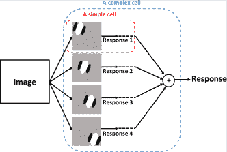

图3.9：简单和复杂细胞之间差异的说明。该图表明复杂细胞反应是由简单细胞反应的组合产生的。

一些早期生物学启发的卷积网络，如福岛的新知识[49]和原始的LeNet网络[91]依赖于平均汇集。在这些努力中，平均汇集后进行二次抽样主要是由Hubel和Wiesel的调查结果推动的，它用于降低网络对位置变化的敏感度。另一方面，HMAX [117]类网络（_，例如_。[130,110,131,79]）依赖于最大池化。最大汇集策略的支持者声称，当汇集运算符的输入是一组Gabor滤波图像（_，即_，简单单元的典型模型）时，它更合理。实际上，作者认为，当应用于自然图像时，高斯尺度空间（_即_。类似于加权平均合并）揭示了不同尺度的新结构，当应用于自然图像时，它会导致特征逐渐消失。 Gabor滤波图像;见图3.10（a）。另一方面，最大池操作增强了不同尺度的滤波图像中最强的响应，如图3.10（b）所示。

| 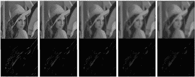 |
| （一个） |
| 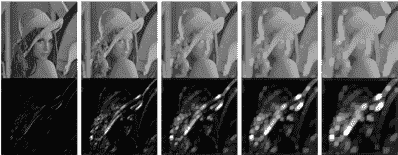 |
| （b）中 |

图3.10：Gabor滤波图像的平均值与最大池数。该示例示出了当应用于（（a）顶行）原始灰度值图像和（（a）底行）其Gabor滤波版本时在各种尺度下的平均合并的效果。虽然平均合并导致灰度值图像的更平滑版本，但稀疏的Gabor滤波图像逐渐消失。相比之下，该示例还示出了当应用于相同灰度值图像（（b）顶行）和（（b）底行）其Gabor滤波版本时在各种尺度下的最大合并的效果。这里，最大池化导致灰度值图像降级，而Gabor滤波版本中的稀疏边缘被增强。图[131]转载。

复杂单元的行为也可以被视为一种跨通道池，这又是将不变性注入表示的另一种方法。通过组合前一层的各种过滤操作的输出来实现跨通道池化。这个想法是由Mutch和Lowe [110]提出的，作为最突出的生物学启发网络[131]的扩展，之前在3.1节中介绍并在图3.2中说明。特别是，作者在其网络的第二层引入跨通道的最大池，其中S2简单单元的输出跨多个方向汇集，以在每个空间位置保持最大响应单元，如图3.11所示。

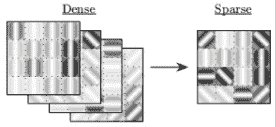

图3.11：跨渠道池图。 （左）由过滤操作产生的密集简单细胞响应，Gabor滤波器调整到不同方向（此处显示了4个方向用于说明目的）（右）使用max运算符（_即交叉通道汇集产生的稀疏简单单元响应）_ 。对于每个像素位置，保持特征图上的最大响应）。图[110]转载。

##### 讨论

总的来说，基于对复杂细胞的描述，似乎从生物学的角度来看，平均和最大汇集都是合理的，尽管有更多的工作主张平均汇集。独立于汇集运算符的选择，事实是对汇集的存在和重要性存在普遍的一致意见。一个可能更重要的问题在于接受场的选择或执行合并的单位。在更多理论驱动的工作中进一步探讨了汇集操作的这一方面，这将在下一节中描述。

#### 3.4.2理论观点

池化已经成为计算机视觉表征管道的一个组成部分，_，例如_。 [99,30,89,49,91]，目的是为图像变换引入一定程度的不变性，并对噪声和杂波具有更好的鲁棒性。从理论的角度来看，可能是影响汇集的重要性和作用的最有影响力的作品之一是Koendrink的局部无序图像概念[87]。这项工作有利于汇集在感兴趣区域（ROI），_，即_内的像素的确切位置。即使在保留全局图像结构的同时，也可以忽略池化区域。目前，几乎所有卷积体系结构都包含池化块作为其处理阶段的一部分。与生物学动机模型一样，更多理论驱动的方法通常采用平均或最大池化。

最近的工作从纯粹基于理论的角度来看待他们的网络设计_，例如_。 ScatNet [15]和SOE-Net [60]依赖于一种平均汇集形式。特别是，他们的网络依赖于加权和池操作。这些方法从频域的角度来解决汇集问题;因此，他们对平均合并的选择是由追踪信号频率内容的愿望所驱动的。平均池化允许这些网络在每层上作用于不同频率，同时对图像进行下采样以增加不变性并减少冗余。同时，他们指定池参数的受控方法允许它们在池操作期间避免混叠。值得注意的是，在SOE-Net的调查中，加权平均汇集的优势在经验上证明了简单的车厢合并和最大汇集。

有趣的是，大多数早期的卷积结构也依赖于平均汇集，_，例如_。 [49,91]，但它在许多基于学习的卷积体系结构中慢慢失宠，并被最大池化所取代。这种趋势主要是由于业绩的微小差异所致。但是，汇集在网络中的作用很重要，需要更仔细地考虑。事实上，早期工作探索汇集[77]的作用表明，汇集的类型在ConvNet架构中起着如此重要的作用，即使是随机初始化的网络也会在对象识别任务中产生竞争结果，提供了适当的汇集类型。用来。特别是，这项工作比较了平均和最大池，并证明了随机初始化的网络平均汇集产生了卓越的性能。

其他工作更系统地比较了平均和最大池的经验[128]并且表明两种类型的池之间存在互补性，这取决于输入类型和它经历的变换。因此，这项工作意味着ConvNets可以从整个架构中使用多个池选项中受益。然而，其他工作从纯粹的理论角度考虑了这个问题[12]。具体来说，这项工作检查了平均与最大池对提取特征的可分离性的影响。本文的主要结论可归纳为两点。首先，作者认为当汇集特征非常稀疏时，最大池更合适（_，例如_。当汇集前面有ReLU时）。其次，作者建议汇集基数应随输入大小而增加，并且池基数会影响汇集功能。更一般地说，已经表明，除了池化类型之外，池化大小也起着重要作用。

尽管经验上[81,27]，其他各种研究也探讨了汇集基数的重要性。实际上，汇集基数的作用首先在早期手工制作的特征提取管道[81]的背景下进行了讨论。特别是，这项工作建立在空间金字塔池[89]编码方法的基础上，同时突出了使用预定的固定大小池网格的缺点。作者建议学习合并窗口“大小作为分类器训练的一部分。更具体地说，作者建议随机挑选不同基数的不同合并区域，并训练分类器选择产生最高准确度的合并区域。这背后的主要动机基于学习的策略是使池化适应于数据集。例如，室外场景的最佳池区可能位于地平线上，这不一定适用于室内场景。同样，对于视频动作识别，它更适合于适应汇集区域到视频最显着的部分[39]。汇集窗口大小或基数的作用也直接在神经网络环境中进行探索[27]。这里，作者建议最相似的特征应该是作者建议以无人监督的方式微调其网络的汇集支持（_即_。汇集区域）。具体地，选择合并窗口以根据成对相似性矩阵将相似特征组合在一起，其中相似性度量是平方相关性。除了平均和最大池操作之外，这些调查的共同点是独立于池功能的池区域的重要性。

从纯机器学习的角度来看，其他工作涉及池的选择及其相应的参数[153,58,96]。从这个角度来看，池化被提倡作为一种正规化技术，允许在训练期间改变网络的结构。特别地，由于在训练期间反向传播的信号可能采取的路径的变化，因此汇集允许在大型架构内创建子模型。这些变化是通过诸如随机汇集[153]或在最大网络[58]和网络中的网络（NiN）[96]中使用的跨渠道汇集等方法实现的。 NiN最初是作为一种处理过度拟合和纠正ConvNets过度完整表示的方法而引入的[96]。特别是，由于每层使用了大量内核，因此注意到许多网络经常在训练后学习冗余过滤器。因此，引入NiN以通过训练网络来减少每层的冗余以了解使用加权线性组合来组合哪些特征图。与NiN类似，Maxout网络[58]引入了跨信道池，其中输出被设置为基于信道的特征映射的最大值。值得注意的是，最近的一项提案还依赖于跨渠道共享来尽量减少冗余[60]，即使在完全免费学习的情况下也是如此。在这项工作中，网络基于过滤器的固定词汇表，并且跨渠道池用于将使用相同内核的过滤操作产生的特征映射组合在一起。除了最大限度地减少冗余之外，采用这种方法可以使网络规模保持可管理性，同时保持可解释性。

随机汇集（SP）[153]也被引入作为正则化技术。但是，与执行跨通道池的maxout和NiN不同，SP在特征映射中起作用。特别是，随机汇集的灵感来自广泛用于完全连接层的丢失技术，但SP应用于卷积层。它依赖于向集合操作引入随机性，该集合操作迫使反向传播的信号在训练期间在每次迭代时随机地采用不同的路径。该方法首先将要合并的每个区域内的特征图响应标准化，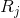，

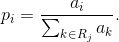（3.11）

然后将归一化值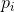用作多项分布的概率，该多项分布又用于对要合并的区域内的位置进行采样。相应的激活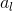是合并的值。重要的是，尽管随机汇集依赖于从任何区域选择一个值（_，即_。类似于最大汇集），汇总值不一定是中最大的值。在此，重要的是要注意在测试期间采用不同的池策略。在测试时，概率不再用于在合并期间对位置进行采样;相反，它们被用作加权和池操作的权重。因此，随机汇集在精神上与训练期间的最大汇集更接近，并且在测试期间更接近于平均汇集。作者认为，在训练期间采用的汇集策略允许通过不同的途径创建不同的模型，而在测试期间使用的汇集允许创建在训练期间看到的所有可能模型的粗略平均近似值。总之，随机池可以看作是尝试平均和最大池的最佳结果。

尝试在平均池和最大池之间实现平衡的另一种方法建议让网络学习最佳池化方法[95]。多个汇集策略的这种想法是通过实验证明最佳汇集策略的选择受输入影响[128]。特别是，作者提出了三种不同的方法来结合平均和最大汇集的好处，即：混合，门控和树池。混合池结合了平均和最大池，独立于要汇集的区域，在那里训练网络以根据混合比例学习混合比例。

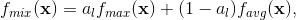（3.12）

受约束条件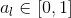。在门控最大平均汇集中，混合比例适合于要汇集的区域。特别地，训练网络以学习通过逐点乘法应用于输入数据的选通掩码。使用这个选通掩模，混合功能现在定义为

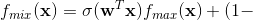（3.13）

用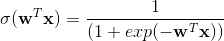。

在这项工作中提出的第三个汇集策略是树池，它可以被视为门控池的极端版本​​。在树池中，不仅学习了混合比例，而且还学习了要组合的池化功能。具体地，采用树结构来学习各个函数的参数及其混合策略。三种池化方法的区别如图3.12所示。总之，这些提案背后的主要思想是让汇集战略适应所汇集的地区。遵循这一策略，作者能够证明不仅结合平均和最大汇集的价值，而且还证明了汇集函数适应汇总区域的价值。

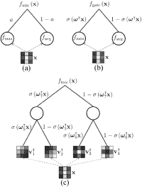

图3.12：混合，门控和树池。所描述的（a）混合最大​​平均合并，（b）门控最大平均合并和（c）树合并的图示。图[〜]复制。

最后，在本节中值得一提的是最后一种类型的池，称为全局池。在一些着名的ConvNet模型中使用了全局池，以解决与ConvNet架构设计相关的更多实际问题[62,96]。例如，众所周知，标准ConvNets依靠卷积层进行特征学习/提取，完全连接的层依次使用softmax进行分类。然而，完全连接的层需要使用大量参数，因此易于过度拟合。引入了许多方法来处理由完全连接的层引起的过度拟合，也许最广泛使用的是丢失[88]。然而，在NiN [96]中引入了一种更自然地融入卷积框架的更优雅的方法，它被称为全球平均汇集。它只依赖于在整个功能映射支持中聚合最后一层功能。在所谓的SPP-Net [62]中也发现了依赖全局汇集的另一个例子。在这项工作中，空间金字塔池（SPP）[89]用于使卷积网络接受任何大小的输入图像。实际上，由于使用完全连接的层，ConvNets需要固定大小的输入。 SPP-Net在最后一个卷积层之后引入空间金字塔池以纠正这个难度。特别是，空间金字塔池用于生成独立于输入图像大小的固定大小表示，如图3.13所示。值得注意的是，NiN中使用的全局平均池，类似于在ConvNet的最后一层执行空间金字塔池，其中金字塔仅由最粗糙的层组成。

图3.13：空间金字塔池网络。 SPP应用于网络的最后卷积层的特征映射。由于空间区间与图像大小成比例，因此SPP生成与输入图像大小无关的相同大小的特征向量。因此，SPP-Net不要求对输入图像进行预处理，使得它们具有相同的尺寸。图[62]转载。

##### Discussion

传统上，池中使用的默认函数依赖于average或max运算符。然而，一些调查显示两者之间存在某种互补关系，表明在选择汇集操作时应考虑更多参数。由于这些观察，最近的研究一直在推动将培训的理念扩展到包括学习汇集功能及其参数。然而，该方向需要增加要学习的参数的数量，从而增加过度拟合的机会。重要的是，这种方法应谨慎对待，因为它可能会进一步模糊我们对所学习的表示的了解和理解。作为补充，可以在理论基础上指定汇集参数，以用于先前处理阶段具有足够分析细节的情况。总体而言，汇集应被视为一种将多个功能的信息汇总为紧凑形式的方法，该形式在丢弃细节的同时保留信号的重要方面。除了决定如何总结这些功能之外，很明显，更难的问题是确定应该汇集的数据是什么以及数据存在的位置。

### 3.5总体讨论

本章讨论了典型ConvNet架构中使用最广泛的构建块的作用和重要性，以便了解ConvNets的工作原理。特别是，每个块的细节都是从生物学和理论的角度来解决的。总的来说，各种共同的线索来自对所讨论的构建块的探索。特别是，似乎所有区块都从视觉皮层中发生的操作中找到了相对强烈的动机。此外，虽然所有块在ConvNets中都发挥了重要作用，但似乎卷积核的选择是最重要的方面，正如解决这一块的大量文献所证明的那样。更重要的是，似乎本章中讨论的更新的ConvNet架构（_，例如_。[15,75,28,148,60]）旨在通过结合更多控制来最小化对基于重训练的解决方案的需求。在他们的网络的各个阶段构建块。这些最近的方法反过来通过各种努力推动，这些努力通过分层可视化和消融研究揭示了基于学习的ConvNets（_，例如_。在一些广泛使用的学习型ConvNets中的主要冗余）的次优性，将在下一章讨论。