## 第四章现状

对ConvNet架构的各个组件的作用的审查强调了卷积块的重要性，卷积块主要负责网络捕获的大多数抽象。相比之下，这个组件仍然是最不被理解的处理块，因为它需要最重要的学习。本章回顾了试图了解各种ConvNet层学习内容的当前趋势。鉴于这些趋势，将突出显示仍存在的各种关键性开放问题。

### 4.1当前趋势

虽然各种ConvNet模型继续在几个计算机视觉应用中进一步推动最先进的技术，但对这些系统如何以及为何如此有效运行的理解是有限的。这个问题引起了各种研究人员的兴趣，并且在回应中出现了几种方法来理解ConvNets。一般来说，这些方法可以分为三个方面：那些依赖于学习过滤器和提取的特征图的可视化的方法，那些依赖于消融研究的方法，这些研究是从理解视觉皮层的生物学方法和依赖于最小化学习的方法中获得的。通过将分析原理引入其网络设计中。本节将简要回顾这些方法中的每一种。

#### 4.1.1通过可视化了解ConvNets

尽管文献中已经提出了几种方法来可视化由ConvNets提取的特征图，但在本节中我们将集中讨论两种最突出的方法并讨论它们的不同变化。

ConvNet可视化的第一种方法被称为以数据集为中心的方法[151]，因为它依赖于使用来自数据集的输入探测网络以找到网络中的最大响应单元。属于这一类别的最早的方法之一被称为DeConvNet [154]，其中可视化分两步实现。首先，向ConvNet提供来自数据集的若干图像，并记录对该输入最大响应的特征图。其次，使用DeConvNet架构将这些特征映射投射回图像空间，该架构由反转所用ConvNet操作的块组成。特别是，DeConvNet通过使用所考虑的ConvNet中的学习过滤器的转置来反转卷积运算（_，即_。执行“去卷积”）。这里值得注意的是，不能保证转置转换操作。对于“取消汇集”，DeConvNet依赖于记录ConvNet中与最大池化响应相对应的位置，并使用这些位置“取消汇集”或对特征映射进行上采样。这些操作总结在图4.1中。

| 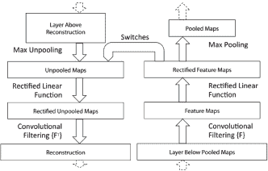 | 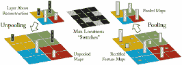 |
| （一个） | （b）中 |

图4.1：DeConvNet构建块。 （a）说明DeConvNet操作，该操作可应用于将从ConvNet的任何层提取的特征映射投影回图像空间。 （b）通过使用“开关”说明“非汇集”操作，“开关”对应于响应最大汇集操作的位置。图[154]再现。

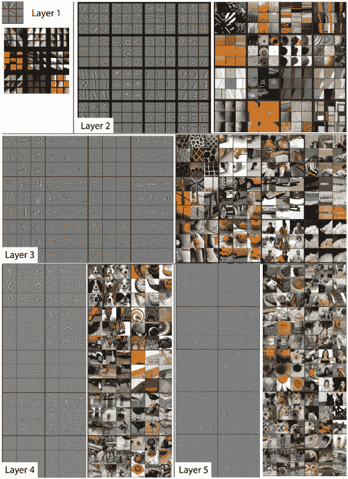

图4.2：通过在标准ConvNet架构的各个层（如AlexNet [88]）应用DeconvNet获得的可视化。图[154]转载。

这些方法产生的典型可视化如图4.2所示。总体而言，这些可视化显示网络中的早期层倾向于捕获低级特征，例如定向条和边，_，即_。在较低层学习的滤波器类似于定向带通滤波器。相比之下，在更高层的特征捕获从简单纹理到更复杂对象的进展。有趣的是，这些可视化倾向于从图像中保留高水平的细节，从而在网络中产生高响应。事实上，似乎这些可视化倾向于强调输入图像的边缘，并且主要揭示负责高响应的图像部分（_即_。它们可被视为查找输入图像的方法输入图像的高对比度点，主要揭示负责高分类结果的部分）。受这些观察的启发，属于以数据集为中心的范式的其他方法提出了更简单的方法来可视化网络正在学习的内容。例子包括逐步从图像中去除部分的方法，产生高响应以突出显示哪些部分负责高响应[156,157]。从这些方法中得出的一些结论是，对象主要负责识别场景[156]或更一般地说，当我们可视化网络的更高层时，对象检测器会出现[157]。

ConvNet可视化的第二种方法被称为以网络为中心的方法[151]，因为它仅使用网络参数而无需任何其他数据用于可视化目的。这种方法最初是在深层信念网络[37]的背景下引入的，后来应用于ConvNets [133]。在这种情况下，通过合成将最大化一些神经元（或滤波器）响应的图像来实现可视化。例如，从产生类别分数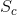的网络的最后一层开始，以及初始化为随机噪声的图像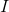，目标是修改图像，使其属于类的分数]最大化。这个优化问题在[133]中定义

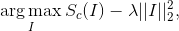（4.1）

其中是正则化参数。这里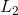正则化用于惩罚大值。属于这种范式的大多数其他方法试图解决相同的优化问题，同时执行不同的正则化技术，例如总变差正则化以强制平滑并避免合成图像中的高频内容[104]或简单剪切不强烈参与的像素过滤器的响应仅突出显示负责过滤器激活的模式[151]。

当用于最大化（4.1）中定义的类别分数时，以网络为中心的方法产生的典型可视化如图4.3所示。通常，这些可视化表明网络正在学习高级形状，负责区分各种物体（_例如_。当目标类是动物面部时，眼睛，鼻子和耳朵）;但是，这些功能的确切位置无关紧要。因此，这些可视化意味着网络逐渐学习不变性（_，例如_。它在较高层变为位置不可知），正如使用各种池化操作所预期的那样。然而，当这种以网络为中心的可视化技术应用于反转较低层时，它并不一定表明它们正在学习较低级别的特征，例如边缘，而不是以数据集为中心的技术。例如，在图4.3（b）中，可以看出较低层保留了图像中存在的大部分摄影信息。更一般地，理解ConvNets的可视化方法的主要限制是解释的主观性质，其通常基于该方法的作者的视觉检查。

| 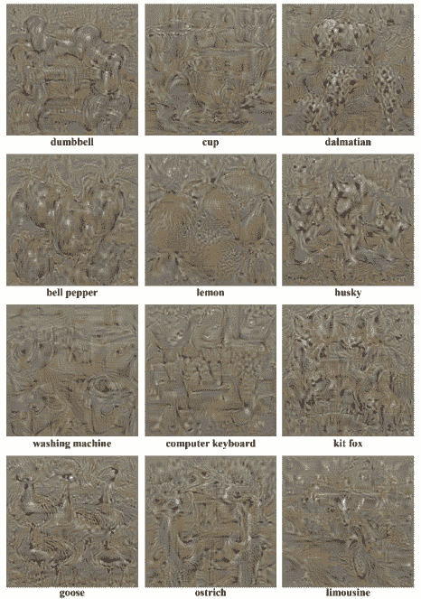 |
| (a) |
| 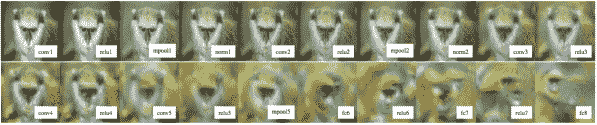 |
| (b) |

图4.3：通过在网络中心方法中对图像空间应用优化而获得的可视化。 （a）通过最大化属于各种类别的得分而获得的可视化，如下面每个图像所示。图[133]转载。 （b）通过最大化各层的标准网络响应而获得的可视化，如下图所示。图[104]转载。

#### 4.1.2通过消融研究了解ConvNets

另一种流行的方法是阐明广泛使用的ConvNet功能，即所谓的网络消融研究。事实上，许多着名的ConvNet论文（_，例如_。[23,154,134,144,41,29,78]）在他们的实验部分包括消融研究，其目标是隔离不同的成分查看删除或添加块如何影响整体性能的网络。

这些消融研究有可能引导ConvNet从业者走向“良好实践”，以在不同的应用中实现更高的性能。例如，ConvNets背景下最早的消融研究之一揭示了即使在使用随机初始化网络时也需要进行适当的整流和归一化[77]。其他工作揭示了在所有层使用较小过滤器时更深层表示的重要性[23,135]。还有其他研究，调查了预训练和微调的作用以及特征的数量，位置和大小。这些调查进一步突出了跨任务从ConvNets中提取的特征的可转移性[1]。

更有意思的是，其他工作提出要剖析ConvNets以调查每个组成部分对所学表征的可解释性的影响[6]。该方法依赖于具有像素级注释的数据集，其中每个像素被分配若干“概念”标签，其包括颜色，纹理，对象和场景标签。评估ConvNet中的每个单元的能力，以生成与某个基于概念的分割掩码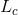匹配的分割掩码。特别地，网络中的每个特征映射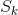被转换为二进制掩码，其中仅当像素的激活超过某个预设阈值时才将像素设置为。接下来，每个单位根据其分割给定概念的能力分配一个分数，根据

（4.2）

其中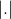是集合的基数。通过这种方法，每个单元的可解释性基于其生成良好分割掩模的能力来定义。该测量表明，较低层中的单元能够生成更好的基于颜色或纹理的掩模，而较高层可以生成更好的对象和场景分割。与数据集为中心的可视化方法一致，这一观察结果表明，较低层是学习过滤器，捕获较低层次的概念，而较高层层次学习更多抽象特征，如对象部分。这种方法还允许系统地分析各种非线性和训练策略对可解释性的影响，并揭示出更高的表现并不总是产生高度可解释的单位。例如，已经表明，诸如批量归一化之类的正则化技术非常简单地影响该方法中定义的单元的可解释性。此外，与广泛使用的ImageNet培训相比，发现在场景数据集上训练的网络产生更多可解释的单元。不幸的是，这种方法的一个主要缺陷是它们对可解释性的定义在很大程度上取决于用于评估的数据集。换句话说，能够捕获数据集中未表示的概念的ConvNet单位将产生较低的IoU分数;因此，即使该概念在视觉上是可解释的，也被认为不能通过这种方法解释。因此，该方法可能会遗漏由负责更高性能的网络组件揭示的其他重要方面。

#### 4.1.3通过受控设计了解ConvNets

理解ConvNets的另一种方法是通过将先验注入网络设计来最小化学习参数的数量。例如，一些方法减少每层学习过滤器的数量，并包括每层中学习过滤器的变换版本以模拟旋转不变性，_，例如_。 [100,158]。其他方法依赖于用基组替换学习过滤器而不是学习过滤器参数，而是学习如何组合基组以在每层形成有效过滤器，_，例如_。 [75,28,148,100,158]。还有其他方法，通过全面手工制作网络并使其适应特定任务，推动将先行者注入其网络设计的想法，这产生了特别可解释的网络，_，例如_。 [15,113,60]。大多数属于这种范式的技术先前已在第3章第3.1.2节中详细讨论过。