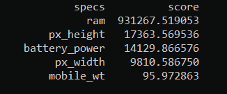
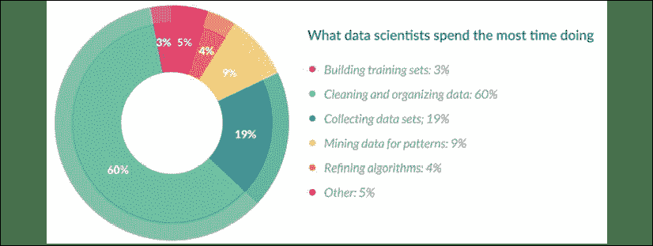
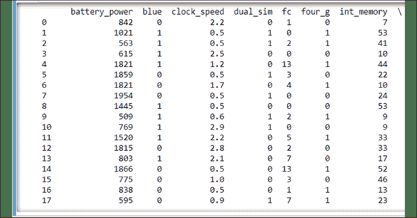
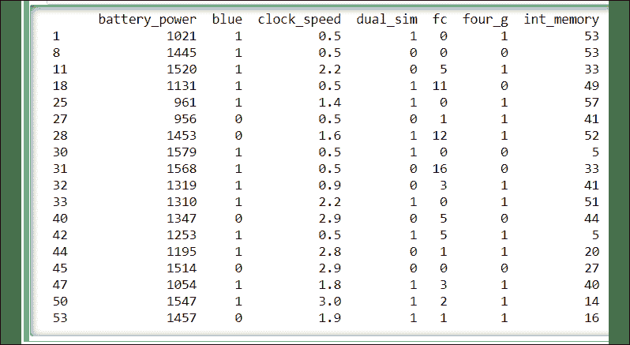

# 4 特征选择和特征工程

特征选择（也称为变量选择，属性选择或变量子集选择）是一种用于从初始数据集中选择特征子集（变量，尺寸）的方法。 特征选择是构建机器学习模型过程中的关键步骤，并且可能对模型的性能产生巨大影响。 使用正确且相关的特征作为模型的输入还可以减少过拟合的机会，因为拥有更多相关的特征会减少模型使用不添加信号作为输入的嘈杂特征的机会。 最后，减少输入功能会减少训练模型所需的时间。 学习选择哪些功能是数据科学家开发的一项技能，通常仅来自数月和数年的经验，并且可以说是一门艺术，而不是一门科学。 功能选择很重要，因为它可以：

*   缩短训练时间
*   简化模型并使它们更易于解释
*   通过减少过拟合来增强测试集性能

删除特征的一个重要原因是输入变量之间的高度相关性和冗余性，或者某些特征的不相关性。 因此，可以删除这些输入变量，而不会造成很多信息丢失。 冗余和无关是两个截然不同的概念，因为一个相关特征在存在与之高度相关的另一个相关特征的情况下可能是多余的。

在某些方面，要素工程与要素选择相反。 使用功能选择，可以删除变量。 在特征工程中，您可以创建新变量来增强模型。 在许多情况下，您将使用领域知识进行增强。

特征选择和特征工程是机器学习管道中的重要组成部分，这就是为什么整章专门讨论该主题的原因。

到本章末，您将了解：

*   如何决定是否应从数据集中删除要素
*   了解共线性，相关性和因果关系的概念
*   了解特征工程的概念及其与特征选择的区别
*   了解手动特征工程和自动特征工程之间的区别。 什么时候适合使用每个？

# 特征选择

在上一章的中，我们探讨了机器学习管道的组件。 管道的关键组成部分是确定哪些要素将用作模型的输入。 对于许多模型，一小部分输入变量提供了大部分的预测能力。 在大多数数据集中，由少数几个要素负责大部分信息信号是很常见的，而其余的要素则主要是噪声。

出于多种原因，降低输入功能的数量很重要，包括：

*   减少输入特征的多重共线性将使机器学习模型参数更易于解释。 *多重共线性*（也*共线性*）是在数据集中的特征中观察到的现象，在该数据集中可以从另一个模型的特征中线性预测另一个预测器特征，并且准确性很高。
*   减少运行模型所需的时间和模型所需的存储空间，将使我们能够运行模型的更多变体，从而带来更快更好的结果。
*   模型需要的输入功能越少，说明它就越容易。 当特征数量增加时，模型的可解释性下降。 减少输入要素的数量还可以简化为较小尺寸（例如 2D 或 3D）时可视化数据的过程。
*   随着维数的增加，可能的配置呈指数增加，而观测值覆盖的配置数则减少。 随着您具有描述目标的更多功能，您也许可以更精确地描述数据，但是您的模型将不会使用新的数据点进行泛化-您的模型将过拟合数据。 这就是*维度诅咒*。

让我们通过一个例子直观地思考一下。 美国有一个房地产网站，允许房地产经纪人和房主列出出租房屋或出售房屋。 Zillow 因其 Zestimate 而闻名。 Zestimate 是使用机器学习的估计价格。 Zillow 估计，如果今天将其投放市场，房屋将要出售的价格。 Zestimates 会不断更新和重新计算。 Zillow 如何得出这个数字？ 如果您想了解更多，可以在 Kaggle 上进行一场比赛，该比赛在 Zestimate 上有很多资源。 [你可以在这里查询更多详情](https://www.kaggle.com/c/zillow-prize-1)。

Zestimate 算法的确切细节是专有的，但是我们可以做一些假设。 现在，我们将开始探索如何提出自己的 Zestimate。 让我们为我们的机器学习模型列出潜在的输入变量，以及它们可能很有价值的原因：

*   **平方英尺**：直观上来说，房屋越大，价格就越高。
*   **卧室数量**：更多房间，更多费用。
*   **浴室数量**：卧室需要浴室。
*   **抵押贷款利率**：如果利率较低，则抵押贷款支付将降低，这意味着潜在的房主可以负担得起更昂贵的房屋。
*   **建成年份**：通常，较新的房屋比旧的房屋更贵。 老房子通常需要更多的维修。
*   **财产税**：如果财产税高，那将增加每月的还款额，房主将只能负担更便宜的房屋。
*   **房屋颜色**：乍看之下，这似乎并不是一个相关变量，但是如果房屋涂成石灰绿色怎么办？
*   **邮政编码**：位置，位置，位置。 在房地产中，房屋所在地是价格的重要决定因素。 在某些情况下，一个街区的房屋可能比下一个街区的房屋多几十万美元。 位置可能很重要。
*   **可比较的销售额**：评估师和房地产经纪人通常用来评估房屋价值的一种指标是寻找与最近出售或至少列出的“标的”房地产相似的房地产，以查看销售价格或当前的上市价格。
*   **税收评估**：财产税是根据县目前认为财产的价值来计算的。 这是可公开访问的信息。

这些都可能是具有较高预测能力的变量，但直觉上我们可以假设平方英尺，卧室数量和浴室数量高度相关。 同样，从直觉上讲，平方英尺比卧室或浴室的数量更精确。 因此，我们可以减少卧室和浴室的数量，并保持平方英尺，而不会损失太多精度。 确实，我们可以通过降低噪声来提高准确性。

此外，我们很可能会在不损失精度的情况下降低房屋的颜色。

在不影响模型精度的情况下可以删除的特征分为两类：

*   **冗余**：此功能与其他输入功能高度相关，因此不会在信号中添加太多新信息。
*   **不相关**：此功能与目标函数的相关性较低，因此提供的噪声大于信号。

找出我们的假设是否正确的一种方法是在有或没有我们的假设的情况下训练模型，并查看产生更好结果的方法。 我们可以对每个单个功能使用此方法，但是如果我们具有大量功能，则可能会迅速增加组合的数量。

正如我们之前提到的，探索性数据分析是获得直观了解和深入了解正在使用的数据集的好方法。 让我们分析通常用于获取这些见解的三种方法。 他们是：

*   功能重要性
*   单变量选择
*   具有热图的相关矩阵

## 特征重要性

可以使用此方法确定数据集每个特征的重要性。

特征重要性为数据集中的每个特征提供分数。 较高的分数意味着该要素相对于输出要素具有更高的重要性或相关性。

功能重要性通常是*基于树的分类器*随附的内置类。 在以下示例中，我们使用*额外树分类器*确定数据集中的前五项功能：

```py
import pandas as pd 
```

```py
from sklearn.ensemble import ExtraTreesClassifier
import numpy as np
import matplotlib.pyplot as plt 
```

```py
data = pd.read_csv("train.csv")
X = data.iloc[:,0:20]  #independent columns
y = data.iloc[:,-1]    # pick last column for the target feature 
```

```py
model = ExtraTreesClassifier()
model.fit(X,y)
print(model.feature_importances_) #use inbuilt class
#feature_importances of tree based classifiers
#plot graph of feature importances for better visualization
feat_importances = pd.Series(model.feature_importances_, index=X.columns)
feat_importances.nlargest(5).plot(kind='barh')
plt.show() 
```

您应该将视为输出：


图 1：功能重要性图

## 单变量选择

可以使用统计测试来确定哪些特征与输出变量具有最强的相关性。 scikit-learn 库具有一个名为`SelectKBest`的类，该类提供一组统计测试以选择数据集中的`K`“最佳”特征。

以下是一个示例，该示例对非负特征使用卡方（chi²）统计检验，以选择输入数据集中的五个最佳特征：

```py
import pandas as pd
import numpy as np
from sklearn.feature_selection import SelectKBest
from sklearn.feature_selection import chi2
data = pd.read_csv("train.csv")
X = data.iloc[:,0:20]  #independent columns
y = data.iloc[:,-1]    #pick last column for the target feature 
#apply SelectKBest class to extract top 5 best features
bestfeatures = SelectKBest(score_func=chi2, k=5)
fit = bestfeatures.fit(X,y)
dfscores = pd.DataFrame(fit.scores_) 
```

```py
dfcolumns = pd.DataFrame(X.columns)
scores = pd.concat([dfcolumns,dfscores],axis=1)
scores.columns = ['specs','score']  
print(scores.nlargest(5,'score'))  #print the 5 best features 
```

并且您应该看到这样的输出：



图 2：最佳功能图

## 相关性热图

当特征的不同值之间存在关系时，两个特征之间存在相关性。 例如，如果房价随着平方英尺的增加而上涨，则这两个特征被认为是正相关的。 可能存在不同程度的相关性。 如果一个特征相对于另一个特征一致地改变，则这些特征被认为是高度相关的。

相关可以是正的（特征的一个值的增加会增加目标变量的值）或负的（特征的一个值的增加会降低目标变量的值）。

关联是 -1 和 1 之间的连续值。

*   如果两个变量之间的相关性为 1，则存在完美的直接相关性。
*   如果两个特征之间的相关性为 -1，则存在理想的逆相关性。
*   如果两个要素之间的相关性为 0，则两个要素之间没有相关性。

热图可轻松识别与目标变量最相关的功能。 我们将使用`seaborn`库并使用以下代码来绘制相关要素的热图：

```py
import pandas as pd
import numpy as np
import seaborn as sns
import matplotlib.pyplot as plt 
```

```py
data = pd.read_csv("train.csv")
X = data.iloc[:,0:20]  #independent columns
y = data.iloc[:,-1]    # pick last column for the target feature
#get the correlations of each feature in the dataset
correlation_matrix = data.corr()
top_corr_features = correlation_matrix.index
plt.figure(figsize=(20,20))
#plot heat map
g=sns.heatmap(data[top_corr_features].corr(),annot=True,cmap="RdYlGn") 
```

您应该获得与以下类似的输出：


图 3：相关热图

存在更多形式化和较少的直观方法来自动选择特征。 存在许多这些方法，并且在 scikit-learn 包中实现了许多方法。 接下来提到对这些方法进行分类的一种方法。

### 基于包装器的方法

使用包装器方法时，使用以下步骤可将特征选择的问题实质上减少为搜索问题：

1.  功能子集用于训练模型
2.  根据每次迭代的结果，将要素添加到子集中或从子集中删除

包装方法通常在计算上很昂贵。 以下是一些示例：

*   **正向选择**：正向选择方法是一个迭代过程，其开始时数据集中没有特征。 在每次迭代过程中，都会添加功能以改善模型的性能。 如果性能得到改善，则保留功能。 无法改善结果的功能将被丢弃。 该过程一直持续到模型停止改进为止。
*   **反向消除**：当使用反向消除方法时，所有特征最初都在数据集中出现。 重要性最低的要素将在每次迭代过程中删除，然后该过程将检查模型的性能是否得到改善。 重复该过程，直到没有观察到明显的改善为止。
*   **递归特征消除**：递归特征消除方法是一种贪婪的优化算法，其目标是找到性能最佳的特征子集。 它迭代创建模型，并在每次迭代期间存储性能最佳或最差的功能。 它将使用其余功能构造下一个模型，直到所有功能用尽。 然后根据特征的消除顺序对其进行排序。

### 基于过滤器的方法

指定度量，并基于该度量特征过滤。 基于过滤器的方法的示例包括：

*   **皮尔逊相关性**：此算法用作量化两个连续变量`X`和`Y`之间的线性相关性的度量。 它的值可以介于 -1 到 +1 之间。
*   **线性判别分析（LDA）**：LDA 可用于查找特征的线性组合，这些特征描述或分隔了分类变量的两个或更多个级别（或类）。
*   **方差分析（ANOVA）**：ANOVA 类似于 LDA，不同之处在于它是使用一个或多个分类自变量和一个连续因变量计算的。 它提供了统计检验，以了解几组的平均值是否相等。
*   **卡方**：卡方是一种统计测试，应用于类别变量组，以使用它们的频率分布确定它们之间相关或关联的可能性。

要记住的一个问题是，基于*过滤器的方法*不会消除多重共线性。 因此，在根据输入数据创建模型之前，必须执行其他处理以处理特征多重共线性。

### 嵌入式方法

嵌入式方法使用具有内置特征选择方法的算法。 嵌入式方法结合了过滤器和包装器方法的优点。 通常使用带有内置特征选择方法的算法来实现它们。

两种流行的嵌入式方法实现如下：

*   **LASSO 回归**：执行 L1 正则化，这会增加与系数的绝对值相等的惩罚
*   **Ridge 回归**：执行 L2 正则化，这将增加与系数幅度的平方相等的惩罚

这些算法也很常用：

*   模因算法
*   随机多项式对数
*   正则化树

到此结束本章的第一部分。 您应该准备好应对自己的功能选择项目。 现在，准备好进入特征工程领域。 特征选择与我们如何减少变量数量以提高准确性有关。 特征工程则相反。 它问：我们如何创建新变量以使我们的模型更具性能？

# 特征工程

根据最近在《福布斯》杂志上进行的调查，数据科学家将其 80% 的时间用于数据准备：



图 4：数据科学家花费的时间细分（来源：《福布斯》）

该统计数据突显了数据准备和特征工程在数据科学中的重要性。

就像明智的和系统化的特征选择可以通过删除特征使模型更快，更高效一样，特征工程可以通过添加新特征来实现相同的目的。 乍看之下这似乎是矛盾的，但是要添加的功能不是由功能选择过程删除的功能。 要添加的要素是可能未包含在初始数据集中的要素。 您可能拥有世界上最强大，设计最完善的机器学习算法，但是如果您的输入功能不相关，您将永远无法产生有用的结果。 让我们分析几个简单的例子以获得一些直觉。

在上一章中，我们探讨了贷款违约问题。 凭直觉，可以推测，如果借款人的工资高，借款人的违约率就会降低。 同样，我们可以假设，与余额较低的人相比，信用卡余额较大的借款人可能很难偿还这些余额。

现在我们有了新知识，让我们尝试直观地确定谁将偿还贷款，谁不偿还贷款。 如果借款人`A`的信用卡余额为$ 10,000，而借款人`B`的余额为$ 20,000，您认为谁有更大的机会还清债务？ 如果没有其他信息，我们可以说借款人`A`是更安全的选择。 现在，如果我告诉您借款人`A`年收入为 20,000 美元，借款人`B`年收入为 100,000 美元，该怎么办？ 那改变了一切，不是吗？ 我们如何定量捕捉两个特征之间的关系？ 银行经常使用所谓的，**债务收入比**（**DTI**），该比率的计算方法如下：


因此，借款人 A 的 DTI 为 0.50，借款人`B`的债务收入比为 0.20。 换句话说，借款人`A`的债务是其债务的两倍，借款人`B`的债务是其债务的 5 倍。 借款人`B`有更大的偿还债务空间。 我们当然可以在这些借款人的配置文件中添加其他功能，这将改变其配置文件的构成，但是希望这有助于说明功能工程的概念。

更正式地讲，特征工程是数据科学家或计算机生成可增强机器学习模型的预测能力的特征的过程。 特征工程是机器学习中的一个基本概念，可能既困难又昂贵。 许多数据科学家希望直接跳入模型选择，但是辨别哪些新功能将增强模型的能力是一项关键技能，可能需要花费数年才能掌握。

更好的特征工程算法的发展目前正在紧锣密鼓地进行，有一天，在特征工程决策方面，这些特征可能会比高级数据科学家更好，但是，在接下来的几年中，我们预测仍会需要优秀的数据科学家。

特征工程过程可以描述如下：

1.  集体讨论哪些功能相关
2.  确定哪些功能可以改善模型性能
3.  创建新功能
4.  确定新功能是否会增加模型性能； 如果没有，放下它们
5.  返回“步骤 1”，直到模型的性能达到预期

正如我们在示例中看到的那样，拥有域知识并熟悉数据集对于特征工程很有用。 但是，也有一些通用的数据科学技术可应用于数据准备和功能工程步骤中，而不管其域是什么。 让我们花一些时间分析这些技术。

我们将探讨的技术是：

*   归因
*   离群值管理
*   一键编码
*   对数转换
*   缩放比例
*   日期操作

## 估计

数据集“肮脏”且不完美的情况并不少见。 缺少值的行是一个常见问题。 值丢失的原因可能有很多：

*   数据集不一致
*   笔误
*   隐私问题

不管出于何种原因，缺少值都会影响模型的性能，并且在某些情况下，由于某些算法不会善待丢失值，因此可能会导致模型停止运行。 有多种技术可以处理缺失值。 它们包括：

**删除缺少值的行**：此技术会降低模型的性能，因为它减少了模型必须训练的数据点的数量。

让我们看一个示例，该示例删除缺少 60% 以上数据的列：

```py
threshold = 0.6
#Drop columns with a missing value rate higher than threshold
data = data[data.columns[data.isnull().mean() < threshold]] 
```

```py
#Drop rows with missing value rate higher than threshold
data = data.loc[data.isnull().mean(axis=1) < threshold]
threshold = 0.6
#Drop columns with a missing value rate higher than threshold
data = data[data.columns[data.isnull().mean() < threshold]] 
```

```py
#Drop rows with missing value rate higher than threshold
data = data.loc[data.isnull().mean(axis=1) < threshold]
print(data) 
```

输出应如下所示：



图 5：丢弃缺失值输出

**数值插补**：插补是处理缺失值的另一种方法。 归因只是将缺失的值替换为另一个“有意义的”值。

对于数字变量，这些是常见的替换：

*   将零用作替换值是一种选择
*   计算整个数据集的平均值，然后用平均值替换缺失值
*   计算整个数据集的平均值，然后用平均值替换缺失值

通常最好使用平均值而不是平均值，因为平均值更容易受到异常值的影响。 让我们看一些替换示例：

```py
#Filling all missing values with 0
data = data.fillna(0) 
```

```py
#Filling missing values with medians of the columns
data = data.fillna(data.median())
print(data) 
```

您将能够滚动显示输出并查看更改的值：


图 5：丢弃缺失值输出

**分类插补**：分类变量不包含数字，而是包含类别。 例如，红色，绿色和黄色。 或香蕉，苹果和橙子。 因此，平均值和均值不能与分类变量一起使用。 常用的技术是用出现最多的值替换所有丢失的值。

在存在许多类别或类别均匀分布的情况下，使用诸如“其他”之类的名称可能有意义。 让我们看一下 Python 中的示例，该示例将所有缺少的值替换为最常出现的值（Python 中的`idxmax`返回整个功能中最常见的值）：

```py
#Max fill function for categorical columns
import pandas as pd 
```

```py
data = pd.read_csv("dataset.csv") 
```

```py
data['color'].fillna(data['color'].value_counts().idxmax(), inplace=True)
print(data) 
```

输出应类似于以下内容：


图 7：填充缺失值输出

# 离群值管理

房价是一个很好的领域，需要进行分析以了解为什么我们需要特别注意异常值。 无论您居住在世界的哪个区域，您附近的大多数房屋都将落入一定范围内，并且将具有某些特征。 也许是这样的：

*   1 至 4 间卧室
*   1 个厨房
*   500 至 3000 平方英尺
*   1 至 3 间浴室

2019 年美国的平均房价为 226,800 美元。 您可以猜测，这种房屋可能会具有上述某些特征。 但也可能有几所房子是*异常值*。 也许有 10 或 20 间卧室的房子。 其中一些房屋可能价值一百万或一千万美元，具体取决于这些房屋可能具有的疯狂定制数量。 正如您可能想象的那样，这些离群值将影响数据集中的均值，并且将对均值产生更大的影响。 因此，鉴于这些房屋的数量不多，最好删除这些离群值，以免影响其他较常见的数据点的预测。 让我们看一些房屋价值的图表，然后尝试画出两条最合适的线：一条去除所有数据，一条去除高价房屋离群值：


图 8：最佳拟合图

如您所见，如果从最佳拟合线的计算中除去异常值，则该线将更准确地预测低价房屋。 因此，简单地删除异常值是处理异常值影响的简单而有效的方法。

那么，我们如何确定某个值是否为离群值并应将其删除？ 一种常见的方法是删除落在数据集中某个要素值的标准偏差的某个倍数的离群值。 用于乘数的常量更多的是一门艺术，而不是一门科学，但是 2 到 4 之间的值很常见：

```py
#Dropping the outlier rows with standard deviation
import pandas as pd 
```

```py
data = pd.read_csv("train.csv") 
```

```py
#Dropping the outlier rows with standard deviation
factor = 2
upper_lim = data['battery_power'].mean () + data['battery_power'].std () * factor
lower_lim = data['battery_power'].mean () - data['battery_power'].std () * factor 
```

```py
data = data[(data['battery_power'] < upper_lim) & (data['battery_power'] > lower_lim)]
print(data) 
```

输出应为，类似于：


图 9：删除异常行输出

检测和消除异常值的另一种方法是使用百分位。 使用这种方法，我们仅假设要素值的一定百分比是离群值。 下降多少百分比值仍然是主观的，并且将取决于领域。

让我们看一个 Python 示例，在其中将最高和最低 1% 的部分删除：

```py
#Dropping the outlier rows with Percentiles
upper_lim = data['battery_power'].quantile(.99)
lower_lim = data['battery_power'].quantile(.01) 
```

```py
data = data[(data['battery_power'] < upper_lim) & (data['battery_power'] > lower_lim)]
print(data) 
```

预期的输出如下：



图 10：输出异常值行

处理离群值的另一种方法是设置值上限而不是删除值。 封顶值而不是删除行允许您保留数据点，并有可能提高模型的性能。 但是，保留数据点但限制值的上限会使该数据点成为估计值而不是实际观察值，这也可能会影响结果。 决定使用哪种方法将取决于对特定数据集的分析。 这是一个使用上限值而不是删除行的示例：

```py
#Capping the outlier rows with percentiles
upper_lim = data['battery_power'].quantile(.99)
lower_lim = data['battery_power'].quantile(.01) 
```

```py
data.loc[(data['battery_power'] > upper_lim), 'battery_power'] = upper_lim
data.loc[(data['battery_power'] < lower_lim), 'battery_power'] = lower_lim
print(data) 
```

以下是应遵守的输出。 如果您应滚动浏览输出，则可能会注意到一些更改的值：


图 11：帽异常行输出

# 单热编码

单热编码是机器学习中用于特征工程的一种常用技术。 一些机器学习算法无法处理分类特征，因此单热编码是一种将这些分类特征转换为数值特征的方法。 假设您有一个标记为“状态”的功能，该功能可以采用三个值（红色，绿色或黄色）之一。 由于这些值是分类的，因此不存在哪个值是*较高*或*较低*的概念。 我们可以将这些值转换为数值，从而赋予它们这种特性。 例如：

黄色= 1

红色= 2

绿色= 3

但这似乎有些武断。 如果我们知道红色是不好的，绿色是好的，而黄色在中间，那么我们可以将映射更改为：

红色= -1

黄色= 0

绿色= 1

这样可能会产生更好的性能。 但是，现在让我们看看如何对这个示例进行单热编码。 为了实现此一个变量的一次性编码，我们为每个值创建了一个新功能。 在这种情况下，我们的一些数据（您可能会在野外遇到的东西）可能看起来像这样：

| **红色** | **黄色** | **绿色** | **状态** |
| --- | --- | --- | --- |
| 1 | 0 | 0 | 红色 |
| 0 | 1 | 0 | 黄色 |
| 0 | 0 | 1 | 绿色 |
| 0 | 0 | 1 | 绿色 |

由于我们已经对数据进行了单热编码，因此状态功能现在变得多余，因此我们可以从数据集中消除它：

| **红色** | **黄色** | **绿色** |
| --- | --- | --- |
| 1 | 0 | 0 |
| 0 | 1 | 0 |
| 0 | 0 | 1 |
| 0 | 0 | 1 |

此外，我们可以从其他两个颜色特征中计算出任何颜色特征的值。 如果红色和黄色都为 0，则意味着绿色需要为 1，依此类推。 因此，在一键编码中，我们始终可以删除其中一项功能而不会丢失信息。 像这样：

| **红色** | **黄色** |
| --- | --- |
| 1 | 0 |
| 0 | 1 |
| 0 | 0 |
| 0 | 0 |

现在让我们看一个示例，说明如何使用`get_dummies`函数使用 Pandas 库对功能进行单热编码：

```py
import pandas as pd 
```

```py
data = pd.read_csv("dataset.csv") 
```

```py
encoded_columns = pd.get_dummies(data['color'])
data = data.join(encoded_columns).drop('color', axis=1)
print(data) 
```

输出应如下所示：


图 12：单热编码输出

# 对数转换

对数转换（或对数转换）是常见的特征工程转换。 对数转换有助于展开高度偏斜的值。 应用对数转换后，数据分布将被标准化。

让我们再看一个例子，再次获得一些直觉。 请记住，当您 10 岁时，看着 15 岁的男孩和女孩时，他们在想：“他们比我大得多！” 现在想想一个 50 岁的人和另一个 55 岁的人。 在这种情况下，您可能会认为年龄差异并不大。 在这两种情况下，年龄差异均为 5 岁。 但是，在第一种情况下，15 岁的年龄比 10 岁的年龄大 50%，在第二种情况下，55 岁的年龄比 50 岁的年龄大 10%。

如果我们对所有这些数据点应用对数变换，则将这样的幅度差异归一化。

由于幅值差异的归一化，使用对数变换的模型也将减少异常值的影响，并且使用对数变换的模型将变得更加健壮。

使用此技术时要考虑的一个关键限制是，仅当所有数据点均为正值时才应应用对数转换。 另外，您可以在应用转换之前将 1 加到数据中。 因此，您确保转换的输出为正：

`log(x + 1)`

这是在 Python 中执行对数转换的方法：

```py
#Log Transform Example
data = pd.DataFrame({'value':[3,67, -17, 44, 37, 3, 31, -38]})
data['log+1'] = (data['value']+1).transform(np.log) 
```

```py
#Negative Values Handling
#Note that the values are different
data['log'] = (data['value']-data['value'].min()+1) .transform(np.log)
print(data) 
```

这是应产生的输出：


图 13：对数变换输出

# 缩放

在许多情况下，数据集中的数字特征在规模上会与其他特征有很大差异。 例如，房屋的典型平方英尺数可能是 1000 到 3000 平方英尺之间的数字，而房屋中卧室数量的 2、3 或 4 可能是更典型的数字。 如果我们不理会这些值，则如果不放下比例较高的要素，则可能会赋予较高的权重。 如何解决此问题？

缩放可以解决此问题。 应用缩放后，连续特征在范围上变得可比。 并非所有算法都需要标定值（随机森林浮现在脑海），但是如果未事先对数据集进行标定，则其他算法将产生无意义的结果（例如 K 近邻或 K 均值）。 现在，我们将探讨两种最常见的缩放方法。

**归一化**（或 minmax 归一化）将的所有值缩放到介于 0 到 1 之间的固定范围内。更正式的说，可以使用以下公式对特征的每个值进行归一化：


哪里：

*  `X`-功能的任何给定值
*  `X`<sub style="font-style: italic;">min</sub> –数据集中所有数据点的最小值
*  `X`<sub style="font-style: italic;">max</sub> –数据集中所有数据点的最大值
*  `X`<sub style="font-style: italic;">规范</sub> –应用公式后的归一化值

规范化不会更改特征的分布，并且由于减少的标准偏差，离群值的影响会增加。 因此，建议在规范化之前处理离群值。 现在，让我们看一个 Python 示例：

```py
data = pd.DataFrame({'value':[7,25, -47, 73, 8, 22, 53, -25]}) 
```

```py
data['normalized'] = (data['value'] - data['value'].min()) / (data['value'].max() - data['value'].min())
print(data) 
```

期望看到以下输出：


图 14：标准化输出

**标准化**（或 z 分数标准化）是一种缩放方法，其中包括标准偏差作为其计算的一部分。 标准化最小化并平滑了缩放中异常值的影响。 让我们看看如何计算它：


哪里：

*   `μ =`平均值
*   `σ =`标准偏差
*   `x =`数据点

并使用 Python 计算：

```py
data = pd.DataFrame({'value':[7,25, -47, 73, 8, 22, 53, -25]}) 
```

```py
data['standardized'] = (data['value'] - data['value'].mean()) / data['value'].std()
print(data) 
```

您应该在控制台中看到以下内容：


图 15：标准化输出

# 日期操作

对于某些数据科学问题，时间特征可能至关重要。 在时间序列分析中，日期显然至关重要。 如果您没有在预测中附加日期，则预测 S&P 500 将达到 3,000 将毫无意义。

没有进行任何处理的日期可能对大多数模型没有多大意义，并且这些值将太独特而无法提供任何预测能力。 为什么 10/21/2019 与 10/19/2019 不同？ 如果我们使用某些领域知识，则可能能够极大地增加功能的信息价值。 例如，将日期转换为分类变量可能会有所帮助。 如果目标函数是您试图确定何时支付租金，则将日期转换为二进制值，其中可能的值为：

*   该月的前 5 天`= 1`
*   当月的前 5 天之后`= 0`

如果要求您预测餐厅的人流和销售情况，那么看每个月的 21 日可能没有任何流量模式，但是可以想象，如果日期是星期日与星期二，或者月是 10 月与 12 月（例如圣诞节）。 如果这是一家国际连锁餐厅，那么餐厅位置和月份可能就非常重要（美国的圣诞节与印度的排灯节）。

可以操纵日期的其他可能方式包括：

*   将日期分为不同的部分：年，月，日等
*   以年，月，日等方式计算当前日期与所讨论的值之间的时间段
*   从日期中提取特定的功能：
    *   星期几（星期一，星期二，依此类推）
    *   周末与否
    *   是否休假

还有许多其他可能性。 我们将其留给读者集思广益或研究其他方法。

# 总结

在本章中，我们分析了机器学习流程中的两个重要步骤：

*   功能选择
*   特征工程

如我们所见，这两个过程目前既是一门艺术，又是一门科学。 与确定要删除的特征以及要生成的特征添加到模型中相比，选择一个模型在管道中使用可能是一件容易的事。 本章并不是要对功能选择和功能工程进行全面的分析，而只是一个小尝试，希望它激发您进一步探索该主题的兴趣。

在下一章中，我们将开始深入研究机器学习。 我们将从监督学习模型开始构建机器学习模型。