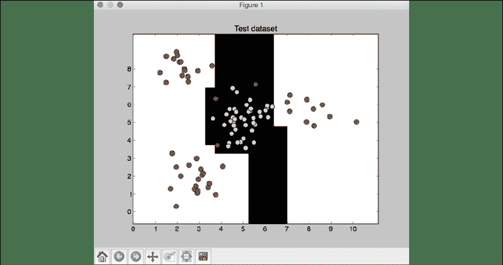
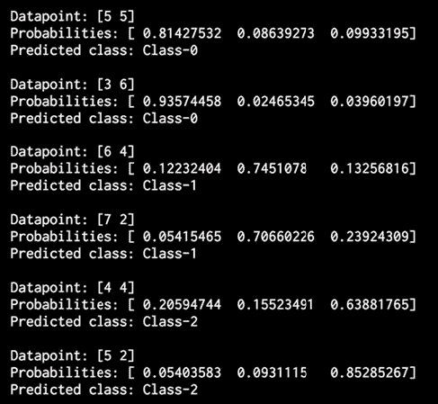
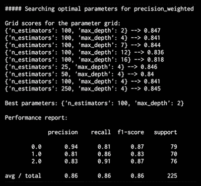
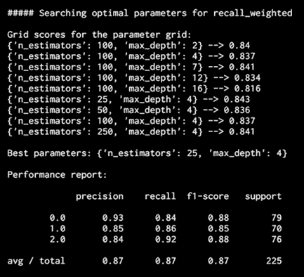

# 6 集成学习的预测分析

在本章中，我们将学习集成学习以及如何将其用于预测分析。 在本章的最后，您将对这些主题有更好的理解：

*   决策树和决策树分类器
*   集成学习学习模型
*   随机森林和极随机森林
*   预测的置信度估计
*   处理阶级失衡
*   使用网格搜索找到最佳训练参数
*   计算相对特征重要性
*   使用极其随机的森林回归量进行交通量预测

让我们从决策树开始。 首先，它们是什么？

# 什么是决策树？

**决策树**是将数据集划分为不同分支的方法。 然后遍历分支或分区以做出简单的决定。 决策树是由训练算法生成的，该算法确定了如何以最佳方式拆分数据。

决策过程从树顶部的根节点开始。 树中的每个节点都是决策规则。 算法基于输入数据和训练数据中目标标签之间的关系构造这些规则。 输入数据中的值用于估计输出值。

现在我们了解了决策树的基本概念，接下来要了解的概念是如何自动构建决策树。 我们需要可以根据数据构造最佳树的算法。 为了理解它，我们需要了解熵的概念。 在本文中，熵是指信息熵，而不是热力学熵。 信息熵基本上是不确定性的度量。 决策树的主要目标之一是减少从根节点到叶节点的不确定性。 当我们看到未知的数据点时，我们将完全不确定输出。 到叶子节点时，我们就可以确定输出了。 这意味着需要以减少每个级别的不确定性的方式构造决策树。 这意味着我们在沿着树前进时需要减少熵。

您可以在[这里](https://prateekvjoshi.com/2016/03/22/how-are-decision-trees-constructed-in-machine-learning)了解有关的更多信息。

## 建立决策树分类器

让我们看看如何使用 Python 中的决策树构建分类器。 创建一个新的 Python 文件并导入以下软件包：

```py
import numpy as np
import matplotlib.pyplot as plt
from sklearn.metrics import classification_report 
from sklearn.model_selection import train_test_split
from sklearn.tree import DecisionTreeClassifier 
```

```py
from utilities import visualize_classifier 
```

我们将使用提供给您的`data_decision_trees.txt`文件中的数据。 在此文件中，每一行都包含逗号分隔的值。 前两个值对应于输入数据，最后一个值对应于目标标签。 让我们从该文件加载数据：

```py
# Load input data
input_file = 'data_decision_trees.txt'
data = np.loadtxt(input_file, delimiter=',')
X, y = data[:, :-1], data[:, -1] 
```

根据标签将输入数据分为两个单独的类：

```py
# Separate input data into two classes based on labels
class_0 = np.array(X[y==0])
class_1 = np.array(X[y==1]) 
```

让我们使用散点图可视化输入数据：

```py
# Visualize input data
plt.figure()
plt.scatter(class_0[:, 0], class_0[:, 1], s=75, facecolors='black',
        edgecolors='black', linewidth=1, marker='x')
plt.scatter(class_1[:, 0], class_1[:, 1], s=75, facecolors='white',
        edgecolors='black', linewidth=1, marker='o')
plt.title('Input data') 
```

我们需要将数据分为训练和测试数据集：

```py
# Split data into training and testing datasets
X_train, X_test, y_train, y_test = train_test_split(
        X, y, test_size=0.25, random_state=5) 
```

基于训练数据集创建，构建和可视化决策树分类器。 `random_state`参数是指决策树分类算法初始化所需的随机数生成器使用的种子。 `max_depth`参数是指我们要构造的树的最大深度：

```py
# Decision Trees classifier
params = {'random_state': 0, 'max_depth': 4}
classifier = DecisionTreeClassifier(**params)
classifier.fit(X_train, y_train)
visualize_classifier(classifier, X_train, y_train, 'Training dataset') 
```

计算测试数据集上分类器的输出并将其可视化：

```py
y_test_pred = classifier.predict(X_test)
visualize_classifier(classifier, X_test, y_test, 'Test dataset') 
```

通过打印分类报告来评估分类器的性能：

```py
# Evaluate classifier performance
class_names = ['Class-0', 'Class-1']
print("\n" + "#"*40)
print("\nClassifier performance on training dataset\n")
print(classification_report(y_train, classifier.predict(X_train), target_names=class_names))
print("#"*40 + "\n") 
```

```py
print("#"*40)
print("\nClassifier performance on test dataset\n")
print(classification_report(y_test, y_test_pred, target_names=class_names))
print("#"*40 + "\n") 
```

```py
plt.show() 
```

完整代码在`decision_trees.py`文件中给出。 如果运行代码，您将看到一些数字。 第一个屏幕截图是输入数据的可视化：


图 1：可视化输入数据

第二张屏幕截图显示了测试数据集上的分类器边界：



图 2：测试数据集的分类器边界

您还将看到以下输出：


图 3：训练数据集上的分类器性能

分类器的性能以`precision`，`recall`和`f1-scores`为特征。 精度是指分类的准确性，召回率是指检索到的项目数占应检索的项目总数的百分比。 好的分类器将具有较高的精度和较高的查全率，但是通常在这两者之间需要权衡。 因此，我们有`f1-score`来表征。 F1 得分是精度和查全率的谐波平均值，使 F1 得分在精度和查全率之间取得了很好的平衡。

决策树是使用单个模型进行预测的示例。 通过组合和汇总多个模型的结果，有时可以创建更强大的模型和更好的预测。 一种方法是使用集成学习，这将在下一节中讨论。

# 什么是集成学习？

**集成学习**涉及建立多个模型，然后以使其产生比模型单独产生的结果更好的方式组合它们。 这些单独的模型可以是分类器，回归器或其他模型。

集成学习已广泛应用于多个领域，包括数据分类，预测建模和异常检测。

那么为什么要使用集成学习呢？ 为了获得理解，让我们使用一个真实的例子。 您想购买的新电视，但您不知道最新的型号是什么。 您的目标是使钱物有所值，但您对此主题的知识不足，无法做出明智的决定。 当您必须做出类似决定时，您可能会得到该领域内多位专家的意见。 这将帮助您做出最佳决定。 通常，您可以不依靠一种意见，而可以结合这些专家的个人决定来做出决定。 这样做可最大程度地减少错误或次优决策的可能性。

## 使用集成学习建立学习模型

选择模型时，常用的程序是选择训练数据集上误差最小的模型。 这种方法的问题在于，它并不总是有效。 该模型可能会出现偏差或过拟合训练数据。 即使使用交叉验证来训练模型，它也可能在未知数据上表现不佳。

集成学习模型之所以有效，是因为它们降低了选择不良模型的总体风险。 这使它能够以多种方式训练，然后在未知数据上表现良好。 使用集成学习构建模型时，各个模型需要表现出一定的多样性。 这使他们能够捕获数据中的各种细微差别。 因此整体模型变得更加准确。

通过为每个模型使用不同的训练参数来实现多样性。 这允许各个模型为训练数据生成不同的决策边界。 这意味着每个模型将使用不同的规则进行推断，这是验证结果的有效方法。 如果模型之间存在一致性，则可以增加预测的可信度。

集成学习的一种特殊类型是将决策树组合成一个集成。 这些模型通常被称为随机森林和极随机森林，我们将在接下来的章节中描述。

# 什么是随机森林和极随机森林？

**随机森林**是集成学习的实例，其中使用决策树构造单个模型。 然后，将这种决策树集合用于预测输出值。 我们使用训练数据的随机子集来构建每个决策树。

这将确保各种决策树之间的多样性。 在第一部分中，我们讨论了构建良好的集成学习模型时最重要的属性之一是确保各个模型之间存在多样性。

随机森林的优势之一是它们不会过拟合。 过拟合是机器学习中的常见问题。 非参数和非线性模型在学习目标函数时具有更大的灵活性，因此过拟合的可能性更大。 通过使用各种随机子集构建一组多样化的决策树，我们确保模型不会过拟合训练数据。 在树的构造过程中，将节点连续拆分，并选择最佳阈值以减小每个级别的熵。 此拆分未考虑输入数据集中的所有要素。 取而代之的是，它在考虑中的特征的随机子集中选择最佳分割。 添加此随机性往往会增加随机森林的偏差，但由于求平均值，方差会减小。 因此，我们最终得到了一个健壮的模型。

**极随机森林**将随机性提高到一个新水平。 除了采用特征的随机子集外，还随机选择阈值。 选择这些随机生成的阈值作为分割规则，这将进一步减小模型的方差。 因此，与使用随机森林获得的决策边界相比，使用极随机森林获得的决策边界趋于平滑。 极随机森林算法的某些实现还可以实现更好的并行化，并更好地扩展规模。

## 建立随机森林和极随机森林分类器

让我们看看如何可以基于随机森林和极其随机森林构建分类器。 构造两个分类器的方法非常相似，因此使用输入标志来指定需要构建哪个分类器。

创建一个新的 Python 文件并导入以下软件包：

```py
import argparse 
```

```py
import numpy as np
import matplotlib.pyplot as plt
from sklearn.metrics import classification_report
from sklearn.model_selection import train_test_split
from sklearn.ensemble import RandomForestClassifier, ExtraTreesClassifier 
from sklearn.metrics import classification_report 
```

```py
from utilities import visualize_classifier 
```

为 Python 定义一个参数解析器，以便我们可以将分类器类型作为输入参数。 依靠此参数，我们可以构造一个随机森林分类器或一个非常随机的森林分类器：

```py
# Argument parser
def build_arg_parser():
    parser = argparse.ArgumentParser(description='Classify data using \
            Ensemble Learning techniques')
    parser.add_argument('--classifier-type', dest='classifier_type',
            required=True, choices=['rf', 'erf'], help="Type of classifier \
                    to use; can be either 'rf' or 'erf'")
    return parser 
```

定义`main`函数并解析输入参数：

```py
if __name__=='__main__':
    # Parse the input arguments
    args = build_arg_parser().parse_args() 
    classifier_type = args.classifier_type 
```

我们将使用提供给您的`data_random_forests.txt`文件中的数据。 该文件中的每一行都包含逗号分隔的值。 前两个值对应于输入数据，最后一个值对应于目标标签。 在此数据集中，我们有三个不同的类。 让我们从该文件加载数据：

```py
 # Load input data
    input_file = 'data_random_forests.txt'
    data = np.loadtxt(input_file, delimiter=',')
    X, y = data[:, :-1], data[:, -1] 
```

将输入数据分为三类：

```py
 # Separate input data into three classes based on labels 
    class_0 = np.array(X[y==0])
    class_1 = np.array(X[y==1])
    class_2 = np.array(X[y==2]) 
```

让我们可视化输入数据：

```py
 # Visualize input data
    plt.figure()
    plt.scatter(class_0[:, 0], class_0[:, 1], s=75, facecolors='white',
                    edgecolors='black', linewidth=1, marker='s')
    plt.scatter(class_1[:, 0], class_1[:, 1], s=75, facecolors='white',
                    edgecolors='black', linewidth=1, marker='o')
    plt.scatter(class_2[:, 0], class_2[:, 1], s=75, facecolors='white',
                    edgecolors='black', linewidth=1, marker='^')
    plt.title('Input data') 
```

将数据分为训练和测试数据集：

```py
 # Split data into training and testing datasets
    X_train, X_test, y_train, y_test = train_test_split(
            X, y, test_size=0.25, random_state=5) 
```

定义构造分类器时要使用的参数。 `n_estimators`参数表示将要构建的树的数量。 `max_depth`参数指的是每棵树中的最大级别数。 `random_state`参数指的是初始化随机森林分类器算法所需的随机数生成器的种子值：

```py
 # Ensemble Learning classifier
    params = {'n_estimators': 100, 'max_depth': 4, 'random_state': 0} 
```

根据输入参数，我们可以构造一个随机森林分类器或一个非常随机的森林分类器：

```py
 if classifier_type == 'rf':
        classifier = RandomForestClassifier(**params)
    else:
        classifier = ExtraTreesClassifier(**params) 
```

训练和可视化分类器：

```py
 classifier.fit(X_train, y_train)
    visualize_classifier(classifier, X_train, y_train, 'Training dataset') 
```

根据测试数据集计算输出并将其可视化：

```py
 y_test_pred = classifier.predict(X_test)
    visualize_classifier(classifier, X_test, y_test, 'Test dataset') 
```

通过打印分类报告来评估分类器的性能：

```py
 # Evaluate classifier performance
    class_names = ['Class-0', 'Class-1', 'Class-2']
    print("\n" + "#"*40)
    print("\nClassifier performance on training dataset\n")
    print(classification_report(y_train, classifier.predict(X_train), target_names=class_names))
    print("#"*40 + "\n")

    print("#"*40)
    print("\nClassifier performance on test dataset\n")
    print(classification_report(y_test, y_test_pred, target_names=class_names))
    print("#"*40 + "\n") 
```

完整的代码在`random_forests.py`文件中给出。 让我们使用输入参数中的`rf`标志，使用随机森林分类器运行代码。 运行以下命令：

```py
$ python3 random_forests.py --classifier-type rf 
```

您会看到一些数字弹出。 第一个屏幕截图是输入数据：


图 4：可视化输入数据

在前面的屏幕截图中，这三个类分别由正方形，圆形和三角形表示。 我们看到类之间有很多重叠，但是现在应该没问题。 第二张屏幕截图显示了分类器边界：


图 5：测试数据集上的分类器边界

现在，通过在输入参数中使用`erf`标志，使用极其随机的森林分类器运行代码。 运行以下命令：

```py
$ python3 random_forests.py --classifier-type erf 
```

您会看到一些数字弹出。 我们已经知道输入数据的样子。 第二张屏幕截图显示了分类器边界：


图 6：测试数据集上的分类器边界

如果将前面的屏幕截图与从随机森林分类器获得的边界进行比较，您会发现这些边界更平滑。 原因是，极随机的森林在训练的过程中拥有更多的自由来提出好的决策树，因此它们通常产生更好的边界。

## 估计预测的置信度

如果分析输出，将看到为每个数据点打印了概率。 这些概率用于测量每个类别的置信度值。 估计置信度值是机器学习中的重要任务。 在同一 Python 文件中，添加以下行以定义测试数据点的数组：

```py
 # Compute confidence
    test_datapoints = np.array([[5, 5], [3, 6], [6, 4], [7, 2], [4, 4], [5, 2]]) 
```

分类器对象具有一种内置方法来计算置信度。 让我们对每个点进行分类并计算置信度值：

```py
 print("\nConfidence measure:") 
    for datapoint in test_datapoints:
        probabilities = classifier.predict_proba([datapoint])[0]
        predicted_class = 'Class-' + str(np.argmax(probabilities))
        print('\nDatapoint:', datapoint)
        print('Predicted class:', predicted_class) 
```

根据分类器边界可视化测试数据点：

```py
 # Visualize the datapoints
    visualize_classifier(classifier, test_datapoints, [0]*len(test_datapoints), 
            'Test datapoints') 
```

```py
 plt.show() 
```

如果运行带有`erf`标志的代码，您将获得以下输出：


图 7：测试数据集上的分类器边界

没有`erf`标志，它将产生以下输出：



图 8：数据集概率输出

对于每个数据点，它计算该点属于我们的三类的概率。 我们选择最有信心的一个。 使用`erf`标志运行代码，您将获得以下输出：


图 9：测试数据集上的分类器边界

如果没有`erf`标志，则应产生以下输出：


图 10：数据集概率输出

可以看出，输出由`t`与先前的结果组成。

# 处理类别失衡

分类器仅与用于训练的数据一样。 现实世界中面临的一个普遍问题是数据质量问题。 为了使分类器表现良好，每个分类器需要看到相等数量的点。 但是，当在现实世界中收集数据时，并不总是能够确保每个类都具有完全相同数量的数据点。 如果一个类别的数据点数是另一类别的 10 倍，则分类器倾向于偏向更多类别。 因此，我们需要确保考虑到这种不平衡算法。 让我们看看如何做到这一点。

创建一个新的 Python 文件并导入以下软件包：

```py
import sys 
```

```py
import numpy as np
import matplotlib.pyplot as plt
from sklearn.ensemble import ExtraTreesClassifier
from sklearn.model_selection import train_test_split
from sklearn.metrics import classification_report 
```

```py
from utilities import visualize_classifier 
```

我们将使用文件`data_imbalance.txt`中的数据进行分析。 让我们加载数据。

该文件中的每一行都包含逗号分隔的值。 前两个值对应于输入数据，最后一个值对应于目标标签。 我们在这个数据集中有两个类。 让我们从该文件加载数据：

```py
# Load input data
input_file = 'data_imbalance.txt'
data = np.loadtxt(input_file, delimiter=',')
X, y = data[:, :-1], data[:, -1] 
```

将输入数据分为两类：

```py
# Separate input data into two classes based on labels 
class_0 = np.array(X[y==0])
class_1 = np.array(X[y==1]) 
```

使用散点图可视化输入数据：

```py
# Visualize input data
plt.figure()
plt.scatter(class_0[:, 0], class_0[:, 1], s=75, facecolors='black',
                edgecolors='black', linewidth=1, marker='x')
plt.scatter(class_1[:, 0], class_1[:, 1], s=75, facecolors='white',
                edgecolors='black', linewidth=1, marker='o')
plt.title('Input data') 
```

将数据分为训练和测试数据集：

```py
# Split data into training and testing datasets
X_train, X_test, y_train, y_test = train_test_split.train_test_split(
        X, y, test_size=0.25, random_state=5) 
```

接下来，我们为极随机森林分类器定义参数。 请注意，有一个称为`balance`的输入参数可控制是否通过算法解决类不平衡问题。 如果是这样，则需要添加另一个名为`class_weight`的参数，该参数告诉分类器它应该权衡权重，以便与每个类中的数据点数量成正比：

```py
# Extremely Random Forests classifier
params = {'n_estimators': 100, 'max_depth': 4, 'random_state': 0}
if len(sys.argv) > 1:
    if sys.argv[1] == 'balance':
        params = {'n_estimators': 100, 'max_depth': 4, 'random_state': 0, 'class_weight': 'balanced'}
    else:
        raise TypeError("Invalid input argument; should be 'balance'") 
```

使用训练数据构建，训练和可视化分类器：

```py
classifier = ExtraTreesClassifier(**params)
classifier.fit(X_train, y_train)
visualize_classifier(classifier, X_train, y_train, 'Training dataset') 
```

预测测试数据集的输出并可视化输出：

```py
y_test_pred = classifier.predict(X_test)
visualize_classifier(classifier, X_test, y_test, 'Test dataset') 
```

计算分类器的性能并打印分类报告：

```py
# Evaluate classifier performance
class_names = ['Class-0', 'Class-1']
print("\n" + "#"*40)
print("\nClassifier performance on training dataset\n")
print(classification_report(y_train, classifier.predict(X_train), 
target_names=class_names))
print("#"*40 + "\n") 
```

```py
print("#"*40)
print("\nClassifier performance on test dataset\n")
print(classification_report(y_test, y_test_pred, target_names=class_names))
print("#"*40 + "\n") 
```

```py
plt.show() 
```

完整代码在文件`class_imbalance.py`中给出。 如果运行代码，您将看到以下图形。 第一个图表示输入数据：


图 11：可视化输入数据

第二个图形显示了测试数据的分类器边界：


图 12：测试数据集上的分类器边界

前面的图形指示边界无法捕获两个类之间的实际边界。 顶部附近的黑色斑点代表边界。 最后，您应该看到以下输出：


图 13：测试数据集上分类器的性能

您会看到一条警告，因为第一行的值为`0`，这在我们计算`f1-score`时会导致被零除的错误（`ZeroDivisionError`异常）。 使用`ignore`标志运行代码，以免看不到被零除警告：

```py
$ python3 --W ignore class_imbalance.py 
```

现在，如果要解决类不平衡的问题，请使用`balance`标志运行它：

```py
$ python3 class_imbalance.py balance 
```

分类器输出看起来像：


图 14：带有平衡的测试数据集的可视化

您应该看到以下输出：


图 15：测试数据集上分类器的性能

通过考虑的类别不平衡，我们能够对的类别进行分类，从而使`Class-0` 中的数据点的整体精度不为零。

# 使用网格搜索找到最佳训练参数

在使用分类器时，并非总是可能知道要使用什么最佳参数。 通过手动检查所有可能的组合来使用暴力效率不高。 这是网格搜索变得有用的地方。 网格搜索使我们可以指定范围为的值，分类器将自动运行各种配置以找出参数的最佳组合。 让我们来看看如何做。

创建一个新的 Python 文件并导入以下软件包：

```py
import numpy as np
import matplotlib.pyplot as plt
from sklearn.metrics import classification_report
from sklearn import grid_search
from sklearn.ensemble import ExtraTreesClassifier
from sklearn.model_selection import train_test_split
from sklearn.metrics import classification_report 
```

```py
from utilities import visualize_classifier 
```

我们将使用`data_random_forests.txt`中的可用数据进行分析：

```py
# Load input data
input_file = 'data_random_forests.txt'
data = np.loadtxt(input_file, delimiter=',')
X, y = data[:, :-1], data[:, -1] 
```

将数据分为三类：

```py
# Separate input data into three classes based on labels 
class_0 = np.array(X[y==0])
class_1 = np.array(X[y==1])
class_2 = np.array(X[y==2]) 
```

将数据分为训练和测试数据集：

```py
# Split the data into training and testing datasets
X_train, X_test, y_train, y_test = cross_validation.train_test_split(
        X, y, test_size=0.25, random_state=5) 
```

指定参数的网格供分类器测试。 通常，一个参数保持恒定，而另一个参数变化。 然后进行反演以找出最佳组合。 在这种情况下，我们想找到`n_estimators`和`max_depth`的最佳值。 让我们指定参数网格：

```py
# Define the parameter grid
parameter_grid = [{'n_estimators':[100], 'max_depth':[2,4,7,12,16]},
                 {'max_depth':[4],'n_estimators':[25,50,100,250]}] 
```

让我们定义分类器用来找到最佳参数组合的指标：

```py
metrics = ['precision_weighted', 'recall_weighted'] 
```

对于每个指标，我们需要运行网格搜索，在其中训练分类器以获取参数组合：

```py
for metric in metrics:
    print("\n##### Searching optimal parameters for", metric)

    classifier = grid_search.GridSearchCV(
            ExtraTreesClassifier(random_state=0),
            parameter_grid, cv=5, scoring=metric)
    classifier.fit(X_train, y_train) 
```

打印每个参数组合的分数：

```py
 print("\nGrid scores for the parameter grid:")
    for params, avg_score, _ in classifier.grid_scores_:
        print(params, '-->', round(avg_score, 3))

    print("\nBest parameters:", classifier.best_params_) 
```

打印效果报告：

```py
 y_pred = classifier.predict(X_test)
    print("\nPerformance report:\n")
    print(classification_report(y_test, y_pred)) 
```

完整代码在文件`run_grid_search.py`中给出。 如果运行代码，则将使用精度度量输出以下输出：



图 16：最佳参数搜索输出

基于网格搜索中的组合，它将打印出精度度量的最佳组合。 为了找到召回的最佳组合，可以检查以下输出：



图 17：最佳参数搜索输出

这是用于召回的不同组合，使成为一体，因为精度和召回率是对和不同参数组合进行界定的不同指标。

# 计算特征相对重要性

在将与包含 N 维数据点的数据集一起使用时，必须理解，并非所有功能都同样重要。 有些比其他更具歧视性。 如果我们有此信息，则可以使用它来减少维数。 这对于降低复杂度和提高算法速度很有用。 有时，一些功能是完全多余的。 因此，可以轻松地将它们从数据集中删除。

我们将使用`AdaBoost`回归器计算特征重要性。 AdaBoost 是 Adaptive Boosting 的缩写，是一种经常与其他机器学习算法结合使用以提高其性能的算法。 在 AdaBoost 中，从分布中提取训练数据点以训练当前分类器。 该分布会进行迭代更新，以便后续的分类器可以专注于更困难的数据点。 困难的数据点是那些分类错误的数据点。 这是通过在每个步骤更新发行版来完成的。 这将使先前被错误分类的数据点更有可能出现在用于训练的下一个样本数据集中。

然后将这些分类器进行级联，并通过加权多数投票做出决定。

创建一个新的 Python 文件并导入以下软件包：

```py
import numpy as np
import matplotlib.pyplot as plt
from sklearn.tree import DecisionTreeRegressor 
from sklearn.ensemble import AdaBoostRegressor 
from sklearn import datasets
from sklearn.metrics import mean_squared_error, explained_variance_score 
from sklearn.model_selection import import train_test_split
from sklearn.utils import shuffle 
```

```py
from utilities import visualize_feature_importances 
```

我们将使用 scikit-learn 中提供的内置房屋数据集：

```py
# Load housing data
housing_data = datasets.load_boston() 
```

对数据进行混洗，以使不会偏向于分析：

```py
# Shuffle the data
X, y = shuffle(housing_data.data, housing_data.target, random_state=7) 
```

将数据集分为训练和测试：

```py
# Split data into training and testing datasets
X_train, X_test, y_train, y_test = train_test_split(
        X, y, test_size=0.2, random_state=7) 
```

使用决策树回归器作为单独模型来定义和训练`AdaBoostregressor`：

```py
# AdaBoost Regressor model
regressor = AdaBoostRegressor(DecisionTreeRegressor(max_depth=4),
        n_estimators=400, random_state=7)
regressor.fit(X_train, y_train) 
```

估计回归器的性能：

```py
# Evaluate performance of AdaBoost regressor
y_pred = regressor.predict(X_test)
mse = mean_squared_error(y_test, y_pred)
evs = explained_variance_score(y_test, y_pred )
print("\nADABOOST REGRESSOR")
print("Mean squared error =", round(mse, 2))
print("Explained variance score =", round(evs, 2)) 
```

此回归器具有一个内置方法，可以调用该方法来计算相对特征的重要性：

```py
# Extract feature importances
feature_importances = regressor.feature_importances_
feature_names = housing_data.feature_names 
```

归一化相对要素重要性的值：

```py
# Normalize the importance values 
feature_importances = 100.0 * (feature_importances / max(feature_importances)) 
```

对它们进行排序，以便可以进行绘制：

```py
# Sort the values and flip them
index_sorted = np.flipud(np.argsort(feature_importances)) 
```

排列条形图在 x 轴上的刻度：

```py
# Arrange the X ticks
pos = np.arange(index_sorted.shape[0]) + 0.5 
```

绘制条形图：

```py
# Plot the bar graph
plt.figure()
plt.bar(pos, feature_importances[index_sorted], align='center')
plt.xticks(pos, feature_names[index_sorted])
plt.ylabel('Relative Importance')
plt.title('Feature importance using AdaBoost regressor')
plt.show() 
```

完整代码在文件`feature_importance.py`中给出。 如果运行代码，则应该看到以下输出：


图 18：使用 Adaboost 回归器的功能重要性

根据这一分析，特征`LSTAT`是该数据集中最重要的特征。

# 使用极随机森林回归器预测流量

让我们将在上一节中学习的概念应用于一个实际问题。 [我们将使用可用数据集](https://archive.ics.uci.edu/ml/datasets/Dodgers+Loop+Sensor)。 该数据集包含对在洛杉矶道奇体育场（Lod Angeles Dodgers Stadium）进行的棒球比赛中道路上经过的车辆进行计数的数据。 为了使数据易于分析，我们需要对其进行预处理。 预处理后的数据在文件`traffic_data.txt`中。 在此文件中，每一行均包含逗号分隔的字符串。 让我们以第一行为例：

```py
Tuesday,00:00,San Francisco,no,3 
```

参考上一行，其格式如下：

一周中的一天，一天中的时间，对手团队，指示棒球比赛当前正在进行的二进制值（是/否），经过的车辆数量。

我们的目标是通过使用给定的信息来预测车辆行驶的数量。 由于输出变量是连续值，因此我们需要构建一个可以预测输出的回归变量。 我们将使用极其随机的森林来构建此回归器。 让我们继续进行，看看如何做到这一点。

创建一个新的 Python 文件并导入以下软件包：

```py
import numpy as np
import matplotlib.pyplot as plt
from sklearn.metrics import classification_report, mean_absolute_error 
from sklearn import cross_validation, preprocessing
from sklearn.ensemble import ExtraTreesRegressor
from sklearn.metrics import classification_report 
```

将数据加载到文件`traffic_data.txt`中：

```py
# Load input data
input_file = 'traffic_data.txt'
data = []
with open(input_file, 'r') as f:
    for line in f.readlines():
        items = line[:-1].split(',')
        data.append(items) 
```

```py
data = np.array(data) 
```

数据中的非数字特征需要进行编码。 不对数字特征进行编码也很重要。 每个需要编码的功能都需要有一个单独的标签编码器。 我们需要跟踪这些编码器，因为当我们要计算未知数据点的输出时将需要它们。 让我们创建那些标签编码器：

```py
# Convert string data to numerical data
label_encoder = []
X_encoded = np.empty(data.shape)
for i, item in enumerate(data[0]):
    if item.isdigit():
        X_encoded[:, i] = data[:, i]
    else:
        label_encoder.append(preprocessing.LabelEncoder())
        X_encoded[:, i] = label_encoder[-1].fit_transform(data[:, i])
X = X_encoded[:, :-1].astype(int)
y = X_encoded[:, -1].astype(int) 
```

将数据分为训练和测试数据集：

```py
# Split data into training and testing datasets
X_train, X_test, y_train, y_test = cross_validation.train_test_split(
        X, y, test_size=0.25, random_state=5) 
```

训练一个非常随机的森林回归器：

```py
# Extremely Random Forests regressor
params = {'n_estimators': 100, 'max_depth': 4, 'random_state': 0}
regressor = ExtraTreesRegressor(**params)
regressor.fit(X_train, y_train) 
```

根据测试数据计算回归器的性能：

```py
# Compute the regressor performance on test data
y_pred = regressor.predict(X_test)
print("Mean absolute error:", round(mean_absolute_error(y_test, y_pred), 2)) 
```

让我们看看如何计算未知数据点的输出。 标签编码器将用于将非数字特征转换为数值：

```py
# Testing encoding on single data instance 
test_datapoint = ['Saturday', '10:20', 'Atlanta', 'no'] 
test_datapoint_encoded = [-1] * len(test_datapoint) 
count = 0
for i, item in enumerate(test_datapoint): 
    if item.isdigit():
        test_datapoint_encoded[i] = int(test_datapoint[i])
    else:
        test_datapoint_encoded[i] = int(label_encoder[count].transform(test_datapoint[i]))
        count = count + 1 
```

```py
data = np.array(data)
test_datapoint_encoded = np.array(test_datapoint_encoded) 
```

预测输出：

```py
# Predict the output for the test datapoint
print("Predicted traffic:", int(regressor.predict([test_datapoint_encoded])[0])) 
```

完整代码在文件`traffic_prediction.py`中给出。 如果运行代码，则将获得`26`作为输出，接近实际值，并确认我们的模型正在做出不错的预测。 您可以从数据文件中确认。

# 总结

在本章中，我们学习了集成学习及其在现实世界中的使用方式。 我们讨论了决策树以及如何基于决策树构建分类器。

我们了解了随机森林和极随机森林，它们是由多个决策树组成的。 我们讨论了如何基于它们构建分类器。 我们了解了如何估计预测的置信度。 我们还学习了如何处理班级失衡问题。

我们讨论了如何找到最佳训练参数以使用网格搜索来构建模型。 我们学习了如何计算相对特征的重要性。 然后，我们将集成学习技术应用于一个实际问题，在该问题中，我们使用一个非常随机的森林回归量来预测流量。

在下一章中，我们将讨论无监督学习以及如何检测股市数据中的模式。