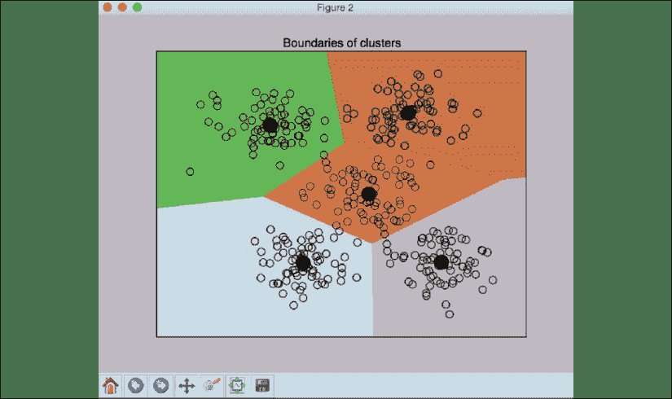
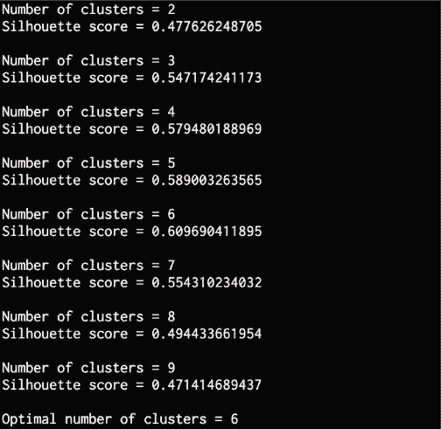
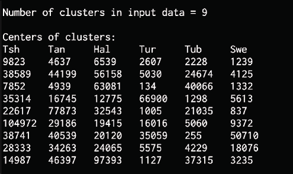

# 7

# 通过无监督学习检测模式

在本章中，我们将学习无监督学习以及如何在现实世界中使用它。 到本章末，您将对以下主题有更好的理解：

*   无监督学习定义
*   使用 K 均值算法对数据进行聚类
*   用均值漂移算法估计聚类数
*   用轮廓分数估算聚类的质量
*   高斯混合模型
*   基于高斯混合模型构建分类器
*   使用相似性传播模型在股票市场中寻找子群体
*   根据购物模式细分市场

# 什么是无监督学习？

无监督学习是指不使用标记的训练数据而构建机器学习模型的过程。 无监督学习可在各种研究领域中找到应用，包括市场细分，股票市场，自然语言处理和计算机视觉等。

在前面的章节中，我们处理的是带有相关标签的数据。 在标记了训练数据之后，算法会学习根据这些标记对数据进行分类。 在现实世界中，标记数据可能并不总是可用。

有时，存在大量未加标签的数据，需要以某种方式对其进行分类。 这是无监督学习的完美用例。 无监督学习算法尝试使用某种相似性度量将数据分类到给定数据集中的子组中。

当我们有一个没有任何标签的数据集时，我们假定该数据是由于以某种方式控制分布的潜在变量而生成的。 然后可以从各个数据点开始以分级方式进行学习过程。 我们可以通过查找相似性的自然簇并尝试通过对数据进行分类和分段来获取信号和见解，从而为数据提供更深层次的表示。 让我们看看使用无监督学习对数据进行分类的一些方法。

# 使用 K 均值算法聚类数据

聚类是最流行的无监督学习技术之一。 此技术用于分析数据并在该数据中查找聚类。 为了找到这些聚类，我们使用相似性度量（例如欧几里得距离）来找到子组。 这种相似性度量可以估计群集的紧密度。 聚类是将数据组织到元素彼此相似的子组中的过程。

该算法的目标是识别使数据点属于同一子组的数据点的固有属性。 没有适用于所有情况的通用相似性指标。 例如，我们可能有兴趣查找每个子组的代表性数据点，或者我们有兴趣查找数据中的异常值。 根据情况，不同的指标可能比其他指标更合适。

K 均值算法是一种用于对数据进行聚类的众所周知的算法。 为了使用它，预先假定簇的数量。 使用各种数据属性将数据分为`K`子组。 簇的数量是固定的，并且根据该数量对数据进行分类。 这里的主要思想是我们需要在每次迭代时更新质心的位置。 重心是代表群集中心的位置。 我们继续进行迭代，直到将质心放置在其最佳位置。

我们可以看到质心的初始位置在算法中起着重要的作用。 这些质心应该以巧妙的方式放置，因为这会直接影响结果。 一个好的策略是将它们放置在尽可能远的距离。

基本的 K 均值算法将这些质心随机放置在`K-Means++`从数据点的输入列表中从算法上选择这些点的位置。 它试图使初始质心彼此远离，以便它们快速收敛。 然后，我们遍历训练数据集并将每个数据点分配给最接近的质心。

一旦我们遍历了整个数据集，第一次迭代就结束了。 这些点已根据初始化的质心进行了分组。 根据在第一次迭代结束时获得的新簇重新计算质心的位置。 一旦获得一组新的`K`重心，便会重复该过程。 我们遍历数据集并将每个点分配给最近的质心。

随着步骤不断重复，质心继续移动到其平衡位置。 经过一定数量的迭代后，质心不再更改其位置。 重心会聚到最终位置。 这些`K`重心是将用于推断的值。

让我们对二维数据应用 K 均值聚类，以了解其工作原理。 我们将使用提供给您的`data_clustering.txt`文件中的数据。 每行包含两个逗号分隔的数字。

创建一个新的 Python 文件并导入以下软件包：

```
import numpy as np
import matplotlib.pyplot as plt
from sklearn.cluster import KMeans
from sklearn import metrics 
```

从文件中加载输入数据：

```
# Load input data
X = np.loadtxt('data_clustering.txt', delimiter=',') 
```

在应用 K 均值算法之前定义簇数：

```
num_clusters = 5 
```

可视化输入数据以查看展开图的样子：

```
# Plot input data
plt.figure()
plt.scatter(X[:,0], X[:,1], marker='o', facecolors='none',
        edgecolors='black', s=80)
x_min, x_max = X[:, 0].min() - 1, X[:, 0].max() + 1
y_min, y_max = X[:, 1].min() - 1, X[:, 1].max() + 1
plt.title('Input data')
plt.xlim(x_min, x_max)
plt.ylim(y_min, y_max)
plt.xticks(())
plt.yticks(()) 
```

可以看出该数据中有五个组。 使用初始化参数创建`KMeans`对象。 `init`参数表示选择簇的初始中心的初始化方法。 而不是随机选择它们，我们使用`k-means++`以更智能的方式选择这些中心。 这样可以确保算法快速收敛。 `n_clusters`参数是指群集数。 `n_init`参数是指算法在确定最佳结果之前应运行的次数：

```
# Create KMeans object
kmeans = KMeans(init='k-means++', n_clusters=num_clusters, n_init=10) 
```

使用输入数据训练 K 均值模型：

```
# Train the KMeans clustering model 
kmeans.fit(X) 
```

为了可视化边界，我们需要创建一个点网格并在所有这些点上评估模型。 让我们定义这个网格的步长：

```
# Step size of the mesh 
step_size = 0.01 
```

我们定义点的网格，并确保我们覆盖了输入数据中的所有值：

```
# Define the grid of points to plot the boundaries
x_min, x_max = X[:, 0].min() - 1, X[:, 0].max() + 1
y_min, y_max = X[:, 1].min() - 1, X[:, 1].max() + 1
x_vals, y_vals = np.meshgrid(np.arange(x_min, x_max, step_size),
        np.arange(y_min, y_max, step_size)) 
```

使用训练好的 K 均值模型预测网格上所有点的输出：

```
# Predict output labels for all the points on the grid
output = kmeans.predict(np.c_[x_vals.ravel(), y_vals.ravel()]) 
```

绘制所有输出值并为每个区域着色：

```
# Plot different regions and color them
output = output.reshape(x_vals.shape)
plt.figure()
plt.clf()
plt.imshow(output, interpolation='nearest', 
           extent=(x_vals.min(), x_vals.max(),
               y_vals.min(), y_vals.max()),
           cmap=plt.cm.Paired,
           aspect='auto',
           origin='lower') 
```

在这些有色区域上方叠加输入数据点：

```
# Overlay input points
plt.scatter(X[:,0], X[:,1], marker='o', facecolors='none',
        edgecolors='black', s=80) 
```

绘制使用 K 均值算法获得的聚类中心：

```
# Plot the centers of clusters
cluster_centers = kmeans.cluster_centers_
plt.scatter(cluster_centers[:,0], cluster_centers[:,1], 
        marker='o', s=210, linewidths=4, color='black', 
        zorder=12, facecolors='black')
x_min, x_max = X[:, 0].min() - 1, X[:, 0].max() + 1
y_min, y_max = X[:, 1].min() - 1, X[:, 1].max() + 1
plt.title('Boundaries of clusters')
plt.xlim(x_min, x_max)
plt.ylim(y_min, y_max)
plt.xticks(())
plt.yticks(())
plt.show() 
```

完整的代码在`kmeans.py`文件的中给出。 如果运行代码，您将看到两个屏幕截图。 第一个屏幕截图是输入数据：


图 1：可视化输入数据

第二个屏幕截图表示使用 K 均值获得的边界：



图 2：K 均值边界

每个群集中心的黑色填充圆圈表示该群集的质心。

涵盖了 K 均值算法之后，我们现在将继续另一种方法：MeanShift 算法。

## 使用均值漂移算法估算聚类数

**均值漂移**是用于无监督学习的功能强大的算法。 这是一种经常用于聚类的非参数算法。 它是非参数的，因为它不对基础分布进行任何假设。 这与参量技术形成对比，参量技术假定基础数据遵循标准概率分布。 MeanShift 在对象跟踪和实时数据分析等领域中找到了许多应用程序。

在均值漂移算法中，整个特征空间被视为概率密度函数。 我们从训练数据集开始，并假设它是从概率密度函数中采样的。

在此框架中，聚类对应于基础分布的局部最大值。 如果存在`K`个簇，则基础数据分布中存在`K`个峰，均值漂移将识别这些峰。

MeanShift 的目标是识别质心的位置。 对于训练数据集中的每个数据点，它在其周围定义一个窗口。 然后，它为此窗口计算质心，并将位置更新为该新质心。 然后，通过在新位置周围定义一个窗口，对该新位置重复该过程。 随着我们不断这样做，我们将更接近群集的峰值。 每个数据点都将移向其所属的群集。 运动正朝着更高密度的区域发展。

重心（也称为均值）不断移向每个簇的峰。 该算法的名字源于手段不断变化的事实。 这种变化一直持续到算法收敛为止，在此阶段，质心不再移动。

让我们看看如何使用`MeanShift`估算给定数据集中的最佳簇数。 `data_clustering.txt`文件中的数据将用于分析。 该文件与 K 均值算法部分在*聚类数据中使用的文件相同。*

创建一个新的 Python 文件并导入以下软件包：

```
import numpy as np
import matplotlib.pyplot as plt
from sklearn.cluster import MeanShift, estimate_bandwidth
from itertools import cycle 
```

加载输入数据：

```
# Load data from input file
X = np.loadtxt('data_clustering.txt', delimiter=',') 
```

估计输入数据的带宽。 带宽是 MeanShift 算法中使用的底层内核密度估计过程的参数。 带宽会影响算法的整体收敛速度，并最终影响最终的簇数。 因此，这是一个关键参数-如果带宽太小，可能会导致群集过多，而如果值太大，则会合并不同的群集。

`quantile`参数影响估计带宽的方式。 分位数的较高值将增加估计的带宽，从而导致较少的群集：

```
# Estimate the bandwidth of X
bandwidth_X = estimate_bandwidth(X, quantile=0.1, n_samples=len(X)) 
```

然后使用估计的带宽训练均值漂移聚类模型：

```
# Cluster data with MeanShift
meanshift_model = MeanShift(bandwidth=bandwidth_X, bin_seeding=True)
meanshift_model.fit(X) 
```

提取所有群集的中心：

```
# Extract the centers of clusters
cluster_centers = meanshift_model.cluster_centers_
print('\nCenters of clusters:\n', cluster_centers) 
```

提取集群数：

```
# Estimate the number of clusters 
labels = meanshift_model.labels_
num_clusters = len(np.unique(labels))
print("\nNumber of clusters in input data =", num_clusters) 
```

可视化和数据点：

```
# Plot the points and cluster centers
plt.figure()
markers = 'o*xvs'
for i, marker in zip(range(num_clusters), markers):
    # Plot points that belong to the current cluster
    plt.scatter(X[labels==i, 0], X[labels==i, 1], marker=marker, color='black') 
```

绘制当前群集的中心：

```
 # Plot the cluster center 
    cluster_center = cluster_centers[i]
    plt.plot(cluster_center[0], cluster_center[1], marker='o',  
            markerfacecolor='black', markeredgecolor='black',
            markersize=15)
plt.title('Clusters')
plt.show() 
```

完整代码在`mean_shift.py`文件中给出。 如果运行代码，您将看到以下屏幕快照，代表群集及其中心：


图 3：聚类图的中心

您将看到以下输出：：


图 4：集群输出的中心

至此，我们完成了均值漂移的概述。 到目前为止，我们已经讨论了如何对数据进行聚类。 接下来，我们将继续介绍如何使用轮廓方法估算聚类的质量。

## 使用轮廓分数估算聚类的质量

如果数据自然地组织成几个不同的簇，那么很容易在视觉上对其进行检查并得出一些推论。 不幸的是，在现实世界中很少如此。 现实世界中的数据庞大而混乱。 因此，我们需要一种量化聚类质量的方法。

剪影是指用于检查数据中群集一致性的方法。 它提供了每个数据点与其群集的融合程度的估计。 轮廓分数是衡量数据点与其自身群集（与其他群集相比）的相似性的度量。 轮廓分数适用于任何相似度指标。

对于每个数据点，使用以下公式计算轮廓分数：

`轮廓分数 = (p – q) / max(p, q)`

这里，`p`是到数据点不属于的最近群集中各点的平均距离，`q`是到所有点的平均群集内距离在其自己的群集中。

轮廓分数范围的值在`-1`和`1`之间。 接近`1`的分数表示该数据点与群集中的其他数据点非常相似，而接近`-1`的分数指示该数据点与其他数据不同 点在集群中。 一种思考的方法是，如果有太多带有负轮廓分数的点，那么数据中的簇可能太少或太多。 我们需要再次运行聚类算法以找到最佳数目的聚类。 理想情况下，我们希望具有较高的正值。 根据业务问题，我们不需要优化并具有尽可能高的价值，但是通常，如果我们的剪影得分接近`1`，则表明数据可以很好地聚类。 如果分数接近`-1`，则表明我们用于分类的变量有噪声，并且不包含太多信号。

让我们看看如何使用轮廓分数来估计聚类性能。 创建一个新的 Python 文件并导入以下软件包：

```
import numpy as np
import matplotlib.pyplot as plt
from sklearn import metrics
from sklearn.cluster import KMeans 
```

我们将使用提供给您的`data_quality.txt`文件中的数据。 每行包含两个逗号分隔的数字：

```
# Load data from input file
X = np.loadtxt('data_quality.txt', delimiter=',') 
```

初始化变量。 `values`数组将包含一个值列表，以进行迭代并找到最佳簇数：

```
# Initialize variables
scores = []
values = np.arange(2, 10) 
```

遍历所有值并在每次迭代期间构建 K 均值模型：

```
# Iterate through the defined range 
for num_clusters in values:
    # Train the KMeans clustering model
    kmeans = KMeans(init='k-means++', n_clusters=num_clusters, n_init=10) 
    kmeans.fit(X) 
```

使用欧几里德距离度量来估计当前聚类模型的轮廓分数：

```
 score = metrics.silhouette_score(X, kmeans.labels_,
                metric='euclidean', sample_size=len(X)) 
```

打印轮廓分数作为当前值：

```
 print("\nNumber of clusters =", num_clusters) 
    print("Silhouette score =", score)

    scores.append(score) 
```

可视化轮廓分数的各种值：

```
# Plot silhouette scores 
plt.figure()
plt.bar(values, scores, width=0.7, color='black', align='center') 
plt.title('Silhouette score vs number of clusters') 
```

提取最佳分数和集群数量的相应值：

```
# Extract best score and optimal number of clusters 
num_clusters = np.argmax(scores) + values[0] 
print('\nOptimal number of clusters =', num_clusters) 
```

可视化输入数据：

```
# Plot data
plt.figure()
plt.scatter(X[:,0], X[:,1], color='black', s=80, marker='o', facecolors='none')
x_min, x_max = X[:, 0].min() - 1, X[:, 0].max() + 1
y_min, y_max = X[:, 1].min() - 1, X[:, 1].max() + 1
plt.title('Input data')
plt.xlim(x_min, x_max)
plt.ylim(y_min, y_max)
plt.xticks(())
plt.yticks(()) 
```

```
plt.show() 
```

完整代码在文件`clustering_quality.py`中给出。 如果运行代码，您将看到两个屏幕截图。 第一个屏幕截图是输入数据：


图 5：可视化输入数据

我们可以看到，数据中有六个簇。 第二张屏幕截图代表了簇数的各种值的得分：


图 6：轮廓得分与簇数的关系

我们可以验证轮廓分数在`0.6`的值处达到峰值，这与数据一致。 您将看到以下输出：



图 7：最佳集群输出

在本节中，我们了解了轮廓分数以及它们如何帮助我们理解聚类。 现在，我们将学习高斯混合模型，这是对 简化和聚类数据的另一种无监督学习技术。

# 什么是高斯混合模型？

在讨论**高斯混合模型**（**GMM**）之前，让我们首先了解什么是混合模型。 混合模型是一种概率密度模型，其中假定数据由几种成分分布控制。 如果这些分布是高斯分布，则该模型将变为高斯混合模型。 组合这些成分分布以提供多峰密度函数，该函数成为混合模型。

让我们看一个示例，以了解混合模型如何工作。 我们要模拟南美所有人的购物习惯。 做到这一点的一种方法是对整个大陆进行建模，然后将所有内容拟合为一个模型，但是不同国家/地区的人购物方式不同。 因此，我们需要了解各个国家/地区的人们如何购物以及他们的行为方式。

为了获得良好的代表性模型，我们需要考虑非洲大陆内的所有变化。 在这种情况下，我们可以使用混合模型来建模各个国家/地区的购物习惯，然后将它们全部组合成一个混合模型。

这样，就不会错过各个国家基本行为数据中的细微差别。 通过不在所有国家/地区实现单一模型，可以创建更准确的模型。

需要注意的有趣一点是，混合模型是半参数的，这意味着它们部分依赖于一组预定义的函数。 它们可以为数据的基础分布建模提供更高的精度和灵活性。 它们可以消除因稀疏数据而导致的差距。

定义函数后，混合模型将从半参数变为参数。 因此， GMM 是一个参数模型，表示为分量高斯函数的加权和。 我们假设数据是由一组以某种方式组合的高斯模型生成的。 GMM 非常强大，并用于许多领域。 GMM 的参数是使用算法（例如**期望最大化**（**EM**）或**最大后验概率**（**MAP**）估算。 GMM inc 的一些流行应用包括图像数据库检索，股票市场波动建模，生物特征验证等。

现在我们已经描述了什么是 GMM，让我们看看如何应用它们。

## 基于高斯混合模型构建分类器

让我们基于高斯混合模型构建分类器。 创建一个新的 Python 文件并导入以下软件包：

```
import numpy as np
import matplotlib.pyplot as plt
from matplotlib import patches 
```

```
from sklearn import datasets 
from sklearn.mixture import GaussianMixture 
from sklearn.model_selection import StratifiedKFold
from sklearn.model_selection import train_test_split 
```

让我们使用 scikit-learn 中可用的鸢尾花数据集进行分析：

```
# Load the iris dataset 
iris = datasets.load_iris() 
```

```
X, y = datasets.load_iris(return_X_y=True) 
```

使用 80/20 拆分将数据集拆分为训练和测试。 `n_splits`参数指定您将获得的子集数。 我们使用`5`的值，这意味着数据集将分为五个部分。

我们将使用四个部分来进行训练，使用一个部分来进行测试，从而得出 80/20 的比例：

```
# Split dataset into training and testing (80/20 split)
skf = StratifiedKFold(n_splits=5) # 
skf.get_n_splits(X, y) 
```

```
X_train, X_test, y_train, y_test = train_test_split(X, y, test_size=0.4, random_state=0) 
```

提取训练数据中的班级数量：

```
# Extract the number of classes 
num_classes = len(np.unique(y_train)) 
```

使用相关参数构建基于 GMM 的分类器。 `n_components`参数指定基础分发中的组件数。 在这种情况下，它将是数据中不同类的数量。 我们需要指定要使用的协方差类型。 在这种情况下，将使用完全协方差。 `init_params`参数控制在训练过程中需要更新的参数。 使用`kmeans`值，这意味着权重和协方差参数将在训练期间更新。 `max_iter`参数是指训练期间将执行的期望最大化迭代次数：

```
# Build GMM
classifier = GaussianMixture(n_components=num_classes, covariance_type='full',init_params='kmeans', max_iter=20) 
```

初始化分类器的方法：

```
# Initialize the GMM means
classifier.means_ = np.array([X_train[y_train == i].mean(axis=0) 
for i in range(num_classes)])
```

使用训练数据训练高斯混合模型分类器：

```
# Train the GMM classifier
classifier.fit(X_train) 
```

可视化分类器的边界。 然后提取特征值和特征向量，以估计如何在簇周围绘制椭圆边界。 有关特征值和特征向量的快速更新，请参阅[这里](https://math.mit.edu/~gs/linearalgebra/ila0601.pdf)。 让我们继续进行以下绘制：

```
# Draw boundaries
plt.figure()
colors = 'bgr'
for i, color in enumerate(colors):
    # Extract eigenvalues and eigenvectors
    eigenvalues, eigenvectors = np.linalg.eigh(
            classifier.covariances_[i][:2, :2]) 
```

归一化第一个特征向量：

```
 # Normalize the first eigenvector
    norm_vec = eigenvectors[0] / np.linalg.norm(eigenvectors[0]) 
```

椭圆需要旋转以准确显示分布。 估计角度：

```
 # Extract the angle of tilt
    angle = np.arctan2(norm_vec[1], norm_vec[0])
    angle = 180 * angle / np.pi 
```

放大椭圆以进行可视化。 特征值控制椭圆的大小：

```
 # Scaling factor to magnify the ellipses 
    # (random value chosen to suit our needs) 
    scaling_factor = 8
    eigenvalues *= scaling_factor 
```

绘制椭圆：

```
 # Draw the ellipse
    ellipse = patches.Ellipse(classifier.means_[i, :2],
            eigenvalues[0], eigenvalues[1], 180 + angle,
            color=color)
    axis_handle = plt.subplot(1, 1, 1)
    ellipse.set_clip_box(axis_handle.bbox)
    ellipse.set_alpha(0.6)
    axis_handle.add_artist(ellipse) 
```

在图上叠加输入数据：

```
# Plot the data
colors = 'bgr'
for i, color in enumerate(colors): 
    cur_data = iris.data[iris.target == i]
    plt.scatter(cur_data[:,0], cur_data[:,1], marker='o',
            facecolors='none', edgecolors='black', s=40,
            label=iris.target_names[i]) 
```

在此图上叠加测试数据：

```
 test_data = X_test[y_test == i]  
    plt.scatter(test_data[:,0], test_data[:,1], marker='s',
            facecolors='black', edgecolors='black', s=40 ,
            label=iris.target_names[i]) 
```

计算训练和测试数据的预测输出：

```
# Compute predictions for training and testing data
y_train_pred = classifier.predict(X_train)
accuracy_training = np.mean(y_train_pred.ravel() == y_train.ravel()) * 100 
print('Accuracy on training data =', accuracy_training) 
```

```
y_test_pred = classifier.predict(X_test)
accuracy_testing = np.mean(y_test_pred.ravel() == y_test.ravel()) * 100 
print('Accuracy on testing data =', accuracy_testing) 
```

```
plt.title('GMM classifier')
plt.xticks(())
plt.yticks(()) 
```

```
plt.show() 
```

完整代码在文件`gmm_classifier.py`中给出。 运行代码后，您将看到以下输出：


图 8：高斯混合模型分类器图

输入的数据由三个分布组成。  不同大小和角度的三个椭圆表示输入数据中的基础分布。 您将看到以下输出：

```
Accuracy on training data = 87.5
Accuracy on testing data = 86.6666666667 
```

在本节中，我们学习了高斯混合模型，并使用 Python 开发了一个示例。 在下一节中，我们将学习另一种无监督学习技术，即相似性传播模型，用于对数据进行分类，并将其用于  ，以便在股市数据中查找子组。

使用“相似性传播”模型在股票市场中寻找子群体

**相似性传播**是一种聚类算法，不需要事先指定多个聚类。 由于其通用性和实现的简便性，它已在许多领域中找到了许多应用。 它使用一种称为消息传递的技术找出代表性的簇，称为样本。 它从指定需要考虑的相似性度量开始。 同时将所有训练数据点视为潜在的范例。 然后，它在数据点之间传递消息，直到找到一组示例为止。

消息传递发生在两个备用步骤中，分别称为**责任**和**可用性**。 责任是指从群集成员发送到候选示例的消息，指示该数据点作为该示例群集的成员的适合程度。 可用性是指从候选示例发送到集群的潜在成员的消息，表明它作为示例的适用性。 一直执行此操作，直到算法收敛到最佳样本集为止。

还有一个称为首选项的参数，该参数控制将发现的示例数量。 如果选择较高的值，则将导致算法找到太多的聚类。 如果选择一个较低的值，则将导致少数簇。 最佳值是点之间的中间相似度。

让我们使用“相似性传播”模型来查找股票市场中的子组。 我们将使用开盘价和收盘价之间的股票报价变化作为控制特征。 创建一个新的 Python 文件并导入以下软件包：

```
import datetime
import json
import numpy as np
import matplotlib.pyplot as plt
from sklearn import covariance, cluster
import yfinance as yf 
```

matplotlib 中可用的股市数据将用作输入。 公司符号在文件`company_symbol_mapping.json`中映射到其全名：

```
# Input file containing company symbols 
input_file = 'company_symbol_mapping.json' 
```

从文件中加载公司符号图：

```
# Load the company symbol map
with open(input_file, 'r') as f:
    company_symbols_map = json.loads(f.read()) 
```

```
symbols, names = np.array(list(company_symbols_map.items())).T 
```

从 matplotlib 加载股票报价：

```
# Load the historical stock quotes 
start_date = datetime.datetime(2019, 1, 1)
end_date = datetime.datetime(2019, 1, 31)
quotes = [yf.Ticker(symbol).history(start=start_date, end=end_date)
                for symbol in symbols] 
```

计算开始和结束报价之间的差异：

```
# Extract opening and closing quotes 
opening_quotes = np.array([quote.Open for quote in quotes]).astype(np.float)
closing_quotes = np.array([quote.Close for quote in quotes]).astype(np.float) 
```

```
# Compute differences between opening and closing quotes
quotes_diff = closing_quotes - opening_quotes 
```

规范化数据：

```
# Normalize the data
X = quotes_diff.copy().T
X /= X.std(axis=0) 
```

创建一个图形模型：

```
# Create a graph model
edge_model = covariance.GraphLassoCV() 
```

训练模型：

```
# Train the model
with np.errstate(invalid='ignore'): 
    edge_model.fit(X) 
```

使用我们刚刚训练的边缘模型构建相似性传播聚类模型：

```
# Build clustering model using Affinity Propagation model
_, labels = cluster.affinity_propagation(edge_model.covariance_)
num_labels = labels.max() 
```

打印输出：

```
# Print the results of clustering
print('\nClustering of stocks based on difference in opening and closing quotes:\n')
for i in range(num_labels + 1):
    print("Cluster", i+1, "==>", ', '.join(names[labels == i])) 
```

完整代码在文件`stocks.py`中给出。 运行代码时，您将看到以下输出：


图 9：基于开盘价和收盘价差异的股票聚类

此输出代表该时间段内股票市场中的各个子组。 请注意，运行代码时群集可能会以不同的顺序出现。

既然我们已经了解了“相似性传播”模型并学习了一些新概念，我们将继续本章的最后部分，在此部分中，我们将使用无监督学习技术，根据客户的购物习惯来细分市场数据。

## 根据购物模式细分市场

让我们看看如何运用无监督学习技术根据客户的购物习惯来细分市场。 为您提供了一个名为`sales.csv`的文件。 该文件包含来自多家零售服装店的各种上衣的销售详细信息。 目标是确定模式并根据这些商店中售出的商品数量来细分市场。

创建一个新的 Python 文件并导入以下软件包：

```
import csv 
```

```
import numpy as np
import matplotlib.pyplot as plt
from sklearn.cluster import MeanShift, estimate_bandwidth 
```

从输入文件加载数据。 由于它是 CSV 文件，因此我们可以在 Python 中使用 csv 阅读器从该文件中读取数据并将其转换为`NumPy`数组：

```
# Load data from input file
input_file = 'sales.csv'
file_reader = csv.reader(open(input_file, 'r'), delimiter=',')
X = []
for count, row in enumerate(file_reader): 
    if not count:
        names = row[1:]
        continue 
```

```
 X.append([float(x) for x in row[1:]]) 
```

```
# Convert to numpy array
X = np.array(X) 
```

让我们估计输入数据的带宽：

```
# Estimating the bandwidth of input data
bandwidth = estimate_bandwidth(X, quantile=0.8, n_samples=len(X)) 
```

根据估计的带宽训练平均漂移模型：

```
# Compute clustering with MeanShift
meanshift_model = MeanShift(bandwidth=bandwidth, bin_seeding=True)
meanshift_model.fit(X) 
```

提取标签和每个群集的中心：

```
labels = meanshift_model.labels_
cluster_centers = meanshift_model.cluster_centers_ 
num_clusters = len(np.unique(labels)) 
```

打印集群数和集群中心：

```
print("\nNumber of clusters in input data =", num_clusters) 
```

```
print("\nCenters of clusters:")
print('\t'.join([name[:3] for name in names]))
for cluster_center in cluster_centers:
    print('\t'.join([str(int(x)) for x in cluster_center])) 
```

我们正在处理六维数​​据。 为了使数据可视化，让我们使用由第二维和第三维构成的二维数据：

```
# Extract two features for visualization 
cluster_centers_2d = cluster_centers[:, 1:3] 
```

绘制群集的中心：

```
# Plot the cluster centers
plt.figure()
plt.scatter(cluster_centers_2d[:,0], cluster_centers_2d[:,1],
        s=120, edgecolors='black', facecolors='none') 
```

```
offset = 0.25
plt.xlim(cluster_centers_2d[:,0].min() - offset * cluster_centers_2d[:,0].ptp(),
        cluster_centers_2d[:,0].max() + offset * cluster_centers_2d[:,0].ptp(),)
plt.ylim(cluster_centers_2d[:,1].min() - offset * cluster_centers_2d[:,1].ptp(),
        cluster_centers_2d[:,1].max() + offset * cluster_centers_2d[:,1].ptp())
plt.title('Centers of 2D clusters') 
```

```
plt.show() 
```

文件`market_segmentation.py`中提供了完整代码。 运行代码时，您将看到以下输出：


图 10：2D 群集的中心图

在本章的最后一部分中，我们应用了在本章前面了解的均值漂移算法，并将其用于分析和细分客户的使用习惯。

您还将看到以下输出：



图 11：集群中心输出

## 总结

在本章中，我们首先讨论无监督学习及其应用。 然后，我们学习了聚类以及如何使用 K 均值算法聚类数据。 我们讨论了如何使用均值漂移算法估计聚类数。 我们讨论了轮廓分数以及如何估计聚类的质量。 我们了解了高斯混合模型，以及如何基于它们建立分类器。 我们还讨论了“亲和力传播”模型，并使用它在股票市场中找到了子组。 然后，我们应用均值漂移算法根据购物模式细分市场。

在下一章中，我们将学习如何构建推荐引擎。