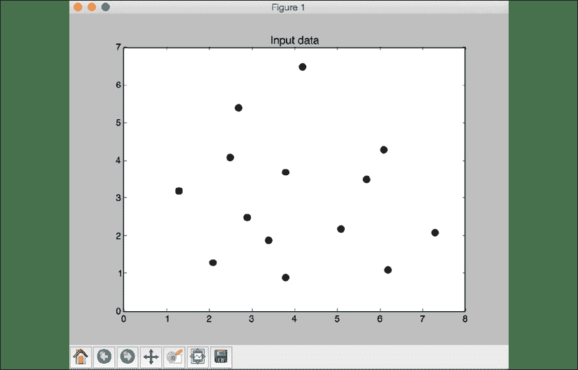
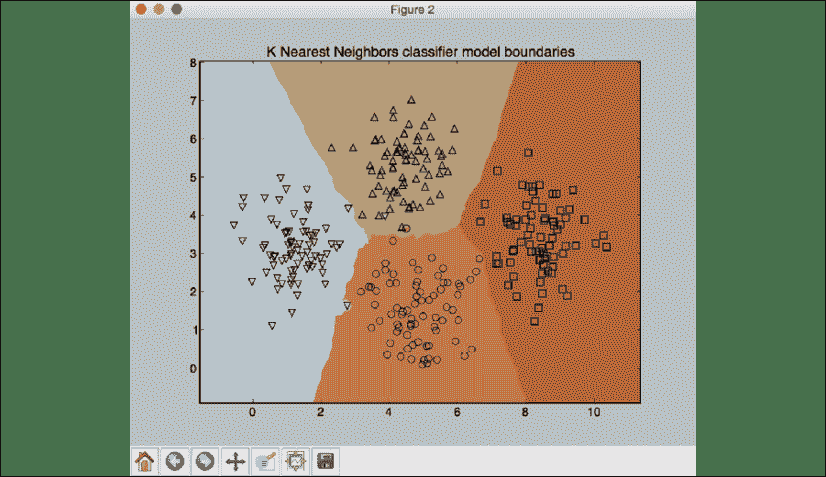
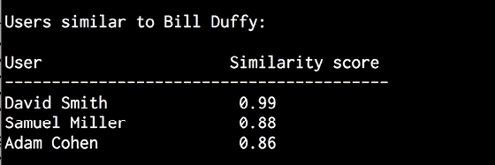

# 8 构建推荐系统

在本章中，我们将学习如何建立一个推荐系统来推荐人们可能喜欢看的电影。 我们将了解 K 最近邻分类器，并了解如何实现它。 我们使用这些概念来讨论协同过滤，然后使用它来构建推荐系统。

到本章末，您将了解以下内容：

*   提取最近邻
*   建立 *K 最近邻*分类器
*   计算相似度分数
*   使用协同过滤查找相似用户
*   建立电影推荐系统

# 提取最近邻

推荐人系统采用最近邻的概念来找到好的建议。 名称*最近邻*是指从给定数据集中查找到输入点最近的数据点的过程。 这通常用于构建分类系统，该分类系统根据输入数据点与各种类别的接近程度对数据点进行分类。 让我们看看如何找到给定数据点的最近邻。

首先，创建一个新的 Python 文件并导入以下包：

```py
import numpy as np
import matplotlib.pyplot as plt
from sklearn.neighbors import NearestNeighbors 
```

定义样本 2D 数据点：

```py
# Input data
X = np.array([[2.1, 1.3], [1.3, 3.2], [2.9, 2.5], [2.7, 5.4], [3.8, 0.9], 
        [7.3, 2.1], [4.2, 6.5], [3.8, 3.7], [2.5, 4.1], [3.4, 1.9],
        [5.7, 3.5], [6.1, 4.3], [5.1, 2.2], [6.2, 1.1]]) 
```

定义要提取的最近邻的数量：

```py
# Number of nearest neighbors
k = 5 
```

定义一个测试数据点，该数据点将用于提取最近的 K 个邻居：

```py
# Test data point 
test_data_point = [4.3, 2.7] 
```

使用圆形黑色标记绘制输入数据：

```py
# Plot input data
plt.figure()
plt.title('Input data')
plt.scatter(X[:,0], X[:,1], marker='o', s=75, color='black') 
```

使用输入数据创建并训练 K 近邻模型。 使用此模型提取到测试数据点最近邻：

```py
# Build K Nearest Neighbors model
knn_model = NearestNeighbors(n_neighbors=k, algorithm='ball_tree').fit(X) 
distances, indices = knn_model.kneighbors(test_data_point) 
```

打印从模型中提取的最近邻：

```py
# Print the 'k' nearest neighbors
print("\nK Nearest Neighbors:")
for rank, index in enumerate(indices[0][:k], start=1):
    print(str(rank) + " ==>", X[index]) 
```

可视化最近邻：

```py
# Visualize the nearest neighbors along with the test datapoint
plt.figure()
plt.title('Nearest neighbors')
plt.scatter(X[:, 0], X[:, 1], marker='o', s=75, color='k')
plt.scatter(X[indices][0][:][:, 0], X[indices][0][:][:, 1],
        marker='o', s=250, color='k', facecolors='none')
plt.scatter(test_data_point[0], test_data_point[1],
        marker='x', s=75, color='k') 
```

```py
plt.show() 
```

完整代码在文件`k_nearest_neighbors.py`中给出。 如果运行代码，您将看到两个屏幕截图。 第一个屏幕截图表示输入数据：



图 1：输入数据集的可视化

第二张屏幕截图代表五个最近邻。 使用十字显示测试数据点，并圈出最近邻点：


图 2：五个最近邻图

您将看到以下输出：


图 3：K 近邻输出

上图显示了最接近测试数据点的五个点。 现在我们已经学习了如何构建和运行 K 近邻模型，在下一节中，我们将基于该知识并使用它来构建 K 近邻分类器。

# 建立 K 最近邻分类器

K 近邻分类器是使用 K 近邻算法对给定数据点进行分类的分类模型。 该算法在训练数据集中找到最接近的`K`个数据点，以识别输入数据点的类别。 然后，它将基于多数投票为该数据点分配一个类别。 从这些`K`数据点的列表中，我们查看相应的类别，然后选择投票数最高的类别。`K`的值取决于当前的问题。 让我们看看如何使用此模型构建分类器。

创建一个新的 Python 文件并导入以下包：

```py
import numpy as np
import matplotlib.pyplot as plt 
import matplotlib.cm as cm
from sklearn import neighbors, datasets 
```

从`data.txt`加载输入数据。 每行包含逗号分隔的值，数据包含四个类别：

```py
# Load input data
input_file = 'data.txt'
data = np.loadtxt(input_file, delimiter=',')
X, y = data[:, :-1], data[:, -1].astype(np.int) 
```

使用四种不同的标记形状可视化输入数据。 我们需要将标签映射到相应的标记，这是`mapper`变量进入图片的位置：

```py
# Plot input data
plt.figure()
plt.title('Input data')
marker_shapes = 'v^os'
mapper = [marker_shapes[i] for i in y]
for i in range(X.shape[0]):
    plt.scatter(X[i, 0], X[i, 1], marker=mapper[i],
            s=75, edgecolors='black', facecolors='none') 
```

定义要使用的最近邻的数量：

```py
# Number of nearest neighbors
num_neighbors = 12 
```

定义将用于可视化分类器模型边界的网格步长：

```py
# Step size of the visualization grid
step_size = 0.01 
```

创建 K 最近邻分类器模型：

```py
# Create a K Nearest Neighbors classifier model
classifier = neighbors.KNeighborsClassifier(num_neighbors, weights='distance') 
```

使用训练数据训练模型：

```py
# Train the K Nearest Neighbors model
classifier.fit(X, y) 
```

创建将用于可视化网格的值的网格网格：

```py
# Create the mesh to plot the boundaries
x_min, x_max = X[:, 0].min() - 1, X[:, 0].max() + 1
y_min, y_max = X[:, 1].min() - 1, X[:, 1].max() + 1
x_values, y_values = np.meshgrid(np.arange(x_min, x_max, step_size),
        np.arange(y_min, y_max, step_size)) 
```

在网格上的所有点上评估分类器，以创建边界的可视化效果：

```py
# Evaluate the classifier on all the points on the grid
output = classifier.predict(np.c_[x_values.ravel(), y_values.ravel()]) 
```

创建一个彩色网格以可视化输出：

```py
# Visualize the predicted output
output = output.reshape(x_values.shape)
plt.figure()
plt.pcolormesh(x_values, y_values, output, cmap=cm.Paired) 
```

将训练数据覆盖在此颜色网格上方，以可视化相对于边界的数据：

```py
# Overlay the training points on the map 
for i in range(X.shape[0]):
    plt.scatter(X[i, 0], X[i, 1], marker=mapper[i],
            s=50, edgecolors='black', facecolors='none') 
```

设置`X`和`Y`限制以及标题：

```py
plt.xlim(x_values.min(), x_values.max()) 
plt.ylim(y_values.min(), y_values.max())
plt.title('K Nearest Neighbors classifier model boundaries') 
```

定义测试数据点以查看分类器的性能。 创建一个包含训练数据点和测试数据点的图形，以查看其位置：

```py
# Test input data point 
test_data_point = [5.1, 3.6]
plt.figure()
plt.title('Test data_point')
for i in range(X.shape[0]):
    plt.scatter(X[i, 0], X[i, 1], marker=mapper[i],
            s=75, edgecolors='black', facecolors='none') 
```

```py
plt.scatter(test_data_point[0], test_data_point[1], marker='x', 
        linewidth=6, s=200, facecolors='black') 
```

根据分类器模型，将 K 最近邻提取到测试数据点：

```py
# Extract the K nearest neighbors
_, indices = classifier.kneighbors([test_data_point])
indices = indices.astype(np.int)[0] 
```

画出在上一步中获得的 K 近邻邻居：

```py
# Plot k nearest neighbors
plt.figure()
plt.title('K Nearest Neighbors') 
```

```py
for i in indices:
    plt.scatter(X[i, 0], X[i, 1], marker=mapper[y[i]],
            linewidth=3, s=100, facecolors='black') 
```

覆盖测试数据点：

```py
plt.scatter(test_data_point[0], test_data_point[1], marker='x',
        linewidth=6, s=200, facecolors='black') 
```

覆盖输入数据：

```py
for i in range(X.shape[0]):
    plt.scatter(X[i, 0], X[i, 1], marker=mapper[i],
            s=75, edgecolors='black', facecolors='none') 
```

打印预测的输出：

```py
print("Predicted output:", classifier.predict([test_data_point])[0]) 
```

```py
plt.show() 
```

完整代码在文件`nearest_neighbors_classifier.py`中给出。 如果运行代码，您将看到四个屏幕截图。 第一个屏幕截图表示输入数据：


图 4：可视化输入数据

第二张屏幕截图表示分类器边界：



图 5：分类器模型边界

第三个屏幕截图显示了相对于输入数据集的测试数据点。 使用十字显示测试数据点：


图 6：相对于输入数据集的测试数据点

第四个屏幕截图显示了距离测试数据点最近的 12 个邻居：


图 7：12 个最近邻图

您将看到以下输出，这表明模型正在预测测试数据点属于`1`类：

```py
Predicted output: 1 
```

像任何机器学习模型一样，输出是一个预测，可能与实际结果相匹配。

# 计算相似度分数

要构建推荐系统，重要的是要了解如何比较数据集中的各种对象。 如果数据集由人物及其不同的电影喜好组成，那么为了提出建议，我们需要了解如何将任何两个人物相互比较。 这是相似度分数很重要的地方。 相似度得分给出了两个数据点相似度的想法。

此领域中经常使用两个分数-欧几里得分数和皮尔森分数。 **欧几里得分数**使用两个数据点之间的欧几里得距离来计算分数。 如果需要快速了解欧几里德距离的计算方式，[则可以转到这里](https://en.wikipedia.org/wiki/Euclidean_distance)。

欧几里得距离的值可以是无界的。 因此，我们采用该值并将其转换为欧几里得分数从`0`到`1`的范围。 如果两个对象之间的欧几里得距离较大，则欧几里得分数应较低，因为低分数表明对象不相似。 因此，欧几里得距离与欧几里得分数成反比。

**皮尔森分数**是两个数据点之间相关性的度量。 它使用两个数据点之间的协方差以及它们各自的标准差来计算分数。 得分范围从`-1`到`+1`。 分数`+1`表示数据点相似，分数`-1`表示数据点相似。 分数`0`表示它们之间没有相关性。 让我们看看如何计算这些分数。

创建一个新的 Python 文件并导入以下包：

```py
import argparse
import json
import numpy as np 
```

构建参数解析器以处理输入参数。 它将接受两个用户以及用于计算相似性得分所需的得分类型：

```py
def build_arg_parser():
    parser = argparse.ArgumentParser(description='Compute similarity score')
    parser.add_argument('--user1', dest='user1', required=True,
            help='First user')
    parser.add_argument('--user2', dest='user2', required=True,
            help='Second user')
    parser.add_argument("--score-type", dest="score_type", required=True, 
            choices=['Euclidean', 'Pearson'], help='Similarity metric to be used')
    return parser 
```

定义一个函数来计算输入用户之间的欧几里得分数。 如果用户不在数据集中，则代码将引发错误：

```py
# Compute the Euclidean distance score between user1 and user2 
def euclidean_score(dataset, user1, user2):
    if user1 not in dataset:
        raise TypeError('Cannot find ' + user1 + ' in the dataset') 
```

```py
 if user2 not in dataset:
        raise TypeError('Cannot find ' + user2 + ' in the dataset') 
```

定义一个变量以跟踪两个用户都评价过的电影：

```py
 # Movies rated by both user1 and user2 
    common_movies = {} 
```

提取两个用户都评价的电影：

```py
 for item in dataset[user1]:
        if item in dataset[user2]:
            common_movies[item] = 1 
```

如果没有普通电影，则无法计算相似度得分：

```py
 # If there are no common movies between the users, 
    # then the score is 0
    if len(common_movies) == 0:
        return 0 
```

计算等级之间的平方差异，并使用其计算欧几里得分数：

```py
 squared_diff = [] 
```

```py
 for item in dataset[user1]:
        if item in dataset[user2]:
            squared_diff.append(np.square(dataset[user1][item] - dataset[user2][item]))

    return 1 / (1 + np.sqrt(np.sum(squared_diff))) 
```

定义一个函数来计算给定数据集中用户之间的皮尔森得分。 如果在数据集中找不到用户，则会引发错误：

```py
# Compute the Pearson correlation score between user1 and user2
def pearson_score(dataset, user1, user2):
    if user1 not in dataset:
        raise TypeError('Cannot find ' + user1 + ' in the dataset') 
```

```py
 if user2 not in dataset:
        raise TypeError('Cannot find ' + user2 + ' in the dataset') 
```

定义一个变量以跟踪两个用户都评价过的电影：

```py
 # Movies rated by both user1 and user2 
    common_movies = {} 
```

提取两个用户都评价的电影：

```py
 for item in dataset[user1]:
        if item in dataset[user2]: 
            common_movies[item] = 1 
```

如果没有普通电影，那么我们将无法计算相似度得分：

```py
 num_ratings = len(common_movies)
    # If there are no common movies between 
    #user1 and user2, then the score is 0 
```

```py
 if num_ratings == 0:
        return 0 
```

计算两个用户都已评分的所有电影的评分总和：

```py
 # Calculate the sum of ratings of all the common movies
    user1_sum = np.sum([dataset[user1][item] for item in common_movies]) 
    user2_sum = np.sum([dataset[user2][item] for item in common_movies]) 
```

计算两个用户都已评分的所有电影的评分的平方和：

```py
 # Calculate the sum of squares of ratings 
    # of all the common movies  
    user1_squared_sum = np.sum([np.square(dataset[user1][item]) for item in common_movies])
    user2_squared_sum = np.sum([np.square(dataset[user2][item]) for item in common_movies]) 
```

计算两个输入用户都评价过的所有电影的评价结果​​的总和：

```py
 # Calculate the sum of products of the 
    # ratings of the common movies 
    sum_of_products = np.sum([dataset[user1][item] * dataset[user2][item] for item in common_movies]) 
```

使用前面的计算来计算计算皮尔森分数所需的各种参数：

```py
 # Calculate the Pearson correlation score
    Sxy = sum_of_products - (user1_sum * user2_sum / num_ratings) 
    Sxx = user1_squared_sum - np.square(user1_sum) / num_ratings 
    Syy = user2_squared_sum - np.square(user2_sum) / num_ratings 
```

如果没有偏差，则得分为`0`：

```py
 if Sxx * Syy == 0: 
```

```py
 return 0 
```

返回皮尔逊得分：

```py
 return Sxy / np.sqrt(Sxx * Syy) 
```

定义`main`函数并解析输入参数：

```py
if __name__=='__main__':
    args = build_arg_parser().parse_args() 
    user1 = args.user1
    user2 = args.user2 
    score_type = args.score_type 
```

将文件`ratings.json`中的评级加载到字典中：

```py
 ratings_file = 'ratings.json' 
```

```py
 with open(ratings_file, 'r') as f:
        data = json.loads(f.read()) 
```

根据输入参数计算相似度得分：

```py
if score_type == 'Euclidean':
    print("\nEuclidean score:")
    print(euclidean_score(data, user1, user2))
else:
    print("\nPearson score:")
    print(pearson_score(data, user1, user2)) 
```

完整代码在文件`compute_scores.py`中给出。 让我们用一些组合来运行代码。 要计算`David Smith`和`Bill Duffy`之间的欧几里得分数：

```py
$ python3 compute_scores.py --user1 "David Smith" --user2 "Bill Duffy" --score-type Euclidean 
```

如果运行前面的命令，将获得以下输出：

```py
Euclidean score:
0.585786437627 
```

如果要计算同一对之间的皮尔逊得分，请运行以下命令：

```py
$ python3 compute_scores.py --user1 "David Smith" --user2 "Bill Duffy" --score-type Pearson 
```

您将看到以下输出：

```py
Pearson score:
0.99099243041 
```

也可以使用其他参数组合来运行。

在本节中，我们学习了如何计算相似性得分，并了解了为什么在推荐系统的构建中该重要因素。 在下一节中，我们将学习如何通过协同过滤来识别具有相似偏好的用户。

# 使用协同过滤查找相似用户

协同过滤是指在数据集中的对象之间标识模式以决定新对象的过程。 在推荐引擎的上下文中，协同过滤用于通过查看数据集中的相似用户来提供推荐。

通过收集数据集中不同用户的偏好，我们可以协作该信息来过滤用户。 因此，名称为协同过滤。

这里的假设是，如果两个人对一组电影的收视率相似，那么他们对一组新的未知电影的选择也将相似。 通过识别那些普通电影中的模式，可以对新电影做出预测。 在上一节中，我们学习了如何比较数据集中的不同用户。 现在将使用讨论的评分技术在数据集中查找相似的用户。 协同过滤算法可以并行化并在大数据系统（例如 AWS EMR 和 Apache Spark）中实现，从而能够处理数百 TB 的数据。 这些方法可用于各种垂直领域，例如金融，在线购物，市场营销，客户研究等。

让我们开始构建协同过滤系统。

创建一个新的 Python 文件并导入以下包：

```py
import argparse
import json
import numpy as np 
```

```py
from compute_scores import pearson_score 
```

定义一个函数来解析输入参数。 输入参数是用户的名称：

```py
def build_arg_parser():
    parser = argparse.ArgumentParser(description='Find users who are similar to the input user')
    parser.add_argument('--user', dest='user', required=True, 
            help='Input user')
    return parser 
```

定义一个函数以在数据集中查找与给定用户相似的用户。 如果用户不在数据集中，则引发错误：

```py
# Finds users in the dataset that are similar to the input user 
def find_similar_users(dataset, user, num_users):
    if user not in dataset:
        raise TypeError('Cannot find ' + user + ' in the dataset') 
```

计算皮尔森得分的函数已导入。 让我们使用该函数来计算输入用户与数据集中所有其他用户之间的皮尔森得分：

```py
 # Compute Pearson score between input user 
    # and all the users in the dataset
    scores = np.array([[x, pearson_score(dataset, user,
            x)] for x in dataset if x != user]) 
```

分数按降序排列：

```py
 # Sort the scores in decreasing order 
    scores_sorted = np.argsort(scores[:, 1])[::-1] 
```

提取输入参数指定的最高`num_users`个用户，并返回数组：

```py
 # Extract the top 'num_users' scores 
    top_users = scores_sorted[:num_users] 
```

```py
 return scores[top_users] 
```

定义`main`函数并解析输入参数以提取用户名：

```py
if __name__=='__main__':
    args = build_arg_parser().parse_args() 
    user = args.user 
```

从电影分级文件`ratings.json`加载数据。 此文件包含人物名称及其对各种电影的评分：

```py
 ratings_file = 'ratings.json' 
```

```py
 with open(ratings_file, 'r') as f: 
        data = json.loads(f.read()) 
```

查找与输入参数指定的用户相似的前三个用户。 您可以根据自己的选择将其更改为任意数量的用户。 打印输出和分数：

```py
 print('\nUsers similar to ' + user + ':\n')
    similar_users = find_similar_users(data, user, 3) 
    print('User\t\t\tSimilarity score')
    print('-'*41)
    for item in similar_users:
        print(item[0], '\t\t', round(float(item[1]), 2)) 
```

完整代码在文件`collaborative_filtering.py`中给出。 让我们运行代码，找到像 Bill Duffy 这样的用户：

```py
$ python3 collaborative_filtering.py --user "Bill Duffy" 
```

您将获得以下输出：



图 8：用户相似度输出

让我们运行代码，找到像 Clarissa Jackson 这样的用户：

```py
$ python3 collaborative_filtering.py --user "Clarissa Jackson" 
```

您将获得以下输出：


图 9：用户相似度输出

在本节中，我们学习了如何在数据集中找到彼此相似的用户，以及如何分配分数来确定用户与另一个用户的相似程度。 在下一节中，我们将把它们放在一起并构建我们的推荐系统。

# 建立电影推荐系统

到目前为止，我们通过了解以下内容为构建推荐系统奠定了基础：

*   提取最近邻
*   建立 K 近邻分类器
*   计算相似度分数
*   使用协同过滤查找相似用户

现在所有的构建块都已就绪，现在该构建电影推荐系统了。 我们学习了构建推荐系统所需的所有基本概念。 在本节中，我们将基于文件`ratings.json`中提供的数据构建电影推荐系统。 此文件包含一组人物及其对各种电影的评分。 要查找给定用户的电影推荐，我们需要在数据集中找到相似的用户，然后提出针对此人的推荐。 让我们开始吧。

创建一个新的 Python 文件并导入以下包：

```py
import argparse
import json
import numpy as np 
```

```py
from compute_scores import pearson_score
from collaborative_filtering import find_similar_users 
```

定义一个函数来解析输入参数。 输入参数是用户的名称：

```py
def build_arg_parser():
    parser = argparse.ArgumentParser(description='Find recommendations for the given user')
    parser.add_argument('--user', dest='user', required=True, 
            help='Input user')
    return parser 
```

定义一个函数以获取给定用户的电影推荐。 如果数据集中不存在该用户，则代码将引发错误：

```py
# Get movie recommendations for the input user
def get_recommendations(dataset, input_user):
    if input_user not in dataset:
        raise TypeError('Cannot find ' + input_user + ' in the dataset') 
```

定义变量以跟踪分数：

```py
 overall_scores = {}
    similarity_scores = {} 
```

计算输入用户与数据集中所有其他用户之间的相似性得分：

```py
 for user in [x for x in dataset if x != input_user]: 
        similarity_score = pearson_score(dataset, input_user, user) 
```

如果相似度得分小于`0`，则可以继续使用数据集中的下一个用户：

```py
 if similarity_score <= 0:
            continue 
```

提取当前用户已评级但输入用户未评级的电影列表：

```py
 filtered_list = [x for x in dataset[user] if x not in \ 
                dataset[input_user] or dataset[input_user][x] == 0] 
```

对于过滤列表中的每个项目，请根据相似性分数跟踪加权等级。 同时跟踪相似度分数：

```py
 for item in filtered_list:
            overall_scores.update({item: dataset[user][item] * similarity_score})
            similarity_scores.update({item: similarity_score}) 
```

如果没有这样的电影，那么我们将不推荐任何东西：

```py
 if len(overall_scores) == 0:
        return ['No recommendations possible'] 
```

根据加权分数归一化分数：

```py
 # Generate movie ranks by normalization
    movie_scores = np.array([[score/similarity_scores[item], item] 
            for item, score in overall_scores.items()]) 
```

排序分数并提取电影推荐：

```py
 # Sort in decreasing order
    movie_scores = movie_scores[np.argsort(movie_scores[:, 0])[::-1]] 
```

```py
 # Extract the movie recommendations
    movie_recommendations = [movie for _, movie in movie_scores] 
```

```py
 return movie_recommendations 
```

定义`main`函数并解析输入参数以提取输入用户的名称：

```py
if __name__=='__main__':
    args = build_arg_parser().parse_args()
    user = args.user 
```

从文件`ratings.json`加载电影收视率数据：

```py
 ratings_file = 'ratings.json' 
```

```py
 with open(ratings_file, 'r') as f: 
        data = json.loads(f.read()) 
```

提取电影推荐并打印输出：

```py
 print("\nMovie recommendations for " + user + ":")
    movies = get_recommendations(data, user) 
    for i, movie in enumerate(movies):
        print(str(i+1) + '. ' + movie) 
```

完整代码在文件`movie_recommender.py`中给出。 让我们找到`Chris Duncan`的电影推荐：

```py
$ python3 movie_recommender.py --user "Chris Duncan" 
```

您将看到以下输出：


图 10：电影推荐

让我们找到`Julie Hammel`的电影推荐：

```py
$ python3 movie_recommender.py --user "Julie Hammel" 
```

您将看到以下输出：


图 11：电影推荐

输出中的电影是系统的实际建议，基于先前对 Julie Hammel 观察到的偏好。 潜在地，仅通过观察更多和个数据点，系统就可以继续变得更好。

# 总结

在本章中，我们学习了如何从给定数据集中提取给定数据点的 K 最近邻。 然后，我们使用此概念来构建 K 最近邻分类器。 我们在中使用了如何计算相似度分数，例如欧几里得分数和皮尔逊分数。 我们学习了如何使用协同过滤从给定的数据集中查找相似的用户，并使用它来构建电影推荐系统。 最后，我们能够测试我们的模型并针对系统以前未见过的数据点运行它。

在下一章中，我们将学习逻辑编程，并了解如何构建可以解决实际问题的推理引擎。