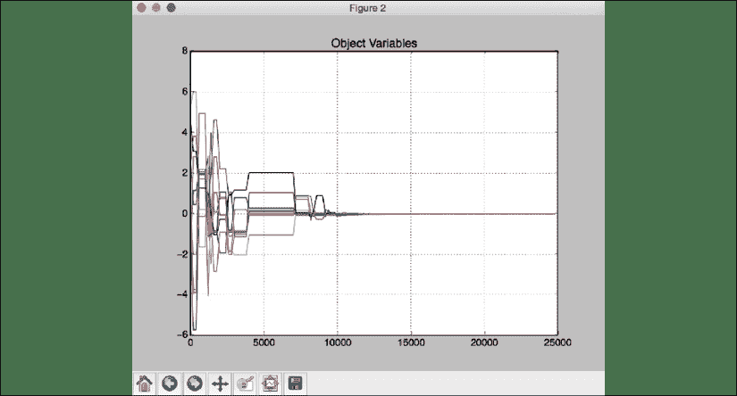
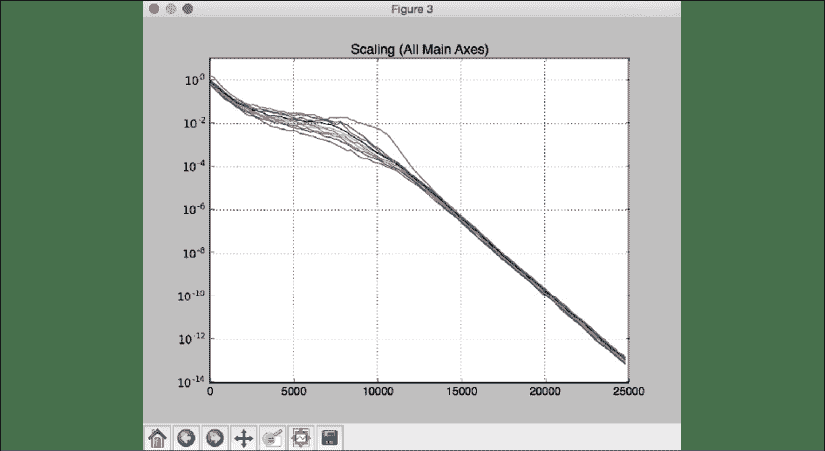
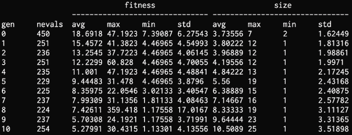
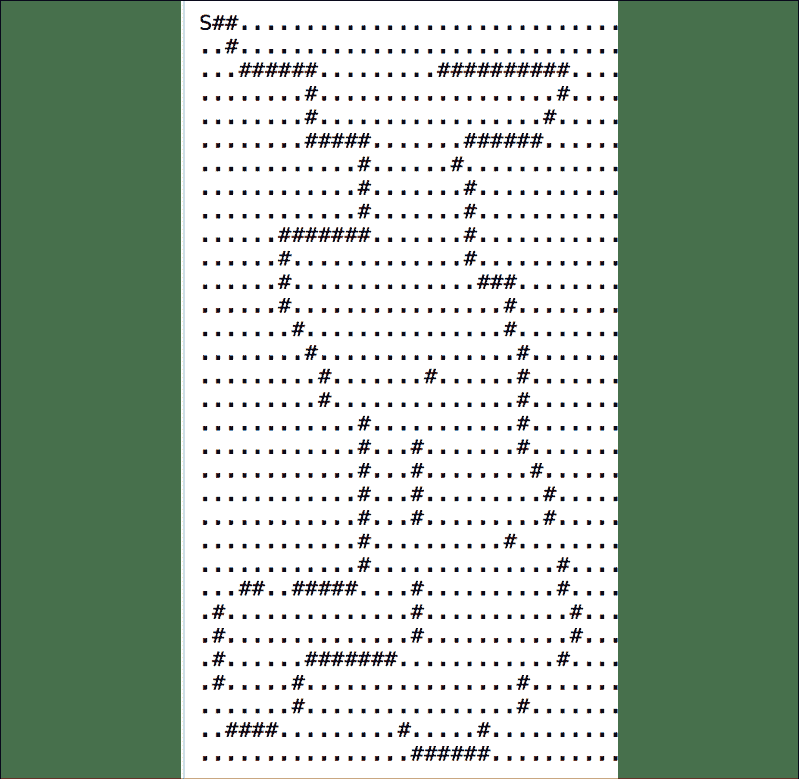

# 11

# 遗传算法和遗传编程

在本章中，我们将学习遗传算法。 首先，我们将描述什么是遗传算法，然后将讨论进化算法和遗传编程的概念，并了解它们与遗传算法的关系。 我们将学习遗传算法的基本构建模块，包括交叉，变异和适应度函数。 然后，我们将使用这些概念来构建各种系统。

在本章结束时，您将对以下内容有更好的理解：

*   进化遗传算法
*   遗传算法的基本概念
*   使用预定义参数生成位模式
*   可视化演进过程
*   解决符号回归问题
*   构建智能机器人控制器

# 进化论者部落

正如我们在书的开头提到的那样，研究遗传算法和遗传编程的计算机科学和数据科学研究人员是 Pedro Domingos 定义的进化论部落的一部分。 在某些方面，这个部落不在前面和中间。 联络员在阳光下度过一天，似乎在聚光灯下度过了愉快的时光。 正如 Domingos 博士所强调的那样，随着 CPU 的速度越来越快，并且在这一领域进行了更多的研究，如果在未来几年中出现新的，令人兴奋的前沿研究，不要感到惊讶。 他们已经在该领域做出了许多强大的创新性贡献，并将继续这样做。

# 了解进化和遗传算法

遗传算法是一种进化算法。 因此，为了理解遗传算法，我们需要讨论进化算法。 进化算法是一种运用启发式原理解决问题的元启发式优化算法。 进化的概念就像我们在自然界中发现的那样。 就像环境通过进化积极驱动“解决方案”一样，我们直接使用问题的函数和变量来得出解决方案。 但是在遗传算法中，任何给定的问题都以该算法操纵的位模式进行编码。

自主地解决问题是人工智能和机器学习的中心目标。 **遗传算法**（ **GA** ）是一种进化计算技术，可自动解决问题，而无需用户事先知道或指定解决方案的形式或结构。 从最抽象的层次上讲，GA 是计算机自动解决问题的一种系统的，与领域无关的方法，它从需要做什么的高级说明开始 e。

进化算法的基本步骤如下：

**步骤 1**

随机生成数据点或*个人*的初始种群。 由 GA 定义的个体是具有某些*特征*或*特征*的人群的成员。 在算法的后续步骤中，我们将确定这些特征是否使个体能够适应环境并生存足够长的时间以产生后代。

**步骤 2**

循环执行以下步骤，直到终止：

1.  评估该人群中每个人的健康状况。
2.  选择最适合繁殖的个体。
3.  通过交叉和变异操作育出新个体，以产生后代。
4.  评估新个体的个体适应性。

1.  用新的个体代替最不适合的人群。

使用预定义的**适应度函数**确定个体的*适应度。 优胜劣汰*生存的短语*发挥作用。*

然后，我们选择这些选定的个体，并通过重组和突变创建下一代个体。 我们将在下一部分中讨论重组和突变的概念。 现在，让我们将这些技术视为通过将选定的个人视为父母来创造下一代的机制。

一旦执行重组和突变，我们将创建一组新的个体，这些个体将与旧个体竞争下一代的位置。 通过抛弃最弱的个体并用后代代替它们，我们正在提高人口的整体适应水平。 我们继续进行迭代，直到达到所需的总体适应性。

遗传算法是一种进化算法，在该算法中，我们使用启发式算法来找到解决问题的字符串。 我们不断地对人口进行迭代，以找到解决方案。

我们通过产生包含更健康个体的新种群来做到这一点。 我们应用概率运算符，例如**选择**，**交叉**和**突变**，以便生成下一代个体。 个体用字符串表示，其中每个字符串都是潜在解决方案的编码版本。

使用适应性函数评估每个字符串的适应性度量，告诉我们解决问题的适用性。 该适应度函数也称为**评估函数**。 GA 会应用受 n 性质启发的运算符，这就是为什么该术语与生物生物学中发现的术语紧密相关的原因。

# 遗传算法的基本概念

为了建立 GA，我们需要了解几个关键概念和术语。 这些概念在 GA 的整个领域中得到广泛使用，以构建针对各种问题的解决方案。 GA 的最重要方面之一是*随机性*。 为了进行迭代，它依赖于对个体的随机采样。 这意味着该过程是不确定的。 因此，如果您多次运行相同的算法，则可能会得到不同的解决方案。

现在让我们定义术语*人口*。 总体是一组可能的候选解决方案。 在 GA 中，单个最佳解决方案不会在任何给定阶段维护，而是会保留一组潜在解决方案，其中一个可能是最佳解决方案。 但是其他解决方案在搜索过程中也起着重要作用。 由于跟踪解决方案的总体，因此不太可能陷入局部最优状态。 陷入局部最优是其他优化技术面临的经典问题。

现在，我们了解了 GA 的数量和随机性，下面我们来谈谈运营商。 当创建下一代个体时，算法会尝试确保它们来自当前世代中最适合的个体。

*突变*是实现此目的的一种方法。 遗传算法对当前的一个或多个个体进行随机更改，以产生新的候选解。 这种变化称为突变。 现在，这种变化可能会使该个人变得比现有个人更好或更糟。

需要定义的下一个概念是*重组*，也称为*交叉*。 这与繁殖在进化过程中的作用直接相关。 GA 试图将当前一代的个人合并起来，以创建新的解决方案。 它结合了每个父母个体的一些特征来创造这个后代。 此过程称为交叉。 目标是用人口中“钳工”个体产生的后代代替当前一代中的“较弱”个体。

为了应用交叉和突变，我们需要选择标准。 *选择的概念*受自然选择理论的启发。 在每次迭代期间，GA 都会执行选择过程。 优胜劣汰的个人使用此选择过程进行选择，较弱的个体被终止。 优胜劣汰概念的生存就在这里发挥作用。 使用计算 i 个个人适应性的函数进行选择过程。

# 生成具有预定义参数的位模式

现在我们知道了 GA 的基本概念，下面让我们看看如何使用它来解决一些问题。 我们将使用一个名为`DEAP`的 Python 包。 您可以在[这个页面](http://deap.readthedocs.io/en/master)中找到的所有详细信息。 让我们继续运行以下命令来安装它：

```py
$ pip3 install deap 
```

现在已经安装了该软件包，让我们快速对其进行测试。 通过键入以下命令进入 Python shell：

```py
$ python3 
```

进入内部后，键入以下内容：

```py
>>> import deap 
```

如果您没有看到错误消息，那就很好了。

在本节中，我们将使用， **One Max 算法**的变体。 One Max 算法尝试生成包含最大个数的位字符串。 这是一种简单的算法，但熟悉该库有助于更好地了解如何使用 GA 实现解决方案，这对您有所帮助。 在这种情况下，可能会生成包含预定义数量的 1 的位串。 您将看到底层结构和部分代码类似于`DEAP`库中使用的示例。

创建一个新的 Python 文件并导入以下内容：

```py
import random 
```

```py
from deap import base, creator, tools 
```

假设我们要生成长度为 75 的位模式，并且希望它包含`45`个位模式。 我们需要定义一个评估函数，可用于实现此目标：

```py
# Evaluation function
def eval_func(individual):
    target_sum = 45
    return len(individual) - abs(sum(individual) - target_sum), 
```

当个数等于`45`时，前一个函数中使用的公式将达到最大值。 所有个体的长度为 75。当个数等于`45`时，返回值为`75`。

现在让我们定义一个函数来创建`toolbox`。 首先，为健身功能定义`creator`对象并跟踪个人。 这里使用的`Fitness`类是一个抽象类，它需要定义`weights`属性。 我们正在使用正权重建立最大适应度：

```py
# Create the toolbox with the right parameters def
def create_toolbox(num_bits):
    creator.create("FitnessMax", base.Fitness, weights=(1.0,))
    creator.create("Individual", list, fitness=creator.FitnessMax) 
```

第一行创建一个最大化适应性的单一目标，名为`FitnessMax`。 第二行涉及产生个体。 创建的第一个个人是浮点列表。 为了产生这个个体，我们必须使用`creator`创建一个`Individual` 类。 适应性属性将使用之前定义的`FitnessMax`。

`toolbox`是`DEAP`中常用的对象。 它用于存储各种函数及其参数。 让我们创建这个对象：

```py
 # Initialize the toolbox
  toolbox = base.Toolbox() 
```

现在我们将开始向`toolbox`注册各种功能。 让我们从生成`0`和`1`之间的随机整数的随机数生成器开始。 这基本上是生成位字符串：

```py
 # Generate attributes
    toolbox.register("attr_bool", random.randint, 0, 1) 
```

让我们注册`individual`功能。 方法`initRepeat`带有三个参数–个人的容器类，用于填充容器的函数以及我们希望函数重复自身的次数：

```py
 # Initialize structures
    toolbox.register("individual", tools.initRepeat, creator.Individual,
        toolbox.attr_bool, num_bits) 
```

我们需要注册`population`功能。 我们希望人口成为个人列表：

```py
 # Define the population to be a list of individuals 
    toolbox.register("population", tools.initRepeat, list, toolbox.individual) 
```

现在，我们需要注册遗传算子。 注册我们之前定义的`evaluation`函数，它将用作适应函数。 我们希望个人（有点模式）有`45`个：

```py
 # Register the evaluation operator
    toolbox.register("evaluate", eval_func) 
```

使用`cxTwoPoint`方法注册名为`mate`的交叉运算符：

```py
 # Register the crossover operator
    toolbox.register("mate", tools.cxTwoPoint) 
```

使用`mutFlipBit`注册名为`mutate`的变异算子。 我们需要使用`indpb`指定每个属性发生突变的概率：

```py
 # Register a mutation operator
    toolbox.register("mutate", tools.mutFlipBit, indpb=0.05) 
```

使用`selTournament`注册选择运算符。 它指定将选择哪些个体进行育种：

```py
 # Operator for selecting individuals for breeding 
    toolbox.register("select", tools.selTournament, tournsize=3) 
```

```py
 return toolbox 
```

这是上一节中讨论的所有概念的实现。 `DEAP`中常见的是`toolbox`生成器功能，我们将在本章通篇使用它。 因此，花一些时间来了解`toolbox`是如何产生的，这一点很重要。

从位模式的长度开始，通过定义`main`功能：

```py
if __name__ == "__main__":
    # Define the number of bits
    num_bits = 75 
```

使用我们之前定义的函数创建一个`toolbox`：

```py
 # Create a toolbox using the above parameter 
    toolbox = create_toolbox(num_bits) 
```

播种随机数生成器以获得可重复的结果：

```py
 # Seed the random number generator
    random.seed(7) 
```

使用`toolbox`对象中可用的方法来创建一个初始种群，例如`500`个人。 随时更改此数字并进行试验：

```py
 # Create an initial population of 500 individuals
    population = toolbox.population(n=500) 
```

定义交叉和变异的概率。 同样，这些是用户定义的参数。 因此，您可以更改这些参数并查看它们如何影响结果：

```py
 # Define probabilities of crossing and mutating
    probab_crossing, probab_mutating = 0.5, 0.2 
```

定义迭代直到终止过程所需的代数。 如果增加世代数，则会给它更多的周期以提高种群的适应性：

```py
 # Define the number of generations
    num_generations = 60 
```

使用适应度函数评估人口中的所有个体：

```py
 print('\nStarting the evolution process')

    # Evaluate the entire population
    fitnesses = list(map(toolbox.evaluate, population)) 
    for ind, fit in zip(population, fitnesses):
        ind.fitness.values = fit 
```

开始几代人迭代：

```py
 print('\nEvaluated', len(population), 'individuals')

    # Iterate through generations
    for g in range(num_generations):
        print("\n===== Generation", g) 
```

在每一代中，使用我们之前注册到`toolbox`的选择运算符选择下一代个体：

```py
 # Select the next generation individuals
        offspring = toolbox.select(population, len(population)) 
```

克隆选定的个人：

```py
 # Clone the selected individuals
        offspring = list(map(toolbox.clone, offspring)) 
```

使用先前定义的概率值，对下一代个人应用交叉和突变。 完成后，重置适应性值：

```py
 # Apply crossover and mutation on the offspring
        for child1, child2 in zip(offspring[::2], offspring[1::2]):
            # Cross two individuals
            if random.random() < probab_crossing:
                toolbox.mate(child1, child2) 
```

```py
 # "Forget" the fitness values of the children
                del child1.fitness.values
                del child2.fitness.values 
```

使用先前定义的相应概率值将变异应用于下一代个体。 完成后，重置适应性值：

```py
 # Apply mutation
        for mutant in offspring:
            # Mutate an individual
            if random.random() < probab_mutating:
                toolbox.mutate(mutant)
                del mutant.fitness.values 
```

评估具有无效适应度值的个人：

```py
 # Evaluate the individuals with an invalid fitness
        invalid_ind = [ind for ind in offspring if not ind.fitness.valid]
        fitnesses = map(toolbox.evaluate, invalid_ind)
        for ind, fit in zip(invalid_ind, fitnesses):
            ind.fitness.values = fit

        print('Evaluated', len(invalid_ind), 'individuals') 
```

用下一代个人代替人口：

```py
 # The population is entirely replaced by the offspring
        population[:] = offspring 
```

打印当前代的统计信息，以查看其的进度：

```py
 # Gather all the fitnesses in one list and print the stats
        fits = [ind.fitness.values[0] for ind in population]

        length = len(population)
        mean = sum(fits) / length
        sum2 = sum(x*x for x in fits)
        std = abs(sum2 / length - mean**2)**0.5

        print('Min =', min(fits), ', Max =', max(fits)) 
        print('Average =', round(mean, 2), ', Standard deviation =',
                round(std, 2))

    print("\n==== End of evolution") 
```

打印最终输出：

```py
 best_ind = tools.selBest(population, 1)[0] 
    print('\nBest individual:\n', best_ind) 
    print('\nNumber of ones:', sum(best_ind)) 
```

完整代码在文件`bit_counter.py`中给出。 如果运行代码，将看到打印出的迭代。 开始时，您将看到类似以下内容：


图 1：初始演化输出（第 0 到第 3 代）

最后，您将看到类似于以下，它指示演进的结束：


图 2：Evolution 最终输出

如上图所示，进化过程在 60 代（零索引）之后结束。 完成后，将挑选最佳个人，并将其打印在输出中。 最佳个人中有 45 个，这是对的结果的确认，因为目标总和是评估函数中的`45`。

# 可视化演变

让我们看看如何可视化演变过程。 在`DEAP`中，有一种称为**协方差矩阵适应演化策略**（ **CMA-ES** ）的方法可以可视化演化。 是一种进化算法，用于解决连续域中的非线性问题。 CMA-ES 技术是可靠的，经过充分研究的，并且在进化算法中被认为是“最新技术”。 通过深入研究源代码来看看它是如何工作的。 以下代码是`DEAP`库中显示的示例的微小变化。

创建一个新的 Python 文件并导入以下内容：

```py
import numpy as np
import matplotlib.pyplot as plt
from deap import algorithms, base, benchmarks, \
        cma, creator, tools 
```

定义一个函数来创建`toolbox`。 我们将使用负权重定义`FitnessMin`函数：

```py
# Function to create a toolbox
def create_toolbox(strategy):
    creator.create("FitnessMin", base.Fitness, weights=(-1.0,))
    creator.create("Individual", list, fitness=creator.FitnessMin) 
```

创建`toolbox`并注册评估功能，如下所示：

```py
 toolbox = base.Toolbox() 
    toolbox.register("evaluate", benchmarks.rastrigin) 
```

```py
 # Seed the random number generator 
    np.random.seed(7) 
```

注册`generate`和`update`方法。 这将使用 generate-update 范式并从策略生成总体，然后根据总体更新策略：

```py
 toolbox.register("generate", strategy.generate, creator.Individual)
    toolbox.register("update", strategy.update) 
```

```py
 return toolbox 
```

定义`main`功能。 首先定义个人数量和世代数量：

```py
if __name__ == "__main__":
    # Problem size
    num_individuals = 10
    num_generations = 125 
```

在开始该过程之前，定义一个`strategy`：

```py
 # Create a strategy using CMA-ES algorithm
    strategy = cma.Strategy(centroid=[5.0]*num_individuals, sigma=5.0,
            lambda_=20*num_individuals) 
```

根据策略创建`toolbox`：

```py
 # Create toolbox based on the above strategy 
    toolbox = create_toolbox(strategy) 
```

创建一个`HallOfFame`对象。 `HallOfFame`对象包含群体中存在的最佳个体。 该对象始终保持排序格式。 这样，此对象中的第一个元素就是在进化过程中具有最佳适应性值的个人：

```py
 # Create hall of fame object 
    hall_of_fame = tools.HallOfFame(1) 
```

使用`Statistics`方法注册统计信息：

```py
 # Register the relevant stats
    stats = tools.Statistics(lambda x: x.fitness.values)
    stats.register("avg", np.mean)
    stats.register("std", np.std)
    stats.register("min", np.min)
    stats.register("max", np.max) 
```

定义`logbook`以跟踪演变记录。 它基本上是按时间顺序排列的词典列表：

```py
 logbook = tools.Logbook()
    logbook.header = "gen", "evals", "std", "min", "avg", "max" 
```

定义对象以编译所有数据：

```py
 # Objects that will compile the data
    sigma = np.ndarray((num_generations, 1))
    axis_ratio = np.ndarray((num_generations, 1))
    diagD = np.ndarray((num_generations, num_individuals))
    fbest = np.ndarray((num_generations,1))
    best = np.ndarray((num_generations, num_individuals))
    std = np.ndarray((num_generations, num_individuals)) 
```

遍历几代人：

```py
 for gen in range(num_generations):
        # Generate a new population
        population = toolbox.generate() 
```

使用适应度函数评估个人：

```py
 # Evaluate the individuals
        fitnesses = toolbox.map(toolbox.evaluate, population)
        for ind, fit in zip(population, fitnesses):
            ind.fitness.values = fit 
```

根据总体更新策略：

```py
 # Update the strategy with the evaluated individuals
        toolbox.update(population) 
```

与当前这一代人一起更新名人堂和统计数据：

```py
 # Update the hall of fame and the statistics with the
        # currently evaluated population
        hall_of_fame.update(population)
        record = stats.compile(population)
        logbook.record(evals=len(population), gen=gen, **record)

        print(logbook.stream) 
```

保存绘图的数据：

```py
 # Save more data along the evolution for plotting
        sigma[gen] = strategy.sigma
        axis_ratio[gen] = max(strategy.diagD)**2/min(strategy.diagD)**2
        diagD[gen, :num_individuals] = strategy.diagD**2
        fbest[gen] = hall_of_fame[0].fitness.values
        best[gen, :num_individuals] = hall_of_fame[0]
        std[gen, :num_individuals] = np.std(population, axis=0) 
```

定义`x`轴并绘制统计数据：

```py
 # The x-axis will be the number of evaluations
    x = list(range(0, strategy.lambda_ * num_generations, strategy.lambda_))
    avg, max_, min_ = logbook.select("avg", "max", "min")
    plt.figure()
    plt.semilogy(x, avg, "--b")
    plt.semilogy(x, max_, "--b")
    plt.semilogy(x, min_, "-b")
    plt.semilogy(x, fbest, "-c")
    plt.semilogy(x, sigma, "-g")
    plt.semilogy(x, axis_ratio, "-r")
    plt.grid(True)
    plt.title("blue: f-values, green: sigma, red: axis ratio") 
```

绘制进度：

```py
 plt.figure()
    plt.plot(x, best)
    plt.grid(True)
    plt.title("Object Variables") 
```

```py
 plt.figure()
    plt.semilogy(x, diagD)
    plt.grid(True)
    plt.title("Scaling (All Main Axes)") 
```

```py
 plt.figure()
    plt.semilogy(x, std)
    plt.grid(True)
    plt.title("Standard Deviations in All Coordinates")

    plt.show() 
```

完整代码在文件`visualization.py`中给出。 如果运行代码，您将看到四个屏幕截图。 第一个屏幕截图显示了各种参数：


图 3：演变过程中绘制的参数

第二张屏幕截图显示了对象变量：



图 4：绘制演化过程中的对象变量

第三张屏幕快照显示缩放：



图 5：演变过程中的标绘比例

第四个屏幕截图显示了标准偏差：


图 6：从进化过程中绘制的标准偏差

您将看到打印出来的进度。 首先，您会看到类似以下的内容：


图 7：演化过程的初始输出

最后，您将看到以下内容：


图 8：演进进度最终输出

从上图可以看出，随着我们的前进，所有值都使 d 不断增加。 中的内容表明它正在收敛。

# 解决符号回归问题

在本章的最后，我们将看到 GA 在众多行业和领域中的许多应用。 从财务到流量优化，GA 的应用几乎是无止境的。 不过，到目前为止，我们继续另一个简单的示例。 让我们看看如何使用遗传编程来解决符号回归问题。 重要的是要了解遗传程序设计与 GA 并不相同。 遗传编程是一种进化算法，其中解决方案以计算机程序的形式出现。 每代人都是计算机程序，他们的适应水平与其解决问题的能力相对应。 每次迭代时，都使用 GA 修改这些程序。 遗传程序设计是 GA 的应用。

关于符号回归问题，我们有一个多项式表达式，在这里需要近似。 这是一个经典的回归问题，我们尝试估算基本功能。 在此示例中，我们将使用表达式： *f（x）= 2x ^ 3 – 3x ^ 2 + 4x – 1*

此处讨论的代码是`DEAP`库中给出的符号回归问题的变体。 创建一个新的 Python 文件并导入以下内容：

```py
import operator
import math
import random 
```

```py
import numpy as np
from deap import algorithms, base, creator, tools, gp 
```

创建一个除法运算符，可以优雅地处理被零除的错误：

```py
# Define new functions
def division_operator(numerator, denominator):
    if denominator == 0:
        return 1 
```

```py
 return numerator / denominator 
```

定义将用于适应度计算的评估函数。 我们需要定义一个可调用函数以对输入个体进行计算：

```py
# Define the evaluation function
def eval_func(individual, points):
    # Transform the tree expression in a callable function
    func = toolbox.compile(expr=individual) 
```

计算先前定义的函数和原始表达式之间的**均方误差**（ **MSE** ）：

```py
 # Evaluate the mean squared error
    mse = ((func(x) - (2 * x**3 - 3 * x**2 + 4 * x - 1))**2 for x in points) 
```

```py
 return math.fsum(mse) / len(points), 
```

定义一个函数来创建 `toolbox`。 为了在此处创建`toolbox`，需要创建一组原语。 这些原语是将在演化过程中使用的运算符。 它们是个人的基石。 这些原语将是基本的算术函数：

```py
# Function to create the toolbox
def create_toolbox():
    pset = gp.PrimitiveSet("MAIN", 1)
    pset.addPrimitive(operator.add, 2)
    pset.addPrimitive(operator.sub, 2)
    pset.addPrimitive(operator.mul, 2)
    pset.addPrimitive(division_operator, 2)
    pset.addPrimitive(operator.neg, 1)
    pset.addPrimitive(math.cos, 1)
    pset.addPrimitive(math.sin, 1) 
```

接下来，声明一个临时常量。 临时常数是一种特殊的终端类型，没有固定值。 当给定程序将此类临时常量附加到树上时，该函数将被执行。 然后将结果作为常数终端插入树中。

这些常量端子可以采用`-1`，`0`或`1`值：

```py
 pset.addEphemeralConstant("rand101", lambda: random.randint(-1,1)) 
```

参数的默认名称为`ARGx`。 让我们将其重命名为`x`：

```py
 pset.renameArguments(ARG0='x') 
```

我们需要定义两种对象类型–适应度和个人。 让我们用`creator`来做：

```py
 creator.create("FitnessMin", base.Fitness, weights=(-1.0,))
    creator.create("Individual", gp.PrimitiveTree, fitness=creator.FitnessMin) 
```

创建`toolbox`和`register`功能。 注册过程的完成类似于前面的部分：

```py
 toolbox = base.Toolbox() 
```

```py
 toolbox.register("expr", gp.genHalfAndHalf, pset=pset, min_=1, max_=2)
    toolbox.register("individual", tools.initIterate, creator.Individual, toolbox.expr)
    toolbox.register("population", tools.initRepeat, list, toolbox.individual)
    toolbox.register("compile", gp.compile, pset=pset)
    toolbox.register("evaluate", eval_func, points=[x/10\. for x in range(-10,10)])
    toolbox.register("select", tools.selTournament, tournsize=3)
    toolbox.register("mate", gp.cxOnePoint)
    toolbox.register("expr_mut", gp.genFull, min_=0, max_=2)
    toolbox.register("mutate", gp.mutUniform, expr=toolbox.expr_mut, pset=pset) 
```

```py
 toolbox.decorate("mate", gp.staticLimit(key=operator.attrgetter("height"), max_value=17))
    toolbox.decorate("mutate", gp.staticLimit(key=operator.attrgetter("height"), max_value=17)) 
```

```py
 return toolbox 
```

定义`main`函数并从播种随机数生成器开始：

```py
if __name__ == "__main__":
    random.seed(7) 
```

创建`toolbox`对象：

```py
 toolbox = create_toolbox() 
```

使用`450`个人使用`toolbox`对象中可用的方法定义初始种群。 人数可以更改。 随时尝试。 还定义`hall_of_fame`对象：

```py
 population = toolbox.population(n=450)
    hall_of_fame = tools.HallOfFame(1) 
```

建立 GA 时，统计资料非常有用。 定义统计对象：

```py
 stats_fit = tools.Statistics(lambda x: x.fitness.values)
    stats_size = tools.Statistics(len) 
```

使用先前定义的对象注册统计信息：

```py
 mstats = tools.MultiStatistics(fitness=stats_fit, size=stats_size)
    mstats.register("avg", np.mean)
    mstats.register("std", np.std)
    mstats.register("min", np.min)
    mstats.register("max", np.max) 
```

定义交叉概率，突变概率和世代数：

```py
 probab_crossover = 0.4
    probab_mutate = 0.2
    num_generations = 60 
```

使用以上参数运行进化算法：

```py
 population, log = algorithms.eaSimple(population, toolbox, 
            probab_crossover, probab_mutate, num_generations, 
            stats=mstats, halloffame=hall_of_fame, verbose=True) 
```

完整代码在文件`symbol_regression.py`中给出。 如果运行代码，则在演化开始时将看到以下内容：



图 9：演化过程的初始输出

最后，您将看到以下内容：


图 10：演进进度最终输出

我们可以看到 min 列中的值越来越小，这表明方程式 的近似解的误差越来越小。

# 构建智能机器人控制器

让我们看看如何使用 GA 构建机器人控制器。 我们得到了一张地图，上面洒满了目标。

地图看起来像这样。 哈希表示机器人要击中所需的目标：



图 11：带有 AI 机器人需要击中的目标的地图，目标以哈希表示

前面的地图中有 124 个目标。 机器人控制器的目标是自动遍历地图并消耗所有这些目标。 该程序是`deap`库中提供的人工蚂蚁程序的变体。

创建一个新的 Python 文件并导入以下内容：

```py
import copy
import random
from functools import partial
import numpy as np
from deap import algorithms, base, creator, tools, gp 
```

创建用于控制机器人的类：

```py
class RobotController(object):
    def __init__(self, max_moves): 
        self.max_moves = max_moves
        self.moves = 0
        self.consumed = 0
        self.routine = None 
```

定义方向和运动：

```py
 self.direction = ["north", "east", "south", "west"]
    self.direction_row = [1, 0, -1, 0]
    self.direction_col = [0, 1, 0, -1] 
```

定义重置功能：

```py
 def _reset(self):
        self.row = self.row_start 
        self.col = self.col_start 
        self.direction = 1
        self.moves = 0
        self.consumed = 0
        self.matrix_exc = copy.deepcopy(self.matrix) 
```

定义条件运算符：

```py
 def _conditional(self, condition, out1, out2): 
        out1() if condition() else out2() 
```

定义左转弯算子：

```py
 def turn_left(self):
        if self.moves < self.max_moves:
            self.moves += 1
            self.direction = (self.direction - 1) % 4 
```

定义正确的车削算子：

```py
 def turn_right(self):
        if self.moves < self.max_moves: 
            self.moves += 1
            self.direction = (self.direction + 1) % 4 
```

定义控制机器人前进方式的方法：

```py
 def move_forward(self):
        if self.moves < self.max_moves:
            self.moves += 1
            self.row = (self.row + self.direction_row[self.direction]) % self.matrix_row
           self.col = (self.col + self.direction_col[self.direction]) % self.matrix_col
            if self.matrix_exc[self.row][self.col] == "target":
                self.consumed += 1 
```

```py
 self.matrix_exc[self.row][self.col] = "passed" 
```

定义一种检测目标的方法。 如果您看到前方的目标，请相应地更新矩阵：

```py
 def sense_target(self):
        ahead_row = (self.row + self.direction_row[self.direction]) % self.matrix_row
        ahead_col = (self.col + self.direction_col[self.direction]) % self.matrix_col
        return self.matrix_exc[ahead_row][ahead_col] == "target" 
```

如果看到前面的目标，则创建相关函数并返回它：

```py
 def if_target_ahead(self, out1, out2):
        return partial(self._conditional, self.sense_target, out1, out2) 
```

定义运行它的方法：

```py
 def run(self,routine):
        self._reset()
        while self.moves < self.max_moves:
            routine() 
```

定义一个函数以遍历输入图。 符号`#`指示地图上的所有目标，符号`S`指示起点。 符号`.`表示空白单元格：

```py
 def traverse_map(self, matrix):
        self.matrix = list()
        for i, line in enumerate(matrix):
            self.matrix.append(list()) 
```

```py
 for j, col in enumerate(line):
                if col == "#":
                    self.matrix[-1].append("target") 
```

```py
 elif col == ".":
                    self.matrix[-1].append("empty") 
```

```py
 elif col == "S":
                    self.matrix[-1].append("empty")
                    self.row_start = self.row = i
                    self.col_start = self.col = j
                    self.direction = 1 
```

```py
 self.matrix_row = len(self.matrix)
        self.matrix_col = len(self.matrix[0])
        self.matrix_exc = copy.deepcopy(self.matrix) 
```

定义一个类以根据输入参数的数量生成函数：

```py
class Prog(object):
    def _progn(self, *args):
        for arg in args:
            arg() 
```

```py
 def prog2(self, out1, out2):
        return partial(self._progn, out1, out2) 
```

```py
 def prog3(self, out1, out2, out3):
        return partial(self._progn, out1, out2, out3) 
```

为个人定义评估功能：

```py
def eval_func(individual): 
    global robot, pset 
```

```py
 # Transform the tree expression to functional Python code
    routine = gp.compile(individual, pset) 
```

运行程序：

```py
 # Run the generated routine
    robot.run(routine)
    return robot.consumed, 
```

定义一个函数来创建`toolbox`并添加原语：

```py
def create_toolbox():
    global robot, pset
    pset = gp.PrimitiveSet("MAIN", 0)
    pset.addPrimitive(robot.if_target_ahead, 2)
    pset.addPrimitive(Prog().prog2, 2)
    pset.addPrimitive(Prog().prog3, 3)
    pset.addTerminal(robot.move_forward)
    pset.addTerminal(robot.turn_left)
    pset.addTerminal(robot.turn_right) 
```

使用适应度函数创建对象类型：

```py
 creator.create("FitnessMax", base.Fitness, weights=(1.0,)) 
    creator.create("Individual", gp.PrimitiveTree, fitness=creator.FitnessMax) 
```

创建`toolbox`并注册所有运算符：

```py
 toolbox = base.Toolbox() 
```

```py
 # Attribute generator
    toolbox.register("expr_init", gp.genFull, pset=pset, min_=1, max_=2) 
```

```py
 # Structure initializers
    toolbox.register("individual", tools.initIterate, creator.Individual, toolbox.expr_init)
    toolbox.register("population", tools.initRepeat, list, toolbox.individual) 
```

```py
 toolbox.register("evaluate", eval_func)   
    toolbox.register("select", tools.selTournament, tournsize=7) 
    toolbox.register("mate", gp.cxOnePoint) 
```

```py
 toolbox.register("expr_mut", gp.genFull, min_=0, max_=2) 
    toolbox.register("mutate", gp.mutUniform, expr=toolbox.expr_mut, pset=pset) 
```

```py
 return toolbox 
```

定义`main`函数，并从播种随机数生成器开始：

```py
if __name__ == "__main__":
    global robot 
```

```py
 # Seed the random number generator
    random.seed(7) 
```

使用初始化参数创建机械手控制器对象：

```py
 # Define the maximum number of moves 
    max_moves = 750 
```

```py
 # Create the robot object
    robot = RobotController(max_moves) 
```

使用我们之前定义的函数创建`toolbox`：

```py
 # Create the toolbox 
    toolbox = create_toolbox() 
```

从输入文件中读取地图数据：

```py
 # Read the map data
    with open('target_map.txt', 'r') as f:
      robot.traverse_map(f) 
```

用`400`个人定义总体并定义`hall_of_fame`对象：

```py
 # Define population and hall of fame variables 
    population = toolbox.population(n=400)
    hall_of_fame = tools.HallOfFame(1) 
```

注册`stats`：

```py
 # Register the stats
    stats = tools.Statistics(lambda x: x.fitness.values)
    stats.register("avg", np.mean)
    stats.register("std", np.std)
    stats.register("min", np.min)
    stats.register("max", np.max) 
```

定义交叉概率，突变概率和世代数：

```py
 # Define parameters
    probab_crossover = 0.4
    probab_mutate = 0.3
    num_generations = 50 
```

使用前面定义的参数运行进化算法：

```py
 # Run the algorithm to solve the problem
    algorithms.eaSimple(population, toolbox, probab_crossover,
            probab_mutate, num_generations, stats, 
            halloffame=hall_of_fame) 
```

完整代码在文件`robot.py`中给出。 如果运行代码，您将获得以下：


图 12：演化过程的初始输出

在结束时，您将看到以下内容：


图 13：演进过程的最终输出

从上图中可以看出，随着我们的发展，标准偏差不断减小。 这表明它正在收敛。 在此输出中，我们仅显示 50 代。 如果运行更多的代，您可以期望这些值甚至会进一步收敛。

# 遗传编程用例

正如早期章节之一所讨论的那样，遗传算法（GA）和遗传编程（GP）是机器学习的“五个部落”之一。


图 14：五个部落（佩德罗·多明戈斯）

从一开始，GP 就取得了各种各样的进步。 涵盖 GP 数千种应用程序的文献包含许多成功应用 GP 的用例。 详尽地涵盖该列表将超出本书的范围，但是我们在此处列出了一些更重要的列表。

在这里，我们开始讨论 GP 已成功应用的一般问题的讨论，然后回顾 GP 每个主要应用领域的代​​表性子集。 根据多年来不同研究人员的经验，GP 做得好的领域包括：

**域名理解不佳**

这是相关变量之间的相互关系未知或了解不充分的地方（或者怀疑当前的理解可能是错误的）。 GP（和其他进化算法）的好处之一是探索了人们不了解的领域。 如果对问题领域有充分的​​了解，则可以使用其他分析工具和方法来提供高质量的解决方案，而不会在 GP 的随机搜索过程中固有的不确定性。

另一方面，当对该域的了解不充分时，GP 会产生结果。 GP 可以帮助确定哪些属性和维度是相关的，提供新颖和创新的解决方案，揭示属性之间的意外关系，并发现可以应用于其他领域的新概念。

找到最终解决方案的大小和形状是问题的主要部分。 如果知道解决方案的形式，那么用于固定大小表示形式的替代搜索机制（例如 GA）可能会更有效，因为它们不必发现解决方案的大小和形状。

**数据可用并且很多**

特别是 GP，通常是机器学习和搜索技术，通常需要执行大量测试数据。 寻找问题的相关数据集可能是一大障碍。 但是，在大数据集随时可用的情况下，这可能是数据科学家的梦想，提出仅仅因为数据可用而提出的问题可能是一个好主意。

如果测试数据尽可能干净和准确，这也很有帮助。 但是，GP 算法可以很好地处理数据中的一定数量的噪声，尤其是在采取措施将过拟合最小化的情况下。

**可接受近似解决方案**

GP 在近似解决方案可以接受或最佳解决方案的情况下效果很好。 总体而言，尤其是 GP 的演变通常意味着“足够好”而不是“最好”。 如果一只熊在树林中追赶您，您不必成为世界上最快的人。 您只需要比熊或奔跑的人快。 结果，进化算法往往在可能且可接受的近似值接近最佳的领域中工作最佳。

**小但有价值的改进**

已发现 GP 在技术努力往往集中在经济重要性较高的领域中效果很好。 在这些领域中，以前的研究人员可能花费了大量时间和精力，并且“最新技术”趋于先进。 在这种情况下，很难改善当前的解决方案。 但是，在这些相同的领域中，小的改进可能非常有价值。 在这种情况下，GP 有时会做出很小但有价值的贡献。 例如石油勘探，材料管理和财务应用。

现在，让我们看一下 GA 和 GP 的一些特定于行业的应用程序：

**电影**

和其他职业一样，电影特技演员的日子也数不清了。 一家名为 *NaturalMotion* 的初创公司使用 GP 产生了令人难以置信的逼真的效果，从而使人动起来。 这些虚拟演员以真实的精度跌倒，跳跃并表演其他特技。 这些虚拟角色可以像真实的人类一样对施加到其上的力做出反应，并表现出各种各样逼真的动作。 所有这些，仅需要台式机的功能。 电影只是开始。 在接下来的几年中，NaturalMotion 计划在下一代视频游戏中释放这些逼真的人物。

NaturalMotion 是由前牛津研究人员 Torsten Reil 和 Colm Massey 创立的一家新公司。 目前，该公司只有一种产品，称为 Endorphin，它利用神经网络和人工进化技术来产生可以像人一样精确地行走，奔跑，跌倒和飞行的软件自动机。

Endorphin 在电影*《王者归来》* 中首次亮相，这是用来使特别棘手的特技栩栩如生的电影。 但这仅仅是开始。 几个月后，该公司的机器人在 Ilium 平原上战斗致死，摔倒了沃尔夫冈·彼得森（Wolfgang Petersen）的电影 *Troy* 并摔倒了匕首。

来源： <https://www.naturalmotion.com/>

**电脑游戏**

今天，每个人都对深度学习算法着迷。 他们肯定在许多领域和许多基准下都取得了令人印象深刻的结果。 但是 GP 并不懈怠。 由于丹尼斯·威尔逊（Dennis Wilson）和法国图卢兹大学的一些同事的努力，已经观察到了令人印象深刻的结果。 他们在 GP 上所做的工作在许多经典游戏中都能够胜过人类。 威尔逊和他的研究人员团队展示了 GP 如何在具有象征意义的任务上与深度学习算法的性能相媲美，这项任务使深度学习在 2013 年成名-在 Pong，Breakout 和 Space Invaders 等街机视频游戏中，人类的表现优于人类。

威尔逊令人信服地证明，GP 可以产生可比的令人印象深刻的结果，甚至可能比深度学习更好。

来源： <https://github.com/d9w>

**文件压缩**

最早的无损压缩技术之一是使用 GP 演变非线性图像预测器。 该算法根据相邻像素子集的灰度值预测像素可以采用的灰度级。 结合模型描述的预测误差可以表示图像的压缩版本。 使用霍夫曼编码对图像进行压缩。 使用 GP 压缩，各种图像上的结果都显示出令人鼓舞的结果。 在某些情况下，GP 算法的性能优于某些人为设计的最佳无损压缩算法。

资料来源：福永和 Stechert，1998 [1]

**金融交易**

有效市场的假设是经济学的基本原理。 它基于这样的思想：每个市场参与者都具有*完美的信息*，并且他们理性地发挥*的作用*。 如果有效市场假说是正确的，那么每个人都应该为市场中的所有资产分配相同的价格，并就价格达成一致。 如果不存在价格差异，就没有办法击败市场。 无论是商品市场，货币市场还是股票市场，没有任何一个市场参与者是平等的，并且存在很大的疑问，即*有效市场*是否确实存在。 市场流动性越弱，市场效率就越低。 因此，人们继续研究股票市场并试图找到击败股票市场的方法。 有一些人和公司基于他们的往绩证明了市场是可战胜的。 一些示例包括：

*   沃伦·巴菲特（Warren Buffet）和伯克希尔·哈撒韦（Berkshire Hathaway）
*   彼得·林奇和富达麦哲伦基金
*   雷·达里奥（Ray Dalio）和 Bridgewater Associates
*   吉姆·西蒙斯（Jim Simons）和 Renaissance Technologies

后两个示例严重依赖计算机算法来获得市场领先的结果。

博弈论一直是经济学家试图了解市场的一种标准工​​具，但是越来越多的人为和计算机化的代理人进行了模拟。 GP 被越来越多地用作这些社会系统模拟的一部分。

GP 算法广泛用于金融交易，时间序列预测和经济建模领域； 一整本书要列出它的所有应用。

在本节中，我们将从头开始，并访问一些示例。 在这一领域特别杰出的研究人员是陈胜雄。 Chen 写了 60 多篇关于在金融和经济学中使用 GP 的论文。 他最近的一些论文研究了股票市场中的代理人建模（Chen 和 Liao，2005），博弈论（Chen，Duffy 和 Yeh，2002），标准普尔 500 指数交易规则的演变（Yu 和 Chen，2004）。 并预测了恒生指数（Chen，Wang 和 Zhang，1999 年）。

**其他应用程序**

**优化**-GA 和 GP 通常用于优化问题，在给定目标函数的情况下，必须在一组约束条件下将值最大化或最小化。

**并行化**-GA 也具有并行处理功能，并且被证明是解决需要并行处理的问题的有效方法。 并行化是 GA 和 GP 研究的活跃领域。

**神经网络**-GA 用于训练神经网络，尤其是递归神经网络（RNN）。

**经济学**-GA 通常用于对经济系统进行建模，例如：

*   蜘蛛网模型
*   博弈论均衡解
*   资产定价

**图像处理**-GA 也用于各种数字图像处理（DIP）任务，例如密集像素匹配。

**调度应用程序**-GA 可用于解决许多调度问题，尤其是时间表问题。 简而言之，当我们拥有一组资源，一组活动以及活动与资源之间的依赖关系时，就会发生时间表问题。 一个例子是在我们有教室，教授和学生的大学中的课程表，并且在练习结束时，希望很大比例的学生能够参加他们想参加的所有课程。

**参数化设计**-GA 已用于通过更改参数和发展更好的解决方案来设计车辆，机械和飞机。

**DNA 分析**-GA 可以并且已经用于使用样品光谱数据确定 DNA 结构。

**多峰优化**-GA 是解决寻求多个最优解的多峰优化问题的好方法。

**旅行商问题（TSP）**-遗传算法已用于解决 TSP 及其所有相关应用，例如车辆路线和机器人轨迹问题，这是一种使用新颖交叉法和 包装策略。

希望 GP 和 GA 的广泛而多样的应用为您所熟悉。 也许您将能够提出自己独特的应用程序，并利用获得的知识来推动该领域的发展。

# 摘要

在本章中，我们了解了 GA 及其基本概念。 我们讨论了进化算法和遗传规划。 我们了解了它们与 GA 之间的关系。 我们讨论了 GA 的基本构建模块，包括种群，交叉，突变，选择和适应度功能的概念。 我们学习了如何使用预定义的参数生成位模式。 我们讨论了如何使用 CMA-ES 可视化演变过程。 我们学习了如何在此范例中解决符号回归问题。 然后，我们使用这些概念来构建机器人控制器，以遍历地图并消耗所有目标。 在下一章中，我们将学习强化学习，并了解如何构建智能代理。

# 参考

1.  A.福永和 A. Stechert。 进化的非线性预测模型，可通过遗传编程进行无损图像压缩。 在 1998 年 7 月 22 日至 25 日于美国威斯康星州麦迪逊市的威斯康星大学，于 1998 年 7 月 22 日至 25 日在 JR Koza 等人的著作中， *Genetic Programming 1998：第三届年会的论文集*，第 95-102 页。 。 ISBN 1-55860-548-7。