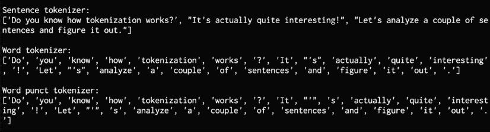
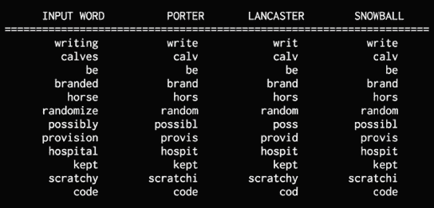
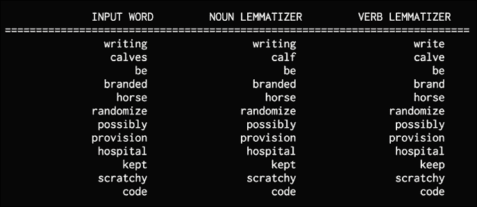
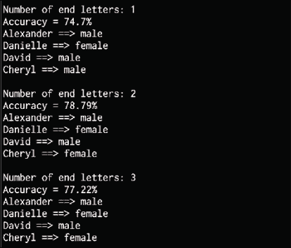
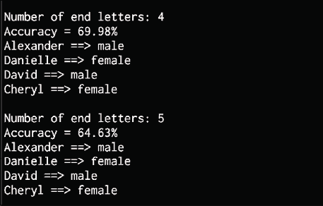
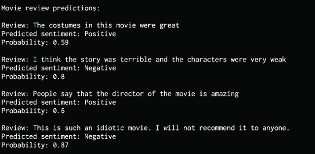

# 15

# 自然语言处理

在本章中，我们将学习自然语言处理（NLP）的令人兴奋的主题。 正如我们在前几章中所讨论的，拥有能够理解人类语言的计算机是真正使计算机变得更加有用的突破之一。 NLP 为开始了解如何实现提供了基础。

我们将讨论并使用各种概念（例如标记化，词干和词形还原）来处理文本。 然后，我们将讨论*词袋*模型以及如何使用它对文本进行分类。 我们将看到如何使用机器学习来分析句子的情感。 然后，我们将讨论主题建模并实现一个系统来识别给定文档中的主题。

在本章结束时，您将熟悉以下主题：

*   安装相关的 NLP 软件包
*   标记文本数据
*   使用词干将单词转换为其基本形式
*   使用词义化将单词转换为其基本形式
*   将文本数据分成大块
*   使用词袋模型提取文档项矩阵
*   建立类别预测器
*   构造性别标识符
*   建立情感分析器
*   使用潜在狄利克雷分布的主题建模

# 软件包的介绍和安装

**自然语言处理**（**NLP**）已成为现代系统的重要组成部分。 它广泛用于搜索引擎，会话界面，文档处理器等。 机器可以很好地处理结构化数据，但是在处理自由格式的文本时，它们会遇到困难。 NLP 的目标是开发使计算机能够理解自由格式文本并帮助他们理解语言的算法。

自由处理-形式自然语言最具挑战性的之一是数量众多。 上下文在句子的理解中起着非常重要的作用。 人类天生善于理解语言。 尚不清楚人类如何轻松而直观地理解语言。 我们利用我们过去的知识和经验来理解对话，即使在几乎没有明确上下文的情况下，我们也可以迅速了解其他人在谈论什么。

为了解决这个问题，NLP 研究人员开始使用机器学习方法来开发各种应用程序。 为了构建这样的应用程序，需要获取大量的文本，然后在该数据上训练算法以执行各种任务，例如对文本进行分类，分析情感和对主题进行建模。 对算法进行训练，以检测输入文本数据中的模式并从中获取见解。

在本章中，我们将讨论用于分析文本和构建 NLP 应用程序的各种基础概念。 这将使我们了解如何从给定的文本数据中提取有意义的信息。 我们将使用称为**自然语言工具包**（**NLTK**）的 Python 软件包来构建这些应用程序。 您可以通过运行以下命令来安装它：

```py
$ pip3 install nltk 
```

您可以在[这个页面](http://www.nltk.org)上找到有关 NLTK 的更多信息。

为了访问 NLTK 提供的所​​有数据集，我们需要下载它。 通过键入以下内容打开 Python Shell：

```py
$ python3 
```

现在，我们位于 Python Shell 中。 输入以下内容以下载数据：

```py
>>> import nltk
>>> nltk.download() 
```

在本章中，我们还将使用名为`gensim`的软件包。 `gensim`是健壮的语义建模库，对许多应用程序都非常有用。 可以通过运行以下命令来安装它：

```py
$ pip3 install gensim 
```

您可能需要另一个软件包`pattern`才能使`gensim`正常运行。 您可以通过运行以下命令来安装它：

```py
$ pip3 install pattern 
```

您可以在[这个页面](https://radimrehurek.com/gensim)上找到有关 Gensim 的更多信息。 现在，您已经安装了 NLTK 和`gensim`，让我们继续进行讨论。

# 标记文本数据

当我们处理文本时，我们需要将其分解成较小的部分进行分析。 为此，可以应用标记化。 标记化是将文本分为一组片段的过程，例如单词或句子。 这些片段称为令牌。 根据我们要执行的操作，我们可以定义自己的方法以将文本分为许多标记。 让我们看一下如何使用 NLTK 标记输入文本。

创建一个新的 Python 文件并导入以下软件包：

```py
from nltk.tokenize import sent_tokenize, \
        word_tokenize, WordPunctTokenizer 
```

定义将用于标记化的输入文本：

```py
# Define input text
input_text = "Do you know how tokenization works? It's actually \ 
   quite interesting! Let's analyze a couple of sentences and \
   figure it out." 
```

将输入文本分为句子标记：

```py
# Sentence tokenizer 
print("\nSentence tokenizer:")
print(sent_tokenize(input_text)) 
```

将输入文本分为单词标记：

```py
# Word tokenizer
print("\nWord tokenizer:")
print(word_tokenize(input_text)) 
```

使用`WordPunct`标记程序将输入文本分为单词标记：

```py
# WordPunct tokenizer
print("\nWord punct tokenizer:")
print(WordPunctTokenizer().tokenize(input_text)) 
```

完整代码在文件`tokenizer.py`中给出。 如果运行代码，将得到以下输出：



图 1：分词器输出

句子标记程序将输入文本分为句子。 当涉及标点时，两个单词的分词器的行为会有所不同。 例如，单词`It's`由点词标记器划分的方式与常规分词器的划分方式不同。

# 使用词干将单词转换为其基本形式

使用文本意味着需要进行很多变化。 我们必须处理同一个单词的不同形式，并使计算机理解这些不同的单词具有相同的基本形式。 例如，单词`sing`可以以多种形式出现，例如`singer, singing, song, sung`等。 这组单词具有相似的含义。 此过程称为词干提取。 词干是产生词根/基词形态变异的一种方式。 人类可以轻松地识别这些基本形式并得出上下文。

分析文本时，提取这些基本形式很有用。 这样做可以提取从输入文本中导出的有用统计信息。 阻止是实现此目的的一种方法。 词干分析器的目标是将单词从其不同形式简化为通用的基本形式。 基本上，这是一种启发式过程，可切断单词的结尾以提取其基本形式。 让我们看看如何使用 NLTK 做到这一点。

创建一个新的 Python 文件并导入以下软件包：

```py
from nltk.stem.porter import PorterStemmer
from nltk.stem.lancaster import LancasterStemmer
from nltk.stem.snowball import SnowballStemmer 
```

定义一些输入词：

```py
input_words = ['writing', 'calves', 'be', 'branded', 'horse', 'randomize', 
        'possibly', 'provision', 'hospital', 'kept', 'scratchy', 'code'] 
```

为**搬运工**， **Lancaster** 和 **Snowball** 茎干创建对象：

```py
# Create various stemmer objects
porter = PorterStemmer()
lancaster = LancasterStemmer()
snowball = SnowballStemmer('english') 
```

创建用于表显示的名称列表，并相应地格式化输出文本：

```py
# Create a list of stemmer names for display
stemmer_names = ['PORTER', 'LANCASTER', 'SNOWBALL']
formatted_text = '{:>16}' * (len(stemmer_names) + 1)
print('\n', formatted_text.format('INPUT WORD', *stemmer_names),
        '\n', '='*68) 
```

遍历单词，并使用以下三个词干器对其进行词干处理：

```py
# Stem each word and display the output
for word in input_words:
    output = [word, porter.stem(word), 
            lancaster.stem(word), snowball.stem(word)]
    print(formatted_text.format(*output)) 
```

完整代码在文件`stemmer.py`中给出。 如果运行代码，将得到以下输出：



图 2：语音输出

让我们讨论一下这里使用的三种词干算法。 他们基本上都试图实现相同的目标。 它们之间的区别是用来达到基本形式的严格程度。

Porter 词干分析器最不严格，而 Lancaster 最严格。 如果仔细观察输出，您会发现差异。 对于`possibly`或`provision`之类的词，词干的行为有所不同。 从 Lancaster 词干提取器获得的词干输出有些混乱，因为它大大减少了单词数。 同时，该算法速度很快。 有一个很好的经验法则是使用 Snowball 提取器，因为它是速度和严格性之间的良好权衡。

# 使用词形还原将单词转换为其基本形式

**词形还原**是将单词还原为基本形式的另一种方法。 在上一节中，我们看到了从这些词干提取的一些基本形式没有意义。 词形还原是将单词的不同变形形式组合在一起的过程，因此可以将它们作为单个项目进行分析。 词形还原就像发芽一样，但是却为这些词带来了语境。 因此，它将具有相似含义的单词链接到一个单词。 例如，所有三个词干都说`calves`的基本形式是`calv`，这不是一个真实的词。 词形还原采用一种更加结构化的方法来解决此问题。 以下是一些词形还原的示例：

*   `rocks : rock`
*   `corpora : corpus`
*   `worse : bad`

词形还原过程使用单词的词法和词法分析。 它通过删除诸如`ing`或`ed`之类的词尾变化来获得基本形式。 任何单词的基本形式都称为引理。 如果对`calves`一词进行去词化，则应该得到`calf`作为输出。 需要注意的一件事是，输出取决于单词是动词还是名词。 让我们看看如何使用 NLTK 做到这一点。

创建一个新的 Python 文件并导入以下软件包：

```py
from nltk.stem import WordNetLemmatizer 
```

定义一些输入词。 我们将使用与上一节相同的一组单词，以便我们可以比较输出：

```py
input_words = ['writing', 'calves', 'be', 'branded', 'horse', 'randomize', 
        'possibly', 'provision', 'hospital', 'kept', 'scratchy', 'code'] 
```

创建一个`lemmatizer`对象：

```py
# Create lemmatizer object
lemmatizer = WordNetLemmatizer() 
```

为表显示创建`lemmatizer`名称的列表，并相应地设置文本格式：

```py
# Create a list of lemmatizer names for display
lemmatizer_names = ['NOUN LEMMATIZER', 'VERB LEMMATIZER']
formatted_text = '{:>24}' * (len(lemmatizer_names) + 1)
print('\n', formatted_text.format('INPUT WORD', *lemmatizer_names),
        '\n', '='*75) 
```

遍历单词并使用名词和动词词形还原器对单词进行词形还原：

```py
# Lemmatize each word and display the output
for word in input_words:
    output = [word, lemmatizer.lemmatize(word, pos='n'),
           lemmatizer.lemmatize(word, pos='v')]
    print(formatted_text.format(*output)) 
```

完整代码在文件`lemmatizer.py`中给出。 如果运行代码，将得到以下输出：



图 3：脱胶机输出

我们可以看到，名词词形还原器的作用与动词词形还原器的作用不同，例如涉及`writing`或`calves`的单词。 如果将这些输出与词干输出进行比较，则也会看到差异。 词形还原器的输出都是有意义的，而词干提取器的输出可能是有意义的也可能是没意义的。

# 将文本数据分为多个块

通常需要将文本数据分成多个部分以进行进一步分析。 该处理称为**分块**。 这在文本分析中经常使用。 用于将文本分为几部分的条件会根据当前问题而有所不同。 这与标记化不同，在标记化中，文本也分为几部分。 在分块期间，除了输出分块需要有意义之外，我们没有遵守任何约束条件。

当我们处理大型文本文档时，将文本分成大块以提取有意义的信息变得很重要。 在本节中，我们将看到如何将输入文本分为几部分。

创建一个新的 Python 文件并导入以下软件包：

```py
import numpy as np
from nltk.corpus import brown 
```

定义一个函数，将输入文本分为多个块。 第一个参数是文本，第二个参数是每个块中的单词数：

```py
# Split the input text into chunks, where
# each chunk contains N words
def chunker(input_data, N):
    input_words = input_data.split(' ')
    output = [] 
```

遍历单词，并使用输入参数将它们分成大块。 该函数返回一个列表：

```py
 cur_chunk = []
    count = 0
    for word in input_words:
        cur_chunk.append(word)
        count += 1
        if count == N:
            output.append(' '.join(cur_chunk))
            count, cur_chunk = 0, []
    output.append(' '.join(cur_chunk))
    return output 
```

定义主要功能并使用 Brown 语料库读取输入数据。 在这种情况下，我们将读取`12000`字。 您可以随意阅读任意多个单词：

```py
if __name__=='__main__':
    # Read the first 12000 words from the Brown corpus
    input_data = ' '.join(brown.words()[:12000]) 
```

定义每个块中的单词数：

```py
 # Define the number of words in each chunk
    chunk_size = 700 
```

将输入文本分成大块并显示输出：

```py
 chunks = chunker(input_data, chunk_size)
    print('\nNumber of text chunks =', len(chunks), '\n')
    for i, chunk in enumerate(chunks):
        print('Chunk', i+1, '==>', chunk[:50]) 
```

完整代码在文件`text_chunker.py`中给出。 如果运行代码，将得到以下输出：


图 4：文本分块器输出

上面的屏幕快照显示了每个块的前 50 个字符。

现在，我们已经探索了将文本分割和分块的技术，让我们开始研究执行文本分析的方法。

# 使用“词袋”模型提取词频

词袋模型的文本分析的主要目标之一是将文本转换为数字形式，以便我们可以在其上使用机器学习。 让我们考虑包含数百万个单词的文本文档。 为了分析这些文档，我们需要提取文本并将其转换为数字表示形式。

机器学习算法需要使用数字数据，以便它们可以分析数据并提取有意义的信息。 这就是词袋模型的用处。该模型从文档中的所有单词中提取词汇，并使用文档术语矩阵构建模型。 这使我们可以将每个文档表示为*词袋*。 我们只是跟踪字数，而忽略语法细节和字序。

让我们看看文档术语矩阵的含义。 文档术语矩阵基本上是一个表，它为我们提供了文档中出现的各种单词的计数。 因此，文本文档可以表示为各个单词的加权组合。 我们可以设置阈值并选择更有意义的词。 在某种程度上，我们正在构建文档中所有单词的直方图，并将其用作特征向量。 该特征向量用于文本分类。

考虑以下句子：

*   句子 1：孩子们在大厅玩耍
*   句子 2：大厅有很多空间
*   句子 3：很多孩子喜欢在露天场所玩耍

如果您考虑所有三个句子，我们有以下 14 个唯一词：

*   的
*   孩子们
*   是
*   pl aying
*   在
*   大厅
*   有
*   一个
*   很多
*   的
*   空间
*   喜欢
*   一个
*   打开

让我们通过使用每个句子中的单词计数为每个句子构造一个直方图。 每个特征向量都是 14 维的，因为我们有 14 个唯一的词：

*   句子 1：`[2, 1, 1, 1, 1, 1, 0, 0, 0, 0, 0, 0, 0, 0]`
*   句子 2：`[1, 0, 0, 0, 0, 1, 1, 1, 1, 1, 1, 1, 0, 0]`
*   句子 3：`[0, 1, 0, 1, 1, 0, 0, 0, 1, 1, 1, 1, 1, 1]`

现在，我们已经使用“词袋”模型提取了这些特征，我们可以使用机器学习算法来分析这些数据。

让我们看看如何在 NLTK 中构建“语言袋”模型。 创建一个新的 Python 文件并导入以下软件包：

```py
import numpy as np
from sklearn.feature_extraction.text import CountVectorizer
from nltk.corpus import brown
from text_chunker import chunker 
```

从 Brown 语料库读取输入数据。 我们将使用`5,400`字。 随意尝试使用尽可能多的单词：

```py
# Read the data from the Brown corpus
input_data = ' '.join(brown.words()[:5400]) 
```

定义每个块中的单词数：

```py
# Number of words in each chunk 
chunk_size = 800 
```

将输入文本分成多个块：

```py
text_chunks = chunker(input_data, chunk_size) 
```

将这些块转换成字典项：

```py
# Convert to dict items
chunks = []
for count, chunk in enumerate(text_chunks):
    d = {'index': count, 'text': chunk}
    chunks.append(d) 
```

提取文档术语矩阵，从中获得每个单词的计数。 我们将使用`CountVectorizer`方法来实现这一点，该方法需要两个输入参数。 第一个参数是最小文档频率，第二个参数是最大文档频率。 频率是指单词在文本中出现的次数：

```py
# Extract the document term matrix
count_vectorizer = CountVectorizer(min_df=7, max_df=20)
document_term_matrix = count_vectorizer.fit_transform([chunk['text'] for chunk in chunks]) 
```

用词袋模型提取词汇表并显示它。 词汇表是在上一步中提取的不同单词的列表：

```py
# Extract the vocabulary and display it
vocabulary = np.array(count_vectorizer.get_feature_names())
print("\nVocabulary:\n", vocabulary) 
```

生成显示名称：

```py
# Generate names for chunks
chunk_names = []
for i in range(len(text_chunks)):
    chunk_names.append('Chunk-' + str(i+1)) 
```

打印文档术语矩阵：

```py
# Print the document term matrix
print("\nDocument term matrix:")
formatted_text = '{:>12}' * (len(chunk_names) + 1)
print('\n', formatted_text.format('Word', *chunk_names), '\n')
for word, item in zip(vocabulary, document_term_matrix.T):
    # 'item' is a 'csr_matrix' data structure
    output = [word] + [str(freq) for freq in item.data]
    print(formatted_text.format(*output)) 
```

完整代码在文件`bag_of_words.py`中给出。 如果运行代码，将得到以下输出：


图 5：文档术语矩阵输出

可以在词袋模型文档术语矩阵中看到所有单词以及每个块中相应的自发计数。

现在我们已经对单词进行了计数，我们可以在此基础上开始基于单词的频率做出一些预测。

# 建立类别预测变量

类别预测器用于预测给定文本所属的类别。 这在文本分类中经常用于对文本文档进行分类。 搜索引擎经常使用此工具按相关性对搜索结果进行排序。 例如，假设我们要预测给定的句子是属于体育，政治还是科学。 为此，我们建立了一个数据集并训练了一个算法。 然后可以将该算法用于推断未知数据。

为了构建此预测变量，我们将使用一个称为**术语频率-文档反向频率**（**tf-idf**）的度量。 在文档集中，我们需要了解每个单词的重要性。 tf-idf 指标可帮助我们了解给定单词对文档集中的文档 t 的重要性。

让我们考虑该指标的的第一部分。 **术语频率**（**tf**）基本上是，用于衡量每个单词在给定文档中出现的频率。 由于不同的文档具有不同的单词数，因此直方图中的确切数字将有所不同。 为了有一个公平的竞争环境，我们需要标准化直方图。 因此，我们将每个单词的计数除以给定文档中的单词总数，以获得词频。

度量的第二部分是，**反向文档频率**（**idf**），它是一个单词在给定文档集中对文档的唯一性的度量。 当我们计算频率一词时，假设所有单词都同等重要。 但是我们不能仅仅依靠每个单词的频率，因为`and, or, the`以及等单词的出现很多。 为了平衡这些常见单词的频率，我们需要减少它们的权重并增加稀有单词的权重。 这也有助于我们识别每个文档唯一的单词，从而帮助我们制定独特的特征向量。

要计算此统计信息，我们需要计算具有给定单词的文档数量的比率，并将其除以文档总数。 该比率实质上是包含给定单词的文档的一部分。 然后通过采用该比率的负算法来计算文档的逆向频率。

然后，我们将术语频率和文档的逆频率结合起来，以制定特征向量来对文档进行分类。 这项工作是深入分析文本以获得更深层含义的基础，例如情感分析，文本上下文或主题分析。 让我们看看如何构建类别预测器。

创建一个新的 Python 文件并导入以下软件包：

```py
from sklearn.datasets import fetch_20newsgroups
from sklearn.naive_bayes import MultinomialNB
from sklearn.feature_extraction.text import TfidfTransformer
from sklearn.feature_extraction.text import CountVectorizer 
```

定义将用于训练的类别图。 在这种情况下，我们将使用五个类别。 该字典对象中的键引用 scikit-learn 数据集中的名称：

```py
# Define the category map
category_map = {'talk.politics.misc': 'Politics', 'rec.autos': 'Autos', 
        'rec.sport.hockey': 'Hockey', 'sci.electronics': 'Electronics', 
        'sci.med': 'Medicine'} 
```

使用`fetch_20newsgroups`获取训练数据集：

```py
# Get the training dataset
training_data = fetch_20newsgroups(subset='train', 
        categories=category_map.keys(), shuffle=True, random_state=5) 
```

使用`CountVectorizer`对象提取术语计数：

```py
# Build a count vectorizer and extract term counts
count_vectorizer = CountVectorizer()
train_tc = count_vectorizer.fit_transform(training_data.data)
print("\nDimensions of training data:", train_tc.shape) 
```

创建 **tf-idf** 变压器，并使用以下数据对其进行训练：

```py
# Create the tf-idf transformer 
tfidf = TfidfTransformer()
train_tfidf = tfidf.fit_transform(train_tc) 
```

定义一些将用于测试的样本输入语句：

```py
# Define test data
input_data = [
    'You need to be careful with cars when you are driving on slippery roads',
    'A lot of devices can be operated wirelessly',
    'Players need to be careful when they are close to goal posts', 
    'Political debates help us understand the perspectives of both sides'
] 
```

使用训练数据训练多项式贝叶斯分类器：

```py
# Train a Multinomial Naive Bayes classifier
classifier = MultinomialNB().fit(train_tfidf, training_data.target) 
```

使用计数向量化器转换输入数据：

```py
# Transform input data using count vectorizer 
input_tc = count_vectorizer.transform(input_data) 
```

使用`tf-idf`转换器转换向量化的数据，以便可以在推理模型中运行它：

```py
# Transform vectorized data using tfidf transformer 
input_tfidf = tfidf.transform(input_tc) 
```

使用`tf-idf`转换后的向量预测输出：

```py
# Predict the output categories
predictions = classifier.predict(input_tfidf) 
```

在输入测试数据中打印每个样本的输出类别：

```py
# Print the outputs
for sent, category in zip(input_data, predictions):
    print('\nInput:', sent, '\nPredicted category:', \
            category_map[training_data.target_names[category]]) 
```

完整代码在文件`category_predictor.py`中给出。 如果运行代码，将得到以下输出：


图 6：类别预测器输出

我们可以直观地看到预测的类别是正确的。 接下来，我们将看另一种形式的文本分析 – 性别识别。

# 构造性别标识符

性别识别是一个有趣的问题，远非一门精确的科学。 我们可以快速想到可以用于男性和女性的名字：

*   天
*   天使
*   林赛
*   摩根
*   杰西
*   克里斯
*   佩顿
*   特蕾西
*   斯泰西
*   约旦
*   罗宾
*   悉尼

另外，在诸如美国的异质社会中，将会有许多种族名称不遵循英语规则。 通常，我们可以对各种名称进行有根据的猜测。 在这个简单的示例中，我们将使用启发式方法来构建特征向量，并使用它来训练分类器。 这里将使用的启发式是给定名称的最后`N`个字母。 例如，如果名称以`ia`结尾，则很可能是女性名称，例如`Amelia`或`Genelia`。 另一方面，如果名称以`rk`结尾，则可能是男性名称，例如`Mark`或`Clark`。 由于我们不确定要使用的字母的确切数量，因此我们将使用此参数并找出最佳答案。 让我们来看看如何做。

创建一个新的 Python 文件，然后导入以下软件包：

```py
import random
from nltk import NaiveBayesClassifier
from nltk.classify import accuracy as nltk_accuracy
from nltk.corpus import names 
```

定义一个函数以从输入单词中提取最后的`N`个字母：

```py
# Extract last N letters from the input word
# and that will act as our "feature"
def extract_features(word, N=2):
    last_n_letters = word[-N:]
    return {'feature': last_n_letters.lower()} 
```

定义`main`函数并从`scikit-learn`包中提取训练数据。 此数据包含带有标签的男性和女性姓名：

```py
if __name__=='__main__':
    # Create training data using labeled names available in NLTK
    male_list = [(name, 'male') for name in names.words('male.txt')]
    female_list = [(name, 'female') for name in names.words('female.txt')]
    data = (male_list + female_list) 
```

播种随机数生成器并混洗数据：

```py
 # Seed the random number generator
    random.seed(5)
    # Shuffle the data
    random.shuffle(data) 
```

创建一些用于测试的样本名称：

```py
# Create test data
input_names = ['Alexander', 'Danielle', 'David', 'Cheryl'] 
```

定义将用于训练和测试的数据百分比：

```py
 # Define the number of samples used for train and test 
    num_train = int(0.8 * len(data)) 
```

最后的`N`个字符将用作预测性别的特征向量。 将该参数更改为，以了解性能如何变化。 在这种情况下，我们将从`1`转到`6`：

```py
 # Iterate through different lengths to compare the accuracy
    for i in range(1, 6):
        print('\nNumber of end letters:', i)
        features = [(extract_features(n, i), gender) for (n, gender) in data] 
```

将数据分为训练和测试：

```py
 train_data, test_data = features[:num_train], features[num_train:] 
```

使用训练数据构建一个`NaiveBayesClassifier`：

```py
 classifier = NaiveBayesClassifier.train(train_data) 
```

使用 NLTK 中可用的内置精度方法来计算分类器的精度：

```py
 # Compute the accuracy of the classifier
        accuracy = round(100 * nltk_accuracy(classifier, test_data), 2)
        print('Accuracy = ' + str(accuracy) + '%') 
```

预测输入测试列表中每个名称的输出：

```py
 # Predict outputs for input names using 
        # the trained classifier model
        for name in input_names:
            print(name, '==>', classifier.classify(extract_features(name, i))) 
```

完整代码在文件`gender_identifier.py`中给出。 如果运行代码，您将得到以下输出：



图 7：性别识别输出

前面的屏幕截图显示了的准确性以及测试数据的预测输出。 让我们进一步看看发生了什么：



图 8：性别识别输出

我们可以看到，准确性在两个字母处达到峰值，然后开始下降。 接下来，我们将研究另一个有趣的问题-肛门，它分析了文本的情感。

# 建立情感分析器

情感分析是确定一段文本情感的过程。 例如，它可以用于确定电影评论是正面的还是负面的。 这是自然语言处理最流行的应用之一。 我们还可以根据眼前的问题添加更多类别。 可以使用此技术来了解人们对产品，品牌或主题的感觉。 它通常用于分析营销活动，民意调查，社交媒体的存在，电子商务网站上的产品评论等。 让我们看看如何确定电影评论的情感。

我们将使用朴素的贝叶斯分类器来构建此情感分析器。 首先，从文本中提取所有唯一的单词。 NLTK 分类器需要将此数据以字典的形式排列，以便可以吸收它。 将文本数据分为训练和测试数据集后，将对朴素贝叶斯分类器进行训练，以将评论分为正面和负面。 然后，可以计算和显示表示正面和负面评论的最有用的信息。 该信息很有趣，因为它显示了正在使用的单词来表示各种反应。

让我们看看如何实现这一目标。 首先，创建一个新的 Python 文件并导入以下软件包：

```py
from nltk.corpus import movie_reviews
from nltk.classify import NaiveBayesClassifier
from nltk.classify.util import accuracy as nltk_accuracy 
```

定义一个函数，根据输入的单词构造一个字典对象并返回它：

```py
# Extract features from the input list of words
def extract_features(words):
    return dict([(word, True) for word in words]) 
```

定义`main`函数并加载带有标签的电影评论：

```py
if __name__=='__main__':
    # Load the reviews from the corpus 
    fileids_pos = movie_reviews.fileids('pos')
    fileids_neg = movie_reviews.fileids('neg') 
```

从电影评论中提取功能，并相应地标记它们：

```py
 # Extract the features from the reviews
    features_pos = [(extract_features(movie_reviews.words(
            fileids=[f])), 'Positive') for f in fileids_pos]
    features_neg = [(extract_features(movie_reviews.words(
            fileids=[f])), 'Negative') for f in fileids_neg] 
```

定义训练和测试之间的区别。 在这种情况下，我们将为训练分配 80%，为测试分配 20%：

```py
 # Define the train and test split (80% and 20%)
    threshold = 0.8
    num_pos = int(threshold * len(features_pos))
    num_neg = int(threshold * len(features_neg)) 
```

分离用于训练和测试的特征向量：

```py
 # Create training and training datasets
    features_train = features_pos[:num_pos] + features_neg[:num_neg]
    features_test = features_pos[num_pos:] + features_neg[num_neg:] 
```

打印用于训练和测试的数据点数：

```py
 # Print the number of datapoints used
    print('\nNumber of training datapoints:', len(features_train))
    print('Number of test datapoints:', len(features_test)) 
```

使用训练数据训练`NaiveBayesClassifier`，并使用 NLTK 中内置的精度方法来计算精度：

```py
 # Train a Naive Bayes classifier
    classifier = NaiveBayesClassifier.train(features_train) 
    print('\nAccuracy of the classifier:', nltk_accuracy(
            classifier, features_test)) 
```

打印`N`信息量最高的单词：

```py
 N = 15
    print('\nTop ' + str(N) + ' most informative words:')
    for i, item in enumerate(classifier.most_informative_features()):
        print(str(i+1) + '. ' + item[0])
        if i == N - 1:
            break 
```

定义用于测试的样本句子：

```py
 # Test input movie reviews
    input_reviews = [
        'The costumes in this movie were great', 
        'I think the story was terrible and the characters were very weak',
        'People say that the director of the movie is amazing', 
        'This is such an idiotic movie. I will not recommend it to anyone.'
    ] 
```

遍历样本数据并预测输出：

```py
 print("\nMovie review predictions:")
    for review in input_reviews:
        print("\nReview:", review) 
```

计算每个类别的概率：

```py
 # Compute the probabilities
        probabilities = classifier.prob_classify(extract_features(review.split())) 
```

在概率中选择最大值：

```py
 # Pick the maximum value 
        predicted_sentiment = probabilities.max() 
```

打印预测的输出类别（正面或负面情感）：

```py
 # Print outputs
        print("Predicted sentiment:", predicted_sentiment)
        print("Probability:", round(probabilities.prob(predicted_sentiment), 2)) 
```

完整代码在文件`sentiment_analyzer.py`中给出。 如果运行代码，将得到以下输出：


图 9：情感分析输出

前面的屏幕截图显示了前 15 个最有用的单词。 如果向下滚动，您会看到 ：



图 10：电影评论情感输出

我们可以直观地看到并验证预测是否正确。

在本节中，我们构建了一个复杂的情感分析器。 我们将继续在 NLP 空间中的旅程，并学习潜在狄利克雷分布的基础。

# 使用潜在狄利克雷分布的主题建模

主题建模是识别文本数据中与主题相对应的模式的过程。 如果文本包含多个主题，则可以使用此技术来识别和分隔输入文本中的那些主题。 该技术可用于发现给定文档集中的隐藏主题结构。

主题建模可以帮助我们以最佳方式组织文档，然后可以将其用于分析。 关于主题建模算法要注意的一件事是它们不需要标记的数据。 就像无监督学习一样，它将自行识别模式。 考虑到互联网上生成的大量文本数据，主题建模非常重要，因为它可以汇总大量数据，否则这是不可能的。

**潜在狄利克雷分布**是一种主题建模技术，其基本概念是文本的给定片段是多个主题的组合。 让我们考虑以下句子：数据可视化是财务分析中的重要工具。 这句话有多个主题，例如数据，可视化和财务。 这种组合有助于识别大型文档中的文本。 它是一个统计模型，试图捕获概念并基于这些概念创建模型。 该模型假定文档是基于这些主题通过随机过程生成的。 主题是固定单词词汇的分布。 让我们看看如何在 Python 中进行主题建模。

`gensim`库将在本节中使用。 该库已在本章的第一部分中安装。 在继续操作之前，请确保已安装。 创建一个新的 Python 文件并导入以下软件包：

```py
from nltk.tokenize import RegexpTokenizer
from nltk.corpus import stopwords
from nltk.stem.snowball import SnowballStemmer
from gensim import models, corpora 
```

定义一个函数来加载输入数据。 输入文件包含 10 个以行分隔的句子：

```py
# Load input data
def load_data(input_file):
    data = []
    with open(input_file, 'r') as f:
        for line in f.readlines():
            data.append(line[:-1])
    return data 
```

定义一个函数来处理输入文本。 第一步是将其标记化：

```py
# Processor function for tokenizing, removing stop 
# words, and stemming
def process(input_text):
    # Create a regular expression tokenizer
    tokenizer = RegexpTokenizer(r'\w+') 
```

然后，我们需要阻止标记化文本：

```py
 # Create a Snowball stemmer
    stemmer = SnowballStemmer('english') 
```

我们需要从输入文本中删除停用词，因为它们不会添加信息。 让我们获取停用词列表：

```py
 # Get the list of stop words
    stop_words = stopwords.words('english') 
```

标记输入字符串：

```py
# Tokenize the input string
tokens = tokenizer.tokenize(input_text.lower()) 
```

删除停用词：

```py
 # Remove the stop words
    tokens = [x for x in tokens if not x in stop_words] 
```

阻止标记化的单词并返回列表：

```py
 # Perform stemming on the tokenized words 
    tokens_stemmed = [stemmer.stem(x) for x in tokens]
    return tokens_stemmed 
```

定义`main`函数并从为您提供的文件`data.txt`中加载输入数据：

```py
if __name__=='__main__':
    # Load input data
    data = load_data('data.txt') 
```

标记文本：

```py
 # Create a list for sentence tokens
    tokens = [process(x) for x in data] 
```

根据带标记的句子创建字典：

```py
 # Create a dictionary based on the sentence tokens
    dict_tokens = corpora.Dictionary(tokens) 
```

使用句子标记创建文档术语矩阵：

```py
 # Create a document-term matrix
    doc_term_mat = [dict_tokens.doc2bow(token) for token in tokens] 
```

我们需要提供主题数作为输入参数。 在这种情况下，我们知道输入文本有两个不同的主题。 让我们指定：

```py
 # Define the number of topics for the LDA model
    num_topics = 2 
```

生成`LatentDirichlet`模型：

```py
 # Generate the LDA model 
    ldamodel = models.ldamodel.LdaModel(doc_term_mat, 
            num_topics=num_topics, id2word=dict_tokens, passes=25) 
```

打印每个主题的前五个贡献词：

```py
 num_words = 5
    print('\nTop ' + str(num_words) + ' contributing words to each topic:')
    for item in ldamodel.print_topics(num_topics=num_topics, num_words=num_words):
        print('\nTopic', item[0])
        # Print the contributing words along with 
        # their relative contributions
        list_of_strings = item[1].split(' + ')
        for text in list_of_strings:
            weight = text.split('*')[0]
            word = text.split('*')[1]
            print(word, '==>', str(round(float(weight) * 100, 2)) + '%') 
```

完整代码在文件`topic_modeler.py`中给出。 如果运行代码，将得到以下输出：


图 11：主题建模器输出

我们可以看到，将数学和历史这两个主题区分开来是相当不错的。 如果您查看这些文本，则可以验证每个句子都是关于数学还是历史的。

# 总结

在本章中，我们学习了自然语言处理中的各种基础概念。 我们讨论了标记化以及如何将输入文本分成多个标记。 我们学习了如何使用词干和词形还原将单词简化为基本形式。 我们实现了文本分块器，可根据预定义的条件将输入文本分为多个块。

我们讨论了*词袋*模型，并为输入文本建立了文档术语矩阵。 然后，我们学习了如何使用机器学习对文本进行分类。 我们使用启发式方法构造了性别标识符。 我们还使用机器学习来分析电影评论的情感。 最后，我们讨论了主题建模并实现了一个用于识别给定文档中主题的系统。

在下一章中，我们将学习如何使用隐马尔可夫模型对顺序数据进行建模，然后使用它们来分析股市数据。