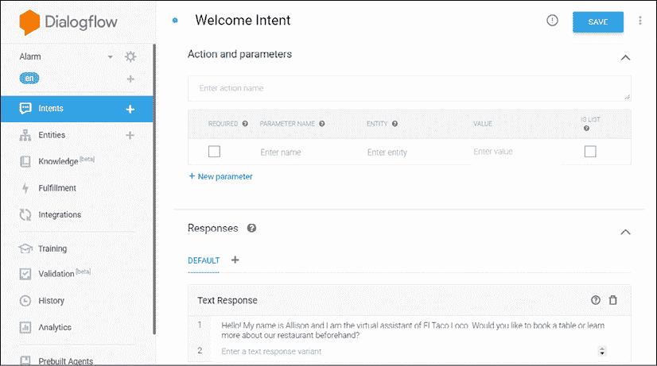
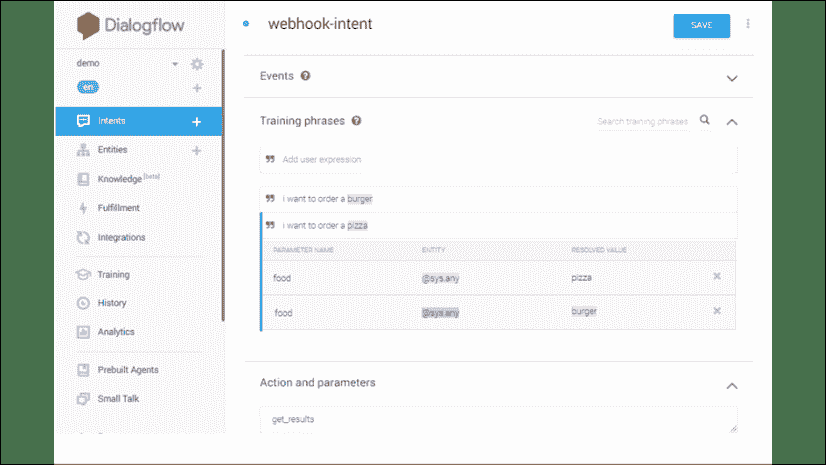
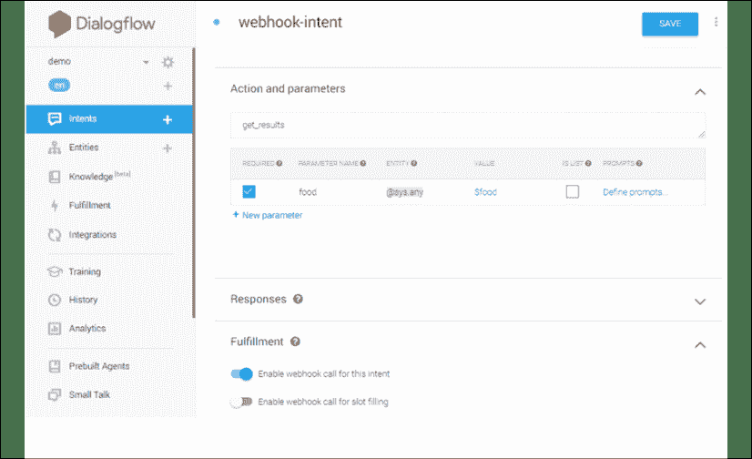

# 16

# 聊天机器人

在本章中，我们将学习聊天机器人。 我们将了解它们是什么以及如何使用它们。 您还将学习如何创建自己的聊天机器人。 我们将涵盖以下主题：

*   聊天机器人的未来
*   今天的聊天机器人
*   基本的聊天机器人概念
*   流行的聊天机器人平台
*   DialogFlow：
    *   设置 DialogFlow
    *   使用小部件将聊天机器人集成到网站中
    *   使用 Python 将聊天机器人集成到网站中
    *   在 DialogFlow 中设置 Webhook
    *   为意图启用 Webhook
    *   为意图设定训练短语
    *   设置意图的参数和动作
    *   通过 Webhook 建立履行响应
    *   检查来自 Webhook 的响应

我们将首先讨论聊天机器人的未来及其许多潜在应用。

# 聊天机器人的未来

很难准确预测 AI 在未来几年将如何颠覆我们的社会。 就像核技术已被用于开发核武器和为核电站供能一样，人工智能也可以用于崇高的事业或邪恶的目的。 不难想象，世界各地的军事人员拥有利用人工智能技术的强大武器。 例如，使用当前的“现成”技术，我们可以制造一架无人驾驶飞机，向其提供目标人员的照片，然后让无人驾驶飞机追捕该人，直到将其消灭。

即使将该技术用于更具建设性的用例，也很难预测该技术在未来几年中将如何发展。 各种各样的研究在某种程度上预测，由于 AI 推动的生产率提高，整个行业将不再需要过去的工人。 货运和运输业以及呼叫中心业是两个“低落的果实”。

过去几年中，语音接口终于突破并渗透到我们的生活中。 Alexa，Siri 和 Google Home 之类的应用程序已开始嵌入我们的生活和文化中。 此外，微信，Facebook Messenger，WhatsApp 和 Slack 等消息传递平台为企业与人互动创造了机会，并有可能通过这些互动获利。 这些消息传递平台变得如此流行和普及，以至于 2019 年，四大服务比四大社交网络平台拥有更多的活跃用户（41 亿对 34 亿）。

呼叫中心在过去几年中已经发生了巨大变化。 随着使用聊天机器人，云计算和语音生物识别技术的不断发展，公司可以改善客户服务并以更少的人员处理更多的电话。

我们还没有，但是很容易想象，在接下来的 5 或 10 年中，当您致电您的银行时，只有最不常见的情况需要人工干预，并且很大一部分电话会自动处理。

这种趋势只会继续加速。 当前，没有人将大多数聊天机器人对话与人类对话混淆。 但是随着它们在未来几年变得更好，它会变得更加自然和流畅。 当我们拨打呼叫中心时，有时至少是，打电话给我们的原因之一是抱怨或发泄，不仅能解决问题。 随着聊天机器人变得越来越好，他们将能够展示出我们所理解的同情和理解。 此外，他们将拥有对您以前所有通话的完全访问权限，并且能够通过记住先前对话的片段来发展历史并建立融洽的关系。

例如，聊天机器人很快就可以记住您提到孩子的名字，下次打电话时问您 Bobby 做得如何。 此外，就像现在一样，当您通过网络，电话应用程序等不同渠道与银行进行通信，或者与分行中的某人交谈时，聊天机器人将能够访问并使用通过其他渠道输入的信息，可以为您提供更好，更快的服务。 再说一次，我们还没有到那儿，但是可能会有一天，我们宁愿打电话给客户服务，而不是使用其他渠道（如在线访问），因为这样会更快更有效。 举例来说，我确实发现自己越来越多地使用 Alexa，并且对她的功能和怪癖也越来越熟悉和熟悉。 我仍在努力使她动摇，但尚未实现。

不仅与 Alexa 一起，而且与其他智能家居助手一起，我们许多人使用它们来：

*   听音乐
*   设置闹钟
*   创建购物清单
*   获取天气预报
*   房屋周围的控制设备
*   订购在线商品
*   预订机票

但是这种经验可能会变得更加复杂。 随着它们变得更好，它们将至少在某些方面超越我们。 例如，除非我们以这种方式对其进行编程，否则聊天机器人将永远不会感到沮丧。

对于一般的 AI 尤其是聊天机器人，持续不断的发展在伦理上的影响是一个不变的话题。 随着聊天机器人变得越来越好，越来越像人类，当我们与聊天机器人而不是人类聊天时，监管机构可能会迫使企业披露信息。 这可能不是一个坏规则。 但是，我们可能会达到这样的地步：聊天机器人是如此出色，以至于尽管在一开始就进行了披露，但我们很快就会忘记，另一端是一台计算机，而不是理解我们并同情我们的人。

Google Duplex 是一个很好的聊天机器人听起来很自然的有力例子。 [您应该可以在此处观看它的演示](https://www.youtube.com/watch?v=D5VN56jQMWM)。

顺便说一下，这项技术通常是可用的，如果您有 Android 手机或 iPhone，则应该可以使用它。

毫无疑问，聊天机器人将是多产的—在我们的家中，在我们的汽车中，在可穿戴设备中，在呼叫中心以及在电话中。 根据一项估计，聊天机器人的全球市场预计将从 2019 年的 42 亿美元增长到 2024 年的 157 亿美元，年复合增长率为 30.2%。 与其他技术一样，使用该技术成长的年轻人永远不会知道没有聊天机器人为我们服务并改善我们的生活会是什么样子。

本节讨论了聊天机器人在未来几年内的外观。 在下一节中，我们将回到现实，并就如何利用现有的聊天机器人技术使用当今可用的工具创建出色的应用程序提供一些建议。

# 今天的聊天机器人

在的上一节中，我们讨论了随着人工智能技术的发展，未来几年可能实现的目标。 与任何技术一样，我们不应该等到一切都变得完美为止。 在本节以及本章的其余部分，我们将重点介绍当今可行的方法以及使您自己的应用程序尽可能有用和用户友好的最佳实践。

为了利用当今可用的现有技术，并且鉴于仍然需要使用域数据和特定意图来对当前的聊天机器人进行专门编程，因此，我们应该谨慎设计一个好的设计和好的计划来对我们的聊天机器人进行编程。 从为聊天机器人明确定义的目标开始，避免尝试提出广泛的解决方案。 当前，与定义为“万事通”的聊天机器人相比，在定义明确且狭窄的域空间中发挥作用的聊天机器人具有更好的表现和有用的机会。 设计用于在在线商务体验期间提供支持的聊天机器人不能用于诊断汽车问题，而必须在该域中重新编程。 将聊天机器人明确地放在特定的目标和空间上，这样很可能会为用户创造更好的体验。

为了说明这一点，我将分享一个个人故事。 几年前，我参观了迈阿密的一家餐馆。 如您所知，英语是美国最常见的语言，但在迈阿密却不那么普遍。 我们看了看菜单，点了饮料，然后点了开胃菜。 现在该订购主菜了。 我决定与服务员开始一些闲聊。 我忘记了我的具体问题，但这与“您喜欢在迈阿密生活如何？”类似。 脸上惊慌失措的表情告诉我，他不明白这个问题，无论有多少次，我试图解释，他都不会。 为了使他放松，我切换到西班牙语并完成了我们的小聊天。

这里的要点是服务生知道“餐馆英语”以及完成餐厅交易所需的所有短语和互动。 但是其他一切都超出了他的舒适范围。 同样，当我们在以下各节中开发聊天机器人时，只要我们停留在预期的域中，它就可以与我们的用户进行通信。 如果聊天机器人被开发用于预订餐厅，那么如果用户的意图是进行医疗诊断，它将无法提供帮助。

今天的聊天机器人仍然有些狭窄。 目前，我们使用 Alexa，Siri 和 Google Home 可以做的事情很多，它们只能帮助我们完成特定的任务。 他们还不能很好地处理某些人类特质，例如同理心，讽刺和批判性思维。 在目前的状态下，聊天机器人将能够以人类为中心的方式帮助我们完成重复性的交易任务。

但是，即使我们应该尝试使聊天机器人在域上保持尽可能紧密，但这并不意味着我们不应该在机器人中注入一些“个性”。 Alexa 有时可能会显得厚脸皮和幽默，因此您应该为自己的机器人而努力。 这样可以提高与机器人的互动度。

人们在聊天时，通常希望对对话有一定程度的共同兴趣，因此，对话将以这样的方式进行：将存在回答后续问题的答案，以及有助于和促进对话的答案 。 使用一点语将使您的机器人更真实，更有吸引力。

在深入研究自己的聊天机器人的设计之前，让我们介绍一些在开发过程中对我们有帮助的基础概念。

# 聊天机器人概念

在开发代码之前，让我们设定一个基准并访问一些与聊天机器人相关的有用定义。

**代理**

代理是一个可以处理所有对话并路由所有必要的操作的系统。 这是一种自然语言理解模块，需要经常接受训练以适应特定于使用的需求。

**意图**

当两个人进行通信时，他们俩都有他们开始进行通信的原因。 这可能很简单，例如与朋友追赶并找出他们在做什么。

可能其中一个正在试图出售某物等等。 这些“意图”可分为三大类：

*   **演讲者正在尝试娱乐**：例如，有人告诉您开玩笑。
*   **演讲者正在尝试通知**：有人问几点了，或者温度是多少？ 他们收到了答案。
*   **演讲者试图说服**：议程是试图出售一些东西。

对于大多数聊天机器人，它们的作用是执行命令和执行任务。 由于的原因，他们需要执行的第一个任务是确定调用他们的人的意图。 意图具有诸如上下文，训练阶段，动作和参数以及响应之类的元素。

**上下文**

上下文是用来给予讨论的连贯性和流畅性，保留了对话中已经使用的关键概念。

**实体**

这基本上是将一组单词归为一个已定义的实体。 例如，笔，铅笔，纸，橡皮和笔记本可以称为文具。 因此，DialogFlow 提供了已经过训练的预建实体，或者我们可以构建自定义实体并对其进行训练。 这有助于减少训练短语的冗余。

**集成**

像 DialogFlow 和 Lex 这样的聊天机器人平台可以与大多数最受欢迎的对话和消息传递平台集成，例如 Google Assistant，Facebook Messenger，Kik 和 Viber 等。

**履行**

履行是一项连接服务，可让您根据最终用户的表达来执行操作，并将动态响应发送回用户。 例如，如果用户正在寻找员工详细信息，则您的服务可以从数据库中获取详细信息，并立即对用户结果进行响应。

**语气**

每当我们与某人进行对话时，使用稍有不同的方式提出相同的问题是完全正常的。 例如，我们可能会问“今天过得怎么样？”的问题，但是有很多方法可以问相同的问题。 示例包括：

*   告诉我你的一天
*   你今天过得还好么？
*   你今天过的好吗？
*   工作进展如何？

人类自然会善于从话语中解释含义，并回答发问者想问的问题而不是他们实际问的问题。 例如，对问题“您过得愉快吗？”的简单解释。 将要求答案为是或否。 但是作为人类，我们有足够的技巧来理解的真正含义可能是“告诉我您的一天”。

许多聊天机器人平台都变得越来越好，不再要求我们拼出每一个发音，而是能够进行一些“模糊”匹配，并且不需要为每个单独的组合输入内容。

**唤醒词**

像 Alexa 或 Siri 这样的许多聊天机器人保持休眠状态，直到它们被“唤醒”并准备好接收命令为止。 要唤醒它们，需要一个“唤醒词”。 对于 Alexa，最常用的唤醒词是“Alexa”。 对于 Siri，默认唤醒字为“Hey Siri”。 并且，对于 StarShip 企业版，唤醒词是“Computer”。

**启动词**

聊天机器人唤醒后，很多时候我们希望该聊天机器人为我们执行一个动作，因此我们需要“启动”该动作。 一些启动词的示例是：

*   订购
*   告诉我
*   加
*   打开

您可以将启动词视为命令。

**广告位值或实体**

插槽值是字，将被转换为参数。 让我们看几个例子：

*   订购<u>牛奶</u>
*   告诉我<u>意大利</u>的首都
*   将<u>面包</u>添加到购物清单
*   打开<u>烤箱</u>

插槽值带有下划线。 插槽值可以具有插槽类型。 就像参数可以具有参数类型（整数，字符串等）一样。 某些插槽类型是内置的，还可以创建自定义插槽类型。 插槽类型的一些示例是：

*   国名
*   电子邮件地址
*   电话号码
*   日期

一些聊天机器人平台将插槽类型称为实体。

**错误计划和默认情况**

设计良好的聊天机器人应始终优雅地处理无法预料的情况。 当聊天机器人没有针对特定交互的程序化答案时，它应该能够显示默认行为，以尽可能优雅地处理无法预料的情况。 例如，如果聊天机器人的功能是预订美国境内的国内航班，但用户请求飞往加拿大温哥华的包机，则聊天机器人应能够优雅地告诉用户他们仅服务于美国城市，然后再次询问目的地 。

**Webhooks**

Webhook 是，HTTP 推送 API 或 Web 回调。 它也称为反向 API，因为一旦事件发生，它就会将数据从应用程序发送到应用程序使用者。 它消除了消费者不断轮询应用程序的需求。

既然我们已经介绍了与聊天机器人更好地协作所需的基本概念，让我们考虑如何创建一个有用的，“结构良好”的聊天机器人。

# 一个结构合理的聊天机器人

为了使聊天机器人有用并使其高效，它必须具有某些特质。 我们将具有这些特质的聊天机器人称为“结构良好”的聊天机器人。 我们列出并定义以下质量：

**适应性**

自适应聊天机器人是一种可以理解并适应收到的所有语音的聊天机器人。 即使对于未明确编程的语音，也应该有一个优美的响应，以使聊天机器人用户重回正轨，或者利用此机会将聚会转移给实时操作员。

**个性化设置**

作为人类，我们喜欢感到与众不同。 我们喜欢听到自己的名字，也喜欢别人记住我们的一些小事（我们孩子的名字，母校等等）。 个性化的聊天机器人会记住以前的交互以及他们收集的有关单个用户的信息。

**可用性**

应该有一个聊天机器人可以帮助用户。 这超出了传统平台的可用性。 当然，我们的聊天机器人应该随时准备提供帮助，并在需要时随时进行访问。 但这也适用于我们能够以多快的速度获取聊天机器人来帮助我们实现意图。 想一想在传统**交互式语音响应**（**IVR**）系统中的导航树，在这些导航树中，我们必须按很多数字，然后他们才知道我们要执行的意图。 此类系统的可用性较低。

**相关性**

与相关的聊天机器人可以使聊天机器人的用户感知到他们确实在进行正常的对话。

我们几乎已经准备好继续开发自己的聊天机器人。 但是，在此之前，我们应该考虑主要的聊天机器人平台，这些平台是我们聊天机器人的开发和发行的基础。

# 聊天机器人平台

一些使用最广泛的聊天机器人是由主要供应商（例如 Google，AWS 和 Microsoft）开发的平台实现的。 在为聊天机器人选择技术堆栈时，应仔细考虑他们的服务产品。 这三大供应商均提供可靠且可扩展的云计算服务，这些服务将帮助您根据需要实现和自定义聊天机器人。 到目前为止，可以轻松创建基于文本或语音的机器人的最著名平台如下：

*   DialogFlow（Google，以前为 Api.ai）
*   Azure Bot 服务（Microsoft）
*   Lex（AWS）
*   Wit.ai（Facebook）
*   沃森（IBM）

当然可以使用此处列出的平台以及其他流行的平台编写功能强大的聊天机器人。 但是我们现在将更深入地研究一个平台，尤其是获得更深入的了解。 在聊天机器人服务中，DialogFlow 对于初学者来说是一个不错的选择。 我们将在下一节中讨论 DialogFlow，并在本章的其余部分中使用该平台进行聊天机器人的开发。

# 使用 DialogFlow 创建聊天机器人

Google 在机器学习和**自然语言处理**（**NLP**）中有着广泛的研究历史。 这项研究的大部分内容都反映在他们的 DialogFlow 工具中。 DialogFlow 与 Google Cloud 语音转文本 API 以及其他第三方服务（例如 Google Assistant，Amazon Alexa 和 Facebook Messenger）集成在一起。

无需编写任何代码即可创建提供很多功能的聊天机器人。 最初，我们将回顾如何使用 **Google Cloud Platform**（**GCP**）控制台，仅通过即可不使用代码来配置聊天机器人。 在本章的以下各节中，我们将演示如何将聊天机器人与其他服务集成。 本章后面的部分将需要对 Python 语言有基本的了解。

**入门步骤**

1.  使用 Google 帐户在[这里](https://dialogflow.com)免费注册。
2.  为了使聊天机器人正常工作，您需要接受 DialogFlow 所请求的所有权限。 这样，您就可以管理 GCP 服务中的数据，并与 Google 助手集成。
3.  您可以通过[这里](https://console.dialogflow.com)访问 DialogFlow 控制台。
4.  最后，通过选择主要语言（以后可以添加其他语言）和 Google Project 标识符来创建新代理。 要启用结算和其他设置，需要使用 Google Cloud Console 中的项目名称。 如果您没有现有项目，请不要担心：创建一个新项目。

现在您已经注册并可以使用，让我们开始设置 DialogFlow。

## DialogFlow 设置

首次登录 DialogFlow 时，将要求您允许某些权限。 建议您允许这些权限。 否则，以下练习将无法正常进行：


图 1：Google Cloud Console 访问 DialogFlow 控制台的权限

DialogFlow 中的开发利用了我们之前讨论的两个主要概念-意向和上下文。 目的标识用户向聊天机器人发出语音的目的。 上下文使对话变得连贯和流畅。

单击**意图**选项卡后，您应该看到如下屏幕：


图 2：DialogFlow 聊天机器人意图创建

正如我们先前看到的，聊天机器人开发中的另一个重要概念是插槽类型。 在 DialogFlow 中，我们将插槽类型称为实体。 通过实体，可以识别对话中的常见或重复出现的参数。 实体可以是内置的或定制的。 实体的使用使聊天机器人更具通用性和灵活性。 单击**实体**标签时，您应该看到以下屏幕：


图 3：DialogFlow 聊天机器人实体创建

让我们从仅使用意图的基本示例开始。 首先，我们将创建代理，然后通过 DialogFlow 接口定义一些意图。 可以通过编程方式创建这些意图，但是为了使示例保持简单，我们将使用图形化界面来创建意图。 首先，让我们设置后备意图。 如果没有其他意图被调用，则将被调用：



图 4：创建 DialogFlow 后备意图

正如您在“图 4”中看到的那样，只需编写**立即尝试**表格即可获得答案。 最初，当尚未创建任何意图时，聊天机器人将使用后备意图。 具有后备意图可防止对话陷入停顿。

当我们浏览**默认回退意图**时，我们看到**响应**的完整列表。 如您所见，已经定义了许多响应。 当意图匹配时，聊天机器人引擎将随机选择一个项目作为答案。

让我们创建我们的第一个意图。 我们可以使用控制台执行此操作。 确保您还填写了**训练短语**表格。 这些是我们期望用户触发这些意图的句子。 我们在构造这些句子时越精确，越全面，那么聊天机器人在识别意图方面将越成功。

现在，我们可以通过插入更多意图为聊天机器人添加更多功能来进行操作。 我们可以使用右侧的帮助程序连续测试我们的聊天机器人。

希望很明显，仅使用意图就可以创建功能强大的聊天机器人。 DialogFlow 正在为我们完成大部分繁重的工作。 为了使聊天机器人更加强大，我们可以开始向意图添加上下文。 我们可以通过在从一个意图转到另一个意图的同时添加参数，同时保持对话的上下文，来使我们的聊天机器人更加灵活。 在本教程的下一部分中，我们将看到如何将聊天机器人集成到网站中。

## 使用小部件将聊天机器人集成到网站中

可以通过两种方法将 DialogFlow 聊天机器人集成到网站中：

*   通过小部件
*   使用 Python

我们将从访问第一种方法开始，这是更简单的方法。 此方法使用`iframe`将 DialogFlow 集成到网页中。 要使用此方法，请从左侧菜单中选择`Integrations`，并确保已启用`Web Demo`。 复制 HTML 代码并将其粘贴到网页中，这样就可以在您的网站上使用聊天机器人了：


图 5：使用`iframe`将聊天机器人集成到网站中

在下面的部分中，我们将考虑第二种方法-使用 Python。 如我们所见，集成聊天机器人的小部件方法非常简单。 但是，我们几乎无法控制机器人的实现方式。 使用 Python 将聊天机器人集成到站点中，可以在如何部署聊天机器人方面为开发人员提供更多的控制权和灵活性。

## 使用 Python 将聊天机器人集成到网站中

调用 DialogFlow 聊天机器人的另一种方法是使用 Python。 首先，我们需要安装运行代码所需的软件包要求：

```py
$ pip3 install DialogFlow
$ pip3 install google-api-core 
```

该代码初始化一个以意图为输入的客户端会话，最后返回一个响应，即所谓的`fulfillment`，并将相应的置信度作为一个十进制值。 我们要获取答案的句子保存在名为`text_to_be_analyzed`的变量中。 通过添加句子来编辑脚本。 使用 Python，很容易创建更多的自定义逻辑。 对于示例，您可以捕获意图，然后触发自定义操作：

```py
# Install the following requirements:
# DialogFlow 0.5.1
# google-api-core 1.4.1
import DialogFlow
from google.api_core.exceptions import InvalidArgument
PROJECT_ID = 'google-project-id'
LANGUAGE_CODE = 'en-US'
GOOGLE_APPLICATION_CREDENTIALS = 'credentials.json'
SESSION_ID = 'current-user-id'
analyzed_text = "Hi! I'm Billy. I want tacos. Can you help me?"
session_client = DialogFlow.SessionsClient()
session = session_client.session_path(PROJECT_ID, SESSION_ID)
text_input = DialogFlow.types.TextInput(text=analyzed_text, 
    language_code=LANGUAGE_CODE)
query_input = DialogFlow.types.QueryInput(text=text_input)
try:
    response = session_client.detect_intent(session=session, 
    query_input=query_input)
except InvalidArgument:
    raise
print("Query text:", response.query_result.query_text)
print("Detected intent:", 
    response.query_result.intent.display_name)
print("Detected intent confidence:", 
    response.query_result.intent_detection_confidence)
print("Fulfillment text:", 
    response.query_result.fulfillment_text) 
```

如您所见，该函数需要一个`session_id`。 这是一个标识当前会话的值。 因此，我们建议您使用用户的 ID 使其易于检索。

为了使 Python 代码正常工作，需要一个新令牌。 实际上，DialogFlow API 的 2.0 版依赖于身份验证系统，该系统基于与 GCP 服务帐户关联的私钥而不是访问令牌。 使用此过程，可以获取 JSON 格式的私钥。

**实现和网络挂钩**

现在我们已经建立了，如何创建会话，让我们将其用于一些有用的事情。 进行会话的目的是能够向服务器发出请求并接收可以满足该请求的响应。 在 DialogFlow 中，请求称为 Webhooks，并且大致对应于响应。 实现是 DialogFlow 的一项有用功能：通过实现，我们可以与后端进行通信并生成动态响应。 通过实现，我们可以开发一个 Webhook，该 Webhook 接受来自 DialogFlow 的请求，处理该请求，并使用与 DialogFlow 兼容的 JSON 进行响应。

在 DialogFlow 中，当调用某些启用了 Webhook 的意图时，将使用 Webhook 从后端获取数据。 来自该意图的信息将传递到 webhook 服务，然后返回响应。

为此，可以使用 **ngrok** 。 ngrok 软件是可用于调用 Webhook 的 Web 隧道工具。 它允许使用本地服务器测试 API 和 Webhooks。 本教程本节中将使用的另一个工具是 **Flask** 。 Flask 是一个轻量级的 Web 框架，可用于创建可调用外部应用程序的 Webhook 服务。 在我们的示例中，将被调用的外部应用程序是 DialogFlow 代理。 要使用 Flask，我们首先需要安装它：

```py
$ pip3 install Flask 
```

要了解有关 Flask 的更多信息，[您可以访问这里](https://pypi.org/project/Flask)。

**使用 Flask 创建 Webhook**

首先，我们可以创建一个基本的 Flask 应用程序：

```py
# import flask dependencies
from flask import Flask
# initialize the flask app
app = Flask(__name__)
# default route
@app.route('/')
def index():
    return 'Hello World'
# create a route for webhook
@app.route('/webhook')
def webhook():
    return 'Hello World'
# run the app
if __name__ == '__main__':
   app.run() 
```

使用以下命令测试应用程序：

```py
$ python app.py or FLASK_APP=hello.py flask run 
```

如果您看到前面的输出，这将确认该应用程序的初始版本正在运行。 到目前为止，我们仅使用本地服务器，因此其他外部客户端无法通过互联网访问该服务器。 要将其集成为 DialogFlow 的 Webhook，我们需要将其部署在可以通过互联网访问的服务器上。 那就是 ngrok 工具出现的地方。[可以在这里下载该工具](https://ngrok.io)。

要运行 ngrok，请使用以下命令：

```py
$ ngrok http <port_number> 
```

例如：

```py
$ ngrok http 5000 
```

收到的输出应该是这样的：


图 6：ngrok 初始化输出

在下一节中，我们将研究如何在 DialogFlow 中设置 Webhook。

## 如何在 DialogFlow 中设置 Webhook

要在 DialogFlow 中设置 Webhook，请在左侧栏中选择**实现**，然后选择输入 ngrok 生成的 Webhook URL：


图 7：Dialogflow Webhook 设置

确保将后缀`/webhook`添加到 URL 的末尾。 它看起来应该像这样：

`https://886b89bc.ngrok.io/webhook`

不：

`https:// 886b89bc.ngrok.io/`

我们将在`/webhook`路由而不是索引路由上处理请求。

如果该 URL 没有 webhook 后缀，则应出现以下错误：

```py
Webhook call failed. Error: 405 Method Not Allowed. 
```

更正 URL 以包括后缀，这样可以解决该错误。

接下来，需要启用 Webhook 以支持意图并获取服务器数据。 在下一节中，我们将介绍如何做到这一点。

## 为意图启用 Webhook

要为意图启用 webhooks ，请打开需要启用 webhook 的意图，向下滚动到页面底部，然后启用选项**为此意图**启用 webhook 调用：


图 8：意图的 Dialogflow Webhook 启用

触发意图后，它会向 Webhook 发送请求，然后将响应发送回去。 现在，我们可以继续设置训练阶段。

## 为意图设置训练短语

训练短语是帮助聊天机器人确定被调用意图的语音。 这是一个应如何设置的示例：



图 9：意图的 Dialogflow 训练短语设置

接下来，我们需要设置参数和操作。

## 设置意图的参数和动作

需要先设置操作和参数，然后才能在 Webhook 中使用来处理请求。

在当前的示例中，`get_results`被设置为**动作**。 每当意图使用`POST`请求调用 Webhook 时，`get_results`将作为**动作**收到。 如果存在可以调用 Webhook 的多个意图，则将使用该动作进行区分，并由此生成不同的响应。

我们还可以将**参数**传递到我们的 webhook。 为此，我们可以定义参数名称及其值。 在此示例中，我们将非常简单地开始，但最终我们将允许用户从餐厅订购食物。 因此，例如，用户可能会说：“我想订购汉堡和薯条”，而聊天机器人会将这种话语传递给后端，以进行验证，存储和处理：



图 10：Dialogflow 操作和参数设置

动作和参数是可选值。 即使未传递操作和参数，Webhook 仍将运行。 为了区分没有动作的意图，可以在请求 JSON 中检查意图名称。

## 通过网络挂钩建立实现响应

Webhook 响应应该使用有效的 JSON 响应构造。 这样，DialogFlow 将能够在前端正确显示消息。

可以使用 Python 构造响应。 可以使用以下响应类型：

*   简单回应
*   基本卡
*   意见建议
*   清单卡
*   浏览轮播
*   轮播响应

以下代码为 DialogFlow 生成一个简单的 JSON 响应，并带有`fulfillment`文本：

```py
# import flask dependencies
from flask import Flask, request, make_response, jsonify
# initialize the flask app
app = Flask(__name__)
# default route
@app.route('/)
def index():
    return 'Hello World'
# function for responses
def results():
    # build a request object
    req = request.get_json(force=True)
    # fetch action from json
    action = req.get('queryResult').get('action')
    # return a fulfillment response
    return {'fulfillmentText': 'This is a webhook response'}
# create a route for webhook
@app.route('/webhook', methods=['GET', 'POST'])
def webhook():
    # return response
    return make_response(jsonify(results()))
# run the app
if __name__ == '__main__':
   app.run()
You can see that we have fetched "action" from the request using
action = req.get('queryResult').get('action') 
```

最初，这只是一个非常简单的示例，用于演示请求/响应（webhook /实现）机制。 用户应该看到以下意图响应：

```py
This is a webhook response. 
```

您可以看到我们已经使用以下命令从请求中提取了`action`：

```py
action = req.get('queryResult').get('action') 
```

在此示例中未使用操作，但可以将用于此目的。 现在，我们将研究如何从服务器获取响应以及如何根据响应来处理响应。

## 检查来自 Webhook 的响应

使用窗口右侧的控制台，可以调用意向，并可以检查响应。 在当前示例中，响应将如下所示：


图 11：Dialogflow 响应验证

如果要调试聊天机器人并对其进行故障排除，可以单击**诊断信息**。 在这里，我们可以查看所有 DialogFlow 请求的详细信息以及从 Webhook 发送回的响应。 如果 Webhook 中存在错误，则**诊断信息**也可以用于调试。

本章的目的是介绍聊天机器人的基本知识。 在这一点上，我们的聊天机器人除了演示如何从服务器获取响应外，还没有做其他事情。 我们将其留给您，以探索如何进一步增强聊天机器人。 一些明显的增强功能包括：根据 e 稳定菜单检查所请求的食物，以查看菜单上是否有可用项目； 根据当前库存检查请求的食物数量，以查看是否可以完成订单； 将订单存储在后端数据库中以进行记帐和跟踪； 并将聊天机器人连接到机器人或后端系统以实际完成订单。

# 总结

在本章中，我们首先了解了聊天机器人的潜在未来，以及聊天机器人变得越来越好将如何影响我们的社会。 然后，我们了解了当前聊天机器人技术的局限性以及当前局限性推荐的最佳实践。 我们了解了基本的聊天机器人概念以及最流行的聊天机器人平台。

最后，我们更深入地研究了由 Google 开发的名为 DialogFlow 的聊天机器人平台。 通过执行基本练习，然后学习如何使用 Webhooks 与其他后端服务集成，我们熟悉了该平台。 我们一步一步地了解了如何测试聊天机器人的功能并确保其设置正确。

在下一章中，我们将跳到另一个令人兴奋的主题，并学习如何训练顺序数据并将其用于时间序列分析。