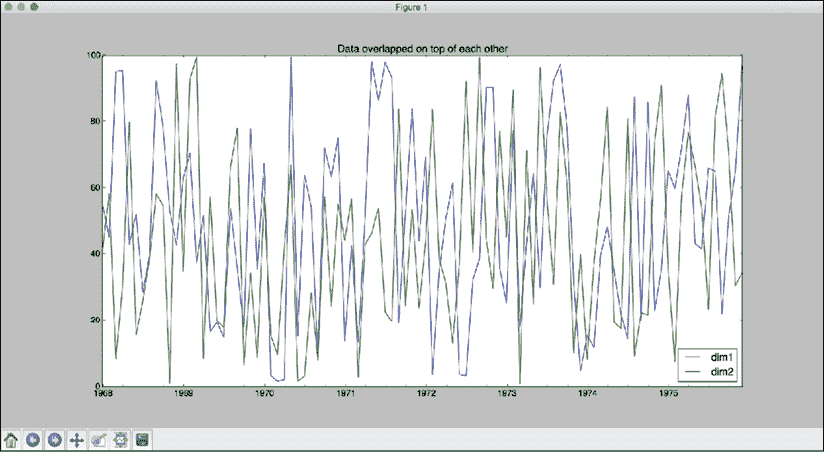
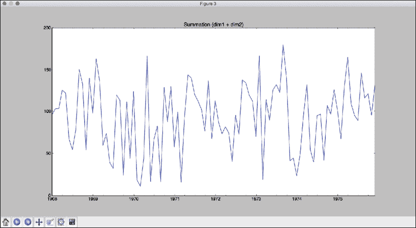
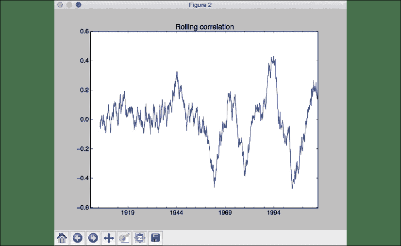
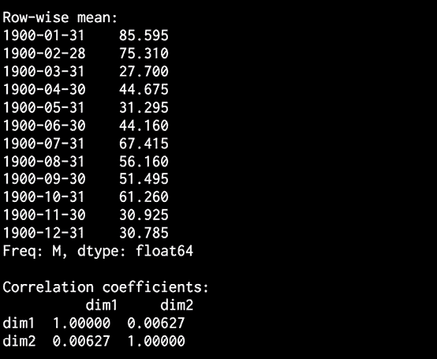

# 17

# 顺序数据和时间序列分析

在本章中，我们将学习如何构建序列学习模型。 为此，我们将涵盖许多主题，以使我们更好地掌握如何构建和使用这些模型。 我们将学习如何处理 Pandas 中的时间序列数据。 我们将了解如何分割时间序列数据并对其执行各种操作，然后我们将讨论如何滚动地从时间序列数据中提取各种统计信息。 接下来，我们将学习隐马尔可夫模型（HMM），然后实现一个用于构建这些模型的系统。 我们将了解如何使用条件随机字段来分析字母序列，最后，我们将讨论如何使用到目前为止学到的技术来分析股市数据。

在本章的最后，您将学到：

*   了解顺序数据
*   使用 Pandas 处理时间序列数据
*   切片时间序列数据
*   操作时间序列数据
*   从时间序列数据中提取统计信息
*   使用隐马尔可夫模型生成数据
*   使用条件随机字段识别字母序列
*   股市分析

让我们开始研究并理解顺序数据。

# 了解顺序数据

在机器学习的世界中，我们遇到了许多类型的数据，例如图像，文本，视频和传感器读数。 不同类型的数据需要不同类型的建模技术。 顺序数据是指顺序很重要的数据。 顺序数据可以在许多“野外”情况下找到。 这里有些例子：

**基因组序列数据**：这个也许是我们拥有的顺序数据的最好和最重要的例子。 基因出现的顺序是创造和维持生命的最基本水平。 基因组学序列包含使我们存活的信息。

**人类语言**：沟通时顺序非常重要。 如果我们开始更改本书中单词的顺序，不久之后，本书将变得完全不可理解！

**计算机语言**：在大多数计算机语言中，正确的输入顺序对于任何功能正常运行至关重要。 例如，在许多计算机语言中，符号“ > =“的意思是“大于或等于”，而在其他语言中，“ = >”的意思可能是赋值或产生语法错误。

时间序列数据是顺序数据的子分类。 时间序列数据的一些示例如下：

**股票市场价格**：时间序列数据的圣杯是股票价格。 许多数据科学家将在其职业生涯中的某个时刻尝试使用其数据科学技能来尝试预测股市。 他们中的许多人将意识到这是一项艰巨的努力，并转向其他主题和问题。 库存预测困难的几个原因是：

*   在经济周期的不同时间，股票对经济状况的反应不同。
*   影响股票价格的因素很多，这使它成为一个非常复杂的系统。
*   股票中一些最剧烈的变动发生在市场交易时间之外，这使得实时处理这些信息变得困难。

**应用程序日志**：根据定义，应用程序日志具有两个组成部分。 指示操作何时发生以及正在记录信息或错误的时间戳。

**IoT 活动**：IoT 设备中的活动以时间顺序方式发生，因此可以用作时间的数据。

时间序列数据是从任何数据源（例如传感器，麦克风，股票市场等）获得的时间戳值。 时间序列数据具有许多重要特征，需要对其进行建模才能进行有效分析。

时间序列数据中某些参数的测量以固定的时间间隔进行。 这些测量被安排并存储在时间线上，并且它们的出现顺序至关重要。 此顺序用于从数据中提取模式。

在本章中，我们将看到如何构建通常描述时间序列数据和顺序数据的模型。 这些模型将用于了解时间序列变量的行为。 然后，我们将能够使用这些模型来预测和推断该模型以前未看到的值。

时间序列数据分析被广泛应用于金融，传感器数据分析，语音识别，经济学，天气预报，制造以及更多领域。 在本章中，我们将广泛使用一个名为 Pandas 的库来处理与时间序列相关的操作。

Pandas 是强大的和流行的 Python 软件包，用于数据处理和分析。 具体来说，它提供了用于操纵表结构的方法和操作。 这是一个可爱的名字，让人联想到毛茸茸的熊，但这里有一些没用的琐事。 Pandas 的名称来自*面板数据*一词，这是计量经济学术语，用于包含多个时间段内观测值的数据集。

我们还将使用其他几个有用的软件包，例如`hmmlearn`和`pystruct`。 确保继续安装它们。

可以通过运行以下命令来安装这些软件包：

```py
$ pip3 install pandas
$ pip3 install hmmlearn
$ pip3 install pystruct
$ pip3 install cvxopt
$ pip3 install timeseries 
```

如果在安装`cvxopt`时出错，则可以在[这个页面](http://cvxopt.org/install)上找到进一步的说明。 假设您已经成功安装了包，让我们继续进行下一部分，在此我们将研究如何通过和 Pandas 处理时间序列数据。

# 使用 Pandas 处理时间序列数据

Pandas 可以说是 Python 中最重要的库。 学习良好地使用其方法至关重要，当您将 Python 用于其他任何项目时，它将为您提供良好的服务。 除了时间序列分析外，Pandas 还可以执行更多功能，包括：

*   具有集成索引的数据帧操作
*   从各种不同的文件格式读取数据并将数据写入内存数据结构的方法
*   资料分类
*   资料筛选
*   缺少价值估计
*   重塑和旋转数据集
*   基于标签的切片，索引和子集创建
*   高效的列插入和删除
*   按数据集上的操作分组
*   合并和合并数据集

在本节中，我们将使用它来将数字序列转换为时间序列数据并将其可视化。 Pandas 提供了添加时间戳，组织数据然后对其进行有效操作的选项。

创建一个新的 Python 文件并导入以下软件包：

```py
import numpy as np
import matplotlib.pyplot as plt
import pandas as pd 
```

定义一个函数以从输入文件中读取数据。 参数索引指示包含相关数据的列：

```py
def read_data(input_file, index):
    # Read the data from the input file
    input_data = np.loadtxt(input_file, delimiter=',') 
```

定义`lambda`函数以将字符串转换为 Pandas 日期格式：

```py
 # Lambda function to convert strings to Pandas date format
    to_date = lambda x, y: str(int(x)) + '-' + str(int(y)) 
```

使用此`lambda`函数可从输入文件的第一行获取开始日期：

```py
 # Extract the start date
    start = to_date(input_data[0, 0], input_data[0, 1]) 
```

在执行操作时，Pandas 库需要结束日期为独占日期，因此我们需要将最后一行的`date`字段增加一个月：

```py
 # Extract the end date
    if input_data[-1, 1] == 12:
        year = input_data[-1, 0] + 1
        month = 1
    else:
        year = input_data[-1, 0]
        month = input_data[-1, 1] + 1
    end = to_date(year, month) 
```

使用开始日期和结束日期以及每月一次的频率来创建带有日期的索引列表：

```py
 # Create a date list with a monthly frequency 
    date_indices = pd.date_range(start, end, freq='M') 
```

使用时间戳创建一个 Pandas 数据系列：

```py
 # Add timestamps to the input data to create time series data
    output = pd.Series(input_data[:, index], index=date_indices)
    return output 
```

定义和`main`功能并指定输入文件：

```py
if __name__=='__main__':
    # Input filename
    input_file = 'data_2D.txt' 
```

指定包含数据的列：

```py
 # Specify the columns that need to be converted 
    # into time series data
    indices = [2, 3] 
```

遍历各列并读取每列中的数据：

```py
 # Iterate through the columns and plot the data 
    for index in indices:
        # Convert the column to timeseries format 
        timeseries = read_data(input_file, index) 
```

绘制时间序列数据：

```py
 # Plot the data 
        plt.figure() 
        timeseries.plot()
        plt.title('Dimension ' + str(index - 1))
    plt.show() 
```

完整代码在文件`timeseries.py`中给出。 如果运行代码，您将看到两个屏幕截图。

以下屏幕截图显示了第一维的数据：


图 1：使用每日数据绘制的第一维数据

第二张屏幕截图以第二维表示数据：


图 2：使用每日数据绘制的第二维数据

在本节中，我们为如何使用 Pandas 从外部文件加载数据，如何将其转换为时间序列格式以及如何对其进行绘制和可视化奠定基础。 在下一节中，我们将学习如何进一步处理数据。

# 切片时间序列数据

现在我们已经加载了时间序列数据，让我们看看如何对其进行切片。 切片的过程是指将数据分为多个子间隔并提取相关信息。 当我们使用时间序列数据集时，这很有用。 我们将使用时间戳来切片数据，而不是使用索引。

创建一个新的 Python 文件并导入以下软件包：

```py
import numpy as np
import matplotlib.pyplot as plt
import pandas as pd
from timeseries import read_data 
```

从输入数据文件中加载第三列（零索引）：

```py
# Load input data
index = 2
data = read_data('data_2D.txt', index) 
```

定义开始和结束年份，然后以年级粒度绘制数据：

```py
# Plot data with year-level granularity 
start = '2003'
end = '2011'
plt.figure()
data[start:end].plot()
plt.title('Input data from ' + start + ' to ' + end) 
```

定义开始和结束月，然后以月级粒度绘制数据：

```py
# Plot data with month-level granularity 
start = '1998-2'
end = '2006-7'
plt.figure()
data[start:end].plot()
plt.title('Input data from ' + start + ' to ' + end)
plt.show() 
```

完整代码在文件`slicer.py`中给出。 如果运行代码，您将看到两个数字。

第一个屏幕截图显示了从 *2003* 到 *2011* 的数据：


图 3：使用每月滴答作图的数据（2003 年至 2011 年）

第二张屏幕截图显示了 1998 年 2 月到 2006 年 7 月的数据：


图 4：使用月度滴答作图的数据（1998 年至 2006 年）

正如我们在上一节创建的图表（“图 1”和“图 2”）中看到的那样，它们很难阅读。 数据被“捆绑”。 通过使用每月刻度对数据进行切片，可以更轻松地可视化数据的起伏。 在下一节中，我们将继续学习 Pandas 库中可用的不同功能，例如过滤和求和，以及该功能如何帮助更好地分析和处理 数据集。

# 对时间序列数据进行操作

Pandas 库可以有效地处理时间序列数据，并执行各种操作，例如过滤和加法。 可以设置条件，Pandas 会过滤数据集并根据条件返回正确的子集。 时间序列数据也可以加载和过滤。 让我们看另一个例子来说明这一点。

创建一个新的 Python 文件并导入以下软件包：

```py
import numpy as np
import pandas as pd
import matplotlib.pyplot as plt
from timeseries import read_data 
```

定义输入文件名：

```py
# Input filename 
input_file = 'data_2D.txt' 
```

将第三和第四列加载到单独的变量中：

```py
# Load data
x1 = read_data(input_file, 2)
x2 = read_data(input_file, 3) 
```

通过命名两个维度来创建 Pandas `DataFrame`对象：

```py
# Create pandas dataframe for slicing
data = pd.DataFrame({'dim1': x1, 'dim2': x2}) 
```

通过指定开始和结束年份来绘制数据：

```py
# Plot data
start = '1968'
end = '1975'
data[start:end].plot()
plt.title('Data overlapped on top of each other') 
```

使用条件过滤数据，然后显示它。 在这种情况下，我们将获取`dim1`中所有小于`45`的数据点和`dim2`中所有大于`30`的值：

```py
# Filtering using conditions
# - 'dim1' is smaller than a certain threshold
# - 'dim2' is greater than a certain threshold
data[(data['dim1'] < 45) & (data['dim2'] > 30)].plot()
plt.title('dim1 < 45 and dim2 > 30') 
```

我们也可以在 Pandas 中添加两个系列。 让我们在给定的开始日期和结束日期之间添加`dim1`和`dim2`：

```py
# Adding two dataframes 
plt.figure()
diff = data[start:end]['dim1'] + data[start:end]['dim2']
diff.plot()
plt.title('Summation (dim1 + dim2)')
plt.show() 
```

完整代码在文件`operator.py`中给出。 如果运行代码，您将看到三个屏幕截图。 第一个屏幕快照显示了从到 *1968* 到 *1975* 的数据：



图 5：重叠数据（1968 年至 1975 年）

第二张屏幕截图显示了他过滤的数据：


图 6：`dim1 < 45`和`dim2 > 30`的数据（1968 年-1975 年）

第三个屏幕截图显示了 的求和结果：



图 7：`dim1`和`dim2`的总和（1968 – 1975）

在本节中，我们继续学习 Pandas 库中可用的不同功能，包括过滤和求和。 在数据科学中，选择和训练模型以了解正在分析的数据集很重要。 Pandas 是完成此任务的有用工具。 在下一节中，我们将介绍另外两个有用的库。 这些库用于计算有关数据集的各种统计信息。

# 从时间序列数据中提取统计信息

为了从时间序列数据中提取有意义的见解，我们可以从中生成统计数据。 这些统计信息的示例包括平均值，方差，相关性，最大值等操作。 这些统计信息可以使用窗口滚动计算。 我们可以使用预定的窗口大小，并在该窗口内计算这些统计信息。 当我们可视化一段时间内的统计信息时，我们可能会看到有趣的模式。 让我们看一个如何从时间序列数据中提取这些统计信息的示例。

创建一个新的 Python 文件并导入以下软件包：

```py
import numpy as np
import matplotlib.pyplot as plt
import pandas as pd
from timeseries import read_data 
```

定义输入文件名：

```py
# Input filename
input_file = 'data_2D.txt' 
```

将第三和第四列加载到单独的变量中：

```py
# Load input data in time series format
x1 = read_data(input_file, 2)
x2 = read_data(input_file, 3) 
```

通过命名两个维度来创建 Pandas`DataFrame`：

```py
# Create pandas dataframe for slicing
data = pd.DataFrame({'dim1': x1, 'dim2': x2}) 
```

沿每个维度提取最大值和最小值：

```py
# Extract max and min values
print('\nMaximum values for each dimension:')
print(data.max())
print('\nMinimum values for each dimension:')
print(data.min()) 
```

提取前`12`行的总体均值和行均值：

```py
# Extract overall mean and row-wise mean values
print('\nOverall mean:')
print(data.mean())
print('\nRow-wise mean:')
print(data.mean(1)[:12]) 
```

使用`24`窗口大小绘制滚动平均值：

```py
# Plot the rolling mean using a window size of 24
data.rolling(center=False, window=24).mean().plot()
plt.title('Rolling mean') 
```

打印相关系数：

```py
# Extract correlation coefficients 
print('\nCorrelation coefficients:\n', data.corr()) 
```

使用窗口大小`60`绘制滚动相关性：

```py
# Plot rolling correlation using a window size of 60
plt.figure()
plt.title('Rolling correlation')
data['dim1'].rolling(window=60).corr(other=data['dim2']).plot()
plt.show() 
```

完整的代码在文件`stats_extractor.py`中给出。 如果运行代码，则会看到两个屏幕截图。 第一个屏幕截图显示了滚动平均值：


图 8：滚动平均值

第二张屏幕截图显示了滚动相关性：



图 9：滚动相关

您也应该看到以下输出：


图 10：最大和最小尺寸以及总体平均值

如果向下滚动，则将看到按行平均值和打印出的相关系数：



图 11：逐行均值和相关系数

上图中的相关系数表示每个维度与所有其他维度的相关程度。 `1.0`的相关性表示完全相关，而`0.0`的相关性表示变量根本不相关。 `dim1`与`dim1`完美相关，`dim2`与`dim2`完美相关。 在任何混淆矩阵中，情况总是如此。 只是说一个变量与其自身完全相关。 另外，`dim1`与`dim2`具有低相关性。 这意味着`dim1`将具有较低的功率来预测`dim2`的值。 到目前为止，我们将不会很快凭借我们的模型及其预测股票价格的能力而成为百万富翁。 在下一节中，我们将学习一种有用的技术来分析时间序列数据，称为**隐式马尔科夫模型**（**HMM**）。

# 使用隐马尔可夫模型生成数据

**隐藏马尔可夫模型**（**HMM**）是一种用于分析连续数据的强大分析技术。 假设要建模的系统是具有隐藏状态的马尔可夫过程。 这意味着基础系统可以是一组可能状态中的一个。

它经历一系列状态转换，从而产生一系列输出。 我们只能观察输出，而不能观察状态。 因此，这些状态对我们是隐藏的。 我们的目标是对数据建模，以便我们可以推断未知数据的状态转换。

为了理解 HMM，让我们考虑**旅行商问题**（**TSP**）的版本。 在此示例中，推销员必须在以下三个城市之间旅行才能工作：伦敦，巴塞罗那和纽约。 他的目标是最大程度地减少旅行时间，以使其成为最有效率的人。 考虑到他的工作承诺和时间表，我们有一组概率决定了从城市`X`到城市`Y`的机会。 在给出的以下信息中，`P(X -> Y)`表示从城市`X`到城市`Y`的概率：

| **城市** | **概率** |
| --- | --- |
| `P(London->London)` | 0.10 |
| `P(London->Barcelona)` | 0.70 |
| `P(London-> NY)` | 0.20 |
| `P(Barcelona->Barcelona)` | 0.15 |
| `P(Barcelona->London)` | 0.75 |
| `P(Barcelona-> NY)` | 0.10 |
| `P(NY->NY)` | 0.05 |
| `P(NY->London)` | 0.60 |
| `P(NY->Barcelona)` | 0.35 |

让我们用过渡矩阵表示此信息：

|  | **伦敦** | **巴塞罗那** | **纽约** |
| --- | --- | --- | --- |
| **伦敦** | 0.10 | 0.70 | 0.20 |
| **巴塞罗那** | 0.75 | 0.15 | 0.10 |
| **纽约** | 0.60 | 0.35 | 0.05 |

现在我们有了所有信息，让我们继续设置问题陈述。 推销员在星期二从伦敦开始他的旅程，并在星期五计划一些事情。 但这取决于他在哪里。 他星期五将在巴塞罗那举行的可能性是多少？ 该表将帮助我们找出答案。

如果我们没有马尔可夫链来对该问题进行建模，那么我们将不知道旅行时间表是什么样的。 我们的目标是非常确定地说他将在给定的一天在每个城市中。

如果我们用`T`表示过渡矩阵，而用`X(i)`表示当日，则：

```
X(i + 1) = X(i).T
```

在我们的情况下，星期五距离星期二 3 天。 这个意味着我们需要计算`X(i + 3)`。 计算将如下所示：

```
X(i + 1) = X(i).T

X(i + 2) = X(i + 1).T

X(i + 3) = X(i + 2).T
```

因此，本质上：

```
X(i + 3) = X(i).T ^ 3
```

我们将`X(i)`设置为：

```
X(i) = [0.10 0.70 0.20]
```

下一步是计算矩阵的立方。 在线提供了许多工具来执行矩阵运算，[例如这里](http://matrix.reshish.com/multiplication.php)。

如果您进行了所有矩阵计算，那么您将看到在星期四将获得以下概率：

```
P(London) = 0.31

P(Barcelona) = 0.53

P(NY) = 0.16
```

我们可以看到他在巴塞罗那的机会要比其他任何城市都高。 这也具有地理意义，因为巴塞罗那比纽约更靠近伦敦。 让我们看看如何在 Python 中为 HMM 建模。

创建一个新的 Python 文件并导入以下软件包：

```py
import datetime
import numpy as np
import matplotlib.pyplot as plt
from hmmlearn.hmm import GaussianHMM
from timeseries import read_data 
```

从输入文件加载数据：

```py
# Load input data
data = np.loadtxt('data_1D.txt', delimiter=',') 
```

提取第三列进行训练：

```py
# Extract the data column (third column) for training
X = np.column_stack([data[:, 2]]) 
```

使用`5`分量和对角协方差创建高斯 HMM：

```py
# Create a Gaussian HMM 
num_components = 5
hmm = GaussianHMM(n_components=num_components, 
        covariance_type='diag', n_iter=1000) 
```

训练 HMM：

```py
# Train the HMM
print('\nTraining the Hidden Markov Model...')
hmm.fit(X) 
```

打印 HMM 每个组成部分的均值和方差值：

```py
# Print HMM stats
print('\nMeans and variances:')
for i in range(hmm.n_components):
    print('\nHidden state', i+1)
    print('Mean =', round(hmm.means_[i][0], 2))
    print('Variance =', round(np.diag(hmm.covars_[i])[0], 2)) 
```

使用训练有素的 HMM 生成`1200`样本并绘制它们：

```py
# Generate data using the HMM model
num_samples = 1200
generated_data, _ = hmm.sample(num_samples)
plt.plot(np.arange(num_samples), generated_data[:, 0], c='black')
plt.title('Generated data')
plt.show() 
```

完整代码在文件`hmm.py`中给出。 如果运行代码，将看到以下屏幕截图，其中显示了 1200 个生成的示例：


图 12：生成的数据

您还将看到以下输出：


图 13：HMM 训练

在给定不同行程的情况下，我们解释图表的方式是遍历销售路线所需的时间不同。 第二个输出指示这些路径的均值和方差。

既然我们已经了解了 HMM，现在让我们了解与时间序列分析相关的另一个主题。 在下一部分中，我们将学习通常称为条件随机场的概率模型及其与 HMM 的区别。

# 使用条件随机字段识别字母序列

**条件随机字段**（**CRF**）是概率模型，经常用于分析结构化数据。 我们使用它们以各种形式标记和分割顺序数据。 以下是一些应用 CRF 的最常见用例：

*   手写识别
*   字符识别
*   物体检测
*   命名实体识别
*   基因预测
*   图像分割
*   语音标记的一部分
*   降噪

关于 CRF 的注意事项之一是它们是判别模型。 将其与生成模型 HMM 对比。

我们可以在标记的测量序列上定义条件概率分布。 我们将使用它来构建 CRF 模型。 在 HMM 中，我们定义了观察序列和标签上的联合分布。

CRF 的主要优势之一是它们本质上是有条件的。 HMM 并非如此。 CRF 不假定输出观测值之间有任何独立性。 HMM 假定任何给定时间的输出在统计上均独立于先前的数据点。 HMM 必须做出此假设，以确保推理过程以可靠的方式工作。 但是这个假设并不总是正确的。 现实世界的数据充满了时间依赖性。

在自然语言处理，语音识别，生物技术等各种应用中，CRF 往往优于 HMM。 在本节中，我们将讨论如何使用 CRF 分析和识别单词。

这是一个很好的用例，将突出显示识别数据中依存关系的能力。 英语单词中字母的顺序决不是随机的。 例如，考虑单词*随机*。 在第一个字母之后的下一个字母将成为元音的可能性高于其在辅音中的可能性。 单词中的第二个字母变为字母`x`的可能性不为零。 我们可以想到几个符合此条件的单词-豁免，准确，展示等。 但是，考虑到第一个字母是`r`，单词中第二个字母是`x`的概率是多少？ 我们想不出一个符合该标准的单词。 即使它们存在，也没有那么多，因此可能性较低。 CRF 利用这一事实。

创建一个新的 Python 文件并导入以下软件包：

```py
import os
import argparse
import string
import pickle
import numpy as np
import matplotlib.pyplot as plt
from pystruct.datasets import load_letters
from pystruct.models import ChainCRF
from pystruct.learners import FrankWolfeSSVM 
```

定义一个函数以解析输入参数。 我们可以将`C`值作为输入参数。 `C`参数控制我们要对错误分类进行惩罚的程度。 较高的`C`值表示我们会在训练过程中对错误分类施加更高的罚款，但最终可能会使模型过度拟合。 另一方面，如果我们为`C`选择较低的值，则可以使模型更好地推广。 但这也意味着我们将对训练数据点的错误分类处以较低的罚款。

```py
def build_arg_parser():
    parser = argparse.ArgumentParser(description='Trains a Conditional\
            Random Field classifier')
    parser.add_argument("--C", dest="c_val", required=False, type=float,
            default=1.0, help='C value to be used for training')
    return parser 
```

定义一个类来处理构建 CRF 模型的所有功能。 我们将使用带有`FrankWolfeSSVM`的链式 CRF 模型：

```py
# Class to model the CRF
class CRFModel(object):
    def __init__(self, c_val=1.0):
        self.clf = FrankWolfeSSVM(model=ChainCRF(), 
                C=c_val, max_iter=50) 
```

定义一个函数来加载训练数据：

```py
 # Load the training data
    def load_data(self):
        alphabets = load_letters()
        X = np.array(alphabets['data'])
        y = np.array(alphabets['labels'])
        folds = alphabets['folds']
        return X, y, folds 
```

定义一个函数来训练 CRF 模型：

```py
 # Train the CRF
    def train(self, X_train, y_train):
        self.clf.fit(X_train, y_train) 
```

定义一个函数来评估 CRF 模型的准确性：

```py
 # Evaluate the accuracy of the CRF
    def evaluate(self, X_test, y_test):
        return self.clf.score(X_test, y_test) 
```

定义一个函数以在未知数据点上运行经过训练的 CRF 模型：

```py
 # Run the CRF on unknown data
    def classify(self, input_data):
        return self.clf.predict(input_data)[0] 
```

定义一个函数以根据索引列表从字母中提取子字符串：

```py
# Convert indices to alphabets
def convert_to_letters(indices):
    # Create a numpy array of all alphabets
    alphabets = np.array(list(string.ascii_lowercase)) 
```

提取字母：

```py
 # Extract the letters based on input indices
    output = np.take(alphabets, indices)
    output = ''.join(output)
    return output 
```

定义主函数并解析输入参数：

```py
if __name__=='__main__':
    args = build_arg_parser().parse_args()
    c_val = args.c_val 
```

创建 CRF 模型对象：

```py
 # Create the CRF model
    crf = CRFModel(c_val) 
```

加载输入数据并将其分为训练集和测试集：

```py
 # Load the train and test data
    X, y, folds = crf.load_data()
    X_train, X_test = X[folds == 1], X[folds != 1]
    y_train, y_test = y[folds == 1], y[folds != 1] 
```

训练 CRF 模型：

```py
 # Train the CRF model
    print('\nTraining the CRF model...')
    crf.train(X_train, y_train) 
```

评估 CRF 模型的准确性并打印：

```py
 # Evaluate the accuracy
    score = crf.evaluate(X_test, y_test)
    print('\nAccuracy score =', str(round(score*100, 2)) + '%') 
```

在一些测试数据点上运行它并打印输出：

```py
 indices = range(3000, len(y_test), 200) 
    for index in indices:
        print("\nOriginal  =", convert_to_letters(y_test[index]))
        predicted = crf.classify([X_test[index]]) 
        print("Predicted =", convert_to_letters(predicted)) 
```

完整的代码在文件`crf.py`中指定为。 如果运行代码，则应看到以下输出：


图 14：CRF 模型训练

如果滚动到末尾，还应该看到以下输出： ：


图 15：原始输出与预测输出

如我们所见，可以正确预测中的大多数单词。 希望我们能够说明 CRF 的功能以及它们与 HMM 的区别。 在下一节中，我们将重新介绍 HMM，并在示例中应用它们来分析股票市场数据。

# 股市分析

我们将在本节中使用 HMM 分析股票市场数据。 这是一个已经组织好数据并加上时间戳的示例。 我们将使用`matplotlib`包中的可用数据集。 数据集包含这些年来不同公司的股票价值。 HMM 是生成模型，可以分析此类时间序列数据并提取底层结构。 我们将使用此模型来分析股票价格变化并生成输出。

请不要指望此模型产生的结果将接近生产质量，并且您将能够使用此模型执行实时交易并从中获利。 它将为开始思考如何实现这一目标提供基础。 如果您愿意，我们建议您继续增强模型，并针对不同的数据集强调该模型，并可能将其与当前市场数据一起使用。 我们不对模型的盈利或不盈利做任何表述。

创建一个新的 Python 文件并导入以下软件包：

```py
import datetime
import warnings
import numpy as np
import matplotlib.pyplot as plt
import yfinance as yf
from hmmlearn.hmm import GaussianHMM 
```

加载 1970 年 9 月 4 日至 2016 年 5 月 17 日的历史股票市场报价。您可以自由选择任何日期范围：

```py
# Load historical stock quotes from matplotlib package
start_date = datetime.date(1970, 9, 4)
end_date = datetime.date(2016, 5, 17)
intc = yf.Ticker('INTC').history(start=start_date, end=end_date) 
```

每天计算收盘报价的百分比差异：

```py
# Take the percentage difference of closing stock prices 
diff_percentages = 100.0 * np.diff(intc.Close) / intc.Close[:-1] 
```

堆叠两个数据列以创建训练数据集：

```py
# Stack the differences and volume values 
# column-wise for training
training_data = np.column_stack([diff_percentages, intc.Volume[:-1]]) 
```

使用`7`分量和对角协方差创建并训练高斯 HMM：

```py
# Create and train Gaussian HMM
hmm = GaussianHMM(n_components=7, covariance_type='diag', n_iter=1000)
with warnings.catch_warnings():
    warnings.simplefilter('ignore')
    hmm.fit(training_data) 
```

使用训练有素的 HMM 模型来生成`300`样本。 您可以选择生成任意数量的样本。

```py
# Generate data using the HMM model
num_samples = 300
samples, _ = hmm.sample(num_samples) 
```

绘制生成的差异百分比值：

```py
# Plot the difference percentages
plt.figure()
plt.title('Difference percentages')
plt.plot(np.arange(num_samples), samples[:, 0], c='black') 
```

绘制交易股票数量的生成值：

```py
# Plot the volume of shares traded
plt.figure()
plt.title('Volume of shares')
plt.plot(np.arange(num_samples), samples[:, 1], c='black')
plt.ylim(ymin=0)
plt.show() 
```

完整代码在文件`stock_market.py`中给出。 如果运行代码，您将看到以下两个屏幕截图。 第一个屏幕截图显示了 HMM 生成的差异百分比：


图 16：差异百分比

第二张屏幕截图显示了 HMM 为交易的股票数量生成的值：


图 17：股票数量

我们将其留给阅读器，以针对数据集中的实际数据点计算 HMM 模型预测的值的准确性。 然后将需要一些工作来使用它来产生交易信号。 正如我们在本节开头提到的，我们不建议您使用此代码来使用真实货币进行实际交易。

# 总结

在本章中，我们学习了如何构建序列学习模型。 我们了解了如何处理 Pandas 中的时间序列数据。 我们讨论了如何分割时间序列数据并对其执行各种操作。 我们学习了如何以滚动方式从时间序列数据中提取各种统计信息。 我们了解了隐马尔可夫模型，然后实现了构建该模型的系统。

我们讨论了如何使用条件随机字段来分析字母序列。 我们学习了如何使用各种技术来分析股票市场数据。 在下一章中，我们将继续学习如何在图像识别领域内实现 AI。