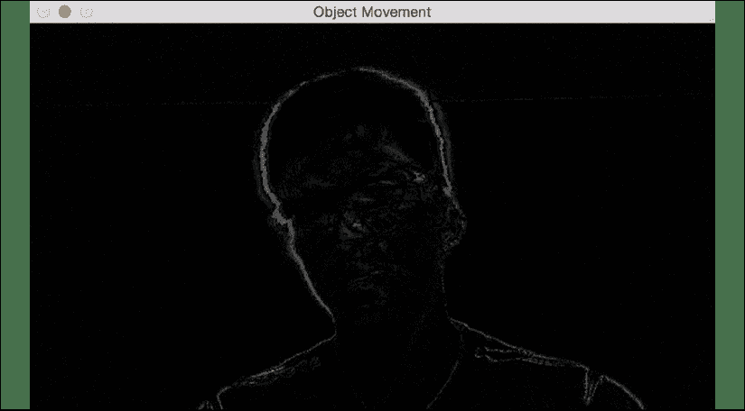
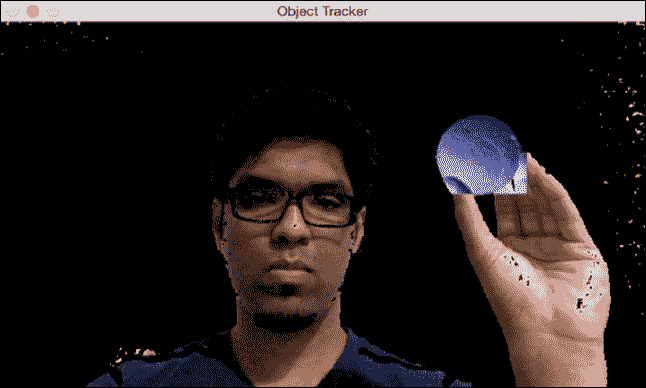
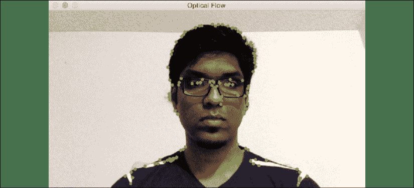
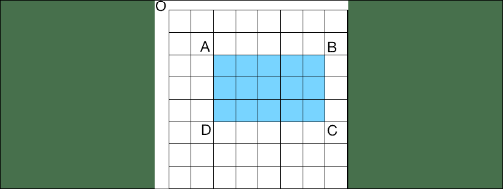

# 18 图像识别

在本章中，我们将学习有关对象检测和跟踪的知识。 首先，我们将花费一些时间来理解为什么图像识别对于机器学习非常重要。 然后，我们将学习称为 OpenCV 的图像识别程序包，该程序包是计算机视觉的流行库。 我们还将学习如何安装 OpenCV 并讨论帧差异，以了解如何检测视频中的运动部分。 我们将学习如何使用色彩空间跟踪对象，以及如何使用背景减法来跟踪对象。 之后，我们将使用 CAMShift 算法构建交互式对象跟踪器，并学习如何构建基于光流的跟踪器。 我们将讨论面部检测和相关概念，例如 Haar 级联和积分图像。 然后，我们将使用此技术来构建眼睛检测器和跟踪器。

在本章结束时，您将了解：

*   安装 OpenCV
*   帧差异
*   使用色彩空间跟踪对象
*   使用背景减法跟踪对象
*   使用 CAMShift 算法构建交互式对象跟踪器
*   基于光流的跟踪
*   人脸检测和追踪
*   使用 Haar 级联进行对象检测
*   使用积分图像进行特征提取
*   眼睛检测和跟踪

我们将从介绍 OpenCV 开始，然后逐步介绍如何安装它。

# 图像识别的重要性

作为，希望从本书的主题中变得清晰起来，一般的人工智能，尤其是机器学习，是推动当今社会发生数字化转型的一些技术。 能够“看到”是人类学习过程的关键组成部分。 类似地，即使他们使用不同的方法“查看”，捕获图像并识别这些图像中包含的内容对于计算机来说也是最重要的，以便创建数据集以馈入机器学习管道并从该数据中获取洞察力。

无人驾驶技术就是一个明显的例子。 在这种情况下，计算机就像人类的同类计算机一样，需要能够在任何给定的每秒内提取千兆字节的数据，分析这些数据，并实时做出改变人生的决定。 当这项技术被广泛使用的那天，我感到非常兴奋。 我的估计是，这将尽早发生。 根据世界卫生组织的数据，2013 年道路交通事故死亡人数为 125 万人。部署自动驾驶汽车时，可以避免其中的很大比例。

无人驾驶技术只是图像识别的一种应用，其应用几乎是无限的，仅受我们的想象力限制。 其他一些流行的用途是：

**自动图像分类**：我们可以在 Google 相册中以及在将图像上传到 Facebook 以及查看 Facebook 如何向我们提供有关图像中人物的建议时看到的第一手示例。

**反向图像搜索**：Google 除其他功能外，还提供功能，您可以将图像用作输入，而不是使用关键字作为输入并获取图像，而 Google 可以猜测图片内容。 [您可以在这里尝试](httpsimg.google.com/)。

**光学字符识别**：将图像转换为文本非常依赖于图像识别。

**MRI 和超声解释**：在识别癌症和其他疾病方面，某些工具的性能优于人类。

考虑了图像识别的一些实际应用后，让我们进入将要使用的程序包以亲自了解它。

# OpenCV

在本章中，我们将使用名为 OpenCV 的软件包。 其名称暗示了 **OpenCV**（**开源计算机视觉**）是一个开源跨平台 Python 软件包，可用于启用实时计算机视觉。 该工具起源于英特尔实验室。

OpenCV 可以与 TensorFlow，PyTorch 和 Caffe 结合使用。

**安装**

在本章中，我们将使用名为 OpenCV 的软件包。 [您可以在此处了解更多信息](http://opencv.org)。 在继续操作之前，请确保已安装。 以下是在各种操作系统上使用 Python3 安装 OpenCV 3 的链接：

*   [**Windows**](https://solarianprogrammer.com/2016/09/17/install-opencv-3-with-python-3-on-windows)
*   [**Ubuntu**](http://www.pyimagesearch.com/2015/07/20/install-opencv-3-0-and-python-3-4-on-ubuntu)
*   [**Mac**](http://www.pyimagesearch.com/2015/06/29/install-opencv-3-0-and-python-3-4-on-osx)

现在您已经安装了它，让我们转到下一部分，我们将讨论帧差异分段。

# 帧差分

帧差分是可用于识别视频中运动部分的最简单技术之一。 直观地，在大多数应用中，这是有趣的部分所在。 如果我们有一个跑步者的视频，我们可能想分析跑步者的跑步情况，而不是背景图像。 当我们看电影时，我们主要关注最前沿的人物在说话和做事时。 我们不会倾向于关注背景中无聊的相框。

有时候，您会发现一个一次性的极客，会在隐藏在这种背景下的电影中发现问题，正如我们在《权力的游戏》的最新情节中几次看到，有人在背景中发现一杯星巴克，但这是例外而不是规则。

当我们观看实时视频流时，从该流捕获的连续帧之间的差异为我们提供了很多信息。 让我们看看如何获​​取连续帧之间的差异并显示差异。 本节中的代码需要连接的摄像头，因此请确保您的计算机上装有摄像头。

创建一个新的 Python 文件并导入以下软件包：

```py
import cv2 
```

定义一个函数来计算帧差。 首先计算当前帧和下一帧之间的差异：

```py
# Compute the frame differences
def frame_diff(prev_frame, cur_frame, next_frame):
    # Difference between the current frame and the next frame
    diff_frames_1 = cv2.absdiff(next_frame, cur_frame) 
```

计算当前帧和上一帧之间的差异：

```py
 # Difference between the current frame and the previous frame 
    diff_frames_2 = cv2.absdiff(cur_frame, prev_frame) 
```

计算两个差异帧之间的按位与并返回：

```py
 return cv2.bitwise_and(diff_frames_1, diff_frames_2) 
```

定义一个功能以从网络摄像头抓取当前帧。 首先从视频捕获对象中读取它：

```py
# Define a function to get the current frame from the webcam 
def get_frame(cap, scaling_factor):
    # Read the current frame from the video capture object
    _, frame = cap.read() 
```

根据缩放比例调整框架大小并返回：

```py
 # Resize the image
    frame = cv2.resize(frame, None, fx=scaling_factor, 
            fy=scaling_factor, interpolation=cv2.INTER_AREA) 
```

将图像转换为灰度并返回：

```py
 # Convert to grayscale
    gray = cv2.cvtColor(frame, cv2.COLOR_RGB2GRAY) 
    return gray 
```

定义`main`函数并初始化视频捕获对象：

```py
if __name__=='__main__':
    # Define the video capture object 
    cap = cv2.VideoCapture(0) 
```

定义比例因子以调整图像大小：

```py
 # Define the scaling factor for the images 
    scaling_factor = 0.5 
```

抓取当前的帧，下一帧以及之后的帧：

```py
 # Grab the current frame
    prev_frame = get_frame(cap, scaling_factor)
    # Grab the next frame
    cur_frame = get_frame(cap, scaling_factor)
    # Grab the frame after that
    next_frame = get_frame(cap, scaling_factor) 
```

无限期迭代，直到用户按下`Esc`键。 首先计算帧差异：

```py
 # Keep reading the frames from the webcam 
    # until the user hits the 'Esc' key
    while True:
        # Display the frame difference
        cv2.imshow('Object Movement', frame_diff(prev_frame, 
                cur_frame, next_frame)) 
```

更新`frame`变量：

```py
 # Update the variables
        prev_frame = cur_frame
        cur_frame = next_frame 
```

从网络摄像头抓取下一帧：

```py
 # Grab the next frame
        next_frame = get_frame(cap, scaling_factor) 
```

检查用户是否按下了`Esc`键。 如果是这样，请退出循环：

```py
 # Check if the user hit the 'Esc' key 
        key = cv2.waitKey(10)
        if key == 27:
            break 
```

退出循环后，请确保所有窗口均已正确关闭：

```py
 # Close all the windows
    cv2.destroyAllWindows() 
```

完整代码在提供给您的文件`frame_diff.py`中给出。 如果运行代码，您将看到一个显示实时输出的输出窗口。 如果四处走动，您会在这里看到自己的轮廓在这里展示：



图 1：轮廓图像

前面的屏幕截图中的白线表示轮廓。 我们取得了什么成就？ 为什么这很重要？ 根据应用的不同，我们可能不需要原始图像提供的所有信息。 原始图像具有更多细节，更多对比度和更多颜色。 让我们以自动驾驶汽车为例。 我们可能不在乎我们前面的车是红色还是绿色。 我们更担心要知道汽车是否正在驶向我们并即将撞向我们。 通过过滤所有额外的不相关信息，它允许系统中的其他算法更有效地处理图像中的相关信息，因此可以更快地对任何潜在的危险做出反应。

这种过滤可能有用的另一个实例是，加载视频的空间有限或成本高昂，我们需要压缩图像并提高空间利用率。 我们将由读者提出其他可能有用的方案，但希望我们能给您足够的灵感，激发您的想象力和创造力。

通过帧差分获得的信息很有用，但是我们将无法使用它构建健壮的跟踪器。 它对噪声敏感，并且不能真正完全跟踪物体。 要构建健壮的对象跟踪器，我们需要知道可以使用对象的哪些特征来精确跟踪它。 这是色彩空间变得重要的地方，我们将在扩展部分中讨论。

# 使用颜色空间跟踪对象

可以使用各种色彩空间来表示图像。 RGB 颜色空间可能是最流行的颜色空间，但不适用于对象跟踪之类的应用。 因此，我们将改用 HSV 颜色空间。 这是一种直观的色彩空间模型，更接近于人类对色彩的感知方式。 [您可以在此处了解更多信息](https://en.wikipedia.org/wiki/HSL_and_HSV)。

我们可以将捕获的帧从 RGB 转换为 HSV 颜色空间，然后使用颜色阈值跟踪任何给定的对象。 我们应该注意，我们需要知道对象的颜色分布，以便为阈值选择合适的范围。

创建一个新的 Python 文件并导入以下软件包：

```py
import cv2
import numpy as np 
```

定义一个功能以从网络摄像头抓取当前帧。 首先从视频捕获对象中读取它：

```py
# Define a function to get the current frame from the webcam
def get_frame(cap, scaling_factor):
    # Read the current frame from the video capture object
    _, frame = cap.read() 
```

根据缩放比例调整框架大小并返回：

```py
 # Resize the image
    frame = cv2.resize(frame, None, fx=scaling_factor, 
            fy=scaling_factor, interpolation=cv2.INTER_AREA)
    return frame 
```

定义`main`函数。 首先初始化视频捕获对象：

```py
if __name__=='__main__':
    # Define the video capture object
    cap = cv2.VideoCapture(0) 
```

定义用于调整捕获帧大小的比例因子：

```py
 # Define the scaling factor for the images
    scaling_factor = 0.5 
```

无限期地进行迭代，直到用户按下`Esc`键。 抓取当前帧开始：

```py
 # Keep reading the frames from the webcam 
    # until the user hits the 'Esc' key
    while True:
        # Grab the current frame
        frame = get_frame(cap, scaling_factor) 
```

使用 OpenCV 中可用的内置函数将图像转换为 HSV 颜色空间：

```py
 # Convert the image to HSV colorspace
        hsv = cv2.cvtColor(frame, cv2.COLOR_BGR2HSV) 
```

为人类皮肤的颜色定义近似 HSV 颜色范围：

```py
 # Define range of skin color in HSV
        lower = np.array([0, 70, 60])
        upper = np.array([50, 150, 255]) 
```

阈值 HSV 图像以创建掩码：

```py
 # Threshold the HSV image to get only skin color
        mask = cv2.inRange(hsv, lower, upper) 
```

计算遮罩和原始图像之间的按位与：

```py
 # Bitwise-AND between the mask and original image 
        img_bitwise_and = cv2.bitwise_and(frame, frame, mask=mask) 
```

运行中值模糊以使图像平滑：

```py
 # Run median blurring
        img_median_blurred = cv2.medianBlur(img_bitwise_and, 5) 
```

显示输入和输出帧：

```py
 # Display the input and output
        cv2.imshow('Input', frame)
        cv2.imshow('Output', img_median_blurred) 
```

检查用户是否按下了`Esc`键。 如果是这样，则退出循环：

```py
 # Check if the user hit the 'Esc' key
        c = cv2.waitKey(5)
        if c == 27:
            break 
```

退出循环后，请确保所有窗口均已正确关闭：

```py
 # Close all the windows
    cv2.destroyAllWindows() 
```

提供给您的文件`colorspaces.py`中提供了完整的代码。 如果运行代码，您将获得两个屏幕截图。 标题为**输入**的窗口是捕获的帧：


图 2：捕获的帧

标题为**输出**的第二个窗口显示皮肤遮罩：


图 3：输出框架

如您在中看到的输出帧，我们现在只在图像中看到一种颜色，它对应于任何皮肤。 其他一切都是黑色的。 与上一节中看到的类似，我们对图像进行了过滤，以仅包含我们感兴趣的信息。在这种情况下，过滤是不同的，但结果是事实是我们现在仅具有进一步处理图像所需的信息。 我想到了一些应用：

*   检测异常皮肤状况或变色。
*   仅在看到人的肤色时才会打开的安全系统。 这可用于人类可能藏在容器中的港口。

您还能想到其他一些应用吗？ 在下一节中，我们将学习另一种称为背景减法的图像转换技术。

# 使用背景减法的对象跟踪

背景减法是一种技术，它对给定视频中的背景进行建模，然后使用该模型来检测运动对象。 该技术在视频压缩和视频监视中大量使用。 在必须检测静态场景中的移动物体的情况下，它的性能很好。 该算法的基本原理是检测背景，为其建立模型，然后从当前帧中减去背景以获得前景。 该前景对应于移动的对象。

这里的主要步骤之一是建立背景的模型。 它与帧差分不同，因为我们不差分连续帧。 我们正在对背景进行建模并实时更新，这使其成为一种自适应算法，可以适应不断变化的基线。 因此，它的性能要比帧差分好得多。

创建一个新的 Python 文件并导入以下软件包：

```py
import cv2
import numpy as np 
```

定义一个函数以获取当前帧：

```py
# Define a function to get the current frame from the webcam
def get_frame(cap, scaling_factor):
    # Read the current frame from the video capture object
    _, frame = cap.read() 
```

调整框架大小并返回：

```py
 # Resize the image
    frame = cv2.resize(frame, None, fx=scaling_factor, 
            fy=scaling_factor, interpolation=cv2.INTER_AREA)
    return frame 
```

定义`main`函数并初始化视频捕获对象：

```py
if __name__=='__main__':
    # Define the video capture object
    cap = cv2.VideoCapture(0) 
```

定义背景减法器对象：

```py
 # Define the background subtractor object
    bg_subtractor = cv2.createBackgroundSubtractorMOG2() 
```

定义历史记录和学习率。 关于`history`的全部内容，以下注释不言自明：

```py
 # Define the number of previous frames to use to learn.
    # This factor controls the learning rate of the algorithm.
    # The learning rate refers to the rate at which your model 
    # will learn about the background. Higher value for
    # 'history' indicates a slower learning rate. You can
    # play with this parameter to see how it affects the output.
    history = 100
    # Define the learning rate
    learning_rate = 1.0/history 
```

无限期迭代，直到用户按下`Esc`键。 首先抓取当前帧：

```py
 # Keep reading the frames from the webcam
    # until the user hits the 'Esc' key
    while True:
        # Grab the current frame 
        frame = get_frame(cap, 0.5) 
```

使用先前定义的背景减法器对象计算`mask`：

```py
 # Compute the mask
        mask = bg_subtractor.apply(frame, learningRate=learning_rate) 
```

将`mask`从灰度转换为 RGB：

```py
 # Convert grayscale image to RGB color image
        mask = cv2.cvtColor(mask, cv2.COLOR_GRAY2BGR) 
```

显示输入和输出图像：

```py
 # Display the images
        cv2.imshow('Input', frame)
        cv2.imshow('Output', mask & frame) 
```

检查用户是否按下了`Esc`键。 如果是这样，请退出循环：

```py
 # Check if the user hit the 'Esc' key
        c = cv2.waitKey(10)
        if c == 27:
            break 
```

退出循环后，请确保释放视频捕获对象并正确关闭所有窗口：

```py
 # Release the video capture object 
    cap.release()
    # Close all the windows 
    cv2.destroyAllWindows() 
```

完整代码在提供给您的文件`background_subtraction.py`中给出。 如果运行代码，您将看到一个显示实时输出的窗口。 如果四处走动，您将部分看到自己，如下所示：


图 4：背景减影

一旦停止移动，它就会开始褪色，因为您现在是背景的一部分。 该算法会将您视为背景的一部分，并开始相应地更新模型：


图 5：背景减影

当您保持静止时，它将继续消失，如下所示：


图 6：背景减影

淡入淡出的过程表示当前场景是，而背景模型是。

您已经可以想象到，仅在移动时才生成图像将节省大量存储空间。 一个简单的例子是使用安全摄像机。 看着一个小时或几个小时的镜头对准空旷的停车场，可能比看着油漆枯燥更无聊，但是如果安全系统足够智能，可以在车架发生运动时进行记录，我们将能够辨别出“有趣的东西”。 视频中的“”部分。

基于颜色空间的跟踪允许我们跟踪有色对象，但是我们必须首先定义颜色。 这似乎是限制性的！ 让我们看看如何在实时视频中选择一个对象，然后使用一个可以跟踪它的跟踪器。 这是，在其中 **CAMShift** 算法（代表**连续自适应均值漂移**）变得很重要。 这基本上是 MeanShift 算法的自适应版本。 我们将在下一节讨论 CAMShift。

# 使用 CAMShift 算法构建交互式对象跟踪器

为了理解 CAMShift，首先让我们了解均值漂移的工作原理。 考虑给定帧中的感兴趣区域。 我们选择该区域是因为它包含感兴趣的对象。 我们要跟踪该对象，因此在其周围绘制了一个粗糙的边界，这就是感兴趣的*区域*所指的区域。 我们希望我们的对象跟踪器在视频中四处移动时跟踪该对象。

为此，我们基于该区域的颜色直方图选择一组点，然后计算质心。 如果此质心的位置在该区域的几何中心，则我们知道该对象没有移动。 但是，如果质心的位置不在此区域的几何中心，则我们知道对象已移动。 这意味着我们还需要移动封闭边界。 质心的运动直接指示物体的运动方向。 我们需要移动边界框，以使新质心成为此边界框的几何中心。 我们对每一帧都保持这种状态，并实时跟踪对象。 因此，此算法称为均值平移，因为均值（即质心）一直在移动，我们使用此跟踪对象。

让我们看看这与 CAMShift 有何关系。 均值平移的问题之一是不允许对象的大小随时间变化。 绘制边界框后，无论物体离相机有多近，它都将保持不变。 因此，我们需要使用 CAMShift，因为它可以使边界框的大小适应于对象的大小。 如果您想进一步探索，[可以查看以下链接](http://docs.opencv.org/3.1.0/db/df8/tutorial_py_meanshift.html)。

让我们看看如何构建跟踪器。

创建一个新的 Python 文件并导入以下软件包：

```py
import cv2
import numpy as np 
```

定义一个类来处理与对象跟踪有关的所有功能：

```py
# Define a class to handle object tracking related functionality 
class ObjectTracker(object):
    def __init__(self, scaling_factor=0.5):
        # Initialize the video capture object
        self.cap = cv2.VideoCapture(0) 
```

捕获当前帧：

```py
 # Capture the frame from the webcam
        _, self.frame = self.cap.read() 
```

设置比例因子：

```py
 # Scaling factor for the captured frame 
        self.scaling_factor = scaling_factor 
```

调整框架大小：

```py
 # Resize the frame
        self.frame = cv2.resize(self.frame, None, 
                fx=self.scaling_factor, fy=self.scaling_factor, 
                interpolation=cv2.INTER_AREA) 
```

创建一个窗口以显示输出：

```py
 # Create a window to display the frame
        cv2.namedWindow('Object Tracker') 
```

设置鼠标回调函数以从鼠标获取输入：

```py
 # Set the mouse callback function to track the mouse 
        cv2.setMouseCallback('Object Tracker', self.mouse_event) 
```

初始化变量以跟踪矩形选择：

```py
 # Initialize variable related to rectangular region selection
        self.selection = None
        # Initialize variable related to starting position
        self.drag_start = None
        # Initialize variable related to the state of tracking
        self.tracking_state = 0 
```

定义一个函数来跟踪鼠标事件：

```py
 # Define a method to track the mouse events
    def mouse_event(self, event, x, y, flags, param):
        # Convert x and y coordinates into 16-bit numpy integers
        x, y = np.int16([x, y]) 
```

当鼠标左键按下时，表明用户已经开始绘制矩形：

```py
 # Check if a mouse button down event has occurred 
        if event == cv2.EVENT_LBUTTONDOWN:
            self.drag_start = (x, y)
            self.tracking_state = 0 
```

如果用户当前正在拖动鼠标以设置矩形选区的大小，请跟踪宽度和高度：

```py
 # Check if the user has started selecting the region
        if self.drag_start:
            if flags & cv2.EVENT_FLAG_LBUTTON:
                # Extract the dimensions of the frame
                h, w = self.frame.shape[:2] 
```

设置矩形的`X`和`Y`坐标的：

```py
 # Get the initial position
                xi, yi = self.drag_start 
```

获取坐标的最大值和最小值，以使其与拖动鼠标以绘制矩形的方向无关：

```py
 # Get the max and min values
                x0, y0 = np.maximum(0, np.minimum([xi, yi], [x, y]))
                x1, y1 = np.minimum([w, h], np.maximum([xi, yi], [x, y])) 
```

重置选择变量：

```py
 # Reset the selection variable
                self.selection = None 
```

完成矩形选择：

```py
 # Finalize the rectangular selection
                if x1-x0 > 0 and y1-y0 > 0:
                    self.selection = (x0, y0, x1, y1) 
```

如果选择完成，则设置标志，指​​示我们应该开始跟踪矩形区域内的对象：

```py
 else:
                # If the selection is done, start tracking
                self.drag_start = None
                if self.selection is not None:
                    self.tracking_state = 1 
```

定义跟踪对象的方法：

```py
 # Method to start tracking the object
    def start_tracking(self):
        # Iterate until the user presses the Esc key
        while True:
            # Capture the frame from webcam
            _, self.frame = self.cap.read() 
```

调整框架大小：

```py
 # Resize the input frame
            self.frame = cv2.resize(self.frame, None, 
                    fx=self.scaling_factor, fy=self.scaling_factor, 
                    interpolation=cv2.INTER_AREA) 
```

创建框架的副本。 我们稍后将需要它：

```py
 # Create a copy of the frame
            vis = self.frame.copy() 
```

将帧的颜色空间从 RGB 转换为 HSV：

```py
 # Convert the frame to HSV colorspace
            hsv = cv2.cvtColor(self.frame, cv2.COLOR_BGR2HSV) 
```

根据预定义的阈值创建掩码：

```py
 # Create the mask based on predefined thresholds 
            mask = cv2.inRange(hsv, np.array((0., 60., 32.)), 
            np.array((180., 255., 255.))) 
```

检查用户是否选择了区域：

```py
 # Check if the user has selected the region 
            if self.selection:
                # Extract the coordinates of the selected rectangle 
                x0, y0, x1, y1 = self.selection
                # Extract the tracking window 
                self.track_window = (x0, y0, x1-x0, y1-y0) 
```

从 HSV 图像以及遮罩中提取感兴趣的区域。 根据以下这些计算感兴趣区域的直方图：

```py
 # Extract the regions of interest
                hsv_roi = hsv[y0:y1, x0:x1]
                mask_roi = mask[y0:y1, x0:x1]
                # Compute the histogram of the region of
                # interest in the HSV image using the mask
                hist = cv2.calcHist( [hsv_roi], [0], mask_roi, 
                        [16], [0, 180] ) 
```

标准化直方图：

```py
 # Normalize and reshape the histogram 
                cv2.normalize(hist, hist, 0, 255, cv2.NORM_MINMAX)
                self.hist = hist.reshape(-1) 
```

从原始帧中提取感兴趣的区域：

```py
 # Extract the region of interest from the frame
                vis_roi = vis[y0:y1, x0:x1] 
```

计算感兴趣区域的按位非。 这仅用于显示目的：

```py
 # Compute the image negative (for display only)
                cv2.bitwise_not(vis_roi, vis_roi)
                vis[mask == 0] = 0 
```

检查系统是否处于跟踪模式：

```py
 # Check if the system in the "tracking" mode
            if self.tracking_state == 1:
                # Reset the selection variable
                self.selection = None 
```

计算直方图的反向投影：

```py
 # Compute the histogram back projection
                hsv_backproj = cv2.calcBackProject([hsv], [0], 
                        self.hist, [0, 180], 1) 
```

计算直方图和掩码之间的按位与：

```py
 # Compute bitwise AND between histogram
                # backprojection and the mask
                hsv_backproj &= mask 
```

定义跟踪器的终止条件：

```py
 # Define termination criteria for the tracker
                term_crit = (cv2.TERM_CRITERIA_EPS | cv2.TERM_CRITERIA_COUNT, 10, 1) 
```

将 CAMShift 算法应用于反投影直方图：

```py
 # Apply CAMShift on 'hsv_backproj'
                track_box, self.track_window = cv2.CamShift(hsv_backproj, self.track_window, term_crit) 
```

在对象周围绘制一个椭圆并显示它：

```py
 # Draw an ellipse around the object
                cv2.ellipse(vis, track_box, (0, 255, 0), 2)
            # Show the output live video
            cv2.imshow('Object Tracker', vis) 
```

如果用户按下`Esc`，则退出循环：

```py
 # Stop if the user hits the 'Esc' key
            c = cv2.waitKey(5)
            if c == 27:
                break 
```

退出循环后，请确保正确关闭所有窗口：

```py
 # Close all the windows
        cv2.destroyAllWindows() 
```

定义`main`函数并开始跟踪：

```py
if __name__ == '__main__':
    # Start the tracker
    ObjectTracker().start_tracking() 
```

完整代码在提供给您的文件`camshift.py`中给出。 如果运行代码，您将看到一个窗口，显示来自网络摄像头的实时视频。

拿一个对象，将其握在手中，然后在其周围绘制一个矩形。 绘制矩形后，请确保将鼠标指针从最终位置移开。 该图像将如下所示：



图 7：物体检测图像

完成选择后，将鼠标指针移动到另一个位置以锁定矩形。 该事件将开始跟踪过程，如下图所示：


图 8：物体检测图像 2

让我们将对象移动到并查看是否仍在跟踪中


图 9：物体检测图 3

看起来运作良好。 您可以移动物体，以查看如何实时对其进行跟踪。

希望到现在为止，您已经看到了图像识别的许多应用的可能性，并且可能已经提出了关于如何应用到目前为止所学知识的自己的想法。 他们使用的技术可能比我们在本章中使用的技术要复杂一些，但是概念并没有什么不同。 NFL 实际上使用这些技术在电视上设置 10 码标记，而美国职业棒球大联盟使用与我们在本节中学到的技术类似的技术来绘制打击区。 与我们在这里看到的最接近的示例是温网锦标赛用来确定网球着陆的位置并确定其进出的例子。 在下一节中，我们将学习基于光流的跟踪。 这是用于图像识别的有用技术。

# 基于光流的跟踪

2020 年 1 月，宣布由马丁·斯科塞斯（Martin Scorsese）执导的电影《爱尔兰人》被提名奥斯卡奖。 这部电影详细介绍了卡车司机，徒和队友弗兰克·希兰（Frank Sheeran）的生活（由罗伯特·德尼罗（Robert DeNiro）饰演）。 在电影中，我们看到希兰生活中的不同时期。 从他 20 多岁到 80 多岁。 整个过程中，我们在屏幕上看到 DeNiro 的时候很明显是他，你真的可以看出他是 20 岁还是 80 岁。

在以前的电影中，这可能是通过化妆实现的。 对于这部电影，没有为此目的使用化妆。 相反，他们使用特殊效果，并使用*数字*化妆修饰了 DeNiro 的脸。 太好了吧？

多年来，用计算机制作逼真的面孔非常困难，但好莱坞及其特效艺术家终于破解了密码。 显然，他们正在使用比本章将介绍的技术更复杂的技术，但是光流技术是开始实现此功能的基础技术。 您必须能够在视频移动的任何时刻跟踪该人的脸，然后才能在视频中更改该人的脸。 这是光流可以解决的问题之一。

光流是计算机视觉中使用的一种流行技术。 它使用图像特征点来跟踪对象。 在实时视频的连续帧中跟踪各个特征点。 当我们在给定帧中检测到一组特征点时，我们将计算位移向量以对其进行跟踪。 我们显示了连续帧之间这些特征点的运动。 这些向量被称为运动向量。 有许多方法可以执行光流，但是 **Lucas-Kanade** 方法可能是最受欢迎的方法。 [这是描述此技术的原始论文](http://cseweb.ucsd.edu/classes/sp02/cse252/lucaskanade81.pdf)。

第一步是从当前帧中提取特征点。 对于提取的每个特征点，将以特征点为中心创建一个`3×3`的像素块。 我们假设每个面片中的所有点都具有相似的运动。 该窗口的大小可以根据情况进行调整。

对于每个补丁，我们在前一帧中在其附近寻找匹配项。 我们根据错误指标选择最佳匹配。 搜索区域大于`3×3`，因为我们寻找一堆不同的`3×3`色块以获得与当前色块最接近的那个。 一旦获得该信息，从当前补丁的中心点到前一帧中匹配的补丁的路径将成为运动向量。 类似地，我们为所有其他补丁计算运动向量。

创建一个新的 Python 文件并导入以下软件包：

```py
import cv2
import numpy as np 
```

定义一个函数以使用光流开始跟踪。 首先初始化视频捕获对象和缩放因子：

```py
# Define a function to track the object 
def start_tracking():
    # Initialize the video capture object
    cap = cv2.VideoCapture(0)
    # Define the scaling factor for the frames
    scaling_factor = 0.5 
```

定义要跟踪的帧数和要跳过的帧数：

```py
 # Number of frames to track
    num_frames_to_track = 5
    # Skipping factor
    num_frames_jump = 2 
```

初始化与跟踪路径和帧索引相关的变量：

```py
 # Initialize variables
    tracking_paths = []
    frame_index = 0 
```

定义跟踪参数，例如窗口大小，最大级别和终止条件：

```py
 # Define tracking parameters
    tracking_params = dict(winSize = (11, 11), maxLevel = 2, 
            criteria = (cv2.TERM_CRITERIA_EPS | cv2.TERM_CRITERIA_COUNT, 
                10, 0.03)) 
```

无限期迭代，直到用户按下`Esc`键。 首先捕获当前帧并调整其大小：

```py
 # Iterate until the user hits the 'Esc' key
    while True:
        # Capture the current frame
        _, frame = cap.read()
        # Resize the frame
        frame = cv2.resize(frame, None, fx=scaling_factor, 
                fy=scaling_factor, interpolation=cv2.INTER_AREA) 
```

将帧从 RGB 转换为灰度：

```py
 # Convert to grayscale
        frame_gray = cv2.cvtColor(frame, cv2.COLOR_BGR2GRAY) 
```

创建框架的副本：

```py
 # Create a copy of the frame
        output_img = frame.copy() 
```

检查跟踪路径的长度是否大于零：

```py
 if len(tracking_paths) > 0:
            # Get images
            prev_img, current_img = prev_gray, frame_gray 
```

组织特征点：

```py
 # Organize the feature points
            feature_points_0 = np.float32([tp[-1] for tp in \
                    tracking_paths]).reshape(-1, 1, 2) 
```

使用特征点和跟踪参数，根据先前图像和当前图像计算光流：

```py
 # Compute optical flow
            feature_points_1, _, _ = cv2.calcOpticalFlowPyrLK(
                    prev_img, current_img, feature_points_0, 
                    None, **tracking_params)
            # Compute reverse optical flow
            feature_points_0_rev, _, _ = cv2.calcOpticalFlowPyrLK(
                    current_img, prev_img, feature_points_1, 
                    None, **tracking_params)
            # Compute the difference between forward and 
            # reverse optical flow
            diff_feature_points = abs(feature_points_0 – \
                    feature_points_0_rev).reshape(-1, 2).max(-1) 
```

提取好的特征点：

```py
 # Extract the good points
            good_points = diff_feature_points < 1 
```

初始化新跟踪路径的变量：

```py
 # Initialize variable
            new_tracking_paths = [] 
```

遍历所有好的特征点并在它们周围绘制圆圈：

```py
 # Iterate through all the good feature points
            for tp, (x, y), good_points_flag in zip(tracking_paths, 
                        feature_points_1.reshape(-1, 2), good_points):
                # If the flag is not true, then continue
                if not good_points_flag:
                    continue 
```

附加`X`和`Y`坐标，并且不要超过我们应该跟踪的帧数：

```py
 # Append the X and Y coordinates and check if
                # its length greater than the threshold
                tp.append((x, y))
                if len(tp) > num_frames_to_track:
                    del tp[0]
                new_tracking_paths.append(tp) 
```

围绕该点画一个圆。 更新跟踪路径并使用新的跟踪路径绘制线条以显示运动：

```py
 # Draw a circle around the feature points 
                cv2.circle(output_img, (x, y), 3, (0, 255, 0), -1)
            # Update the tracking paths 
            tracking_paths = new_tracking_paths
            # Draw lines
            cv2.polylines(output_img, [np.int32(tp) for tp in \
                    tracking_paths], False, (0, 150, 0)) 
```

跳过之前指定的帧数后，进入`if`条件：

```py
 # Go into this 'if' condition after skipping the 
        # right number of frames
        if not frame_index % num_frames_jump:
            # Create a mask and draw the circles
            mask = np.zeros_like(frame_gray)
            mask[:] = 255
            for x, y in [np.int32(tp[-1]) for tp in tracking_paths]:
                cv2.circle(mask, (x, y), 6, 0, -1) 
```

使用内置函数以及遮罩，最大拐角，质量级别，最小距离和块大小等参数，计算要跟踪的良好功能：

```py
 # Compute good features to track
            feature_points = cv2.goodFeaturesToTrack(frame_gray, 
                    mask = mask, maxCorners = 500, qualityLevel = 0.3, 
                    minDistance = 7, blockSize = 7) 
```

如果特征点存在，请将其附加到跟踪路径：

```py
 # Check if feature points exist. If so, append them
            # to the tracking paths
            if feature_points is not None:
                for x, y in np.float32(feature_points).reshape(-1, 2):
                    tracking_paths.append([(x, y)]) 
```

更新与帧索引和以前的灰度图像有关的变量：

```py
 # Update variables
        frame_index += 1
        prev_gray = frame_gray 
```

显示输出：

```py
 # Display output
        cv2.imshow('Optical Flow', output_img) 
```

检查用户是否按下了`Esc`键。 如果是这样，请退出循环：

```py
 # Check if the user hit the 'Esc' key
        c = cv2.waitKey(1)
        if c == 27:
            break 
```

定义`main`函数并开始跟踪。 停止跟踪器后，请确保所有窗口均已正确关闭：

```py
if __name__ == '__main__':
    # Start the tracker
    start_tracking()
    # Close all the windows
    cv2.destroyAllWindows() 
```

完整代码在提供给您的文件`optical_flow.py`中给出。 如果运行代码，您将看到一个显示实时视频的窗口。 您将看到特征点，如以下屏幕截图所示：



图 10：对象跟踪图像

如果四处走动，将看到显示这些特征点移动的线：


图 11：对象跟踪图像

如果您随后沿相反方向移动，则线也会相应地更改其方向：


图 12：对象跟踪图像

看到了的输出后，我们继续下一部分：“人脸检测和跟踪”。

# 人脸检测和追踪

面部检测是指在给定图像中检测面部的位置。 这通常与面部识别相混淆，面部识别是识别人物身份的过程。 典型的生物特征识别系统利用面部检测和面部识别两者来执行任务。 它使用人脸检测来定位人脸，然后使用人脸识别来识别人。 在本节中，我们将看到如何自动来自动检测实时视频中人脸的位置并对其进行跟踪。

## 使用 Haar 级联进行对象检测

我们将使用 Haar 级联来检测示例视频中的人脸。 在这种情况下，Haar 级联是指基于 Haar 特征的级联分类器。 *Paul Viola* 和 *Michael Jones* 于 2001 年在他们的标志性研究论文中首次提出了这种对象检测方法。[您可以在这里查看](https://www.cs.cmu.edu/~efros/courses/LBMV07/Papers/viola-cvpr-01.pdf)。

他们在论文中描述了一种有效的机器学习技术，可用于检测任何物体。

他们使用简单分类器的增强级联。 该级联用于构建以高精度执行的整体分类器。 之所以相关，是因为它帮助我们规避了构建具有较高准确性的单步分类器的过程。 建立这样一个健壮的单步分类器是一个计算量大的过程。

考虑一个示例，在该示例中我们必须检测一个物体，例如网球。 为了构建检测器，我们需要一个可以了解网球外观的系统。 它应该能够推断出给定的图像是否包含网球。 我们需要使用很多网球图像来训练该系统。 我们还需要很多不包含网球的图像。 这有助于系统学习如何区分对象。

如果我们建立一个准确的模型，它将是复杂的。 因此，我们将无法实时运行它。 如果太简单，则可能不准确。 在机器学习领域中，经常会在速度和准确性之间进行权衡。 Viola-Jones 方法通过构建一组简单的分类器克服了这个问题。 然后将这些分类器级联到或健壮且准确的统一分类器中。

让我们看看如何使用它来执行面部检测。 为了构建用于检测人脸的机器学习系统，我们首先需要构建特征提取器。 机器学习算法将使用这些功能来了解人脸。 这就是 Haar 特征变得相关的地方。

它们只是图像上补丁的简单总结和差异。 Haar 特征易于计算。 为了使其具有强大的缩放能力，我们在多种图像尺寸下执行此操作。 如果您想以教程格式了解更多信息，[可以查看以下链接](http://www.cs.ubc.ca/~lowe/425/slides/13-ViolaJones.pdf)。

提取特征后，我们将其传递给简单分类器的增强级联。 我们检查图像中的各个矩形子区域，并继续丢弃不包含面部的区域。 我们很高兴迅速得出最终答案。 为了高效地计算这些特征，他们使用了称为积分图像的概念。

## 使用积分图像进行特征提取

为了计算 Haar 特征，我们必须计算图像中许多子区域的总和和差。 我们需要在多个尺度上计算这些求和和差异，这使其成为计算密集型过程。 为了构建实时系统，我们使用积分图像。 考虑下图：



图 13：ABCD 区域

如果要计算此图像中矩形`ABCD`的总和，则无需遍历该矩形区域中的每个像素。 假设`OC`表示由矩形的左上角`O`和矩形的对角相对角点`C`形成的矩形区域。 要计算矩形`ABCD`的面积，我们可以使用以下公式：

```
矩形 ABCD 的面积 = OC – (OB + OD – OA)
```

这个公式有何特别之处？ 如果您注意到了，我们不必进行任何迭代或重新计算任何矩形区域。 等式右侧的所有值均已可用，因为它们是在较早的循环中计算的。 我们直接使用它们来计算此矩形的面积。 我们有效地做的是考虑一个较大的矩形，其中`O`和`C`代表相对的对角线，然后我们“切出”白色部分以仅留下蓝色区域。 考虑到这一点，让我们看看如何构建一个面部检测器。

创建一个新的 Python 文件并导入以下软件包：

```py
import cv2
import numpy as np 
```

加载与面部检测相对应的 Haar 级联文件：

```py
# Load the Haar cascade file 
face_cascade = cv2.CascadeClassifier(
        'haar_cascade_files/haarcascade_frontalface_default.xml'
# Check if the cascade file has been loaded correctly 
if face_cascade.empty():
        raise IOError('Unable to load the face cascade classifier xml file') 
```

初始化视频捕获对象并定义缩放比例：

```py
# Initialize the video capture object
cap = cv2.VideoCapture(0)
# Define the scaling factor
scaling_factor = 0.5 
```

无限期地迭代，直到用户按下`Esc`键。 捕获当前帧：

```py
# Iterate until the user hits the 'Esc' key 
while True:
    # Capture the current frame
    _, frame = cap.read() 
```

调整框架大小：

```py
 # Resize the frame
    frame = cv2.resize(frame, None, 
            fx=scaling_factor, fy=scaling_factor, 
            interpolation=cv2.INTER_AREA) 
```

将图像转换为灰度：

```py
 # Convert to grayscale
    gray = cv2.cvtColor(frame, cv2.COLOR_BGR2GRAY) 
```

在灰度图像上运行面部检测器：

```py
 # Run the face detector on the grayscale image
    face_rects = face_cascade.detectMultiScale(gray, 1.3, 5) 
```

遍历检测到的面部并在其周围绘制矩形：

```py
 # Draw a rectangle around the face
    for (x,y,w,h) in face_rects:
        cv2.rectangle(frame, (x,y), (x+w,y+h), (0,255,0), 3) 
```

显示输出：

```py
 # Display the output 
    cv2.imshow('Face Detector', frame) 
```

检查用户是否按下了`Esc`键。 如果是这样，请退出循环：

```py
 # Check if the user hit the 'Esc' key
    c = cv2.waitKey(1)
    if c == 27:
        break 
```

退出循环后，请确保释放视频捕获对象并正确关闭所有窗口：

```py
# Release the video capture object
cap.release()
# Close all the windows
cv2.destroyAllWindows() 
```

完整代码为提供给您的文件`face_detector.py`中提供的。 如果运行代码，您将看到以下内容：


图 14：人脸检测图像

从面部检测，我们将在下一部分中转到类似的概念：“眼睛检测和跟踪”。

# 眼睛检测和跟踪

眼睛检测与面部检测相似。 我们将使用眼睛级联文件，而不是使用面部级联文件。 创建一个新的 Python 文件并导入以下软件包：

```py
import cv2
import numpy as np 
```

加载与面部和眼睛检测相对应的 Haar 级联文件：

```py
# Load the Haar cascade files for face and eye
face_cascade = cv2.CascadeClassifier('haar_cascade_files/haarcascade_frontalface_default.xml')
eye_cascade = cv2.CascadeClassifier('haar_cascade_files/haarcascade_eye.xml')
# Check if the face cascade file has been loaded correctly
if face_cascade.empty():
    raise IOError('Unable to load the face cascade classifier xml file')
# Check if the eye cascade file has been loaded correctly 
if eye_cascade.empty():
    raise IOError('Unable to load the eye cascade classifier xml file') 
```

初始化视频捕获对象并定义缩放比例：

```py
# Initialize the video capture object
cap = cv2.VideoCapture(0)
# Define the scaling factor
ds_factor = 0.5 
```

无限期重复，直到用户按下`Esc`键：

```py
# Iterate until the user hits the 'Esc' key
while True:
    # Capture the current frame
    _, frame = cap.read() 
```

调整框架大小：

```py
 # Resize the frame
    frame = cv2.resize(frame, None, fx=ds_factor, fy=ds_factor, interpolation=cv2.INTER_AREA) 
```

将帧从 RGB 转换为灰度：

```py
 # Convert to grayscale
    gray = cv2.cvtColor(frame, cv2.COLOR_BGR2GRAY) 
```

运行面部检测器：

```py
 # Run the face detector on the grayscale image
    faces = face_cascade.detectMultiScale(gray, 1.3, 5) 
```

对于检测到的每个脸部，在该区域内运行眼睛检测器：

```py
 # For each face that's detected, run the eye detector
    for (x,y,w,h) in faces:
        # Extract the grayscale face ROI
        roi_gray = gray[y:y+h, x:x+w] 
```

提取感兴趣的区域并运​​行眼睛检测器：

```py
 # Extract the color face ROI
        roi_color = frame[y:y+h, x:x+w]
        # Run the eye detector on the grayscale ROI
        eyes = eye_cascade.detectMultiScale(roi_gray) 
```

在眼睛周围绘制圆圈并显示输出：

```py
 # Draw circles around the eyes
        for (x_eye,y_eye,w_eye,h_eye) in eyes:
            center = (int(x_eye + 0.5*w_eye), int(y_eye + 0.5*h_eye))
            radius = int(0.3 * (w_eye + h_eye))
            color = (0, 255, 0)
            thickness = 3
            cv2.circle(roi_color, center, radius, color, thickness)
    # Display the output
    cv2.imshow('Eye Detector', frame) 
```

如果用户按下`Esc`键，则退出循环：

```py
 # Check if the user hit the 'Esc' key
    c = cv2.waitKey(1)
    if c == 27:
        break 
```

退出循环后，请确保释放视频捕获对象并关闭所有窗口：

```py
# Release the video capture object
cap.release()
# Close all the windows
cv2.destroyAllWindows() 
```

完整代码在提供给您的文件`eye_detector.py`中给出。 如果运行代码，您将看到类似以下内容：


图 15：眼睛检测图像

窃听上一节中的想法，我们可以使用在本节中学到的技术为电影（或胡须或胡须等）中的屏幕角色添加眼镜。

我想到的另一个应用是跟踪卡车驾驶员的眼睛，并确定他们眨眼或闭上眼睛的速度，以查看他们是否感到疲倦，并要求他们（可能是强迫他们）翻身。

本章旨在演示如何在各种应用中使用图像识别。 我们期待您的来信，并结合您自己的想法，学习如何应用本章中学到的技术。

# 总结

在本章中，我们学习了对象检测和跟踪。 我们了解了如何在各种操作系统上安装具有 Python 支持的 OpenCV。 我们了解了帧差异，并用它来检测视频中的运动部分。 我们讨论了如何使用色彩空间跟踪人类皮肤。 我们讨论了背景减法以及如何将其用于跟踪静态场景中的对象。 我们使用 CAMShift 算法构建了一个交互式对象跟踪器。

我们学习了如何构建基于光流的跟踪器。 我们讨论了面部检测技术，并了解了 Haar 级联和积分图像的概念。 我们使用这种技术来构建眼睛检测器和跟踪器。

在下一章中，我们将讨论人工神经网络，并使用这些技术来构建光学字符识别引擎。