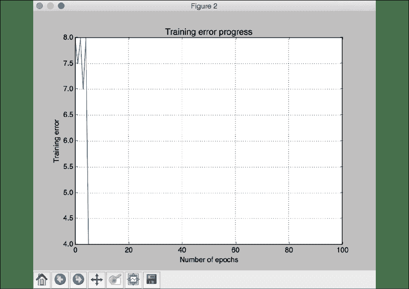
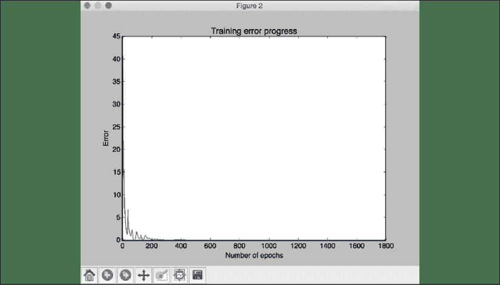
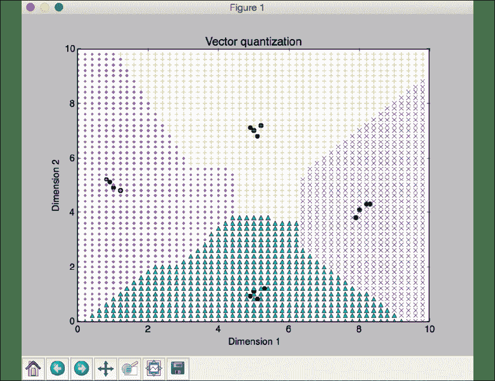
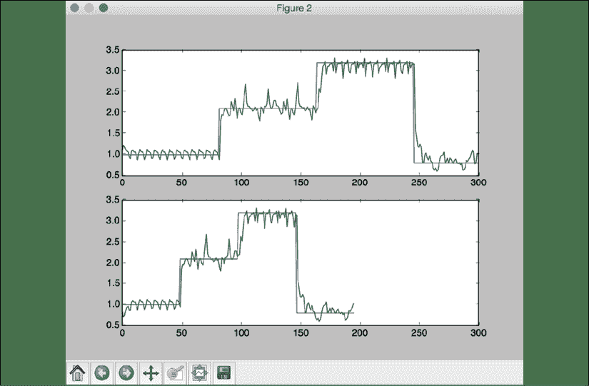
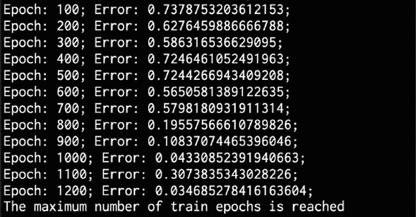
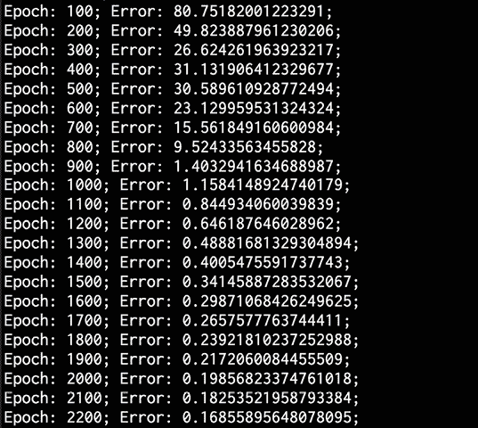
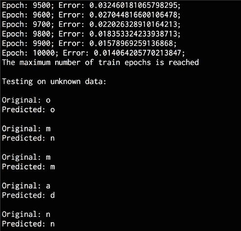

# 19

# 神经网络

在本章中，我们将学习神经网络。 我们将从神经网络的介绍和相关库的安装开始。 然后，我们将讨论感知器以及如何基于它们构建分类器。 之后，我们将更深入地学习单层神经网络和多层神经网络。

稍后，我们将看到如何使用神经网络构建向量量化器。 我们将使用循环神经网络分析顺序数据，最后将使用神经网络构建光学字符识别引擎。 在本章的最后，我们将介绍：

*   神经网络简介
*   构建基于感知器的分类器
*   构建单层神经网络
*   构建多层神经网络
*   构建向量量化器
*   使用循环神经网络分析顺序数据
*   在**光学字符识别**（**OCR**）数据库中可视化字符
*   构建**光学字符识别**（**OCR**）引擎

让我们开始介绍神经网络。

# 神经网络介绍

人工智能的基本前提之一是构建可以执行通常需要人类智能的任务的系统。 人脑在学习新概念方面非常了不起。 为什么不使用人脑模型来构建系统？ 神经网络是一种旨在宽松地模拟人脑学习过程的模型。

神经网络的设计使其可以识别数据中的基本模式并从中学习。 它们可用于各种任务，例如分类，回归和细分。 神经网络的一个缺点是，在将给定数据输入神经网络之前，我们需要将其转换为数字格式。 例如，我们处理许多不同类型的数据，包括视觉，文本和时间序列。 我们需要弄清楚如何以神经网络可以理解的方式表示问题。 为了理解这一过程，让我们首先考虑如何构建神经网络，然后如何训练神经网络。

## 建立神经网络

人类学习过程的某些组成部分是分层的。 我们大脑神经网络中有多个部分，每个阶段对应不同的粒度。 有些部分学习简单的东西，有些部分学习更复杂的东西。 让我们考虑视觉上识别对象的示例。

当我们看着一个盒子时，大脑的第一部分可能会识别出简单的事物，例如角落和边缘。 下一部分将标识通用形状，其后的部分将标识其是哪种对象。 对于不同的大脑功能，此过程可能有所不同，但是您可以理解。 使用这种层次结构，人脑可以分离任务并识别给定的对象。

为了模拟人脑的学习过程，使用神经元层构建了神经网络。 这些神经元受到我们在上一段中讨论的生物神经元的启发。 神经网络中的每一层都是一组独立的输入神经元。 一层中的每个神经元都与相邻层中的神经元相连。

## 训练神经网络

如果我们要用`N`维输入数据处理，则输入层将由`N`个神经元组成。 如果我们在训练数据中具有`M`个不同的类，则输出层将包含`M`个神经元。 输入和输出层之间的层称为隐藏层。 一个简单的神经网络将由两层组成，而一个深度神经网络将由许多层组成。

那么如何使用神经网络对数据进行分类呢？ 第一步是收集适当的训练数据并贴上标签。 每个神经元都充当简单函数，并且神经网络会自我训练，直到误差降至某个阈值以下。

误差是预测输出与实际输出之间的差。 基于误差有多大，神经网络会自行调整并重新训练，直到其更接近可解度。

足够抽象地思考神经网络。 就像我们在本书中一直在做的那样，是时候动手动手，边做边学。 在本章中，我们将使用名为 **NeuroLab** 的库。 NeuroLab 是库，它实现了基本的神经网络算法。 它具有各种参数，可以对其进行配置。 其界面类似于 **MATLAB** 中的**神经网络工具箱**（**NNT**）软件包。 该库是基于 NumPy 软件包的。 [您可以在以下位置找到有关它的更多信息](https://pythonhosted.org/neurolab)。

您可以通过在终端上运行以下命令来安装它：

```py
$ pip3 install neurolab 
```

安装后，您可以继续进行下一部分，在此我们将构建基于 Perceptron 的分类器。

# 构建基于感知器的分类器

神经元，树突和轴突构成了大脑的组成部分。 同样，感知器是神经网络中最基本的结构。

神经网络的发展经历了许多变化。 他们的发展基于圣地亚哥·拉蒙·卡哈尔和查尔斯·斯科特·谢灵顿爵士所做的神经系统工作。 拉蒙·卡哈尔（Ramon y Cajal）是探索神经组织结构的先驱，并证明：

*   神经元可以互相交流
*   神经元与其他神经元在物理上是分开的

利用 Ramony Cajal 和 Sherrington，Warren McCulloch 和 Walter Pitts 在 1943 年的论文中进行的研究，*神经活动固有的逻辑思想*描述了一种结构，该结构借鉴了具有二进制阈值激活的神经元的结构。 功能类似于一阶逻辑语句。

以下是 McCulloch 和 Pitts 神经元的基本表示，也称为感知器：


图 1：基本的感知器功能

因此，感知器是许多神经网络的基本构建块。 它接受输入，对其进行计算，然后产生输出。 它使用简单的线性函数进行决策。 假设我们正在处理`N`维输入数据点。 感知器计算这些`N`个数字的加权总和，然后添加一个常数以产生输出。 该常数称为神经元的偏差。 值得注意的是，这些简单的感知器可用于设计复杂的深度神经网络。

在本章中，我们将看到如何使用这种基本结构进行机器学习。 在后面的章节中，我们将看到更复杂的示例以及神经网络的一些有趣应用。 许多神经网络的核心，无论它们多么复杂，都利用了感知器的简单概念。 这就是为什么对这个主题有一个透彻的了解很重要的原因。 让我们看看如何使用 NeuroLab 构建基于感知器的分类器。

创建一个新的 Python 文件并导入以下软件包：

```py
import numpy as np
import matplotlib.pyplot as plt
import neurolab as nl 
```

从提供给您的文本文件`data_perceptron.txt`中加载输入数据。 每行包含用空格分隔的数字，其中前两个数字是要素，最后一个数字是标签：

```py
# Load input data
text = np.loadtxt('data_perceptron.txt') 
```

将文本分为数据点和标签：

```py
# Separate datapoints and labels
data = text[:, :2]
labels = text[:, 2].reshape((text.shape[0], 1)) 
```

绘制数据点：

```py
# Plot input data
plt.figure()
plt.scatter(data[:,0], data[:,1])
plt.xlabel('Dimension 1')
plt.ylabel('Dimension 2')
plt.title('Input data') 
```

定义每个尺寸可以采用的最大值和最小值：

```py
# Define minimum and maximum values for each dimension
dim1_min, dim1_max, dim2_min, dim2_max = 0, 1, 0, 1 
```

由于数据分为两类，我们只需要一位即可代表输出。 因此，输出层将包含单个神经元。

```py
# Number of neurons in the output layer
num_output = labels.shape[1] 
```

我们有一个数据集，其中的数据点是二维的。 让我们定义一个具有两个输入神经元的感知器，在其中为每个维度分配一个神经元。

```py
# Define a perceptron with 2 input neurons (because we 
# have 2 dimensions in the input data)
dim1 = [dim1_min, dim1_max]
dim2 = [dim2_min, dim2_max]
perceptron = nl.net.newp([dim1, dim2], num_output) 
```

用训练数据训练感知器：

```py
# Train the perceptron using the data
error_progress = perceptron.train(data, labels, epochs=100, show=20, lr=0.03) 
```

使用误差度量绘制训练进度：

```py
# Plot the training progress
plt.figure()
plt.plot(error_progress)
plt.xlabel('Number of epochs')
plt.ylabel('Training error')
plt.title('Training error progress')
plt.grid()
plt.show() 
```

文件`perceptron_classifier.py`中提供了完整代码。 如果运行代码，您将获得两个输出屏幕截图。 第一个屏幕截图显示了输入数据点：


图 2：训练进度图

第二张屏幕截图使用错误指标表示训练进度：


图 3：训练误差图

我们可以从前面的屏幕截图中观察到，在第四个时期结束时，错误降至`0`，这正是我们想要发生的情况。 如果错误为`0`，则无法进一步改善。 在下一部分中，我们将增强模型并创建单层神经 网络。

# 构建单层神经网络

建立一个带有几个感知器的模型是一个好的开始，它使我们对这个令人兴奋的概念有了基本的了解，但是要真正解决问题，这种简单的模型是不够的。 人脑大约有 850 亿个神经元。 我们不会建立具有这么多节点的神经网络，但是这个数字使您了解解决复杂问题所需的方法。 在建立具有数十亿个节点的模型之前，让我们进行下一步以建立具有单层的网络。 这个单层神经网络由作用于输入数据以产生输出的独立神经元组成。 让我们开始吧。

创建一个新的 Python 文件并导入以下软件包：

```py
import numpy as np
import matplotlib.pyplot as plt
import neurolab as nl 
```

我们将使用提供给您的文件`data_simple_nn.txt`中的输入数据。 该文件中的每一行都包含四个数字。 前两个数字构成数据点，后两个数字是标签。 为什么我们需要为标签分配两个数字？ 因为我们在数据集中有四个不同的类，所以我们需要两位来表示它们。 让我们继续加载数据：

```py
# Load input data
text = np.loadtxt('data_simple_nn.txt') 
```

将数据分为数据点和标签：

```py
# Separate it into datapoints and labels
data = text[:, 0:2]
labels = text[:, 2:] 
```

绘制输入数据：

```py
# Plot input data
plt.figure()
plt.scatter(data[:,0], data[:,1])
plt.xlabel('Dimension 1')
plt.ylabel('Dimension 2')
plt.title('Input data') 
```

提取每个维度的最小值和最大值（我们不需要像上一节中那样对其进行硬编码）：

```py
# Minimum and maximum values for each dimension
dim1_min, dim1_max = data[:,0].min(), data[:,0].max()
dim2_min, dim2_max = data[:,1].min(), data[:,1].max() 
```

定义输出层中的神经元数量：

```py
# Define the number of neurons in the output layer
num_output = labels.shape[1] 
```

使用以上参数定义单层神经网络：

```py
# Define a single-layer neural network
dim1 = [dim1_min, dim1_max]
dim2 = [dim2_min, dim2_max]
nn = nl.net.newp([dim1, dim2], num_output) 
```

使用训练数据训练神经网络：

```py
# Train the neural network
error_progress = nn.train(data, labels, epochs=100, show=20, lr=0.03) 
```

绘制训练进度：

```py
# Plot the training progress
plt.figure()
plt.plot(error_progress)
plt.xlabel('Number of epochs')
plt.ylabel('Training error')
plt.title('Training error progress')
plt.grid()
plt.show() 
```

定义一些样本测试数据点，并在这些点上运行网络：

```py
# Run the classifier on test datapoints
print('\nTest results:')
data_test = [[0.4, 4.3], [4.4, 0.6], [4.7, 8.1]]
for item in data_test:
    print(item, '-->', nn.sim([item])[0]) 
```

完整代码在文件`simple_neural_network.py`中给出。 如果运行代码，您将获得两个屏幕截图。 第一个屏幕截图表示输入数据点：


图 4：数据点图

第二张屏幕截图显示了训练进度：



图 5：训练进度图

关闭图形后，您将看到以下输出：


图 6：训练纪元

正如我们在“图 5”中看到的那样，错误迅速开始减少，这表明我们的训练有效地创造了越来越好的预测。 在这种情况下，错误不会降为零。 但是如果我们让模型再运行几个纪元，我们预计误差将继续减少。 如果将这些测试数据点定位在 2D 图形上，则可以直观地验证预测输出的正确性。

# 构建多层神经网络

因此，我们将模型从几个节点增强到了一个单层，但距离 850 亿个节点还差得很远。 我们也不会在本节中谈到这一点，但让我们朝着正确的方向迈出又一步。 人脑不使用单层模型。 一些神经元的输出变成其他神经元的输入，依此类推。 具有这种特征的模型被称为多层神经网络。 这种类型的体系结构可产生更高的精度，并且使我们能够解决更复杂，更多样化的问题。 让我们看看如何使用 NeuroLab 构建多层神经网络。

创建一个新的 Python 文件并导入以下软件包：

```py
import numpy as np
import matplotlib.pyplot as plt
import neurolab as nl 
```

在前两节中，我们看到了如何使用神经网络作为分类器。 在本节中，我们将看到如何使用多层神经网络作为回归器。 根据公式 *y = 3x ^ 2 + 5* 生成一些样本数据点，然后将这些点归一化：

```py
# Generate some training data
min_val = -15
max_val = 15
num_points = 130
x = np.linspace(min_val, max_val, num_points)
y = 3 * np.square(x) + 5
y /= np.linalg.norm(y) 
```

重塑前面的变量以创建训练数据集：

```py
# Create data and labels
data = x.reshape(num_points, 1)
labels = y.reshape(num_points, 1) 
```

绘制输入数据：

```py
# Plot input data
plt.figure()
plt.scatter(data, labels)
plt.xlabel('Dimension 1')
plt.ylabel('Dimension 2')
plt.title('Input data') 
```

定义具有两个隐藏层的多层神经网络。 您可以根据需要自由设计神经网络。 对于这种情况，我们在第一层使用`10`神经元，在第二层使用`6`神经元。 我们的任务是预测值，因此输出层将包含单个神经元：

```py
# Define a multilayer neural network with 2 hidden layers;
# First hidden layer consists of 10 neurons
# Second hidden layer consists of 6 neurons
# Output layer consists of 1 neuron
nn = nl.net.newff([[min_val, max_val]], [10, 6, 1]) 
```

将训练算法设置为梯度下降：

```py
# Set the training algorithm to gradient descent
nn.trainf = nl.train.train_gd 
```

使用生成的训练数据训练神经网络：

```py
# Train the neural network
error_progress = nn.train(data, labels, epochs=2000, show=100, goal=0.01) 
```

在训练数据点上运行神经网络：

```py
# Run the neural network on training datapoints
output = nn.sim(data)
y_pred = output.reshape(num_points) 
```

绘制训练进度：

```py
# Plot training error
plt.figure() 
plt.plot(error_progress)
plt.xlabel('Number of epochs')
plt.ylabel('Error')
plt.title('Training error progress') 
```

绘制预测输出：

```py
# Plot the output
x_dense = np.linspace(min_val, max_val, num_points * 2)
y_dense_pred = nn.sim(x_dense.reshape(x_dense.size,1)).reshape(x_dense.size)
plt.figure()
plt.plot(x_dense, y_dense_pred, '-', x, y, '.', x, y_pred, 'p')
plt.title('Actual vs predicted')
plt.show() 
```

完整代码在文件`multilayer_neural_network.py`中给出。 如果运行代码，您将获得三个屏幕截图。 第一个屏幕截图显示了输入数据：


图 7：输入数据图

第二张屏幕截图显示了训练进度：



图 8：训练进度图

第三个屏幕截图显示了覆盖在输入数据之上的预测输出：


图 9：覆盖输入数据的输出图

预测的输出似乎在一定程度上接近实际输入。 如果继续训练网络并减少错误，您将看到预测输出将与输入曲线相匹配，即使重新仍很准确。

您还应该看到打印出以下内容：


图 10：训练纪元

在前面的部分中，我们学习了如何构建基本的神经网络以及对基础知识的牢固掌握和理解。 在下一节中，我们将继续学习如何构建神经网络。 现在，我们将学习如何使用向量量化器构建神经网络。

# 建立向量量化器

**向量量化**是一种量化技术，其中输入数据由固定数量的代表点表示。 它是`N`维的四舍五入数字。 此技术通常用于多个领域，例如语音/图像识别，语义分析和图像/语音压缩。 最佳向量量化理论的历史可以追溯到 1950 年代的贝尔实验室，在那里进行了研究以使用离散化程序优化信号传输。 向量量化器神经网络的一个优点是它们具有很高的解释性。 让我们看看如何构建向量。

由于当前版本的 NeuroLab（v0.3.5）的某些问题，运行以下代码将引发错误。 幸运的是，有了此修复程序，但其中涉及对 NeuroLab 软件包进行更改。 将 NeuroLab 软件包（`layer_out.np['w'][n][st:i].fill(1.0)`）中`net.py`文件的 **179 行**更改为`layer_out.np['w'][n][int(st):int(i)].fill(1.0))`应该可以解决此问题。 要求读者使用此替代方法，直到在 Neuro Neuro 官方软件包中实现修复为止。

创建一个新的 Python 文件并导入以下软件包：

```py
import numpy as np
import matplotlib.pyplot as plt
import neurolab as nl 
```

从文件`data_vector_quantization.txt`加载输入数据。 该文件中的每一行都包含六个数字。 前两个数字形成数据点，后四个数字形成单热编码标签。 总体上有四个课程。

```py
# Load input data
text = np.loadtxt('data_vector_quantization.txt') 
```

将文本分为数据和标签：

```py
# Separate it into data and labels
data = text[:, 0:2]
labels = text[:, 2:] 
```

定义一个具有两层的神经网络，其中输入层有`10`神经元，输出层有`4`神经元：

```py
# Define a neural network with 2 layers:
# 10 neurons in input layer and 4 neurons in output layer 
num_input_neurons = 10
num_output_neurons = 4
weights = [1/num_output_neurons] * num_output_neurons
nn = nl.net.newlvq(nl.tool.minmax(data), num_input_neurons, weights) 
```

使用训练数据训练神经网络：

```py
# Train the neural network
_ = nn.train(data, labels, epochs=500, goal=-1) 
```

为了可视化输出集群，让我们创建一个点网格：

```py
# Create the input grid
xx, yy = np.meshgrid(np.arange(0, 10, 0.2), np.arange(0, 10, 0.2))
xx.shape = xx.size, 1
yy.shape = yy.size, 1
grid_xy = np.concatenate((xx, yy), axis=1) 
```

使用神经网络评估点的网格：

```py
# Evaluate the input grid of points
grid_eval = nn.sim(grid_xy) 
```

提取四个类：

```py
# Define the 4 classes
class_1 = data[labels[:,0] == 1]
class_2 = data[labels[:,1] == 1]
class_3 = data[labels[:,2] == 1]
class_4 = data[labels[:,3] == 1] 
```

提取与这四个类相对应的网格：

```py
# Define X-Y grids for all the 4 classes
grid_1 = grid_xy[grid_eval[:,0] == 1]
grid_2 = grid_xy[grid_eval[:,1] == 1]
grid_3 = grid_xy[grid_eval[:,2] == 1]
grid_4 = grid_xy[grid_eval[:,3] == 1] 
```

绘制输出：

```py
# Plot the outputs
plt.plot(class_1[:,0], class_1[:,1], 'ko', 
        class_2[:,0], class_2[:,1], 'ko', 
        class_3[:,0], class_3[:,1], 'ko', 
        class_4[:,0], class_4[:,1], 'ko')
plt.plot(grid_1[:,0], grid_1[:,1], 'm.',
        grid_2[:,0], grid_2[:,1], 'bx',
        grid_3[:,0], grid_3[:,1], 'c^', 
        grid_4[:,0], grid_4[:,1], 'y+')
plt.axis([0, 10, 0, 10])
plt.xlabel('Dimension 1')
plt.ylabel('Dimension 2')
plt.title('Vector quantization')
plt.show() 
```

完整代码在文件`vector_quantizer.py`中给出。 如果运行代码，将获得以下屏幕截图，其中显示了输入数据点和集群之间的边界：



图 11：输入数据点和集群之间边界的图

您还应该看到以下输出：


图 12：训练纪元

在上一节中，我们学习了如何使用向量量化器构建神经网络。 在下一节中，我们将继续学习神经网络。 接下来，我们将学习如何使用递归神经网络（RNN）分析顺序数据。

# 使用循环神经网络分析顺序数据

到目前为止，在我们所有的神经网络示例中，一直在使用静态数据。 神经网络也可以有效地用于构建处理顺序数据的模型。 **循环神经网络**（**RNN**）在建模顺序数据方面非常出色。 [您可以在以下位置了解有关循环神经网络的更多信息](https://www.jeremyjordan.me/introduction-to-recurrent-neural-networks/)。

当我们使用时间序列数据时，我们通常不能使用通用学习模型。 我们需要捕获数据中的时间依赖性，以便可以构建健壮的模型。 让我们看看如何构建它。

创建一个新的 Python 文件并导入以下软件包：

```py
import numpy as np
import matplotlib.pyplot as plt
import neurolab as nl 
```

定义一个函数来生成波形。 首先定义四个正弦波：

```py
def get_data(num_points):
    # Create sine waveforms
    wave_1 = 0.5 * np.sin(np.arange(0, num_points))
    wave_2 = 3.6 * np.sin(np.arange(0, num_points))
    wave_3 = 1.1 * np.sin(np.arange(0, num_points))
    wave_4 = 4.7 * np.sin(np.arange(0, num_points)) 
```

为整个波形创建变化的幅度：

```py
 # Create varying amplitudes
    amp_1 = np.ones(num_points)
    amp_2 = 2.1 + np.zeros(num_points)
    amp_3 = 3.2 * np.ones(num_points)
    amp_4 = 0.8 + np.zeros(num_points) 
```

创建整体波形：

```py
 wave = np.array([wave_1, wave_2, wave_3, wave_4]).reshape(num_points * 4, 1)
    amp = np.array([[amp_1, amp_2, amp_3, amp_4]]).reshape(num_points * 4, 1)
    return wave, amp 
```

定义一个函数以可视化神经网络的输出：

```py
# Visualize the output
def visualize_output(nn, num_points_test):
    wave, amp = get_data(num_points_test)
    output = nn.sim(wave)
    plt.plot(amp.reshape(num_points_test * 4))
    plt.plot(output.reshape(num_points_test * 4)) 
```

定义`main`功能并创建一个波形：

```py
if __name__=='__main__':
    # Create some sample data
    num_points = 40
    wave, amp = get_data(num_points) 
```

创建一个具有两层的循环神经网络：

```py
 # Create a recurrent neural network with 2 layers
    nn = nl.net.newelm([[-2, 2]], [10, 1], [nl.trans.TanSig(), nl.trans.PureLin()]) 
```

为每层设置初始化函数：

```py
 # Set the init functions for each layer 
    nn.layers[0].initf = nl.init.InitRand([-0.1, 0.1], 'wb')
    nn.layers[1].initf = nl.init.InitRand([-0.1, 0.1], 'wb')
    nn.init() 
```

训练神经网络：

```py
 # Train the recurrent neural network
    error_progress = nn.train(wave, amp, epochs=1200, show=100, goal=0.01) 
```

通过网络运行数据：

```py
 # Run the training data through the network
    output = nn.sim(wave) 
```

绘制输出：

```py
 # Plot the results
    plt.subplot(211)
    plt.plot(error_progress)
    plt.xlabel('Number of epochs')
    plt.ylabel('Error (MSE)')
    plt.subplot(212)
    plt.plot(amp.reshape(num_points * 4))
    plt.plot(output.reshape(num_points * 4))
    plt.legend(['Original', 'Predicted']) 
```

在未知的测试数据上测试神经网络的性能：

```py
 # Testing the network performance on unknown data
    plt.figure()
    plt.subplot(211)
    visualize_output(nn, 82)
    plt.xlim([0, 300])
    plt.subplot(212)
    visualize_output(nn, 49)
    plt.xlim([0, 300])
    plt.show() 
```

文件`recurrent_neural_network.py`中提供了完整代码。 如果运行代码，您将看到两个输出图形。 第一个屏幕截图的上半部分显示了训练进度，下半部分显示了叠加在输入波形顶部的预测输出：


图 13：输出波形叠加在输入波形上方

以下屏幕截图的上半部分显示了即使我们增加了波形的长度，神经网络也如何模拟波形。 屏幕截图的下半部分显示与减少长度相同：



图 14：波形仿真图

您还应该看到以下输出：



图 15：训练纪元

如您所见，错误持续减小，直到达到训练次数的最大值。 到此结束了本节，我们展示了如何使用 RNN 来分析时间序列数据。 在下一部分中，我们将通过研究光学字符识别来演示神经网络的实际应用。

# 在光学字符识别数据库中可视化字符

神经网络可以将用于光学字符识别。 它可能是其最常见的用例之一。 将手写体转换为计算机字符一直是许多计算机科学家试图解决的基本问题，但仍然难以捉摸。 我们已经取得了长足的进步，但是，由于显而易见的原因，100% 的准确性仍然遥不可及。 为什么？

考虑这种情况。 您曾经写下任何东西吗？五分钟后，您无法阅读自己的笔迹？ 计算机也总是会出现此问题。 写下数字`6`的方法有无数种，其中有些看起来比`6`更像`0`或`5`。 我可能是错的，但是我认为我们将找到一种治愈癌症的方法，然后才能找到一种可靠的方法来使计算机识别医生的笔迹。 我们已经可以达到很高的准确性，并且*的笔迹越漂亮*，阅读起来就越容易。 我们继续尝试解决此问题的原因是，这是一个有价值的目标，具有许多应用程序。 举一个简短的例子，医生的时间受到高度重视。 随着系统能够更好地识别他们的笔记，他们将获得更多的精力来专注于实际治疗和帮助患者的精力，而不再关注文书工作。

**光学字符识别**（**OCR**）是识别图像中手写字符的过程。 在构建模型之前，让我们使熟悉数据集。 [我们将使用以下位置提供的数据集](http://ai.stanford.edu/~btaskar/ocr)。

您将下载一个名为`letter.data`的文件。 为了方便起见，此文件已在代码包中提供给您。 让我们看看如何加载数据并形象化角色。

创建一个新的 Python 文件并导入以下软件包：

```py
import os
import sys
import cv2
import numpy as np 
```

定义包含 OCR 数据的输入文件：

```py
# Define the input file
input_file = 'letter.data' 
```

定义从该文件加载数据所需的可视化效果和其他参数：

```py
# Define the visualization parameters
img_resize_factor = 12
start = 6
end = -1
height, width = 16, 8 
```

遍历该文件的各行，直到用户按下 *Esc* 键。 该文件中的每一行都用制表符分隔。 阅读每一行并将其放大到`255`：

```py
# Iterate until the user presses the Esc key
with open(input_file, 'r') as f:
    for line in f.readlines():
        # Read the data
        data = np.array([255 * float(x) for x in line.split('\t')[start:end]]) 
```

将一维数组重塑为二维图像：

```py
 # Reshape the data into a 2D image
        img = np.reshape(data, (height, width)) 
```

缩放图像以进行可视化：

```py
 # Scale the image
        img_scaled = cv2.resize(img, None, fx=img_resize_factor, fy=img_resize_factor) 
```

显示图像：

```py
 # Display the image
        cv2.imshow('Image', img_scaled) 
```

检查用户是否按下了 *Esc* 键。 如果是，请退出循环：

```py
 # Check if the user pressed the Esc key
        c = cv2.waitKey()
        if c == 27:
            break 
```

完整代码在文件`character_visualizer.py`中给出。 如果运行代码，您将获得显示字符的输出屏幕截图。 您可以按住空格键查看更多字符。 例如，`o`可能看起来像这样：


图 16：字母 O 的图

和`i`可能看起来像这样：


图 17：字母 I 的图

到目前为止，我们还没有识别出任何字符。 我们刚刚想出了一种可视化数据集并验证我们的模型正在做出准确预测的方法。 我们将在下一部分中进行构建。

# 构建光学字符识别引擎

现在我们已经学习了如何处理这些数据，让我们使用神经网络构建光学字符识别系统。

创建一个新的 Python 文件并导入以下软件包：

```py
import numpy as np
import neurolab as nl 
```

定义输入文件：

```py
# Define the input file
input_file = 'letter.data' 
```

定义将要加载的数据点的数量：

```py
# Define the number of datapoints to 
# be loaded from the input file
num_datapoints = 50 
```

定义包含所有不同字符的字符串：

```py
# String containing all the distinct characters
orig_labels = 'omandig' 
```

提取不同类的数量：

```py
# Compute the number of distinct characters
num_orig_labels = len(orig_labels) 
```

定义训练和测试拆分。 我们将使用 90% 的训练和 10% 的测试：

```py
# Define the training and testing parameters
num_train = int(0.9 * num_datapoints)
num_test = num_datapoints - num_train 
```

定义数据集提取参数：

```py
# Define the dataset extraction parameters
start = 6
end = -1 
```

创建数据集：

```py
# Creating the dataset
data = []
labels = []
with open(input_file, 'r') as f:
    for line in f.readlines():
        # Split the current line tabwise
        list_vals = line.split('\t') 
```

如果标签不是我们列表中的，则应跳过该标签：

```py
 # Check if the label is in our ground truth
        # labels. If not, we should skip it.
        if list_vals[1] not in orig_labels:
            continue 
```

提取当前标签并将其附加到主列表中：

```py
 # Extract the current label and append it
        # to the main list
        label = np.zeros((num_orig_labels, 1))
        label[orig_labels.index(list_vals[1])] = 1
        labels.append(label) 
```

提取字符向量并将其附加到主列表中：

```py
 # Extract the character vector and append it to the main list
        cur_char = np.array([float(x) for x in list_vals[start:end]])
        data.append(cur_char) 
```

创建数据集后，退出循环：

```py
 # Exit the loop once the required dataset has been created
        if len(data) >= num_datapoints:
            break 
```

将列表转换为 NumPy 数组：

```py
# Convert the data and labels to numpy arrays
data = np.asfarray(data)
labels = np.array(labels).reshape(num_datapoints, num_orig_labels) 
```

提取维数：

```py
# Extract the number of dimensions
num_dims = len(data[0]) 
```

创建一个前馈神经网络并将训练算法设置为梯度下降：

```py
# Create a feedforward neural network
nn = nl.net.newff([[0, 1] for _ in range(len(data[0]))], 
        [128, 16, num_orig_labels])
# Set the training algorithm to gradient descent 
nn.trainf = nl.train.train_gd 
```

训练神经网络：

```py
# Train the network
error_progress = nn.train(data[:num_train,:], labels[:num_train,:], 
        epochs=10000, show=100, goal=0.01) 
```

预测测试数据的输出：

```py
# Predict the output for test inputs 
print('\nTesting on unknown data:') 
predicted_test = nn.sim(data[num_train:, :]) 
for i in range(num_test):
    print('\nOriginal:', orig_labels[np.argmax(labels[i])]) 
    print('Predicted:', orig_labels[np.argmax(predicted_test[i])]) 
```

完整代码在文件`ocr.py`中给出。 如果运行代码，则应看到以下输出：



图 18：训练纪元

它将持续进行直到 10,000 个纪元。 完成后，您应该看到以下输出：



图 19：训练纪元

正如我们在前面的屏幕截图中看到的，我们的模型正确地选择了其中的三个。 如果使用更大的数据集并训练更长的时间，则应该获得更高的准确性。 我们让您看看它们是否可以通过更长的网络训练和调整模型的配置来获得更高的准确性和更好的结果。

希望本章使您对 OCR 特别是神经网络感到兴奋。 在随后的章节中，我们将回顾该技术的许多其他用例，这些用例处于当前机器学习革命的最前沿。

# 总结

在本章中，我们学习了神经网络。 我们讨论了如何构建和训练神经网络。 我们讨论了感知器，并在此基础上构建了分类器。 我们了解了单层神经网络以及多层神经网络。 我们讨论了如何将神经网络用于构建向量量化器。 我们使用循环神经网络分析了顺序数据。 然后，我们使用神经网络构建了光学字符识别引擎。 在下一章中，我们将学习强化学习，并了解如何构建智能学习代理。