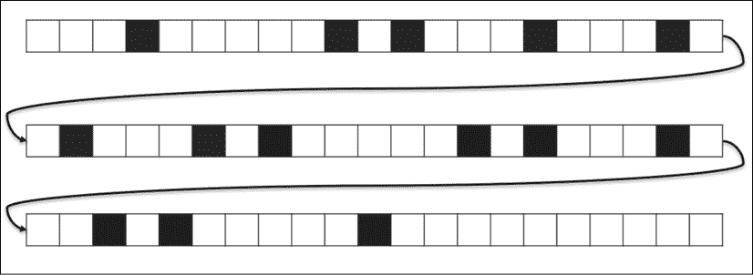
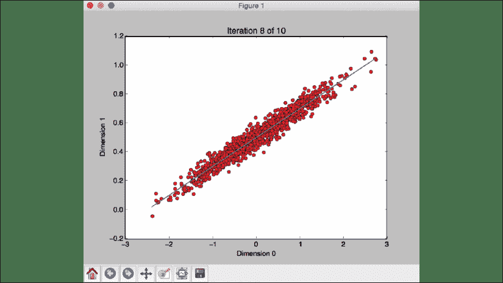
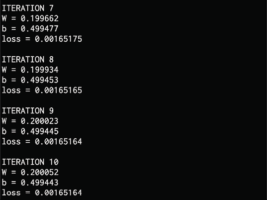
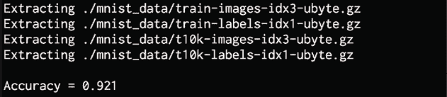
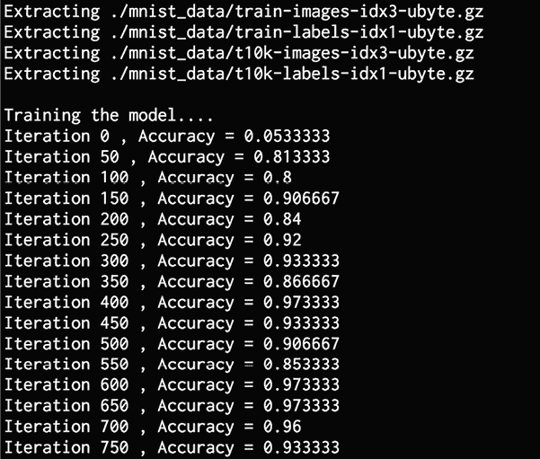

# 20

# 使用卷积神经网络进行深度学习

在本章中，我们将学习深度学习和**卷积神经网络**（**CNN**）。 在过去的几年中，CNN 取得了很大的发展势头，尤其是在图像识别领域。 我们将讨论 CNN 的体系结构以及内部使用的层的类型。 我们将看到如何使用一个名为 TensorFlow 的软件包。 我们将构建一个基于感知器的线性回归器。 我们将学习如何使用单层神经网络构建图像分类器。

然后，我们将使用 CNN 构建图像分类器。 图像分类器有许多应用。 这是一个奇特的名字，但这只是计算机辨别对象是什么的能力。 例如，您可以构建一个分类器来确定某物是热狗还是非热狗。 这是一个轻松的示例，但是图像分类器也可以使用生死攸关的应用程序。 为嵌入了图像分类软件的无人机拍照，它可以区分平民和敌方战斗人员。 在这种情况下不能犯任何错误。

本章涵盖以下主题：

*   CNN 的基础
*   CNN 的架构
*   CNN 中的图层类型
*   构建基于感知器的线性回归器
*   使用单层神经网络构建图像分类器
*   使用 CNN 构建图像分类器

让我们开始学习基础知识。

# 卷积神经网络的基础

总体而言，CNN，尤其是**生成对抗网络**（尤其是 **GAN** ），已经成为新闻。 GAN 是 Ian Goodfellow 及其同事于 2014 年最初开发的一类 CNN。在 GAN 中，两个神经网络在游戏中相互竞争（从博弈论的角度）。 给定一个数据集，GAN 学习创建类似于训练集的新数据示例。 例如，速度可能会有些慢，但是有一个网站会产生不存在的人的面孔。

我们将让您的想象力疯狂起来，但是使用其中一些生成的“人类”在电影中出演肯定可以制作一部电影。 还有其他研究试图解决这一问题。 给定一个图像，我们可以确定它是 GAN 生成的图像还是真实的人？ [您可以在此处浏览该网站](https://thispersondoesnotexist.com/)。

要使用它，只需继续刷新页面，它将每次生成一个新图像。 GAN 最初是作为无监督学习的生成模型而创建的。 GAN 还被证明可用于半监督学习，监督学习和强化学习。 AI 的巨头之一 Yann LeCun 称 GAN 是 ML 中最近十年中最有趣的想法[1]。 让我们考虑 GAN 的其他一些用例和应用程序。

**使用 GAN 生成更多示例数据。**：数据是 ML 中的组成部分。 在某些情况下，不可能获得足够的数据来馈送到模型。 使用 GAN 生成更多输入数据是生成附加质量数据以馈入模型的好方法。

**安全性**：ML 为许多行业提供了提升。 无论市场部门如何，网络安全始终是企业高管的“首要任务”。 某些安全供应商使用 GAN 来处理网络攻击。 简而言之，GAN 会创建伪造的入侵，然后使用这些入侵来训练模型以识别这些威胁，从而使我们能够阻止这些攻击的真实版本。

**数据操作**：GAN 可用于“伪样式传输”，即，在不完全修改示例的情况下修改示例的某些尺寸。

GAN 可用于语音应用程序。 给定语音，可以训练 GAN 来重现著名的声音。

在一些著名的例子中，使用 GAN 修改了 Trump，Obama 或 Mona Lisa 的视频，并且开发人员使这些数字说出了他们从未说过的短语。 他们可能是很现实的。 或者可以将视频或图像更改为看起来像不同的人。 这是在麻省理工学院创建的唐纳德·特朗普总统形象之上插入尼古拉斯·凯奇的脸的例子：


图 1：尼古拉斯·凯奇（Nicolas Cage）担任唐纳德·特朗普（Donald Trump）总统

可以将这些技术移植到其他领域，例如自然语言处理，语音处理等。 例如，GAN 可能会略微调整句子，从而改变句子的含义。

**隐私**：作为其安全策略的的一部分，许多公司希望将某些数据保密和保密。 显而易见的例子是国防和军事应用。 可以在加密数据时使用 GAN。 例如，生成一次性的密钥。

为了更好地利用 GAN，谷歌于 2016 年开始进行研究。 基本思想是让一个网络创建一个密钥，另一个网络试图破解它。

在前两章中，我们看到了神经网络是如何工作的。 神经网络由具有权重和偏见的神经元组成。 在训练过程中会调整这些权重和偏见，以得出一个好的学习模型。 每个神经元接收一组输入，以某种方式对其进行处理，然后输出值。

如果我们构建具有多层的神经网络，则称为深度神经网络。 AI 处理这些深度神经网络的分支称为深度学习。

普通神经网络的主要缺点之一是它们忽略了输入数据的结构。 在将所有数据馈入网络之前，所有数据都将转换为一维数组。 这可能适用于数字数据，但是当我们处理图像时会变得困难。

让我们考虑灰度图像。 这些图像是 2D 结构，我们知道像素的空间排列具有很多隐藏信息。 如果我们忽略这些信息，我们将失去很多潜在的模式。 这是 CNN 出现的地方。 CNN 处理图像时会考虑图像的 2D 结构。

CNN 也由神经元组成，这些神经元由权重和偏差组成。 这些神经元接受输入数据，对其进行处理，然后输出某些数据。 网络的目标是从输入层中的原始图像数据转到输出层中的正确类别。 普通神经网络和 CNN 之间的区别在于我们使用的图层类型以及我们如何处理输入数据。 CNN 假定输入是图像，这使它们可以提取特定于图像的属性。 这使 CNN 可以更有效地处理图像。 现在我们已经了解了 CNN 的基础知识，下面让我们看一下它们是如何成立的。

# CNN 的体系结构

当我们在普通神经网络中使用时，我们需要将输入数据转换为单个向量。 此向量充当神经网络的输入，然后通过神经网络的各层。 在这些层中，每个神经元都连接到上一层中的所有神经元。 还值得注意的是，每一层中的神经元彼此之间没有连接。 它们仅连接到相邻层中的神经元。 网络中的最后一层是输出层，它代表最终输出。

如果我们将这种结构用于图像，它将很快变得难以管理。 例如，让我们考虑由`256×256` RGB 图像组成的图像数据集。 由于这些是 3 通道图像，因此权重为`256 * 256 * 3 = 196,608`。 请注意，这仅适用于单个神经元！ 每层将有多个神经元，因此权重数趋于迅速增加。 这意味着模型现在将具有在训练过程中要调整的大量参数。 因此，它很快变得非常复杂且耗时。 将每个神经元连接到上一层中的每个神经元（称为完全连通性）显然不会起作用。

CNN 在处理数据时会明确考虑图像的结构。 CNN 中的神经元按 3 个维度排列-宽度，高度和深度。 当前层中的每个神经元都连接到前一层输出的一小块。 就像在输入图像上叠加`NxN`滤镜一样。 这与完全连接层形成对比，在完全连接层中，每个神经元都连接到上一层的所有神经元。

由于单个滤镜无法捕获图像的所有细微差别，因此我们多次执行`M`，以确保捕获所有细节。 这些`M`过滤器充当特征提取器。 如果查看这些过滤器的输出，我们可以看到它们提取了诸如边，角等特征。 对于 CNN 中的初始层来说，这是正确的。 随着我们在网络的层中的进展，我们将看到后面的层提取更高级别的功能。

CNN 是深度学习网络。 它通常用于识别图像。 了解它如何识别图像将有助于您了解它们的工作原理。 像任何其他神经网络一样，它为图像中的元素分配权重和偏差，并能够将这些元素彼此区分开。 与其他分类模型相比，CNN 中使用的预处理较少。 当使用经过足够训练的原始方法过滤器时，可以训练 CNN 来区分这些过滤器和特征。

CNN 体系结构的基本形式可以与人脑中的神经元和树突进行比较，并从视觉皮层中汲取灵感。 单个神经元对视野受限区域的刺激作出反应。 该区域称为接受场。 这些视场的一组彼此重叠，因此覆盖了整个视场。

## CNN 与感知器神经网络

图像是像素值矩阵。 为什么我们不能仅将输入图像展平？ 例如，可以将 *7x7* 图像展平为 *49x1* 向量。 然后，我们可以将这个扁平化的图像用作基于感知器的神经网络的输入。

当使用基本的二进制（黑白）输入时，此方法在执行类的预测时可能会显示平均精度得分，但对于涉及像素始终的复杂图像，该方法几乎没有准确性。

让我们对此进行分析，以通过思考人类如何处理图像来获得一些理解。 考虑一个包含菱形的图像：♦。 我们的大脑可以立即处理图像，并意识到它是菱形：♦。


图 2：菱形

如果将其展平会怎样？



图 3：菱形但变平

并非很容易识别，不是吗？ 尽管如此，它是相同的信息。 当使用传统的神经网络而不是 CNN 时，也会发生类似的情况。 现在，当像素连续时，我们拥有的信息将丢失。

CNN 可以通过应用相关滤镜来捕获图像中的空间和时间相关性。 CNN 体系结构在数据集上表现更好，这是因为参数数量减少了，并且权重得到了重用。

现在，我们对 CNN 架构和图像的处理方式有了更好的了解，让我们考虑一下包含 CNN 的层。

# CNN 中的图层类型

CNN 通常使用以下类型的层：

**输入层**：此层直接获取原始图像数据。

**卷积层**：此层计算神经元与输入中各种贴片之间的卷积。 如果您需要快速了解图像卷积，[可以查看以下链接](http://web.pdx.edu/~jduh/courses/Archive/geog481w07/Students/Ludwig_ImageConvolution.pdf)。

卷积层基本上计算权重和前一层输出中的一个小补丁之间的点积。

**整流线性单元层**：此层将激活函数应用于上一层的输出。 此函数通常类似于`max(0, x)`。 需要这一层来为网络增加非线性，以便可以很好地推广到任何类型的功能。

**合并层**：此层对上一层的输出进行采样，从而得到具有较小尺寸的结构。 池化有助于我们在网络发展过程中仅保留重要部分。 最大池化通常在池化层中使用，我们在给定的`KxK`窗口中选择最大值。

**全连接层**：此层计算最后一层的输出分数。 结果输出的大小为`1x1xL`，其中`L`是训练数据集中的类数。


图 4：CNN 层

当我们从网络中的输入层到输出层时，输入图像就从像素值转换为最终的类别分数。 已经为 CNN 提出了许多不同的体系结构，这是一个活跃的研究领域。 模型的准确性和鲁棒性取决于许多因素-层的类型，网络的深度，网络内各种类型的层的排列，为每个层选择的功能离子，训练数据 ， 等等。

# 建立基于感知器的线性回归器

在建立 CNN 之前，让我们为基础建立一个更基本的模型，并了解如何使用 CNN 进行改进。 在本节中，我们将看到如何使用感知器构建线性回归模型。 在前面的章节中我们已经看到了线性回归，但是本节是关于使用神经网络方法构建线性回归模型的。

我们将在本章中使用 TensorFlow。 这是一个流行的深度学习软件包，已广泛用于构建各种实际系统。 在本节中，我们将熟悉其工作原理。 在继续操作之前，请确保已安装它。 [可以在这里找到安装说明](https://www.tensorflow.org/get_started/os_setup)。

确认已安装后，创建一个新的 Python 文件并导入以下软件包：

```py
import numpy as np
import matplotlib.pyplot as plt
import tensorflow as tf 
```

我们将生成一些数据点，并查看如何使用这些数据点训练模型。

定义要生成的数据点数：

```py
# Define the number of points to generate
num_points = 1200 
```

定义将用于生成数据的参数。 我们将使用线的模型： *y = mx + c* ：

```py
# Generate the data based on equation y = mx + c
data = []
m = 0.2
c = 0.5
for i in range(num_points):
    # Generate 'x'
    x = np.random.normal(0.0, 0.8) 
```

产生一些噪音以增加数据的差异：

```py
 # Generate some noise
    noise = np.random.normal(0.0, 0.04) 
```

使用以下公式计算`y`的值：

```py
 # Compute 'y'
    y = m*x + c + noise
    data.append([x, y]) 
```

完成迭代后，将数据分为输入和输出变量：

```py
# Separate x and y
x_data = [d[0] for d in data]
y_data = [d[1] for d in data] 
```

绘制数据：

```py
# Plot the generated data
plt.plot(x_data, y_data, 'ro')
plt.title('Input data')
plt.show() 
```

生成感知器的权重和偏差。 对于权重，我们将使用统一的随机数生成器并将偏差设置为零：

```py
# Generate weights and biases
W = tf.Variable(tf.random_uniform([1], -1.0, 1.0))
b = tf.Variable(tf.zeros([1])) 
```

使用 TensorFlow 变量定义方程式：

```py
# Define equation for 'y'
y = W * x_data + b 
```

定义在训练过程中可以使用的损失函数。 优化器将尝试尽可能减小此值。

```py
# Define how to compute the loss
loss = tf.reduce_mean(tf.square(y - y_data)) 
```

定义梯度下降优化器并指定损失函数：

```py
# Define the gradient descent optimizer
optimizer = tf.train.GradientDescentOptimizer(0.5)
train = optimizer.minimize(loss) 
```

所有变量均已就位，但尚未初始化。 让我们这样做：

```py
# Initialize all the variables
init = tf.initialize_all_variables() 
```

启动 TensorFlow 会话并使用初始化程序运行它：

```py
# Start the tensorflow session and run it
sess = tf.Session()
sess.run(init) 
```

开始训练过程：

```py
# Start iterating
num_iterations = 10
for step in range(num_iterations):
    # Run the session
    sess.run(train) 
```

打印训练过程的进度。 随着迭代的进行，`loss`参数将继续减小：

```py
 # Print the progress
    print('\nITERATION', step+1)
    print('W =', sess.run(W)[0])
    print('b =', sess.run(b)[0])
    print('loss =', sess.run(loss)) 
```

绘制生成的数据并将预测模型覆盖在顶部。 在这种情况下，模型是一行：

```py
 # Plot the input data 
    plt.plot(x_data, y_data, 'ro')
    # Plot the predicted output line
    plt.plot(x_data, sess.run(W) * x_data + sess.run(b)) 
```

设置图的参数：

```py
 # Set plotting parameters
    plt.xlabel('Dimension 0')
    plt.ylabel('Dimension 1')
    plt.title('Iteration ' + str(step+1) + ' of ' + str(num_iterations))
    plt.show() 
```

完整代码在文件`linear_regression.py`中给出。 如果运行代码，则应该看到以下屏幕截图：


图 5：输入数据图

如果关闭此窗口，您将看到训练过程。 第一次迭代如下所示：


图 6：训练过程的第一次迭代图

如我们所见，行完全关闭。 关闭此窗口以转到下一个迭代：


图 7：训练过程的后续迭代图

行似乎更好，但是仍然关闭。 让我们关闭此窗口，然后继续迭代：


图 8：训练过程的另一个后续迭代的图

看起来行越来越接近实际模型。 如果继续这样迭代，模型将变得更好。 第八次迭代如下所示：



图 9：训练过程的第八次迭代图

该行似乎非常适合该数据。 然后，您应该将其打印出来：


图 10：历元的初始输出

完成训练后，您将看到以下内容：



图 11：历元的最终输出

我们可以看到`w`和`b`的值是如何不断调整的，我们还可以看到损耗如何持续减小直到损耗很小的程度，以至于我们不再看到它减小。 有趣的是，我们能够很快取得良好的结果，但是我们为我们的网络解决了一个相当简单的问题。 让我们 崭露头角。

# 使用单层神经网络构建图像分类器

让我们看看如何使用 TensorFlow 创建单层神经网络，并使用它来构建图像分类器。 我们将使用 MNIST 图像数据集来构建我们的系统。 它是一个包含手写数字图像的数据集。 我们的目标是建立一个可以正确识别每个图像中数字的分类器。

创建一个新的 Python 文件并导入以下软件包：

```py
import tensorflow as tf
from tensorflow.examples.tutorials.mnist import input_data 
```

提取 MNIST 图像数据。 `one_hot`标志指定我们将在标签中使用一键编码。 这表示，如果我们有`n`类，则给定数据点的标签将是长度为`n`的数组。 该数组中的每个元素对应于一个给定的类。 要指定一个类，相应索引处的值将设置为`1`，其他所有值都将为`0`：

```py
# Get the MNIST data
mnist = input_data.read_data_sets("./mnist_data", one_hot=True) 
```

数据库中的图像是 *28x28* 。 我们需要将其转换为一维数组以创建输入层：

```py
# The images are 28x28, so create the input layer
# with 784 neurons (28x28=784)
x = tf.placeholder(tf.float32, [None, 784]) 
```

创建具有权重和偏差的单层神经网络。 数据库中有 10 个不同的数字。 输入层中神经元的数量为`784`，输出层中神经元的数量为`10`：

```py
# Create a layer with weights and biases.
# There are 10 distinct 
# digits, so the output layer should have 10 classes
W = tf.Variable(tf.zeros([784, 10]))
b = tf.Variable(tf.zeros([10])) 
```

创建用于训练的方程式：

```py
# Create the equation for 'y' using y = W*x + b
y = tf.matmul(x, W) + b 
```

定义损失函数和梯度下降优化器：

```py
# Define the entropy loss and the gradient descent optimizer
y_loss = tf.placeholder(tf.float32, [None, 10])
loss = tf.reduce_mean(tf.nn.softmax_cross_entropy_with_logits(logits=y, labels=y_loss))
optimizer = tf.train.GradientDescentOptimizer(0.5).minimize(loss) 
```

初始化所有变量：

```py
# Initialize all the variables
init = tf.initialize_all_variables() 
```

创建一个 TensorFlow 会话并运行它：

```py
# Create a session
session = tf.Session()
session.run(init) 
```

开始训练过程。 我们将使用批处理进行训练，在该批处理中，我们在当前批处理上运行优化器，然后继续进行下一个批处理以进行下一次迭代。 每次迭代的第一步是获取下一批要训练的图像：

```py
# Start training
num_iterations = 1200
batch_size = 90
for _ in range(num_iterations):
    # Get the next batch of images
    x_batch, y_batch = mnist.train.next_batch(batch_size) 
```

在这批图像上运行优化器：

```py
 # Train on this batch of images
    session.run(optimizer, feed_dict = {x: x_batch, y_loss: y_batch}) 
```

训练过程结束后，使用测试数据集计算准确性：

```py
# Compute the accuracy using test data
predicted = tf.equal(tf.argmax(y, 1), tf.argmax(y_loss, 1))
accuracy = tf.reduce_mean(tf.cast(predicted, tf.float32))
print('\nAccuracy =', session.run(accuracy, feed_dict = {
        x: mnist.test.images, 
        y_loss: mnist.test.labels})) 
```

完整代码在文件`single_layer.py`中给出。 如果运行代码，它将把数据下载到当前文件夹中名为`mnist_data`的文件夹中。 这是默认选项。 如果要更改它，可以使用输入参数进行更改。 运行代码后，将及以下输出：



图 12：精度输出

如输出所示，该模型的准确性为 92.1%。 这是一个相当低的分数。 让我们看看如何使用 CNN 来改善。

# 使用卷积神经网络构建图像分类器

上一节部分中的图像分类器效果不佳。 在 MNIST 数据集上获得 92.1% 相对容易。 让我们看看如何使用 CNN 来获得更高的准确性。 我们将使用相同的数据集构建图像分类器，但使用 CNN 而不是单层神经网络。

创建一个新的 Python 文件并导入以下软件包：

```py
import argparse
import tensorflow as tf
from tensorflow.examples.tutorials.mnist import input_data 
```

定义一个函数来为每个图层中的权重创建值：

```py
def get_weights(shape):
    data = tf.truncated_normal(shape, stddev=0.1)
    return tf.Variable(data) 
```

定义一个函数来为每个层中的偏差创建值：

```py
def get_biases(shape):
    data = tf.constant(0.1, shape=shape)
    return tf.Variable(data) 
```

定义一个函数，根据输入形状创建一个层：

```py
def create_layer(shape):
    # Get the weights and biases
    W = get_weights(shape)
    b = get_biases([shape[-1]])
    return W, b 
```

定义函数以执行 2D 卷积：

```py
def convolution_2d(x, W):
    return tf.nn.conv2d(x, W, strides=[1, 1, 1, 1], 
            padding='SAME') 
```

定义一个函数来执行 *2×2* 最大池化操作：

```py
def max_pooling(x):
    return tf.nn.max_pool(x, ksize=[1, 2, 2, 1], 
            strides=[1, 2, 2, 1], padding='SAME') 
```

提取 MNIST 图像数据：

```py
# Get the MNIST data
mnist = input_data.read_data_sets(args.input_dir, one_hot=True) 
```

使用`784`神经元创建输入层：

```py
# The images are 28x28, so create the input layer 
# with 784 neurons (28x28=784)
x = tf.placeholder(tf.float32, [None, 784]) 
```

我们将使用利用图像 2D 结构的卷积神经网络。 因此，让我们将`x`重塑为 4D 张量，其中第二维和第三维指定图像尺寸：

```py
# Reshape 'x' into a 4D tensor
x_image = tf.reshape(x, [-1, 28, 28, 1]) 
```

创建第一个卷积层，它将为图像中的每个 *5×5* 面片提取`32`特征：

```py
# Define the first convolutional layer 
W_conv1, b_conv1 = create_layer([5, 5, 1, 32]) 
```

将图像与上一步中计算的权重张量进行卷积，然后向其添加偏差张量。 然后，我们需要将**整流线性单位**（**ReLU**）函数应用到输出：

```py
# Convolve the image with weight tensor, add the 
# bias, and then apply the ReLU function
h_conv1 = tf.nn.relu(convolution_2d(x_image, W_conv1) + b_conv1) 
```

将 *2×2* 最大池化运算符应用于上一步的输出：

```py
# Apply the max pooling operator
h_pool1 = max_pooling(h_conv1) 
```

创建第二个卷积层以为每个 *5×5* 补丁计算`64`特征：

```py
# Define the second convolutional layer 
W_conv2, b_conv2 = create_layer([5, 5, 32, 64]) 
```

将上一层的输出与在上一步中计算的权重张量进行卷积，然后向其添加偏差张量。 然后，我们需要将 ReLU 函数应用于输出：

```py
# Convolve the output of previous layer with the 
# weight tensor, add the bias, and then apply
# the ReLU function
h_conv2 = tf.nn.relu(convolution_2d(h_pool1, W_conv2) + b_conv2) 
```

将 *2×2* 最大池化运算符应用于上一步的输出：

```py
# Apply the max pooling operator
h_pool2 = max_pooling(h_conv2) 
```

现在将图像尺寸减小为 *7×7* 。 用`1024`神经元创建一个完全连接的层：

```py
# Define the fully connected layer
W_fc1, b_fc1 = create_layer([7 * 7 * 64, 1024]) 
```

重塑上一层的输出：

```py
# Reshape the output of the previous layer
h_pool2_flat = tf.reshape(h_pool2, [-1, 7`7`64]) 
```

将上一层的输出与完全连接的层的权重张量相乘，然后向其添加偏置张量。 然后，我们将 ReLU 函数应用于输出：

```py
# Multiply the output of previous layer by the 
# weight tensor, add the bias, and then apply 
# the ReLU function
h_fc1 = tf.nn.relu(tf.matmul(h_pool2_flat, W_fc1) + b_fc1) 
```

为了减少过度拟合，我们需要创建一个辍学层。 让我们为概率值创建一个 TensorFlow 占位符，该占位符指定在删除过程中保留神经元输出的概率：

```py
# Define the dropout layer using a probability placeholder 
# for all the neurons
keep_prob = tf.placeholder(tf.float32)
h_fc1_drop = tf.nn.dropout(h_fc1, keep_prob) 
```

使用与我们数据集中的 10 个类别相对应的`10`输出神经元定义读出层。 计算输出：

```py
# Define the readout layer (output layer)
W_fc2, b_fc2 = create_layer([1024, 10])
y_conv = tf.matmul(h_fc1_drop, W_fc2) + b_fc2 
```

定义`loss`功能和`optimizer`功能：

```py
# Define the entropy loss and the optimizer
y_loss = tf.placeholder(tf.float32, [None, 10])
loss = tf.reduce_mean(tf.nn.softmax_cross_entropy_with_logits(y_conv, y_loss))
optimizer = tf.train.AdamOptimizer(1e-4).minimize(loss) 
```

定义精度的计算方法：

```py
# Define the accuracy computation
predicted = tf.equal(tf.argmax(y_conv, 1), tf.argmax(y_loss, 1))
accuracy = tf.reduce_mean(tf.cast(predicted, tf.float32)) 
```

初始化变量后创建并运行会话：

```py
# Create and run a session
sess = tf.InteractiveSession()
init = tf.initialize_all_variables()
sess.run(init) 
```

开始训练过程：

```py
# Start training 
num_iterations = 21000
batch_size = 75
print('\nTraining the model.')
for i in range(num_iterations):
    # Get the next batch of images
    batch = mnist.train.next_batch(batch_size) 
```

每`50`次迭代打印一次精度进度：

```py
 # Print progress
    if i % 50 == 0:
        cur_accuracy = accuracy.eval(feed_dict = {
                x: batch[0], y_loss: batch[1], keep_prob: 1.0})
        print('Iteration', i, ', Accuracy =', cur_accuracy) 
```

在当前批次的上运行优化器：

```py
 # Train on the current batch
    optimizer.run(feed_dict = {x: batch[0], y_loss: batch[1], keep_prob: 0.5}) 
```

训练过程结束后，使用测试数据集计算准确性：

```py
# Compute accuracy using test data
print('Test accuracy =', accuracy.eval(feed_dict = {
        x: mnist.test.images, y_loss: mnist.test.labels, 
        keep_prob: 1.0})) 
```

完整代码在文件`cnn.py`中给出。 如果运行代码，将得到以下输出：



图 13：精度输出

随着继续迭代，精度不断提高，如以下屏幕截图所示：


图 14：精度输出

现在我们有了的输出，我们可以看到的卷积神经网络的准确性比简单的神经网络要高得多。 与上一节中未使用 CNN 的准确性相比，这实际上是一个很大的改进。 CNN 可以解救！

# 总结

在本章中，我们学习了深度学习和 CNN。 我们讨论了什么是 CNN，以及我们为什么需要它们。 我们讨论了 CNN 的体系结构。 我们了解了 CNN 中使用的各种类型的图层。 我们讨论了如何使用 TensorFlow。 我们使用它来构建基于感知器的线性回归器。 我们学习了如何使用单层神经网络构建图像分类器。 然后，我们使用 CNN 构建了图像分类器。

在下一章中，我们将了解 CNN 的另一个受欢迎的兄弟– **循环神经网络**（**RNN**）。 像 CNN 一样，RNN 也已流行，并且现在非常流行。 与以前的模型相比，它们取得了令人印象深刻的结果。 在某些情况下，甚至在某些情况下甚至超过了人类的表现。

# 参考

1.  [Yann LeCun 对有关 Quora 的问题的答复](https://www.quora.com/What-are-some-recent-and-potentially-upcoming-breakthroughs-in-deep-learning)