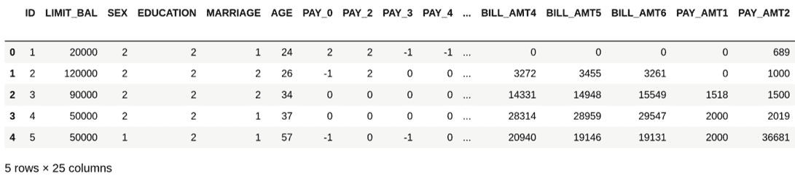
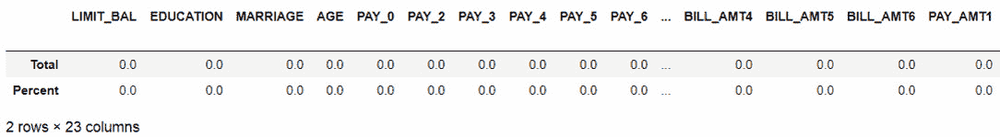
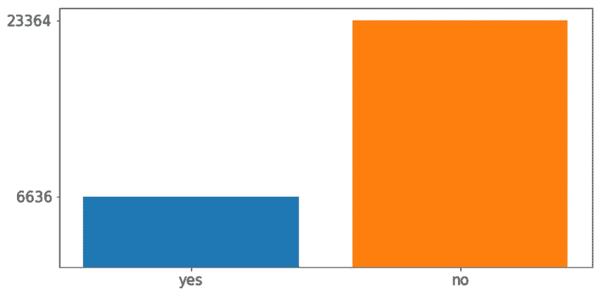
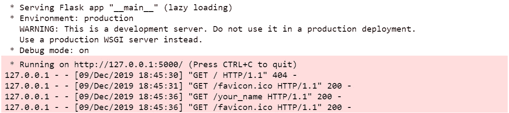
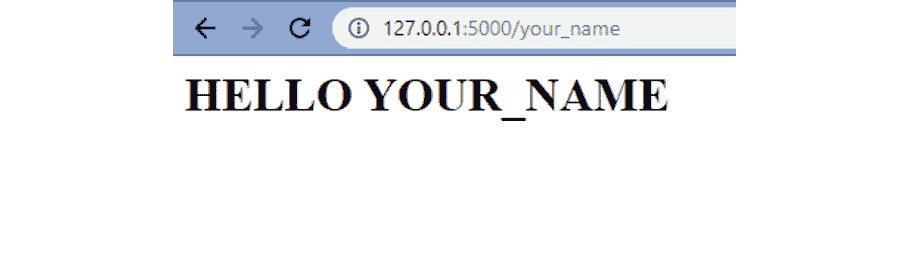

# 3.使用 DNN 的分类问题

### 概述

在本章中，我们将看一个银行业中的实际例子，以解决分类数据问题。 您将学习如何利用 PyTorch 的自定义模块来定义网络架构并训练模型。 您还将探索误差分析的概念，以提高模型的表现。 最后，您将研究部署模型的不同方法，以便将来使用它。 到本章结束时，您将对该过程有深刻的了解，以便可以使用**深度神经网络**（**DNN**）在 PyTorch 中。

# 简介

在上一章中，我们了解了 DNN 的构建块，并回顾了三种最常见的架构的特征。 此外，我们学习了如何使用 DNN 解决回归问题。

在本章中，我们将使用 DNN 解决分类任务，其目的是从一系列选项中预测结果。

利用这种模型的一个领域是银行业务。 这主要是由于他们需要根据人口统计数据预测未来的行为，以及确保长期盈利的主要目标。 银行业的一些用途包括评估贷款申请，信用卡批准，预测股票市场价格以及通过分析行为来检测欺诈。

本章将重点介绍使用深层**人工神经网络**（**ANN**）解决分类库问题的步骤，并遵循建立有效模型所需的所有步骤：数据探索，数据准备， 架构定义和模型训练，模型微调，误差分析，以及最后部署最终模型。

注意

[本章中提供的所有代码都可以在以下位置找到](https://packt.live/38qLadV)。

# 问题定义

定义问题与建立模型或提高准确率一样重要。 这是因为，虽然您可以使用最强大的算法并使用最先进的方法来改善其结果，但是如果您解决错误的问题或使用错误的数据，这可能毫无意义。

至关重要的是，学习如何深入思考以了解可以做什么和不能做什么以及如何可以完成。 考虑到当我们在学习应用机器学习或深度学习算法时，大多数课程中出现的问题总是清晰定义的，因此除训练模型和提高其表现外无需进行进一步分析，这一点尤其重要。 另一方面，在现实生活中，问题常常令人困惑，数据经常混乱。

在本节中，您将学习一些根据组织的需求和手头的数据来定义问题的最佳实践。

为此，您需要遵循的步骤如下：

1.  了解问题的原因，原因和方式。
2.  分析手头的数据，以确定我们模型的一些关键参数，例如要执行的学习任务的类型，必要的准备工作以及表现指标的定义。
3.  执行数据准备，以减少将偏差引入模型的可能性。

## 银行的深度学习

银行和金融实体每天处理大量信息，这是必需的，以便它们可以做出至关重要的决定，这些决定不仅影响其组织的未来，而且影响数百万信任它们的个人的未来。

这些决定每秒钟做出一次，早在 1990 年代，银行部门的人们就过去依靠专家系统来编写基于规则的程序。 也就是说，基于人类专家知识的程序要制定一套要遵循的规则。 不足为奇的是，这样的程序不足，因为它们要求对所有信息或可能的情况进行预先编程，这使得它们无法有效应对不确定性和瞬息万变的市场。

随着技术的进步，银行业一直在向更专业的系统过渡，这些系统利用统计模型来帮助做出此类决策。 此外，由于银行既要考虑自身的盈利能力，也要考虑客户的盈利能力，因此在不断追随技术进步的众多行业中，银行被认为是杰出的。

如今，随着医疗保健市场的发展，银行和金融业正在驱动神经网络的市场。 这主要是由于神经网络具有通过使用大量先前数据来预测未来行为来处理不确定性的能力。 考虑到人脑无法分析如此大量的数据，这是基于专家知识的人类系统无法实现的。

此处简要介绍并解释了使用深度学习的银行和金融服务中的某些领域：

*   **贷款申请评估**：银行根据不同的因素（包括人口统计信息，信用记录等）向客户发放贷款。 他们在此过程中的主要目标是最大程度地减少将拖欠贷款的客户数量（使失败率最小），从而使通过已发行贷款获得的回报最大化。

    神经网络用于帮助决定是否授予贷款。 通常使用以前未偿还贷款的贷款人以及按时偿还贷款的人的数据对他们进行训练。 创建模型后，想法是将新申请人的数据输入模型中，以便预测他们是否会偿还贷款，考虑到模型的重点应该是减少假正例的数量（模型预测的客户会拖欠贷款，但实际上没有）。

    在行业中，已知神经网络的故障率低于依靠人类专业知识的传统方法。

*   **欺诈检测**：欺诈检测对于银行和金融服务提供商至关重要，考虑到技术的进步，尽管使我们的生活更轻松，但也使我们面临更大的金融风险。

    在该域中，特别是 CNN，使用神经网络进行字符和图像识别，以检测字符图像中的隐藏和抽象图案，以确定用户是否遭受欺诈。

*   **信用卡客户选择**：为了长期保持盈利，信用卡提供商需要找到合适的客户。 例如，将信用卡批准给信用卡需求有限的客户（即不会使用的客户）将导致信用卡收入较低。

    另一方面，信用卡发行商也有兴趣预测客户是否会拖欠下一次付款。 这将帮助发卡机构提前知道将拖欠的资金数量，以便他们进行准备，以保持盈利。

    使用持有一张或几张信用卡的客户的历史数据来训练网络。 目标是创建能够确定新客户是否会充分利用信用卡，从而使收入取代成本的模型，以及能够预测付款行为的模型。

    注意

    本章其余部分将重点解决与信用卡使用有关的数据问题。 要下载将要使用的数据集，请转到[这里](http://archive.ics.uci.edu/ml/datasets/default+of+credit+card+clients)，单击**数据文件夹**链接，然后下载`.xls`文件。 [该数据集也可在本书的 GitHub 存储库中找到](https://packt.live/38qLadV)。

## 探索数据集

在以下各节中，我们将重点关注使用**信用卡客户默认值**（**DCCC**）数据集解决与信用卡付款有关的分类任务，该数据集先前是从 UC Irvine 储存库站点下载的。

本节的主要思想是清楚说明数据问题的内容，原因和方式，这将有助于确定研究目的和评估指标。 此外，我们将详细分析手头的数据，以识别数据准备过程中所需的一些步骤（例如，将定性特征转换为其数值表示形式）。

首先，让我们定义什么，为什么以及如何。 考虑到应该这样做以确定组织的实际需求：

**内容**：建立一个模型，该模型能够确定客户是否会拖欠即将到来的付款。

**意义**：能够预测下个月要收到的付款金额（以货币为单位）。 这将帮助公司确定该月的支出策略，并允许他们定义要与每个客户一起执行的操作，既可以确保将要付款的客户将来的付款，也可以提高将要付款的客户的付款可能性。 默认。

**方式**：使用历史数据包含人口统计信息，信用历史记录以及有或没有拖欠付款的客户以前的账单，以训练模型。 在对输入数据进行训练之后，该模型应该能够确定客户是否可能拖欠下一次付款。

考虑到这一点，似乎目标函数应该是说明客户是否会在下次付款时违约，这将导致二进制结果（是/否）。 这意味着要开发的学习任务是分类任务，因此损失函数应该能够测量这种学习类型的差异（例如，交叉熵函数，如上一章所述）。 。

明确定义问题后，您需要确定最终模型的优先级。 这意味着确定所有输出类别是否同样重要。 例如，建立模型的时候，测量肺部肿块是否恶变的模型应主要集中在使**假负例**最小化（模型预测为无恶性肿块，但实际上是恶性的患者）上。 识别手写字符不应只关注一个特定的字符，而应最大化其在平等地识别所有字符方面的表现。

考虑到这一点以及“意义”语句中的解释，信用卡客户默认**数据集**的模型优先级应该是在不优先考虑任何类别标签的情况下最大化模型的整体表现 。 这主要是因为“为什么”声明宣称研究的主要目的应该是更好地了解银行将要收到的资金，并对可能拖欠付款的客户采取某些措施（例如，提供将债务分成较小的付款），以及针对那些不会违约的人采取不同的行动（例如，提供优惠作为对行为良好的客户的奖励）。

据此，本案例研究中使用的表现指标是**准确率**，其重点是使**正确分类的实例**最大化。 这是指任何类别标签正确分类的实例与实例总数的比率。

下表简要说明了数据集中存在的每个功能，这些功能可以帮助确定它们与研究目的的相关性，并确定一些需要执行的准备任务：


图 3.1：DCCC 数据集中的特征描述


图 3.2：DCCC 数据集中的特征描述（续）

考虑到此信息，可以得出结论，在 25 个特征（包括目标特征）中，有 2 个需要从数据集中删除，因为它们与研究目的无关。 请记住，与这项研究无关的功能可能与其他研究有关。 例如，一项有关私密卫生产品的研究可能认为性别特征是相关的。

此外，所有功能都是定量的，这意味着无需转换其值。 我们需要做的就是调整它们的规模。 目标特征也已转换为其数字表示形式，其中下一笔付款违约的客户用 1 表示，而未下一笔付款的客户用 0 表示。

## 数据准备

尽管在这方面有一些良好的做法，但是并没有固定的一组步骤来准备（预处理）数据集以开发深度学习解决方案，并且在大多数情况下，要采取的步骤取决于现有数据，要使用的算法以及研究的其他特征。

注意

准备 DCCC 数据集的过程将在本节中进行处理，并附带简要说明。 考虑到它将是后续活动的起点，请随时打开 Jupyter 笔记本并复制此过程。

但是，在开始训练模型之前，必须处理一些关键方面。 您已经从上一章中了解了其中的大多数内容，这些内容将应用于当前数据集，并在目标特征中添加了类不平衡的修订：

*   **看看数据**：使用Pandas读取数据集后，打印数据集的标题。 这有助于确保已加载正确的数据集。 此外，它还提供了准备后转换数据集的证据。

    注意

    为了能够使用 Pandas 读取 Excel 文件，请确保已在计算机或虚拟环境上安装了`xlrd`。 要安装`xlrd`，您需要在 Anaconda 提示符下运行`conda install -c anaconda xlrd`。

    以下是用于使用 Pandas 读取 Excel 文件并打印出数据集标题的代码段：

    ```py
    import pandas as pd
    data = pd.read_excel("default of credit card clients.xls", \
                         skiprows=1)
    data.head()
    ```

    我们使用`skipline`参数删除 Excel 文件的第一行，该行无关，因为它包含第二组标题。

    执行代码后，将获得以下结果：



图 3.3：DCCC 数据集的标题

数据集的形状为 30,000 行 25 列，可以使用以下代码行获得：

```py
print("rows:",data.shape[0]," columns:", data.shape[1])
```

*   **删除不相关的特征**：通过对每个特征进行分析，可以确定应从数据集中删除两个特征，因为它们与研究目的无关：

    ```py
    data_clean = data.drop(columns=["ID", "SEX"])
    data_clean.head()
    ```

    结果数据集应包含 23 列，而不是原始的 25 列，如以下屏幕截图所示：


图 3.4：删除无关特征后的 DCCC 数据集的标题

*   **检查缺失值**：接下来，是时候检查数据集是否缺失任何值，如果是，则计算它们代表每个要素的百分比，这可以使用以下代码行完成 ：

    ```py
    total = data_clean.isnull().sum()
    percent = (data_clean.isnull().sum()\
               /data_clean.isnull().count()*100)
    pd.concat([total, percent], axis=1, \
              keys=['Total', 'Percent']).transpose()
    ```

    第一行对数据集的每个要素执行缺失值的总和。 接下来，我们计算每个功能缺失值的参与度。 最后，我们将先前计算的两个值连接起来，并将结果显示在表中。 结果如下：



图 3.5：DCCC 数据集中的缺失值计数

根据这些结果，可以说数据集没有丢失任何值，因此这里不需要采取进一步的措施。

*   **检查异常值**：正如我们在“第 2 章”，“神经网络的构建块”中提到的，有几种方法可以检查异常值。 但是，在本书中，我们将坚持使用标准差方法，将偏离均值三个标准差的值视为离群值。 使用以下代码，可以从每个特征中识别离群值，并计算它们在整个值集中所占的比例：

    ```py
    outliers = {}
    for i in range(data_clean.shape[1]):
        min_t = data_clean[data_clean.columns[i]].mean() \
                - (3 * data_clean[data_clean.columns[i]].std())
        max_t = data_clean[data_clean.columns[i]].mean() \
                + (3 * data_clean[data_clean.columns[i]].std())
        count = 0
        for j in data_clean[data_clean.columns[i]]:
            if j < min_t or j > max_t:
                count += 1
        percentage = count/data_clean.shape[0]
        outliers[data_clean.columns[i]] = "%.3f" % percentage
    print(outliers)
    ```

    这将导致一个字典，其中包含每个要素名称作为键，并且该值表示该要素离群值的比例。 从这些结果中，可以观察到包含更多异常值的特征是`BILL_AMT1`和`BILL_AMT4`，它们各自占总数的 2.3%。

    这意味着，鉴于异常值对每个特征的参与度太低，因此不需要采取进一步的措施，因此它们不太可能对最终模型产生影响。

*   **检查类不平衡**：当目标要素中的类标签未均等表示时，发生类不平衡； 例如，一个数据集包含 90% 的未拖欠下次付款的客户，而 10% 的客户未拖欠下一次付款，则被认为是不平衡的。

    有几种处理类不平衡的方法，其中一些方法在这里说明：

    **收集更多数据**：尽管这并非总是可用的途径，但它可能有助于平衡类或允许删除过度代表的类而不会严重减少数据集。

    **更改表现指标**：某些指标（例如准确率）不适用于测量不平衡数据集的表现。 反过来，建议使用诸如精度或召回分类问题之类的指标来衡量表现。

    **重采样数据集**：这需要修改数据集以平衡类。 可以通过两种不同的方式来完成此操作：在代表性不足的类中添加实例的副本（称为过采样），或删除代表性不足的类的实例（称为欠采样）。

    可以通过简单地计算`target`属性中每个类的出现来检测类不平衡，如下所示：

    ```py
    target = data_clean["default payment next month"]
    yes = target[target == 1].count()
    no = target[target == 0].count()
    print("yes %: " + str(yes/len(target)*100) + " - no %: " \
          + str(no/len(target)*100))
    ```

    根据前面的代码，可以得出结论，拖欠付款的客户数量占数据集的 22.12%。 这些结果也可以使用以下代码行显示在绘图中：

    ```py
    import matplotlib.pyplot as plt
    fig, ax = plt.subplots(figsize=(10,5))
    plt.bar("yes", yes)
    plt.bar("no", no)
    ax.set_yticks([yes,no])
    plt.xticks(fontsize=15)
    plt.yticks(fontsize=15)
    plt.show()
    ```

    结果如下图：



图 3.6：目标特征的类数

为了解决此问题，并且鉴于没有更多数据要添加并且表现指标实际上是准确率的事实，有必要执行数据重采样。

以下是对数据集执行过采样的代码片段，随机创建了代表性不足的类的重复行：

    ```py
    data_yes = data_clean[data_clean["default payment next month"] == 1]
    data_no = data_clean[data_clean["default payment next month"] == 0]
    over_sampling = data_yes.sample(no, replace=True, \
                                    random_state = 0)
    data_resampled = pd.concat([data_no, over_sampling], \
                                axis=0)
    ```

首先，我们将每个类标签的数据分成独立的`DataFrame`。 接下来，我们使用 Pandas 的`sample()`函数来构造一个新的`DataFrame`，其中包含的重复表示实例数与过量表示的实例数据帧一样多。

注意

请记住， `sample()`函数的第一个参数（`no`）是指先前计算的过分代表类中的项目数。

最后， `concat()`函数用于连接过度代表的类的`DataFrame`和大小相同的新创建的`DataFrame`，以便创建要在后续步骤中使用的最终数据集。

使用新创建的数据集，可以再次计算整个数据集中目标要素中每个类标签的参与度，这现在应该反映出具有相同参与度的两个类标签的均等表示的数据集。 此时，数据集的最终形状应等于`(46728,23)`。

*   **从目标拆分特征**：我们将数据集拆分为要素矩阵和目标矩阵，以避免重新调整目标值：

    ```py
    data_resampled = data_resampled.reset_index(drop=True)
    X = data_resampled.drop(columns=["default payment next month"])
    y = data_resampled ["default payment next month"]
    ```

*   **重新缩放数据**：最后，我们重新缩放要素矩阵的值，以避免对模型造成偏差：

    ```py
    X = (X - X.min())/(X.max() - X.min())
    X.head()
    ```

    前几行代码的结果如下：


图 3.7：归一化后的特征矩阵

注意

考虑到**婚姻**和**教育**都是顺序特征，这意味着它们遵循顺序或等级； 选择重新缩放方法时，请确保保持顺序。

为了便于为即将进行的活动使用准备好的数据集，将特征（`X`）和目标（`y`）矩阵连接到一个 Pandas `DataFrame`中， 使用以下代码将其保存到 CSV 文件中：

```py
final_data = pd.concat([X, y], axis=1)
final_data.to_csv("dccc_prepared.csv", index=False)
```

执行完上述步骤后，DCCC 数据集已转换并准备就绪（在新的 CSV 文件中）可用于训练模型，这将在以下部分中进行说明。

## 构建模型

一旦确定了问题并且已经探究和准备了手头的数据，就可以定义模型了。 网络架构的定义，层的类型，损失函数等应在前面的分析之后处理。 这主要是因为在机器学习中没有“千篇一律”的方法，而在深度学习中则没有。

与聚类，计算机视觉和机器翻译一样，回归任务需要与分类任务不同的方法。 在以下部分中，您将找到构建用于解决分类任务的模型的关键特征，并说明如何实现“良好”架构，以及如何以及何时使用 PyTorch 中的自定义模块。 。

## 用于分类任务的 ANN

如“活动 2.02”中所示，从“第 2 章”，“神经网络的构建模块”开发用于回归问题的深度学习解决方案，为回归任务而构建的神经网络使用输出作为连续值，这就是为什么在输出层不具有激活函数且仅具有一个输出节点（实际值）的原因，就像在根据房屋和邻里的特征，构建用于预测房价的模型的情况下一样。 

鉴于此，要测量与此类模型相关的表现，您应该计算真实情况值和预测值之间的差，例如，计算 125.3（预测）与 126.38（真实情况值）之间的距离 。 如前所述，有许多方法可以测量此差异，例如**均方误差**（**MSE**），或另一种变化是**均方根误差**（**RMSE**），是最常用的指标。

与此相反，分类任务的输出是属于每个输出标签或类的某些输入要素集合的概率，这是使用 Sigmoid（用于二分类）或 softmax（用于多类分类）完成的 ）激活函数。 对于二元分类任务，输出层应包含一个（对于 Sigmoid）或两个（对于 softmax）输出节点，而对于多类分类任务，输出层应等于类标签的数量。

计算属于每个输出类别的输入特征的似然性的这种能力，再加上`argmax`函数，将以较高的概率检索类别作为最终预测。

注意

在 Python 中， **argmax** 函数是能够沿轴返回最大值索引的函数。

考虑到这一点，模型的表现应与实例是否已分类到正确的类别标签有关，而不是与测量两个值之间的距离有关—因此要使用不同的损失函数（ 熵是最常用的），用于训练神经网络进行分类问题，以及使用不同的表现指标，例如准确率，准确率和召回率。

## 好的架构

如本章所述，了解当前的数据问题对于确定神经网络的一般拓扑非常重要。 同样，常规分类问题并不需要与计算机视觉相同的网络架构。

修改并准备好数据后，考虑到在确定隐藏层数或每层中的单元数方面没有正确答案，最好的方法是从初始架构开始（可以进行改进） 以提高性能）。

这一点很重要，因为有时需要使用大量参数进行调整，可能难以承诺某些事情并开始开发解决方案。 但是，考虑到这一点，在训练神经网络时，有几种方法可以确定一旦对初始架构进行了训练和测试，就需要改进哪些内容。 实际上，将您的数据集分为三个子集的全部原因是允许使用一组训练数据集，使用另一组测量和微调模型，最后使用一组模型测量最终模型的表现。 最终未使用过的子集。

考虑到所有这些，将解释以下一组惯例和经验法则，以帮助决策过程定义 ANN 的初始架构：

*   **输入层**：这很简单； 只有一个输入层，其单位数量取决于训练数据的形状。 具体来说，输入层中的单位数应等于输入数据包含的要素数。
*   **隐藏层**：隐藏层的数量可能有所不同。 ANN 可以有一个隐藏层，也可以没有，也可以没有。 要选择正确的号码，请考虑以下几点：

    数据问题越简单，所需的隐藏层就越少。 请记住，线性可分离的简单数据问题应该只有一个隐藏层。 另一方面，可以并且应该使用许多隐藏层（没有限制）解决更复杂的数据问题。

    隐藏单元的数量应介于输入层中的单元数和输出层中的单元数之间。

*   **输出层**：同样，任何 ANN 仅具有一个输出层。 它包含的单元数取决于要开发的学习任务以及数据问题。 对于回归任务，将只有一个单位，即预测值。 但是，对于分类问题，考虑到模型的输出应该是属于每个类别标签的一组要素的概率，单位数量应等于可用的类别标签的数量。
*   **其他参数**：对于网络的第一种配置，其他参数应保留其默认值。 这主要是因为，在考虑可能表现相同或较差但需要更多资源的更复杂的近似值之前，最好先对数据问题进行最简单的模型测试。

一旦定义了初始架构，就该训练和测量模型的表现以进行进一步分析了，这很可能导致网络架构或其他参数值的更改，例如更改学习率或增加正则化项。

## PyTorch 自定义模块

自定义模块由 PyTorch 的开发团队创建，以为用户提供更大的灵活性。 与我们在前几章中探讨的**顺序**容器相反，每当需要构建更复杂的模型架构，或者希望进一步控制每一层中的计算时，都应使用自定义模块 。

这并不意味着定制模块方法只能在这种情况下使用。 相反，一旦您学会了使用这两种方法，则选择较简单的数据问题时使用哪个方法（**顺序**容器或自定义模块）就成为优先考虑的问题。

以使用**顺序**容器定义的两层神经网络的以下代码段为例：

```py
import torch
import torch.nn as nn
model = nn.Sequential(nn.Linear(D_i, D_h), \
                      nn.ReLU(), \
                      nn.Linear(D_h, D_o), \
                      nn.Softmax())
```

此处，`D_i`表示输入尺寸（输入数据中的特征），`D_h`表示隐藏尺寸（隐藏层中的节点数），`D_o`是指输出尺寸。

使用自定义模块，可以构建等效的网络架构，如下所示：

```py
import torch
import torch.nn as nn
import torch.nn.functional as F
class Classifier(torch.nn.Module):
    def __init__(self, D_i, D_h, D_o):
        super(Classifier, self).__init__()
        self.linear1 = torch.nn.Linear(D_i, D_h)
        self.linear2 = torch.nn.Linear(D_h, D_o)
    def forward(self, x):
        z = F.relu(self.linear1(x))
        o = F.softmax(self.linear2(z))
        return o
```

可以看出，在该类的初始化方法内部定义了输入层和输出层。 接下来，定义执行计算的另一种方法。

注意

对于本章中的练习和活动，您将需要安装 Python 3.7，Jupyter 6.0，Matplotlib 3.1，PyTorch 1.3，NumPy 1.17，scikit-learn 0.21，Pandas 0.25 和 Flask 1.1。

## 练习 3.01：使用自定义模块定义模型的架构

使用前面解释的理论，我们将使用定制模块的语法定义模型的架构：

1.  打开 Jupyter 笔记本并导入所需的库：

    ```py
    import torch
    import torch.nn as nn
    import torch.nn.functional as F
    ```

2.  定义输入，隐藏和输出尺寸的必要变量。 将它们分别设置为`10`，`5`和`2`：

    ```py
    D_i = 10
    D_h = 5
    D_o = 2
    ```

3.  使用 PyTorch 的自定义模块，创建一个名为`Classifier`的类并定义模型的架构，使其具有两个线性层-第一个层是 **ReLU** 激活函数，第二层是 **Softmax** 激活功能：

    ```py
    class Classifier(torch.nn.Module):
        def __init__(self, D_i, D_h, D_o):
            super(Classifier, self).__init__()
            self.linear1 = torch.nn.Linear(D_i, D_h)
            self.linear2 = torch.nn.Linear(D_h, D_o)
        def forward(self, x):
            z = F.relu(self.linear1(x))
            o = F.softmax(self.linear2(z))
            return o
    ```

4.  实例化该类，并将我们在“步骤 2”中创建的三个变量输入该类。打印模型。

    ```py
    model = Classifier(D_i, D_h, D_o)
    print(model)
    ```

    `print`语句的输出应如下所示：

    ```py
    Classifier(
      (linear1): Linear(in_features=10, out_features=5, bias=True)
      (linear2): Linear(in_features=5, out_features=2, bias=True)
    )
    ```

    注意

    要访问此特定部分的源代码，请参考[这里](https://packt.live/2VwWlgU)。

    您也可以通过[这里](https://packt.live/2BrUWkD)在线运行此示例。 您必须执行整个笔记本才能获得所需的结果。

这样，您就可以使用 PyTorch 的自定义模块成功构建神经网络架构。 现在，您可以继续学习有关训练深度学习模型的过程。

## 定义损失函数并训练模型

重要的是要提到，交叉熵损失函数要求网络的输出是原始的（在通过使用`softmax`激活函数获得概率之前），这就是为什么通常会发现，用于分类问题的神经网络架构，没有针对输出层的激活函数。 此外，为了通过这种方法进行预测，必须在训练模型后将`softmax`激活函数应用于网络的输出。

解决此问题的另一种方法是对输出层使用`log_softmax`激活函数。 这样，损失函数可以定义为负对数似然损失（`nn.NLLLoss`）。 最后，可以通过从网络输出中获取指数来获得属于每个类别标签的一组要素的概率。 这是本章活动中将使用的方法。

一旦定义了模型架构，下一步将是对负责根据训练数据进行模型训练的部分进行编码，并在训练和验证集上测量其表现。

按照我们讨论的这些逐步说明进行操作的代码如下：

```py
model = Classifier()
criterion = nn.NLLLoss()
optimizer = optim.Adam(model.parameters(), lr=0.005)
epochs = 10
batch_size = 100
```

从前面的片段中可以看出，第一步是定义在训练网络时将使用的所有变量。

接下来，循环的第一个**用于遍历我们之前定义的时期数。**

请记住，**时期**是指整个数据集通过网络架构前后传递的次数。`batch_size`是指单个批量（数据集的一部分）中训练示例的数量。 最后，**迭代**是指完成一个时期所需的批量数量。

第二个`for`循环遍历总数据集的每个批量，直到完成一个周期为止。 在此循环中，发生以下计算：

1.  在一批训练集上训练模型。 在此获得预测。
2.  通过比较上一步的预测值和训练集的标签（真实情况）来计算损失。
3.  将梯度设置为零并针对当前步骤再次计算。
4.  网络的参数基于梯度进行更新。
5.  该模型对训练数据的准确率计算如下：

    获取模型预测的指数，以便获得属于每个类标签的给定数据片段的概率。

    使用`topk`方法可以获得较高的类标签。

    使用 scikit-learn 的“度量”部分，计算准确率，精确度或查全率。 您还可以探索其他表现指标。

将所有批量的训练数据输入模型后，将关闭梯度计算，以通过验证数据验证当前模型的表现，如下所示：

1.  该模型对验证集中的数据执行预测。
2.  通过将先前的预测与验证集中的标签进行比较来计算损失函数。
3.  准确率是根据验证集计算得出的。 要在验证集上计算模型的准确率，请使用对训练数据进行相同计算所用的同一组步骤：

    注意

    以下代码段不会自行运行。 您将需要加载一个数据集并将其划分为不同的集合，并定义和实例化一个网络架构。 还需要定义损失函数和优化算法（在本章前面的部分中进行了说明）。

    ```py
    train_losses, dev_losses, \
    train_acc, dev_acc= [], [], [], []
    for e in range(epochs):
        X, y = shuffle(X_train, y_train)
        running_loss = 0
        running_acc = 0
        iterations = 0
        for i in range(0, len(X), batch_size):
            iterations += 1
            b = i + batch_size
            X_batch = torch.tensor(X.iloc[i:b,:].\
                                   values).float()
            y_batch = torch.tensor(y.iloc[i:b].values)
            pred = model(X_batch)
            loss = criterion(pred, y_batch)
            optimizer.zero_grad()
            loss.backward()
            optimizer.step()
            running_loss += loss.item()
            ps = torch.exp(pred)
            top_p, top_class = ps.topk(1, dim=1)
            running_acc += accuracy_score(y_batch, top_class)
        dev_loss = 0
        acc = 0
        with torch.no_grad():
            pred_dev = model(X_dev_torch)
            dev_loss = criterion(pred_dev, y_dev_torch)
            ps_dev = torch.exp(pred_dev)
            top_p, top_class_dev = ps_dev.topk(1, dim=1)
            acc = accuracy_score(y_dev_torch, top_class_dev)
        train_losses.append(running_loss/iterations)
        dev_losses.append(dev_loss)
        train_acc.append(running_acc/iterations)
        dev_acc.append(acc)
        print("Epoch: {}/{}.. ".format(e+1, epochs), \
              "Training Loss: {:.3f}.. "\
              .format(running_loss/iterations),\
              "Validation Loss: {:.3f}.. "\
              .format(dev_loss),\
              "Training Accuracy: {:.3f}.. "\
              .format(running_acc/iterations),\
              "Validation Accuracy: {:.3f}".format(acc))
    ```

前面的代码片段将打印两组数据的损失和准确率。 在下面的活动中，我们将介绍的有关构建和训练 DNN 的所有概念都将付诸实践。

## 活动 3.01：构建人工神经网络

对于此活动，使用先前准备的数据集，我们将构建一个四层模型，该模型能够确定客户是否会拖欠下一次付款。 为此，我们将使用自定义模块的方法。

让我们看一下以下情况：您在一家数据科学精品店工作，该精品店专门为世界各地的银行提供机器/深度学习解决方案。 他们最近为一家银行开展了一个项目，该项目希望能够预测下个月将收到或将不会收到的款项。 探索性数据分析团队已经为您准备了数据集，他们已要求您构建模型并计算模型的准确率。 请按照以下步骤完成此活动：

1.  导入以下库：

    ```py
    import pandas as pd
    import numpy as np
    from sklearn.model_selection import train_test_split
    from sklearn.utils import shuffle
    from sklearn.metrics import accuracy_score
    import torch
    from torch import nn, optim
    import torch.nn.functional as F
    import matplotlib.pyplot as plt
    ```

    注意

    即使使用种子，考虑到训练集在每个时期之前都经过了改组，该活动的确切结果也无法重现。

2.  读取先前准备的数据集，该数据集应已命名为`dccc_prepared.csv`。
3.  将特征与目标分开。
4.  使用 scikit-learn 的`train_test_split`函数，将数据集分为训练，验证和测试集。 使用 60:20:20 的分配比例。 将`random_state`设置为`0`。
5.  考虑到要素矩阵应为浮点型，而目标矩阵则应为非浮点型，将验证和测试集转换为张量。 目前暂时不要转换训练集，因为它们将进行进一步的转换。
6.  构建用于定义网络层的自定义模块类。 包括一个前向功能，该功能指定将应用于每层输出的激活函数。 对于除输出之外的所有层，请使用 **ReLU**，在此处应使用`log_softmax`。
7.  实例化模型并定义训练模型所需的所有变量。 将时期数设置为`50`，并将批大小设置为`128`。 使用`0.001`的学习率。
8.  使用训练集的数据训练网络。 使用验证集来衡量表现。 为此，请保存每个时期中训练集和验证集的损失和准确率。

    注意

    训练过程可能需要几分钟，具体取决于您的资源。 如果您希望查看训练过程的进度，则添加打印语句是一种很好的做法。

9.  绘制两组损失。
0.  绘制两组数据的准确率。

最终图将如下所示：


图 3.8：显示集合精度的图

注意

有关此活动的解决方案，请参见第 245 页。

您现在已经成功地编程和训练了一个四层神经网络，该网络能够根据历史数据执行推理。 接下来，您将学习如何提高模型的表现，以便对看不见的数据产生可信赖的推断。

# 处理欠拟合或过拟合的模型

建立深度学习解决方案不仅是定义架构，然后使用输入数据训练模型的问题； 相反，大多数人同意这是容易的部分。 创建高科技模型的技巧要求达到超越人类表现的高精确度。 本节将介绍误差分析主题，该主题通常用于诊断经过训练的模型，以发现哪些操作更可能对模型的表现产生积极影响。

## 误差分析

误差分析是指对训练和验证数据集上的错误率进行的初始分析。 然后，使用此分析来确定改善模型表现的最佳措施。

为了执行误差分析，有必要确定贝叶斯误差（也称为不可约误差），它是可实现的最小误差。 几十年前，贝叶斯错误等同于人为错误，这意味着专家认为可以达到的最低错误级别。

如今，随着技术和算法的改进，由于机器具有超越人类表现的能力，因此难以估计此值。 没有办法衡量他们与人类相比能做的更好，因为我们只能了解我们的能力。

为了执行误差分析，通常首先将贝叶斯错误设置为等于人为错误。 然而，这种局限性并非一成不变，研究人员认为，超越人类的表现也应是最终目标。

执行误差分析的过程如下：

1.  计算选择的度量标准以衡量模型的表现。 应该在训练和验证数据集上计算该度量。
2.  使用此度量，通过减去以前从 1 中计算出的表现指标来计算每个集合的错误率。以下面的等式为例：

    

    图 3.9：用于在训练集上计算模型错误率的方程式

3.  从训练集误差`A)`中减去贝叶斯误差。 保存差异，将用于进一步分析。
4.  从验证集错误`B)`中减去训练集错误，并保存差值。
5.  取步骤 3 和步骤 4 中计算出的差值，并使用以下一组规则。

    如果在“步骤 3”中计算出的差大于在“步骤 4”中计算出的差，则该模型不适合，也称为遭受高偏差。

    如果在“步骤 4”中计算出的差大于在“步骤 3”中计算出的差，则模型过拟合，也称为遭受高方差，如下图所示：


图 3.10：显示如何执行误差分析的图

这些规则并不表示该模型只能遭受上述问题之一（高偏差或高方差），而是通过误差分析检测到的问题对模型的表现影响更大，这意味着修复它会在很大程度上提高性能。

让我们解释一下如何处理这些问题：

*   **高偏差**：欠拟合的模型或遭受高偏差的模型是无法理解训练数据的模型，因此无法发现模式并不能与其他数据集进行概括 。 这意味着该模型在任何数据集上的表现都不理想。

    为了减少影响模型的高偏差，建议您定义一个更大/更深的网络（更多隐藏层）或训练更多迭代。 通过添加更多的层并增加训练时间，网络将拥有更多资源来发现描述训练数据的模式。

*   **高方差**：过拟合模型或遭受高方差的模型是难以归纳训练数据的模型； 太好地学习了训练数据的细节（这意味着通过训练过程，模型从训练集中学习的信息也太好了，这意味着它无法推广到其他数据集），包括其异常值 。 这意味着该模型在训练数据上的表现很好，但在其他数据集上的表现却很差。

    通常可以通过将更多数据添加到训练集中，或通过将正则项添加到损失函数来解决此问题。 第一种方法旨在迫使网络将数据概括化，而不是理解少量示例的细节。 另一方面，第二种方法对权重较高的输入进行惩罚，以忽略异常值，并平等地考虑所有值。

鉴于此，处理影响模型的一种情况可能导致另一种情况出现或增加。 例如，遭受高偏差的模型在经过处理后，可能会在训练数据上而非在验证数据上提高其表现，这意味着该模型将开始遭受高方差，并且将需要另一组要采取的补救措施。

一旦诊断出模型并采取了必要的措施以改善表现，就应该选择最佳模型进行最终测试。 这些模型中的每一个都应用于对测试集（唯一不影响模型构建的集合）进行预测。

考虑到这一点，可以选择最终模型作为对测试数据表现最佳的模型。 这主要是因为测试数据的表现可以作为模型在未来未见数据集上的表现指标，这是最终目标。

## 练习 3.02：执行误差分析

使用我们在上一个活动中计算的准确率指标，在此活动中，我们将执行误差分析，这将有助于我们确定在即将到来的活动中针对模型执行的操作。 请按照以下步骤完成此练习：

注意

该练习不需要进行任何编码，而是需要对先前活动的结果进行分析。

1.  假设贝叶斯误差为 0.15，执行误差分析并诊断模型：

    ```py
    Bayes error (BE) = 0.15
    Training set error (TSE) = 1 – 0.716 = 0.284
    Validation set error (VSE) = 1 – 0.71 = 0.29
    ```

    用作两组精度的值（`0.716`和`0.71`）是在“活动 3.01”，“建立 ANN”：

    ```py
    High bias = TSE – BE = 0.134
    High variance = VSE – TSE = 0.014
    ```

    据此，该模型存在高偏差，这意味着该模型不适合。

2.  确定提高模型准确率所需的操作。

    为了提高模型的表现，可以遵循的两个操作过程是增加时期数并增加隐藏层数和/或单元数（每层中的神经元）。

    据此，可以执行一组测试以便获得最佳结果。

这样，您就成功地执行了误差分析。 该方法是开发最先进的深度学习解决方案的关键，该解决方案在看不见的数据上表现出色。

## 练习 3 .02：提高模型的表现

对于此活动，我们将实现在练习中定义的操作，以减少影响模型表现的高偏差。 请考虑以下情形：团队成员对您所做的工作和代码的组织印象深刻，但是考虑到他们对客户的承诺，他们却要求您尝试将表现提高到 80%。 请按照以下步骤完成此活动：

注意

为此活动使用其他 Jupyter 笔记本。 在那里，您将再次加载数据集并执行与上一个活动中类似的步骤，不同之处在于，将多次执行训练过程以训练不同的架构和训练时间。

1.  导入与上一个活动相同的库。
2.  加载数据并从目标拆分要素。 接下来，使用 60:20:20 的分割比例将数据分割为三个子集（训练，验证和测试）。 最后，将验证和测试集转换为 PyTorch 张量，就像在上一个活动中一样。
3.  考虑到该模型存在较高的偏差，因此重点应放在通过向每个层添加其他层或单元来增加时期数或网络规模。 目的应该是将测试范围内的准确度近似为 80%。

    注意

    没有正确的方法来选择首先执行哪个测试，因此要有创造性和分析性。 如果模型架构中的更改减少或消除了高偏差但引入了高方差，则应考虑保留这些更改，但增加措施以应对高方差。

4.  绘制两组数据的损失和准确率。
5.  使用表现最佳的模型，对测试集进行预测（在微调过程中不应使用该预测）。 通过计算该组模型的准确率，将预测结果与真实情况进行比较。

预期输出：通过模型架构和此处定义的参数获得的精度应为 80% 左右。

注意

可以在第 250 页上找到此活动的解决方案。

这样，您就可以使用误差分析成功改善模型的表现。 接下来，您将学习如何部署模型以在生产环境中使用它。

# 部署模型

到目前为止，您已经学习并实践了为常规回归和分类问题构建出色的深度学习模型的关键概念和技巧。 在现实生活中，模型不仅仅是为了学习而构建的。 相反，当出于研究目的以外的目的训练模型时，主要思想是能够在将来重用它们以对新数据进行预测，尽管该模型未经过训练，但该模型应具有相似的良好表现。

在小型组织中，可以对模型进行序列化和反序列化。 但是，当模型要由大型公司，用户使用或更改非常重要的大型任务时，将模型转换为可以在大多数生产环境中使用的格式（例如 API， 网站以及在线和离线应用）。

在本节中，我们将学习如何保存和加载模型，以及如何使用 PyTorch 的最新功能将我们的模型转换为高度通用的 C++ 应用。 我们还将学习如何创建 API 以利用经过训练的模型。

## 保存和加载模型

就像您想象的那样，每次都要对模型进行重新训练是非常不切实际的，尤其是考虑到大多数深度学习模型可能需要花费很多时间进行训练（取决于您的资源）。

取而代之的是，可以训练，保存和重新加载 PyTorch 中的模型，以执行进一步的训练或进行推理。 可以考虑将 PyTorch 模型中每一层的参数（权重和偏差）保存到`state_dict`字典中来实现。

此处提供了有关如何保存和加载经过训练的模型的分步指南：

1.  最初，模型的检查点将仅包含模型的参数。 但是，在加载模型时，这不是唯一需要的信息。 根据分类器采用的参数（即包含网络架构的类），可能有必要保存更多信息，例如** input **单元的数量。 考虑到这一点，第一步是定义要保存的信息：

    ```py
    checkpoint = {"input": X_train.shape[1], \
                  "state_dict": model.state_dict()}
    ```

    这会将输入层中的单位数保存到检查点中，这在加载模型时会派上用场。

2.  使用 PyTorch 的`save()`函数保存模型。

    ```py
    torch.save(checkpoint, "checkpoint.pth")
    ```

    第一个参数指的是我们之前创建的字典，第二个参数是要使用的文件名。

3.  使用您选择的文本编辑器，创建一个 Python 文件，该文件导入 PyTorch 库并包含创建模型的网络架构的类。 这样做是为了使您可以方便地将模型加载到新的工作表中，而无需使用用于训练模型的工作表。
4.  要加载模型，让我们创建一个函数，它将执行三个主要操作。

    ```py
    def load_model_checkpoint(path):
        checkpoint = torch.load(path)
        model = final_model.Classifier(checkpoint["input"], \
                                       checkpoint["output"], \
                                       checkpoint["hidden"])
        model.load_state_dict(checkpoint["state_dict"])
        return model
    model = load_model_checkpoint("checkpoint.pth")
    ```

    该函数将输入保存的模型文件（检查点）的路径作为输入。 首先，加载检查点。 接下来，使用保存在 Python 文件中的网络架构实例化模型。 在这里， `final_model`指的是应该已经导入到新工作表中的 Python 文件的名称，而`Classifier()`指的是该文件中保存的类的名称。 该模型将具有随机初始化的参数。 最后，将来自检查点的参数加载到模型中。

    调用时，此函数将返回已训练的模型，该模型现在可用于进一步的训练或执行推理。

## 用于生产的 C++ 和 PyTorch

按照框架的名称，PyTorch 的主要接口是 Python 编程语言。 这主要是由于在开发机器学习解决方案时，由于该语言的动态性和易用性，因此许多用户偏爱该编程语言。

但是，在某些情况下，Python 属性变得不利。 对于为生产而开发的模型，情况恰恰如此，在该模型中，其他编程语言被证明更有用。 C++ 就是这种情况，C++ 已广泛用于机器/深度学习解决方案的生产目的。

鉴于此，PyTorch 最近提出了一种简单的方法，使用户可以享受两全其美的好处。 尽管他们可以继续使用 Pythonic 进行编程，但是现在可以将模型序列化为可以从 C++ 加载和执行的表示形式，而无需依赖 Python。 这种表示称为 TorchScript。

通过 PyTorch 的**即时**（**JIT**）编译器模块可以将 PyTorch 模型转换为 TorchScript。 这是通过将模型以及示例输入通过`torch.jit.trace()`函数传递来实现的，如下所示：

```py
traced_script = torch.jit.trace(model, example)
```

请记住，名为`model`的变量应包含以前训练过的模型，而名为`example`的变量应包含希望提供给模型的特征以便执行预测。 这将返回一个脚本模块，可以将其用作常规的 PyTorch 模块，如下所示：

```py
prediction = traced_script(input)
```

前面的代码将返回通过运行模型中的输入数据获得的输出。

## 构建 API

**应用编程接口**（**API**）包含一个专门创建供其他程序使用的程序（与网站或界面相反，后者是由人为操纵的） 。 据此，API 在创建要在生产环境中使用的深度学习解决方案时使用，因为它们允许通过其他方式（例如网站）访问从运行模型（例如预测）获得的信息。

在本节中，我们将探讨 Web API（通过互联网与其他程序共享信息的 API）的创建。 该 API 的功能是加载先前保存的模型并根据一组给定的功能进行预测。 向 API 发出 HTTP 请求的程序可以访问此预测。

关键术语解释如下：

*   **超文本传输协议**（**HTTP**）：这是在网络上传输数据的主要方式。 它使用**方法**来运作，这有助于确定数据传输的方式。 两种最常用的方法解释如下：

    `POST`：此方法允许您将消息中的数据从客户端（正在向 API 发出请求的 Web 浏览器或平台）发送到服务器（使用该信息运行的程序） 身体。

    `GET`：与`POST`方法相反，此方法将数据作为 URL 的一部分发送，这在发送大量数据时可能不方便。

*   **Flask**：这是一个为 Python 开发的库，可让您创建 API（以及其他功能）。

要使用 Flask 创建简单的 Web API，请执行以下步骤：

1.  导入必要的库：

    ```py
    import flask
    from flask import request
    import torch
    import final_model
    ```

2.  初始化 Flask 应用：

    ```py
    app = flask.Flask(__name__)
    app.config["DEBUG"] = True
    ```

    `DEBUG`配置在开发期间设置为`True`，但在生产中应设置为`False`。

3.  加载之前训练的模型。

    ```py
    def load_model_checkpoint(path):
        checkpoint = torch.load(path)
        model = final_model.Classifier(checkpoint["input"])
        model.load_state_dict(checkpoint["state_dict"])
        return model
    model = load_model_checkpoint("checkpoint.pth
    ```

4.  定义可访问 API 的路径，以及可用于向 API 发送信息以执行操作的方法。 该语法称为装饰器，应位于函数之前：

    ```py
    @app.route('/prediction', methods=['POST'])
    ```

5.  定义一个执行所需动作的函数。在这种情况下，该函数将获取发送到 API 的信息，并将其反馈给之前加载的模型，以执行预测。一旦获得预测，该函数应返回一个响应，该响应将作为 API 请求的结果显示。

    ```py
    def prediction():
        body = request.get_json()
        example = torch.tensor(body['data']).float()
        pred = model(example)
        pred = torch.exp(pred)
        _, top_class_test = pred.topk(1, dim=1)
        top_class_test = top_class_test.numpy()
        return {"status":"ok", "result":int(top_class_test[0][0])}
    ```

6.  运行 Flask 应用。以下命令可以开始使用 Web API。

    ```py
    app.run(debug=True, use_reloader=False)
    ```

    同样，在开发过程中，`DEBUG`设置为`True`。 `use_reloader`参数设置为`False`，以允许该应用在 Jupyter 笔记本上运行。 但是，不建议从 Jupyter 笔记本运行该应用。 这仅出于教学目的。 在现实生活中，应将`use_reloader`设置为`True`，并且应通过命令提示符实例或终端将应用作为 Python 文件运行。

## 练习 3.03：创建 Web API

使用 Flask，我们将创建一个 Web API，该 Web API 会在调用时接收一些数据，并返回一段显示在浏览器中的文本。 请按照以下步骤完成此练习：

1.  在 Jupyter 笔记本中，导入所需的库。

    ```py
    import flask
    from flask import request
    ```

2.  初始化 Flask 应用。

    ```py
    app = flask.Flask(__name__)
    app.config["DEBUG"] = True
    ```

3.  定义 API 的路由，使其为`/<name>`。将方法设置为`GET`。接下来，定义一个函数，该函数接收一个参数（`name`）并返回一个字符串，该字符串包含一个`h1`标签，其中有`HELLO`字样，后面是函数接收的参数。

    ```py
    @app.route('/<name>', methods=['GET'])
    def hello(name):
        return "<h1>HELLO {}</h1>".format(name.upper())
    ```

4.  运行 Flask 应用。

    ```py
    app.run(debug=True, use_reloader=False)
    ```

    前一行代码的输出如下所示：

    

    图 3.11：执行代码后的警告

    它包含一些警告，这些警告指定了正在运行的 Flask 应用的条件，以及包含类似于以下内容的 URL 的一行文本：

    ```py
    http://127.0.0.1:5000/
    ```

5.  将网址复制到浏览器中，后面加上你的名字，如下。

    ```py
    http://127.0.0.1:5000/your_name
    ```

    按`Enter`，然后将加载一个简单的网站，该网站应类似于以下内容：



图 3.12：执行对 API 的请求的结果

注意

要访问此特定部分的源代码，请参考[这里](https://packt.live/3icVgEF)。

本部分当前没有在线交互示例，需要在本地运行。

这样，您就成功创建了一个 Web API。 通过允许模型与用户之间的轻松通信，此功能将成为您在生产环境中使用模型的关键。 在下一个活动中，将把在本章中学习到的模型的部署的不同概念付诸实践。

## 练习 3.0 3：利用模型

对于此活动，保存在上一个活动中创建的模型。 此外，保存的模型将被加载到新笔记本中以供使用。 接下来，我们将模型转换为可以在 C++ 上执行的序列化表示形式，并创建 Flask API。 让我们看一下以下情况：每个人都对您对改进模型的承诺以及模型的最终版本感到满意，因此他们要求您保存模型并将其转换为可用于构建模型的格式。 客户的在线申请。 请按照以下步骤完成此活动：

注意

该活动将使用三个 Jupyter 笔记本。 首先，我们将使用上一个活动中的同一笔记本来保存最终模型。 接下来，我们将打开一个新的笔记本，该笔记本将用于加载保存的模型。 最后，将使用第三个笔记本创建 API。

1.  打开用于“活动 3.02”和“提高模型表现”的 Jupyter 笔记本。
2.  复制包含最佳表现模型的架构的类，并将其保存在 Python 文件中。 确保导入 PyTorch 所需的库和模块。 将其命名为`final_model.py`。
3.  在 Jupyter 笔记本中，保存表现最佳的模型。 确保保存与输入单元有关的信息以及模型参数。 将其命名为`checkpoint.pth`。
4.  打开一个新的 Jupyter 笔记本。
5.  导入 PyTorch 以及我们在“步骤 2”中创建的 Python 文件。
6.  创建一个加载模型的函数。
7.  通过将以下张量输入到你的模型中进行预测。

    ```py
    torch.tensor([[0.0606, 0.5000, 0.3333, 0.4828, 0.4000, \
                   0.4000, 0.4000, 0.4000, 0.4000, 0.4000, \
                   0.1651, 0.0869, 0.0980, 0.1825, 0.1054, \
                   0.2807, 0.0016, 0.0000, 0.0033, 0.0027, \
                   0.0031, 0.0021]]).float()
    ```

8.  使用 JIT 模块转换模型。
9.  通过从“步骤 7”中输入张量到模型的跟踪脚本中来执行预测。
0.  打开一个新的 Jupyter 笔记本，然后导入使用 Flask 创建 API 所需的库以及加载已保存模型的库。
1.  初始化 Flask 应用。
2.  定义一个函数来加载保存的模型并实例化该模型。
3.  定义 API 的路由，使其为`/prediction`，并定义方法为`POST`。 然后，定义将接收`POST`数据并将其馈送到模型以执行预测的函数。
4.  运行 Flask 应用。

运行后，该应用将如下所示：


图 3.13：应用运行后的屏幕截图

注意

有关此活动的解决方案，请参阅第 257 页。

# 总结

在涵盖了前几章的大部分理论知识之后，本章使用了一个实际案例研究来巩固我们的知识。 这样做的目的是鼓励通过动手实践来学习。

本章首先介绍了深度学习对要求准确率的众多行业的影响。 推动深度学习发展的主要行业之一是银行和金融业，这些算法被用于诸如贷款申请评估，欺诈检测以及过去决策评估以预测未来行为等领域，这主要是由于在这些方面，算法具有超越人类表现的能力。

本章使用来自台湾一家银行的真实数据集，目的是预测客户是否会拖欠付款。 本章通过解释定义任何数据问题的内容，原因和方式以及分析手头的数据以对其进行最佳利用的重要性，开始开发针对此问题的解决方案。

根据问题定义准备好数据后，我们就探索了定义“良好”架构的想法。 即使可以考虑一些经验法则，但主要的收获还是要构建一个初始架构而又不去想太多，以便获得一些可用于执行误差分析以改善模型表现的结果。

误差分析的思想需要在训练和验证集上分析模型的误差率，以便确定模型是遭受更大的偏差还是承受更大的偏差。 然后，对模型的这种诊断将用于更改模型的架构和一些学习参数，这将导致表现的提高。

最后，我们探索了使用最佳表现模型的三种主要方法。 第一种方法是保存模型，然后将其重新加载到任何编码平台中，以便我们可以继续训练或执行推理。 第二种方法主要用于将模型投入生产，并通过使用 PyTorch 的 JIT 模块来实现，该模块创建可以在 C++ 上运行的模型的序列化表示。 最后，第三种方法包括创建一个可供其他程序访问的 API，以便它可以向模型发送信息或从模型接收信息。

在下一章中，我们将重点介绍使用 CNN 解决图像分类任务。