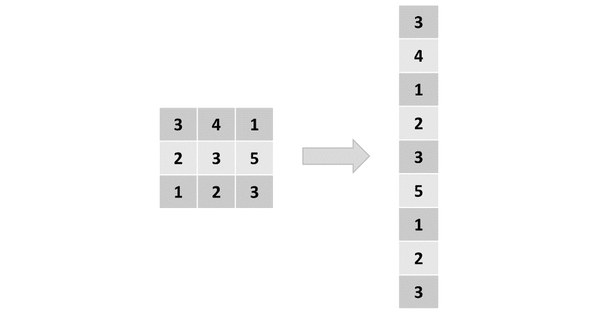
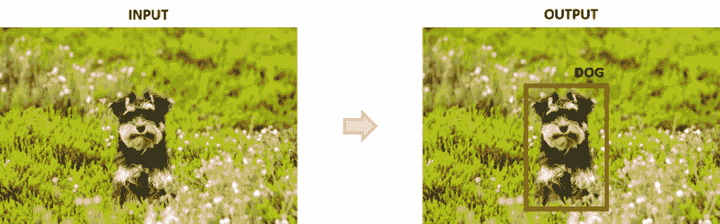
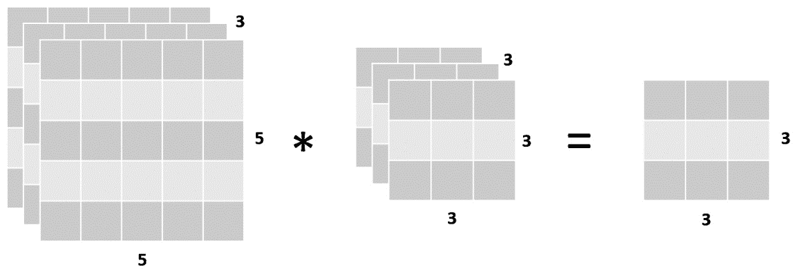
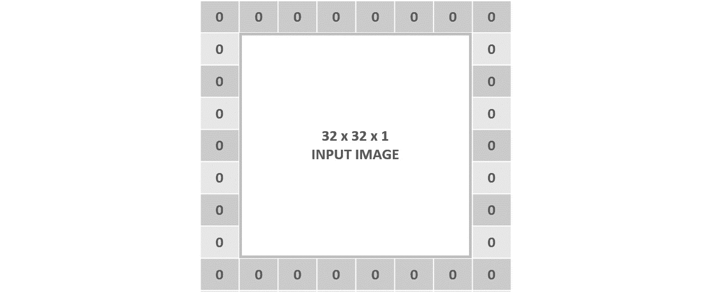
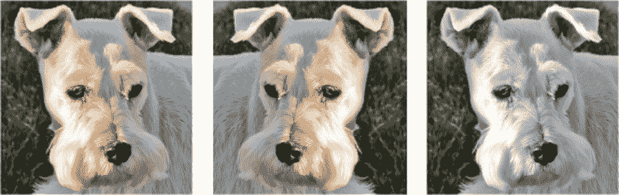
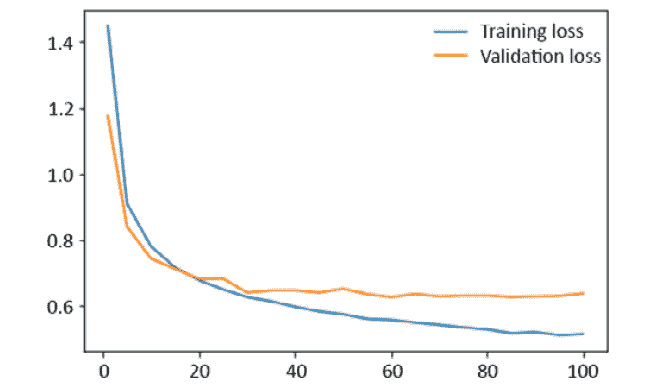
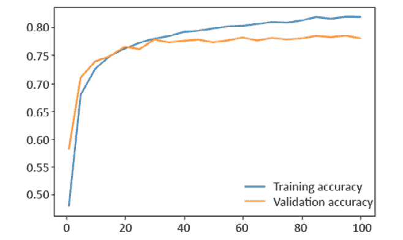

# 四、卷积神经网络

### 概述

本章介绍了训练**卷积神经网络**（**CNN**）的过程-也就是说，发生在不同层的计算通常可以在 CNN 架构中找到，其目的可在训练过程中发现。 您将学习如何通过对模型应用数据扩充和批量规范化来改善计算机视觉模型的表现。 到本章末，您将能够使用 CNN 通过 PyTorch 解决图像分类问题。 这将是在计算机视觉领域实现其他解决方案的起点。

# 简介

在上一章中，解释了最传统的神经网络架构并将其应用于现实生活中的数据问题。 在本章中，我们将探讨 CNN 的不同概念，这些概念主要用于解决计算机视觉问题（即图像处理）。

即使当今所有神经网络领域都很流行，但 CNN 可能是所有神经网络架构中最流行的。 这主要是因为，尽管它们在许多领域中都可以使用，但是它们尤其擅长处理图像，并且技术的进步已使大量图像的收集和存储成为可能，从而可以解决当今使用图像处理各种挑战。 图像作为输入数据。

从图像分类到物体检测，CNN 被用于诊断癌症患者和检测系统中的欺诈行为，以及用于构建将彻底改变未来的深思熟虑的自动驾驶汽车。

本章将重点介绍在处理图像时 CNN 优于其他架构的原因，并更详细地说明其架构的组成部分。 它将涵盖用于构建 CNN 来解决图像分类数据问题的主要编码结构。

此外，我们将探讨数据扩充和批量规范化的概念，这些概念将用于改善模型的表现。 本章的最终目标是比较三种不同方法的结果，以便使用 CNN 解决图像分类问题。

注意

[本章中提供的所有代码都可以在以下位置找到](https://packt.live/3bg0KKP)。

# 构建 CNN

CNN 是处理图像数据问题时的理想架构。 但是，由于它们通常用于图像分类任务，因此即使它们的功能扩展到图像处理领域的其他领域，它们也常常未被充分利用。 本章不仅将说明 CNN 为何如此擅长理解图像的原因，还将识别可以解决的不同任务，并提供一些实际应用的示例。

此外，本章还将探讨 CNN 的不同构建块及其在 PyTorch 中的应用，以最终构建一个使用 PyTorch 的数据集进行图像分类来解决数据问题的模型。

## 为什么将 CNN 用于图像处理？

图像是像素矩阵，那么为什么不将矩阵展平为向量并使用传统的神经网络架构对其进行处理呢？ 答案是，即使使用最简单的图像，也存在一些像素相关性会改变图像的含义。 例如，猫眼，汽车轮胎甚至物体边缘的表示都是由以某种方式布置的几个像素构成的。 如果我们将图像展平，则这些依赖关系将丢失，传统模型的准确率也会丢失：



图 4.1：展平矩阵的表示

CNN 能够捕获图像的空间相关性，因为它根据过滤器的大小将它们作为矩阵进行处理并一次分析整个图像块。 例如，使用大小为`3 x 3`的过滤器的卷积层将一次分析 9 个像素，直到它覆盖了整个图像。

图像的每个块都具有一组参数（权重和偏差），这些参数将取决于该组像素与整个图像的相关性，具体取决于手边的过滤器。 这意味着垂直边缘过滤器将为包含垂直边缘的图像块分配更大的权重。 据此，通过减少参数数量并通过分块分析图像，CNN 可以呈现更好的图像表示形式。

## 作为输入的图像

如前所述，CNN 的典型输入是矩阵形式的图像。 矩阵的每个值代表图像中的一个像素，其中的数字由颜色的强度决定，其范围为 0 到 255。

在灰度图像中，白色像素用数字 255 表示，黑色像素用数字 0 表示。灰色像素是介于两者之间的任何数字，具体取决于颜色的强度。 灰色越浅，数字越接近 255。

彩色图像通常使用 RGB 系统表示，该系统将每种颜色表示为红色，绿色和蓝色的组合。 在这里，每个像素将具有三个尺寸，每种颜色一个。 每个维度中的值的范围从 0 到 255。这里，颜色越深，数字越接近 255。

根据上一段，给定图像的矩阵是三维的。 这里，第一维是指图像的高度（以像素数为单位），第二维是指图像的宽度（以像素数为单位），而第三维是指通道，是指图像的配色方案。

彩色图像的通道数为三个（RGB 系统中每种颜色一个通道）。 另一方面，灰度图像只有一个通道：


图 4.2：图像的矩阵表示–左侧是彩色图像； 右边是灰度图像

与文本数据相比，馈入 CNN 的图像不需要太多预处理。 图像通常按原样提供，最常见的更改如下：

*   标准化像素值来加快学习过程并提高性能
*   缩小图像（即减小其宽度和长度）以加快学习过程

归一化输入的最简单方法是取每个像素的值并将其除以 255，这样我们最终得到的值介于 0 到 1 之间。但是，使用了不同的方法来归一化图像，例如均值中心技术 。 在大多数情况下，选择一个或另一个的决定是一个优先事项。 但是，在使用预训练模型时，强烈建议您使用与第一次训练模型相同的技术。 该信息通常在预训练模型的文档中可用。

## CNN 的应用

尽管 CNN 主要用于解决计算机视觉问题，但重要的是要提及它们解决其他学习问题的能力，主要是在分析数据序列方面。 例如，已知 CNN 在文本，音频和视频的序列上表现良好，有时与其他网络架构结合使用，或者通过将序列转换为可以由 CNN 处理的图像。 使用带有数据序列的 CNN 可以解决的一些特定数据问题包括文本的机器翻译，自然语言处理和视频帧标记等。

CNN 可以执行不同的任务，这些任务适用于所有监督学习问题。 但是，本章将重点介绍计算机视觉。 以下是对每个任务的简要说明，以及每个任务的真实示例。

### 分类

这是计算机视觉中最常见的任务。 主要思想是将图像的一般内容分类为一组类别，称为标签。

例如，分类可以确定图像是狗，猫还是任何其他动物的。 通过输出图像属于每个类别的概率来完成此分类，如下图所示：


图 4.3：分类任务

### 定位

定位的主要目的是生成一个边界框，以描述对象在图像中的位置。 输出由一个类标签和一个边界框组成。

此任务可用于传感器中，以确定对象在屏幕的左侧还是右侧：



图 4.4：定位任务

### 检测

该任务包括对图像中的所有对象执行对象定位。 输出由多个边界框以及多个类标签（每个框一个）组成。

此任务用于自动驾驶汽车的构造，目的是能够找到交通标志，道路，其他汽车，行人和其他与确保安全驾驶体验有关的其他物体：


图 4.5：检测任务

### 分割

这里的任务是输出图像中存在的每个对象的类标签和轮廓。 这主要用于标记图像的重要对象以进行进一步分析。

例如，该任务可用于严格划定对应于患者肺部图像中肿瘤的区域。 下图描述了如何概述感兴趣的对象并为其分配标签：


图 4.6：分割任务

从本节开始，本章将重点介绍训练模型以使用 PyTorch 的图像数据集之一进行图像分类。

## CNN 的基础

深度卷积网络是一种将图像作为输入并通过一系列**卷积层**和过滤器，**池化层**和**全连接层**（FC）的网络，以最终应用 **softmax** 激活函数，该函数将图像分类为类标签。 与 ANN 一样，这种分类形式是通过为图像赋予每个类别标签一个介于 0 和 1 之间的值来计算属于每个类别标签的图像的概率来执行的。 具有较高概率的类别标签被选择为该图像的最终预测。

以下是对每个层的详细说明，以及如何在 PyTorch 中定义此类层的代码示例。

### 卷积层

这是从图像中提取特征的第一步。 目的是通过学习图像一小部分的特征来保持附近像素之间的关系。

数学运算在该层中进行，其中给出两个输入（图像和过滤器），并获得一个输出。 如前所述，该操作包括对过滤器和与过滤器大小相同的图像部分进行卷积。 对图像的所有子部分重复此操作。

注意

再次访问 “第 2 章”，“神经网络 CNN 的简介”部分，以提醒您在输入和过滤器之间执行的确切计算。

所得矩阵的形状取决于输入的形状，其中包含大小为[`h`x`w`x`c`的图像矩阵） 大小（`f`hx`f`wx`c`）的大小将根据以下公式输出：


图 4.7：卷积层的输出高度，宽度和深度

此处，`h`表示输入图像的高度，`w`表示宽度，`c`表示深度（也称为通道），`fh`和`fw`是用户关于过滤器尺寸设置的值。

下图以矩阵形式描述了此尺寸转换，其中左侧的矩阵表示彩色图像，中间的矩阵表示将应用于图像所有通道的单个过滤器，而矩阵将应用于矩阵。 右边是图像和过滤器计算的输出：



图 4.8：输入，过滤器和输出的尺寸

重要的是要提到，在单个卷积层中，可以将多个过滤器应用于相同的图像，所有过滤器都具有相同的形状。 考虑到这一点，将两个过滤器应用于其输入的卷积层的输出形状就其深度而言等于两个，如下图所示：


图 4.9：带两个过滤器的卷积层

这些过滤器中的每一个将执行不同的操作，以发现图像的不同特征。 例如，在具有两个过滤器的单个卷积层中，这些操作可以是垂直边缘检测和水平边缘检测。 随着网络在层数方面的增长，过滤器将执行更复杂的操作，这些操作将利用先前检测到的特征（例如，通过使用边缘检测器的输入来检测人的轮廓）。

过滤器通常每层增加。 这意味着，尽管第一卷积层具有 8 个过滤器，但通常会创建第二个卷积层，使其具有两倍的数量（16），第三层使它具有两倍的数量（32），依此类推 。

但是，必须指出的是，在 PyTorch 中，就像在许多其他框架中一样，您应该仅定义要使用的过滤器数量，而不是过滤器的类型（例如，垂直边缘检测器）。 每种过滤器配置（用于检测特定特征的所包含的数量）都是系统变量的一部分。

将向卷积层主题介绍两个附加概念，如下所示。

**填充**

顾名思义，填充参数将图像填充为零。 这意味着它将在图像的每一侧添加其他像素（用零填充）。

下图显示了一个示例，该示例已在每侧用一个图像填充：



图 4.10：用一个图填充一个输入图像的图形表示

一旦输入矩阵通过过滤器，就可以用来保持其形状。 这是因为，尤其是在前几层中，目标应该是从原始输入中保留尽可能多的信息，以便从中提取最多的特征。

为了更好地理解填充的概念，请考虑以下情形。

将`3 x 3`过滤器应用于形状为`32 x 32 x 3`的彩色图像将得到形状为`30 x 30 x 1`的矩阵。这意味着下一层的输入已缩小。 但是，通过向输入图像添加 1 的填充，输入的形状将更改为`34 x 34 x 3`，这将导致使用相同过滤器的输出为`32 x 32 x 1`。

使用填充时，以下公式可用于计算输出宽度：


图 4.11：使用填充应用卷积层后的输出宽度

在此，`W`表示输入矩阵的宽度，`F`表示过滤器的宽度，`P`表示填充。 可以使用相同的公式来计算输出的高度。

要获得形状与输入相等的输出矩阵，请使用以下公式计算填充的值（考虑到我们将在下一节中定义的步幅等于 1）：


图 4.12：填充数字以获得形状与输入相等的输出矩阵

请记住，输出通道（深度）的数量将始终等于已应用于输入的过滤器的数量。

**步幅**

此参数是指过滤器将在水平和垂直方向上在输入矩阵上移动的像素数。 到目前为止，我们已经看到过滤器通过图像的左上角，然后向右移一个像素，依此类推，直到它垂直和水平通过图像的所有部分为止。 此示例是步幅等于 1 的卷积层之一，这是此参数的默认配置。

当步幅等于 2 时，移位将改为两个像素，如下图所示：


图 4.13：跨度为 2 的卷积层的图形表示

可以看出，初始操作发生在左上角。 然后，通过向右移动两个像素，第二个计算将在右上角进行。 接下来，计算向下移动两个像素以在左下角执行计算，最后，通过再次向右移动两个像素，最终的计算将在右下角进行。

注意

“图 4.12”中的数字是构成的，不是实际的计算。 重点应放在方框上，这些方框说明步幅等于 2 时的移动过程。

使用步幅时，以下方程式可用于计算输出宽度：


图 4.14：使用步幅的卷积层的输出宽度

在此，`W`表示输入矩阵的宽度，`F`表示过滤器的宽度，`S`表示步幅。 可以使用相同的公式来计算输出的高度。

引入这些参数后，用于计算从卷积层得出的矩阵的输出形状（宽度和高度）的最终方程式如下：


图 4.15：使用填充和跨度的卷积层后的输出宽度

每当值是**浮点型**时，都应四舍五入。 这基本上意味着输入的某些区域将被忽略，并且不会从中提取任何特征。

最后，一旦输入已通过所有过滤器，则将输出馈送到激活函数以破坏线性，这类似于传统神经网络的过程。 尽管在此步骤中可以应用多种激活函数，但是首选函数是 ReLU 函数，因为它在 CNN 中显示了出色的效果。 我们在此处获得的输出将成为后续层（通常是池化层）的输入。

## 练习 4.01：计算卷积层的输出形状

使用给定的方程式，请考虑以下情形并计算输出矩阵的形状：

注意

此练习不需要编码，而是由基于我们前面提到的概念的计算组成。

1.  计算从卷积层派生的矩阵的输出形状，该卷积层的输入形状为`64 x 64 x 3`，过滤器形状为`3 x 3 x 3`：

    ```py
    Output height = 64 -3 + 1 = 62
    Output width = 64 - 3 + 1 = 62
    Output depth = 1
    ```

2.  计算从卷积层派生的矩阵的输出形状，该卷积层的输入形状为`32 x 32 x 3`，10 个形状为`5 x 5 x 3`的过滤器，填充为 2：

    ```py
    Output height = 32 - 5 + (2 * 2) + 1 = 32
    Output width = 32-5 + (2 * 2) + 1 = 32
    Output depth = 10
    ```

3.  计算从卷积层派生的矩阵的输出形状，该卷积层的输入形状为`128 x 128 x 1`，五个形状为`5 x 5 x 1`的过滤器，步幅为 3：

    ```py
    Output height = (128 - 5)/ 3 + 1 = 42
    Output width = (128 - 5)/ 3 + 1 = 42
    Output depth = 5
    ```

4.  计算从卷积层派生的矩阵的输出形状，该卷积层的输入形状为`64 x 64 x 1`，形状为`8 x 8 x 1`的过滤器，填充为 3，步幅为 3：

    ```py
    Output height = ((64 - 8 + (2 * 3)) / 3) +1 = 21.6 ≈ 21
    Output width = ((64 - 8 + (2 * 3)) / 3) +1 = 21.6 ≈ 21
    Output depth = 1
    ```

这样，您就成功地计算了从卷积层得出的矩阵的输出形状。

在 PyTorch 中编码卷积层非常简单。 使用自定义模块，只需要创建**网络**类。 该类应包含定义网络架构（即网络层）的`__init__`方法和定义要对信息进行计算的`forward`方法。 穿过层，如以下代码片段所示：

```py
import torch.nn as nn
import torch.nn.functional as F
class CNN_network(nn.Module):
    def __init__(self):
        super(CNN_network, self).__init__()
        self.conv1 = nn.Conv2d(3, 18, 3, 1, 1)
    def forward(self, x):
        x = F.relu(self.conv1(x))
        return x
```

在定义卷积层时，从左到右传递的参数是指输入通道，输出通道（过滤器数量），核大小（过滤器大小），步幅和填充。

前面的示例由一个卷积层组成，该卷积层具有三个输入通道，18 个过滤器，每个过滤器的大小为 3，步幅和填充等于 1。

等效于上一个示例的另一种有效方法是将自定义模块的语法与**顺序**容器的使用结合起来，如以下代码片段所示：

```py
import torch.nn as nn
class CNN_network(nn.Module):
    def __init__(self):
        super(CNN_network, self).__init__()
        self.conv1 = nn.Sequential(nn.Conv2d(3, 18, 3, 1, 1), \
                                   nn.ReLU())
    def forward(self, x):
        x = self.conv1(x)
        return x
```

在这里，层的定义发生在**顺序**容器内部。 通常，一个容器包括卷积层，激活函数和池化层。 一组新的层包含在其下面的不同容器中。

在前面的示例中，在**顺序**容器内定义了卷积层和激活层。 因此，在`forward`方法中，不需要卷积层的输出通过激活函数，因为已经使用容器对其进行了处理。

### 池化层

按照惯例，池化层是特征选择步骤的最后部分，这就是为什么池化层通常可以在卷积层之后找到的原因。 正如我们在前几章中所解释的那样，其思想是从图像的各个子部分中提取最相关的信息。 池化层的大小通常为 2，步幅等于其大小。

池化层通常将输入的高度和宽度减小一半。 考虑到要使卷积层找到图像中的所有特征，必须使用多个过滤器，并且此操作的输出可能变得太大，这意味着要考虑许多参数，这一点很重要。 池化层旨在通过保留最相关的特征来减少网络中的参数数量。 从图像的各个子部分中选择相关特征，可以通过获取最大数量或平均该区域中的数量来进行。

对于图像分类任务，最常见的是在平均池化层上使用最大池化层。 这是因为前者在保留最相关特征的任务中表现出更好的效果，而后者已被证明在诸如平滑图像等任务中表现更好。

要计算输出矩阵的形状，请使用以下公式：


图 4.16：合并层后的输出矩阵宽度

此处，`W`表示输入的宽度，`F`表示过滤器的尺寸，`S`表示步幅。 可以使用相同的公式来计算输出高度。

输入的通道或深度保持不变，因为合并层将对图像的所有通道执行相同的操作。 这意味着池化层的结果仅会影响宽度和长度的输入。

## 练习 4.02：计算一组卷积和池化层的输出形状

以下练习将结合卷积层和池化层。 目的是确定经过一组层后的输出矩阵的大小。

注意

此练习不需要编码，而是由基于我们前面提到的概念的计算组成。

考虑以下几组层，并在所有转换结束时指定输出层的形状，并考虑`256 x 256 x 3`的输入图像：

1.  卷积层，具有 16 个大小为 3 的过滤器，步幅和填充为 1。
2.  池化层还具有大小为 2 的过滤器以及大小为 2 的步幅。
3.  卷积层，具有八个大小为 7 的过滤器，跨度为 1，填充为 3。
4.  池化层，其过滤器的大小为 2，步幅也为 2。

    经过每一层后，矩阵的输出大小如下：

1.  在第一个卷积层之后：

    ```py
    output_width/height = ((256 – 3) + 2 * 1)/1 + 1 = 256

    output_channels = 16 filters were applied

    output_matrix_size = 256 x 256 x 16
    ```

2.  在第一个池化层之后：

    ```py
    output_width/height = (256 – 2) / 2 + 1 = 128

    output_channels = 16 as pooling does not affect the number of channels

    output_matrix_size = 128 x 128 x 16
    ```

3.  在第二个卷积层之后：

    ```py
    output_width/height = ((128 – 7) + 2 =* 3)/1 + 1 = 128

    output_channels = 8 filters were applied

    output_matrix_size = 128 x 128 x 8
    ```

4.  在第二个池化层之后：

    ```py
    output_width/height = (128 – 2) / 2 + 1 = 64

    output_channels = 8 as pooling does not affect the number of channels

    output_matrix_size = 64 x 64 x 8
    ```

这样，您就成功地计算了从一系列卷积和池化层派生的矩阵的输出形状。

使用与以前相同的编码示例，以下代码片段展示了 PyTorch 定义池化层的方法：

```py
import torch.nn as nn
import torch.nn.functional as F
class CNN_network(nn.Module):
    def __init__(self):
        super(CNN_network, self).__init__()
        self.conv1 = nn.Conv2d(3, 18, 3, 1, 1)
        self.pool1 = nn.MaxPool2d(2, 2)
    def forward(self, x):
        x = F.relu(self.conv1(x))
        x = self.pool1(x)
        return x
```

可以看出，在`__init__`方法中将池化层（`MaxPool2d`）添加到网络架构中。 在这里，进入最大池化层的参数从左到右分别是过滤器（`2`）和步幅（`2`）的大小。 接下来，更新了`forward`方法，以使信息通过新的合并层。

同样，这里显示了一种同样有效的方法，其中使用了自定义模块和**顺序**容器：

```py
import torch.nn as nn
class CNN_network(nn.Module):
    def __init__(self):
        super(CNN_network, self).__init__()
        self.conv1 = nn.Sequential(nn.Conv2d(3, 18, 3, 1, 1),\
                                   nn.ReLU(),\
                                   nn.MaxPool2d(2, 2))
    def forward(self, x):
        x = self.conv1(x)
        return x
```

正如我们之前提到的，池化层还包含在激活函数下方与卷积层相同的容器中。 在新的**顺序**容器中，下面将定义一组后续层（卷积，激活和池化）。

同样，`forward`方法不再需要单独调用每个层； 而是通过容器传递信息，该容器既包含层又包含激活函数。

### 全连接层

在输入经过一组卷积和池化层之后，在网络架构的末尾定义一个或多个 FC 层。 来自第一 FC 层之前的层的输出数据从矩阵展平为向量，可以将其馈送到 FC 层（与传统神经网络的隐藏层相同）。

这些 FC 层的主要目的是考虑先前层检测到的所有特征，以便对图像进行分类。

除非是最后一层，否则不同的 FC 层会通过一个激活函数（通常是 ReLU 函数）传递，除非它是最后一层，否则它将使用 softmax 函数来输出属于每个类标签的输入的概率。

第一 FC 层的输入大小对应于前一层的平坦输出矩阵的大小。 输出大小是由用户定义的，同样，与 ANN 一样，设置此数字没有确切的科学依据。 最后一个 FC 层的输出大小应等于类标签的数量。

要在 PyTorch 中定义一组 FC 层，请考虑以下代码片段：

```py
import torch.nn as nn
import torch.nn.functional as F
class CNN_network(nn.Module):
    def __init__(self):
        super(CNN_network, self).__init__()
        
        self.conv1 = nn.Conv2d(3, 18, 3, 1, 1)
        self.pool1 = nn.MaxPool2d(2, 2)
        self.linear1 = nn.Linear(32*32*16, 64)
        self.linear2 = nn.Linear(64, 10)
    def forward(self, x):
        x = F.relu(self.conv1(x))
        x = self.pool1(x)
        x = x.view(-1, 32 * 32 *16)
        x = F.relu(self.linear1(x))
        x = F.log_softmax(self.linear2(x), dim=1)
        return x
```

使用与上一节相同的编码示例，在`__init__`方法内部，将两个 FC 层添加到网络。 接下来，在`forward`函数内部，使用`view()`函数将池化层的输出展平。 然后，它通过第一 FC 层，该层应用激活函数。 最后，数据连同其激活函数一起通过最终的 FC 层。

同样，使用与之前相同的编码示例，可以使用自定义模块和**顺序**容器将 FC 层添加到我们的模型中，如下所示：

```py
import torch.nn as nn
class CNN_network(nn.Module):
    def __init__(self):
        super(CNN_network, self).__init__()
        self.conv1 = nn.Sequential(nn.Conv2d(1, 16, 5, 1, 2,), \
                                   nn.ReLU(), \
                                   nn.MaxPool2d(2, 2))
        self.linear1 = nn.Linear(32*32*16, 64)
        self.linear2 = nn.Linear(64, 10)
    def forward(self, x):
        x = self.conv1(x)
        x = x.view(-1, 32 * 32 *16)
        x = F.relu(self.linear1(x))
        x = F.log_softmax(self.linear2(x), dim=1)
        return x
```

可以看出，**顺序**容器保持不变，并在`__init__`方法内在下面添加了两个 FC 层。 接下来，`forward`函数将信息传递通过整个容器，然后将输出平坦化以通过 FC 层。

一旦定义了网络的架构，就可以按照与 ANN 相同的方式来处理训练网络的以下步骤。

## 旁注–从 PyTorch 下载数据集

要从 PyTorch 加载数据集，请使用以下代码。 除了下载数据集之外，以下代码还显示了如何通过批量加载而不是一次加载图像来使用数据加载器来节省资源：

```py
from torchvision import datasets
import torchvision.transforms as transforms
transform = \
transforms.Compose([transforms.ToTensor(), \
                    transforms.Normalize((0.5, 0.5, 0.5), \
                                         (0.5, 0.5, 0.5))])
```

`transforms`变量用于定义要在数据集上执行的一组转换。 在这种情况下，数据集将被转换为张量并在其所有维度上进行规范化。

```py
train_data = datasets.MNIST(root='data', train=True,\
                            download=True, transform=transform)
test_data = datasets.MNIST(root='data', train=False,\
                           download=True, transform=transform)
```

在前面的代码中，要下载的数据集是 MNIST。 这是一个流行的数据集，其中包含从零到九的手写灰度数字图像。 PyTorch 数据集提供训练和测试集。

从前面的代码片段可以看出，要下载数据集，有必要定义数据的根，默认情况下应将其定义为`data`。 接下来，定义您是要下载训练还是测试数据集。 我们将`download`参数设置为`True`。 最后，我们使用之前定义的`transform`变量对数据集执行转换：

```py
dev_size = 0.2
idx = list(range(len(train_data)))
np.random.shuffle(idx)
split_size = int(np.floor(dev_size * len(train_data)))
train_idx, dev_idx = idx[split_size:], idx[:split_size]
```

考虑到我们需要第三组数据（验证组），前面的代码段用于将训练组划分为两组。 首先，定义验证集的大小，然后定义将用于每个数据集的索引列表（训练和验证集）：

```py
train_sampler = SubsetRandomSampler(train_idx)
dev_sampler = SubsetRandomSampler(dev_idx)
```

在前面的代码段中，PyTorch 的`SubsetRandomSampler()`函数用于通过随机采样索引将原始训练集分为训练集和验证集。 在接下来的步骤中将使用它来生成将在每次迭代中馈送到模型中的批量：

```py
batch_size = 20
train_loader = torch.utils.data.DataLoader(train_data, \
                                           batch_size=batch_size, \
                                           sampler=train_sampler)
dev_loader = torch.utils.data.DataLoader(train_data, \
                                         batch_size=batch_size, \
                                         sampler=dev_sampler)
test_loader = torch.utils.data.DataLoader(test_data, \
                                          batch_size=batch_size)
```

`DataLoader()`函数用于为每组数据批量加载图像。 首先，将包含集合的变量作为参数传递，然后定义批量大小。 最后，我们在上一步中创建的采样器用于确保随机创建每次迭代中使用的批量，这有助于提高模型的表现。 此函数的结果变量（`train_loader`，`dev_loader`和`test_loader`）将分别包含特征部分和目标的值。

注意

问题越复杂，网络越深，训练模型所需的时间就越长。 考虑到这一点，本章中的活动可能比上一章中的活动花费更长的时间。

## 活动 4.01：针对图像分类问题构建 CNN

在此活动中，将在来自 PyTorch 的图像数据集上训练 CNN（也就是说，框架提供了数据集）。 要使用的数据集是 CIFAR10，其中包含总共 60,000 张车辆和动物的图像。 有 10 个不同的类标签（例如“飞机”，“鸟”，“汽车”，“猫”等）。 训练集包含 50,000 张图像，而测试集包含剩余的 10,000 张图像。

注意

要进一步探索该数据集，[请访问以下 URL](https://www.cs.toronto.edu/~kriz/cifar.html)。

让我们看一下我们的场景。 您在一家人工智能公司工作，该公司根据客户需求开发定制模型。 您的团队当前正在创建一个模型，该模型可以区分车辆的图像和动物的图像，更具体地说，可以识别不同种类的动物和不同类型的车辆。 他们为您提供了包含 60,000 张图像的数据集以构建模型。

注意

本章中的活动可能需要很长时间才能在常规计算机（CPU）上进行训练。 为了在 GPU 上运行代码，本书的 GitHub 存储库中的每个活动都有一个等效文件。

1.  导入所需的库。
2.  设置要对数据执行的转换，这将是数据到张量的转换以及像素值的归一化。
3.  设置批量为 100 张图像，并从 **CIFAR10** 数据集下载训练和测试数据。
4.  使用 20% 的验证大小，定义将用于将数据集分为这两组的训练和验证采样器。
5.  使用`DataLoader()`函数定义用于每组数据的批量。
6.  定义您的网络架构。 使用以下信息来这样做：

    Conv1：卷积层，将彩色图像作为输入，并将其通过大小为 3 的 10 个过滤器。应将 padding 和 stride 都设置为 1。

    Conv2：一个卷积层，它将输入数据通过大小为 3 的 20 个过滤器传递。填充和跨距都应设置为 1。

    Conv3：一个卷积层，它将输入数据通过大小为 3 的 40 个过滤器传递。填充和跨距都应设置为 1。

    在每个卷积层之后使用 ReLU 激活函数。

    每个卷积层之后的池化层，过滤器大小和跨度为 2。

    展平图像后，滤除项设置为 20%。

    Linear1：一个全连接层，接收上一层的展平矩阵作为输入，并生成 100 个单元的输出。 为此层使用 ReLU 激活函数。 此处，丢弃期限设置为 20%。

    Linear2：一个全连接层，可生成 10 个输出，每个类标签一个。 将`log_softmax`激活函数用于输出层。

7.  定义训练模型所需的所有参数。 将周期数设置为 50。
8.  训练您的网络，并确保保存训练和验证集的损失和准确率值。
9.  绘制两组的损失和准确率。
0.  在测试集上检查模型的准确率--它应该在 72% 左右。

    注意

    有关此活动的解决方案，请参见第 262 页。

    由于数据在每个周期都经过重新排序，因此结果将无法完全重现。 但是，您应该能够获得与本书所获得的结果相似的结果。

    这段代码可能需要一些时间才能运行，这就是为什么在本书的 GitHub 存储库中提供了等效的 GPU 版本解决方案的原因。

# 数据扩充

学习如何有效地编码神经网络是开发表现良好的解决方案所涉及的步骤之一。 此外，要开发出色的深度学习解决方案，至关重要的是找到一个感兴趣的领域，我们可以在其中提供解决当前挑战的解决方案。 但是一旦完成所有这些操作，我们通常会面临相同的问题：通过自收集或通过从互联网和其他可用来源下载来获得适当大小的数据集以从模型中获得良好的表现。

您可能会想到，即使现在可以收集和存储大量数据，但由于与之相关的成本，这并不是一件容易的事。 因此，在大多数情况下，我们只能处理包含数万个条目的数据集，而在引用图像时甚至更少。

在开发计算机视觉问题的解决方案时，这成为一个相关问题，主要是由于两个原因：

*   数据集越大，结果越好，并且更大的数据集对于获得足够好的模型至关重要。 考虑到训练模型是调整一堆参数的问题，以便能够映射输入和输出之间的关系，这是正确的。 这是通过最小化损失函数以使预测值尽可能接近基本事实来实现的。 在此，模型越复杂，所需的参数就越多。

    考虑到这一点，有必要向模型提供大量示例，以便能够找到这样的模式，其中训练示例的数量应与要调整的参数的数量成比例。

*   计算机视觉问题中的最大挑战之一是使模型在图像的多种变体上都能表现良好。 这意味着图像不需要按照特定的对齐方式进行送入，也不必具有设定的质量，而是可以以其原始格式（包括不同的位置，角度，光照和其他变形）进行送入。 因此，有必要找到一种以这种变化提供模型的方法。

因此，设计了数据扩充技术。 简而言之，这是通过稍微修改现有示例来增加训练示例数量的一种措施。 例如，您可以复制当前可用的实例，并向这些重复项添加一些噪音以确保它们不完全相同。

在计算机视觉问题中，这意味着通过更改现有图像来增加训练数据集中的图像数量，这可以通过稍微更改当前图像以创建略有不同的重复版本来完成。

对图像的这些较小调整可以采取以下形式：轻微旋转，更改对象在帧中的位置，水平或垂直翻转，不同的配色方案以及变形等。 由于 CNN 将这些图像中的每一个视为不同图像，因此该技术行之有效。

例如，下图显示了一条狗的三幅图像，它们在人眼中是具有某些变化的同一幅图像，而在神经网络中却是完全不同的：



图 4.17：增强图像

能够识别图像中的物体而不管变化的 CNN 具有不变性。 实际上，CNN 对于每种类型的变化都可以是不变的。

## PyTorch 数据扩充

使用`Torchvision`包在 PyTorch 中执行数据扩充非常容易。 该包除了包含流行的数据集和模型架构之外，还包含可以在数据集上执行的常见图像转换函数。

注意

在本节中，将提到其中一些图像转换。 要获取所有可能的转换的完整列表，请访问[这里](https://pytorch.org/docs/stable/torchvision/transforms.html)。

与在上一活动中使用的过程一样，将数据集归一化并将其转换为张量，执行数据扩充需要我们定义所需的转换，然后将其应用于数据集，如以下代码片段所示：

```py
transform = transforms.Compose([\
            transforms.HorizontalFlip(probability_goes_here),\
            transforms.RandomGrayscale(probability_goes_here),\
            transforms.ToTensor(),\
            transforms.Normalize((0.5, 0.5, 0.5), \
                                 (0.5, 0.5, 0.5))])
train_data = datasets.CIFAR10('data', train=True, \
                              download=True, transform=transform)
test_data = datasets.CIFAR10('data', train=False, \
                             download=True, transform=transform)
```

在这里，使用`Horizo​​ntalFlip`函数，将要下载的数据将进行水平翻转（考虑用户设置的概率值，并确定将进行此变换的图像的百分比）。 通过使用`RandomGrayscale`函数，图像将被转换为灰度（还考虑了概率）。 然后，将数据转换为张量并进行规范化。

考虑到模型是在迭代过程中进行训练的，其中多次输入训练数据，因此这些转换可确保第二次遍历数据集不会将完全相同的图像馈入模型。

此外，可以为不同的集合设置不同的变换。 这很有用，因为数据扩充的目的是增加训练示例的数量，但是用于测试模型的图像应基本保持不变。 但是，应该调整测试集的大小，以便将大小相等的图像输入模型。

这可以通过以下方式完成：

```py
transform = {"train": \
transforms.Compose([transforms.RandomHorizontalFlip\
                    (probability_goes_here),\
                    transforms.RandomGrayscale\
                    (probability_goes_here),\
                    transforms.ToTensor(),\
                    transforms.Normalize\
                    ((0.5, 0.5, 0.5), (0.5, 0.5, 0.5))]), \
                    "test": transforms.Compose([transforms.ToTensor(),\
                                                transforms.Normalize\
                                                ((0.5, 0.5, 0.5), \
                                                 (0.5, 0.5, 0.5)),\
                    transforms.Resize(size_goes_here)])}
train_data = datasets.CIFAR10('data', train=True, download=True, \
             transform=transform["train"])
test_data = datasets.CIFAR10('data', train=False, download=True, \
            transform=transform["test"]
```

如我们所见，定义了一个字典，其中包含用于训练和测试集的一组转换。 然后，可以调用字典以将转换相应地应用于每个集合。

## 活动 4.02：图像数据扩充

在此活动中，数据扩充将引入到我们在上一个活动中创建的模型中，以测试其准确率是否可以提高。 让我们看一下以下情况。

您创建的模型不错，但是其准确率达不到期望的水平。 您被要求考虑一种可以改善模型表现的方法。 请按照以下步骤完成此活动：

1.  复制上一个活动中的笔记本。
2.  修改`transform`变量的定义，使其除了将数据归一化并转换为张量外，还包括以下转换：

    对于训练/验证集，`RandomHorizo​​ntalFlip`函数的概率为 50%（0.5），`RandomGrayscale`函数的概率为 10%（0.1）。

    对于测试集，请勿添加任何其他转换。

3.  训练模型 100 个周期。由此得到的训练集和验证集的损失和准确率图应与这里所示的相似。

    

    图 4.18：结果图显示集合的损失

    

    图 4.19：结果图显示了集合的准确率

    注意

    由于每个周期的数据打乱，结果将无法精确再现。 但是，您应该能够得到类似的结果。

4.  计算测试集上所得模型的准确率。

预期输出：模型在测试集上的表现应为 75% 左右。

注意

此活动的解决方案可以在第 272 页上找到。

这段代码可能需要一些时间才能运行，这就是为什么在本书的 GitHub 存储库中提供了等效的 GPU 版本解决方案的原因。

# 批量归一化

通常会标准化输入层，以尝试加快学习速度，并通过将所有特征重新缩放为相同比例来提高性能。 因此，问题是，如果模型受益于输入层的归一化，为什么不对所有隐藏层的输出进行归一化以进一步提高训练速度呢？

**批量归一化**顾名思义，是对隐藏层的输出进行归一化，以便减小每个层的方差，也称为协方差平移。 协方差偏移的这种减小是有用的，因为它使模型也可以在遵循与用于训练它的图像不同的分布的图像上很好地工作。

例如，以检测动物是否为猫为目的的网络为例。 当仅使用黑猫的图像训练网络时，批量归一化可以通过对数据进行归一化来帮助网络对不同颜色的猫的新图像进行分类，以便黑猫和彩色猫的图像都遵循相似的分布。 下图表示了这样的问题：


图 4.20：猫分类器-即使仅使用黑猫训练后，模型也可以识别有色猫

此外，批量归一化为模型的训练过程带来了以下好处，最终可以帮助您获得表现更好的模型：

*   它允许设置更高的学习率，因为批量归一化有助于确保任何输出都不是太高或太低。 更高的学习率等同于更快的学习时间。
*   它有助于减少过拟合，因为它具有正则化效应。这使得可以将丢弃概率设置为一个较低的值，这意味着在每个前向通道中忽略的信息较少。

    注意

    我们不应该主要依靠批量归一化来处理过拟合。

如前几节所述，通过减去批量平均值并除以批量标准差，可以对隐藏层的输出进行归一化。

此外，通常在卷积层以及 FC 层（不包括输出层）上执行批归一化。

## PyTorch 批量归一化

在 PyTorch 中，考虑到有两种不同的类型，添加批归一化就像向网络架构添加新层一样简单，如下所述：

*   `BatchNorm1d`：此层用于在二维或三维输入上实现批量标准化。 它从上一层接收输出节点的数量作为参数。 这通常在 FC 层上使用。
*   `BatchNorm2d`：这将批量归一化应用于四维输入。 同样，它采用的参数是上一层输出节点的数量。 它通常在卷积层上使用，这意味着它接受的参数应等于上一层的通道数。

据此，在 CNN 中批量标准化的实现如下：

```py
class CNN(nn.Module):
    def __init__(self):
        super(CNN, self).__init__()
        self.conv1 = nn.Conv2d(3, 16, 3, 1, 1)
        self.norm1 = nn.BatchNorm2d(16)
        self.pool = nn.MaxPool2d(2, 2)
        self.linear1 = nn.Linear(16 * 16 * 16, 100)
        self.norm2 = nn.BatchNorm1d(100)
        self.linear2 = nn.Linear(100, 10)
    def forward(self, x):
        x = self.pool(self.norm1(F.relu(self.conv1(x))))
        x = x.view(-1, 16 * 16 * 16)
        x = self.norm2(F.relu(self.linear1(x)))
        x = F.log_softmax(self.linear2(x), dim=1)
        return x
```

如我们所见，批量规范化层的初始定义与`__init__`方法内的其他任何层类似。 接下来，在`forward`方法内的激活函数之后，将每个批量归一化层应用于其对应层的输出。

## 活动 4.03：实现批量归一化

对于此活动，我们将在前一个活动的架构上实现批量归一化，以查看是否有可能进一步提高测试集上模型的表现。 让我们看一下以下情况。

您在表现方面所做的最后改进使您的队友印象深刻，现在他们对您的期望更高。 他们要求您最后一次尝试改进模型，以使准确率提高到 80%。 请按照以下步骤完成此活动：

1.  复制上一个活动中的笔记本。
2.  将批量归一化添加到每个卷积层以及第一个 FC 层。
3.  训练模型 100 个周期。由此得到的训练集和验证集的损失和准确率图应该与这里的图相似。

    

    图 4.21：结果图显示了集合的损失

    

    图 4.22：结果图显示了集合的损失

4.  计算结果模型在测试集上的准确率--它应该是 78% 左右。

    注意

    此活动的解决方案可以在第 274 页上找到。

    由于在每个周期对数据进行混洗，结果将无法完全重现。 但是，您应该能够获得与本书所获得的结果相似的结果。

    这段代码可能需要一些时间才能运行，这就是为什么在本书的 GitHub 存储库中提供了等效的 GPU 版本解决方案的原因。

# 总结

本章重点介绍 CNN，它由一种在计算机视觉问题上表现出色的神经网络架构组成。 我们首先说明了为何广泛使用 CNN 来处理图像数据集的主要原因，并介绍了可以通过使用它们解决的不同任务。

本章通过解释卷积层，池化层以及最后的 FC 层的性质，说明了网络架构的不同构建块。 在每个部分中，都包括对每个层目的的解释，以及可用于有效编码 PyTorch 中的架构的代码段。

这导致引入了图像分类问题，该问题着重于对车辆和动物的图像进行分类。 这个问题的目的是将 CNN 的不同构建块付诸实践，以解决图像分类数据问题。

接下来，数据扩充被引入为一种工具，它通过增加训练示例的数量来提高网络表现，而无需收集更多图像。 该技术专注于创建现有图像的变体，以创建要馈送到模型的“新”图像。

通过实现数据扩充，本章的第二个活动旨在解决相同的图像分类问题，目的是比较结果。

最后，本章介绍了批量规范化的概念。 这包括标准化每个隐藏层的输出，以加快学习速度。 在解释了在 PyTorch 中应用批量归一化的过程之后，本章的最后一个活动旨在使用批量归一化解决相同的图像分类问题。

既然 CNN 的概念已经很清楚并且已经应用​​于解决计算机视觉问题，那么在下一章中，我们将探索 CNN 更加复杂的应用来创建图像，而不仅仅是对其进行分类。