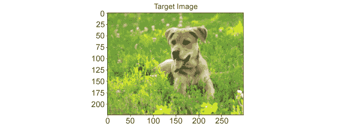

# 5.样式迁移

总览

本章介绍了使用预训练的模型来创建或利用性能良好的算法而不必收集大量数据的过程。 在本章中，您将学习如何从 PyTorch 加载预训练的模型以创建样式转换模型。 到本章末，您将能够通过使用预训练的模型来执行样式转换。

# 简介

上一章介绍了传统 CNN 的不同构建块，以及一些改进其性能并减少训练时间的技术。 此处说明的架构虽然很典型，但并不是一成不变的，并且出现了许多 CNN 架构来解决不同的数据问题，这在计算机视觉领域最为普遍。

这些架构的配置和学习任务各不相同。 如今，由牛津机器人学院的 Karen Simonyan 和 Andrew Zisserman 创建的**视觉几何组**（**VGG**）架构是一种非常流行的方法。 它是为对象识别而开发的，并由于网络所依赖的大量参数而达到了最先进的性能。 它在数据科学家中受欢迎的主要原因之一是训练后的模型的参数（权重和偏差）的可用性，这使研究人员无需训练即可使用它，并且模型具有出色的性能。

在本章中，我们将使用这种经过预训练的模型来解决计算机视觉问题，该问题由于专门用于共享图像的社交媒体渠道的普及而特别著名。 它包括执行样式转换，以便使用一个图像的样式（颜色和纹理）以及另一个图像的内容（形状和对象）创建新图像。

每天对常规图像应用滤镜以提高其质量和吸引力，同时在社交媒体个人资料上发布时，每天执行数百万次此任务。 尽管这看起来很简单，但本章将解释这些图像编辑应用幕后发生的魔术。

注意

[本章中提供的所有代码都可以在以下位置找到](https://packt.live/2yiR97z)。

# 样式迁移

简而言之，样式迁移包括修改图像的样式，同时又保留其内容。 一个示例是拍摄动物的图像，然后将样式转换为类似莫奈的绘画，如下图所示：


图 5.1：样式转换输入和输出–本章最后练习的结果

注意

可以在 [GitHub](https://packt.live/2XEykpL) 上找到此图像。

根据前面的图像，模型有两个输入：内容图像和样式图像。 内容是指图像的对象，而样式是指颜色和纹理。 结果，模型的输出应该是包含内容图像中的对象和样式图像的艺术外观的图像。

## 它如何工作？

与解决上一章中说明的传统计算机视觉问题相反，样式转换需要一组不同的步骤才能有效地将两个图像作为输入并创建一个新图像作为输出。

以下是解决样式转换问题时要遵循的步骤的简要说明：

1.  **馈入输入**：内容和样式图像都将馈入模型，并且它们必须具有相同的形状。 这里的常见做法是调整样式图像的大小，以使其与内容图像具有相同的形状。
2.  **加载模型**：牛津大学的 VGG 创建了一个模型架构，该模型在样式转换问题上表现出色，被称为 VGG 网络。 他们还将模型的参数提供给任何人，以便可以缩短或跳过模型的训练过程（这就是预训练模型的目的）。

    注意

    VGG 网络有不同的版本，并且都使用不同数量的层。 为了区分不同的版本，术语是这样的，即首字母缩写处的破折号和数字代表该特定架构的层数。 在本章中，我们将使用网络的 19 层版本，即 VGG-19。

    因此，可以使用 PyTorch 的**模型**子包加载预训练的模型，以执行样式转换任务，而无需训练大量图像的网络。

3.  **确定层的功能**：鉴于手头有两项主要任务（识别图像的内容并区分另一幅图像的样式），不同的层将具有不同的功能来提取不同的特征。 对于样式图像，重点应该放在颜色和纹理上，对于内容图像，重点应该放在边缘和形状上。 在此步骤中，将不同的层分为不同的任务。
4.  **定义优化问题**：与其他任何监督问题一样，有必要定义一个损失函数，该函数将负责测量输出和输入之间的差异。 与其他受监督的问题不同，样式迁移的任务要求您定义三个不同的损失函数，在训练过程中应将所有这些损失最小化。 这里介绍了三种损失函数：

    **内容损失**：这仅在考虑与内容相关的特征的情况下测量内容图像与输出之间的距离。

    **样式损失**：这仅在考虑与样式相关的特征时测量样式图像与输出之间的距离。

    **总损失**：这结合了内容损失和样式损失。 两种损失都具有与之相关的权重，该权重用于确定它们参与总损失的计算。

5.  **参数更新**：此步骤使用梯度来更新模型的不同参数。

# 使用 VGG-19 网络架构实现样式迁移

VGG-19 是由 19 层组成的 CNN。 它使用 ImageNet 数据库中的数百万张图像进行了训练。 该网络能够将图像分类为 1,000 种不同的类别标签，其中包括大量的动物和不同的工具。

注意

要浏览 ImageNet 数据库，[请访问以下 URL](http://www.image-net.org/)。

考虑到其深度，该网络能够从各种图像中识别出复杂的特征，这使其特别适用于样式迁移问题，在这些问题中，特征提取对于不同阶段和不同目的至关重要。

本节将重点介绍如何使用预训练的 VGG-19 模型执行样式转换。 本章的最终目标将是拍摄动物或风景的图像（作为内容图像）以及来自知名艺术家的一幅画（作为样式图像）以创建常规对象的新图像。 具有艺术风格。

但是，在进行此过程之前，以下是导入的列表以及其使用的简要说明：

*   **NumPy**：这将用于转换要显示的图像。
*   **Torch**：`torch.nn`和`torch.optim`：它们将实现神经网络并定义优化算法。
*   `PIL.Image`：将按照以下代码片段加载图像：

    ```py
    image = Image.open(image_name)
    image = transformation(image).unsqueeze(0)
    ```

    可以看出，第一步包括打开图像（此处，`image_name`应该替换为图像的路径）。 接下来，可以将先前定义的任何变换应用于图像。

    注意

    为了提醒您如何定义图像的变换，请重新访问“第 4 章”，“卷积神经网络”。

    `unsqueeze()`函数用于根据将图像馈送到 VGG-19 模型的要求向图像添加额外的尺寸。

*   `matplotlib.pyplot`：这将显示图像。
*   `torchvision.transforms`和`torchvision.models`：将图像转换为张量并加载预训练的模型。

## 输入–加载和显示

执行样式转换的第一步包括加载内容和样式图像。 在此步骤中，将处理基本的预处理，其中图像必须具有相同的大小（最好是用于训练预训练模型的图像的大小），该大小也将等于输出图像的大小。 此外，图像会转换为 PyTorch 张量，并且可以根据需要进行归一化。

最好始终显示已加载的图像，以确保它们符合要求。 考虑到此时图像已被转换为张量并进行了规范化，应该克隆张量，并且需要执行一组新的转换，以便我们可以使用 Matplotlib 显示它们。 这意味着张量应转换回 **Python 图像库**（**PIL**）图像，并且必须还原规范化过程，如以下示例所示：

```py
image = tensor.clone()
image = image.squeeze(0)
img_display = \
transforms.Compose([transforms.Normalize((-0.5/0.25, \
                                          -0.5/0.25, -0.5/0.25), \
                                         (1/0.25, 1/0.25, \
                                          1/0.25)), \
                    transforms.ToPILImage()])
```

首先，张量被克隆，附加维被删除。 接下来，定义转换。

要了解恢复归一化的过程，请考虑使用所有尺寸的均值 0.5 和标准差 0.25 进行归一化的图像。 恢复标准化的方法是使用平均值的负值除以标准差作为平均值（-0.5 除以 0.25）。 新的标准差应等于一除以标准差（1 除以 0.25）。 定义用于加载和显示图像的功能可以帮助节省时间，并确保对内容图像和样式图像执行相同的过程。 在下面的练习中将扩展此过程。

注意

本章的所有练习都应在同一笔记本中进行编码，合并后的代码将一起执行样式转换任务。

## 练习 5.01：加载和显示图像

这是执行样式转换的四个步骤中的第一步。 本练习的目的是加载并显示将在以后的练习中使用的图像（内容和样式图像）。 请按照以下步骤完成此练习：

注意

对于本章中的练习和活动，您将需要安装 Python 3.7，Jupyter 6.0，Matplotlib 3.1，NumPy 1.17，Pillow 6.2 和 PyTorch 1.3+（最好是 PyTorch 1.4，有或没有 CUDA）（如“前言”）。

在本书的 [GitHub 存储库](https://packt.live/2yiR97z)中，您将能够找到在本章中用于不同练习和活动的不同图像。

1.  导入执行样式转换所需的所有软件包：

    ```py
    import numpy as np
    import torch
    from torch import nn, optim
    from PIL import Image
    import matplotlib.pyplot as plt
    from torchvision import transforms, models
    ```

    如果有可用的 GPU，请定义一个名为`device`的变量，该变量等于`cuda`，该变量将用于为您的计算机的 GPU 分配一些变量：

    ```py
    device = "cuda"
    device
    ```

2.  设置用于两个图像的图像尺寸。 另外，设置要在图像上执行的转换，这应该包括调整图像的大小，将它们转换为张量以及对其进行规范化：

    ```py
    imsize = 224
    loader = transforms.Compose([\
             transforms.Resize(imsize), \
             transforms.ToTensor(), \
             transforms.Normalize((0.485, 0.456, 0.406), \
                                  (0.229, 0.224, 0.225))])
    ```

    使用此代码，可以将图像调整为与最初用于训练 VGG-19 模型的图像相同的大小。 归一化也使用与归一化训练图像相同的值进行。

    注意

    使用规范化图像训练 VGG 网络，其中每个通道的平均值分别为 0.485、0.456 和 0.406，标准差分别为 0.229、0.224 和 0.225。

3. 定义一个函数，该函数将接收图像路径作为输入，并使用`PIL`打开图像。 接下来，应将转换应用于图像：

    ```py
    def image_loader(image_name):
        image = Image.open(image_name)
        image = loader(image).unsqueeze(0)
        return image
    ```

4.  调用该函数以加载内容和样式图像。 将狗图像用作内容图像，将 Matisse 图像用作样式图像，这两者都可以在本书的 GitHub 存储库中找到：

    ```py
    content_img = image_loader("images/dog.jpg")
    style_img = image_loader("images/matisse.jpg")
    ```

    如果您的计算机有可用的 GPU，请改用以下代码段以达到相同的结果：

    ```py
    content_img = image_loader("images/dog.jpg").to(device)
    style_img = image_loader("images/matisse.jpg").to
    ```

    前面的代码片段将保存图像的变量分配给 GPU，以便使用这些变量的所有操作都由 GPU 处理。

5.  调用该函数以加载内容和样式图像。 将狗图像用作内容图像，将 Matisse 图像用作样式图像，这两者都可以在本书的 GitHub 存储库中找到：...

    ```py
    unloader = transforms.Compose([\
               transforms.Normalize((-0.485/0.229, \
                                     -0.456/0.224, \
                                     -0.406/0.225), \
                                    (1/0.229, 1/0.224, 1/0.225)),\
               transforms.ToPILImage()])
    ```

6.  创建一个函数来克隆张量，压缩张量，并将上一步中定义的转换应用于张量：

    ```py
    def tensor2image(tensor):
        image = tensor.clone()
        image = image.squeeze(0)  
        image = unloader(image)
        return image
    ```

    如果您的计算机具有可用的 GPU，请改用以下等效代码段：

    ```py
    def tensor2image(tensor):
        image = tensor.to('cpu').clone()
        image = image.squeeze(0)
        image = unloader(image)
        return image
    ```

    前面的代码片段将图像分配回 CPU，以便我们可以绘制它们。

7.  调用两个图像的函数并绘制结果：

    ```py
    plt.figure()
    plt.imshow(tensor2image(content_img))
    plt.title("Content Image")
    plt.show()
    plt.figure()
    plt.imshow(tensor2image(style_img))
    plt.title("Style Image")
    plt.show()
    ```

    生成的图像应如下所示：


图 5.2：内容图像


图 5.3：样式图像

注意

要访问此特定部分的源代码，请参考[这里](https://packt.live/2NQ6h0p)。

您也可以通过[这里](https://packt.live/2BTreFi)在线运行此示例。 您必须执行整个笔记本才能获得所需的结果。

要访问此源代码的 GPU 版本，请参考[这里](https://packt.live/31uctU5)。 此版本的源代码无法作为在线交互示例使用，需要通过 GPU 设置在本地运行。

这样，您已经成功加载并显示了用于样式传输的内容和样式图像。

## 载入模型

像在许多其他框架中一样，PyTorch 有一个子程序包，其中包含不同的模型，这些模型先前已经过训练并可供公众使用。 考虑到从头开始训练神经网络非常耗时，这一点很重要。 从预先训练的模型开始可以帮助减少训练时间。 这意味着可以加载经过预训练的模型，以便我们可以使用它们的最终参数（应该是使损失函数最小的参数），而无需经过迭代过程。

如前所述，用于执行样式转换任务的架构是 19 层 VGG 网络的架构，也称为 VGG-19。 在`torchvision`的`model`子程序包下提​​供了预训练的模型。 在 PyTorch 中保存的模型分为两部分：

1.  `vgg19.features`：这包括网络的所有卷积和池化层以及参数。 这些层负责从图像中提取特征。 有些层专门用于样式功能（例如颜色），而另一些层则专门用于内容功能（例如边缘）。
2.  `vgg19.classifier`：这是指位于网络末端的线性层（也称为完全连接层），包括其参数。 这些层是将图像分类为标签类别之一的层，例如，识别图像中的动物类型。

    注意

    要探索 PyTorch 中可用的其他预训练模型，请访问[这里](https://pytorch.org/docs/stable/torchvision/models.html)。

根据前面的信息，仅应加载模型的特征部分，以便提取内容和样式图像的必要特征。 加载模型包括调用`model`子程序包，然后调用模型名称，并确保将`pretrained`参数设置为`True`（为了 加载先前训练过程中的参数），并按照以下代码片段仅加载要素层：

```py
model = models.vgg19(pretrained=True).features
```

考虑到那些将有助于检测所需特征的参数，每层中的参数（权重和偏差）应保持不变。 这可以通过定义模型不需要为任何这些层计算梯度来实现，如下所示：

```py
for param in model.parameters():
    param.requires_grad_(False)
```

在这里，对于先前加载的模型的每个参数，为了避免计算梯度， `require_grad_`方法设置为`False`，因为目标是利用预先训练的 参数，而不更新它们。

## 练习 5.02：在 PyTorch 中加载预先训练的模型

使用与上一练习相同的笔记本，本练习旨在加载预先训练的模型，该模型将在后续练习中使用我们先前加载的图像执行样式转换任务。

1.  打开上一个练习中的笔记本。
2.  从 PyTorch 加载 VGG-19 预训练模型：

    ```py
    model = models.vgg19(pretrained=True).feature
    ```

    如前所述，选择模型的特征部分。 这将使您能够访问模型的所有卷积和池化层，这些层将用于在本章的后续练习中提取特征。

3.  通过先前加载的模型的参数执行`for`循环。 设置每个参数，使其不需要进行梯度计算：

    ```py
    for param in model.parameters():
        param.requires_grad_(False)
    ```

    通过将梯度计算设置为`False`，我们确保在训练过程中不计算梯度。

    如果您的计算机具有可用的 GPU，则将以下代码段添加到前面的代码段中，以便将模型分配给 GPU：

    ```py
    model.to(device)
    ```

    注意

    要访问此特定部分的源代码，请参考[这里](https://packt.live/2VCYqIa)。

    您也可以通过[这里](https://packt.live/2BXLXYE)在线运行此示例。 您必须执行整个笔记本才能获得所需的结果。

    要访问此源代码的 GPU 版本，请参考[这里](https://packt.live/2Vx2kC4)。 此版本的源代码无法作为在线交互示例使用，需要通过 GPU 设置在本地运行。

这样，您已经成功加载了预训练的模型。

## 提取功能

正如我们前面提到的，VGG-19 网络包含 19 个不同的层，包括卷积，池化和全连接层。 卷积层在每个池化层之前先进入堆栈，其中五个是整个架构中的堆栈数。

在样式迁移领域，已经有不同的论文确定了对于识别内容和样式图像上的相关特征至关重要的那些层。 因此，常规上接受的是，每个堆栈的第一卷积层都能够提取样式特征，而仅第四堆栈的第二卷积层应用于提取内容特征。

从现在开始，我们将提取样式特征的层称为`conv1_1`，`conv2_1`，`conv3_1`，`conv4_1`和`conv5_1`，而负责提取内容特征的层将被称为`conv4_2`。

注意

[可以在以下 URL 上访问用作本章指南的论文](https://www.cv-foundation.org/openaccess/content_cvpr_2016/papers/Gatys_Image_Style_Transfer_CVPR_2016_paper.pdf)。

这意味着样式图像的特征是从五个不同的层获得的，而内容图像的特征是仅从一层获取的。 每个层的输出都用于将输出图像与输入图像进行比较，目的是修改目标图像的参数，使其与内容图像的内容和样式图像的样式相似， 可以通过优化三个不同的损失函数来实现（将在本章中进一步说明）。

要提取每个层的特征，可以使用以下代码片段：

```py
layers = {'0': 'conv1_1', '5': 'conv2_1', '10': 'conv3_1', \
          '19': 'conv4_1', '21': 'conv4_2', '28': 'conv5_1'}
features = {}
x = image
for index, layer in model._modules.items():
    x = layer(image)
    if index in layers:
        features[layers[index]] = x
```

在前面的代码段中，`layers`是一个字典，将所有相关层的位置（在网络中）映射到将用于识别它们的名称以及`model._modules`包含保存网络各层的字典。

通过使用循环遍历不同层，我们将图像传递到不同层，并保存感兴趣的层的输出（我们先前创建的`layers`词典中的层） 进入`features`词典。 输出字典由包含层名称的键和包含该层的输出要素的值组成。

为了确定目标图像是否包含与内容图像相同的内容，我们需要检查两个图像中是否存在某些特征。 但是，为了检查目标图像和样式图像的样式表示，必须检查相关性而不是两个图像的特征是否严格存在。 这是因为两个图像的样式特征都不精确，而是近似的。

语法矩阵用于检查这些相关性。 它包括创建一个矩阵，该矩阵查看给定层中不同样式特征的相关性。 这是通过将卷积层的向量化输出乘以相同的转置向量化输出来完成的，如下图所示：


图 5.4：克矩阵的计算

在上图中，`A`表示具有`4x4`尺寸（高度和宽度）的输入样式图像，而`B`表示将图像通过具有五个滤镜的卷积层后的输出。 最后，`C`表示语法矩阵的计算，其中左侧的图像表示`B`的向量化版本，右侧的图像是其转置版本。 从向量化输出的乘法中，创建一个`5x5` Gram 矩阵，其值表示沿不同通道（过滤器）的样式特征方面的相似性（相关性）。

这些相关性可以用于确定与图像的样式表示相关的那些特征，然后可以将其用于更改目标图像。 考虑到在五个不同的层中获得了样式特征，可以安全地假定网络能够从样式图像中检测大小特征，并考虑到必须为每个层创建一个 gram 矩阵。

## 练习 5.03：设置特征提取过程

使用上一练习的网络架构和本章第一练习的图像，我们将创建几个函数，这些函数能够从输入图像中提取特征并为样式特征创建语法矩阵。

1.  打开上一个练习中的笔记本。
2.  打印我们在上一个练习中加载的模型的体系结构。 这将帮助我们识别相关层，以便我们可以执行样式转换任务：

    ```py
    print(model)
    ```

3.  创建一个字典，用于将相关层的索引（键）映射到名称（值）。这将方便将来调用相关层的过程。

    ```py
    relevant_layers = {'0': 'conv1_1', '5': 'conv2_1', '10': \
                       'conv3_1', '19': 'conv4_1', '21': \
                       'conv4_2', '28': 'conv5_1'}
    ```

    要创建字典，我们使用上一步的输出，该输出显示网络中的每个层。 在那里，可以观察到第一堆叠的第一层标记为`0`，而第二堆叠的第一层标记为`5`，依此类推。

4.  创建一个函数，从输入图像中提取相关特征（仅从相关图层中提取的特征）。将其命名为`features_extractor`，并确保它将图像、模型和我们之前创建的字典作为输入。

    ```py
    def features_extractor(x, model, layers):
        features = {}
        for index, layer in model._modules.items():
            x = layer(x)
            if index in layers:
                features[layers[index]] = x
        return features
    ```

    输出应该是字典，键是层的名称，值是该层的输出要素。

5.  在我们在本章第一个练习中加载的内容和样式图片上调用`features_extractor`函数。

```py
content_features = features_extractor(content_img, model, \
                                      relevant_layers)
style_features = features_extractor(style_img, model, \
                                    relevant_layers)
```

6.  在风格特征上进行 Gram 矩阵计算。考虑到风格特征是从不同的层中获得的，这就是为什么要创建不同的克矩阵，每个层的输出都有一个。

    ```py
    style_grams = {}
    for i in style_features:
        layer = style_features[i]
        _, d1, d2, d3 = layer.shape
        features = layer.view(d1, d2 * d3)
        gram = torch.mm(features, features.t())
        style_grams[i] = gram
    ```

    对于每一层，都将获得样式特征矩阵的形状以对其进行向量化。 接下来，通过将向量化输出乘以其转置版本来创建 gram 矩阵。

7.  创建一个初始目标图像。该图像将在以后与内容和风格图像进行比较，并进行更改，直到达到所需的相似度。

    ```py
    target_img = content_img.clone().requires_grad_(True)
    ```

    优良作法是将初始目标图像创建为内容图像的副本。 此外，考虑到我们希望能够在迭代过程中对其进行修改，直到内容与内容图像的内容和样式与样式图像的相似为止，将其设置为需要梯度计算至关重要。

    同样，如果您的计算机具有可用的 GPU，请确保同时使用以下代码段将目标图像分配给 GPU：

    ```py
    target_img = content_img.clone().requires_grad_(True).to(device)
    ```

8.  使用我们在本章第一个练习中创建的`tensor2image`函数，绘制目标图像，它看起来应该和内容图像一样。

    ```py
    plt.figure()
    plt.imshow(tensor2image(target_img))
    plt.title("Target Image")
    plt.show()
    ```

    输出图像如下：



图 5.5：目标图像

注意

要访问此特定部分的源代码，请参考[这里](https://packt.live/2ZtSoL7)。

您也可以通过[这里](https://packt.live/2Vz7Cgm)在线运行此示例。 您必须执行整个笔记本才能获得所需的结果。

要访问此源代码的 GPU 版本，请参考[这里](https://packt.live/3ePLxlA)。 此版本的源代码无法作为在线交互示例使用，需要通过 GPU 设置在本地运行。

这样，您就成功完成了特征提取并计算了语法矩阵来执行样式转换。

## 优化算法，损失和参数更新

尽管使用参数不变的预训练网络执行样式转换，但是创建目标图像包含一个迭代过程，在此过程中，通过仅更新与目标图像有关的参数来计算并最小化三个不同的损失函数。

为了实现目标图像的创建，需要计算两个不同的损失函数（内容损失和样式损失），然后将它们放在一起以计算总损失函数，该函数将被优化以得到合适的目标图像。 但是，考虑到在内容和样式方面实现的测量精度差异很大，下面是对内容和样式损失函数的计算的说明，以及如何计算总损失的说明。

### 内容丢失

它由一个功能组成，该功能基于给定层获得的特征图来计算内容图像和目标图像之间的距离。 在 VGG-19 网络的情况下，仅根据`conv4_2`层的输出来计算内容损失。

内容丢失功能背后的主要思想是最小化内容图像和目标图像之间的距离，以便后者在内容方面与前者高度相似。

内容损失可以计算为相关层的内容和目标图像的特征图之间的均方差（`conv4_2`），可以使用以下公式实现：


图 5.6：内容丢失功能

### 样式丢失

与内容丢失类似，样式丢失是一项功能，可通过计算均方差来衡量样式特征（例如颜色和纹理）方面的样式与目标图像之间的距离。

与内容丢失的情况相反，它不比较从不同层派生的特征图，而是比较根据样式和目标图像的特征图计算出的语法矩阵。

必须使用循环为所有相关层（在本例中为五层）计算样式损失。 这将导致损失函数考虑来自两个图像的简单和复杂样式表示。

此外，优良作法是将这些层中每个层的样式表示权衡在 0 到 1 之间，以便比提取非常复杂特征的层更多地强调提取更大和更简单特征的层。 这是通过为较早的层（`conv1_1`和`conv2_1`）赋予更高的权重来实现的，这些层从样式图像中提取了更多的通用特征。

对于每个相关层，可以使用以下方程式来计算样式损失：


图 5.7：样式损失计算

### 总损失

最后，总损失函数由内容损失和样式损失共同组成。 通过更新目标图像的参数，在创建目标图像的迭代过程中将其值最小化。

同样，建议您为内容和样式损失分配权重，以确定它们是否参与最终输出。 这有助于确定目标图像样式化的程度，同时使内容仍然可见。 优良作法是将内容损失的权重设置为 1，而样式损失的权重必须更高，才能达到您的喜好比例。

分配给内容损失的权重通常称为`alpha`，而赋予样式损失的权重称为`beta`。

计算总损耗的最终公式如下：


图 5.8：总损失计算

一旦确定了损失的权重，就可以设置迭代步骤的数量以及优化算法了，这只会影响目标图像。 这意味着，在每个迭代步骤中，将计算所有三个损失，以便我们可以使用梯度来优化与目标图像相关的参数，直到损失函数最小化并获得具有所需外观的目标图像为止。

与以前的神经网络的优化一样，以下是每次迭代中可以观察到的步骤：

1.  从目标图像获取内容和样式方面的功能。 在初始迭代中，此图像将是内容图像的精确副本。
2.  计算内容损失。 这是通过比较内容和目标图像的内容特征图来完成的。
3.  计算所有相关层的平均样式损失。 这是通过比较样式图像和目标图像所有层的 gram 矩阵来实现的。
4.  计算总损失。
5.  计算总损失函数相对于目标图像参数（权重和偏差）的偏导数。
6.  重复此过程，直到达到所需的迭代次数。

最终输出将是内容与内容图像相似且样式与样式图像相似的图像。

## 练习 5.04：创建目标图像

在本章的最后练习中，您将执行样式转换的任务。 该练习包括对负责执行不同迭代的部分进行编码，同时优化损失函数，以便获得理想的目标图像。 为此，至关重要的是利用我们在本章前面的练习中编程的代码位：

注意

在 GPU 上运行此代码时，需要进行一些更改。 请访问本书的 GitHub 存储库以修改此代码的 GPU 版本。

1.  打开上一个练习中的笔记本。
2.  定义一个字典，包含负责提取风格特征的每个层的权重。

    ```py
    style_weights = {'conv1_1': 1., 'conv2_1': 0.8, 'conv3_1': 0.6, \
                     'conv4_1': 0.4, 'conv5_1': 0.2}
    ```

    确保使用与上一个练习中的层相同的名称作为键。

3.  定义与内容和风格损失相关的权重。

    ```py
    alpha = 1
    beta = 1e5
    ```

4.  定义迭代步数，以及优化算法。如果我们想看到当时已经创建的图像的图，也可以设置迭代次数。

    ```py
    print_statement = 200
    optimizer = torch.optim.Adam([target_img], lr=0.001)
    iterations = 2000
    ```

    该优化算法要更新的参数应该是目标图像的参数。

    注意

    如本练习中的示例所示，运行 2,000 次迭代将花费相当长的时间，具体取决于您的资源。 但是，为了获得出色的目标图像，可能需要更多的迭代。

    为了使您理解每次迭代中目标图像发生的变化，可以进行几次迭代，但是建议您尝试更长的训练时间。

5.  定义`for`循环，在这个循环中，将计算所有三个损失函数，并执行优化过程。

    ```py
    for i in range(1, iterations+1):
        # Extract features for all relevant layers
        target_features = features_extractor(target_img, model, \
                                             relevant_layers)
        # Calculate the content loss
        content_loss = torch.mean((target_features['conv4_2'] \
                                   - content_features['conv4_2'])**2)
        # Loop through all style layers
        style_losses = 0
        for layer in style_weights:
            # Create gram matrix for that layer
            target_feature = target_features[layer]
            _, d1, d2, d3 = target_feature.shape
            target_reshaped = target_feature.view(d1, d2 * d3)
            target_gram = torch.mm(target_reshaped, \
                                   target_reshaped.t())
            style_gram = style_grams[layer]
            # Calculate style loss for that layer
            style_loss = style_weights[layer] \
                         * torch.mean((target_gram - style_gram)**2)
            #Calculate style loss for all layers
            style_losses += style_loss / (d1 * d2 * d3)
        # Calculate the total loss
        total_loss = alpha * content_loss + beta * style_losses
        # Perform back propagation
        optimizer.zero_grad()
        total_loss.backward()
        optimizer.step()
        # Print target image
        if i % print_statement == 0 or i == 1:
            print('Total loss: ', total_loss.item())
            plt.imshow(tensor2image(target_img))
            plt.show()
    ```

6.  绘制内容和目标图像来比较结果。这可以通过使用`tensor2image`函数来实现，我们在之前的练习中创建了这个函数，以便将张量转换为可以使用`matplotlib`打印的 PIL 图像。

    ```py
    fig, (ax1, ax2, ax3) = plt.subplots(1, 3, figsize=(20, 10))
    ax1.imshow(tensor2image(content_img))
    ax2.imshow(tensor2image(target_img))
    ax3.imshow(tensor2image(style_img))
    plt.show()
    ```

    最终图像应类似于以下内容：


图 5.9：内容，样式和目标图像之间的比较

注意

[要查看高质量的彩色图像，请访问本书的 GitHub 存储库](https://packt.live/2VBZA5E)。

这样，您就成功地执行了样式转换。

注意

要访问此特定部分的源代码，请参考[这里](https://packt.live/2VyKJtK)。

本部分当前没有在线交互示例，需要在本地运行。

要访问此源代码的 GPU 版本，请参考[这里](https://packt.live/2YMcdhh)。 此版本的源代码无法作为在线交互示例使用，需要通过 GPU 设置在本地运行。

## 练习 5.01：执行样式迁移

在此活动中，我们将进行样式转换。 为此，我们将编写本章所学的所有概念。 让我们看一下以下情况。

您需要更改一些图像，以使其具有艺术气息，为实现此目的，您决定创建一些代码，该代码使用预先训练的神经网络执行样式转换。 请按照以下步骤完成此活动：

1.  导入所需的库。
2.  指定要对输入图像执行的转换。 确保将它们调整为相同的大小，将它们转换为张量，然后对其进行规范化。
3.  定义图像加载器功能。 这应该打开图像并对其进行转换。 调用图像加载器功能加载两个输入图像。
4.  为了能够显示图像，请定义一组新的转换，以恢复图像的规范化并将张量转换为 PIL 图像。
5.  创建一个函数（`tensor2image`），该函数能够对张量执行先前的转换。 调用两个图像的函数并绘制结果。
6.  加载 VGG-19 模型。
7.  创建一个字典，将相关层（键）的索引映射到名称（值）。 然后，创建一个函数以提取相关层的特征图。 使用它们提取两个输入图像的特征。
8.  计算样式特征的克矩阵。 另外，创建初始目标图像。
9.  设置不同样式层的权重以及内容和样式损失的权重。
0.  运行模型 500 次迭代。在开始训练模型之前，定义 Adam 优化算法，以 0.001 作为学习率。

    注意

    根据您的资源，训练过程可能需要几个小时。 因此，要获得出色的结果，建议您进行数千次迭代训练。 如果您希望查看训练过程的进度，则添加打印语句是一种很好的做法。

    本章中显示的结果是通过运行大约 5,000 次迭代而获得的，如果不使用 GPU，则将花费很长时间（在本书的 GitHub 存储库中也找到了使用 GPU 的活动的解决方案）。 但是，仅看到一些小的更改，就可以按照本活动的建议运行它几百次迭代就足够了（500）。

1.  绘制内容、风格、目标图片，比较结果。

    5,000 次迭代后的输出应如下所示：


图 5.10：绘制内容和目标图像

注意

有关此活动的解决方案，请参见第 277 页。

要查看“图 5.10”的高质量彩色图像，请访问[这里](https://packt.live/2KcORcw)。

# 总结

本章介绍了样式转换，这是当今很流行的任务，可以使用 CNN 来执行。 它包括同时获取内容图像和样式图像作为输入，并返回新创建的图像作为输出，以保留其中一个图像的内容和另一个图像的样式。 它通常用于通过将随机的常规图像与伟大艺术家的绘画相结合来赋予图像艺术外观。

尽管使用 CNN 进行样式转换，但是按常规训练网络并不能实现创建目标图像的过程。 本章介绍了如何使用经过预训练的网络来考虑一些相关层的输出，这些层尤其擅长识别某些功能。

本章介绍了开发能够执行样式转换任务的代码所需的每个步骤，其中第一步包括加载和显示输入。 正如我们前面提到的，模型有两个输入（内容和样式图像）。 每个图像都将经历一系列转换，目的是将图像调整为相等大小，将它们转换为张量，并对它们进行规范化，以使它们可以被网络正确处理。

接下来，加载预训练的模型。 如本章所述，VGG-19 是解决此类任务的最常用架构之一。 它由 19 个层组成，包括卷积层，池层和全连接层，其中对于所讨论的任务，仅使用某些卷积层。 考虑到 PyTorch 提供了一个包含多个预训练网络架构的子包，加载预训练模型的过程非常简单。

一旦加载了网络，在检测某些对于样式转换至关重要的功能时，网络的某些层将被识别为性能卓越的提供商。 尽管五个不同的层都具有提取与图像样式相关的特征（例如颜色和纹理）的能力，但是只有一层可以非常出色地提取内容特征（例如边缘和形状）。 因此，至关重要的是定义将用于从输入图像中提取信息以创建所需目标图像的那些层。

最后，是时候对该迭代过程进行编码了，以用于创建具有所需功能的目标图像。 为此，计算了三种不同的损失。 有一个用于比较内容图像和目标图像之间的内容差异（内容损失），另一个用于比较样式图像和目标图像之间的风格差异（样式损失）， 通过计算克矩阵实现。 最后，有一个结合了内容损失和样式损失（总损失）。

通过最小化总损耗的值来创建目标图像，这可以通过更新与目标图像有关的参数来完成。 尽管可以使用预先训练的网络，但获得理想目标图像的过程可能需要进行数千次迭代和相当多的时间。

在下一章中，将说明不同的网络架构，以便使用文本数据序列解决数据问题。 RNN 是保存内存的神经网络架构，允许它们处理序列数据。 它们通常用于解决与人类语言理解有关的问题。