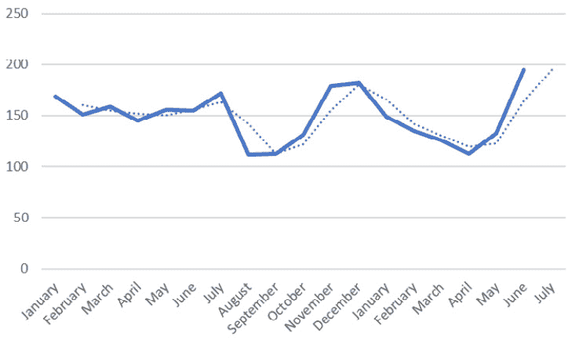
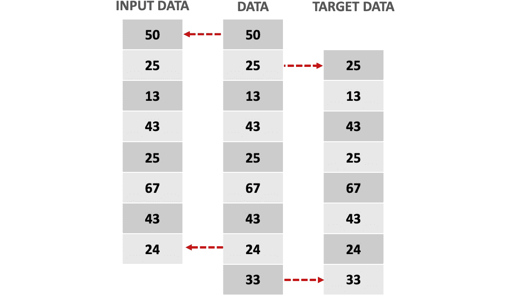
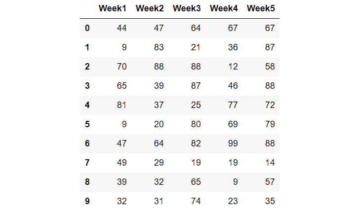
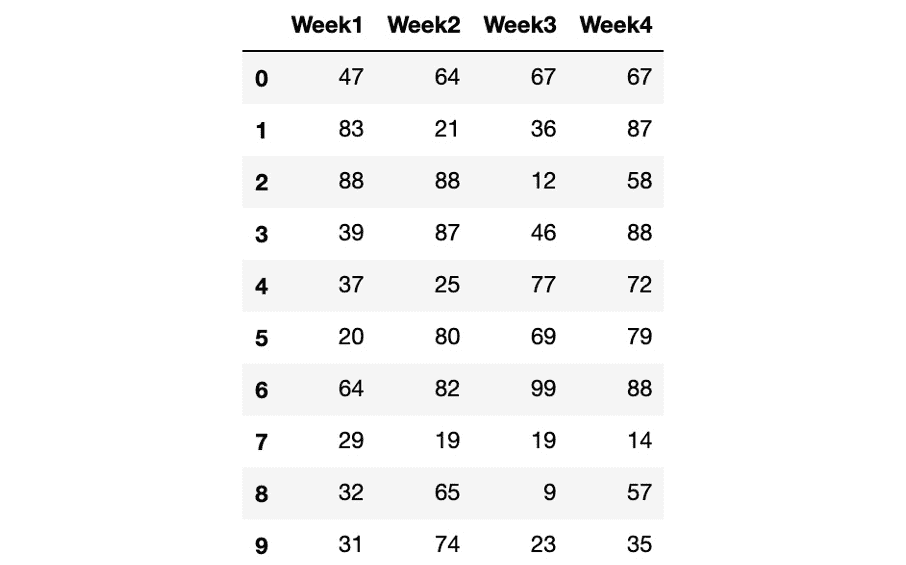
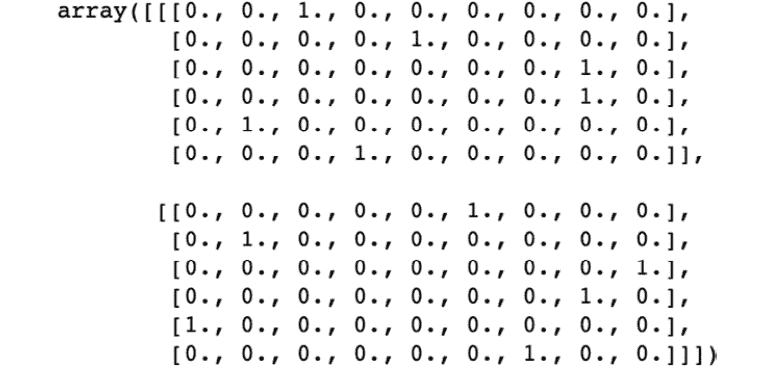

# 6.使用 RNN 分析数据序列

总览

本章扩展了循环神经网络的概念。 您将了解**循环神经网络**（**RNN**）的学习过程以及它们如何存储内存。 本章将介绍**长短期记忆**（**LSTM**）网络架构，该架构使用短期和长期存储器来解决数据序列中的数据问题。 在本章的最后，您将牢固地掌握 RNN 以及如何解决**自然语言处理**（**NLP**）数据问题。

# 简介

在前面的章节中，介绍了不同的网络架构-从可以同时解决分类和回归问题的传统 ANN 到主要用于通过执行对象分类，定位，检测和分段任务来解决计算机视觉问题的 CNN 。

在最后一章中，我们将探讨 RNN 的概念并解决顺序数据问题。 这些网络架构能够保存上下文至关重要的顺序数据，这要归功于它们能够保存来自先前预测的信息（称为内存）。 这意味着，例如，当逐个单词分析句子时，RNN 在处理最后一个单词时可以保留有关该单词第一个单词的信息。

本章将探讨 LSTM 网络架构，它是一种 RNN，可以同时存储长期和短期内存，并且对于处理长数据序列（例如视频剪辑）特别有用。

本章还将探讨 NLP 的概念。 NLP 指的是计算机与人类语言的交互，由于虚拟助手的兴起，如今这已成为热门话题，虚拟助手可以提供定制的客户服务。 本章将使用 NLP 进行情感分析，其中包括分析句子后面的含义。 这有助于根据客户评论了解客户对产品或服务的看法。

注意

[本章中提供的所有代码都可以在以下位置找到](https://packt.live/2yn253K)。

# 循环神经网络

就像人类不会每秒重新设置思想一样，旨在理解人类语言的神经网络也不应这样做。 这意味着，为了理解段落中甚至整个书中的每个单词，您或模型需要理解之前的单词，这可以帮助给可能具有不同含义的单词提供上下文。

到目前为止，我们已经讨论了传统的神经网络无法执行此类任务，因此创建了 RNN 的概念和网络架构。 正如我们之前简要解释的那样，这些网络架构包含不同节点之间的环路。 这使信息可以在模型中保留更长的时间。 因此，来自模型的输出既成为预测又是存储器，当下一行已排序的文本通过模型时将使用该存储器。

这个概念可以追溯到 1980 年代，尽管它只是在最近才变得流行，这要归功于技术的进步，这种进步导致机器的计算能力提高了，并允许数据的收集以及对概念的发展。 1990 年代的 LSTM RNN，增加了其应用范围。 由于 RNN 具有存储内部存储器的能力，因此它们是最有前途的网络架构之一，这使它们能够有效地处理数据序列并解决各种数据问题。

## RNN 的应用

尽管我们已经很清楚地表明 RNN 最适合于数据序列，例如文本，音频片段和视频，但仍然有必要解释 RNN 在现实生活中的不同应用。

这是通过使用 RNN 可以执行的不同任务的一些简要说明：

*   **NLP**。这指的是机器代表人类语言的能力。这可能是深度学习中探索最多的领域之一，也无疑是利用 RNN 时首选的数据问题。其思路是以文本作为输入数据来训练网络，如诗词和书籍等，目的是创建一个能够生成此类文本的模型。

    NLP 通常用于创建聊天机器人（虚拟助手）。 通过从以前的人类对话中学习，NLP 模型能够帮助一个人解决常见问题或疑问。 因此，他们的句子表达能力仅限于他们在训练过程中所学到的内容，这意味着他们只能回答所学的内容。

    当您尝试通过在线聊天系统与银行联系时，您可能会遇到这种情况，在这种情况下，通常您会在查询超出常规范围的那一刻将您转到人工操作员那里。 现实生活中聊天机器人的另一个常见示例是通过 Facebook Messenger 进行查询的餐馆：


图 6.1：Facebook 的 Messenger 聊天机器人

*   **语音识别**。与 NLP 类似，语音识别试图理解和表示人类语言。然而，这里的区别在于，前者（NLP）是以文本的形式进行训练并产生输出，而后者（语音识别）则使用音频片段。随着这一领域的发展，以及大公司的兴趣，这些模型能够理解不同的语言，甚至不同的口音和发音。

    语音识别设备的一个流行示例是 Alexa –来自亚马逊的语音激活虚拟助手模型：


图 6.2：亚马逊的 Alexa

*   **机器翻译**。这是指机器有效翻译人类语言的能力。据此，输入是源语言（如西班牙语），输出是目标语言（如英语）。NLP 与机器翻译的主要区别在于，在后者中，输出是在将整个输入输入输入到模型后建立的。

    随着全球化的兴起和当今休闲旅行的普及，人们需要使用多种语言。 因此，出现了能够在不同语言之间进行翻译的设备。 该领域的最新成果之一是 Google 的 Pixel Buds，它可以实时执行翻译：


图 6.3：Google 的像素芽

*   **时间序列预测**。RNN 的一个不太流行的应用是根据历史数据预测未来的数据点序列。由于 RNN 能够保留内部记忆，使时间序列分析能够考虑过去的不同时间段来进行未来的预测或一系列预测，因此 RNN 特别擅长这项任务。

    这通常用于预测未来的收入或需求，这有助于公司为不同的情况做好准备。 下图显示了每月销售额的预测：



图 6.4：每月销售额的预测（数量）

例如，如果通过预测对几种保健产品的需求，确定对一种产品的需求增加而对另一种产品的需求减少，则公司可以决定生产更多的该产品，并 少其他。

*   **图像识别**：结合 CNN，RNN 可以为图像提供标题或描述。 通过这些模型组合，您可以检测图像中的所有对象，从而确定图像的主要成分。 输出可以是图像中存在的对象的一组标签，图像的描述或图像中相关对象的标题，如下图所示：


图 6.5：使用 RNN 进行图像识别

## RNN 如何工作？

简而言之，RNN 接受输入（x）并返回输出（y）。 在此，输出不仅受输入影响，而且还受过去输入的输入的整个历史影响。 输入的这种历史记录通常称为模型的内部状态或内存，它们是遵循订单并相互关联的数据序列，例如时间序列，它是一系列数据点（例如，销售） ）（按月列出）。

注意

请记住，RNN 的一般结构可能会有所变化，具体取决于当前的问题。 例如，它们可以是一对多类型，也可以是多对一类型，正如我们在“第 2 章”，“神经网络构建模块”中提到的那样。

要了解 RNN 的概念，了解 RNN 与传统神经网络之间的区别非常重要。 传统的神经网络通常被称为前馈神经网络，因为信息仅沿一个方向移动（即，从输入到输出），而没有两次通过节点执行预测。 这些网络对过去所馈送的内容没有任何记忆，这就是为什么它们不善于预测序列中接下来将发生什么。

另一方面，在 RNN 中，信息在循环中循环，因此每次预测都通过考虑先前预测的输入和内存来进行。 它通过复制每个预测的输出并将其传递回网络以进行后续预测来工作。 这样，RNN 就有两个输入-现在值和过去信息：


图 6.6：网络的图形表示，其中 A 显示前馈神经网络，B 显示 RNN

注意

传统 RNN 的内部记忆只是短期的。 但是，我们将探索一种能够在以后存储长期和短期内存的架构。

通过使用来自先前预测的信息，网络将按照一系列有序数据进行训练，从而可以预测下一步。 这是通过将当前信息和上一步的输出合并为一个操作来实现的。 在下图中可以看到。 此操作的输出将成为预测，以及后续预测的输入的一部分：


图 6.7：每个预测的 RNN 计算

如您所见，节点内部发生的操作是任何其他神经网络的操作。 最初，数据通过线性函数传递。 权重和偏差是在训练过程中要更新的参数。 接下来，使用激活函数来破坏该输出的线性度。 在这种情况下，这就是 *tanh* 函数，因为多项研究表明，对于大多数排序数据问题，它可以获得更好的结果：


图 6.8：传统 RNN 的数学计算

此处，`M`t-1 是指从先前的预测得出的内存，`W`和`b`是权重和偏差，而`E`t 表示当前事件。

考虑到这一学习过程，让我们考虑一下过去两年中产品的销售数据。 RNN 能够预测下个月的销售量，因为通过存储最近几个月的信息，RNN 可以检查销售量是增加还是减少。

使用“图 6.7”，可以通过获取上个月的销售额（即当前事件）和短期记忆（代表最近一个月的数据）来处理下个月的预测 几个月）并将其合并。 此操作的输出将包含下个月的预测以及最近几个月的一些相关信息，这些信息将反过来成为后续预测的新短期记忆。

此外，重要的是要提到一些 RNN 架构，例如 LSTM 网络，也将能够考虑 2 年前甚至更早的数据（因为它存储了长期内存）。 这将使网络知道特定月份内的减少是否可能继续减少或开始增加。 稍后，我们将更详细地探讨该主题。

## 输入和目标序列数据

考虑到目标是预测序列中的下一个元素，因此目标矩阵通常是与输入数据相同的信息，而目标则领先一步。

这意味着输入变量应包含序列的所有数据点（最后一个值除外），而目标变量应包含序列的所有数据点，但第一个值除外（即，第一个值） 目标变量应该是输入变量的第二个，依此类推，如下图所示：



图 6.9：顺序数据问题的输入变量和目标变量

## 练习 6.01：为顺序数据问题创建输入和目标变量

在本练习中，您将使用虚拟数据集学习如何创建可用于解决排序数据问题的输入和目标变量。 请按照以下步骤完成此练习：

注意

对于本章中的练习和活动，您需要在本地计算机上安装 Python 3.7，Jupyter 6.0，Matplotlib 3.1，NumPy 1.17，Pandas 0.25 和 PyTorch 1.3+（最好是 PyTorch 1.4）。

1.  导入以下库：

    ```py
    import pandas as pd
    import numpy as np
    import torch
    ```

2.  创建一个`10×5`大小的 Pandas DataFrame，里面充满了从 0 到 100 的随机数。命名五列如下：`["Week1", "Week2", "Week3", "Week4", "Week5"]`。

    确保将随机种子设置为`0`，以便能够重现本书中显示的结果：

    ```py
    np.random.seed(0)
    data = pd.DataFrame(np.random.randint(0,100,size=(10, 5)),
                        columns=['Week1','Week2','Week3',\
                                 'Week4','Week5'])
    data
    ```

    注意

    提醒一下，在 Jupyter Notebooks 中，无需打印功能即可打印变量的值。 在其他编程平台上，可能需要使用打印功能。

    结果数据帧如下：

    

    图 6.10：创建的 DataFrame

3.  创建一个输入变量和一个目标变量，考虑到输入变量应该包含所有实例的所有值，除了最后一列数据。目标变量应包含所有实例的所有值，但第一列数据除外。

    ```py
    inputs = data.iloc[:,:-1]
    targets = inputs.shift(-1, axis="columns", \
                           fill_value=data.iloc[:,-1:])
    ```

4.  打印输入变量以验证其内容，如下图所示。

    ```py
    inputs
    ```

    输入变量应如下所示：

    

    图 6.11：输入变量

5.  使用下面的代码打印出目标变量。

    ```py
    targets
    ```

    运行前面的代码将显示以下输出：


图 6.12：目标变量

注意

要访问此特定部分的源代码，请参考[这里](https://packt.live/2VQ5OjB)。

您也可以通过[这里](https://packt.live/31yCotG)在线运行此示例。 您必须执行整个笔记本才能获得所需的结果。

## PyTorch 中的 RNN

在 PyTorch 中，类似于任何其他层，循环层在一行代码中定义。 然后，将在网络的转发功能中调用此代码，如以下代码所示：

```py
class RNN(nn.Module):
    def __init__(self, input_size, hidden_size, num_layers):
        super().__init__()
        self.hidden_size = hidden_size
        self.rnn = nn.RNN(input_size, hidden_size, num_layers,\
                          batch_first=True)
        self.output = nn.Linear(hidden_size, 1)
    def forward(self, x, hidden):
        out, hidden = self.rnn(x, hidden)
        out = out.view(-1, self.hidden_size)
        out = self.output(out)
        return out, hidden
```

在这里，必须将循环层定义为采用输入中预期特征数的参数（`input_size`）； 由用户定义的处于隐藏状态的功能部件数（·hidden_​​size）； 和循环层数（·num_layers）。

注意

与其他任何神经网络类似，隐藏大小是指该层中节点（神经元）的数量。

`batch_first`参数设置为·True，以定义输入和输出张量采用批，序列和特征的形式。

在`forward`功能中，输入通过循环层，而这些层的输出被展平，以便可以通过全连接层。 值得一提的是，信息与隐藏状态（内存）一起通过 RNN 层传递。

此外，这种网络的训练可以按以下方式处理：

```py
for i in range(1, epochs+1):
    hidden = None
    for inputs, targets in batches:
        pred, hidden = model(inputs, hidden)
        loss = loss_function(pred, targets)
        optimizer.zero_grad()
        loss.backward()
        optimizer.step()
```

对于每个时期，隐藏状态都初始化为`None`。 这是因为，在每个时期，网络都会尝试将输入映射到目标（给定一组参数时）。 该映射应该与数据集中之前的运行没有任何偏差（隐藏状态）地发生。

接下来，`for`循环遍历不同批量的数据。 在此循环内，将进行预测并保存隐藏状态，该状态将用作下一批的输入。

最后，计算损失函数，该函数用于更新网络参数。 然后，该过程再次开始，直到达到所需的时期数。

## 活动 6.01：使用简单的 RNN 进行时间序列预测

对于此活动，您将使用简单的 RNN 解决时间序列问题。 让我们考虑以下情况：您的公司希望能够提前预测所有产品的需求。 这是因为生产每种产品都需要花费相当长的时间，并且该过程花费大量金钱。 因此，除非产品很可能被出售，否则他们不希望在生产上花费金钱和时间。 为了预测未来需求，他们为您提供了一个数据集，其中包含去年销售中所有产品的每周需求（在销售交易中）。 请按照以下步骤完成此活动：

注意

可以在[这个页面](https://packt.live/2K5pQQK)上找到包含将在此活动中使用的数据集的 CSV 文件。 也可以从[这里](https://archive.ics.uci.edu/ml/datasets/Sales_Transactions_Dataset_Weekly)在线获取。

数据集和相关分析首次在此处发布：Tan S.C.，Lau J.P.S. （2014）时间序列聚类：市场篮子分析的一种出色选择。 在：Herawan T.，Deris M.，Abawajy J.（主编）第一次高级数据和信息工程国际会议论文集（DaEng-2013）。 电气工程讲义，第 285 卷。施普林格，新加坡。

1.  导入所需的库。
2.  加载数据集并对其进行切片，以使其包含所有行，但仅包含索引 1 至 52 的列。
3.  从整个数据集中绘制五个随机选择的产品的每周销售交易图。 进行随机采样时，请使用`0`的随机种子，以获得与当前活动相同的结果。
4.  创建`inputs`和`targets`变量，这些变量将被输入到网络中以创建模型。这些变量应具有相同的形状，并转换为 PyTorch 张量。

    `input`变量应包含除上周外所有周所有产品的数据，因为模型的目的是预测最后一周。

    `target`变量应比`input`变量领先一步； 也就是说，`target`变量的第一个值应该是输入变量的第二个，依此类推，直到`target`变量的最后一个值（应该是最后一个`input`变量之外的一周）。

5.  创建一个包含网络架构的类； 请注意，全连接层的输出大小应为 1。
6.  实例化包含模型的类函数。 输入输入大小，每个循环层中的神经元数（10）和循环层数（1）。
7.  定义损失函数，优化算法和训练网络的时期数。 为此，请使用均方误差损失函数，Adam 优化器和 10,000 个纪元。
8.  使用`for`循环通过遍历所有时期来执行训练过程。 在每个时期，都必须进行预测，以及随后的损失函数计算和网络参数优化。 然后，保存每个时期的损失。
9.  绘制所有时期的损失。
10.  使用散点图，显示在训练过程的最后一个纪元中获得的预测值与地面真实值（即上周的销售交易）的对比。

    注意

    此活动的解决方案可以在第 284 页上找到。

# 长短期存储网络

如前所述，RNN 仅存储短期内存。 在处理较长的数据序列时，这是一个问题，在这种情况下，网络将信息从较早的步骤传输到最终步骤时会遇到麻烦。

例如，以著名的诗人埃德加·艾伦·坡（Edgar Alan Poe）所写的诗《乌鸦》（The Raven）为例，诗长超过 1000 个字。 试图使用传统的 RNN 来处理它，以创建相似的相关诗歌为目标，将导致该模型在前几段中遗漏了关键信息。 反过来，这可能导致输出与诗歌的初始主题无关。 例如，它可以忽略事件是在晚上发生的，因此使新诗不是很吓人。

之所以无法保持长期记忆，是因为传统的 RNN 遭受称为消失梯度的问题。 当用于更新网络参数以最小化损耗函数的梯度变得非常小，从而不再对网络的学习过程有所帮助时，就会发生这种情况。 这通常发生在网络的前几层，使网络忘记了一段时间。

因此，开发了 **LSTM** 网络。 LSTM 网络可以像存储计算机一样存储内部存储器，因此可以长时间记住信息。 也就是说，它们根据需要读取，写入和删除信息，这是通过使用门来实现的。

这些门根据分配给每个信息位的重要性，帮助网络决定保留哪些信息以及从内存中删除哪些信息（是否打开门）。 这非常有用，因为它不仅可以存储更多信息（作为长期记忆），而且还有助于丢弃可能改变预测结果的无用信息，例如句子中的文章。

## LSTM 网络的应用

除了我们先前解释的应用程序之外，LSTM 网络存储长期信息的能力还使数据科学家能够处理复杂的数据问题，这些问题利用大数据序列作为输入，下面将对其中的一些问题进行说明：

*   **文本生成**：生成任何文本，例如您在此处阅读的文本，都可以转换为 LSTM 网络的任务。 通过基于所有先前字母选择每个字母来工作。 使用大型文本（例如著名书籍的文本）来训练执行此任务的网络。 这是因为最终模型将创建一个文本，该文本类似于受其训练的文本的书写样式。 例如，以诗训练的模型将具有与您在与邻居交谈中期望的叙事不同的叙事。
*   **音乐生成**：就像可以将文本序列输入到网络中以生成相似的新文本一样，也可以将一系列音符输入网络以生成新的音符序列。 跟踪先前的音符将有助于获得和谐的旋律，而不仅仅是一系列随机的音符。 例如，用披头士乐队的一首流行歌曲来馈送音频文件，将产生一系列音符，这些音符类似于乐队的和声。
*   **手写体的生成和识别**：这里，每个字母也是所有先前字母的乘积，这又将导致一组具有含义的手写字母。 同样，LSTM 网络也可以用于识别手写文本，其中一个字母的预测将取决于所有先前预测的字母。 例如，在考虑先前的字母以及整个段落时，识别难看的手写字母会更容易，因为这有助于根据上下文缩小预测范围。

## LSTM 网络如何工作？

到目前为止，已经明确了 LSTM 网络与传统 RNN 的区别在于它们具有长期记忆的能力。 但是，必须指出的是，随着时间的流逝，非常古老的信息不太可能影响下一个输出。 考虑到这一点，LSTM 网络还具有考虑数据位与底层上下文之间距离的能力，以便也可以决定忘记一些不再相关的信息。

那么，LSTM 网络如何决定何时记住和何时忘记？ 与传统的 RNN 不同，LSTM 网络在每个节点中仅执行一次计算，而 LSTM 网络执行四种不同的计算，从而允许网络的不同输入（即当前事件，短期记忆和长期事件）之间进行交互。 术语记忆）以得出结果。

要了解 LSTM 网络背后的过程，请考虑用于管理网络中信息的四个门，如下图所示：


图 6.13：LSTM 网络门

上图中每个门的功能可以解释如下：

*   **学习门**：短期记忆（也称为隐藏状态）和当前事件都进入学习门，在此分析信息，并忽略所有不需要的信息。 在数学上，这是通过使用线性函数和激活函数（*tanh*）将短期记忆和当前事件结合在一起来实现的。 它的输出乘以忽略因子，从而删除所有不相关的信息。 为了计算忽略因子，通过线性函数传递短期记忆和当前事件。 然后，将它们通过 **Sigmoid** 激活函数压缩在一起：


图 6.14：学习门中发生的数学计算

此处， `STM[t-1]`是指从先前的预测得出的短期记忆，`W`和`b`是权重和偏差，并且`E[t]`表示当前事件。

*   **遗忘门**：长期存储（也称为单元状态）进入遗忘门，其中删除了一些信息。 这是通过将长期记忆和遗忘因子相乘来实现的。 要计算遗忘因子，请将短期记忆和当前事件通过线性函数和激活函数（**sigmoid**）传递：


图 6.15：遗忘门中发生的数学计算

此处， `STM[t-1]`是指从先前的预测中得出的短期记忆， `LTM[t-1]`是从先前的预测中得出的长期记忆 ，`W`和`b`是权重和偏差，`E`t 是指当前事件。

*   **记忆门**：在记忆门中未被遗忘的长期记忆和从学习门保留的信息将被组合在记忆门中，这将成为新的长期记忆。 从数学上讲，这是通过对学习和遗忘门的输出求和来实现的：


图 6.16：记忆门中发生的数学计算

此处，`L[t]`表示来自学习门的输出，而`F[t]`表示来自遗忘门的输出。

*   **使用门**。这也称为输出门。在这里，来自学习门和遗忘门的信息被合并到使用门中。该门利用所有相关信息进行预测，也成为新的短期记忆。

    这可以通过三个步骤实现。 首先，它将线性函数和激活函数（*tanh*）应用于遗忘门的输出。 其次，它将线性函数和激活函数（*Sigmoid*）应用于短期记忆和当前事件。 第三，它将前面步骤的输出相乘。 第三步的输出将是新的短期记忆和当前步的预测：


图 6.17：使用门中发生的数学计算

此处， `STM[t-1]`是指从先前的预测得出的短期记忆，`W`和`b`是权重和偏差，并且`E[t]`表示当前事件。

注意

尽管使用不同的激活函数和数学运算符似乎是任意的，但这样做是因为已被证明可以处理大多数处理大型数据序列的数据问题。

对于模型执行的每个预测，都完成了前面的过程。 例如，对于构建用于创建文学作品的模型，将对模型将产生的每个单个字母执行学习，遗忘，记忆和使用信息的过程，如下图所示：


图 6.18：整个时间的 LSTM 网络过程

# PyTorch 中的 LSTM 网络

在 PyTorch 中定义 LSTM 网络架构的过程与到目前为止我们讨论过的任何其他神经网络的过程相似。 但是，重要的是要注意，当处理与数字序列不同的数据序列时，需要进行一些预处理才能为网络提供它可以理解和处理的数据。

考虑到这一点，我们需要解释训练模型的一般步骤，以便能够将文本数据作为输入并检索新的文本数据。 值得一提的是，并非严格要求此处说明的所有步骤，而是作为一个整体，它们为使用 LSTM 与文本数据结合在一起提供了干净且可重用的代码。

## 预处理输入数据

第一步是将文本文件加载到代码中。 这些数据将经过一系列转换，以便正确地输入到模型中。 这是必需的，因为神经网络执行一系列数学计算才能得出输出，这意味着所有输入都必须是数字。 另外，将数据批量而不是一次全部馈入模型也是一个好习惯，因为这有助于减少训练时间，尤其是对于长数据集。 这些转换将在以下小节中进行说明。

### 编号标签

首先，从输入数据中获得未重复字符的列表。 这些字符中的每一个都分配有一个数字。 然后，考虑到必须始终用相同的数字表示相同的字母，通过将每个字符替换为指定的数字来对输入数据进行编码。 例如，给定以下字符和数字映射，单词“ hello”将被编码为 12334：


图 6.19：字符和数字的映射

可以通过以下代码片段实现上述输出：

```py
text = "this is a test text!"
chars = list(set(text))
indexer = {char: index for (index, char) \
           in enumerate(chars)}
indexed_data = []
for c in text:
    indexed_data.append(indexer[c])
```

代码的第二行创建一个包含文本字母（即文本序列中的字母和字符）的列表。 接下来，使用每个字母或字符作为键并使用与其关联的数字表示作为值来创建字典。 最后，通过对文本执行`for`循环，可以将每个字母或字符替换为其数字表示形式，从而将文本转换为数字矩阵。

### 生成批量

对于 RNN，使用两个变量创建批量：每个批量的序列数和每个序列的长度。 这些值用于将数据划分为矩阵，这将有助于加快计算速度。

使用 24 个整数的数据集，每批的序列数设置为 2，序列长度等于 4，除法如下：


图 6.20：RNN 的批量生成

如上图所示，创建了三个批量–每个批量包含两个长度为 4 的序列。

对于`x`和`y`，应完成此批生成过程，其中前者是网络的输入，后者是目标。 据此，网络的思想是找到一种方法来映射`x`和`y`之间的关系，考虑到`y`将领先一步。`x`。

`x`的批量是按照上图中说明的方法创建的。 然后，将创建`y`的批量，以使其与`x`的长度相同。 这是因为`y`的第一个元素将是`x`的第二个元素，依此类推，直到`y`的最后一个元素（将是第一个元素）`x`的数量）：

注意

您可以使用多种不同的方法来填充`y`的最后一个元素，这里提到的是最常用的一种方法。 方法的选择通常是优先考虑的问题，尽管某些数据问题可能从某种方法中受益而不是其他方法。


图 6.21：x 和 y 批量的表示

批量的生成可以通过以下代码片段实现：

```py
x = np.array(indexed_data).reshape((2,-1))
for b in range(0, x.shape[1], 5):
    batch = x[:,b:b+5]
    print(batch)
```

首先，将数字矩阵划分为多个序列（根据需要）。 接下来，通过`for`循环，可以将已排序的数据划分为指定长度的批量。 通过打印`batch`变量，可以观察到结果。

注意

尽管生成批量被视为预处理数据的一部分，但通常会在训练过程的`for`循环内部对其进行编程。

## 一键编码

将所有字符转换为数字不足以将其输入模型。 这是因为这种近似会给您的模型带来一些偏差，因为转换为更高数值的字符将被视为更重要。 为避免这种情况，优良作法是将不同批量编码为一热矩阵。 这包括创建一个具有零和一的三维矩阵，其中零表示不存在事件，而一个表示存在事件。 矩阵的最终形状应为`one hot = [number of sequences, sequence length, number of characters]`。

这意味着，对于批量中的每个元素，它将创建一个长度等于整个文本中字符总数的值序列。 对于每个字符，它将放置一个零，但该位置存在一个零（它将放置一个）。

注意

您可以在[这个页面](https://www.geeksforgeeks.org/ml-one-hot-encoding-of-datasets-in-python/)中找到有关一键编码的更多信息。

这可以通过以下代码片段实现：

```py
batch = np.array([[2 4 7 6 5]
                  [2 1 6 2 5]])
batch_flatten = batch.flatten()
onehot_flat = np.zeros((batch.shape[0] \
                        * batch.shape[1],len(indexer)))
onehot_flat[range(len(batch_flatten)), batch_flatten] = 1
onehot = onehot_flat.reshape((batch.shape[0],\
                              batch.shape[1], -1))
```

首先，将二维批量展平。 接下来，创建一个矩阵，并用零填充。 当我们需要在给定位置表示正确的字符时，用零代替零。 最后，展平的尺寸再次扩大。

## 练习 6.02：预处理输入数据并创建一倍热矩阵

在本练习中，您将预处理文本片段，然后将其转换为一键式矩阵。 请按照以下步骤完成此练习：

1.  导入 NumPy。

    ```py
    import numpy as np
    ```

2.  创建一个名为`text`的变量，其中将包含文本样本`"Hello World!"`。

    ```py
    text = "Hello World!"
    ```

3.  通过将每个字母映射到一个数字来创建一个字典。

    ```py
    chars = list(set(text))
    indexer = {char: index for (index, char) \
               in enumerate(chars)}
    print(indexer)
    ```

    运行前面的代码将得到以下输出：

    ```py
    {'d': 0, 'o': 1, 'H': 2, ' ': 3, 'e': 4, 'W': 5, '!': 6, 'l': 7, 'r': 8}
    ```

4.  用我们在上一步中定义的数字对你的文本样本进行编码。

    ```py
    encoded = []
    for c in text:
        encoded.append(indexer[c])
    ```

5.  将编码变量转换为 NumPy 数组，并对其进行重塑，使句子被分成两个大小相同的序列。

    ```py
    encoded = np.array(encoded).reshape(2,-1)
    encoded
    ```

    运行前面的代码将得到以下输出：

    ```py
    array([[2, 4, 7, 7, 1, 3],
           [5, 1, 8, 7, 0, 6]])
    ```

6.  定义一个函数，接收一个数字数组，并创建一个单热矩阵。

    ```py
    def index2onehot(batch):
        batch_flatten = batch.flatten()
        onehot_flat = np.zeros((batch.shape[0] \
                                * batch.shape[1], len(indexer)))
        onehot_flat[range(len(batch_flatten)), \
                    batch_flatten] = 1
        onehot = onehot_flat.reshape((batch.shape[0], \
                                      batch.shape[1], -1))
        return onehot
    ```

7.  通过之前定义的函数将编码数组转换为单热矩阵。

    ```py
    one_hot = index2onehot(encoded)
    one_hot
    ```

    输出应如下所示：



图 6.22：示例文本的一键式表示

注意

要访问此特定部分的源代码，请参考[这里](https://packt.live/2ZpGvFJ)。

您也可以通过[这里](https://packt.live/38foCxD)在线运行此示例。 您必须执行整个笔记本才能获得所需的结果。

您已成功将一些示例文本转换为一键式矩阵。

## 构建架构

与其他神经网络类似，可以在一行代码中轻松定义 LSTM 层。 但是，包含网络架构的类必须包含一个函数，该函数允许初始化隐藏状态和单元状态（即网络的两个内存）。 LSTM 网络架构的示例如下：

    ```py
    class LSTM(nn.Module):
        def __init__(self, char_length, hidden_size, n_layers):
            super().__init__()
            self.hidden_size = hidden_size
            self.n_layers = n_layers
            self.lstm = nn.LSTM(char_length, hidden_size, \
                                n_layers, batch_first=True)
            self.output = nn.Linear(hidden_size, char_length)
        def forward(self, x, states):
            out, states = self.lstm(x, states)
            out = out.contiguous().view(-1, self.hidden_size)
            out = self.output(out)
            return out, states
        def init_states(self, batch_size):
            hidden = next(self.parameters()).data.new(self.n_layers, \
                          batch_size, self.hidden_size).zero_()
            cell = next(self.parameters()).data.new(self.n_layers, \
                        batch_size, self.hidden_size).zero_()
            states = (hidden, cell)
            return states
    ```

注意

同样，当输入和输出张量采用批，序列和特征的形式时，`batch_first`参数设置为`True`。 否则，无需定义它，因为其默认值为`False`。

如我们所见，LSTM 层在一行中定义，将以下内容作为参数：

*   输入数据中的要素数量（即，非重复字符的数量）
*   隐藏维数（神经元）
*   LSTM 层数

与任何其他网络一样，`forward`功能定义了在`forward`传递中通过层移动数据的方式。

最后，定义一个函数以在每个时期将隐藏状态和单元状态初始化为零。 这是通过`next(self.parameters()).data.new()`实现的，该方法获取模型的第一个参数，并在括号内创建具有指定尺寸的相同类型的新张量， 然后用零填充。 将`hidden`和`cell`状态都作为元组输入模型。

## 训练模型

一旦定义了损失函数和优化算法，就该训练模型了。 这是通过采用与其他神经网络架构非常相似的方法来实现的，如以下代码片段所示：

```py
# Step 1: for through epochs
for e in range(1, epochs+1):
    # Step 2: Memory initialized
    states = model.init_states(n_seq)
    # Step 3: for loop to split data in batches.
    for b in range(0, x.shape[1], seq_length):
        x_batch = x[:,b:b+seq_length]
        
        if b == x.shape[1] - seq_length:
            y_batch = x[:,b+1:b+seq_length]
            y_batch = np.hstack((y_batch, indexer["."] \
                      * np.ones((y_batch.shape[0],1))))
        else:
            y_batch = x[:,b+1:b+seq_length+1]
        """
        Step 4: input data is converted to one-hot matrix.
        Inputs and targets are converted to tensors.
        """
        x_onehot = torch.Tensor(index2onehot(x_batch))
        y = torch.Tensor(y_batch).view(n_seq * seq_length)
        """
        Step 5: get a prediction and perform the
        backward propagation
        """
        pred, states = model(x_onehot, states)
        loss = loss_function(pred, y.long())
        optimizer.zero_grad()
        loss.backward(retain_graph=True)
        optimizer.step()
```

如前面的代码所示，步骤如下：

1.  为了获得更好的模型，有必要遍历数据多次，因此需要设置多个时期。
2.  在每个时期，必须初始化隐藏状态和单元状态。 这是通过调用该类中先前创建的函数来实现的。
3.  使用循环`for`将数据分批馈入模型。 `if`语句用于确定它是否是最后一批，以便在句末添加句点，以表示句点。
4.  输入数据被转换为一热矩阵。 输入和目标都将转换为 PyTorch 张量。
5.  通过对一批数据调用模型来获得网络的输出。 然后，计算损失函数，并优化参数。

## 执行预测

优良作法是为训练后的模型提供前几个字符，以便执行具有某种目的的预测（例如，以单词“ on time on time”开头的段落）。 这些初始字符应在不执行任何预测的情况下馈送到模型中，但目的是生成内存。 接下来，将前一个字符和存储器馈入网络，并通过 **softmax** 函数传递输出，以便计算每个字符成为序列中下一个字符的概率。 最后，从概率较高的角色中随机选择一个。

这可以通过以下代码片段实现：

```py
# Step 1
starter = "This is the starter text"
states = None
# Step 2
for ch in starter:
    x = np.array([[indexer[ch]]])
    x = index2onehot(x)
    x = torch.Tensor(x)
    
    pred, states = model(x, states)
# Step 3
counter = 0
while starter[-1] != "." and counter < 50:
    counter += 1
    x = np.array([[indexer[starter[-1]]]])
    x = index2onehot(x)
    x = torch.Tensor(x)
    
    pred, states = model(x, states)
    pred = F.softmax(pred, dim=1)
    p, top = pred.topk(10)
    p = p.detach().numpy()[0]
    top = top.numpy()[0]
    index = np.random.choice(top, p=p/p.sum())
    # Step 4
    starter += chars[index]
    print(starter)
```

在上一个代码段中，将执行以下步骤：

1.  起始句子已定义。
2.  `for`循环将开始句子的每个字符输入模型，以便在进行预测之前更新模型的内存。
3.  只要循环和循环用于执行新字符的预测，只要字符数不超过 50，并且直到新字符是一个句点即可。
4.  每个新字符都添加到起始句子中，以形成新的文本序列。

## 活动 6.02：使用 LSTM Networks 进行文本 Ge 操作

注意

可以在 Internet 上免费访问此活动中将使用的文本数据，尽管您也可以在本书的 GitHub 存储库中找到它。 在本章的简介中提到了存储库的 URL。

在本活动中，我们将使用《爱丽丝梦游仙境》 一书训练 LSTM 网络，以便我们可以将一个起始语句输入模型并使其完成该语句。 请考虑以下情形：您喜欢使生活更轻松的事物，并决定建立一个模型来帮助您在编写电子邮件时完成句子。 为此，您已决定使用一本流行的儿童读物来训练网络。 请按照以下步骤完成此活动：

注意

值得一提的是，尽管本次活动中的网络经过了足够的迭代训练以显示出令人满意的结果，但并未对其进行训练和配置以实现最佳性能。 鼓励您使用它来提高性能。

1.  导入所需的库。
2.  打开并将*爱丽丝梦游仙境*中的文本读到笔记本中。 打印前 50 个字符和文本文件总长度的摘录。
3.  创建一个变量，该变量包含数据集中未重复字符的列表。 然后，创建一个字典，将每个字符映射到一个整数，其中字符将是键，而整数将是值。
4.  将数据集中的每个字母编码为成对的整数。 打印数据集的前 50 个编码字符和编码版本的总长度。
5.  创建一个接受批量并将其编码为单热点矩阵的函数。
6.  创建一个定义网络架构的类。 该类应包含一个用于初始化 LSTM 层状态的附加函数。
7.  请确定要从数据集中创建的批量数量，请记住每个批量应包含 100 个序列，每个批量的长度应为 50。接下来，将编码数据拆分为 100 个序列。
8.  使用 256 作为隐藏单位数（总共两个循环层）实例化模型。
9.  定义损失函数和优化算法。使用 Adam 优化器和交叉熵损失。训练网络 20 个纪元。

    注意

    根据您的资源，训练过程将花费很长时间，这就是为什么建议仅运行 20 个纪元的原因。 但是，本书的 GitHub 存储库中提供了可以在 GPU 上运行的代码的等效版本。 这将使您运行更多的时代并获得出色的性能。

10.  在每一个时代，数据必须被划分为 50 个序列长度的批次。这意味着每个时代将有 100 个序列，每个序列的长度为 50。

    注意

    为输入和目标创建了批量 ，其中后者是前者的副本，但领先一步。

11.  绘制随时间推移的损失进度。
12.  将下面的句子启动器输入到训练好的模型中，并完成这个句子：`"So she was considering in her own mind "`。

    注意

    有关此活动的解决方案，请参见第 290 页。

最后一句话会有所不同，因为在选择每个字符时会有一个随机因素。 但是，它应该看起来像这样：

`So she was considering in her own mind us on," said she whad se the sire.`前面的句子没有意义，因为网络没有经过足够的时间训练（损失函数可能仍然是 最小化），并且可以一次选择每个字符，而无需长期存储以前创建的单词（尽管如此），我们可以看到，仅 20 个纪元后，网络就已经能够形成一些有意义的单词。

# 自然语言处理

计算机擅长分析标准化数据，例如财务记录或表中存储的数据库。 实际上，它们具有比人类更好的能力，因为它们能够一次分析数百个变量。 另一方面，人类擅长分析非结构化数据（例如语言），除非计算机掌握了一套规则以帮助他们理解，否则计算机就不会擅长这样做。

考虑到这一点，对于人类语言而言，计算机面临的最大挑战是，即使在一台非常大的数据集上经过很长时间的训练之后，计算机可以擅长分析人类语言，但它们仍然无法理解 句子背后的真实含义，因为它们既不直观也不能够在两行之间阅读。

这意味着，尽管人类能够理解说“他昨晚着火了，真是个好游戏！”的句子。 指某种运动的运动员的表现，计算机会从字面意义上理解它-意味着它将把它解释为昨晚确实起火的人。

NLP 是**人工智能**（**AI**）的子字段，它通过使计算机能够理解人类语言来工作。 尽管在某些情况下人类可能总是会做得更好，但是 NLP 的主要目标是通过使计算机理解人类语言来使计算机与人类更接近。

这个想法是创建专注于特定领域的模型，例如机器翻译和文本摘要。 任务的这种专业化有助于计算机开发一种模型，该模型能够解决现实生活中的数据问题，而无需一次处理所有复杂的人类语言。

情感分析是人类语言理解的这些领域之一（近来非常流行）。

## 情绪分析

一般而言，情感分析包括理解输入文本背后的情感。 考虑到随着社交媒体平台的普及，公司每天收到的消息和评论的数量呈指数增长，因此它变得越来越受欢迎。 这使得手动修改和实时响应每条消息的任务变得不可能，这可能会损害公司的形象。

情感分析的重点是在忽略细节的同时提取句子的基本组成部分。 这有助于解决两个主要需求：

1.  确定客户最关心的产品或服务的关键方面。
2.  提取这些方面背后的感受，以确定哪些因素引起正面和负面反应，并相应地进行处理：


图 6.23：一个推文示例

从前面的屏幕截图中获取文本，执行情感分析的模型可能会获得以下信息：

*   “ AI”作为推文的对象
*   从中得到的“快乐”
*   “十年”作为对象情感的时间范围

如您所见，情感分析的概念对于任何具有在线业务的公司而言都是关键的，因为它能够以惊人的速度对需要立即关注的评论做出快速响应，并且其准确率类似于人类。 。

作为情感分析的示例用例，某些公司可能选择对每天收到的大量消息进行情感分析，以便优先处理对包含抱怨或负面情绪的消息的响应。 这不仅有助于减轻特定客户的负面情绪； 它还将帮助公司快速纠正错误并与客户建立信任关系。

下一部分将详细说明执行 NLP 进行情感分析的过程。 我们将解释单词嵌入的概念以及在 PyTorch 中开发此类模型所能执行的不同步骤，这将是本章最后活动的目标。

# PyTorch 中的情感分析

建立一个在 PyTorch 中执行情感分析的模型与我们迄今为止使用 RNN 所看到的非常相似。 不同之处在于，在这种情况下，将逐字处理文本数据。 本节将提供构建这种模型所需的步骤。

## 预处理输入数据

与其他任何数据问题一样，您需要将数据加载到代码中，同时要记住对不同的数据类型使用不同的方法。 除了将整个单词集转换为小写字母之外，数据还经过一些基本的转换，可让您将数据输入网络。 最常见的转换如下：

*   **消除标点符号**。在为 NLP 目的逐字处理文本数据时，删除任何标点符号。这样做是为了避免把同一个词当作两个独立的词，因为其中一个词后面有句号、逗号或任何其他特殊字符。一旦实现了这一点，就可以定义一个包含输入文本词汇的列表（也就是整个词集）。

    这可以通过使用`string`模块的`punctuation`预初始化的字符串来完成，该字符串提供了可用于在文本序列中标识它们的标点符号列表，如 以下代码段：

    ```py
    test = pd.Series(['Hey! This is example #1.', \
                      'Hey! This is example #2.', \
                      'Hey! This is example #3.'])
    for i in punctuation:
        test = test.str.replace(i,"")
    ```

*   **带编号的标签**：类似于前面介绍的映射字符的过程，词汇表中的每个单词都映射到一个整数，该整数将用于替换输入文本的单词，以便将它们输入网络 ：


图 6.24：单词和数字的映射

PyTorch 无需执行一次性编码，而是将单词嵌入单行代码，这些代码可以在包含网络架构的类中定义（将在下面进行解释）。

## 构建架构

同样，定义网络架构的过程与我们到目前为止研究的过程非常相似。 但是，正如我们前面提到的，网络还应包括一个嵌入层，该嵌入层将获取输入数据（已转换为数字表示形式）并为每个单词分配相关程度。 也就是说，这些值将在训练过程中更新，直到最相关的单词被加权更高为止。

以下是架构的示例：

```py
class LSTM(nn.Module):
    def __init__(self, vocab_size, embed_dim, \
                 hidden_size, n_layers):
        super().__init__()
        self.hidden_size = hidden_size
        self.embedding = nn.Embedding(vocab_size, embed_dim)
        self.lstm = nn.LSTM(embed_dim, hidden_size, n_layers)
        self.output = nn.Linear(hidden_size, 1)
    def forward(self, x, states):
        out = self.embedding(x)
        out, states = self.lstm(out, states)
        out = out.contiguous().view(-1, self.hidden_size)
        out = self.output(out)
        return out, states
```

如您所见，嵌入层将整个词汇表的长度以及用户设置的嵌入维度作为参数。 嵌入尺寸将是 LSTM 层的输入尺寸。 其余的架构将保持与以前相同。

## 训练模型

最后，在定义了损失函数和优化算法之后，训练模型的过程与任何其他神经网络相同。 根据研究的需要和目的，可以将数据分为不同的组。 接下来，您必须设置时期数和将数据分成批量的方法。 通常在处理每批数据时保留网络内存，但随后在每个时期将其初始化为零。 通过对一批数据调用模型来获得网络的输出。 然后，计算损失函数，并优化参数。

## 活动 6.03：用于情感分析的 Performin g NLP

您将用于此活动的数据集称为*情感标记句子数据集*，可从 UC Irvine 机器学习存储库中获得。

注意

可以在[这里](https://packt.live/2z2LYc5)找到该活动的数据集。 也可以从[这里](https://archive.ics.uci.edu/ml/datasets/Sentiment+Labelled+Sentences)在线获取。

数据集和相关分析首次在此处发布：[使用深度特征从组到单个标签，Kotzias 等，KDD 2015](https://doi.org/10.1145/2783258.2783380)

在此活动中，将使用 LSTM 网络分析一组评论，以确定其背后的观点。 让我们考虑以下情况：您在一家互联网提供商的公共关系部门工作，并且审查您在公司的社交媒体资料中遇到的每个查询的过程都将花费很长时间。 最大的问题是与服务有问题的客户相比，没有服务的客户缺乏耐心，因此您需要确定响应的优先级，以便首先解决他们。 当您在业余时间喜欢编程时，您决定尝试构建一个神经网络，该网络能够确定消息是消极还是肯定。 请按照以下步骤完成此活动：

注意

值得一提的是，此活动中的数据并未分为不同的数据集，以使模型可以进行微调和测试。 这是因为此活动的主要重点是实施创建能够执行情感分析的模型的过程。

1.  导入所需的库。
2.  加载包含来自亚马逊的 1,000 条产品评论的数据集，并与标签 0（对于负面评论）或 1（对于正面评论）配对。 将数据分成两个变量-一个包含评论，另一个包含标签。
3.  从评论中删除标点符号。
4.  创建一个包含整个评论集的词汇表的变量。 此外，创建一个字典，将每个单词映射到一个整数，其中单词将作为键，而整数将是值。
5.  通过将评论中的每个单词替换为其成对的整数来对评论数据进行编码。
6.  创建一个包含网络架构的类。确保你包含一个嵌入层。

    注意

    由于在训练过程中不会批量输入数据，因此无需返回`forward`函数中的状态。 但是，这并不意味着该模型将没有内存，而是因为该内存不依赖于下一个审阅，因此该内存用于单独处理每个审阅。

7.  使用 3 个 LSTM 层的 64 个嵌入尺寸和 128 个神经元实例化模型。
8.  定义损失函数，优化算法以及要训练的时期数。 例如，您可以将二进制交叉熵损失用作损失函数，Adam 优化器，并训练 10 个历元。
9.  创建一个`for`循环，该循环将经历不同的时期并分别经历每个审核。 对于每次审核，都要进行预测，计算损失函数并更新网络参数。 此外，根据该训练数据计算网络的准确率。
10.  随时间绘制损失的进度和准确率。

最终的精度图将如下所示：


图 6.25：显示准确率得分进度的图

注意

可以在第 298 页上找到此活动的解决方案。

# 摘要

在本章中，我们讨论了 RNN。 开发这种类型的神经网络是为了解决与序列数据有关的问题。 这意味着单个实例不包含所有相关信息，因为这取决于先前实例中的信息。

有几种适合这种类型描述的应用程序。 例如，如果没有文本其余部分的上下文，则文本（或语音）的特定部分可能意义不大。 但是，即使 NLP 在 RNN 中得到了最多的研究，在其他应用中，文本的上下文也很重要，例如预测，视频处理或音乐相关的问题。

RNN 的工作方式非常聪明。 网络不仅输出结果，而且还输出一个或多个通常称为内存的值。 该内存值用作将来预测的输入。

当处理涉及非常大序列的数据问题时，传统的 RNN 会出现一个称为消失梯度问题的问题。 在这里梯度变得非常小，因此它们不再对网络的学习过程有所贡献，而这种学习过程通常发生在网络的较早层中，从而导致网络无法长期存储。

为了解决这个问题，开发了 LSTM 网络。 这种网络架构能够存储两种类型的内存，因此得名。 此外，在此网络中进行的数学计算允许它仅通过存储过去的相关信息来忘记信息。

最后，解释了一个非常流行的 NLP 任务：情绪分析。 在此任务中，重要的是要理解文本提取背后的情感。 对于机器而言，这是一个非常困难的问题，因为人们可以使用许多不同的单词和表达形式（例如讽刺）来描述事件背后的情绪。 但是，由于社交媒体使用量的增加，这导致需要更快地处理文本数据，这个问题在投入大量时间和金钱来创建多个近似值以解决该问题的大公司中变得非常普遍，如图所示。 本章的最后活动。

既然您已经遍历了本书的所有章节，您将对不同的深度神经网络架构有广泛的了解，这些架构可用于使用 PyTorch 解决各种数据问题。 本书中说明的架构也可以用于解决其他数据问题。