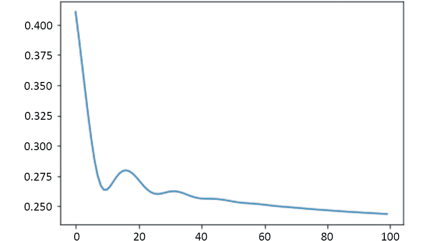
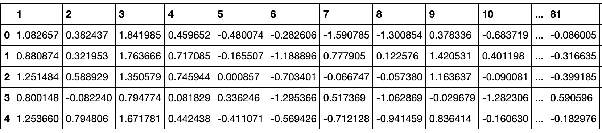
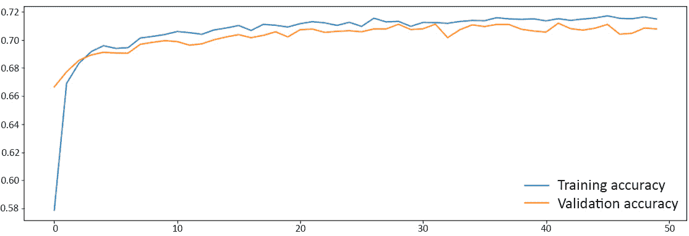
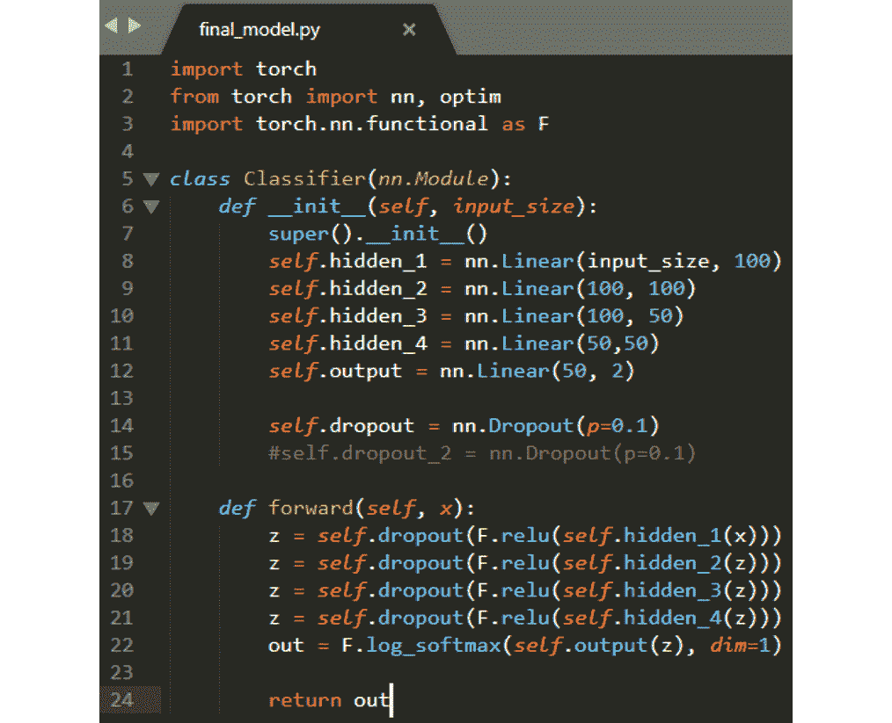
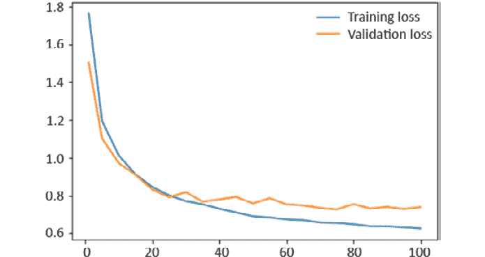
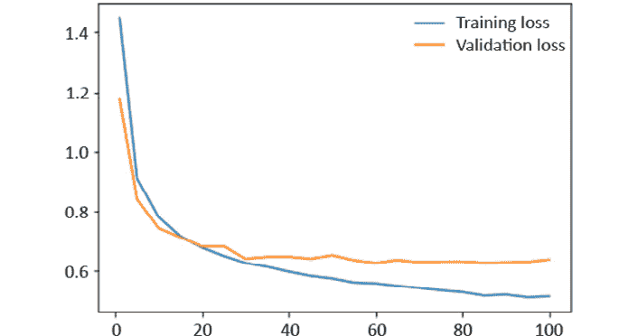
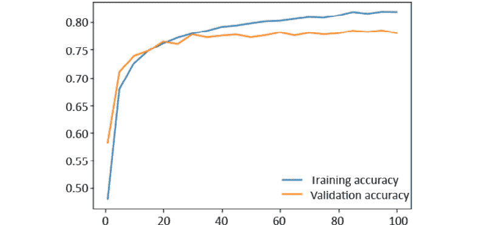
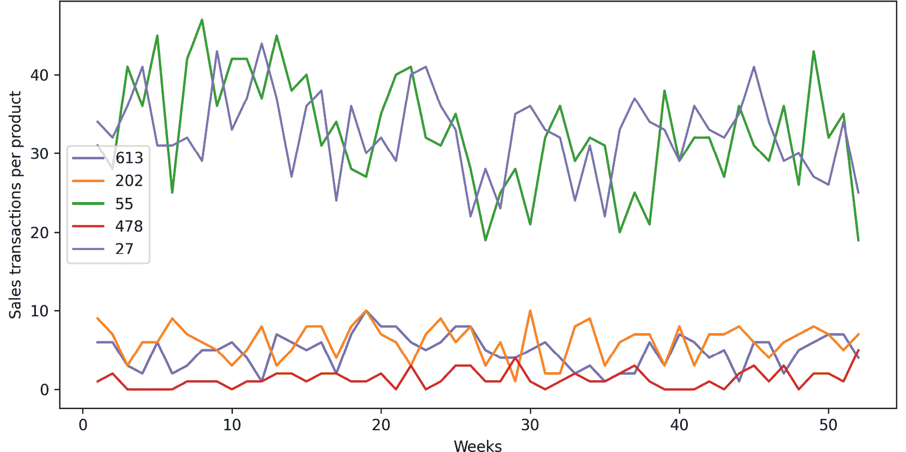
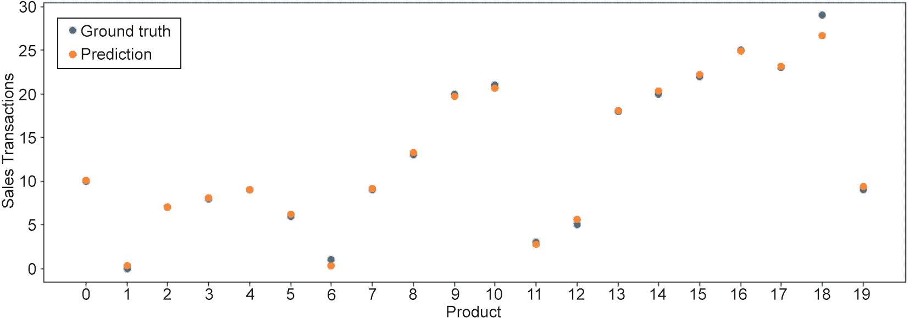
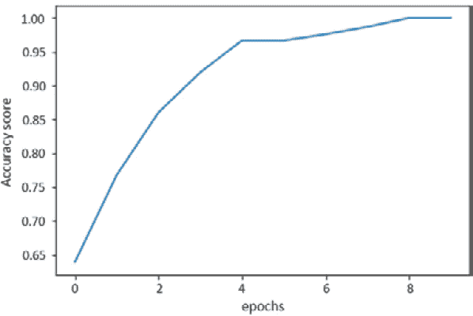

# 附录

# 1.深度学习和 PyTorch 简介

## 活动 1.01：创建单层神经网络

### 解决方案

1.  导入所需的库，包括 pandas，用于导入 CSV 文件。

    ```py
    import pandas as pd
    import torch
    import torch.nn as nn
    import matplotlib.pyplot as plt
    ```

2.  读取包含数据集的 CSV 文件。

    ```py
    data = pd.read_csv("SomervilleHappinessSurvey2015.csv")
    ```

3.  将输入特征与目标分开。注意，目标位于 CSV 文件的第一列。将值转换为张量，确保值转换为浮点数。

    ```py
    x = torch.tensor(data.iloc[:,1:].values).float()
    y = torch.tensor(data.iloc[:,:1].values).float()
    ```

4.  定义模型的架构，并将其存储在一个名为`model`的变量中。记住要创建一个单层模型。

    ```py
    model = nn.Sequential(nn.Linear(6, 1),
                          nn.Sigmoid())
    ```

5.  定义要使用的损失函数。使用 MSE 损失函数。

    ```py
    loss_function = torch.nn.MSELoss()
    ```

6.  定义你模型的优化器。使用亚当优化器和学习率`0.01`。

    ```py
    optimizer = torch.optim.Adam(model.parameters(), lr=0.01)
    ```

7.  运行优化 100 次迭代。每迭代 10 次，打印并保存损失值。

    ```py
    losses = []
    for i in range(100):
        y_pred = model(x)
        loss = loss_function(y_pred, y)
        losses.append(loss.item())
        optimizer.zero_grad()
        loss.backward()
        optimizer.step()
        if i%10 == 0:
            print(loss.item())
    ```

    最终损失应约为`0.24`。

8.  做一个线图来显示每个迭代步骤的损失值。

    ```py
    plt.plot(range(0,100), losses)
    plt.show()
    ```

    结果图应如下所示：



图 1.4：整个训练过程中的损失函数

这意味着训练过程能够使损失函数最小化，这意味着结果模型将可能能够绘制出市民对城市服务的满意度与他们对行政管理是否满意之间的关系。

注意

要访问此特定部分的源代码，请参考[这里](https://packt.live/2ZufWiI)。

您也可以通过[这里](https://packt.live/2BZhyZF)在线运行此示例。 您必须执行整个笔记本才能获得所需的结果。

# 2.神经网络的构建块

## 活动 2.01：执行数据准备

### 解决方案

1.  导入所需的库。

    ```py
    import pandas as pd
    ```

2.  使用 pandas，加载`.csv`文件。

    ```py
    data = pd.read_csv("YearPredictionMSD.csv", nrows=50000)
    data.head()
    ```

    注意

    为避免内存限制，在读取文本文件时，请使用`nrows`自变量，以读取整个数据集的较小部分。 在前面的示例中，我们正在读取前 50,000 行。

    输出如下：

    

    图 2.33：`YearPredictionMSD.csv`

3.  核实数据集中是否存在任何定性数据。

    ```py
    cols = data.columns
    num_cols = data._get_numeric_data().columns
    list(set(cols) - set(num_cols))
    ```

    输出应为空列表，这意味着没有定性特征。

4.  检查是否有缺失值。

    如果在先前用于此目的的代码行中添加一个附加的`sum()`函数，则将获得整个数据集中的缺失值之和，而无需按列进行区分：

    ```py
    data.isnull().sum().sum()
    ```

    输出应为`0`，这意味着所有要素均不包含缺失值。

5.  检查是否有异常值。

    ```py
    outliers = {}
    for i in range(data.shape[1]):
        min_t = data[data.columns[i]].mean() \
                - (3 * data[data.columns[i]].std())
        max_t = data[data.columns[i]].mean() \
                + (3 * data[data.columns[i]].std())
        count = 0
        for j in data[data.columns[i]]:
            if j < min_t or j > max_t:
                count += 1
        percentage = count/data.shape[0]
        outliers[data.columns[i]] = "%.3f" % percentage
    print(outliers)
    ```

    输出字典应显示所有要素均不包含代表超过 5% 数据的离群值。

6.  将特征从目标数据中分离出来。

    ```py
    X = data.iloc[:, 1:]
    Y = data.iloc[:, 0]
    ```

7.  使用标准化方法对特征数据进行重新缩放。

    ```py
    X = (X - X.mean())/X.std()
    X.head()
    ```

    输出如下：

    

    图 2.34：重新缩放的要素数据

8.  将数据分成三组：训练、验证和测试。使用你喜欢的方法。

    ```py
    from sklearn.model_selection import train_test_split
    X_shuffle = X.sample(frac=1, random_state=0)
    Y_shuffle = Y.sample(frac=1, random_state=0)
    x_new, x_test, \
    y_new, y_test = train_test_split(X_shuffle, \
                                     Y_shuffle, \
                                     test_size=0.2, \
                                     random_state=0)
    dev_per = x_test.shape[0]/x_new.shape[0]
    x_train, x_dev, \
    y_train, y_dev = train_test_split(x_new, \
                                      y_new, \
                                      test_size=dev_per, \
                                      random_state=0)
    ```

9.  打印所得形状如下。

    ```py
    print(x_train.shape, y_train.shape)
    print(x_dev.shape, y_dev.shape)
    print(x_test.shape, y_test.shape)
    ```

    输出应如下所示：

    ```py
    (30000, 90) (30000, )
    (10000, 90) (10000, )
    (10000, 90) (10000, )
    ```

    注意

    要访问此特定部分的源代码，请参考[这里](https://packt.live/31ukVTj)。

    您也可以通过[这里](https://packt.live/3dLWMdd)在线运行此示例。 您必须执行整个笔记本才能获得所需的结果。

## 活动 2.02：为回归问题开发深度学习解决方案

### 解决方案

1.  导入所需的库。

    ```py
    import torch
    import torch.nn as nn
    ```

2.  将我们在上一个活动中创建的所有三组数据的特征从目标中分割出来。将`DataFrame`转换为张量。

    ```py
    x_train = torch.tensor(x_train.values).float()
    y_train = torch.tensor(y_train.values).float()
    x_dev = torch.tensor(x_dev.values).float()
    y_dev = torch.tensor(y_dev.values).float()
    x_test = torch.tensor(x_test.values).float()
    y_test = torch.tensor(y_test.values).float()
    ```

3.  定义网络的架构。可以自由尝试不同的层数和每层单元数的组合。

    ```py
    model = nn.Sequential(nn.Linear(x_train.shape[1], 10), \
                          nn.ReLU(), \
                          nn.Linear(10, 7), \
                          nn.ReLU(), \
                          nn.Linear(7, 5), \
                          nn.ReLU(), \
                          nn.Linear(5, 1))
    ```

4.  定义损失函数和优化器算法。

    ```py
    loss_function = torch.nn.MSELoss()
    optimizer = torch.optim.Adam(model.parameters(), lr=0.01)
    ```

5.  使用`for`循环来训练网络，迭代步数为 3000 步。

    ```py
    for i in range(3000):
        y_pred = model(x_train).squeeze()
        loss = loss_function(y_pred, y_train)
        optimizer.zero_grad()
        loss.backward()
        optimizer.step()
        if i%250 == 0:
            print(i, loss.item())
    ```

6.  通过对测试集的第一个实例进行预测，并与地面真相进行比较来测试你的模型。

    ```py
    pred = model(x_test[0])
    print("Ground truth:", y_test[0].item(), \
          "Prediction:", pred.item())
    ```

    您的输出应类似于以下内容：

    ```py
    Ground truth: 1995.0 Prediction: 1998.0279541015625
    ```

    注意

    要访问此特定部分的源代码，请参考[这里](https://packt.live/2CUDSnP)。

    您也可以通过[这里](https://packt.live/3eQ1yI2)在线运行此示例。 您必须执行整个笔记本才能获得所需的结果。

# 3.使用 DNN 的分类问题

## 活动 3.01：构建人工神经网络

解：

1.  导入以下库：

    ```py
    import pandas as pd
    import numpy as np
    from sklearn.model_selection import train_test_split
    from sklearn.utils import shuffle
    from sklearn.metrics import accuracy_score
    import torch
    from torch import nn, optim
    import torch.nn.functional as F
    import matplotlib.pyplot as plt
    torch.manual_seed(0)
    ```

2.  读取之前准备好的数据集，该数据集应该命名为`dccc_prepared.csv`。

    ```py
    data = pd.read_csv("dccc_prepared.csv")
    data.head()
    ```

    输出应如下所示：

    

    图 3.14：`dccc_prepared.csv`

3.  将特征与目标分开。

    ```py
    X = data.iloc[:,:-1]
    y = data["default payment next month"]
    ```

4.  使用 scikit-learn 的`train_test_split`函数，将数据集分割成训练集、验证集和测试集。使用 60:20:20 的分割比例。将`random_state`设置为 0。

    ```py
    X_new, X_test, \
    y_new, y_test = train_test_split(X, y, test_size=0.2, \
                                     random_state=0)
    dev_per = X_test.shape[0]/X_new.shape[0]
    X_train, X_dev, \
    y_train, y_dev = train_test_split(X_new, y_new, \
                                      test_size=dev_per, \
                                      random_state=0)
    ```

    您可以使用以下代码打印每个集合的最终形状：

    ```py
    print("Training sets:",X_train.shape, y_train.shape)
    print("Validation sets:",X_dev.shape, y_dev.shape)
    print("Testing sets:",X_test.shape, y_test.shape)
    ```

    每个集合的最终形状如下所示：

    ```py
    Training sets: (28036, 22) (28036,)
    Validation sets: (9346, 22) (9346,)
    Testing sets: (9346, 22) (9346,)
    ```

5.  将验证集和测试集转换为张量，记住特征矩阵应该是`float`类型，而目标矩阵不应该。训练集暂不转换，因为它们将进行进一步的转换。

    ```py
    X_dev_torch = torch.tensor(X_dev.values).float()
    y_dev_torch = torch.tensor(y_dev.values)
    X_test_torch = torch.tensor(X_test.values).float()
    y_test_torch = torch.tensor(y_test.values)
    ```

6.  构建一个自定义模块类，用于定义网络的层。包括一个前向函数，指定将应用于每层输出的激活函数。对所有层都使用 **ReLU**，除了输出，你应该使用`log_softmax`。

    ```py
    class Classifier(nn.Module):
        def __init__(self, input_size):
            super().__init__()
            self.hidden_1 = nn.Linear(input_size, 10)
            self.hidden_2 = nn.Linear(10, 10)
            self.hidden_3 = nn.Linear(10, 10)
            self.output = nn.Linear(10, 2)
        def forward(self, x):
            z = F.relu(self.hidden_1(x))
            z = F.relu(self.hidden_2(z))
            z = F.relu(self.hidden_3(z))
            out = F.log_softmax(self.output(z), dim=1)
            return out
    ```

7.  实例化模型并定义训练模型所需的所有变量。设置周期数为`50`，批次大小为`128`。使用`0.001`的学习率。

    ```py
    model = Classifier(X_train.shape[1])
    criterion = nn.NLLLoss()
    optimizer = optim.Adam(model.parameters(), lr=0.001)
    epochs = 50
    batch_size = 128
    ```

8.  使用训练集的数据来训练网络。使用验证集来衡量性能。要做到这一点，请保存每个时代的训练集和验证集的损失和准确率。

    ```py
    train_losses, dev_losses, \
    train_acc, dev_acc = [], [], [], []
    for e in range(epochs):
        X_, y_ = shuffle(X_train, y_train)
        running_loss = 0
        running_acc = 0
        iterations = 0
        for i in range(0, len(X_), batch_size):
            iterations += 1
            b = i + batch_size
            X_batch = torch.tensor(X_.iloc[i:b,:].values).float()
            y_batch = torch.tensor(y_.iloc[i:b].values)
            pred = model(X_batch)
            loss = criterion(pred, y_batch)
            optimizer.zero_grad()
            loss.backward()
            optimizer.step()
            running_loss += loss.item()
            ps = torch.exp(pred)
            top_p, top_class = ps.topk(1, dim=1)
            running_acc += accuracy_score(y_batch, top_class)
        dev_loss = 0
        acc = 0
        with torch.no_grad():
            pred_dev = model(X_dev_torch)
            dev_loss = criterion(pred_dev, y_dev_torch)
            ps_dev = torch.exp(pred_dev)
            top_p, top_class_dev = ps_dev.topk(1, dim=1)
            acc = accuracy_score(y_dev_torch, top_class_dev)
        train_losses.append(running_loss/iterations)
        dev_losses.append(dev_loss)
        train_acc.append(running_acc/iterations)
        dev_acc.append(acc)
        print("Epoch: {}/{}.. ".format(e+1, epochs),\
              "Training Loss: {:.3f}.. "\
              .format(running_loss/iterations),\
              "Validation Loss: {:.3f}.. ".format(dev_loss), \
              "Training Accuracy: {:.3f}.. "\
              .format(running_acc/iterations), \
              "Validation Accuracy: {:.3f}".format(acc))
    ```

9.  绘出两组的损失。

    ```py
    fig = plt.figure(figsize=(15, 5))
    plt.plot(train_losses, label='Training loss')
    plt.plot(dev_losses, label='Validation loss')
    plt.legend(frameon=False, fontsize=15)
    plt.show()
    ```

    考虑到改组训练数据可能会得出略有不同的结果，结果图应与此处显示的图相似，尽管有所不同。

    

    图 3.15：显示训练和验证损失的图

0.  绘制两组的精度。

    ```py
    fig = plt.figure(figsize=(15, 5))
    plt.plot(train_acc, label="Training accuracy")
    plt.plot(dev_acc, label="Validation accuracy")
    plt.legend(frameon=False, fontsize=15)
    plt.show()
    ```

    这是从此代码段派生的图：



图 3.16：显示集合精度的图

注意

要访问此特定部分的源代码，请参考[这里](https://packt.live/2Vz6BoK)。

您也可以通过[这里](https://packt.live/2NNBuRS)在线运行此示例。 您必须执行整个笔记本才能获得所需的结果。

## 练习 3.02：提高模型的表现

解：

1.  导入你在上一个活动中使用的相同的库。

    ```py
    import pandas as pd
    import numpy as np
    from sklearn.model_selection import train_test_split
    from sklearn.utils import shuffle
    from sklearn.metrics import accuracy_score
    import torch
    from torch import nn, optim
    import torch.nn.functional as F
    import matplotlib.pyplot as plt
    torch.manual_seed(0)```
    ```

2.  加载数据并从目标中拆分特征。接下来，使用 60:20:20 的分割比例将数据分割成三个子集（训练、验证和测试）。最后，将验证和测试集转换为 PyTorch 张量，就像您在上一个活动中所做的那样。

    ```py
    data = pd.read_csv("dccc_prepared.csv")
    X = data.iloc[:,:-1]
    y = data["default payment next month"]
    X_new, X_test, \
    y_new, y_test = train_test_split(X, y, test_size=0.2, \
                                     random_state=0)
    dev_per = X_test.shape[0]/X_new.shape[0]
    X_train, X_dev, \
    y_train, y_dev = train_test_split(X_new, y_new, \
                                      test_size=dev_per, \
                                      random_state=0)
    X_dev_torch = torch.tensor(X_dev.values).float()
    y_dev_torch = torch.tensor(y_dev.values)
    X_test_torch = torch.tensor(X_test.values).float()
    y_test_torch = torch.tensor(y_test.values)
    ```

3.  考虑到该模型存在较高的偏差，重点应放在增加周期的数量上，或通过在每层中增加额外的层或单位来增加网络的规模。目标应该是将验证集的准确度近似到 80%。

    之后，将显示性能最佳的模型，该模型是在几次微调尝试之后实现的。 首先，定义模型架构和正向传播，如以下代码片段所示：

    ```py
    class Classifier(nn.Module):
        def __init__(self, input_size):
            super().__init__()
            self.hidden_1 = nn.Linear(input_size, 100)
            self.hidden_2 = nn.Linear(100, 100)
            self.hidden_3 = nn.Linear(100, 50)
            self.hidden_4 = nn.Linear(50,50)
            self.output = nn.Linear(50, 2)
            self.dropout = nn.Dropout(p=0.1)
        def forward(self, x):
            z = self.dropout(F.relu(self.hidden_1(x)))
            z = self.dropout(F.relu(self.hidden_2(z)))
            z = self.dropout(F.relu(self.hidden_3(z)))
            z = self.dropout(F.relu(self.hidden_4(z)))
            out = F.log_softmax(self.output(z), dim=1)
            return out
    ```

    接下来，定义训练过程的不同参数。 这包括损失函数，优化算法，批量大小和时期数，如以下代码所示：

    ```py
    model = Classifier(X_train.shape[1])
    criterion = nn.NLLLoss()
    optimizer = optim.Adam(model.parameters(), lr=0.001)
    epochs = 4000
    batch_size = 128
    ```

    最后，按照以下代码片段处理训练过程：

    ```py
    train_losses, dev_losses, train_acc, dev_acc= [], [], [], []
    x_axis = []
    for e in range(1, epochs + 1):
        X_, y_ = shuffle(X_train, y_train)
        running_loss = 0
        running_acc = 0
        iterations = 0
        for i in range(0, len(X_), batch_size):
            iterations += 1
            b = i + batch_size
            X_batch = torch.tensor(X_.iloc[i:b,:].values).float()
            y_batch = torch.tensor(y_.iloc[i:b].values)
            log_ps = model(X_batch)
            loss = criterion(log_ps, y_batch)
            optimizer.zero_grad()
            loss.backward()
            optimizer.step()
            running_loss += loss.item()
            ps = torch.exp(log_ps)
            top_p, top_class = ps.topk(1, dim=1)
            running_acc += accuracy_score(y_batch, top_class)
        dev_loss = 0
        acc = 0
        with torch.no_grad():
            model.eval()
            log_dev = model(X_dev_torch)
            dev_loss = criterion(log_dev, y_dev_torch)
            ps_dev = torch.exp(log_dev)
            top_p, top_class_dev = ps_dev.topk(1, dim=1)
            acc = accuracy_score(y_dev_torch, top_class_dev)
        model.train()
        if e%50 == 0 or e == 1:
            x_axis.append(e)
            train_losses.append(running_loss/iterations)
            dev_losses.append(dev_loss)
            train_acc.append(running_acc/iterations)
            dev_acc.append(acc)
            print("Epoch: {}/{}.. ".format(e, epochs), \
                  "Training Loss: {:.3f}.. "\
                  .format(running_loss/iterations), \
                  "Validation Loss: {:.3f}.. ".format(dev_loss),\
                  "Training Accuracy: {:.3f}.. "\
                  .format(running_acc/iterations), \
                  "Validation Accuracy: {:.3f}".format(acc))
    ```

    注意

    可以在以前共享的 GitHub 存储库中找到此活动随附的 Jupyter 笔记本。 在那里，您会发现对模型进行微调的各种尝试及其结果。 性能最佳的型号可以在笔记本电脑的末尾找到。

4.  绘制两组数据的损失和准确率。

    注意

    请记住，此处显示的结果与您的结果不完全匹配。 这主要是由于训练网络时使用了改组功能。

    使用以下代码绘制损失：

    ```py
    fig = plt.figure(figsize=(15, 5))
    plt.plot(x_axis,train_losses, label='Training loss')
    plt.plot(x_axis, dev_losses, label='Validation loss')
    plt.legend(frameon=False , fontsize=15)
    plt.show()
    ```

    运行前面的代码将显示以下图：

    

    图 3.17：显示集合损失的图

    使用以下代码来绘制精度：

    ```py
    fig = plt.figure(figsize=(15, 5))
    plt.plot(x_axis, train_acc, label="Training accuracy")
    plt.plot(x_axis, dev_acc, label="Validation accuracy")
    plt.legend(frameon=False , fontsize=15)
    plt.show()
    ```

    运行前面的代码将显示以下图：

    

    图 3.18：显示集合精度的图

5.  使用性能最好的模型，对测试集（在微调过程中不应该使用）进行预测。通过计算模型在该集上的准确度，将预测结果与基本事实进行比较。

    ```py
    model.eval()
    test_pred = model(X_test_torch)
    test_pred = torch.exp(test_pred)
    top_p, top_class_test = test_pred.topk(1, dim=1)
    acc_test = accuracy_score(y_test_torch, top_class_test)
    print(acc_test)
    ```

    通过模型架构和此处定义的参数获得的精度应为 80% 左右。

    注意

    要访问此特定部分的源代码，请参考[这里](https://packt.live/2Bs42hh)。

    本部分当前没有在线交互示例，需要在本地运行。

## 活动 3.03：使用模型

### 解决方案

1.  打开用于上一个活动的 Jupyter 笔记本。
2.  复制包含最佳性能模型架构的类，并将其保存在 Python 文件中。确保导入了 PyTorch 所需的库和模块，并将其命名为`final_model.py`。将其命名为`final_model.py`。

    该文件应如下所示：

    

    图 3.19：`final_model.py`的屏幕截图

3.  在 Jupyter 笔记本中，保存表现最好的模型。请务必保存与输入单位相关的信息，以及模型的参数。将其命名为`checkpoint.pth`。

    ```py
    checkpoint = {"input": X_train.shape[1], \
                  "state_dict": model.state_dict()}
    torch.save(checkpoint, "checkpoint.pth")
    ```

4.  打开一个新的 Jupyter 笔记本。
5.  导入 PyTorch，以及我们在“步骤 2”中创建的 Python 文件。

    ```py
    import torch
    import final_model
    ```

6.  创建一个加载模型的函数。

    ```py
    def load_model_checkpoint(path):
        checkpoint = torch.load(path)
        model = final_model.Classifier(checkpoint["input"])
        model.load_state_dict(checkpoint["state_dict"])
        return model
    model = load_model_checkpoint("checkpoint.pth")
    ```

7.  通过将以下张量输入到你的模型中进行预测。

    ```py
    example = torch.tensor([[0.0606, 0.5000, 0.3333, 0.4828, \
                             0.4000, 0.4000, 0.4000, 0.4000, \
                             0.4000, 0.4000, 0.1651, 0.0869, \
                             0.0980, 0.1825, 0.1054, 0.2807, \
                             0.0016, 0.0000, 0.0033, 0.0027, \
                             0.0031, 0.0021]]).float()
    pred = model(example)
    pred = torch.exp(pred)
    top_p, top_class_test = pred.topk(1, dim=1)
    ```

    通过打印`top_class_test`，我们可以获得模型的预测，在这种情况下，该预测等于`1`（是）。

8.  使用 JIT 模块转换模型。

    ```py
    traced_script = torch.jit.trace(model, example, 
                                    check_trace=False)
    ```

9.  通过输入“步骤 7”的相同张量到模型的跟踪脚本中进行预测。

    ```py
    prediction = traced_script(example)
    prediction = torch.exp(prediction)
    top_p_2, top_class_test_2 = prediction.topk(1, dim=1)
    ```

    通过打印`top_class_test_2`，我们从模型的跟踪脚本表示中获得了预测，该预测再次等于`1`（是）。

0.  打开一个新的 Jupyter 笔记本，并导入所需的库来使用 Flask 创建一个 API，以及加载保存的模型的库。

    ```py
    import flask
    from flask import request
    import torch
    import final_model
    ```

1.  初始化 Flask 应用。

    ```py
    app = flask.Flask(__name__)
    app.config["DEBUG"] = True
    ```

2.  定义一个函数，加载保存的模型，然后实例化模型。

    ```py
    def load_model_checkpoint(path):
        checkpoint = torch.load(path)
        model = final_model.Classifier(checkpoint["input"])
        model.load_state_dict(checkpoint["state_dict"])
        return model
    model = load_model_checkpoint("checkpoint.pth")
    ```

3.  定义 API 的路由为`/prediction`，并将方法设置为`POST`。然后，定义接收`POST`数据的函数，并将其反馈给模型进行预测。

    ```py
    @app.route('/prediction', methods=['POST'])
    def prediction():
        body = request.get_json()
        example = torch.tensor(body['data']).float()
        pred = model(example)
        pred = torch.exp(pred)
        _, top_class_test = pred.topk(1, dim=1)
        top_class_test = top_class_test.numpy()
        
        return {"status":"ok", "result":int(top_class_test[0][0])}
    ```

4.  运行 Flask 应用。

    ```py
    app.run(debug=True, use_reloader=False)
    ```

    使用为 API 开发而创建的平台 Postman，可以测试 API。 要向 Postman 提交成功的请求，标头的`Content-Type`应当等于`application/json`。 结果输出应如下所示：


图 3.20：应用运行后的屏幕截图

注意

要访问此特定部分的源代码，请参考[这里](https://packt.live/2NHkddn)。

本部分当前没有在线交互示例，需要在本地运行。

# 4.卷积神经网络

## 活动 4.01：针对图像分类问题构建 CNN

### 解决方案

1.  导入所需的库。

    ```py
    import numpy as np
    import torch
    from torch import nn, optim
    import torch.nn.functional as F
    from torchvision import datasets
    import torchvision.transforms as transforms
    from torch.utils.data.sampler import SubsetRandomSampler
    from sklearn.metrics import accuracy_score
    import matplotlib.pyplot as plt
    ```

2.  设置要对数据进行的变换，将数据转换为张量并对像素值进行归一化。

    ```py
    transform = \
        transforms.Compose([transforms.ToTensor(), \
                            transforms.Normalize((0.5, 0.5, 0.5),\
                                                 (0.5, 0.5, 0.5))])
    ```

3.  设置批量大小为 100 张图像，并从 **CIFAR10** 数据集下载训练和测试数据。

    ```py
    batch_size = 100
    train_data = datasets.CIFAR10('data', train=True, \
                                  download=True, \
                                  transform=transform)
    test_data = datasets.CIFAR10('data', train=False, \
                                 download=True, \
                                 transform=transform)
    ```

    前面的代码将下载可通过 PyTorch 的`Torchvision`软件包获得的训练和测试数据集。 根据上一步中定义的转换对数据集进行转换。

4.  使用 20% 的验证大小，定义训练和验证采样器，用于将数据集划分为这两组。

    ```py
    dev_size = 0.2
    idx = list(range(len(train_data)))
    np.random.shuffle(idx)
    split_size = int(np.floor(dev_size * len(train_data)))
    train_idx, dev_idx = idx[split_size:], idx[:split_size]
    train_sampler = SubsetRandomSampler(train_idx)
    dev_sampler = SubsetRandomSampler(dev_idx)
    ```

    为了将训练集分为两组（训练和验证），为每个组定义了一个索引列表，然后可以使用`SubsetRandomSampler`函数对其进行随机采样。

5.  使用`DataLoader()`函数来定义要使用的每一组数据的批次。

    ```py
    train_loader = \
    torch.utils.data.DataLoader(train_data, \
                                batch_size=batch_size, \
                                sampler=train_sampler)
    dev_loader = \
    torch.utils.data.DataLoader(train_data, \
                                batch_size=batch_size, \
                                sampler=dev_sampler)
    test_loader = \
    torch.utils.data.DataLoader(test_data, \
                                batch_size=batch_size)
    ```

    PyTorch 的`DataLoader`函数用于创建批量，这些批量将在开发过程的训练，验证和测试阶段馈送到模型中。

6.  定义你的网络架构。使用以下信息进行定义。

    Conv1：卷积层，将彩色图像作为输入，并将其通过大小为 3 的 10 个滤镜。应将填充和跨步都设置为 1。

    Conv2：一个卷积层，它将输入数据通过大小为 3 的 20 个过滤器传递。填充和跨距都应设置为 1。

    Conv3：一个卷积层，它将输入数据通过大小为 3 的 40 个过滤器传递。填充和跨距都应设置为 1。

    在每个卷积层之后使用 ReLU 激活函数。

    在每个卷积层之后使用池化层，滤镜大小和步幅为 2。

    展平图像后，使用掉落项设置为 20%。

    Linear1：一个全连接层，接收上一层的展平矩阵作为输入，并生成 100 个单位的输出。 为此层使用 ReLU 激活函数。 此处的丢弃期限设置为 20%。

    Linear2：一个全连接层，可生成 10 个输出，每个类标签一个。 将`log_softmax`激活函数用于输出层：

    ```py
    class CNN(nn.Module):
        def __init__(self):
            super(CNN, self).__init__()
            self.conv1 = nn.Conv2d(3, 10, 3, 1, 1)
            self.conv2 = nn.Conv2d(10, 20, 3, 1, 1)
            self.conv3 = nn.Conv2d(20, 40, 3, 1, 1)
            self.pool = nn.MaxPool2d(2, 2)
            self.linear1 = nn.Linear(40 * 4 * 4, 100)
            self.linear2 = nn.Linear(100, 10)
            self.dropout = nn.Dropout(0.2)
        def forward(self, x):
            x = self.pool(F.relu(self.conv1(x)))
            x = self.pool(F.relu(self.conv2(x)))
            x = self.pool(F.relu(self.conv3(x)))
            x = x.view(-1, 40 * 4 * 4)
            x = self.dropout(x)
            x = F.relu(self.linear1(x))
            x = self.dropout(x)
            x = F.log_softmax(self.linear2(x), dim=1)
            return x
    ```

    前面的代码段包含一个定义了网络架构的类（`__init__`方法），以及在信息正向传播过程中所遵循的步骤（`forward`方法）。

7.  定义训练模型所需的所有参数。设置周期数为`50`。

    ```py
    model = CNN()
    loss_function = nn.NLLLoss()
    optimizer = optim.Adam(model.parameters(), lr=0.001)
    epochs = 50
    ```

    我们为此练习选择的优化器是 Adam。 同样，负对数似然率用作损失函数，如本书前一章所述。

    如果您的计算机具有可用的 GPU，则应按以下步骤完成模型的实例化：

    ```py
    model = CNN().to("cuda")
    ```

8.  训练你的网络，并确保保存训练集和验证集的损失和准确率的值。

    ```py
    train_losses, dev_losses, train_acc, dev_acc= [], [], [], []
    x_axis = []
    # For loop through the epochs
    for e in range(1, epochs+1):
        losses = 0
        acc = 0
        iterations = 0
        model.train()
        """
        For loop through the batches (created using
        the train loader)
        """
        for data, target in train_loader:
            iterations += 1
            # Forward and backward pass of the training data
            pred = model(data)
            loss = loss_function(pred, target)
            optimizer.zero_grad()
            loss.backward()
            optimizer.step()
            losses += loss.item()
            p = torch.exp(pred)
            top_p, top_class = p.topk(1, dim=1)
            acc += accuracy_score(target, top_class)
        dev_losss = 0
        dev_accs = 0
        iter_2 = 0
        # Validation of model for given epoch
        if e%5 == 0 or e == 1:
            x_axis.append(e)
            with torch.no_grad():
                model.eval()
                """
                For loop through the batches of
                the validation set
                """
                for data_dev, target_dev in dev_loader:
                    iter_2 += 1
                    dev_pred = model(data_dev)
                    dev_loss = loss_function(dev_pred, target_dev)
                    dev_losss += dev_loss.item()
                    dev_p = torch.exp(dev_pred)
                    top_p, dev_top_class = dev_p.topk(1, dim=1)
                    dev_accs += accuracy_score(target_dev, \
                                               dev_top_class)
            # Losses and accuracy are appended to be printed
            train_losses.append(losses/iterations)
            dev_losses.append(dev_losss/iter_2)
            train_acc.append(acc/iterations)
            dev_acc.append(dev_accs/iter_2)
            print("Epoch: {}/{}.. ".format(e, epochs), \
                  "Training Loss: {:.3f}.. "\
                  .format(losses/iterations), \
                  "Validation Loss: {:.3f}.. "\
                  .format(dev_losss/iter_2), \
                  "Training Accuracy: {:.3f}.. "\
                  .format(acc/iterations), \
                  "Validation Accuracy: {:.3f}"\
                  .format(dev_accs/iter_2))
    ```

    如果您的计算机具有可用的 GPU，则对前面的代码进行一些修改，如下所示：

    ```py
    train_losses, dev_losses, train_acc, dev_acc= [], [], [], []
    x_axis = []
    # For loop through the epochs
    for e in range(1, epochs+1):
        losses = 0
        acc = 0
        iterations = 0
        
        model.train()
        """
        For loop through the batches
        (created using the train loader)
        """
        for data, target in train_loader:
            iterations += 1
            # Forward and backward pass of the training data
            pred = model(data.to("cuda"))
            loss = loss_function(pred, target.to("cuda"))
            optimizer.zero_grad()
            loss.backward()
            optimizer.step()
            losses += loss.item()
            p = torch.exp(pred)
            top_p, top_class = p.topk(1, dim=1)
            acc += accuracy_score(target.to("cpu"), \
                   top_class.to("cpu"))
        dev_losss = 0
        dev_accs = 0
        iter_2 = 0
        # Validation of model for given epoch
        if e%5 == 0 or e == 1:
            x_axis.append(e)
            with torch.no_grad():
                model.eval()
                """
                For loop through the batches of
                the validation set
                """
                for data_dev, target_dev in dev_loader:
                    iter_2 += 1
                    dev_pred = model(data_dev.to("cuda"))
                    dev_loss = loss_function(dev_pred, \
                               target_dev.to("cuda"))
                    dev_losss += dev_loss.item()
                    dev_p = torch.exp(dev_pred)
                    top_p, dev_top_class = dev_p.topk(1, dim=1)
                    dev_accs += \
                    accuracy_score(target_dev.to("cpu"), \
                                   dev_top_class.to("cpu"))
            # Losses and accuracy are appended to be printed
            train_losses.append(losses/iterations)
            dev_losses.append(dev_losss/iter_2)
            train_acc.append(acc/iterations)
            dev_acc.append(dev_accs/iter_2)
            print("Epoch: {}/{}.. ".format(e, epochs), \
                  "Training Loss: {:.3f}.. "\
                  .format(losses/iterations), \
                  "Validation Loss: {:.3f}.. "\
                  .format(dev_losss/iter_2), \
                  "Training Accuracy: {:.3f}.. "\
                  .format(acc/iterations), \
                  "Validation Accuracy: {:.3f}"\
                  .format(dev_accs/iter_2))
    ```

9.  绘制这两组数据的损失和精度。要绘制损失，请使用以下代码。

    ```py
    plt.plot(x_axis,train_losses, label='Training loss')
    plt.plot(x_axis, dev_losses, label='Validation loss')
    plt.legend(frameon=False)
    plt.show()
    ```

    结果图应类似于以下内容：

    

    图 4.23：结果图显示了集合的丢失

    要绘制精度，请使用以下代码：

    ```py
    plt.plot(x_axis, train_acc, label="Training accuracy")
    plt.plot(x_axis, dev_acc, label="Validation accuracy")
    plt.legend(frameon=False)
    plt.show()
    ```

    该图应类似于以下内容：

    

    图 4.24：结果图显示了集合的准确率

    可以看出，在第 15 个时期之后，过拟合开始影响模型。

0.  在测试集上检查模型的准确率。

    ```py
    model.eval()
    iter_3 = 0
    acc_test = 0
    for data_test, target_test in test_loader:
        iter_3 += 1
        test_pred = model(data_test)
        test_pred = torch.exp(test_pred)
        top_p, top_class_test = test_pred.topk(1, dim=1)
        acc_test += accuracy_score(target_test, top_class_test)
    print(acc_test/iter_3)
    ```

    使用我们之前创建的数据加载器，可以对测试集数据进行图像分类，以估计模型在看不见数据上的准确率。

    如果您的计算机具有可用的 GPU，则对前面的代码进行一些修改，如下所示：

    ```py
    model.eval()
    iter_3 = 0
    acc_test = 0
    for data_test, target_test in test_loader:
        iter_3 += 1
        test_pred = model(data_test.to("cuda"))
        test_pred = torch.exp(test_pred)
        top_p, top_class_test = test_pred.topk(1, dim=1)
        acc_test += accuracy_score(target_test .to("cpu"), \
                                   top_class_test .to("cpu"))
    print(acc_test/iter_3)
    ```

    测试集的准确率与其他两组所达到的准确率非常相似，这意味着该模型能够对看不见的数据表现出同样出色的性能。 它应该在 72% 左右。

    注意

    要访问此特定部分的源代码，请参考[这里](https://packt.live/3gjvWuV)。

    本部分当前没有在线交互示例，需要在本地运行。

    要访问此源代码的 GPU 版本，请参考[这里](https://packt.live/2BUGjGF)。 此版本的源代码无法作为在线交互示例使用，需要通过 GPU 设置在本地运行。

## 活动 4.02：实现数据扩充

### 解决方案

1.  复制之前活动中的笔记本。

    为了完成此活动，按照以下步骤，除了修改`tranforms`值之外，不会更改任何代码。

2.  修改`transform`变量的定义，使其除了对数据进行归一化和转换为张量外，还包括以下转换：

    对于训练/验证集，请使用`RandomHorizo​​ntalFlip`函数，其概率为 50%（`0.5`），并使用`RandomGrayscale`函数，其概率为 10%（`0.1`）。

    对于测试集，请勿添加任何其他转换：

    ```py
    transform = \
    {"train": transforms.Compose([\
              transforms.RandomHorizontalFlip(0.5), \
              transforms.RandomGrayscale(0.1),\
              transforms.ToTensor(),\
              transforms.Normalize((0.5, 0.5, 0.5), \
                                   (0.5, 0.5, 0.5))]),\
    "test": transforms.Compose([\
            transforms.ToTensor(),\
            transforms.Normalize((0.5, 0.5, 0.5), \
                                 (0.5, 0.5, 0.5))])}
    ```

3.  训练模型 100 个周期。

    如果您的计算机具有可用的 GPU，请确保使用代码的 GPU 版本来训练模型。

    在训练和验证集上得出的损失和准确率图应与此处显示的图相似：

    

    图 4.25：结果图显示了集合的丢失

    

    图 4.26：结果图显示了集合的准确率

    通过添加数据扩充，可以改善模型的性能，并减少发生的过拟合。

4.  计算所得模型在测试集上的精度。

    该模型在测试设备上的性能提高了约 75%。

    注意

    要访问此特定部分的源代码，请参考[这里](https://packt.live/3ePcAND)。

    本部分当前没有在线交互示例，需要在本地运行。

    要访问此源代码的 GPU 版本，请参考[这里](https://packt.live/38jpq4g)。 此版本的源代码无法作为在线交互示例使用，需要通过 GPU 设置在本地运行。

## 活动 4.03：实现批量标准化

### 解决方案

1.  复制之前活动中的笔记本。

    要完成此活动，按照以下步骤，除了在网络架构中添加一些层之外，不会更改任何代码。

2.  将批量归一化添加到每个卷积层，以及第一个完全连接层。

    网络的最终架构应如下：

    ```py
    class CNN(nn.Module):
        def __init__(self):
            super(Net, self).__init__()
            self.conv1 = nn.Conv2d(3, 10, 3, 1, 1)
            self.norm1 = nn.BatchNorm2d(10)
            self.conv2 = nn.Conv2d(10, 20, 3, 1, 1)
            self.norm2 = nn.BatchNorm2d(20)
            self.conv3 = nn.Conv2d(20, 40, 3, 1, 1)
            self.norm3 = nn.BatchNorm2d(40)
            self.pool = nn.MaxPool2d(2, 2)
            self.linear1 = nn.Linear(40 * 4 * 4, 100)
            self.norm4 = nn.BatchNorm1d(100)
            self.linear2 = nn.Linear(100, 10)
            self.dropout = nn.Dropout(0.2)
        def forward(self, x):
            x = self.pool(self.norm1(F.relu(self.conv1(x))))
            x = self.pool(self.norm2(F.relu(self.conv2(x))))
            x = self.pool(self.norm3(F.relu(self.conv3(x))))
            x = x.view(-1, 40 * 4 * 4)
            x = self.dropout(x)
            x = self.norm4(F.relu(self.linear1(x)))
            x = self.dropout(x)
            x = F.log_softmax(self.linear2(x), dim=1)
            return x
    ```

3.  训练模型 100 个周期。

    如果您的计算机具有可用的 GPU，请确保使用代码的 GPU 版本来训练模型。 训练和验证集的损失和准确率的结果图应类似于此处所示：

    

    图 4.27：结果图显示集合的丢失

    

    图 4.28：结果图显示集合的丢失

    尽管过拟合再次引入了模型，但是我们可以看到两组的性能都有所提高。

    注意

    尽管本章未对此进行探讨，但理想的步骤是为网络架构添加丢弃以减少高方差。 随意尝试一下，看看您是否能够进一步提高性能。

4.  计算所得模型在测试集上的精度。

    该模型在测试设备上的性能已提高了约 78%。

    注意

    要访问此特定部分的源代码，请参考[这里](https://packt.live/31sSR2G)。

    本部分当前没有在线交互示例，需要在本地运行。

    要访问此源代码的 GPU 版本，请参考[这里](https://packt.live/3eVgp4g)。 此版本的源代码无法作为在线交互示例使用，需要通过 GPU 设置在本地运行。

# 5.样式迁移

## 活动 5.01：执行样式迁移

### 解决方案

1.  导入所需的库。

    ```py
    import numpy as np
    import torch
    from torch import nn, optim
    from PIL import Image
    import matplotlib.pyplot as plt
    from torchvision import transforms, models
    ```

    如果您的计算机具有可用的 GPU，请确保定义一个名为`device`的变量，该变量将有助于为 GPU 分配一些变量，如下所示：

    ```py
    device = "cuda"
    ```

2.  指定要对输入图像进行的变换。请确保将它们调整为相同的大小，将它们转换为张力，并将它们标准化。

    ```py
    imsize = 224
    loader = \
    transforms.Compose([transforms.Resize(imsize), \
                        transforms.ToTensor(),\
                        transforms.Normalize((0.485, 0.456, 0.406), \
                                             (0.229, 0.224, 0.225))])
    ```

3.  定义一个图像加载器功能。它应该打开图像并加载它。调用图像加载器函数来加载两个输入图像。

    ```py
    def image_loader(image_name):
        image = Image.open(image_name)
        image = loader(image).unsqueeze(0)
        return image
    content_img = image_loader("images/landscape.jpg")
    style_img = image_loader("images/monet.jpg")
    ```

    如果您的计算机有可用的 GPU，请改用以下代码段：

    ```py
    def image_loader(image_name):
        image = Image.open(image_name)
        image = loader(image).unsqueeze(0)
        return image
    content_img = image_loader("images/landscape.jpg").to(device)
    style_img = image_loader("images/monet.jpg").to(device)
    ```

4.  为了能够显示图像，设置变换以恢复图像的归一化，并将张量转换为`PIL`图像。

    ```py
    unloader = transforms.Compose([\
               transforms.Normalize((-0.485/0.229, \
                                     -0.456/0.224, \
                                     -0.406/0.225), \
                                    (1/0.229, 1/0.224, 1/0.225)),\
               transforms.ToPILImage()])
    ```

5.  创建一个函数（`tensor2image`），它能够在张量上执行前面的变换。对两幅图像调用该函数并绘制结果。

    ```py
    def tensor2image(tensor):
        image = tensor.clone()
        image = image.squeeze(0)
        image = unloader(image)
        return image
    plt.figure()
    plt.imshow(tensor2image(content_img))
    plt.title("Content Image")
    plt.show()
    plt.figure()
    plt.imshow(tensor2image(style_img))
    plt.title("Style Image")
    plt.show()
    ```

    如果您的计算机有可用的 GPU，请改用以下代码段：

    ```py
    def tensor2image(tensor):
        image = tensor.to("cpu").clone()
        image = image.squeeze(0)
        image = unloader(image)
        return image
    plt.figure()
    plt.imshow(tensor2image(content_img))
    plt.title("Content Image")
    plt.show()
    plt.figure()
    plt.imshow(tensor2image(style_img))
    plt.title("Style Image")
    plt.show()
    ```

6.  加载 VGG-19 模型。

    ```py
    model = models.vgg19(pretrained=True).features
    for param in model.parameters():
        param.requires_grad_(False)
    ```

7.  创建一个字典，用于将相关层的索引（键）映射到名称（值）。然后，创建一个函数来提取相关图层的特征图。用它们来提取两个输入图像的特征。

    以下函数应为每个相关层提取给定图像的特征：

    ```py
    relevant_layers = {'0': 'conv1_1', '5': 'conv2_1', \
                       '10': 'conv3_1', '19': 'conv4_1', \
                       '21': 'conv4_2', '28': 'conv5_1'}
    def features_extractor(x, model, layers):
        features = {}
        for index, layer in model._modules.items():
            x = layer(x)
            if index in layers:
                features[layers[index]] = x
        return features
    ```

    接下来，应该为**内容**和**样式**图像调用该函数：
    
    ```py
    content_features = features_extractor(content_img, \
                                          model, \
                                          relevant_layers)
    style_features = features_extractor(style_img, model, \
                                        relevant_layers)
    ```

8.  计算风格特征的 Gram 矩阵。同时，创建初始目标图像。

    以下代码段为用于提取样式特征的每个层创建了 gram 矩阵：

    ```py
    style_grams = {}
    for i in style_features:
        layer = style_features[i]
        _, d1, d2, d3 = layer.shape
        features = layer.view(d1, d2 * d3)
        gram = torch.mm(features, features.t())
        style_grams[i] = gram
    ```

    接下来，创建初始目标图像作为内容图像的克隆：

    ```py
    target_img = content_img.clone().requires_grad_(True)
    ```

    如果您的计算机有可用的 GPU，请改用以下代码段：

    ```py
    target_img = content_img.clone().requires_grad_(True).to(device)
    ```

9.  设置不同样式层的权重，以及内容和样式损失的权重。

    ```py
    style_weights = {'conv1_1': 1., 'conv2_1': 0.8, \
                     'conv3_1': 0.6, 'conv4_1': 0.4, \
                     'conv5_1': 0.2}
    alpha = 1
    beta = 1e5
    ```

0.  运行模型 500 次迭代。在开始训练模型之前，定义 Adam 优化算法，以`0.001`作为学习率。

    注意

    为了获得本书所示的最终目标图像，该代码运行了 5,000 次迭代，而没有 GPU 则需要很长时间才能运行。 但是，要欣赏输出图像中开始发生的更改，尽管鼓励您测试不同的训练时间，但只需运行 500 次迭代就足够了。

    ```py
    print_statement = 500
    optimizer = torch.optim.Adam([target_img], lr=0.001)
    iterations = 5000
    for i in range(1, iterations+1):
        # Extract features for all relevant layers
        target_features = features_extractor(target_img, model, \
                                             relevant_layers)
        # Calculate the content loss
        content_loss = torch.mean((target_features['conv4_2'] \
                                   - content_features['conv4_2'])**2)
        # Loop through all style layers
        style_losses = 0
        for layer in style_weights:
            # Create gram matrix for that layer
            target_feature = target_features[layer]
            _, d1, d2, d3 = target_feature.shape
            target_reshaped = target_feature.view(d1, d2 * d3)
            target_gram = torch.mm(target_reshaped, \
                                   target_reshaped.t())
            style_gram = style_grams[layer]
            # Calculate style loss for that layer
            style_loss = style_weights[layer] * \
                         torch.mean((target_gram - \
                                     style_gram)**2)
            #Calculate style loss for all layers
            style_losses += style_loss / (d1 * d2 * d3)
        # Calculate the total loss
        total_loss = alpha * content_loss + beta * style_losses
        # Perform back propagation
        optimizer.zero_grad()
        total_loss.backward()
        optimizer.step()
        # Print the target image
        if i % print_statement == 0 or i == 1:
            print('Total loss: ', total_loss.item())
            plt.imshow(tensor2image(target_img))
            plt.show()
    ```

1.  绘制**内容**、**风格**、**目标**的图片，比较结果。

    ```py
    fig, (ax1, ax2, ax3) = plt.subplots(1, 3, figsize=(15, 5))
    ax1.imshow(tensor2image(content_img))
    ax2.imshow(tensor2image(target_img))
    ax3.imshow(tensor2image(style_img))
    plt.show()
    ```

    从此代码段派生的图应类似于此处显示的图：


图 5.11：输出图

注意

要查看高质量彩色图像，请访问本书的 GitHub 存储库，网址为 https://packt.live/2KcORcw。

要访问此特定部分的源代码，请参考[这里](https://packt.live/2BZj91B)。

本部分当前没有在线交互示例，需要在本地运行。

要访问此源代码的 GPU 版本，请参考[这里](https://packt.live/3eNfvqc)。 此版本的源代码无法作为在线交互示例使用，需要通过 GPU 设置在本地运行。

# 6.使用 RNN 分析数据序列

## 活动 6.01：使用简单 RNN 的时间序列预测

### 解决方案

1.  导入所需的库，具体如下：

    ```py
    import pandas as pd
    import matplotlib.pyplot as plt
    import torch
    from torch import nn, optim
    ```

2.  加载数据集，然后对其进行切片，使其包含所有的行，但只包含索引 1 到 52 的列。

    ```py
    data = pd.read_csv("Sales_Transactions_Dataset_Weekly.csv")
    data = data.iloc[:,1:53]
    data.head()
    ```

    输出如下：

    

    图 6.26：显示索引 1 到 52 列的数据集

3.  绘制从整个数据集中随机选择的五种产品的每周销售交易情况。在进行随机采样时，使用随机种子`0`，以达到与当前活动相同的结果。

    ```py
    plot_data = data.sample(5, random_state=0)
    x = range(1,53)
    plt.figure(figsize=(10,5))
    for i,row in plot_data.iterrows():
        plt.plot(x,row)
    plt.legend(plot_data.index)
    plt.xlabel("Weeks")
    plt.ylabel("Sales transactions per product")
    plt.show()
    ```

    结果图应如下所示：

    

    图 6.27：输出图

4.  创建`input`和`target`变量，这些变量将被输入到网络中以创建模型。这些变量应具有相同的形状，并转换为 PyTorch 张量。

    `input`变量应包含除上周外的所有星期的所有产品数据，因为模型的目的是预测最后一周。

    `target`变量应比`input`变量领先一步； 也就是说，`target`变量的第一个值应该是输入变量中的第二个，依此类推，直到`target`变量的最后一个值（应该被留在`input`变量之外）：

    ```py
    data_train = data.iloc[:,:-1]
    inputs = torch.Tensor(data_train.values).unsqueeze(1)
    targets = data_train.shift(-1, axis="columns", \
                               fill_value=data.iloc[:,-1])\
                               .astype(dtype = "float32")
    targets = torch.Tensor(targets.values)
    ```

5.  创建一个包含网络架构的类。注意，全连接层的输出大小应该是`1`。

    ```py
    class RNN(nn.Module):
        def __init__(self, input_size, hidden_size, num_layers):
            super().__init__()
            self.hidden_size = hidden_size
            self.rnn = nn.RNN(input_size, hidden_size, \
                              num_layers, batch_first=True)
            self.output = nn.Linear(hidden_size, 1)
        def forward(self, x, hidden):
            out, hidden = self.rnn(x, hidden)
            out = out.view(-1, self.hidden_size)
            out = self.output(out)
            return out, hidden
    ```

    与之前的活动一样，该类包含`__init__`方法以及网络架构，以及`forward`方法，该方法确定信息在各层之间的流动。

6.  实例化包含模型的**类**函数。输入输入大小、每个循环层的神经元数量（`10`）和循环层数量（`1`）。

    ```py
    model = RNN(data_train.shape[1], 10, 1)
    model
    ```

    运行前面的代码将显示以下输出：

    ```py
    RNN(
      (rnn): RNN(51, 10, batch_first=True)
      (output): Linear(in_features=10, out_features=1, bias=True)
    )
    ```

7.  定义一个损失函数，一个优化算法，以及训练网络的周期数。使用 MSE 损失函数、Adam 优化器和 10,000 个周期来完成这一任务。

    ```py
    loss_function = nn.MSELoss()
    optimizer = optim.Adam(model.parameters(), lr=0.001)
    epochs = 10000
    ```

8.  使用`for`循环来执行训练过程，经历所有的周期。在每个周期中，必须进行预测，以及随后的损失函数计算和网络参数的优化。保存每个周期的损失。

    注意

    考虑到没有批量用于遍历数据集，`hidden`量实际上并未在批量之间传递（而是在处理序列的每个元素时使用隐藏状态），但是为了清楚起见，它留在这里。

    ```py
    losses = []
    for i in range(1, epochs+1):
        hidden = None
        pred, hidden = model(inputs, hidden)
        target = targets[:,-1].unsqueeze(1)
        loss = loss_function(targets, pred)
        optimizer.zero_grad()
        loss.backward()
        optimizer.step()
        losses.append(loss.item())
        if i%1000 == 0:
            print("epoch: ", i, "=... Loss function: ", losses[-1])
    ```

    输出应如下所示：

    ```py
    epoch: 1000 ... Loss function: 58.48879623413086
    epoch: 2000 ... Loss function: 24.934917449951172
    epoch: 3000 ... Loss function: 13.247632026672363
    epoch: 4000 ... Loss function: 9.884735107421875
    epoch: 5000 ... Loss function: 8.778228759765625
    epoch: 6000 ... Loss function: 8.025042533874512
    epoch: 7000 ... Loss function: 7.622503757476807
    epoch: 8000 ... Loss function: 7.4796295166015625
    epoch: 9000 ... Loss function: 7.351718902587891
    epoch: 10000 ... Loss function: 7.311776161193848
    ```

9.  将所有周期的损失绘制如下：

    ```py
    x_range = range(len(losses))
    plt.plot(x_range, losses)
    plt.xlabel("epochs")
    plt.ylabel("Loss function")
    plt.show()
    ```

    结果图应如下所示：

    

    图 6.28：显示所有时期的损失的图

0.  使用散点图，显示在训练过程的最后一个周期中获得的预测值与真实情况值（即上周的销售交易）的对比。

    ```py
    x_range = range(len(data))
    target = data.iloc[:,-1].values.reshape(len(data),1)
    plt.figure(figsize=(15,5))
    plt.scatter(x_range[:20], target[:20])
    plt.scatter(x_range[:20], pred.detach().numpy()[:20])
    plt.legend(["Ground truth", "Prediction"])
    plt.xlabel("Product")
    plt.ylabel("Sales Transactions")
    plt.xticks(range(0, 20))
    plt.show()
    ```

    最终图应如下所示：



图 6.29：显示预测的散点图

注意

要访问此特定部分的源代码，请参考[这里](https://packt.live/2BqDWvg)。

您也可以通过[这里](https://packt.live/3ihPgKB)在线运行此示例。 您必须执行整个笔记本才能获得所需的结果。

## 活动 6.02：使用 LSTM 网络生成文本

### 解决方案

1.  导入所需的库，具体如下：

    ```py
    import math
    import numpy as np
    import matplotlib.pyplot as plt
    import torch
    from torch import nn, optim
    import torch.nn.functional as F
    ```

2.  打开并将《爱丽丝梦游仙境》中的文字读入笔记本。打印前 50 个字符的摘要和文本文件的总长度。

    ```py
    with open('alice.txt', 'r', encoding='latin1') as f:
        data = f.read()
    print("Extract: ", data[:50])
    print("Length: ", len(data))
    ```

3.  创建一个变量，其中包含数据集中未重复的字符列表。然后，创建一个字典，将每个字符映射到一个整数，其中字符将是键，整数将是值。

    ```py
    chars = list(set(data))
    indexer = {char: index for (index, char) in enumerate(chars)}
    The output should look as follows:
    ```

    输出应如下所示：

    ```py
    Extract: ALICE was beginning to get very tired of sitting b
    Length: 145178
    ```

4.  将数据集的每个字母编码为其配对的整数。打印前 50 个编码字符和数据集编码版本的总长度。

    ```py
    indexed_data = []
    for c in data:
        indexed_data.append(indexer[c])
    print("Indexed extract: ", indexed_data[:50])
    print("Length: ", len(indexed_data))
    ```

    输出如下：

    ```py
    Indexed extract: [51, 52, 29, 38, 28, 25, 11, 59, 39, 25, 16, 53, 2, 1, 26, 26, 1, 26, 2, 25, 56, 60, 25, 2, 53, 56, 25, 23, 53, 7, 45, 25, 56, 1, 7, 53, 13, 25, 60, 14, 25, 39, 1, 56, 56, 1, 26, 2, 25, 16]
    Length: 145178
    ```

5.  创建一个函数，接收一个批量，并将其编码为单热矩阵。

    ```py
    def index2onehot(batch):
        batch_flatten = batch.flatten()
        onehot_flat = np.zeros((batch.shape[0] \
                                * batch.shape[1],len(indexer)))
        onehot_flat[range(len(batch_flatten)), batch_flatten] = 1
        onehot = onehot_flat.reshape((batch.shape[0], \
                                      batch.shape[1], -1))
        return onehot
    ```

    此函数采用二维矩阵并将其展平。 接下来，它创建一个平坦矩阵的形状和包含字母的字典长度的零填充矩阵（在“步骤 3”中创建）。 接下来，它用一个字符填充对应于批量中每个字符的字母。 最后，它对矩阵进行整形以使其为三维。

6.  创建一个定义网络架构的类。这个类应该包含一个额外的函数，用于初始化 LSTM 层的状态。

    ```py
    class LSTM(nn.Module):
        def __init__(self, char_length, hidden_size, n_layers):
            super().__init__()
            self.hidden_size = hidden_size
            self.n_layers = n_layers
            self.lstm = nn.LSTM(char_length, hidden_size,\
                                n_layers, batch_first=True)
            self.output = nn.Linear(hidden_size, char_length)
        def forward(self, x, states):
            out, states = self.lstm(x, states)
            out = out.contiguous().view(-1, self.hidden_size)
            out = self.output(out)
            return out, states
        def init_states(self, batch_size):
            hidden = next(self.parameters())\
                          .data.new(self.n_layers, batch_size, \
                          self.hidden_size).zero_()
            cell = next(self.parameters())\
                   .data.new(self.n_layers,batch_size, \
                   self.hidden_size).zero_()
            states = (hidden, cell)
            return states
    This class contains an __init__ method where the
    ```

    此类包含`__init__`方法（其中定义了网络的架构），`forward`方法（用于确定通过层的数据流）以及`init_state`用零初始化隐藏状态和单元状态的方法。

7.  确定要从数据集中创建的批次数量，记住每个批次应该包含 100 个序列，每个序列的长度为 50 个。接下来，将编码后的数据分成 100 个序列。

    ```py
    # Number of sequences per batch
    n_seq = 100
    seq_length = 50
    n_batches = math.floor(len(indexed_data) \
                / n_seq / seq_length)
    total_length = n_seq * seq_length * n_batches
    x = indexed_data[:total_length]
    x = np.array(x).reshape((n_seq,-1))
    ```

8.  通过使用`256`作为共两个递归层的隐藏单元数来实例化你的模型。

    ```py
    model = LSTM(len(chars), 256, 2)
    model
    ```

    运行前面的代码将显示以下输出：

    ```py
    LSTM(
      (lstm): LSTM(70, 256, num_layers=2, batch_first=True)
      (output): Linear(in_features=256, out_features=70, bias=True)
    )
    ```

    如果您的计算机有可用的 GPU，请确保使用以下代码片段将模型分配给 GPU：

    ```py
    model = LSTM(len(chars), 256, 2).to("cuda")
    ```

9.  定义损失函数和优化算法。使用 Adam 优化器和交叉熵损失来完成。训练网络`20`周期。

    ```py
    loss_function = nn.CrossEntropyLoss()
    optimizer = optim.Adam(model.parameters(), lr=0.001)
    epochs = 20
    ```

    如果您的机器有可用的 GPU，请尝试运行`500`时期的训练过程：

    ```py
    epochs = 500
    ```

0.  在每个时代，数据必须被划分为序列长度为 50 的批次。这意味着每个时代将有 100 个批次，每个批次的序列长度为 50。

    ```py
    losses = []
    for e in range(1, epochs+1):
        states = model.init_states(n_seq)
        batch_loss = []
        for b in range(0, x.shape[1], seq_length):
            x_batch = x[:,b:b+seq_length]
            if b == x.shape[1] - seq_length:
                y_batch = x[:,b+1:b+seq_length]
                y_batch = np.hstack((y_batch, indexer["."] \
                          * np.ones((y_batch.shape[0],1))))
            else:
                y_batch = x[:,b+1:b+seq_length+1]
            x_onehot = torch.Tensor(index2onehot(x_batch))
            y = torch.Tensor(y_batch).view(n_seq * seq_length)
            pred, states = model(x_onehot, states)
            loss = loss_function(pred, y.long())
            optimizer.zero_grad()
            loss.backward(retain_graph=True)
            optimizer.step()
            batch_loss.append(loss.item())
        losses.append(np.mean(batch_loss))
        if e%2 == 0:
            print("epoch: ", e, "... Loss function: ", losses[-1])
    ```

    输出应如下所示：

    ```py
    epoch: 2 ... Loss function: 3.1667490992052802
    epoch: 4 ... Loss function: 3.1473221943296235
    epoch: 6 ... Loss function: 2.897721455014985
    epoch: 8 ... Loss function: 2.567064647016854
    epoch: 10 ... Loss function: 2.4197753791151375
    epoch: 12 ... Loss function: 2.314083896834275
    epoch: 14 ... Loss function: 2.2241266349266313
    epoch: 16 ... Loss function: 2.1459227183769487
    epoch: 18 ... Loss function: 2.0731402758894295
    epoch: 20 ... Loss function: 2.0148646708192497
    ```

    如果您的计算机具有可用的 GPU，则用于训练网络的等效代码段如下所示：

    ```py
    losses = []
    for e in range(1, epochs+1):
        states = model.init_states(n_seq)
        batch_loss = []
        for b in range(0, x.shape[1], seq_length):
            x_batch = x[:,b:b+seq_length]
            if b == x.shape[1] - seq_length:
                y_batch = x[:,b+1:b+seq_length]
                y_batch = np.hstack((y_batch, indexer["."] \
                                     * np.ones((y_batch.shape[0],1))))
            else:
                y_batch = x[:,b+1:b+seq_length+1]
            x_onehot = torch.Tensor(index2onehot(x_batch))\
                       .to("cuda")
            y = torch.Tensor(y_batch).view(n_seq * \
                                           seq_length).to("cuda")
            pred, states = model(x_onehot, states)
            loss = loss_function(pred, y.long())
            optimizer.zero_grad()
            loss.backward(retain_graph=True)
            optimizer.step()
            batch_loss.append(loss.item())
        losses.append(np.mean(batch_loss))
        if e%50 == 0:
            print("epoch: ", e, "... Loss function: ", \
                  losses[-1])
    ```

    将训练过程运行 500 个周期的结果如下：

    ```py
    epoch: 50 ... Loss function: 1.5207843986050835
    epoch: 100 ... Loss function: 1.006190665836992
    epoch: 150 ... Loss function: 0.5197970939093622
    epoch: 200 ... Loss function: 0.24446514968214364
    epoch: 250 ... Loss function: 0.0640328845073437
    epoch: 300 ... Loss function: 0.007852113484565553
    epoch: 350 ... Loss function: 0.003644719101681278
    epoch: 400 ... Loss function: 0.006955199634078248
    epoch: 450 ... Loss function: 0.0030021724242973945
    epoch: 500 ... Loss function: 0.0034294885518992768
    ```

    可以看出，通过将训练过程运行更多的时间段，损失函数将达到较低的值。

1.  绘制损失随时间推移的进展情况。

    ```py
    x_range = range(len(losses))
    plt.plot(x_range, losses)
    plt.xlabel("epochs")
    plt.ylabel("Loss function")
    plt.show()
    ```

    该图表应如下所示：

    

    图 6.30：显示损失函数进度的图表

    如我们所见，在 20 个历元之后，损失函数仍然可以减少，这就是为什么强烈建议训练更多历元以便从模型中获得良好结果的原因。

2.  将下面的句子`starter`输入到训练好的模型中，让它来完成这个句子：`"So she was considering in her own mind "`。

    ```py
    starter = "So she was considering in her own mind "
    states = None
    ```

    如果您的计算机具有可用的 GPU，则将模型分配回 CPU 以执行预测：

    ```py
    model = model.to("cpu")
    ```

    首先，`for`循环的将种子输入模型，以便可以生成内存。 接下来，执行预测，如以下代码片段所示：

    ```py
    for ch in starter:
        x = np.array([[indexer[ch]]])
        x = index2onehot(x)
        x = torch.Tensor(x)
        pred, states = model(x, states)
    counter = 0
    while starter[-1] != "." and counter < 100:
        counter += 1
        x = np.array([[indexer[starter[-1]]]])
        x = index2onehot(x)
        x = torch.Tensor(x)
        pred, states = model(x, states)
        pred = F.softmax(pred, dim=1)
        p, top = pred.topk(10)
        p = p.detach().numpy()[0]
        top = top.numpy()[0]
        index = np.random.choice(top, p=p/p.sum())
        starter += chars[index]
    print(starter)
    ```

    注意

    要访问此特定部分的源代码，请参考[这里](https://packt.live/2Bs6dRZ)。

    本部分当前没有在线交互示例，需要在本地运行。

    要访问此源代码的 GPU 版本，请参考[这里](https://packt.live/3g9X6UI)。 此版本的源代码无法作为在线交互示例使用，需要通过 GPU 设置在本地运行。

## 活动 6.03：用于情感分析的 NLP

### 解决方案

1.  导入所需的库。

    ```py
    import pandas as pd
    import numpy as np
    import matplotlib.pyplot as plt
    from string import punctuation
    from sklearn.metrics import accuracy_score
    import torch
    from torch import nn, optim
    import torch.nn.functional as F
    ```

2.  加载包含亚马逊 1,000 条产品评论的数据集，这些评论与`0`(负面评论)或`1`(正面评论)的标签配对。将数据分离成两个变量--一个包含评论，另一个包含标签。

    ```py
    data = pd.read_csv("amazon_cells_labelled.txt", sep="\t", \
                       header=None)
    reviews = data.iloc[:,0].str.lower()
    sentiment = data.iloc[:,1].values
    ```

3.  去掉评论中的标点符号。

    ```py
    for i in punctuation:
        reviews = reviews.str.replace(i,"")
    ```

4.  创建一个变量，包含整个评论集的词汇量。此外，创建一个字典，将每个单词映射到一个整数，其中单词将是键，整数将是值。

    ```py
    words = ' '.join(reviews)
    words = words.split()
    vocabulary = set(words)
    indexer = {word: index for (index, word) \
               in enumerate(vocabulary)}
    ```

5.  通过将评论中的每个词替换为其配对的整数来对评论数据进行编码。

    ```py
    indexed_reviews = []
    for review in reviews:
        indexed_reviews.append([indexer[word] \
                                for word in review.split()])
    ```

6.  创建一个包含网络架构的类。确保你包含一个嵌入层。

    ```py
    class LSTM(nn.Module):
        def __init__(self, vocab_size, embed_dim, \
                     hidden_size, n_layers):
            super().__init__()
            self.hidden_size = hidden_size
            self.embedding = nn.Embedding(vocab_size, embed_dim)
            self.lstm = nn.LSTM(embed_dim, hidden_size, \
                                n_layers, batch_first=True)
            self.output = nn.Linear(hidden_size, 1)
        def forward(self, x):
            out = self.embedding(x)
            out, _ = self.lstm(out)
            out = out.contiguous().view(-1, self.hidden_size)
            out = self.output(out)
            out = out[-1,0]
            out = torch.sigmoid(out).unsqueeze(0)
            return out
    ```

    返回

    该类包含用于定义网络架构的`__init__`方法和用于确定数据流经不同层的方式的`forward`方法。

7.  使用 64 个嵌入维度和 128 个神经元为三个 LSTM 层实例化模型。

    ```py
    model = LSTM(len(vocabulary), 64, 128, 3)
    model
    ```

    运行前面的代码将显示以下输出：

    ```py
    LSTM(
      (embedding): Embedding(1905, 64)
      (lstm): LSTM(64, 128, num_layers=3, batch_first=True)
      (output): Linear(in_features=128, out_features=1, bias=True)
    )
    ```


8.  定义损失函数，优化算法，以及训练的周期数。例如，您可以使用二进制交叉熵损失作为损失函数，Adam 优化器，并训练 10 个周期。

    ```py
    loss_function = nn.BCELoss()
    optimizer = optim.Adam(model.parameters(), lr=0.001)
    epochs = 10
    ```

9.  创建一个`for`循环，通过不同的周期，并分别通过每一个单次评论。对于每一个评论，进行预测，计算损失函数，并更新网络的参数。此外，计算该训练数据上网络的准确率。

    ```py
    losses = []
    acc = []
    for e in range(1, epochs+1):
        single_loss = []
        preds = []
        targets = []
        for i, r in enumerate(indexed_reviews):
            if len(r) <= 1:
                continue
            x = torch.Tensor([r]).long()
            y = torch.Tensor([sentiment[i]])
            pred = model(x)
            loss = loss_function(pred, y)
            optimizer.zero_grad()
            loss.backward()
            optimizer.step()
            final_pred = np.round(pred.detach().numpy())
            preds.append(final_pred)
            targets.append(y)
            single_loss.append(loss.item())
        losses.append(np.mean(single_loss))
        accuracy = accuracy_score(targets,preds)
        acc.append(accuracy)
        if e%1 == 0:
            print("Epoch: ", e, "... Loss function: ", losses[-1], \
                  "... Accuracy: ", acc[-1])
    ```

    与以前的活动一样，训练过程包括进行预测，将其与基本事实进行比较以计算损失函数，并执行反向传播以最小化损失函数。

0.  绘制损失和精度随时间的进展情况。以下代码用于绘制损失函数。

    ```py
    x_range = range(len(losses))
    plt.plot(x_range, losses)
    plt.xlabel("epochs")
    plt.ylabel("Loss function")
    plt.show()
    ```

    该图应如下所示：

    

    图 6.31：显示损失函数进度的图

    以下代码用于绘制准确率得分：

    ```py
    x_range = range(len(acc))
    plt.plot(x_range, acc)
    plt.xlabel("epochs")
    plt.ylabel("Accuracy score")
    plt.show()
    ```

    该图应如下所示：

    

    图 6.32：显示准确率得分进度的图

    注意

    要访问此特定部分的源代码，请参考[这里](https://packt.live/2VyX0ON)。

    本部分当前没有在线交互示例，需要在本地运行。