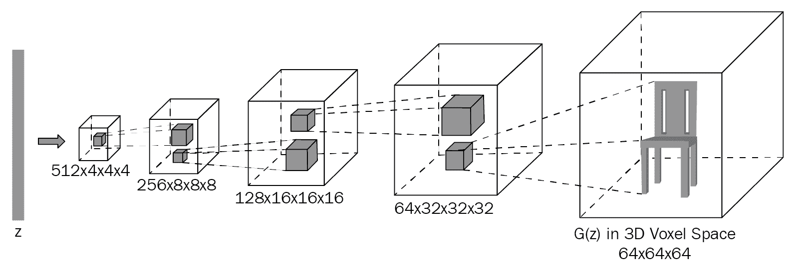
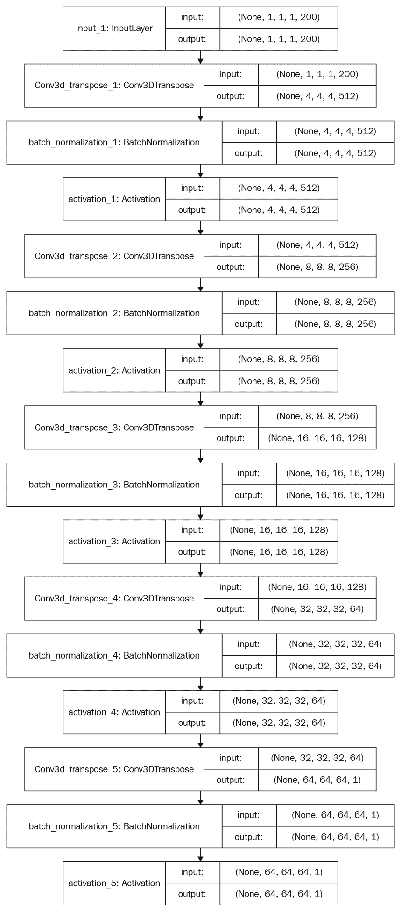
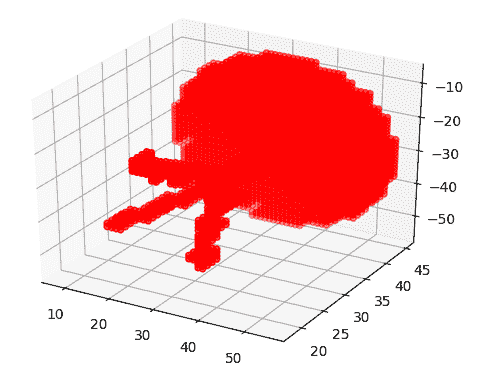
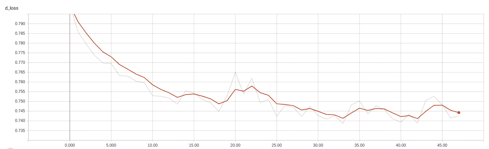

# 3D-GAN-使用 GAN 生成形状


3D-GAN 是用于 3D 形状生成的 GAN 架构。 由于处理 3D 图像涉及复杂性，因此 3D 形状生成通常是一个复杂的问题。 3D-GAN 是一种可以生成逼真的，变化的 3D 形状的解决方案，由吴嘉俊，张成凯，薛天凡等人在题为《通过 3D 生成对抗建模学习对象形状的概率潜在空间》的论文中介绍，可以在[这个页面](http://3dgan.csail.mit.edu/papers/3dgan_nips.pdf)上找到该论文。 在本章中，我们将使用 Keras 框架实现 3D-GAN。

我们将涵盖以下主题：

*   3D-GAN 基础知识简介
*   设置项目
*   准备数据
*   3D-GAN 的 Keras 实现
*   训练 3D-GAN
*   超参数优化
*   3D-GAN 的实际应用


# 3D-GAN 简介


**3D 生成对抗网络**（**3D-GAN**）是 GAN 的变体，就像 StackGAN，CycleGAN 和**超分辨率生成对抗网络**（**SRGAN**）一样 。 与朴素 GAN 相似，它具有生成器和判别器模型。 这两个网络都使用 3D 卷积层，而不是使用 2D 卷积。 如果提供足够的数据，它可以学习生成具有良好视觉质量的 3D 形状。

在仔细查看 3D-GAN 网络之前，让我们了解 3D 卷积。


# 3D 卷积


简而言之，3D 卷积操作沿`x`，`y`和`z`这三个方向对输入数据应用 3D 滤波器。 此操作将创建 3D 特征图的堆叠列表。 输出的形状类似于立方体或长方体的形状。 下图说明了 3D 卷积操作。 左立方体的突出显示部分是输入数据。 内核位于中间，形状为`(3, 3, 3)`。 右侧的块是卷积运算的输出：


现在，我们对 3D 卷积有了基本的了解，让我们继续看一下 3D-GAN 的架构。


# 3D-GAN 的架构


3D-GAN 中的两个网络都是深度卷积神经网络。 生成器网络通常是一个上采样网络。 它对噪声向量（来自概率潜在空间的向量）进行上采样，以生成形状为的 3D 图像，该形状的长度，宽度，高度和通道与输入图像相似。 判别器网络是下采样网络。 使用一系列 3D 卷积运算和密集层，它可以识别提供给它的输入数据是真实的还是伪造的。

在接下来的两节中，我们将介绍生成器和判别器网络的架构。


# 生成器网络的架构


生成器网络包含五个体积完全卷积的层，具有以下配置：

*   **卷积层**：5
*   **过滤器**： 512，256，128 和 64，1
*   **内核大小**：`4 x 4 x 4`， `4 x 4 x 4`， `4 x 4 x 4`， `4 x 4 x 4`， `4 x 4 x 4`
*   **步幅**：1、2、2、2、2 或`(1, 1), (2, 2), (2, 2), (2, 2), (2, 2)`
*   **批量标准化**：是，是，是，是，否
*   **激活**：ReLU， ReLU， ReLU， ReLU，Sigmoid
*   **汇聚层**：否，否，否，否，否
*   **线性层**：否，否，否，否，否

网络的输入和输出如下：

*   **输入**：从概率潜在空间中采样的 200 维向量
*   **输出**：形状为`64x64x64`的 3D 图像

下图显示了生成器的架构：



下图显示了区分器网络中张量的流动以及每个层的张量的输入和输出形状。 这将使您对网络有更好的了解：



完全卷积网络是在网络末端没有完全连接的密集层的网络。 相反，它仅由卷积层组成，并且可以进行端到端训练，就像具有完全连接的层的卷积网络一样。 生成器网络中没有池化层。


# 判别器网络的架构


判别器网络包含五个具有以下配置的体积卷积层：

*   **3D 卷积层**：5
*   **通道**：64、128、256、512、1
*   **内核大小**：4、4、4、4、4、4
*   **大步前进**：2、2、2、2、1
*   **激活**：LReLU，LReLU，LReLU，LReLU，Sigmoid
*   **批量标准化**：是，是，是，是，无
*   **汇聚层**：否，否，否，否，否
*   **线性层**：否，否，否，否，否

网络的输入和输出如下：

*   **输入**：形状为`(64, 64, 64)`的 3D 图像
*   **输出**：输入数据属于真实或假类的概率

下图显示了判别器网络中每一层的张量流以及张量的输入和输出形状。 这将使您对判别器网络有更好的了解：


判别器网络主要镜像生成器网络。 一个重要的区别是它使用中的 LeakyReLU 代替了 ReLU 作为激活函数。 而且，网络末端的 Sigmoid 层用于二进制分类，并预测所提供的图像是真实的还是伪造的。 最后一层没有规范化层，但是其他层使用批处理规范化输入。


# 目标功能


目标函数是训练 3D-GAN 的主要方法。 它提供损失值，这些损失值用于计算梯度，然后更新权重值。 3D-GAN 的对抗损失函数如下：


在这里， `log(D(X))`是二进制交叉熵损失或分类损失，`log(1 - D(G(Z)))`是对抗损失，`z`是来自概率空间`p(Z)`的潜向量， `D(X)`是判别器网络的输出， `G(Z)`是生成器网络的输出。


# 训练 3D-GAN


训练 3D-GAN 类似于训练朴素 GAN。 训练 3D-GAN 涉及的步骤如下：

1.  从高斯（正态）分布中采样 200 维噪声向量。
2.  使用生成器模型生成伪图像。
3.  在真实图像（从真实数据中采样）和生成器网络生成的伪图像上训练生成器网络。
4.  使用对抗模型训练生成器模型。 不要训练判别器模型。
5.  对指定的时期数重复这些步骤。

我们将在后面的部分中详细探讨这些步骤。 让我们继续建立一个项目。


# 建立一个项目


该项目的源代码可在 GitHub 上的[以下链接](https://github.com/PacktPublishing/Generative-Adversarial-Networks-Projects)中找到。

运行以下命令来设置项目：

1.  首先导航到父目录，如下所示：

```py
cd Generative-Adversarial-Networks-Projects
```

2.  接下来，将目录从当前目录更改为`Chapter02`目录：

```py
cd Chapter02
```

3.  接下来，为该项目创建一个 Python 虚拟环境：

```py
virtualenv venv
```

4.  之后，激活虚拟环境：

```py
source venv/bin/activate
```

5.  最后，安装`requirements.txt`文件中指示的所有要求：

```py
pip install -r requirements.txt
```

我们现在已经成功建立了该项目。 有关更多信息，请参见代码存储库中包含的  `README.md` 文件。


# 准备数据


在本章中，我们将使用 3D ShapeNets 数据集，该数据集可从[这个页面](http://3dshapenets.cs.princeton.edu/3DShapeNetsCode.zip)获得。 它由 Wu 和 Song 等人发行。 并包含 40 个对象类别的正确注释的 3D 形状。 我们将使用目录中可用的体积数据，我们将在本章稍后详细讨论。 在接下来的几节中，我们将下载，提取和浏览数据集。

The 3D ShapeNets dataset is for academic use only. If you intend to use the dataset for commercial purposes, request permission from the authors of the paper, who can be reached at the following email address: `shurans@cs.princeton.edu`.


# 下载并提取数据集


运行以下命令以下载并提取数据集：

1.  首先使用以下链接下载`3DShapeNets`：

```py
wget http://3dshapenets.cs.princeton.edu/3DShapeNetsCode.zip
```

2.  下载文件后，运行以下命令将文件提取到适当的目录中：

```py
unzip 3DShapeNetsCode.zip
```

现在，我们已经成功下载并提取了数据集。 它包含`.mat`（MATLAB）格式的图像。 每隔一张图像是 3D 图像。 在接下来的几节中，我们将学习体素，即 3D 空间中的点。


# 探索数据集


要了解数据集，我们需要可视化 3D 图像。 在接下来的几节中，我们将首先更详细地了解什么是体素。 然后，我们将加载并可视化 3D 图像。


# 什么是体素？


**体像素**或体素是三维空间中的一个点。 体素在`x`，`y`和`z`方向上定义了具有三个坐标的位置。 体素是表示 3D 图像的基本单位。 它们主要用于 CAT 扫描，X 射线和 MRI 中，以创建人体和其他 3D 对象的准确 3D 模型。 要处理 3D 图像，了解体素非常重要，因为这些是 3D 图像的组成。 包含下图，以使您了解 3D 图像中的体素是什么样的：


在 3D 图像中的一系列体素。 阴影区域是单个体素。

前面的图像是体素的堆叠表示。 灰色长方体代表一个体素。 现在，您了解了什么是体素，让我们在下一部分中加载和可视化 3D 图像。


# 加载和可视化 3D 图像


3D ShapeNets 数据集包含`.mat`文件格式。 我们将这些`.mat`文件转换为 NumPy N 维数组。 我们还将可视化 3D 图像，以直观了解数据集。

执行以下代码以从`.mat`文件加载 3D 图像：

1.  使用`scipy`中的`loadmat()`功能检索`voxels`。 代码如下：

```py
import scipy.io as io
voxels = io.loadmat("path to .mat file")['instance']
```

2.  加载的 3D 图像的形状为`30x30x30`。 我们的网络需要形状为`64x64x64`的图像。 我们将使用 NumPy 的 `pad()`方法将 3D 图像的尺寸增加到`32x32x32`：

```py
import numpy as np
voxels = np.pad(voxels, (1, 1), 'constant', constant_values=(0, 0))
```

`pad()`方法采用四个参数，它们是实际体素的 N 维数组，需要填充到每个轴边缘的值的数量，模式值（`constant`）和`constant_values` 被填充。

3.  然后，使用`scipy.ndimage`模块中的`zoom()`功能将 3D 图像转换为尺寸为`64x64x64`的 3D 图像。

```py
import scipy.ndimage as nd
voxels = nd.zoom(voxels, (2, 2, 2), mode='constant', order=0)
```

我们的网络要求图像的形状为`64x64x64`，这就是为什么我们将 3D 图像转换为这种形状的原因。


# 可视化 3D 图像


让我们使用 matplotlib 可视化 3D 图像，如以下代码所示：

1.  首先创建一个 matplotlib 图并向其中添加一个子图：

```py
fig = plt.figure()
ax = fig.gca(projection='3d')
ax.set_aspect('equal')
```

2.  接下来，将`voxels`添加到绘图中：

```py
ax.voxels(voxels, edgecolor="red")
```

3.  接下来，显示该图并将其另存为图像，以便稍后我们可以对其进行可视化和理解：

```py
plt.show() plt.savefig(file_path)
```

第一个屏幕截图表示 3D 飞机上的飞机：


第二张屏幕截图表示 3D 平面中的表格：



第三个屏幕截图表示 3D 平面中的椅子：


我们已经成功下载，提取和浏览了数据集。 我们还研究了如何使用体素。 在下一节中，我们将在 Keras 框架中实现 3D-GAN。


# 3D-GAN 的 Keras 实现


在本节中，我们将在 Keras 框架中实现生成器网络和判别器网络。 我们需要创建两个 Keras 模型。 这两个网络都有各自独立的权重值。 让我们从生成器网络开始。


# 生成器网络


为了实现生成器网络，我们需要创建 Keras 模型并添加神经网络层。 实现生成器网络所需的步骤如下：

1.  首先为不同的超参数指定值：

```py
z_size = 200 gen_filters = [512, 256, 128, 64, 1]
gen_kernel_sizes = [4, 4, 4, 4, 4]
gen_strides = [1, 2, 2, 2, 2]
gen_input_shape = (1, 1, 1, z_size)
gen_activations = ['relu', 'relu', 'relu', 'relu', 'sigmoid']
gen_convolutional_blocks = 5
```

2.  接下来，创建一个输入层，以允许网络进行输入。 生成器网络的输入是从概率潜在空间中采样的向量：

```py
input_layer = Input(shape=gen_input_shape)
```

3.  然后，添加第一个 3D 转置卷积（或 3D 解卷积）块，如以下代码所示：

```py
# First 3D transpose convolution( or 3D deconvolution) block a = Deconv3D(filters=gen_filters[0],  
 kernel_size=gen_kernel_sizes[0],
             strides=gen_strides[0])(input_layer)
a = BatchNormalization()(a, training=True)
a = Activation(activation=gen_activations[0])(a)
```

4.  接下来，再添加四个 3D 转置卷积（或 3D 解卷积）块，如下所示：

```py
# Next 4 3D transpose convolution( or 3D deconvolution) blocks for i in range(gen_convolutional_blocks - 1):
    a = Deconv3D(filters=gen_filters[i + 1], 
 kernel_size=gen_kernel_sizes[i + 1],
                 strides=gen_strides[i + 1], padding='same')(a)
    a = BatchNormalization()(a, training=True)
    a = Activation(activation=gen_activations[i + 1])(a)
```

5.  然后，创建 Keras 模型并指定生成器网络的输入和输出：

```py
model = Model(inputs=input_layer, outputs=a)
```

6.  将生成器网络的整个代码包装在一个名为`build_generator()`的函数内：

```py
def build_generator():
 """
 Create a Generator Model with hyperparameters values defined as follows  :return: Generator network
 """  z_size = 200
  gen_filters = [512, 256, 128, 64, 1]
 gen_kernel_sizes = [4, 4, 4, 4, 4]
 gen_strides = [1, 2, 2, 2, 2]
 gen_input_shape = (1, 1, 1, z_size)
 gen_activations = ['relu', 'relu', 'relu', 'relu', 'sigmoid']
 gen_convolutional_blocks = 5    input_layer = Input(shape=gen_input_shape)

 # First 3D transpose convolution(or 3D deconvolution) block
  a = Deconv3D(filters=gen_filters[0], 
 kernel_size=gen_kernel_sizes[0],
 strides=gen_strides[0])(input_layer)
 a = BatchNormalization()(a, training=True)
 a = Activation(activation='relu')(a)

 # Next 4 3D transpose convolution(or 3D deconvolution) blocks
  for i in range(gen_convolutional_blocks - 1):
 a = Deconv3D(filters=gen_filters[i + 1], 
 kernel_size=gen_kernel_sizes[i + 1],
 strides=gen_strides[i + 1], padding='same')(a)
 a = BatchNormalization()(a, training=True)
 a = Activation(activation=gen_activations[i + 1])(a)

 gen_model = Model(inputs=input_layer, outputs=a)

 gen_model.summary()
 return gen_model
```

我们已经成功地为生成器网络创建了 Keras 模型。 接下来，为判别器网络创建 Keras 模型。


# 判别器网络


同样，要实现区分器网络，我们需要创建 Keras 模型并向其中添加神经网络层。 实现判别器网络所需的步骤如下：

1.  首先为不同的超参数指定值：

```py
dis_input_shape = (64, 64, 64, 1)
dis_filters = [64, 128, 256, 512, 1]
dis_kernel_sizes = [4, 4, 4, 4, 4]
dis_strides = [2, 2, 2, 2, 1]
dis_paddings = ['same', 'same', 'same', 'same', 'valid']
dis_alphas = [0.2, 0.2, 0.2, 0.2, 0.2]
dis_activations = ['leaky_relu', 'leaky_relu', 'leaky_relu', 'leaky_relu', 'sigmoid']
dis_convolutional_blocks = 5
```

2.  接下来，创建一个输入层，以允许网络进行输入。 判别器网络的输入是形状为 `64x64x64x1`的 3D 图像：

```py
dis_input_layer = Input(shape=dis_input_shape)
```

3.  然后，添加第一个 3D 卷积块，如下所示：

```py
# The first 3D Convolution block a = Conv3D(filters=dis_filters[0],
           kernel_size=dis_kernel_sizes[0],
           strides=dis_strides[0],
           padding=dis_paddings[0])(dis_input_layer)
a = BatchNormalization()(a, training=True)
a = LeakyReLU(alphas[0])(a)
```

4.  之后，再添加四个 3D 卷积块，如下所示：

```py
# The next 4 3D Convolutional Blocks for i in range(dis_convolutional_blocks - 1):
    a = Conv3D(filters=dis_filters[i + 1],
               kernel_size=dis_kernel_sizes[i + 1],
               strides=dis_strides[i + 1],
               padding=dis_paddings[i + 1])(a)
    a = BatchNormalization()(a, training=True)
    if dis_activations[i + 1] == 'leaky_relu':
        a = LeakyReLU(dis_alphas[i + 1])(a)
    elif dis_activations[i + 1] == 'sigmoid':
        a = Activation(activation='sigmoid')(a)
```

5.  接下来，创建一个 Keras 模型，并为判别器网络指定输入和输出：

```py
dis_model = Model(inputs=dis_input_layer, outputs=a)
```

6.  将判别器网络的完整代码包装在一个函数中，如下所示：

```py
def build_discriminator():
    """
 Create a Discriminator Model using hyperparameters values defined as follows  :return: Discriminator network
 """    dis_input_shape = (64, 64, 64, 1)
    dis_filters = [64, 128, 256, 512, 1]
    dis_kernel_sizes = [4, 4, 4, 4, 4]
    dis_strides = [2, 2, 2, 2, 1]
    dis_paddings = ['same', 'same', 'same', 'same', 'valid']
    dis_alphas = [0.2, 0.2, 0.2, 0.2, 0.2]
    dis_activations = ['leaky_relu', 'leaky_relu', 'leaky_relu', 
 'leaky_relu', 'sigmoid']
    dis_convolutional_blocks = 5    dis_input_layer = Input(shape=dis_input_shape)

    # The first 3D Convolutional block
  a = Conv3D(filters=dis_filters[0],
               kernel_size=dis_kernel_sizes[0],
               strides=dis_strides[0],
               padding=dis_paddings[0])(dis_input_layer)
    a = BatchNormalization()(a, training=True)
    a = LeakyReLU(dis_alphas[0])(a)

    # Next 4 3D Convolutional Blocks
  for i in range(dis_convolutional_blocks - 1):
        a = Conv3D(filters=dis_filters[i + 1],
                   kernel_size=dis_kernel_sizes[i + 1],
                   strides=dis_strides[i + 1],
                   padding=dis_paddings[i + 1])(a)
        a = BatchNormalization()(a, training=True)
        if dis_activations[i + 1] == 'leaky_relu':
            a = LeakyReLU(dis_alphas[i + 1])(a)
        elif dis_activations[i + 1] == 'sigmoid':
            a = Activation(activation='sigmoid')(a)

    dis_model = Model(inputs=dis_input_layer, outputs=a)
    print(dis_model.summary())
 return dis_model
```

在本节中，我们为判别器网络创建了 Keras 模型。 我们现在准备训练 3D-GAN。


# 训练 3D-GAN


训练 3D-GAN 类似于训练朴素 GAN。 我们首先在生成的图像和真实图像上训练判别器网络，但是冻结生成器网络。 然后，我们训练生成器网络，但冻结区分器网络。 我们对指定的时期数重复此过程。 在一次迭代中，我们按顺序训练两个网络。 训练 3D-GAN 是一个端到端的训练过程。 让我们一步一步地进行这些步骤。


# 训练网络


要训​​练 3D-GAN，请执行以下步骤：

1.  首先指定训练所需的不同超参数的值，如下所示：

```py
gen_learning_rate = 0.0025 dis_learning_rate = 0.00001
beta = 0.5
batch_size = 32
z_size = 200
DIR_PATH = 'Path to the 3DShapenets dataset directory'
generated_volumes_dir = 'generated_volumes'
log_dir = 'logs'
```

2.  接下来，创建并编译两个网络，如下所示：

```py
# Create instances
generator = build_generator()
discriminator = build_discriminator()

# Specify optimizer 
gen_optimizer = Adam(lr=gen_learning_rate, beta_1=beta)
dis_optimizer = Adam(lr=dis_learning_rate, beta_1=0.9)

# Compile networks
generator.compile(loss="binary_crossentropy", optimizer="adam")
discriminator.compile(loss='binary_crossentropy', optimizer=dis_optimizer)
```

我们正在使用`Adam`优化器作为优化算法，并使用`binary_crossentropy`作为损失函数。 在第一步中指定`Adam`优化器的超参数值。

3.  然后，创建并编译对抗模型：

```py
discriminator.trainable = False adversarial_model = Sequential()
adversarial_model.add(generator)
adversarial_model.add(discriminator)  adversarial_model.compile(loss="binary_crossentropy", optimizer=Adam(lr=gen_learning_rate, beta_1=beta))
```

4.  之后，提取并加载所有`airplane`图像以进行训练：

```py
def getVoxelsFromMat(path, cube_len=64):
    voxels = io.loadmat(path)['instance']   voxels = np.pad(voxels, (1, 1), 'constant', constant_values=(0, 0))   if cube_len != 32 and cube_len == 64:
        voxels = nd.zoom(voxels, (2, 2, 2), mode='constant', order=0)   return voxels
 def get3ImagesForACategory(obj='airplane', train=True, cube_len=64, obj_ratio=1.0):
    obj_path = DIR_PATH + obj + '/30/'
  obj_path += 'train/' if train else 'test/'
  fileList = [f for f in os.listdir(obj_path) if f.endswith('.mat')]
    fileList = fileList[0:int(obj_ratio * len(fileList))]
    volumeBatch = np.asarray([getVoxelsFromMat(obj_path + f, cube_len) for f in fileList], dtype=np.bool)
    return volumeBatch

volumes = get3ImagesForACategory(obj='airplane', train=True, obj_ratio=1.0)
volumes = volumes[..., np.newaxis].astype(np.float)
```

5.  接下来，添加`TensorBoard`回调并添加`generator`和`discriminator`网络：

```py
tensorboard = TensorBoard(log_dir="{}/{}".format(log_dir, time.time()))
tensorboard.set_model(generator)
tensorboard.set_model(discriminator)
```

6.  添加一个循环，该循环将运行指定的时期数：

```py
for epoch in range(epochs):
    print("Epoch:", epoch)

    # Create two lists to store losses
    gen_losses = []
    dis_losses = []
```

7.  在第一个循环中添加另一个循环以运行指定的批量数量：

```py
    number_of_batches = int(volumes.shape[0] / batch_size)
    print("Number of batches:", number_of_batches)
    for index in range(number_of_batches):
        print("Batch:", index + 1)
```

8.  接下来，从一组真实图像中采样一批图像，并从高斯正态分布中采样一批噪声向量。 噪声向量的形状应为`(1, 1, 1, 200)`：

```py
z_sample = np.random.normal(0, 0.33, size=[batch_size, 1, 1, 1, 
                            z_size]).astype(np.float32)
volumes_batch = volumes[index * batch_size:(index + 1) * batch_size, 
                        :, :, :]
```

9.  使用生成器网络生成伪造图像。 向其传递`z_sample`的一批噪声向量，并生成一批假图像：

```py
gen_volumes = generator.predict(z_sample,verbose=3)
```

10.  接下来，在由生成器生成的伪图像和一组真实图像中的一批真实图像上训练判别器网络。 另外，使判别器易于训练：

```py
# Make the discriminator network trainable discriminator.trainable = True

# Create fake and real labels
labels_real = np.reshape([1] * batch_size, (-1, 1, 1, 1, 1))
labels_fake = np.reshape([0] * batch_size, (-1, 1, 1, 1, 1))

# Train the discriminator network
loss_real = discriminator.train_on_batch(volumes_batch, 
                                         labels_real)
loss_fake = discriminator.train_on_batch(gen_volumes, 
                                         labels_fake)

# Calculate total discriminator loss
d_loss = 0.5 * (loss_real + loss_fake)
```

前面的代码训练了判别器网络并计算了总的判别器损失。

11.  训练同时包含`generator`和`discriminator`网络的对抗模型：

```py
z = np.random.normal(0, 0.33, size=[batch_size, 1, 1, 1, z_size]).astype(np.float32)

 # Train the adversarial model        g_loss = adversarial_model.train_on_batch(z, np.reshape([1] * batch_size, (-1, 1, 1, 1, 1)))

```

另外，将损失添加到其各自的列表中，如下所示：

```py
        gen_losses.append(g_loss)
        dis_losses.append(d_loss)
```

12.  每隔一个纪元生成并保存 3D 图像：

```py
 if index % 10 == 0:
            z_sample2 = np.random.normal(0, 0.33, size=[batch_size, 1, 1, 1, z_size]).astype(np.float32)
            generated_volumes = generator.predict(z_sample2, verbose=3)
            for i, generated_volume in enumerate(generated_volumes[:5]):
                voxels = np.squeeze(generated_volume)
                voxels[voxels < 0.5] = 0.
  voxels[voxels >= 0.5] = 1.
  saveFromVoxels(voxels, "results/img_{}_{}_{}".format(epoch, index, i))
```

13.  在每个时期之后，将平均损失保存到`tensorboard`：

```py
# Save losses to Tensorboard write_log(tensorboard, 'g_loss', np.mean(gen_losses), epoch)
write_log(tensorboard, 'd_loss', np.mean(dis_losses), epoch)
```

My advice is to train it for 100 epochs to find the problems in the code. Once you have solved those problems, you can then train the network over the course of 100,000 epochs.


# 保存模型


训练完成后，通过添加以下代码来保存生成器和判别器模型的学习权重：

```py
""" Save models """ generator.save_weights(os.path.join(generated_volumes_dir, "generator_weights.h5"))
discriminator.save_weights(os.path.join(generated_volumes_dir, "discriminator_weights.h5"))
```


# 测试模型


要测试网络，请创建`generator`和`discriminator`网络。 然后，加载学习的权重。 最后，使用`predict()`方法生成预测：

```py
# Create models generator = build_generator()
discriminator = build_discriminator()

# Load model weights generator.load_weights(os.path.join(generated_volumes_dir, "generator_weights.h5"), True)
discriminator.load_weights(os.path.join(generated_volumes_dir, "discriminator_weights.h5"), True)

# Generate 3D images z_sample = np.random.normal(0, 0.33, size=[batch_size, 1, 1, 1, z_size]).astype(np.float32)
generated_volumes = generator.predict(z_sample, verbose=3)
```

在本节中，我们成功地训练了 3D-GAN 的生成器和识别器。 在下一节中，我们将探讨超参数调整和各种超参数优化选项。


# 可视化损失


要可视化  训练的损失，请按如下所示启动，，，，`tensorboard`，，服务器。

```py
tensorboard --logdir=logs
```

现在，在浏览器中打开  `localhost:6006` 。 TensorBoard 的标量部分包含两种损失的图表：


生成器网络的损失图



判别器网络的损失图

这些图将帮助您决定是继续还是停止训练。 如果损失不再减少，您就可以停止训练，因为没有改善的机会。 如果损失持续增加，则必须停止训练。 尝试使用超参数，然后选择一组您认为可能会提供更好结果的超参数。 如果损失逐渐减少，请继续训练模型。


# 可视化图形


TensorBoard 的 GRAPHS 部分包含两个网络的图形 。 如果网络性能不佳，这些图可以帮助您调试网络。 它们还显示了每个图中的张量流和不同的运算：


# 超参数优化


我们训练的模型可能不是一个完美的模型，但是我们可以优化超参数来改进它。 3D-GAN 中有许多可以优化的超参数。 其中包括：

*   **批量大小**：尝试使用 8、16、32、54 或 128 的批量大小值。
*   **时期数**：尝试 100 个时期，并将其逐渐增加到 1,000-5,000。
*   **学习率**：这是最重要的超参数。 用 0.1、0.001、0.0001 和其他较小的学习率进行实验。
*   **生成器和判别器网络**的不同层中的激活函数：使用 Sigmoid，tanh，ReLU，LeakyReLU，ELU，SeLU 和其他激活函数进行实验。
*   **优化算法**：尝试使用 Adam，SGD，Adadelta，RMSProp 和 Keras 框架中可用的其他优化器。
*   **损失函数**：二进制交叉熵是最适合 3D-GAN 的损失函数。
*   **两个网络中的层数**：根据可用的训练数据量，在网络中尝试不同的层数。 如果您有足够的可用数据来进行训练，则可以使网络更深。

我们还可以通过使用 [Hyperopt](https://github.com/hyperopt/hyperopt) 或 [Hyperas](https://github.com/maxpumperla/hyperas) 选择最佳的超参数集。


# 3D-GAN 的实际应用


3D-GAN 可以广泛用于各种行业，如下所示：

*   **制造业**：3D-GAN 可以是帮助快速创建原型的创新工具。 他们可以提出创意，并可以帮助模拟和可视化 3D 模型。
*   **3D 打印**：3D-GAN 生成的 3D 图像可用于在 3D 打印中打印对象。 创建 3D 模型的手动过程非常漫长。

*   **设计过程**：3D 生成的模型可以很好地估计特定过程的最终结果。 他们可以向我们展示将要构建的内容。
*   **新样本**：与其他 GAN 相似，3D-GAN 可以生成图像来训练监督模型。


# 概要


在本章中，我们探讨了 3D-GAN。 我们首先介绍了 3D-GAN，并介绍了架构以及生成器和判别器的配置。 然后，我们经历了建立项目所需的不同步骤。 我们还研究了如何准备数据集。 最后，我们在 Keras 框架中实现了 3D-GAN，并在我们的数据集中对其进行了训练。 我们还探讨了不同的超参数选项。 我们通过探索 3D-GAN 的实际应用来结束本章。

在下一章中，我们将学习如何使用**条件生成对抗网络（** cGAN **）执行面部老化。**


