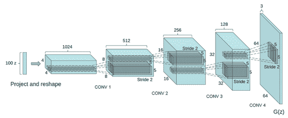
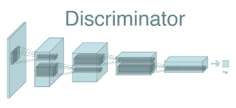
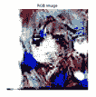

# 使用 DCGAN 生成动漫角色


众所周知，卷积层确实擅长处理图像。 他们能够学习重要的特征，例如边缘，形状和复杂的对象，有效的， ，例如神经网络，例如 Inception，AlexNet， **视觉几何组**（**VGG**）和 ResNet。 Ian Goodfellow 等人在其名为《生成对抗网络》的论文中提出了具有密集层的**生成对抗网络**（**GAN**），[该网络可在以下链接获得](https://arxiv.org/pdf/1406.2661.pdf)。 复杂的神经网络，例如**卷积神经网络**（**CNN**），**循环神经网络**（**RNN**）和**长短期记忆**（**LSTM**）最初并未在 GAN 中进行测试。 **深度卷积生成对抗网络**（**DCGAN**）的发展是使用 CNN 进行图像生成的重要一步。 DCGAN 使用卷积层而不是密集层。 它们是由研究人员 Alec Radford ， Luke Metz ， Soumith Chintala 等，在其论文《使用深度卷积生成对抗网络的无监督表示学习》中提出的，[可以在以下链接中找到](https://arxiv.org/pdf/1511.06434.pdf)。 从那时起，DCGAN 被广泛用于各种图像生成任务。 在本章中，我们将使用 DCGAN 架构生成动漫角色。

在本章中，我们将介绍以下主题：

*   DCGAN 简介
*   GAN 网络的架构细节
*   设置项目
*   准备数据集进行训练
*   DCGAN 的 Keras 实现以生成动画角色
*   在动漫角色数据集上训练 DCGAN
*   评估训练好的模型
*   通过优化超参数优化网络
*   DCGAN 的实际应用


# DCGAN 简介


CNN 在计算机视觉任务中非常出色，无论是用于分类图像还是检测图像中的对象。 CNN 善于理解图像，以至于激发研究人员在 GAN 网络中使用 CNN。 最初，GAN 官方论文的作者介绍了仅具有密集层的**深层神经网络**（**DNN**）。 在 GAN 网络的原始实现中未使用卷积层。 在以前的 GAN 中，生成器和判别器网络仅使用密集的隐藏层。 相反，作者建议在 GAN 设置中可以使用不同的神经网络架构。

DCGAN 扩展了在判别器和生成器网络中使用卷积层的思想。 DCGAN 的设置类似于朴素 GAN。 它由两个网络组成：生成器和判别器。 生成器是具有卷积层的 DNN，而判别器是具有卷积层的 DNN。 训练 DCGAN 类似于训练普通 GAN 网络。 在第一章中，我们了解到网络参与了非合作博弈，其中判别器网络将其错误反向传播到生成器网络，生成器网络使用此错误来提高其权重。

在下一部分中，我们将探索两个网络的架构。


# DCGAN 的建筑细节


如前所述，DCGAN 网络在两个网络中都使用卷积层。 重申一下，CNN 是一个具有卷积层，紧随其后的归一化或池化层以及紧随其后的激活函数的网络。 在 DCGAN 中，判别器网络会拍摄图像，在卷积和池化层的帮助下对图像进行降采样，然后使用密集的分类层将图像分类为真实图像或伪图像。 生成器网络从潜在空间中获取随机噪声向量，使用上采样机制对其进行上采样，最后生成图像。 我们使用 Leaky ReLU 作为隐藏层的激活函数，并在 0.4 和 0.7 之间进行滤除以避免过拟合。

让我们看一下两个网络的配置。


# 配置生成器网络


在继续之前，让我们看一下生成器网络的架构：



来源：`arXiv:1511.06434 [cs.LG]`

上图包含了生成器网络架构中的不同层，并显示了它如何生成分辨率为`64 x 64 x 3`的图像。

DCGAN 的生成器网络包含 10 层。 它执行跨步卷积以增加张量的空间分辨率。 在 Keras 中，上采样和卷积层的组合等于跨步卷积层。 基本上，生成器网络会从均匀分布中获取采样的噪声向量，并不断对其进行转换，直到生成最终图像为止。 换句话说，它采取形状的张量（`batch_size, 100`），并输出形状的张量（`batch_size, 64, 64, 3`）。

让我们看一下生成器网络中的不同层：

| **编号** | **层名称** | **配置** |
| --- | --- | --- |
| 1 | 输入层 | `input_shape=(batch_size, 100)`，`output_shape=(batch_size, 100)` |
| 2 | 密集层 | `neurons=2048`，`input_shape=(batch_size, 100)`，`output_shape=(batch_size, 2048)`，`activation='relu'` |
| 3. | 密集层 | `neurons=16384`，`input_shape=(batch_size, 100)`，`output_shape=(batch_size, 2048)`，`batch_normalization=Yes`，`activation='relu'` |
| 4. | 重塑层 | `input_shape=(batch_size=16384)`，`outp` `ut_shape=(batch_size, 8, 8, 256)` |
| 5. | 上采样层 | `size=(2, 2)`，`input_shape=(batch_size, 8, 8, 256)`，`output_shape=(batch_size, 16, 16, 256)` |
| 6. | 2D 卷积层 | `filters=128`，`kernel_size=(5, 5)`，`strides=(1, 1)`，`padding='same'`，`input_shape=(batch_size, 16, 16, 256)`，`output_shape=(batch_size, 16, 16, 128)`， `activation='relu'` |
| 7. | 上采样层 | `size=(2, 2)`，`input_shape=(batch_size, 16, 16, 128)`，`output_shape=(batch_size, 32, 32, 128)` |
| 8. | 2D 卷积层 | `filters=64`，`kernel_size=(5, 5)`，`strides=(1, 1)`，`padding='same'`，`activation=ReLU`，`input_shape=(batch_size, 32, 32, 128)`，`output_shape=(batch_size, 32, 32, 64)`，`activation='relu'` |
| 9. | 上采样层 | `size=(2, 2)`，`input_shape=(batch_size, 32, 32, 64)`，`output_shape=(batch_size, 64, 64, 64)` |
| 10. | 2D 卷积层 | `filters=3`，`kernel_size=(5, 5)`，`strides=(1, 1)`，`padding='same'`，`activation=ReLU`，`input_shape=(batch_size, 64, 64, 64)`，`output_shape=(batch_size, 64, 64, 3)`，`activation='tanh'` |

L 等人研究了张量如何从第一层流到最后一层。 下图显示了不同层的输入和输出形状：


该配置对具有 TensorFlow 后端和`channels_last`格式的 Keras API 有效。


# 配置判别器网络


在继续之前，让我们看一下判别器网络的架构：



上图给出了生成器网络架构的顶层概述。

如前所述，判别器网络是一个包含 10 层的 CNN（您可以根据需要向网络添加更多层）。 基本上，它会拍摄尺寸为`64 x 64 x 3`的图像，使用 2D 卷积层对其进行下采样，然后将其传递到完全连接的层进行分类。 它的输出是对给定图像是伪图像还是真实图像的预测。 可以为 0 或 1；可以为 0。 如果输出为 1，则传递到判别器的图像是真实的；如果输出为 0，则传递的图像是伪图像。

让我们看一下判别器网络中的各层：

| **编号** | **层名称** | **配置** |
| --- | --- | --- |
| 1. | 输入层 | `input_shape=(batch_size, 64, 64, 3)`，`output_shape=(batch_size, 64, 64, 3)` |
| 2. | 2D 卷积层 | `filters=128`，`kernel_size=(5, 5)`，`strides=(1, 1)`，`padding='valid'`，`input_shape=(batch_size, 64, 64, 3)`，`output_shape=(batch_size, 64, 64, 128)`， `activation='leakyrelu'`，`leaky_relu_alpha=0.2` |
| 3. | 2D 最大池化 | `pool_size=(2, 2)`，`input_shape=(batch_size, 64, 64, 128)`，`output_shape=(batch_size, 32, 32, 128)` |
| 4. | 2D 卷积层 | `filters=256`，`kernel_size=(3, 3)`，`strides=(1, 1)`，`padding='valid'`，`input_shape=(batch_size, 32, 32, 128)`，`output_shape=(batch_size, 30, 30, 256)`， `activation='leakyrelu'`，`leaky_relu_alpha=0.2` |
| 5. | 2D 最大池化 | `pool_size=(2, 2)`，`input_shape=(batch_size, 30, 30, 256)`，`output_shape=(batch_size, 15, 15, 256)` |
| 6. | 2D 卷积层 | `filters=512`，`kernel_size=(3, 3)`，`strides=(1, 1)`，`padding='valid'`，`input_shape=(batch_size, 15, 15, 256)`，`output_shape=(batch_size, 13, 13, 512)`， `activation='leakyrelu'`，`leaky_relu_alpha=0.2` |
| 7. | 2D 最大池化 | `pool_size=(2, 2)`，`input_shape=(batch_size, 13, 13, 512)`，`output_shape=(batch_size, 6, 6, 512)` |
| 8. | 展开层 | `input_shape=(batch_size, 6, 6, 512)`，`output_shape=(batch_size, 18432)` |
| 9. | 密集层 | `neurons=1024`，`input_shape=(batch_size, 18432)`，`output_shape=(batch_size, 1024)`，`activation='leakyrelu'`，`'leakyrelu_alpha'=0.2` |
| 10. | 密集层 | `neurons=1`，`input_shape=(batch_size, 1024)`，`output_shape=(batch_size, 1)`，`activation='sigmoid'` |

L 等人研究了张量如何从第一层流到最后一层。 下图显示了不同层的输入和输出形状：


该配置对具有 TensorFlow 后端和`channels_last`格式的 Keras API 有效。


# 设置项目


我们已经克隆/下载了所有章节的完整代码。 下载的代码包含一个名为`Chapter04`的目录，该目录包含本章的全部代码。 执行以下命令来设置项目：

1.  首先，导航到父目录，如下所示：

```py
cd Generative-Adversarial-Networks-Projects
```

2.  现在，将目录从当前目录更改为`Chapter04`：

```py
cd Chapter04
```

3.  接下来，为该项目创建一个 Python 虚拟环境：

```py
virtualenv venv
virtualenv venv -p python3 # Create a virtual environment using 
 python3 interpreter
virtualenv venv -p python2 # Create a virtual environment using 
 python2 interpreter
```

我们将为此项目使用此新创建的虚拟环境。 每章都有其自己单独的虚拟环境。

4.  接下来，激活虚拟环境：

```py
source venv/bin/activate
```

激活虚拟环境后，所有其他命令将在此虚拟环境中执行。

5.  接下来，通过执行以下命令来安装`requirements.txt`文件中给出的所有要求：

```py
pip install -r requirements.txt
```

您可以参考  `README.md` 文件，以获取有关如何设置项目的更多说明。 开发人员经常会遇到依赖关系不匹配的问题。 为每个项目创建一个单独的虚拟环境将解决此问题。

在本节中，我们已成功设置项目并安装了所需的依赖项。 在下一部分中，我们将使用数据集，包括下载和清理数据集。


# 下载并准备动漫角色数据集


要训练 DCGAN 网络，我们需要一个动漫人物数据集，其中包含人物的裁剪面孔。 收集数据集有多种方法。 我们可以使用公开可用的数据集，也可以抓取一个，只要不违反网站的抓取政策即可。 在本章中，我们将仅出于教育和演示目的刮取图像。 我们使用名为 `gallery-dl` 的搜寻器工具从 `pixiv.net` 抓取了图像。 这是一个命令行工具，可用于从网站下载图像集，例如 [pixiv.net](http://pixiv.net)，[exhentai.org](http://exhentai.org)，[danbooru.donmai.us](http://danbooru.donmai.us) 和更多。 [它可通过以下链接获得](https://github.com/mikf/gallery-dl)。


# 下载数据集


在本节中，我们将介绍安装依赖项和下载数据集所需的不同步骤。 在执行以下命令之前，激活为此项目创建的虚拟环境：

1.  执行以下命令安装`gallery-dl`：

```py
pip install --upgrade gallery-dl
```

2.  或者，您可以使用以下命令安装`gallery-dl`的最新开发版本：

```py
pip install --upgrade https://github.com/mikf/gallery-dl/archive/master.zip
```

3.  如果上述命令不起作用，请按照官方存储库中的说明进行操作：

```py
# Official gallery-dl Github repo
https://github.com/mikf/gallery-dl
```

4.  最后，执行以下命令以使用`gallery-dl.`从`danbooru.donmai.us`下载图像：

```py
gallery-dl https://danbooru.donmai.us/posts?tags=face
```

下载图像需要您自担风险。 所提供的信息仅用于教育目的，我们不支持非法刮取。 我们没有图像的版权，因为图像由其各自所有者托管。 出于商业目的，请联系网站的各自所有者或您所使用的内容。


# 探索数据集


在裁剪或调整图像大小之前，请查看下载的图像：


如您所见，有些图像还包含其他身体部位，我们在训练图像中不需要这些部位。 在下一部分中，我们将仅从这些图像中裁剪出脸部。 此外，我们会将所有图像调整为训练所需的尺寸。


# 裁剪数据集中的图像并调整其大小


在本节中，我们将从图像中裁剪出面孔。 我们将使用`python-animeface`从图像中裁剪出面孔。 这是一个开源 GitHub 存储库，可从命令行的图像中自动裁剪面部。 [它可以通过以下链接公开获得](https://github.com/nya3jp/python-animeface)。

执行以下步骤来裁剪图像并调整其大小：

1.  首先，下载`python-animeface`：

```py
pip install animeface
```

2.  接下来，导入任务所需的模块：

```py
import glob
import os

import animeface
from PIL import Image
```

3.  接下来，定义参数：

```py
total_num_faces = 0
```

3.  接下来，遍历所有图像以进行裁剪并一一调整其大小：

```py
for index, filename in  
    enumerate(glob.glob('/path/to/directory/containing/images/*.*')):
```

4.  在循环内，打开当前图像并检测其中的人脸：

```py
  try:
        # Open image
        im = Image.open(filename)

        # Detect faces
        faces = animeface.detect(im)
    except Exception as e:
        print("Exception:{}".format(e))
        continue
```

5.  接下来，获取图像中检测到的脸部坐标：

```py
    fp = faces[0].face.pos

    # Get coordinates of the face detected in the image
  coordinates = (fp.x, fp.y, fp.x+fp.width, fp.y+fp.height)
```

6.  现在，将脸部裁剪出图像：

```py
 # Crop image  cropped_image = im.crop(coordinates)
```

7.  接下来，将裁剪后的面部图像调整为`(64, 64)`的尺寸：

```py
 # Resize image  cropped_image = cropped_image.resize((64, 64), Image.ANTIALIAS)
```

8.  最后，将裁剪并调整大小的图像保存到所需目录：

```py
 cropped_image.save("/path/to/directory/to/store/cropped/images/filename.png"))
```

包装在 Python 函数中的完整代码如下所示：

```py
import glob
import os

import animeface
from PIL import Image

total_num_faces = 0   for index, filename in enumerate(glob.glob('/path/to/directory/containing/images/*.*')):
    # Open image and detect faces
  try:
        im = Image.open(filename)
        faces = animeface.detect(im)
    except Exception as e:
        print("Exception:{}".format(e))
        continue

 # If no faces found in the current image if len(faces) == 0:
        print("No faces found in the image")
        continue    fp = faces[0].face.pos

    # Get coordinates of the face detected in the image
  coordinates = (fp.x, fp.y, fp.x+fp.width, fp.y+fp.height)

    # Crop image
  cropped_image = im.crop(coordinates)

    # Resize image
  cropped_image = cropped_image.resize((64, 64), Image.ANTIALIAS)

    # Show cropped and resized image
 # cropped_image.show()   # Save it in the output directory  cropped_image.save("/path/to/directory/to/store/cropped/images/filename.png"))

    print("Cropped image saved successfully")
    total_num_faces += 1   print("Number of faces detected till now:{}".format(total_num_faces))

print("Total number of faces:{}".format(total_num_faces))
```

前面的脚本将从包含下载图像的文件夹中加载所有图像，使用`python-animeface`库检测脸部，然后**从初始图像中裁剪出脸部**。 然后，裁切后的图像将被调整为`64 x 64`的尺寸。如果要更改图像的尺寸，请相应地更改生成器和判别器的架构。 我们现在准备在我们的网络上工作。


# 使用 Keras 实现 DCGAN


在本节中，我们将在 Keras 框架中编写 DCGAN 的实现。 Keras 是一个使用 TensorFlow 或 Teano 作为后端的元框架。 它提供了用于神经网络的高级 API。 与低级框架（如 TensorFlow）相比，它还具有预构建的神经网络层，优化器，正则化器，初始化器和数据预处理层，可轻松进行原型制作。 让我们开始编写生成器网络的实现。 


# 生成器


如 DCGAN 部分的“架构”中所述，生成器网络由一些 2D 卷积层，上采样层，整形层和批归一化层组成 。 在 Keras 中，每个操作都可以指定为一个层。 甚至激活函数也是 Keras 中的层，可以像正常的密集层一样添加到模型中。

执行以下步骤来创建生成器网络：

1.  让我们开始创建一个`Sequential` Keras 模型：

```py
gen_model = Sequential()
```

2.  接下来，添加一个具有 2,048 个节点的密集层，然后添加一个激活层`tanh`：

```py
gen_model.add(Dense(units=2048))
gen_model.add(Activation('tanh'))
```

3.  接下来，添加第二层，它也是一个具有 16,384 个神经元的密集层。 接下来是`batch normalization`层，其中`default hyperparameters`和`tanh`作为**激活函数**：

```py
gen_model.add(Dense(256`8`8))
gen_model.add(BatchNormalization())
gen_model.add(Activation('tanh')) 
```

第二密集层的输出是大小为`16384`的张量。 此处，`(256, 8, 8)`是密集层中神经元的数量。

4.  接下来，向网络中添加一个重塑层，以将张量从最后一层重塑为（`batch_size, 8, 8, 256`）**：**形状的张量

```py
# Reshape layer
gen_model.add(Reshape((8, 8, 256), input_shape=(256`8`8,)))
```

5.  接下来，添加 2D 上采样层以将形状从`(8, 8, 256)`更改为`(16, 16, 256)`。 上采样大小为`(2, 2)`，这将张量的大小增加到其原始大小的两倍。 在这里，我们有 256 个张量为`16 x 16`：的张量。

```py
gen_model.add(UpSampling2D(size=(2, 2)))
```

6.  接下来，添加一个 2D 卷积层。 这使用指定数量的滤波器在张量上应用 2D 卷积。 在这里，我们使用 64 个过滤器和一个`(5, 5)`形状的内核：

```py
gen_model.add(Conv2D(128, (5, 5), padding='same'))
gen_model.add(Activation('tanh')) 
```

7.  接下来，添加 2D 向上采样层以将张量的形状从 `(batch_size, 16, 16, 64)`更改为`(batch_size, 32, 32, 64)`：

```py
gen_model.add(UpSampling2D(size=(2, 2))) 
```

2D 上采样层 将张量 的行和列分别以[0]和[1]的大小重复 。

8.  接下来，在第二个 2D 卷积层上添加 `64` 过滤器和，将`(5, 5)`的**核大小**`tanh`作为激活函数：

```py
gen_model.add(Conv2D(64, (5, 5), padding='same'))
gen_model.add(Activation('tanh'))
```

9.  接下来，添加 2D 上采样层，将形状从 `(batch_size, 32, 32, 64)`更改为`(batch_size, 64, 64, 64)`：

```py
gen_model.add(UpSampling2D(size=(2, 2))) 
```

10.  最后，在第三个 2D 卷积层上添加三个**过滤器**，**核大小**`(5, 5)` ，然后是`tanh`作为激活函数：

```py
gen_model.add(Conv2D(3, (5, 5), padding='same'))
gen_model.add(Activation('tanh'))
```

生成器网络将输出`(batch_size, 64, 64, 3)`形状的张量。 这批张量中的一个图像张量类似于具有三个通道的尺寸为`64 x 64`的图像： **红色，绿色**和**蓝色**（**RGB**）。

用 Python 方法包装的生成器网络的完整代码如下所示：

```py
def get_generator():
    gen_model = Sequential()

    gen_model.add(Dense(input_dim=100, output_dim=2048))
    gen_model.add(LeakyReLU(alpha=0.2))

    gen_model.add(Dense(256 * 8 * 8))
    gen_model.add(BatchNormalization())
    gen_model.add(LeakyReLU(alpha=0.2))

    gen_model.add(Reshape((8, 8, 256), input_shape=(256 * 8 * 8,)))
    gen_model.add(UpSampling2D(size=(2, 2)))

    gen_model.add(Conv2D(128, (5, 5), padding='same'))
    gen_model.add(LeakyReLU(alpha=0.2))

    gen_model.add(UpSampling2D(size=(2, 2)))

    gen_model.add(Conv2D(64, (5, 5), padding='same'))
    gen_model.add(LeakyReLU(alpha=0.2))

    gen_model.add(UpSampling2D(size=(2, 2)))

    gen_model.add(Conv2D(3, (5, 5), padding='same'))
    gen_model.add(LeakyReLU(alpha=0.2))
    return gen_model
```

现在我们已经创建了生成器网络，让我们开始创建判别器网络。


# 判别器


如 DCGAN 的架构中所述，判别器网络具有三个 2D 卷积层，每个层均具有激活函数，后跟两个最大合并层。 网络的尾部包含两个完全连接的（密集）层，用作分类层。 首先，让我们看一下判别器网络中的不同层：

*   所有卷积层都具有`LeakyReLU`作为激活函数，其`alpha`值为 0.2
*   卷积层分别具有 128、256 和 512 个滤波器。 它们的核大小分别为`(5, 5)`，`(3, 3)`和`(3, 3)`。
*   在卷积层之后，我们有一个展开层，它将输入平坦化为一维张量。
*   此后，网络具有两个密集层，分别具有 1,024 个神经元和一个神经元。
*   第一密集层具有`LeakyReLU`作为激活函数，而第二层具有乙状结肠作为激活函数。 乙状结肠激活用于二进制分类。 我们正在训练辨别器网络，以区分真实图像还是伪图像。

执行以下步骤来创建判别器网络：

1.  让我们开始创建一个`Sequential` Keras 模型：

```py
dis_model = Sequential()
```

2.  添加一个 2D 卷积层，该层采用形状为`(64, 64, 3)`的输入图像。 该层的超参数如下。 另外，添加具有`0.2`的`alpha`值的`LeakyReLU`作为激活函数：
    *   **过滤器**：128
    *   **核大小**：`(5, 5)`
    *   **填充**：相同：

```py
dis_model.add(Conv2D(filters=128, kernel_size=5, padding='same', 
 input_shape=(64, 64, 3)))
dis_model.add(LeakyReLU(alpha=0.2))
```

3.  接下来，添加池大小为`(2, 2)`的 2D 最大池化层。 最大池用于对图像表示进行下采样，并通过在表示的非重叠子区域上使用最大过滤来应用它：

```py
dis_model.add(MaxPooling2D(pool_size=(2, 2)))
```

来自第一层的输出张量的形状将为`(batch_size, 32, 32, 128)`。

4.  接下来，添加具有以下配置的另一个 2D 卷积层：
    *   **过滤器**：256
    *   **核大小**：`(3, 3)`
    *   **激活函数**： `LeakyReLU`，具有`alpha` 0.2
    *   **2D 最大池中的池大小**：`(2, 2)`

```py
dis_model.add(Conv2D(filters=256, kernel_size=3))
dis_model.add(LeakyReLU(alpha=0.2))
dis_model.add(MaxPooling2D(pool_size=(2, 2)))
```

该层的输出张量的形状将为 `(batch_size, 30, 30, 256)`。

5.  接下来，添加具有以下配置的第三个 2D 卷积层：
    *   **过滤器**： 512
    *   **核大小**：`(3, 3)`
    *   **激活函数**：`LeakyReLU`，带有`alpha` 0.2
    *   **2D 最大池中的池大小**：`(2, 2)`

```py
dis_model.add(Conv2D(512, (3, 3)))
dis_model.add(LeakyReLU(alpha=0.2))
dis_model.add(MaxPooling2D(pool_size=(2, 2)))
```

该层的输出张量的形状将为 `(batch_size, 13, 13, 512)`。

6.  接下来，添加一个扁平层。 这将使输入变平而不影响批量大小。 它产生一个二维张量：

```py
dis_model.add(Flatten())
```

来自平坦化层的张量的输出形状将为`(batch_size, 18432,)`。

7.  接下来，添加具有`1024`神经元和`alpha` 0.2 作为激活函数的`LeakyReLU`的密集层：

```py
dis_model.add(Dense(1024))
dis_model.add(LeakyReLU(alpha=0.2))
```

8.  最后，添加带有一个神经元的密集层以进行二进制分类。 Sigmoid 函数最适合二进制分类，因为它给出了分类的可能性：

```py
dis_model.add(Dense(1))
dis_model.add(Activation('tanh'))
```

网络将生成形状为`(batch_size, 1)`的输出张量。 输出张量包含类的概率。

包裹在 Python 方法中的判别器网络的完整代码如下：

```py
def get_discriminator():
    dis_model = Sequential()
    dis_model.add(
        Conv2D(128, (5, 5),
               padding='same',
               input_shape=(64, 64, 3))
    )
    dis_model.add(LeakyReLU(alpha=0.2))
    dis_model.add(MaxPooling2D(pool_size=(2, 2)))

    dis_model.add(Conv2D(256, (3, 3)))
    dis_model.add(LeakyReLU(alpha=0.2))
    dis_model.add(MaxPooling2D(pool_size=(2, 2)))

    dis_model.add(Conv2D(512, (3, 3)))
    dis_model.add(LeakyReLU(alpha=0.2))
    dis_model.add(MaxPooling2D(pool_size=(2, 2)))

    dis_model.add(Flatten())
    dis_model.add(Dense(1024))
    dis_model.add(LeakyReLU(alpha=0.2))

    dis_model.add(Dense(1))
    dis_model.add(Activation('sigmoid'))

    return dis_model
```

在本节中，我们已成功实现了判别器和生成器网络。 在下一部分中，我们将在“下载和准备动漫角色数据集”部分中准备的数据集上训练模型。


# 训练 DCGAN


同样，训练 DCGAN 类似于训练朴素 GAN 网络。 这是一个四步过程：

1.  加载数据集。
2.  构建和编译网络。
3.  训练判别器网络。
4.  训练生成器网络。

我们将在本节中一步一步地进行这些步骤。

让我们从定义变量和超参数开始：

```py
dataset_dir = "/Path/to/dataset/directory/*.*" batch_size = 128  z_shape = 100 epochs = 10000 dis_learning_rate = 0.0005 gen_learning_rate = 0.0005 dis_momentum = 0.9 gen_momentum = 0.9 dis_nesterov = True gen_nesterov = True 
```

在这里，我们为训练指定了不同的超参数。 现在，我们将看到如何为训练加载数据集。


# 加载样品


要训​​练 DCGAN 网络，我们需要将数据集加载到内存中，并且需要定义一种机制来加载成批的内存。 执行以下步骤以加载数据集：

1.  首先加载所有裁剪，调整大小并保存在`cropped`文件夹中的图像。 正确指定目录的路径，以便`glob.glob`方法可以创建其中所有文件的列表。 要读取图像，请使用`scipy.misc`模块中的`imread`方法。 以下代码显示了加载目录中所有图像的不同步骤：

```py
# Loading images all_images = []
for index, filename in enumerate(glob.glob('/Path/to/cropped/images/directory/*.*')):
    image = imread(filename, flatten=False, mode='RGB')
    all_images.append(image)
```

2.  接下来，为所有图像创建一个`ndarray`。 最终`ndarray`的形状将为`(total_num_images, 64, 64, 3)`。 此外，标准化所有图像：

```py
# Convert to Numpy ndarray
X = np.array(all_images)
X = (X - 127.5) / 127.5 
```

现在我们已经加载了数据集，接下来我们将看到如何构建和编译网络。


# 建立和编译网络


在本节中，我们将构建和编译训练所需的网络：

1.  首先定义训练所需的优化器，如下所示：

```py
# Define optimizers dis_optimizer = SGD(lr=dis_learning_rate, momentum=dis_momentum, nesterov=dis_nesterov)
gen_optimizer = SGD(lr=gen_learning_rate, momentum=gen_momentum, nesterov=gen_nesterov)
```

2.  接下来，创建生成器模型的实例，并编译生成器模型（编译将初始化权重参数，优化器算法，损失函数以及使用网络所需的其他必要步骤）：

```py
gen_model = build_generator()
gen_model.compile(loss='binary_crossentropy', optimizer=gen_optimizer)
```

使用`binary_crossentropy`作为生成器网络的`loss`函数，并使用`gen_optimizer`作为优化器。

3.  接下来，创建判别模型的实例，并对其进行编译，如下所示：

```py
dis_model = build_discriminator()
dis_model.compile(loss='binary_crossentropy', optimizer=dis_optimizer)
```

同样，使用`binary_crossentropy`作为判别器网络的损失函数，并使用`dis_optimizer`作为优化器。

4.  接下来，创建一个对抗模型。 一个对抗者将两个网络都包含在一个模型中。 对抗模型的架构如下：
    *   *输入->生成器->判别器->输出*

创建和编译对抗模型的代码如下：

```py
adversarial_model = Sequential()
adversarial_model.add(gen_model)
dis_model.trainable = False adversarial_model.add(dis_model)
```

当我们训练该网络时，我们不想训练判别器网络，因此在将其添加到对抗模型之前，使其变为不可训练的。

编译对抗模型，如下所示：

```py
adversarial_model.compile(loss='binary_crossentropy', optimizer=gen_optimizer)
```

使用`binary_crossentropy`作为损失函数，使用`gen_optimizer`作为对抗模型的优化器。

在开始训练之前，添加 TensorBoard 以可视化显示损失，如下所示：

```py
tensorboard = TensorBoard(log_dir="logs/{}".format(time.time()), write_images=True, write_grads=True, write_graph=True)
tensorboard.set_model(gen_model)
tensorboard.set_model(dis_model)
```

我们将针对指定的迭代次数训练网络，因此创建一个应运行指定次数的循环。 在每个时期内，我们将在大小为 128 的微型批量上训练网络。 计算需要处理的批量数量：

```py
for epoch in range(epcohs):
    print("Epoch is", epoch)
    number_of_batches = int(X.shape[0] / batch_size)
 print("Number of batches", number_of_batches)
    for index in range(number_of_batches):
```

现在，我们将仔细研究训练过程。 以下几点说明了 DCGAN 训练中涉及的不同步骤：

*   最初，这两个网络都是幼稚的并且具有随机权重。
*   训练 DCGAN 网络的标准过程是首先对一批样品进行判别器训练。
*   为此，我们需要假样品和真实样品。 我们已经有了真实的样本，因此现在需要生成伪样本。
*   要生成伪样本，请在均匀分布上创建形状为`(100, )`的潜向量。 将此潜向量馈入未经训练的生成器网络。 生成器网络将生成伪样本，我们将其用于训练判别器网络。
*   合并真实图像和伪图像以创建一组新的样本图像。 我们还需要创建一个标签数组：真实图像使用标签 1，伪图像使用标签 0。


# 训练判别器网络


执行以下步骤来训练判别器网络：

1.  首先从正态分布中采样一批噪声向量，如下所示：

```py
z_noise = np.random.normal(0, 1, size=(batch_size, z_shape))
```

要对值进行采样，请使用 Numpy 库中`np.random`模块中的`normal()`方法。

2.  接下来，从所有图像集中采样一批真实图像：

```py
image_batch = X[index * batch_size:(index + 1) * batch_size]
```

3.  接下来，使用生成器网络生成一批伪图像：

```py
generated_images = gen_model.predict_on_batch(z_noise)
```

4.  接下来，创建真实标签和伪标签：

```py
y_real = np.ones(batch_size) - np.random.random_sample(batch_size) * 0.2 y_fake = np.random.random_sample(batch_size) * 0.2
```

5.  接下来，在真实图像和真实标签上训练判别器网络：

```py
 dis_loss_real = dis_model.train_on_batch(image_batch, y_real)
```

6.  同样，在伪造图像和伪造标签上对其进行训练：

```py
dis_loss_fake = dis_model.train_on_batch(generated_images, y_fake)
```

7.  接下来，计算平均损失并将其打印到控制台：

```py
d_loss = (dis_loss_real+dis_loss_fake)/2 print("d_loss:", d_loss)
```

到目前为止，我们一直在训练判别器网络。 在下一部分中，让我们训练生成器网络。


# 训练生成器网络


为了训练生成器网络，我们必须训练对抗模型。 当我们训练对抗模型时，它只训练生成器网络，而冻结判别器网络。 由于我们已经训练过判别器网络，因此我们不会对其进行训练。 执行以下步骤来训练对抗模型：

1.  首先重新创建一批噪声向量。 从高斯/正态分布中采样以下噪声向量：

```py
z_noise = np.random.normal(0, 1, size=(batch_size, z_shape))
```

2.  接下来，对这批噪声向量训练对抗模型，如下所示：

```py
g_loss = adversarial_model.train_on_batch(z_noise, [1] * batch_size)
```

我们在一批噪声向量和实数标签上训练对抗模型。 在这里，*实数标签*是一个所有值均等于 1 的向量。我们还在训练生成器，以欺骗判别器网络。 为此，我们为它提供一个向量，该向量的所有值均等于 1。在此步骤中，生成器将接收来自生成器网络的反馈，并相应地进行改进。

3.  最后，将生成器损失打印到控制台以跟踪损失：

```py
print("g_loss:", g_loss)
```

有一种被动的方法可以评估训练过程。 每 10 个周期后，生成伪造图像并手动检查图像质量：

```py
 if epoch % 10 == 0:
        z_noise = np.random.normal(0, 1, size=(batch_size, z_shape))
        gen_images1 = gen_model.predict_on_batch(z_noise)

        for img in gen_images1[:2]:
            save_rgb_img(img, "results/one_{}.png".format(epoch))
```

这些 图像将帮助您决定是继续训练还是尽早停止训练。 如果生成的高分辨率图像的质量良好，请停止训练。 或者继续训练，直到您的模型变好为止。

我们已经成功地在动画角色数据集上训练了 DCGAN 网络。 现在我们可以使用该模型生成动漫人物图像。


# 产生影像


为了生成图像，我们需要一个从潜在空间采样的噪声向量。 Numpy 有一种称为`uniform()`的方法，可以根据均匀分布生成向量。 让我们看看如何在以下步骤中生成图像：

1.  通过添加以下代码行，创建尺寸为`(batch_size, 100)`的噪声向量：

```py
z_noise = np.random.normal(0, 1, size=(batch_size, z_shape))
```

2.  然后，使用生成器模型的`predict_on_batch`方法生成图像。 将上一步中创建的噪声向量馈入其中：

```py
gen_images = gen_model.predict_on_batch(z_noise)
```

3.  现在我们已经生成了图像，通过添加以下代码行将其保存。 创建一个名为`results`的目录来存储生成的图像：

```py
imsave('results/image_{}.jpg'.format(epoch),gen_images[0])
```

现在，您可以打开这些生成的图像以测量生成的模型的质量。 这是一种评估模型性能的被动方法。


# 保存模型


在 Keras 中保存模型只需要一行代码。 要保存生成器模型，请添加以下行：

```py
# Specify the path for the generator model
gen_model.save("directory/for/the/generator/model.h5") 
```

同样，通过添加以下行来保存判别器模型：

```py
# Specify the path for the discriminator model
dis_model.save("directory/for/the/discriminator/model.h5") 
```


# 可视化生成的图像


在将网络训练了 100 个时间段后，生成器将开始生成合理的图像。 让我们看一下生成的图像。

在 100 个时代之后，图像显示如下：



在 200 个时代之后，图像显示如下：


要生成非常好的图像，请将网络训练 10,000 个纪元。


# 可视化损失


为了可视化训练的损失，请按以下方式启动 TensorBoard 服务器：

```py
tensorboard --logdir=logs
```

现在，在浏览器中打开`localhost:6006`。 Tensorboard 的**标量**部分包含两种损失的图：


这些图将帮助您决定是继续还是停止训练。 如果损失不再减少，您就可以停止训练，因为没有改善的机会。 如果损失持续增加，则必须停止训练。 使用超参数，然后选择一组您认为可以提供更好结果的超参数。 如果损失逐渐减少，请继续训练模型。


# 可视化图形


Tensorboard 的`GRAPHS`部分包含两个网络的图形。 如果网络性能不佳，这些图可以帮助您调试网络。 它们还显示了每个图中的张量流和不同的操作：


# 调整超参数


超参数是模型的属性，在模型训练期间是固定的。 不同的参数可以具有不同的精度。 让我们看一下一些常用的超参数：

*   学习率
*   批量大小
*   纪元数
*   生成器优化器
*   判别器优化器
*   层数
*   密集层中的单位数
*   激活函数
*   损失函数

在“使用 Keras 实现 DCGAN”的部分中，学习率是固定的：生成器模型为 0.0005，判别器模型为 0.0005。 批处理大小为 128。调整这些值可能会导致我们创建更好的模型。 如果您的模型没有生成合理的图像，请尝试更改这些值，然后再次运行模型。


# DCGAN 的实际应用


可以为不同的使用案例定制 DCGAN。 DCGAN 的各种实际应用包括：

*   **动画角色的生成**：目前，动画师使用计算机软件手动绘制字符，有时还绘制在纸上。 这是一个手动过程，通常需要很多时间。 使用 DCGAN，可以在更短的时间内生成新的动漫角色，从而改善了创作过程。
*   **数据集的扩充**：如果您想训练一个监督的机器学习模型，要训练一个好的模型，您将需要一个大的数据集。 DCGAN 可以通过扩展现有数据集来提供帮助，因此可以增加监督模型训练所需的数据集大小。

*   **MNIST 字符的生成**：MNIST 数据集包含 60,000 张手写数字图像。 要训​​练复杂的监督学习模型，MNIST 数据集是不够的。 DCGAN 一旦受过训练，将生成可以添加到原始数据集中的新数字。
*   **人脸生成**：DCGAN 使用卷积神经网络，非常擅长生成逼真的图像。
*   **特征提取器**：训练后，可以使用判别器从中间层提取特征。 这些提取的功能在样式迁移和面部识别等任务中很有用。 样式迁移涉及生成图像的内部表示，用于计算样式和内容损失。 请参阅[以下论文](https://arxiv.org/pdf/1508.06576.pdf)，以了解有关样式转换的更多信息。


# 总结


在本章中，我们介绍了深度卷积生成对抗网络。 我们从基本介绍 DCGAN 开始，然后深入探讨了 DCGAN 网络的架构。 之后，我们设置项目并安装必要的依赖项。 然后，我们研究了下载和准备数据集所需的不同步骤。 然后，我们准备了网络的 Keras 实现，并在我们的数据集中对其进行了训练。 经过训练后，我们将其用于生成新的动漫角色。 我们还探讨了 DCGAN 在实际用例中的不同应用。

在下一章中，我们将研究用于高分辨率图像生成的 SRGAN。


