# StackGAN-文本到逼真的图像合成


文本到图像的合成是**生成对抗网络**（**GAN**）的用例之一，它具有许多工业应用，就像前面章节中描述的 GAN 一样。 从文本描述中合成图像非常困难，因为要构建可以生成反映文本含义的图像的 模型非常困难。 一个试图解决这个问题的网络是 StackGAN。 在本章中，我们将使用 TensorFlow 作为后端在 Keras 框架中实现 StackGAN。

在本章中，我们将介绍以下主题：

*   StackGAN 简介
*   StackGAN 的架构
*   数据收集与准备
*   StackGAN 的 Keras 实现
*   训练 StackGAN
*   评估模型
*   pix2pix 网络的实际应用


# StackGAN 简介


之所以这样称呼 StackGAN，是因为它具有两个 GAN，这些 GAN 堆叠在一起形成了一个能够生成高分辨率图像的网络。 它分为两个阶段，第一阶段和第二阶段。 Stage-I 网络生成具有基本颜色和粗略草图的低分辨率图像，并以文本嵌入为条件；而 Stage-II 网络获取由 Stage-I 网络生成的图像，并生成以条件为基础的高分辨率图像 文字嵌入。 基本上，第二个网络会纠正缺陷并添加引人注目的细节，从而产生更逼真的高分辨率图像。

我们可以将 StackGAN 网络与画家的作品进行比较。 当画家开始工作时，他们会绘制原始形状，例如线条，圆形和矩形。 然后，他们尝试填充颜色。 随着绘画的进行，越来越多的细节被添加。 在 StackGAN 中，Stage-I 与绘制基本形状有关，而 Stage-II 与校正由 Stage-I 网络生成的图像中的缺陷有关。 Stage-II 还添加了更多细节，以使图像看起来更逼真。 这两个阶段的生成器网络都是**条件生成对抗网络**（**CGAN**）。 f irst GAN 以文本描述为条件，而第二网络以文本描述和第一个 GAN 生成的图像为条件。


# StackGAN 的体系结构


StackGAN 是一个两阶段的网络。 每个阶段都有两个生成器和两个判别器。 StackGAN 由许多网络组成，这些网络如下：

*   **Stack-I GAN** ：文本编码器，条件增强网络，生成器网络，判别器网络，嵌入压缩器网络
*   **Stack-II GAN** ：t ext 编码器，条件增强网络，生成器网络，判别器网络，嵌入压缩器网络


Source: arXiv:1612.03242 [cs.CV]

上图是不言自明的。 它代表了 StackGAN 网络的两个阶段。 如您所见，第一步是生成尺寸为`64x64`的图像。 然后，第二阶段拍摄这些低分辨率图像，并生成尺寸为`256x256`的高分辨率图像。 在接下来的几节中，我们将探讨 StackGAN 网络中的不同组件。 但是，在进行此操作之前，让我们熟悉本章中使用的符号：

| **表示法** | **说明** |
| Ť | 这是真实数据分发的文本描述。 |
| 与 | 这是来自高斯分布的随机采样噪声向量。 |
| 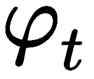 | 这是预训练编码器生成的给定文本描述的文本嵌入。 |
|  | 此文本条件变量是从分布中采样的高斯条件变量。 它抓住了的不同含义。 |
|  | 这是条件高斯分布。 |
| N（0，I） | 这是正态分布。 |
|  | 这是一个对角协方差矩阵。 |
| 数据 | 这是真正的数据分配。 |
| 个人电脑 | 这就是高斯分布。 |
| D1 | 这是第一阶段的判别器。 |
| G1 | 这是 Stage-I 生成器。 |
| D2 | 这是第二阶段的判别器。 |
| G2 | 这是 Stage-II 生成器。 |
| N2 | 这些是随机噪声变量的尺寸。 |
|  | 这些是 Stack-II GAN 的高斯潜在变量。 |


# 文字编码器网络


文本编码器网络的唯一目的是将文本描述（t）转换为文本嵌入（  ）。 在本章中，我们不会训练文本编码器网络。 我们将使用经过预训练的文本嵌入。  按照*数据准备*部分中给出的步骤下载预训练的文本嵌入。 如果您想训练自己的文本编码器，请参阅*学习细粒度视觉描述的深度表示*，该文章可在 [中找到 https://arxiv.org/pdf/ 1605.05395.pdf ](https://arxiv.org/pdf/1605.05395.pdf) 。 文本编码器网络将句子编码为 1,024 维文本嵌入。 文本编码器网络在两个阶段都是相同的。


# 条件增强块


**条件增强**（**CA**）网络从表示为的分布中采样随机潜在变量。 我们将在后面的部分中详细了解这种分布。 添加 CA 块有很多优点，如下所示：

*   它为网络增加了随机性。
*   通过捕获具有各种姿势和外观的各种对象，它使生成器网络变得强大。
*   它产生更多的图像-文本对。 使用大量的图文对，我们可以训练一个可以处理干扰的健壮网络。


# 获取条件增强变量


从文本编码器获得文本嵌入（）后，将它们馈送到完全连接的层以生成诸如平均值和标准偏差的值。然后使用这些值 通过将放置在矩阵（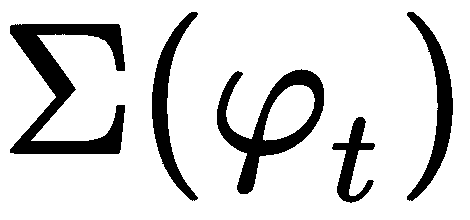）的对角线上来创建对角协方差矩阵。 最后，我们使用和创建高斯分布，可以表示为：


然后，我们从刚创建的高斯分布中采样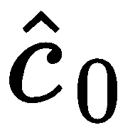。 计算的公式如下：

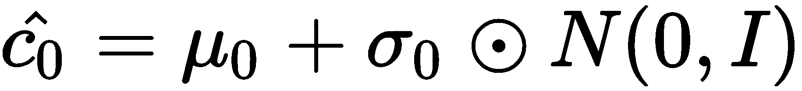

前面的方程式很不言自明。 为了对进行采样，我们首先将和进行元素逐个相乘，然后将输出添加到中。 我们将在  * StackGAN * 部分的 Keras 实现中详细介绍如何计算 CA 变量。


# 阶段 I


StackGAN 网络的主要组成部分是生成器网络和判别器网络。 在本节中，我们将详细探讨这两个网络。


# 生成器网络


Stage-I 生成器网络是具有几个上采样层的深度卷积神经网络。 g 生成器网络是 CGAN ，其条件是处于  和随机变量  [ 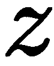。   生成器网络采用高斯条件变量和随机噪声变量`z`，并生成尺寸为`64x64x3`  的图像。 生成的低分辨率图像可能具有原始形状和基本颜色，但会存在各种缺陷。 这里，`z`是从维数为的高斯分布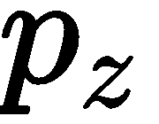采样的随机噪声变量。 生成器网络生成的图像可以表示为。 让我们看一下生成器网络的体系结构，如以下屏幕截图所示：


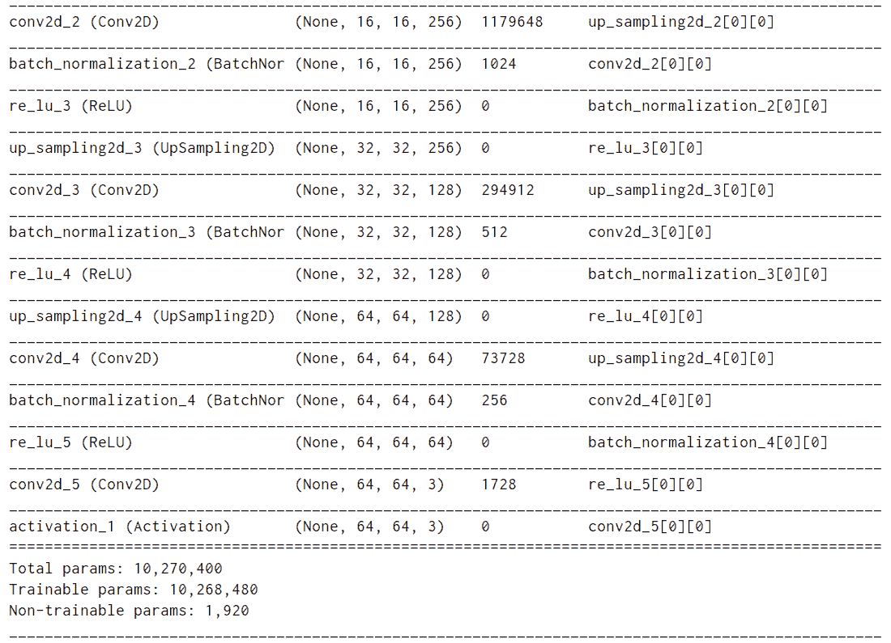

The architecture of the generator network in Stage-I

如您所见，生成器网络包含几个卷积层，其中每个卷积层后跟一个批处理规范化层或一个激活层。 它的唯一目的是生成尺寸为`64x64x3`的图像。 现在我们有了生成器网络的基本概念，让我们探索判别器网络。


# 鉴别网络


类似于生成器网络，判别器网络是一个深度卷积神经网络，其中包含一系列下采样卷积层。 下采样层从图像生成特征图，无论它们是真实数据分布的真实图像还是生成器网络生成的图像。 然后，我们将特征映射连接到文本嵌入。 我们使用压缩和空间复制将嵌入的文本转换为连接所需的格式。 空间压缩和复制包括一个完全连接的层，该层用于压缩嵌入到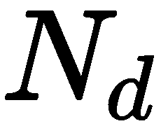维输出的文本，然后通过空间复制将其转换为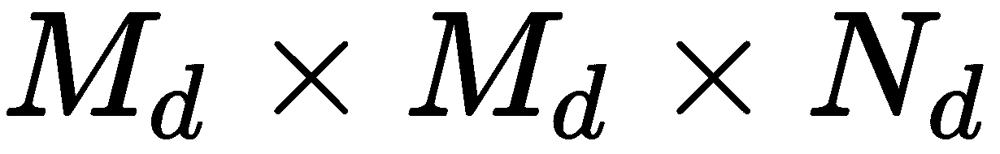维张量。 然后将特征图以及压缩的和空间复制的文本嵌入沿通道维级联。 最后，我们具有一个节点的完全连接层，该层用于二进制分类。 让我们看一下判别器网络的架构，如以下屏幕截图所示：

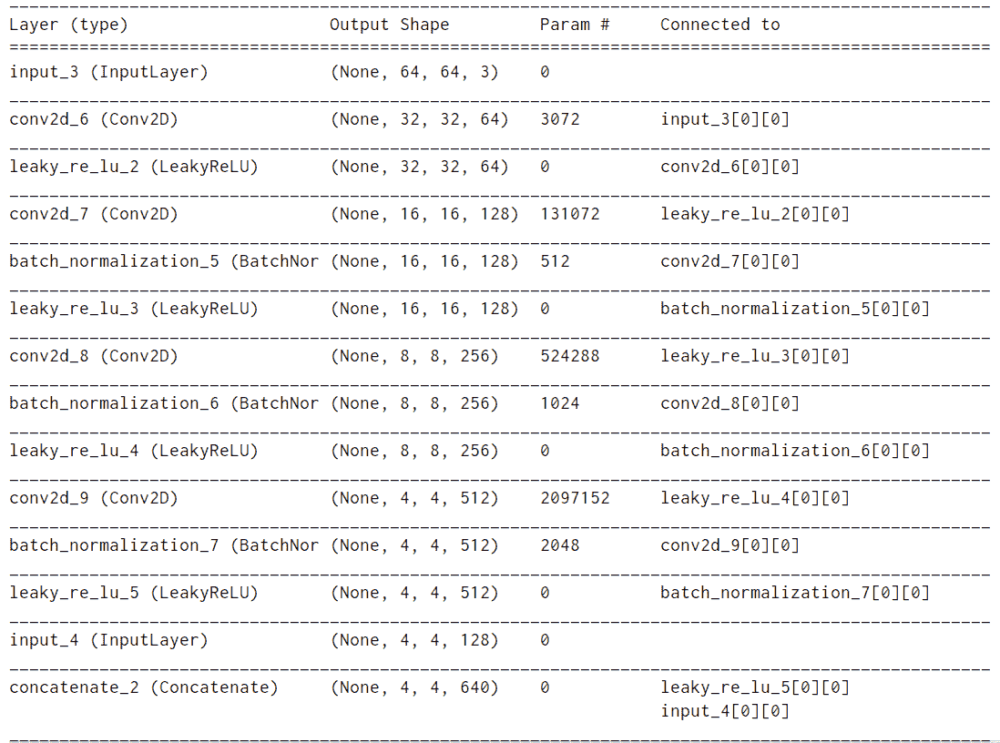

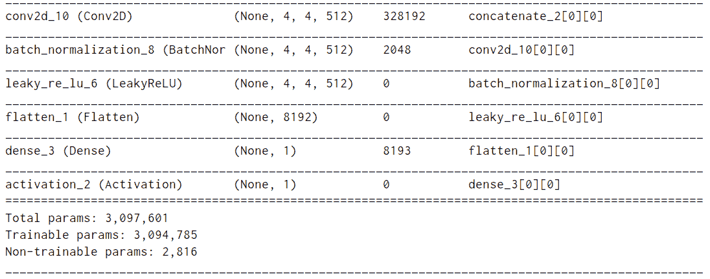

The architecture of the Stage-I discriminator network

如您所见，生成器网络包含几个卷积层。 判别器网络的唯一目的是区分来自真实数据分布的图像和生成器网络生成的图像。 现在，我们来看看 StackGAN 的 Stage I 中使用的损耗。


# StackGAN 第一阶段的损失


StackGAN 的阶段 I 中使用了两个损失，如下所示：

*   生成器损耗
*   判别器损失

鉴别符损失可以表示为：


公式前面的很不言自明。 它代表了判别器网络的损失函数，其中两个网络都以文本嵌入为条件。

生成器损耗可以表示为：


公式前面的也很容易解释。 它代表了生成器网络的损失函数，其中两个网络都以文本嵌入为条件。 此外，它还包括损失函数的 KL 发散项。


# 二代


Stage-II StackGAN 的主要组件是生成器网络和判别器网络。 生成器网络是编码器-解码器类型的网络。 在此阶段不使用随机噪声`z`，假设 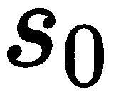已保留了随机性，其中是生成器网络生成的图像 第一阶段

我们首先使用预训练的文本编码器生成高斯条件变量  。 这将生成嵌入  的相同文本。    第一阶段和第二阶段条件增强具有不同的完全连接层，用于生成不同的均值和标准 偏差。  这意味着 Stage-II GAN 学会了在文本嵌入中捕获有用的信息，而这些信息被 Stage-I GAN 省略了。

Stack-I GAN 生成的图像存在的问题是，它们可能缺少生动的对象部分，它们可能包含形状失真，并且它们可能会忽略对于生成逼真的图像非常重要的重要细节。 Stack-II GAN 建立在 Stack-I GAN 的输出上。 Stack-II GAN 取决于 Stack-I GAN 生成的低分辨率图像和文本描述。 它通过校正缺陷产生高分辨率的图像。


# 生成器网络


生成器网络还是深层卷积神经网络。 第 I 阶段的结果是低分辨率图像，它经过几个下采样层以生成图像特征。 然后，将图像特征和文本条件变量沿通道尺寸连接在一起。 之后，将级联张量馈入一些残差块，这些残差块学习跨图像和文本特征的多峰表示。 最后，最后一个操作的输出被馈送到一组上采样层，这些上采样层生成尺寸为`256x256x3`的高分辨率图像。 让我们看一下生成器网络的体系结构，如下图所示：


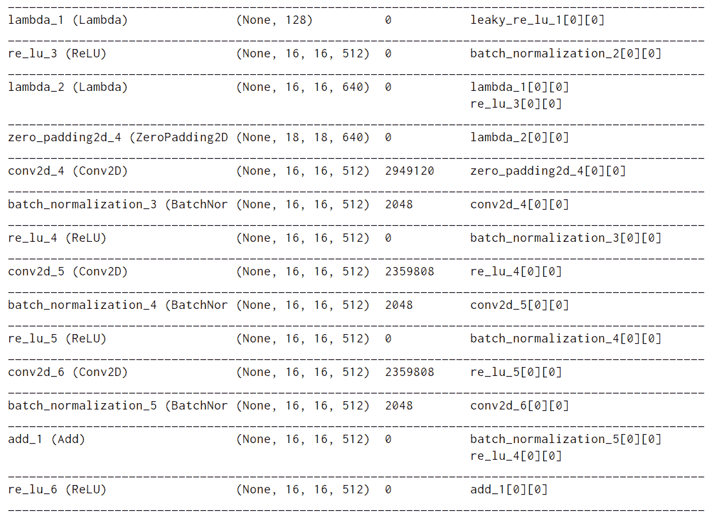


The architecture of the Stage-II generator

该生成器网络的唯一目的是从低分辨率图像生成高分辨率图像。 低分辨率图像首先由 Stage-I 的生成器网络生成，然后馈送到 Stage-II 的生成器网络，后者生成高分辨率图像。


# 鉴别网络


类似于生成器网络，判别器网络是一个深度卷积神经网络，并且包含额外的下采样层，因为图像的大小比 Stage-I 中的判别器网络大。 判别器是一个可识别匹配的判别器（有关更多信息，[请参见以下链接](https://arxiv.org/pdf/1605.05396.pdf)，它使我们可以更好地实现 图片和条件文字。 在训练期间，判别器将真实图像及其对应的文本描述作为正样本对，而负样本对则由两组组成。 第一组是具有不匹配的文本嵌入的真实图像，而第二组是具有相应的文本嵌入的合成图像。 让我们看一下判别器网络的体系结构，如下图所示：


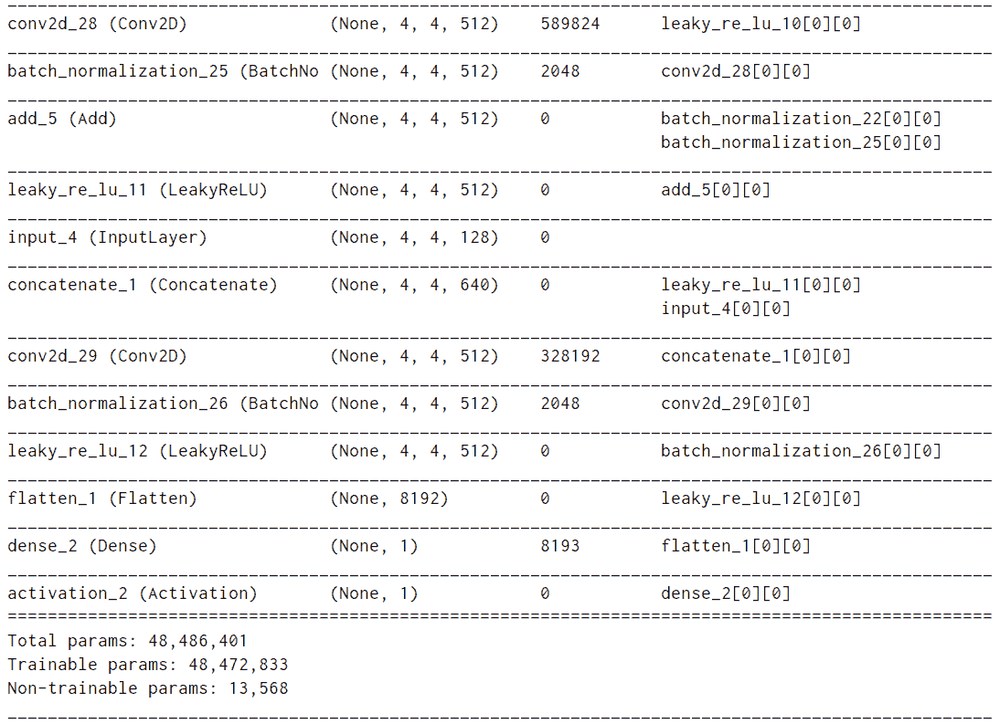

The architecture of the Stage-II discriminator network.

关于判别器网络架构的 M 矿石信息可以在 StackGAN 部分的 *Keras 实现中找到。*


# StackGAN 第二阶段的损失


与任何其他 GAN 相似，Stack-II GAN 中的生成器`G`和判别器`D`也可以通过最大化判别器的损耗并将生成器网络的损耗最小化来训练 。

生成器损耗可以表示为：


前面的方程式非常不言自明。 它代表了判别器网络的损失函数，其中两个网络都以文本嵌入为条件。 一个主要区别是生成器网络以和作为输入，其中是 Stage-I 生成的图像，是 CA 变量。

鉴别符损失可以表示为：


前面的方程式也很容易解释。 它代表了生成器网络的损失函数，其中两个网络都以文本嵌入为条件。 它还包括对损失函数的 **Kullback-Leibler**（**KL**）发散项。


# 设置项目


如果尚未使用所有章节的完整代码克隆存储库，请立即克隆存储库。 下载的代码有一个名为`Chapter06`的目录，其中包含本章的全部代码。 执行以下命令来设置项目：

1.  首先，导航到父目录，如下所示：

```py
cd Generative-Adversarial-Networks-Projects
```

2.  现在，将目录从当前目录更改为  `Chapter06`：

```py
cd Chapter06
```

3.  接下来，为该项目创建一个 Python 虚拟环境：

```py
virtualenv venv
virtualenv venv -p python3 # Create a virtual environment using 
           python3 interpreter
virtualenv venv -p python2 # Create a virtual environment using 
           python2 interpreter
```

我们将为此项目使用此新创建的虚拟环境。 每章都有其自己单独的虚拟环境。

4.  激活新创建的虚拟环境：

```py
source venv/bin/activate
```

激活虚拟环境后，将在其中执行所有其他命令。

5.  通过执行以下命令，安装`requirements.txt` 文件中提供的所有库：

```py
pip install -r requirements.txt
```

您可以参考  `README.md` 文件，以获取有关如何设置项目的更多说明。 开发人员经常会遇到依赖关系不匹配的问题。 为每个项目创建一个单独的虚拟环境将解决此问题。

在本节中，我们已成功设置项目并安装了所需的依赖项。 在下一节中，我们将处理数据集。


# 资料准备


在本节中，我们将使用 CUB 数据集，该数据集是不同鸟类的图像数据集，[可以在以下链接中找到](http://www.vision.caltech.edu/visipedia/CUB-200-2011.html)。 CUB 数据集包含 11,788 个高分辨率图像。 我们还将需要 char-CNN-RNN 文本嵌入，[可以在以下链接中找到它们](https://drive.google.com/open?id=0B3y_msrWZaXLT1BZdVdycDY5TEE)。 这些是预训练的文本嵌入。 按照以下几节中给出的说明下载和提取数据集。


# 下载数据集


可以从[这里](http://www.vision.caltech.edu/visipedia/CUB-200-2011.html)手动下载`CUB`数据集。 另外，我们可以执行以下命令来下载数据集：

```py
wget http://www.vision.caltech.edu/visipedia-data/CUB-200-2011/CUB_200_2011.tgz
```

下载数据集后，我们可以将其提取并放在`data/birds/`目录中。

[从以下链接下载 char-CNN-RNN 嵌入](https://drive.google.com/open?id=0B3y_msrWZaXLT1BZdVdycDY5TEE)。


# 提取数据集


`CUB`数据集是压缩文件，需要提取。 使用以下命令提取`CUB`数据集：

```py
tar -xvzf CUB_200_2011.tgz
```

使用以下命令提取 char-CNN-RNN 嵌入：

```py
unzip birds.zip
```

最后，将`CUB_200_2011`放在`data/birds`目录中。 现在可以使用我们的数据集了。


# 探索数据集


CUB 数据集总共包含 200 种不同鸟类的 11,788 张图像。 CUB 数据集中的图像包括以下内容：

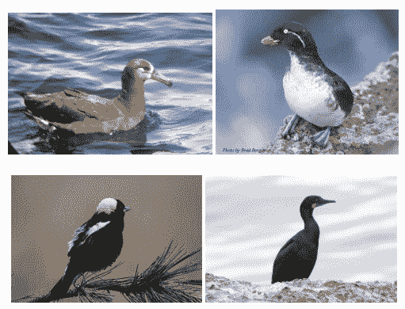

这四张图片显示了黑脚信天翁，长尾小鹦鹉 Auklet，bobolink 和 B randt 的 mor。

在设计网络之前，了解数据集非常重要。 确保您仔细浏览 CUB 数据集中的图像。


# StackGAN 的 Keras 实现


StackGAN 的 Keras 实现分为两部分：第一阶段和第二阶段。 我们将在以下各节中实现这些阶段。


# 阶段 I


Stage-I StackGAN 包含生成器网络和判别器网络。 它还具有一个文本编码器网络和一个条件增强网络（CA 网络），下面将对此进行详细说明。 生成器网络获取文本条件变量（）以及噪声向量（`x`）。 经过一组上采样层后，它会生成尺寸为`64x64x3`的低分辨率图像。 判别器网络拍摄此低分辨率图像，并尝试识别图像是真实的还是伪造的。 生成器网络是具有一组下采样层的网络，其后是连接，然后是分类层。 在以下各节中，我们将详细探讨 StackGAN 的体系结构。

Stage-I StackGAN 网络中使用的网络如下：

*   文本编码器网络
*   条件增强网络
*   生成器网络
*   鉴别网络

但是，在开始编写实现之前，请创建一个 Python 文件 `main.py` ，然后按如下所示导入基本模块：

```py
import os
import pickle
import random
import time

import PIL
import numpy as np
import pandas as pd
import tensorflow as tf
from PIL import Image
from keras import Input, Model
from keras import backend as K
from keras.callbacks import TensorBoard
from keras.layers import Dense, LeakyReLU, BatchNormalization, ReLU, Reshape, UpSampling2D, Conv2D, Activation, \
    concatenate, Flatten, Lambda, Concatenate
from keras.optimizers import Adam
from keras_preprocessing.image import ImageDataGenerator
from matplotlib import pyplot as plt
```


# 文字编码器网络


文本编码器网络的唯一目的是将文本描述（t）转换为文本嵌入（）。 该网络将句子编码为 1,024 维文本嵌入。 我们已经下载了预训练的 char-CNN-RNN 文本嵌入。 我们将使用它们来训练我们的网络。


# 条件增强网络


CA 网络的目的是将文本嵌入向量（）转换为条件潜在变量（）。 在 CA 网络中，文本嵌入向量穿过具有非线性的完全连接层，从而产生均值和对角协方差矩阵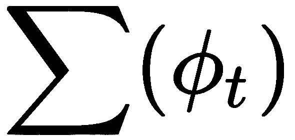。

以下代码显示了如何创建 CA 网络：

1.  首先创建一个具有 256 个节点的完整连接层，并使用`LeakyReLU`作为激活函数：

```py
input_layer = Input(shape=(1024,))
x = Dense(256)(input_layer)
mean_logsigma = LeakyReLU(alpha=0.2)(x)
```

输入形状为（`batch_size`，`1024`），输出形状为（`batch_size`，`256`）。

2.  接下来，将`mean_logsigma`分为`mean`和`log_sigma`张量：

```py
mean = x[:, :128]
log_sigma = x[:, 128:]
```

此操作将创建两个张量的张量（`batch_size`，`128`）和（`batch_size`和`128`）。

3.  接下来，使用以下代码计算文本条件变量。 有关如何生成文本条件变量的更多信息，请参见 StackGAN 小节的*体系结构中的*条件增强（CA）块*部分：*

```py
stddev = K.exp(log_sigma)
epsilon = K.random_normal(shape=K.constant((mean.shape[1], ), dtype='int32'))
c = stddev * epsilon + mean
```

这将产生一个张量为（`batch_size`，`128`）的张量，这是我们的文本条件变量。 CA 网络的完整代码如下：

```py
def generate_c(x):
    mean = x[:, :128]
    log_sigma = x[:, 128:]

    stddev = K.exp(log_sigma)
    epsilon = K.random_normal(shape=K.constant((mean.shape[1], ), dtype='int32'))
    c = stddev * epsilon + mean

    return c
```

条件块的整个代码如下所示：

```py
def build_ca_model():
    input_layer = Input(shape=(1024,))
    x = Dense(256)(input_layer)
    mean_logsigma = LeakyReLU(alpha=0.2)(x)

    c = Lambda(generate_c)(mean_logsigma)
    return Model(inputs=[input_layer], outputs=[c])
```

在代码前面的中，`build_ca_model()`方法创建一个 Keras 模型，其中具有一个完全连接的层并且以`LeakyReLU`作为激活函数。


# 生成器网络


生成器网络是**条件生成对抗网络**（**CGAN**）。 我们将要创建的生成器网络以 text-condition 变量为条件。 它采用从潜在空间采样的随机噪声向量，并生成形状为`64x64x3`的图像。

让我们从编写生成器网络的代码开始：

1.  首先创建一个输入层，以将输入（噪声变量）馈送到网络：

```py
input_layer2 = Input(shape=(100, ))
```

2.  接下来，将文本条件变量与 noise 变量沿维度 1 串联：

```py
gen_input = Concatenate(axis=1)([c, input_layer2])
```

此处，`c`是文本条件变量。 在上一步中，我们编写了代码来生成文本条件变量，`gen_input`将成为我们对生成器网络的输入。

3.  接下来，创建具有`128`8`4*4 (16,384)`节点的`dense layer`和`ReLU`激活层，如下所示：

```py
x = Dense(128 * 8 * 4 * 4, use_bias=False)(gen_input)
x = ReLU()(x)
```

4.  之后，将最后一层的输出重塑为尺寸为`(batch_size, 4, 4, 128*8)`的张量：

```py
x = Reshape((4, 4, 128 * 8), input_shape=(128 * 8 * 4 * 4,))(x)
```

该操作将二维张量整形为二维张量。

5.  接下来，创建一个二维向上采样卷积块。 该块包含一个上采样层，一个卷积层和一个批归一化层。 批量归一化后，使用`ReLU`作为此块的激活函数：

```py
x = UpSampling2D(size=(2, 2))(x)
x = Conv2D(512, kernel_size=3, padding="same", strides=1, use_bias=False)(x)
x = BatchNormalization()(x)
x = ReLU()(x)
```

6.  之后，再创建三个 3D 上采样卷积块，如下所示：

```py
x = UpSampling2D(size=(2, 2))(x)
x = Conv2D(256, kernel_size=3, padding="same", strides=1, use_bias=False)(x)
x = BatchNormalization()(x)
x = ReLU()(x)

x = UpSampling2D(size=(2, 2))(x)
x = Conv2D(128, kernel_size=3, padding="same", strides=1, use_bias=False)(x)
x = BatchNormalization()(x)
x = ReLU()(x)

x = UpSampling2D(size=(2, 2))(x)
x = Conv2D(64, kernel_size=3, padding="same", strides=1, use_bias=False)(x)
x = BatchNormalization()(x)
x = ReLU()(x)
```

7.  最后，创建一个卷积层，它将生成一个低分辨率图像：

```py
x = Conv2D(3, kernel_size=3, padding="same", strides=1, use_bias=False)(x)
x = Activation(activation='tanh')(x)
```

8.  现在，通过如下指定网络的输入和输出来创建 Keras 模型：：

```py
stage1_gen = Model(inputs=[input_layer, input_layer2], outputs=[x, mean_logsigma])
```

这里，`x`将是模型的输出，其形状将是（batch_size，64，64，3）。

生成器网络的整个代码如下所示：

```py
def build_stage1_generator():
    """
 Builds a generator model """    input_layer = Input(shape=(1024,))
    x = Dense(256)(input_layer)
    mean_logsigma = LeakyReLU(alpha=0.2)(x)

    c = Lambda(generate_c)(mean_logsigma)

    input_layer2 = Input(shape=(100,))

    gen_input = Concatenate(axis=1)([c, input_layer2])

    x = Dense(128 * 8 * 4 * 4, use_bias=False)(gen_input)
    x = ReLU()(x)

    x = Reshape((4, 4, 128 * 8), input_shape=(128 * 8 * 4 * 4,))(x)

    x = UpSampling2D(size=(2, 2))(x)
    x = Conv2D(512, kernel_size=3, padding="same", strides=1, use_bias=False)(x)
    x = BatchNormalization()(x)
    x = ReLU()(x)

    x = UpSampling2D(size=(2, 2))(x)
    x = Conv2D(256, kernel_size=3, padding="same", strides=1, use_bias=False)(x)
    x = BatchNormalization()(x)
    x = ReLU()(x)

    x = UpSampling2D(size=(2, 2))(x)
    x = Conv2D(128, kernel_size=3, padding="same", strides=1, use_bias=False)(x)
    x = BatchNormalization()(x)
    x = ReLU()(x)

    x = UpSampling2D(size=(2, 2))(x)
    x = Conv2D(64, kernel_size=3, padding="same", strides=1, use_bias=False)(x)
    x = BatchNormalization()(x)
    x = ReLU()(x)

    x = Conv2D(3, kernel_size=3, padding="same", strides=1, use_bias=False)(x)
    x = Activation(activation='tanh')(x)

    stage1_gen = Model(inputs=[input_layer, input_layer2], outputs=[x, mean_logsigma])
    return stage1_gen
```

此模型在单个网络中同时包含 CA 网络和生成器网络。 它需要两个输入并返回两个输出。 输入是文本嵌入和噪声变量，而输出是生成的图像和`mean_logsigma`。

我们现在已经成功实现了生成器网络。 让我们进入判别器网络。


# 鉴别网络


判别器网络是分类器网络。 它包含一组下采样层，并对给定图像是真实的还是伪造的进行分类。

让我们从编写网络代码开始：

1.  首先创建一个输入层以将输入提供给网络：

```py
input_layer = Input(shape=(64, 64, 3))
```

2.  接下来，添加具有以下参数的二维卷积层：
    *   **过滤器** = `64`
    *   **内核大小** = `(4, 4)`
    *   **大步前进** = `2`
    *   **填充** = `'same'`
    *   **使用偏差** = `False`
    *   **用`alpha=0.2`激活** = `LeakyReLU`

```py
stage1_dis = Conv2D(64, (4, 4),
  padding='same', strides=2,
  input_shape=(64, 64, 3), use_bias=False)(input_layer)
stage1_dis = LeakyReLU(alpha=0.2)(stage1_dis)
```

3.  之后，添加两个卷积层，每个卷积层之后是一个批处理归一化层和一个`LeakyReLU`激活函数，具有以下参数：
    *   **过滤器：** `128`
    *   **内核大小：** `(4, 4)`
    *   **大步前进** = `2`
    *   **填充** = `'same'`
    *   **使用偏差** = `False`
    *   **用`alpha=0.2`激活** = `LeakyReLU`

```py
x = Conv2D(128, (4, 4), padding='same', strides=2, use_bias=False)(x)
x = BatchNormalization()(x)
x = LeakyReLU(alpha=0.2)(x)
```

4.  接下来，再添加一个 2D 卷积层，然后添加批处理规范化层和`LeakyReLU`激活函数，并具有以下参数：
    *   **过滤器：** `256`
    *   **内核大小：** `(4, 4)`
    *   **大步前进** = `2`
    *   **填充** = `'same'`
    *   **使用偏差** = `False`
    *   **用`alpha=0.2`激活** = `LeakyReLU`

```py
x = Conv2D(256, (4, 4), padding='same', strides=2, use_bias=False)(x)
x = BatchNormalization()(x)
x = LeakyReLU(alpha=0.2)(x)
```

5.  之后，再添加一个 2D 卷积层，然后添加批处理规范化层和 LeakyReLU 激活函数，并具有以下参数：
    *   **过滤器：** `512`
    *   **内核大小：** `(4, 4)`
    *   **大步前进** = `2`
    *   **填充** = `'same'`
    *   **使用偏差** = `False`
    *   **激活** = `LeakyReLU` 和  `alpha=0.2`

```py
x = Conv2D(512, (4, 4), padding='same', strides=2, use_bias=False)(x)
x = BatchNormalization()(x)
x = LeakyReLU(alpha=0.2)(x)
```

6.  然后，创建另一个输入层以接收空间复制和压缩的文本嵌入：

```py
input_layer2 = Input(shape=(4, 4, 128))
```

7.  添加一个连接层以连接`x`和`input_layer2`：

```py
merged_input = concatenate([x, input_layer2])
```

8.  之后，添加另一个 2D 卷积层，然后添加批处理归一化层，并使用以下参数将`LeakyReLU`作为激活函数：
    *   **过滤器** = `512`
    *   **内核大小** = `1`
    *   **大步前进** = `1`
    *   **填充** = `'same'`
    *   **批量标准化** =是
    *   **用`alpha 0.2`激活** = `LeakyReLU`

```py
x2 = Conv2D(64 * 8, kernel_size=1,
  padding="same", strides=1)(merged_input)
x2 = BatchNormalization()(x2)
x2 = LeakyReLU(alpha=0.2)(x2)
```

9.  现在，拉平张量并添加一个密集的分类器层：

```py
# Flatten the tensor
x2 = Flatten()(x2)

# Classifier layer
x2 = Dense(1)(x2)
x2 = Activation('sigmoid')(x2)
```

10.  最后，创建 Keras 模型：

```py
stage1_dis = Model(inputs=[input_layer, input_layer2], outputs=[x2])
```

该模型输出输入图像属于真实类别或伪类别的概率。 判别器网络的完整代码如下：

```py
def build_stage1_discriminator():   input_layer = Input(shape=(64, 64, 3))

    x = Conv2D(64, (4, 4),
  padding='same', strides=2,
  input_shape=(64, 64, 3), use_bias=False)(input_layer)
    x = LeakyReLU(alpha=0.2)(x)

    x = Conv2D(128, (4, 4), padding='same', strides=2, use_bias=False)(x)
    x = BatchNormalization()(x)
    x = LeakyReLU(alpha=0.2)(x)

    x = Conv2D(256, (4, 4), padding='same', strides=2, use_bias=False)(x)
    x = BatchNormalization()(x)
    x = LeakyReLU(alpha=0.2)(x)

    x = Conv2D(512, (4, 4), padding='same', strides=2, use_bias=False)(x)
    x = BatchNormalization()(x)
    x = LeakyReLU(alpha=0.2)(x)

    input_layer2 = Input(shape=(4, 4, 128))

    merged_input = concatenate([x, input_layer2])

    x2 = Conv2D(64 * 8, kernel_size=1,
  padding="same", strides=1)(merged_input)
    x2 = BatchNormalization()(x2)
    x2 = LeakyReLU(alpha=0.2)(x2)
    x2 = Flatten()(x2)
    x2 = Dense(1)(x2)
    x2 = Activation('sigmoid')(x2)

    stage1_dis = Model(inputs=[input_layer, input_layer2], outputs=[x2])
    return stage1_dis
```

该模型有两个输入和一个输出。 输入是低分辨率图像和压缩文本嵌入，而输出是概率。 既然我们已经成功地编写了鉴别网络的实现，那么让我们创建对抗网络。


# 对抗模型


要创建对抗模型，请同时使用生成器网络和判别器网络，并创建一个新的 Keras 模型。

1.  首先创建三个输入层以将输入馈送到网络：

```py
def build_adversarial_model(gen_model, dis_model):
    input_layer = Input(shape=(1024,))
    input_layer2 = Input(shape=(100,))
    input_layer3 = Input(shape=(4, 4, 128))
```

2.  然后，使用生成器网络生成低分辨率图像：

```py
    # Get output of the generator model
    x, mean_logsigma = gen_model([input_layer, input_layer2])

    # Make discriminator trainable false
    dis_model.trainable = False
```

3.  接下来，使用判别器网络获得概率：

```py
 # Get output of the discriminator models  valid = dis_model([x, input_layer3])
```

4.  最后，创建对抗模型，获取三个输入并返回两个输出。

```py
    model = Model(inputs=[input_layer, input_layer2, input_layer3], outputs=[valid, mean_logsigma])
    return model
```

现在，我们的对抗模型已经准备就绪。 这种对抗模型是一种端到端的可训练模型。 在本节中，我们研究了 StackGAN 模型的 Stage-I 中涉及的网络。 在下一部分中，我们将研究 StackGAN 的第二阶段所涉及的网络的实现。


# 第二阶段


Stage-II StackGAN 与 Stage-I StackGAN 略有不同。 生成器模型的输入是条件变量（）和生成器网络在阶段 I 中生成的低分辨率图像。

它包含五个组成部分：

*   文字编码器
*   条件增强网络
*   下采样块
*   残留块
*   上采样块

文本编码器和 CA 网络与之前在 Stage-I 部分中使用的相似。 现在，我们将介绍生成器网络的三个组件，分别是下采样块，残差块和上采样块。


# 生成器网络


生成器网络由三个不同的模块组成。 我们将逐一编写每个模块的代码。 让我们从下采样模块开始。


# 下采样块


该块从 Stage-1 的生成器获取尺寸为`64x64x3`的低分辨率图像，并将其下采样以生成形状为`16x16x512`的张量。 图像经过一系列 2D 卷积块。

在本节中，我们将为降采样模块编写实现。

1.  首先创建第一个下采样块。 该块包含一个以`ReLU`作为激活函数的 2D 卷积层。 在应用 2D 卷积之前，请在各侧用零填充输入。 该块中不同层的配置如下：
    *   **填充大小：** `(1, 1)`
    *   **过滤器：** `128`
    *   **内核大小：** `(3, 3)`
    *   **大步走：** ``1``
    *   **激活：** `ReLU`

```py
x = ZeroPadding2D(padding=(1, 1))(input_lr_images)
x = Conv2D(128, kernel_size=(3, 3), strides=1, use_bias=False)(x)
x = ReLU()(x)
```

2.  接下来，添加具有以下配置的第二个卷积块：
    *   **填充大小：** `(1, 1)`
    *   **过滤器：** `256`
    *   **内核大小：** `(4, 4)`
    *   **大步走过：** `2`
    *   **批量标准化：**是
    *   **激活：** `ReLU`

```py
x = ZeroPadding2D(padding=(1, 1))(x)
x = Conv2D(256, kernel_size=(4, 4), strides=2, use_bias=False)(x)
x = BatchNormalization()(x)
x = ReLU()(x)
```

3.  之后，添加另一个具有以下配置的卷积块：
    *   **填充大小：** `(1, 1)`
    *   **过滤器：** `512`
    *   **内核大小：** `(4, 4)`
    *   **大步走过：** `2`
    *   **批量标准化：** 是
    *   **激活：** `ReLU`

```py
x = ZeroPadding2D(padding=(1, 1))(x)
x = Conv2D(512, kernel_size=(4, 4), strides=2, use_bias=False)(x)
x = BatchNormalization()(x)
x = ReLU()(x)
```

下采样块生成形状为`16x16x512`的张量。 之后，我们有一系列残差块。 在将该张量馈送到残差块之前，我们需要将其连接到文本条件变量。 执行此操作的代码如下：

```py
# This block will extend the text conditioning variable and concatenate it to the encoded images tensor.
def joint_block(inputs):
    c = inputs[0]
    x = inputs[1]

    c = K.expand_dims(c, axis=1)
    c = K.expand_dims(c, axis=1)
    c = K.tile(c, [1, 16, 16, 1])
    return K.concatenate([c, x], axis=3)
# This is the lambda layer which we will add to the generator network
c_code = Lambda(joint_block)([c, x])
```

在此，`c`的形状为（batch_size，228），`x`的形状为（batch_size，16、16、512）。 `c_code`的形状为（batch_size，640）。


# 剩余块


剩余块包含两个 2D 卷积层，每个层之后是批处理归一化层和一个激活函数。

1.  让我们定义残留块。 此代码完全描述了剩余块：

```py
def residual_block(input):
    """
 Residual block in the generator network  :return:
 """  x = Conv2D(128 * 4, kernel_size=(3, 3), padding='same', strides=1)(input)
    x = BatchNormalization()(x)
    x = ReLU()(x)

    x = Conv2D(128 * 4, kernel_size=(3, 3), strides=1, padding='same')(x)
    x = BatchNormalization()(x)

    x = add([x, input])
    x = ReLU()(x)

    return x
```

初始输入被添加到第二个 2D 卷积层的输出中。 结果张量将是块的输出。

2.  接下来，添加具有以下超参数的 2D 卷积块：
    *   **填充大小：** `(1, 1)`
    *   **过滤器：** `512`
    *   **内核大小：** `(3, 3)`
    *   **大步走过：** `1`
    *   **批量归一化：** `Yes`
    *   **激活：** `ReLU`

```py
x = ZeroPadding2D(padding=(1, 1))(c_code)
x = Conv2D(512, kernel_size=(3, 3), strides=1, use_bias=False)(x)
x = BatchNormalization()(x)
x = ReLU()(x)
```

3.  之后，依次添加四个残差块：

```py
x = residual_block(x)
x = residual_block(x)
x = residual_block(x)
x = residual_block(x)
```

上采样块将从残余块接收该输出张量。 让我们为升采样块编写代码。


# 上采样块


上采样块包含可提高图像空间分辨率并生成尺寸`256x256x3`的高分辨率图像的图层。

让我们为升采样块编写代码：

1.  首先，添加一个包含 2D 上采样层，2D 卷积层，批归一化和激活函数的上采样块。 块中使用的不同参数如下：
    *   **上采样大小：** `(2, 2)`
    *   **过滤器：** `512`
    *   **内核大小：** `3`
    *   **填充：** `"same"`
    *   **大步走：** `1`
    *   **批量标准化：** `Yes`
    *   **激活：** `ReLU`

```py
x = UpSampling2D(size=(2, 2))(x)
x = Conv2D(512, kernel_size=3, padding="same", strides=1, use_bias=False)(x)
x = BatchNormalization()(x)
x = ReLU()(x)
```

2.  接下来，再添加三个上采样块。 该块中使用的超参数可以很容易地从下面给出的代码中推断出来：

```py
x = UpSampling2D(size=(2, 2))(x)
x = Conv2D(256, kernel_size=3, padding="same", strides=1, use_bias=False)(x)
x = BatchNormalization()(x)
x = ReLU()(x)

x = UpSampling2D(size=(2, 2))(x)
x = Conv2D(128, kernel_size=3, padding="same", strides=1, use_bias=False)(x)
x = BatchNormalization()(x)
x = ReLU()(x)

x = UpSampling2D(size=(2, 2))(x)
x = Conv2D(64, kernel_size=3, padding="same", strides=1, use_bias=False)(x)
x = BatchNormalization()(x)
x = ReLU()(x)
```

3.  添加最后的卷积层。 该层是最后一层，它负责生成高分辨率图像。

```py
x = Conv2D(3, kernel_size=3, padding="same", strides=1, use_bias=False)(x)
x = Activation('tanh')(x)
```

最后，使用部分前面的创建生成器模型：

```py
model = Model(inputs=[input_layer, input_lr_images], outputs=[x, mean_logsigma])
```

现在，我们已经准备好生成器模型，并使用该模型来生成高分辨率图像。 以下是用于生成器网络的完整代码，用于清晰 ：

```py
def build_stage2_generator():
    """
    Create a generator network for Stage-II StackGAN
    """     # 1\. CA Augementation Network
  input_layer = Input(shape=(1024,))
    input_lr_images = Input(shape=(64, 64, 3))

    ca = Dense(256)(input_layer)
    mean_logsigma = LeakyReLU(alpha=0.2)(ca)
    c = Lambda(generate_c)(mean_logsigma)

    # 2\. Image Encoder
  x = ZeroPadding2D(padding=(1, 1))(input_lr_images)
    x = Conv2D(128, kernel_size=(3, 3), strides=1, use_bias=False)(x)
    x = ReLU()(x)

    x = ZeroPadding2D(padding=(1, 1))(x)
    x = Conv2D(256, kernel_size=(4, 4), strides=2, use_bias=False)(x)
    x = BatchNormalization()(x)
    x = ReLU()(x)

    x = ZeroPadding2D(padding=(1, 1))(x)
    x = Conv2D(512, kernel_size=(4, 4), strides=2, use_bias=False)(x)
    x = BatchNormalization()(x)
    x = ReLU()(x)

    # Concatenation block
  c_code = Lambda(joint_block)([c, x])

    # 3\. Residual Blocks
    x = ZeroPadding2D(padding=(1, 1))(c_code)
    x = Conv2D(512, kernel_size=(3, 3), strides=1, use_bias=False)(x)
    x = BatchNormalization()(x)
    x = ReLU()(x)
   x = residual_block(x)
    x = residual_block(x)
    x = residual_block(x)
    x = residual_block(x)

    # 4\. Upsampling blocks
  x = UpSampling2D(size=(2, 2))(x)
    x = Conv2D(512, kernel_size=3, padding="same", strides=1, use_bias=False)(x)
    x = BatchNormalization()(x)
    x = ReLU()(x)

    x = UpSampling2D(size=(2, 2))(x)
    x = Conv2D(256, kernel_size=3, padding="same", strides=1, use_bias=False)(x)
    x = BatchNormalization()(x)
    x = ReLU()(x)

    x = UpSampling2D(size=(2, 2))(x)
    x = Conv2D(128, kernel_size=3, padding="same", strides=1, use_bias=False)(x)
    x = BatchNormalization()(x)
    x = ReLU()(x)

    x = UpSampling2D(size=(2, 2))(x)
    x = Conv2D(64, kernel_size=3, padding="same", strides=1, use_bias=False)(x)
    x = BatchNormalization()(x)
    x = ReLU()(x)

    x = Conv2D(3, kernel_size=3, padding="same", strides=1, use_bias=False)(x)
    x = Activation('tanh')(x)

    model = Model(inputs=[input_layer, input_lr_images], outputs=[x, mean_logsigma])
    return model
```


# 鉴别网络


Stage-II StackGAN 的判别器网络是一系列下采样层，然后是串联块，然后是分类器。 让我们为每个块编写代码。

首先创建输入层，如下所示：

```py
input_layer = Input(shape=(256, 256, 3))
```


# 下采样块


下采样块具有对图像进行下采样的几层。

首先在下采样模块中添加不同的层。 本节中的代码是非常说明性的，可以轻松理解：

```py
x = Conv2D(64, (4, 4), padding='same', strides=2, input_shape=(256, 256, 3), use_bias=False)(input_layer)
x = LeakyReLU(alpha=0.2)(x)

x = Conv2D(128, (4, 4), padding='same', strides=2, use_bias=False)(x)
x = BatchNormalization()(x)
x = LeakyReLU(alpha=0.2)(x)

x = Conv2D(256, (4, 4), padding='same', strides=2, use_bias=False)(x)
x = BatchNormalization()(x)
x = LeakyReLU(alpha=0.2)(x)

x = Conv2D(512, (4, 4), padding='same', strides=2, use_bias=False)(x)
x = BatchNormalization()(x)
x = LeakyReLU(alpha=0.2)(x)

x = Conv2D(1024, (4, 4), padding='same', strides=2, use_bias=False)(x)
x = BatchNormalization()(x)
x = LeakyReLU(alpha=0.2)(x)

x = Conv2D(2048, (4, 4), padding='same', strides=2, use_bias=False)(x)
x = BatchNormalization()(x)
x = LeakyReLU(alpha=0.2)(x)

x = Conv2D(1024, (1, 1), padding='same', strides=1, use_bias=False)(x)
x = BatchNormalization()(x)
x = LeakyReLU(alpha=0.2)(x)

x = Conv2D(512, (1, 1), padding='same', strides=1, use_bias=False)(x)
x = BatchNormalization()(x)

x2 = Conv2D(128, (1, 1), padding='same', strides=1, use_bias=False)(x)
x2 = BatchNormalization()(x2)
x2 = LeakyReLU(alpha=0.2)(x2)

x2 = Conv2D(128, (3, 3), padding='same', strides=1, use_bias=False)(x2)
x2 = BatchNormalization()(x2)
x2 = LeakyReLU(alpha=0.2)(x2)

x2 = Conv2D(512, (3, 3), padding='same', strides=1, use_bias=False)(x2)
x2 = BatchNormalization()(x2)
```

之后，我们有两个输出，分别是`x`和`x2`。 将这两个张量相加以创建相同形状的张量。 我们还需要应用`LeakyReLU`激活函数：

```py
added_x = add([x, x2])
added_x = LeakyReLU(alpha=0.2)(added_x)
```


# 串联块


为空间复制和压缩的嵌入创建另一个输入层：

```py
input_layer2 = Input(shape=(4, 4, 128))
```

将下采样块的输出连接到空间压缩的嵌入：

```py
input_layer2 = Input(shape=(4, 4, 128))

merged_input = concatenate([added_x, input_layer2])
```


# 全连接分类器


然后将合并后的输入馈送到具有一个卷积层和一个密集层的块中，以进行分类：

```py
x3 = Conv2D(64 * 8, kernel_size=1, padding="same", strides=1)(merged_input)
x3 = BatchNormalization()(x3)
x3 = LeakyReLU(alpha=0.2)(x3)
x3 = Flatten()(x3)
x3 = Dense(1)(x3)
x3 = Activation('sigmoid')(x3)
```

`x3`是此判别器网络的输出。 这将输出通过的图像是真实的还是伪造的概率。

最后，创建一个模型：

```py
stage2_dis = Model(inputs=[input_layer, input_layer2], outputs=[x3])
```

如您所见，此模型采用两个输入并返回一个输出。

判别器网络的完整代码如下：

```py
def build_stage2_discriminator():
    input_layer = Input(shape=(256, 256, 3))

    x = Conv2D(64, (4, 4), padding='same', strides=2, input_shape=(256, 256, 3), use_bias=False)(input_layer)
    x = LeakyReLU(alpha=0.2)(x)

    x = Conv2D(128, (4, 4), padding='same', strides=2, use_bias=False)(x)
    x = BatchNormalization()(x)
    x = LeakyReLU(alpha=0.2)(x)

    x = Conv2D(256, (4, 4), padding='same', strides=2, use_bias=False)(x)
    x = BatchNormalization()(x)
    x = LeakyReLU(alpha=0.2)(x)

    x = Conv2D(512, (4, 4), padding='same', strides=2, use_bias=False)(x)
    x = BatchNormalization()(x)
    x = LeakyReLU(alpha=0.2)(x)

    x = Conv2D(1024, (4, 4), padding='same', strides=2, use_bias=False)(x)
    x = BatchNormalization()(x)
    x = LeakyReLU(alpha=0.2)(x)

    x = Conv2D(2048, (4, 4), padding='same', strides=2, use_bias=False)(x)
    x = BatchNormalization()(x)
    x = LeakyReLU(alpha=0.2)(x)

    x = Conv2D(1024, (1, 1), padding='same', strides=1, use_bias=False)(x)
    x = BatchNormalization()(x)
    x = LeakyReLU(alpha=0.2)(x)

    x = Conv2D(512, (1, 1), padding='same', strides=1, use_bias=False)(x)
    x = BatchNormalization()(x)

    x2 = Conv2D(128, (1, 1), padding='same', strides=1, use_bias=False)(x)
    x2 = BatchNormalization()(x2)
    x2 = LeakyReLU(alpha=0.2)(x2)

    x2 = Conv2D(128, (3, 3), padding='same', strides=1, use_bias=False)(x2)
    x2 = BatchNormalization()(x2)
    x2 = LeakyReLU(alpha=0.2)(x2)

    x2 = Conv2D(512, (3, 3), padding='same', strides=1, use_bias=False)(x2)
    x2 = BatchNormalization()(x2)

    added_x = add([x, x2])
    added_x = LeakyReLU(alpha=0.2)(added_x)

    input_layer2 = Input(shape=(4, 4, 128))

    # Concatenation block
    merged_input = concatenate([added_x, input_layer2])

    x3 = Conv2D(64 * 8, kernel_size=1, padding="same", strides=1)(merged_input)
    x3 = BatchNormalization()(x3)
    x3 = LeakyReLU(alpha=0.2)(x3)
    x3 = Flatten()(x3)
    x3 = Dense(1)(x3)
    x3 = Activation('sigmoid')(x3)

    stage2_dis = Model(inputs=[input_layer, input_layer2], outputs=[x3])
    return stage2_dis
```

我们现在已经成功地为两个 StackGAN 创建了模型：Stage-I 和 Stage-II。 让我们继续训练模型。


# 训练 StackGAN


在本节中，我们将学习如何训练这两个 StackGAN。 在第一小节中，我们将训练 Stage-I StackGAN。 在第二小节中，我们将训练 Stage-II StackGAN。


# 训练 Stage-I StackGAN


在开始训练之前，我们需要指定基本的超参数。 超参数是在训练过程中不会改变的值。 让我们先这样做：

```py
data_dir = "Specify your dataset directory here/Data/birds" train_dir = data_dir + "/train" test_dir = data_dir + "/test" image_size = 64 batch_size = 64 z_dim = 100 stage1_generator_lr = 0.0002 stage1_discriminator_lr = 0.0002 stage1_lr_decay_step = 600 epochs = 1000 condition_dim = 128   embeddings_file_path_train = train_dir + "/char-CNN-RNN-embeddings.pickle" embeddings_file_path_test = test_dir + "/char-CNN-RNN-embeddings.pickle"   filenames_file_path_train = train_dir + "/filenames.pickle" filenames_file_path_test = test_dir + "/filenames.pickle"   class_info_file_path_train = train_dir + "/class_info.pickle" class_info_file_path_test = test_dir + "/class_info.pickle"   cub_dataset_dir = data_dir + "/CUB_200_2011"
```

然后，我们需要加载数据集。


# 加载数据集


加载数据集是一个需要几个步骤的过程。 让我们一步一步地探索每个步骤。

1.  第一步是加载存储在 pickle 文件中的类 ID。 以下代码将加载类 ID 并返回所有 ID 的列表：

```py
def load_class_ids(class_info_file_path):
    """
 Load class ids from class_info.pickle file """  with open(class_info_file_path, 'rb') as f:
        class_ids = pickle.load(f, encoding='latin1')
        return class_ids
```

2.  接下来，加载文件名，这些文件名也存储在 pickle 文件中。 可以按照以下步骤进行：

```py
def load_filenames(filenames_file_path):
    """
 Load filenames.pickle file and return a list of all file names """  with open(filenames_file_path, 'rb') as f:
        filenames = pickle.load(f, encoding='latin1')
    return filenames
```

3.  之后，我们需要加载文本嵌入，这些嵌入也位于 pickle 文件中。 加载文件并检索文本嵌入，如下所示：

```py
def load_embeddings(embeddings_file_path):
    """
 Load embeddings """  with open(embeddings_file_path, 'rb') as f:
        embeddings = pickle.load(f, encoding='latin1')
        embeddings = np.array(embeddings)
        print('embeddings: ', embeddings.shape)
    return embeddings
```

4.  接下来，获取边界框，该边界框用于从原始图像提取对象。 下面的不言自明的代码显示了如何检索边界框：

```py
def load_bounding_boxes(dataset_dir):
    """
 Load bounding boxes and return a dictionary of file names and corresponding bounding boxes """ # Paths  bounding_boxes_path = os.path.join(dataset_dir, 'bounding_boxes.txt')
    file_paths_path = os.path.join(dataset_dir, 'images.txt')

    # Read bounding_boxes.txt and images.txt file
  df_bounding_boxes = pd.read_csv(bounding_boxes_path,
                                    delim_whitespace=True, header=None).astype(int)
    df_file_names = pd.read_csv(file_paths_path, delim_whitespace=True, header=None)

    # Create a list of file names
  file_names = df_file_names[1].tolist()

    # Create a dictionary of file_names and bounding boxes
  filename_boundingbox_dict = {img_file[:-4]: [] for img_file in file_names[:2]}

    # Assign a bounding box to the corresponding image
  for i in range(0, len(file_names)):
        # Get the bounding box
  bounding_box = df_bounding_boxes.iloc[i][1:].tolist()
        key = file_names[i][:-4]
        filename_boundingbox_dict[key] = bounding_box

    return filename_boundingbox_dict
```

5.  接下来，编写一种加载和裁剪图像的方法。 以下代码加载图像并将其裁剪在提供的边界框周围。 它还将图像调整为指定大小：

```py
def get_img(img_path, bbox, image_size):
    """
 Load and resize image """  img = Image.open(img_path).convert('RGB')
    width, height = img.size
    if bbox is not None:
        R = int(np.maximum(bbox[2], bbox[3]) * 0.75)
        center_x = int((2 * bbox[0] + bbox[2]) / 2)
        center_y = int((2 * bbox[1] + bbox[3]) / 2)
        y1 = np.maximum(0, center_y - R)
        y2 = np.minimum(height, center_y + R)
        x1 = np.maximum(0, center_x - R)
        x2 = np.minimum(width, center_x + R)
        img = img.crop([x1, y1, x2, y2])
    img = img.resize(image_size, PIL.Image.BILINEAR)
    return img
```

6.  最后，结合前面所有的方法来获取数据集，这是我们训练所需的。 此代码返回所有图像，其标签和相应的嵌入。 我们需要这些来进行训练：

```py
def load_dataset(filenames_file_path, class_info_file_path, cub_dataset_dir, embeddings_file_path, image_size):
    filenames = load_filenames(filenames_file_path)
    class_ids = load_class_ids(class_info_file_path)
    bounding_boxes = load_bounding_boxes(cub_dataset_dir)
    all_embeddings = load_embeddings(embeddings_file_path)

    X, y, embeddings = [], [], []

    # TODO: Change filenames indexing
  for index, filename in enumerate(filenames[:500]):
        # print(class_ids[index], filenames[index])
  bounding_box = bounding_boxes[filename]

        try:
            # Load images
  img_name = '{}/images/{}.jpg'.format(cub_dataset_dir, filename)
            img = get_img(img_name, bounding_box, image_size)

            all_embeddings1 = all_embeddings[index, :, :]

            embedding_ix = random.randint(0, all_embeddings1.shape[0] - 1)
            embedding = all_embeddings1[embedding_ix, :]

            X.append(np.array(img))
            y.append(class_ids[index])
            embeddings.append(embedding)
        except Exception as e:
            print(e)

    X = np.array(X)
    y = np.array(y)
    embeddings = np.array(embeddings)

    return X, y, embeddings
```

7.  最后，加载数据集并将其用于训练：

```py
X_train, y_train, embeddings_train = load_dataset(filenames_file_path=filenames_file_path_train,
                                                class_info_file_path=class_info_file_path_train,
                                                  cub_dataset_dir=cub_dataset_dir,
                                                embeddings_file_path=embeddings_file_path_train,
                                                  image_size=(64, 64))

X_test, y_test, embeddings_test = load_dataset(filenames_file_path=filenames_file_path_test,
                                               class_info_file_path=class_info_file_path_test,
                                               cub_dataset_dir=cub_dataset_dir,
                                               embeddings_file_path=embeddings_file_path_test,
                                               image_size=(64, 64))
```

现在我们已经成功加载了数据集进行训练，让我们创建一些模型。


# 建立模型


让我们使用 *StackGAN* 的 Keras 实现下的 *Stage-I StackGAN* 的 部分中的方法创建模型。 我们将使用四个模型：生成器模型，判别器模型，压缩文本嵌入的压缩器模型以及同时包含生成器和判别器的对抗模型：

1.  首先定义训练所需的优化器：

```py
dis_optimizer = Adam(lr=stage1_discriminator_lr, beta_1=0.5, beta_2=0.999)
gen_optimizer = Adam(lr=stage1_generator_lr, beta_1=0.5, beta_2=0.999)
```

2.  然后按如下所示构建和编译不同的网络：

```py
ca_model = build_ca_model()
ca_model.compile(loss="binary_crossentropy", optimizer="adam")

stage1_dis = build_stage1_discriminator()
stage1_dis.compile(loss='binary_crossentropy', optimizer=dis_optimizer)

stage1_gen = build_stage1_generator()
stage1_gen.compile(loss="mse", optimizer=gen_optimizer)

embedding_compressor_model = build_embedding_compressor_model()
embedding_compressor_model.compile(loss="binary_crossentropy", optimizer="adam")

adversarial_model = build_adversarial_model(gen_model=stage1_gen, dis_model=stage1_dis)
adversarial_model.compile(loss=['binary_crossentropy', KL_loss], loss_weights=[1, 2.0],
                          optimizer=gen_optimizer, metrics=None)
```

此处，`KL_loss`是自定义损失函数，定义如下：

```py
def KL_loss(y_true, y_pred):
    mean = y_pred[:, :128]
    logsigma = y_pred[:, :128]
    loss = -logsigma + .5 * (-1 + K.exp(2\. * logsigma) + K.square(mean))
    loss = K.mean(loss)
    return loss
```

现在我们已经准备好数据集和模型，因此我们可以开始训练模型。

另外，添加 TensorBoard 以存储损失以进行可视化，如下所示：

```py
tensorboard = TensorBoard(log_dir="logs/".format(time.time()))
tensorboard.set_model(stage1_gen)
tensorboard.set_model(stage1_dis)
tensorboard.set_model(ca_model)
tensorboard.set_model(embedding_compressor_model)
```


# 训练模型


训练模型需要几个步骤：

1.  用真实和假标签创建两个张量。 在训练生成器和判别器时将需要这些。 使用标签平滑处理，该内容在第 1 章，“生成对抗网络”中介绍：

```py
real_labels = np.ones((batch_size, 1), dtype=float) * 0.9 fake_labels = np.zeros((batch_size, 1), dtype=float) * 0.1
```

2.  接下来，创建一个 for 循环，该循环应运行的次数由时期数指定，如下所示：

```py
for epoch in range(epochs):
    print("========================================")
    print("Epoch is:", epoch)
    print("Number of batches", int(X_train.shape[0] / batch_size))

    gen_losses = []
    dis_losses = []
```

3.  之后，计算一批批次并编写一个 for 循环，该循环将针对指定数量的批次运行：

```py
    number_of_batches = int(X_train.shape[0] / batch_size)
 for index in range(number_of_batches):
        print("Batch:{}".format(index+1))
```

4.  为当前迭代采样一批数据（一个小批量）。 创建噪声向量，选择一批图像和一批嵌入物，并对图像进行规范化：

```py
        # Create a batch of noise vectors
        z_noise = np.random.normal(0, 1, size=(batch_size, z_dim))
        image_batch = X_train[index * batch_size:(index + 1) * batch_size]
        embedding_batch = embeddings_train[index * batch_size:(index + 1) * batch_size]

        # Normalize images
        image_batch = (image_batch - 127.5) / 127.5
```

5.  接下来，使用生成器模型通过传递`embedding_batch`和`z_noise`来生成伪图像：

```py
        fake_images, _ = stage1_gen.predict([embedding_batch, z_noise], verbose=3)
```

这将生成以一组嵌入和一组噪声向量为条件的一组伪图像。

6.  使用压缩器模型压缩嵌入。 空间复制它以将其转换为形状为（batch_size，4，4，128）的张量：

```py
        compressed_embedding = embedding_compressor_model.predict_on_batch(embedding_batch)
        compressed_embedding = np.reshape(compressed_embedding, (-1, 1, 1, condition_dim))
        compressed_embedding = np.tile(compressed_embedding, (1, 4, 4, 1))
```

7.  接下来，在生成器生成的伪图像，真实数据集中的真实图像和错误图像上训练判别器模型：

```py
        dis_loss_real = stage1_dis.train_on_batch([image_batch, compressed_embedding],
                                          np.reshape(real_labels, (batch_size, 1)))
        dis_loss_fake = stage1_dis.train_on_batch([fake_images, compressed_embedding],
                                          np.reshape(fake_labels, (batch_size, 1)))
        dis_loss_wrong = stage1_dis.train_on_batch([image_batch[:(batch_size - 1)], compressed_embedding[1:]],
                                           np.reshape(fake_labels[1:], (batch_size-1, 1)))
```

现在，我们已经成功地在三组数据上训练了判别器：真实图像，伪图像和错误图像。 现在让我们训练对抗模型：

8.  接下来，训练对抗模型。 为它提供三个输入和相应的真值。 此操作将计算梯度并更新一批数据的权重。

```py
        g_loss = adversarial_model.train_on_batch([embedding_batch, z_noise, compressed_embedding],[K.ones((batch_size, 1)) * 0.9, K.ones((batch_size, 256)) * 0.9])
```

9.  接下来，计算损失并将其存储以进行评估。 最好不断打印出不同的损失以跟踪训练：

```py
d_loss = 0.5 * np.add(dis_loss_real, 0.5 * np.add(dis_loss_wrong, dis_loss_fake))

 print("d_loss:{}".format(d_loss))

        print("g_loss:{}".format(g_loss))

        dis_losses.append(d_loss)
        gen_losses.append(g_loss)
```

10.  在每个时期完成之后，将任何损失存储到 TensorBoard 中：

```py
    write_log(tensorboard, 'discriminator_loss', np.mean(dis_losses), epoch)
    write_log(tensorboard, 'generator_loss', np.mean(gen_losses[0]), epoch)
```

11.  在每个时期之后，要评估进度，生成图像并将其保存在结果目录中。

```py
    z_noise2 = np.random.normal(0, 1, size=(batch_size, z_dim))
    embedding_batch = embeddings_test[0:batch_size]
    fake_images, _ = stage1_gen.predict_on_batch([embedding_batch, z_noise2])

 # Save images for i, img in enumerate(fake_images[:10]):
        save_rgb_img(img, "results/gen_{}_{}.png".format(epoch, i))
```

此处，`save_rgb_img()`是一个实用函数，定义如下：

```py
def save_rgb_img(img, path):
    """
 Save a rgb image """  fig = plt.figure()
    ax = fig.add_subplot(1, 1, 1)
    ax.imshow(img)
    ax.axis("off")
    ax.set_title("Image")

    plt.savefig(path)
    plt.close()
```

12.  将每个模型的权重保存在 StackGAN 的 Stage-I 中。

```py
stage1_gen.save_weights("stage1_gen.h5")
stage1_dis.save_weights("stage1_dis.h5")
```

恭喜，我们已经成功训练了 StackGAN 的 Stage-I。 现在，我们拥有训练有素的生成器网络，可以生成尺寸为`64x64x3`的图像。 这些图像将具有基本颜色和原始形状。 在下一部分中，我们将训练 Stage-II StackGAN。


# 训练 Stage II StackGAN


请执行以下步骤来训练 Stage-II StackGAN。

首先指定用于训练 Stage-II StackGAN 的超参数：

```py
# Specify hyperparamters data_dir = "Path to the dataset/Data/birds" train_dir = data_dir + "/train" test_dir = data_dir + "/test" hr_image_size = (256, 256)
lr_image_size = (64, 64)
batch_size = 8 z_dim = 100 stage1_generator_lr = 0.0002 stage1_discriminator_lr = 0.0002 stage1_lr_decay_step = 600 epochs = 10 condition_dim = 128   embeddings_file_path_train = train_dir + "/char-CNN-RNN-embeddings.pickle" embeddings_file_path_test = test_dir + "/char-CNN-RNN-embeddings.pickle"   filenames_file_path_train = train_dir + "/filenames.pickle" filenames_file_path_test = test_dir + "/filenames.pickle"   class_info_file_path_train = train_dir + "/class_info.pickle" class_info_file_path_test = test_dir + "/class_info.pickle"   cub_dataset_dir = data_dir + "/CUB_200_2011"
```


# 加载数据集


使用创建 Stage-I StackGAN 时在*加载数据集*部分中定义的方法。 分别加载高分辨率和低分辨率数据集。 另外，分别加载训练和测试数据集：

```py
X_hr_train, y_hr_train, embeddings_train = load_dataset(filenames_file_path=filenames_file_path_train,
                                                        class_info_file_path=class_info_file_path_train,
                                                        cub_dataset_dir=cub_dataset_dir,
                                                        embeddings_file_path=embeddings_file_path_train,
                                                        image_size=(256, 256))

X_hr_test, y_hr_test, embeddings_test = load_dataset(filenames_file_path=filenames_file_path_test,
                                                     class_info_file_path=class_info_file_path_test,
                                                     cub_dataset_dir=cub_dataset_dir,
                                                     embeddings_file_path=embeddings_file_path_test,
                                                     image_size=(256, 256))

X_lr_train, y_lr_train, _ = load_dataset(filenames_file_path=filenames_file_path_train,
                                         class_info_file_path=class_info_file_path_train,
                                         cub_dataset_dir=cub_dataset_dir,
                                         embeddings_file_path=embeddings_file_path_train,
                                         image_size=(64, 64))

X_lr_test, y_lr_test, _ = load_dataset(filenames_file_path=filenames_file_path_test,
                                       class_info_file_path=class_info_file_path_test,
                                       cub_dataset_dir=cub_dataset_dir,
                                       embeddings_file_path=embeddings_file_path_test,
                                       image_size=(64, 64))
```


# 建立模型


与之前一样创建 Keras 模型，这些模型在 *StackGAN* 的 Keras 实现的 *Stage-I StackGAN* 部分中指定：

首先定义训练所需的优化器：

```py
dis_optimizer = Adam(lr=stage1_discriminator_lr, beta_1=0.5, beta_2=0.999)
gen_optimizer = Adam(lr=stage1_generator_lr, beta_1=0.5, beta_2=0.999)
```

我们将使用 `Adam optimizer`，其学习率等于`0.0002`，`beta_1`值等于`0.5`，`beta_2`等于`0.999`。

现在构建和创建模型：

```py
stage2_dis = build_stage2_discriminator()
stage2_dis.compile(loss='binary_crossentropy', optimizer=dis_optimizer)

stage1_gen = build_stage1_generator()
stage1_gen.compile(loss="binary_crossentropy", optimizer=gen_optimizer)

stage1_gen.load_weights("stage1_gen.h5")

stage2_gen = build_stage2_generator()
stage2_gen.compile(loss="binary_crossentropy", optimizer=gen_optimizer)

embedding_compressor_model = build_embedding_compressor_model()
embedding_compressor_model.compile(loss='binary_crossentropy', optimizer='adam')

adversarial_model = build_adversarial_model(stage2_gen, stage2_dis, stage1_gen)
adversarial_model.compile(loss=['binary_crossentropy', KL_loss], loss_weights=[1.0, 2.0],
                          optimizer=gen_optimizer, metrics=None)
```

`KL_loss`是自定义损失函数，在*训练 Stage-I StackGAN* 部分中指定。

现在，我们已经为 Stage-II StackGAN 准备了数据集和模型。 让我们训练模型。


# 训练模型


让我们逐步进行此过程。

1.  首先添加 TensorBoard 来存储损失：

```py
tensorboard = TensorBoard(log_dir="logs/".format(time.time()))
tensorboard.set_model(stage2_gen)
tensorboard.set_model(stage2_dis)
```

2.  然后，创建两个张量分别为`real`和`fake`的张量。 在训练生成器和判别器时将需要这些。 使用标签平滑处理，第 1 章，“生成对抗网络”对此进行了介绍：

```py
real_labels = np.ones((batch_size, 1), dtype=float) * 0.9 fake_labels = np.zeros((batch_size, 1), dtype=float) * 0.1
```

3.  接下来，创建一个`for`循环，该循环应运行由时期数指定的次数，如下所示：

```py
for epoch in range(epochs):
    print("========================================")
    print("Epoch is:", epoch)

    gen_losses = []
    dis_losses = []
```

4.  在纪元循环内创建另一个循环，该循环将运行指定的批次数量：

```py
 print("Number of batches:{}".format(number_of_batches))
 for index in range(number_of_batches):
        print("Batch:{}".format(index))
```

5.  采样训练所需的数据：

```py
 # Create a mini-batch of noise vectors        z_noise = np.random.normal(0, 1, size=(batch_size, z_dim))
        X_hr_train_batch = X_hr_train[index * batch_size:(index + 1) * batch_size]
        embedding_batch = embeddings_train[index * batch_size:(index + 1) * batch_size]

        # Normalize images
        X_hr_train_batch = (X_hr_train_batch - 127.5) / 127.5
```

6.  接下来，使用生成器网络生成尺寸为`256x256x2`的伪图像。 在此步骤中，我们首先使用 Stage-1 的生成器网络生成低分辨率的伪图像。 然后，我们在 Stage-II 中使用生成器网络生成以低分辨率图像为条件的高分辨率图像。

```py
        lr_fake_images, _ = stage1_gen.predict([embedding_batch, z_noise], verbose=3)
        hr_fake_images, _ = stage2_gen.predict([embedding_batch, lr_fake_images], verbose=3)
```

7.  使用压缩器模型压缩嵌入。 空间复制它以将其转换为形状为（batch_size，4，4，128）的张量

```py
        compressed_embedding = embedding_compressor_model.predict_on_batch(embedding_batch)
        compressed_embedding = np.reshape(compressed_embedding, (-1, 1, 1, condition_dim))
        compressed_embedding = np.tile(compressed_embedding, (1, 4, 4, 1))
```

8.  之后，在伪图像，真实图像和错误图像上训练判别器模型：

```py
        dis_loss_real = stage2_dis.train_on_batch([X_hr_train_batch, compressed_embedding],
                                          np.reshape(real_labels, (batch_size, 1)))
        dis_loss_fake = stage2_dis.train_on_batch([hr_fake_images, compressed_embedding],
                                          np.reshape(fake_labels, (batch_size, 1)))
        dis_loss_wrong = stage2_dis.train_on_batch([X_hr_train_batch[:(batch_size - 1)], compressed_embedding[1:]],
                                           np.reshape(fake_labels[1:], (batch_size-1, 1)))
```

9.  接下来，训练对抗模型。 这是生成器模型和判别器模型的组合。 我们为它提供三个输入和相应的真值：

```py
        g_loss = adversarial_model.train_on_batch([embedding_batch, z_noise, compressed_embedding],[K.ones((batch_size, 1)) * 0.9, K.ones((batch_size, 256)) * 0.9])
```

10.  计算损失并将其保存以进行评估：

```py
        d_loss = 0.5 * np.add(dis_loss_real, 0.5 * np.add(dis_loss_wrong,  dis_loss_fake))
 print("d_loss:{}".format(d_loss))

 print("g_loss:{}".format(g_loss))
```

在每个时期之后，将损失保存到 TensorBoard 中：

```py
    write_log(tensorboard, 'discriminator_loss', np.mean(dis_losses), epoch)
    write_log(tensorboard, 'generator_loss', np.mean(gen_losses)[0], epoch)
```

11.  在每个时期之后，要评估进度，生成图像并将其保存在结果目录中。 在以下代码中，我们仅保存第一个生成的图像。 相应地更改此设置以适当保存图像。

```py
 # Generate and save images after every 2nd epoch if epoch % 2 == 0:
        # z_noise2 = np.random.uniform(-1, 1, size=(batch_size, z_dim))
  z_noise2 = np.random.normal(0, 1, size=(batch_size, z_dim))
        embedding_batch = embeddings_test[0:batch_size]

        lr_fake_images, _ = stage1_gen.predict([embedding_batch, z_noise2], verbose=3)
        hr_fake_images, _ = stage2_gen.predict([embedding_batch, lr_fake_images], verbose=3)

        # Save images
  for i, img in enumerate(hr_fake_images[:10]):
            save_rgb_img(img, "results2/gen_{}_{}.png".format(epoch, i))
```

此处，`save_rgb_img()`是实用程序功能，在训练第 I 阶段 StackGAN 部分的*中定义。*

12.  最后，保存模型或其权重值：

```py
# Saving the models stage2_gen.save_weights("stage2_gen.h5")
stage2_dis.save_weights("stage2_dis.h5")
```

恭喜，我们现在已经成功完成了 StageII II StackGAN 的训练。 现在，我们有了一个生成器网络，可以生成尺寸 `256x256x3`的逼真的图像。 如果为生成器网络提供文本嵌入和噪声变量，它将生成 `256x256x3`分辨率图像。 让我们可视化网络的损失图。


# 可视化生成的图像


在将网络训练了 500 个时间段后，网络将开始生成如下所示的体面图像。

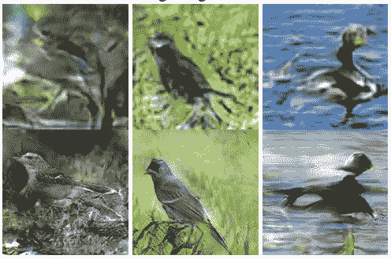

Images generated by Stage-I and Stage-II of the StackGAN network

我建议您将网络训练 1000 个纪元。 如果一切顺利，则在 1000 个时期之后，生成器网络将开始生成逼真的图像。


# 可视化损失


为了可视化训练的损失，请按以下方式启动  TensorBoard 服务器：

```py
tensorboard --logdir=logs
```

现在，在浏览器中打开  `localhost:6006` 。 TensorBoard 的  **标量** 部分包含两个损失的曲线图，如下所示：

阶段 I 的判别器网络的损耗图如下所示：


阶段 I 的生成器网络的损耗图如下所示：


可以类似地从 Tensorboard 获得 Stage II 的生成器网络和判别器网络的损耗图。

这些图将帮助您决定是继续还是停止训练。 如果损失不再减少，您就可以停止训练，因为没有改善的机会。 如果损失持续增加，则必须停止训练。 使用超参数，然后选择一组您认为可以提供更好结果的超参数。 如果损失逐渐减少，请继续训练模型。


# 可视化图形


TensorBoard 的  **GRAPHS** 部分包含两个网络的图形。 如果网络性能不佳，这些图可以帮助您调试网络。 它们还显示了每个图中的张量流和不同的操作：


# StackGAN 的实际应用


StackGAN 的行业应用包括：

*   自动生成高分辨率图像以用于娱乐或教育目的
*   **创建漫画**：使用 StackGAN 可以将漫画创建过程缩短至几天，因为 StackGAN 可以自动生成漫画并协助创作过程
*   **电影创作**：StackGAN 可以通过根据文本描述生成帧来协助电影创作者
*   **艺术创作**：StackGAN 可以通过根据文字描述生成草图来协助艺术家


# 概要


在本章中，我们了解并实现了 StackGAN 网络，该网络可从文本描述生成高分辨率图像。 我们从对 StackGAN 的基本介绍开始，在其中我们探讨了 StackGAN 的体系结构细节，并发现了用于训练 StackGAN 的损失。 然后，我们下载并准备了数据集。 之后，我们开始在 Keras 框架中实现 StackGAN。 实施之后，我们依次训练了 Stage-I 和 Stage-II StackGANS。 成功训练网络后，我们评估了模型并将其保存以备将来使用。

在下一章中，我们将与 CycleGAN 合作，该网络可以将绘画转换为照片。


