# 基于指标的方法

深度学习已在各种应用中成功实现了最先进的性能，例如图像分类，对象检测，语音识别等。 但是，深度学习架构在被迫对几乎没有监督信息的数据进行预测时常常会失败。 众所周知，数学是所有机器学习和深度学习模型的基础。 我们使用数据的数学表示将数据和目标传达给机器。 这些表示形式可以有多种形式，特别是如果我们想学习复杂的任务（例如疾病检测），或者如果我们希望我们的架构根据不同的目标学习表示形式，例如，计算两个图像之间的相似度，我们可以 计算欧几里得距离和余弦相似度。

在本章中，我们将学习可以从较小的数据集中学习正确的数学表示形式的深度学习架构。 总体而言，我们的目标是创建一种无需大量数据收集或训练过程即可概括不熟悉类别的架构。

本章将涵盖以下主题：

*   参数方法–概述
*   连体网络
*   匹配网络
*   编码练习

# 技术要求

需要使用以下库来学习和执行本章中的项目：

*   Python
*   Anaconda
*   Jupyter 笔记本
*   PyTorch
*   Matplotlib
*   scikit 学习

[您可以在该书的 GitHub 存储库中找到该章的代码文件](https://github.com/PacktPublishing/Hands-On-One-shot-Learning-with-Python)。

# 参数方法概述

在上一章中，我们简要讨论了非参数机器学习方法。 本节将主要关注机器学习的参数方法是什么，以及它们实际学习了什么。

简而言之，参数化机器学习算法试图学习数据及其标签的联合概率分布。 我们学习的参数是联合概率分布给出的方程； 例如，众所周知，逻辑回归可以看作是一层神经网络。 因此，考虑到一个单层神经网络，它实际学习的是方程的权重和偏差，以便使`P(Y | X)`适应`Y`（标签）。

逻辑回归是**判别式分类器**的一种形式，在判别式分类器中，我们仅关注`P(Y | X)`，即，我们尝试对`Y`（标签）的概率分布做出假设，并尝试以某种方式将我们的`X`（输入）映射到它。 因此，本质上，我们尝试在逻辑回归中进行以下操作：

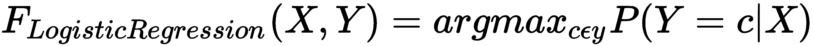

在这里，`P(Y | X)`是分类分布，这意味着我们正在尝试学习可能类别上的分布。 简单来说：给定`X`，我们将学习`Y`可以具有的所有可能类别。 由于数据的缘故，这都是可能的-随着数据量的增加，我们对`Y`的近似值也随之增加。 在下一节中，我们将学习神经网络的学习过程，并了解哪些属性在逼近`Y`标签中起着重要的作用。

# 神经网络学习器

众所周知，神经网络通过使用随机梯度下降优化方法使损失函数（或目标函数）最小化来学习。 因此，损失函数是决定神经网络架构目标的主要因素之一。 例如，如果要分类数据点，我们将选择损失函数，例如**类别交叉熵**，**0-1 损失**和**铰链损失**； 相反，如果我们的目标是回归，我们将选择损失函数，例如**均方误差**，**均方根误差**和 **Huber 损失**。 一些常见的方程式如下：

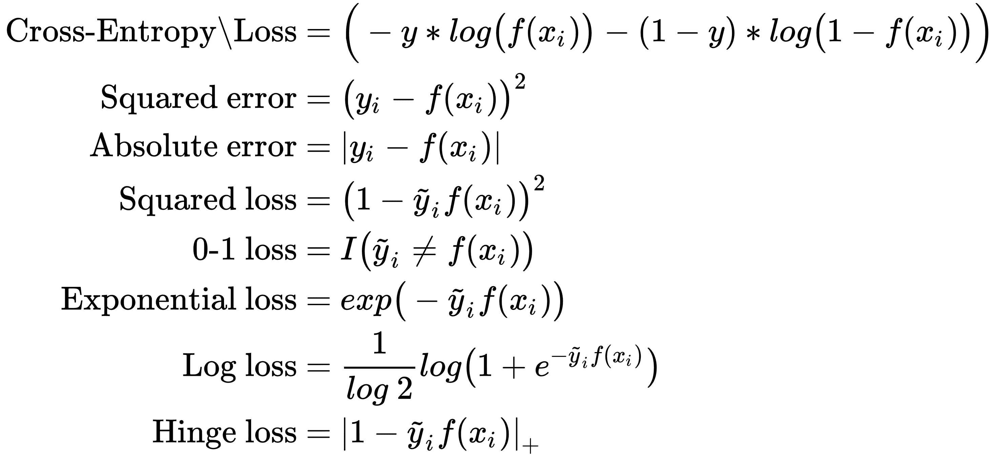

在知道损失函数对神经网络有重大影响之后，每个人首先想到的是我们需要提出更好的损失函数。 如果您研究最新的研究，您会发现主要的发展是基于更改丢失功能的对象检测，图像分割，机器翻译等。 找出新的损失函数可能很棘手，原因有两个：

*   目标函数本质上必须是凸形的，才能满足随机梯度下降优化的要求。
*   通常，通过不同函数获得的最小值在数值上相同。

在下一节中，我们将了解这些损失函数如何帮助架构学习不同的图像特征，以及如何结合这些特征来为其他各种目标训练模型。

# 可视化参数

神经网络通过梯度下降学习，但是它们学到什么呢？ 答案是参数，但我们希望了解这些参数的含义。 在下图中，如果我们看一下前几层，将看到简单易懂的提取特征，例如边缘和兴趣点，而更深层的特征则更复杂。 例如，如果我们查看下图中的最后一层，将观察到与初始层要素相比，要素是不可识别的。 这是因为随着我们进入更深的层次，越来越多的信息丰富的特征正在通过各种矩阵运算来提取。 这使得高维信息可以压缩到低维损失函数空间中，并得到训练后的模型：

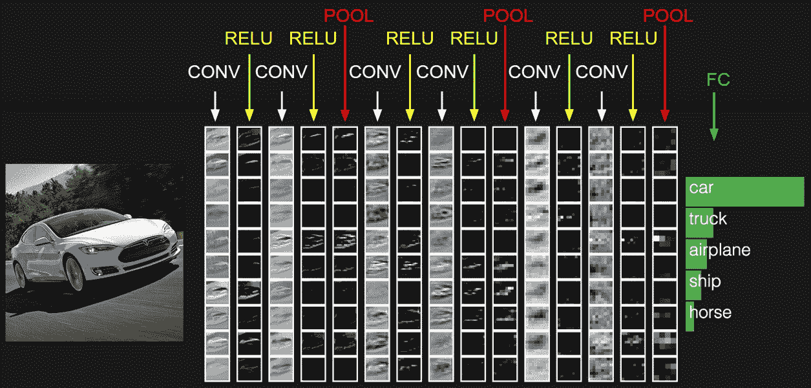

因此，例如，如果我们查看花朵与汽车等类别，则初始层的功能就足够了。 但是，如果我们有诸如汽车类型之类的类别，则需要更深层次的模型，因为我们需要提取更复杂的特征，这需要更大的数据集。 问题是，什么决定了模型学习的特征或参数的类型，是否有可能在初始层学习这些重要参数？ 在下一部分中，我们将探索连体网络，它是一种神经网络架构，可以通过更改损失函数及其架构设计来学习前几层的复杂功能。

# 了解连体网络

顾名思义，连体网络是一种具有两个并行层的架构。 在此架构中，模型学会了在两个给定的输入之间进行区分，而不是学习使用分类损失函数对其输入进行分类的模型。 它根据相似性度量比较两个输入，并检查它们是否相同。 与任何深度学习架构相似，连体网络也有两个阶段-训练和测试阶段。 但是，对于一次学习方法（因为我们没有很多数据点），我们将在一个数据集上训练模型架构，并在另一个数据集上对其进行测试。 为了简单起见，我们使用带监督的基于度量的方法使用连体神经网络来学习图像嵌入，然后将该网络的功能重新用于一次学习，而无需进行微调或重新训练。

机器学习算法的良好特征的提取在确定模型效率方面起着至关重要的作用。 在各种情况下，当可用数据有限时，事实证明它要么计算量大，要么困难。

如下图所示，我们的目标是训练网络以了解两个图像或声音是否相同。 假设第一个图像中有两个足球； 即使背景不同，两者都是足球，所以被认为是相同的。 单词`cow`的声音也是如此。 在图像和声音不同的地方，例如鳄鱼和足球，它们被标记为不同的：

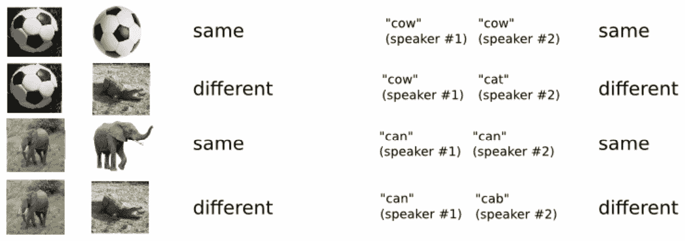

关键思想听起来可能类似于转学，但有所不同。 连体网络使用对比损失函数来学习这些功能。 其次，连体网络方法仅适用于相似的域，因为它还需要注意域的适应性，也就是说，它需要尝试确保我们的训练和测试数据集在域方面是紧密的。 例如，如果您要创建一个系统来测试两个手写示例是否属于同一个人，则可以在 MNIST 数据集上训练一个连体网络架构，通过该架构，可以学习特定于手写体的特征（例如曲线） 和给定字符的笔划。 在下一节中，我们将研究连体网络的架构并了解其优化。

# 构建

连体网络由两个相同的神经网络组成，它们共享相似的参数，每个头部获取一个输入数据点。 在中间层，由于权重和偏差相同，因此我们提取了相似的特征。 这些网络的最后一层被馈送到**对比损失函数层**，，该层计算两个输入之间的相似度。

您可能会遇到的一个问题是，为什么连体网络的层共享参数？ 如果我们已经在努力改变损失函数，这是否有助于我们分别训练各层？

我们不单独训练层的主要原因有两个：

*   对于每一层，我们都添加了数千个参数。 因此，类似于我们在共享参数的卷积神经网络方法中所做的工作，我们可以更快地优化网络。
*   权重共享确保两个相似的图像不会映射到要素嵌入空间中的不同位置。

特征嵌入是将特征投影到某个更高维度的空间（也称为**特征嵌入空间**），具体取决于我们要实现的任务。

下图说明了一个示例连体网络架构：


如我们所见，前面的图是简单明了的。 现在，我们将讨论训练连体网络所需的预处理步骤。

# 预处理

为了训练连体网络，我们需要对数据集进行特殊的预处理。 在预处理数据集时，我们必须仔细创建数据点对，如下所示：

*   相似的图像对
*   不同的图像对

下图说明了 Omniglot 的连体网络目标的示例：


我们还需要为相似的数据点（`y = 1`）和不相似的数据点（`y = 0`）相应地创建标签； 然后，将每一对馈入连体体系。 在层的最后，连体网络使用损失函数的区分形式来学习各层之间的区分特征。 通常，对于连体网络，我们仅使用两种类型的函数-对比损失函数和三重损失函数。 我们将在下一节中详细了解这些内容。

# 对比损失函数

使用连体架构的整体思想不是在类别之间进行分类，而是学习区分输入。 因此，它需要损失函数的微分形式，称为**对比损失函数**。 给出如下：

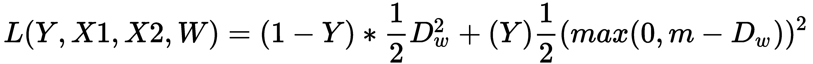

在该等式中， `D[w] = √((f(X1) - f(X2))²)`，`f(X)`代表连体神经网络，`m`代表裕度。

让我们进一步求解损耗方程。 以`Y = 1`表示相似的货币对：


如果两个输入`X1`和`X2`相同，则意味着连体网络应该能够学习制作`D²[w] = 0`。 我们在方程式中增加余量`m`，以使连体网络不使`W = 0`，从而使`D²[w] = 0`。 通过强制执行边距，我们确保连体网络学习到良好的决策边界。

类似地，对于不相似对的`Y = 0`，这将产生以下结果：


从数字上讲，对于相同的对情况，仅当`D[w] = 0`时，损失函数才为零，否则它将表现为回归损失，并尝试学习特征以确保`D[w]`接近 0。

尽管对比损失函数是学习判别特征的一种好方法，但是在连体网络架构的其他修改版本中，对比损失函数不能非常清楚地学习决策边界。 在这种情况下，我们可以使用称为**三重损失**的新损失函数，该函数可帮助架构获得更好的结果。

# 三重损失函数

三重态损失函数是对比损失函数的替代方法。 与对比损失函数相比，它具有收敛优势。

要了解三重态损失函数，首先，我们需要成对定义数据点，如下所示：

*   **锚点**（`A`）：主数据点
*   **正例**（`P`）：类似于锚点的数据点
*   **负例**（`N`）：与锚点不同的数据点

考虑到`f(X)`是连体网络的输出，理想情况下，我们可以假设以下内容：

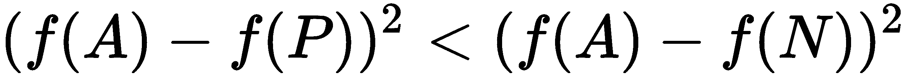

用距离函数的术语，我们可以说以下几点：

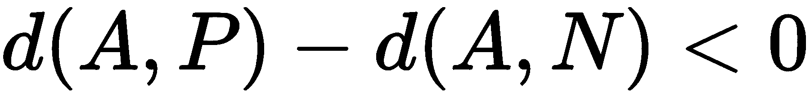

由于我们不希望连体网络学习`f(X) = 0, X ∈ R`，因此我们将添加余量，类似于对比损失函数：

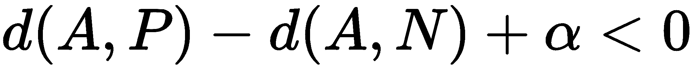

使用以下等式，我们将定义三重态损失如下：

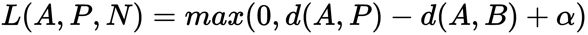

下图表示三元组损失函数：

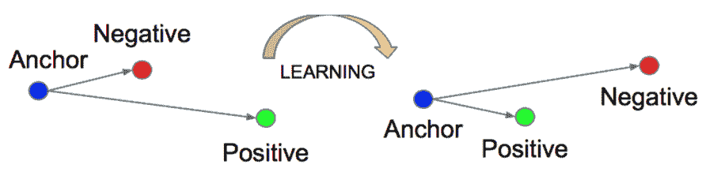

三重损失函数的收敛性优于对比损失函数，因为它一次考虑了三个示例，并保持了**正**和**负**点之间的距离，如上图所示，从而可以学习决策 边界损失更准确，而对比损失函数一次只考虑成对示例，因此从某种意义上讲，它更贪婪，这会影响决策边界。

# 应用领域

通常，可以使用各种方法解决问题。 例如我们手机上的人脸检测。 图像分类是一种需要大量数据点的方法，而如果使用单次学习的连体网络架构，则仅需几个数据点就可以实现更高的准确率。 连体网络架构已成为软件行业采用的最流行的一次学习架构之一。 它可用于各种其他应用，例如面部检测，手写检测和垃圾邮件检测。 但是仍然有很多改进的余地，并且各种各样的研究者正在为此努力。 在下一节中，以相似的主题进行工作，我们将学习匹配的网络架构，该架构使用注意力机制和不同的训练过程来学习训练集标签上的概率分布。

# 了解匹配网络

匹配网络通常会提出一个框架，该框架学习一个网络，该网络映射一个小的训练数据集，并在相同的嵌入空间中测试未标记的示例。 匹配网络旨在学习小型训练数据集的正确嵌入表示，并使用具有余弦相似性度量的可微 kNN 来检查是否已经看到测试数据点。

匹配网络的设计有两个方面：

*   **建模级别**：在建模级别，他们提出了匹配网络，该网络利用注意力和记忆力方面的进步实现快速有效的学习。
*   **训练过程**：在训练级别上，他们有一个条件-训练和测试集的分布必须相同。 例如，这可能意味着每个类显示一些示例，并将任务从小批量切换到小批量，类似于在展示新任务的一些示例时如何对其进行测试。

匹配网络结合了参数模型和非参数模型的最佳特性，也被称为差分最近邻居。

在下一节中，我们将研究在建模级别由匹配网络做出的贡献，随后我们将经历训练过程的贡献。

# 模型架构

匹配的网络架构主要受关注模型和基于内存的网络的启发。 在所有这些模型中，都定义了神经注意力机制来访问存储矩阵，该矩阵存储有用的信息来解决手头的任务。 首先，我们需要了解匹配网络中使用的某些术语：

*   **标签集**：这是所有可能类别的样本集。 例如，如果我们使用 ImageNet 数据集，它包含数千个类别（例如猫，狗和鸟），但是作为标签集的一部分，我们将仅使用其中的五个类别。
*   **支持集**：这是我们标签集类别的采样输入数据点（例如，图像）。
*   **批量**：类似于支持集，批量也是由标签集类别的输入数据点组成的采样集。
*   **`N`路`k`次方法**：此处，`N`是支撑集的大小，或更简单地说，是 训练集中可能类别的数量。 例如，在下图中，我们有四种不同类型的狗品种，并且我们计划使用 5 次学习方法，即每种类别至少有五个示例。 这将使我们的匹配网络架构使用 *4 路 5 次学习*，如下图所示：


匹配网络的关键思想是将图像映射到嵌入空间，该空间也封装了标签分布，然后使用不同的架构在相同的嵌入空间中投影测试图像。 然后，我们以后用余弦相似度来衡量相似度。 让我们看一下匹配网络如何创建其嵌入空间。

# 训练器

在训练架构方面，匹配网络遵循某种技术：它们尝试在训练阶段复制测试条件。 简而言之，正如我们在上一节中所了解的那样，匹配网络从训练数据中采样标签集，然后它们从同一标签集生成支持集和批量集。 数据预处理之后，匹配网络通过训练模型以将支持集作为训练集，并将批量集作为测试集来最小化错误，从而学习其参数。 通过将支持集作为训练集，将批量集作为测试集的训练过程，可使匹配的网络复制测试条件。

在下一部分中，我们将介绍匹配网络的架构和算法，并学习如何在模型的训练阶段使用批量集（即测试集）。

# 建模级别–匹配的网络架构

匹配网络将支持集（`k`示例）映射到分类器`C[s](·)`的支持集（`k`示例）`S = (x[i], x[i]), i = 1, ..., k`。 基本上，匹配网络将映射`S -> C[s](·)`定义为参数化神经网络`P(y_hat | x_hat, S)`。 如果我们谈论`P(y_hat | x_hat, S)`的最简单形式，它将是支持集标签的线性组合形式：

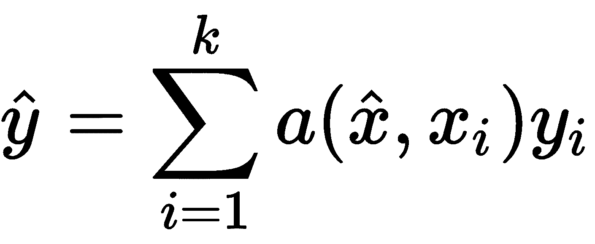

在此，`a(x_hat, x[i])`是 softmax 函数。 从逻辑上看，我们可以看到`y_hat`正在非参数意义上正确计算。

例如，如果我们有 2 个类，分别为 0 和 1，则 2 个示例（`k = 2`）如下：`y = (0, 1)`。

通过将`y`变成单热编码向量，我们将获得以下信息：


它们各自的内核值如下：


通过引入`a`和`y`的值，我们将获得以下方程式：


解决此问题后，我们将获得以下方程式：


总体而言，我们可以看到`y_hat`如何成为确定测试输入`x_hat`属于哪个类别的概率的线性组合。 要将任何形式的函数转换为概率空间，深度学习社区使用的最佳选择是 softmax 函数，使得`a(x_hat, x[i])`如下：

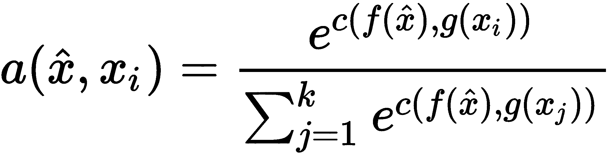

在此，`c`是训练集和测试数据点的嵌入之间的余弦相似度函数。

现在，出现了关于如何从测试集和训练集中提取嵌入的问题。 任何形式的神经网络都可以工作。 对于图像，著名的 VGG16 或 Inception Net 将通过使用迁移学习为测试图像和训练图像提供适当的嵌入； 本质上，这是过去大多数基于度量的方法所做的，但是无法获得人类水平的认知结果。

VGG16 和 Inception Net 是深度学习架构，它们在 ImageNet 数据集上提供了最新的结果。 它们通常用于任何图像的初始特征提取，因为这将为我们的架构适当地初始化训练过程。

匹配网络指出了上述简单化非参数方法的两个问题：

*   **问题 1**：即使分类策略`P(y_hat | x_hat, S)`已设定条件，训练集图像的嵌入也彼此独立，而不认为它们是支持集的一部分 在支持集上。

**解决方案**：匹配网络使用**双向长短期记忆**（**LSTM**）在整个支持范围内启用每个数据点的编码 组。 通常，LSTM 用于理解数据序列，因为它们能够使用其单元内部的门保持整个数据的上下文。 同样，使用双向 LSTM 可以更好地理解数据序列。 匹配网络使用双向 LSTM 来确保支持集中一幅图像的嵌入将具有所有其他图像嵌入的上下文。

*   **问题 2**：如果要计算两个数据点之间的相似度，首先需要将它们放入相同的嵌入空间。 因此，支持集`S`必须能够有助于提取测试图像嵌入。

**解决方案**：匹配网络使用 LSTM，并且具有对支持集`S`的注意。

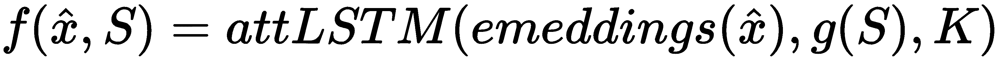

这里，`K`是展开步骤的数量，`embeddings(x_hat)`是通过 VGG16/Inception 网络获得的测试图像嵌入； `g(S)`是将测试图像嵌入带到同一空间的样本集。

下图说明了匹配的网络架构：


匹配的网络架构解决了通过设置框架在训练模型时复制测试条件的一次学习问题，如*训练过程*部分中所述。 匹配网络的架构包含许多子部分。 为了简化和更清楚地了解它，我们将从左到右进行每个过程：

1.  作为预处理数据的一部分，将创建`k`示例的支持集`S`作为`(x[i], y[i]), i = 1 ... k`。
2.  获取支持集后，它会通过标准特征提取层（`g`），例如 VGG 或 Inception。
3.  在提取支持集（`S`）的嵌入（`g`层的输出）之后，将它们放入双向 LSTM 架构中。 这有助于模型学习支持集中存在的标签的概率分布。
4.  与训练集类似，查询图像（即测试图像）的全上下文嵌入提取也经历了组合的双向 LSTM 架构，同时从`g(x[i)`获得了贡献，从而 映射到相同的嵌入空间。
5.  从这两种架构获得输出后，这些输出将通过 softmax 层（也称为注意内核步骤`a(h[k-1], g(x[i]))`）传递。

6.  然后，从`g(x[i])`和`f'(x)`获得的输出用于检查查询图像属于哪个类别：


在此等式中，`y_hat`是支持集中标签的加权和。

在此，注意核是 softmax 函数，其余弦距离的值介于`g(x[i])`和`f'(x)`之间。 为了训练模型，我们可以使用任何基于分类的损失函数，例如交叉熵损失函数。

匹配网络的关键思想是创建一个即使在训练数据（即支持集）中不存在的类也可以表现良好的架构。

匹配网络因其创新的训练过程和完全上下文嵌入而成为一站式学习的著名方法之一。 如果我们尝试从人类学习的角度理解匹配网络的方法，则它与儿童的教学过程非常相似。 要学习新任务，将为他们提供一系列小型示例，然后是小型测试集，然后重复进行。 使用此程序，并借助人脑的上下文记忆保持功能，孩子们可以学习一项新的任务。

在下一部分中，我们将使用著名的 MNIST 和 Omniglot 数据集探索连体网络的实现和匹配网络架构。

# 编码练习

在本节中，我们将学习连体网络和匹配网络的实现。

让我们从连体网络开始。

# 连体网络-MNIST 数据集

在本教程中，我们将按照此处列出的顺序执行以下操作：

1.  数据预处理：创建偶对
2.  创建连体网络架构
3.  使用小型 MNIST 数据集对其进行训练
4.  可视化嵌入

执行以下步骤进行练习：

1.  首先，使用以下代码导入所需的所有库：

```py
# -*- encoding: utf-8 -*-
import argparse
import torch
import torchvision.datasets as dsets
import random
import numpy as np
import time
import matplotlib.pyplot as plt
from torch.autograd import Variable
from torchvision import transforms
import pickle
import torch
import torch.nn as nn
```

正如我们在理论“了解连体网络”部分中学到的，作为数据预处理的一部分，我们需要创建对：

*   相似对；`y = 1`
*   不同对；`y = 0`

我们正在使用对比损失函数–这就是为什么我们只有两对的原因。 对于三重损失函数，我们需要其他形式的预处理。

2.  要预处理数据并为模型创建迭代器，请首先创建`Dataset`类：

```py
class Dataset(object):
    '''
    Class Dataset:
    Input: numpy values
    Output: torch variables.
    '''
    def __init__(self, x0, x1, label):
        self.size = label.shape[0] 
        self.x0 = torch.from_numpy(x0)
        self.x1 = torch.from_numpy(x1)
        self.label = torch.from_numpy(label)

    def __getitem__(self, index):
        return (self.x0[index],
                self.x1[index],
                self.label[index])

    def __len__(self):
        return self.size
```

3.  在创建迭代器之前，让我们创建`pairs`函数并对其进行预处理：

```py
def create_pairs(data, digit_indices):
    x0_data = []
    x1_data = []
    label = []
    n = min([len(digit_indices[d]) for d in range(10)]) - 1
    for d in range(10): # for MNIST dataset: as we have 10 digits
        for i in range(n):
            z1, z2 = digit_indices[d][i], digit_indices[d][i + 1]
            x0_data.append(data[z1] / 255.) # Image Preprocessing 
                                            Step
            x1_data.append(data[z2] / 255.) # Image Preprocessing 
                                            Step
            label.append(1)
            inc = random.randrange(1, 10)
            dn = (d + inc) % 10
            z1, z2 = digit_indices[d][i], digit_indices[dn][i]
            x0_data.append(data[z1] / 255.) # Image Preprocessing 
                                            Step
            x1_data.append(data[z2] / 255.) # Image Preprocessing 
                                            Step
            label.append(0)

    x0_data = np.array(x0_data, dtype=np.float32)
    x0_data = x0_data.reshape([-1, 1, 28, 28])
    x1_data = np.array(x1_data, dtype=np.float32)
    x1_data = x1_data.reshape([-1, 1, 28, 28])
    label = np.array(label, dtype=np.int32)
    return x0_data, x1_data, label
```

4.  然后，创建`iterator`函数。 为了我们的训练目的，这将返回给定的`batchsize`参数集：

```py
def create_iterator(data, label, batchsize, shuffle=False):
    digit_indices = [np.where(label == i)[0] for i in range(10)]
    x0, x1, label = create_pairs(data, digit_indices)
    ret = Dataset(x0, x1, label)
    return ret
```

5.  然后，创建`loss`函数。 众所周知，`contrastive_loss_function`包含两个部分：

*   对于类似的点：`(1-y)*(distance_function)^2`
*   对于不同的点： `y*{max(0,(m-distance_function^2)}`

4.  在这里，`distance_function`被视为欧几里得距离，也称为**均方根**：

```py
def contrastive_loss_function(x0, x1, y, margin=1.0):
    # euclidean distance
    diff = x0 - x1
    dist_sq = torch.sum(torch.pow(diff, 2), 1)
    dist = torch.sqrt(dist_sq)
    mdist = margin - dist
    dist = torch.clamp(mdist, min=0.0)
    loss = y * dist_sq + (1 - y) * torch.pow(dist, 2)
    loss = torch.sum(loss) / 2.0 / x0.size()[0]
    return loss
```

6.  接下来，创建连体网络架构。 为此，我们首先创建一个带有两个函数的名为`SiameseNetwork`的类：

*   `forward_once`：在`forward_once`中，训练数据将穿过所有层并返回输出的嵌入。
*   `forward`：在`forward`中，对于给定的输入对，将两次调用`forward_once`，这将返回获得的嵌入的 NumPy 数组。

正如在连体网络的理论部分所讨论的那样，我们与两个并行层共享参数，因此我们不需要显式创建两个分支，我们只需创建一个分支即可：

```py
class SiameseNetwork(nn.Module):
    def __init__(self,flag_kaf=False):
        super(SiameseNetwork, self).__init__()
        self.cnn1 = nn.Sequential(
            nn.Conv2d(1, 20, kernel_size=5),
            nn.MaxPool2d(2, stride=2),
            nn.Conv2d(20, 50, kernel_size=5),
            nn.MaxPool2d(2, stride=2))
        self.fc1 = nn.Sequential(
            nn.Linear(50 * 4 * 4, 500),
            nn.ReLU(inplace=True),
            nn.Linear(500,10),
            nn.Linear(10, 2))

    def forward_once(self, x):
        output = self.cnn1(x)
        output = output.view(output.size()[0], -1)
        output = self.fc1(output)
        return output

    def forward(self, input1, input2):
        output1 = self.forward_once(input1)
        output2 = self.forward_once(input2)
        return output1, output2
```

7.  减少`MNIST`数据集并选择`2000`随机点，将`batchsize`设置为 2 的任意幂（例如`128`），然后导入`MNIST`数据集：

```py
batchsize=128
train = dsets.MNIST(root='../data/',train=True,download=True)
test = dsets.MNIST(root='../data/',train=False,transform=transforms.Compose([transforms.ToTensor(),]))
indices= np.random.choice(len(train.train_labels.numpy()), 2000, replace=False)
indices_test= np.random.choice(len(test.test_labels.numpy()), 100, replace=False)
```

8.  我们在“步骤 4”中创建了一个迭代器，我们将使用它来创建训练和测试集迭代器：

```py
train_iter = create_iterator(train.train_data.numpy()[indices],train.train_labels.numpy()[indices],batchsize)
test_iter = create_iterator(test.test_data.numpy()[indices_test],test.test_labels.numpy()[indices_test],batchsize)

# call model
model = SiameseNetwork()
learning_rate = 0.01 # learning rate for optimization
momentum = 0.9 # momentum
# Loss and Optimizer
criterion = contrastive_loss_function # we will use contrastive loss function as defined above
optimizer = torch.optim.SGD(model.parameters(), lr=learning_rate,momentum=momentum)

# creating a train loader, and a test loader.
train_loader = torch.utils.data.DataLoader(train_iter,batch_size=batchsize, shuffle=True)
test_loader = torch.utils.data.DataLoader(test,batch_size=batchsize, shuffle=True)
```

9.  然后，我们训练模型一定数量的时间并打印结果：

```py
train_loss = []
epochs =100
for epoch in range(epochs):
    print('Train Epoch:'+str(epoch)+"------------------>")
    for batch_idx, (x0, x1, labels) in enumerate(train_loader):
        labels = labels.float()
        x0, x1, labels = Variable(x0), Variable(x1), 
        Variable(labels)
        output1, output2 = model(x0, x1)
        loss = criterion(output1, output2, labels)
        optimizer.zero_grad()
        loss.backward()
        optimizer.step()
        train_loss.append(loss.item())
        if batch_idx % batchsize == 0:
            print('Epoch: {} \tLoss: {:.6f}'.format(epoch, 
                loss.item()))
```

这将给出以下输出：

```py
Epoch: 0        Loss: 0.269623
Epoch: 1        Loss: 0.164050
Epoch: 2        Loss: 0.109350
Epoch: 3        Loss: 0.118925
Epoch: 4        Loss: 0.108258
...
...
Epoch: 97       Loss: 0.003922
Epoch: 98       Loss: 0.003155
Epoch: 99       Loss: 0.003937
```

0.  现在，让我们创建所有用于绘制嵌入的函数和一个损失函数：

```py
def plot_loss(train_loss,name="train_loss.png"):
    plt.plot(train_loss, label="train loss")
    plt.legend()
    plt.show()

def plot_mnist(numpy_all, numpy_labels,name="./embeddings_plot.png"):
        c = ['#ff0000', '#ffff00', '#00ff00', '#00ffff', '#0000ff',
             '#ff00ff', '#990000', '#999900', '#009900', '#009999']

        for i in range(10):
            f = numpy_all[np.where(numpy_labels == i)]
            plt.plot(f[:, 0], f[:, 1], '.', c=c[i])
        plt.legend(['0', '1', '2', '3', '4', '5', '6', '7', '8', 
            '9'])
        plt.savefig(name)
```

1.  使用以下代码绘制`loss`函数：

```py
plot_loss(train_loss)
```

这将给出以下图作为结果输出：

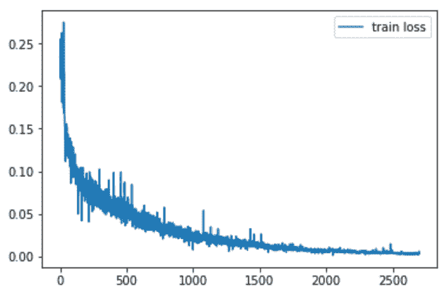

2.  然后，我们将定义`test_model`和`testing_plots`来绘制`MNIST`数据集的测试集嵌入：

```py
def test_model(model):
        model.eval()
        all_ = []
        all_labels = []
        with torch.no_grad():
            for batch_idx, (x, labels) in enumerate(test_loader):
                x, labels = Variable(x), Variable(labels)
                output = model.forward_once(x)
                all_.extend(output.data.cpu().numpy().tolist())
                all_labels.extend(labels.data.cpu().numpy().tolist())

        numpy_all = np.array(all_)
        numpy_labels = np.array(all_labels)
        return numpy_all, numpy_labels

def testing_plots(model):
        dict_pickle={}
        numpy_all, numpy_labels = test_model(model)
        dict_pickle["numpy_all"]=numpy_all
        dict_pickle["numpy_labels"]=numpy_labels
        plot_mnist(numpy_all, numpy_labels)
```

3.  然后，绘制`testing_plots`：

```py
testing_plots(model)
```

这将给出以下图作为结果输出：


在上图中，我们可以观察到大多数点都在一个群集中，而其他一些点则不在群集中，可以看作是离群值。

# 匹配网络– Omniglot 数据集

在本教程中，我们将学习如何创建匹配的网络架构并将其训练在 Omniglot 数据集上。 首先，让我们首先了解什么是 Omniglot 数据集。

Omniglot 数据集旨在开发更多类似于人类的学习算法。 它包含来自 50 个不同字母的 1,623 个不同的手写字符。 1,623 个字符中的每个字符都是由 20 个不同的人通过亚马逊的 Mechanical Turk 在线绘制的。 每个图像都与笔划数据配对，序列`[x, y, t]`与时间的坐标（`t`）以毫秒为单位。 有关更多详细信息，请参考[这里](https://github.com/brendenlake/omniglot)。

您可以从[这里](https://github.com/brendenlake/omniglot)下载 Omniglot 数据集。

我们的匹配网络架构实现包括以下五个重要部分（有关更多详细信息，您可以参考“建模级别-匹配网络架构”部分中的匹配网络架构图）：

*   嵌入提取器`g`
*   完全上下文嵌入和双向 LSTM `f`
*   余弦相似距离函数`c`
*   注意模型，`softmax(c)`
*   损失函数，交叉熵损失

现在，我们将遍历匹配网络的每个部分并实现它：

1.  导入所有库：

```py
import numpy as np
import torch
import torch.nn as nn
import math
import numpy as np
import torch.nn.functional as F
from torch.autograd import Variable
import tqdm
import torch.backends.cudnn as cudnn
from torch.optim.lr_scheduler import ReduceLROnPlateau
import matplotlib.pyplot as plt
%matplotlib inline
```

2.  我们将加载`omniglot`数据集，该数据集将使用帮助程序脚本转换为`.npy`格式。 在帮助程序脚本中，我们仅以以下大小格式加载数据：`[total_number, character, 28,28]`（有关更多详细信息，请通过本书的 GitHub 存储库中的`helper.py`脚本进行操作）：

```py
x = np.load('data/data.npy') # Load Data
x = np.reshape(x, newshape=(x.shape[0], x.shape[1], 28, 28, 1)) # expand dimension from (x.shape[0],x.shape[1],28,28)
np.random.shuffle(x) # shuffle dataset
x_train, x_val, x_test = x[:1200], x[1200:1411], x[1411:] # divide dataset in to train, val,ctest
batch_size = 16 # setting batch_size
n_classes = x.shape[0] # total number of classes
classes_per_set = 20 # Number of classes per set
samples_per_class = 1 # as we are choosing it to be one shot learning, so we have 1 sample
```

如果您想了解有关数据加载方法的更多信息，[可以参考 GitHub 上的`helper.py`文件](https://github.com/PacktPublishing/Hands-On-One-shot-Learning-with-Python/tree/master/Chapter02)。

3.  使用规范化方法预处理图像：

```py
def processes_batch(data, mu, sigma):
    return (data - mu) / sigma

# Normalize Dataset
x_train = processes_batch(x_train, np.mean(x_train), np.std(x_train))
x_val = processes_batch(x_val, np.mean(x_val), np.std(x_val))
x_test = processes_batch(x_test, np.mean(x_test), np.std(x_test))

# Defining dictionary of dataset
datatset = {"train": x_train, "val": x_val, "test": x_test}
```

4.  现在，运行以下代码以可视化由 20 个人编写的一个字符的第`0`个示例：

```py
temp = x_train[0,:,:,:,:] 
for i in range(0,20):
    plt.figure()
    plt.imshow(temp[i,:,:,0])
```

通过运行前面的代码，您将获得以下 20 个：


接下来，我们将对训练数据进行一些处理。

要加载 Omniglot 数据集并准备将其用于匹配的网络架构，我们需要创建以下内容：

*   标签集：`choose_label`
*   支持集：`support_set_x`，`support_set_y`
*   支持集示例中的一批

我们将执行以下步骤：

1.  首先，创建一个可以提供支持集和目标集的批量：

```py
def sample_batch(data):
        """
        Generates sample batch 
        :param : data - one of(train,test,val) our current dataset 
        shape [total_classes,20,28,28,1]
        :return: [support_set_x,support_set_y,target_x,target_y] 
        for Matching Networks
        """
        support_set_x = np.zeros((batch_size, classes_per_set, 
            samples_per_class, data.shape[2], data.shape[3], 
            data.shape[4]), np.float32)
        support_set_y = np.zeros((batch_size, classes_per_set, 
            samples_per_class), np.int32)

        target_x = np.zeros((batch_size, data.shape[2], 
            data.shape[3], data.shape[4]), np.float32)
        target_y = np.zeros((batch_size, 1), np.int32)
        for i in range(batch_size):
            choose_classes = np.random.choice(data.shape[0], 
                size=classes_per_set, replace=False) # choosing 
                random classes
            choose_label = np.random.choice(classes_per_set, 
                size=1) # label set
            choose_samples = np.random.choice(data.shape[1], 
                size=samples_per_class + 1, replace=False)
            x_temp = data[choose_classes] # choosing classes
            x_temp = x_temp[:, choose_samples] # choosing sample 
                batch from classes chosen outputs 20X2X28X28X1
            y_temp = np.arange(classes_per_set) # will return 
                [0,1,2,3,...,19]
            support_set_x[i] = x_temp[:, :-1]
            support_set_y[i] = np.expand_dims(y_temp[:], 
                axis=1) # expand dimension
            target_x[i] = x_temp[choose_label, -1]
            target_y[i] = y_temp[choose_label]
        return support_set_x, support_set_y, target_x, target_y 
            # returns support of [batch_size, 20 classes per set, 
            1 sample, 28, 28,1]

def get_batch(dataset_name):
        """
        gen batch while training
        :param dataset_name: The name of dataset(one of 
        "train","val","test")
        :return: a batch images
        """
        support_set_x, support_set_y, target_x, target_y = 
        sample_batch(datatset[dataset_name])
        support_set_x = 
        support_set_x.reshape((support_set_x.shape[0], 
            support_set_x.shape[1] * support_set_x.shape[2],
            support_set_x.shape[3], support_set_x.shape[4], 
            support_set_x.shape[5]))
        support_set_y = 
        support_set_y.reshape(support_set_y.shape[0], 
            support_set_y.shape[1] * support_set_y.shape[2])
        return support_set_x, support_set_y, target_x, target_y
```

如果您还记得，在匹配的网络架构中，网络有四个主要部分：

*   嵌入提取器（`g`）
*   全文上下文嵌入（`f`）
*   注意模型（`a`）
*   距离函数（`c`）

2.  创建一个分类器：

```py
def convLayer(in_channels, out_channels, dropout_prob=0.0):
    """
    :param dataset_name: The name of dataset(one of 
    "train","val","test")
    :return: a batch images
    """
    cnn_seq = nn.Sequential(
        nn.Conv2d(in_channels, out_channels, 3, 1, 1),
        nn.ReLU(True),
        nn.BatchNorm2d(out_channels),
        nn.MaxPool2d(kernel_size=2, stride=2),
        nn.Dropout(dropout_prob)
    )
    return cnn_seq

class Embeddings_extractor(nn.Module):
    def __init__(self, layer_size=64, num_channels=1, 
        dropout_prob=0.5, image_size=28):
        super(Embeddings_extractor, self).__init__()
        """
        Build a CNN to produce embeddings
        :param layer_size:64(default)
        :param num_channels:
        :param keep_prob:
        :param image_size:
        """
        self.layer1 = convLayer(num_channels, layer_size, 
            dropout_prob)
        self.layer2 = convLayer(layer_size, layer_size, 
            dropout_prob)
        self.layer3 = convLayer(layer_size, layer_size, 
            dropout_prob)
        self.layer4 = convLayer(layer_size, layer_size, 
            dropout_prob)

        finalSize = int(math.floor(image_size / (2 * 2 * 2 * 2)))
        self.outSize = finalSize * finalSize * layer_size

    def forward(self, image_input):
        """
        :param: Image
        :return: embeddings
        """
        x = self.layer1(image_input)
        x = self.layer2(x)
        x = self.layer3(x)
        x = self.layer4(x)
        x = x.view(x.size()[0], -1)
        return x
```

3.  在分类器之后创建注意力模型。`a(x, x_hat)`为余弦相似度的 softmax：

```py
class AttentionalClassify(nn.Module):
    def __init__(self):
        super(AttentionalClassify, self).__init__()
    def forward(self, similarities, support_set_y):
        """
        Products pdfs over the support set classes for the target 
        set image.
        :param similarities: A tensor with cosine similarites of 
        size[batch_size,sequence_length]
        :param support_set_y:[batch_size,sequence_length,
        classes_num]
        :return: Softmax pdf shape[batch_size,classes_num]
        """
        softmax = nn.Softmax(dim=1)
        softmax_similarities = softmax(similarities)
        preds = softmax_similarities.unsqueeze(1).
        bmm(support_set_y).squeeze()
        return preds
```

4.  创建一个距离网络，该距离网络将从测试图像和训练嵌入中获取输出以计算距离。 找到支持集和`input_test_image`之间的余弦相似度：

```py
class DistanceNetwork(nn.Module):
    def __init__(self):
        super(DistanceNetwork, self).__init__()

    def forward(self, support_set, input_image):
        eps = 1e-10
        similarities = []
        for support_image in support_set:
            sum_support = torch.sum(torch.pow(support_image, 2), 1)
            support_manitude = sum_support.clamp(eps, 
                float("inf")).rsqrt()
            dot_product = input_image.unsqueeze(1).
                bmm(support_image.unsqueeze(2)).squeeze()
            cosine_similarity = dot_product * support_manitude
            similarities.append(cosine_similarity)
        similarities = torch.stack(similarities)
        return similarities.t()
```

5.  创建`BidirectionalLSTM`，它将从测试图像获取输入和输出，并将它们放在相同的嵌入空间中。 如果我们希望使用全上下文嵌入，则匹配网络为此引入了双向 LSTM：

```py
class BidirectionalLSTM(nn.Module):
    def __init__(self, layer_size, batch_size, vector_dim):
        super(BidirectionalLSTM, self).__init__()
        self.batch_size = batch_size
        self.hidden_size = layer_size[0]
        self.vector_dim = vector_dim
        self.num_layer = len(layer_size)
        self.lstm = nn.LSTM(input_size=self.vector_dim, 
            num_layers=self.num_layer, 
            hidden_size=self.hidden_size, bidirectional=True)
        self.hidden = (Variable(torch.zeros(
            self.lstm.num_layers * 2, self.batch_size, 
            self.lstm.hidden_size),requires_grad=False),
            Variable(torch.zeros(self.lstm.num_layers * 2, 
            self.batch_size, self.lstm.hidden_size),
            requires_grad=False))

    def repackage_hidden(self,h):
        """Wraps hidden states in new Variables, 
        to detach them from their history."""
        if type(h) == torch.Tensor:
            return Variable(h.data)
        else:
            return tuple(self.repackage_hidden(v) for v in h)

    def forward(self, inputs):
        self.hidden = self.repackage_hidden(self.hidden)
        output, self.hidden = self.lstm(inputs, self.hidden)
        return output

```

6.  现在，让我们结合所有已制成的小模块并创建一个匹配的网络：

```py
class MatchingNetwork(nn.Module):
    def __init__(self, keep_prob, batch_size=32, num_channels=1, 
    learning_rate=1e-3, fce=False, num_classes_per_set=20, 
    num_samples_per_class=1, image_size=28):
        super(MatchingNetwork, self).__init__()
        self.batch_size = batch_size
        self.keep_prob = keep_prob
        self.num_channels = num_channels
        self.learning_rate = learning_rate
        self.num_classes_per_set = num_classes_per_set
        self.num_samples_per_class = num_samples_per_class
        self.image_size = image_size
        # Let's set all peices of Matching Networks Architecture
        self.g = Embeddings_extractor(layer_size=64, 
            num_channels=num_channels, dropout_prob=keep_prob, 
            image_size=image_size)
        self.f = fce # if we are considering full-context 
                        embeddings
        self.c = DistanceNetwork() # cosine distance among 
                        embeddings
        self.a = AttentionalClassify() # softmax of cosine 
                        distance of embeddings
        if self.f: self.lstm = BidirectionalLSTM(layer_size=[32], 
            batch_size=self.batch_size, vector_dim=self.g.outSize)

    def forward(self, support_set_images, support_set_y_one_hot, 
    target_image, target_y):
        # produce embeddings for support set images
        encoded_images = []
        for i in np.arange(support_set_images.size(1)):
            gen_encode = self.g(support_set_images[:, i, :, :])
            encoded_images.append(gen_encode)

        # produce embeddings for target images
        gen_encode = self.g(target_image)
        encoded_images.append(gen_encode)
        output = torch.stack(encoded_images,dim=0)

        # if we are considering full-context embeddings
        if self.f:
            output = self.lstm(output)

        # get similarities between support set embeddings and 
        target
        similarites = self.c(support_set=output[:-1], 
        input_image=output[-1])

        # produce predictions for target probabilities
        preds = self.a(similarites, support_set_y=support_set_y_one_hot)

        # calculate the accuracy
        values, indices = preds.max(1)
        accuracy = torch.mean((indices.squeeze() == target_y).float())
        crossentropy_loss = F.cross_entropy(preds, target_y.long())

        return accuracy, crossentropy_loss
```

7.  创建一个数据集加载器。 对于我们的案例，当我们使用 Omniglot 数据集时，它将创建一个 Omniglot 构建器，该构建器将调用匹配的网络并运行其周期以进行训练，测试和验证：

```py
def run_epoch(total_train_batches, name='train'):
    """
    Run the training epoch
    :param total_train_batches: Number of batches to train on
    :return:
    """
    total_c_loss = 0.0
    total_accuracy = 0.0
    for i in range(int(total_train_batches)):
            x_support_set, y_support_set, x_target, y_target = 
                get_batch(name)
            x_support_set = Variable(
                torch.from_numpy(x_support_set)).float()
            y_support_set = Variable(torch.from_numpy(y_support_set), 
                requires_grad=False).long()
            x_target = Variable(torch.from_numpy(x_target)).float()
            y_target = Variable(torch.from_numpy(y_target), 
                requires_grad=False).squeeze().long()

            # convert to one hot encoding
            y_support_set = y_support_set.unsqueeze(2)
            sequence_length = y_support_set.size()[1]
            batch_size = y_support_set.size()[0]
            y_support_set_one_hot = Variable(
                torch.zeros(batch_size, sequence_length,
                classes_per_set).scatter_(2,
                y_support_set.data,1), requires_grad=False)

            # reshape channels and change order
            size = x_support_set.size()
            x_support_set = x_support_set.permute(0, 1, 4, 2, 3)
            x_target = x_target.permute(0, 3, 1, 2)
            acc, c_loss = matchNet(x_support_set, 
                y_support_set_one_hot, x_target, y_target)

            # optimize process
            optimizer.zero_grad()
            c_loss.backward()
            optimizer.step()

            iter_out = "tr_loss: {}, tr_accuracy: 
                {}".format(c_loss, acc)
            total_c_loss += c_loss
            total_accuracy += acc

    total_c_loss = total_c_loss / total_train_batches
    total_accuracy = total_accuracy / total_train_batches
    return total_c_loss, total_accuracy
```

8.  设置实验变量：

```py
batch_size=20
num_channels=1
lr=1e-3
image_size=28
classes_per_set=20
samples_per_class=1
keep_prob=0.0
fce=True
optim="adam"
wd=0
matchNet = MatchingNetwork(keep_prob, batch_size, num_channels, lr, 
    fce, classes_per_set, samples_per_class, image_size)
total_iter = 0
total_train_iter = 0
optimizer = torch.optim.Adam(matchNet.parameters(), lr=lr, 
    weight_decay=wd)
scheduler = ReduceLROnPlateau(optimizer, 'min',verbose=True)

# Training setup
total_epochs = 100
total_train_batches = 10
total_val_batches = 5
total_test_batches = 5
```

9.  现在，运行实验：

```py
train_loss,train_accuracy=[],[]
val_loss,val_accuracy=[],[]
test_loss,test_accuracy=[],[]

for e in range(total_epochs):
    ############################### Training Step ##########################################
    total_c_loss, total_accuracy = 
        run_epoch(total_train_batches,'train')
    train_loss.append(total_c_loss)
    train_accuracy.append(total_accuracy)

    ################################# Validation Step #######################################
    total_val_c_loss, total_val_accuracy = 
        run_epoch(total_val_batches, 'val')
    val_loss.append(total_val_c_loss)
    val_accuracy.append(total_val_accuracy)
    print("Epoch {}: train_loss:{:.2f} train_accuracy:{:.2f} 
        valid_loss:{:.2f} valid_accuracy:{:.2f}".format(e, 
        total_c_loss, total_accuracy, total_val_c_loss, 
        total_val_accuracy))
```

运行此代码块后，您将看到模型开始训练并打印以下输出：

```py
Epoch 0: train_loss:2.99 train_accuracy:0.11 valid_loss:2.98 valid_accuracy:0.22
Epoch 1: train_loss:2.97 train_accuracy:0.20 valid_loss:2.97 valid_accuracy:0.28
Epoch 2: train_loss:2.95 train_accuracy:0.31 valid_loss:2.94 valid_accuracy:0.37
```

0.  现在，通过运行以下代码块来获得测试的准确率：

```py
total_test_c_loss, total_test_accuracy = run_epoch(total_test_batches,'test')
print("test_accuracy:{}%".format(total_test_accuracy*100))
```

运行此代码块后，您将看到以下输出：

```py
test_accuracy:86.0%
```

1.  让我们可视化我们的结果：

```py
def plot_loss(train,val,name1="train_loss",name2="val_loss"):
    plt.plot(train, label=name1)
    plt.plot(val, label=name2)
    plt.legend()

plot_loss(train_loss,val_loss)
```

运行这些单元格后，您将看到如下图：

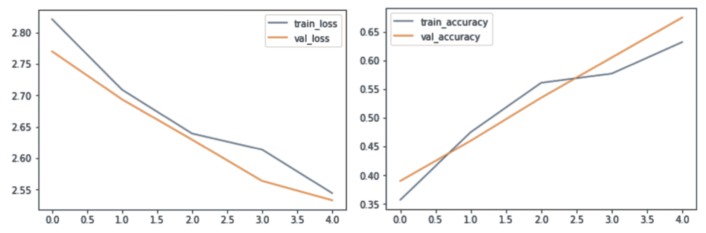

在本节中，我们探索了使用 MNIST 数据集的连体网络的实现以及使用 Omniglot 数据集的匹配网络架构。 在连体网络编码练习中，我们创建了一个小的卷积层，并由一个全连接层姐妹架构进行了扩展。 训练模型后，我们还绘制了模型获得的二维嵌入图，并观察了某些数字如何聚类在一起。 同样，在匹配网络编码练习中，我们为匹配网络的每个模块实现了小型架构，例如嵌入提取器，注意力模型和完全上下文嵌入。 我们还观察到，仅用 100 个时期，我们就可以达到约 86% 的精度，并绘制了匹配网络架构的精度和损耗图。

您可能还观察到某些模型是从头开始训练的-我们可能已经使用了迁移学习架构，或者增加了 LSTM 架构的隐藏大小，或者也许被认为是加权的交叉熵损失函数。 总是有实验和改进的空间。 如果您想进一步尝试使用该模型，建议您访问本书的 GitHub 页面。

# 总结

在本章中，我们学习了基于指标的一次学习方法。 我们探索了两种神经网络架构，它们已在研究界和软件行业中用于一次学习。 我们还学习了如何评估经过训练的模型。 然后，我们使用 MNIST 数据集在连体网络中执行了一个练习。 总之，可以说匹配网络和连体网络架构都已经成功证明，通过更改损失函数或特征表示，我们可以用有限的数据量实现目标。

在下一章中，我们将探索不同的基于优化的方法，并了解它们与基于度量的方法之间的区别。

# 问题

1.  什么是相似度指标？ 为什么余弦相似度最有效？
2.  为什么匹配网络使用 LSTM 架构来获取嵌入？
3.  对比损失函数有哪些缺点，三重损失函数如何帮助解决它？
4.  维度的诅咒是什么？ 我们该如何处理？

# 进一步阅读

要更深入地了解本章介绍的架构，并探讨它们的工作方式和原因，请阅读以下文章：

*   [《用于一次图像识别的连体神经网络》](https://www.cs.cmu.edu/~rsalakhu/papers/oneshot1.pdf)
*    [《一次学习的匹配网络》](https://arxiv.org/pdf/1606.04080.pdf)