# 基于模型的方法

在上一章中，我们讨论了两种基于优化的方法。 我们试图用元学习机制来训练模型，这与人类所见相似。 当然，除了学习新事物的能力外，人类在执行任何任务时还可以访问大量内存。 通过回忆过去的经历和经验，这使我们能够更轻松地学习新任务。 遵循相同的思想过程，设计了基于模型的架构，并添加了外部存储器以快速概括一次学习任务。 在这些方法中，使用存储在外部存储器中的信息，模型仅需几个训练步骤即可收敛。

本章将涵盖以下主题：

*   了解神经图灵机
*   记忆增强神经网络
*   元网络
*   编码练习

# 技术要求

您将需要 Python，Anaconda，Jupyter 笔记本，PyTorch 和 Matplotlib 库在本章中学习和执行项目。

您可以在本书的 [GitHub 存储库](https://github.com/PacktPublishing/Hands-On-One-shot-Learning-with-Python)中找到本章的代码文件。

# 了解神经图灵机

在 AI 的早期，该领域主要由一种象征性的处理方法主导。 换句话说，它依靠使用符号和结构以及操纵它们的规则来处理信息。 直到 1980 年代，人工智能领域才采用了另一种方法-连接主义。 连接主义最有前景的建模技术是神经网络。 但是，他们经常遭到两个严厉的批评：

*   神经网络仅接受固定大小的输入，这在输入长度可变的现实生活中不会有太大帮助。
*   神经网络无法将值绑定到我们已知的两个信息系统（人脑和计算机）大量使用的数据结构中的特定位置。 简单来说，在神经网络中，我们无法将特定的权重设置到特定的位置。

第一个问题可以通过在各种任务上实现最先进性能的 RNN 来解决。 通过查看**神经图灵机**（**NTM**）可以解决第二个问题。 在本节中，我们将讨论 NTM 的总体架构，这是理解**记忆增强神经网络**（**MANN**）的基础，这些神经网络修改了 NMT 的架构并使之适用于一个 镜头的学习任务。

# NTM 的架构

在过去的 50 年中，现代计算机发生了很大的变化。 但是，它们仍然由三个系统组成-内存，控制流和算术/逻辑运算。 来自生物学和计算神经科学领域的研究提供了广泛的证据，表明记忆对于快速有效地存储和检索信息至关重要。 从中汲取灵感，NTM 基本上由神经网络组成，该神经网络由控制器和称为存储库（或存储矩阵）的二维矩阵组成。 在每个时间步长，神经网络都会接收一些输入，并生成与该输入相对应的输出。 在这样做的过程中，它还访问内部存储库并对其执行读取和/或写入操作。 从传统的图灵机中汲取灵感，NMT 使用术语**头部**来指定内存位置。 下图显示了总体架构：

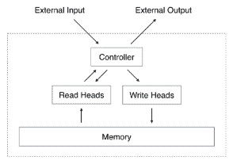

整体架构看起来不错； 但是，这有一个问题。 如果通过在内存矩阵中指定行索引和列索引来访问内存位置，则无法获取该索引的梯度。 此操作不可反向传播，并且会使用标准的反向传播和基于梯度下降的优化技术来限制 NMT 的训练。 为了解决此问题，NTM 的控制器使用*模糊*读写操作与内存进行交互，这些操作与内存的所有元素进行不同程度的交互。 更准确地说，控制器以差分方式在所有存储位置上生成权重，这有助于使用基于标准梯度的优化方法从头到尾训练网络。

在下一节中，我们将讨论如何产生这些权重以及如何执行读写操作。

# 建模

在时间步`t`（`M[t]`）的存储矩阵具有`R`行和`C`列。 有一种注意力机制，用于指定注意头应该读取/写入的内存位置。 控制器生成的注意力向量是长度`R`的向量，称为**权重向量**（`w[t]`），其中 向量`w[t](i)`的条目是存储库第`i`行的权重。 权重向量已标准化，这意味着它满足以下条件：*

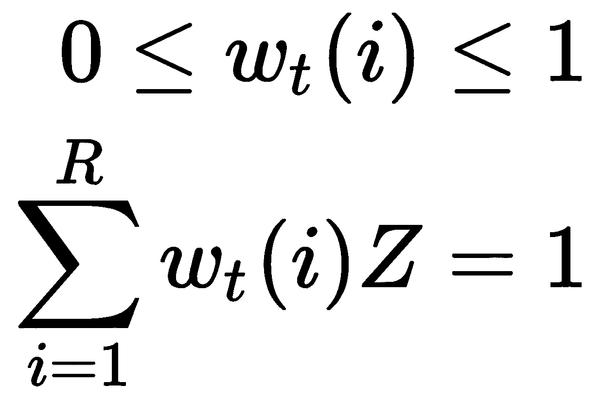

# 读取

读取头将返回长度为`C`的向量， `r[t]`，它是存储器行`M[t](i)`由权重向量缩放：


# 写入

写入是两个步骤的结合：擦除和添加。 为了擦除旧数据，写头使用附加长度`C`擦除向量`e[t]`以及权重向量。 以下方程式定义了擦除行的中间步骤：

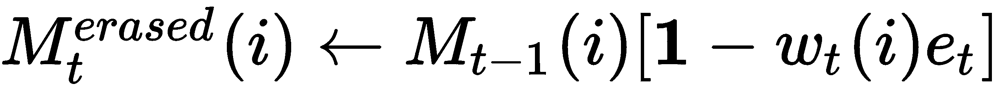

最后，写入头使用长度`C`的向量， `a[t]`以及`M_erased[t]`根据前面的方程式和权重向量更新存储矩阵的行：

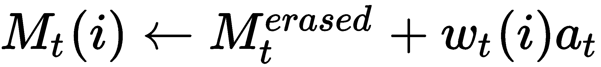

# 寻址

读取和写入操作的关键是权重向量，该权重向量指示要从中读取/写入的行。 控制器分四个阶段生成此权重向量。 每个阶段都会产生一个中间向量，该向量将传递到下一个阶段：

*   第一步是基于内容的寻址，其目的是基于每一行与给定的长度为`C`的给定关键字向量`k[t]`的相似度来生成权重向量。 更精确地说，控制器发出向量`k[t]`，并使用余弦相似性度量将其与`M[t]`的每一行进行比较。 如下：

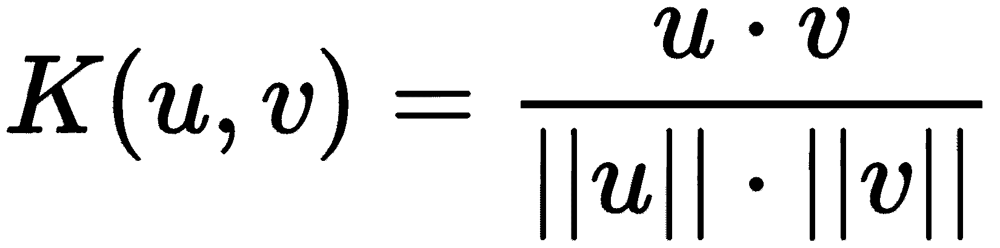

内容权重向量尚未规范化，因此可以通过以下操作进行规范化：


*   第二阶段是基于位置的寻址，其重点是从特定存储位置读取/写入数据，而不是在阶段 1 中完成的位置值。其后，标量参数 <sub></sub> 称为插值 门，将内容权重向量 <sub></sub> 与前一个时间步的权重向量`w[t-1]`混合，以产生门控权重[ <sub></sub> 。 这使系统能够学习何时使用（或忽略）基于内容的寻址：

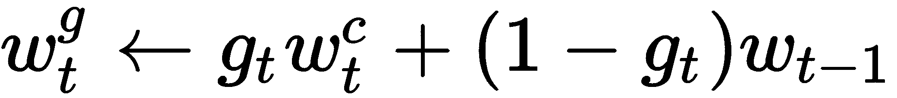

*   在第三阶段，插值后，磁头发出归一化的移位加权，以执行`R`模的移位运算（即，向上或向下移动行）。 这由以下操作定义：


*   第四个也是最后一个阶段，锐化，用于防止偏移的权重 <sub></sub> 模糊。 这是使用标量 <sub></sub> 并应用以下操作完成的：

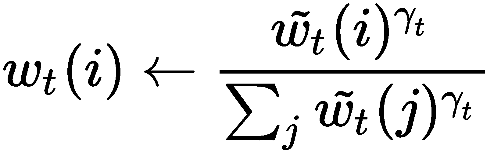

所有操作（包括读取，写入和寻址的四个阶段）都是差分的，因此可以使用反向传播和任何基于梯度下降的优化器从头到尾训练整个 NMT 模型。 控制器是一个神经网络，可以是前馈网络，也可以是循环神经网络，例如**长短期记忆**（**LSTM**）。 它已显示在各种算法任务（例如复制任务）上均具有良好的性能，这些任务将在本章的稍后部分实现。

既然我们了解了 NTM 的架构和工作原理，我们就可以开始研究 MANN，这是对 NMT 的修改，并且经过修改可以在一次学习中表现出色。

# 记忆增强神经网络

MANN 的目标是在一次学习任务中表现出色。 正如我们之前阅读的，NMT 控制器同时使用基于内容的寻址和基于位置的寻址。 另一方面，MANN 控制器仅使用基于内容的寻址。 有两个原因。 原因之一是一次学习任务不需要基于位置的寻址。 在此任务中，对于给定的输入，控制器可能只需要执行两个操作，并且这两个操作都与内容有关，而与位置无关。 当输入与先前看到的输入非常相似时，将采取一种措施，在这种情况下，我们可以更新内存的当前内容。 当当前输入与以前看到的输入不相似时，将采取另一种操作，在这种情况下，我们不想覆盖最近的信息。 相反，我们写到使用最少的内存位置。 在这种情况下，该存储模块称为**最久未使用的访问**（**LRUA**）模块。

# 读取

MANN 的读取操作与 NTM 的读取操作非常相似，唯一的区别是此处的权重向量仅使用基于内容的寻址（NMT 寻址的阶段 -1）。 更准确地说，控制器使用标准化的读取权重向量 <sub></sub> ，将其与`M[t]`的行一起使用以生成读取向量，`r[t]`：


读取权重向量 <sub></sub> 由控制器产生，该控制器由以下操作定义：


在此，运算`K()`是余弦相似度，类似于为 NMT 定义的余弦相似度。

# 写入

为了写入存储器，控制器在写入最近读取的存储器行和写入最近读取的存储器行之间进行插值。

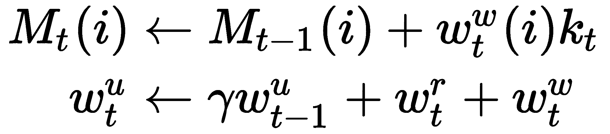

通过对 Omniglot 数据集进行一次一次性分类任务，MANN 已显示出令人鼓舞的结果。 由于其基本的模型 NTM，它们表现良好。 NTM 能够快速编码，存储和检索数据。 它们还能够存储长期和短期权重。 可以使用 MANN 的方法添加 NTM，以跟踪*最久未使用的存储位置*，以执行基于内容的寻址，以读取和写入*最久未使用的*位置。 它使 MANN 成为少量学习的理想人选。

在下一部分中，我们将学习另一种基于模型的架构，该架构由四个架构的网络组成，并为一次学习领域做出了重大贡献。

# 了解元网络

顾名思义，元网络是基于模型的元学习方法的一种形式。 在通常的深度学习方法中，神经网络的权重是通过随机梯度下降来更新的，这需要大量的时间来训练。 众所周知，随机梯度下降法意味着我们将考虑每个训练数据点进行权重更新，因此，如果我们的批量大小为 1，这将导致模型优化非常缓慢-换句话说，**较慢**的权重更新。

元网络建议通过训练与原始神经网络并行的神经网络来预测目标任务的参数，从而解决权重缓慢的问题。 生成的权重称为**快速权重**。 如果您还记得的话，LSTM 元学习器（请参阅第 4 章，“基于优化的方法”）也是基于类似的基础来预测使用 LSTM 单元的任务的参数更新 。

与其他元学习方法类似，元网络包含两个级别：

*   **元学习器**：元学习器获得有关不同任务的一般知识。 在元网络的情况下，这是一个嵌入函数，用于比较两个不同数据点的特征。
*   **基础学习器**：基础学习器尝试学习目标任务（任务目标网络可以是简单的分类器）。

元级学习器的目标是获得有关不同任务的一般知识。 然后可以将知识转移到基础级学习器，以在单个任务的上下文中提供概括。

如所讨论的，元网络学习权重的两种形式：慢权重和快权重。 要为元学习器（嵌入函数）和基础学习器（分类模型）两者学习这些权重，我们需要两个不同的网络。 这使得元网络成为迄今为止我们在本书中讨论过的最复杂的网络之一。 简而言之，元网络由四种类型的神经网络组成，它们各自的参数要训练。 在下一节中，我们将遍历元网络中存在的每个网络，并了解其架构。

# 元网络算法

要开始学习元网络，我们首先需要定义以下术语：

*   **支持集**：训练集中的采样输入数据点（`x`，`y`）。
*   **测试集**：来自训练集的采样数据点（`x`，*和*）。
*   **嵌入函数**（ <sub></sub> ）：作为元学习器的一部分，*嵌入函数*与连体网络非常相似。 经过训练可以预测两个输入是否属于同一类。
*   **基本学习器模型**（ <sub></sub> ）：基本学习器模型尝试完成实际的学习任务（例如，分类模型）。
*   <sub></sub> ：嵌入函数的快速权重，（ <sub>*  *</sub> ）。
*   <sub>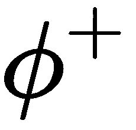</sub> ：基本学习器模型的快速权重（ <sub>*  *</sub> ）。
*   <sub>* *</sub> ：一种 LSTM 架构，用于学习嵌入函数的快速权重 <sub></sub> （（ <sub></sub> ）的慢速网络。
*   <sub>*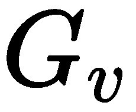 *</sub> ：通过`v`学习快速权重 <sub></sub> 参数化的神经网络，用于基础学习器 <sub></sub> ，来自其损耗梯度。

下图说明了元网络架构：

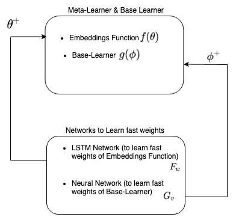

如图所示，元学习器基础学习器由较慢的权重（ <sub>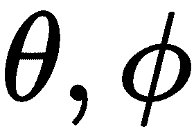</sub> ）组成。 为了学习快速权重（ <sub>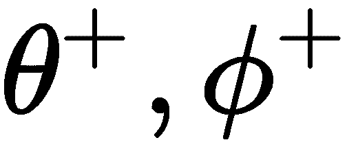</sub> ），元网络使用两个不同的网络：

*   LSTM 网络（ <sub></sub> ），学习嵌入函数的（元学习器）快速权重-即 <sub></sub> 。
*   神经网络（ <sub></sub> ），以学习基本学习器的快速权重，即 <sub></sub> 。

现在我们已经了解了快速权重和慢速权重的概念和架构，让我们尝试观察整个元网络架构：


如上图所示，元网络由基本学习器和配备*外部存储器*的元学习器（嵌入函数）组成。 我们还可以看到快速参数化箭头同时进入元学习器和基础学习器。 这些是元权重的输出，其中包括用于学习快速权重的模型。

现在让我们简单介绍一下训练。 随着训练输入数据的到来，它会同时通过元学习器和基础学习器。 在元学习器中，它用于连续学习（更新参数），而在基础学习器中，对输入进行预处理之后，它将*元信息*（*梯度*）传递给元 -学习器。 之后，元学习器使用*元信息*（*梯度*）将参数化更新快速返回给基础学习器，以通过使用慢速权重和快速权重的集成来进行优化（如图所示） 在下图中）。 元网络的基本关键思想是通过处理*元信息*以快速的方式学习权重以进行快速概括。

在 MetaNet 中，学习器的损失梯度是任务的*元信息*。 MetaNet 还有一个重要的问题：它如何使用快速权重和慢速权重进行预测？

在 MetaNet 中，将慢速权重和快速权重组合在一起，以在神经网络中进行预测，如下图所示。 在这里， <sub></sub> 表示元素方式的和：


在下一节中，我们将逐步介绍算法，提取元信息以及最终模型预测。

# 算法

元网络也遵循与匹配网络相似的训练过程。 在此，训练数据分为两种类型：支持集`S = (x'[i], y'[i])`和测试集`U = (x[i], y[i])`。

请记住，目前，我们有四个网络（ <sub></sub> ）和四组要学习的模型参数`(θ, ϕ, w, v)`。 让我们看一下算法的所有步骤：


以下是算法的步骤：

1.  支持集`S`的样本`K`个随机对。

对于 <sub></sub> ：

*   通过嵌入函数 <sub>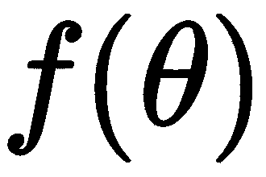</sub> 正向传播数据点。
*   计算交叉熵损失（ <sub></sub> ）。

2.  通过 LSTM 网络向前传递数据以计算 <sub>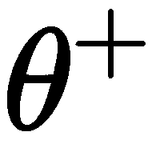</sub> ： <sub></sub> 。
3.  接下来，遍历支持集`S`中的示例，并为每个示例计算快速权重。 同时，使用获得的嵌入内容更新外部存储器。

对于 <sub>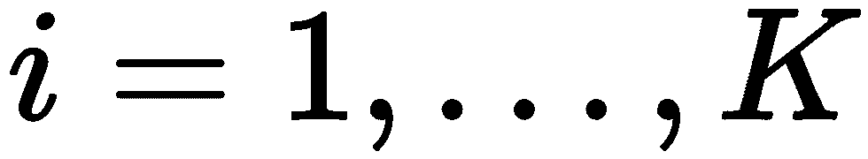</sub> ：

*   将基本学习器 <sub>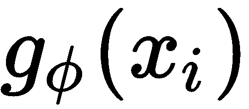</sub> （例如，分类模型）向前传递，并计算损失函数 <sub></sub> （例如，交叉熵）。
*   计算基本学习器梯度 <sub></sub> ，并使用它们来计算示例级快速权重 <sub></sub> 。
*   将基础学习器 <sub></sub> 的计算得出的快速权重存储在存储器的`M`部分的`i`位置处。
*   在嵌入网络中使用 <sub></sub> 合并快速权重和缓慢权重。
*   将支持样本转发通过嵌入网络并获得嵌入 <sub>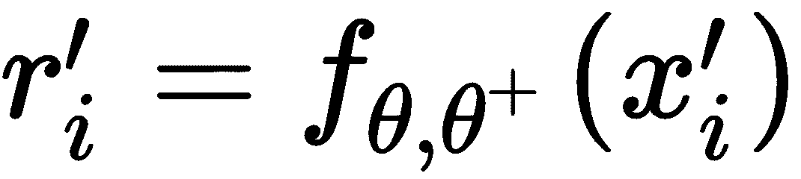</sub> 。
*   将 <sub></sub> 存储在内存`R`的`k`部分的`i`位置。

4.  最后，是时候使用测试集`U = (x[i], y[i])`构建训练损失了。 从 <sub></sub> 开始。

对于 <sub>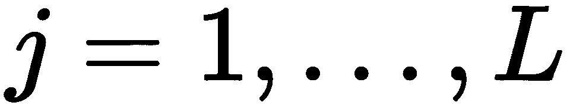</sub> ：

*   将测试样本转发通过嵌入网络，并获得测试嵌入。
*   计算支持集的存储嵌入`R`和获得的嵌入 <sub>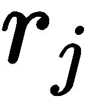</sub> 之间的相似度。 您可以使用 <sub></sub> 来执行此操作。 在此，`R`是指存储在外部存储器中的数据。
*   现在，通过使用支持集样本（`M`）的快速权重来计算基础学习器的快速权重（ <sub></sub> ）。 您可以使用 <sub></sub> 来执行此操作。 在此，`M`是指存储在外部存储器中的数据。
*   使用最新的 <sub></sub> 将测试样本向前传递通过基本学习器，并计算损失函数 <sub></sub> 。
*   使用 <sub></sub> 更新训练损失。

5.  使用 <sub>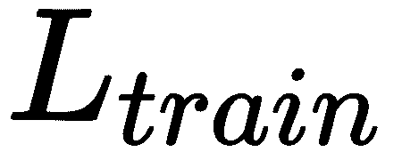</sub> 更新所有参数`(θ, ϕ, w, v)`。

在选择嵌入网络时，元网络使用 LSTM 架构。 如我们所见，匹配网络和 LSTM 元学习器也遵循相同的策略，分别用于提取数据和元信息的上下文嵌入。 这是因为 LSTM 架构倾向于记住历史，这使得元学习器的目标能够跨任务提取重要信息。

例如，假设我们正在训练我们的网络以完成多种任务，例如猫的品种分类和狗的品种分类。 当我们使用 LSTM 元学习器进行训练时，它会学习例如狗品种分类中体重更新的策略，并使用这些学习到的信息以较少的步骤和较少的数据来优化其用于猫品种分类的操作。 使用元网络在 Omniglot 数据集上达到了 95.92% 的准确率，而人类的准确率仅为 95.5%，因此，元网络被认为是最新模型之一。

# 编码练习

在本节中，我们将首先介绍 NTM 的实现，然后再使用 Omniglot 数据集介绍 MAAN。 所以，让我们开始吧！

本练习不包括代码的某些部分。 如果希望获得可运行的代码，请在[这个页面](https://github.com/PacktPublishing/Hands-On-One-shot-Learning-with-Python)中查看本书的 GitHub 存储库。

# NTM 的实现

如上所述，NTM 由两个重要组成部分组成：

*   神经网络，也称为控制器
*   称为记忆的二维矩阵

在本教程中，我们将实现两者的简化版本，并尝试展示复制任务。

任务目标如下：

*   NTM 模型显示为`T`时间步长的随机`k`维向量。
*   网络的工作是在每个时间步从零向量输出这些`T[k]`维随机向量。

执行以下步骤来实现 NTM：

1.  首先，导入所有必需的库：

```py
import torch
from torch import nn
import torch.nn.functional as F
import numpy as np
from time import time
import torchvision.utils as vutils
from torch.utils.data import Dataset
from torch.utils.data import DataLoader
import matplotlib.pyplot as plt
%matplotlib inline
```

2.  然后，实现`Controller`。 作为控制器的一部分，我们将实现以下三个组件：

    *   两层前馈网络
    *   使用 Xavier 方法进行权重初始化
    *   Sigmoid 非线性

```py
class Controller(nn.Module):
    def __init__(self, input_size, output_size, hidden_size):
        super(Controller, self).__init__()
        self.layer1 = nn.Linear(input_size, hidden_size)
        self.layer2 = nn.Linear(hidden_size, output_size)
        self.intialize_parameters()

    def intialize_parameters(self):
        # Initialize the weights of linear layers
        nn.init.xavier_uniform_(self.layer1.weight, gain=1.4) 
        nn.init.normal_(self.layer1.bias, std=0.01)
        nn.init.xavier_uniform_(self.layer2.weight, gain=1.4)
        nn.init.normal_(self.layer2.bias, std=0.01)

    def forward(self, x, last_read):
        # Forward pass operation, depending on last_read operation
        x = torch.cat((x, last_read), dim=1)
        x = torch.sigmoid(self.layer1(x))
        x = torch.sigmoid(self.layer2(x))
        return x
```

我们也可以有一个 LSTM 控制器，但是由于简单起见，我们构建了一个两层的全连接控制器。

3.  接下来，实现`Memory`模块。 `Memory`是一个二维矩阵，具有`M`行和`N`列：


`address()`功能执行存储器寻址，它由四个功能组成：

*   `similarity`
*   `interpolate`
*   `shift`
*   `sharpen`

```py
class Memory(nn.Module):
    def __init__(self, M, N, controller_out):
        super(Memory, self).__init__()
        self.N = N
        self.M = M
        self.read_lengths = self.N + 1 + 1 + 3 + 1
        self.write_lengths = self.N + 1 + 1 + 3 + 1 + self.N + 
            self.N
        self.w_last = [] # define to keep track of weight_vector 
        at each time step.
        self.reset_memory()

    def address(self, k, beta, g, s, gamma, memory, w_last):
        # Content focus
        wc = self._similarity(k, beta, memory) # CB1 to CB3 
        equations
        # Location focus
        wg = self._interpolate(wc, g, w_last) # CS1 equation
        w_hat = self._shift(wg, s) # CS2 and CS3 equation
        w = self._sharpen(w_hat, gamma) # S1 equation
        return w

    # Implementing Similarity on basis of CB1 followed by CB2 
    and CB3 Equation
    def _similarity(self, k, beta, memory):
        w = F.cosine_similarity(memory, k, -1, 1e-16) # CB1 
        Equation
        w = F.softmax(beta * w, dim=-1) # CB2 and CB3 Equation
        return w # return CB3 equation obtained weights

    # Implementing CS1 Equation. It decides whether to use 
    the weights we obtained
    # at the previous time step w_last or use the weight 
    obtained through similarity(content focus)
    def _interpolate(self, wc, g, w_last):
        return g * wc + (1 - g) * w_last
# .... Rest Code is available at Github......
```

4.  接下来，执行`read`操作。 在这里，我们将定义`ReadHead`，它可以根据`read`操作访问和更新内存：


```py
class ReadHead(Memory):
    # Reading based on R2 equation
    def read(self, memory, w):
        return torch.matmul(w, memory)

    # Use Memory class we formed above to create a ReadHead 
    operation
    def forward(self, x, memory):
        param = self.fc_read(x) # gather parameters
        # initialize necessary parameters k, beta, g, shift, 
        and gamma
        k, beta, g, s, gamma = torch.split(param, 
            [self.N, 1, 1, 3, 1], dim=1)
        k = torch.tanh(k)
        beta = F.softplus(beta)
        g = torch.sigmoid(g)
        s = F.softmax(s, dim=1)
        gamma = 1 + F.softplus(gamma) 
        # obtain current weight address vectors from Memory
        w = self.address(k, beta, g, s, gamma, memory, 
            self.w_last[-1])
        # append in w_last function
        self.w_last.append(w)
        mem = self.read(memory, w) 
        return mem, w
```

5.  与`read`操作类似，在这里我们将执行`write`操作：

```py
class WriteHead(Memory):
    def write(self, memory, w, e, a):
        # Implement write function based on E1 and A1 Equation
        w, e, a = torch.squeeze(w), torch.squeeze(e), 
            torch.squeeze(a)
        erase = torch.ger(w, e)
        m_tilde = memory * (1 - erase) # E1 equation
        add = torch.ger(w, a)
        memory_update = m_tilde + add # A1 equation
        return memory_update

    def forward(self, x, memory):
        param = self.fc_write(x) # gather parameters
        # initialize necessary parameters k, beta, g, shift, 
        and gamma
        k, beta, g, s, gamma, a, e = torch.split(param, 
            [self.N, 1, 1, 3, 1, self.N, self.N], dim=1)
        k = torch.tanh(k)
        beta = F.softplus(beta)
        g = torch.sigmoid(g)
        s = F.softmax(s, dim=-1)
        gamma = 1 + F.softplus(gamma)
        a = torch.tanh(a)
        e = torch.sigmoid(e)
        # obtain current weight address vectors from Memory
        w = self.address(k, beta, g, s, gamma, memory, 
            self.w_last[-1])
        # append in w_last function
        self.w_last.append(w)
        # obtain current mem location based on R2 equation
        mem = self.write(memory, w, e, a)
        return mem, w
```

`ReadHead`和`WriteHead`都使用全连接层来生成用于内容编址的参数（`k`，`beta`，`g`，`s`，`gamma`）。

6.  实现神经图灵机结构，其中包括：

*   全连接控制器
*   读写磁头
*   记忆体参数
*   在无法训练的内存上运行的工具功能

```py
class NTM(nn.Module):
    def forward(self, X=None):
        if X is None:
            X = torch.zeros(1, self.num_inputs)
        controller_out = self.controller(X, self.last_read) 
        self._read_write(controller_out)
        # use updated last_read to get sequence
        out = torch.cat((X, self.last_read), -1)
        out = torch.sigmoid(self.fc_out(out))

        return out

    def _read_write(self, controller_out):
        # Read Operation
        read, w = self.read_head(controller_out, self.memory)
        self.last_read = read
        # Write Operation
        mem, w = self.write_head(controller_out, self.memory)
        self.memory = mem
```

在`forward`功能中，`X`可以是`None`。 这是因为，在复制任务中，针对一个特定序列，训练分两步进行：

1.  在第一步中，网络显示为`t`时间步长的`k`维输入。
2.  在第二步（预测步骤）中，网络采用`k`维零向量来产生预测，该预测对每个时间步执行输入的复制。

7.  在这里，我们正在为复制任务生成向量的随机序列。 它由 NTM 模型复制：

```py
class BinaySeqDataset(Dataset):

    def __init__(self, sequence_length, token_size, 
    training_samples):
        self.seq_len = sequence_length
        self.seq_width = token_size
        self.dataset_dim = training_samples

    def _generate_seq(self):
        # A special token is appened at beginning and end of each
        # sequence which marks sequence boundaries.
        seq = np.random.binomial(1, 0.5, (self.seq_len, self.seq_width))
        seq = torch.from_numpy(seq)
        # Add start and end token
        inp = torch.zeros(self.seq_len + 2, self.seq_width)
        inp[1:self.seq_len + 1, :self.seq_width] = seq.clone()
        inp[0, 0] = 1.0
        inp[self.seq_len + 1, self.seq_width - 1] = 1.0
        outp = seq.data.clone()

        return inp.float(), outp.float()

    def __len__(self):
        return self.dataset_dim

    def __getitem__(self, idx):
        inp, out = self._generate_seq()
        return inp, out
```

8.  我们还将实现梯度剪切，因为剪切梯度通常是一个好主意，以使网络在数值上稳定：

```py
def clip_grads(net, min_grad=-10,max_grad=10):
    parameters = list(filter(lambda p: p.grad is not None, net.parameters()))
    for p in parameters:
        p.grad.data.clamp_(min_grad,max_grad)
```

9.  初始化训练参数：

```py
memory_capacity=64
memory_vector_size=128
controller_output_dim=256
controller_hidden_dim=512
learning_rate=1e-2

sequence_length, token_size, training_samples = 2, 10, 99
min_grad, max_grad = -10, 10
```

0.  然后，初始化训练模型：

```py
# Initialize the dataset
dataset = BinaySeqDataset(sequence_length, token_size, training_samples)
dataloader = DataLoader(dataset, batch_size=1,shuffle=True, num_workers=4)
model = NTM() # Initialize NTM
criterion = torch.nn.BCELoss()
optimizer = torch.optim.RMSprop(model.parameters(), lr=learning_rate)
losses = []
# Train the Model
for e, (X, Y) in enumerate(dataloader):
    tmp = time()
    model.initalize_state()
    optimizer.zero_grad()
    inp_seq_len = sequence_length + 2
    out_seq_len = sequence_length
    X.requires_grad = True
    # Forward Pass: Feed the Sequence
    for t in range(0, inp_seq_len):
        model(X[:, t])
    # Predictions: Obtain the already feeded sequence
    y_pred = torch.zeros(Y.size())
    for i in range(0, out_seq_len):
        y_pred[:, i] = model() # Here, X is passed as None
    loss = criterion(y_pred, Y)
    loss.backward()
    clip_grads(model)
    optimizer.step()
    losses += [loss.item()]
    if (e%10==0):
        print("iteration: {}, Loss:{} ".format(e, loss.item()))
    if e == 5000:
        break
```

运行此单元格后，您将看到以下输出：

```py
iteration: 0, Loss:0.7466866970062256 
iteration: 10, Loss:0.7099956274032593 
iteration: 20, Loss:0.6183871626853943 
iteration: 30, Loss:0.6750341653823853 
iteration: 40, Loss:0.7050653696060181 
iteration: 50, Loss:0.7188648581504822
```

1.  定义一个`plot_signal`函数并绘制训练损失`losses`：

```py
def plot_signal(grid_image, fig_size=(500,100)):
    plt.figure(figsize=fig_size)
    plt.imshow(grid_image.data.permute(2, 1, 0))

plt.plot(losses)
plt.show()
```

2.  测试 NTM 模型的复制任务：

```py
X, Y = dataset._generate_seq()
X, Y = X.unsqueeze(0), Y.unsqueeze(0)# Add the batch dimension

model.initalize_state()

for t in range(0, inp_seq_len):
    model(X[:, t])

y_pred = torch.zeros(Y.size())
for i in range(0, out_seq_len):
    y_pred[:, i] = model()

grid_img_truth = vutils.make_grid(Y, normalize=True, scale_each=True)
grid_img_pred = vutils.make_grid(y_pred, normalize=True, scale_each=True)

plt.figure(figsize=(200,200))
plt.imshow(grid_img_truth.data.permute(2, 1, 0))

plt.figure(figsize=(200,200))
plt.imshow(grid_img_pred.data.permute(2, 1, 0))
```

运行前面的代码将给出以下输出：


在这里，我们创建了一个 300 个时间步长的随机信号，并观察了模型复制该信号的程度。 在此步骤中，您观察了复制任务输出。 这两个信号应该非常接近。 如果不是，我们建议您更多地训练模型。

# MAAN 的实现

正如我们在上一节中展示的那样，NTM 的控制器能够使用基于内容的寻址，基于位置的寻址或同时使用这两种，而 MANN 则使用纯基于内容的内存写入器来工作。

MANN 还使用一种称为**最久未访问**的新寻址方案。 该模式背后的思想是，最久未使用的内存位置由读取操作确定，而读取操作由基于内容的寻址执行。 因此，我们基本上执行基于内容的寻址，以读取和写入最久未使用的位置。

在本教程中，我们将实现`read`和`write`操作。

1.  首先，导入所需的所有库：

```py
import torch
from torch import nn
import torch.nn.functional as F
import numpy as np
import copy
```

2.  实现类似于 NTM 的`Memory`模块，并对 MANN 进行一些更改：

```py
class Memory(nn.Module):

 def __init__(self, M, N, controller_out):
     super(Memory, self).__init__()
     self.N = N
     self.M = M
     self.read_lengths = self.N + 1 + 1 + 3 + 1
     self.write_lengths = self.N + 1 + 1 + 3 + 1 + self.N + self.N
     self.w_last = [] # define to keep track of weight_vector at 
     each time step
     self.reset_memory()

 def address(self, k, beta, g, s, gamma, memory, w_last):
     # Content focus
     w_r = self._similarity(k, beta, memory)
     return w_r

 # Implementing Similarity
 def _similarity(self, k, beta, memory):
     w = F.cosine_similarity(memory, k, -1, 1e-16) 
     w = F.softmax(w, dim=-1)
     return w # return w_r^t for reading purpose
```

3.  定义`ReadHead`，使其可以根据`read`操作访问和更新内存：

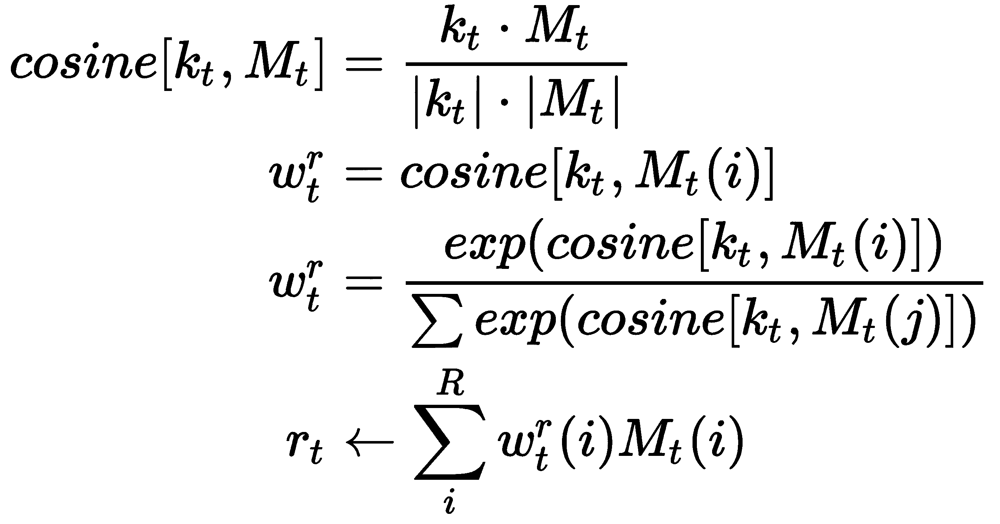

`ReadHead`功能定义如下：

```py
class ReadHead(Memory):
    def read(self, memory, w):
        # Calculate Memory Update
        return torch.matmul(w, memory)

    def forward(self, x, memory):
        param = self.fc_read(x) # gather parameters
        # initialize necessary parameters k, beta, g, shift, and 
        gamma
        k, g, s, gamma = torch.split(param, [self.N, 1, 1, 3, 1], 
            dim=1)
        k = torch.tanh(k)
        g = F.sigmoid(g)
        s = F.softmax(s, dim=1)
        gamma = 1 + F.softplus(gamma)
        # obtain current weight address vectors from Memory
        w_r = self.address(k, g, s, gamma, memory, self.w_last[-1])
        # append in w_last function to keep track content based 
        locations
        self.w_last.append(w_r)
        # obtain current mem location based on above equations
        mem = self.read(memory, w_r)
        w_read = copy.deepcopy(w_r)
        return mem, w_r
```

4.  与`read`操作类似，在这里我们将执行`write`操作：


`write`操作的实现如下：

```py
class WriteHead(Memory):

    def usage_weight_vector(self, prev_w_u, w_read, w_write, 
    gamma):
        w_u = gamma * prev_w_u + torch.sum(w_read, dim=1) + 
            torch.sum(w_write, dim=1)
        return w_u # Equation F2

    def least_used(self, w_u, memory_size=3, n_reads=4):
        _, indices = torch.topk(-1*w_u,k=n_reads)
        wlu_t = torch.sum(F.one_hot(indices, 
            memory_size).type(torch.FloatTensor),dim=1,
            keepdim=True)
        return indices, wlu_t

    def mann_write(self, memory, w_write, a, gamma, prev_w_u, 
    w_read, k):
        w_u = self.usage_weight_vector(prev_w_u, w_read, w_write, 
            gamma)
        w_least_used_weight_t = self.least_used(w_u)
        # Implement write step as per (F3) Equation
        w_write = torch.sigmoid(a)*w_read + 
            (1-torch.sigmoid(a))*w_least_used_weight_t
        memory_update = memory + w_write*k # Memory Update 
        as per Equation (F4)

    def forward(self, x, memory):
        param = self.fc_write(x) # gather parameters
        k, beta, g, s, gamma, a, e = torch.split(param, 
            [self.N, 1, 1, 3, 1, self.N, self.N], dim=1)
        k = F.tanh(k)
        beta = F.softplus(beta)
        g = F.sigmoid(g)
        s = F.softmax(s, dim=-1)
        gamma = 1 + F.softplus(gamma)
        a = F.tanh(a)
        # obtain current weight address vectors from Memory
        w_write = self.address(k, beta, g, s, gamma, memory, 
            self.w_last[-1])
        # append in w_last function to keep track content 
        based locations
        self.w_last.append(w_write)
        # obtain current mem location based on F2-F4 equations
        mem = self.write(memory, w_write, a, gamma, prev_w_u, 
            w_read, k)
        w_write = copy.deepcopy(w)
        return mem, w
```

`ReadHead`和`WriteHead`都使用全连接层来生成用于内容编址的参数（`k`，`beta`，`g`，`s`和`gamma`）。

请注意，此练习只是为了展示 MANN 如何受到 NTM 的启发。 如果您想在真实的数据集上探索前面的练习，请参考[GitHub 存储库](https://github.com/PacktPublishing/Hands-On-One-shot-Learning-with-Python/tree/master/Chapter03)。

# 总结

在本章中，我们探索了用于单次学习的不同形式的基于模型的架构。 我们观察到的最常见的事情是使用外部存储器，这对学习神经网络不同阶段的表示形式有什么帮助。 NMT 方法在一次学习任务中表现良好，但是由于手工设计的内存寻址功能，它们的能力仍然有限，因为它们必须具有差异性。 探索更复杂的功能来处理内存可能很有趣。 在元网络中，我们看到了如何定义一个新网络以实现对原始网络的快速学习，以及如何在元学习器级别上存储有关表示的信息如何在基础级别上微调参数。 尽管基于模型的架构是实现一次学习的好方法，但它们具有外部存储器的先决条件，因此与其他方法相比，实现基于模型的架构的成本昂贵。

在下一章中，我们将介绍基于优化的方法，例如与模型无关的元学习和 LSTM 元学习。 内存为我们提供了一种方式来存储我们所学到的信息，因此优化策略使我们能够更快地学习事物。 在后面的章节中，我们将探索一些不同形式的优化策略，这些策略可以用来学习目标。

# 问题

1.  什么是神经图灵机，它们如何帮助学习？
2.  记忆矩阵如何帮助模型更快地学习？
3.  元学习器和基础学习器之间的分裂如何帮助架构学习一次学习？

# 进一步阅读

基于模型的方法是您需要学习的更复杂的主题之一，因此，如果您想更深入地研究所涉及的概念，则可以阅读以下论文：

*   [《神经图灵机》](https://arxiv.org/pdf/1410.5401.pdf)
*   [《记忆增强神经网络》](http://proceedings.mlr.press/v48/santoro16.pdf)
*   [《元网络》](https://arxiv.org/pdf/1703.00837.pdf)