# 基于生成建模的方法

当人们对看不见的数据进行推断时，他们会利用有关他们已经看到，听到，触摸或经历过的相关事件的强大先验知识（或归纳偏见）。 例如，与狗一起长大的婴儿可能第一次见到猫，并立即推断出它与家犬的宠物般的性情相似。 当然，猫和狗作为物种和个体是千差万别的。 但是，公平地说，猫比狗更像狗，而不是孩子经历的其他随机事物（例如食物）。 与机器学习模型相反，人类不需要成千上万的猫实例就可以从头开始学习，只要他们已经学会了识别狗就可以识别猫。 人脑具有*元学习*的固有能力，这与机器学习语言中的**迁移学习**和**多任务学习**有关。 此功能通过利用从相关任务中学到的知识来加速新概念的学习。

生成模型是概率模型，旨在弥合人类学习与机器学习之间的鸿沟。 这些模型旨在从对象的各个部分学习高级抽象特征，并将这些学习的特征应用于新的但相似的对象类别。 在本章中，我们将研究如何生成这些生成模型，拥有先验知识意味着什么，如何用数学术语构筑先验知识，如何从一些对象中学习高级概念（模型的参数学习） ），以及如何将这些新学到的知识与先验知识相结合，以对新对象做出有意义的决策（推断）。

本章将涵盖以下主题：

*   贝叶斯学习概述
*   了解定向图形模型
*   概率方法概述
*   贝叶斯程序学习
*   判别式 k 次学习

# 技术要求

本章将基于理论，因此没有正式的技术要求，但是需要对贝叶斯建模有基本的了解。

# 贝叶斯学习概述

在本节中，我们将从数学的角度简要讨论贝叶斯学习背后的思想，这是单次学习概率模型的核心。 贝叶斯学习的总体目标是在给定训练数据的情况下，对参数  的分布进行建模，即学习分布  。

在机器学习的概率视图中，我们尝试求解以下方程式：

在此设置中，我们尝试找到可以解释数据的最佳参数集`θ`。 因此，我们在  上最大化给定方程：

我们可以对两边取对数，这不会影响优化问题，但会使数学容易且易于处理：

我们可以从数据的右侧删除`P(data)`，因为它不依赖于`θ`来进行优化，因此也可以进行优化 问题如下：

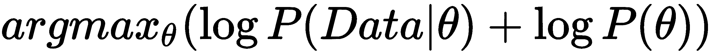

在非概率视图（也称为**期望最大化框架**）中，右侧等式中的术语 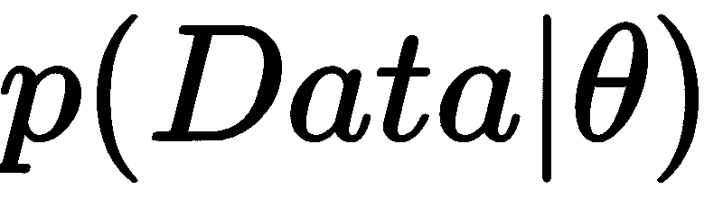 和  ，分别成为损失函数和正则化。 在给定的概率设置中，相同的术语称为（给定`θ`的数据的）**可能性**和**先验**（在参数空间中的先验信念）。 这种概率优化称为**最大后验**（**MAP**）估计，因为我们正在从数据中最大化模型参数的后验分布。 但是，贝叶斯统计不相信 MAP 估计，因为它可能给我们有关最终学习参数的错误结果。 一个不同的数据集很有可能会给我们完全不同的学习参数，这些参数在参数空间中与从原始数据集中学习的参数相距甚远。 这就是贝叶斯学习试图解决的问题。 它显式地模拟参数空间中的不确定性。

考虑给定左撇子和右撇子人数据集的参数分布示例。 下图显示了分布：

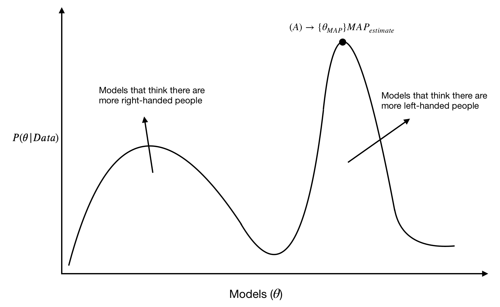

最大化来自数据的参数（  ）概率的 MAP 估计将收敛至点`A`。但是，大多数概率量都更偏向于*惯用右手的人*，这与世界上惯用右手的人多于惯用左手的人这一事实相吻合。

因此，在贝叶斯学习中，重点是解决后验参数 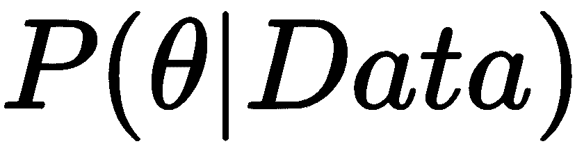 ，以明确地对参数中的不确定性建模。

# 了解定向图形模型

现在，在深入研究用于单次学习的概率模型之前，我们将简要研究定向图形模型。 有向图形模型（也称为贝叶斯网络）由与有向边相连的随机变量定义，如在父子关系中。 下图显示了一个这样的贝叶斯网络：

此图中`S`，`R`，`L`，`W`和`T`的随机变量的联合分布 通过一个简单的链规则可分为多个分布：

前面方程右侧的条件分布具有大量参数。 这是因为每个分布都以许多变量为条件，并且每个条件变量都有其自己的结果空间。 如果我们在有大量条件变量的情况下在图表中走得更远，则这种影响会更加突出。 因此，要学习每种条件分布的庞大参数集，我们需要大量的标记数据，这在现代机器学习任务中通常是不可用的。

这是定向图形模型进入图片的地方。 它断言了概率的一些条件独立性，从而简化了前面描述的方程式。 有向图模型中的每个变量在条件上独立于给定其父对象的非后代。 定向图形模型不过是条件独立性的表示。 更正式地讲，如果 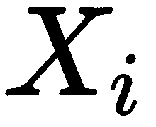 是有向图中的顶点，则  是顶点数，  都是 顶点  的父级，则所有顶点上的联合概率分布可写为：

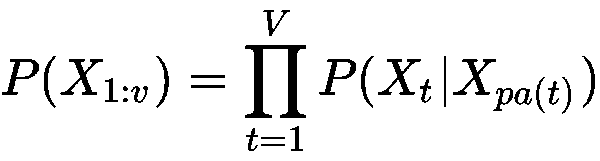

鉴于此，前面公式中定义的联合分布可简化为以下形式：

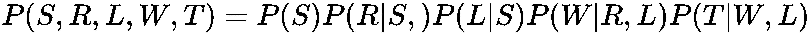

这减少了模型中参数的数量，并易于使用相对较少的数据来学习模型。

# 概率方法概述

人类的概念学习趋向于在两个主要方面不同于机器学习。 在下图中考虑来自大量词汇的手写数字示例：

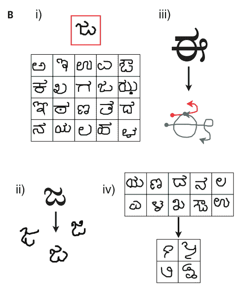

首先，人们倾向于仅从一个或几个示例中学习关于对象的有意义的信息，例如对象边界，并对其进行高精度分类（请参见上图中的`i)`部分）。 另一方面，深度学习模型需要大量带标签的数据才能在诸如对象识别之类的任务上达到人类水平的性能。

其次，人类从一个示例中学习了绝大多数功能，例如，创建新字符（参见上图中的`ii)`部分），将对象/字符分解为各个部分和关系（请参见`iii)`部分），并根据有关现有概念的现有知识开发新的，有意义的概念/字符（请参见上图中的`iv)`部分）。 相反，深度学习模型针对每个任务都需要特殊的损失函数和架构，由于该任务可用的标记数据非常有限，因此通常不切实际。

*人们如何仅从一个示例中学习对对象和概念的如此丰富，强大的表示？*

学习理论指出，需要更多的数据（而不是更少的数据）来学习更复杂的，可以很好地概括的模型。 但是人类往往会从非常稀疏的数据中学习到更丰富的表述，这些表述可以很好地概括。

概率模型旨在弥合数据饥渴的机器模型与人类采用的高度健壮的*元学习*方法之间的鸿沟。 在本章中，我们将讨论两行概率方法，这些方法在从很少的数据中学习各种任务方面已经获得了广泛的成功：

*   第一种方法是对对象零件，子零件及其之间的关系进行显式建模，以学习概念（对象）。 这可用于从一个或几个示例中对新对象进行分类，并从预定义的零件和子零件列表中绘制新类型的对象。
*   第二种方法基于深度学习方法，通过从初始的大量训练数据中学习新类别（其中只有一个类别的图像，以及来自其他类别的大量图像）来完成一次分类任务。 这种方法将潜在变量定义为概念（类）的先验。 最初的大量训练数据集有助于学习有关概念的强大先验知识，这些概念随后可用于从一次镜头分类中对新对象进行分类。

# 贝叶斯程序学习

**贝叶斯程序学习**（**BPL**）进行三个步骤：

1.  第一步是生成模型，BPL 通过从“模型”部分的图的 A 侧部分组成（请参考`iii)`来学习新概念，以学习新概念） ，下图 A 侧的子部分（请参见`ii)`和它们在下图 A 侧的空间关系（请参见`iv)`。 例如，它可以从零件和子零件中采样新类型的概念（在这种情况下为手写字符），并以新的方式将它们组合在一起。
2.  在第二步中，第一步中抽取的概念形成另一个较低层的生成模型，以产生新示例，如 A 侧的`v)`部分所示。
3.  最后一步将渲染原始字符级图像。 因此，BPL 是生成模型的生成模型。 下图的 B 侧显示了该生成模型的伪代码。

# 模型

给定如图 A 所示的有向图模型，类型  的联合分布； 一组`M`个令牌， 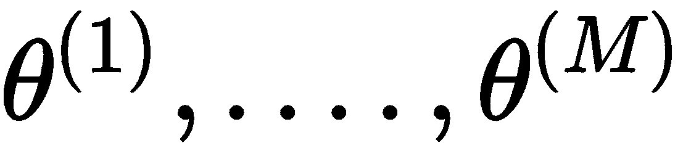 ； 及其相应的原始图像  分解如下：

这三个生成过程分别是类型生成（ 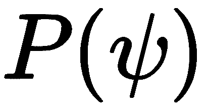 ），令牌生成（ 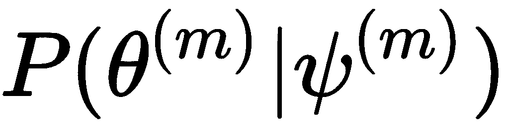 ）和图像生成（ 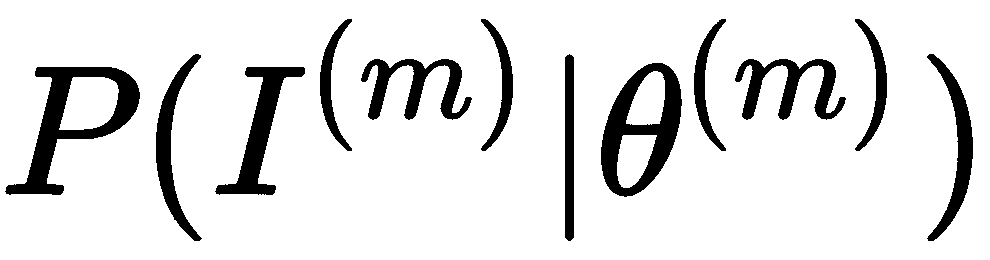 ），分别是 在下图中用其伪代码进行了讨论：

# 类型生成

手写字符类型（ 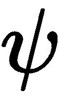 ）是字符的各个部分和子部分之间以及它们之间的关系的抽象架构。 反映现实生活中的字符书写过程，字符部分  形成了笔向下移动到笔抬起操作的一个笔触。 这些字符笔划由  子部分组成，表示笔的短暂停顿。 生成新字符类型的伪代码显示在上图的 B 侧，其执行过程如下：

1.  为了生成新的字符类型，模型首先为每个部分采样零件数（  ）和子零件数（ 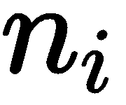 ）。 采样参数来自它们在训练数据集中的经验分布。 训练数据还提供了子部分的预定义原语集。

2.  每个字符部分都是通过对预定义集合中的子部分进行采样而产生的，因此对下一个子部分进行采样的概率取决于前一个子部分。
3.  为零件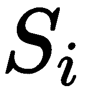采样了关系  ，该关系定义了该零件与先前零件的连接方式。

# 代币生成

字符标记 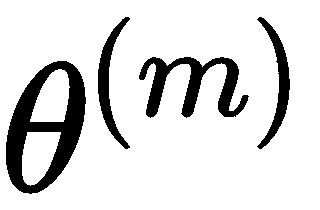 是通过对墨水从笔到纸的流动方式进行建模而由零件和关系生成的。 用于令牌生成的伪代码在上图的 B 侧进行了描述。 首先，将噪声（此处称为运动方差）添加到子零件的比例尺和控制点，以定义冲程（或零件）轨迹 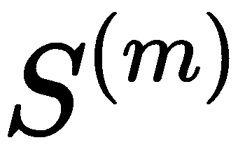 。 轨迹的精确开始位置  由关系  决定。 最后，将变换  用于减轻概率推断。

# 图像生成

使用随机渲染功能生成原始二进制字符图像  ，该函数将笔划轨迹与灰度墨水映射。 这是通过为每个像素分配独立的伯努利概率来实现的。

BPL 是一种高度直观的模型，可以在贝叶斯框架下使用简单的程序为概念建模。 从训练数据中学习概率分布的参数。 在分类和生成的单次计算机视觉任务上，该模型的性能与人类水平的性能相当，其数据需求远低于某些最新的深度学习模型。 这里研究的概率程序非常基础，适合于相当容易的字符识别任务。 BPL 框架支持设计更复杂的程序，这些程序可以对各种对象的复杂表示进行建模。 例如，可以使用此框架对在零件和关系方面具有清晰直观描述的对象（例如车辆，食品，动物，甚至人脸）进行建模。 为此，BPL 框架甚至支持建模抽象知识，例如自然语言语义和物理理论。 然而，这些概率程序需要对数据及其部分，子部分和关系进行手动标记，这是一个耗时的过程，而深度学习方法则是自己学习这些人类直观特征和深层抽象特征。

# 判别式 k 次学习

K 次学习的一种非常常见的方法是训练具有相关任务的大型模型，而我们为此拥有大型数据集。 然后，通过 K 次特定任务对该模型进行微调。 因此，来自大型数据集的知识被*提炼为*到模型中，这仅从几个示例中增加了对新相关任务的学习。 2003 年，Bakker 和 Heskes 提出了一种用于 K 次学习的概率模型，其中所有任务共享一个公共特征提取器，但具有各自的线性分类器，其中仅包含几个特定于任务的参数。

这里讨论的 K 次学习的概率方法与 Bakker 和 Heskes 引入的方法非常相似。 该方法通过从很少的数据中学习概率模型来解决分类任务（针对图像）。 这个想法是使用一个强大的神经网络，该网络从大量监督数据中学习可靠的功能，并将其与概率模型结合起来。 神经网络最后一层的权重充当以贝叶斯方式规范化 K 次子模型权重的数据。

学习框架包括四个阶段：

*   表征学习
*   概念学习
*   K 次学习
*   K 次测试

下图显示了具有四个阶段的框架。 以下各节将对它们进行更正式的讨论：

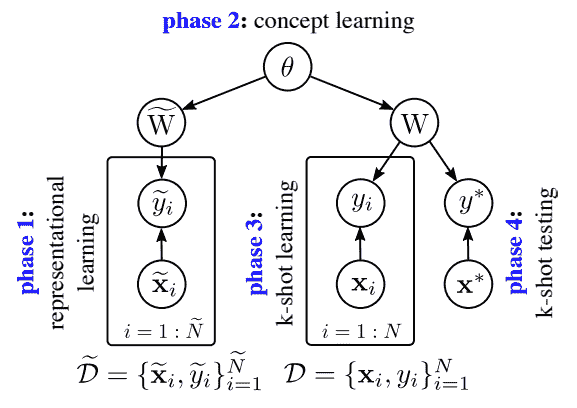

# 代表性学习

在第一阶段（表示学习），使用大型数据集  训练 CNN（ 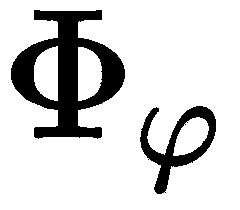 ），该数据集训练参数  网络的和  。 此后，这些参数  是固定的，并在以后的阶段中共享。 来自 CNN 最后一层的激活被映射到两组 softmax 层，由  和  参数化。 参数  对应于大型数据集中的  类，参数  对应于  K 次任务的数据集中的类  。 如下图所示：

# 权重的概率模型

假设由于最大数据集  而在第一阶段获知的 softmax 权重  的不确定性很小。 将此近似值与上图中的图形模型结构结合起来，我们可以摆脱原始数据集  ，并使用  的 MAP 估算值（  ）处于概念学习和 K 次学习阶段。 完整的概率模型遵循以下步骤：

1.  K 次学习过程将信息合并到两个数据集  和  中，以在 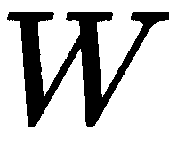 上生成后验分布：

2.  从图形模型，在上图中，我们知道给定父级  的情况，  有条件地独立于  我们有以下内容：

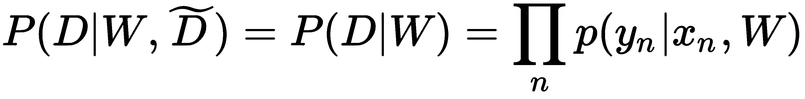

因此，等式 1 变为：

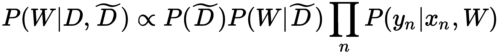

3.  我们可以将术语 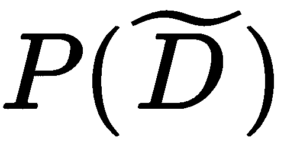 吸收到比例常数中，从而使前面的方程式变为：

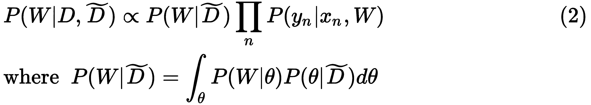

主要挑战是在给定初始数据集  的情况下，计算超参数  的后验，这会使该模型的推理变得难以处理。 由于使用了较大的初始数据集来学习权重  ，后分布  可以通过其 MAP 估计值安全地近似，即 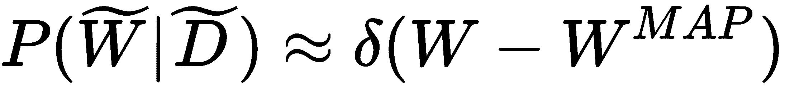。 因此，我们可以摆脱等式 2 中的  ，并用代替。

# 选择权重模型

给定图形模型，我们可以写出概念超参数（  ）和模型权重（  ，  的联合分布 如下：

做出两个简单但合理的假设以使机器在计算上易于处理：

*   首先，对于每个类别，从最后一个隐藏层到 softmax 的隐藏权重和被视为独立的。
*   第二，给定  ，和的权重分布  和  是相同的。

然后，等式 3 中的联合分布简化为：

一个简单的高斯模型用于权重  及其共轭正反 Wishart 先验  ，并估计 MAP 解的参数  。

这导致分发简化为以下内容：

K 次学习（等式 2）期间新权重的后验分布简化为以下表达式：

# 每个阶段的计算和近似

在讨论了先前模型的机制之后，以下小节总结了判别式 K 次模型的四个阶段中的所有计算和近似。

# 第一阶段–表征​​学习

最初，深度学习训练特征提取器 CNN  。 在以下阶段中使用输入图像（）的最后一层的激活  。 原始数据集中类别的 softmax 权重为 MAP 估计值 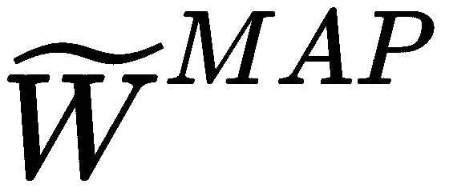 。

# 第二阶段–概念学习

概率模型直接适合于 MAP 权重  。 对于共轭模型，后验分布是通过解析获得的。 否则，将使用 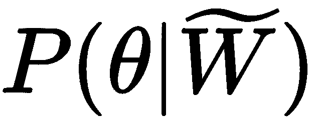 的 MAP 估算值。

# 第三阶段– k 次学习

在 softmax 权重，，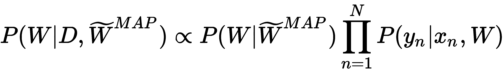，上的后缀是难以处理的。 通过使用 MAP 估计 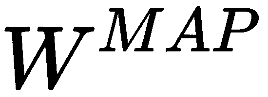 或通过采样  可以近似得出。 必须注意，  是针对共轭模型的分析。 但是，如果在阶段 2 中根据 MAP 估计来估计  ，则如等式 4 中所述使用 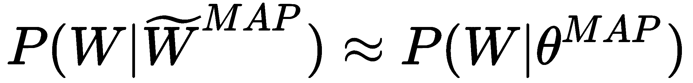 。

# 阶段 4 – K 次测试

K 次测试时间  的推论是难以理解的，因此此处使用近似值。 如果从阶段 3 开始使用  （  ）的 MAP 估计值，则  。 如果在阶段 3 中重新采样，则使用  。

在 miniImageNet 数据集（由 100 个类组成，每个类中包含 600 个图像）上，此方法可以一次学习一次和五次学习获得最先进的结果。 离统一概率模型和深度学习的领域又迈进了一步，将两者结合起来，可以开发出真正强大的模型，从而利用概率领域的强大数学保证和深度学习模型的强大健壮功能。 判别式 k 次学习方法仍然需要大量带标签的训练数据来训练基于深度学习的特征提取器。 另一方面，贝叶斯程序学习方法利用模型中的归纳偏差和手工设计的特征，因此需要较少的标注训练数据。

# 总结

在本章中，我们学习了在贝叶斯框架内开发概率模型的方法，该模型可以极大地减少数据需求并达到人类水平的性能。 从前面讨论的手写字符的示例中，我们还观察到概率模型不仅可以学习如何对字符进行分类，还可以学习基本概念，即以新的方式应用获得的知识，例如生成相似的字符并生成全新的 集合中只有几个字符的字符，以及将字符解析为部分和关系。

但是，人类学习器需要从具有丰富重叠结构的许多经验中获得的广泛的先前经验来完成新的学习任务。 为了模仿人类学习，图形结构需要具有更多的依赖性，并且需要在模型中内置丰富的归纳偏差。 还应注意，人类在很小的时候就对物体的物理特性（形状，运动和其他力学）有很好的认识。 学习模型不会隐式地捕获对象的直观物理特性，也不会显式地将其嵌入对象中。 直观物理（类似于游戏引擎中嵌入的物理）与概率模型和深度学习的集成，是朝着更健壮的单发学习迈出的重要一步。 最后，由于先验知识以强先验和图形结构的形式嵌入到概率模型中，因此与必须从头学习任务的深度学习模型相比，它们的数据消耗更少。 但这是以在概率模型中进行有效推理的计算挑战为代价的。 在推论时，这些模型必须搜索巨大的概率空间，这对于现代计算机而言是不实际的。 相反，深度学习模型具有精确且计算上便宜的推断。 最近的工作通过使用前馈映射对*摊销*概率推理计算来解决图形模型中的这一推理挑战，可以使用成对的生成/识别网络来学习。 这提供了另一条有希望的研究领域，使深度学习和概率模型更加接近。

# 进一步阅读

要了解有关本章涵盖的主题的更多信息，请阅读以下文章：

*   [《通过概率性规划归纳的人类级别概念学习》](https://web.mit.edu/cocosci/Papers/Science-2015-Lake-1332-8.pdf)
*   [《可以无监督一次学习对象类别的一种贝叶斯方法》](http://vision.stanford.edu/documents/Fei-Fei_ICCV03.pdf)
*   [《使用概率模型的判别性 K 次学习》](https://arxiv.org/pdf/1706.00326.pdf)
*   [《构建像人一样学习和思考的机器》](http://web.stanford.edu/class/psych209/Readings/LakeEtAlBBS.pdf)
*   [《简单视觉概念的一次学习》](https://cims.nyu.edu/~brenden/LakeEtAl2011CogSci.pdf)
*   [《使用分层非参数贝叶斯模型的一次学习》](https://www.cs.cmu.edu/~rsalakhu/papers/MIT-CSAIL-TR-2010-052.pdf)