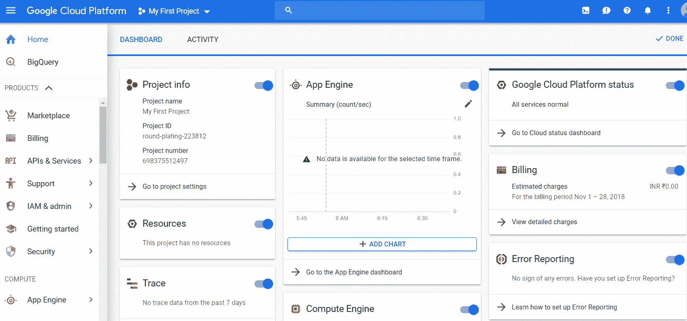
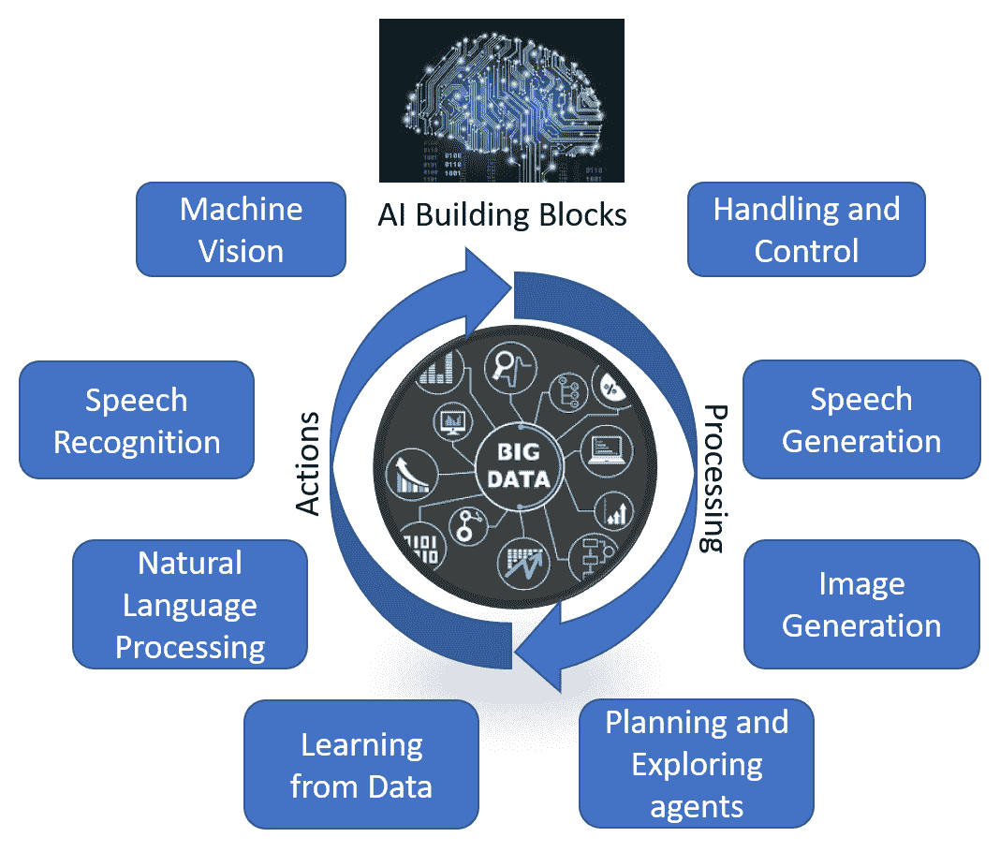
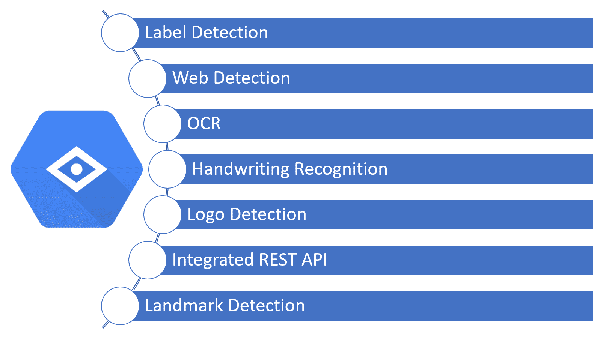
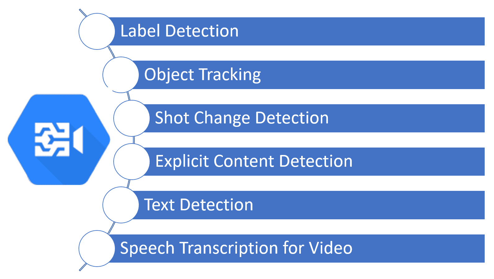

# AI 和 GCP 概述

在计算技术发展的紧要关头，我们不断从越来越多的设备和平台生成数据。 现在很清楚，如果使用不当，数据是可以提供竞争优势或劣势的关键因素。 在过去的几年中，我们已经看到，使用云上可用的基础架构可以存储和处理大量数据。

在本章中，我们将介绍云优先策略，企业正在采用该策略对数据执行高级分析。 我们将看到 Cloud First 策略的一些优势以及反模式。 在本章的后续部分中，我们将对 **Google Cloud Platform**（**GCP**）进行高层概述。

我们将在本章介绍以下主题：

*   了解用于高级数据分析的 Cloud First 策略
*   Google 数据中心
*   GCP 概述
*   人工智能构建块
*   GCP 上可用的 AI 工具

# 了解用于高级数据分析的云优先策略

对于已开始将数据视为保持相关性的最关键资产的组织而言，2018 年发生了重大变化。 从大数据处理基础架构的“本地”部署到云的过渡已经有了明显的转变。 随着分布式数据管理系统的成熟，企业开始依赖于分布式计算平台来满足其分析和运营需求。 但是，随着增加新的数据源，数据量和后续分析的可能性也在不断增长。 这样，很明显，需要快速进行实验并根据需要缩放（放大和缩小）环境。

一些高级分析工作负载利用机器学习算法，这些算法需要**图形处理器**（**GPU**）的集群，以便在合理的时间内提供结果。 也可以按需采购 GPU，然后在云环境中将其无缝释放回资源池。 为了达到最大的业务影响，某些实验需要迅速投入生产。 在敏捷性和快速部署方面，基于云的环境是理想的。 业界已经开始在云上进行部署。 企业不仅看到**基础架构即服务**（**IaaS**）的好处，而且还看到**高级分析即服务**（**AAaaS**）在云平台上。

自 2018 年初以来，已迅速转向 Cloud First 策略。刚开始实现其数据策略的组织正在将云作为其第一个游乐场，而不是投资于内部部署。 但是，“云优先”并不意味着“数据最后”策略。 在完全由数据驱动的策略中，数据仍然扮演着核心角色。 让我们看一下与本地部署相比，云中数据管理的一些优势。

# 云优先策略的优势

采用云优先策略具有以下优点：

*   **最低的前期成本**：由于服务全天候可用，因此存储和计算基础架构几乎不受限制，并且扩展成本最低。 无需购买任何硬件或从头开始设置应用程序和软件。 此外，在云平台上虚拟化了基础架构以及软件。 这样可以使企业的前期成本和投资降至最低。 该模型特别适合于开发原型和测试概念证明。 在某些情况下，可以快速验证概念的业务可行性，而不必承担资本支出和其他间接费用。 借助云，可以以最小的成本压力快速测试和部署创新的想法和概念，以立即获得业务收益。
*   **弹性容量**：即付即用是建立云服务的核心原则。 尽管仔细的容量规划对于任何成功的数据策略都很重要，但是借助云，我们可以在容量规划方面拥有一定的灵活性。 如果需要更多容量（例如，在线零售商可以预期在黑色星期五期间会有很高的销量），则公司可以在短时间内扩展容量，然后缩减到常规容量。 这种类型的灵活性在数据管理系统的内部部署中不可行。
*   **全局连接**：只要可以使用互联网连接以及适当的身份验证/授权，就可以在全球范围内虚拟访问作为云上可用的基础结构，平台和应用程序的服务。 通过云提供商跨区域和物理位置的隐式冗余，确保了连接性。 内部部署和拓扑不是客户端考虑或关注的领域。 云端点是一致且无缝的，而与客户端的位置无关。
*   **无缝升级**：云提供商可以无缝升级在云上配置的操作系统和应用程序软件。 这样可以确保所有部署之间的一致性和可靠性，并且非常适合互联网规模的企业应用程序。 与传统的本地部署相比，传统的本地部署需要在管理服务停机和业务中断的同时，将应用程序版本和补丁小心地应用于所有节点。 在云环境中，责任完全转移给云提供商，企业可以专注于核心业务应用程序。
*   **无服务器 DevOps**：借助此，应用程序开发团队可以完全专注于核心业务逻辑。 他们可以根据数据量和计算需求，根据应用范围简单地规定存储和计算需求。 这些团队无需担心任何部署，他们将以最少的配置和扩展时间开始使用服务。 无服务器架构将云功能作为服务公开给云提供商托管应用程序的地方，并负责管理硬件和相关软件组件。 这种模式提供了进入业务应用程序，算法和模型开发的快速入门，而不必担心底层基础结构，因此，可以快速构建核心功能以开始实现业务收益。
*   **快速发布时间**（**TTM**）：有了前面列出的所有优点，采用 Cloud First 策略将各种概念和原型的 TTM 降至最低。

Google 通过从头开始构建服务，从而为企业提供云服务时采取了创新的方法。 这些服务最初是由 Google 自己内部用于搜索和其他互联网规模的服务而构建的。 该平台迅速成熟，形成了一套完整的套件，可用于开发整个简单范围的应用程序，从简单的 Web 应用程序开始，再到微服务和高级分析，这些功能利用了大量的结构化和非结构化数据以及 GPU 和 **张量处理单元**（**TPU**），用于训练计算密集型模型。 在本书的“第 7 章”，“了解云 TPU” 中，我们将深入研究 TPU 并详细了解 TPU。 在本书中，我们将详细了解 GCP 的各个组成部分，并将专门研究如何利用 GCP 将**人工智能**（**AI**）工作负载以及各种应用程序的无缝集成部署为服务。

尽管 Cloud First 策略在实现实实在在的利益方面具有公认的优势和优势，但由于接下来要说明的原因，云的采用也受到了批评。

# 云优先策略的反模式

尽管云计算是一个新的范例，但仍需要解决某些基本假设和一致的连接性和安全性要求。 以下是“云优先”策略的一些反模式：

*   **停机时间**：云服务完全取决于可靠的互联网连接的可用性。 当关键业务应用程序部署在云上时，互联网停机的风险和影响会增加。 但是，停机风险在本地部署中同样普遍，并且需要仔细考虑架构模式以最大程度地减少这些风险。 借助云，应在设计服务时考虑到高可用性，冗余和灾难恢复。 云供应商为云基础架构提供了多个可用性区域。 应用程序应利用这些冗余区域来部署关键服务。 在下一部分中，我们将了解 Google 如何通过地理位置分散的数据中心来减轻停机风险。
*   **安全性和私密性**：许多管理敏感数据资产的企业在采用云时都担心数据的安全性和私密性。 云是共享空间，因此，风险显而易见。 但是，以下策略可以轻松应对反模式：
    *   在所有部署级别上实现安全治理实践和流程。
    *   实现精心定义的访问控制级别，并为所有用户和进程提供最低级别的访问。 如有疑问，请提供比访问服务和基础结构的更广泛的网络访问更多的受限访问。
    *   对所有用户帐户实现多因素身份验证。
    *   在所有端点上部署异常检测程序并持续监视云基础架构（自动以及基于样本的手动监视）。

云服务提供商已在保护这些反模式方面进行了大量投资，并且云部署此时与本地部署一样可靠和安全。

在下一节中，我们将根据地理区域和服务可用性来查看 Google 数据中心的当前状态。

# Google 数据中心

作为互联网规模的数据托管人，Google 建立了完善的数据中心网络。 现在，相同的基础结构可用于 GCP。 在撰写本文时，GCP 拥有 18 个全球区域，分为 55 个区域，分布在 35 个国家/地区。 以下屏幕快照显示了全球 GCP 区域：

这些地区分为“美洲”（北美和南美），“欧洲”和“亚太地区”。 选择正确的区域和区域对于确保服务和数据的延迟，可用性以及持久性处于可接受的水平至关重要。 确保区域内位置之间的网络数据包的往返延迟为亚毫秒级的 95%。 部署在区域内单个区域上的服务将不会容错。 在这种情况下，区域故障将导致服务中断。 为了开发容错应用程序，需要跨区域部署。 对于关键任务应用程序，应实现多区域部署策略。 根据应用程序和服务的关键级别，将资源分类如下：

*   **区域资源**：这些资源在区域内操作。 在这种情况下，如果该区域不可用，则该服务将变得不可访问。 计算引擎是区域资源，因为如果基础数据可用，则可以恢复计算。 如果包含计算引擎实例的区域出现故障，则一旦该区域可用，就需要重新启动计算。
*   **区域资源**：这些资源部署在一个区域内，并且在各个区域之间具有冗余性。 这些资源提供的服务不会因为区域故障而中断。 结果，利用区域资源确保了更高的可用性。
*   **多区域资源**：一些关键任务服务在区域间冗余部署。 由于地区之间的地理隔离，服务需要与延迟和一致性之间的权衡取舍一致。 这些折衷是基于服务和可接受的**服务级别协议**（**SLA**）选择的。 部署在多区域资源上的服务中的数据不属于特定区域，并保持流动性。 可以跨区域传输数据以满足服务级别。

考虑到现有的可用容量和对云计算资源的需求预测，Google 已经在跨地区扩展其业务范围。 通过使用机器学习算法，可以确保最佳利用容量。 从 AI 从业者的角度来看，GCP 提供了可靠的平台，因此我们可以利用无服务器架构范例专注于构建出色的应用程序。

在下一节中，我们将研究 GCP 的各个组件并熟悉该接口。 这是本书中对平台的基本介绍。

# GCP 概述

尽管任何云平台都可以作为虚拟服务通过网络使用，但其核心是系统和物理资源。 如上一节所述，GCP 创建了一个数据中心全球网络，该网络可提供跨区域和区域的服务冗余性，从而提供可靠性。 选择更靠近客户端位置的区域的优势之一是较低的延迟，这在我们处理大量数据传输时起着重要作用。 这些用例需要事件时间和处理时间之间的最小延迟。 GCP 上的所有资源（例如存储和计算）都被视为服务。 该范例称为**一切即服务**（**XaaS**）。 这包括 IaaS，**平台即服务**（**PaaS**）等。 GCP 上的资源和服务根据抽象性和适用性级别分为全球，区域和区域。 组织在 GCP 上管理的任何资源都必须是项目的一部分。 项目是组织提供的所有资源的顶级抽象。 项目具有各种属性，元数据，资源和访问控制。 项目边界内的资源根据区域和区域限制相互连接，并与内部网络进行通信。 但是，跨项目的资源可能会通过外部网络进行通信。 在 GCP 中，项目由项目名称，项目 ID 和项目编号唯一标识。

GCP 提供了 Web 界面控制台，**命令行界面**（**CLI**）和 Cloud Shell，以与各种服务进行交互。 这是 GCP 控制台的屏幕截图：

云**服务开发套件**（**SDK**）提供了一个称为`gcloud`的 CLI 工具，可用于执行所有配置并与平台进行交互。 它也可以用于开发工作流程的管理。 Cloud Shell 提供了与 GCP 进行交互的类似界面，Cloud Shell 是一个基于浏览器的临时 Shell 环境，可以从云控制台内部进行访问。

# 人工智能构建块

为了构建智能机器或系统，需要一些基本的构建块。 “数据”是 AI 开发和大规模采用的核心。 在本节中，我们将回顾围绕数据的所有构造块。 这是显示 AI 的所有构建块的图：

# 数据

可以与人类能力相匹配的智能机器的一般概念是在大约一个世纪前提出的，为创建这些智能机器投入了大量的思考和研究。 这些努力为现代 AI 奠定了基础。 但是，研究受到可用数据存储和处理能力的限制，因为构成 AI 基础的机器学习模型需要大量的数据来进行训练，并且需要大量的处理能力来进行算法计算。 由于我们可以存储和处理的数据量很大，现在恢复了 AI 研究领域。 数据是 AI 构建块的核心和焦点。 数据容量分为三个区域：存储，处理和数据驱动的操作。

# 存储

从本世纪初开始，我们已经看到数字化和存储数字资产的能力急剧上升。 由于采用了云计算，通用存储容量的可访问性也得到了显着提高。 在云计算范例中，存储作为服务可用，不需要采购和管理与存储相关的基础架构。 结果，用于 AI 研究的数据资产的可用性呈指数增长。 下图说明了一段时间内存储容量的增长。 商店的需求正在成倍增长，并且超出了我们目前的限制。 这正在迅速发生。 为了坚持数据量增长的速度，我们描述了一个超出范围的规模：

# 处理

由于分布式计算框架，我们还看到了整体处理能力的提高。 处理单元分布在各种机器上，以进行并行处理和计算。 框架负责跟踪跨节点的计算，并整合从可行见解中得出的结果。 由于云计算范例（其中计算可作为服务使用），处理能力也大大提高。 在这种情况下，无需为大型数据处理而采购和管理专门的基础架构。 通过增加的处理能力，我们现在能够通过利用大量数据来尝试机器学习算法。 反过来，这又推动了 AI 领域的快速发展。

# 动作

由于可获得大量数据，并且能够处理这些数据以获取有意义的见解的处理能力，我们能够根据概率模型预测未来的事件和行动。 这些操作基于数据而不是主观判断。 智能机器的基本组成部分之一是根据环境情况采取行动的能力。 该行为应为代理商带来最大的回报。 AI 系统需要促进基于数据的行动而不是主观的人类判断，以便充分增强人类的能力。

# 自然语言处理

任何 AI 系统的关键组件之一是智能机器和代理程序的**自然语言处理**（**NLP**）接口。 与具有 AI 功能的系统的交互必须以人与人之间交互的自然方式进行。 由于我们交流的程度和模糊性，语言处理非常复杂。 人类语音的合成和分析可以通过使用大量训练数据训练**深度神经网络**（**DNNs**）来实现。 尽管 DNN 中有大量数据，但是由于语言中的语义变化，很难达到相同的准确率。 但是，NLP 是 AI 的基本构建块。 在本书的后面，我们将研究 GCP 上可用于 NLP 的各种选项和工具。

# 语音识别

为了使与智能机的接口尽可能接近人机交互，我们需要语音识别功能。 指令需要作为语音命令给出，并且我们需要复杂的语音识别引擎才能将口语单词转换为机器可读格式。 同样，由于各个人说特定单词的方式有所不同，因此语音识别系统很难获得 100% 的准确率。 该接口需要针对特定​​个人进行校准和训练，并且通用模型需要不断增强，以提高语音识别引擎的整体效率。

# 机器视觉

为了使 AI 系统充分增强人类的能力，它需要开发一种方法，通过建立以类似于人眼的方式处理视觉信息的能力来收集对环境上下文的理解。 摄像机捕获了视觉效果，并且需要使用大量视频数据来训练模型，以便对环境进行准确的了解。 机器视觉是 AI 的关键要素。 在接下来的章节中，我们将探索机器视觉 API，以及 GCP 中的示例代码。

# 信息处理与推理

人类善于处理各种感官收集的信息，并善于运用推理以有意义的方式对这些感官做出反应。 智能机器需要类似的功能才能模仿和增强人类的能力。 在 AI 系统的情况下，推理可以基于大量的训练数据以及强化学习引擎。 基于信息的环境上下文的逻辑推理是 AI 系统的关键组成部分。

# 规划与探索

人脑可以轻松执行的最先进的功能之一是提前计划事件和行动。 此技能要求探索过去的数据以及当前的上下文数据和实时信息。 这些行动是根据牢记的短期和长期目标制定的。 智能代理需要具有探索上下文环境数据并根据过去可用数据进行计划的能力。 在地理地图上浏览是规划和探索 AI 功能的一个很好的例子。 制图应用程序可以基于实时数据探索来建议特定时刻的最佳路线，并且可以基于沿途遇到的新信息来调整路线图。

# 处理和控制

一些智能代理还需要能够处理和控制物理对象。 这包括工业机器人，这些机器人在装配线上处理各种机器零件，将它们放置在正确的位置，然后根据预定义的例程进行应用。 这种类型的系统需要具有一定程度的模糊性以及可以根据环境运行的自学习循环。 不可能为所有可能的情况编程处理和控制功能。 需要以这样的方式构建模型：代理可以根据环境状态的变化采取行动，同时仍能最大化环境中代理的总体报酬。

# 导航和移动

智能代理需要能够在物理环境中导航和移动。 自动驾驶汽车或自动驾驶汽车是 AI 系统功能的示例。 为了建立这种能力，需要对代理商进行全面的实际生活中可能遇到的路况训练。 DNN 还需要在尽可能多的场景中进行训练。 真实（非训练）环境中的模型执行需要非常高效，以使代理能够在关键任务环境中生存，而该任务关键环境要求代理的事件时间和行动时间之间的等待时间极低。

# 语音生成

为了使智能代理以自然形式交互，它需要能够生成人类语音。 启用语音的系统现在已成为主流，并且比语音到文本的界面更容易构建。 Google 提供了易于使用的语音生成 API。 我们将在本章的下一部分中查看这些 API 和服务，并在本书后面的章节中探索详细的示例。

# 图像生成

图像生成功能是 AI 系统的另一个组成部分。 图像经过处理和重新格式化，以便从像素数据中获取更多含义和信息。 图像生成功能可用于医学图像处理以及高端法医研究。

在下一节中，我们将介绍 GCP 中可用于促进 AI 各个构建模块的工具。

# GCP 上可用的 AI 工具

Google 简化了在 GCP 上使用现成的 AI 构建块构建 AI 系统的过程。 GCP 上提供了三类组件和工具：视觉，语言和会话。

# Sight

Sight 是指智能机器的可视界面。 GCP 提供以下用于视觉信息和情报的 API：

*   **Cloud Vision API**：这是在 GCP 上经过预先训练的模型之上的**表述性状态转移**（**REST**）API 抽象。 API 可以将图像分为通用类别和特定对象。 它还可以读取图像中的文本。 随 Cloud Vision API 开箱即用地提供了图像元数据管理以及对特定应用程序不需要的内容的审核。 从图像中收集见解非常简单，无缝。 此 API 的一些常见用例是图像搜索，文档分类和产品搜索（零售）。 下图显示了 Cloud Vision API 的各种应用程序和用例：

*   **Cloud Video Intelligence API**：这是一种 REST API，可以从视频供稿中提取信息，并可以从视频数据中搜索和提取元数据。 该 API 易于使用，并且包含超过 20,000 个预定义标签的列表。 该 API 还提供了视频标签和内容之间的互操作性，当视频资产存储在 Google Cloud Storage 中时，可以跨视频资产进行基于文本的搜索。 下图显示了 Cloud Video Intelligence API 的各种应用程序和用例：

*   **AutoML Vision**：此服务可以定制训练模型以对视觉图像进行分类。 可以使用易于使用的界面对模型进行训练和评估。 也可以使用唯一的名称空间注册它们，以便通过 AutoML API 使用它们。 如果用户有大量要标记的图像，则可以使用人工标记服务来补充 AutoML Vision API。 可以通过 AutoML Vision 用户界面直接启动人工标签。

# 语言

GCP 通过翻译和自然语言 API 提供用于语言信息和情报的 API，如下所示：

*   **Cloud Translation API**：此 API 根据预先训练的模型以及可以使用 AutoML 翻译框架进行训练的自定义模型，在两种语言之间提供双向翻译。 当源文本的语言未知时，API 还可促进语言检测。 与其他 AI 服务类似，翻译服务也可用作 REST API，用于在应用程序内进行编程访问和集成。 在撰写本文时，支持 100 种语言。 无需显式解析即可翻译 HTML 内容的独特功能使提供网页翻译以及创建多语言站点和应用程序变得容易。
*   **Cloud Natural Language API**：此 API 提供了对基于预训练模型以及可以使用 AutoML Natural Language 框架进行训练的自定义模型的非结构化文本和音频数据的见解。 API 可以根据各种形式的非结构化文本来收集有关人员，地点，事件，情感等的信息。 在内部，该服务利用丰富的本体图和不断发展的模型来提高准确率。 此 API 可能会使用的一些常见用例是客户情感分析和产品分类（零售市场研究）。 易于使用的 REST API 有助于语法分析，实体识别，情感分析和内容分类，并支持多种语言。

GCP 提供了 API，可通过 Dialogflow 和 Google Cloud TTS/STT API 与智能机实现语音和对话界面。

# 对话

对话界面是支持 AI 的应用程序的重要方面。 GCP 提供了 Dialogflow 引擎，用于通过简单的界面和 API 创建企业级的对话应用程序，如下所示：

*   **Dialogflow Enterprise Edition**：此服务使用预先训练好的随时可用的底层深度学习模型，为应用程序的会话界面创建提供便利。 会话服务可用于具有网站，移动应用程序甚至**物联网**（**IoT**）设备的用户的自然界面。 在编写本书时，该服务支持 20 种语言的对话界面。 Dialogflow 与 Natural Language API 无缝集成，以便在进行实时对话时执行情感分析。 这有助于为客户提供特定于客户的针对性服务。 该界面可能的一些用例包括企业生产率的提高，面向最终客户的自助业务交易以及与 IoT 设备的自然语言通信。
*   **Cloud TTS API**：此 API 有助于从输入文本合成人类语音。 该服务具有多种语言和变体，可以为应用程序创建自然语言界面。 负责文本到语音转换的机器学习模型已经过预先训练，并且不断发展以提高准确率和保真度，使其尽可能接近自然的人声。 可以通过 TTS API 实现的一些常见用例包括呼叫中心自动化，与 IoT 设备的交互以及将文本转换为音频以供阅读器使用。
*   **Cloud STT API**：此 API 基于强大的模型，这些模型经过预先训练，可以将音频输入转换为多种语言的文本。 该 API 支持实时流式传输或预先录制的音频输入。 它还具有自动检测语言的能力，并支持将短格式和长格式音频片段实时转换为文本。 在编写本书时，语音到文本接口有四类预训练的模型。 这些模型适用于特定的用例和对话界面：
    *   `command_and_search`：可用于短命令和语音搜索。
    *   `phone_call`：用于来自电话对话的音频。
    *   `video`：适用于作为视频信号一部分或以更高采样率录制的音频。
    *   `default`：这是通用模型。

本节中列出的所有服务和 API 均可与智能机实现自然的接口，并且是 AI 的构建块。 在本书中，我们将通过代码示例详细探讨这些 AI 工具。

# 总结

在本章中，我们已经了解了 Cloud First 策略，以及这对于开发利用 AI 的现代应用程序是当务之急的选择。 另外，我们已经简要地看到了各种系统的基于云的实现的反模式。 我们还介绍了 GCP，它是基于 Google 在管理大量数据方面的经验而构建的。 随着时间的推移，该平台正在得到丰富和扩展。 我们研究了通用 AI 系统的各种构建块，并研究了 GCP 上可用的工具，这些工具可以以无服务器方式无缝地促进 AI 应用程序的开发。

在下一章中，我们将研究 GCP 上可用于计算和处理 GCP 上的数据资产的各种组件。