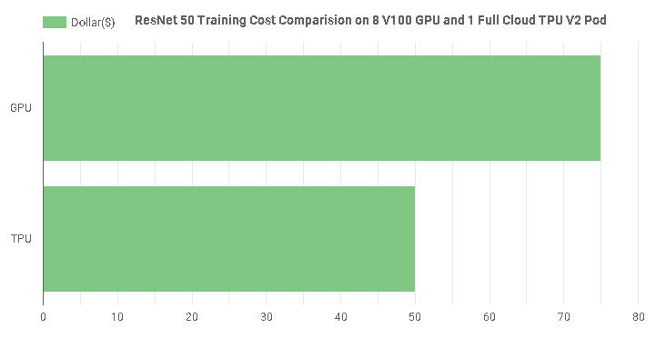
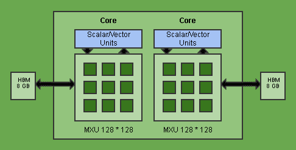
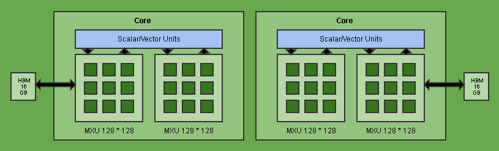
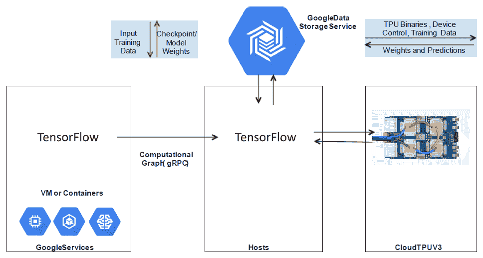
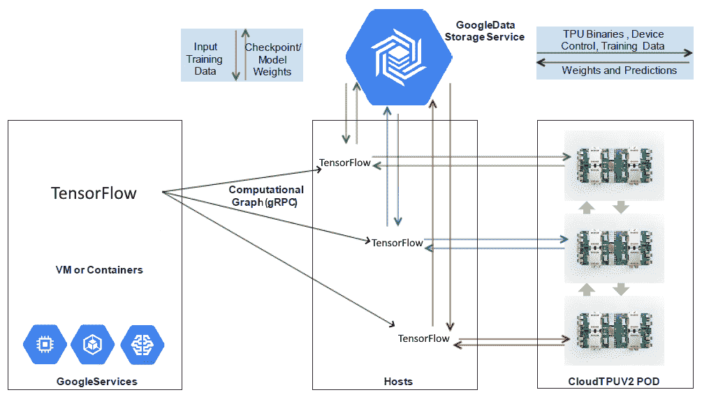
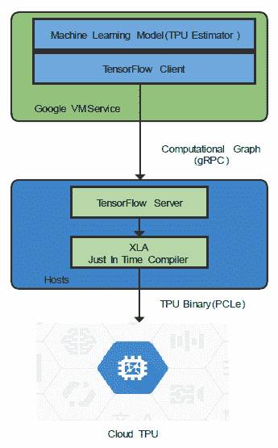
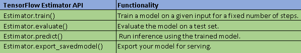
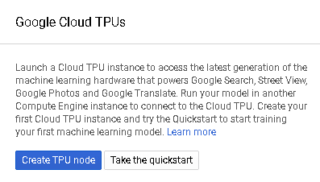
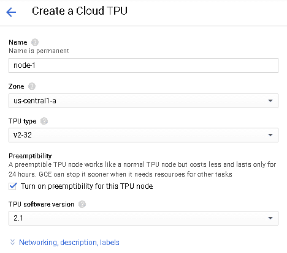
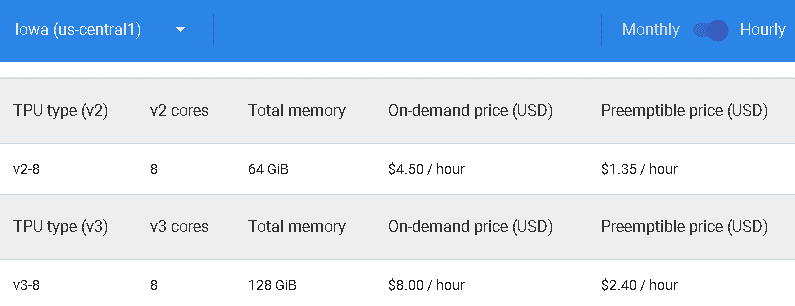

# 了解云 TPU

任何平台都只能发挥其优势。 利用 **Google** **Cloud** **平台**（**GCP**）之类的平台，最重要的方面是使其日常运作 业务工作量处理。 在本章中，我们将看到在 GCP 上运行**人工智能**（**AI**）的一些最佳实践和实用技巧。 我们将了解**张量处理单元**（**TPU**）以及 TPU 如何在内部运行以促进大规模并行计算需求，以便构建利用 **Machine L** 的各种服务**获得**（**ML**）模型。

本章将涵盖以下主题：

*   介绍云 TPU 及其组织
*   软硬件架构图
*   使用 TPU 进行模型开发的最佳实践
*   使用 TPUEstimator 训练模型
*   设置 TensorBoard 以分析 TPU 性能
*   绩效指南
*   了解可抢占的 TPU

# 介绍云 TPU 及其组织

TPU 是在 GCP 上构建各种服务和 ML 模型的基本构建块。 为了充分利用该平台，我们需要了解 TPU 的核心概念。 这些核心概念将帮助我们优化性能，并使我们能够最大程度地利用为该帐户分配的计算资源。

Google 已经开发了 TPU，以加速 ML 工作流程。 借助 Cloud TPU，用户可以使用 TensorFlow 在 Google 的 Cloud TPU 硬件上运行其 ML 工作流。 用户可以使用 TPU（特别是线性代数算法）获得最大的性能提升。 TensorFlow 计算集群可以利用**中央处理器**（**CPU**），**图形处理单元**（**GPU**）和 TPU 来构建。 在本章的后面，我们将详细讨论可以使用 TPU 并可以带来巨大好处的领域。

现在，让我们快速检查一下 Cloud TPU 可用的区域。 这将帮助您确定最近的模型部署区域：

*   **在美国地区的可用性**：在撰写本章时，TPU 在美国和欧洲地区普遍可用。 以下屏幕快照所示的表格中列出了美国地区的一般可用性：


**TFRC** 是 **TensorFlow 研究云**的缩写。

*   **在欧洲区域的可用性**：在以下屏幕快照中显示的表格中列出了欧洲区域的一般可用性：


*   **在亚洲地区的可用性**：此外，GCP 在亚洲地区也正在扩展，在撰写本章时，其可用性有限，如以下屏幕快照所示。 预计随着 GCP 在整个地理区域中采用率的提高，亚洲地区的可用性也会有所提高：


应用程序可以通过**虚拟私有云**（**VPC**）网络从实例，容器和 AI 服务访问 TPU 节点。 下表概述了访问 GCP 上的 TPU 节点的方法：

*   Compute Engine 上的 Cloud TPU 非常适合需要它来管理自己的 Cloud TPU 服务的用户； 通常，建议使用 Google Cloud 的用户，因为它具有 CTPU 实用程序，可以为用户完成基本的后台工作，例如设置虚拟机，云存储服务和 TPU。
*   当您需要在应用程序中进行自动扩展，灵活地更改硬件（CPU，GPU 和 TPU 之间），虚拟机的自动管理以及**无类域间路由**时，可以使用 Kubernetes Engine 上的 Cloud TPU ]（**CIDR**）块范围，更重要的是，是一个容错应用程序。

*   经验丰富的 ML 程序员应使用 AI 服务上的 Cloud TPU，他们可以利用 GCP 提供的托管 AI 服务。 AI 服务为用户管理 AI 工作流中的许多活动，例如在用户数据上训练 ML 模型，部署模型，预测监控和模型管理。

现在，我们对 TPU 有了基本的了解，让我们看一下 TPU 的使用领域和优势。

以下屏幕快照描述了硬件使用的区域，即 CPU，GPU 和 TPU：


从前面的屏幕快照可以明显看出，我们需要在用例和当前问题的背景下进行思考，然后才能在 CPU，GPU 和 TPU 之间做出选择。 具有由矩阵计算控制的大量训练和评估数据的超大型模型最适合在 TPU 上进行训练。

# 使用 TPU 的优势

在 ML 算法中，通常使用线性代数计算。 TPU 使这种计算的性能最大化； 可以在很短的时间内在 TPU 上训练在 GPU 上花费大量时间的模型。 此外，对于**卷积神经网络**（**CNN**）模型，Cloud TPU 大大缩短了达到准确率的时间。 如果您拥有适用于 Cloud TPU 的应用程序，则可以在很短的时间内以非常低的成本获得最大的输出。

以下屏幕快照显示了用于训练 ResNet 50 模型的 GPU 和 TPU 的快速比较。 ResNet 50 是一个 CNN 模型，已经对 ImageNet 数据库中的一百万幅图像进行了训练。 已经观察到，如果用户使用八个 v100 GPU 和一个完整的 Cloud TPU v2 pod，则培训时间和成本都会大大降低。 虽然培训速度提高了 27 倍，但成本也降低了 38％。

以下屏幕截图比较了在 GPU 和 TPU 上进行培训的成本：



图 7.1 培训费用比较

从前面的屏幕快照可以明显看出，TPU 可以为复杂的模型训练工作节省大量成本。 在一段时间内进行多次部署后，节省的成本变得更加重要，尤其是在生产部署场景中，该场景中需要经常训练模型。

# 软硬件架构图

为了进一步加速数学计算，创建了专用硬件作为**专用集成电路**（**ASIC**）。 这样，尤其是在`n`-多维数学中，计算能力得到了倍增。 在本节中，我们将详细介绍 TPU 及其相关组件的软件和硬件体系结构。

# 可用的 TPU 版本

每个 TPU 版本都包含一些主要组件，这些组件构成了 TPU 的功能。 在讨论 TPU 版本时，我们将看一下 TPU 内核的体系结构和 TPU 内核的**高带宽存储器**（**HBM**）。 我们将了解每个 TPU 设备上的内核如何互连以及如何将网络接口用于设备间通信。

下表显示了 TPU v2 的特征：

*   每个 TPU 内核 TPU v2 的 HBM 为 8 GB。
*   每个内核具有一个 128 * 128 的**矩阵单元**（**MXU**）。
*   一个 TPU 盒最多可具有 512 个内核和 4 TB 的总内存。

下图显示了 TPU v2 的组织：



图 7.2 TPU V2 特性

下表显示了 TPU v3 的特征：

*   每个 TPU 内核 TPU v3 的 HBM 为 16 GB。
*   每个内核具有两个 128 * 128 的 MXU。
*   一个 TPU 盒最多可具有 2,048 个内核和 32 TB 的总内存。

下图显示了 TPU v3 的组织：



图 7.3 TPU 的组织

每个 TPU 内核均由标量单位，矢量单位和 MXU 组成。 TPU 芯片以 MXU 计算能力为后盾。 在一个周期内，MXU 可以执行 16,000 **个乘积**（**MAC**）操作。 MXU 输入和输出是 32 位浮点值，但是它以`bfloat16`精度执行乘法以提高精度。 每个内核可以独立执行用户操作，并且通过高带宽互连可以与其他芯片进行通信。 对于大型 ML 工作负载，可以将多个 TPU 设备与高速网络接口互连，以获得大量的 TPU 内核和内存。

# 与 TPU v2 相比，TPU v3 的性能优势

正如我们在本书前面所看到的，与 TPU v2 相比，TPU v3 具有更多的 **TeraFlops**（**TFLOPS**）和内存。 因此，肯定有一些地方 TPU v3 可以获得比 TPU v2 更好的结果。 要确定要使用的 TPU 版本，可以在可用版本上运行模型，并使用 TensorBoard 检查性能。

以下是 TPU v3 可以改善的一些方面：

*   受计算限制的模型在 TPU v3 上具有显着的优势。
*   数据不适合 TPU v2 内存但适合 TPU v3 内存的情况会有所帮助。
*   批量大小不适合 TPU v2 的新型号可以再次获得性能优势。
*   在某些区域中，模型是输入绑定的，或者模型是内存绑定的； 在那里，您可能看不到这种性能提升。 因此，在确定 TPU 版本之前，请在预期用例的背景下进行性能基准测试和成本价值分析。

# 可用的 TPU 配置

让我们讨论 Google 提供的不同类型的 TPU 配置。

Google 提供了两种不同类型的配置，用户可以在两个 TPU 版本中利用它们。 它们如下：

*   **单设备 TPU**：这些是执行所有操作的单独设备。 这些设备未通过网络与其他 TPU 设备互连。 实际上，一个以上的单个 TPU 设备无法通过网络连接到另一设备。
*   **TPU 盒**：TPU 盒不过是群集，其中有多个 TPU 设备通过高速网络与另一台设备互连。

下图描述了单个 TPU 设备，因为它不连接到另一个 TPU 设备，因此不需要高速网络带宽。 TPU 节点仅连接到一个 TPU 设备。 TPU 中的芯片已经互连，不需要主机 CPU 或主机网络资源：



图 7.4 单设备 TPU

上图中的设备正在使用 Cloud TPU v3，但是在设置节点时，您可以指定任何 TPU 版本。 我们将在*软件体系结构*部分中讨论流程。 以下屏幕快照描绘了一个 TPU 盒，其中多个 TPU 设备通过高速网络连接进行连接：



图 7.5 TPU 盒

在上图中，请注意以下几点：

*   主机正在不同的 TPU 设备上分配 ML 工作流。
*   TPU 中的芯片已经互连，不需要主机 CPU 或主机网络资源。
*   由于 TPU 设备通过高速带宽网络连接，因此它们也不需要主机 CPU 或主机网络资源。

上图中的设备正在使用 Cloud TPU v2，但是在设置节点时，可以指定任何 TPU 版本。 在创建 TPU 节点时，我们还可以指定是占用全部 TPU 还是部分 TPU 吊舱。 可以使用 Cloud TPU API 自动化 TPU 节点的 TPU 管理，这极大地有助于扩展集群和管理工作负载。

# 软件架构

在本节中，我们将看到运行应用程序时在软件方面发生的情况。

**TPU 软件体系结构的流程**：TensorFlow 生成计算图，并通过 **gRPC 远程过程调用**（**gRPC**）。 根据您选择的 TPU 的类型和可用于工作负载的设备数量，TPU 节点会及时编译计算图，并将二进制文件发送到一个或多个可用的 TPU 设备。

下图描述了 TPU 软件体系结构的软件组件块。 它由 ML 模型， **TPUEstimator** ， **TensorFlow 客户端**， **TensorFlow Server** 和 **XLA 即时（JIT）编译** **组成 ] r**：



图 7.6 TPU 的软件组件块

让我们详细讨论每个组件，如下所示：

*   **TPUEstimator**：TPUEstimator 简化了 Cloud TPU 的模型构建，以提取最大的 TPU 性能。 TPUEstimator 是基于估计器的高级 API。 TPUEstimator 将 ML 程序转换为 TensorFlow 操作。 对于使用 Cloud TPU 的 ML 模型，绝对应该使用 TPUEstimator。
*   **TensorFlow 客户端**：TensorFlow 客户端将 TensorFlow 操作转换为计算图，然后通过 gRPC 发送到 TensorFlow 服务器。
*   **TensorFlow 服务器**：TensorFlow 服务器在 Cloud TPU 服务器上运行。 当 TensorFlow 服务器从 TensorFlow 客户端接收到计算图时，它将从所需的存储中加载输入。 它将图划分为多个块，应在 TPU 和 CPU 上运行。 它生成**加速线性代数**（**XLA**）操作，以便在 Cloud TPU 上运行子图，并调用 XLA 编译器。
*   **XLA 编译器**：XLA 是**即时**（**JIT**）编译器。 TensorFlow 服务器产生 XLA 编译器视为输入的操作。 XLA 生成在 Cloud TPU 上运行的二进制代码，包括从片上存储器到硬件执行单元的数据编排以及芯片间通信。 Cloud TPU 使用 Cloud TPU 服务器和 Cloud TPU 之间的**外围组件互连快速**（**PCIe**）连接来加载二进制代码，然后启动执行。

# 使用 TPU 进行模型开发的最佳实践

在本节中，我们将讨论如何在 Cloud TPU 上开发模型以最大化模型性能并优化利用硬件。

让我们快速看一下 TPU 芯片配置。 单个 TPU 芯片包含两个内核，每个内核具有多个 MXU。 正如我们所讨论的，MXU 非常适合执行密集矩阵乘法和卷积的程序。 因此，对于此类程序，我们绝对应该考虑使用 TPU 并利用其硬件。 未执行矩阵乘法并且执行诸如 add 之类的操作的程序将不会有效地使用 MXU。 在以下小节中，我们将介绍一些准则，这些准则将帮助您决定是否应使用 TPU，并告知您如何开发模型以从中获得最佳性能。

# 在 TPU 上进行模型开发的指导原则

为了充分利用硬件程序，您应该利用所有可用的内核，因为这会增加模型训练的时间（每个 TPU 设备包含四个芯片和八个内核）。 这可以使用 TPUEstimator 来实现。 它提供了一个图形运算符，可帮助构建和运行副本。 每个副本都是在每个核心上运行的训练图，并且实质上是批处理大小的八分之一。

布局和形状是获得性能提升的非常重要的方面。 当 XLA 编译器转换代码时，它包括将矩阵平铺为多个小块。 这样可以提高 MXU 的使用效率。 由于 MXU 为 128 * 128，因此它希望平铺应为 8 的倍数。有些适用于平铺的矩阵，而有些则需要重塑。 这些是内存绑定操作。 形状恒定的模型适合 TPU，而形状变化的模型不适合 Cloud TPU，因为重新编译形状会减慢处理速度。

对于高性能的 Cloud TPU 程序，应将密集的计算轻松地分为 128 * 128 的倍数。XLA 编译器使用填充选项。XLA 编译器未完全利用 MXU 时，将张量填充零。 您可以通过`op_profile`看到 XLA 编译器应用的填充。 通常，填充有助于提高性能，但也有两个缺点。 应用填充意味着未充分利用 MXU，并且由于它增加了张量所需的片上存储空间，因此有时可能会导致内存不足错误。 因此，选择正确的尺寸对于最小化/避免填充非常重要。

张量尺寸应该非常谨慎地选择，因为它在从 MXU 中提取最大性能方面起着重要作用。 XLA 编译器使用批处理大小或尺寸来获得 MXU 的最佳性能。 因此，任何一个都应该是 128 的倍数。如果都不是 128 的倍数，则编译器应该填充 1 到 128。可以从 MXU 中获得最大的性能，因为它的批处理大小和 TPU 是 8 的倍数。

# 使用 TPUEstimator 训练模型

在本节中，我们将讨论训练模型时 TPUEstimator 的用法和优点。

TPUEstimator 吸收了许多底层的，特定于硬件的细节，并简化了在 Cloud TPU 上运行的模型。 TPUEstimator 在内部执行许多优化以增强模型的性能。 使用 TPUEstimator 编写的模型可以跨不同的硬件运行，例如 CPU，GPU，TPU 吊舱和单个 TPU 设备，大多数情况下无需更改代码。

# 标准 TensorFlow 估算器 API

TensorFlow Estimator 提供了一个用于训练，评估，运行和导出服务模型的 API，如下表所示。 对于估算器，您应该编写与 TensorFlow 图的模型和输入部分相对应的`model_fn`和`input_fn`函数。 让我们看一下以下屏幕截图：



图 7.7 TensorFlow API

除了上述功能之外，TensorFlow Estimator 还包括其他一些常见功能，例如工作培训，检查点功能等。

# TPUEstimator 编程模型

GCP 为 TPUEstimator 编程提供了一致的模型。 以下是有关模型的详细信息：

*   TPUEstimator 使用`model_fn`，它包装计算并将其分配到所有 Cloud TPU 内核。 为了获得最佳性能，应根据批次大小调整学习率。
*   跨 TPU 进行计算的复制和分发由`model_fn`完成。 您必须确保计算仅包含 Cloud TPU 支持的操作。

*   通过`input_fn`功能对在远程主机 CPU 上运行的输入管道进行建模。
*   输入操作应使用`tf.data`进行编程。
*   每次调用都会将全局批处理的输入处理到一个设备上。 碎片批量大小是从[`'batch_size'`]参数中获取的。 确保返回数据集而不是张量以获得最佳性能。
*   应用程序代码始终在客户端上运行，而工作程序执行 TPU 计算。
*   为了获得良好的性能输入管道，操作始终放在远程工作器上，只有`tf.data`支持它。
*   为了摊销 TPU 的启动成本，模型训练步骤包含在`tf.while_loop`中，到目前为止，`tf.while_loop`仅可以包装`tf.data`。 因此，正是出于这两个原因，必须使用`tf.data`。

# TPUEstimator 概念

基本上，TensorFlow 程序可以使用图形内复制和图形间复制。 为了运行 TensorFlow 程序，TPUEstimator 使用图形内复制。 稍后，我们将介绍图内复制和图间复制之间的区别。

TensorFlow 会话主服务器不在 TPUEstimator 中本地运行。 我们的程序创建了一个图，该图被复制到 Cloud TPU 中的所有可用核心，并且 TensorFlow 会话主服务器设置为第一个工作服务器。 输入管道位于远程主机上，因此培训示例可以快速提供给 Cloud TPU。 Cloud TPU 工作人员之间发生同步操作； 也就是说，每个工人都在同一时间执行相同的步骤。

# 从 TensorFlow 估算器转换为 TPUEstimator

当您转换为任何其他工具时，请确保从一个小例子开始，然后再处理一个复杂的例子。 这有助于熟悉任何工具的基本概念。

要将`tf.estimator.Estimator`类转换为使用`tf.contrib.tpu.TPUEstimator`，您将需要执行以下步骤：

1.  将`tf.estimator.RunConfig`更改为`tf.contrib.tpu.RunConfig`。

2.  设置`TPUConfig`以指定`iterations_per_loop`。 训练循环的指定迭代次数由 Cloud TPU 执行，然后返回主机。 在运行所有 Cloud TPU 迭代之前，不会保存检查点或摘要。
3.  在`model_fn`中，使用`tf.contrib.tpu.CrossShardOptimizer`包装优化器，如以下代码所示。 您必须将`tf.estimator.Estimator`更改为`tf.contrib.tpu.TPUEstimator`才能转换为`TPUEstimator`：

```py
optimizer = tf.contrib.tpu.CrossShardOptimizer(
 tf.train.GradientDescentOptimizer(learning_rate=learning_rate))
```

默认值`RunConfig`在每 100 个步骤后为 TensorBoard 保存摘要，并每 10 分钟写入一个检查点。

# 设置 TensorBoard 以分析 TPU 性能

分析任何应用程序的性能都是至关重要的，TensorBoard 可帮助可视化和分析 Cloud TPU 的性能。 使用 TensorBoard，您不仅可以监视您的应用程序，还可以通过应用 TensorBoard 提供的建议来提高其性能。

设置 Cloud TPU 之后，您应该安装最新版本的 Cloud TPU 分析器以创建`capture-tpu-profile`脚本。 以下是运行 TensorBoard 的步骤：

1.  打开一个新的 Cloud Shell 以启动 TensorBoard。
2.  运行以下命令来设置所需的环境变量，并为您的云存储桶和模型目录创建环境变量。 模型目录变量（`MODEL_DIR`）包含 GCP 目录的名称，该目录在模型训练期间存储检查点，摘要和 TensorBoard 输出。 以下代码显示了带有可用于设置 TensorBoard 的参数的命令：

```py
$ ctpu up ctpu up --name=[Your TPU Name] --zone=[Your TPU Zone]

$ export STORAGE_BUCKET=gs://YOUR STORAGE BUCKET NAME
$ export MODEL_DIR=${STORAGE_BUCKET}/MODEL DIRECTORY
```

TensorBoard 跟踪可以通过两种方式查看：

*   静态跟踪查看器
*   流跟踪查看器

如果每个 TPU 需要超过一百万个事件，则必须使用流跟踪查看器。

让我们检查一下如何启用静态跟踪查看器。

3.  在用于设置环境变量（在上一步中设置）的同一 Cloud Shell 中运行以下命令：

```py
$tensorboard --logdir=${MODEL_DIR} &

```

4.  在同一 Cloud Shell 的顶部，单击 Web Preview 并打开端口`8080`以查看 TensorBoard 输出。 要从命令行捕获输出，请运行以下命令：

```py
$ capture_tpu_profile --tpu=[YOUR TPU NAME] --logdir=${MODEL_DIR}

```

TensorBoard 提供以下功能：

*   TensorBoard 提供了各种选项来可视化和分析性能。
*   您可以可视化图形并利用 Profiler 来提高应用程序的性能。
*   XLA 结构图和 TPU 兼容性图对于分析非常有用。
*   还有一些分析器选项，例如概述页面，输入管道分析器，XLA Op 配置文件，跟踪查看器（仅适用于 Chrome 浏览器），内存查看器，吊舱查看器和流跟踪查看器（仅适用于 Chrome 浏览器）。 这些对于分析性能和调整应用程序非常有用。

# 绩效指南

在开发模型时，非常重要的是要对其进行调整以使其获得良好的性能。 在本节中，我们将介绍一些技巧，这些技巧将帮助您提高模型在 Cloud TPU 上的性能。 这样，Cloud TPU 可以提供良好的性能，但是我们可以通过为应用程序设置正确的配置来增强它。

在以下小节中，我们将讨论提高性能的重点领域。

# XLA 编译器性能

XLA 编译器是标准 TensorFlow 代码库的一部分。 它是 ML 编译器，可以为 CPU，GPU，TPU 和其他一些平台生成二进制文件。 将 Cloud TPU 的 TensorFlow 模型转换为 XLA 图，然后 XLA 编译器将其转换为 TPU 可执行文件。 在这里，我们将注意到的一件事是 TPU 硬件不同于 CPU 和 GPU 硬件。

CPU 具有少量高性能线程，而 GPU 具有大量高性能线程。 Cloud TPU 具有 128 * 128 个 MXU，它们可以作为单个非常高性能的线程执行，并且每个周期可以执行 16,000 次操作，或者以管道方式连接的 128 * 128 个微小线程。

# 平铺的后果

Cloud TPU 中的阵列是平铺的。 这要求将其中一个维度的填充填充为 8 的倍数，将另一个维度填充为 128 的倍数。XLA 执行数据布局转换，以将数据安排在内存中以进行有效使用。 这些转变是由试探法驱动的。 这对于大多数模型而言效果很好，但有时可能会出错。 为了获得最佳性能，应尝试不同的配置。

以下是一些可以最大程度提高性能的非常重要的事情：

*   填充成本应降至最低。
*   批和特征尺寸的值应非常有效地选择。

# 融合

如果要组合执行多个操作，则 XLA 编译器将使用融合技术来优化程序。 融合操作是可以组合执行的多个操作的组合。

例如，考虑以下一系列操作：

```py
tf_add = tf.add(x, y)
result = tf.multiply(tf_add, z)
```

在步骤中，此代码将像这样执行：

1.  首先，循环将顺序访问元素并执行加法运算，结果将保存在`tf_add`中，并将其存储在临时存储器中，如以下代码块所示：

```py
for (i = 0; i < cnt; i++) {
 tf_add[i] = x[i] + y[i];
}
```

2.  现在，将再次访问加法结果并将其相乘，如下所示：

```py
for (i = 0; i < cnt; i++) {
 result = tf_add[i] * z[i];
}
```

使用融合，数组访问会同时发生，如以下代码块所示：

```py
#In Fusion both addition and multiplication operations are performed together.
for (i = 0; i < cnt; i++) {
 result = (x[i] + y[i]) * z[i];
}
```

在此示例中，内存往返次数减少了，并且 XLA 不需要为`tf_add`分配任何空间。

融合为 Cloud TPU 带来了许多好处，例如：减少了内存传输，优化了硬件利用率，等等。

当两个形状相同的张量组合在一起时，广播将隐式发生，但是请注意，强制实现广播可能会导致性能下降。

# 了解可抢占的 TPU

可抢占的 TPU 是低成本 TPU，但其性能与按需 TPU 相同。 但是这里要注意的是，当 Google 需要资源用于其他目的时，总可以终止它。 让我们检查一下如何从控制台创建可抢占的 TPU。

# 从控制台创建抢占式 TPU 的步骤

GCP 为创建可抢占的 TPU 提供了简单的界面。 涉及的步骤如下：

1.  在 GCP 控制台上的 Compute Engine 下，选择 **TPU** 。 如果未启用 API，请单击 **ENABLE** 启用它，如以下屏幕截图所示：


图 7.8 启用 Cloud TPU API

2.  单击**创建 TPU 节点**，如以下屏幕截图所示：



图 7.9 创建 TPU 节点

3.  填写所需的详细信息，选择**可抢占性**选项，然后单击**网络，描述，标签**链接，如以下屏幕截图所示：



图 7.10 创建云 TPU

4.  填写其他详细信息，然后单击屏幕底部的**创建**，如以下屏幕截图所示，您的 TPU 准备就绪：


图 7.11 创建 Cloud TPU 的其他详细信息

# 可抢占的 TPU 定价

与按需 TPU 相比，可抢占 TPU 的价格约为价格的 30％左右。 这里要注意的一点是，抢占式 TPU 的配额高于普通 TPU 的配额，而抢占式 TPU 具有单独的配额。 以下屏幕快照显示了 us-central1 区域中 v2-8 和 v3-8 的定价比较示例：



图 7.12 价格比较 v2-8 和 v3-5

# 可抢占的 TPU 检测

如果已经创建了 TPU，并且我们必须检查它是否可抢占，则有相应的规定。 以下命令用于检测 TPU 是否可抢占：

*   `ctpu`命令：运行以下命令检查已创建的 TPU 的详细信息。 在“ TPU 可抢占”上打印的值指示 TPU 是否被抢占，`READY`值表示未抢占 TPU，而`PREEMPTED`值表示 TPU 已被抢占：

```py
$ ctpu status
```

*   `gcloud`命令：如果尚未指定区域，它将使用当前配置中的 compute 属性的值。 运行以下命令以检索项目中可用于 Cloud TPU 的计算区域列表：

```py
$gcloud compute tpus list
```

在决定使用 TPU 选项之前，请检查您的用例是否可以继续使用可抢占的 TPU，因为这样可以节省大量成本。

# 概要

在本章中，我们获得了创建 TPU 并在其上编写模型的所有必需知识。 我们已经了解了 Cloud TPU 及其组织以及 Cloud TPU 软件和硬件架构的基础。 我们已经在 Google Cloud 上创建了 TPU 和可抢占的 TPU。 我们已经编写了模型并使用 TPUEstimator 对其进行了训练。 我们已经使用 TensorBoard 描述了 Cloud TPU。 除了学习所有这些，我们还通过了足够的技巧来编写优化的模型。

在下一章中，我们将基于在实际项目上的经验，介绍在 GCP 上实施 TensorFlow 模型的最佳和行之有效的实践。