# 九、构建预测应用

云中的预测是关于开发预测机器学习模型，部署机器学习模型的最终版本，以及使用该部署模型使用云原生服务或基础架构从新到达的数据中预测目标值。 简而言之，云管理着基础架构和机器学习框架的高层抽象，可以轻松地用于训练或使用您的机器学习模型。

与其他任何云提供商一样，Google Cloud 还提供了使用其本机服务运行基于机器学习的模型预测的功能。 在本章中，我们将研究使用 Google Cloud 服务执行预测所涉及的一些步骤，如下所示：

*   基于机器的智能预测概述
*   维护模型及其版本
*   深入研究已保存的模型
*   在 Google Cloud Platform（GCP）上部署模型
*   模型训练实例
*   使用服务端点执行预测

# 基于机器的智能预测概述

预测分析是大数据的推动力：组织收集大量的实时客户数据，并且预测分析使用此历史数据结合消费者的直觉来预测未来事件。 预测分析使组织可以使用数据（历史数据和实时数据）从历史角度转换为客户的前瞻性角度。 预测分析使公司能够变得前瞻性和前瞻性，预测基于数据的结果和行动，而不是假设。

规范性分析是建议采取行动以利用预测并提供决策选择的下一步骤，以从预测及其后果中受益。 可以使用部署在云上的服务进行预测。 这些服务可以作为易于使用的 API 公开，并且使分析人员可以轻松使用预测服务，而无需完全了解基础算法的细节。 GCP 组件使您可以更轻松地构建，部署和利用预测服务，而所需的精力和成本却更少。

# 了解预测过程

下图描述了在 GCP 上使用预测所涉及的高级步骤（这些步骤将在以下段落和章节中详细说明）：

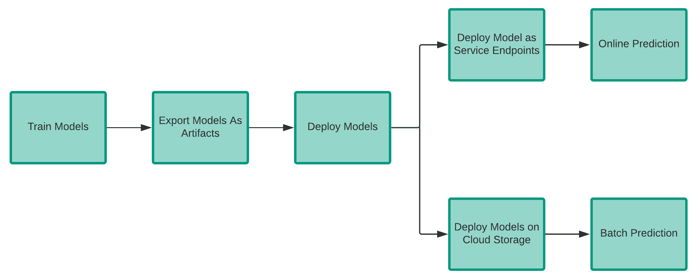

图 9.1：在 GCP 上使用预测的步骤

开始预测过程的第一步是在完成模型训练后将模型导出为工件。 您需要将合格的机器学习模型导出为一个或多个工件，以实现来自 Google Cloud AI 平台的预测。 本章将说明如何在 GCP 上导出合格的 AI 系统预测模型。 根据用于构建模型的机器学习框架的类型，有多种选项可以导出模型。 例如，如果您已使用 TensorFlow 训练机器学习模型，则可以先使用`tf.save_model` API 保存模型，然后再使用 Google Cloud AI Platform 导出模型。

下一步是部署模型。 Google Cloud AI 平台将托管模型，为您提供云预测。 模型部署是用于托管已保存模型文件的方法。 云预测供应商可以处理您的模型基础架构，并可以接受在线和批量预测的请求。 模型部署是预测过程中最重要的方面，必须对其进行详细了解。 在下一部分中，我们将详细介绍模型部署方面。

部署模型后，就可以将模型用于在线预测或批量预测。 如果您想一次为一组观测值生成预测，然后对一定数量或一定百分比的观测值采取行动，则批量预测很有用。 通常，对于这样的请求，您没有低延迟要求。 这些预测然后存储在数据库中，开发人员或最终用户可以访问。 批量推断有时可以使用大数据技术（例如 Spark）来生成预测。

批量推理技术规范比在线推理更简单。 例如，数据科学家可以简单地在执行批量推断的机器上反序列化经过训练的模型，而无需通过**表述性状态转移**（**REST**）API 公开经过训练的模型。 批量推断期间所做的预测也可以在最终利益相关者看到之前进行分析和处理。 下图显示了批量预测的工作原理：


图 9.2：批量预测

在线预测是根据请求实时创建用于机器学习的预测的方法。 这也称为实时或动态推理。 这些预测通常由运行时的单个数据观察生成。 在线推论预测可以在一天中的任何时间产生。 在线推论使我们能够实时使用机器模型。 它开辟了一个可以利用机器学习的全新技术领域。 无需等待数小时或数天的批量预测，我们可以在需要时立即生成预测，并立即提供服务。

在线推论还有助于我们快速分析新数据，而不会产生延迟。 通常，在线推理比批量推理更具挑战性。 由于添加了满足延迟要求所需的工具和系统，因此在线推理往往更加复杂。 与需要 24 小时**服务级别协议**（**SLA**）的系统相比，需要在几毫秒内执行预测的程序要困难得多。 下图显示了在线预测的工作方式：

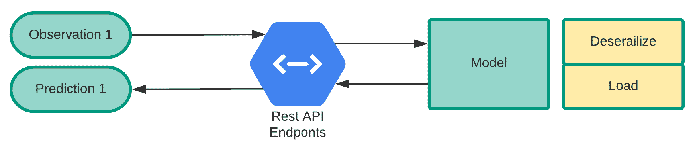

图 9.3：在线预测

如果使用简单模型和少量输入案例，则完成在线预测和针对类似预防请求的批量分析所花费的时间将大大不同。 完成在线应用几乎立即返回的预测可能需要很长时间。 两种预测方法中使用的特定基础结构都有副作用。 提交订单后，AI 平台将分配并初始化批量预测资源。

通常，可以根据要求准备在线预测。 下表总结了在线预测和批量预测之间的区别。

| **批量预测** | **在线预测** |
| --- | --- |
| 适用于具有复杂计算要求的海量大数据量。 | 适用于一次记录，具有低延迟和较简单的模型。 |
| 输出是具有多个预测结果的文件格式。 | 输出一次是一个响应，大多数为 JSON 格式。 |
| 异步请求和响应。 | 同步实时请求和响应。 |
| 它可以使用存储在某些外部存储（例如 Google Cloud 存储桶）中的模型，也可以使用通过 Google Cloud AI 平台进行部署的模型。 | 它只能使用通过 Google Cloud AI 平台部署的模型。 |
| 仅当使用通过 Google Cloud AI 平台部署的模型时，才对某些实例类型进行有限使用。 | 可以使用不同类型的计算实例进行运行预测。 |

# 维护模型及其版本

Google Cloud AI 平台可让您将机器学习解决方案组织为模型和版本。 模型是为您的机器学习解决方案提供的名称，该版本唯一地将部署的模型标识为工件。 例如，您可以创建一个名为`ProductCategoryIdentification`的模型，该模型表示用于对产品进行分类的机器学习解决方案。 在机器学习中，模型是要解决的问题的解决方案。

换句话说，这是预测数据值的方法。 模型是 Google Cloud AI 平台上此 AI /机器学习解决方案的每次迭代的概念容器。 例如，要解决的问题是在给定与先前销售相关的一组数据的情况下，预测房屋的销售价格。 您构建一个称为房屋价格的 AI 应用模型，并尝试通过几种机器学习技术来解决问题。 您可以在每个级别上部署该模型的版本。 该版本可以与其他版本完全不同，但是如果适合您的工作流程，则可以将其布置在同一模型下。

以下屏幕快照表示如何在 Google Cloud AI 平台上创建模型：


图 9.4：创建新模型

如您所见，模型创建用户界面与用户熟悉的 GCP 上的其他服务一致。 我们需要提供区分大小写的模型名称和区域作为强制属性。 建议提供可选描述，以提高模型的可维护性。 当我们针对各种用例构建和部署大量模型时，这一点尤其重要。 以下屏幕快照显示了平台上可通过用户界面或 API 使用的模型的列表：


图 9.5：模型清单

现在，在创建模型之后，您可以创建它的版本。 一个版本表示用来训练模型的机器学习代码和框架。 有时，数据科学家使用不同的框架（例如 XGBoost 或 TensorFlow）来设计针对同一问题的解决方案。 他们创建不同的版本来识别工件。 因此，模型版本或仅一个版本是存储在 AI 平台模型服务中的机器学习解决方案的实例。 您可以通过将经过训练的串行模型（作为保存的模型）传输到服务来制作版本。 您还可以提供自定义代码（在撰写本文时仍处于 beta 阶段），以在制作版本时管理预测。

至少具有一个版本的每个模型都有一个默认版本。 生成第一个版本时，将设置默认值。 如果您请求仅指定模型名称的预测，则 AI 平台将使用该模型的默认版本。

以下屏幕截图显示了如何管理版本：

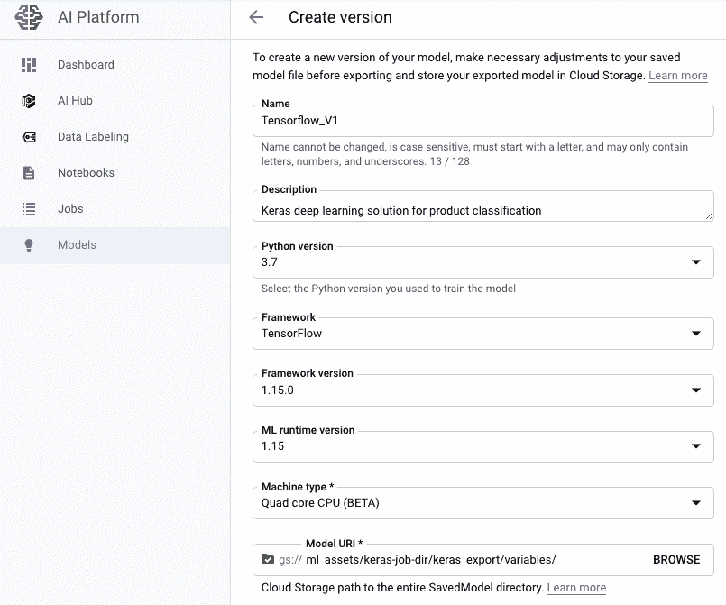

图 9.6：创建模型版本

命名模型和版本的一些规则如下：

*   名称应仅包含字母（大小写混合），数字和下划线。
*   名称应以字母开头。
*   名称最多可包含 128 个字符。
*   该名称在项目中应该是唯一的（如果它是模型名称），在模型中应该是唯一的（如果它是版本名称）。

您还可以添加自定义内置代码所需的自定义包，如以下屏幕截图所示：

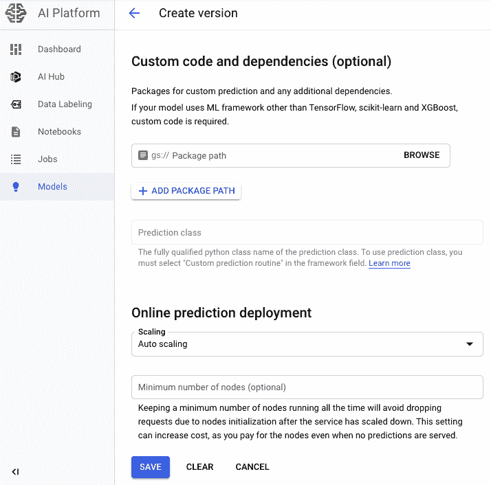

图 9.7：添加自定义代码和包

最终的输出屏幕将类似于以下屏幕截图中的屏幕：

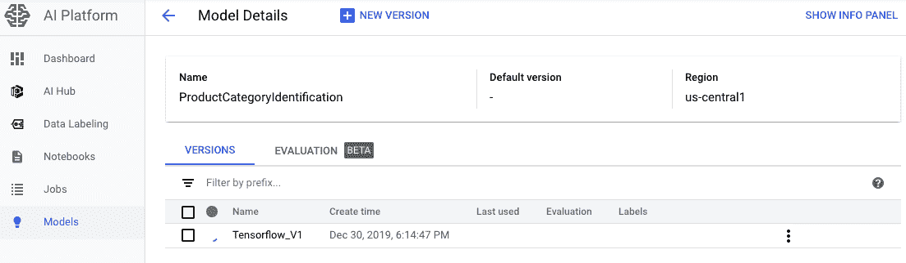

图 9.8：模型版本

优良作法是，模型名称应简洁明了，因为您需要从多个名称列表中的日志或报告中选择它们。 简短的版本名称最适合维护。

# 深入研究已保存的模型

您需要将合格的机器学习模型导出（或保存）为一个或多个对象，以便执行 Google Cloud AI Platform 预测。 本部分介绍了导出用于 AI 系统预测部署的合格模型的各种方法。 根据您使用的机器学习平台的类型，Google Cloud AI 平台为您提供多种导出这些模型的方法。 这些方法特定于用于训练模型的框架。 我们将在本节中介绍 TensorFlow 保存的模型的某些方面。 您必须首先以 TensorFlow SavedModel 的格式将训练有素的模型导出到 Google Cloud AI 平台，以支持预测。

保存的 TensorFlow 模型实际上包含具有权重和计算的 TensorFlow 程序。 它不是指向用于构建模型的代码，而是指向使用派生的数学参数进行预测所需的代码。 TensorFlow 被称为 SavedModel，是在 Google Cloud AI 平台中部署经过训练的模型的推荐格式。 建议导出 TensorFlow SavedModel。

导出训练有素的 SavedModel 模型会将训练图保存为 Google Cloud AI Platform 特定的格式，可使用其元数据将其用于预测并还原。 SavedModel 提供了一种与语言无关的格式，用于保存可恢复且密封的机器学习模型。 它有助于更​​高级别的系统和资源生成，使用和处理 TensorFlow 模型。 以下是 SavedModel 的一些重要功能：

*   可以使用单个变量和资产将单个 SavedModel 添加到多个图。 每个图都连接到一组标签，以便在加载或还原时进行标识。 图以协议缓冲区格式存储。
*   SavedModel 支持 SignatureDef（协议缓冲区消息的技术名称）。 SavedModel 使用此功能为与图存储的签名提供支持。 这些用于机器学习预测工作的图通常包含一堆数据输入和数据输出，称为签名。 签名具有以下结构：

*   `inputs`：用于训练 TensorFlow 模型的相应数据输入存储了字符串映射列表。
*   `outputs`：用于训练 TensorFlow 模型的相应数据输出存储了字符串映射列表。
*   `method_name`：在 TensorFlow 框架中使用的受支持的命名方法。
*   SavedModel 也支持资产。 如果操作依赖于外部初始化文件（例如词汇表），则 SavedModel 将使用资产。 资产被复制到 SavedModel 目录，并在加载特定的元图定义时读取。
*   在生成 SavedModel 之前，它支持清除设备。

如上一节所述，尽管 SavedModels 支持某些重要功能，但不支持其他功能。 这些如下：

*   它不支持隐式版本控制。
*   它本身不支持垃圾收集。 使用这些模型的外部工具可能对此提供支持。
*   它不支持对 TensorFlow SavedModels 的原子写入。

SavedModel 目录具有以下结构：

```py
assets/
assets.extra/
variables/
    variables.data-?????-of-?????
    variables.index
saved_model.pb
```

`saved_model.pb`或`saved_model.pbtxt`文件是协议缓冲区文件，其中包括所有图定义作为 MetaGraphDef 协议缓冲区消息。 `assets`子文件夹包含支持的辅助文件，例如文本词汇文件。 `assets.extra`子文件夹包含可以与模型共存的用户添加的资产，但是不会在运行时加载。 用户或最终开发人员必须自己管理它，因为 TensorFlow 库不管理它。 `variables`子文件夹包含 TensorFlow 库 TensorFlow 保护程序的输出。

# TensorFlow SavedModel 中的 SignatureDef

SignatureDef 确定 TensorFlow 图辅助计算的签名。 SignatureDefs 旨在为定义函数的输入和输出提供通用支持。 TF-Exporter 和 SessionBundle 使用的签名在概念上相似，但是允许用户区分命名签名和默认签名，以便在加载时可以正确检索它们。 对于以前使用 TF-Exporter / SessionBundle 的用户，TF-Exporter 中的签名将由 SavedModel 中的 SignatureDefs 替换。 TensorFlow Serving 提供高级 API 进行演绎。 要允许这些 API，模型应包含一个或多个 SignatureDef，它们描述了用于输入和输出的确切 TensorFlow 节点。 请参阅以下针对每个 API 支持 TensorFlow Serving 的 SignatureDef 示例。

分类 SignatureDefs 支持对 TensorFlow Serving 的分类 API 的标准化调用。 这些指定应该有一个 Tensor 输入，并且有两个可能的 Tensor 输出：类和等级，至少需要存在一个。 以下屏幕快照显示了分类 SignatureDefs 的结构：

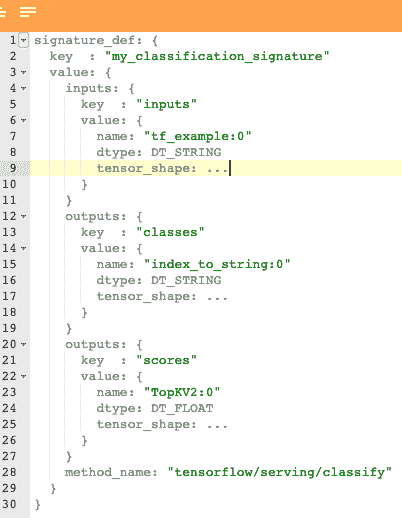

图 9.9：分类消息 API 有效负载

预测 SignatureDefs 支持对 TensorFlow Serving 的 Predict API 的调用。 这样的签名使您可以任意支持多个输入和输出张量。 对于以下示例，我的预测签名具有特定的逻辑张量图像，该图像在您的图`x:0`中映射到实际张量。 预测 SignatureDefs 允许模型到模型的可移植性。 这意味着您可以在不同的 SavedModels 中处理不同的基础 Tensor 名称（例如，您可能具有张量`Z:0`而不是`x:0`的替代模型），因此您的客户将继续在网络上测试新旧模型，而不会改变客户方面。 预测 SignatureDefs 允许您向输出中添加其他张量，您可以显式请求这些张量。 假设除了`scores`下面的输出键之外，您还希望获取堆层用于调试或其他目的。 在这种情况下，只需添加带有池密钥和适当值的附加张量即可。 以下屏幕截图显示了预测 SignatureDefs 的结构：


图 9.10：分类 API 响应

回归 SignatureDefs 支持对 TensorFlow 服务回归 API 的结构化调用，该 API 恰好需要一个张量输入和一个张量输出。 以下屏幕截图显示了回归 SignatureDefs 的结构：

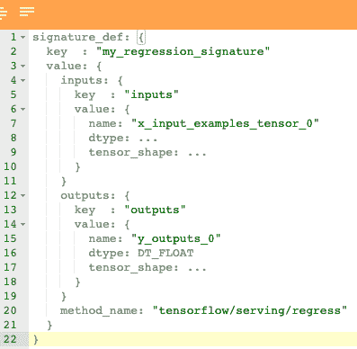

图 9.11：回归 SignatureDef 的结构

# TensorFlow SavedModel API

如下图所示，TensorFlow SavedModel 有两个主要的 API。 一个是 Builder API，另一个是 Loader API。 一旦 Loader API 加载了 SavedModel，它将用于预测：

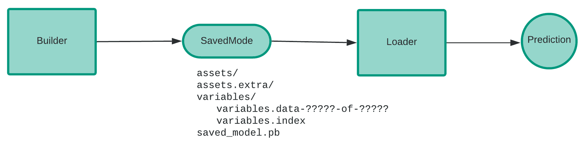

图 9.12：Tensorflow SavedModel API

`SavedModelBuilder`类提供了多个要保存的元图定义，相关变量和属性。 必须使用变量保存第一个元图，以便构建 SavedModel。 以下元图及其图说明易于保存。 当必须保存属性并将其写入或复制到磁盘时，可以在插入元语法定义时提供属性。 如果将多个元图定义连接到同名资产，则仅保留第一个版本。 每个 SavedModel 元图必须用反映元图功能和特定于案例的用户标签的标签标注。

这样的标签通常包括带有其属性（例如，服务或训练）以及可能的硬件特定方面（例如 GPU）的元图。 SavedModel 中的定义元图的标记集与 Loader API 中的标记集完全匹配，是加载程序加载的图元。 如果没有定义元图与列出的标签匹配，将返回错误。 例如，需要 GPU 服务的加载程序可以通过在`tensorflow::LoadSavedModel(...)`中指定标签来仅加载带有`tags=serve`（GPU）标注的元图。 以下屏幕快照中的代码表示如何使用 Builder API：


图 9.13：API Builder 代码

使用 SavedModelBuilder 包，用户可以测试在添加 SavedModel 包元图时是否必须从 NodeDefs 中删除默认评估的属性。 `SavedModelBuilder.add`元语法和变量以及`SavedModelbuilder.add`元图都接受控制此行为的带状默认属性`boolean`标志。 通过将条带默认属性设置为`True`，模型创建者可以删除 NodeDefs 中任何具有值的默认属性。 这有助于确保具有默认值的新属性不会导致较旧的模型使用者无法加载已使用新训练二进制文件重新生成的模型。

加载程序 API 用 C++ 和 Python 实现。 Python 的 SavedModel 加载程序版本包含 SavedModel 加载和还原功能。 加载功能包括用于恢复图形描述和变量的会话，用于定义默认加载元图的标签以及 SavedModel 的位置。 特定元图定义中提供的变量和资产的子集将还原到加载时提供的会话。 加载程序 API 的代表性 Python 代码如下所示：


图 9.14：API 加载程序代码

C++ 的 SavedModel 加载器版本提供了一个 API，用于从路径加载 SavedModel，允许使用`SessionOptions`和`RunOptions`。 与 Python 版本相比，C++ 版本需要加载和定义与图关联的标签。 加载的此版本 SavedModel 称为 SavedModelBundle，其中包括定义元图和加载会话。 Loader API 的代表性 C++ 代码如下所示：


图 9.15：Loader API 代码的 C++ 实现

SavedModel 为构建和加载用于各种应用的 TensorFlow 图提供了灵活性。 SavedModel API 提供了许多 Python 和 C++ 常量，这些常量易于使用，并且在针对最常见的预期应用的工具之间始终保持共享。

# 在 GCP 上部署模型

要在导出机器学习模型后对其进行部署，则必须部署导出的模型。 部署模型的第一步是将它们存储在 Google Cloud Storage 存储桶中。 通常，专用的云存储分区更易于用于 Google Cloud AI 平台的同一项目。 如果您使用其他项目中的存储桶，则需要确保可以访问 Google Cloud AI Platform 服务帐户中的云存储模型。 没有必需的权限，您尝试构建 Google Cloud AI Platform 模型版本的尝试将失败。

让我们开始研究如何创建 Google Cloud Storage 存储桶。 可以使用现有存储桶，但它必须位于您计划在 Google Cloud AI 平台上工作的同一区域。 以下代码可以帮助您创建新的存储桶：

```py
BUCKET_NAME="google_cloud_ai_platform_your_bucket_name"
PROJECT_ID=$(gcloud config list project --format "value(core.project)")
BUCKET_NAME=${PROJECT_ID}-mlengine
echo $BUCKET_NAME
REGION=us-east2
gsutil mb -l $REGION gs://$BUCKET_NAME
```

前面的代码指定您的新存储桶名称。 它定义了创建存储桶所需的项目 ID。 然后，您指定要在其中创建存储桶的区域的名称。 最后，使用`gsutil` **命令行界面**（**CLI**）创建存储桶。

[可以在以下链接中找到对`gsutil`工具的完整引用](https://cloud.google.com/storage/docs/gsutil)。

以下屏幕截图提供了有关如何使用控制台 UI 创建存储桶的指南：


图 9.16：GCP 控制台–存储和浏览

从控制台菜单中，我们需要导航到“存储”部分，然后单击“浏览器”部分以找到存储在存储桶中的所有数据文件。 如果用户帐户有权创建多区域存储桶，则使用此控制台 UI 可以在一处看到跨区域存储桶的所有数据文件，如以下屏幕快照所示：


图 9.17：存储桶列表

GCP 控制台提供了一个轻松的界面来创建新的存储桶。 这是我们单击`CREATE BUCKET`按钮时打开的初始页面的屏幕截图：

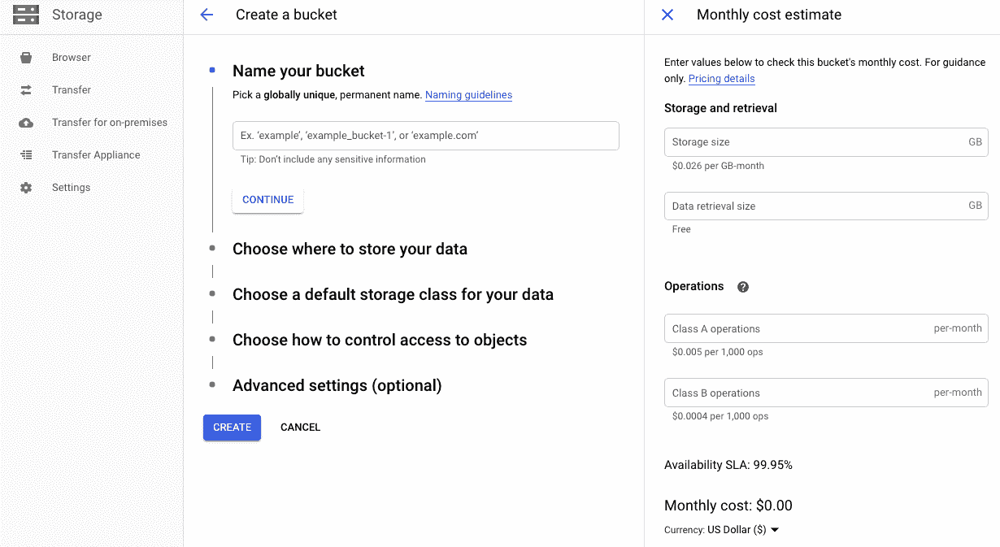

图 9.18：创建新存储桶

我们需要为该存储桶提供一个在整个项目中唯一的名称。 此外，我们需要提供区域和默认存储类，并在 GCP 中创建存储桶时定义访问级别（可以访问存储桶的用户组和用户）。 提供详细信息后，GCP 提供了一个简单的界面来查看每月成本估计，以获取并保存正在创建的存储桶中的数据。 这有助于在创建存储桶时根据用例和应用的上下文选择适当的选项。 如果配置不正确，GCP 可以轻松避免可能导致高成本的错误。

# 将已保存的模型上传到 Google Cloud Storage 存储桶

下一步是将模型上传到 Google Cloud Storage 存储桶。 如果您正在使用 Tensorflow SavedModels，则可以使用以下代码上传模型：

```py
SAVED_MODEL_DIR=$(ls ./your-export-dir-base | tail -1)
gsutil cp -r $SAVED_MODEL_DIR gs://your-bucket
```

如果您从`tf.keras`或 TensorFlow 估计器导出 SavedModel，则所选导出目录的子目录将另存为带有时间戳的代码目录/ `123201202301`。 本示例说明如何使用当前时间戳更新目录。 如果您以其他方式构建了 SavedModel，则可以将其放置在本地文件系统上的其他位置。

如果您已使用 scikit-learn 或 XGBoost 导出了模型，则可以使用以下代码以`.joblib`，`*.pk1`或`*.bst`格式导出模型：

```py
gsutil cp ./model.joblib gs://your-bucket/model.joblib

gsutil cp ./model.pkl gs://your-bucket/model.pkl

gsutil cp ./model.bst gs://your-bucket/model.bst
```

如果您具有自定义的预测例程（测试版），则还可以将一些其他示例对象上载到应用目录。 如果您使用的是旧版计算机（MLS1）类型，则配置目录的最小文件大小必须为 500 MB 或更小；如果使用的是 Compute Engine（N1）类型的计算机（beta），则配置目录的最小文件大小必须为 2 GB 或更小。 在构建模式的后续迭代时，请将其存储在云存储桶中的单独目录中。 如果您部署带有自定义代码或自定义预测例程的 Science Learning 管道，则还必须上传包含自定义代码的源交付包。 您可以将以下代码用于相同的代码：

```py
gsutil cp dist/google_cloud_ai_custom_code-1.0.tar.gz gs://ai-ml-bucket/google_cloud_ai_custom_code-1.0.tar.gz
```

# 测试机器学习模型

下一步是测试机器学习模型。 机器学习领域提供了一些工具，可以根据数据自动做出决策，以实现某些目标或要求。 手动指定的解决方案会遇到一些问题。 机器学习很重要，因为它为复杂的问题提供了解决方案。 与手动指定的解决方案相比，机器学习可为您提供自动，更快，更精确的问题解决方案。 机器学习应用并非 100% 准确，并且永远不会部分正确。 关于测试人员为何不能忽略对计算机教育和深度学习的思考，有多种解释。 主要原因是这些程序从用于构造算法的数据中学习。 由于机器学习应用几乎每天都在处理人类活动，因此错误可能导致严重的损失。 代替这些事实，机器学习模型测试非常重要。

测试机器学习解决方案涉及多个方面。 这样的方面之一是确保用于训练的数据的质量。 您对训练的测试应确保没有可以歪曲结果的数据集。 训练数据的**质量保证**（**QA**）创建检查协议，以验证用于训练的数据是否已被消毒。 还必须执行检查以确定是否意外或故意发生了数据中毒攻击。 与数据统计有关的测试（中位数，平均值，样式等）描述了高级数据和关系。 您应该使用脚本创建测试以检查统计信息和相关性。 这些测试应定期进行。 必须定期跟踪列出的参数，并在每次发布之前进行验证。

您还应该针对机器学习模型训练中使用的功能执行测试。 多次，一个或多个功能是冗余/不相关的，实际上会影响预测错误率。 需要采用质量保证/测试程序来主动确定设计技术，例如降低尺寸和选择特征。

最后但并非最不重要的一点是，您还应该确保模型训练算法的质量。 不断发展的数据集可能会由于数据中毒攻击而导致预览错误级别增加。 随着机器学习模型的重新训练，增加的预测错误率意味着机器学习模型将被重新估值，以检测新算法，而现有算法的准确率更高。 重新训练所有模型，并使用新的数据集定期跟踪模型输出。 如果另一个模型比现有模型更可靠或更成功，则会引发缺陷。

您可以在 Google Cloud AI Platform 预测中使用本地`predict`命令检查模型的预测方式，然后再使用它。 该命令使用本地依赖性来预测并以与执行在线预测后的 Google Cloud AI 平台相同的格式返回结果。 测试本地预测将使您能够在计算在线预测请求成本之前发现错误。 对于`--model-dir`语句，您可以定义一个目录，并将您的机器学习模型导出到本地计算机或云存储中。 另外，为`--framework`参数指定`tensorflow`，`sklearn`或`xgboost`。 您不能将本地预测命令 Google Cloud AI Platform 与自定义预测例程一起使用。 以下屏幕截图显示了用于本地模型测试的代码：

```py
gcloud ai-platform local predict --model-dir local-or-cloud-storage-path-to-model-directory/ \
  --json-instances local-path-to-prediction-input.json \
  --framework name-of-framework
```

# 部署模型及其版本

Google Cloud AI 平台使用模型和版本资源来组织您训练有素的模型。 AI 平台是学习机模型的容器。 在 AI 平台中，创建数据库资源以部署模型，构建模型版本，然后将模型版本连接到存储在云存储中的模型文件。 您可以使用`gcloud`控制台为您的产品版本构建默认工具，并在不附带括号的情况下填写您的首选模型名称，如下所示：

```py
gcloud ai-platform models create "[YOUR-MODEL-NAME]"
```

您还可以使用 REST API 创建模型资源。 以下是相同的步骤：

1.  通过将模型对象插入请求主体来格式化规范。 您至少必须给模型起一个名字。 如下填写您的姓名（不带括号）：

```py
{"name": "[YOUR-MODEL-NAME]"}
```

2.  将以下文章放入您的 REST API 中，并用正确的值替换[括号中的值]，如下所示：

```py
POST https://ml.googleapis.com/v1/projects/[YOUR-PROJECT-ID]/models/

curl -X POST -H "Content-Type: application/json" \
  -d '{"name": "[YOUR-MODEL-NAME]"}' \
  -H "Authorization: Bearer `gcloud auth print-access-token`" \
  "https://ml.googleapis.com/v1/projects/[YOUR-PROJECT-ID]/models"
```

前面命令的示例 JSON 输出将类似于以下屏幕快照所示：


图 9.19：REST API 调用的 JSON 输出

创建模型资源后，即可创建模型版本。 我们将在这里看到如何做到这一点。 使用 Google Cloud API，您可以创建版本，如以下屏幕截图所示：


图 9.20：新创建的模型和模型列表页面

如前面的屏幕快照所示，选择模型工具的名称以在“模型”选项卡上构建您的版本。 这将带您浏览产品页面。 在“模型详细信息”页面的顶部，单击“新版本”按钮。 这将带您到版本开发页面，如以下屏幕截图所示：

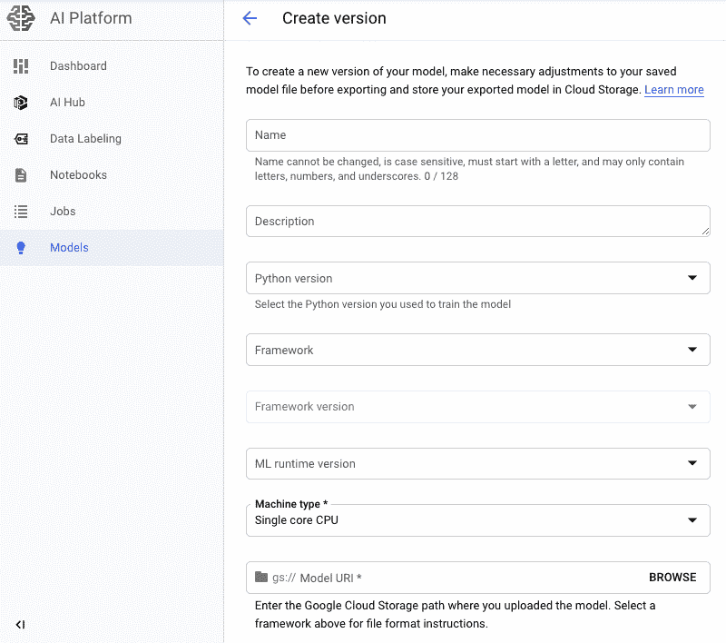

图 9.21：新模型版本开发屏幕

创建模型版本时要注意的一件事是您可以选择手动和自动缩放的缩放选项。 如果选择“自动缩放”，则会显示可选的最小字段节点数。 您可以输入最少的节点数，以在服务减少时继续运行。 默认区域为`0`。 如果选择“手动缩放”，则需要始终输入要运行的节点数。 请参考以下屏幕截图：


图 9.22：手动缩放配置

需要仔细选择“手动缩放”选项。 无论群集上的负载如何，GCP 都会提供已配置的节点数（在手动扩展的情况下，这是必填字段）。 此操作适用于关键任务用例，这些用例需要频繁地在波动的级别上访问模型，并且不提供 Google Cloud AI Platform 在合理的时间内配置所需的节点。 在这种情况下，建议根据平均流量水平提供最少数量的节点。 即使没有发送任何模型访问请求，预配节点也将产生成本，如以下屏幕截图所示：

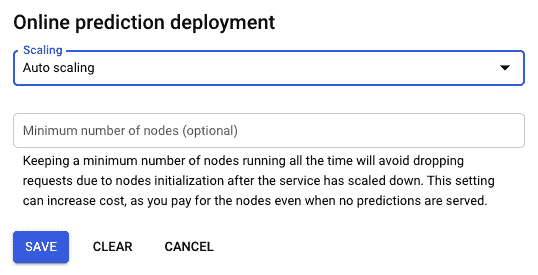

图 9.23：自动缩放比例配置

实现此目的的另一种方法是使用`gcloud` CLI。 如果使用`gcloud`，则首先设置环境变量以保存云存储目录路径，模型名称，版本名称和框架选择。 创建`gcloud`工具版本时，可以在框架名称中使用大写字母（例如，`_SCIKIT-LEARN`）添加下划线，也可以使用小写字母（例如，`_scikit-learn`）添加连字符。 所有方法导致相同的行为。 以下代码块显示了如何在脚本中设置相关的环境变量：

```py
MODEL_DIR="gs://your_bucket_name/"
VERSION_NAME="[YOUR-VERSION-NAME]"
MODEL_NAME="[YOUR-MODEL-NAME]"
FRAMEWORK="[YOUR-FRAMEWORK_NAME]"
```

在具有定制代码的 scikit-learn 管道的定制代码 tarball 的路径上设置一个附加变量，如下所示：

```py
MODEL_DIR="gs://your_bucket_name/"
VERSION_NAME="[YOUR-VERSION-NAME]"
MODEL_NAME="[YOUR-MODEL-NAME]"
FRAMEWORK="scikit-learn"
CUSTOM_CODE_PATH="gs://your_bucket_name/ai_platform_custom_code-0.1.tar.gz"
```

要执行自定义预测例程，请忽略`FRAMEWORK`变量，然后定义自定义代码 tarball 的路径以及预测变量类的名称。 检查以下代码：

```py
MODEL_DIR="gs://your_bucket_name/"
VERSION_NAME="[YOUR-VERSION-NAME]"
MODEL_NAME="[YOUR-MODEL-NAME]"
CUSTOM_CODE_PATH="gs://your_bucket_name/ai_platform_custom_code-0.1.tar.gz"
PREDICTOR_CLASS="[MODULE_NAME].[CLASS_NAME]"
```

一旦设置了相关的环境变量，就可以使用 CLI 通过以下代码创建版本：

```py
gcloud ai-platform versions create $VERSION_NAME \
  --model $MODEL_NAME \
  --origin $MODEL_DIR \
  --runtime-version=1.15 \
  --framework $FRAMEWORK \
  --python-version=3.7
```

将`gcloud` beta 组件用于 scikit-learn 管道（beta），并确保您设置了`--package-uris-flag`，如下所示：

```py
gcloud components install beta

gcloud beta ai-platform versions create $VERSION_NAME \
  --model $MODEL_NAME \
  --origin $MODEL_DIR \
  --runtime-version=1.15 \
  --framework $FRAMEWORK \
  --python-version=3.7
  --package-uris=$CUSTOM_CODE_PATH
```

将`gcloud` beta 部分用于自定义预测例程，删除`--frame`标志，并设置`--package-uris`和`--prediction-class`标志，如下所示：

```py
gcloud components install beta

gcloud beta ai-platform versions create $VERSION_NAME \
  --model $MODEL_NAME \
  --origin $MODEL_DIR \
  --runtime-version=1.15 \
  --python-version=3.7
  --package-uris=$CUSTOM_CODE_PATH
  --prediction-class=$PREDICTOR_CLASS
```

您可以检查模型版本，如下所示：

```py
gcloud ai-platform versions describe $VERSION_NAME \
  --model $MODEL_NAME

/*****Output*****/
createTime: '2018-02-28T16:30:45Z'
deploymentUri: gs://your_bucket_name
framework: [YOUR-FRAMEWORK-NAME]
machineType: mls1-c1-m2
name: projects/[YOUR-PROJECT-ID]/models/[YOUR-MODEL-NAME]/versions/[YOUR-VERSION-NAME]
pythonVersion: '3.7'
runtimeVersion: '1.15'
state: READY
```

例如，具有 Cloud ML 服务智能体**身份和访问管理**（**IAM**）功能的模型版本具有 Google 托管服务帐户的权限。 对于大多数情况，此默认服务帐户就足够了。 但是，如果您正在使用自定义预测例程，并且需要在模型版本中具有一组不同的权限，则可以添加另一个服务帐户以供使用。 例如，如果您的模型版本需要从特定的 Google Cloud 项目访问云存储存储桶，则可以定义具有该存储桶读取权限的服务帐户。 以下代码块显示了用于创建服务帐户的示例 Python 代码：

```py
import os

from google.oauth2 import service_account
import googleapiclient.discovery

def create_service_account(project_id, name, display_name):
    """Creates a service account."""

    credentials = service_account.Credentials.from_service_account_file(
        filename=os.environ['GOOGLE_APPLICATION_CREDENTIALS'],
        scopes=['https://www.googleapis.com/auth/cloud-platform'])

    service = googleapiclient.discovery.build(
        'iam', 'v1', credentials=credentials)

    my_service_account = service.projects().serviceAccounts().create(
        name='projects/' + project_id,
        body={
            'accountId': name,
            'serviceAccount': {
                'displayName': display_name
            }
        }).execute()

    print('Created service account: ' + my_service_account['email'])
    return my_service_account
```

部署模型版本的用户应为先前创建的服务帐户使用服务帐户令牌创建者角色。 在`serviceAccount`区域中指定模型版本的服务帐户名称。 使用`gcloud`方法时，可以使用`--service-account`标志，如以下代码示例所示：

```py
gcloud components install beta

gcloud beta ai-platform versions create your-version-name \
  --service-account your-service-account-name@your-project-id.iam.gserviceaccount.com

```

# 模型训练实例

在本节中，我们将研究如何使用 Google Cloud 平台训练模型以进行预测。 重点是如何使用 Google Cloud 平台训练模型以及其中涉及的步骤。 整个训练代码均来自 Google Cloud 示例示例。 [请参阅以下链接](https://github.com/GoogleCloudPlatform/cloudml-samples/archive/master.zip)以获取训练代码。 您还可以从 Google Cloud 公共存储（`gs://cloud-samples-data/ai-platform/census/data/*`）下载数据：

1.  您可以创建数据目录，然后使用`gsutil` copy 命令将数据从 Google Cloud 存储桶复制到本地目录。 这是必需的，因为您必须首先在本地训练和测试模型。 以下代码将执行相同的操作：

```py
mkdir data
gsutil -m cp gs://cloud-samples-data/ai-platform/census/data/* data/
```

`data`文件夹具有以下屏幕截图所示的结构：


图 9.24：测试和训练数据文件

因此，假设您已经拥有训练代码和训练数据，并且已经设置了 Google Cloud SDK 的所有相关 Python 环境，我们现在可以研究使用 Google Cloud AI 平台训练模型的步骤。 您首先要从本地训练工作开始。

2.  以下代码设置了`MODEL_DIR`环境变量，然后使用 Google Cloud AI Platform 命令在本地训练模型，如下所示：

```py
MODEL_DIR=output
rm -rf $MODEL_DIR/*
gcloud ai-platform local train \
    --module-name trainer.task \
    --package-path trainer/ \
    --job-dir $MODEL_DIR \
    -- \
    --train-files $TRAIN_DATA \
    --eval-files $EVAL_DATA \
    --train-steps 1000 \
    --eval-steps 100
```

前面代码的输出看起来像下面的屏幕快照所示：

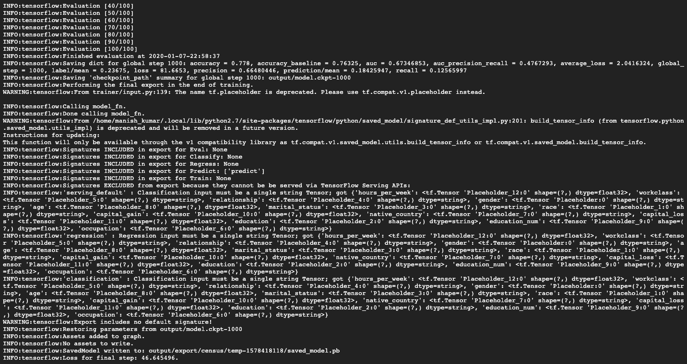

图 9.25：模型训练输出

输出目录将包含以下内容：


图 9.26：输出目录内容

要显示局部模型训练测试的结果，可以使用 TensorBoard 可视化工具。 使用 TensorBoard，您可以查看 TensorFlow 映射，编辑有关模型运行方式的定量数据以及显示其他数据，例如遍历图表的图片。 作为 TensorFlow 安装的一部分，可以使用 TensorBoard。

3.  运行以下命令以启动`tensorboard`：

```py
tensorboard --logdir=$MODEL_DIR --port=8080
```

前面的命令的输出看起来像下面的屏幕快照：


图 9.27：TensorBoard 命令输出

以下屏幕快照提供了 TensorBoard 外观的概览：

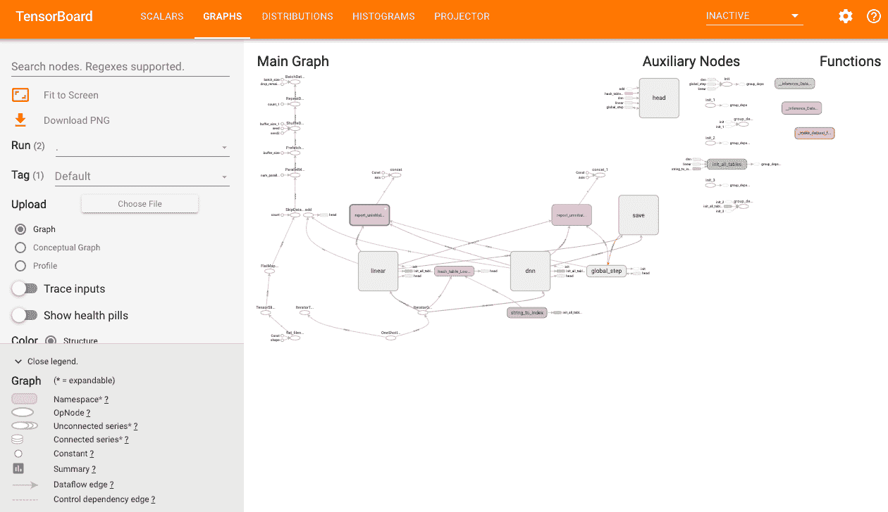

图 9.28：TensorBoard 显示模型训练图

单击屏幕左侧菜单中的“下载 PNG”选项，以获取前面图形的更清晰图像。

如您在此屏幕截图中所见，模型训练经历了各个阶段，TensorFlow 通过有效的日志记录来创建沿袭。 通过**图形用户界面**（**GUI**）可以轻松跟踪此沿袭。 在训练阶段处理输入值并产生中间结果时，可以跟踪它们。 可以通过将适当的值传递给运行时，基于训练图来调整模型：

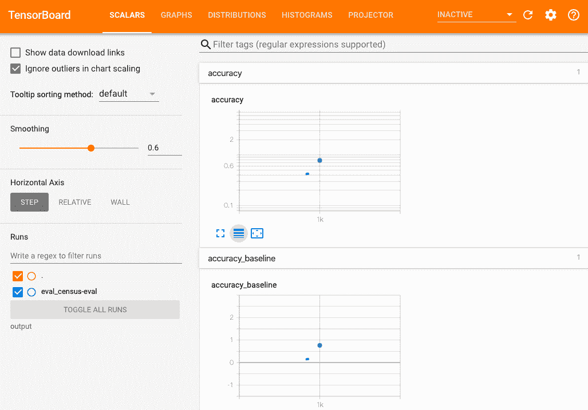

图 9.29：TensorBoard 中的模型状态

4.  现在，在进行本地测试之后，您需要在分布式本地模式下测试模型训练，以确保可以在分布式模式下训练模型，如果使用 Google Cloud AI Platform 训练模型，情况就是如此。 以下代码可用于相同的代码：

```py
MODEL_DIR=output-dist
rm -rf $MODEL_DIR/*
gcloud ai-platform local train \
    --module-name trainer.task \
    --package-path trainer/ \
    --job-dir $MODEL_DIR \
    --distributed \
    -- \
    --train-files $TRAIN_DATA \
    --eval-files $EVAL_DATA \
    --train-steps 1000 \
    --eval-steps 100
```

输出如下图所示：


图 9.30：本地训练模型输出

输出模型目录具有以下内容。 检查点和日志文件夹启用 TensorBoard 上的图形视图，如以下屏幕快照所示：


图 9.31：模型训练输出目录

5.  前面的步骤是关于运行模型训练作业以进行本地测试的。 此后，对于实际的生产级部署，您需要在云上运行模型训练。 为此，您必须先创建存储桶（或者也可以使用现有的存储桶）。 以下代码将为您创建存储桶：

```py
BUCKET_NAME_PREFIX="ai_ml_book"
PROJECT_ID=$(gcloud config list project --format "value(core.project)")
BUCKET_NAME=${PROJECT_ID}-${BUCKET_NAME_PREFIX}
echo $BUCKET_NAME
REGION=us-central1
gsutil mb -l $REGION gs://$BUCKET_NAME
```

前面的代码的输出如下所示：


图 9.32：桶创建输出

6.  创建存储桶后，您可以使用以下代码将工件上传到存储桶。 此代码还设置了一些变量以更正值，以便可以运行下一组命令：

```py
gsutil cp -r data gs://$BUCKET_NAME/data
TRAIN_DATA=gs://$BUCKET_NAME/data/adult.data.csv
EVAL_DATA=gs://$BUCKET_NAME/data/adult.test.csv
gsutil cp ../test.json gs://$BUCKET_NAME/data/test.json
TEST_JSON=gs://$BUCKET_NAME/data/test.json
```

输出如下所示：

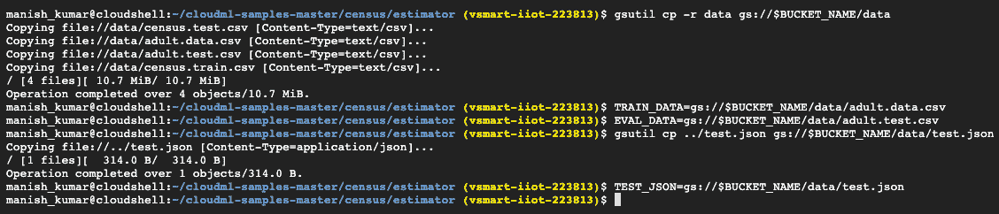

图 9.33：存储桶上传输出

7.  现在，您可以通过批准的单人和分布式模式练习，在云中工作。 您将首先申请一份实例的训练工作。 使用默认的 BASIC 规模计算层来执行单个实例的训练工作。 最初的作业请求可能需要几分钟才能开始，但是之后作业将运行得更快。 在改进和验证准备工作时，它可以帮助您轻松进行迭代。 以下是相同的代码：

```py
JOB_NAME=ai_book_model_single_1
OUTPUT_PATH=gs://$BUCKET_NAME/$JOB_NAME
gcloud ai-platform jobs submit training $JOB_NAME \
    --job-dir $OUTPUT_PATH \
    --runtime-version 1.14 \
    --module-name trainer.task \
    --package-path trainer/ \
    --region $REGION \
    -- \
    --train-files $TRAIN_DATA \
    --eval-files $EVAL_DATA \
    --train-steps 1000 \
    --eval-steps 100 \
    --verbosity DEBUG
```

前面命令的输出如下所示：

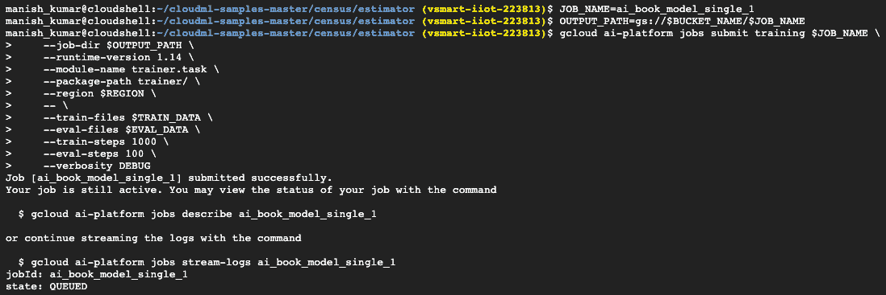

图 9.34：模型训练输出

8.  运行`gcloud ai-platform jobs describe ai_book_model_single_1`命令后，将看到以下输出：


图 9.35：模型训练输出（2）

您也可以从 Google Cloud 控制台用户界面查看作业状态和日志。 以下屏幕截图表示相同：

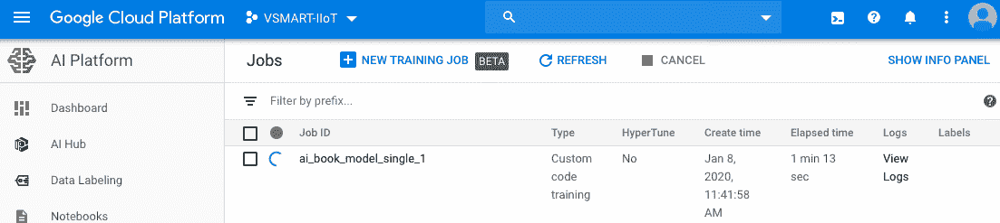

图 9.36：Google Cloud 控制台上的模型训练状态

9.  在进行模型训练时，我们会在模型列表用户界面中看到一个进度栏。 可以实时访问日志，以了解模型训练进度以及了解中间结果。 此级别的日志记录在模型调整中很有用，可以在以下屏幕截图中看到：


图 9.37：模型训练日志

存储在 Google Cloud 存储桶中的输出仅看起来像我们本地训练的输出模型，如以下屏幕截图所示：

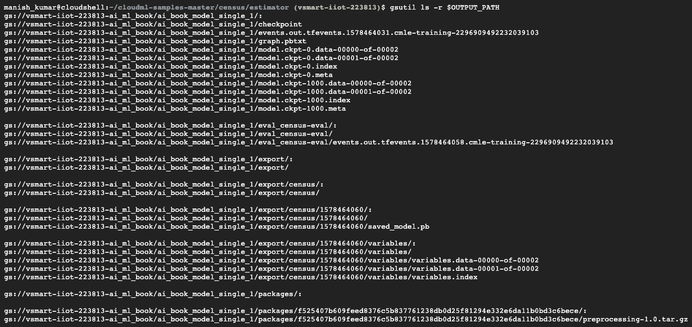

图 9.38：Google Cloud 存储桶上的输出

10.  通过启动 TensorBoard，可以检查您的训练工作的行为，并指向锻炼期间（锻炼期间和之后）生成的摘要日志。 由于摘要是由训练程序写入云存储位置的，因此 TensorBoard 可以从中读取内容，而无需手动复制事件文件。 以下屏幕快照是相同的：

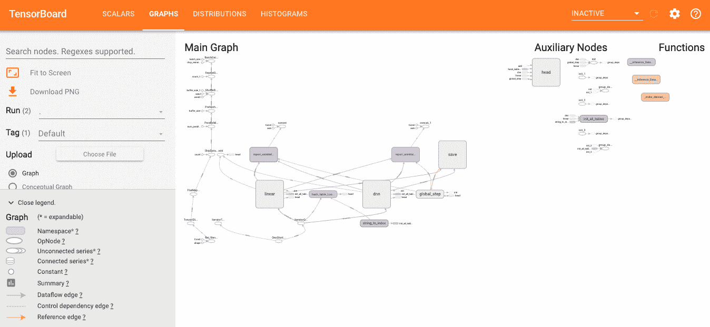

图 9.39：TensorBoard 上的模型训练图

单击屏幕左侧菜单中的“下载 PNG”选项，以获取前面图形的更清晰图像。

11.  您应该以分布式模式配置训练工作，以便在执行训练工作时利用 Google 的灵活平台。 要将模型作为分布式流程在 AI 平台上运行，则无需更改代码。 将`--scale-tier`设置为高于基本级别的任何层以执行分布式作业。 以下是相同的示例代码：

```py
JOB_NAME=census_dist_1
OUTPUT_PATH=gs://$BUCKET_NAME/$JOB_NAME
gcloud ai-platform jobs submit training $JOB_NAME \
    --job-dir $OUTPUT_PATH \
    --runtime-version 1.14 \
    --module-name trainer.task \
    --package-path trainer/ \
    --region $REGION \
    --scale-tier STANDARD_1 \
    -- \
    --train-files $TRAIN_DATA \
    --eval-files $EVAL_DATA \
    --train-steps 1000 \
    --verbosity DEBUG
```

以下屏幕快照显示了上述代码的输出：

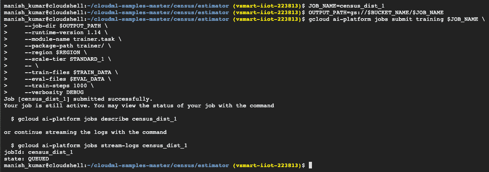

图 9.40：带有刻度的训练作业输出

12.  您可以使用`gcloud ai-platform jobs stream-logs $JOB_NAME`命令流式传输日志。 以下屏幕快照表示流日志的输出：

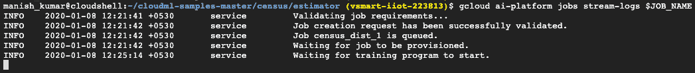

图 9.41：流作业

13.  模型训练的最后一步是部署模型。 以下代码将使用一个版本来部署模型：

```py
MODEL_NAME=census
    gcloud ai-platform models create $MODEL_NAME --regions=$REGION
    OUTPUT_PATH=gs://$BUCKET_NAME/census_dist_1
    gsutil ls -r $OUTPUT_PATH/export
    MODEL_BINARIES=gs://$BUCKET_NAME/census_dist_1/export/census/1578466652
    gcloud ai-platform versions create v1 \
    --model $MODEL_NAME \
    --origin $MODEL_BINARIES \
    --runtime-version 1.14
```

以下是上述命令的输出：


图 9.42：模型部署输出

您还可以在 Google Cloud 控制台用户界面上查看已部署的模型版本，如以下屏幕截图所示：

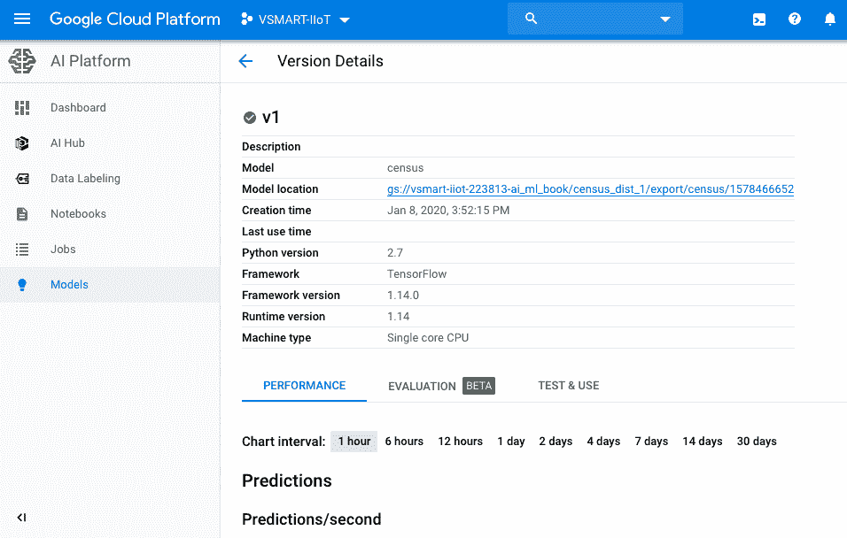

图 9.43：从 Google Cloud 控制台部署的模型视图

在下一部分中，我们将研究如何使用已部署的人口普查模型进行在线和批量预测。

# 使用服务端点执行预测

通常，您已经在机器学习模型及其版本上训练并部署了 Google Cloud API 平台之后，才执行此步骤。 下图显示了在线预测如何在 Google Cloud AI 平台中工作：


图 9.44：在线预测工作流程

您可以使用部署在 Google Cloud Storage 存储桶上的模型作为服务端点公开，并且这些服务端点可以由使用 REST API 或`gcloud`工具本身的某些应用使用。 `gcloud`工具用于快速测试在线预测。 在实际的生产案例中，您可以使用用 Python 编写的脚本或 cURL 工具来使用 Rest API，从而在已部署的模型版本上公开预测功能。

以下代码显示了如何使用`gcloud`工具进行在线预测。 JSON 代码示例如下所示：

```py
{"values": [1, 2, 3, 4], "key": 1}
{"values": [5, 6, 7, 8], "key": 2}
```

代码如下所示：

```py
MODEL_NAME="census"
INPUT_DATA_FILE="instances.json"
VERSION_NAME="v1"
gcloud ai-platform predict --model $MODEL_NAME \
                   --version $VERSION_NAME \
                   --json-instances $INPUT_DATA_FILE
```

使用此代码，我们能够使用已部署的模型并根据训练数据预测结果。

# 总结

在本章中，我们介绍了 AI 的基本方面，使我们能够根据历史数据预测结果。 我们了解了预测分析的一般流程，并以 GCP 为例对流程进行了深入研究。 借助命令行和 Google Cloud 控制台上的用户界面工具，可以简化 GCP 上的模型构建（训练，评估）和部署过程。 我们还研究了如何对模型进行版本控制以及如何使用适当的模型进行预测。 预测服务也以 API 调用的形式公开，可以以与语言无关的方式进行调用。

在本书的最后一章中，我们将利用到目前为止研究的所有组件来构建 AI 应用。