# 第 4 节：构建应用程序和即将发布的功能

本节总结了从前几章获得的所有知识。 它由一章组成。 我们将使用 **Google Cloud Platform** （**GCP**）上的各种组件来构建端到端的 AI 应用程序。 本章提供了使用 GCP 快速构建生产就绪应用程序的一般过程。

本节包括以下章节：

*   “第 10 章”，*构建 AI 应用程序*

# 构建一个 AI 应用程序

在本书的最后九章中，我们在 **Google Cloud Platform** （**GCP**）的背景下研究了人工智能的基本构成要素。

在本章中，我们将概述在本书中学习的各种工具和技术，并将其应用于构建示例 AI 应用程序。 我们还将介绍 GCP 即将推出的功能，这些功能将通过使 AI 和 ML 民主化来进一步增强其构建智能应用程序的能力。

本章将涵盖以下主题：

*   开发 AI 应用程序的分步方法
*   用例概述– **自动发票处理**（**AIP**）
*   即将推出的功能

# 开发 AI 应用程序的分步方法

平台可通过补充人类智能来促进解决问题的现实应用程序和用例。 随着人工智能成为主流并被日常应用程序和软件平台所采用，开发人员社区以及大型组织必须利用 GCP 等平台以最少的时间和人力资源投资来构建功能强大的应用程序。 GCP 的 AI 还使我们在创建生产应用程序之前可以轻松进行各种实验和检验假设。 数据管理和 ML 作为 GCP 上的服务提供。 这样就无需管理基础架构和软件。 开发团队可以专注于解决实际问题，而无需担心平台和基础架构管理。 为此，开发人员社区可以使用 GCP 提供的复杂工具包，而无需前期投资。 我们将看到应用程序周转时间和易于开发方面的重大变化。

这促进了尖端的创新，并解决了一些现实世界中无法解决的问题。

通常，AI 应用程序的开发遵循循序渐进的方法。 总体上讲，AI 应用程序的开发和操作分为六个阶段，如下图所示。 在本节中，我们将研究这些通用阶段并学习基本的机器学习理论，在随后的部分中，我们将通过示例进行学习：

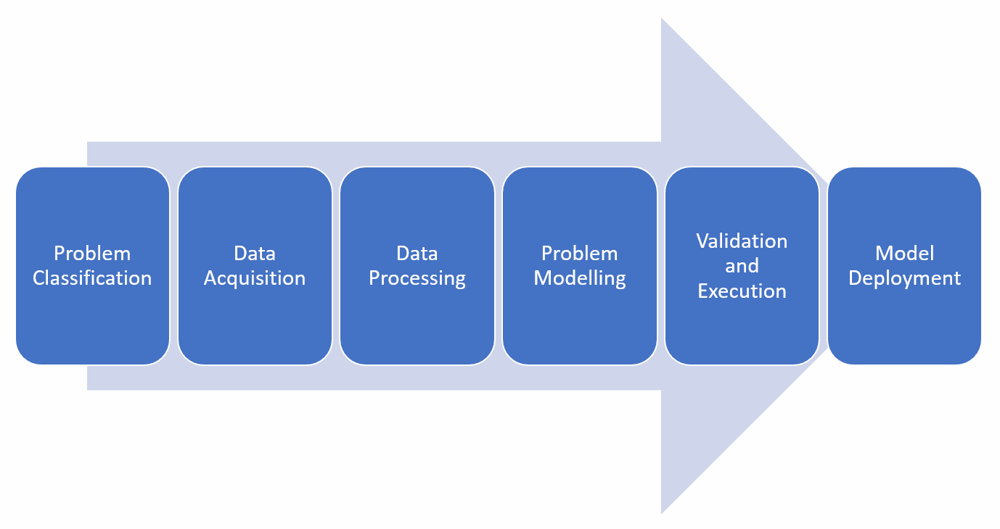

图 10.1：AI 应用程序开发阶段

# 问题分类

根据投入的特征和预期成果，人工​​智能可以解决的问题可以大致分为以下几类。

# 分类

分类问题通常涉及将结果分类为预定义的类别。 结果称为因变量。 结果取决于一组输入变量或功能。 输入变量或特征称为自变量。 分类问题训练模型以数学方式将自变量的组合映射到因变量。 输出是集合中的值之一。 例如，当通过分类算法时，水果图像被分类为苹果或橙子。 通常，算法规定图像属于特定类别的概率。 概率最大的类别是基于训练数据的分类。

# 回归

与分类问题不同，回归问题期望连续的结果而不是离散的类。 例如，预测特定人口区域的降雨的模型可以基于各种输入参数来预测以毫米为单位的降雨。

# 聚类

聚类问题通常通过无监督的学习方法来解决。 根据相似度指标，将可变空间分为多个聚类。 这是根据数据点与组输入质心的距离进行数学建模的。 例如，可以通过聚类算法将生物细胞聚类为感染或正常类别。

# 优化

优化问题用于提高特定计算活动的性能。 例如，如果我们需要压缩文件，则可以尝试各种算法，然后根据数据类型选择最佳算法。 优化问题的另一个示例是根据实时交通和其他路况为车辆找到最佳路线。 该算法可帮助优化路线，以实现从 A 点到 B 点的最短行驶时间。

# 异常检测

异常检测是一种类型的问题，其中需要检测数据中的极端条件。 网络安全是异常检测的一个非常突出的用例。 生成了大量的网络日志，如果没有智能采样和智能算法，就不可能检测到异常值。

# 排行

排名问题涉及我们需要根据特定用例按堆叠排名对结果空间进行排序。 控制排名的规则充当输入变量，而顺序排名则作为输出。 这些问题可以通过有监督的学习方法和无监督的学习方法来解决。 这些排名算法的典型用法是通过推荐系统。 在零售的情况下，产品会根据各种用户偏好按相关性进行排名，并呈现给用户。

# 资料准备

数据准备问题是期望算法从历史模式生成数据的地方。 一个示例用例是基于神经网络和大量面部图像创建人脸，这些面部图像被馈送到算法中（使用生成对抗网络）以生成新图像。 该算法可以创建用于测试和实验目的的真实数据。

# 数据采集

AI 应用程序获得的用于训练基础模型的数据越多，性能就会越好。 数据的质量和数量对于 AI 应用程序真正补充人类智能至关重要。 这意味着从各种来源获取数据是该过程中的重要一步。 通常以批处理或接近实时的方式获取数据。

通常，历史数据在批处理模式下用于训练和调整模型，而实时数据在流模式下用于进一步处理。 在某些用例中，期望 AI 应用程序的事件时间与操作时间之间的时间间隔最小。 在这种情况下，我们需要考虑使用高端计算基础架构，以确保数据采集和处理中的亚毫秒级延迟。

# 数据处理

随着更多设备连接到互联网，我们正在生成更多数据。 这称为大数据，并导致数据量增长。 必须使用尽可能多的数据来构建 AI 应用程序，因为各种形式的数据都包含可以用来构建智能应用程序的智能。 通过处理非结构化数据的功能，大数据现在包括例如图像，视频，音频文件，文本和无线数据。 大数据处理还涉及计算机视觉，**自然语言处理**（**NLP**），社交网络，语音识别，**车联网**（**IoV**）数据分析，实时**物联网**（**IoT**）数据分析以及无线大数据处理。

近来，已集中实施了以**人工智能**（**AI**）为动力的大规模异构数据处理技术，这些技术专注于模式识别，机器学习和深度学习。 然而，人工智能驱动的大数据处理的发展仍然充满挑战。 在计算机视觉和图像处理中，越来越多的数据库和数据流已经被分发和处理。 大规模分析图像/视频数据的最大挑战之一是建立节能高效的实时方法，以从每秒产生的大量数据中提取有用的信息。 得益于大数据和新的 AI 技术的帮助，语音处理也取得了很多进展。

# 问题建模

我们需要了解特定的问题，并使用适当的模型来解决该特定的问题。 根据问题的具体类别，在决定在生产中使用特定模型之前，我们需要尝试各种算法。 在特定类别的算法中，可能会部署不正确的模型，而该模型不会在新数据集上产生准确的结果。

在最终选择所部署的模型之前，我们需要了解一段时间内的数据模式。 对于增强人员功能的关键任务 AI 应用程序而言，这尤其重要。

# 验证与执行

在将训练后的模型用于 AI 应用之前，需要对其进行彻底的验证。 在 AI 应用程序中，该想法是对人类情报的补充，因此，在部署模型之前，确保已对异构数据样本（评估数据集）进行了验证，这一点变得尤为重要。 该模型不仅需要在预定义的评估样本上而且还需要在模型从未看到的新数据集上通过较高的阈值。 我们可以使用两种主要的验证类别来评估模型：保持和交叉验证。

两种方法都使用测试集来评估模型输出（即算法看不到的数据）。 不建议使用我们用来开发模型的数据进行测试。 这是因为我们的模型会记住整个训练集，因此会在训练集中的任何点预测正确的标签。 这称为过度拟合。 由于其速度，简单性和多功能性，所以保留方法很有用。 尽管如此，由于训练和测试数据集的变化会导致准确性估计值的显着差异，因此该方法通常具有很高的不确定性。

# 坚持

保持方法的基本思想是通过将模型暴露于新数据集（与用于训练的数据集相比）来避免过度拟合。 最初，它导致模型精度低于最小阈值； 然而，该方法提供了无偏的学习性能和准确的估计。 该方法将数据集随机分为三个子集：

*   **训练集**：这是用于预测模型构建的数据集子集。
*   **验证集**：这是一个数据集子集，用于评估在训练阶段构建的模型的性能。 它提供了一个测试平台，可以微调模型的参数并选择性能最佳的模型。 并非每种建模算法都需要一组验证。
*   **测试集**：这是数据集的子集，用于预测产品的潜在未来输出。

# 交叉验证

这是一种我们可以访问有限的数据集进行培训和评估的技术。 通过这种技术，我们将数据分解为不同的块。 这些独立的块以随机顺序用于评估过程中的多次迭代训练和评估。 这样可以确保在各种样本上训练模型，并且还可以通过训练数据的不同子集执行等效评估。

这样可以确保模型结构有足够的变化，以避免过拟合和过拟合。 但是，即使使用交叉验证方法，也建议您拥有尽可能多的数据用于训练和评估。 这些方法的准确性计算是通过训练和评估使用的各种迭代的平均值。

# 模型评估参数（指标）

需要模型评估指标来度量模型效率。 选择评估指标取决于 ML 的特定任务（例如分类，回归，排名，聚类或主题建模等）。 某些指标（例如精确召回）对于多个任务很有用。 基于监督和经验（历史数据）的机器学习模型（例如分类和回归）构成了机器学习的大部分应用。

# 分类指标

让我们看一些常用的分类指标：

*   **分类准确性**：对于分类问题，准确性是标准的度量标准。 通常将其作为预测总数与正确预测数目之比来衡量。 例如，如果我们有一个基于图像对动物进行分类的用例，则可以通过比较训练和评估时间数据并与分类尝试的总数之比来衡量正确分类的数量。 我们需要通过将样本数据划分为各种评估测试来运行多个测试，以避免数据过大和不足。 我们还可以通过比较各种模型来部署交叉验证，以优化性能，而不是对同一模型使用不同的随机样本运行多个测试。 使用这些方法，我们可以迭代的方式提高分类的准确性。

*   **混淆矩阵**：有关错误分类的信息对于提高模型的整体可靠性也很重要。 混淆矩阵是了解整体模型效率的有用技术。
*   **对数损失**：当输入是介于 0 和 1 之间的概率值时，这是理解模型性能的重要指标。对于 ML 模型，最好具有最小的对数损失。 通常为此指标设置的阈值小于 0.1。
*   **曲线下面积（AUC）**：AUC 提供了所有可能的额定水平的综合性能指标。

# 模型部署

AI 和 ML 模型的部署是全面运行模型的重要步骤。 GCP 使部署模型的多个版本变得容易且无缝。 以下是在生产中部署模型所需遵循的一般步骤：

1.  使模型文件在 Cloud Storage 存储桶中可用。
2.  建议您在使用的同一 AI 系统项目中使用专用的 Cloud Storage 池。 如果您需要在其他项目中使用存储桶，则必须确保您的 AI 平台帐户能够访问您的 Cloud Storage 模型。 没有所需的权限，您尝试构建模型的 AI 平台版本将失败。 以下是设置 Google Cloud 存储桶所涉及的步骤：

1.  为存储桶设置唯一的名称。 确保它具有唯一的名称，以使其与项目的云存储中的所有其他存储桶区分开。 通常，您可以通过在项目 ID 的末尾附加`-mlengine`来生成存储区名称。 为确保在整个项目中进行一致的部署，建议使用最佳实践。 例如，如果项目名称为 AIGCP，则用于存储模型文件的存储桶名称将为`AIGCP-mlengine`。

2.  设置存储桶的区域并设置环境变量值。 建议您使用打算在其上运行 AI 平台作业的区域。

3.  使用以下针对 TensorFlow SavedModel 的命令将模型上传到新创建的存储桶：

*   SAVED_MODEL_DIR = $（ls ./your-export-dir-base | tail -1）
*   gsutil cp -r $ SAVED_MODEL_DIR gs：// AIGCP-其他

3.  在将模型用于 AI 平台预测之前，请测试`model—Gcloud ai-platform local predict`命令以检查模型如何处理预测。 该命令使用本地环境中的依赖项进行预测并在联机进行预测时以与`gcloud ai-platform predict`相同的方式产生输出。 为了节省成本，建议您在发送联机预测请求之前在本地检查预测以发现错误。 这是测试模型的示例命令：

```py
gcloud ai-platform local predict --model-dir model_storage_path/ \
 --JSON-instances path-for-prediction-input.JSON \
 --framework tensorflow
```

在本节中，我们已经看到了构建 AI 应用程序的各个阶段。 这是用于开发 AI 应用程序的高级构建块的简化视图：

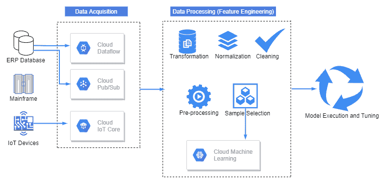

图 10.1：AI 应用程序的高级构建块

正如我们在图中所看到的，AI 应用程序管道中主要包含三个区域：数据获取，数据处理（功能工程），然后是模型执行和调整。 在本章的后续部分中，我们将考虑一个用例，并了解在 GCP 上使用 AI 工具包构建可运行的应用程序有多么容易。

# 用例概述–自动发票处理（AIP）

发票处理是遵循典型工作流程的重复性通用过程。 目前，大多数组织都需要大量的人工干预来管理发票处理的各个方面。 我们在本书中看到的各种 GCP 工具可以使组织的整个发票处理系统自动化。 在本节中，我们将通过逐步进行自动开票的过程来探索用例。

例如，让我们考虑一家为客户提供 IT 咨询服务的软件开发公司。 通常，对于项目的时间和材料成本，在月底（或预定义的发票期）将发票发送给客户。 发票包含有关卖方提供给客户的服务的所有详细信息，以及各个服务的详细信息以及付款处理所需的详细信息（例如，银行帐户详细信息）。 在我们的示例中，让我们考虑发票文件为 PDF 格式，并通过电子邮件接收。 这是我们示例的发票示例：

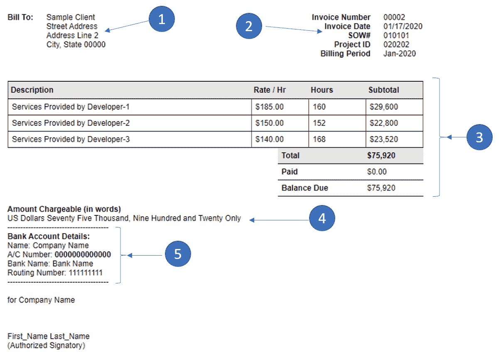

图 10.2：示例用例的发票示例

通常，发票包含以下部分：

1.  客户名称，地址和电话号码。
2.  发票抬头信息，例如发票编号，日期，SOW＃，项目 ID 等。
3.  发票金额明细和总计。
4.  发票金额（以字为单位）。
5.  用于汇款的银行帐户详细信息。

应付帐款团队收到发票后，他们将根据时间表系统验证各个应付款条目，并根据供应商的付款条件安排发票以进行付款。 以下流程图描述了此工作流程：


图 10.3：具有代表性 GCP 组件的发票处理流程

我们将使用 GCP 组件来自动化此过程。 在下一节中，我们将介绍 GCP 上 AIP 系统的设计。

# 在 GCP 上使用 AI 平台工具设计 AIP

我们将使用本书前面已经学习过的一些 GCP 组件来设计 AIP 应用程序。 下图突出显示了四个部分，这些部分分别有助于构建应用程序。 我们将使用原始发票 PDF 文件作为信息源。

数据将存储在 Cloud SQL 中，并在 Cloud Functions 的帮助下传递给 AI 工具包以进行进一步处理。 然后，我们将利用 GCP 上的 AI 工具包在应用程序中构建智能。 首先，我们需要一个 ML，自然语言界面，视觉 API 和语音 API 来启用对话界面。 最后，我们将利用出站服务，特别是 Dialogflow。 这是使用 GCP 组件的 AIP 应用程序的高层组件交互：


图 10.4：AIP 应用程序的组件设计

通过集成各种 GCP 组件，我们可以实现功能齐全的 AIP 应用程序。 以下列表显示了应用程序中涉及的各种 GCP 组件的功能摘要。

以下组件可用作 GCP 中的数据存储区； 在我们的应用程序中，我们将利用 Cloud SQL：

*   **Cloud SQL** ：这是一个完全托管的数据库，可以充当 GCP 上的关系数据库。 在撰写本文时，Cloud SQL 可以与 MySQL，PostgreSQL 和 SQL Server 一起使用。
*   **Cloud Bigtable** ：这是 GCP 上的 NoSQL 数据库服务。 Bigtable 为数据集提供了低延迟，可大规模扩展的界面。 该存储是 ML 应用程序的理想选择，并且易于与各种开源大数据框架集成。
*   **Cloud Spanner** ：这是一种水平可伸缩的关系数据库服务，在各个实例和节点之间高度一致。 它结合了关系型数据库和非关系型数据库的最佳功能，其完全托管的特性使其成为用最少的时间投资来进行大型数据库部署的有吸引力的选择。
*   **Cloud Memorystore** ：这是一种完全托管的内存中数据存储服务，可用于构建应用程序缓存，并为数据访问提供极低的延迟。 该内存存储利用 Redis 协议，从而使它在各个部署之间保持一致。 缓存的移植很容易。
*   **Cloud Firestore** ：这是一个方便的 NoSQL 数据存储，用于使客户端和服务器端之间的数据保持同步。 它通常用于移动，Web 和服务器开发，并为构建响应式应用程序和跨设备应用程序提供支持。
*   **Cloud Datastore** ：这是另一个完全托管的 NoSQL 数据库，用于处理分片和复制，以确保跨部署区域的高可用性。 它支持 ACID 事务以及类似 SQL 的查询和索引。 数据存储区提供了 REST API，通过允许通过多级安全连接进行数据访问，可以轻松集成外部应用程序。 可以很容易地更改基础数据结构，并提供一种易于使用的查询语言。

以下组件可用于计算和处理； 在我们的应用程序中，我们将利用云功能：

*   **Cloud SDK** ：这是用于使用 GCP 开发的一组工具和库。 这是所有 GCP 服务的命令行界面，例如虚拟机编排，计算引擎，网络和磁盘存储。 它通常用于自动执行各种应用程序管理任务。 对于 AIP 应用程序，我们可以使用 Cloud SDK 来管理开发，测试和部署管道，并自动管理整个应用程序。
*   **云功能**：这是一个无服务器，事件驱动的计算平台。 根据工作负载和基于预定义的事件，可以轻松地进行伸缩。 对于 AIP 应用程序，一旦发票到达源位置，我们就可以使用 Cloud Functions 触发自动过程，以读取发票并进行处理。 它为跨各种语言和应用程序接口协议的互操作性提供了无缝支持。 它基于最小特权的核心安全原理工作，并根据为用户分配的角色，促进对事件和功能的安全访问。

以下是 AI 工具包中可利用的组件： 在我们的应用程序中，我们将利用云机器学习，自然语言 API，视觉 API，翻译 API，语音 API 和云视频智能 API：

*   **云机器学习**：这是一个全面的平台，可利用 Google Cloud 的功能，使训练和部署可用于任何类型和大小的数据的 ML 模型变得容易。 在平台上培训的模型可以立即使用，并且可以通过安全的 API 进行访问，从而可以以最少的资金和时间投入轻松开发应用程序的快速原型。
*   **自然语言 API** ：自然语言 API 可用于执行 Web 规模的文本分析。 该 API 与 AutoML 集成在一起，并允许用户基于非结构化数据来训练，测试和部署其模型。 有预训练的模型，具有各种功能域的各种应用程序可以轻松利用这些模型。 该平台使协作和共享不断被平台升级的模型变得容易，从而提供了一种一致且可靠的方式来创建用于处理自然语言形式输入的应用程序。 这样可以通过语音 API 与人进行数据交互。

*   **视觉 API** ：这在基于视觉输入（例如图像）的分析中非常方便。 如果机器具有补充人类视觉的能力（例如从 PDF 或 Word 文档抄录文本），我们可以将大量 API 用于此用例。 这样，可以以有效和具有成本效益的方式对大量文档进行分类。 无需大量设置即可使用该服务，因此，一旦为项目和用户帐户启用了该服务，就可以轻松无缝地开始使用它。 强大的 API 层使您可以轻松以安全的方式与第三方应用程序集成。
*   **Translation API** ：这是一种便捷的服务，无需设置转换规则即可使用。 该 API 允许根据预先训练并不断发展的模型在各种语言之间进行翻译。 这些功能易于使用，为语言互操作性以及以各种语言构建的各种应用程序之间的集成打开了可能性。
*   **语音 API** ：这是智能机器的重要方面，它使人与应用程序之间具有类似人的界面。 首先，API 启用了文本到语音到文本的转换。 这些功能可用于创建对话应用程序。 DialogFlow 在内部利用语音 API 来促进对话。
*   **Cloud Video Intelligence API** ：此 API 使我们能够利用视频输入中的信息。 GCP 上有可用的预训练模型，这些模型可用于分类和识别视频帧内的特定对象。 它是自动驾驶汽车的组成部分之一，API 高效且可扩展，足以在关键任务应用中使用。

在下一部分中，概述了 GCP 上可用于构建端到端 AI 应用程序的各种组件，下面让我们看一下如何在 GCP 上构建自动发票处理应用程序。

# 使用 Vision API 执行光学字符识别

收到 PDF 格式的发票后的第一步是解释其内容。 我们将通过以下步骤使用视觉 API 来执行**光学字符识别**（**OCR**）：

1.  在 GCP 上创建一个新项目。 建议您使用一个新项目来尝试 OCR。 转录文档后，可以根据需要删除该项目，而不会影响任何其他应用程序。
2.  从 GCP 控制台启用 Cloud Vision API，Cloud Pub / Sub，Cloud Functions 和 Cloud Storage。
3.  从 Cloud Shell（从 GCP 控制台），确保使用以下命令更新所有组件：

```py
gcloud components update
```

4.  如下在 Cloud Storage 上创建两个存储桶：


图 10.5：用于创建存储桶的 gsutil 命令

5.  创建`aigcp`存储桶以存储发票 PDF 文件，并使用`aigcp-text`存储桶存储转录的文本文件（JSON 格式）。
6.  将发票 PDF 文件复制到`aigcp`存储桶（从 Cloud Shell 或从 GCP 控制台复制）。 这是 GCP 控制台中存储区内容的快速快照：

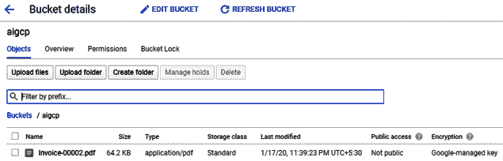

图 10.6：Google Cloud Storage 存储桶中的发票文件

7.  运行以下命令以使用 Vision API 读取发票 PDF 文件并将其转录为文本：

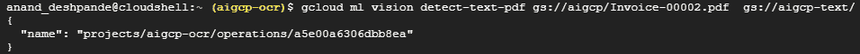

图 10.7：使用 Vision API 进行 OCR 和文本检测的命令

8.  OCR 也可以通过任何一个编程接口执行。 GCP 提供了用于 C＃，Go，Java，Node.js，PHP，Python 和 Ruby 的 API。 让我们看一下 OCR 的 Python 实现的一小段。 [完整的实现在 GitHub 上](https://github.com/PacktPublishing/Hands-On-Artificial-Intelligence-on-Google-Cloud-Platform)：

```py
def async_detect_document(source_path_gcs, destination_path_gcs):

    client = vision.ImageAnnotatorClient()

    feature = vision.types.Feature(
        type=vision.enums.Feature.Type.DOCUMENT_TEXT_DETECTION)

    gcs_source = vision.types.GcsSource(uri=source_path_gcs)
    input_config = vision.types.InputConfig(
        gcs_source=gcs_source, mime_type=mime_type)

    async_request = vision.types.AsyncAnnotateFileRequest(
        features=[feature], input_config=input_config,
        output_config=output_config)

    operation = client.async_batch_annotate_files(
        requests=[async_request])
```

9.  JSON 格式的转录文本文件现在存储在`aigcp-text`存储桶中，如以下屏幕截图所示：

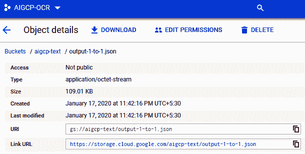

图 10.8：在 Google Cloud Storage 中输出 JSON 文件

10.  为了从输出 JSON 文件中提取有意义的信息，我们需要了解输出 JSON 文件（`output-1-to-1.JSON`）的格式：

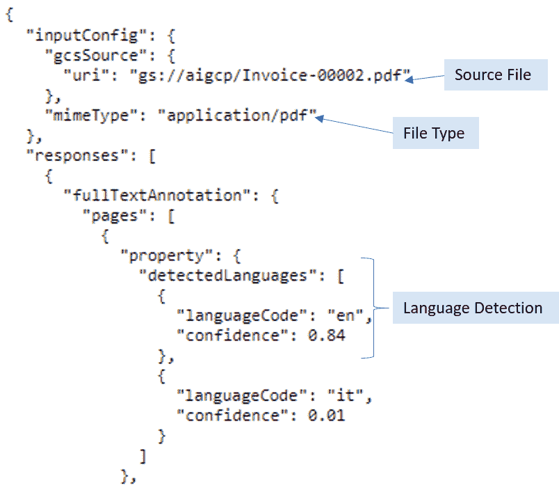

图 10.9：输出文件中的 JSON 标头

这是输出文件中的头信息。 Vision API 自动检测 PDF 文档中使用的语言。 实际字符数据封装在[H​​TG0] > `paragraphs` > `words` > `symbols`的层次结构中，如下图所示：

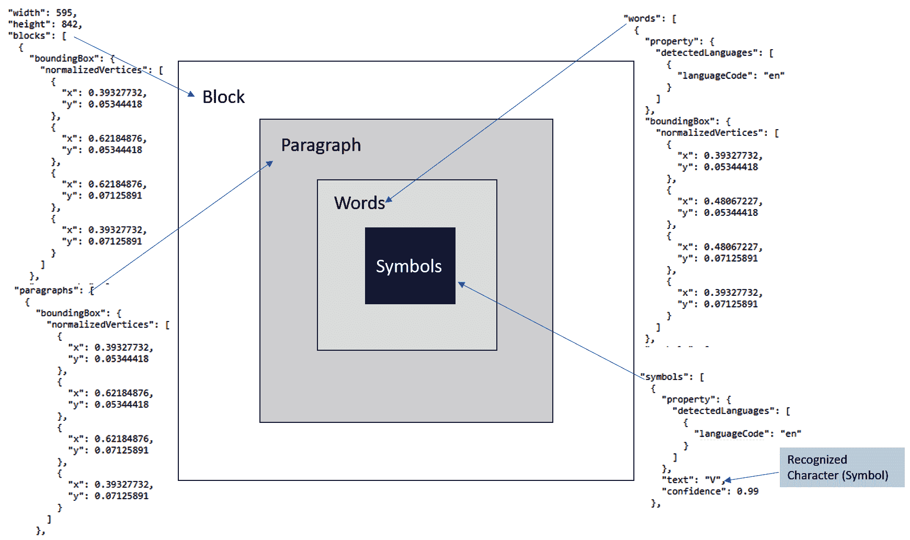

图 10.10：输出 JSON 结构

Vision API 还将 PDF 文件中找到的所有符号收集到一个文本字段中。 这有助于我们快速从发票中收集有意义的内容。 以下是包含文本字段的输出 JSON 的代码段：

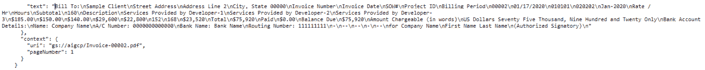

图 10.11：发票文件中的文字

有关发票中的原始内容和 Vision API 提取的文本，请参见图 10.2。 发票内的所有字段在文本字段内的输出 JSON 文件中可用。

至此，我们已经利用 Vision API 从发票中提取了有意义的信息，以便对其进行自动处理。 在接下来的部分中，我们将使用各种 GCP 工具存储相关数据，进行验证并安排发票付款。

# 使用 Cloud SQL 存储发票

在本节中，我们将介绍一个完整的过程，该过程是从 OCR 输出生成的 JSON 文件中选取文本并将其通过 Cloud Functions 推送到 Cloud SQL 中的。 首先，我们将介绍在 GCP 上准备好 Cloud SQL 和 Cloud Functions 的步骤，然后我们将解释用于选择文本并将其转换为所需的结构化格式以将其插入表中的代码。

# 创建一个 Cloud SQL 实例

首先，让我们通过执行以下步骤来创建 Cloud SQL 实例：

1.  从左侧面板中，从“存储”部分中选择 **SQL** ：

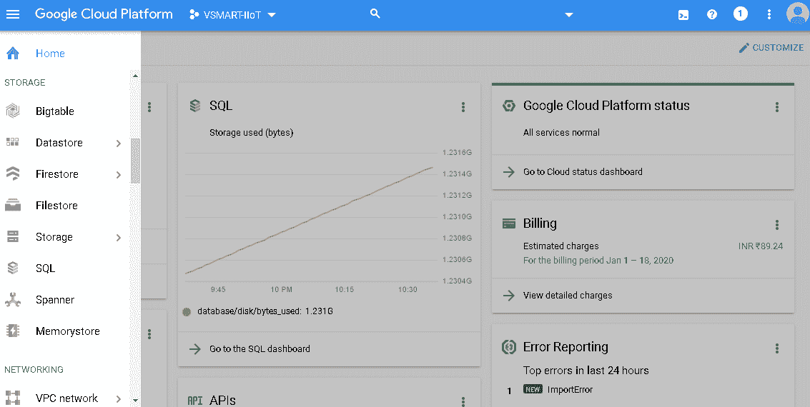

2.  单击创建实例：


3.  点击选择 MySQL：


4.  为实例命名，设置适当的密码，选择您的区域，保留默认数据库版本，然后单击“创建”。 记住您为 root 用户设置的密码，因为稍后将有用：

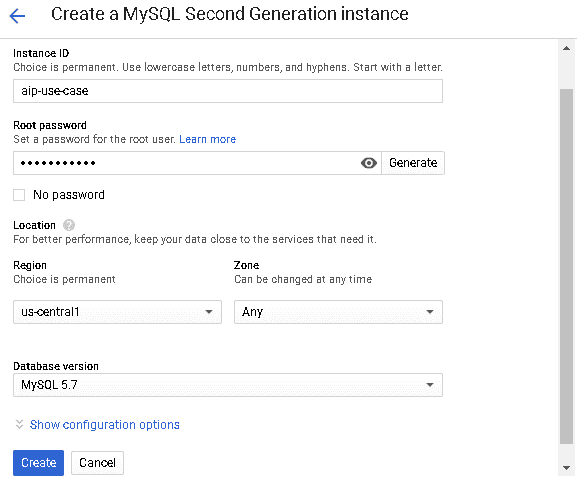

# 设置数据库和表

现在，借助以下步骤来设置数据库和表：

1.  单击创建的实例：


2.  单击“使用 Cloud Shell 进行连接”，然后通过输入创建实例时设置的 root 用户的密码来连接到 MySQL：


3.  运行以下命令来创建数据库：

```py
create database aip_db;
```

4.  运行以下命令以创建发票表。 SQL 文件`aip.sql`也可从[这里](https://github.com/vss-vikram/Hands-On-Artificial-Intelligence-on-Google-Cloud-Platform)获得，以创建与数据库相关的工件：

```py
create table invoice 
(Company_Name VARCHAR(50),
Client_Name VARCHAR(50),
Client_Address VARCHAR(50),
SOW_Number VARCHAR(50),
Project_ID VARCHAR(50),
Invoice_Number VARCHAR(50),
Invoice_Date DATE,
Billing_Period DATE,
Developer VARCHAR(255),
Rate VARCHAR(50),
Hours INT,
Subtotal VARCHAR(50),
Balance_Due VARCHAR(50),
Bank_Account_Number INT,
Bank_Name VARCHAR(50));
```

# 启用 Cloud SQL API

现在让我们启用 Cloud SQL API：

1.  从控制台搜索 Cloud SQL Admin API：


2.  单击启用：


# 启用 Cloud Functions API

现在启用云功能 API：

1.  从控制台搜索 Cloud Functions API：


2.  要启用 API，请单击“启用”：


3.  要建立从 Cloud Functions 到 Cloud SQL 的连接，需要以下 Cloud SQL 详细信息：

*   实例名称
*   数据库名称
*   用户名–根
*   创建实例时设置的 root 用户的密码

# 创建云功能

现在让我们创建一个 Cloud Function：

1.  从“计算”部分下的左侧面板中选择“云函数”：

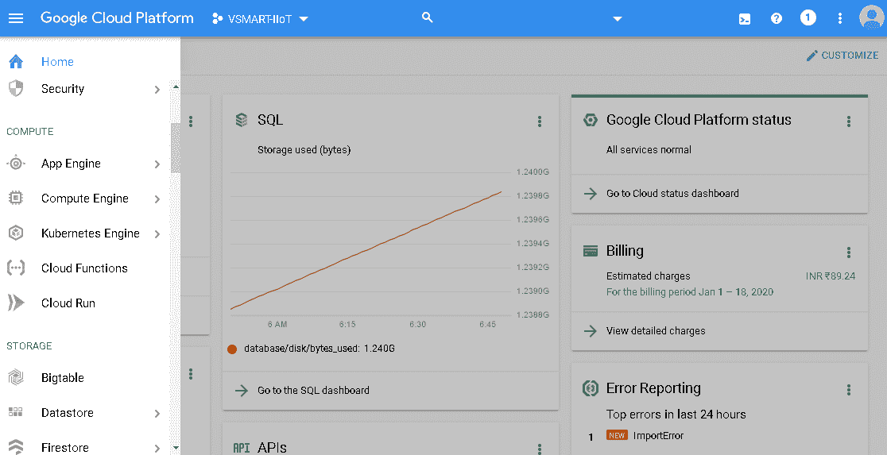

2.  单击创建功能：


3.  输入所需的功能名称。 分配的内存可以为 256 MB。 选择“触发器”作为“云存储”，然后选择“事件类型”作为“完成/创建”。 存储桶名称应为存储 PDF 到文本输出的存储桶的名称。 源代码应为内联编辑器：


4.  复制`aip_cloud_function.py`中的代码，并根据存储区名称和创建的 pub / sub 主题替换所需的详细信息。 要连接到 Cloud SQL 数据库，将需要再进行一次替换。 将*步骤 6* 中提到的代码行替换为下载代码中的 Cloud SQL 详细信息。
5.  从[这里](https://github.com/vss-vikram/Hands-On-Artificial-Intelligence-on-Google-Cloud-Platform)下载云功能代码。
6.  提供 MySQL 连接详细信息，如以下代码所示。 您将从上一步下载的 Cloud Function 代码中获得相同的代码行。 请使用适当的详细信息替换数据库用户，密码，名称和 Cloud SQL 实例：

`# MYSQL+pymysql://<db_user>:<db_pass>@/<db_name>?unix_socket=/cloudsql/<cloud_sql_instance_name>`

7.  替换该行后，复制并粘贴代码，如以下屏幕截图所示：


8.  对于依赖项设置，请从以下链接复制`requirement.txt`中的内容，并将其粘贴到[中的需求文件中 https://github.com/vss-vikram/Hands-On-Artificial-Intelligence-on-Google -云平台](https://github.com/vss-vikram/Hands-On-Artificial-Intelligence-on-Google-Cloud-Platform)


9.  单击创建功能。
10.  创建功能后，单击功能，然后转到“常规”选项卡。 检查用于运行该功能的服务帐户：

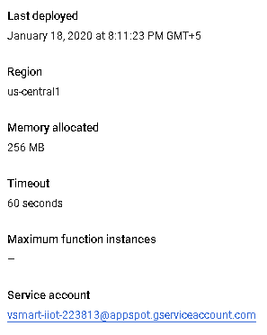

# 提供 Cloud SQL 管理员角色

接下来，让我们向运行 Cloud Function 的服务帐户提供 Cloud SQL Admin 角色：

1.  转到“ IAM”部分：

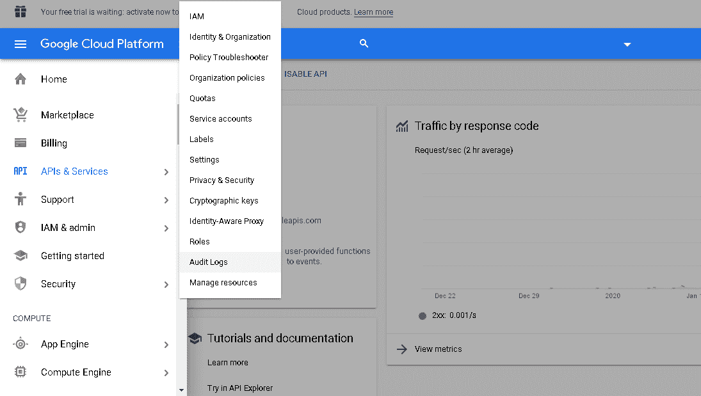

2.  选择将用于运行云功能的服务帐户：


3.  将 Cloud Admin 角色分配给该帐户：

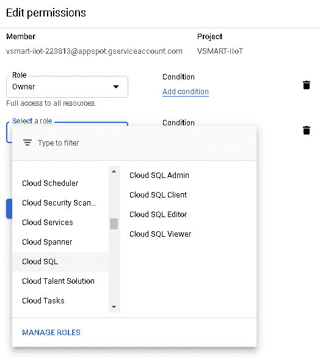

现在，让我们遍历 Cloud Function 的完整代码，以将 PDF 转换为文本后处理发票。 以下是部分代码段。 完整代码可在[这个页面](https://shorturl.at/yADV9)处找到：

```py
def validate_aip(event, context):
    """Triggered by a change to a Cloud Storage bucket.
    Args:
         event (dict): Event payload.
         context (google.cloud.functions.Context): Metadata for the event.
    """
    #Code block to read file from GCS and load data in JSON format.
    client = storage.Client()
    bucket = client.get_bucket(bucket)
    blob = bucket.get_blob(file_path)
    contents = blob.download_as_string()
    contents = contents.decode("utf-8")
    data = JSON.loads(contents)

    #Reading required text field from data.
    output = data['responses'][0]['fullTextAnnotation']['text']
    output = output[:-1]

    #Code setup to convert output data from JSON file to the required format                                for loading into invoice table.

    df_invoice = pd.DataFrame.from_dict(output_dict)

    df_invoice[['Developer', 'Rate', 'Hours', 'Subtotal']] =                               df_invoice['Developer Rate Hours Subtotal'].str.split(expand=True)

    df_invoice = df_invoice.drop(columns=['Developer Rate Hours Subtotal'])

    #Establishing connection with Cloud SQL.
    db_con = sqlalchemy.create_engine('MYSQL+pymysql://<db_user>:                                     <db_pass>@/<db_name>?                                                                  unix_socket=/cloudsql/<cloud_sql_instance_name>'
    )

```

在代码的这一部分中，我们导入了所需的依赖关系，然后，当从 GCS 加载数据时，我们使用了 GCS 特定的库从 GCS 中存储的文件中加载数据。 加载文件后，将从 JSON 文件中提取包含我们在本章前面讨论的所有信息的特定文本。 使用正则表达式将文本字段分隔为单独的列，并使用正则表达式输出填充 Cloud SQL 中的发票表。

# 使用 Cloud Functions 验证发票

在本节中，我们将遍历用于验证发票处理的代码。 您将需要在时间表表中加载数据以与发票表进行交叉验证（发票表是使用 PDF 文件填充的）。

以下是在数据库中创建时间表表并将数据加载到表中的步骤：

1.  正如我们在*使用 Cloud SQL* 配方存储发票的步骤 2 中所讨论的那样，使用 Cloud Shell 实例连接到 MySQL，并运行以下查询以创建表时间表表：

```py
create table timesheet 
(Company_Name VARCHAR(50),
SOW_Number VARCHAR(50),
Project_ID VARCHAR(50),
Invoice_Number VARCHAR(50),
Invoice_Date DATE,
Billing_Period DATE,
Developer VARCHAR(255),
Rate VARCHAR(50),
Hours INT,
Bank_Account_Number INT,
Bank_Name VARCHAR(50));
```

2.  运行以下查询以将数据插入时间表表。 如前所述，您可以使用`aip.sql`来获取以下查询：

```py
insert into timesheet (Company_Name, SOW_Number, Project_ID, Invoice_Number, Invoice_Date, Billing_Period, Developer, Rate, Hours, Bank_Account_Number, Bank_name)
values ('Vsquare Systems', '001', '002', '030', '2020-01-31', '2020-01-31', 'Developer1', '$185', 160, 000000001, 'Payment Bank');

insert into timesheet (Company_Name, SOW_Number, Project_ID, Invoice_Number, Invoice_Date, Billing_Period, Developer, Rate, Hours, Bank_Account_Number, Bank_name)
values ('Vsquare Systems', '001', '002', '030', '2020-01-31', '2020-01-31', 'Developer2', '$150', 152, 000000001, 'Payment Bank');

insert into timesheet (Company_Name, SOW_Number, Project_ID, Invoice_Number, Invoice_Date, Billing_Period, Developer, Rate, Hours, Bank_Account_Number, Bank_name)
values ('Vsquare Systems', '001', '002', '030', '2020-01-31', '2020-01-31', 'Developer3', '$140', 168, 000000001, 'Payment Bank')
```

现在我们已经准备好数据，让我们深入验证过程。

3.  让我们来看一下数据验证所需的代码。 在以下代码中，我们从先前创建的时间表表中提取数据，并基于`Company Name`，`SOW_Number`，`Project_ID`，`Invoice_Number`和`Developer`创建数据框：

```py
#Reading data from timesheet table.
 df_timesheet = pd.read_sql(f'SELECT * FROM timesheet', con=db_con)
 joined_df = pd.merge(df_invoice, df_timesheet, on=['Company_Name','SOW_Number','Project_ID','Invoice_Number','Invoice_Date','Developer'])
```

在以下代码中，我们根据费率和小时数匹配发票和时间表数据框。 如果所有记录都匹配，那么我们可以继续； 如果存在差异，则不会处理发票：

```py
#Matching data of both tables.
 matched = []

 for index, row in joined_df.iterrows():

 if row['Rate_x'] == row['Rate_y'] and row['Hours_x'] == row['Hours_y'] and                                               row['Bank_Account_Number_x'] ==                                                                   row['Bank_Account_Number_y']:

     matched.append(True)

 else:

     matched.append(False)
```

# 安排付款队列的发票（发布/订阅）

在本节中，我们将学习如何将消息推送到 pub / sub 主题，以便发票处理系统处理发票。 我们将介绍创建发布/订阅主题的过程，以及如何发布和订阅该主题的消息。

让我们创建一个主题并对其进行测试：

1.  要启用 Cloud Pub / Sub API，请执行以下步骤：
    1.  从主页搜索发布/订阅 API。
    2.  启用 API。
2.  要创建发布/订阅主题和订阅，请执行以下步骤：
    1.  从左侧面板中选择发布/订阅。
    2.  单击创建主题。
    3.  在左侧面板中，转到“订阅”，然后为创建的主题创建订阅。

3.  从以下屏幕快照中显示的选项中，将消息推送到主题中：


4.  以下代码演示了，一旦数据匹配，我们就将一条消息推送到 pub / sub 主题，该信息将由付款处理系统使用以处理发票：

```py
 #Pushing successful message into Pub/Sub.
 if False not in matched:
     data = f"Invoice Matched"
     publisher = pubsub_v1.PublisherClient()
     topic_path = publisher.topic_path('project_id', 'topic_name')
     bdata = data.encode("utf-8")
     future = publisher.publish(topic_path, data=bdata)
```

# 通知供应商和 AP 团队有关付款完成的信息

在撰写本文时，GCP 使用 SendGrid 发送电子邮件。 SendGrid 是一个受信任的电子邮件传递系统，该系统在全球范围内用于发送跨国和市场营销电子邮件。 这是一个非常强大的基于云的解决方案，它消除了维护电子邮件基础结构的所有复杂性。 在本节中，我们将学习如何使用 SendGrid 发送电子邮件。 它免费提供 12,000 封电子邮件。

以下是启用 SendGrid API 的步骤：

1.  从主页搜索云消息传递。
2.  启用 S​​endGrid API。

现在，让我们看看如何从 SendGrid 配置和发送电子邮件。

以下是示例 Python 代码，可用于从 SendGrid 发送电子邮件。 该代码非常简单，不言自明。 您只需要确保使用正确的 API 密钥即可：

```py
# using SendGrid's Python Library - https://github.com/sendgrid/sendgrid-python
import sendgrid
​
sg = sendgrid.SendGridClient("YOUR_SENDGRID_API_KEY")
message = sendgrid.Mail()
​
message.add_to("test@sendgrid.com")
message.set_from("you@youremail.com")
message.set_subject("Sending with SendGrid is Fun")
message.set_html("and easy to do anywhere, even with Python")
sg.send(message)
```

前面的代码用于在电子邮件正文中配置 SendGrid 客户端，收件人，发件人，主题和消息。

现在，您已经了解了如何以自动化方式处理发票。 接下来，我们将快速了解如何为 AIP 创建对话界面。

# 为 AIP 创建对话界面

使用存储在 Cloud SQL 中的数据构建应用程序后，我们可以通过启用 Dialogflow API 来启用会话界面。 我们可以创建应用程序上下文并培训代理以处理与发票相关的各种用户查询。 我们需要连接到数据存储的外部集成服务，以根据应用程序上下文回答各种用户查询。 我们已经在第 6 章，使用 Dialogflow 的 S *mart 会话应用程序中，看到了使用 Dialogflow 启用对话接口的详细步骤。 通过启用 Dialogflow 代理，自动发票处理的用例可以完全补充人的智能并避免人工干预和错误，并且可以更快，更高效地处理大量发票。*

在本章中，我们已经看到了各种 GCP 工具和应用程序在构建用于自动发票处理的智能应用程序中的实际应用。 如我们所见，通过使用 GCP 工具，可以轻松无缝地开发补充人类智能的功能。 该平台本身正在不断发展，并朝着高端功能的完全民主化发展，这些高端功能利用了完全托管的服务来进行存储，计算，机器学习和高级分析。 在本章（和本书）的最后部分，我们将探讨 GCP 即将推出的一些功能。 我们期望，凭借不断的创新和 Google 在处理全球数据方面的经验，即将推出的工具，框架和应用程序将使在 GCP 上构建智能应用程序变得更加轻松，快捷和更具成本效益。

# 即将推出的功能

当务之急是，随着新功能的增加，GCP 将会进一步发展。 以下是我们认为将来会添加到 GCP 中的新增功能的代表列表：

*   GCP 将具有更好的跨平台产品集成和可用性。 例如，IBM Power Systems 现在可以在 GCP 上使用。 这样，通过将整个平台迁移到 GCP，即可利用企业已经在大型生产系统中进行的投资。 这将为企业节省实施成本和基础设施成本。

*   即用型 AI 和 ML 模型将启用 GCP。 随着市场的成熟，GCP 将托管越来越多的 AI 和 ML 模型。 这些模型可通过具有固有互操作性的预定义 API 来使用。 GCP 将不断对模型进行训练和调整，并随着时间的推移产生越来越好的结果。 市场将随着使用量的增加而成熟。 签署和定价将简化，以使所有经验级别（包括入门级）的开发人员都能够快速构建其企业应用程序。
*   GCP 将提供一个拖放式用户界面，以构建从问题分类到模型部署的整个 AI 管道。 届时，人工智能的力量将完全掌握在业务团队手中，而对 IT 和开发团队的依赖将减少。 平台的简化和民主化将带来进一步的创新，我们将体验不仅使用而且每个人都构建的智能应用程序。
*   GCP 将启用针对特定行业和企业的 AI 工具包，以提高各种规模企业的盈利能力和创新能力。 例如，谷歌已经在帮助零售商加速其数字和多渠道收入增长。 除此之外，Google 还帮助零售商变得完全由数据驱动，并提出建议（基于数据）以提高运营效率。 这可以通过利用 GCP，Chrome Enterprise 和 Android 上的 AI 工具以及整个连接的工具箱来实现。
*   GCP 上的 AI 工具包还将促进需要大量数据和计算能力以及用于构建 AI 管道的过程和接口的研究项目。 例如，谷歌正在帮助 FDA MyStudies 利用现实世界的数据进行生物学研究。 Google Cloud 正在与 FDA 合作开发 MyStudies 应用程序，并提供了更好，适应性更强的保护和可配置的隐私权政策。 目的是为研究组织提供自动识别和保护个人身份信息的能力。 Google Cloud 将继续投资于各种研究和研究计划，以对该平台进行总体改进，扩大支持的评估数量，并允许与下游分析和可视化工具集成。

*   AutoML Tables 使您的整个数据科学家团队能够以极高的速度和规模在结构化数据上自动构建和部署 ML 模型。 它具有出色的功能工程模型训练功能。 训练开始时，AutoML 表将自动执行某些功能工程任务，例如对输入进行标准化。 数值功能被限制在范围内，以实现更好的模型可靠性，日期时间输入参数的规范化，基本文本处理清除和停止单词删除，并为因变量创建一键编码和嵌入。 AutoML 表在线性，前馈深度神经网络，梯度增强决策树，AdaNet 和各种模型架构的集合上执行并行测试，以确定适合您的数据集的最佳模型架构。 用户将能够使用 StackDriver 日志记录查看 AutoML 表结构，并能够导出测试数据。
*   AI Hub 是即将加入 GCP 的另一个非常有用的功能。 AI Hub 是用于构建最复杂的 ML 管道的一站式设施。 可以使用预配置的笔记本使用一些预训练的模型来构建 AI 应用程序，以及轻松地训练新模型。 AI Hub 还确保以一致的方式访问相关事件数据集。 还可以在模型开发上进行协作，并利用基于通用框架（例如 TensorFlow）构建的模型。 这极大地促进了在 GCP 上训练和部署模型。
*   通过 AI 平台笔记本，可以通过受保护的，公开可用的笔记本实例 URL 轻松管理 JupyterLab 实例。 它将使您能够创建和管理与 JupyterLab 预先打包的虚拟机实例。 AI Platform Notebooks 实例将支持 PyTorch 和 TensorFlow 框架。 这些笔记本将受到 GCP 身份验证和授权的保护。 AI Platform Notebooks 将随附许多预装的常用软件。
*   AI 平台深度学习容器是 GCP 提供一种访问预训练模型的独特方法，可以在 GCP 上高度优化和一致的环境的帮助下快速对其进行原型化和使用。 这有助于快速构建工作流，并以最小的进入障碍和成本促进实验。 这是使 AI 开发功能完全民主化的巨大飞跃。

*   AI 平台数据标记服务是在网络规模标记数据点时利用人类智能的绝佳方法。 组织可以向 Google 请求此服务以手动标记数据集。 当考虑新的用例且初始数据集不可用时，这有助于收集培训和评估数据。 Google 一直致力于在互联网上众包数据集标签的过程。 当我们要处理需要标记的高度安全的数据时，标记服务也很方便。 带有标签服务的接口是一种获取数据标签的安全有效的方法。

# 概要

在本章中，我们学习了创建 AI 应用程序的分步方法。 我们讨论了自动发票处理应用程序的设计和开发。 我们使用 OCR 和 Vision API 将发票 PDF 转换为文本，然后使用发票数据来验证时间表数据。 成功验证后，我们处理了发票。 我们学习了如何使用多种 Google 服务在 GCP 上开发端到端应用程序。 最后，我们简要讨论了 GCP 即将发布的功能。