# 一、深度学习入门

人工智能可能会起作用，如果能起作用，它将是技术上最大的发展。

-山姆·奥特曼

欢迎使用《Python 深度学习架构实践指南》！如果您完全不熟悉深度学习，则可以从这本书开始您的旅程。 对于有想法的读者，我们几乎涵盖了深度学习的各个方面。 因此，您肯定会从本书中学到更多有关深度学习的知识。*

这本书是按累积方式布置的。 也就是说，它从基础开始，一遍又一遍地构建，直至达到高级。 在本章中，我们将讨论人类如何开始在机器中创建智能，以及人工智能如何逐渐演变为机器学习以及最终的深度学习。 然后，我们看到了深度学习的一些不错的应用。 回到基本原理，我们将学习人工神经元的工作原理，并最终为通过深度学习模型编码的方式建立环境。 完成本章后，您将了解以下内容。

*   什么是人工智能以及机器学习，深度学习与人工智能的关系
*   机器学习任务的类型
*   有关一些有趣的深度学习应用的信息
*   什么是人工神经网络及其工作方式
*   使用 Python 设置 TensorFlow 和 Keras

让我们从关于人工智能以及人工智能，机器学习和深度学习之间的关系的简短讨论开始。

# 人工智能

自计算机时代开始以来，人类一直在尝试将大脑模仿到机器中。 研究人员一直在研究使机器不仅可以计算，而且可以像人类一样做出决定的方法。 我们的这一追求在 1960 年代左右催生了人工智能。 根据定义，人工智能意味着开发能够完成任务而无需人工对每个决策进行明确编程的系统。 1956 年，亚瑟·塞缪尔（Arthur Samuel）编写了第一个玩跳棋的程序。 从那以后，研究人员试图通过定义不涉及任何学习的手写规则集来模仿人类的智力。 玩象棋这样的游戏的人工智能程序不过是一组手动定义的动作和策略。 1959 年，亚瑟·塞缪尔（Arthur Samuel）创造了术语**机器学习**。 机器学习开始使用各种概率和贝叶斯统计概念来执行模式识别，特征提取，分类等。 在 1980 年代，受人脑神经结构的启发，引入了**人工神经网络**（**ANN**）。 2000 年代的 ANN 演变成如今所谓的深度学习！ 以下是通过机器学习和深度学习发展人工智能的时间表：


# 机器学习

机器学习之前的人工智能就是编写机器用来处理提供的数据的规则。 机器学习实现了过渡。 现在，仅通过将数据和预期输出提供给机器学习算法，计算机就可以为任务返回一组优化的规则。 机器学习使用历史数据来训练系统并在未知但相似的数据上对其进行测试，从而开始机器学习如何进行决策而无需进行硬编码的旅程。 在 90 年代初，机器学习已成为人工智能的新面孔。 开发了更大的数据集并将其公开，以允许更多的人建立和训练机器学习模型。 很快，庞大的机器学习科学家/工程师社区诞生了。 尽管机器学习算法从统计数据中得出推论，但使错误分析最小化的方法使其功能强大。 它试图最小化数据集提供的预期输出与预测算法输出之间的误差，以发现优化规则。 这是机器学习的学习部分。 我们不会在本书中介绍机器学习算法，但它们基本上分为三类：有监督，无监督和增强。 由于深度学习还是机器学习的子集，因此这些类别也适用于深度学习。

# 监督学习

在监督学习中，数据集既包含输入数据点又包含预期输出，通常称为标签。 该算法的工作是学习从输入到预期输出的映射函数。 该函数可以是线性函数，例如`y = mx + c`或非线性函数，例如`y = ax3 + bx2 + cx + d`，其中`y`为目标输出，`x`为输入。 所有监督学习任务都可以归类为回归和分类。

# 回归

回归处理学习连续映射功能，该功能可以预测各种输入功能提供的值。 该函数可以是线性的或非线性的。 如果函数是线性的，则称为线性回归；如果函数是非线性的，则通常称为多项式回归。 当存在多个输入要素（变量）时预测值，我们称为多元回归。 回归的一个非常典型的例子是房屋预测问题。 提供房屋的各种参数，例如建筑面积，位置，房间数量等，可以使用历史数据预测房屋的准确售价。

# 分类

当对目标输出值而不是原始值进行分类时（如回归），这是一项分类任务。 例如，我们可以根据输入特征，花瓣长度，花瓣宽度，萼片长度和萼片宽度对不同种类的花进行分类。 输出类别为杂色，山和弗吉尼亚。 逻辑回归，决策树，朴素贝叶斯等算法是分类算法。 我们将在第 2 章中介绍分类的详细信息。

# 无监督学习

当我们没有输入的相应目标输出值时，将使用无监督学习。 它用于了解数据分布并发现数据点之间某些种类的相似性。 由于没有可供学习的目标输出，因此无监督算法依靠初始化程序来生成初始决策边界，并在它们遍历数据时对其进行更新。 在多次处理数据之后，算法将更新为优化的决策边界，该边界将基于相似性对数据点进行分组。 这种方法称为聚类，并且使用了诸如 K 均值的算法。

# 强化学习

还记得童年时代如何学会骑自行车吗？ 那是一个反复试验的过程，对吗？ 您试图平衡自己，每次做错事时，都会踩下自行车。 但是，您从错误中学到了东西，最终，您能够骑行而不会摔倒。 同样，强化学习的作用也一样！ 代理暴露于一种环境中，在该环境中，它会从一系列可能的操作中采取措施，从而导致代理状态发生变化。 **状态**是代理所处环境的当前状况。对于每个动作，代理都会获得奖励。 每当收到的报酬为正时，表示代理已采取正确的步骤；而当报酬为负数时，则表示错误。 代理遵循策略，即强化学习算法，通过该策略代理可以考虑当前状态确定下一步操作。 强化学习是人工智能的真正形式，其灵感来自人类通过反复试验而学习的方式。 想想自己是代理商，还是自行车环境！ 这里讨论强化学习算法不在本书的讨论范围之内，因此让我们将重点转移到深度学习上吧！

# 深度学习

尽管机器学习为计算机提供了学习决策边界的能力，但它错过了这样做的鲁棒性。 机器学习模型必须针对每个特定应用进行特别设计。 人们花费了数小时来决定选择哪些功能以实现最佳学习。 随着数据交叉折叠和数据非线性的增加，机器学习模型难以产生准确的结果。 科学家们很快意识到，需要一个更强大的工具来实现这一增长。 在 1980 年代，人工神经网络的概念得到了重生，并且凭借更快的计算能力，开发了更深版本的人工神经网络，从而为我们提供了我们一直在寻找的强大工具-深度学习！

# 深度学习的应用

技术的优势取决于其应用的健壮性。 由于深度学习的大量应用，它在技术以及非技术市场中引起了巨大的轰动。 因此，在本节中，我们将讨论深度学习的一些惊人应用，这些将使您全神贯注。

# 自动驾驶汽车

这可能是深度学习中最酷，最有前途的应用。 自动驾驶汽车上装有许多摄像头。 输出的视频流被馈入深度学习网络，该网络可以识别并分割汽车周围存在的不同对象。 NVIDIA 推出了一种用于无人驾驶汽车的*端到端学习*，这是一个卷积神经网络，可以从摄像机中获取输入图像，并以转向角或加速度的形式预测应采取的动作。 为了训练网络，当人行驶时，将存储转向角，油门和摄像机视图，并记录该人针对周围发生的变化所采取的动作。 然后通过反向传播（在“第 2 章”，“深度前馈网络”中详细讨论了反向传播）来更新网络参数，这些误差来自人为输入和网络的预测。

如果您想了解有关 NVIDIA 的*无人驾驶汽车学习*的更多信息，[可以参考以下 NVIDIA 的论文](https://arxiv.org/abs/1604.07316)。

# 图片翻译

**生成对抗网络**（**GAN**）是最臭名昭著的深度学习架构。 这是由于它们具有从随机噪声输入向量生成输出的能力。 GAN 有两个网络：生成器和判别器。 生成器的工作是将随机向量作为输入并生成样本输出数据。 判别器从生成器创建的真实数据和伪数据中获取输入。 判别器的工作是确定输入是来自真实数据还是来自生成器的伪造数据。 您可以将场景可视化，想象辨别器是一家试图区分真假货币的银行。 同时，产生者是试图将假币传递给伪造银行的欺诈行为； 生成器和判别器都从错误中吸取教训，生成器最终产生的结果非常精确地模仿了真实数据。

GAN 有趣的应用之一是图像到图像的翻译。 它基于条件 GAN（我们将在第 7 章中详细讨论 GAN）。 给定一对具有某种关系的图像（例如 I1 和 I2），条件 GAN 将学习如何将 I1 转换为 I2。 创建了一个名为 **pix2pix** 的专用软件来演示此概念的应用。 它可用于为黑白图像填充颜色，从卫星图像创建地图，仅通过草图生成对象图像，而不能！

以下是 Phillip Isola 发表的《图像到图像翻译》的实际论文的链接，以及来自 pix2pix 的示例图像，[描述了图像到图像翻译的各种应用](https://arxiv.org/abs/1611.07004)：

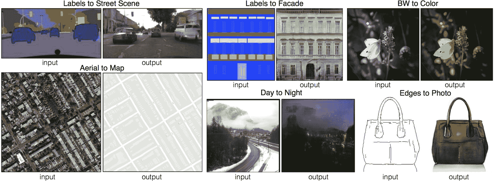

源自 pix2pix

# 机器翻译

这个世界上有 4,000 多种语言，数十亿人通过它们进行交流。 您可以想象需要进行语言翻译的规模。 大多数翻译都是由人工翻译完成的，因为机器进行的基于规则的经典翻译通常是毫无意义的。 深度学习提出了解决方案。 它可以像我们一样学习语言，并生成更自然的翻译。 这通常称为**神经机器翻译**（**NMT**）。

# 编解码结构

神经机器翻译模型是**循环神经网络**（**RNN**），以编码器/解码器的方式排列。 编码器网络通过 RNN 接收可变长度的输入序列，并将这些序列编码为固定大小的向量。 解码器从此编码向量开始，并开始逐字生成翻译，直到它预测句子的结尾。 整个架构通过输入语句和正确的输出翻译进行了端到端的训练。 这些系统的主要优点（除了具有处理可变输入大小的功能之外）是，它们学习句子的上下文并据此进行预测，而不是进行逐词翻译。 在以下屏幕截图中，可以最好地看到神经机器翻译在 Google 翻译上的作用：


源自 Google 翻译

# 聊天机器人

您可能会发现这是最酷的应用！ 像人类一样与我们交谈的计算机一直是一种令人着迷的愿望。 它给我们一种计算机变得智能的感觉。 但是，大多数先前构建的聊天机器人系统都是基于知识库和规则的，这些规则和规则定义了从中选择哪个响应。 这使得聊天机器人成为一个非常封闭的领域，而且听起来很不自然。 但是对编码器-解码器架构进行了一些调整，我们看到了机器翻译实际上可以使聊天机器人自己生成响应。 编码学习输入句子的上下文，并且，如果整个架构都经过样本查询和响应训练，则每当系统看到新查询时，系统都可以基于学习结果生成响应。 IBM Watson，Bottr 和 rasa 等许多平台都在构建深度学习驱动的工具，以构建用于业务目的的聊天机器人。

# 建立基础

在本部分中，您将开始成为深度学习架构师的旅程。 深度学习是人工神经网络的支柱。 我们的第一步应该是了解它们如何工作。 在本节中，我们描述了人工神经元背后的生物学灵感和创建 ANN 的数学模型。 我们尝试将数学降至最低，并更多地关注概念。 但是，我们假设您熟悉基本的代数和微积分。

# 生物灵感

如前所述，深度学习受到人脑的启发。 这确实是个好主意。 要开发机器内部的大脑智能，您需要机器来模仿大脑！ 现在，如果您略微意识到人脑如何如此快地学习和记忆事物，那么您必须知道，这是有可能的，因为数百万个神经元形成了一个相互连接的网络，相互之间发送信号，从而构成了记忆。 神经元具有两个主要成分：树突和轴突。 树突充当受体，并结合神经元正在接收的所有信号。 轴突通过突触与其他神经元末端的树突相连。 一旦传入的信号超过阈值，它们就会流过轴突并突触，将信号传递到连接的神经元。 神经元相互连接的结构决定了网络的功能。 以下是生物神经元的外观示意图：

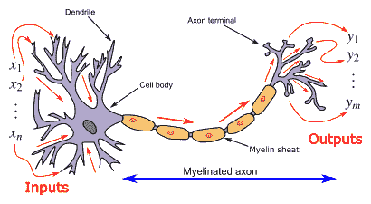

生物神经元（来自 Wikimedia）

因此，神经网络的人工模型应该是一个由相互连接的节点组成的并行网络，该网络可以接收来自其他各个节点的输入，并在激活时传递输出。 这种激活现象必须通过某种数学运算来控制。 接下来让我们看一下运算和方程式！

# 人工神经网络

ANN 由两个组件构建：节点和权重。 节点扮演神经元的角色，权重是可学习的参数，权重将神经元彼此连接并控制其激活路径。

那么，我们如何制作一个人工神经元或节点呢？ 认为`x`是神经元的标量输入，`w`是神经元的标量权重。 如果您不知道标量和向量是什么，则标量仅仅是一个实数元素，而向量是此类元素的列表。 人工神经元可以表示为以下方程式：


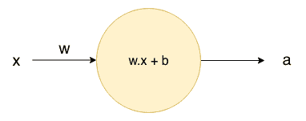

圆圈表示将标量`x`作为输入并在将其与权重`w`相乘后输出`a`的神经元。 在此，将`b`称为偏置。 在方程式中增加了偏置，以提供针对特定输入范围移动输出的功能。 一旦我们通过激活函数，偏见的作用将变得更加清晰。

现在，假设神经元不仅接受单个标量输入，还接受多个输入。 输入可以称为向量（例如`P`）。 然后，`P`可以写成一组标量输入`p[1], [2], ..., p[n]`和每个输入也将具有权重向量（例如`W = w[1], w[2], ..., w[n]`），这将用于激活神经元。 以下矩阵代表`P`和`W`向量：

 

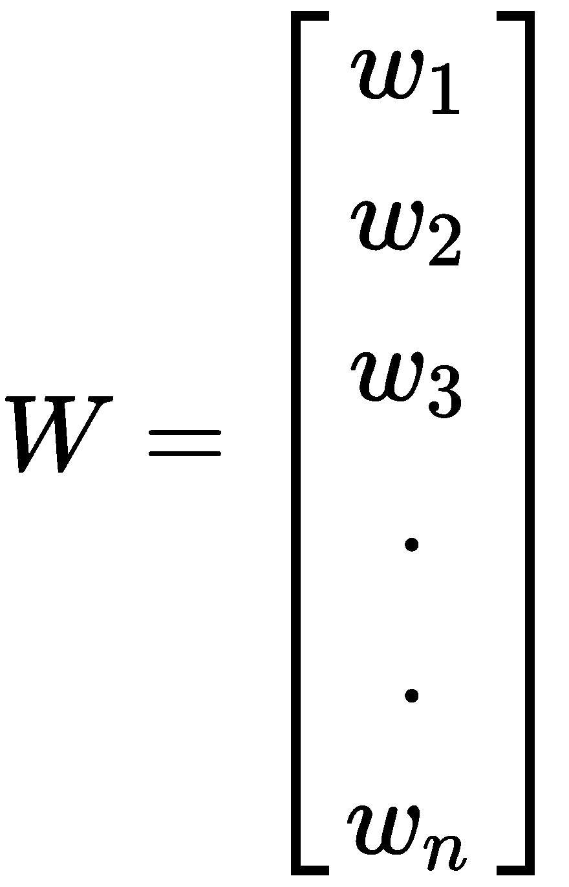

那么，我们需要对方程式进行哪些更改以适合这些多个输入？ 简单地总结一下！ 这会将基本公式`a = w.x + b`更改为以下公式：

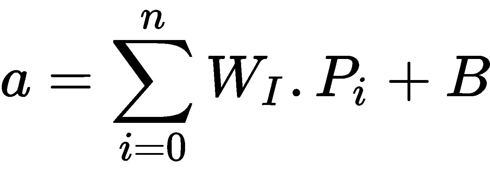

接受多个输入的人工神经元如下图所示：


但是一个神经元会独自做什么？ 尽管它仍然可以输出可用于进行二元判断（零或一）的值，但是我们需要大量相似的神经元以并行方式排列并相互连接，就像在大脑中一样，以便超越二元决策。 那么，它会是什么样？ 如下图：


现在需要对方程式进行哪些更改？ 只是权重向量和输出向量的尺寸。 现在我们将得到`n`x`m`权重数，其中`n`是输入数，`m`是神经元数。 同样，我们将从每个神经元获得单独的输出。 因此，输出也变成一个向量：

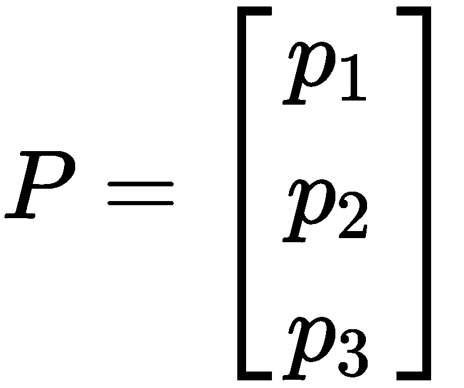 

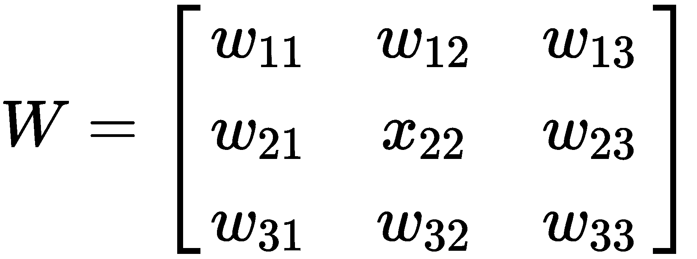 

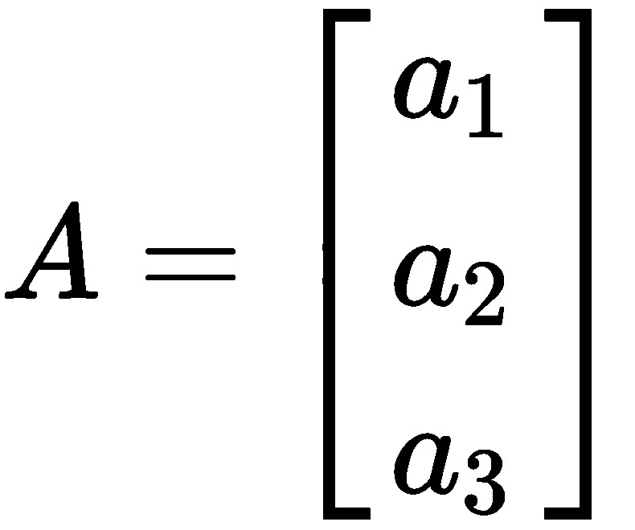

到目前为止，我们已经学习了对人工神经网络建模的基本结构和数学方程。 接下来，我们将看到另一个重要的概念，称为激活函数。

# 激活函数

激活函数是任何深度学习模型的组成部分。 激活函数是将输入值压缩到一定范围内的数学函数。 假设您输入具有实数输入的神经网络，并使用随机数初始化权重矩阵，并希望使用输出进行分类； 也就是说，您需要输出值介于零到一之间，但是您的神经元可以输出`-2.2453`或`17854.763`之类的任何值。 因此，需要将输出缩放到特定范围。 这是激活函数的作用：


根据要求，有很多激活函数。 我们将讨论深度学习中经常使用的一些激活函数。

# 线性激活

该激活与输入成比例。 它仅用于按一定常数`c`缩放输出。 以下是线性激活的输出`f(x)`与输入`x`的关系图：


# Sigmoid 激活

对于所有实数输入，此功能的输出范围从零到一。 这对于从神经元生成概率分数非常重要。 该函数也是连续且非线性的，有助于保持输出的非线性。 同样，曲线的梯度在原点附近陡峭，并且随着我们开始沿`x`轴移动而饱和。 这意味着，围绕原点的输入会发生微小变化，从而导致输出发生重大变化。 此特性有助于分类任务，因为它试图使输出保持接近零或一。 以下是针对输入`x`进行 Sigmoid 激活的方程式：


以下是 Sigmoid 激活函数的图解：


# Tanh 激活

Tanh 或 tan 双曲函数类似于 Sigmoid 函数，但输出范围从`-1`到`1`而不是从`0`到`1`。 通常在输出的符号对我们也很重要的情况下使用。 以下是 tanh 激活函数的图：


# ReLU 激活

整流线性或众所周知的 ReLU 函数是深度学习模型中使用最广泛的激活函数。 将负值抑制为零。 ReLU 之所以被广泛使用的原因是，它使产生负值的神经元失活。 在包含数千个神经元的大多数网络中都需要这种行为。 以下是 ReLU 激活函数的图：

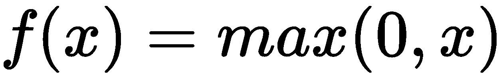


ReLU 的一种修改形式是泄漏的 ReLU。 ReLU 以负值完全使神经元失活。 泄漏的 ReLU 并没有完全使神经元失活，而是通过`c`降低了这些神经元的作用。 以下等式定义了泄漏的 ReLU 激活函数：


以下是 ReLU 激活函数的输出值图：

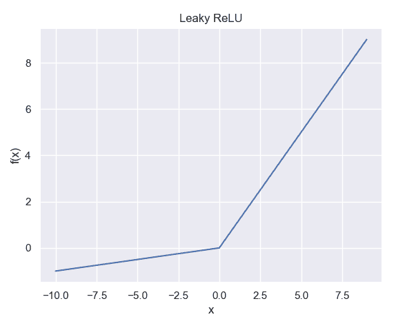

# Softmax 激活

这是大多数分类任务中要使用的激活函数。 大多数时候，网络必须预测属于该特定类别的输入的概率。 Softmax 激活输出此概率分数，表示模型对预测类别的信心程度：

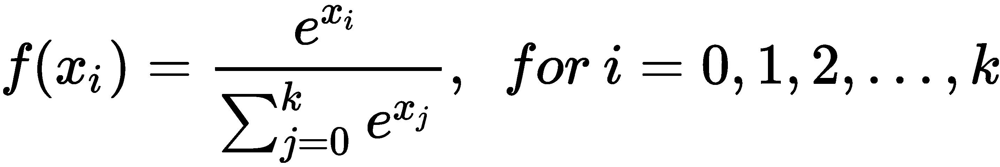

# TensorFlow 和 Keras

在继续进行之前，让我们快速设置编码环境。 本书在所有章节中都使用 Python 编程语言。 因此，我们希望您具有 Python 的先验知识。 我们将使用两个最受欢迎的深度学习开源框架-TensorFlow 和 Keras。 首先开始设置 Python（以防您尚未安装）。

我们强烈建议使用 Linux（最好是 Ubuntu）或 macOS 操作系统。 原因是大多数用于深度学习的库都构建为与 Linux/Unix 操作系统最兼容。 这些操作系统将涵盖所有设置说明。

在安装 Python 时，建议安装版本 3.6，而不是最新的 3.7 或更高版本。 这是为了避免由于 TensorFlow 中用作变量名称的 Python 中的新关键字而导致 TensorFlow 和 Python 之间发生不可预料的冲突。

# 搭建环境

在单独的环境中处理项目始终是一个好习惯。 环境是一个空间，它使安装在其中的库和依赖项与操作系统的全局空间保持隔离。 假设您必须从事两个项目； 一个需要较旧版本的库，另一个需要较新版本。 在这种情况下，全局安装新版本将覆盖旧版本，并使第一个项目无法使用。 但是，您可以为两个项目创建两个单独的环境，并分别安装所需的版本。 希望您现在有了在环境中工作的想法。

我们将使用 Miniconda，它是开源 Python 软件包管理和分发 Anaconda 的一小部分。 Conda 是 Miniconda 中的软件包管理器，可帮助安装和管理 Python 软件包。

我们将按照以下分步过程设置 Conda 的工作环境：

1.  根据您的操作系统从[这里](https://conda.io/en/latest/miniconda.html)下载适用于 Python 3.7 的 Miniconda。 只需运行下载的文件即可安装 Miniconda。

2.  您可能想创建一个单独的目录来存储我们将在本书中介绍的代码。 我们称它为`deep_learning`目录。 如果您希望升级到最新版本的 Conda 并升级软件包，请拉起终端并转到以下目录：

```py
conda upgrade conda
conda upgrade --all
```

3.  现在，我们将使用 Conda 来创建我们的工作环境。 在“终端”窗口中发出以下命令。 命名环境为您想要的； 我们在这里将其命名为`test_env`：

```py
conda create -n test_env
```

4.  要激活环境，请发出以下命令：

```py
conda activate test_env
```

5.  要在完成后停用环境，请在“终端”窗口中发出以下命令：

```py
 conda deactivate
```

在使用 Conda 创建的环境中，可以同时使用`pip`（Python 的默认软件包管理器）和 Conda（Anaconda 的软件包管理器）来安装库。

要查看您的环境中安装的软件包，可以使用以下命令：

```py
conda list
```

无论软件包是`conda`还是`pip`都将显示软件包。

# TensorFlow 简介

TensorFlow 是 Google Brain 团队开发的开源库，专门用于训练和运行深度学习模型。 TensorFlow 有两种版本：仅 CPU 版本和 GPU 支持版本。

# 安装 TensorFlow CPU

我们之前提到过，TensorFlow 目前在 Python 3.7 中不稳定。 因此，我们将使用 Conda 来安装 TensorFlow 而不是使用`pip`。 康达以独特的方式处理它。 一旦发出以下命令来安装 TensorFlow，Conda 也会下载并安装其他必需的软件包。 它还将 Python 恢复到 TensorFlow 稳定的版本，例如 Python 3.6.8！ 在“终端”窗口中键入以下命令（提及的注释除外）以安装 TensorFlow CPU：

```py
# go to the deep_learning directory
 cd deep_learning

# activate the environment
 conda activate test_env

# install TensorFlow CPU
 conda install tensorflow
```

安装后，您可以运行 Python 检查 Conda 是否已还原该版本。

所提到的命令与本书出版时的时间相同。 您必须知道库和存储库在不断变化。 如果命令无法正常运行，建议检查源中的最新更新。

# 安装 TensorFlow GPU

如果您具有 TensorFlow 支持的 GPU，则可以安装 TensorFlow GPU 版本以加快训练过程。 TensorFlow 为支持 NVIDIA CUDA 的 GPU 卡提供支持。 [您可以参考以下链接来检查是否支持您的 GPU 卡](https://www.tensorflow.org/install/gpu)。

要通过本地`pip`安装 TensorFlow GPU 版本，必须经过一系列繁琐的过程：

1.  下载并安装适用于您的操作系统的 CUDA 工具包
2.  下载并安装 cuDNN 库（以支持 GPU 中的深度学习计算）
3.  为`CUDA_HOME`和 CUDA 工具包添加路径变量
4.  通过`pip`安装 TensorFlow GPU

值得庆幸的是，Anaconda 只需一个命令即可编译所有内容，从兼容的 CUDA 工具包，cuDNN 库到 TensorFlow-GPU。 如果当前环境中已经安装了 TensorFlow CPU，则可以停用该环境并为 TensorFlow GPU 创建新的环境。 您只需在 Conda 环境中运行以下命令，它将为您下载并安装所有内容：

```py
# deactivate the environment
 conda deactivate

# create new environment
 conda create -n tf_gpu

#activate the environment
 conda activate tf_gpu

# let conda install everything!
 conda install tensorflow-gpu
```

安装完成后，就该测试安装了！

# 测试安装

要测试是否已成功安装，可以在 Python 中运行以下代码段。 如果您已安装 GPU 版本，请在 Python 中导入 TensorFlow 并运行以下命令：

```py
>>>import tensorflow as tf
>>>sess = tf.Session(config=tf.ConfigProto(log_device_placement=True))
```

如果您已成功安装 GPU 版本，这将返回有关 GPU 卡的详细信息以及 TensorFlow 编译使用的其他详细信息。

为了正确检查安装（与 CPU 或 GPU 版本无关），我们将执行以下简单的张量乘法运算：

```py
>>>t1 = tf.constant([8.0, 4.0, 3.0, 10.0, 9.0, 2.0], shape = [2,3],name='tensor1')
>>>t2 = tf.constant([12.0, 6.0, 4.0, 5.0, 9.0, 1.0], shape = [3,2],name='tensor2')
>>>out = tf.matmul(t1, t2)
>>>sess = tf.Session()
>>>print(session.run(out))
```

此代码必须打印两个张量的按元素相乘的输出。

# 认识 TensorFlow

与传统的 Python 库不同，TensorFlow 首先构建一个包含模型结构的空图，然后使用`Session`通过输入数据来运行该图。 为了输入数据，TensorFlow 使用**张量**。 张量不过是多维数组。 张量是 TensorFlow 中数据的基本单位。 张量的维数由其秩表示，形状的表示像`numpy`矩阵（例如`[2, 3]`）。

# 建立图

TensorFlow 图是在图中组织的一系列操作。 首先以 TensorFlow 图的形式构建模型架构。 您需要记住三个基本操作：

*   `tf.constant`：像 Python 中的常量一样，拥有一个常量张量，但是与 Python 不同，它仅在 TensorFlow 会话期间被激活。
*   `tf.Variable`：持有在训练期间可学习的可变张量并更新值。
*   `tf.Placeholder`：这是 TensorFlow 的有趣功能。 在构建图形时，我们不提供输入数据。 但是，需要布置图形将要接收的输入的形状和数据类型。 因此，占位符充当一个容器，当会话被激活时，它将允许输入张量的流动。

让我们尝试在 TensorFlow 中添加两个常量，如下所示：

```py
>>>import tensorflow as tf
>>>t1 = tf.constant('hey')
>>>t2 = tf.constant('there')
>>sum = t1 + t2
>>>print(sum)
```

这将输出如下内容：`add:0`，`shape=()`，`dtype=string`。 您期待`heythere`吗？ 这不会发生，因为 TensorFlow 仅在激活会话后才运行图形。 通过定义常量，我们只制作了一个图形，这就是为什么打印试图告诉运行该图形的总和的原因。 因此，让我们创建一个会话。

# 建立会话

`tf.Session`对象用于创建会话。 默认情况下，它采用当前图形，或者您可以指定要使用的图形：

```py
>>>sess = tf.Session()
>>>print(sess.run(sum))
```

这将按预期打印`heythere`。

# Keras 简介

Keras 还是一个流行的深度学习开源库。 Keras 更像是包装器，可以简化构建和训练模型。 它使用 TensorFlow 作为其后端。 由于 TensorFlow 的结构复杂，在 TensorFlow 中构建复杂的深度学习架构可能会变得非常棘手。 Keras 提供了非常人性化的编码体验以及模型的快速原型制作。 您可以使用 Conda 安装 Keras：

```py
conda install keras
```

# 顺序 API

Keras 中的模型架构可以简单地通过一层又一层地堆叠来构建。 这在 Keras 中称为顺序方法，是最常见的一种方法：

```py
from keras.models import Sequential. # importing the Sequential class
from keras.layers import Dense.      #importing the Deep Learning layers

model = Sequential()                #making an object of Sequential class

#adding the first Dense layer. You have to mention input dimensions to the first
#layer of model. 
model.add(Dense(units=128, input_dims = 100, activation = 'relu))
model.add(Dense(units = 4, activation = 'softmax'))
```

完成模型架构后，Keras 将使用`model.compile`方法构建具有所需损失函数和优化器的图形，并使用`model.fit`使用输入来训练模型。 如果您没有获得什么损失函数，请不要担心！ 我们将在随后的章节中讨论所有这些。

# 函数式 API

这只是用于编码模型图的另一种布局。 如果您更熟悉 Python 样式代码编写，则可以选择以下布局：

```py
from keras.models import Model
from keras.layers import Dense, Input

#defining input placeholder with input shape
inp = Input(shape = 100)

# layers
x = Dense(units = 128, activation = 'relu')
x = Dense(units = 64, activation = 'relu')

# taking output
predict = Dense(units = 4, activation = 'softmax')(x)

# defining model
model = Model(inputs = inp, outputs = predict)
```

# 总结

让我们快速看一下本章中学到的内容。 我们首先简要讨论了人工智能及其通过机器学习和深度学习的演变。 然后，我们看到了有关深度学习的一些有趣应用的详细信息，例如机器翻译，聊天机器人和光学字符识别。 这是本书的第一章，我们专注于学习深度学习的基础知识。

我们了解了 ANN 在某些数学的帮助下如何工作。 此外，我们看到了 ANN 和深度学习中使用的不同类型的激活函数。 最后，我们开始使用 TensorFlow 和 Keras 设置我们的编码环境，以构建深度学习模型。

在下一章中，我们将看到神经网络如何演变成深度前馈网络和深度学习。 我们还将使用 TensorFlow 和 Keras 编写我们的第一个深度学习模型！