# 深度前馈网络

在本章中，您将构建我们的第一个深度学习网络-**深度前馈网络**（**DFN**）。 我们将首先讨论深度前馈网络的演进历史，然后讨论 DFN 的体系结构。 在任何分类任务中，DFN 都扮演着不可或缺的角色。 除了支持分类任务外，DFN 独立版还可以用于回归和分类。 任何深度学习网络都具有很多要素，例如损失函数，梯度，优化器等，它们一起来训练网络。 在本章中，我们将详细讨论这些基本要素。 这些要素对于我们将在本书中看到的各种深度学习网络都是通用的。 我们还将演示如何提出和预处理数据以训练深度学习网络。 刚开始您可能会觉得有些难以理解，但是最终您会明白的。 所以，只要坚持下去！ 完成本章后，您将了解以下内容：

*   DFN 的体系结构
*   损失函数
*   梯度下降
*   反向传播
*   过度拟合和正则化
*   编码您的第一个 DFN

让我们从 DFN 的演进历史开始！

# 通往 DFN 的进化之路

沃伦·麦卡洛克（Warren McCulloch）和沃尔特·皮茨（Walter Pitts）最早在 1943 年创建了人工神经网络模型。他们基于**阈值逻辑**建立了该模型。 通过对输入求和来计算阈值，根据阈值，输出为二进制，零或一。 1958 年，Rosenblatt 创建了另一个神经元模型，称为**感知器**。 Perceptron 是人工神经元的最简单模型，可以将输入分为两类（我们在“第 1 章”，*深度学习入门*中讨论了该神经元）。 亨利·凯利（Henry J.Kelley）大约在 1960 年代初提出了使用链规则通过反向传播错误来训练神经网络的概念。 然而，反向传播作为一种算法是非结构化的，并且感知器模型无法解决那个著名的 XOR 问题。 1986 年，Geoff Hinton，David Rumelhart 和 Ronald Williams 证明了具有隐藏层的神经网络可以通过反向传播学习非线性函数。 此外，还强调了神经网络能够通过通用逼近定理学习任何函数。 但是，神经网络无法扩展以解决较大的问题，到 90 年代，其他机器学习算法（例如**支持向量机**（**SVM**））占据了空间。 在 2006 年左右，Hinton 再次提出了在彼此之间添加层并为新层训练参数的想法。 使用该策略对更深层的网络进行了训练，这些网络被称为**深度前馈网络**。 从这里开始，神经网络有了一个新名称-深度学习！

接下来，我们将讨论 DFN 的体系结构设计。 我们将了解如何构建，训练分层结构，以及*深*和*前馈*这两个术语的重要性。

# DFN 的体系结构

在上一章中，我们看到了多神经元人工神经网络的体系结构。 但是，该体系结构仅由单层神经元组成。 现在考虑一下大脑：它是单层神经元还是多层？ 是的，大脑有多层神经元，神经元层之间是一层又一层地连接在一起的。 进入大脑的输入经过初始层以提取低级特征，并经过连续层以提取高阶特征。 DFN 的架构受到多个神经元的分层结构的启发。 该网络具有连续堆叠的各个层，其中前一层的神经元输出被前馈作为下一层的输入（这就是为什么该网络称为前馈网络）。 体系结构输入层，隐藏层和输出层中存在三种类型的层。 下图中可以看到这些层：


根据通用逼近定理，具有单个隐藏层的前馈神经网络能够用有限数量的神经元建模任何实函数。

[您可以通过以下链接阅读有关通用逼近定理的更多信息](https://en.wikipedia.org/wiki/Universal_approximation_theorem)。

但是，神经元的数量增长到如此之快，以至于几乎不可能建立这样的网络。 相反，增加层数可以增加神经元的数量，并有助于更好地学习特征。 网络越深（具有更多的隐藏层），学习就会越好。 接下来是显示典型 DFN 的示意图。 为了简单起见，图中没有显示偏差和标签，但是它们的作用类似于前馈网络：


希望您现在了解*深*和*前馈*在 DFN 中的含义。 接下来，我们将看到如何训练这些网络以学习损失函数和反向传播算法。

# 训练

DFN 中存在的权重值负责进行预测。 任何深度网络都具有如此众多的权重，以至于不可能找到理想的权重值。 因此，我们尝试搜索一组权重值，这些值将给我们足够好的预测结果。 因此，训练网络意味着从一组初始权重开始学习最佳权重值。 假设我们有一个 DFN，最初，我们不知道哪种权重会表现良好。 因此，我们用随机实数初始化权重值。 现在，我们必须从初始化的权重值转到最佳权重值。 我们可以将该任务分为以下三个部分：

*   首先，我们需要知道初始化的权重是否合适。 如果不是，那么预测输出与预期输出有多少不同？ 这由损失函数计算。
*   其次，提出了**最大似然估计**（**MLE**）的概念，该概念指出，为了找到一组优化的参数（在我们的情况下为权重），我们需要最大化 获得期望值的可能性（概率）。 简而言之，如果我们尝试通过更改权重（参数）来使损失函数最小化，那么我们会将预测输出分布的概率最大化，使其与预期分布尽可能接近。
*   从以上两点可以得出结论，我们需要通过更新权重来最小化损失函数。 当达到损失的最小可能值时，可以说网络已经学习（训练）了映射函数，以预测接近预期值的值。 在 DFN 中，结合梯度下降和反向传播算法来完成权重的更新和损失函数的最小化。

在随后的部分中，我们将进一步讨论损耗函数，以及如何将其最小化以训练具有梯度下降和反向传播的网络。

# 损失函数

将视为来自 DFN 的预测输出，并将视为预期的输出（或标签）。 损失函数可以衡量您的预测的正确性！ 根据期望输出和预测输出之间的差异定义最简单的损失函数，如下所示： *L（w）*：

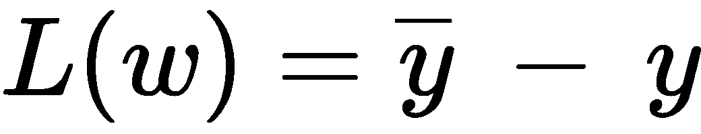

但是，这种简单的方程式被认为是一种不好的措施，因为这种损失函数倾向于给出可能为负也可能为正的值。 已经为回归和分类任务开发了各种损失函数，我们将在以下小节中介绍它们。

# 回归损失

回归任务需要直接预测值，并且预期输出也是直接值。 这使我们能够基于两个值之间的差异来确定损失。 我们将看到的第一个也是最常见的回归损失是均方误差损失。

# 均方误差（MSE）

让我们假设我们的数据集中有`n`个样本。 这意味着我们将具有`n`个预测值（ *y <sub>1，...，</sub> y <sub>i，...，</sub> y <sub>n</sub>* ）和`n`对应的期望值（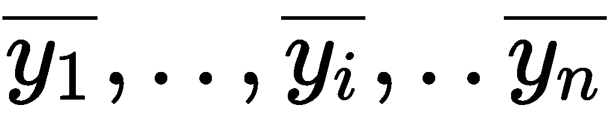）。 均方由以下公式定义：


顾名思义，该误差函数将预测值和期望值（误差）之间的差平方，然后取平均值。 根据值的不同，误差可能是正值，也可能是负值，将它们相加会导致具有相反符号的值被抵消，从而导致不正确的损失值。 因此，在求和之前将它们平方以使所有值均为正。 这样，每个误差仅会影响其大小。 采取另一种手段来使损耗正常化并避免突然的高损耗值。 由于存在平方值，因此数据中的任何异常值（输出值与预期值相距甚远的样本）将对损失造成的影响超出其应有的范围。

因此，如果数据集中有很多离群值，那么 MSE 并不是一个合适的选择！ 但是，平方的易计算性和函数是可微的，MSE 是回归中最常见的损失函数。 解决具有不同符号的错误问题的另一种方法是 MSE。

# 平均绝对误差

平均绝对误差而不是平方误差，而是采用误差的绝对值使所有结果为正。 与 MSE 相比，采用绝对值而不是平方会使损失函数对异常值的敏感性降低。 但是，计算绝对值需要通过线性编程进行计算，并使损失函数不可微，这可能会导致重大问题，同时通过反向传播更新权重值。 （我们将在接下来的部分中看到反向传播。）以下等式描述了平均绝对误差函数：


# 分类损失

分类任务没有直接值可以预测。 相反，它们通常具有表示输入所属类别的正整数标签。 因此，期望值和预测值都只是整数表示。 因此，直接采用差异对分类将不起作用，对于回归也是如此。 为了解决这个问题，在概率分布上开发了损失函数。 分类的最常见损失函数之一是交叉熵。

# 交叉熵

可以将分类问题视为预测属于每个类别的输入的概率。 训练数据将由每个班级的零或一的标签组成。 标签也可以被视为概率值：一个代表输入属于该类的肯定可能性，而零表示该输入不属于该类。

为了比较预测输出和预期输出，我们因此需要一种方法来比较两个概率分布（预测和预期标签的概率分布）。 交叉熵的作用完全一样！ 认为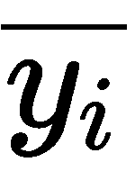是 *i <sup> th </sup>* 训练样本的预期标签，而是我们模型中的预测标签。 然后，通过以下等式定义交叉熵损失：


由于使用了对数，因此交叉熵也称为*对数损失*。 当两个概率分布相似时，交叉熵损失将减少，并且当分布彼此不同时，交叉熵损失将增加。

我们已经说过，我们需要最小化损失函数。 我们将看到梯度下降是如何实现的。

# 梯度下降

让我们考虑成本函数 **J（w）**，它是网络权重`w`的函数。 成本函数仅是损失函数与其他与正则化相关的参数的组合。 （我们稍后将讨论过度拟合和正则化。暂时，考虑成本函数与损失函数相同。）我们可以假设由下图表示的凸成本函数 **J（w）**：


前面我们提到，最初，我们选择一个随机值作为权重。 假设初始重量由上图中的`A`表示。 我们的目标是达到成本函数的最小值，例如 *J <sub>min</sub> （w）*。 假设先前示例中的成本函数在点`B`处具有最小值。 您可能会注意到，成本函数的最小值（点`B`）的斜率为零，而对于其他点（例如点`A`（我们的初始点））则不为零。 。 因此，我们可以利用成本函数的梯度（斜率）来达到最小值。

梯度或斜率是`y`轴值相对于`x`轴的变化率。 在函数的任何一点上，通过计算该函数相对于`x`的导数即可获得梯度。

这个想法是在初始点计算成本函数的梯度，然后以减小梯度直到其变为零（这将是最小值）的方式更新权重。 这就是为什么将该方法称为**梯度下降**的原因。 那么，权重如何更新？ 梯度下降的不同变化使用不同的策略来更新权重。 梯度下降主要有三种类型：批量梯度下降（香草梯度下降），随机梯度下降和小批量梯度下降。

# 梯度下降的类型

在讨论梯度下降的类型之前，我们应该了解一个重要的参数，称为学习率（）。 梯度下降逐步达到成本函数的最小值。 学习率决定了步骤的持续时间。 随着权重的更新，决定合适的学习率至关重要。 如果学习率太大，权重更新可能会超出最小值，这将导致最小值周围的永无止境的振荡。 如果学习率太小，该算法将采取非常小的步骤，这可能需要大量时间才能收敛到最小值。

为了使视图更清晰，下图中描述了这两种方案：

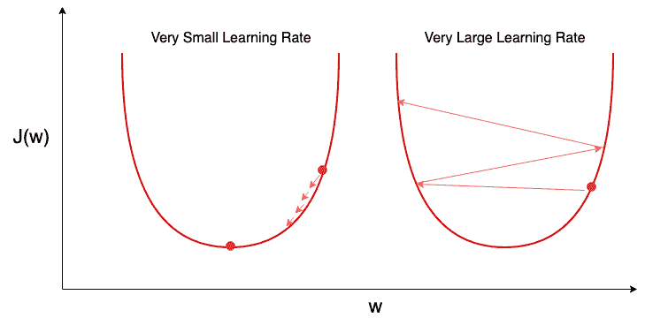

现在，我们将看到梯度下降的第一个基本变体-批梯度下降。

# 批次梯度下降

让我们说 *w <sub>新</sub>* 是一批梯度下降之后经过更新的权重集合，而`w`是旧的权重集合。 权重根据以下规则进行更新：


您可以通过考虑我们的成本函数 *J（w）*上的一个随机点来验证自己，即新的权重将始终朝向最小值。 批梯度下降需要计算整个数据集的梯度以执行一组更新。 因此，对于大型数据集，批次梯度下降的速度非常慢。 对于零件中处理的数据集，几乎不可能进行批次梯度下降。 为了克服这一主要缺点，引入了梯度下降的另一种形式-随机梯度下降。

# 随机梯度下降

经过训练集中的每个样本后，随机梯度下降会更新权重。 让我们考虑`i`<sup>*第*</sup> 训练样本 *x <sup>i</sup>* 及其对应的标签 *y <sup>i</sup>* 。 随机梯度下降下的权重更新规则如下：

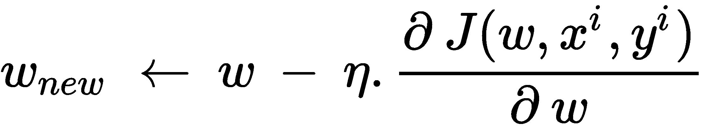

在每个样本之后更新权重可显着提高梯度下降的收敛速度。 但是，这会使更新过于频繁，从而导致成本函数的波动。 但是，波动解决了一个有趣的问题，即权重卡在**局部最小值**上。 到现在为止，我们已经看到只有一个**全局最小值**的简单成本函数。 想象一个具有多个**局部最小值**的复杂成本函数。 **全局最小值**不必与**局部最小值**相同。 通常，批次梯度下降倾向于卡在最接近的初始化最小值，而该最小值可能不是**全局最小值**。 另一方面，随机梯度下降的波动允许跳到另一个可能更好的**局部最小值**。 下图显示了具有多个最小值的复杂成本函数：


# 小批量梯度下降

在每个样本之后更新权重会创建很多冗余更新，而在通过完整的数据集之后更新权重实际上也是不可能的。 微型批次梯度下降法通过从数据中进行微型批次后更新权重来解决这两个问题。 微型批次是来自训练数据的一小部分样本； 例如，如果一个数据集有 10,000 个训练样本，我们可以将数据分为多个小批，例如 64 个。在每次微型批处理之后，权重都会更新。 假设`n`为微型批次的大小，则权重更新规则如下：

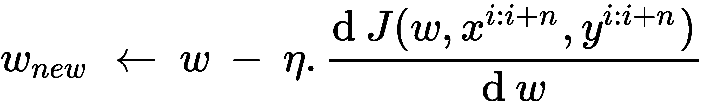

# 反向传播

我们已经看到了如何使用梯度下降来更新权重，但是要执行梯度下降，我们需要计算成本函数相对于权重的梯度（导数）。 假设要计算成本函数相对于权重`w`的梯度，我们可以使用以下导数方程，其中`h`是一个小的正数：


在这里，要计算权重的梯度，我们需要计算两次成本函数，即执行两次完整的前向传递。 任何深度学习网络都具有数百万的权重，并且通过上述公式计算梯度将在计算上非常昂贵。 那么，对此有什么解决方案？ 反向传播！ 1986 年，当 David Rumelhart，Geoffrey Hilton 和 Ronald Williams 表明使用反向传播在神经网络中可以更快地计算梯度时，该算法获得了发展。 反向传播算法的核心是链式规则。 链式规则允许您仅通过一次向前和一次向后通过来计算所有所需的梯度。

链规则用于计算复合函数的导数。 考虑两个函数 *z = f（y）*和 *y = g（x）*，则函数 *z = f（y）*的导数`x`可以作为 *z = f（y），*相对于`y`以及 y 相对于[[`x`。 以下等式表示相同：

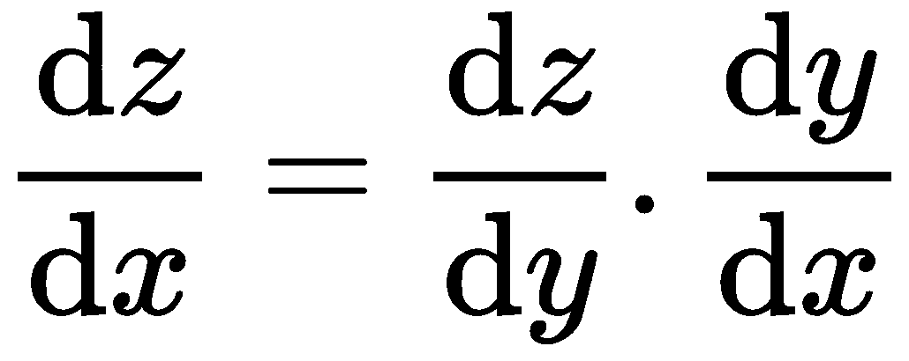

类似地，链规则可以扩展为`n`具有互变量的不同函数。

在转到该算法之前，我们将看到将要使用的符号。 *w <sub>jk</sub>* <sup xmlns:epub="http://www.idpf.org/2007/ops">`l`</sup> 将用来表示从`k`<sup xmlns:epub="http://www.idpf.org/2007/ops">*th 起的重量连接 *（l-1）<sup>第</sup>* 层的*</sup> 神经元与`j`<sup xmlns:epub="http://www.idpf.org/2007/ops">*th* 神经元`1`<sup xmlns:epub="http://www.idpf.org/2007/ops">*第*</sup> 层。 对于偏差， *b <sub>j</sub>* <sup xmlns:epub="http://www.idpf.org/2007/ops">`l`</sup> 将用于 *j <sup>th</sup>* 神经元`l`<sup xmlns:epub="http://www.idpf.org/2007/ops">*第*</sup> 层。 对于激活功能， *a <sub>j</sub>* <sup xmlns:epub="http://www.idpf.org/2007/ops">`l`</sup> 用于表示 *j <sup>th</sup>* 的激活`l`<sup xmlns:epub="http://www.idpf.org/2007/ops">*th*</sup> 层中的神经元。 该符号易于理解。 上标表示层数，而下标表示层的神经元。</sup>

对于`l`<sup>*th*</sup> 层，输出可以用以下等式表示，其中 *l <sup>th</sup> 的输入*层是*（l-1）* <sup>*th*</sup> 层的激活输出， *a <sup>l-1</sup> = （z <sup>l-1</sup> ），* 代表激活功能：


接下来，考虑`l`<sup>*th*</sup> 层中`j`<sup>*第*</sup> 神经元 错误 * <sup> l </sup> <sub> j </sub> * 由以下给出：

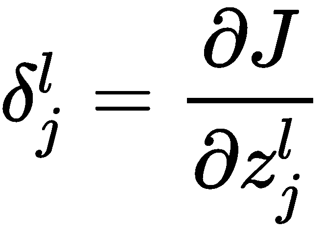

使用链式规则，我们可以编写以下公式：


同样，我们计算每一层的误差。 通过*（l + 1）* <sup>*第*</sup> 层和*层之间的误差之间的以下关系，计算最后一层的误差并将其反向传播到前一层。 l* <sup>*第*</sup> 层，其中表示逐元素乘法：

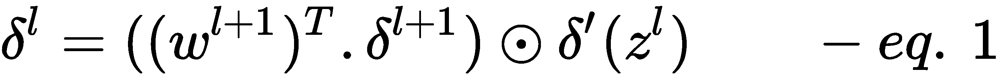

最后，根据以下等式，使用这些误差来计算成本函数相对于各层权重的梯度：


我们将不对方程进行数学证明，但是您可以了解算法如何根据*方程*从最后一层计算误差并将误差反向传播到先前的层。 例如`l`<sup xmlns:epub="http://www.idpf.org/2007/ops">*th*</sup> 层`j`<sup xmlns:epub="http://www.idpf.org/2007/ops">*th*</sup> <sup xmlns:epub="http://www.idpf.org/2007/ops">[HTG15 因此，]神经元被计算为该层*（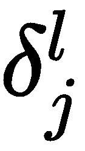）*与`k`<sup xmlns:epub="http://www.idpf.org/2007/ops">* th *</sup> 神经元的激活输出的乘积。 从前一层到`l`层的`j`<sup xmlns:epub="http://www.idpf.org/2007/ops">*第*</sup> 神经元。</sup>

现在，我们已经看到了如何通过单次向后传递来计算权重更新所需的梯度。 我们已经提到了由于局部最小值和复杂的成本函数，梯度下降无法正确收敛的挑战。 接下来，我们将看到优化器如何通过调整学习率解决该问题。

# 优化器

当沿着成本函数的斜率下降时，我们需要朝着所需的最小值靠拢一些。 否则，我们将超调，然后围绕最小值波动。 这可以通过在培训期间保持学习率可变来实现。 优化器提供的算法可在整个培训过程中调整学习率，以提供更好的收敛性。 TensorFlow 中的优化器执行使损失函数（成本函数）最小化的任务。 最常用的两个优化器是 Adam 优化器和 RMSProp 优化器。 我们将不在此处讨论优化器涉及的数学。

# 训练，测试和验证

通常，我们不会使用可用于训练模型的全部数据。 这样做将使我们没有任何余地来判断我们训练后的模型的性能，也无法检查训练是否朝着正确的方向进行。 我们将数据分为以下三组：

*   训练集
*   验证集
*   测试台

# 训练集

训练集包含将用于训练模型的数据。 该集合是三个集合中最大的集合，并且包含大多数数据（因为我们不想丢失很多训练数据）。 该模型通过迭代训练集来学习特征和模式。 尽管我们在训练期间测量训练的准确率，但实际上并没有评估模型。 由于模型已从训练集中学习并熟悉数据，因此训练精度可以达到很高的值。 因此，高训练精度并不一定意味着一个好的模型。 当模型对看不见的数据进行预测时，将对模型进行实际评估。

# 验证集

在训练模型时，验证集为模型提供了频繁且公正的评估。 我们不在训练集中包含验证集，但在训练过程中进行某些迭代后，将继续检查验证集的准确率。 验证集有助于在训练过程中微调参数。

最初，验证集似乎并不那么重要，但是当我们讨论过度拟合时，您会看到它扮演的重要角色。

# 测试集

训练我们的模型的目的是对未知数据（模型未看到的数据）做出良好的预测。 因此，必须使用模型从未见过的数据来进行真正的评估。 测试集通常是从全部可用数据中保留的，在训练过程中永远不会显示给模型。 测试集可让您使用未知数据评估我们的模型。 这里要了解的重要事项是对于受监管的任务，`T`**est Set** 还包含数据和相应的预期标签，例如 **Training Set** 。 仅当我们将模型预测与标签进行比较以计算准确率时，才使用标签。 因此，应为**验证集**和**测试集**保留多少数据？

通常，最好将 80％的可用数据保留为**训练集**，将 10％作为**验证集，**，将最后 10％作为**测试集。** ，如下图所示：

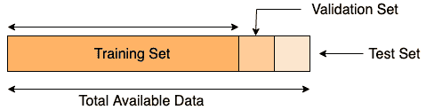

# 过度拟合和正则化

任何深度学习网络（例如 DFN）都具有很多可学习的参数（以百万计）。 具有大量参数的网络可以适合任何数据分布。 但是，训练的重点不是完全适合训练数据，而是学习表征数据的一般特征和模式。 模型可能会学会正确预测训练集中的每个样本，但无法在测试集中执行。 这通常发生在具有大量参数的网络中。 免费的可学习参数可用于学习训练集的每一个复杂性。 但是，这样做时，网络会过度学习，并且变得非常特定于训练数据，无法对不熟悉的数据执行操作。 这种过度学习现象被称为过度拟合。 下图可以使您对现象有更好的了解。 过度拟合的模型学习非常特定于训练数据的决策边界（红色），这通常不是一个好的决策边界：

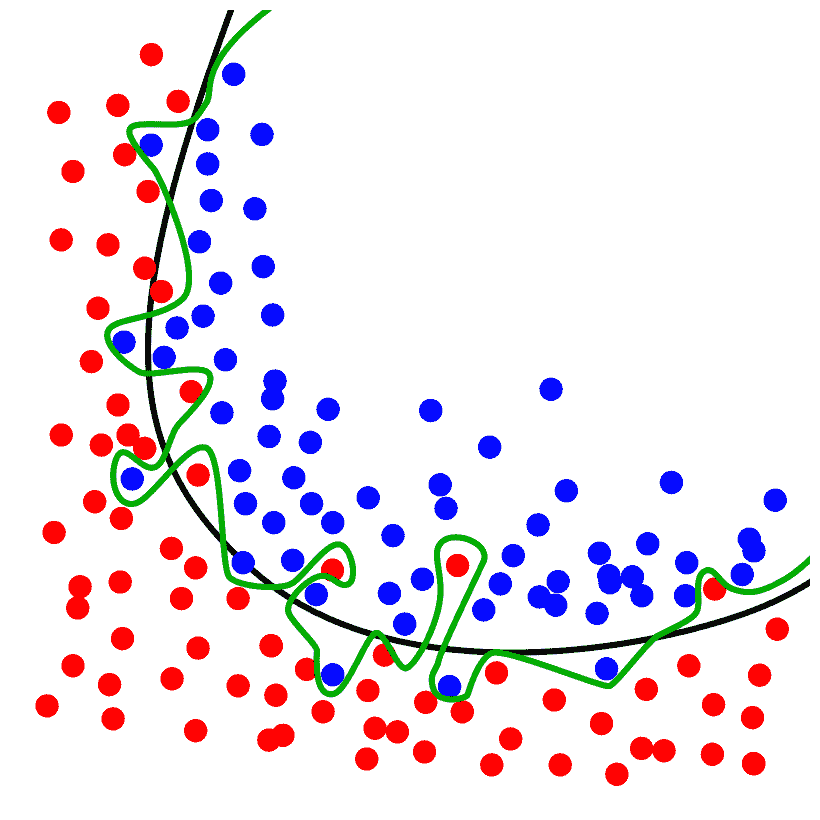

黑线表示拟合良好，绿线表示过度拟合-图片来自 Wikipedia

为了避免过度拟合，在深度学习中使用了正则化技术。 正则化到底是什么意思？ 正则化通过惩罚或带来参数的随机性来限制参数的过度学习。 使用三种主要的正则化技术来避免过度拟合：

*   L1 和 L2 正则化
*   退出
*   早停

数据扩充也被考虑在正则化下。 它涉及操纵输入数据以创建同一数据的更多变体。 例如，图像被移动和缩放以产生更多的变体。 数据扩充方法针对不同类型的数据而有所不同。

# L1 和 L2 正则化

记得我们之前提到过，成本函数是损失函数与正则化参数的组合。 L1 和 L2 是添加到损失函数以构成成本函数的参数。 L1 和 L2 通过使某些权重可以忽略不计，从而损失了损失函数，从而减少了可能导致过度学习的自由参数。

L1 正则化将权重的绝对值作为惩罚系数添加到损失函数中，如下式所示：


公式中的第一项表示权重的平方损失函数，第二项是 L1 正则化系数。 是一个超参数，可以手动调整以达到良好的匹配度。 L1 正则化被认为是健壮的，因为它对数据的异常值不那么敏感。 但是 L1 正则化有时可能会在计算上变得昂贵，并可能在我们的损失函数中引入不连续性。 因此，由于其复杂性，通常不使用 L1 正则化。

另一方面，L2 正则化将权重的平滑平方值作为损失因子加到损失函数，如以下公式所示：


使用 L2 正则化的优点是易于计算平方并通过损失函数确保连续性。 但这是以敏感性为代价的。 由于平方项，L2 正则化会放大离群值的损失函数，因此使成本函数非常敏感。 在下一小节中，我们将看到什么是辍学以及如何避免过度拟合。

# 退出

辍学是处理神经网络过度拟合（或深度学习）的独特方法。 为了引入网络中的随机性，丢弃操作通过删除与该节点之间的权重连接来随机删除几个节点（神经元）。 辍学在每个迭代中随机发生。 下图显示了 DFN 中辍学的工作方式：


# 早停

在讨论验证集时，我们稍后将讨论验证集在过度拟合中的作用。 在训练过程中，我们实际上不知道有多少次迭代训练模型。 这通常是过度拟合的原因。 知道何时停止是重要的事情！ 培训时设置验证集有助于我们决定何时停止。 由于训练算法将训练损失降到最低，因此不管模型是否过度拟合，损失将始终保持减少。 因此，除了训练损失，我们还监视验证集上的损失。 训练和验证损失都将持续减少，直到达到最佳点为止。 此后，由于过度拟合，验证损失将再次开始增加。 验证和训练损失开始出现分歧的点是我们需要停止过度训练并避免过度拟合的点。 您可以在下图中观察到相同的结果：

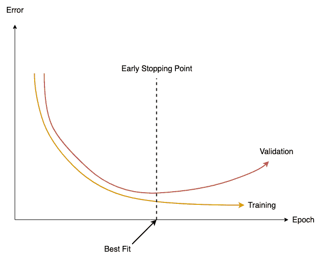

到目前为止，我们已经收集了有关深度学习基本方面的足够信息。 因此，让我们开始深入研究使用 TensorFlow 编码我们的第一个 DFN！

# 建立我们的第一个 DFN

到目前为止，我们已经了解了 DFN 的工作原理，以及有关网络训练的体系结构和方面。 在本节中，我们将使用 TensorFlow 构建我们的第一个 DFN。 建立任何深度学习将或多或少涉及以下步骤：

1.  读取输入数据和预期输出数据（标签）
2.  准备所需格式的数据（预处理）
3.  将数据分为训练集，验证集和测试集（验证集有时是可选的）
4.  建立模型架构图以及损失函数和优化器以更新权重
5.  运行 TensorFlow 会话以遍历数据并训练网络
6.  通过测试数据测试模型的准确率

# MNIST 时尚数据

MNIST 是手写数字的数据集，其中包含 60,000 个训练样本和 10,000 个测试样本（从零到九的手写数字）。 每个样本都是 28 x 28 单通道（灰度）图像。 数据集被广泛用作深度学习的起点。 但是，对于深度学习模型，数据集非常简单且易于学习。 而且，数据集并不是现实计算机视觉任务中图像的很好示例。

因此，我们将在 MNIST 时尚数据集上建立第一个模型，该数据集的开发方式与原始 MNIST 类似。 它有 10 个时尚商品（T 恤，裤子，套头衫，衣服，外套，凉鞋，衬衫，运动鞋，包和脚踝靴）的 60,000 个培训和 10,000 个测试样本。 与原始 MNIST 一样，时尚 MNIST 也具有 28 x 28 灰度图像，但是图像学习起来更为复杂。 有关数据集的更多信息，请参见[这里](https://github.com/zalandoresearch/fashion-mnist)。

# 获取数据

TensorFlow 已经具有内置的`keras`类，用于下载和管理 MNIST 方式提供的数据。 因此，您不必手动下载数据，TensorFlow 会为您完成！ 我们将从以下步骤开始：

1.  让我们编写一个 Python 脚本来构建我们的第一个 DFN。 首先，导入所需的依赖项，如下所示：

```py
import tensorflow as tf
import numpy as np
import matplotlib.pyplot as plt
from sklearn.model_selection import train_test_split

from tensorflow import keras
```

Scikit-learn 或 sklearn 是一个重要的 Python 库，它提供了很多机器学习模型以及数据准备方法的帮助。 您可以使用以下命令安装`scikit`学习：
**`$ conda install scikit-learn`** 。

2.  使 TensorFlow 的`keras`类的对象具有如下数据加载功能：

```py
# making object of fashion_mnist class
fashionObj = keras.datasets.fashion_mnist
```

3.  如果尚未在系统上下载`load_data`方法，它将下载 MNIST 时尚数据集：

```py
# trainX contains input images and trainY contains corresponding labels.
# Similarly for test

(trainX, trainY), (testX, testY) = fashionObj.load_data()
print('train data x shape: ', trainX.shape)
print('test data x shape: ', testX.shape)

print('train data y shape: ', trainY.shape)
print('test data y shape: ', testY.shape)
```

4.  加载数据后，我们将打印训练数据以及测试数据的形状。 输出形状应如以下屏幕截图所示：


数据中包含的标签是数字，从`0`到`9`，其中每个整数代表一个类。 我们将制作一个字典，将这些整数映射到 MNIST 时尚数据中提到的类。 您可以在以下屏幕截图中看到整数及其对应的类：


前面输出的代码如下：

```py
# make a label dictionary to map integer labels to classes
classesDict = {0:'T-shirt/top', 1:'Trouser', 2:'Pullover', 3:'Dress',                 4:'Coat',5:'Sandal', 6:'Shirt', 7:'Sneaker', 8:'Bag', 9:'Ankle boot'}
```

# 可视化数据

让我们看看数据集中的一些图像及其对应的标签。 我们使用`matplotlib`库从数据绘制四个样本图像，如以下代码所示：

```py
rows = 2
columns = 2
fig = plt.figure(figsize = (5,5))

for i in range(1, rows*columns +1):
  image = trainX[i]
  label = trainY[i]

  sub = fig.add_subplot(rows, columns, i)
  sub.set_title('Label: ' + classesDict[label])

  plt.imshow(image)
plt.show()
```

图像图将类似于以下屏幕截图。 每个子图的标题传达了图像所属的类：


# 标准化和分割数据

图像中像素的值范围为 0 到 255。始终建议在计算上将输入值保持在`0`至`1`之间。 因此，我们将通过将数据除以最大可能值 255 来归一化我们的数据，以使`0`至`1`之间的所有内容都变为正常。 同样，输入图像的尺寸为 28 x 28，但我们的 DFN 并不采用二维输入。 因此，我们将输入训练图像从（`60000, 28, 28`）展平到（`60000, 784`）并测试从（`10000, 28, 28`）到（`10000, 784`）的输入图像：

```py
trainX = trainX.reshape(trainX.shape[0], 784) / 255.0
testX = testX.reshape(testX.shape[0], 784) / 255.0
```

数据集已经分为两部分-训练数据和测试数据。 因此，我们只需要将训练数据分为验证和训练数据即可。 我们将使用 sklearn 的`train_test_split`方法进行此操作。 该方法还会在拆分之前对数据进行混洗，以确保拆分后的数据不会偏向某个类：

```py
trainX, valX, trainY, valY = train_test_split(trainX, trainY, test_size = 0.1, random_state =2)
# random_state is used for randomly shuffling the data.
```

# 型号参数

与准备数据有关的大多数任务现已完成。 现在，我们将重点介绍深层前馈模型。 在构建模型图之前，我们将确定模型的以下参数：

*   **类的数目**（`CLASS_NUM`）：在 MNIST 时尚数据集中，有 10 个类。 因此，我们将分类的类数为 10。
*   **输入神经元的数量**（`INPUT_UNITS`）：我们将输入层中的一个神经元附加到图像的一个像素值。 输入层中有 784（28 x2 8）个神经元。
*   **第一层**（`HIDDEN_LAYER_1_UNITS`）中的神经元数量：我们决定在网络的第一隐藏层中保留 256 个神经元。 您可以尝试将此数字更改为您的选择。
*   **第二层神经元的数量**（`HIDDEN_LAYER_2_UNITS`）：在第二层隐藏层中，保留了 128 个神经元。 同样，您可以将此数字更改为选择之一。
*   **输出层**（`OUTPUT_LAYER_UNITS`）中神经元的数量：由于我们将使用 softmax 激活，因此输出层中的每个神经元将输出属于该类别的输入的概率。 因此，我们需要使神经元的数量等于类的数量。
*   **优化器的学习率**（`LEARNING_RATE`）：我们使用的优化器的默认学习率是`0.001`。 您可以更改此设置并查看对训练的影响。
*   **批处理大小**（`BATCH_SIZE`）：我们使用小批量数据进行训练。 将整个训练数据划分为大小等于批处理大小的块。 对于每个批次，执行重量更新。
*   **迭代**（`EPOCHS`）：我们遍历整个数据的次数。

让我们看下面的代码：

```py
CLASS_NUM = 10
#number of classes we need to classify

INPUT_UNITS = 784 
# no. of neurons in input layer 784, as we have 28x28 = 784 pixels in each image.
# we connect each pixel to a neuron.

HIDDEN_LAYER_1_UNITS = 256
# no of neurons in first hidden layer

HIDDEN_LAYER_2_UNITS = 128
#no. of neurons in second hidden layer

OUTPUT_LAYER_UNITS = CLASS_NUM
# no. of neurons in output layer = no. of classes we have to classify.
# each neuron will output the probability of input belonging to the class it represents

LEARNING_RATE = 0.001
# learning rate for gradient descent. Default value is 0.001

BATCH_SIZE = 64
# we will take input data in sets of 64 images at once instead of using whole data
# for every iteration. Each set is called a batch and batch function is used to generate 
# batches of data.

NUM_BATCHES = int(trainX.shape[0] / BATCH_SIZE)
# number of mini-batches required to cover the train data

EPOCHS = 10
# number of iterations we will perform to train
```

# 一键编码

一键编码是一个矢量，其大小等于仅包含二进制值（0 和 1）的类的数量。 用于表示标签。 向量在类的索引处包含 1，其余均为 0。 在我们的案例中，我们有 10 个班级； 因此，用于表示第三类（套衫）的标签的一个热编码矢量将如下所示：

[0, 0, 1, 0, 0, 0, 0, 0, 0, 0]

使用单热编码而不是整数值的原因是因为输出层中的每个神经元都归为一类。 也就是说，1 表示属于该类，0 表示不属于该类。 因此，每个神经元在期望的输出向量中需要 0 或 1 的值，而不是整数。 要将标签转换为一键向量，我们使用`numpy`库，如下所示：

```py
trainY = np.eye(CLASS_NUM)[trainY]
valY = np.eye(CLASS_NUM)[valY]
testY = np.eye(CLASS_NUM)[testY]
```

# 建立模型图

我们使用不同的名称范围构建 TensorFlow 图。 TensorFlow 中的名称范围允许对图中的变量进行分组和区分。 它还允许对不同的变量重用相同的名称。 例如，所有与输入层有关的变量都放在`input_layer`范围内。

# 添加占位符

将保留输入数据`x`和标签`y`的占位符放置在名称`placeholders`作用域下，如下所示：

```py
with tf.name_scope('placeholders') as scope:

  # making placeholders for inputs (x) and labels (y)
  # the first dimension 'BATCH_SIZE' represents the number of samples
  # in a batch. It can also be kept 'None'. Tensorflow will automatically
  # detect the shape from incoming data.

  x = tf.placeholder(shape = [BATCH_SIZE, 784], dtype = tf.float32, name = 'inp_x')
  y = tf.placeholder(shape = [BATCH_SIZE, CLASS_NUM], dtype = tf.float32, name= 'true_y')
```

# 添加层

接下来，我们将定义包含第一组权重和偏差的输入层，如下所示：

```py
with tf.name_scope('inp_layer') as scope:

  # the first set of weights will be connecting the inputs layer to first hidden layer
  # Hence, it will essentially be a matrix of shape [INPUT_UNITS,                        #HIDDEN_LAYER_1_UNITS]

  weights1 = tf.get_variable(shape = [INPUT_UNITS, HIDDEN_LAYER_1_UNITS], dtype = tf.float32, name = 'weights_1')

  biases1 = tf.get_variable(shape = [HIDDEN_LAYER_1_UNITS], dtype = tf.float32, name = 'bias_1')

  # performing W.x + b, we rather multiply x to W in due to matrix shape #constraints.
  # otherwise you can also take transpose of W and multiply it to x

  layer1 = tf.nn.relu(tf.add(tf.matmul(x, weights1), biases1), name = 'layer_1')
  # we use the relu activations in the 2 hidden layers
```

同样，我们还将定义第一个隐藏层，如以下代码所示：

```py
with tf.name_scope('hidden_1') as scope:

  # second set of weights between hidden layer 1 and hidden layer 2
  weights2 = tf.get_variable(shape = [HIDDEN_LAYER_1_UNITS, HIDDEN_LAYER_2_UNITS], dtype = tf.float32, name = 'weights_2')

  biases2 = tf.get_variable(shape = [HIDDEN_LAYER_2_UNITS], dtype = tf.float32, 
            name = 'bias_2')

  # the output of layer 1 will be fed to layer 2 (as this is Feedforward Network)

  layer2 = tf.nn.relu(tf.add(tf.matmul(layer1, weights2), biases2), name ='layer_2')
```

最后，我们添加输出层，如下所示：

```py
with tf.name_scope('out_layer') as scope:

  #third set of weights will be from second hidden layer to final output layer

  weights3 = tf.get_variable(shape = [HIDDEN_LAYER_2_UNITS, OUTPUT_LAYER_UNITS], dtype = tf.float32, name = 'weights_3')

  biases3 = tf.get_variable(shape = [OUTPUT_LAYER_UNITS], dtype = tf.float32, name = 'biases_3')

  # In the last layer, we should use the 'softmax' activation function to get the
  # probabilities. But we won't do so here because we will use the cross entropy              #loss with softmax which first converts the output to probabilty with softmax

  layer3 = tf.add(tf.matmul(layer2, weights3), biases3, name = 'out_layer')
```

# 增加损失功能

我们之前谈到了损失。 由于这是分类任务，因此交叉熵损失将是最合适的。 要使用交叉熵，预测和预期输出必须是概率分布。 这是通过 softmax 激活来完成的。 TensorFlow 中的交叉熵损失函数在单个函数中结合了 softmax 激活和交叉熵损失，我们无需在网络的最后一层单独应用 softmax 激活。

不要在输出层的最后和最后的 softmax 交叉熵损失中一起使用显式 softmax 激活。 这样做将导致模型的训练准确率突然下降。

```py
# now we shall add the loss function to graph
with tf.name_scope('loss') as scope:
  loss = tf.reduce_mean(tf.nn.softmax_cross_entropy_with_logits(logits = layer3, labels = y))
```

# 添加优化器

我们使用亚当优化器来最大程度地减少损失，如下所示：

```py
# adding optimizer 
with tf.name_scope('optimizer') as scope:

  # we will use Adam Optimizer. It is the most widely used optimizer
  optimizer = tf.train.AdamOptimizer(learning_rate = LEARNING_RATE)

  # we will use this optimizer to minimize loss, that is, to train the network
  train = optimizer.minimize(loss)
```

# 计算精度

有很多指标可以衡量模型的性能。 我们会持续监控批次的训练损失值和训练准确率。 准确率以百分比（多少个预测正确）度量。 随着精度的提高，损耗值不断减小。 对于每次迭代，我们还检查验证损失和准确率。 由于验证损失在达到最小值后又开始增加，因此我们需要停止训练，否则我们将过度拟合模型：

```py
with tf.name_scope('accuracy') as scope:

  # here we will check how many predictions our model is making correct by comparing             # the labels

  # tf.equal compares the two tensors element wise, where tf.argmax returns the #index of class which the prediction and label belong to.

  correctPredictions = tf.equal(tf.argmax(layer3, axis=1), tf.argmax(y, axis = 1))

  # calculating average accuracy
  avgAccuracy = tf.reduce_mean(tf.cast(correctPredictions, tf.float32))
```

# 进行训练课程

到目前为止，我们已经创建了包含层，损耗和优化器的模型图。 但是，要使图表栩栩如生，我们需要运行该会话！ 对于每次迭代，都会生成一批输入图像和标签。 每次调用`run`函数时，都需要将数据馈入占位符。 生成的批处理数据通过`feed_dict`参数输入到占位符。 每次运行`train`操作时，权重都会根据损失进行更新。 张量仅在活动会话中保持其值：

```py

# beginning Tensorflow Session to start training
with tf.Session() as sess:

  # initializing Tensorflow variables under session
  sess.run(tf.global_variables_initializer())

  for epoch in range(EPOCHS):

    for i in range(NUM_BATCHES):

      # creating batch of inputs
      batchX = trainX[i*BATCH_SIZE : (i+1)*BATCH_SIZE , :]
      batchY = trainY[i*BATCH_SIZE : (i+1)*BATCH_SIZE , :]

      # running the train operation for updating weights after every mini-batch
      _, miniBatchLoss, acc = sess.run([train, loss, avgAccuracy], feed_dict = {x: batchX, y: batchY})

      # printing accuracy and loss for every 4th training batch
      if i % 10 == 0:
        print('Epoch: '+str(epoch)+' Minibatch_Loss: '+"{:.6f}".format(miniBatchLoss)+' Train_acc: '+"{:.5f}".format(acc)+"\n")

    # calculating loss for validation batches
    for i in range(int(valX.shape[0] / BATCH_SIZE)):

      valBatchX = valX[i*BATCH_SIZE : (i+1)*BATCH_SIZE, :]
      valBatchY = valY[i*BATCH_SIZE: (i+1)*BATCH_SIZE, :]

      valLoss, valAcc = sess.run([loss, avgAccuracy], feed_dict = {x: valBatchX, y: valBatchY})

      if i % 5 ==0:
        print('Validation Batch: ', i,' Val Loss: ', valLoss, 'val Acc: ', valAcc)
```

我们每八个训练批次打印一次精度指标，如以下屏幕截图所示：

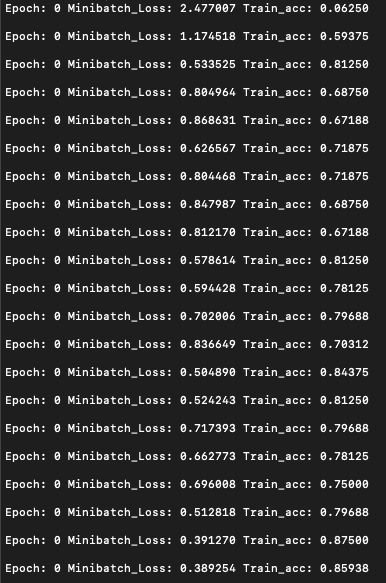 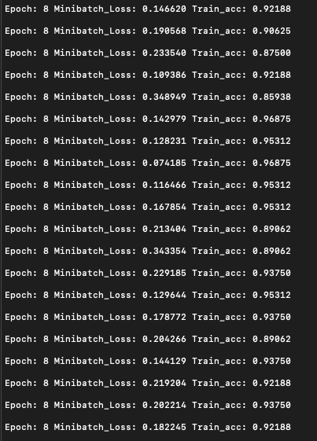

另外，我们每隔`Validation`个批次打印验证准确率，如以下屏幕截图所示：


您可能会注意到，在第 8 个阶段之后，验证准确率开始下降。 这表明该模型已充分学习，超出此点将使模型过拟合。

培训完成后，我们将根据测试数据测试性能。 将使用用于评估训练和验证准确率的相同操作，但是数据将更改为测试数据，如以下代码所示：

```py
  # after training, testing performance on test batch

  for i in range(int(testX.shape[0] / BATCH_SIZE)):

    testBatchX = testX[i*BATCH_SIZE : (i+1)*BATCH_SIZE, :]
    testBatchY = testY[i*BATCH_SIZE: (i+1)*BATCH_SIZE, :]

    testLoss, testAcc = sess.run([loss, avgAccuracy], feed_dict = {x: testBatchX, y: testBatchY})

    if i % 5 ==0:
      print('Test Batch: ', i,' Test Loss: ', testLoss, 'Test Acc: ', testAcc)
```

我们每隔五分`Test Batch`打印一次测试准确率，如以下屏幕截图所示：

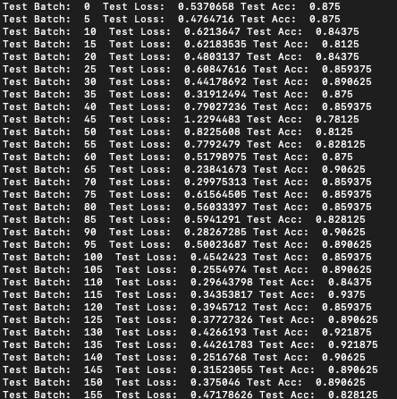

如果发现很难跟踪代码片段的结构和流程，我们在这里提供该模型的完整代码：

```py
'''
MNIST Fashion Deep Feedforward example
'''
import os

# use following command if you are getting error with MacOS
os.environ['KMP_DUPLICATE_LIB_OK']='True'

import tensorflow as tf
import numpy as np
import matplotlib.pyplot as plt
from sklearn.model_selection import train_test_split

from tensorflow import keras

fashionObj = keras.datasets.fashion_mnist

(trainX, trainY), (testX, testY) = fashionObj.load_data()
print('train data x shape: ', trainX.shape)
print('test data x shape:', testX.shape)

print('train data y shape: ', trainY.shape)
print('test data y shape: ', testY.shape)

classesDict = {0:'T-shirt/top', 1:'Trouser', 2:'Pullover', 3:'Dress', 4:'Coat', 5:'Sandal', 6:'Shirt', 7:'Sneaker', 8:'Bag', 9:'Ankle boot'}

rows = 2
columns = 2
fig = plt.figure(figsize = (5,5))

for i in range(1, rows*columns +1):
  image = trainX[i]
  label = trainY[i]

  sub = fig.add_subplot(rows, columns, i)
  sub.set_title('Label: ' + classesDict[label])

  plt.imshow(image)
plt.show()

trainX = trainX.reshape(trainX.shape[0], 784) / 255.0
testX = testX.reshape(testX.shape[0], 784) / 255.0

trainX, valX, trainY, valY = train_test_split(trainX, trainY, test_size = 0.1, random_state =2)

CLASS_NUM = 10
#number of classes we need to classify

INPUT_UNITS = 784 
# no. of neurons in input layer 784, as we have 28x28 = 784 pixels in each image.
# we connect each pixel to a neuron.

HIDDEN_LAYER_1_UNITS = 256

HIDDEN_LAYER_2_UNITS = 128

OUTPUT_LAYER_UNITS = CLASS_NUM

LEARNING_RATE = 0.001

BATCH_SIZE = 64
NUM_BATCHES = int(trainX.shape[0] / BATCH_SIZE)

EPOCHS = 20

trainY = np.eye(CLASS_NUM)[trainY]
valY = np.eye(CLASS_NUM)[valY]
testY = np.eye(CLASS_NUM)[testY]

with tf.name_scope('placeholders') as scope:

  # making placeholders for inputs (x) and labels (y)
  x = tf.placeholder(shape = [BATCH_SIZE, 784], dtype = tf.float32, name = 'inp_x')
  y = tf.placeholder(shape = [BATCH_SIZE, CLASS_NUM], dtype = tf.float32, name = 'true_y')

with tf.name_scope('inp_layer') as scope:

  weights1 = tf.get_variable(shape = [INPUT_UNITS, HIDDEN_LAYER_1_UNITS], dtype = tf.float32, name = 'weights_1')

  biases1 = tf.get_variable(shape = [HIDDEN_LAYER_1_UNITS], dtype = tf.float32,
name = 'bias_1')

with tf.name_scope('hidden_1') as scope:

  weights2 = tf.get_variable(shape = [HIDDEN_LAYER_1_UNITS, HIDDEN_LAYER_2_UNITS], dtype = tf.float32, name = 'weights_2')
  biases2 = tf.get_variable(shape = [HIDDEN_LAYER_2_UNITS], dtype = tf.float32, 
name = 'bias_2')

  layer2 = tf.nn.relu(tf.add(tf.matmul(layer1, weights2), biases2), name = 'layer_2')

with tf.name_scope('out_layer') as scope:

   weights3 = tf.get_variable(shape = [HIDDEN_LAYER_2_UNITS, OUTPUT_LAYER_UNITS], dtype = tf.float32, name = 'weights_3')
  biases3 = tf.get_variable(shape = [OUTPUT_LAYER_UNITS], dtype = tf.float32,
              name = 'biases_3')

  layer3 = tf.add(tf.matmul(layer2, weights3), biases3, name = 'out_layer')

with tf.name_scope('loss') as scope:
  loss = tf.reduce_mean(tf.nn.softmax_cross_entropy_with_logits(logits = layer3, labels = y))

with tf.name_scope('optimizer') as scope:

  optimizer = tf.train.AdamOptimizer(learning_rate = LEARNING_RATE)

  train = optimizer.minimize(loss)

with tf.name_scope('accuracy') as scope:

  correctPredictions = tf.equal(tf.argmax(layer3, axis=1), tf.argmax(y, axis = 1))

   avgAccuracy = tf.reduce_mean(tf.cast(correctPredictions, tf.float32))

with tf.Session() as sess:

  sess.run(tf.global_variables_initializer())

  for epoch in range(EPOCHS):

    for i in range(NUM_BATCHES):

      batchX = trainX[i*BATCH_SIZE : (i+1)*BATCH_SIZE , :]
      batchY = trainY[i*BATCH_SIZE : (i+1)*BATCH_SIZE , :]

      _, miniBatchLoss, acc = sess.run([train, loss, avgAccuracy], feed_dict = {x: batchX, y: batchY})

      if i % 10 == 0:
        print('Epoch: '+str(epoch)+' Minibatch_Loss: '+"{:.6f}".format(miniBatchLoss)+' Train_acc: '+"{:.5f}".format(acc)+"\n")

    for i in range(int(valX.shape[0] / BATCH_SIZE)):

      valBatchX = valX[i*BATCH_SIZE : (i+1)*BATCH_SIZE, :]
      valBatchY = valY[i*BATCH_SIZE: (i+1)*BATCH_SIZE, :]

      valLoss, valAcc = sess.run([loss, avgAccuracy], feed_dict = {x: valBatchX, y: valBatchY})

      if i % 5 ==0:
        print('Validation Batch: ', i,' Val Loss: ', valLoss, 'val Acc: ', valAcc)

  for i in range(int(testX.shape[0] / BATCH_SIZE)):

    testBatchX = testX[i*BATCH_SIZE : (i+1)*BATCH_SIZE, :]
    testBatchY = testY[i*BATCH_SIZE: (i+1)*BATCH_SIZE, :]

    testLoss, testAcc = sess.run([loss, avgAccuracy], feed_dict = {x: testBatchX, y: testBatchY})

    if i % 5 ==0:
      print('Test Batch: ', i,' Test Loss: ', testLoss, 'Test Acc: ', testAcc)
```

# 简单的方法

仅为一个简单的 DFN 编写所有上述代码似乎很乏味。 因此，TensorFlow 具有高级模块，使我们可以更轻松地构建模型。 Keras 通过为构建层提供功能来处理主要的编码结构，使我们能够专注于模型体系结构。 让我们使用 Keras 构建一个小型 DFN，如下所示：

```py
import keras
# importing the sequential method in Keras

from keras.models import Sequential

# Importing the dense layer which creates a layer of deep feedforward network
from keras.layers import Dense, Activation, Flatten, Dropout

# getting the data as we did earlier
fashionObj = keras.datasets.fashion_mnist

(trainX, trainY), (testX, testY) = fashionObj.load_data()
print('train data x shape: ', trainX.shape)
print('test data x shape:', testX.shape)

print('train data y shape: ', trainY.shape)
print('test data y shape: ', testY.shape)

# Now we can directly jump to building model, we build in Sequential manner as discussed in Chapter 1
model = Sequential()

# the first layer we will use is to flatten the 2-d image input from (28,28) to 784
model.add(Flatten(input_shape = (28, 28)))

# adding first hidden layer with 512 units
model.add(Dense(512))

#adding activation to the output
model.add(Activation('relu'))

#using Dropout for Regularization
model.add(Dropout(0.2))

# adding our final output layer
model.add(Dense(10))

#softmax activation at the end
model.add(Activation('softmax'))

# normalizing input data before feeding
trainX = trainX / 255
testX = testX / 255

# compiling model with optimizer and loss
model.compile(optimizer= 'Adam', loss = 'sparse_categorical_crossentropy', metrics = ['accuracy'])

# training the model
model.fit(trainX, trainY, epochs = 5, batch_size = 64)

# evaluating the model on test data
model.evaluate(testX, testY)
print('Test Set average Accuracy: ', evalu[1])
```

上面的代码将输出以下内容：

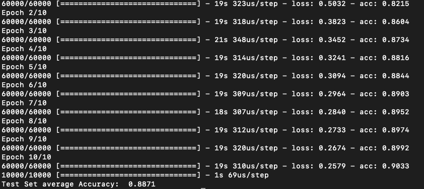

# 概要

我们从 DFN 和深度学习的演变历史开始本章。 我们了解了 DFN 的分层体系结构以及训练中涉及的各个方面，例如损失函数，梯度下降，反向传播，优化器和正则化。 然后，我们使用 TensorFlow 和 Keras 通过第一个 DFN 进行编码。 我们从开源时尚 MNIST 数据开始，并逐步学习了建立网络的逐步过程，从处理数据到训练模型。

在下一章中，我们将看到 Boltzmann 机器和自编码器的体系结构。