# 递归神经网络

在本章中，我们将解释最重要的深度学习模型之一，即**递归神经网络**（**RNNs**）。 我们将首先回顾什么是 RNN，以及为什么它们非常适合处理顺序数据。 在简要介绍了 RNN 模型的发展路径之后，我们将说明根据不同形式的输入和输出数据以及工业示例进行分类的各种 RNN 架构。 我们将找出问题的答案，例如*我们如何仅生成一个输出？，* *输出可以是序列吗？，*和*仅对一个输入有效吗 元件？*

接下来，我们将讨论按递归层分类的几种体系结构。 首先，我们将应用基本的 RNN 体系结构来编写我们自己的*战争与和平*。 具有香草架构的 RNN 不能很好地保存长期依赖的信息。 为了解决这个问题，我们将学习*内存增强型*架构，包括长短期内存和门控循环单元。 我们还将在股票价格预测中采用门控架构。 最后，由于对捕获过去的信息不满意，我们将引入一种双向体系结构，该体系结构允许该模型从序列的过去和将来上下文中保留信息。 具有 LSTM 的双向模型将用于对电影评论的情绪进行分类。

在本章中，我们将介绍以下主题：

*   什么是 RNN？
*   RNN 的演进路径
*   RNN 体系结构按输入和输出（一对多，多对一，同步和不同步的多对多）
*   香草 RNN 架构
*   用于文本生成的 Vanilla RNN
*   长期记忆
*   用于文本生成的 LSTM RNN
*   门控循环单元
*   GRU RNN 用于股价预测
*   双向 RNN
*   BRNN 用于情感分类

# 什么是 RNN？

回想一下，在前几章中讨论的深度前馈网络，自编码器神经网络和 CNN 中，数据从输入层到输出层是单向流动的。 但是，深度学习模型允许数据沿任何方向进行，甚至可以循环回到输入层，并且不仅限于前馈架构。 从上一个输出循环返回的数据成为下一个输入数据的一部分。 RNN 就是很好的例子。 下图描述了 RNN 的一般形式，在本章中，我们将研究 RNN 的几种变体：

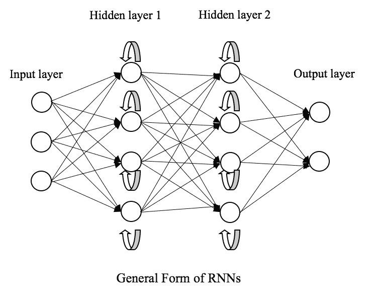

如上图所示，来自先前时间点的数据进入了当前时间点的训练。 循环体系结构使模型可以很好地与时间序列（例如产品销售，股票价格）或顺序输入（例如文章中的单词-DNA 序列）配合使用。

假设我们在传统的神经网络中有一些输入（其中 t 代表时间步长或顺序顺序），如下图所示。 假设不同 t 处的输入彼此独立。 可以将任何时间的网络输出写为，如下所示：


在 RNN 中，反馈回路将当前状态的信息传递到下一个状态，如下图的网络展开版本所示。 RNN 网络在任何时间的输出都可以写成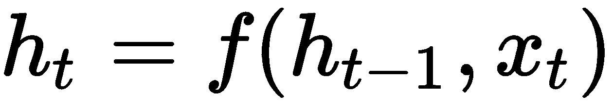。 对序列的每个元素执行相同的任务，并且输出取决于先前计算的输出。 得益于这种类似链的体系结构，或到目前为止所计算出的额外的*存储器*捕获，在将 RNN 应用于时间序列和序列数据方面取得了巨大的成功。 在将 RNN 的变体应用于各种问题之前，首先，我们将了解 RNN 的历史及其演变路径：


# RNN 的演进路径

RNN 实际上具有悠久的历史，最早是在 1980 年代开发的。 霍普菲尔德网络是第一个具有递归链接的神经网络，它是约翰·霍普菲尔德（John Hopfield）在*中发明的。具有分级响应的神经元具有像两态神经元*一样的集体计算属性（PNAS。1984 年 5 月； 81（10））。 ：3088-3092）。

受 Hopfield 网络的启发，在*及时发现结构*中引入了全连接神经网络-Elman 网络（认知科学，1990 年 3 月； 14（2）：179-211）。 Elman 网络具有一个隐藏层和一组连接到该隐藏层的上下文单元。 在每个时间步，上下文单元都会跟踪隐藏单元的先前值。

1992 年，Schmidhuber 由于记住了长期依赖性而发现了梯度消失的问题。 五年后，Schmidhuber 和 Hochreiter 在 *LSTM* 中提出了**长短期记忆**（**LSTM**）（神经计算。9（8）：1735- 1780）。 忘记门单元增强了 LSTM 的功能，它可以删除旧的和无关的内存，从而避免梯度消失。

在 1997 年，RNN 扩展为双向版本（在*双向递归神经网络*中发表，Journal of Transactions 上的 IEEE Transactions，1997 年 11 月； 45（11）：2673-2681），在该模型中训练了模型 在正向（从头到尾）和负向（从头到尾）时间方向上。

*中介绍的分层 RNN 如何在人工自适应系统*中进行自组织（自适应行为，2005 年 9 月； 13（3）：211-225）同时具有水平和垂直循环连接，从而分解复杂 和自适应信息。

自 2007 年以来，LSTM 开始盛行：在*递归神经网络在判别性关键词发现*中的应用（国际人工神经网络会议：220-229）中，它们在某些语音识别任务中的表现优于传统模型。 在 2009 年，通过**连通性时间分类**（**CTC**）训练的 LSTM 模型用于语音音频中的连接手写识别和音素识别等任务。 LSTM 模型也成为机器翻译和语言建模的最新解决方案。 如`S`*how and Tell：神经图像字幕* *生成器*中所述，LSTM 甚至与 CNN 结合以自动进行图像字幕。

早在 2014 年，GRU RNN 被引入，是对常规 RNN 的另一项改进，类似于 LSTM。 GRU RNN 在许多任务上的表现与 LSTM 相似。 但是，它们在较小的数据集上表现出更好的性能，部分原因是它们需要调整的参数较少，而体系结构中的门却较少。

按照承诺，我们将详细研究 RNN 的变体，然后将其应用于实际问题。

# RNN 架构和应用

RNN 可以分为*多对一*，*一对多*，*多对多*（同步）和*多对等 对*（基于它们的输入和输出）。 从隐藏层的角度来看，最常用的 RNN 架构包括基本的香草 RNN 和双向的 LSTM 和 GRU。 我们将专注于 RNN 的这四种体系结构，并将首先通过输入和输出简要提及这四个类别。

# 按输入和输出的体系结构

**多对一**：*多对一*架构可能是最直观的。 我们可以在序列中输入尽可能多的元素或时间步长，但是模型在经历整个序列后仅产生一个输出。 下图显示了其一般结构，其中`f`表示一个或多个循环层：

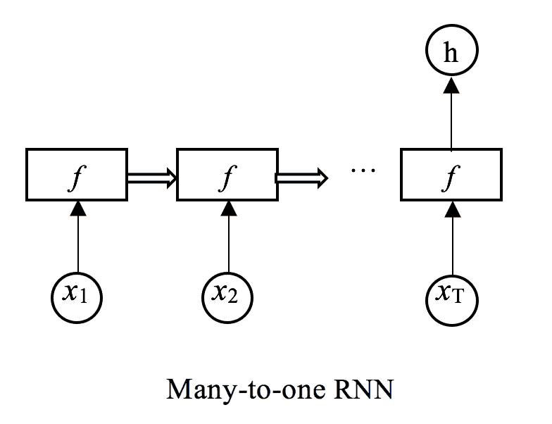

**多对一**架构可用于情感分析，其中该模型读取整个客户评论（例如）并输出情感分数。 类似地，它可以用于在遍历整个音频流之后识别歌曲的流派。

**一对多**：与**多对一 RNN** 相反，**一对多**架构仅接受一个输入并产生一个序列 输出。 **一对多**架构可以表示如下：

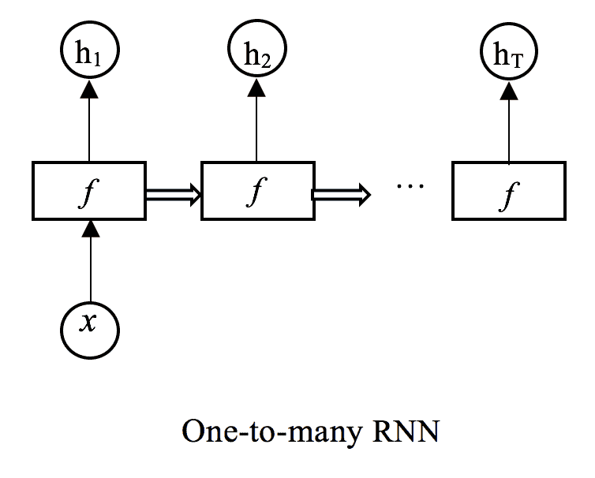

像这样的 RNN 通常用于生成序列。 例如，我们可以使用该模型来生成带有起始音符或流派作为唯一输入的音乐。 以类似的方式，我们甚至可以用指定的起始词以莎士比亚风格写诗。

**多对多（同步）**：第三种架构**多对多（同步）**使每个输入需要一个输出。 正如我们在以下网络流中看到的那样，每个输出都取决于所有先前的输出和当前输入：


多对多（同步）体系结构的常见用例之一是时间序列预测，在这种情况下，我们希望在给定当前和所有先前输入的情况下，在每个时间步长执行滚动预测。 此体系结构还广泛用于**自然语言处理**（**NLP**）问题，例如**命名实体识别**（**NER**），**词性**（**PoS**）标记和语音识别。

**多对多（不同步）**：对于多对多体系结构的不同步版本，该模型在完成读取整个输入序列之前不会生成输出。 结果，输出的数量可以与输入的数量不同。 如下图所示，输出序列 *Ty* 的长度不必等于输入序列 *Tx* 的长度：


在机器翻译中最常见的是不同步的多对多体系结构。 例如，模型读取英语的整个句子，然后开始生成法语的翻译句子。 另一个流行的用例是提前进行多步预测，要求我们根据所有先前的输入来预测提前几个时间步。

到目前为止，我们已经通过模型输入和输出了解了四种 RNN 架构，我们将在本章的其余部分的实际示例中结合其中的一些，我们将主要讨论隐藏层中的架构，更具体地说，是 循环层。

让我们从香草 RNN 开始，这是循环体系结构的最基本形式。

# 香草神经网络

标注了权重且展开后的版本的基本 RNN 模型如下所示：


这里，`U`是连接输入层和隐藏层的权重，`V`是隐藏层和输出层之间的权重，`W`是 循环层，即反馈层的权重； 是时间步`t`的隐藏状态，和分别是时间步`t`的输入和输出。

请注意，为简便起见，我们从现在开始仅使用一个循环层，但是我们可以将多个循环层堆叠在一起，我们将很快看到。

层之间的关系可以描述如下：

*   基于当前输入和通过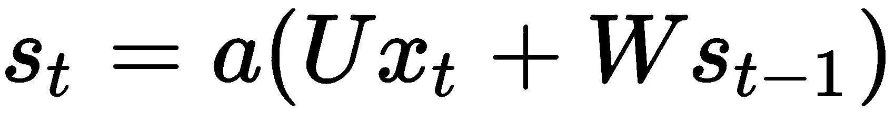的先前隐藏状态计算时间步长`t`和的隐藏状态，其中`a`是激活状态 功能。 RNN 中隐藏层的激活函数的典型选择包括 tanh 和 ReLU。
*   同样，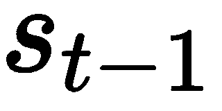取决于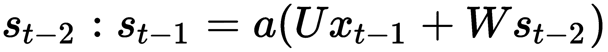，依此类推。 也依赖于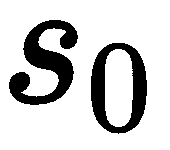，按照惯例，该设置为全零。
*   由于对时间步长具有这种依赖性，因此可以将隐藏状态视为网络的内存，从以前的时间步长中捕获信息。
*   将时间步长`t`的输出计算为，其中 g 是激活函数。 根据执行的任务，它可以是用于二进制分类的 S 型函数，用于多类分类的 softmax 函数以及用于回归的简单线性函数。

与传统的神经网络类似，所有的权重`U`，`V`和`W`均使用反向传播算法进行训练。 但是不同之处在于，在当前时间`t`上，我们需要计算除当前时间之外的所有先前`t`-1 个时间步的损耗。 这是因为权重由所有时间步共享，并且一个时间步的输出间接依赖于所有先前的时间步，例如权重的梯度。 例如，如果要计算时间步 *t = 5* 的梯度，则需要向后传播前四个时间步，并对五个时间步的梯度求和。 这种特殊的反向传播算法称为**时间反向传播（BPTT）**。

从理论上讲，RNN 可以从输入序列的开头捕获信息，从而增强了时间序列或序列建模的预测能力。 但是，由于梯度梯度消失，香草 RNN 并非如此。 我们将在后面对此进行详细说明，并将了解专门设计用于解决此问题的其他体系结构，例如 LSTM 和 GRU。 但是现在，让我们假设香草 RNN 在许多情况下都能正常工作，并且获得了一些实践经验，因为它们是任何 RNN 的基本组成部分。

# 用于文本生成的 Vanilla RNN

如前所述，RNN 通常在 NLP 域中用作语言模型，它在单词序列上分配概率分布，例如机器翻译，PoS 标记和语音识别。 我们将使用一种相当有趣的语言来对问题文本生成进行建模，其中 RNN 模型用于学习指定域的文本序列，然后在所需域中生成全新且合理的文本序列。

基于 RNN 的文本生成器可以接受任何输入文本，例如《哈利波特》等小说，莎士比亚的诗歌以及《星球大战》的电影剧本，并可以生成自己的《哈利波特》，莎士比亚的诗歌和《星球大战》电影剧本。 如果对模型进行了很好的训练，那么人工文本应该是合理的，并且阅读起来应与原始文本相似。 在本部分中，我们将以*战争与和平*和俄罗斯作家 Leo Tolstoy 的小说为例。 随意使用您喜欢的任何书籍进行培训。 我们建议从没有版权保护的书中下载文本数据。 古腾堡计划（ [www.gutenberg.org](http://www.gutenberg.org) ）是一个很好的资源，拥有超过 5.7 万本版权已过期的免费优秀书籍。

首先，我们需要直接从[这里](https://cs.stanford.edu/people/karpathy/char-rnn/warpeace_input.txt)下载*战争与和平*的`.txt`文件。 或者，我们可以从 [Gutenberg 项目](http://www.gutenberg.org/ebooks/2600)下载该文件，但是我们将需要进行一些清理，例如，删除开头的部分[ *Project Gutenberg EBook，*，以及结尾部分，*，项目*的结尾，来自文件以及目录。

然后，我们读取文件，将文本转换为小写，并通过打印出前 100 个字符来快速查看它：

```py
>>> training_file = 'warpeace_input.txt'
>>> raw_text = open(training_file, 'r').read()
>>> raw_text = raw_text.lower()
>>> raw_text[:100]
'ufeff"well, prince, so genoa and lucca are now just family estates of thenbuonapartes. but i warn you, i'
```

现在，我们需要计算总共有多少个字符：

```py
>>> n_chars = len(raw_text)
>>> print('Total characters: {}'.format(n_chars))
Total characters: 3196213
```

然后，我们可以获得唯一的字符和词汇量：

```py
>>> chars = sorted(list(set(raw_text)))
>>> n_vocab = len(chars)
>>> print('Total vocabulary (unique characters): {}'.format(n_vocab))
Total vocabulary (unique characters): 57
>>> print(chars)
['n', ' ', '!', '"', "'", '(', ')', '*', ',', '-', '.', '/', '0', '1', '2', '3', '4', '5', '6', '7', '8', '9', ':', ';', '=', '?', 'a', 'b', 'c', 'd', 'e', 'f', 'g', 'h', 'i', 'j', 'k', 'l', 'm', 'n', 'o', 'p', 'q', 'r', 's', 't', 'u', 'v', 'w', 'x', 'y', 'z', '!!CDP!E.agrave!!', '!!CDP!E.auml!!', '!!CDP!E.eacute!!', '!!CDP!E.ecirc!!', 'ufeff']
```

现在，我们有了一个原始的训练数据集，其中包含超过 300 万个字符和 57 个唯一字符。 但是我们如何将其提供给 RNN 模型呢？

回想一下，在同步多对多体系结构中，该模型接受序列并同时生成序列。 在我们的例子中，我们可以给模型提供固定长度的字符序列。 输出序列的长度与输入序列的长度相同，并且一个字符从其输入序列偏移。 假设我们从学习的单词*设置序列长度为`5`。 现在，我们可以使用输入*学习*和输出 *earni* 来构造训练样本。 我们可以在网络中对此进行可视化，如下所示：*

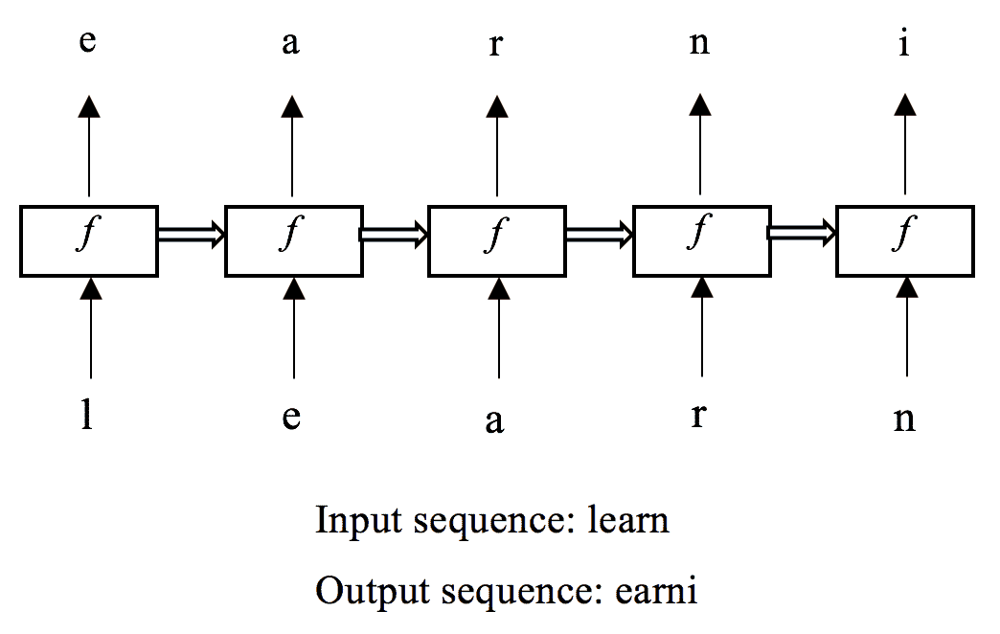

我们只是构造了一个训练样本。 对于整个训练集，我们可以将原始文本数据分成相等长度的序列，例如 100。每个字符序列都是训练样本的输入。

接下来，我们以相同的方式将原始文本数据拆分为序列，但是这次从第二个字符开始。 每个结果序列都是训练样本的输出。 例如，给定原始文本*深度学习架构*和`5`作为序列长度，我们可以创建五个训练样本，如下所示：

| **输入** | **输出** |
| 深 _ | eep_l |
| 学习 | 耳朵 |
| ing_a | ng_ar |
| hit | te |
| 直肠 | 构图 |

在此，`_`表示空间。

请注意，最后一个子序列*和*不够长，因此我们可以简单地忽略它。

由于神经网络模型仅吸收数字数据，因此字符的输入和输出序列由一键编码的矢量表示。 我们通过将 57 个字符映射到从`0`到`56`的索引以及另一个相反的索引来创建字典：

```py
>>> index_to_char = dict((i, c) for i, c in enumerate(chars))
>>> char_to_index = dict((c, i) for i, c in enumerate(chars))
>>> print(char_to_index)
{'n': 0, ' ': 1, '!': 2, '"': 3, "'": 4, '(': 5, ')': 6, '*': 7, ',': 8, '-': 9, '.': 10, '/': 11, '0': 12, '1': 13, '2': 14, '3': 15, '4': 16, '5': 17, '6': 18, '7': 19, '8': 20, '9': 21, ':': 22, ';': 23, '=': 24, '?': 25, 'a': 26, 'b': 27, 'c': 28, 'd': 29, 'e': 30, 'f': 31, 'g': 32, 'h': 33, 'i': 34, 'j': 35, 'k': 36, 'l': 37, 'm': 38, 'n': 39, 'o': 40, 'p': 41, 'q': 42, 'r': 43, 's': 44, 't': 45, 'u': 46, 'v': 47, 'w': 48, 'x': 49, 'y': 50, 'z': 51, '!!CDP!E.agrave!!': 52, '!!CDP!E.auml!!': 53, '!!CDP!E.eacute!!': 54, '!!CDP!E.ecirc!!': 55, 'ufeff': 56}
```

例如，字符`e`成为长度为 57 的向量，索引为`30`的为`1`，所有其他索引的值为 0s。 准备好角色查找表后，我们可以如下构建训练数据集：

```py
>>> import numpy as np
>>> seq_length = 100
>>> n_seq = int(n_chars / seq_length)
```

将序列长度设置为 100，我们将获得`n_seq`训练样本。 接下来，我们初始化训练输入和输出：

请注意，序列长度具有形状（样本数，序列长度，特征维数）。 由于我们将使用 Keras 进行 RNN 模型训练，因此需要这种形式。

```py
>>> X = np.zeros((n_seq, seq_length, n_vocab))
>>> Y = np.zeros((n_seq, seq_length, n_vocab))
```

组装每个`n_seq`样本：

```py
>>> for i in range(n_seq):
...     x_sequence = raw_text[i * seq_length : (i + 1) * seq_length]
...     x_sequence_ohe = np.zeros((seq_length, n_vocab))
...     for j in range(seq_length):
...         char = x_sequence[j]
...         index = char_to_index[char]
...         x_sequence_ohe[j][index] = 1.
...     X[i] = x_sequence_ohe
...     y_sequence = 
              raw_text[i * seq_length + 1 : (i + 1) * seq_length + 1]
...     y_sequence_ohe = np.zeros((seq_length, n_vocab))
...     for j in range(seq_length):
...         char = y_sequence[j]
...         index = char_to_index[char]
...         y_sequence_ohe[j][index] = 1.
...     Y[i] = y_sequence_ohe
>>> X.shape
(31962, 100, 57)
>>> Y.shape
(31962, 100, 57)
```

同样，每个样本都由一键编码字符的`100`元素组成。 我们终于准备好了训练数据集，现在是时候构建我们​​的香草 RNN 模型了。 让我们训练一个具有两个循环层的模型，如下所示：


每层包含 800 个单位，其中`0.3`和 ReLU 的丢失率作为激活函数。 首先，导入所有必需的模块：

```py
>>> from keras.models import Sequential
>>> from keras.layers.core import Dense, Activation, Dropout
>>> from keras.layers.recurrent import SimpleRNN
>>> from keras.layers.wrappers import TimeDistributed
>>> from keras import optimizers
```

现在，指定其他超参数，包括批量大小和纪元数，以及隐藏层和单位数以及辍学率：

```py
>>> batch_size = 100
>>> n_layer = 2
>>> hidden_units = 800
>>> n_epoch= 300
>>> dropout = 0.3
```

现在，创建并编译网络：

```py
>>> model = Sequential()
>>> model.add(SimpleRNN(hidden_units, input_shape=
          (None, n_vocab),return_sequences=True, activation='relu'))
>>> model.add(Dropout(dropout))
>>> for i in range(n_layer - 1):
...     model.add(SimpleRNN(hidden_units, return_sequences=True,
                    activation='relu'))
...     model.add(Dropout(dropout))
>>> model.add(TimeDistributed(Dense(n_vocab)))
>>> model.add(Activation('softmax'))
```

关于我们刚刚建立的模型，需要注意以下几点：

*   `return_sequences=True`：循环层的输出变成一个序列，从而实现了我们想要的多对多体系结构。 否则，它将变成多对一，最后一个元素作为输出。
*   `TimeDistributed`：由于循环层的输出是一个序列，而下一层-密集层-不接受顺序输入，因此`TimeDistributed`换行用作适配器来解决此问题。
*   `Softmax`：之所以使用这种激活，是因为该模型生成了一个单编码字符矢量。

至于优化器，我们将选择 RMSprop，其学习率为`0.001`：

```py
>>> optimizer = optimizers.RMSprop(lr=0.001, rho=0.9, 
                                   epsilon=1e-08, decay=0.0)
>>> model.compile(loss="categorical_crossentropy",optimizer=optimizer)
```

添加了多类交叉熵的损失度量之后，我们就完成了模型的构建。 我们可以通过使用以下代码来查看模型的摘要：

```py
>>> print(model.summary()) _________________________________________________________________
 Layer (type) Output Shape Param #
 =================================================================
 simple_rnn_1 (SimpleRNN) (None, None, 800) 686400
 _________________________________________________________________
 dropout_1 (Dropout) (None, None, 800) 0
 _________________________________________________________________
 simple_rnn_2 (SimpleRNN) (None, None, 800) 1280800
 _________________________________________________________________
 dropout_2 (Dropout) (None, None, 800) 0
 _________________________________________________________________
 time_distributed_1 (TimeDist (None, None, 57) 45657
 _________________________________________________________________
 activation_1 (Activation) (None, None, 57) 0
 =================================================================
 Total params: 2,012,857
 Trainable params: 2,012,857
 Non-trainable params: 0
 _________________________________________________________________
```

我们有超过 200 万个参数需要训练。 但是，在开始漫长的训练过程之前，最好建立一些回调，以便在训练过程中跟踪模型的统计信息和内部状态。 我们将采用的回调函数包括：

*   模型检查点，它在每个时期后保存模型，以便我们加载最新保存的模型，并在模型意外停止时从那里继续训练。
*   尽早停止，当失去的表现不再改善时，停止训练。
*   定期检查文本生成结果。 我们想看看生成的文本是多么合理，并且训练损失不够明显。

这些函数的定义或初始化如下：

```py
>>> from keras.callbacks import Callback, ModelCheckpoint, EarlyStopping
>>> file_path =file_path =
                "weights/weights_epoch_{epoch:03d}_loss_{loss:.4f}.hdf5"
>>> checkpoint = ModelCheckpoint(file_path, monitor='loss',
                            verbose=1, save_best_only=True, mode='min')
```

模型检查点将与时期号一起保存，而训练损失则保存在文件名中。 我们还同时监视验证损失，并查看其是否在`50`个连续的时期内停止下降：

```py
>>> early_stop = EarlyStopping(monitor='loss', min_delta=0,         
                                patience=50, verbose=1, mode='min')
```

接下来，我们有用于质量监控的回调。 首先，我们编写一个辅助函数，该函数在给定 RNN 模型的情况下生成任意长度的文本：

```py
>>> def generate_text(model, gen_length, n_vocab, index_to_char):
...     """
...     Generating text using the RNN model
...     @param model: current RNN model
...     @param gen_length: number of characters we want to generate
...     @param n_vocab: number of unique characters
...     @param index_to_char: index to character mapping
...     @return: string of text generated
...     """
...     # Start with a randomly picked character
...     index = np.random.randint(n_vocab)
...     y_char = [index_to_char[index]]
...     X = np.zeros((1, gen_length, n_vocab))
...     for i in range(gen_length):
...         X[0, i, index] = 1.
...         indices = np.argmax(model.predict(
                        X[:, max(0, i - seq_length -1):i + 1, :])[0], 1)
...         index = indices[-1]
...         y_char.append(index_to_char[index])
...     return ('').join(y_char)
```

它以随机选择的字符开头。 然后，输入模型根据过去生成的字符来预测剩余的每个`gen_length-1`字符，这些字符的长度最大为`100`（序列长度）。

现在，我们可以定义`callback`类，该类为每个`N`个历元生成文本：

```py
>>> class ResultChecker(Callback):
...     def __init__(self, model, N, gen_length):
...         self.model = model
...         self.N = N
...         self.gen_length = gen_length
...
...     def on_epoch_end(self, epoch, logs={}):
...         if epoch % self.N == 0:
...             result = generate_text(self.model, self.gen_length, 
                                       n_vocab, index_to_char)
...             print('nMy War and Peace:n' + result)
```

现在所有组件都准备就绪，让我们开始训练模型：

```py
>>> model.fit(X, Y, batch_size=batch_size, verbose=1, epochs=n_epoch,
 callbacks=[ResultChecker(model, 10, 200), checkpoint, early_stop])
```

生成器为每个`10`时期写入`200`字符。 我们可以看到每个时期的进度条，其详细设置为`1`（`0`是静默模式，`2`没有进度条）。

以下是纪元`1`，`11`，`51`和`101`的结果：

`Epoch 1`：

```py
Epoch 1/300
 8000/31962 [======>.......................] - ETA: 51s - loss: 2.8891 31962/31962 [==============================] - 67s 2ms/step - loss: 2.1955 My War and Peace:
 5 the count of the stord and the stord and the stord and the stord and the stord and the stord and the stord and the stord and the stord and the stord and the stord and the stord and the stord and the
Epoch 00001: loss improved from inf to 2.19552, saving model to weights/weights_epoch_001_loss_2.19552.hdf5
```

`Epoch 11`：

```py
Epoch 11/300
 100/31962 [..............................] - ETA: 1:26 - loss: 1.2321 31962/31962 [==============================] - 66s 2ms/step - loss: 1.2493 My War and Peace:
 ?" said the countess was a strange the same time the countess was already been and said that he was so strange to the countess was already been and the same time the countess was already been and said Epoch 00011: loss improved from 1.26144 to 1.24933, saving model to weights/weights_epoch_011_loss_1.2493.hdf5
```

`Epoch 51`：

```py
Epoch 51/300
 31962/31962 [==============================] - 66s 2ms/step - loss: 1.1562 My War and Peace:
 !!CDP!E.agrave!! to see him and the same thing is the same thing to him and the same thing the same thing is the same thing to him and the same thing the same thing is the same thing to him and the same thing the sam Epoch 00051: loss did not improve from 1.14279
```

`Epoch 101`：

```py
Epoch 101/300
 31962/31962 [==============================] - 67s 2ms/step - loss: 1.1736 My War and Peace:
 = the same thing is to be a soldier in the same way to the soldiers and the same thing is the same to me to see him and the same thing is the same to me to see him and the same thing is the same to me Epoch 00101: loss did not improve from 1.11891
```

培训在纪元`203`提前停止：

```py
Epoch 00203: loss did not improve from 1.10864
Epoch 00203: early stopping
```

在 Tesla K80 GPU 上，每个时期大约需要 1 分钟。 经过约 3.5 小时的训练，损失从`2.19552`减少到`1.10864`。

它在纪元`151`生成以下文本：

```py
which was a strange and serious expression of his face and shouting and said that the countess was standing beside him.
"what a battle is a strange and serious and strange and so that the countess was

```

我们的*战争与和平*读起来不错，尽管有点荒谬。 通过调整此香草 RNN 模型的超参数，我们可以做得更好吗？ 绝对可以，但这是不值得的。 正如我们前面提到的，训练一个普通的 RNN 模型来解决需要学习长期依赖关系的问题非常困难-距离较远的步骤之间的依赖关系通常对于预测至关重要。 但是，由于梯度消失的问题，香草 RNN 仅能够捕获序列中几个早期步骤之间的时间依赖性。 LSTM 和 GRU 之类的体系结构是专门为解决此问题而设计的。 我们将在以下两个部分中说明它们如何随着时间的推移在内存中维护信息。

# LSTM RNN

LSTM 的体系结构的神奇之处在于：在普通循环单元的顶部，增加了一个存储单元和三个信息门以处理长期依赖关系。 LSTM 的递归细胞如下所示（我们还提出了一种香草用于比较）：


在上图中从左到右，主要组成部分说明如下：

*   是**存储单元**，它从输入序列的最开始就存储上下文。
*   `f`表示**遗忘门**，它控制来自前一存储状态的多少信息可以向前传递。 与忘记门相关的权重包括 W <sup>f</sup> ，它与先前的隐藏状态`S[t-1]`， *连接* 和`u[f]`与电流输入连接。
*   `i`代表**输入门**，它确定当前输入可以通过多少信息。 权重和分别将其与先前的隐藏状态和当前输入相连。
*   **tanh** 只是隐藏状态的激活函数，并且基于当前输入和先前的隐藏状态及其相应的权重和进行计算。 它与香草 RNN 中的“ a”完全相同。
*   `o`用作**输出门**，它定义了将内部存储器中的多少信息用作整个循环单元的输出。 同样，和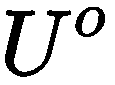是关联的权重。

因此，这些组件之间的关系可以概括如下：

*   在时间步 t 处的忘记门`f`的输出被计算为。
*   将在时间步 t 处输入门`i`的输出计算为。
*   将在时间步 t 处的 tanh 激活 *c'*的输出计算为。
*   在时间步 t 处的输出门*或*的输出被计算为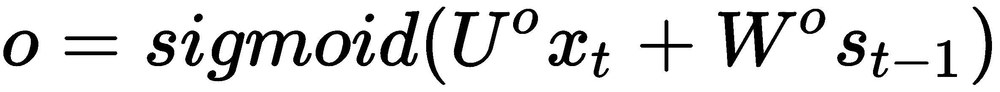。
*   在时间步`t`处的存储单元由更新，其中`.*`表示逐元素乘法。 值得注意的是，`f`和`i`中的 S 形函数将其输出转换为从`0`到`1`的范围，从而控制比例 分别通过的先前存储器和当前存储器输入的数据。
*   最后，在时间步`t`的隐藏状态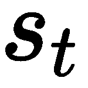被更新为。 同样，`o`确定用作整个单元输出的更新存储单元的比例。

使用随时间的反向传播训练所有四组权重`U`和`W`，这与香草 RNN 相同。 通过学习三个信息门的权重，网络显式地对长期依赖关系进行建模。 接下来，我们将利用 LSTM 体系结构并发明更强大的文本生成器。

# 用于文本生成的 LSTM RNN

在基于 LSTM 的文本生成器中，我们将序列长度增加到 160 个字符，因为它可以更好地处理长序列。 记住要用新的`seq_length` = 160 重新生成训练集`X`和`Y`。

为了轻松地将该模型的性能与以前的香草模型进行比较，我们将保留一个相似的结构-两个循环层，两个循环层均包含`800`单元，`0.4`和*的退出率 tanh* （默认情况下）作为激活功能：

```py
>>> from keras.layers.recurrent import LSTM
>>> batch_size = 100
>>> n_layer = 2
>>> hidden_units = 800
>>> n_epoch= 300
>>> dropout = 0.4
```

现在，创建并编译网络：

```py
>>> model = Sequential() >>> model.add(LSTM(hidden_units, input_shape=(None, n_vocab),
 return_sequences=True)) >>> model.add(Dropout(dropout)) >>> for i in range(n_layer - 1): ...     model.add(LSTM(hidden_units, return_sequences=True)) ...     model.add(Dropout(dropout)) >>> model.add(TimeDistributed(Dense(n_vocab))) >>> model.add(Activation('softmax'))
```

优化器`RMSprop`的学习速度为`0.001`：

```py
>>> optimizer = optimizers.RMSprop(lr=0.001, rho=0.9, 
                                   epsilon=1e-08, decay=0.0) >>> model.compile(loss="categorical_crossentropy", optimizer=optimizer)
```

让我们总结一下我们刚刚组装的 LSTM 模型：

```py
>>> print(model.summary())
 _________________________________________________________________
 Layer (type) Output Shape Param #
 =================================================================
 lstm_1 (LSTM) (None, None, 800) 2745600
 _________________________________________________________________
 dropout_1 (Dropout) (None, None, 800) 0
 _________________________________________________________________
 lstm_2 (LSTM) (None, None, 800) 5123200
 _________________________________________________________________
 dropout_2 (Dropout) (None, None, 800) 0
 _________________________________________________________________
 time_distributed_1 (TimeDist (None, None, 57) 45657
 _________________________________________________________________
 activation_1 (Activation) (None, None, 57) 0
 =================================================================
 Total params: 7,914,457
 Trainable params: 7,914,457
 Non-trainable params: 0
 _________________________________________________________________
```

有 800 万个参数需要训练，几乎是香草模型中训练参数的四倍。 让我们开始训练他们：

```py
>>> model.fit(X, Y, batch_size=batch_size, verbose=1, epochs=n_epoch,
        callbacks=[ResultChecker(model, 10, 500), checkpoint, early_stop])
```

生成器为每个`10`时期写入`500`个字符长的文本。

以下是纪元`151`，`201`和`251`的结果：

`Epoch 151`：

```py
Epoch 151/300
 19976/19976 [==============================] - 250s 12ms/step - loss: 0.7300
My War and Peace:
 ing to the countess. "i have nothing to do with him and i have nothing to do with the general," said prince andrew.

"i am so sorry for the princess, i am so since he will not be able to say anything. i saw him long ago. i am so sincerely that i am not to
 blame for it. i am sure that something is so much talk about the emperor alexander's personal attention."

"why do you say that?" and she recognized in his son's presence.

"well, and how is she?" asked pierre.

"the prince is very good to make

Epoch 00151: loss improved from 0.73175 to 0.73003, saving model to weights/weights_epoch_151_loss_0.7300.hdf5
```

`Epoch 201`：

```py
Epoch 201/300
 19976/19976 [==============================] - 248s 12ms/step - loss: 0.6794 My War and Peace:
 was all the same to him. he received a story proved that the count had not yet seen the countess and the other and asked to be able to start a tender man than the world. she was not a family affair and was at the same time as in the same way. a few minutes later the count had been at home with his smile and said: "i am so glad! well, what does that mean? you will see that you are always the same." "you know i have not come to the conclusion that i should like to
 send my private result. the prin Epoch 00201: loss improved from 0.68000 to 0.67937, saving model to weights/weights_epoch_151_loss_0.6793.hdf5
```

`Epoch 251`：

```py
Epoch 251/300
 19976/19976 [==============================] - 249s 12ms/step - loss: 0.6369 My War and Peace:
 nd the countess was sitting in a single look on
 her face. "why should you be ashamed?" "why do you say that?" said princess mary. "why didn't you say a word of this?" said prince andrew with a smile. "you would not like that for my sake, prince vasili's son, have you seen the rest of the two?" "well, i am suffering," replied the princess with a sigh. "well, what a delightful norse?" he shouted. the convoy and driving away the flames of the battalions of the first
 day of the orthodox russian Epoch 00251: loss improved from 0.63715 to 0.63689, saving model to weights/weights_epoch_251_loss_0.6368.hdf5

```

最后，在时期`300`，训练因`0.6001`丢失而停止。

每个时期大约需要四到五分钟，才能在 Tesla K80 GPU 上完成。 借助大约 22 个小时的培训，文本生成器借助 LSTM 体系结构能够编写出更逼真有趣的 *War and Peace* 脚本。

此外，用于字符生成的 LSTM RNN 不限于文本。 他们可以从任何字符数据中学习，例如源代码，HTML，LaTex，并希望自动编写软件程序，网页和科学论文。

# GRU RNN

在 LSTM 之后的十多年中，发明了具有门控机制的替代架构 GRU。 GRU 和 LSTM 的性能相当，在某些情况下一个要优于另一个。 但是，GRU 只有两个信息门，这比 LSTM 稍微复杂一些。 GRU 的循环单元描述如下：


上图中从左到右的关键组件说明如下：

*   `r`表示**复位门**，它控制要忘记前一存储器的多少信息。 给定连接到先前隐藏状态的权重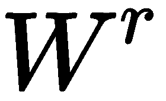和连接到当前输入的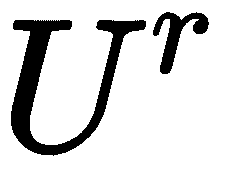，复位门`r`的输出在时间步`t`计算为。
*   `p`代表**更新门**，它确定可以从前一个内存中传递多少信息。 将权重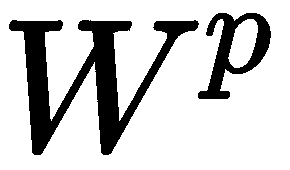和分别连接到先前的存储状态和当前输入，将时间`t`的更新门`p`的输出计算为 。
*   **tanh** 是隐藏状态的激活函数，并基于当前输入和先前存储状态的重置进行计算。 给定它们的相应权重和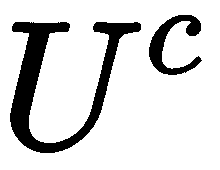，将当前存储器 *c'*在时间步`t`的输出计算为。
*   最后，在时间步`t`的隐藏状态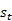被更新为。 同样，`p`决定用于更新当前内存的先前内存的比例–越接近`1`，则保留的内存就越多； 距离`0`越近，发生的当前存储器越多。
*   有趣的是，如果`p`是全零向量，而 r 是全一向量（例如我们没有明确保留任何先前的内存），则该网络只是一个普通的 RNN。

总体而言，GRU 与 LSTM 非常相似。 它们都使用光栅机制进行长期建模，并且与门相关的参数通过 BPTT 进行训练。 但是，有一些区别值得注意：

*   LSTM 中有三个信息门，而 GRU 中只有两个。
*   GRU 中的更新门负责输入门和 LSTM 中的忘记门。
*   GRU 中的重置门直接应用于先前的隐藏状态。
*   LSTM 显式地对存储单元进行建模，而 GRU 则不。
*   附加的非线性将应用于 LSTM 中更新的隐藏状态。
*   LSTM 于 1997 年推出，近年来已得到研究和广泛使用。 GRU 于 2014 年发明，至今尚未得到充分的探索。 这就是为什么 LSTM 比 GRU 更受欢迎的原因，即使不能保证一个 LSTM 胜过另一个。
*   通常认为，与 GSTM 相比，训练 GRU RNN 相对更快并且需要更少的数据，因为 GRU RNN 具有较少的参数。 因此，有人认为 GRU 在训练量较小的情况下效果更好。

尽管还有许多谜团，我们还是将 GRU RNN 应用于十亿（或万亿）美元的问题：股价预测。

# GRU RNN 用于股价预测

预测股票会使许多人感兴趣。 多年以来，已经开发出了大量使用机器学习技术预测股票价格的方法。 例如，在 *Python 机器学习示例的*的*的第 7 章*（Packt Publishing）中，线性回归，随机森林和支持向量机被用于预测股票价格。 在像这样的传统机器学习解决方案中，功能工程可能是最费力的阶段。 这是手动创建特定于域的特征或信号的过程，这些特征或信号对于定向预测比原始输入更为重要。 典型的发明功能包括 x 天移动平均线，一段时间内的波动率和 x 天回报率。 相反，基于 RNN 的深度学习解决方案不涉及以手工为特色的手工制作，而是自己找出及时或顺序的关系。 我们将通过使用 GRU RNN 预测**道琼斯工业平均指数**（**DJIA**）来展示循环体系结构的强大功能。**

尽管我们强调了深度学习的优势，但我们并未断言深度学习方法优于传统的机器学习方法。 在机器学习中，没有一种适合所有的*。*

DJIA 由 30 只大型和重要股票（例如 Apple，IBM，GE 和 Goldman Sachs）组成，是全球投资者最常关注的市场指数之一。 它代表了整个美国市场价值的四分之一，这使该项目更加令人兴奋。

我们可以在[这个页面](https://finance.yahoo.com/quote/%5EDJI/history?p=%5EDJI)上查看其历史每日数据。 其中一些数据的屏幕截图如下：


五个值说明了交易日内股票在一段时间内的走势：开盘价和收盘价，即交易日的起始价和最终价，低点和高位，即股票交易价格范围和交易量，即 在一个交易日交易的股票总数。 例如，我们将重点关注使用历史收盘价来预测未来收盘价。 但是，合并其他四个指标也是可行的。

让我们从数据获取和探索开始。 首先，我们将数据从 2001-01-01 下载到 2017-12-31：在同一网页上，将时间段更改为 2001 年 1 月 1 日至 2017 年 12 月 31 日。单击应用按钮，最后单击下载 数据。 然后，我们可以加载并查看数据：

```py
>>> import numpy as np >>> import matplotlib.pyplot as plt >>> import pandas as pd >>> raw_data = pd.read_csv('^DJI.csv') >>> raw_data.head()
 Date        Open         High         Low        Close 0 2001-01-02 10790.919922 10797.019531 10585.360352 10646.150391 1 2001-01-03 10637.419922 11019.049805 10581.089844 10945.750000 2 2001-01-04 10944.940430 11028.000000 10888.419922 10912.410156 3 2001-01-05 10912.809570 10919.419922 10627.750000 10662.009766 4 2001-01-08 10658.730469 10700.849609 10516.019531 10621.349609
 Adj Close   Volume 0 10646.150391 253300000 1 10945.750000 420720000 2 10912.410156 382800000 3 10662.009766 272650000 4 10621.349609 225780000
```

使用以下代码行绘制收盘价数据：

```py
>>> data = raw_data.Close.values >>> len(data) 4276 >>> plt.plot(data) >>> plt.xlabel('Time period') >>> plt.ylabel('Price') >>> plt.show()
```

前面的代码将创建以下图形：

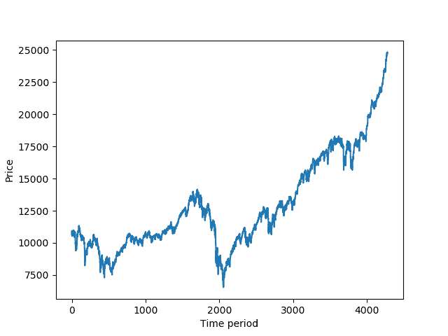

一年平均有 252 个交易日。 这就是为什么在 17 年中仅选择了 4,276 个数据点的原因。

接下来，我们需要从原始时间序列构造顺序输入，以便提供 RNN 模型，这与我们在文本生成中所做的类似。 回想一下，在“多对一”架构中，该模型采用一个序列，并经过序列中的所有时间步长后产生一个输出。 在我们的案例中，我们可以将过去`T`天的价格序列提供给 RNN 模型，并输出第二天的价格。

将价格时间序列表示为 *`x[1]`，`x[2]`。 。 。 。，`x[n]`* （N = 4276），并以`T`= 5 为例。 通过这样做，我们可以创建训练样本，如下所示：

| **输入** | **输出** |
| `{x[1], x[2], x[3], x[4], x[5]}` | `x[6]` |
| `{x[2], x[3], x[4], x[5], x[6]}` | `x[7]` |
| `{x[3], x[4], x[5], x[6], x[7]}` | `x[8]` |
| ...... | ... |
| `{x[n - 1], x[n - 2], x[n - 3], x[n - 4], x[n - 5]}` | `x[n]` |

在这里，我们通过回顾前 5 个交易日（一周）来预测第二天的价格。 我们还在网络中对其进行了描述：


因此，我们实现了序列生成功能：

```py
>>> def generate_seq(data, window_size): ...     """ ...     Transform input series into input sequences and outputs based
 on a specified window size ...     @param data: input series ...     @param window_size: int ...     @return: numpy array of input sequences, numpy array of outputs ...     """ ...     X, Y = [], [] ...     for i in range(window_size, len(data)): ...         X.append(data[i - window_size:i]) ...         Y.append(data[i]) ...     return np.array(X),np.array(Y)
```

然后，我们以 *T = 10* 构造输入和输出数据集（回溯 2 周）：

```py
>>> window_size = 10 >>> X, Y = generate_seq(data, window_size) >>> X.shape (4266, 10) >>> Y.shape (4266,)
```

接下来，我们将数据分为 70％的训练和 30％的测试：

```py
>>> train_ratio = 0.7
>>> train_n = int(len(Y) * train_ratio)
>>> X_train = X[:train_n]
>>> Y_train = Y[:train_n]
>>> X_test = X[train_n:]
>>> Y_test = Y[train_n:]
```

我们现在可以开始对训练数据进行建模吗？ 当然不需要-需要数据缩放或预处理。 从上图可以看出，测试数据与训练数据不成比例，更不用说将来的数据了。 回归模型无法预测超出范围的值。 为了解决这个问题，我们通常使用 min-max scale 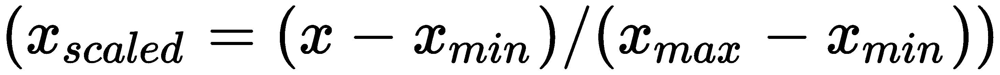将数据缩放到给定范围，例如 0 到 1。 但是，没有可靠的方法来预测股票的（或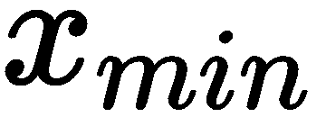）。 这与已知最小值和最大值（例如，图像预测中的 0 和 255）的情况不同。 为了解决这个问题，我们将每个窗口内的价格标准化。 我们只需将时间窗口中的每个价格除以最近的已知价格即可。 再次使用前面的 *T = 5* 示例，我们可以如下预处理训练样本：

| **输入** | **输出** |
| 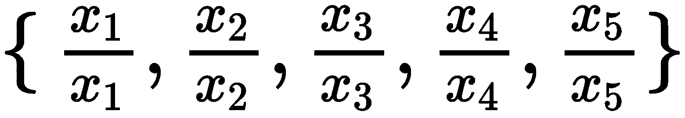 | 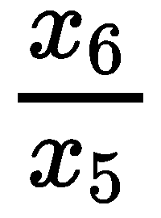 |
|  | 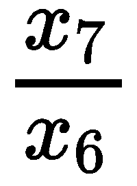 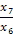 |
| 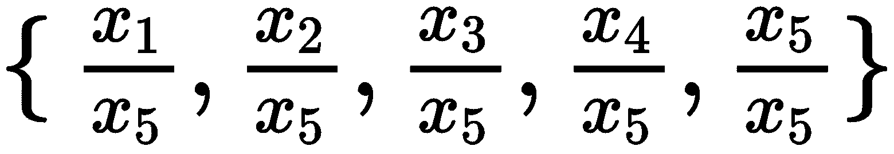 |   |
| ...... | ... |
|  | 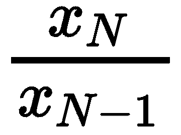 |

我们基本上将绝对值转换为相对值。 预处理功能实现如下：

```py
>>> def scale(X, Y): ...     """ ...     Scaling the prices within each window ...     @param X: input series ...     @param Y: outputs ...     @return: scaled input series and outputs ...     """ ...     X_processed, Y_processed = np.copy(X), np.copy(Y) ...     for i in range(len(X)): ...         x = X[i, -1] ...         X_processed[i] /= x ...         Y_processed[i] /= x ...     return X_processed, Y_processed
```

扩展培训和测试数据：

```py
>>> X_train_scaled, Y_train_scaled = scale(X_train, Y_train) >>> X_test_scaled, Y_test_scaled = scale(X_test, Y_test)
```

终于到了构建 GRU RNN 模型的时候了：

```py
>>> from keras.models import Sequential >>> from keras.layers import Dense, GRU >>> from keras import optimizers >>> model = Sequential() >>> model.add(GRU(256, input_shape=(window_size, 1))) >>> model.add(Dense(1))
```

在这里，由于我们只有 2986 个训练样本，因此我们正在设计一个相对简单的模型，该模型具有一个 256 个单位的循环层。 对于优化器，使用 RMSprop，学习率为 0.006，以最小化均方误差：

```py
>>> optimizer = optimizers.RMSprop(lr=0.0006, rho=0.9, 
                                  epsilon=1e-08, decay=0.0) >>> model.compile(loss='mean_squared_error', optimizer=optimizer)
```

除了早期停止和模型检查点之外，我们还使用 TensorBoard 作为回调函数。 TensorBoard 是 TensorFlow 的性能可视化工具，可提供用于训练和验证指标的动态图：

```py
>>> from keras.callbacks import TensorBoard, EarlyStopping, ModelCheckpoint >>> tensorboard = TensorBoard(log_dir='./logs/run1/', write_graph=True, write_images=False)
```

验证损失是在提前停止和模型检查点中使用的度量标准：

```py
>>> early_stop = EarlyStopping(monitor='val_loss', min_delta=0, patience=100, verbose=1, mode='min') >>> model_file = "weights/best_model.hdf5" >>> checkpoint = ModelCheckpoint(model_file, monitor='val_loss', verbose=1, save_best_only=True, mode='min')
```

与往常一样，重塑输入数据以提供 Keras RNN 模型：

```py
>>> X_train_reshaped = X_train_scaled.reshape( (X_train_scaled.shape[0], X_train_scaled.shape[1], 1)) >>> X_test_reshaped = X_test_scaled.reshape( (X_test_scaled.shape[0], X_test_scaled.shape[1], 1))
```

该模型适合训练集并通过测试集进行了验证，最大历时为`300`，批量为`100`：

```py
>>> model.fit(X_train_reshaped, Y_train_scaled, validation_data=
            (X_test_reshaped, Y_test_scaled), epochs=300, batch_size=100, 
            verbose=1, callbacks=[tensorboard, early_stop, checkpoint])
```

以下是纪元`1`，`11`，`52`和`99`的结果：

`Epoch 1`：

```py
Epoch 1/300 2986/2986 [==============================] - 1s 386us/step - loss: 0.0641 - val_loss: 0.0038 Epoch 00001: val_loss improved from inf to 0.00383, saving model to weights/best_model.hdf5
```

`Epoch 11`：

```py
Epoch 11/300 2986/2986 [==============================] - 1s 353us/step - loss: 0.0014 - val_loss: 9.0839e-04 Epoch 00011: val_loss improved from 0.00128 to 0.00091, saving model to weights/best_model.hdf5
```

`Epoch 52`：

```py
Epoch 52/300 2986/2986 [==============================] - 1s 415us/step - loss: 4.2122e-04 - val_loss: 6.0911e-05 Epoch 00052: val_loss improved from 0.00010 to 0.00006, saving model to weights/best_model.hdf5
```

`Epoch 99`：

```py
Epoch 99/300 2986/2986 [==============================] - 1s 391us/step - loss: 2.1644e-04 - val_loss: 5.2291e-05 Epoch 00099: val_loss improved from 0.00005 to 0.00005, saving model to weights/best_model.hdf5
```

每个时期大约需要 1 秒才能在 CPU（Core i7）上完成。 培训在纪元 242 停止，因为验证损失不再减少：

```py
Epoch 241/300 2986/2986 [==============================] - 1s 370us/step - loss: 1.9895e-04 - val_loss: 7.5277e-05 Epoch 00241: val_loss did not improve Epoch 242/300 2986/2986 [==============================] - 1s 368us/step - loss: 1.9372e-04 - val_loss: 9.1636e-05 Epoch 00242: val_loss did not improve Epoch 00242: early stopping
```

同时，我们可以在终端中输入以下命令行来检出 TensorBoard：

```py
tensorboard --logdir=logs
```

它返回以下输出：

```py
Starting TensorBoard b'41' on port 6006 (You can navigate to http://192.168.0.12:6006)
```

如果转到`http://192.168.0.12:6006`，您将能够查看一段时间内的训练损失和验证损失。

平滑= 0（无指数平滑）时的训练损失：

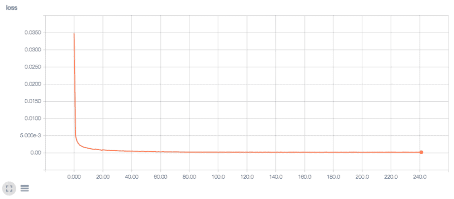

平滑= 0（无指数平滑）时的验证损失：

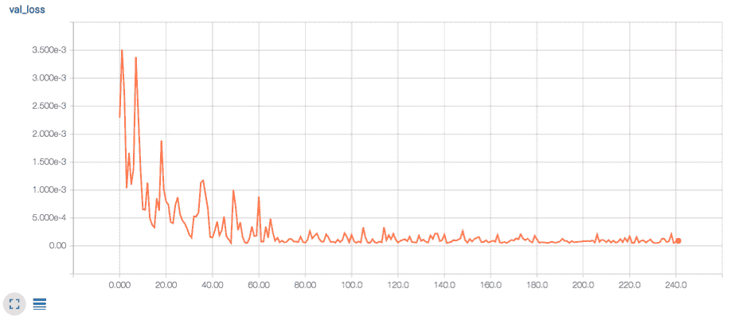

学习进展顺利，两种损失都随着时间而减少。 通过将其与基本事实进行比较，我们可以进一步将预测可视化。 首先，加载我们刚刚获得的最佳模型，并为训练数据和测试数据计算预测：

```py
>>> from keras.models import load_model >>> model = load_model(model_file) >>> pred_train_scaled = model.predict(X_train_reshaped) >>> pred_test_scaled = model.predict(X_test_reshaped)
```

我们还需要将按比例缩放的预测转换回其原始比例。 我们可以编写一个函数来简化此操作：

```py
>>> def reverse_scale(X, Y_scaled): ...     """ ...     Convert the scaled outputs to the original scale ...     @param X: original input series ...     @param Y_scaled: scaled outputs ...     @return: outputs in original scale ...     """ ...     Y_original = np.copy(Y_scaled) ...     for i in range(len(X)): ...         x = X[i, -1] ...         Y_original[i] *= x ...     return Y_original
```

将反向缩放应用于缩放的预测：

```py
>>> pred_train = reverse_scale(X_train, pred_train_scaled) >>> pred_test = reverse_scale(X_test, pred_test_scaled)
```

最后，绘制预测以及基本事实：

```py
>>> plt.plot(Y) >>> plt.plot(np.concatenate([pred_train, pred_test])) >>> plt.xlabel('Time period') >>> plt.ylabel('Price') >>> plt.legend(['original series','prediction'],loc='center left') >>> plt.show()
```

前面的代码将创建以下图形：

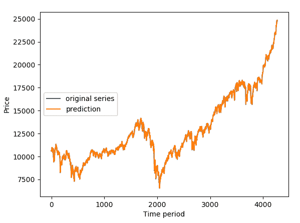

结果图表明预测是非常准确的。 为了进行比较，我们还使用了仅经过 10 个时期训练的模型，得出了效果不佳的结果：


应该注意的是，该项目主要是为了演示 GRU RNN 的应用，而不是用于实际的股票交易。 实际上，它要复杂得多，应考虑许多外部和内部因素，例如基本面，技术模式，利率，波动性，周期，新闻和情绪。

# 双向 RNN

到目前为止，在 RNN 体系结构中，输入序列的信息是从过去到当前状态再到未来的一个方向学习的。 它限制了当前状态以利用将来的输入信息。 让我们看一个丢失单词生成的简单示例：

```py
He said, "Machine __ combines computer science and statistics."
```

对于仅学习前三个单词的 RNN 模型来说，很难生成适合整个句子的下一个单词。 但是，如果给出了剩余单词，则该模型将更好地捕获上下文，并且更有可能预测下一个单词，即`learning`。 为了克服单向 RNN 的局限性，引入了**双向 RNN**（**BRNN**）。

在 BRNN 中，隐藏层由两个独立的递归层组成。 这两层是相反的方向：一层为正时方向，也称为**正向**，其中输入信息从过去流向当前状态。 另一个为负时间方向，也称为**向后方向**，其中从将来到当前状态处理输入信息。 下图描述了 BRNN 的一般结构：

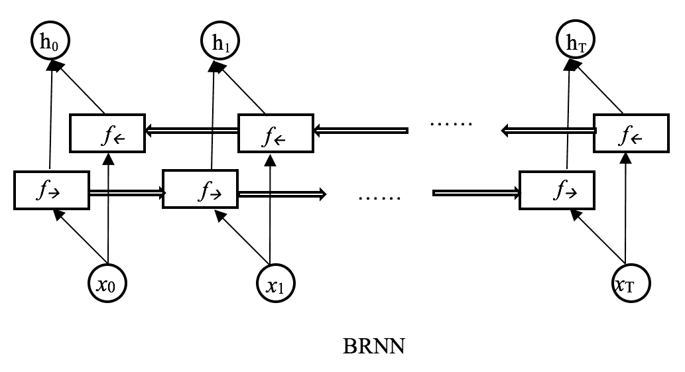

在此，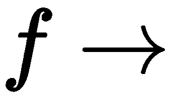和分别表示正向和反向递归层。 它们连接在一起，形成隐藏层，并保留来自过去和将来状态的信息。

当需要并提供完整的上下文（包括过去和将来的信息）时，BRNN 特别有用。 例如，在词性标记，实体识别或手写识别中，可以通过了解当前单词或字母之后的单词或字母来提高性能。 其他出色的用例包括语音识别，机器翻译和图像字幕。

接下来，我们将 BRNN 和 LSTM 结合起来用于情感分类。 我们将看到捕获移动评论的完整上下文信息是否有助于增强其情感极性。

# 双向 RNN 用于情感分类

Keras 包含来自 IMDb（ [www.imdb.com](http://www.imdb.com) ）的 50,000 条电影评论的数据集，并用情感极性（`1`为正，`0`为负）标记。 评论已经过预处理，每个词都由字典中的相应索引表示。 字典中的单词将根据整个数据集中的频率进行排序。 例如，编码为`4`的单词是数据中第 4 个最常见的单词。 您可以猜测`1`代表`the`，`2`代表`and`，并且最高索引用于停用词。

可以通过以下代码获得单词索引字典：

```py
>>> from keras.datasets import imdb >>> word_to_id = imdb.get_word_index()
```

我们可以使用`load_data`函数加载数据，该数据返回两个元组，即训练数据集和测试数据集：

```py
>>> max_words = 5000 >>> (x_train, y_train), (x_test, y_test) =
 imdb.load_data(num_words=max_words, skip_top=10, seed=42)
```

在这里，我们仅考虑前 5,000 个最常用的词，但排除了前 10 个最常用的词。 种子用于复制目的：

```py
>>> print(len(y_train), 'training samples') 25000 training samples >>> print(len(y_test), 'testing samples') 25000 testing samples
```

您会在某些输入样本中找到许多 2。 这是因为`2`用于表示由于我们应用了频率滤波器而被切掉的单词，包括前 10 个最常用的单词和第 5,000 个最常用的单词。 实际单词从索引`3`开始。

您可能会注意到输入样本的长度不同； 例如，第一个训练样本中有`467`个单词，第二个训练样本中有`138`个单词。 但是，训练 RNN 模型需要输入相同长度的样本。 我们需要将序列填充到相同的长度：短样本的末尾用 0 填充，而长样本则被截断。 我们使用`pad_sequences`函数，将序列长度指定为`200`：

```py
>>> from keras.preprocessing import sequence >>> maxlen = 200 >>> x_train = sequence.pad_sequences(x_train, maxlen=maxlen) >>> x_test = sequence.pad_sequences(x_test, maxlen=maxlen) >>> print('x_train shape:', x_train.shape) x_train shape: (25000, 200) >>> print('x_test shape:', x_test.shape) x_test shape: (25000, 200)
```

现在，我们有 200 个单词的输入序列，每个单词由`0`至`4999`的整数表示。 我们可以进行传统的一键编码，但是所生成的 3,000 维稀疏输出将使训练相应的 RNN 模型过慢。 取而代之的是，我们执行单词嵌入以将单词索引转换为较低维的密集向量。 在 Keras 中，我们将嵌入层用作模型的第一层：

```py
>>> from keras.models import Sequential >>> from keras.layers import Embedding >>> model = Sequential() >>> model.add(Embedding(max_words, 128, input_length=maxlen))
```

嵌入层将`5000`（`max_words`）值的索引输入转换为 128 维向量。 接下来，我们将双向 RNN 与 LSTM 相结合：

```py
>>> from keras.layers import Dense, Embedding, LSTM, Bidirectional >>> model.add(Bidirectional(LSTM(128, dropout=0.2, recurrent_dropout=0.2)))
```

我们仅在 LSTM 层上应用`Bidirectional`包装器。 LSTM 层具有 128 个隐藏的单元，其中输入单元的丢失率为 20％，循环连接的丢失率为 20％。

最后一层生成逻辑输出：

```py
>>> model.add(Dense(1, activation='sigmoid'))
```

对于优化器，`RMSprop`与`0.001`的学习速率一起使用，以最小化二进制分类的交叉熵：

```py
>>> optimizer = optimizers.RMSprop(0.001) >>> model.compile(optimizer=optimizer,loss='binary_crossentropy', metrics=['accuracy'])
```

最后，我们将测试集作为验证数据训练模型，并根据验证损失提前停止训练：

```py
>>> from keras.callbacks import EarlyStopping >>> early_stop = EarlyStopping(monitor='val_loss', min_delta=0, patience=10, verbose=1, mode='min') >>> model.fit(x_train, y_train, batch_size=32, epochs=100, validation_data=[x_test, y_test], callbacks=[early_stop])
```

让我们看一下纪元`1`，`5`，`8`和`15`的日志：

`Epoch 1`：

```py
Train on 25000 samples, validate on 25000 samples
Epoch 1/100
 5504/25000 [=====>........................] - ETA: 15:04 - loss: 0.6111 - acc: 0.6672 25000/25000 [==============================] - 1411s 56ms/step - loss: 0.4730 - acc: 0.7750 - val_loss: 0.3765 - val_acc: 0.8436
```

`Epoch 5`：

```py
Epoch 5/100
 5088/25000 [=====>........................] - ETA: 15:22 - loss: 0.2395 - acc: 0.9025 25000/25000 [==============================] - 1407s 56ms/step - loss: 0.2367 - acc: 0.9070 - val_loss: 0.2869 - val_acc: 0.8848 Epoch 00005: val_loss did not improve from 0.27994
```

`Epoch 8`：

```py
Epoch 8/100
 5088/25000 [=====>........................] - ETA: 15:16 - loss: 0.1760 - acc: 0.9347 25000/25000 [==============================] - 1404s 56ms/step - loss: 0.1815 - acc: 0.9314 - val_loss: 0.2703 - val_acc: 0.8960
```

`Epoch 15`：

```py
Epoch 15/100
 5408/25000 [=====>........................] - ETA: 15:08 - loss: 0.0936 - acc: 0.9680 25000/25000 [==============================] - 1413s 57ms/step - loss: 0.0975 - acc: 0.9656 - val_loss: 0.3588 - val_acc: 0.8816 Epoch 00015: val_loss did not improve from 0.27034
```

训练在纪元`18`停止，因为提前停止触发：

```py
Epoch 00018: val_loss did not improve from 0.27034
Epoch 00018: early stopping
```

使用 BRNN 和 LSTM 可以达到 89.6％的测试精度。

# 概要

我们刚刚完成了关于 DL 体系结构-RNN 的学习旅程的重要部分！ 在本章中，我们更加熟悉了 RNN 及其变体。 我们从 RNN 是什么，RNN 的发展路径以及它们如何成为顺序建模的最新解决方案入手。 我们还研究了四种 RNN 架构，并按输入和输出数据的形式进行了分类，并提供了一些工业示例。

接下来，我们讨论按递归层分类的各种体系结构，包括原始 RNN，LSTM，GRU 和双向 RNN。 首先，我们应用了香草架构来编写我们自己的*《战争与和平》* ，尽管有点荒谬。 我们通过使用 LSTM 体系结构 RNN 生成了更好的版本。 股票价格预测中采用了另一种内存增强型架构 GRU。

最后，除了过去的信息外，我们还引入了双向体系结构，该模型允许模型保留序列的过去和将来上下文中的信息。 我们还使用双向 RNN 和 LSTM 进行电影评论情感分类。 在下一章中，我们将探讨 DL 模型的另一项伟大发明：生成对抗网络。