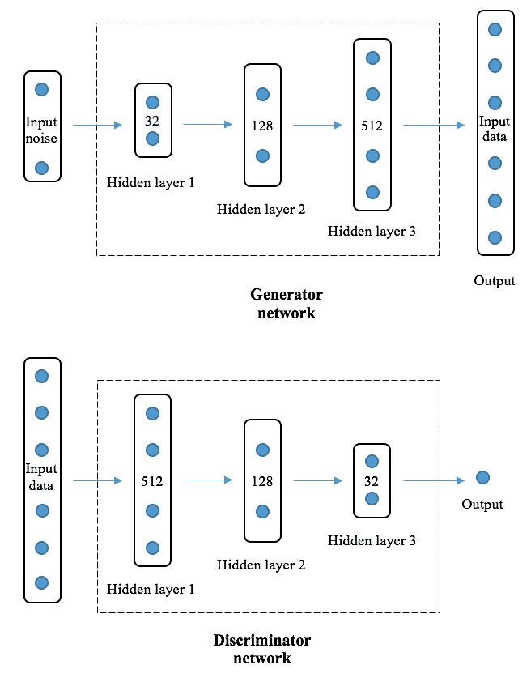
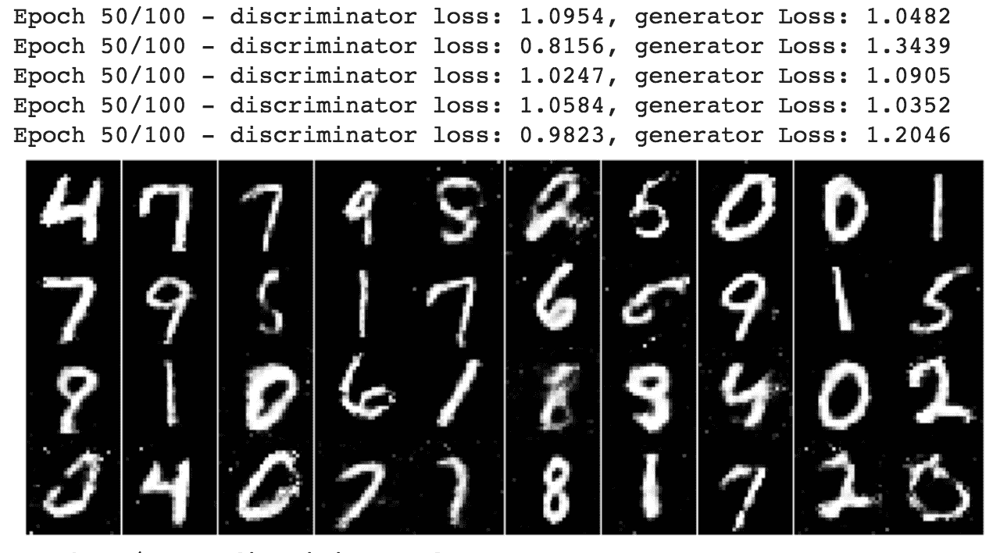
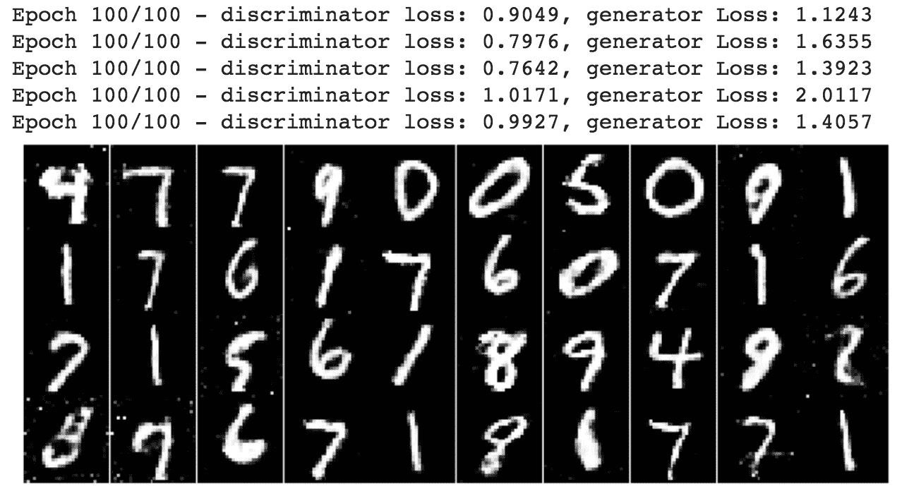
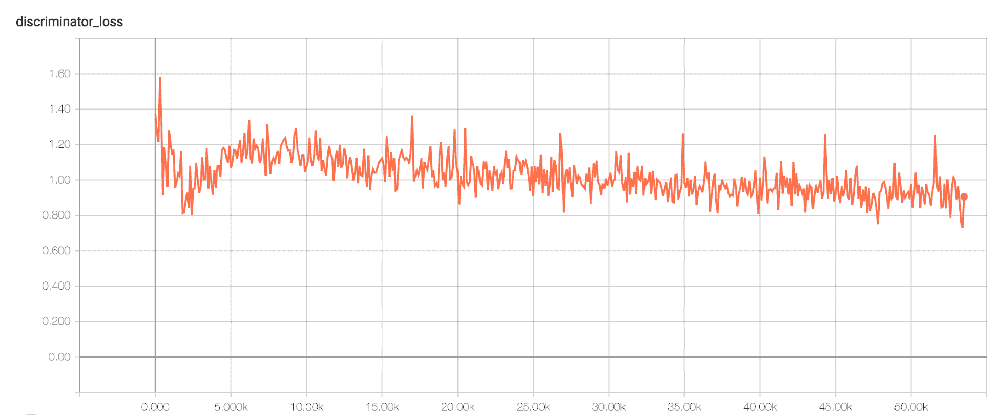
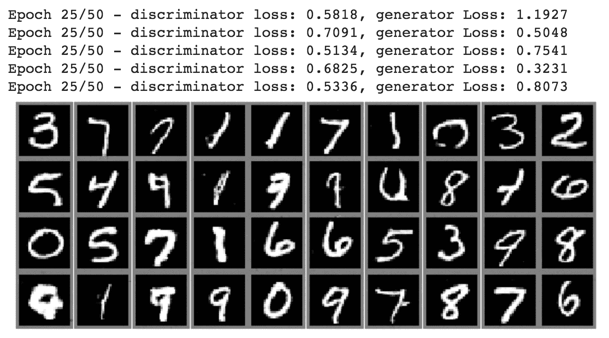
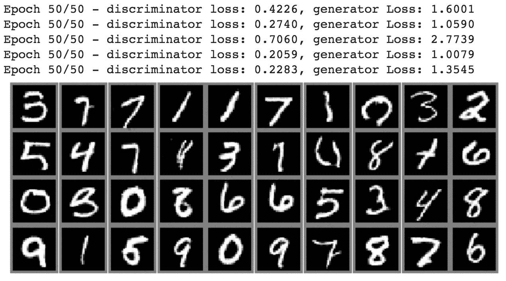
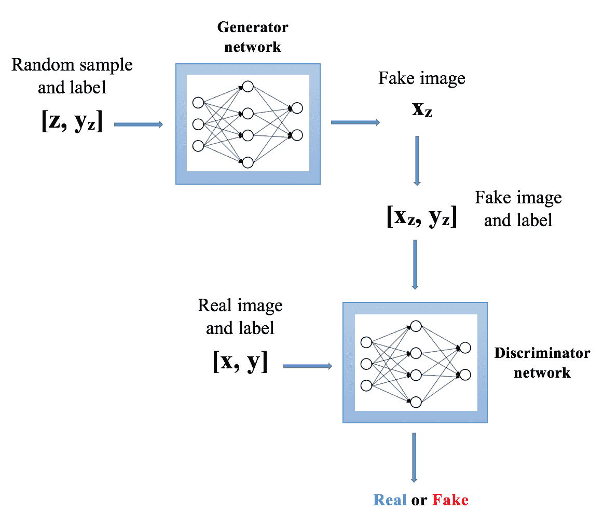
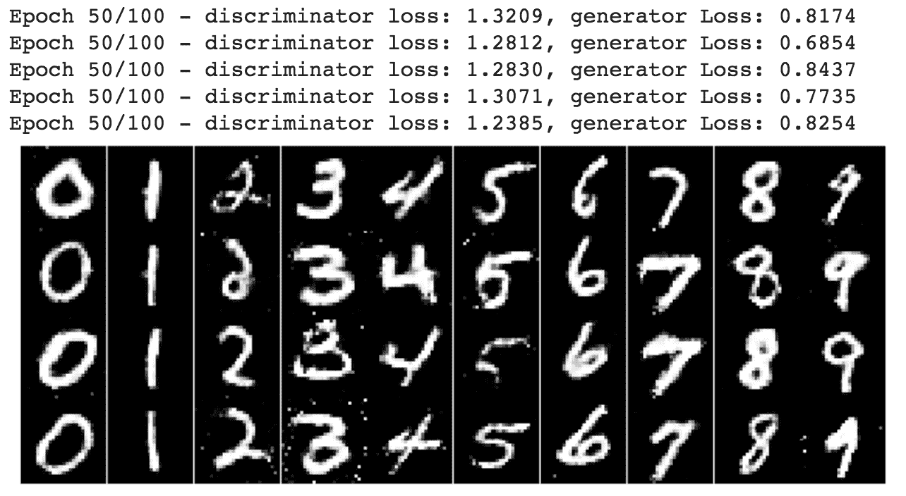
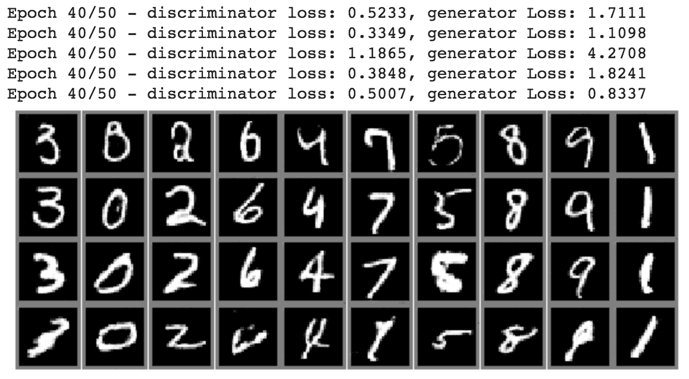
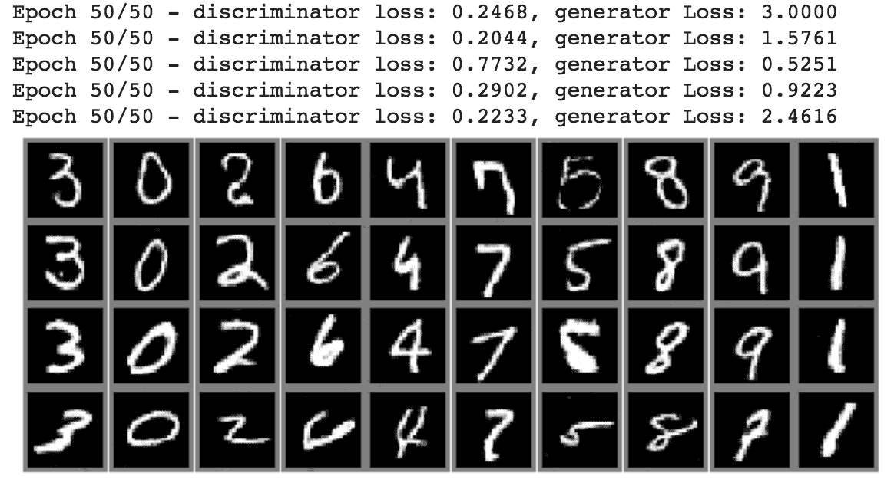

# 生成对抗网络

在本章中，我们将解释最有趣的深度学习模型之一，即**生成对抗网络**（**GAN**）。 我们将首先回顾 GAN 是什么以及它们的用途。 在简要介绍了 GAN 模型的演化路径之后，我们将说明各种 GAN 架构以及图像生成示例。

想象一下，您正在模仿一个最初并不了解的艺术品（例如 Vincent van Gogh 的《星空》）。 您可以随意参加多次。 每次您提交作品时，评委都会向您反馈真实艺术品的外观以及复制品的接近程度。 在最初的几次尝试中，由于您对原始作品的了解非常有限，因此您的作品得分不高。 经过几番尝试，由于法官提供了有用的提示，您的作品越来越接近真实的艺术品。 您会不断尝试和改进，并将法官的反馈纳入您的尝试中，而在最近的几次尝试中，您的工作看起来与原始工作非常接近。 希望您最终能赢得比赛。

GAN 在合成图像，声波，视频和任何其他信号方面几乎具有相同的作用，我们将在本章中对此进行深入探讨。

在本章中，我们将介绍以下主题：

*   什么是 GAN？
*   生成模型
*   对抗训练
*   GAN 的演进路径
*   香草 GAN 建筑
*   实施香草 GAN
*   产生影像
*   深度卷积 GAN 架构
*   实施深度卷积 GAN
*   Conditional GAN architecture
*   实施条件 GAN
*   Information-maximizing GAN architecture
*   实施信息最大化的 GAN

# 什么是 GAN？

GAN 可能是深度神经网络最有趣的类型之一。 自从 Goodfellow 等人首次引入 GAN 以来。 2014 年，围绕它们开展的研究项目和应用程序越来越多，其中一些确实很有趣。 以下是我们挑选的有趣的东西：

*   **图像生成**，例如猫图片，假名人面孔，甚至是现代艺术品
*   **音频或视频合成**，例如 DeepMind 的 WaveNets，它们能够为天文图像生成人类语音和 3D 重建
*   **时间序列生成**，例如用于股票市场预测的医学数据和高频数据
*   **统计推断**，例如通过分析一堆图片来设计服装的亚马逊算法

那么，为什么 GAN 如此强大？ 对于 GAN，最好先讨论生成模型，因为 GAN 基本上是生成模型。

# 生成模型

机器学习中有两种主要类型的模型，即**生成模型**和**判别模型**。 顾名思义，区分模型试图在两个（或多个）类之间区分数据。 例如，我们在“第 4 章”，“CNN 架构”中讨论过的 CNN 模型，学会告诉我们一个图像是猫还是狗，给定其中一个图像， 以及 “第 6 章”，“循环神经网络”中的 RNN 模型经过训练，可以输出给定段落的正面或负面情感。 判别模型着重于根据数据的特征预测数据类别。 相反，生成模型不尝试将要素映射到类，而是在给定特定类的情况下生成要素。 例如，训练**高斯混合模型**（**GMM**）以生成适合训练集分布的新数据。 生成模型对给定单个类的特征分布进行建模。 也就是说，可以使用生成模型对数据进行分类，例如 Naive Bayes 和玻尔兹曼机，我们在“第 3 章”，“受限玻尔兹曼机和自编码器”中进行了讨论。 但是，他们的首要任务是弄清楚某些功能的可能性，而不是识别标签。 然后将学习到的特征分布用于分类。 如果仍然感到困惑，这是区分生成模型和区分模型的简单方法：

*   区分模型对寻找边界或规则以分离数据感兴趣
*   生成模型侧重于对数据分布进行建模

GAN 模型由两个网络组成。 一个称为生成器的网络负责生成新的数据样本，从而生成 GAN 生成模型。 另一个网络称为判别器，对生成的数据进行真实性评估。 具体而言，它确定单独生成的样本是否属于真实训练数据集。 再次，GAN 仍然是生成模型，因为它们专注于生成特别感兴趣的数据分布，并且添加了判别器以提供反馈以更好地生成数据。 让我们看看它是如何工作的。

# 对抗性-以对抗性方式进行训练

如果我们还记得梵高（Van Gogh）的例子，那么 GAN 模型就在做类似的事情。 我们模仿艺术品，而 GAN 中的生成器生成候选对象，例如感兴趣的特定数据分布； 法官评估我们的副本，而 GAN 中的判别器则通过从真实数据分布中区分生成的候选对象和实例来评估生成的候选对象。

GAN 中的生成器和判别器以对抗性方式进行训练，也就是说，它们在零和框架中相互竞争，以便生成模拟真实数据分布的数据。 就像在美术比赛中一样，我们不断改进复制品，以期获得法官的高分，并且法官不断评估我们的工作并提供反馈。 GAN 中的生成器旨在生成被视为来自真实数据分布的合成实例，即使它们是*伪造的*，而判别器的目标是识别单个实例是否是伪造的（已合成） 或真实的。 从优化的角度来看，生成器的训练目标是增加判别器的错误-判别器犯的错误越多，生成器的性能就越好。 判别器的目的是减少其误差，这是显而易见的。 在每次迭代中，两个网络都使用梯度下降来实现其目标，这并不是什么新鲜事。 有趣的是，每个网络都在试图击败另一个网络，即生成器试图欺骗判别器，而判别器则试图不被欺骗。 最终，来自发生器的合成数据（例如图像，音频，视频，时间序列）（希望）能够欺骗最复杂的判别器，类似于艺术品复制品竞赛，我们能够从最严格的标准中获得最高分 但最有帮助的法官。

实际上，生成器从具有高斯分布的多元高斯分布的预定义分布中抽取随机样本作为最受欢迎的输入，并生成看起来好像可能来自目标分布的数据。 这与复制品竞赛非常相似，在复制品竞赛中，我们最初对艺术品一无所知，并一直朝着像样的复制品努力。

以图像生成为例，下图可以表示 GAN 模型：


GAN 采取的步骤如下：

1.  生成器网络从高斯分布中获取随机样本并输出图像。
2.  这些生成的图像然后被馈送到判别器网络。
3.  判别器网络接收生成的图像和从实际数据集中获取的图像。
4.  判别器输出概率，其中上限 1 表示输入图像被认为是真实的，下限 0 表示输入图像被认为是假的。
5.  生成器的损失（成本函数）是基于判别器认为真实的伪图像的交叉熵来计算的。

6.  判别器的损失（成本函数）是根据被认为是伪造的伪图像的交叉熵加上被认为是真实的真实图像的交叉熵来计算的。
7.  对于每个时期，两个网络都经过优化，分别将其各自的损失降至最低。
8.  在某个时候，当融合判别器将融合生成器生成的图像视为真实图像时，该模型将得到很好的训练。
9.  最终，训练有素的生成器会生成图像作为最终输出，从而模仿真实图像的输入。

# GAN 的演进路径

对抗训练的思想可以追溯到 1990 年代早期的工作，例如 Schmidhuber 的《通过可预测性最小化学习阶乘代码》。 2013 年，在《通过受控相互作用学习动物行为的协同进化方法》中提出了无模型推断的对抗模型。 2014 年，Goodfellow 等人在《生成对抗网络》中首次引入了 GAN。

Li 等人（提出动物行为推断的同一作者）在《图灵学习：一种无度量的行为推断方法及其在群体中的应用》中于 2016 年提出了**图灵学习** 一词。 图灵学习与图灵测试相关，并且是 GAN 的概括，如《概括 GAN：图灵的视角》中所总结。 在图灵学习中，模型不仅限于 GAN 或神经网络； 判别器会影响发生器的输入，在图灵测试中充当询问器。

提出的第一个 GAN 由用于发生器和判别器的全连接层组成。 自从香草架构以来，已经开发了许多新的创新方法，例如，深度卷积 GAN，条件 GAN 和信息最大化的 GAN。 在下一节中，我们将详细研究这些架构，并从头开始实现每个架构。

# GAN 架构和实现

如所承诺的，我们将仔细研究我们在前几节中详细提到的 GAN 的变体，并将其应用于实际问题。 最常用的 GAN 包括深度卷积 GAN，条件 GAN 和信息最大化 GAN。 让我们从最基本的架构开始。

# 香草甘氨酸

在最基本的 GAN 模型中，生成器和判别器都是全连接神经网络。 香草 GAN 的架构可以描述如下：


生成器的输入是来自特定分布的随机样本，我们通常将其称为**噪声**或**潜在变量**。 第二层和后面的几层是隐藏层，在这种情况下，它们是全连接层。 隐藏层通常比其先前的隐藏层具有更多的单元。 输出层的大小与预期的生成大小相同，与实际数据的大小相同。 对于判别器，其输入是真实或生成的数据，其后是一个或多个隐藏层，以及一个单元的输出层。 每个隐藏层通常比其先前的隐藏层具有更少的单元。 通常，生成器和判别器具有相同数量的隐藏层。 而且，两组隐藏层通常是对称的。 例如，香草 GAN 的生成器和判别器如下所示：



现在我们已经了解了什么是普通 GAN，我们可以开始在 TensorFlow 中从头开始实现它们了。 从这里开始，我们将以 MNIST 手写数字数据集为例，以便我们可以应用 GAN 生成我们自己的 MNIST。

我们将从加载用于模型训练的 MNIST 数据集开始：

```py
>>> import numpy as np
>>> import tensorflow as tf
>>> def load_dataset():
...     (x_train, y_train), (x_test, y_test) =         
               tf.keras.datasets.mnist.load_data('./mnist_data')
...     train_data = np.concatenate((x_train, x_test), axis=0)
...     train_data = train_data / 255.
...     train_data = train_data * 2\. - 1
...     train_data = train_data.reshape([-1, 28 * 28])
...     return train_data
```

该功能读取并合并原始训练和测试集（不包括标签），因为在香草模型中不需要它们。 它还将数据从[0，255]到[-1，1]的范围重新缩放，这是神经网络模型预处理的非常重要的一部分，并且还将单个样本重塑为一维样本。

调用此函数并检查已加载数据的大小：

```py
>>> data = load_dataset()
>>> print("Training dataset shape:", data.shape)
Training dataset shape: (70000, 784)
```

总共有 70,000 个训练样本，每个样本有 784 个尺寸（28 x 28）。 如果您忘记了 MNIST 数据的外观，我们将使用定义如下的函数显示一些示例：

```py
>>> import matplotlib.pyplot as plt
>>> def display_images(data, image_size=28):
...     fig, axes = plt.subplots(4, 10, figsize=(10, 4))
...     for i, ax in enumerate(axes.flatten()):
...         img = data[i, :]
...         img = (img - img.min()) / (img.max() - img.min())
...         ax.imshow(img.reshape(image_size, image_size), cmap='gray')
...         ax.xaxis.set_visible(False)
...         ax.yaxis.set_visible(False)
...     plt.subplots_adjust(wspace=0, hspace=0)
...     plt.show()
```

此功能在 4 行 10 列中显示 40 张图像。 稍后将重新使用它以显示生成的图像。 看一下前 40 个真实样本：

```py
>>> display_images(data)
```

请参考以下屏幕截图以获取最终结果：


在评估我们生成的图像的真实性时，您将需要稍后返回这些图像。

现在，让我们开始构建 GAN 模型。 首先，我们为全连接层定义包装函数，因为它在香草 GAN 中最常使用：

```py
>>> def dense(x, n_outputs, activation=None):
...     return tf.layers.dense(x, n_outputs, activation=activation,
 kernel_initializer=
                    tf.random_normal_initializer(mean=0.0,stddev=0.02))
```

通过放置一些密集层，我们构建了生成器：

```py
>>> def generator(z, alpha=0.2):
...     """
...     Generator network
...     @param z: input of random samples
...     @param alpha: leaky relu factor
...     @return: output of the generator network
...     """
...     with tf.variable_scope('generator', reuse=tf.AUTO_REUSE):
...         fc1 = dense(z, 256)
...         fc1 = tf.nn.leaky_relu(fc1, alpha)
...         fc2 = dense(fc1, 512)
...         fc2 = tf.nn.leaky_relu(fc2, alpha)
...         fc3 = dense(fc2, 1024)
...         fc3 = tf.nn.leaky_relu(fc3, alpha)
...         out = dense(fc3, 28 * 28)
...         out = tf.tanh(out)
...         return out
```

发生器将输入的随机噪声依次馈入三个隐藏层，分别具有 256、512 和 1,024 个隐藏单元。 请注意，每个隐藏层的激活功能是**泄漏的 ReLU**，这是 ReLU 的变体。 发明它是为了解决即将死去的 ReLU 问题，即对于该函数的任何负输入，其输出变为零。 它定义为，其中是介于 0 到 1 之间的斜率因子（但较小的值更常见）。 下图显示了 ReLU 和泄漏版本之间的比较（例如`leak = 0.2`）：


在三个隐藏层之后，输出层随后进行 tanh 激活，将数据映射到期望图像的相同大小和范围。 类似地，我们用四个密集层构建判别器，其中三个是隐藏层，其大小与生成器中隐藏层的顺序相反：

```py
>>> def discriminator(x, alpha=0.2):
...     """
...     Discriminator network
...     @param x: input samples, can be real or generated samples
...     @param alpha: leaky relu factor
...     @return: output logits
...     """
...     with tf.variable_scope('discriminator', reuse=tf.AUTO_REUSE):
...         fc1 = dense(x, 1024)
...         fc1 = tf.nn.leaky_relu(fc1, alpha)
...         fc2 = dense(fc1, 512)
...         fc2 = tf.nn.leaky_relu(fc2, alpha)
...         fc3 = dense(fc2, 256)
...         fc3 = tf.nn.leaky_relu(fc3, alpha)
...         out = dense(fc3, 1)
...         return out
```

输出层将数据映射到单个单位 logit。 现在，我们可以为大小为 784 的实际输入数据和大小为 100 的噪声输入数据定义占位符：

```py
>>> noise_size = 100
>>> tf.reset_default_graph()
>>> X_real = tf.placeholder(tf.float32, (None, 28 * 28), name='input_real')
>>> z = tf.placeholder(tf.float32, (None, noise_size), name='input_noise')
```

将生成器应用于输入噪声，并将判别器应用于生成的图像以及真实图像数据：

```py
>>> g_sample = generator(z)
>>> d_real_out = discriminator(X_real)
>>> d_fake_out = discriminator(g_sample)
```

利用网络的所有这些输出，我们为生成器开发了`loss`计算，该计算基于被认为是真实的伪造图像：

```py
>>> g_loss = tf.reduce_mean(
...             tf.nn.sigmoid_cross_entropy_with_logits(logits=d_fake_out,
 labels=tf.ones_like(d_fake_out)))
>>> tf.summary.scalar('generator_loss', g_loss)
```

我们还记录了损失，以便使用 TensorBoard 可视化学习进度。

接下来是用于判别器的`loss`计算，该计算基于两个组件：真实图像被视为伪造的图像和伪图像被视为真实的图像：

```py
>>> d_real_loss = tf.reduce_mean(
...             tf.nn.sigmoid_cross_entropy_with_logits(logits=d_real_out,
 labels=tf.ones_like(d_real_out)))
>>> d_fake_loss = tf.reduce_mean(
...             tf.nn.sigmoid_cross_entropy_with_logits(logits=d_fake_out,
 labels=tf.zeros_like(d_fake_out)))
>>> d_loss = d_real_loss + d_fake_loss
>>> tf.summary.scalar('discriminator_loss', d_loss)
```

同样，我们记录了判别器损失。 然后，我们为两个网络定义优化器，如下所示：

```py
>>> train_vars = tf.trainable_variables()
>>> d_vars = [var for var in train_vars 
                        if var.name.startswith('discriminator')]
>>> g_vars = [var for var in train_vars 
                        if var.name.startswith('generator')]
>>> learning_rate = 0.0002
>>> beta1 = 0.5
>>> with tf.control_dependencies(
                    tf.get_collection(tf.GraphKeys.UPDATE_OPS)):
...     d_opt = tf.train.AdamOptimizer(learning_rate,
 beta1=beta1).minimize(d_loss, var_list=d_vars)
...     g_opt = tf.train.AdamOptimizer(learning_rate,
 beta1=beta1).minimize(g_loss, var_list=g_vars)
```

优化器实现亚当算法，学习率为 0.0002，第一矩衰减率为 0.5。 在进行模型优化之前，不要忘记定义一个函数，该函数返回用于训练的批量数据：

```py
>>> def gen_batches(data, batch_size, shuffle=True):
...     """
...     Generate batches for training
...     @param data: training data
...     @param batch_size: batch size
...     @param shuffle: shuffle the data or not
...     @return: batches generator
...     """
...     n_data = data.shape[0]
...     if shuffle:
...         idx = np.arange(n_data)
...         np.random.shuffle(idx)
...         data = data[idx]
...     for i in range(0, n_data, batch_size):
...         batch = data[i:i + batch_size]
...         yield batch
```

准备好所有组件之后，我们就可以开始训练 GAN 模型了。 对于每 100 步，我们记录生成器损耗和判别器损耗。 为了进行性能检查，我们创建了一组噪声输入，并显示了当前生成器针对每个时期生成的图像：

```py
>>> epochs = 100
>>> steps = 0
>>> with tf.Session() as sess:
...     merged = tf.summary.merge_all()
...     train_writer = tf.summary.FileWriter(
                                './logdir/vanilla', sess.graph)
...     sess.run(tf.global_variables_initializer())
...     for epoch in range(epochs):
...         for batch_x in gen_batches(data, batch_size):
...         batch_z = np.random.uniform(
                            -1, 1, size=(batch_size,noise_size))
...         _, summary, d_loss_batch = sess.run(
                                [d_opt, merged, d_loss], 
                                feed_dict={z: batch_z, X_real: batch_x})
...         sess.run(g_opt, feed_dict={z: batch_z})
...         _, g_loss_batch = sess.run(
                              [g_opt, g_loss], feed_dict={z: batch_z})
...         if steps % 100 == 0:
...             train_writer.add_summary(summary, steps)
...             print("Epoch {}/{} - discriminator loss: 
                      {:.4f}, generator Loss: {:.4f}".format(
...                   epoch + 1, epochs, d_loss_batch,g_loss_batch))
...         steps += 1
...     gen_samples = sess.run(generator(z), feed_dict={z:sample_z})
...     display_images(gen_samples)
```

注意，在每个时期，生成器更新两次，而判别器仅更新一次。 这是因为优化判别器比生成器容易得多，这很直观。 任意图像只是毫不费力地被认为是伪造的。 如果判别器在早期出现收敛，则不完整的生成器将产生垃圾。 您还可以为两个网络指定不同的学习率，例如，生成器的学习率稍高一些，0.001，判别器的学习率则为 0.0002。

请参阅以下屏幕截图以获取第 25 阶段的最终结果：


以下屏幕截图显示了纪元 50 的输出：



以下屏幕截图显示了纪元 75 的输出：


以下屏幕截图显示了纪元 100 的输出：



我们的第一个 GAN 模型能够合成手写数字，并且大多数看起来都是合法的！ 我们还来看看 TensorBoard 中的学习图。 要运行 TensorBoard，请在终端中输入以下命令：

```py
tensorboard --logdir=logdir/
```

然后，在浏览器中转到`http://localhost:6006/`； 我们将看到判别器的图表：



以下是生成器的示意图：


您可能会注意到，有些数字看起来很奇怪。 在全连接香草模型的基础上，我们可以做哪些改进？ 对于计算机视觉，使用卷积层可能是最直观的方法。

# 深度卷积 GAN

**卷积层**已成为解决图像问题的必备条件。 使用 GAN 生成图像也不例外。 因此，Radford 等人在《使用深度卷积生成对抗网络进行无监督表示学习》提出了**深度卷积生成对抗网络**（**DCGAN**）。

很容易理解 DCGAN 中的区分符。 它也非常类似于用于分类的标准 CNN，其中使用一个或多个卷积层，每个卷积层之后是一个非线性层，最后是一个全连接层。 例如，我们可以具有以下架构：


卷积层共有三个，分别由 64 个，128 个和 256 个 5 x 5 滤镜组成。

如前所述，生成器通常与判别器对称。 DCGAN 中的判别器通过卷积层解释输入图像并生成数字输出。 因此，生成器需要使用**转置的卷积层**将数字噪声输入转换为图像，这与卷积层完全相反。 卷积层执行下采样，而转置卷积层执行上采样。 例如，我们可以为发电机使用以下架构：


考虑到所有这些概念，让我们实现 DCGAN。 同样，我们从定义卷积和转置卷积层的包装函数开始，因为它们在 DCGAN 中使用最频繁：

```py
>>> def conv2d(x, n_filters, kernel_size=5):
...     return tf.layers.conv2d(inputs=x, filters=n_filters,
 kernel_size=kernel_size, strides=2, padding="same",
 kernel_initializer=tf.random_normal_initializer(
 mean=0.0, stddev=0.02)) 
>>> def transpose_conv2d(x, n_filters, kernel_size=5):
...     return tf.layers.conv2d_transpose(inputs=x,
 filters=n_filters, kernel_size=kernel_size, strides=2,
 padding='same', kernel_initializer=
 tf.random_normal_initializer(mean=0.0, stddev=0.02))
```

我们定义的密集函数可用于全连接层。 同样，我们在卷积层的输出上应用批量归一化。 批量规范化背后的思想类似于输入数据规范化，可加快学习速度。 通过从激活层的输出中减去批次平均值，然后将其除以批次标准偏差来执行批次标准化。 我们为批量标准化定义了一个包装器函数，如下所示：

```py
>>> def batch_norm(x, training, epsilon=1e-5, momentum=0.9):
...     return tf.layers.batch_normalization(x, training=training,
 epsilon=epsilon, momentum=momentum)
```

现在，我们可以使用刚刚定义的组件来构造判别器：

```py
>>> def discriminator(x, alpha=0.2, training=True):
...     """
...     Discriminator network for DCGAN
...     @param x: input samples, can be real or generated samples
...     @param alpha: leaky relu factor
...     @param training: whether to return the output in training mode 
                        (normalized with statistics of the current batch)
...     @return: output logits
...     """
...     with tf.variable_scope('discriminator', reuse=tf.AUTO_REUSE):
...         conv1 = conv2d(x, 64)
...         conv1 = tf.nn.leaky_relu(conv1, alpha)
...         conv2 = conv2d(conv1, 128)
...         conv2 = batch_norm(conv2, training=training)
...         conv2 = tf.nn.leaky_relu(conv2, alpha)
...         conv3 = conv2d(conv2, 256)
...         conv3 = batch_norm(conv3, training=training)
...         conv3 = tf.nn.leaky_relu(conv3, alpha)
...         fc = tf.layers.flatten(conv3)
...         out = dense(fc, 1)
...         return out
```

这很容易。 三个卷积层分别包含 64、128 和 256 个 5 x 5 过滤器。

开发发电机有点棘手。 回想一下，我们需要首先将输入的一维噪声整形为三维图像，以启用转置卷积。 我们知道，由于两个网络的对称性，第三维是 256。 那么，前两个维度是什么？ 它们是`2 x 2`，在第一个转置的卷积层之后变为`4 x 4`，第二个之后的为`8 x 8`，第三个之后的为 16 x 16，如果它是`3 x 3`，则与我们的`28 x 28`的目标相去甚远。 同样，它在第三个转置的卷积层之后变为 24 x 24，这又不够大。 如果它是 4 x 4，则在第三个转置的卷积层之后变为 32 x 32。 因此，将线性输入重塑为 4 x 4 图像就足够了。 请注意，现在生成的图像输出的大小为 32 x 32，这与我们的真实图像的大小 28 x 28 不同。要确保对判别器的输入恒定，我们只需要在真实图像上填充零即可。 在`load_dataset`函数的顶部实现了实图像的零填充：

```py
>>> def load_dataset_pad():
... (x_train, y_train), (x_test, y_test)=
 tf.keras.datasets.mnist.load_data('./mnist_data')
... train_data = np.concatenate((x_train, x_test), axis=0)
... train_data = train_data / 255.
... train_data = train_data * 2\. - 1
... train_data = train_data.reshape([-1, 28, 28, 1])
... train_data = np.pad(train_data, ((0,0),(2,2),(2,2),(0,0)),
 'constant', constant_values=0.)
... return train_data
```

由于 DCGAN 中的判别器接受三维图像输入，因此训练数据也被重塑为（70000，32，32，1）：

```py
>>> data = load_dataset_pad()
>>> print("Training dataset shape:", data.shape)
Training dataset shape: (70000, 32, 32, 1)
```

加载数据后，我们可以继续定义生成器：

```py
>>> def generator(z, n_channel, training=True):
...     """
...     Generator network for DCGAN
...     @param z: input of random samples
...     @param n_channel: number of output channels
...     @param training: whether to return the output in training mode (normalized with statistics of the current batch)
...     @return: output of the generator network
...     """
...     with tf.variable_scope('generator', reuse=tf.AUTO_REUSE):
...         fc = dense(z, 256 * 4 * 4, activation=tf.nn.relu)
...         fc = tf.reshape(fc, (-1, 4, 4, 256))
...         trans_conv1 = transpose_conv2d(fc, 128)
...         trans_conv1 = batch_norm(trans_conv1, training=training)
...         trans_conv1 = tf.nn.relu(trans_conv1)
...         trans_conv2 = transpose_conv2d(trans_conv1, 64)
...         trans_conv2 = batch_norm(trans_conv2, training=training)
...         trans_conv2 = tf.nn.relu(trans_conv2)
...         trans_conv3 = transpose_conv2d(trans_conv2, n_channel)
...         out = tf.tanh(trans_conv3)
...         return out
```

首先，它将噪声输入映射到具有 4,096 个单位的全连接层，以便它可以重塑大小为 4 x 4 x 256 的三维数据，然后由三个转置的卷积层消耗。

现在，我们可以为尺寸为 28 x 28 x 1 的实际输入数据定义占位符：

```py
>>> image_size = data.shape[1:]
>>> tf.reset_default_graph()
>>> X_real = tf.placeholder(
                tf.float32, (None,) + image_size, name='input_real')
```

噪声输入数据和其余参数与上一节中的相同，因此我们跳过重复相同的代码。 接下来，我们将发生器应用于输入噪声：

```py
>>> g_sample = generator(z, image_size[2])
```

其余部分，包括图像判别器，损耗计算和优化器，将重用上一节中的内容。

准备好所有组件之后，我们现在就可以开始训练我们的 DCGAN 模型了。 同样，我们记录每 100 步的损耗，并显示每个时期（此时总共 50 个时期）的合成图像：

```py
>>> epochs = 50
>>> steps = 0
>>> with tf.Session() as sess:
...     merged = tf.summary.merge_all()
...     train_writer = tf.summary.FileWriter(
                                    './logdir/dcgan', sess.graph)
...     sess.run(tf.global_variables_initializer())
...     for epoch in range(epochs):
...         for batch_x in gen_batches(data, batch_size):
...             batch_z = np.random.uniform(
                                -1, 1, size=(batch_size, noise_size))
...             _, summary, d_loss_batch = sess.run(
                                    [d_opt, merged,d_loss], feed_dict=
                                    {z: batch_z, X_real: batch_x})
...             sess.run(g_opt, feed_dict={z: batch_z, X_real:batch_x})
...             _, g_loss_batch = sess.run([g_opt, g_loss], feed_dict=
                                        {z: batch_z, X_real: batch_x})
...             if steps % 100 == 0:
...                 train_writer.add_summary(summary, steps)
...                 print("Epoch {}/{} - discriminator loss: {:.4f},
                        generator Loss: {:.4f}".format(epoch + 1, epochs,     
                        d_loss_batch, g_loss_batch))
...             steps += 1
...         gen_samples = sess.run(generator(z, image_size[2], 
                          training=False), feed_dict={z: sample_z})
...         display_images(gen_samples, 32)
```

请参阅以下屏幕截图以获取第 25 阶段的最终结果：



最后，请参考以下屏幕截图，以获取第 50 阶段的最终结果：



TensorBoard 中显示的学习图如下所示：


下图显示了发电机损耗：


从我们的 DCGAN 模型生成的图像看起来比从普通 GAN 生成的图像更真实。 我们还将它们与真实图像一起放置； 没有提示，您能告诉哪个集是真集还是假集？


到目前为止，就我们无法控制要产生的 0 到 9 而言，我们生成的数字是相当随机的。 这是因为香草 GAN 和 DCGAN 中的生成器仅吸收随机噪声，只要结果看起来是真实的，就不再限制生成什么。 我们将看到条件 GAN 和 infoGAN 如何启用此功能。

# 条件 GAN

**条件 GAN**（**CGAN**）通过将标签信息馈送到生成器和判别器，从而希望生成特定标签的数据，从而使我们可以控制要生成的内容。 下图显示了 CGAN 的架构：



如我们所见，标签数据是 CGAN 中生成器和判别器的输入空间的扩展。 注意，标签数据表示为一热向量。 例如，MNIST 数据集中的数字 2 变为[0，0，1，0，0，0，0，0，0，0]。 CGAN 的其他部分，例如`cost`功能，与常规 GAN 相似。 因此，实现 CGAN 应该很容易。 我们可以开发一个全连接 CGAN，但是 CGAN 中的隐藏层不限于全连接层。 您可以尝试实现卷积版本作为练习。

首先，我们需要修改`data load`函数以包含标签：

```py
>>> def load_dataset_label():
...     from keras.utils import np_utils
...     (x_train, y_train), (x_test, y_test) 
                    =tf.keras.datasets.mnist.load_data('./mnist_data')
...     x_data = np.concatenate((x_train, x_test), axis=0)
...     y_train = np_utils.to_categorical(y_train)
...     y_test = np_utils.to_categorical(y_test)
...     y_data = np.concatenate((y_train, y_test), axis=0)
...     x_data = x_data / 255.
...     x_data = x_data * 2\. - 1
...     x_data = x_data.reshape([-1, 28 * 28])
...     return x_data, y_data
```

该函数还将标签数据从一维转换为一热编码的十维：

```py
>>> x_data, y_data = load_dataset_label()
>>> print("Training dataset shape:", x_data.shape) Training dataset shape: (70000, 784)
```

因此，`batch`生成功能也需要更新，以便它返回一批图像和标签：

```py
>>> def gen_batches_label(x_data, y_data, batch_size, shuffle=True):
...     """
...     Generate batches including label for training
...     @param x_data: training data
...     @param y_data: training label
...     @param batch_size: batch size
...     @param shuffle: shuffle the data or not
...     @return: batches generator
...     """
...     n_data = x_data.shape[0]
...     if shuffle:
...         idx = np.arange(n_data)
...         np.random.shuffle(idx)
...         x_data = x_data[idx]
...         y_data = y_data[idx]
...     for i in range(0, n_data - batch_size, batch_size):
...         x_batch = x_data[i:i + batch_size]
...         y_batch = y_data[i:i + batch_size]
...         yield x_batch, y_batch
```

稍后，我们将标签数据的占位符定义为新输入：

```py
>>> n_classes = 10
>>> y = tf.placeholder(tf.float32, shape=[None, n_classes],name='y_classes')
```

生成器获取标签数据，并将其与输入噪声连接起来：

```py
>>> def generator(z, y, alpha=0.2):
...     """
...     Generator network for CGAN
...     @param z: input of random samples
...     @param y: labels of the input samples
...     @param alpha: leaky relu factor
...     @return: output of the generator network
...     """
...     with tf.variable_scope('generator', reuse=tf.AUTO_REUSE):
...         z_y = tf.concat([z, y], axis=1)
...         fc1 = dense(z_y, 256)
...         fc1 = tf.nn.leaky_relu(fc1, alpha)
...         fc2 = dense(fc1, 512)
...         fc2 = tf.nn.leaky_relu(fc2, alpha)
...         fc3 = dense(fc2, 1024)
...         fc3 = tf.nn.leaky_relu(fc3, alpha)
...         out = dense(fc3, 28 * 28)
...         out = tf.tanh(out)
...         return out
```

判别器做同样的事情：

```py
>>> def discriminator(x, y, alpha=0.2):
...     """
...     Discriminator network for CGAN
...     @param x: input samples, can be real or generated samples
...     @param y: labels of the input samples
...     @param alpha: leaky relu factor
...     @return: output logits
...     """
...     with tf.variable_scope('discriminator', reuse=tf.AUTO_REUSE):
...         x_y = tf.concat([x, y], axis=1)
...         fc1 = dense(x_y, 1024)
...         fc1 = tf.nn.leaky_relu(fc1, alpha)
...         fc2 = dense(fc1, 512)
...         fc2 = tf.nn.leaky_relu(fc2, alpha)
...         fc3 = dense(fc2, 256)
...         fc3 = tf.nn.leaky_relu(fc3, alpha)
...         out = dense(fc3, 1)
...         return out
```

现在，我们将`y`标签提供给`generator`和`discriminator`：

```py
>>> g_sample = generator(z, y)
>>> d_real_out = discriminator(X_real, y)
>>> d_fake_out = discriminator(g_sample, y)
```

为了进行质量检查，我们在给定噪声输入的每个时期合成图像，并带有 10 个类别的集合的标签。 样本标签定义如下：

```py
>>> n_sample_display = 40
>>> sample_y = np.zeros(shape=(n_sample_display, n_classes))
>>> for i in range(n_sample_display):
...     j = i % 10
...     sample_y[i, j] = 1
```

训练部分之前的其余代码与香草 GAN 模型中的代码相同。

准备好所有组件之后，我们就可以开始训练 CGAN 模型了：

```py
>>> steps = 0
>>> with tf.Session() as sess:
...     merged = tf.summary.merge_all()
...     train_writer = tf.summary.FileWriter('./logdir/cgan',sess.graph)
...     sess.run(tf.global_variables_initializer())
...     for epoch in range(epochs):
...         for batch_x, batch_y in gen_batches_label(
                                        x_data, y_data,batch_size):
...             batch_z = np.random.uniform(-1, 1, 
                                        size=(batch_size, noise_size))
...             _, summary, d_loss_batch = sess.run([d_opt, merged,d_loss], 
                                            feed_dict={z: batch_z, 
                                            X_real: batch_x, y: batch_y})
...             sess.run(g_opt, feed_dict={z: batch_z, y: batch_y})
...             _, g_loss_batch = sess.run([g_opt, g_loss], feed_dict=
                                           {z: batch_z, y: batch_y})
...             if steps % 100 == 0:
...                 train_writer.add_summary(summary, steps)
...                 print("Epoch {}/{} - discriminator loss: {:.4f}, 
                          generator Loss: {:.4f}".format(
...                       epoch + 1, epochs, d_loss_batch, g_loss_batch))
...             steps += 1
...         gen_samples = sess.run(generator(z, y), 
                                    feed_dict={z:sample_z, y: sample_y})
...         display_images(gen_samples)
```

请参阅以下屏幕截图，以获取第 50 阶段的最终结果：



并参考以下屏幕截图以获取第 100 个时期的最终结果：


TensorBoard 中显示的学习图如下所示：


下图显示了发电机损耗：


使用 CGAN，我们可以完全控制要生成的数字，并且还可以使用 InfoGAN 来控制其他属性，例如宽度或旋转度。

# InfoGAN

**InfoGANs**（**最大化生成对抗网络**信息的缩写）在某种意义上类似于 CGAN，因为两个生成器网络都接受一个附加参数，并且条件变量`c`，例如标签信息。 他们都试图学习相同的条件分布`P(X | z, c`。 InfoGAN 与 CGAN 的区别在于它们处理条件变量的方式。

CGAN 认为条件变量是已知的。 因此，在训练期间将条件变量显式馈送到判别器。 相反，InfoGAN 假设条件变量是未知的且是潜在的，我们需要根据训练数据来推断条件变量。 InfoGAN 中的判别器负责推导后验`P(c | X)`。 下图显示了 InfoGAN 的架构：


由于我们不需要将条件变量提供给将自动推断出条件的判别器，因此我们可以将其基本分配给任何与数据相关的事物。 它不仅限于标签。 它可以是边缘的宽度，旋转角度和特定样式。 此外，它不仅限于一个变量，也不限于诸如*标签*之类的分类值。 我们可以有多个变量或一个标签变量，以及一个或多个连续变量作为潜在特征。

那么，InfoGAN 如何学习潜在功能？ 顾名思义，它们是通过最大化信息来实现的，信息是指信息论中的互信息。 我们希望最大化`c`与生成器生成的输出之间的相互信息。 InfoGAN 的`loss`功能可以概括如下：

`L_InfoGAN = (D, G) = L(D, G) - I(c, G(z, c))`

此处，`L(D, G)`是常规 GAN 中的`loss`函数，`I(c | G(z, c))`是`c`和生成的输出之间的互信息。 更准确地，将`P(c | G(z, c))`预测为更高的`I(c | G(z, c))`。

互信息`I(a, b)`衡量如果我们知道`b`，我们对`a`的了解程度。`P(a | b)`（或`P(b | a)`）预测得越准确，`I(a, b)`越高。 `I(a, b) = 0`表示`a`和`b`完全无关。

取决于潜在变量是什么，可以不同地计算`I(c | G(z, c))`。 对于分类变量，它是通过`cross`熵来衡量的。 对于连续变量，可以将其计算为其分布（例如高斯分布）之间的方差。

考虑到所有这些概念，我们可以开始开发 InfoGAN 模型。 回想一下，我们不需要在 InfoGAN 中提供标签数据。 因此，我们可以将`load_dataset_pad`和`gen_batches`函数用作 DCGAN。 让我们像往常一样先加载数据：

```py
>>> data = load_dataset_pad()
>>> print("Training dataset shape:", data.shape)
>>> Training dataset shape: (70000, 32, 32, 1)
```

现在，我们为条件变量定义一个占位符，作为生成器的额外输入：

```py
>>> n_classes = 10
>>> n_cont = 1
>>> c = tf.placeholder(tf.float32, shape=[None, n_classes + n_cont],     
                        name='conditional_variable')
```

此示例中的潜在特征包括 10 维一热编码特征和一维连续热特征。 现在，我们定义 InfoGAN 的生成器，它生成条件变量并将其与输入噪声连接起来：

```py
>>> def generator(z, c, n_channel, training=True):
...     """
...     Generator network for InfoGAN
...     @param z: input of random samples
...     @param c: latent features for the input samples
...     @param n_channel: number of output channels
...     @param training: whether to return the output in training mode 
                       (normalized with statistics of the current batch)
...     @return: output of the generator network
...     """
...     with tf.variable_scope('generator', reuse=tf.AUTO_REUSE):
...         z_c = tf.concat([z, c], axis=1)
...         fc = dense(z_c, 256 * 4 * 4, activation=tf.nn.relu)
...         fc = tf.reshape(fc, (-1, 4, 4, 256))
...         trans_conv1 = transpose_conv2d(fc, 128)
...         trans_conv1 = batch_norm(trans_conv1, training=training)
...         trans_conv1 = tf.nn.relu(trans_conv1)
...         trans_conv2 = transpose_conv2d(trans_conv1, 64)
...         trans_conv2 = batch_norm(trans_conv2, training=training)
...         trans_conv2 = tf.nn.relu(trans_conv2)
...         trans_conv3 = transpose_conv2d(trans_conv2, n_channel)
...         out = tf.tanh(trans_conv3)
...         return out
```

至于判别器，其前半部分与 DCGAN 的判别器相同，后者由三组卷积层组成。 它的后半部分由两个全连接层组成，后面是三组输出：判别器 logits（用于确定图像是真实的还是伪造的），连续变量的后验和分类变量的后验：

```py
>>> def discriminator(x, n_classes, n_cont=1, alpha=0.2, training=True):
...     """
...     Discriminator network for InfoGAN
...     @param x: input samples, can be real or generated samples
...     @param n_classes: number of categorical latent variables
...     @param n_cont: number of continuous latent variables
...     @param alpha: leaky relu factor
...     @param training: whether to return the output in training mode 
                        (normalized with statistics of the current batch)
...     @return: discriminator logits, posterior for the continuous
 variable, posterior for the categorical variable
...     """
...     with tf.variable_scope('discriminator', reuse=tf.AUTO_REUSE):
...         conv1 = conv2d(x, 64)
...         conv1 = tf.nn.leaky_relu(conv1, alpha)
...         conv2 = conv2d(conv1, 128)
...         conv2 = batch_norm(conv2, training=training)
...         conv2 = tf.nn.leaky_relu(conv2, alpha)
...         conv3 = conv2d(conv2, 256)
...         conv3 = batch_norm(conv3, training=training)
...         conv3 = tf.nn.leaky_relu(conv3, alpha)
...         fc1 = tf.layers.flatten(conv3)
...         fc1 = dense(fc1, 1024)
...         fc1 = batch_norm(fc1, training=training)
...         fc1 = tf.nn.leaky_relu(fc1, alpha)
...         fc2 = dense(fc1, 128)
...         d_logits = dense(fc2, 1)
...         cont = dense(fc2, n_cont)
...         classes = dense(fc2, n_classes)
...         return d_logits, cont, classes
```

现在，我们将生成器和判别器应用于输入数据以及条件变量：

```py
>>> g_sample = generator(z, c, image_size[2])
>>> d_real_logits, d_real_cont, d_real_cat = discriminator(
                                            X_real, n_classes, n_cont)
>>> d_fake_logits, d_fake_cont, d_fake_cat = discriminator(
                                             g_sample, n_classes, n_cont)
```

回想一下，InfoGAN 中的损失函数由两部分组成。 第一部分与标准 GAN 相同：

```py
>>> g_loss = tf.reduce_mean(tf.nn.sigmoid_cross_entropy_with_logits(     
                logits=d_fake_logits, labels=tf.ones_like(d_fake_logits)))
>>> d_real_loss = tf.reduce_mean(
...                     tf.nn.sigmoid_cross_entropy_with_logits(
                        logits=d_real_logits, labels=tf.ones_like(d_real_logits)))
>>> d_fake_loss = tf.reduce_mean(tf.nn.sigmoid_cross_entropy_with_logits(
                            logits=d_fake_logits, 
                            labels=tf.zeros_like(d_fake_logits)))
>>> d_loss = d_real_loss + d_fake_loss
```

第二部分是相互信息。 对于一键编码的分类变量，通过交叉熵来度量：

```py
>>> cat = c[:, n_cont:]
>>> d_cat_loss = tf.reduce_mean(
...                 tf.nn.softmax_cross_entropy_with_logits(
                    logits=d_fake_cat, labels=cat))
```

对于连续变量，可以将其计算为其分布（例如高斯分布）之间的方差：

```py
>>> d_cont_loss = tf.reduce_sum(tf.square(d_fake_cont))
```

信息损失（与互信息相反）是这两种损失的加权和：

```py
>>> lambda_cont = 0.1
>>> lambda_cat = 1.0
>>> d_info_loss = lambda_cont * d_cont_loss + lambda_cat * cat_loss
```

生成器和判别器的最终损失如下：

```py
>>> g_loss += d_info_loss
>>> tf.summary.scalar('generator_loss', g_loss)
>>> d_loss += d_info_loss
>>> tf.summary.scalar('discriminator_loss', d_loss)
```

我们还需要开发一个函数来生成用于训练的随机条件变量：

```py
>>> def gen_condition_variable(n_size, n_classes, n_cont):
...     cont = np.random.randn(n_size, n_cont)
...     cat = np.zeros((n_size, n_classes))
...     cat[range(n_size), np.random.randint(0, n_classes, n_size)] = 1
...     return np.concatenate((cont, cat), axis=1)
```

为了进行质量检查，我们在给定噪声输入的每个时期合成图像，并与一组 10 类的条件变量和一组恒定连续变量进行合成。 样本条件变量的定义如下：

```py
>>> n_sample_display = 40
>>> sample_c = np.zeros((n_sample_display, n_cont + n_classes))
>>> for i in range(n_sample_display):
...     j = i % 10
...     sample_c[i, j + 1] = 1
...     sample_c[i, 0] = -3 + int(i / 10) * 2
```

第 1，第 11 ，第 21 和第 31 个样本被赋予标签`0`，而第 2，第 12，第 22 和第 32 个样本被赋予标签`1`，依此类推。 前 10 个样本被赋予连续值`-3`，接下来的 10 个样本被赋予`-1`，然后被赋予`1`，最后被赋予最后的 10 个样本`3`。 训练超过 50 个纪元如下：

```py
>>> steps = 0
>>> with tf.Session() as sess:
...     merged = tf.summary.merge_all()
...     train_writer = tf.summary.FileWriter('./logdir/infogan',sess.graph)
...     sess.run(tf.global_variables_initializer())
...     for epoch in range(epochs):
...         for x in gen_batches(data, batch_size):
...             batch_z = np.random.uniform(
                            -1, 1, size=(batch_size, noise_size))
...             batch_c = gen_condition_variable(
                                    batch_size, n_classes, n_cont)
...             _, summary, d_loss_batch = sess.run([d_opt, merged, 
                                     d_loss], feed_dict= 
                                     {z: batch_z, X_real: x, c: batch_c})
...             sess.run(g_opt, feed_dict= 
                            {z: batch_z, X_real: x, c: batch_c})
...             _, g_loss_batch = sess.run([g_opt, g_loss],
                            feed_dict={z: batch_z, X_real: x, c: batch_c})
...             if steps % 100 == 0:
...                 train_writer.add_summary(summary, steps)
...                 print("Epoch {}/{} - discriminator loss: {:.4f},
                        generator Loss: {:.4f}".format(
...                     epoch + 1, epochs, d_loss_batch, g_loss_batch))
...             steps += 1
...             gen_samples = sess.run(generator(z, c,image_size[2],
                                training=False), 
                                feed_dict={z: sample_z, c: sample_c})
...             display_images(gen_samples, 32)
```

请参阅以下屏幕截图，以获取第 20 阶段的最终结果：


有关时期 40 的最终结果，请参考以下屏幕截图：



有关最后一个时期的最终结果，请参考以下屏幕截图：



您可能已经注意到，生成的图像不是 0 到 9 的顺序。我们做错了吗？ 幸运的是，没有。 回想一下，条件变量`c`在模型之前是未知的，并且是在训练期间推断出来的。 标签 0 不一定表示模型的数字 0。 但是模型获得的知识是类别 0 与任何其他类别都不同。 因此，从 0 到 9 的标签仅代表 10 个不同的类别。 事实证明，在我们的案例中，类别 0 到 9 代表数字 3、0、2、6、4、7、5、8、9、1。连续变量呢？ 我们可以看到生成的图像的旋转行为逐行不同，尤其是 0、7、8、9 和 1。第一行（输入连续值`-3`的前 10 张图像）显示逆时针旋转 20 度 从垂直轴开始。 最后一行（具有输入连续值`3`的最后 10 张图像）显示从垂直轴顺时针旋转 20 度。

使用 InfoGAN，除了生成的图像类别之外，我们还扩展了对宽度或旋转等属性的控制。

# 概要

我们刚刚完成了有关深度学习架构 GAN 的学习旅程的重要部分！ 在本章中，我们更加熟悉 GAN 及其变体。 我们从 GAN 入手。 GAN 的演进路径； 以及它们如何在数据合成（例如图像生成，音频和视频生成）中如此流行。 我们还研究了四种 GAN 架构，即香草 GAN，深度卷积 GAN，条件 GAN 和信息最大化的 GAN。 我们从头开始实现了每个 GAN 模型，并使用它们来生成看起来是真实的数字图像。

GAN 是近几年来深度学习的一项伟大发明。 在下一章中，我们将讨论深度学习的其他最新进展，包括**贝叶斯神经网络**，**胶囊网络**和**元学习**。