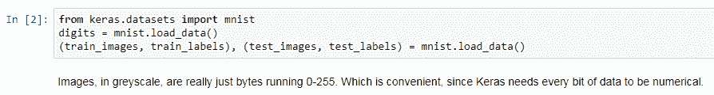
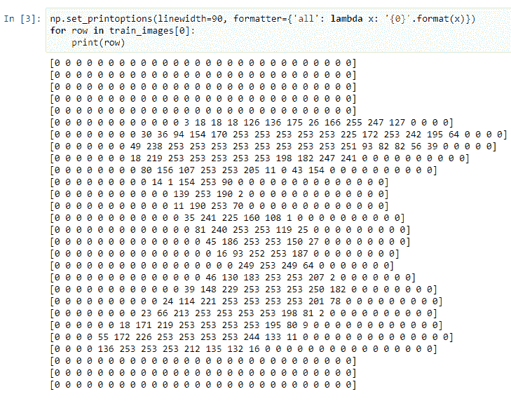
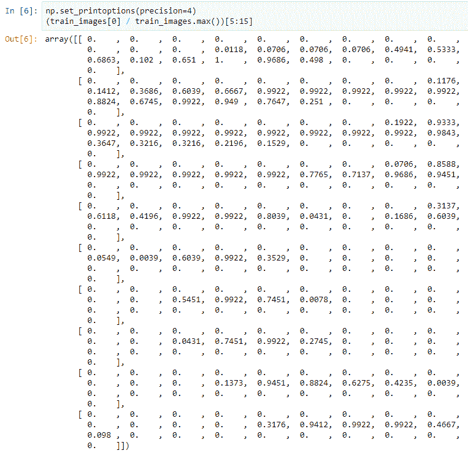
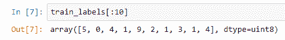

# 图片资料

在上一章中，我们准备了机器学习工具包，在其中设置了 Keras 和 Docker，以便允许我们运行 Jupyter Notebooks 处理机器学习。

在本章中，我们将研究准备供机器学习使用的图像数据，以及将其连接到 Keras 中涉及的步骤。 我们将从了解 MNIST 数字开始。 这些是图像形式的手写字符，我们将在机器学习中有效执行**光学字符识别**（**OCR**）。 然后，我们将讨论张量。 张量听起来像是一个数学词，的确是，但是作为一名程序员，您已经看到了多维数组，因此您实际上已经在使用张量，我将向您展示其等效性。 之后，我们将图像转换为张量。 正如您习惯在计算机上看到图像一样，图像需要一种特殊的编码形式才能与机器学习一起使用。

然后，我们将转向类别； 在这种情况下，我们将使用零到九（这是单个数字的字符），并将它们变成类别标签。 最后，我们将进行回顾，并且我将向您展示一本有关如何为机器学习准备数据时如何思考数据的食谱。

# MNIST 数字

现在，让我们了解 MNIST 数字。 在本节中，我们将介绍为帮助我们了解如何处理图像数据而准备的`ImageData`笔记本； 下载并获取 MNIST 数字； 将图像视为原始数字； 最后，根据此数值数据可视化实际图像。

我们将要使用的代码包含在 IPython Notebook 中。 这是我们设置容器的方式，因此您将像在设置机器学习工具包最后提到的那样运行容器。 我还准备了要使用的`ImageData` IPython Notebook。 我们将首先导入所有必需的软件包，然后打开 Matplotlib 以便自动进行绘图。 这意味着当我们显示图像时，我们不必调用`.plot`； 会自动为我们完成：

导入包

Keras 实际上具有内置的 MNIST 数字作为数据集，因此我们将使用这种便利并继续进行加载。

您需要互联网连接，因为它将要从 Amazon S3 作为文件下载这些文件。

在加载数据时，将有一个 Python 元组，我们将把 iPn 解压缩为两组：**训练集**和**测试集**：

Python 元组

实际上，在机器学习中，将数据分为多个部分是很常见的约定。 您使用它来查看您的模型实际上是在使用训练集进行学习。 然后，您可以使用测试集来确保模型不会过度拟合，这实际上是在考虑模型是存储训练数据还是在实际学习中。

现在，让我们看一下带有 NumPy 格式选项的快速设置。 当我们打印出数组时，我们将图像作为数组的数组循环遍历，然后打印出数据。 如您所见，图像实际上只是从`0`到`255`的数字：

灰度图像（数组数组）

这是灰度图像，此处的每个整数都记录特定像素的暗度。

现在，让我们绘制图像并查看这些数字的真实外观。 Matplotlib 有一个简单的`plot`函数，您可以提供一个数组数组，或者基本上是`XY`像素的二维数组，并将其绘制为`.image`文件。 接下来，您可以看到看起来非常像零的东西：

绘制图像

# 张量–多维数组

现在，我们已经了解了一些 MNIST 数字，我们将花一些时间看一看张量以及张量是什么。 我们将要看一看多维数组的 NumPy。 多维数组也称为**张量**。 数学词汇可能会让人有些不知所措，但我们将向您展示它比您想象的要简单得多。 然后，我们来看看张量形状。 张量形状实际上是维度的数量，或者就数组而言，是用于访问它们的不同索引的数量。 最后，我们将研究数据类型。 张量或多维数组可以容纳各种各样的不同数据类型，我们将解释其中的一些区别。

让我们从基础开始。 您可以想象的最基本的张量是一个张量，在编程语言中该张量仅称为数组。 它只是一个打包在一起的有序数字序列。 接下来是两个张量。 如果查看*灰度图像（阵列的数组）*屏幕截图，则每一行都是一维的，而每一列是另一维的。

因此，一行一行地加起来就是两个张量。 同样，它只是一个数组数组。 您会看到其中的训练图像的括号为零； 我们实际上是在选择图像数组中的第一个图像。 因此，在图像数据之前的三个张量实际上是图像阵列，每个图像阵列都有像素的列和行。 因此，三张量是我们存储黑白图像的基本方法。

为了快速直观地显示图像，您可以在索引 1 处看到`Xs`和`Ys`（数字上显示的坐标）仅是 张量

张量的尺寸

现在，让我们谈谈形状。 您可以在此处看到我们在 NumPy 多维数组或张量上调用了`.shape`，它随`60000, 28, 28`一起返回：

呼叫.shape

这是构成我们的三个张量的三个维度。 它只是一个多维数组。 然后，当然是数据类型，即`dtype`，就像您在 NumPy 多维数组上在这里所说的那样。 您可以看到这些图像存储为`uint8`或 8 位整数，以记录`0`至`255`值。 好吧，我们经常将这种数据类型用于源数据，特别是对于像前一个图像一样的黑白图像。 当我们将其转换为实际的机器学习格式时，我们将使用浮点数。

# 将图像转变为张量

在上一节中，我们了解了张量是什么。 现在，我们将使用这些知识来准备图像数据作为机器学习的张量。 首先，我们会问一个问题：为什么要使用浮点数据？ 然后，我们将了解样本与样本末尾数据点之间的差异。 最后，我们将规范化数据以用于机器学习。

那么，为什么要浮点数呢？ 好吧，真正的原因是机器学习从根本上讲是一个数学优化问题，当我们使用浮点数时，计算机正在尝试优化一系列数学关系以找到可以预测输出的学习功能。 因此，为机器学习准备数据确实需要将正常的二进制数据（例如图像）重新格式化为一系列浮点数，这不是我们通常在图像处理方面处理图像的方式，但这是必需的 为了让机器学习算法参与其中。

现在，让我们谈谈样本。 按照惯例，样本始终是多维数据数组中的第一维。 在这里，我们有多个样本，因为机器学习从根本上来说是通过查看大量不同样本中的大量不同数据点，然后学习基于此预测结果的函数来进行的。

因此，`train_images`多维数组中的每个图像都是我们要查看的样本之一。 但是，正如您在*灰度图像（阵列数组）*屏幕截图中所看到的那样，我们现在拥有的样本绝对不是浮点数； 这些仍然是 8 位整数。

因此，我们必须想出一种原理性的方法将图像从 8 位转换为浮点。

现在，我们将开始通过查看规范化来研究为机器学习准备数据的实际需求。 这实际上意味着您要获取数据（在这种情况下，它是`0`到`255`范围内的数字），然后将其除以另一个数字，以便缩小从`0`到`1`的范围 ]：

归一化输出

这对于机器学习算法中的数值稳定性是必需的。 当您的数据在`0`到`1`的范围内进行标准化时，它们只会做得更好，收敛更快，并且变得更加准确。

就是这样！ 我们已经看到了如何处理输入数据。 需要记住的两件事：我们将把所有东西都变成浮点数，最好是将`0`到`1`范围内的数据标准化。

# 将类别转化为张量

在上一节中，我们研究了将图像转换为用于机器学习的张量，在本节中，我们将研究将输出值（类别）转换为用于机器学习的张量。

我们将介绍输​​出类，即进行离散预测的含义，即一键编码的概念； 然后我们将可视化一幅热编码的图像形象化，然后回顾一下数据准备手册，您应该使用它来处理各种图像数据以进行机器学习。

但是现在，让我们谈谈输出。 当我们谈论数字时，从`0`到`9`，所以有十个不同的类，不是面向对象的类，而是标签的类。 现在，这些标签从`0`到`9`作为单独的数字，我们要进行的预测需要是离散的。 预测`1.5`对我们没有任何好处，因为没有这样的数字字符：

o 到 9 个预测

因此，为此，我们将使用数据转换技巧。 这种事情称为“一次热编码”，在这里您可以获取一系列标签可能性，在这种情况下，将数字`0`至`9`转换为一种位图，其中每个选项都编码为 一列，并且对于每个给定的数据样本，只有一列设置为`1`（因此为一热）：

一键编码

现在，既查看输入数字（此处为`9`），又查看输出位图，您可以看到第四个索引设置了第九个位，您可以看到我们在此处进行数据准备的工作是 将一个图像作为输入，将另一个图像作为输出。 它们只是被编码为张量（浮点数的多维数组）：

输出位图

创建机器学习算法时，我们要做的是让计算机学习或发现将一个图像（数字 9）转换为另一图像（在第 9 列上设置一位的位图）的功能， 这就是我们所说的机器学习。 请记住，张量只是多维数组，`x`和`y`值只是像素。 我们对这些值进行归一化，这意味着我们将它们从零到一的范围中获取，以便它们在机器学习算法中很有用。 标签或输出类只是我们要映射的值的数组，并且我们将使用单热编码对这些值进行编码，这又意味着只有一个是热的或设置为一个。

# 概要

在本章中，我们了解了 MNIST 数字，以及如何获取它们。 张量实际上只是多维数组； 我们如何将图像数据编码为张量； 我们如何将分类或分类数据编码为张量； 然后我们进行了快速回顾，并采用了食谱的方法来考虑尺寸和张量，以获取用于机器学习的数据。

现在，我们已经学习了如何为机器学习设置输入和输出数据，我们将继续下一章，在该章中，我们将创建一个“经典神经网络”（**CNN**）。