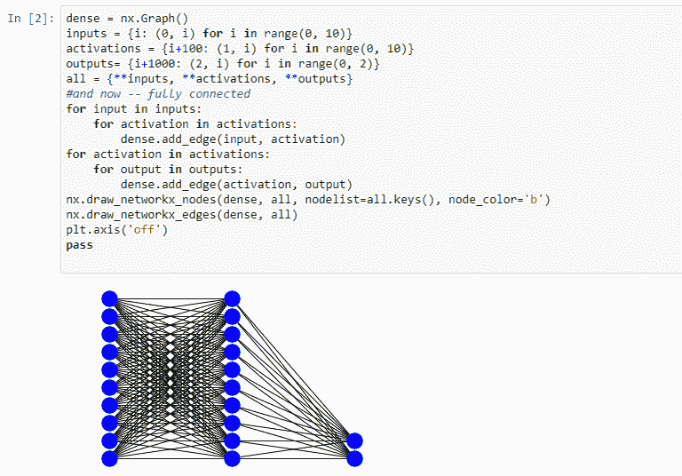
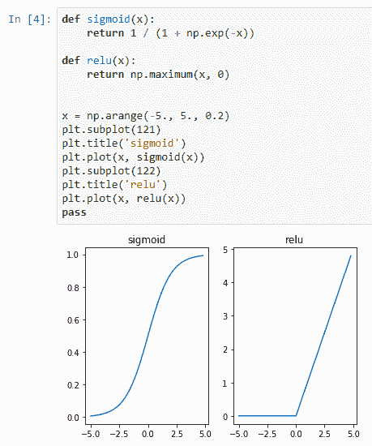
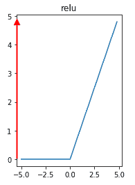
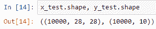
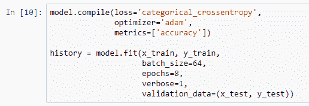
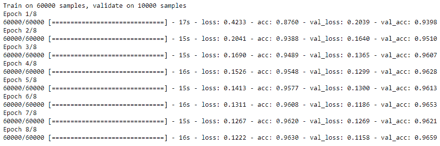
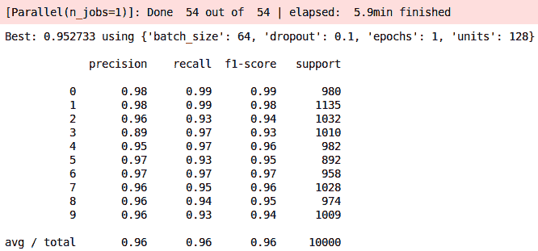

# 经典神经网络

现在我们已经准备好图像数据，是时候采用我们所学的知识并将其用于构建经典的或密集的神经网络了。 在本章中，我们将介绍以下主题：

*   首先，我们将研究经典的密集神经网络及其结构。
*   然后，我们将讨论激活函数和非线性。
*   当我们要进行实际分类时，我们需要另外一小段数学`softmax`。 我们将在本章后面讨论为什么这很重要。
*   我们将研究训练和测试数据，以及`Dropout`和`Flatten`（它们是新的网络组件，旨在使网络更好地工作）。
*   然后，我们将研究机器学习器的实际解决方案。
*   最后，我们将学习超参数和网格搜索的概念，以便微调和构建最佳的神经网络。

让我们开始吧。

# 经典密集神经网络之间的比较

在本节中，我们将研究经典或密集神经网络的实际结构。 我们将从示例神经网络结构开始，然后将其扩展为构建可视化网络，以了解 MNIST 数字。 然后，最后，我们将学习如何将张量数据实际插入到网络中。

让我们从一个密集的神经网络的结构开始。 使用网络包，我们将绘制神经网络的图片。 以下屏幕快照显示了我们正在设置的三个层（输入层，激活层和输出层），并将它们完全连接在一起：

三层神经网络

这就是中间的这两个循环。 他们在每个输入和每个激活之间，然后在每个激活和每个输出之间都处于优势地位。 这就是定义密集神经网络的原因：所有输入和所有激活之间以及所有激活和所有输出之间的完全连接。 如您所见，它生成的图片连接紧密，因此得名！

现在，让我们使用`28 x 28`像素的网格（即输入网络）将其扩展到二维，然后再进行学习的`28 x 28`像素的激活网络。 最终，我们将进入`10`位置分类网络，在该网络中我们将预测输出数字。 从以下屏幕快照中的黑色互连线中，您可以看到这是一个非常密集的结构：

二维网络

实际上，它是如此密集以至于实际上很难看到每条线的边缘。 这些行是网络内部进行数学运算的地方。 激活函数（将在下一节中介绍）是沿着这些行中的每一行进行的数学运算。 从中我们可以看到，张量和网络之间的关系相对简单：输入的二维网格（在此图像的情况下为像素）是我们在上一章中学到的二维编码数据。 部分将被放置。 在网络内部，数学运算（通常是点积和激活函数）是将一层连接到另一层的线。

# 激活与非线性

我们将要讨论非线性为何重要，然后我们将介绍两个最常用的非线性函数的一些可视化效果：`sigmoid`和`relu`。

因此，非线性听起来可能像是一个复杂的数学概念，但是您基本上需要知道的是它并不是直线的。 这允许神经网络学习更复杂的形状，而对网络结构内部的复杂形状的学习正是让神经网络和深度学习真正学习的基础。

因此，让我们看一下`sigmoid`函数：

Sigmoid 函数

这是一种 S 曲线，范围从零到一。 它实际上是由 e 构成的一个指数和一个比率。 现在，好消息是您实际上不必编写在这里看到的数学代码，因为当我们想在 Keras 中使用`sigmoid`时，我们只需使用名称`sigmoid`来引用它即可。

现在，让我们来看一下`relu`。 `relu`非线性函数从技术上讲只是一种非线性函数，因为当它小于零时，它是一条直线：

ReLu 非线性函数-小于零

当它大于零时，它也是一条直线。 但是将零之前的平坦部分和零之后的角度这两者的组合不能形成一条直线：

ReLu 非线性函数-大于零。

由于它是一个非常恒定的函数，因此在计算机内部执行时在数学上是有效的，因此您会看到`relu`在许多生产神经网络模型中使用，只是因为它计算速度更快。 但是`relu`函数的窍门，正如我们在上一章中谈到的标准化时所学到的那样，在于它们可以生成大于 1 的值，因此构建神经网络的各种窍门和技术，包括标准化和创建更多层， 通常需要获得`relu`函数才能正常运行。

机器学习中发生的许多事情都涉及重复计算这些`relu`和`sigmoid`函数的输入。

机器学习模型可能具有通过`relu`或`sigmoid`运行的数百，数千甚至数百万个单独的数字参数。

幕后进行了大量数学运算，因此大量非线性的相互作用使机器学习器可以在概念上围绕答案绘制高维数学形状。

# Softmax

在本节中，我们将学习称为`softmax`的输出激活函数。 我们将研究它与输出类的关系，并了解`softmax`如何产生概率。

让我们来看看！ 当我们构建分类器时，神经网络将输出一堆数字，通常是一个数组，每个数组对应一个类。 对于我们在这里看到的模型，它将是从零到九的数字。 `softmax`的作用是将一大堆数字平滑成一组总计为一个的概率分数：

数字叠

这很重要，这样您才能知道哪个答案最有可能。 因此，作为我们可以用来理解`softmax`的示例，让我们看一下我们的值数组。 我们可以看到有三个值。 假设神经网络输出为`1`，`2`和`5`。 我们正在尝试将它们分为红色，绿色和蓝色类别。 现在，我们通过`softmax`运行它，我们可以看到概率分数。 如您在此处可以清楚看到的那样，它应该是蓝色，并表示为概率。 读出`softmax`的方法是使用`argmax`。 您查看具有最高值的单元格，并将该索引提取为您的预测类。 但是，如果您查看实际数字-`1`，`2`和`5`-您会发现它们总计为八，但是`5`的输出概率为`0.93`。 这是因为`softmax`使用指数函数。 这不仅仅是数字的线性组合，例如将五除以八，然后说`5/8`是该类别中的概率。 我们在这里所说的是，最强的信号将主导较弱的信号，并且该指数实际上将超过具有较高值的​​类的概率，因此当事物相对接近时，您的神经网络在分类方面会更有效。 记住，使用实际的神经网络，您将不会输出漂亮的`1`，`2`和`5`数字-您将输出相对较小的十进制数字，例如`0.00007`， 小的浮点数，然后我们需要将它们分成几类。

现在您可能想知道为什么我们应该考虑这一点，因为您可以轻松地从数字`1`，`2`和`5`看出`5`是最大的值。 好吧，这个想法是，如果您将事情表示为概率，则可以模拟信心。 从某种意义上讲，您可以在模型之间共享分数，并且知道您的模型实际的自信程度。 另外，不同的模型将在不同的范围内输出不同的数字。 仅仅因为您在尝试的第一个模型中放入了`1`，`2`或`5`，这并不意味着它们在另一个模型中具有相同的相对值。 因此，将它们粉碎成概率可以进行比较。 现在，有了这些数学知识，我们就可以开始研究构建实际的神经网络了。 好消息是您实际上不需要记住或知道我们刚才列出的数学。 您只需要记住数学部分的名称，因为在 Keras 中，您使用简单的名称引用了激活函数。

# 训练和测试数据

在本节中，我们将研究引入训练和测试数据。 我们将研究如何加载实际数据，然后再回顾规范化和一键编码，然后快速讨论为什么我们实际上使用训练和测试数据集。

在本节中，我们将采用在上一章中学到的关于准备图像数据并将其压缩为几行代码的知识，如以下屏幕快照所示：

加载数据中

我们加载训练和测试数据以及训练和测试输出。 然后，我们进行归一化，这意味着将除以最大值，我们知道它将是`255`。 然后，我们将输出变量分解为分类编码或一键编码。 对于我们的训练和测试数据集，我们以完全相同的方式执行这两件事（归一化和一次性编码）。 在尝试将其用于我们的机器学习模型之前，必须以相同的方式准备好所有数据，这一点很重要。 这是有关形状的快速说明。 请注意，训练数据（`x`和`y`）的初始编号相同：

加载`.shape`（训练）

在这两种情况下，第一维均为`60000`，但请查看第二维和第三维（`28`和`28`）（即输入图像的大小）和`10`图。 好吧，这些并不一定要匹配，因为通过模型运行此模型时，我们正在做的是将数据从`28`，`28`维度转换为`10`维度。

另外，查看测试数据。 您可以在第一个维度中看到`10000`（`28`，`28`），然后在第二个维度中看到`10000`，`10`，如以下屏幕截图所示：

加载`.shape`（测试）

这些尺寸以适当的方式匹配非常重要。 因此，对于训练集，第一个维度必须与您的`x`和`y`值（您的输入和输出）匹配，并且在您的测试集上，同样必须正确。 但也请注意，训练和测试数据的第二和第三个维度`28`和`28`相同，而测试和训练数据的`10`（输出维度）相同。 准备信息时，最常见的错误之一就是不对这些数据集进行排序。 但为什么？！ 一言以蔽之：**过拟合**。

过拟合本质上是指您的机器学习模型存储一组输入时。 您可以将其视为一个非常复杂的哈希表，该哈希表已使用大量数字对输入和输出映射进行了编码。 但是，通过机器学习，即使我们可以轻松拥有一个哈希表，我们也不需要哈希表。 相反，我们希望有一个模型可以处理未知输入，然后预测适当的输出。 测试数据代表那些未知的输入。 当您跨训练数据训练模型并提供测试数据时，可以使用测试数据来验证您的机器学习模型可以处理和预测从未见过的数据。

好吧，既然我们已经加载了训练和测试数据，我们将继续学习`Dropout`和`Flatten`，并建立一个实际的神经网络。

# 丢弃和扁平化

在本节中，我们将实际构建神经网络模型，并使用`Dropout`和`Flatten`创建完整的神经网络。

我们将从使用函数式 Keras 模型实际组装神经网络开始，查看输入和层堆栈以端对端组装神经网络。 然后，我们将解释为什么会有`Dropout`和`Flatten`，以及它们对您的模型有什么影响。 最后，我们将显示一个模型摘要：这是一种可视化机器学习模型中参数和层总数的方法。

在这里，我们使用的是 Keras 的函数式模型。 您可以将神经网络视为一系列层，其中每个层均由函数定义。 该函数传递一组参数以配置该层，然后将其作为参数传递给网络中的上一层，以将它们全部链接在一起。 如下面的屏幕快照所示，这小段代码实际上是一个完整的神经网络：

Keras 函数式模型

我们从一个输入层开始，该输入层的形状与我们的一个输入样本相同。 在我们的案例中，我们选择了一张训练图像，从上一课中我们知道它的尺寸为`28x28`像素。 现在，我们将其传递给堆栈。 紧随其后的是`dropout_1`，紧接着是`dropout_2`，然后我们最终变成`softmax`激活，将其切换到输出层。 然后，我们将这些作为输入和输出组合到模型中。 然后，我们打印`summary`，如下所示：

模型摘要输出

因此，您可以从中看到，首先将参数传递给层，然后将层本身传递以形成链。 那么，这些`Dropout`和`Flatten`层又如何呢？ `Dropout`参数本质上是一个技巧。 当我们设置`Dropout`参数（这里是`0.1`）时，我们告诉神经网络要做的是在每个训练周期中随机断开 10% 的激活。 这是使神经网络学习概括。 这是真正的学习，而不是简单地记住输入数据。 `Flatten`层处理尺寸。 因为我们有一个二维的`28x28`像素输入图像，所以我们使用`Flatten`将其转换为`784`的长的一维数字字符串。 这被馈送到输出`softmax`层。

打印出模型摘要是弄清参数大小和尺寸的好方法。 这最终成为使用 Keras 的棘手部分之一，例如当您有一组输入样本（在我们的示例中为`28x28`图像），并且在进入`softmax`时，您需要到那时将它们转换成包含十个可能输出值的单个数组。 您可以看到形状在我们穿过每一层时如何变化。 最后，`Flatten`将每个样本的维数降低为一个维，然后将其转换为具有十个可能的输出值的维。

好的，现在该运行模型了。 现在，我们了解了如何将包括`Dropout`和`Flatten`层在内的模型放到一起，我们将继续使用求解器，这是我们实际执行机器学习模型所使用的。

# 优化器

在本节中，我们将设置学习和优化函数，编译模型，使其适合训练和测试数据，然后实际运行模型并查看动画，该动画指示对损失和准确性的影响。

在以下屏幕截图中，我们正在使用`loss`，`optimizer`和`metrics`编译模型：

编译模型

`loss`函数是一个数学函数，它告诉`optimizer`做得如何。 `optimizer`函数是一种数学程序，可搜索可用参数以最小化`loss`函数。 `metrics`参数是您的机器学习模型的输出，应该为人类可读，以便您可以了解模型的运行状况。 现在，这些`loss`和`optimizer`参数充满了数学运算。 总的来说，您可以将其作为一本秘籍。 使用 Keras 运行机器学习模型时，您应该有效地选择`adam`（默认设置）。 就`loss`函数而言，当您处理诸如 MNIST 数字之类的分类问题时，应使用分类交叉熵。 此秘籍类型的秘籍应该对您有帮助。

现在，我们准备用`x`训练数据（由实际的 MNIST 数字图像组成）和`y`训练参数（由零至九个分类输出标签组成）拟合模型。 我们这里有一个新概念是`batch_size`。 这是每个执行循环的图像数。 通常，这受可用内存的限制，但是较小的批量大小（32 到 64）通常会更好。 那么这个奇怪的词呢？ 历元只是指循环数。 例如，当我们说八个周期时，我们的意思是机器学习模型将遍历训练数据八次，并将使用测试数据来查看模型变得八次准确的程度。 当模型反复查看相同的数据时，它会提高准确性，如以下屏幕截图所示：

模型运行

最后，我们得出验证数据，也称为测试数据。 实际上，这是用来计算精度的。 在每个时期结束时，对模型进行部分训练，然后通过模型运行测试数据，生成一组试验预测，用于对准确性进行评分。 机器学习涉及大量的人类等待。 我们将继续并跳过每个时代的进度； 在运行这些样本时，您将有很多机会观看这些进度条的增长。

现在，让我们谈谈前面的输出。 随着进度栏的增长，您可以看到其正在运行的示例图像的数量。 但是还有`loss`函数和`metrics`参数； 在这里，我们使用准确性。 因此，`loss`函数会反馈给学习器，这实际上就是机器学习的学习方式; 它试图通过迭代设置模型中的数字参数来使`loss`最小化，以使`loss`编号下降。 那里的准确性，以便您可以了解发生了什么。 在这种情况下，精度表示模型猜测正确数字的频率。 因此，就将其视为一本菜谱而言，分类交叉熵是您实际上一直希望用于此类分类问题的`loss`函数，而`adam`是学习算法的最明智的默认选项; `accuracy`是出色的输出`metrics`，您可以用来查看模型的运行状况。

# 超参数

在本节中，我们将探讨超参数或无法完全通过机器学习的参数。

我们还将介绍可训练的参数（这些是求解器学习的参数），不可训练的参数（模型中不需要训练的其他参数），最后，超参数（传统的求解器不能学习的参数）。

在我们的“模型摘要输出”的屏幕截图中，请注意屏幕截图底部代码中突出显示的部分中可训练参数的数量。 这就是我们的模型`adam`优化器与我们的分类交叉熵`loss`函数一起将在模型内部包含的单个浮点数的数目，以便找到可能的最佳参数值。 因此，此可训练的参数编号是我们的`optimizer`函数学习的唯一编号集合。 但是，此代码和前面的屏幕快照中还有许多其他数字。 这些不可训练的参数呢？ 在我们当前的模型中，有零个不可训练参数。 但是，Keras 中不同种类的层可能具有恒定值，因此它们将显示为不可训练的。 再次，这只是意味着不需要对其进行训练，并且我们的`optimizer`函数将不会尝试更改其值。

那么，什么是超参数？ 好吧，非常简单，超参数是模型本身之外的值（参数）。 因此，认为超参数最简单的是实际的模型结构。 在这种情况下，我们创建层的次数是一个超参数，层的大小是一个超参数，我们在密集层中选择的`32`单位是一个超参数，`0.1`的丢弃设置是超参数，甚至激活函数本身（例如，选择`relu`而不是`sigmoid`）都是超参数。 现在您可能在想，“请稍等，我不得不在这里选择很多参数；我以为机器应该在学习”。 它是！ 但是，诀窍在于`optimizer`无法学习我们需要了解的所有知识，以组成一个最佳模型。

# 网格搜索

在本节中，我们将探索网格搜索。

我们将讨论有关优化与网格搜索，设置模型生成器函数，设置参数网格以及使用交叉验证进行网格搜索的一些知识，最后，报告网格搜索的结果，以便我们选择最佳的模型。

那么，为什么从根本上讲这里有两种不同的机器学习活动？ 好吧，优化通过`loss`函数的反馈来求解参数：高度优化。 具体来说，求解器无需尝试每个参数值即可工作。 它使用具有偏导数的数学关系来沿**梯度**移动。 这使它在数学上基本上走下坡路才能找到正确的答案。

网格搜索不是很聪明。 实际上，这完全是蛮力。 当我们谈论进行网格搜索时，实际上是在谈论探索参数值的每种可能组合。 网格搜索来自以下事实：两组不同的参数形成了一个棋盘格或网格，并且网格搜索涉及运行每个方格中的值。 因此，如您所见，网格搜索的效率根本不及优化。 那么，为什么还要使用网格搜索呢？ 好吧，当您需要学习优化器无法解决的参数时就可以使用它，这是机器学习中的常见情况。 理想情况下，您将拥有一种可以解决所有参数的算法。 但是，目前尚无此类算法。

好吧，让我们看一些代码：

生成模型的函数并构思两个超参数

我们将使用 scikit-learn，这是经常与 Keras 和其他机器学习软件一起使用的工具包，以便进行网格搜索和分类报告，从而告诉我们最佳模型。 然后，我们还将导入 Keras 的`KerasClassifier`包装器，使其与`scikit_learn`兼容。

现在，让我们集中讨论一个模型生成函数并设想两个超参数。 其中一个将是`dropout`，另一个将是每个密集隐藏层中的单位数。 因此，我们在此处构建一个名为`dense_model`的函数，该函数接受`units`和`dropout`，然后像以前一样计算网络。 但是，而不是使用硬编码的`32`或`0.1`（例如），实际的参数将被传入，这将为我们编译模型，然后将该模型作为输出返回。 这次，我们使用顺序模型。 以前，当我们使用 Keras 函数式模型时，我们一层又一层地链接在一起。 对于顺序模型，它更像一个列表：从顺序模型开始，然后逐层添加，直到顺序模型本身为您形成链。 现在是超参数网格。 这是我们指出网格搜索与优化器相比的缺点。 您可以在前面的屏幕截图中看到我们选择的值。 为了使运行更快，我们将做一个时期，并保持`64`图像的恒定`batch_size`，该图像将在`32`，`64`和`128`隐藏单位以及退出之间变化 `0.1`，`0.2`和`0.4`的特征。 这是网格搜索的最大缺点：您将在此处看到的超参数是唯一可以完成的操作-网格搜索不会在两者之间探索超参数值。

现在，我们设置`KerasClassifier`，将其交给我们刚刚创建的模型构建函数，并将`verbose`设置为`0`以隐藏每次 Keras 运行的进度条。 然后，我们设置一个计时器； 我想知道这需要多长时间。 现在，我们设置了带有交叉验证的网格搜索。 对于其估计量，我们给我们提供我们的模型，即我们的`KerasClassifier`包装器和我们的`grid`参数（请参阅前面的超参数），然后说`cv=6`，这意味着将数据（训练数据）分为六个不同部分，然后交叉验证。 在`5`上进行训练，并使用六分之一进行验证并反复重复此步骤，以搜索最佳的超参数值。 另外，将`verbose`设置为`4`，这样我们就可以看到很多输出。 现在仅 Keras 就运行了很多东西，我们将`fit`函数从我们的`x`训练数据（同样是我们的输入图像）转到我们的`y`训练数据（这些是从零到数字的标签） 九），然后打印出我们最好的结果。 请注意，我们实际上尚未触及我们的测试数据。 我们将在稍后使用它来对网格搜索报告的最佳模型的值进行评分。

现在，我们测试结果。 这是我们使用`argmax`的地方。 再次，这是一个函数，它调查数组并挑选出其中值最大的索引。 实际上，这会将十个单热点编码值的数组转换为一个数字，这将是我们预测的数字。 然后，我们使用将打印出`x`网格的分类报告，该报告向我们显示正确预测数字与被预测的数字总数相比的频率。

好了，因此上述代码的输出如下：

输出-打印分数

我们正在探索超参数网格中的每个参数，并打印出一个分数。 网格搜索就是这样搜索最佳可用模型的。 当我们都完成后，将选择一个模型。 在这种情况下，这是隐藏单元数量最多的一个，我们将评估该模型在分类报告中使用测试数据的效果。

在下面的屏幕截图中，您可以看到打印输出具有我们已经识别出的每个数字，以及精度（我们对数字进行正确分类的时间百分比）和召回率（我们所获得的数字数量） 实际记得）：

输出—最终得分

您可以看到我们的分数不错：整体准确率为 96%。

# 总结

在本章中，我们实际上涵盖了很多内容。 我们看到了经典或密集神经网络的结构。 我们了解了激活和非线性，并了解了`softmax`。 然后，我们建立测试和训练数据，并学习了如何使用`Dropout`和`Flatten`构建网络。 我们还学习了有关求解器的所有知识，或者机器学习的实际学习方式。 然后，我们探索了超参数，最后，我们通过网格搜索对模型进行了微调。

在下一章中，我们将学到的知识并改变网络的结构，以构建所谓的**卷积神经网络**（**CNN**）。