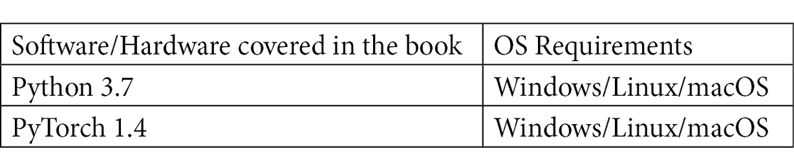

# 前言

在互联网时代，每天从社交媒体和其他平台生成越来越多的文本数据，因此能够理解这些数据是一项至关重要的技能。 本书将帮助您为**自然语言处理**（**NLP**）任务建立深度学习模型，这将帮助您从文本中提取有价值的见解。

我们将从了解如何安装 PyTorch 以及使用 CUDA 加快处理速度开始。 然后，您将通过实际示例探索 NLP 架构的工作方式。 后面的章节将指导您完成重要的原则，例如 PyTorch 中的单词嵌入，CBOW 和标记化。 然后，您将学习一些用于处理文本数据的技术，以及如何将深度学习用于 NLP 任务。 接下来，我们将演示如何实现深度学习和神经网络架构来构建模型，以使您能够对文本进行分类和翻译以及执行情感分析。 最后，您将学习如何构建高级 NLP 模型，例如会话聊天机器人。

到本书结尾，您将了解使用 PyTorch 进行深度学习如何解决不同的 NLP 问题，以及如何构建模型来解决这些问题。

# 这本书适合谁

这本 PyTorch 书籍适用于 NLP 开发人员，机器学习和深度学习开发人员，或致力于使用传统 NLP 方法和深度学习架构来构建智能语言应用程序的任何人。 如果您希望在开发项目中采用现代的 NLP 技术和模型，那么本书非常适合您。 必须具备 Python 编程的工作知识和 NLP 任务的基本工作知识。

# 这本书涵盖的内容

“第 1 章”，“机器学习和深度学习的基础知识”，概述了机器学习和神经网络的基本方面。

“第 2 章”，“用于 NLP 的 PyTorch 1.x 入门”，向您展示如何下载，安装和启动 PyTorch。 我们还将介绍该软件包的一些基本功能。

“第 3 章”，“NLP 和文本嵌入”展示了如何为 NLP 创建文本嵌入并在基本语言模型中使用它们。

“第 4 章”，“文本预处理，词干提取和词形还原”，展示了如何预处理文本数据以用于 NLP 深度学习模型。

“第 5 章”，“循环神经网络和情感分析”，介绍了循环神经网络的基础知识，并向您展示如何使用它们来建立情感神经网络分析模型。 刮。

“第 6 章”，“用于文本分类的卷积神经网络”，介绍了卷积神经网络的基础知识，并向您展示了如何使用它们为 分类文本。

“第 7 章”，“使用序列到序列神经网络的文本翻译”介绍了深度学习的序列到序列模型的概念，并介绍了如何 使用它们来构建将文本翻译成另一种语言的模型。

“第 8 章”，“使用基于注意力的神经网络构建聊天机器人”，涵盖了在序列到序列深度学习模型中使用的注意概念，并显示了 您将了解如何使用它们从头开始构建功能全面的聊天机器人。

“第 9 章”，“前方的路”涵盖了 NLP 深度学习中当前使用的一些最新模型，并探讨了一些挑战 以及 NLP 领域面临的问题。

# 要充分利用这本书

您将需要在计算机上安装 Python 版本。 所有代码示例均已使用 3.7 版进行了测试。 您还将需要一个适用的 PyTorch 环境，以用于本书的深度学习组件。 所有深度学习模型都是使用 1.4 版构建的； 但是，大多数代码应与更高版本一起使用。

本书的代码中使用了多个 Python 库。 但是，这些将在相关章节中介绍。

**如果您使用的是本书的数字版本，建议您自己键入代码或通过 GitHub 存储库访问代码（下一节提供链接）。 这样做将帮助您避免任何与代码复制和粘贴有关的潜在错误。**

# 下载示例代码文件

您可以从 [www.packt.com](http://packt.com) 的帐户中下载本书的示例代码文件。 如果您在其他地方购买了此书，则可以访问 [www.packtpub.com/support](https://www.packtpub.com/support) 并注册以将文件直接通过电子邮件发送给您。

您可以按照以下步骤下载代码文件：

1.  登录或注册 [www.packt.com](http://packt.com) 。
2.  选择**支持**选项卡。
3.  点击**代码下载**。
4.  在**搜索**框中输入书籍的名称，然后按照屏幕上的说明进行操作。

下载文件后，请确保使用以下最新版本解压缩或解压缩文件夹：

*   Windows 的 WinRAR / 7-Zip
*   Mac 版 Zipeg / iZip / UnRarX
*   适用于 Linux 的 7-Zip / PeaZip

本书的代码包也托管在 [GitHub](https://github.com/PacktPublishing/Hands-On-Natural-Language-Processing-with-PyTorch-1.x) 中。 如果代码有更新，它将在现有的 GitHub 存储库中进行更新。

在[这个页面](https://github.com/PacktPublishing/)上，我们还提供了丰富的书籍和视频目录中的其他代码包。 去看一下！

# 下载彩色图像

我们还提供了 PDF 文件，其中包含本书中使用的屏幕截图/图表的彩色图像。 [您可以在此处下载](https://static.packt-cdn.com/downloads/9781789802740_ColorImages.pdf)。

# 使用的约定

本书中使用了许多文本约定。

**文本中的代码**：指示文本中的代码字，数据库表名称，文件夹名称，文件名，文件扩展名，路径名，虚拟 URL，用户输入和 Twitter 句柄。 这是一个示例：“将下载的`WebStorm-10*.dmg`磁盘映像文件安装为系统中的另一个磁盘。”

代码块设置如下：

进口火炬

当我们希望引起您对代码块特定部分的注意时，相关行或项目以粗体显示：

word_1 =“猫”

**word_2 ='dog'**

word_3 =“鸟”

任何命令行输入或输出的编写方式如下：

$ mkdir flaskAPI

$ cd flaskAPI

**粗体**：表示新术语，重要单词或您在屏幕上看到的单词。 例如，菜单或对话框中的单词会出现在这样的文本中。 这是一个示例：“从**管理**面板中选择**系统信息**。”

提示或重要提示这样出现。
