# “第 1 章”：机器学习和深度学习的基础

我们的世界拥有丰富的自然语言数据。 在过去的几十年中，我们彼此之间的通信方式已经转变为数字领域，因此，这些数据可用于构建可改善我们在线体验的模型。 从在搜索引擎中返回相关结果，到自动完成您在电子邮件中输入的下一个单词，从自然语言中提取见解的好处显而易见。

尽管我们作为人类的语言理解方式与模型或*人工智能*理解语言的方式明显不同，但通过阐明机器学习及其用途，我们可以开始理解 这些深度学习模型*理解*语言，以及模型从数据中学习时发生的根本变化。

在本书中，我们将探讨人工智能和深度学习对自然语言的这种应用。 通过使用 PyTorch，我们将逐步学习如何构建模型，使我们能够执行情感分析，文本分类和序列翻译，从而使我们构建一个基本的聊天机器人。 通过介绍这些模型背后的理论，并演示如何实际实现它们，我们将使**自然语言处理**（**NLP**）的领域神秘化，并为您提供足够的背景知识 让您开始构建自己的模型。

在第一章中，我们将探讨机器学习的一些基本概念。 然后，我们将通过研究深度学习，神经网络的基础知识以及深度学习方法相对于基本机器学习技术所具有的一些优势，将这一步骤进一步向前发展。 最后，我们将更深入地研究深度学习，特别是针对特定于 NLP 的任务，以及我们如何使用深度学习模型从自然语言中获得见解。 具体来说，我们将涵盖以下主题：

*   机器学习概述
*   神经网络概论
*   用于机器学习的 NLP

# 机器学习概述

从根本上讲，机器学习是用于识别模式并从数据中提取趋势的算法过程。 通过在数据上训练特定的机器学习算法，机器学习模型可以学习对人眼不是立即显而易见的见解。 医学成像模型可能会学会从人体图像中检测出癌症，而情感分析模型可能会学习，与包含*不好*，*糟糕*和*无聊*的书评相比，包含*良好*，*优秀*和*有意思*的书评更可能是正面的。

广义上讲，机器学习算法分为两大类：监督学习和无监督学习。

## 监督学习

**监督学习**涵盖了所有我们希望使用输入来预测输出的任务。 假设我们希望训练一个模型来预测房价。 我们知道较大的房屋往往会卖出更多的钱，但我们不知道价格和面积之间的确切关系。 机器学习模型可以通过查看数据来学习这种关系：

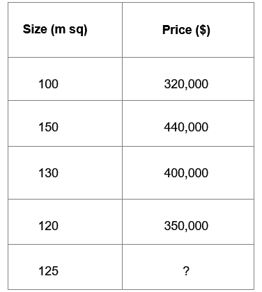

图 1.1 –显示住房数据的表格

在这里，我们已经得到的信息，包括最近出售的四栋房屋的大小，以及他们出售的的价格。 根据这四所房屋的数据，我们能否使用此信息对市场上的新房屋做出预测？ 一个简单的称为**回归**的机器学习模型可以估计以下两个因素之间的关系：

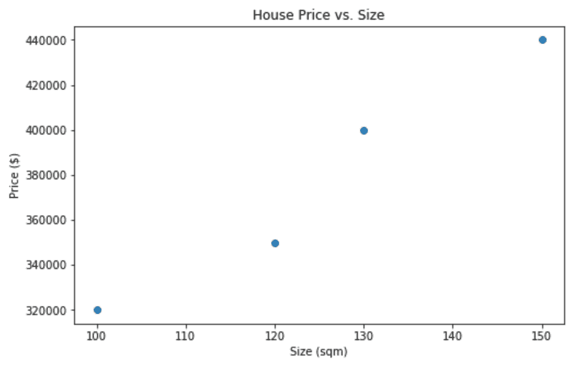

图 1.2 –外壳数据输出

给定此历史数据，我们可以使用此数据来估计**大小**（`X`）和**价格**（`Y`）之间的关系。 现在我们已经估计了大小和价格之间的关系，如果给了我们只知道房子大小的新房子，我们可以使用学习的函数使用它来预测价格：


图 1.3 –预测房价

因此，给定许多输入与输出之间的关系的示例，所有监督学习任务旨在学习模型输入的某些函数以预测输出：

给定很多`(X, y)`，请学习`F(X) = y`。

您电话号码的输入可以包含任意数量的功能。 我们的简单房价模型仅包含一个功能（**大小**），但我们可能希望添加更多功能以提供更好的预测（例如，卧室数量，花园大小等） 上）。 因此，更具体地说，我们的监督模型学习了一个函数，以便将许多输入映射到输出。 由以下等式给出：

给定许多`([X0, X1, X2, …, Xn], y)`，学习`f(X0, X1, X2, …, Xn) = y`。

在前面的示例中，我们学习的功能如下：


这里，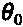是`x`轴截距，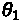是直线的斜率。

模型可以包含数百万甚至数十亿个输入功能的（尽管当功能空间太大时，您可能会遇到硬件限制）。 模型的输入类型也可能有所不同，模型可以从图像中学习：


图 1.4 –模型训练

正如我们稍后将更详细地研究一样，他们也可以从文本中学习：

我喜欢这部电影 -> 好评

这部电影很糟糕 -> 差评

我今年看过的最好的电影 -> ？

## 无监督学习

**非监督学习** 与监督学习的不同之处在于非监督学习不使用输入和输出对`(X, y)`进行学习。 相反，我们仅提供输入数据，模型将学习有关输入数据的结构或表示的知识。 无监督学习的最常见方法之一是**聚类**。

例如，我们获取了来自四个不同国家/地区的温度和降雨测度读数的数据集，但没有关于这些读数取自何处的标签。 我们可以使用聚类算法来识别数据中存在的不同聚类（国家）：

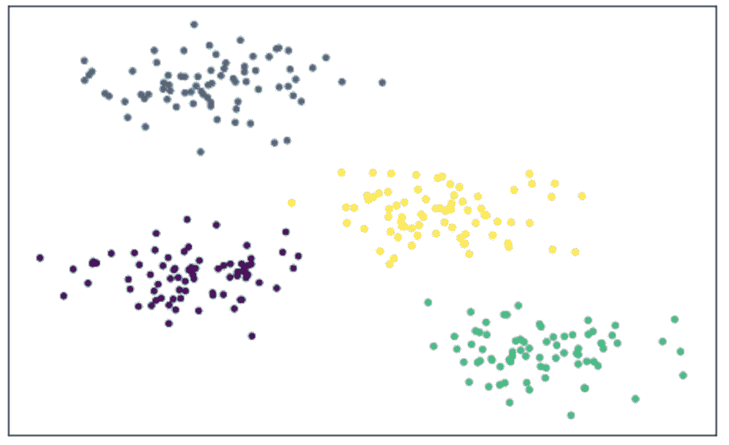

图 1.5 –聚类算法的输出

群集在 NLP 领域中也有用途。 如果为我们提供了电子邮件的数据集，并想确定这些电子邮件中使用了多少种不同的语言，则一种集群形式可以帮助我们识别这一点。 如果英语单词在同一封电子邮件中与其他英语单词一起频繁出现，而西班牙语单词与其他西班牙语单词一起频繁出现，我们将使用聚类确定数据集有多少个不同的单词聚类，从而确定语言的数量。

## 模型如何学习？

为了学习模型，我们需要某种评估模型性能的方法。 为此，我们使用称为损失的概念。 **损失**是衡量如何根据其真实值接近模型预测的一种度量。 对于我们数据集中的给定房屋，损失的一种度量可能是真实价格（`y`）与我们的模型预测的价格（）之间的差。 我们可以通过对数据集中所有房屋的平均损失进行评估，从而评估系统中的总损失。 但是，从理论上讲，正损失可以抵消负损失，因此，更常见的损失度量是**均方误差**：


虽然其他模型可能使用不同的损失函数，但回归通常使用均方误差。 现在，我们可以计算整个数据集的损失量度，但是我们仍然需要方法，以算法的方式实现尽可能低的损失。 此过程称为**梯度下降**。

### 梯度下降

在这里，我们绘制了损失函数，因为它与房价模型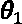中的单个学习参数有关。 我们注意到，当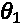设置得太高时，MSE 损失就很高；而当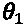设置得太低时，MSE 损失也就很高。 *最佳点*或损失最小的点位于中间位置。 为了计算该算法，我们使用梯度下降。 当我们开始训练自己的神经网络时，我们将更详细地看到这一点：

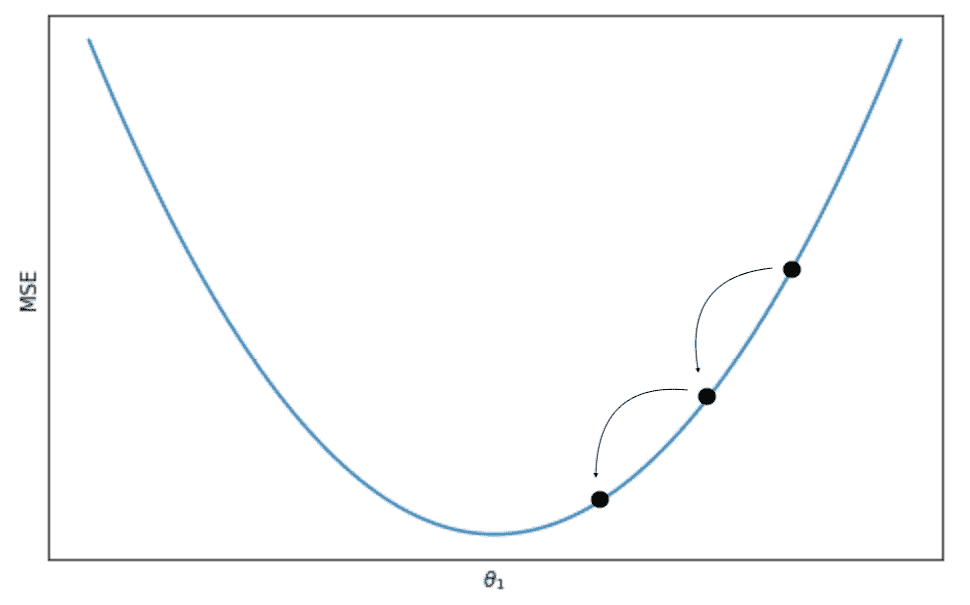

图 1.6 –梯度下降

我们首先用随机值初始化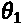。 为了使损失最小化，我们需要从损失函数进一步下移，到达山谷的中部。 为此，我们首先需要知道向哪个方向移动。在我们的初始点，我们使用基本演算来计算坡度的初始坡度：


在我们前面的示例中，初始点处的梯度为正。 这表明我们的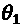值大于最佳值，因此我们更新了的值，使其低于我们先前的的值。 我们逐步迭代此过程，直到越来越接近 MSE 最小化的值。 这发生在梯度等于零的点。

### 过拟合和欠拟合

考虑以下场景，其中基本线性模型无法很好地拟合到我们的数据。 我们可以看到，我们的模型（由方程表示）似乎不是很好的预测指标：

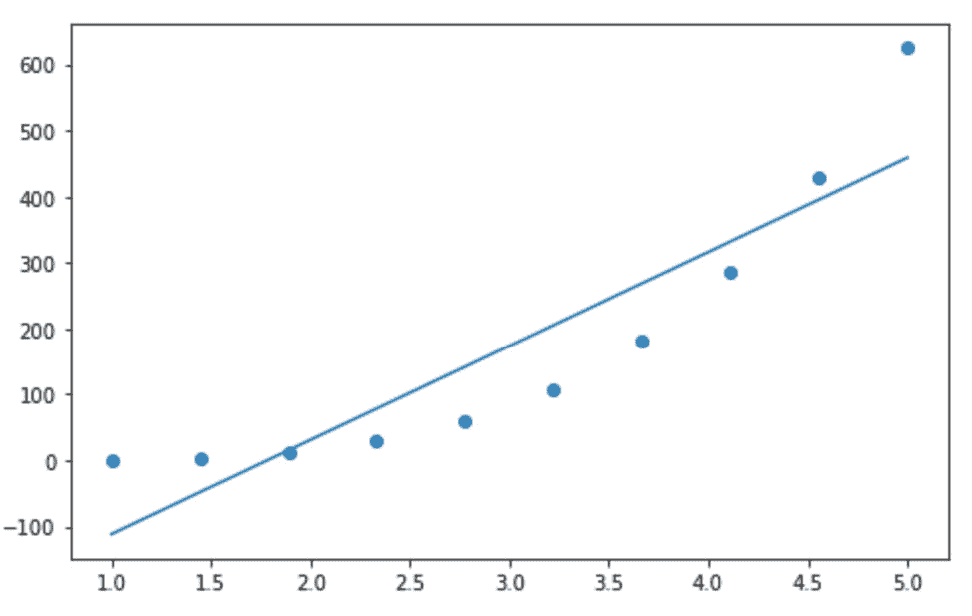

图 1.7 –欠拟合和过拟合的示例

当我们的模型由于缺乏功能，数据不足或模型规格不足而无法很好地拟合数据时，我们将其称为，**欠拟合**。 我们注意到我们数据的梯度越来越大，并怀疑如果使用多项式，则模型可能更合适。 例如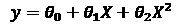。 稍后我们将看到，由于神经网络的复杂结构，欠拟合很少成为问题：

考虑以下示例。 在这里，我们使用房价模型拟合的函数不仅适用于房屋的大小（`X`），而且适用于二阶和三阶多项式`(X2, X3)`。 在这里，我们可以看到我们的新模型非常适合我们的数据点。 但是，这不一定会产生良好的模型：


图 1.8 –过拟合的样本输出

我们现在有一个房子，其大小为 **110 平方米**，以预测价格。 根据我们的直觉，由于该房屋比 **100 平方米**房屋大，我们希望这所房屋的价格会更高，大约 **340,000 美元**。 使用我们的拟合多项式模型，我们可以看到预测的价格实际上低于小房子，约为 **320,000 美元**。 我们的模型适合我们训练有素的数据，但不能很好地推广到一个新的，看不见的数据点。 这就是，称为**过拟合**。 由于过拟合，重要的是不要根据训练的数据评估模型的性能，因此我们需要生成单独的一组数据以评估我们的数据。

### 训练与测试

通常，在训练模型时，我们将数据分为两部分：训练数据集和较小的测试数据集。 我们使用训练数据集训练模型，并在测试数据集上对其进行评估。 这样做是为了在看不见的数据集上衡量模型的性能。 如前所述，要使模型成为良好的预测指标，必须将其很好地推广到该模型之前从未见过的一组新数据，而这恰恰是对一组测试数据进行评估所得出的结果。

### 评估模型

尽管我们试图将模型中的损失降到最低，但仅此一项并不能给我们太多有关模型在实际进行预测方面的优势的信息。 考虑一个反垃圾邮件模型，该模型可以预测收到的电子邮件是否为垃圾邮件，并自动将垃圾邮件发送到垃圾文件夹。 评估性能的一种简单方法是**准确率**：


为了计算准确率，我们只需将正确预测为垃圾邮件/非垃圾邮件的电子邮件数量除以我们做出的预测总数即可。 如果我们正确地预测了 1,000 封电子邮件中的 990 封电子邮件，则我们的准确率为 99%。 但是，高精度不一定意味着我们的模型是好的：


图 1.9 –该表显示了被预测为垃圾邮件/非垃圾邮件的数据

在这里，我们可以看到，尽管我们的模型正确地预测了 990 封电子邮件不是垃圾邮件（称为真实否定邮件），但它也预测了 10 封属于垃圾邮件的邮件被视为非垃圾邮件（称为错误否定邮件）。 我们的模型仅假设所有电子邮件都不是垃圾邮件，这根本不是一个很好的反垃圾邮件过滤器！ 我们不仅应该使用准确率，还应该使用**精度和召回**评估模型。 在这种情况下，我们的模型的召回率为零（意味着未返回正结果）将立即成为危险信号：


# 神经网络

在前面的示例中，我们主要讨论了形式的回归。 我们接触过使用多项式来拟合更复杂的方程式，例如。 但是，随着我们向模型中添加更多功能，何时使用原始功能的转换成为反复试验的案例。 使用**神经网络**，我们可以将更复杂的函数`y = f(x)`拟合到我们的数据中，而无需设计或转换我们现有的功能。

## 神经网络的结构

当我们学习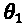的最优值时，该最优值将回归中的损失降到最低，这实际上与**一层神经网络**相同：


图 1.10 –一层神经网络

在这里，我们将每个功能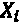作为输入，在此通过**节点**进行说明。 我们希望学习参数，在此图中将其表示为**连接**。 我们对和之间所有乘积的最终总和为我们提供了最终预测`y`：

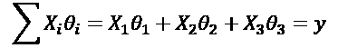

一个简单的神经网络建立在这个初始概念的基础上，在计算中增加了额外的层，从而增加了复杂性和学习到的参数，使我们得到了类似的东西：

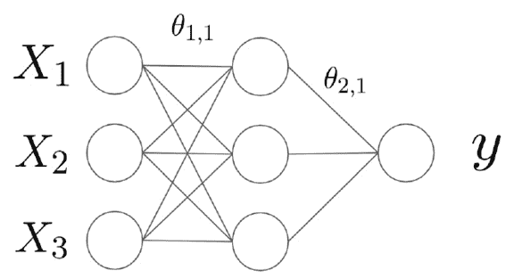

图 1.11 –全连接网络

每个输入节点都连接到另一层中的每个节点。 这被称为**全连接层**。 然后，将来自的全连接层的输出乘以其自身的附加权重，以便预测`y`。 因此，我们的预测不再只是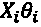的函数，而是现在包括针对每个参数的多个学习权重。 功能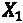不再仅受影响。 现在，它也受到的影响。 参数。

由于全连接层中的每个节点都将`X`的所有值作为输入，因此神经网络能够学习输入特征之间的交互特征。 多个全连接层可以链接在一起，以学习更复杂的功能。 在本书中，我们将看到我们构建的所有神经网络都将使用该概念。 将不同品种的多层链接在一起，以构建更复杂的模型。 但是，在我们完全理解神经网络之前，还有另外一个关键要素要涵盖：激活函数。

## 激活函数

虽然将各种权重链接在一起可以使我们学习更复杂的参数，但最终，我们的最终预测仍将是权重和特征的线性乘积的组合。 如果希望神经网络学习一个真正复杂的非线性函数，则必须在模型中引入非线性元素。 这可以通过使用**激活函数**来完成：


图 1.12 –神经网络中的激活函数

我们将激活函数应用于全连接层中的每个节点。 这意味着全连接层中的每个节点都将特征和权重之和作为输入，对结果值应用非线性函数，并输出转换后的结果。 尽管激活函数有许多不同，但最近使用最频繁的是 **ReLU** 或**整流线性单元**：


图 1.13 – ReLU 输出的表示

ReLU 是非常简单的非线性函数，当`x <= 0`，返回`y = 0`；当`x > 0`时返回`y = x`。 在将这些激活函数引入我们的模型后，我们最终的学习函数将变为非线性，这意味着我们可以创建比单独使用传统回归和特征工程相结合的模型更多的模型。

## 神经网络如何学习？

使用神经网络从数据中学习的行为比使用基本回归学习时的行为稍微复杂一些。 尽管我们仍然像以前一样使用梯度下降，但是我们需要区分的实际损失函数变得更加复杂。 在没有激活函数的单层神经网络中，我们很容易计算损失函数的导数，因为很容易看到随着我们改变每个参数损失函数如何变化。 但是，在具有激活函数的多层神经网络中，这更加复杂。

我们必须首先执行**正向传播**，即，其中，使用模型的当前状态，我们计算`y`的预测值，并根据`y`的真实值来评估它，以便获得损失的度量。 利用这一损耗，我们可以在网络中向后移动，计算网络中每个参数的梯度。 这使我们可以知道向哪个方向更新参数，以便使可以更接近损耗最小的点。 这被称为**反向传播**。 我们可以使用**链式规则**计算相对于每个参数的损失函数的导数：


此处，是网络内每个给定节点的输出。 因此，总而言之，在神经网络上执行梯度下降时我们采取的四个主要步骤如下：

1.  使用您的数据执行正向传播，计算网络的总损耗。
2.  使用反向传播，计算每个参数相对于网络中每个节点损耗的梯度。
3.  更新这些参数的值，朝着使损失最小化的方向发展。
4.  重复直到收敛。

## 神经网络中的过拟合

我们看到，在回归的情况下，可以添加太多功能，从而有可能使网络过拟合。 这样一来，模型可以很好地拟合训练数据，但不能很好地推广到看不见的测试数据集。 这是神经网络中的一个普遍问题，因为模型复杂性的提高意味着通常有可能将函数拟合到不一定要泛化的数据训练集中。 以下是数据集每次向前和反向传播（称为历元）后训练和测试数据集上的总损失的图：

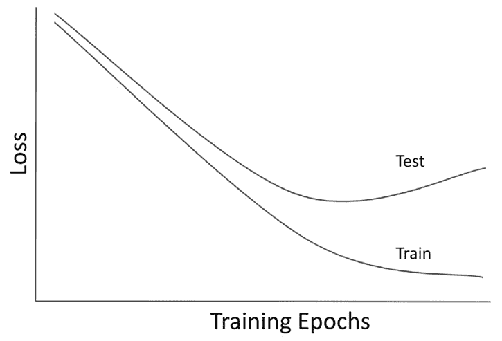

图 1.14 –测试和训练时期

在这里，我们可以看到随着我们继续训练网络，随着我们向总损耗最小化的方向靠近，训练损耗会随着时间的推移而减小。 虽然这可以很好地推广到测试数据集，但一段时间后，由于我们的函数过度适合训练集中的数据，测试数据集上的总损失开始增加。 一种解决方案是**提前停止**。 因为我们希望我们的模型对之前从未见过的数据做出良好的预测，所以我们可以在测试损失最小的时候停止训练我们的模型。 经过全面训练的 NLP 模型可能能够轻松地对以前见过的句子进行分类，但是，对真正了解到某些东西的模型的衡量标准是能够对看不见的数据进行预测。

# 用于机器学习的 NLP

与人类不同，计算机无法理解文本-至少不能以与我们相同的方式理解文本。 为了创建能够从数据中学习的机器学习模型，我们必须首先学习以计算机能够处理的方式来表示自然语言。

当我们讨论机器学习基础知识时，您可能已经注意到损失函数都处理数值数据，以便能够最大程度地减少损失。 因此，我们希望以数字格式表示文本，这可以构成我们向神经网络输入的基础。 在这里，我们将介绍几种数值表示数据的基本方法。

## 词袋

表示文本的第一种也是最简单的方法是使用**词袋**表示。 此方法只对给定句子或文档中的单词进行计数，然后对所有单词进行计数。 然后将这些计数转换为向量，其中向量的每个元素都是**语料库**中每个单词出现在句子中的次数计数。 语料库是，只是出现在所有要分析的句子/文档中的所有单词。 采取以下两个句子：

```py
The cat sat on the mat

The dog sat on the cat
```

我们可以将每个句子表示为单词数：

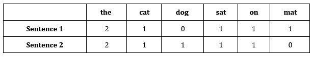

图 1.15 –字数表

然后，我们可以将它们转换为单个向量：

```py
The cat sat on the mat -> [2,1,0,1,1,1]

The dog sat on the cat -> [2,1,1,1,1,0]
```

然后，该数字表示形式可用作特征向量为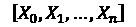的机器学习模型的输入特征。

## 序列表示

我们将在本书的后面看到，更复杂的神经网络模型，包括 RNN 和 LSTM，不仅将一个向量作为输入，而且可以采用矩阵形式的整个向量序列。 因此，为了更好地捕获单词的顺序，从而更好地捕获任何句子的含义，我们能够以单热编码的向量序列的形式来表示它：

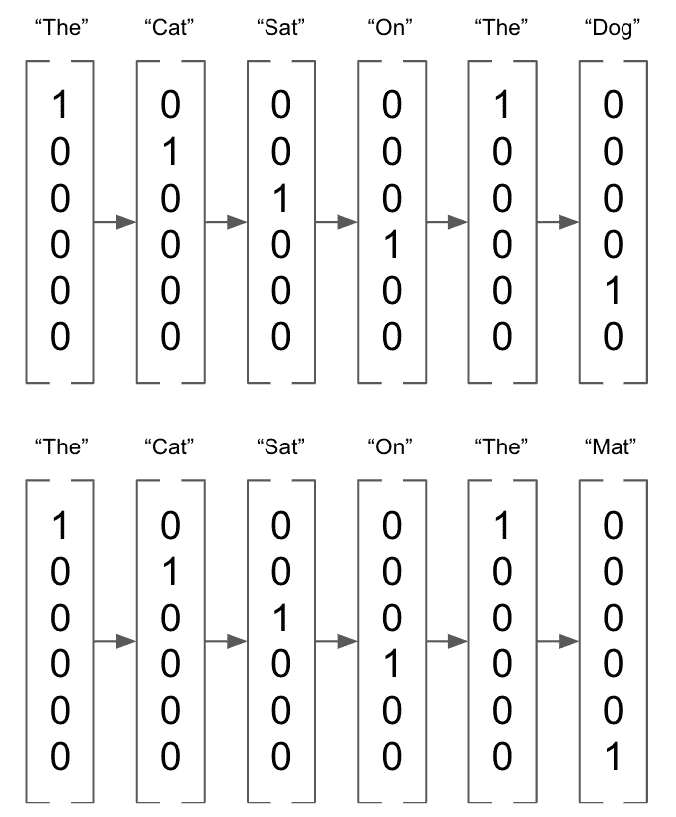

图 1.16 –单热编码向量

# 总结

在本章中，我们介绍了机器学习和神经网络的基础知识，以及对在这些模型中使用的文本转换的简要概述。 在下一章中，我们将简要概述 PyTorch 以及如何将其用于构建其中的一些模型。