# “第 2 章”：适用于 NLP 的 PyTorch 1.x 入门

**PyTorch** 是基于 Python 的机器学习库。 它包含两个主要功能：通过硬件加速（使用 GPU）有效执行张量操作的能力以及构建深度神经网络的能力。 PyTorch 还使用动态计算图代替静态计算图，这使其与 TensorFlow 等类似库区分开来。 通过演示如何使用张量表示语言以及如何使用神经网络向 NLP 学习，我们将显示这两个功能对于自然语言处理特别有用。

在本章中，我们将向您展示如何在计算机上启动和运行 PyTorch，以及演示其一些关键功能。 然后，在探索 PyTorch 的某些 NLP 功能（例如其执行张量运算的能力）之前，我们将把 PyTorch 与其他深度学习框架进行比较，最后演示如何构建简单的神经网络。 总之，本章将涵盖以下主题：

*   安装 PyTorch
*   将 PyTorch 与其他深度学习框架进行比较
*   PyTorch 的 NLP 功能

# 技术要求

在本章中，需要安装 Python。 建议使用最新版本的 Python（3.6 或更高版本）。 还建议使用 Anaconda 软件包管理器来安装 PyTorch。 需要 CUDA 兼容 GPU 才能在 GPU 上运行张量操作。 本章的所有代码都可以在[这个页面](https://github.com/PacktPublishing/Hands-On-Natural-Language-Processing-with-PyTorch-1.x)中找到。

# 安装和使用 PyTorch 1.x

像大多数 Python 软件包一样，PyTorch 的安装非常简单。 这样做有两种主要方法。 首先，要使用命令行中的`pip`简单地安装。 只需键入以下命令：

```py
pip install torch torchvision
```

尽管此安装方法很快，但建议使用 Anaconda 进行安装，因为它包括运行 PyTorch 所需的所有依赖项和二进制文件。 此外，稍后将需要 Anaconda 使用 CUDA 在 GPU 上启用训练模型。 可以在 Anaconda 中通过在命令行中输入以下内容来安装 PyTorch：

```py
conda install torch torchvision -c pytorch
```

要检查 PyTorch 是否正常工作，我们可以打开 Jupyter 笔记本并运行一些简单的命令：

1.  要在 PyTorch 中定义一个张量，我们可以执行以下操作。

    ```py
    import torch
    x = torch.tensor([1.,2.])
    print(x)
    ```

    结果为以下输出：

    

    图 2.1 –张量输出

    这表明 PyTorch 中的张量被保存为它们自己的数据类型（与 NumPy 中的数组保存方式相同）。

2.  我们可以使用标准的 Python 运算符来执行乘法等基本操作。

    ```py
    x = torch.tensor([1., 2.])
    y = torch.tensor([3., 4.])
    print(x * y)
    ```

    结果为以下输出：

    

    图 2.2 –张量乘法输出

3.  我们也可以从一个张量中选择单个元素，如下。

    ```py
    x = torch.tensor([[1., 2.],[5., 3.],[0., 4.]])
    print(x[0][1])
    ```

    结果为以下输出：

    

    图 2.3 –张量选择输出

但是，请注意，与 NumPy 数组不同，从张量对象中选择单个元素会返回另一个张量。 为了从张量返回单个值，可以使用`.item()`函数：

```py
print(x[0][1].item())
```

结果为以下输出：

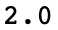

图 2.4 – .item（）函数的输出

## 张量

在我们继续之前，重要的是您充分了解张量的属性。 张量具有属性，称为**阶数**，该属性实质上确定张量的维数。 一阶张量是一维张量，等效于向量或数字列表。 2 阶张量是具有二维的张量，等效于矩阵，而 3 阶张量则由三个维度组成。 PyTorch 中张量可以具有的最大阶数没有限制：

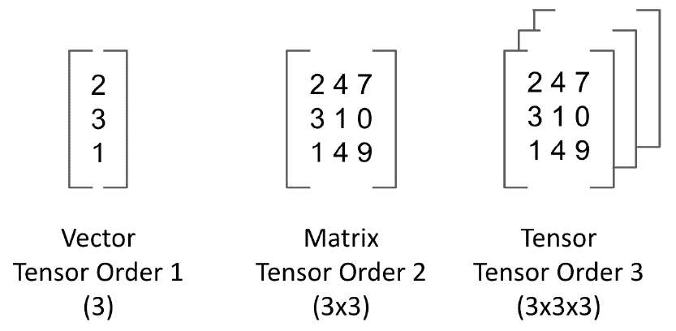

图 2.5 –张量矩阵

您可以通过键入以下命令来检查任何张量的大小：

```py
x.shape
```

结果为以下输出：

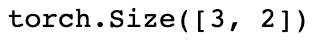

图 2.6 –张量形状输出

这表明这是一个 3x2 张量（阶数 2）。

# 使用 CUDA 启用 PyTorch 加速

PyTorch 的主要优点之一是它能够通过使用**图形处理单元**（**GPU**）来实现加速。 深度学习是一种易于并行化的计算任务，这意味着可以将计算分解为较小的任务，并可以在许多较小的处理器中进行计算。 意味着无需在单个 CPU 上执行任务，而是在 GPU 上执行计算更为有效。

GPU 最初是为了有效地渲染图形而创建的，但是由于深度学习在的普及中得到了发展，因此 GPU 被广泛用于同时执行多种计算的能力。 传统的 CPU 可能包含大约四个或八个内核，而 GPU 则包含数百个较小的内核。 由于可以同时在所有这些内核上执行计算，因此 GPU 可以快速减少执行深度学习任务所需的时间。

考虑神经网络内的一次通过。 我们可能会采集少量数据，将其通过我们的网络以获得损失，然后反向传播，根据梯度调整参数。 如果在传统的 CPU 上要处理大量数据，则必须等到批量 1 完成后才能计算批量 2：

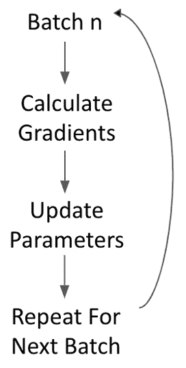

图 2.7 –神经网络中的一遍

但是，在 GPU 上，我们可以同时执行所有这些步骤，这意味着不需要批量即可在批量 2 开始之前完成。 我们可以同时计算所有批量的参数更新，然后一次执行所有参数更新（因为结果彼此独立）。 并行方法可以极大地加快机器学习过程：


图 2.8 –并行执行通行证的方法

**计算统一设备架构**（**CUDA**）是 Nvidia GPU 特有的技术，可在 PyTorch 上实现硬件加速。 为了启用 CUDA，我们首先必须确保我们系统上的图形卡兼容 CUDA。 [可在此处找到 CUDA 兼容 GPU 的列表](https://developer.nvidia.com/cuda-gpus)。 如果您具有兼容 CUDA 的 GPU，[则可以从此链接安装 CUDA](https://developer.nvidia.com/cuda-downloads)。 我们将使用以下步骤激活它：

1.  首先，为了在 PyTorch 上实际启用 CUDA 支持，您将必须从源代码构建 PyTorch。 有关如何完成此操作的详细信息，请参见以下网址：https：//github.com/pytorch/pytorch#from-source。
2.  然后，要在 PyTorch 代码中实际使用 CUDA，我们必须在 Python 代码中键入以下内容。

    ```py
    cuda = torch.device('cuda')
    ```

    这会将我们的默认 CUDA 设备的名称设置为`'cuda'`。

3.  然后，我们可以通过在任何张量操作中手动指定设备参数来执行对这个设备的操作。

    ```py
    x = torch.tensor([5., 3.], device=cuda)
    ```

    另外，我们可以通过调用`cuda`方法来做到这一点：

    ```py
    y = torch.tensor([4., 2.]).cuda()
    ```

4.  然后，我们可以运行一个简单的操作，以确保这是正确的工作。

    ```py
    x * y
    ```

    结果为以下输出：


图 2.9 –使用 CUDA 的张量乘法输出

由于我们只是在创建张量，因此速度的变化在此阶段不会很明显，但是当以后开始大规模训练模型时，我们将看到使用 CUDA 并行化计算的速度优势。 通过并行训练我们的模型，我们将能够节省大量时间。

# 将 PyTorch 与其他深度学习框架进行比较

PyTorch 是当今深度学习中使用的主要框架之一。 还存在其他广泛使用的框架，例如 TensorFlow，Theano 和 Caffe 等。 尽管它们在很多方面都非常相似，但是它们的操作方式还是有一些关键的区别。 其中包括：

*   如何计算模型
*   计算图的编译方式
*   创建具有可变层的动态计算图的能力
*   语法差异

可以说，PyTorch 与其他框架之间的主要区别在于模型本身的计算方式。 PyTorch 使用称为 **autograd** 的自动微分方法，该方法允许动态定义和执行计算图。 这与其他框架（如 TensorFlow）相反，后者是静态框架。 在这些静态框架中，必须在最终执行之前定义和编译计算图。 尽管使用预编译的模型可以提高生产效率，但在研究和勘探项目中却无法提供相同水平的灵活性。

在训练模型之前，诸如 PyTorch 之类的框架无需预先编译计算图。 PyTorch 使用的动态计算图意味着在执行图时对其进行编译，从而可以随时定义图。 动态模型构建方法在 NLP 领域特别有用。 让我们考虑两个我们希望对以下内容进行情感分析的句子：

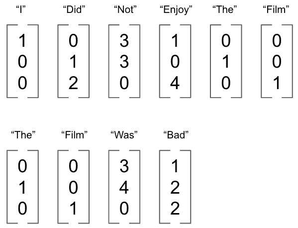

图 2.10 – PyTorch 中的模型构造

我们可以将这些句子中的每一个表示为单个单词向量的序列，然后形成我们对神经网络的输入。 但是，正如我们所看到的，我们每个输入的大小都是。 在固定计算图中，这些变化的输入大小可能是个问题，但是对于 PyTorch 这样的框架，模型能够动态调整以解决输入结构的变化。 这就是为什么 PyTorch 经常被 NLP 相关的深度学习首选的原因之一。

PyTorch 与其他深度学习框架之间的另一个主要区别是语法。 PyTorch 通常是具有 Python 经验的开发人员首选，因为它本质上被认为是非常 Python 的。 PyTorch 与 Python 生态系统的其他方面很好地集成在一起，如果您具有 Python 的先验知识，则非常容易学习。 现在，我们将从头开始编写我们自己的神经网络，以演示 PyTorch 语法。

# 在 PyTorch 中构建简单的神经网络

现在，我们将逐步在 PyTorch 中逐步构建神经网络。 在这里，我们有一个小的`.csv`文件，其中包含来自 MNIST 数据集的图像的几个示例。 MNIST 数据集由我们想要尝试分类的 0 到 9 之间的手绘数字组成。 以下是来自 MNIST 数据集的示例，其中包括手绘数字 1：

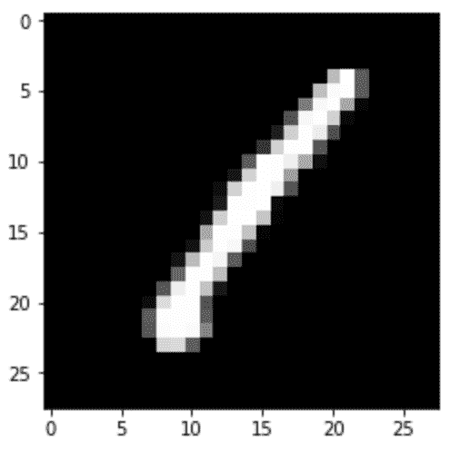

图 2.11 –来自 MNIST 数据集的样本图像

这些图像的尺寸为 28x28：总共 784 像素。 我们在`train.csv`中的数据集由 1,000 幅这些图像组成，每幅图像均由 784 个像素值以及正确的数字分类（在这种情况下为 1）组成。

## 加载数据

我们将从加载数据开始，如下所示：

1.  首先，我们需要加载我们的训练数据集，如下。

    ```py
    train = pd.read_csv("train.csv")
    train_labels = train['label'].values
    train = train.drop("label",axis=1).values.reshape(len(test),1,28,28)
    ```

    请注意，我们将输入重塑为`[1, 1, 28, 28]`，每个张量为 1,000 张图像 由 28x28 像素组成。

2.  接下来，我们将我们的训练数据和训练标签转换为 PyTorch 张量，以便它们可以被输入到神经网络中。

    ```py
    X = torch.Tensor(train.astype(float))
    y = torch.Tensor(train_labels).long()
    ```

注意这两个张量的数据类型。 浮点张量由 32 位浮点数组成，而长张量由 64 位整数组成。 为了使 PyTorch 能够计算梯度，我们的`X`功能必须为浮点数，而我们的标签必须为该分类模型中的整数（因为我们正在尝试预测 1、2、3 和 等等），因此 1.5 的预测就没有意义。

## 建立分类器

接下来，我们可以开始构造实际的神经网络分类器：

```py
class MNISTClassifier(nn.Module):
    def __init__(self):
        super().__init__()
        self.fc1 = nn.Linear(784, 392)
        self.fc2 = nn.Linear(392, 196)
        self.fc3 = nn.Linear(196, 98)
        self.fc4 = nn.Linear(98, 10)
```

我们像从 Python PyTorch 中继承`nn.Module`一样，在 Python 中构建普通类，从而构建分类器。 在我们的`__init__`方法中，我们定义了神经网络的每一层。 在这里，我们定义了大小可变的全连接线性层。

我们的第一层接受`784`输入，因为这是我们要分类的每个图像的大小（28x28）。 然后，我们看到一层的输出必须与下一层的输入具有相同的值，这意味着我们的第一个全连接层输出`392`个单位，而我们的第二层则采用`392`单位作为输入。 对每一层都重复一次，每次它们具有一半的单位数量，直到我们到达最终的全连接层为止，该层输出`10`个单位。 这是我们分类层的长度。

我们的网络现在看起来像这样：

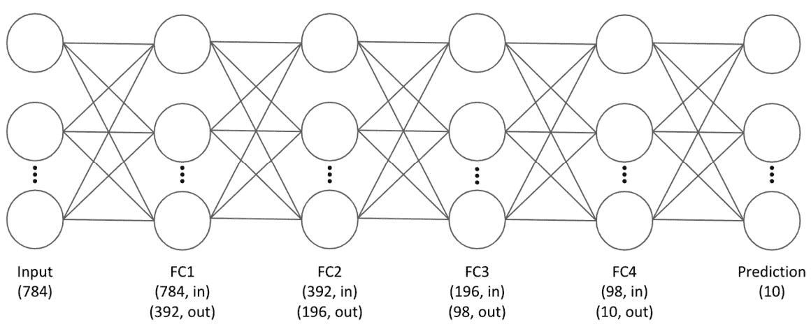

图 2.12 –我们的神经网络

在这里，我们可以看到我们的最后一层输出了`10`个单位。 这是因为我们希望预测每个图像是否为 0 到 9 之间的数字，总共是 10 种不同的可能分类。 我们的输出是长度为`10`的向量，并且包含图像的 10 种可能值中的每一个的预测。 在进行最终分类时，我们将数值最高的数字分类作为模型的最终预测。 例如，对于给定的预测，我们的模型可能会预测图像类型为 1 的概率为 10%，类型 2 的概率为 10%，类型 3 的概率为 80%。 因此，我们将类型 3 作为预测，因为它以最高概率被预测。

## 实施辍学

在我们的`MNISTClassifier`类的`__init__`方法中，我们还定义了一种 dropout 方法，以帮助规范网络：

```py
self.dropout = nn.Dropout(p=0.2)
```

辍学是一种规范化我们的神经网络以防止过拟合的方法。 在每个训练纪元上，对于已应用丢包的层中的每个节点，都有可能（此处定义为`p`= 20% ）该层内的每个节点将不用于训练/反向传播 。 这意味着，在训练时，我们的网络会针对过拟合变得健壮，因为在训练过程的每次迭代中都不会使用每个节点。 这可以防止我们的网络过于依赖网络中特定节点的预测。

## 定义前向通行证

接下来，我们在分类器中定义正向传递：

```py
def forward(self, x):
        x = x.view(x.shape[0], -1)
        x = self.dropout(F.relu(self.fc1(x)))
        x = self.dropout(F.relu(self.fc2(x)))
        x = self.dropout(F.relu(self.fc3(x)))
        x = F.log_softmax(self.fc4(x), dim=1)
```

分类器中的`forward()`方法是我们在其中应用激活函数并定义在我们的网络中应用 dropout 的位置的方法。 我们的`forward()`方法定义了输入将通过网络的路径。 首先，它获取我们的输入`x`，并将其整形以在网络中使用，并将其转换为一维向量。 然后，我们将其通过我们的第一个全连接层，并将其包装在 **ReLU** 激活函数中，以使其为非线性。 我们也将其包装在我们的[drop]中，如`__init__`方法中所定义。 我们对网络中的所有其他层重复此过程。

对于我们的最终预测层，我们将其包装在`log_softmax`层中。 我们将使用它来轻松计算我们的损失函数，如下所示。

## 设置模型参数

接下来，我们定义我们的模型参数：

```py
model = MNISTClassifier()
loss_function = nn.NLLLoss()
opt = optim.Adam(model.parameters(), lr=0.001)
```

我们将`MNISTClassifier`类的实例初始化为模型。 我们还将的损失定义为**负对数似然损失**：

```py
Loss(y) = -log(y)
```

假设我们的图像为 7。如果我们以概率 1 预测类别 7，则损失为`-log(1) = 0`，但是如果我们仅以概率 0.7 预测类别 7，则损失为 将是`-log(0.7) = 0.3`。 这意味着我们与正确预测的距离越远，损失就越接近无穷大：


图 2.13 –我们网络的损失表示

然后将其汇总到数据集中所有正确的类中，以计算总损失。 请注意，我们在构建分类器时定义了 log softmax，因为它已经应用了 softmax 函数（将预测输出限制在 0 到 1 之间）并获取了日志。 这意味着`log(y)`已经被计算出来，因此我们要计算网络上的总损耗所需要做的就是计算输出的负和。

我们还将优化器定义为 Adam 优化器。 优化器控制模型中的**学习率**。 模型的学习率定义了每次训练期间参数更新的大小。 学习速率的大小越大，梯度下降期间参数更新的大小越大。 优化器动态控制该学习速率，以便在初始化模型时，参数更新很大。 但是，随着模型的学习和向损耗最小化点的靠近，优化器将控制学习率，因此参数更新变得更小，可以更精确地定位局部最小值。

## 训练我们的网络

最后，我们实际上可以开始训练我们的网络了：

1.  首先，创建一个循环，为我们训练的每一个纪元运行一次。在这里，我们将在 50 个 epoch 中运行我们的训练循环。我们首先将输入的图像张量和输出的标签张量转化为 PyTorch 变量。一个**变量**是一个 PyTorch 对象，它包含一个`backward()`方法，我们可以使用该方法通过我们的网络进行反向传播。

    ```py
    for epoch in range(50):
        images = Variable(X)
        labels = Variable(y)
    ```

2.  接下来，我们在优化器上调用`zero_grad()`，将计算出的梯度设为零。在 PyTorch 中，梯度是在每次反向传播时累计计算的。虽然这在某些模型中很有用，例如在训练 RNNs 时，但对于我们的示例，我们希望在每个纪元后从头开始计算梯度，因此我们确保在每次通过后将梯度重置为零。

    ```py
    opt.zero_grad()
    ```

3.  接下来，我们使用模型的当前状态对我们的数据集进行预测。这实际上是我们的正向传递，因为我们然后使用这些预测来计算我们的损失。

    ```py
    outputs = model(images)
    ```

4.  使用输出和我们数据集的真实标签，我们使用定义的损失函数计算我们模型的总损失，在这种情况下，它是负对数似然。在计算出这个损失后，我们就可以调用`backward()`，通过网络反推我们的损失。然后，我们使用`step()`来使用我们的优化器，以便相应地更新我们的模型参数。

    ```py
    loss = loss_function(outputs, labels)
    loss.backward()
    opt.step()
    ```

5.  最后，在每个纪元完成后，我们打印总损失。我们可以观察到这一点，以确保我们的模型正在学习。

    ```py
    print ('Epoch [%d/%d] Loss: %.4f' %(epoch+1, 50, loss.data.item()))
    ```

一般而言，我们预计损失会在每个时期减少。 我们的输出将如下所示：

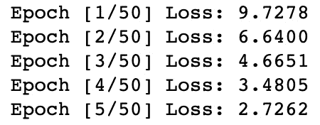

图 2.14 –训练纪元

## 进行预测

现在我们的模型已经过训练，我们可以使用它对看不见的数据进行预测。 我们首先从读取我们的测试数据集（该数据未用于训练我们的模型）：

```py
test = pd.read_csv("test.csv")
test_labels = test['label'].values
test = test.drop("label",axis=1).values.reshape(len(test),1,28,28)
X_test = torch.Tensor(test.astype(float))
y_test = torch.Tensor(test_labels).long()
```

在这里，我们执行与加载训练数据集时相同的步骤：重新整形测试数据并将其转换为 PyTorch 张量。 接下来，要使用我们训练有素的模型进行预测，我们只需运行以下命令：

```py
preds = model(X_test)
```

与我们在模型中训练数据的正向传递上计算输出的方式相同，现在我们将测试数据传递通过模型并获得预测。 我们可以像这样查看其中一张图像的预测：

```py
print(preds[0])
```

结果为以下输出：


图 2.15 –预测输出

在这里，我们可以看到我们的预测是一个长度为 10 的向量，并且对每个可能的类别（0 到 9 之间的数字）进行了预测。 预测值最高的是我们的模型选择的预测值。 在这种情况下，它是向量的第十个单位，等于数字 9。请注意，由于我们较早使用对数 softmax，因此我们的预测是对数而非原始概率。 要将它们转换回概率，我们可以使用`x`对其进行转换。

现在，我们可以构造一个摘要 DataFrame，其中包含我们的真实测试数据标签以及模型预测的标签：

```py
_, predictionlabel = torch.max(preds.data, 1)
predictionlabel = predictionlabel.tolist()
predictionlabel = pd.Series(predictionlabel)
test_labels = pd.Series(test_labels)
pred_table = pd.concat([predictionlabel, test_labels], axis=1)
pred_table.columns =['Predicted Value', 'True Value']
display(pred_table.head())
```

结果为以下输出：

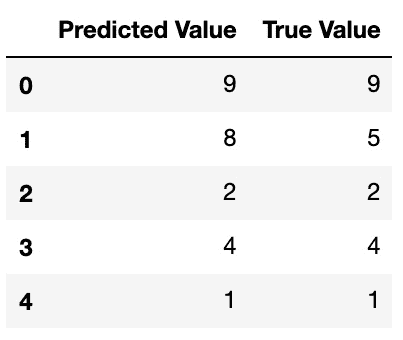

图 2.16 –预测表

注意`torch.max()`函数如何自动选择具有最高值的预测。 在这里我们可以看到，基于的少量数据，我们的模型似乎做出了一些不错的预测！

## 评估我们的模型

既然我们已经从模型中获得了一些预测，我们就可以使用这些预测来评估模型的质量。 如上一章所述，评估模型性能的一种基本方法是**准确率**。 在这里，我们只是将正确的预测（预测的图像标签等于实际的图像标签）计算为模型做出的预测总数的百分比：

```py
preds = len(predictionlabel)
correct = len([1 for x,y in zip(predictionlabel, test_labels)               if x==y])
print((correct/preds)*100)
```

结果为以下输出：

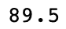

图 2.17 –准确率得分

恭喜你！ 您的第一个神经网络能够正确识别近 90% 的看不见的数字图像。 随着我们的前进，我们将看到可能会带来更先进的性能。 但是，到目前为止，我们已经证明使用 PyTorch 创建简单的深度神经网络非常简单。 只需几行代码就可以编写代码，从而获得超越基本机器学习模型（例如回归）所能达到的性能。

# 用于 PyTorch 的 NLP

现在我们已经学习了如何构建神经网络，我们将看到如何使用 PyTorch 为 NLP 构建模型。 在此示例中，我们将创建一个基本的词袋分类器，以对给定句子的语言进行分类。

## 设置分类器

在此示例中，我们将选择西班牙语和英语的句子：

1.  首先，我们将每个句子拆分成一个单词列表，并将每个句子的语言作为标签。我们取一部分句子来训练我们的模型，并在一边保留一小部分作为我们的测试集。我们这样做是为了在训练完模型后，可以评估模型的性能。

    ```py
    ("This is my favourite chapter".lower().split(),\
    "English"),
    ("Estoy en la biblioteca".lower().split(), "Spanish")
    ```

    请注意，我们还将每个单词转换为小写，这将阻止单词在单词袋中重复计算。 如果我们有单词`book`和单词`Book`，我们希望将它们视为相同的单词，因此将它们转换为小写。

2.  接下来，我们建立我们的单词索引，它只是一个语料库中所有单词的字典，然后为每个单词创建一个唯一的索引值。这可以通过一个简短的`for`循环轻松完成。

    ```py
    word_dict = {}
    i = 0
    for words, language in training_data + test_data:
        for word in words:
            if word not in word_dict:
                word_dict[word] = i
                i += 1
    print(word_dict)
    ```

    结果为以下输出：

    

    图 2.18 –设置分类器

    请注意，在这里，我们遍历了所有训练数据和测试数据。 如果我们只是在训练数据上创建单词索引，则在评估测试集时，我们将拥有在原始训练中看不到的新单词，因此我们将无法创建真正的单词袋 这些单词的表示形式。

3.  现在，我们以类似于上一节中构建神经网络的方式来构建我们的分类器，即通过构建一个新的类，该类继承自`nn.Module`。

    在这里，我们定义分类器，以使其由单个线性层组成，该线性层具有对数 softmax 激活函数，近似于逻辑回归。 通过在此处添加额外的线性层，我们可以轻松地将其扩展到作为神经网络运行，但是单层参数将达到我们的目的。 请密切注意线性层的输入和输出大小：

    ```py
    corpus_size = len(word_dict)
    languages = 2
    label_index = {"Spanish": 0, "English": 1}
    class BagofWordsClassifier(nn.Module):  
        def __init__(self, languages, corpus_size):
            super(BagofWordsClassifier, self).__init__()
            self.linear = nn.Linear(corpus_size, languages)
        def forward(self, bow_vec):
            return F.log_softmax(self.linear(bow_vec), dim=1)
    ```

    输入的长度为`corpus_size`，这只是我们的语料库中唯一词的总数。 这是因为对模型的每个输入都是一个词袋表示，由每个句子中的单词计数组成，如果给定单词​​未出现在我们的句子中，则计数为 0。 我们的输出大小为 2，这是我们可以预测的语言数量。 我们的最终预测将包括我们的句子是英语的概率与我们的句子是西班牙文的概率，而我们的最终预测是概率最高的那个。

4.  接下来，我们定义一些实用函数。我们首先定义`make_bow_vector`，它将句子转化为一个词袋的表示。我们首先创建一个由所有零组成的向量。然后，我们对它们进行循环，对于句子中的每一个词，我们将该词在词袋向量中的索引数增加 1。最后，我们使用`.view()`对这个向量进行重塑，以便进入我们的分类器。

    ```py
    def make_bow_vector(sentence, word_index):
        word_vec = torch.zeros(corpus_size)
        for word in sentence:
            word_vec[word_dict[word]] += 1
        return word_vec.view(1, -1)
    ```

5.  同样，我们定义了`make_target`，它只是简单地取句子（西班牙语或英语）的标签，并返回其相关索引（`0`或`1`）。

    ```py
    def make_target(label, label_index):
        return torch.LongTensor([label_index[label]])
    ```

6.  现在我们可以创建一个模型的实例，准备进行训练。我们还将我们的损失函数定义为负对数似然，因为我们使用的是对数 softmax 函数，然后定义我们的优化器，以便使用标准的**随机梯度下降**（**SGD**）。

    ```py
    model = BagofWordsClassifier(languages, corpus_size)
    loss_function = nn.NLLLoss()
    optimizer = optim.SGD(model.parameters(), lr=0.1)
    ```

现在，我们准备训练模型。

## 训练分类器

首先，我们建立一个循环，该循环由希望模型运行的时期数组成。 在这种情况下，我们将选择 100 个纪元。

在此循环中，我们首先将梯度归零（否则，PyTorch 会累积计算梯度），然后对于每个句子/标签对，分别将其转换为词袋向量和目标。 然后，通过使数据向前通过模型的当前状态，我们计算出该特定句子对的预测输出。

然后使用此预测，获取我们的预测标签和实际标签，并在两者上调用定义的`loss_function`，以获取此句子的损失度量。 通过向后调用`backward()`，我们通过模型反向传播此损失，并在优化器上调用`step()`，从而更新模型参数。 最后，我们每 10 个训练步骤打印一次损失：

```py
for epoch in range(100):
    for sentence, label in training_data:
        model.zero_grad()
        bow_vec = make_bow_vector(sentence, word_dict)
        target = make_target(label, label_index)
        log_probs = model(bow_vec)
        loss = loss_function(log_probs, target)
        loss.backward()
        optimizer.step()
        
    if epoch % 10 == 0:
        print('Epoch: ',str(epoch+1),', Loss: ' + str(loss.item()))
```

结果为以下输出：


图 2.19 –训练损失

在这里，我们可以看到，随着模型的学习，我们的损失随着时间而减少。 尽管本例中的训练集很小，但是我们仍然可以证明我们的模型学到了一些有用的东西，如下所示：

1.  我们根据未接受模型训练的测试数据中的几句话来评估模型。 在这里，我们首先设置`torch.no_grad()`，这将停用 **autograd** 引擎，因为由于我们不再训练模型，因此不再需要计算梯度。 接下来，我们将测试句子转换为词袋向量，并将其输入模型以获取预测。
2.  然后我们只需打印出句子、句子的真实标签，再打印出预测的概率。注意，我们将预测值从对数概率转化回概率。我们为每个预测得到两个概率，但如果我们参考标签索引，我们可以看到第一个概率（索引 0）对应的是西班牙语，而另一个概率对应的是英语。

    ```py
    def make_predictions(data):
        with torch.no_grad():
            sentence = data[0]
            label = data[1]
            bow_vec = make_bow_vector(sentence, word_dict)
            log_probs = model(bow_vec)
            print(sentence)
            print(label + ':')
            print(np.exp(log_probs))
            
    make_predictions(test_data[0])
    make_predictions(test_data[1])
    ```

    结果为以下输出：

    

    图 2.20 –预测的输出

    在这里，我们可以看到，对于我们的两个预测，我们的模型都可以预测正确的答案，但是为什么会这样呢？ 我们的模型究竟学到了什么？ 我们可以看到我们的第一个测试句子包含单词`estoy`，该单词先前在我们的训练集中的西班牙语句子中出现过。 同样，我们可以看到`book`一词在我们的训练集中以英语句子出现。 由于我们的模型由单层组成，因此每个节点上的参数都易于解释。

3.  在这里，我们定义了一个函数，它将一个词作为输入，并返回层内每个参数的权重。对于一个给定的词，我们从我们的字典中得到这个词的索引，然后从模型内的相同索引中选择这些参数。请注意，我们的模型会返回两个参数，因为我们是在做两个预测，即模型对西班牙语预测的贡献和模型对英语预测的贡献。

    ```py
    def return_params(word):
        index = word_dict[word]
        for p in model.parameters():
            dims = len(p.size())
            if dims == 2:
                print(word + ':')
                print('Spanish Parameter = ' + str(p[0][index].item()))
                print('English Parameter = ' + str(p[1][index].item()))
                print('\n')
                
    return_params('estoy')
    return_params('book')
    ```

    结果为以下输出：

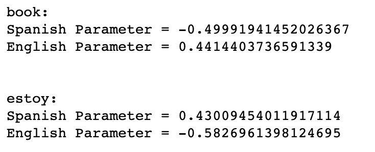

图 2.21 –更新功能的预测输出

在这里，我们可以看到，对于单词`estoy`而言，此参数对西班牙语的预测为正，对英语的预测为负。 这意味着对于我们句子中的每个单词`estoy`，该句子更有可能是西班牙语句子。 类似地，对于`book`一词，我们可以看到这对句子为英语的预测有积极作用。

我们可以证明我们的模型仅基于对其进行了训练而学习。 如果我们尝试预测尚未训练过的单词，则可以看到它无法做出准确的决定。 在这种情况下，我们的模型认为英语单词`not`是西班牙语：

```py
new_sentence = (["not"],"English")
make_predictions(new_sentence)
```

结果为以下输出：


图 2.22 – 最终输出

# 总结

在本章中，我们介绍了 PyTorch 及其一些关键功能。 希望您现在对 PyTorch 与其他深度学习框架有何不同以及如何用于构建基本神经网络有了更好的了解。 尽管这些简单的示例只是冰山一角，但我们已经说明了 PyTorch 是用于 NLP 分析和学习的强大工具。

在以后的章节中，我们将演示如何利用 PyTorch 的独特属性来构建高度复杂的模型，以解决非常复杂的机器学习任务。