# “第 3 章”：NLP 和文本嵌入

在深度学习中，有许多种表示文本的方式。 虽然我们已经介绍了基本的**词袋**（**BoW**）表示形式，但不足为奇的是，还有一种更为复杂的表示文本数据的方式称为嵌入。 BoW 向量仅充当句子中单词的计数，而嵌入有助于从数字上定义某些单词的实际含义。

在本章中，我们将探讨文本嵌入，并学习如何使用连续 BoW 模型创建嵌入。 然后，我们将继续讨论 n 元语法以及如何在模型中使用它们。 我们还将介绍标记，分块和标记化可用于将 NLP 分成其各个组成部分的各种方式。 最后，我们将研究 TF-IDF 语言模型，以及它们如何对不经常出现的单词加权我们的模型。

本章将涵盖以下主题：

*   词嵌入
*   探索 CBOW
*   探索 n-gram
*   代币化
*   对词性进行标记和分块
*   特遣部队

# 技术要求

可以从[这里](https://nlp.stanford.edu/projects/glove/)下载 GLoVe 向量。 建议使用 **Gloves.6B.50d.txt** 文件，因为它比其他文件小得多，并且处理起来也快得多。 本章后面的部分将要求 NLTK。 本章的所有代码都可以在[这个页面](https://github.com/PacktPublishing/Hands-On-Natural-Language-Processing-with-PyTorch-1.x)中找到。

# NLP 的嵌入

单词没有表示其含义的自然方式。 在图像中，我们已经具有丰富的向量表示形式（包含图像中每个像素的值），因此显然具有单词的类似丰富的向量表示形式将是有益的。 当语言的部分以高维向量格式表示时，它们称为**嵌入**。 通过分析单词的语料库，并确定哪些单词经常出现在一起，我们可以获得每个单词的`n`长度向量，它可以更好地表示每个单词与所有其他单词的语义关系。 先前我们看到，我们可以轻松地将单词表示为一键编码的矢量：

图 3.1 –一键编码矢量

另一方面，嵌入是长度为`n`（在以下示例中为`n`= 3）的向量，可以采用任何值：

图 3.2 – n = 3 的向量

这些嵌入表示`n`-维空间中的单词向量（其中`n`是嵌入向量的长度），并且在该空间中具有相似向量的单词被认为更相似。 含义。 尽管这些嵌入可以是任何大小，但它们的尺寸通常比 BoW 表示的尺寸低得多。 BOW 表示需要矢量，该矢量的长度为整个语料库的长度，当以一种整体语言查看时，它们可能很快变得非常大。 尽管嵌入的维数足够高以表示单个单词，但它们通常不超过几百个维。 此外，BOW 向量通常非常稀疏，主要由零组成，而嵌入则包含大量数据，并且每个维度都有助于单词的整体表示。 较低的维数和它们不稀疏的事实使得对嵌入执行深度学习比对 BOW 表示执行深度学习要有效得多。

## GLoVe

我们可以下载一组预先计算的词嵌入，以演示它们如何工作。 为此，我们将使用**用于词表示的全局矢量**（**GLoVe**）嵌入，[可以从此处下载](https://nlp.stanford.edu/projects/glove/)。 这些嵌入是在非常大的 NLP 数据集上计算的，并且在词共现矩阵上训练了。 这是基于这样的概念，即在一起出现的单词更有可能具有相似的含义。 例如，单词 *sun* 与单词 *hot* 相对于单词 *cold* 更有可能出现，因此 *太阳*和*热*被认为更相似。

我们可以通过检查单个 GLoVe 向量来验证这是正确的：

1.  We first create a simple function to load our GLoVe vectors from a text file. This just builds a dictionary where the index is each word in the corpus and the values are the embedding vector:

    def loadGlove（path）：

    文件=打开（路径，'r'）

    型号= {}

    对于文件中的 l：

    行= l.split（）

    字=线[0]

    值= np.array（[float（val）表示行中的 val [1：]]）

    模型[字] =值

    退货模式

    手套= loadGlove（'glove.6B.50d.txt'）

2.  This means we can access a single vector by just calling it from the dictionary:

    手套['python']

    这将产生以下输出：

    

    图 3.3 –向量输出

    我们可以看到，这将返回单词 Python 的 50 维向量嵌入。 现在，我们将引入**余弦相似度**的概念，以比较两个向量的相似度。 如果向量之间的`n`维空间中的角度为 0 度，则向量的相似度为 1。 余弦相似度高的值即使不相等也可以被认为是相似的。 可以使用以下公式进行计算，其中 A 和 B 是要比较的两个嵌入向量：

    

3.  We can calculate this easily in Python using the **cosine_similarity()** function from **Sklearn**. We can see that **cat** and **dog** have similar vectors as they are both animals:

    余弦相似度（手套['cat']。reshape（1，-1），手套['dog']。reshape（1，-1））

    结果为以下输出：

    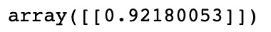

    图 3.4 –猫和狗的余弦相似度输出

4.  However, **cat** and **piano** are quite dissimilar as they are two seemingly unrelated items:

    余弦相似度（手套['cat']。reshape（1，-1），手套['piano']。reshape（1，-1））

    结果为以下输出：

图 3.5 –猫和钢琴的余弦相似度输出

## 嵌入操作

由于嵌入是向量，因此我们可以对它们执行操作。 例如，假设我们将嵌入用于以下类别，然后计算出以下内容：

*女王女人+男人*

这样，我们可以近似嵌入 *king* 的嵌入。 这基本上用 *Man* 向量替换了 *Queen* 的 *Woman* 向量分量，从而得出了这种近似值。 我们可以通过图形方式对此进行说明，如下所示：

图 3.6 –示例的图形表示

请注意，在此示例中，我们以二维方式对此进行了图形化说明。 就我们的嵌入而言，这是在 50 维空间中发生的。 虽然这并不确切，但我们可以验证我们的计算向量确实类似于 **King** 的 GLoVe 向量：

projection_king_embedding =手套['女王']-手套['女人'] +手套['男人']

余弦相似度（predicted_king_embedding.reshape（1，-1），Gloves ['king']。reshape（1，-1））

结果为以下输出：

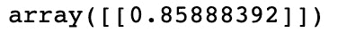

图 3.7 – GLoVe 向量的输出

尽管 GLoVe 嵌入是非常有用的预先计算的嵌入，但实际上我们可以计算自己的嵌入。 当我们分析特别独特的语料库时，这可能很有用。 例如，Twitter 上使用的语言可能与 Wikipedia 上使用的语言不同，因此在一个语言上训练的嵌入可能对另一个语言没有用。 现在，我们将演示如何使用连续的词袋来计算自己的嵌入。

# 探索 CBOW

**连续** **词袋（CBOW）**模型构成 Word2Vec 的一部分–由 Google 创建的模型，用于获取单词的矢量表示 。 通过在非常大的语料库上运行这些模型，我们能够获得单词的详细表示，这些单词表示它们的语义和上下文相似性。 Word2Vec 模型包含两个主要组件：

*   **CBOW** ：给定周围的单词，该模型尝试预测文档中的目标单词。
*   **跳过图**：这与 CBOW 相反； 该模型尝试在给定目标词的情况下预测周围的词。

由于这些模型执行类似的任务，因此我们现在仅关注一个，特别是 CBOW。 该模型旨在预测单词（**目标单词**），并为其指定其他单词（称为**上下文**单词）。 解决上下文单词的一种方法可能是，就像一样简单，使用句子中目标单词之前的单词来预测目标单词，而更复杂的模型可以在目标单词之前和之后使用多个单词。 考虑以下句子：

*PyTorch 是一个深度学习框架*

假设我们要根据上下文词来预测单词*深*：

*PyTorch 是一个{target_word}学习框架*

我们可以通过多种方式看待这一问题：

图 3.8 –上下文和表示表

对于我们的 CBOW 模型，我们将使用长度为 2 的窗口，这意味着对于模型的（ *X，y* ）输入/输出对，我们将使用*（[n-2，n-1， n + 1，n + 2，n]）*，其中`n`是我们要预测的目标词。

使用这些作为模型输入，我们将训练一个包含嵌入层的模型。 此嵌入层自动形成我们语料库中单词的`n`维表示。 但是，首先，使用随机权重初始化该层。 这些参数是使用我们的模型学习的，因此，在我们的模型完成训练之后，可以使用此嵌入层来将我们的语料库编码为嵌入式矢量表示形式。

## CBOW 架构

现在，我们将设计模型的架构，以学习我们的嵌入。 在这里，我们的模型接受四个单词的输入（目标单词之前两个，之后两个单词），并针对输出（我们的目标单词）训练它。 下面的图示说明了它的外观：

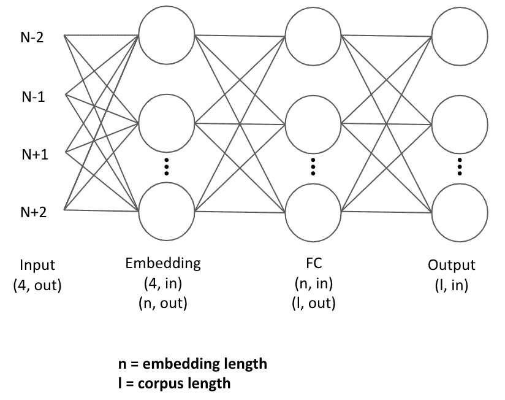

图 3.9 – CBOW 架构

输入的单词首先通过嵌入层，表示为大小（n，l）的张量，其中 n 是嵌入的指定长度，l 是语料库中单词的数量。 这是因为语料库中的每个单词都有其自己独特的张量表示形式。

然后使用来自四个上下文词的组合（求和）嵌入，将其馈入一个完全连接的层中，以学习针对目标词与上下文词的嵌入表示形式进行最终分类。 请注意，我们的预测词/目标词被编码为向量，即我们的语料库的长度。 这是因为我们的模型可以有效地预测语料库中每个单词成为目标单词的概率，而最终分类是概率最高的一个。 然后，我们得到一个损失，通过我们的网络反向传播，并更新完全连接层上的参数以及嵌入本身。

该方法之所以有效，是因为我们学习到的嵌入表示语义相似性。 假设我们在以下方面训练模型：

*X = [“ is”，“ a”，“ learning”，“ framework”]； y =“深”*

我们的模型从本质上要学习的是，目标词的组合嵌入表示在语义上与目标词相似。 如果我们在足够大的单词语料库上重复此操作，我们会发现我们的单词嵌入开始类似于我们以前看到的 GLoVe 嵌入，在语义上相似的单词在嵌入空间中彼此出现。

## 建筑物 CBOW

现在，我们将贯穿，从头开始构建 CBOW 模型，从而说明如何学习嵌入向量：

1.  We first define some text and perform some basic text cleaning, removing basic punctuation and converting it all into lowercase:

    text = text.replace（'，'，''）。replace（'。'，''）。lower（）。 分裂（）

2.  We start by defining our corpus and its length:

    语料库=集合（文本）

    corpus_length = len（语料库）

3.  Note that we use a set instead of a list as we are only concerned with the unique words within our text. We then build our corpus index and our inverse corpus index. Our corpus index will allow us to obtain the index of a word given the word itself, which will be useful when encoding our words for entry into our network. Our inverse corpus index allows us to obtain a word, given the index value, which will be used to convert our predictions back into words:

    word_dict = {}

    inverse_word_dict = {}

    对于我来说，枚举（语料库）中的单词：

    word_dict [word] = i

    inverse_word_dict [i] =单词

4.  Next, we encode our data. We loop through our corpus and for each target word, we capture the context words (the two words before and the two words after). We append this with the target word itself to our dataset. Note how we begin this process from the third word in our corpus (index =`2`) and stop it two steps before the end of the corpus. This is because the two words at the beginning won't have two words before them and, similarly, the two words at the end won't have two words after them:

    数据= []

    对于范围内的我（2，len（text）-2）：

    句子= [text [i-2]，text [i-1]，

    文字[i + 1]，文字[i + 2]

    目标=文字[i]

    data.append（（句子，目标））

    打印（数据[3]）

    结果为以下输出：

    

    图 3.10 –编码数据

5.  We then define the length of our embeddings. While this can technically be any number you wish, there are some tradeoffs to consider. While higher-dimensional embeddings can lead to a more detailed representation of the words, the feature space also becomes sparser, which means high-dimensional embeddings are only appropriate for large corpuses. Furthermore, larger embeddings mean more parameters to learn, so increasing the embedding size can increase training time significantly. We are only training on a very small dataset, so we have opted to use embeddings of size **20**:

    embedding_length = 20

    接下来，我们在 PyTorch 中定义 **CBOW** 模型。 我们定义嵌入层，以便它接受语料库长度的向量，并输出单个嵌入。 我们将线性层定义为一个完全连接的层，该层将嵌入并输出 **64** 的向量。 我们将最后一层定义为与文本语料库相同长度的分类层。

6.  We define our forward pass by obtaining and summing the embeddings for all input context words. This then passes through the fully connected layer with ReLU activation functions and finally into the classification layer, which predicts which word in the corpus corresponds to the summed embeddings of the context words the most:

    CBOW 类（torch.nn.Module）：

    def __init __（self，corpus_length，embedding_dim）：

    超级（CBOW，自我）.__ init __（）

    self.embeddings = nn.Embedding（corpus_length，embedding_dim）

    self.linear1 = nn.Linear（embedding_dim，64）

    self.linear2 = nn.Linear（64，corpus_length）

    self.activation_function1 = nn.ReLU（）

    self.activation_function2 = nn.LogSoftmax（dim = -1）

    def forward（自己，输入）：

    embeds = sum（self.embeddings（inputs））。view（1，-1）

    out = self.linear1（嵌入）

    出= self.activation_function1（出）

    out = self.linear2（out）

    out = self.activation_function2（输出）

    返回

7.  We can also define a **get_word_embedding()** function, which will allow us to extract embeddings for a given word after our model has been trained:

    def get_word_emdedding（self，word）：

    字=火炬。LongTensor（[word_dict [word]]）

    返回 self.embeddings（word）.view（1，-1）

8.  Now, we are ready to train our model. We first create an instance of our model and define the loss function and optimizer:

    模型= CBOW（corpus_length，embedding_length）

    loss_function = nn.NLLLoss（）

    优化程序= torch.optim.SGD（model.parameters（），lr = 0.01）

9.  We then create a helper function that takes our input context words, gets the word indexes for each of these, and transforms them into a tensor of length 4, which forms the input to our neural network:

    def make_sentence_vector（sentence，word_dict）：

    idxs = [句子中 w 的 word_dict [w]]

    返回 torch.tensor（idxs，dtype = torch.long）

    打印（make_sentence_vector（['stormy'，'nights'，'when'，'the']，word_dict））

    结果为以下输出：

    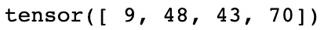

    图 3.11 –张量值

10.  Now, we train our network. We loop through 100 epochs and for each pass, we loop through all our context words, that is, target word pairs. For each of these pairs, we load the context sentence using **make_sentence_vector()** and use our current model state to obtain predictions. We evaluate these predictions against our actual target in order to obtain our loss. We backpropagate to calculate the gradients and step through our optimizer to update the weights. Finally, we sum all our losses for the epoch and print this out. Here, we can see that our loss is decreasing, showing that our model is learning:

    对于范围（100）中的时代：

    epoch_loss = 0

    对于句子，数据目标：

    model.zero_grad（）

    句子向量= make_sentence_vector（句子，word_dict）

    log_probs =模型（句子向量）

    损失= loss_function（log_probs，torch.tensor（

    [word_dict [target]]，dtype = torch.long））

    loss.backward（）

    Optimizer.step（）

    epoch_loss + = loss.data

    print（'Epoch：'+ str（epoch）+'，损失：'+ str（epoch_loss.item（）））

    这将产生以下输出：

    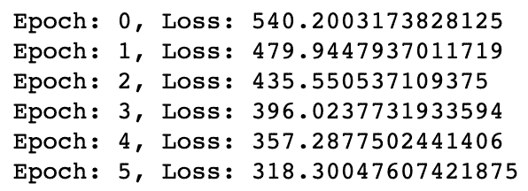

    图 3.12 –培训我们的网络

    现在我们的模型已经训练完毕，我们可以进行预测了。 我们定义了几个函数来允许我们这样做。 **get_predicted_result（）**从预测数组中返回预测的单词，而我们的**预测 _sentence（）**函数则根据上下文单词进行预测。

11.  We split our sentences into individual words and transform them into an input vector. We then create our prediction array by feeding this into our model and get our final predicted word by using the **get_predicted_result()** function. We also print the two words before and after the predicted target word for context. We can run a couple of predictions to validate our model is working correctly:

    def get_predicted_result（input，inverse_word_dict）：

    索引= np.argmax（输入）

    返回 inverse_word_dict [index]

    def Forecast_sentence（sentence）：

    句子拆分=句子。替换（'。'，''）。更低（）。 分裂（）

    句子矢量= make_sentence_vector（sentence_ split，word_dict）

    projection_array = model（sentence_vector）.data。 numpy（）

    print（'前置词：{} \ n'.format（sentence_ split [：2]））

    print（'Predicted Word：{} \ n'.format（get_predicted_ result（prediction_array [0]，inverse_ word_dict））））

    print（'以下单词：{} \ n'.format（sentence_ split [2：]））

    Forecast_sentence（'看跳跃和'）

    结果为以下输出：

    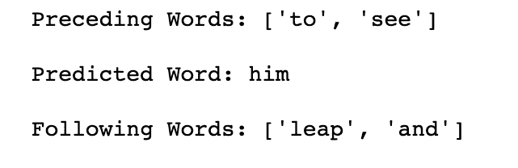

    图 3.13 –预测值

12.  Now that we have a trained model, we are able to use the **get_word_embedding()** function in order to return the 20 dimensions word embedding for any word in our corpus. If we needed our embeddings for another NLP task, we could actually extract the weights from the whole embedding layer and use this in our new model:

    打印（model.get_word_emdedding（'leap'））

    结果为以下输出：

图 3.14 –编辑模型后的张量值

在这里，我们演示了如何训练 CBOW 模型来创建单词嵌入。 实际上，要为语料库创建可靠的嵌入，我们将需要非常大的数据集，才能真正捕获所有单词之间的语义关系。 因此，对于您的模型，最好使用经过预先训练的嵌入，例如 GLoVe，它们已经在非常大的数据集上进行了训练，但是在某些情况下，最好对模型进行训练。 从头开始全新的嵌入集； 例如，当分析与正常 NLP 不同的数据语料库时（例如，Twitter 数据，用户可能会使用简短的缩写而不使用完整的句子）。

# 探索 n-gram

在我们的 CBOW 模型中，我们成功表明单词的含义与周围单词的上下文有关。 影响句子中单词含义的不仅是我们的上下文单词，还影响了这些单词的顺序。 考虑以下句子：

*猫坐在狗*

*狗坐在猫*

如果将这两个句子转换成词袋表示法，我们将看到它们是相同的。 但是，通过阅读这些句子，我们知道它们的含义完全不同（实际上，它们是完全相反的！）。 这清楚地表明，句子的含义不仅是其包含的单词，还包括它们出现的顺序。 尝试捕获句子中单词顺序的一种简单方法是使用 n-gram。

如果我们对句子进行计数，而不是对单个单词进行计数，我们现在计算句子中出现的不同的两个单词对，这就是，即使用**二元语法** ]：

图 3.15 –二元语法的表格表示

我们可以这样表示：

*猫坐在狗上-> [1,1,1,0,1,1]*

*狗坐在猫上-> [1,1,0,1,1,1]*

这些单词对试图捕捉单词在句子中出现的顺序，而不仅仅是它们的出现频率。 我们的第一句话包含两字组*猫坐*，而另一句话包含*狗坐*。 这些二元组显然可以帮助增加句子的上下文，而不仅仅是使用原始单词计数。

我们不仅限于单词。 我们还可以查看称为**三字组**或实际上是个不同数量的单词的不同单词三元组。 我们可以使用 n-gram 作为深度学习模型的输入，而不仅仅是单个单词，但是，当使用 n-gram 模型时，值得注意的是，您的特征空间会很快变得很大，并且可能使机器学习变得非常慢。 如果词典包含英语中的所有单词，则包含所有不同单词对的词典将大几个数量级！

## N-gram 语言建模

n-gram 帮助我们做的一件事是了解自然语言是如何形成的。 如果我们认为一种语言是由较小的单词对（二元图）的一部分而不是单个单词代表的，则可以开始将语言建模为概率模型，其中单词出现在句子中的概率取决于之前出现的单词 它。

在**会标**模型中，我们假设基于单词在语料库或文档中的分布，所有单词都有出现的可能性。 我们来看一个包含一个句子的文档：

*我的名字是我的名字*

基于此句子，我们可以生成单词的分布，其中每个单词根据其在文档中的出现频率具有给定的出现概率：

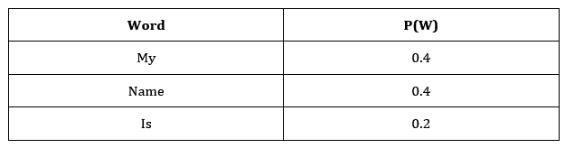

图 3.16 –字母组合的表格表示

然后，我们可以从该分布中随机抽取单词，以生成新的句子：

*名称是我的名字*

但是正如我们所看到的，这句话毫无意义，说明了使用会标模型的问题。 因为每个单词出现的概率与句子中的所有其他单词无关，所以没有考虑单词出现的顺序或上下文。 这是 n-gram 模型有用的地方。

现在，我们将考虑使用 **bigram** 语言模型。 给定出现在单词前面的单词，此计算将考虑单词出现的概率：

这意味着，给定前一个单词，单词出现的概率是单词 n-gram 出现的概率除以前一个单词出现的概率。 假设我们正在尝试预测以下句子中的下一个单词：

*我最喜欢的语言是 ___*

随之，我们得到以下 n-gram 和单词概率：

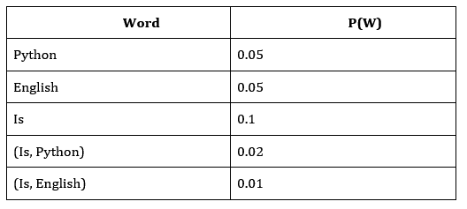

图 3.17 –概率的表格表示

有了这个，我们可以计算出出现 Python 的概率，假设前一个单词*为*出现的概率仅为 20％，而*英语*出现的概率仅为 10％。 我们可以进一步扩展此模型，以使用我们认为适当的来表示单词的三元组或任何 n 元组。 我们已经证明，可以使用 n-gram 语言建模将关于单词之间的相互关系的更多信息引入我们的模型，而不必天真地假设单词是独立分布的。

# 令牌化

接下来，我们将学习 NLP 的分词化，这是一种预处理文本的方式，可以输入到模型中。 标记化将我们的句子分成较小的部分。 这可能涉及将一个句子拆分成单个单词，或者将整个文档分解成单个句子。 这是 NLP 必不可少的预处理步骤，可以在 Python 中相当简单地完成：

1.  We first take a basic sentence and split this up into individual words using the **word tokenizer** in NLTK:

    text ='这是一个句子。'

    令牌= word_tokenize（文本）

    打印（令牌）

    结果为以下输出：

    

    图 3.18 –拆分句子

2.  Note how a period (**.**) is considered a token as it is a part of natural language. Depending on what we want to do with the text, we may wish to keep or dispose of the punctuation:

    no_punctuation = [如果 word.isalpha（），则为令牌中的 word 的 word.lower（）]

    打印（无标点符号）

    结果为以下输出：

    

    图 3.19 –删除标点符号

3.  We can also tokenize documents into individual sentences using the **sentence** **tokenizer**:

    text =“这是第一句话。这是第二句话。一个文档包含很多句子。”

    打印（sent_tokenize（文本））

    结果为以下输出：

    

    图 3.20 –将多个句子拆分为单个句子

4.  Alternatively, we can combine the two to split into individual sentences of words:

    打印（[send_tokenize（文本）中句子的 word_tokenize（句子）]）

    结果为以下输出：

    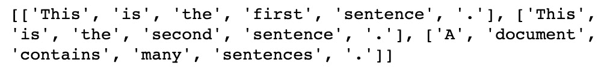

    图 3.21 –将多个句子分解为单词

5.  One other optional step in the process of tokenization, which is the removal of stopwords. Stopwords are very common words that do not contribute to the overall meaning of a sentence. These include words such as`a`,`I`, and **or**. We can print a complete list from NLTK using the following code:

    stop_words = stopwords.words（'english'）

    打印（stop_words [：20]）

    结果为以下输出：

    

    图 3.22 –显示停用词

6.  We can easily remove these stopwords from our words using basic list comprehension:

    text ='这是一个句子。'

    令牌= [如果令牌不在 stop_words 中，则在 word_tokenize（text）中令牌的令牌]

    打印（令牌）

    结果为以下输出：

图 3.23 –删除停用词

尽管某些 NLP 任务（例如预测句子中的下一个单词）需要停用词，但其他任务（例如判断电影评论的情感）则不需要停用词，因为停用词对文档的整体含义没有多大帮助。 在这种情况下，最好删除停用词，因为这些常用词的出现频率意味着它们可能不必要地增加了我们的特征空间，从而增加了模型训练所需的时间。

# 对词性进行标记和分块

到目前为止，我们已经涵盖了几种表示单词和句子的方法，包括词袋，嵌入和 n-gram。 但是，这些表示无法捕获任何给定句子的结构。 在自然语言中，不同的单词在句子中可以具有不同的功能。 考虑以下：

*大狗在床上睡觉*

我们可以根据句子中每个单词的功能来“标记”此文本的各个单词。 因此，前面的句子变为：

*->大->狗->是->睡觉->放在->->床*

*限定词->形容词->名词->动词->动词->介词->限定词->名词*

这些**词类**包括但不限于以下内容：

图 3.24 –词性

这些不同的语音部分可以用来更好地理解句子的结构。 例如，形容词通常在英语名词之前。 我们可以在模型中使用这些词性及其相互之间的关系。 例如，如果我们要预测句子中的下一个单词，并且上下文单词是形容词，则我们知道下一个单词为名词的可能性很高。

## 标记

词性**标记**是将这些词性标签分配给句子中各个单词的动作。 幸运的是，NTLK 具有内置的标记功能，因此我们不需要训练自己的分类器就能做到：

句子=“大狗在床上睡觉”

令牌= nltk.word_tokenize（句子）

nltk.pos_tag（令牌）

结果为以下输出：

图 3.25 –分类词性

在这里，我们简单地标记我们的文本并调用 **pos_tag（）**函数以标记句子中的每个单词。 这将为句子中的每个单词返回一个标签。 我们可以通过在代码上调用 **upenn_tagset（）**来解码此标签的含义。 在这种情况下，我们可以看到“ **VBG** ”对应于一个动词：

nltk.help.upenn_tagset（“ VBG”）

结果为以下输出：

图 3.26 – VBG 的说明

使用经过预先训练的语音标记器的部分是有好处的，因为它们不仅充当字典，可以查找句子中的各个单词。 他们还使用句子中单词的上下文来分配其含义。 考虑以下句子：

*他喝水*

*我会给我们买一些饮料*

这些句子中的*喝着*代表了两个不同的语音部分。 在的第一句话中，*饮料*是指动词； 喝酒动词*的现在时。* 在第二句中，*酒水*是指名词； 单数*饮料*的复数形式。 我们的训练有素的标记器能够确定这些单个单词的上下文并执行语音标记的准确部分。

## 分块

**Chunking** 在语音标记的初始部分扩展了，旨在将我们的句子分成小块，其中这些大块中的每一个都代表一小部分语音。

我们可能希望将文本拆分为**实体**，其中每个实体都是单独的对象或事物。 例如，*红皮书*不是指三个单独的实体，而是由三个单词描述的单个实体。 我们可以轻松地再次使用 NLTK 实现分块。 我们必须首先定义一个语法模式以使用正则表达式进行匹配。 问题中的模式查找**名词短语**（**NP**），其中名词短语定义为**确定词**（**DT**），然后是**可选形容词**（**JJ**），然后是**名词**（**NN**）：

表达式=（'NP：{

？ <jj>* <nn>}'）</nn></jj>

使用 **RegexpParser（）**函数，我们可以匹配此表达式的出现并将其标记为名词短语。 然后，我们可以打印结果树，显示标记的短语。 在我们的例句中，我们可以看到*大狗*和*床*被标记为两个单独的名词短语。 我们可以根据需要使用正则表达式匹配定义的任何文本块：

标记= nltk.pos_tag（令牌）

REchunkParser = nltk.RegexpParser（表达式）

树= REchunkParser.parse（已标记）

打印（树）

结果为以下输出：

图 3.27 –树表示

# TF-IDF

**TF-IDF** 是我们可以学习以更好地表示自然语言的另一种技术。 它通常用于文本挖掘和信息检索中，以基于搜索词匹配文档，但也可以与嵌入结合使用，以更好地以嵌入形式表示句子。 让我们用以下短语：

*这是一只小长颈鹿*

假设我们要用一个嵌入来表示这句话的意思。 我们可以做的一件事就是简单地对这句话中五个单词中每个单词的平均嵌入进行平均：

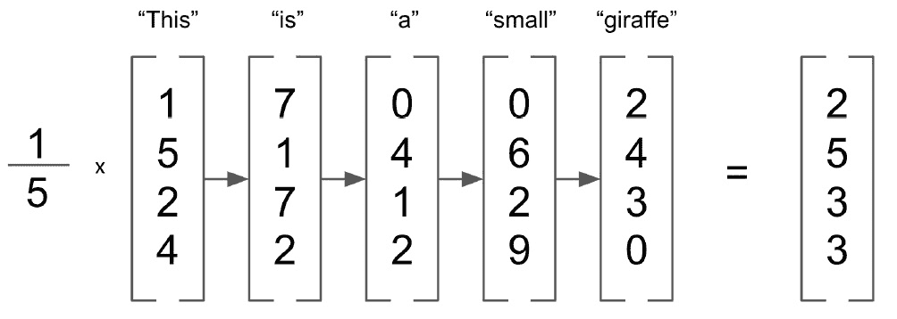

图 3.28 –单词嵌入

但是，此方法为句子中的所有单词分配相等的权重。 您是否认为所有单词都对句子的含义有同等的贡献？ **这个**和`a`是英语中非常常见的单词，但是**长颈鹿**很少见。 因此，我们可能希望为稀有词分配更多权重。 这种方法被称为**术语频率-反向文档频率**（**TD-IDF**）。 现在，我们将演示如何计算文档的 TF-IDF 权重。

## 计算 TF-IDF

顾名思义，TF-IDF 由两个分开的部分组成：术语频率和文档反向频率。 术语频率是一种特定于文档的度量，用于计算要分析的文档中给定单词的频率：

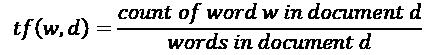

请注意，由于较长的文档更可能包含任何给定的单词，因此我们将该度量除以文档中单词的总数。 如果单词在文档中出现多次，它将获得更高的词频。 但是，这与我们希望对 TF-IDF 进行加权相反，因为我们希望对文档中出现的稀有单词给予更高的加权。 这就是 IDF 发挥作用的地方。

文档频率测量要分析单词的整个文档库中文档的数量，逆文档频率计算总文档与文档频率的比率：

如果我们有一个 100 个文档的语料库，并且单词在它们之间出现 5 次，则文档的倒数频率为 20。这意味着在所有文档中出现次数较少的单词的权重较高。 现在，考虑一个 100,000 个文档的语料库。 如果一个单词仅出现一次，则 IDF 为 100,000，而出现两次的单词的 IDF 为 50,000。 这些非常大且易失的 IDF 对于我们的计算而言并不理想，因此我们必须首先使用日志对其进行归一化。 请注意，如果我们为未出现在语料库中的单词计算 TF-IDF，我们如何在计算中加 1 以防止被 0 除：

这使我们最终的 TF-IDF 方程如下所示：

现在，我们可以演示如何在 Python 中实现此功能并将 TF-IDF 权重应用于我们的嵌入。

## 实施 TF-IDF

在这里，我们将使用 NLTK 数据集中的 Emma 语料对数据集实施 TF-IDF。 该数据集由 Jane Austen 的书 *Emma* 中的句子组成，我们希望为这些句子中的每一个计算一个嵌入式矢量表示：

1.  We start by importing our dataset and looping through each of the sentences, removing any punctuation and non-alphanumeric characters (such as astericks). We choose to leave stopwords in our dataset to demonstrate how TF-IDF accounts for these as these words appear in many documents and so have a very low IDF. We create a list of parsed sentences and a set of the distinct words in our corpus:

    艾玛= nltk.corpus.gutenberg.sents（'austen-emma.txt'）

    emma_sentences = []

    emma_word_set = []

    对于 Emma 中的句子：

    emma_sentences.append（[如果 word.isalpha（）为句子中的单词，则为[word.lower（）]）

    对于句子中的单词：

    如果 word.isalpha（）：

    emma_word_set.append（word.lower（））

    emma_word_set =设置（emma_word_set）

2.  Next, we create a function that will return our Term Frequencies for a given word in a given document. We take the length of the document to give us the number of words and count the occurrences of this word in the document before returning the ratio. Here, we can see that the word **ago** appears in the sentence once and that the sentence is 41 words long, giving us a Term Frequency of 0.024:

    def TermFreq（文档，单词）：

    doc_length = len（文档）

    出现次数= len（[w 表示文档中的 w，如果 w ==单词]）

    返回发生次数/ doc_length

    TermFreq（emma_sentences [5]，'ago'）

    结果为以下输出：

    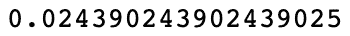

    图 3.29 – TF-IDF 分数

3.  Next, we calculate our Document Frequency. In order to do this efficiently, we first need to pre-compute a Document Frequency dictionary. This loops through all the data and counts the number of documents each word in our corpus appears in. We pre-compute this so we that do not have to perform this loop every time we wish to calculate Document Frequency for a given word:

    def build_DF_dict（）：

    输出= {}

    对于 emma_word_set 中的单词：

    输出[字] = 0

    对于 emma_sentences 中的文档：

    如果在 doc 中有字：

    输出[字] + = 1

    返回输出

    df_dict = build_DF_dict（）

    df_dict ['ago']

4.  Here, we can see that the word **ago** appears within our document 32 times. Using this dictionary, we can very easily calculate our Inverse Document Frequency by dividing the total number of documents by our Document Frequency and taking the logarithm of this value. Note how we add one to the Document Frequency to avoid a divide by zero error when the word doesn't appear in the corpus:

    def InverseDocumentFrequency（word）：

    N = len（emma_sentences）

    尝试：

    df = df_dict [word] +1

    除：

    df = 1

    返回 np.log（N / df）

    InverseDocumentFrequency（'ago'）

5.  Finally, we simply combine the Term Frequency and Inverse Document Frequency to get the TF-IDF weighting for each word/document pair:

    def TFIDF（doc，word）：

    tf = TF（doc，word）

    idf = InverseDocumentFrequency（word）

    返回 tf * idf

    print（'ago-'+ str（TFIDF（emma_sentences [5]，'ago'））））

    print（'indistinct-'+ str（TFIDF（emma_sentences [5]，'indistinct'））））

    结果为以下输出：

图 3.30 – TF-IDF 以前和不清晰的分数

在这里，我们可以看到，尽管**之前的**和**不清楚**的单词在给定文档中仅出现一次，但**不清楚**出现在整个语料库中的频率较低， 表示它获得更高的 TF-IDF 权重。

## 计算 TF-IDF 加权嵌入

接下来，我们可以显示这些 TF-IDF 加权如何应用于嵌入：

1.  We first load our pre-computed GLoVe embeddings to provide the initial embedding representation of words in our corpus:

    def loadGlove（path）：

    文件=打开（路径，'r'）

    型号= {}

    对于文件中的 l：

    行= l.split（）

    字=线[0]

    值= np.array（[float（val）表示行中的 val [1：]]）

    模型[字] =值

    退货模式

    手套= loadGlove（'glove.6B.50d.txt'）

2.  We then calculate an unweighted mean average of all the individual embeddings in our document to get a vector representation of the sentence as a whole. We simply loop through all the words in our document, extract the embedding from the GLoVe dictionary, and calculate the average over all these vectors:

    嵌入= []

    对于 emma_sentences [5]中的单词：

    embeddings.append（glove [word]）

    mean_embedding = np.mean（嵌入，轴= 0）.reshape（1，-1）

    打印（均值嵌入）

    结果为以下输出：

    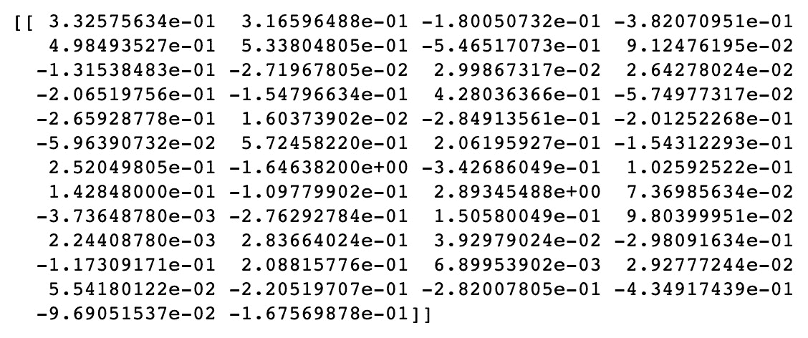

    图 3.31 –均值嵌入

3.  We repeat this process to calculate our TF-IDF weighted document vector, but this time, we multiply our vectors by their TF-IDF weighting before we average them:

    嵌入= []

    对于 emma_sentences [5]中的单词：

    tfidf = TFIDF（emma_sentences [5]，单词）

    embeddings.append（glove [word] * tfidf）

    tfidf_weighted_embedding = np.mean（嵌入，轴= 0）.reshape（1，-1）

    打印（tfidf_weighted_embedding）

    结果为以下输出：

    

    图 3.32 – TF-IDF 嵌入

4.  We can then compare the TF-IDF weighted embedding with our average embedding to see how similar they are. We can do this using cosine similarity, as follows:

    余弦相似度（均值嵌入，tfidf_weighted_embedding）

    结果为以下输出：

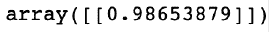

图 3.33 – TF-IDF 和平均嵌入之间的余弦相似度

在这里，我们可以看到我们的两种不同表示形式非常相似。 因此，虽然使用 TF-IDF 可能不会显着改变我们对给定句子或文档的表示，但可能会偏重于感兴趣的单词，从而提供更有用的表示。

# 摘要

在本章中，我们更深入地研究了词嵌入及其应用。 我们已经展示了如何使用连续词袋模型来训练它们，以及如何结合 n-gram 语言模型来更好地理解句子中词之间的关系。 然后，我们研究了将文档拆分为单独的令牌以进行轻松处理的方法，以及如何使用标记和分块来识别语音部分。 最后，我们展示了如何使用 TF-IDF 权重更好地以嵌入形式表示文档。

在下一章中，我们将看到如何使用 NLP 进行文本预处理，词干提取和词义化。