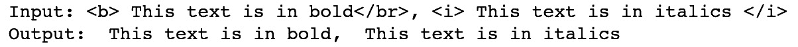
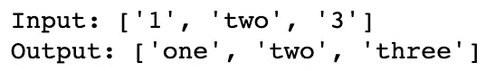
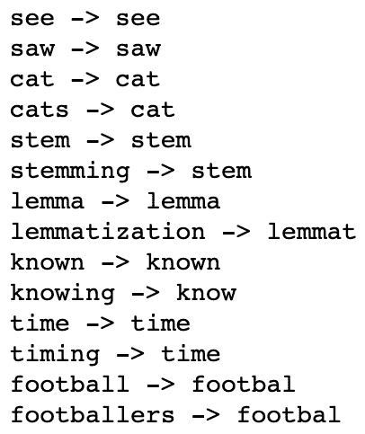
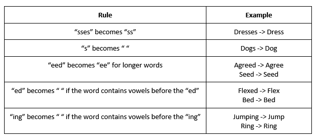
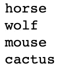
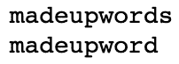
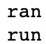
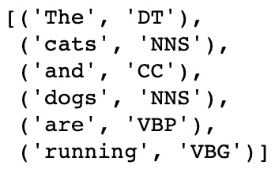
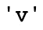
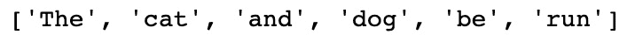

# “第 4 章”：文本预处理，词干提取和词形还原

文本数据可以从许多不同的来源收集，并采用许多不同的形式。 文本可以整洁，可读或原始且混乱，也可以采用许多不同的样式和格式。 能够对这些数据进行预处理，以便可以在将其转换为 NLP 模型之前将其转换为标准格式，这就是我们将在本章中介绍的内容。

与分词相似，词干提取和词形还原是 NLP 预处理的其他形式。 但是，与将文档简化成单个单词的分词不同，词干提取和词形还原试图将这些单词进一步缩小到其词根。 例如，几乎所有英语动词都有许多不同的变体，具体取决于时态：

```py
He jumped

He is jumping

He jumps
```

尽管所有这些词都不同，但它们都与相同的根词相关–`jump`。 词干提取和词形还原都是我们可以用来减少单词的共同词根变化的技术。

在本章中，我们将解释如何对文本数据执行预处理，并探讨词干提取和词形还原，并展示如何在 Python 中实现这些。

在本章中，我们将介绍以下主题：

*   文字预处理
*   词干提取
*   词形还原
*   词干提取和词形还原的用途

# 技术要求

对于本章中的文本预处理，我们将主要使用内置的 Python 函数，但也将使用外部 **BeautifulSoup** 包。 对于词干提取和词形还原，我们将使用 NLTK Python 包。 本章中的所有代码都可以在[这个页面](https://github.com/PacktPublishing/Hands-On-Natural-Language-Processing-with-PyTorch-1.x/tree/master/Chapter4)中找到。

# 文本预处理

文本数据可以采用多种格式和样式。 文本可以是结构化的可读格式，也可以是更原始的非结构化格式。 我们的文本可能包含我们不希望包含在模型中的标点符号和符号，或者可能包含 HTML 和其他非文本格式。 从网上来源抓取文本时，这尤其令人担忧。 为了准备我们的文本以便可以将其输入到任何 NLP 模型中，我们必须执行预处理。 这将清除我们的数据，使其成为标准格式。 在本节中，我们将更详细地说明其中一些预处理步骤。

## 删除 HTML

从在线来源抓取文本时，您可能会发现您的文本包含 HTML 标记和其他非文本工件。 我们通常不希望在模型的 NLP 输入中包括这些，因此默认情况下应将其删除。 例如，在 HTML 中，`<b>`标签指示其后的文本应为粗体。 但是，它不包含有关句子内容的任何文本信息，因此我们应该删除它。 幸运的是，在 Python 中，有一个名为 **BeautifulSoup** 的包，它使我们可以在几行中删除所有 HTML：

```py
input_text = "<b> This text is in bold</br>, <i> This text is in italics </i>"
output_text =  BeautifulSoup(input_text, "html.parser").get_text()
print('Input: ' + input_text)
print('Output: ' + output_text)
```

这将返回以下输出：



图 4.1 –删除 HTML

上面的屏幕快照显示 HTML 已成功删除。 这在原始文本数据中可能存在 HTML 代码的任何情况下（例如在为数据抓取网页时）都可能有用。

## 将文本转换为小写

预处理文本以将所有内容转换为小写形式时，这是标准做法。 这是因为相同的任何两个单词都应被视为语义相同，而不管它们是否大写。 `Cat`，`cat`和`CAT`都是相同的词，只是大小写不同。 我们的模型通常会将这三个词视为单独的实体，因为它们并不相同。 因此，通常的做法是将所有单词都转换为小写，以使这些单词在语义和结构上都相同。 使用以下代码行可以在 Python 中轻松完成此操作：

```py
input_text = ['Cat','cat','CAT']
output_text =  [x.lower() for x in input_text]
print('Input: ' + str(input_text))
print('Output: ' + str(output_text))
```

这将返回以下输出：


图 4.2 –将输入转换为小写

这表明输入已全部转换为相同的小写表示形式。 有一些示例中的大写字母实际上可以提供其他语义信息。 例如， `May`（五月）和`may`（意味着*可能*）在语义上有所不同， `May`（五月）将始终是大写。 但是，像这样的实例非常少见，将所有内容都转换为小写字母要比考虑这些少见的实例更为有效。

值得注意的是，大写可能在某些任务中很有用，例如语音标记的一部分（其中大写字母可能指示单词在句子中的作用）和命名实体识别（其中大写字母可能表明单词在句子中） 专有名词而不是非专有名词的替代； 例如`Turkey`（国家）和`turkey`（鸟类）。

## 删除标点符号

有时，根据所构建模型的类型，我们可能希望从输入文本中删除标点符号。 这在我们要汇总字数的模型中（例如在词袋表示中）特别有用。 句子中出现句号或逗号不会添加任何有关句子语义内容的有用信息。 但是，考虑到句子中标点符号位置的更复杂的模型实际上可能会使用标点符号的位置来推断不同的含义。 一个经典的例子如下：

```py
The panda eats shoots and leaves

The panda eats, shoots, and leaves
```

在这里，加上逗号会将描述Pandas的饮食习惯的句子转换为描述Pandas武装抢劫餐馆的句子！ 尽管如此，为了保持一致性，能够从句子中删除标点符号仍然很重要。 我们可以使用`re`库在 Python 中执行此操作，以使用正则表达式匹配任何标点符号，并使用`sub()`方法将任何匹配的标点符号替换为空字符：

```py
input_text = "This ,sentence.'' contains-£ no:: punctuation?"
output_text = re.sub(r'[^\w\s]', '', input_text)
print('Input: ' + input_text)
print('Output: ' + output_text)
```

这将返回以下输出：


图 4.3 –从输入中删除标点符号

这表明标点符号已从输入句子中删除。

在某些情况下，我们可能不希望直接删除标点符号。 一个很好的例子是的使用和号（`&`），在几乎每种情况下，它都与单词`and`互换使用。 因此，与其完全删除`&`号，不如选择直接用`and`一词代替。 我们可以使用`.replace()`函数在 Python 中轻松实现它：

```py
input_text = "Cats & dogs"
output_text = input_text.replace("&", "and")
print('Input: ' + input_text)
print('Output: ' + output_text)
```

这将返回以下输出：


图 4.4 –删除和替换标点符号

同样值得考虑的特殊情况是标点符号对于句子的表示必不可少。 一个重要的例子是电子邮件地址。 从电子邮件地址中删除`@`不会使该地址更具可读性：

```py
name@gmail.com
```

删除标点符号将返回以下内容：

```py
namegmailcom
```

因此，在这种情况下，根据您的 NLP 模型的要求和目的，最好将整个项目全部删除。

## 替换数字

同样，对于数字，我们也想标准化我们的输出。 数字可以写为数字（9、8、7）或实际单词（九，八，七）。 可能值得将所有这些转换为一个标准化的表示形式，这样就不会将 1 和 1 视为单独的实体。 我们可以使用以下方法在 Python 中执行此操作：

```py
def to_digit(digit):
    i = inflect.engine()
    if digit.isdigit():
        output = i.number_to_words(digit)
    else:
        output = digit
    return output
input_text = ["1","two","3"]
output_text = [to_digit(x) for x in input_text]
print('Input: ' + str(input_text))
print('Output: ' + str(output_text))
```

这将返回以下输出：



图 4.5 –用文字替换数字

这表明我们已成功将数字转换为文本。

但是，以类似于处理电子邮件地址的方式，处理电话号码可能不需要与常规电话号码相同的表示形式。 在以下示例中对此进行了说明：

```py
input_text = ["0800118118"]
output_text = [to_digit(x) for x in input_text]
print('Input: ' + str(input_text))
print('Output: ' + str(output_text))
```

这将返回以下输出：


图 4.6 –将电话号码转换为文本

显然，前面示例中的输入是电话号码，因此全文表示不一定适合目的。 在这种情况下，最好从输入文本中删除任何长整数。

# 词干提取和词形还原

在语言中，**变体**是如何通过修改共同的词根来表达不同的语法类别（如时态，语气或性别）的。 这通常涉及更改单词的前缀或后缀，但也可能涉及修改整个单词的。 例如，我们可以对动词进行修改以更改其时态：

```py
Run -> Runs (Add "s" suffix to make it present tense)

Run -> Ran (Modify middle letter to "a" to make it past tense)
```

但是在某些情况下，整个词会发生变化：

```py
To be -> Is (Present tense)

To be -> Was (Past tense)

To be -> Will be (Future tense – addition of modal)
```

名词也可能有词汇上的变化：

```py
Cat -> Cats (Plural)

Cat -> Cat's (Possessive)

Cat -> Cats' (Plural possessive)
```

所有这些词都与根词`cat`相关。 我们可以计算句子中所有单词的词根，以将整个句子简化为词根：

```py
"His cats' fur are different colors" -> "He cat fur be different color"
```

词干提取和词形还原是我们得出这些词根的过程。 **词干提取**是一个算法过程，其中，切掉单词的末尾以到达一个共同的词根，而词形还原使用单词本身的真实词汇和结构分析来得出它们的真正词根，即**词形**。 在下面的部分中，我们将详细介绍这两种方法。

## 词干提取

**词干提取**是一个算法过程，通过该算法，我们将单词的末尾切掉以达到其词根或**词干**。 为此，我们可以使用不同的**词干提取器**，每个词干都遵循特定算法，以便返回单词的词干。 用英语，最常见的词干提取器之一是 Porter 词干提取器。

**Porter 词干提取器**是具有大量逻辑规则的算法，可用于返回单词的词干。 在继续讨论该算法之前，我们将首先展示如何使用 NLTK 在 Python 中实现 Porter 词干提取器。

1.  首先，我们创建一个 Porter 词干提取器的实例。

    ```py
    porter = PorterStemmer()
    ```

2.  然后，我们只需在单个单词上调用这个词干提取器的实例，并打印结果。在这里，我们可以看到 Porter 词干提取器返回的词干的一个例子。

    ```py
    word_list = ["see","saw","cat", "cats", "stem", "stemming","lemma","lemmatization","known","knowing","time", "timing","football", "footballers"]
for word in word_list:
    print(word + ' -> ' + porter.stem(word))
    ```

    结果为以下输出：

    

    图 4.7 –返回词干

3.  我们也可以对整个句子应用词干提取，首先将句子符号化，然后对每个词单独进行词干提取。

    ```py
    def SentenceStemmer(sentence):
        tokens=word_tokenize(sentence)
        stems=[porter.stem(word) for word in tokens]
        return " ".join(stems)
    SentenceStemmer('The cats and dogs are running')
    ```

这将返回以下输出：


图 4.8 –对句子应用词干提取

在这里，我们可以看到如何使用 Porter 词干提取器提取不同的单词。 有些词，例如`stemming`和`timing`，减少到`stem`和`time`的预期词干。 但是，某些单词，例如`saw`，并没有还原为它们的逻辑词干（`see`）。 这说明了 Porter 词干提取器的局限性。 由于词干提取器对单词应用了一系列逻辑规则，因此很难定义一组可以正确所有单词的词干的规则。 在英语单词中，根据时态（`is/was/be`）完全改变单词的情况下尤其如此。 这是因为没有通用规则可应用于这些单词，以将它们全部转换为相同的词根。

我们可以更详细地研究 Porter 词干提取器所应用的一些规则，以准确了解向茎的转化是如何发生的。 尽管实际的波特算法有许多详细的步骤，但是在这里，我们将简化一些规则以便于理解：



图 4.9 – Porter 词干提取器算法的规则

虽然不必了解 Porter 词干提取器中的每个规则，但关键是要了解其局限性。 虽然已经证明了 Porter 词干提取器在整个语料库中都能很好地工作，但总有人会说它不能正确地还原成它们的真实词干。 由于 Porter 词干提取器的规则集依赖于英语单词结构的约定，因此总会有一些单词不属于常规单词结构，并且不能被这些规则正确转换。 幸运的是，可以通过使用词形还原来克服这些限制中的某些限制。

## 词形还原

**词形还原**与词干提取的区别在于，它将单词减少为**词形**而不是词干。 虽然单词的词干可以被处理并简化为字符串，单词的词形是其真正的词根。 因此，虽然`ran`的词干只是`ran`，但它的词形是该词的真正词根，也就是`run`。

词义化过程使用内置的预先计算的词法和关联词以及句子中词的上下文来确定给定词的正确词法。 在此示例中，我们将研究在 NLTK 中使用 **WordNet 词形还原器**。 WordNet 是一个庞大的英语单词及其词汇关系数据库。 它包含了英语中最强大，最全面的映射之一，特别是关于单词与其词形的关系。

我们将首先创建词形还原器的实例，并在一系列单词上调用它：

```py
wordnet_lemmatizer = WordNetLemmatizer()
print(wordnet_lemmatizer.lemmatize('horses'))
print(wordnet_lemmatizer.lemmatize('wolves'))
print(wordnet_lemmatizer.lemmatize('mice'))
print(wordnet_lemmatizer.lemmatize('cacti'))
```

结果为以下输出：



图 4.10 –最小化输出

在这里，我们已经可以开始看到使用词形还原胜于词干提取的优势。 由于 WordNet 词形还原器建立在英语所有单词的数据库上，因此知道`mice`是`mouse`的复数形式。 我们将无法使用词干提取达到相同的词根。 尽管词形还原在大多数情况下效果更好，但由于它依赖于内置的单词索引，因此无法将其推广到新单词或虚构单词：

```py
print(wordnet_lemmatizer.lemmatize('madeupwords'))
print(porter.stem('madeupwords'))
```

结果为以下输出：



图 4.11 –虚词的词法输出

在这里，我们可以看到，在这种情况下，我们的词干提取器能够更好地推广到以前看不见的单词。 因此，如果我们要对来源进行词形还原，其语言不一定与*真实*英语匹配，则使用词形还原器可能会是一个问题，例如人们经常会缩写语言的社交媒体网站。

如果我们使用两个动词调用词形还原器，则会发现这不会将它们简化为预期的常见词形：

```py
print(wordnet_lemmatizer.lemmatize('run'))
print(wordnet_lemmatizer.lemmatize('ran'))
```

结果为以下输出：



图 4.12 –在动词上进行词形还原

这是因为我们的词形还原器依靠单词的上下文来返回词形。 回想一下我们的 POS 分析，我们可以轻松地返回句子中单词的上下文并确定给定单词是名词，动词还是形容词。 现在，让我们手动指定我们的单词是动词。 我们可以看到现在可以正确返回词形：

```py
print(wordnet_lemmatizer.lemmatize('ran', pos='v'))
print(wordnet_lemmatizer.lemmatize('run', pos='v'))
```

结果为以下输出：


图 4.13 –在函数中实现 POS

这意味着为了返回任何给定句子的正确词形，我们必须首先执行 POS 标记以获得句子中词的上下文，然后将其传递给词形还原器以获取句子中每个词的词形。 我们首先创建一个函数，该函数将为句子中的每个单词返回 POS 标签：

```py
sentence = 'The cats and dogs are running'
def return_word_pos_tuples(sentence):
    return nltk.pos_tag(nltk.word_tokenize(sentence))
return_word_pos_tuples(sentence)
```

结果为以下输出：



图 4.14 –句子上 POS 标签的输出

请注意，这如何为句子中的每个单词返回 NLTK POS 标签。 我们的 WordNet 词形还原器对 POS 的输入要求略有不同。 这意味着我们首先创建，该函数将 NLTK POS 标签映射到所需的 WordNet POS 标签：

```py
def get_pos_wordnet(pos_tag):
    pos_dict = {"N": wordnet.NOUN,
                "V": wordnet.VERB,
                "J": wordnet.ADJ,
                "R": wordnet.ADV}
    return pos_dict.get(pos_tag[0].upper(), wordnet.NOUN)
get_pos_wordnet('VBG')
```

结果为以下输出：



图 4.15 –将 NTLK POS 标签映射到 WordNet POS 标签

最后，我们将这些函数组合为一个最终函数，该函数将对整个句子执行词形还原：

```py
def lemmatize_with_pos(sentence):
    new_sentence = []
    tuples = return_word_pos_tuples(sentence)
    for tup in tuples:
        pos = get_pos_wordnet(tup[1])
        lemma = wordnet_lemmatizer.lemmatize(tup[0], pos=pos)
        new_sentence.append(lemma)
    return new_sentence
lemmatize_with_pos(sentence)
```

结果为以下输出：



图 4.16 –最终的词形还原函数的输出

在这里，我们可以看到，与词干提取相比，词形通常可以更好地表示单词的真实词根，但有一些明显的例外。 当我们可能决定使用时，词干提取和词形还原取决于当前任务的要求，其中一些我们现在将讨论。

# 词干提取和词形还原的用途

词干提取和词形还原都是 NLP 的一种形式，可用于从文本中提取信息。 该被称为**文本挖掘**。 文本挖掘任务有多种类别，包括文本聚类，分类，文档汇总和情感分析。 可以将词干提取和词形还原与深度学习一起使用，以解决其中的一些任务，这将在本书的后面看到。

通过使用词干提取和词形还原进行预处理，再加上停用词的去除，我们可以更好地减少句子以了解其核心含义。 通过删除对句子的意义没有显着贡献的单词，并通过减少到单词的词根或词形，我们可以在深度学习框架内有效地分析句子。 如果能够将 10 个单词的句子减少为由多个核心词形而不是相似单词的多个变体组成的五个单词，则意味着我们需要通过神经网络提供的数据要少得多。 如果我们使用词袋表示法，则由于多个词都归结为相同的词形，我们的语料库会大大缩小，而如果我们计算嵌入表示法，则对于一个词，捕获我们单词的真实表示法所需的维数会更小。 减少语料库。

## 词干提取和词形还原的差异

现在我们已经看到了词干提取和词形还原，在的问题上，仍然存在问题，在什么情况下我们应该同时使用这两种技术。 我们看到，两种技术都试图将每个单词的根都减少。 在词干提取中，可能只是目标房间的简化形式，而在词形还原中，它会还原为真正的英语单词词根。

因为词义化需要在 WordNet 语料库中交叉引用目标词，并执行词性分析以确定词义的形式，所以如果必须使用大量词，这可能会花费大量的处理时间。 这与词干提取相反，词干提取使用详细但相对较快的算法来提取词干。 最终，与计算中的许多问题一样，这是在速度与细节之间进行权衡的问题。 在选择将这些方法中的哪一种纳入我们的深度学习流程时，要在速度和准确率之间进行权衡。 如果时间很重要，那么阻止可能是要走的路。 另一方面，如果您需要模型尽可能详细和准确，则限制词形还原可能会产生更好的模型。

# 总结

在本章中，我们通过探讨两种方法的功能，它们的用例以及如何实现它们，详细讨论了词干提取和词形还原。 既然我们已经涵盖了深度学习和 NLP 预处理的所有基础知识，我们就可以开始从头开始训练我们自己的深度学习模型。

在下一章中，我们将探讨 NLP 的基础知识，并演示如何在深度 NLP 领域中建立最广泛使用的模型：循环神经网络。