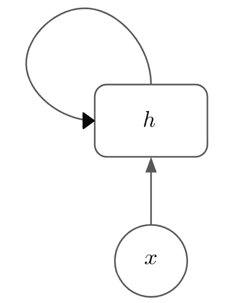
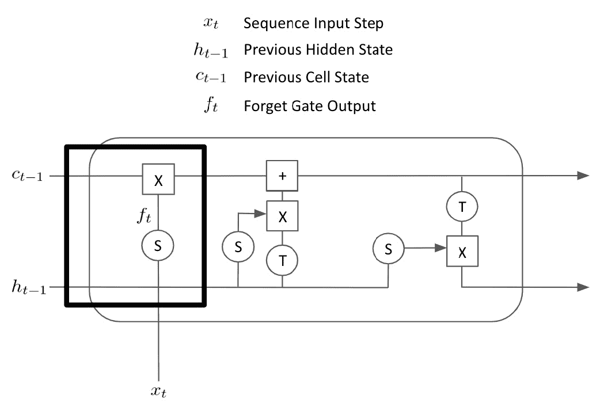
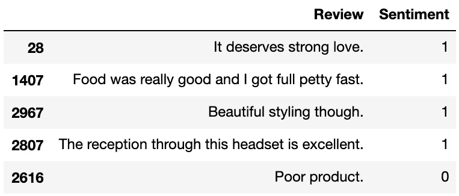
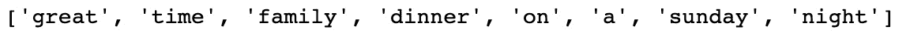
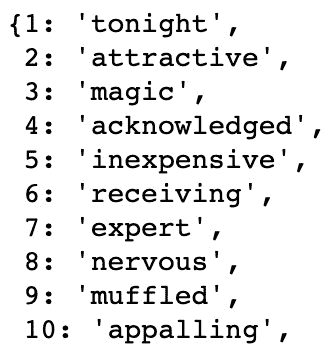
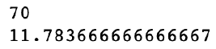
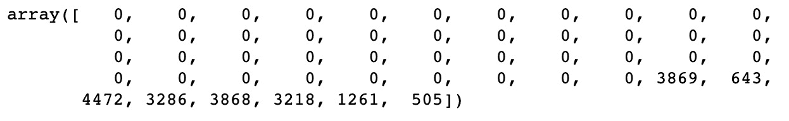
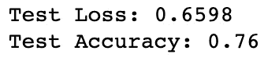

# “第 5 章”：循环神经网络和情感分析

在本章中，我们将研究**循环神经网络**（**RNN**），这是 PyTorch 中基本前馈神经网络的变体，我们在第 1 章“机器学习基础”中学习了如何构建它。 通常，RNN 可用于任何可以将数据表示为序列的任务。 其中包括使用以序列表示的历史数据的时间序列进行股票价格预测之类的事情。 我们通常在 NLP 中使用 RNN，因为可以将文本视为单个单词的序列，并可以对其进行建模。 传统的神经网络将单个向量作为模型的输入，而 RNN 可以采用整个向量序列。 如果我们将文档中的每个单词表示为向量嵌入，则可以将整个文档表示为向量序列（或 3 阶张量）。 然后，我们可以使用 RNN（以及更复杂的 RNN 形式，称为**长短期记忆**（**LSTM**））从我们的数据中学习。

在本章中，我们将介绍 RNN 的基础知识和更高级的 LSTM。 然后，我们将研究情绪分析，并通过一个实际的示例来研究如何使用 PyTorch 构建 LSTM 对文档进行分类。 最后，我们将在简单的云应用程序平台 Heroku 上托管我们的简单模型，这将使​​我们能够使用我们的模型进行预测。

本章涵盖以下主题：

*   建立 RNN
*   使用 LSTM
*   使用 LSTM 构建情绪分析器
*   在 Heroku 上部署应用程序

# 技术要求

本章中使用的所有代码都可以在[这个页面](https://github.com/PacktPublishing/Hands-On-Natural-Language-Processing-with-PyTorch-1.x/tree/master/Chapter5)中找到。 可以从 [www.heroku.com](http://www.heroku.com) 安装 Heroku。 数据来自[这里](https://archive.ics.uci.edu/ml/datasets/Sentiment+Labelled+Sentences)。

# 构建 RNN

RNN 由循环层组成。 尽管它们在许多方面类似于标准前馈神经网络中的全连接层，但这些递归层由隐藏状态组成，该隐藏状态在顺序输入的每个步骤中进行更新。 这意味着对于任何给定的序列，模型都使用隐藏状态初始化，该状态通常表示为一维向量。 然后，将序列的第一步输入模型，并根据一些学习到的参数更新隐藏状态。 然后将第二个单词馈入网络，并根据其他一些学习到的参数再次更新隐藏状态。 重复这些步骤，直到处理完整个序列，并且使我们处于最终的隐藏状态。 该计算使用从先前的计算中继承并更新的隐藏状态来循环执行，这就是为什么我们将这些网络称为循环的原因。 然后，将这个最终的隐藏状态连接到另一个全连接层，并预测最终的分类。

我们的循环层如下所示，其中`h`是隐藏状态，而`x`是我们在序列中各个时间步的输入。 对于每次迭代，我们都会在每个时间步`x`中更新隐藏状态：



图 5.1 –循环层

或者，我们可以将扩展到整个时间步长序列，如下所示：


图 5.2 –时间步序

该层用于`n`时间步长的输入。 我们的隐藏状态在状态`h0`中初始化，然后使用我们的第一个输入`x1`来计算下一个隐藏状态`h1`。 还学习了两组权重矩阵：矩阵`U`和矩阵`W`，矩阵`U`了解隐藏状态如何在时间步之间变化，矩阵`W`隐藏状态。

我们还将 *tanh* 激活函数应用于所得产品，将隐藏状态的值保持在 -1 和 1 之间。用于计算任何隐藏状态的公式`h[t]`变为 以下：


然后在输入序列中的每个时间步重复此操作，此层的最终输出是我们的最后一个隐藏状态`h[n]`。 当我们的网络学习时，我们像以前一样通过网络进行前向传递，以计算最终分类。 然后，我们根据此预测来计算损耗，并像以前一样通过网络反向传播，并随即计算梯度。 反向传播过程在循环层的所有步骤中进行，每个输入步骤和隐藏状态之间的参数都将被学习。

稍后我们将看到，我们实际上可以在每个时间步长都采用隐藏状态，而不是使用最终的隐藏状态，这对于 NLP 中的序列到序列翻译任务很有用。 但是，暂时来说，我们只是将隐藏层作为对网络其余部分的输出。

## 使用 RNN 进行情感分析

在情绪分析的上下文中，我们的模型是根据评论的情绪分析数据集训练的，该数据集由多个文本评论和 0 或 1 的标签组成，具体取决于评论是负面还是正面 。 这意味着我们的模型成为分类任务（两个类别为负/正）。 我们的句子经过一层学习的单词嵌入，以形成包含多个向量的句子的表示（每个单词一个）。 然后将这些向量顺序地馈入我们的 RNN 层，最终的隐藏状态将通过另一个全连接层。 我们的模型输出是介于 0 到 1 之间的单个值，具体取决于我们的模型是根据句子预测的是消极情绪还是正面情绪。 这意味着我们完整的分类模型如下所示：


图 5.3 –分类模型

现在，我们将重点介绍 RNN 的问题之一-爆炸和收缩梯度-以及我们如何使用梯度剪切来对此进行补救。

## 梯度爆炸和收缩

RNN 中我们经常面临的一个问题是**梯度爆炸或收缩**。 我们可以将递归层视为一个非常深的网络。 在计算梯度时，我们在隐藏状态的每次迭代中都这样做。 如果在给定位置的损耗相对于权重的梯度变得很大，则在递归层的所有迭代中前馈时，这将产生乘法效果。 这会导致梯度爆炸，因为它们会很快变得非常大。 如果我们的梯度较大，则可能导致网络不稳定。 另一方面，如果隐藏状态下的梯度非常小，这将再次产生乘法效果，并且梯度将接近 0。这意味着梯度可能变得太小而无法通过梯度下降准确地更新参数， 表示我们的模型无法学习。

我们可以用来防止的梯度爆炸的一种技术是使用**梯度剪切**。 此技术限制了我们的梯度，以防止它们变得太大。 我们只需选择一个超参数`C`，就可以计算出裁剪的梯度，如下所示：


下图显示了两个变量之间的关系：


图 5.4 –梯度裁剪的比较

我们可以用来防止梯度爆炸或消失的另一种技术是缩短输入序列的长度。 循环层的有效深度取决于输入序列的长度，因为序列长度决定了需要对隐藏状态执行多少次迭代更新。 在此过程中，步骤数越少，隐藏状态之间的梯度累积的乘法效果就越小。 通过在模型中智能地选择最大序列长度作为超参数，我们可以帮助防止梯度爆炸和消失。

# LSTM 介绍

尽管 RNN 允许我们将单词序列用作模型输入，但它们远非完美。 RNN 有两个主要缺陷，可以使用更高级的 RNN 版本 **LSTM** 来部分弥补。

RNN 的基本结构意味着它们很难长期保留信息。 考虑一个 20 个字长的句子。 从影响初始隐藏状态的句子中的第一个单词到句子中的最后一个单词，我们的隐藏状态被更新 20 次。 从句子的开头到最终的隐藏状态，RNN 很难保留句子开头的单词信息。 这意味着 RNN 不太擅长捕获序列中的长期依赖关系。 这也与前面提到的消失的梯度问题有关，在梯度问题中，通过向量的稀疏序列反向传播非常无效。

考虑一段较长的段落，我们试图预测下一个单词。 句子的开头是`I study math…`，而结尾处是`my final exam is in….`中。 直观地，我们希望下一个单词是`math`或某些与数学相关的字段。 但是，在较长序列的 RNN 模型中，由于需要多个更新步骤，我们的隐藏状态可能难以在到达句子结尾时保留句子开头的信息。

我们还应该注意，RNN 在捕获整个句子中单词的上下文方面很差。 在查看 N 元组模型时，我们前面已经看到，一个单词在句子中的含义取决于它在句子中的上下文，上下文取决于它之前出现的单词和之后出现的单词。 在 RNN 中，我们的隐藏状态仅在一个方向上更新。 在单个前向传递中，我们的隐藏状态被初始化，并且序列中的第一个单词被传递到其中。 然后依次对句子中的所有后续单词重复此过程，直到我们处于最终的隐藏状态。 这意味着对于句子中的任何给定单词，我们只考虑了到该点之前在句子中出现的单词的累积效果。 我们不会考虑其后的任何单词，这意味着我们不会捕获句子中每个单词的完整上下文。

在另一个示例中，我们再次希望预测句子中丢失的单词，但是现在它出现在开头而不是结尾。 `I grew up in…so I can speak fluent Dutch.` 在这里，我们可以凭直觉猜测该人在荷兰长大，这是因为他们会说荷兰语。 但是，由于 RNN 会顺序分析此信息，因此它将仅使用`I grew up in…`进行预测，而缺少句子中的其他关键上下文。

使用 LSTM 可以部分解决这两个问题。

## 使用 LSTM

LSTM 是 RNN 的更高级版本，并包含两个额外的属性-**更新门**和**遗忘门**。 这两个附加项使易于网络学习长期依赖性。 考虑以下电影评论：

```py
The film was amazing. I went to see it with my wife and my daughters on Tuesday afternoon. Although I didn't expect it to be very entertaining, it turned out to be loads of fun. We would definitely go back and see it again given the chance.
```

在情感分析中，很明显，并不是句子中的所有单词在确定是正面评论还是负面评论时都相关。 我们将重复这句话，但是这次重点介绍与评估评论情绪相关的词：

```py
The film was amazing. I went to see it with my wife and my daughters on Tuesday afternoon. Although I didn't expect it to be very entertaining, it turned out to be loads of fun. We would definitely go back and see it again given the chance.
```

LSTM 试图做到这一点—在忘记所有不相关信息的同时记住句子中的相关单词。 通过这样做，它可以阻止无关信息稀释相关信息，这意味着可以更好地了解长序列的长期依赖性。

LSTM 与 RNN 的结构非常相似。 虽然 LSTM 的各个步骤之间存在一个隐藏状态，但 LSTM 单元本身的内部工作方式不同于 RNN：


图 5.5 – LSTM 单元

## LSTM 细胞

尽管 RNN 单元仅采用之前的隐藏状态和新的输入步骤，并使用一些学习到的参数来计算下一个隐藏状态，但 LSTM 单元的内部工作却要复杂得多：


图 5.6 – LSTM 单元的内部工作原理

尽管这看起来比 RNN 更加令人生畏，但我们将依次解释 LSTM 单元的每个组件。 我们首先来看**遗忘门**（由粗体矩形指示）：



图 5.7 –遗忘门

遗忘门本质上是学习要忘记序列中的哪些元素。 先前的隐藏状态`h[t-1]`和最新的输入步骤`x1`被串联在一起，并通过了在遗忘门和 Sigmoid函数上获得的权重矩阵 将值压缩为 0 到 1 之间的值。将得到的矩阵`f[t]`逐点乘以上一步`c[t-1]`单元状态。 这有效地将掩码应用于先前的小区状态，使得仅来自先前的小区状态的相关信息被提出。

接下来，我们将查看**输入门**：


图 5.8 –输入门

输入门再次采用串联的先前隐藏状态`h[t-1]`和当前序列输入`x[t]`，并将其通过具有学习参数的 Sigmoid函数，从而输出 另一个矩阵`i[t]`由 0 到 1 之间的值组成。串联的隐藏状态和序列输入也通过 tanh 函数，该函数将输出压缩在 -1 和 1 之间。 通过`i[t]`矩阵。 这意味着生成`i[t]`所需的学习参数可以有效地了解应从当前时间步长将哪些元素保留在我们的细胞状态中。 然后将其添加到当前单元状态以获得最终单元状态，该状态将继续进行到下一个时间步骤。

最后，我们有是 LSTM 单元的最后一个元素-**输出门**：


图 5.9 –输出门

输出门计算 LSTM 单元的最终输出-单元状态和隐藏状态，并继续进行下一步。 单元状态`c[t]`与前两个步骤相同，是遗忘门和输入门的乘积。 通过获取串联的先前隐藏状态`h[t-1]`和当前时间步输入`x[t]`，可以计算出最终隐藏状态`h[t]`，并通过具有一些学习参数的 Sigmoid函数来获得输出门输出`o[t]`。 最终单元状态`c[t]`通过 tanh 函数并乘以输出门输出`o[t]`，以计算最终隐藏状态`h[t]`。 这意味着在输出门上学习到的参数可以有效地控制将先前隐藏状态和当前输出中的哪些元素与最终单元状态进行组合，以作为新的隐藏状态延续到下一个时间步长。

在我们的前向遍历中，我们简单地遍历模型，初始化我们的隐藏状态和单元状态，并在每个时间步使用 LSTM 单元对其进行更新，直到剩下最终的隐藏状态为止，该状态将输出到神经元的下一层 网络。 通过在 LSTM 的所有层中进行反向传播，我们可以计算相对于网络损耗的梯度，因此我们知道通过梯度下降来更新参数的方向。 我们得到几种矩阵或参数-一种用于输入门，一种用于输出门，以及一种用于遗忘门。

因为我们获得的参数要比简单的 RNN 多，并且我们的计算图更加复杂，所以与简单的 RNN 相比，通过网络反向传播和更新权重的过程可能会花费更长的时间。 但是，尽管训练时间更长，但是我们已经证明，与传统的 RNN 相比，LSTM 具有显着的优势，因为输出门，输入门和遗忘门都结合在一起，使模型能够确定应使用输入的哪些元素。 更新隐藏状态，并且以后应该忘记隐藏状态的哪些元素，这意味着该模型能够更好地形成长期依存关系并保留先前序列步骤中的信息。

## 双向 LSTM

前面我们曾提到，简单 RNN 的缺点是，由于它们只是向后看，它们无法捕获句子中单词的完整上下文。 在 RNN 的每个时间步骤中，仅考虑先前看到的单词，而不考虑句子中接下来出现的单词。 虽然基本 LSTM 类似地是向后的，但我们可以使用 LSTM 的改进版本，称为**双向 LSTM**，它在序列中的每个时间步都考虑它之前和之后的词。

双向 LSTM 同时处理规则顺序和反向顺序的序列，并保持两个隐藏状态。 我们将前向隐藏状态称为`f[t]`，并将`r[t]`用作反向隐藏状态：


图 5.10 –双向 LSTM 过程

在这里，我们可以看到我们在整个过程中都保持了这两个隐藏状态，并使用它们来计算最终的隐藏状态`h[t]`。 因此，如果我们希望计算时间步`t`的最终隐藏状态，则可以使用前向隐藏状态`f[t]`，该状态已看到所有单词，包括输入`x[t]`，以及反向隐藏状态`r[t]`，其中已经看到了`x[t]`之后的所有单词。 因此，我们最终的隐藏状态`h[t]`包含隐藏状态，这些状态已经看到了句子中的所有单词，而不仅仅是出现在时间步`t`之前的单词。 这意味着可以更好地捕获整个句子中任何给定单词的上下文。 事实证明，双向 LSTM 可以在多个 NLP 任务上提供比常规单向 LSTM 更高的性能。

# 使用 LSTM 构建情感分析器

现在，我们将研究如何构建自己的简单 LSTM，以根据句子的情感对句子进行分类。 我们将在 3,000 条评论被归为肯定或否定的评论的数据集上训练模型。 这些评论来自三个不同的来源（电影评论，产品评论和位置评论），以确保我们的情感分析器功能强大。 数据集是平衡的，因此包含 1,500 个正面评论和 1,500 个负面评论。 我们将从导入数据集并对其进行检查开始：

```py
with open("sentiment labelled sentences/sentiment.txt") as f:
    reviews = f.read()
    
data = pd.DataFrame([review.split('\t') for review in                      reviews.split('\n')])
data.columns = ['Review','Sentiment']
data = data.sample(frac=1)
```

这将返回以下输出：



图 5.11 –数据集的输出

我们从文件中读取数据集。 我们的数据集是制表符分隔的，因此我们将其与制表符和新行字符分开。 我们重命名我们的列，然后使用示例函数随机地随机整理数据。 查看我们的数据集，我们需要做的第一件事是对句子进行预处理，以将其输入到我们的 LSTM 模型中。

## 预处理数据

首先，我们创建一个函数标记数据，将每个评论分为单个预处理词的列表。 我们遍历数据集，并为每条评论删除所有标点符号，将字母转换为小写字母，并删除任何尾随空格。 然后，我们使用 NLTK 令牌生成器根据此预处理文本创建单个令牌：

```py
def split_words_reviews(data):
    text = list(data['Review'].values)
    clean_text = []
    for t in text:
        clean_text.append(t.translate(str.maketrans('', '',                   punctuation)).lower().rstrip())
    tokenized = [word_tokenize(x) for x in clean_text]
    all_text = []
    for tokens in tokenized:
        for t in tokens:
            all_text.append(t)
    return tokenized, set(all_text)
reviews, vocab = split_words_reviews(data)
reviews[0]
```

这将产生以下输出：



图 5.12 – NTLK 标记化的输出

我们返回评论本身，以及所有评论中的所有单词集（即词汇/语料库），我们将使用它们来创建词汇表。

为了充分准备将句子输入神经网络，我们必须将单词转换为数字。 为了做到这一点，我们创建了两个字典，这将使我们能够将数据从单词转换为索引以及从索引转换为单词。 为此，我们只需遍历语料库并为每个唯一单词分配一个索引：

```py
def create_dictionaries(words):
    word_to_int_dict = {w:i+1 for i, w in enumerate(words)}
    int_to_word_dict = {i:w for w, i in word_to_int_dict.                            items()}
    return word_to_int_dict, int_to_word_dict
word_to_int_dict, int_to_word_dict = create_dictionaries(vocab)
int_to_word_dict
```

这给出以下输出：



图 5.13 –为每个单词分配一个索引

我们的神经网络将接受固定长度的输入； 但是，如果我们浏览我们的评论，我们会发现我们的评论都是不同长度的。 为了确保所有输入的长度相同，我们将*填充*我们的输入句子。 这实质上意味着我们将空标记添加到较短的句子中，以便所有句子的长度相同。 我们必须首先决定要实现的填充长度。 我们首先计算输入评论中句子的最大长度以及平均长度：

```py
print(np.max([len(x) for x in reviews]))
print(np.mean([len(x) for x in reviews]))
```

这给出了以下内容：



图 5.14 –长度值

我们可以看到最长的句子是`70`个字长，平均句子长度是`11.78`。 为了捕获所有句子中的所有信息，我们希望填充所有句子，使它们的长度为 70。但是，使用更长的句子意味着更长的序列，这会使我们的 LSTM 层变得更深。 这意味着模型训练需要更长的时间，因为我们必须通过更多层反向传播梯度，但是这也意味着我们输入的很大一部分只是稀疏并且充满了空令牌，这使得从数据中学习的效率大大降低 。 我们的最大句子长度远大于我们的平均句子长度，这说明了这一点。 为了捕获我们大部分的句子信息而不会不必要地填充我们的输入并使它们太稀疏，我们选择使用`50`的输入大小。 您可能希望尝试在`20`和`70`之间使用不同的输入大小，以了解这如何影响模型性能。

我们将创建一个函数，使我们能够填充句子，使它们的大小相同。 对于短于序列长度的评论，我们用空标记填充它们。 对于长度超过序列长度的评论，我们只需丢弃超过最大序列长度的所有标记：

```py
def pad_text(tokenized_reviews, seq_length):
    
    reviews = []
    
    for review in tokenized_reviews:
        if len(review) >= seq_length:
            reviews.append(review[:seq_length])
        else:
            reviews.append(['']*(seq_length-len(review)) +                    review)
        
    return np.array(reviews)
padded_sentences = pad_text(reviews, seq_length = 50)
padded_sentences[0]
```

我们的填充语句如下所示：


图 5.15 –填充句子

我们必须进行进一步的调整，以允许在模型中使用空令牌。 当前，我们的词汇词典不知道如何将空令牌转换为整数以在我们的网络中使用。 因此，我们将它们手动添加到索引为`0`的字典中，这意味着当将空令牌输入模型时，它们的值将为`0`：

```py
int_to_word_dict[0] = ''
word_to_int_dict[''] = 0
```

现在，我们几乎可以开始训练模型了。 我们执行预处理的最后一步，并将所有填充语句编码为数字序列，以馈入神经网络。 这意味着前面的填充语句现在看起来像这样：

```py
encoded_sentences = np.array([[word_to_int_dict[word] for word in review] for review in padded_sentences])
encoded_sentences[0]
```

我们的编码语句表示如下：



图 5.16 –编码句子

现在我们已经将所有输入序列编码为数值向量，我们准备开始设计模型架构。

## 模型架构

我们的模型将由几个主要部分组成。 除了许多神经网络通用的输入和输出层之外，我们首先需要一个**嵌入层**。 这样我们的模型就可以学习正在训练的单词的向量表示形式。 我们可以选择使用预先计算的嵌入（例如 GLoVe），但是出于演示目的，我们将训练自己的嵌入层。 我们的输入序列通过输入层进行馈送，并作为向量序列出现。

将这些向量序列送入我们的 **LSTM 层**。 如本章前面所详细解释的那样，LSTM 层从我们的嵌入序列中顺序学习，并输出代表 LSTM 层最终隐藏状态的单个向量输出。 在最终输出节点预测值介于 0 到 1 之间之前，该最终隐藏状态最终通过另一个**隐藏层**传递，指示输入序列是肯定还是否定。 这意味着我们的模型架构看起来像这样：


图 5.17 –模型架构

现在，我们将演示如何使用 PyTorch 从头开始对该模型进行编码。 我们创建了一个名为`SentimentLSTM`的类，该类继承自`nn.Module`类。 我们将`__init__`参数定义为词汇表的大小，模型将具有的 LSTM 层数以及模型隐藏状态的大小：

```py
class SentimentLSTM(nn.Module):
    
    def __init__(
        self, n_vocab, n_embed, 
        n_hidden, n_output, n_layers, 
        drop_p = 0.8
    ):
        super().__init__()
        
        self.n_vocab = n_vocab  
        self.n_layers = n_layers
        self.n_hidden = n_hidden
```

然后，我们定义网络的每个层。 首先，我们定义嵌入层，该层的词汇量为字长，嵌入向量的大小为`n_embed`超参数。 我们的 LSTM 层是使用嵌入层的输出向量大小，模型的隐藏状态的长度以及 LSTM 层将具有的层数来定义的。 我们还添加了一个参数来指定可以对 LSTM 进行批量数据训练，并添加一个参数以允许我们通过辍学实现网络正则化。 我们用概率`drop_p`（将在模型创建时指定的超参数）定义另外一个辍学层，以及对最终全连接层和输出/预测节点的定义（具有 Sigmoid激活函数） ：

```py
self.embedding = nn.Embedding(n_vocab, n_embed)
        self.lstm = nn.LSTM(
            n_embed, n_hidden, n_layers, 
            batch_first = True, dropout = drop_p
        )
        self.dropout = nn.Dropout(drop_p)
        self.fc = nn.Linear(n_hidden, n_output)
        self.sigmoid = nn.Sigmoid()
```

接下来，我们需要在模型类中定义正向传递。 在此前向传递中，我们只是将一层的输出链接在一起，成为下一层的输入。 在这里，我们可以看到我们的嵌入层将`input_words`作为输入并输出了嵌入的单词。 然后，我们的 LSTM 层将嵌入的单词作为输入并输出`lstm_out`。 唯一的区别是，我们使用`view()`将 LSTM 输出中的张量整形为正确的大小，以输入到全连接层中。 重塑隐藏层的输出以匹配输出节点的输出也是如此。 请注意，我们的输出将返回`class = 0`和`class = 1`的预测，因此我们将输出切为仅返回`class = 1`的预测— 也就是说，我们的句子为正的概率为：

```py
def forward (self, input_words):
                          
        embedded_words = self.embedding(input_words)
        lstm_out, h = self.lstm(embedded_words)
        lstm_out = self.dropout(lstm_out)
        lstm_out = lstm_out.contiguous().view(-1, self.n_hidden)
        fc_out = self.fc(lstm_out)                  
        sigmoid_out = self.sigmoid(fc_out)              
        sigmoid_out = sigmoid_out.view(batch_size, -1)  
        
        sigmoid_last = sigmoid_out[:, -1]
        
        return sigmoid_last, h
```

我们还定义了一个名为`init_hidden()`的函数，该函数使用批量大小的尺寸初始化隐藏层。 如果我们愿意的话，这使我们的模型可以同时训练和预测许多句子，而不仅仅是一次训练一个句子。 请注意，此处将`device`定义为`"cpu"`，以便在本地处理器上运行它。 但是，也可以将其设置为启用了 CUDA 的 GPU，以便在拥有 GPU 的 GPU 上进行训练：

```py
def init_hidden (self, batch_size):
        
        device = "cpu"
        weights = next(self.parameters()).data
        h = (weights.new(self.n_layers, batch_size,\
                 self.n_hidden).zero_().to(device),\
             weights.new(self.n_layers, batch_size,\
                 self.n_hidden).zero_().to(device))
        
        return h
```

然后，我们通过创建`SentimentLSTM`类的新实例来初始化模型。 我们传递 vocab 的大小，嵌入的大小，隐藏状态的大小，输出大小以及 LSTM 中的层数：

```py
n_vocab = len(word_to_int_dict)
n_embed = 50
n_hidden = 100
n_output = 1
n_layers = 2
net = SentimentLSTM(n_vocab, n_embed, n_hidden, n_output, n_layers)
```

现在我们已完全定义了模型架构，是时候开始训练我们的模型了。

## 训练模型

要训​​练我们的模型，我们必须首先定义我们的数据集。 我们将使用训练数据集来训练模型，在验证集的每一步上评估训练后的模型，然后最后使用看不见的测试数据集来测量模型的最终性能。 我们使用与验证训练分开的测试集的原因是，我们可能希望基于针对验证集的损失来微调模型超参数。 如果这样做，我们可能最终会选择对于该特定验证数据而言性能最佳的超参数。 我们根据看不见的测试集评估最终时间，以确保我们的模型能够很好地推广到训练循环任何部分之前从未见过的数据。

我们已经将模型输入（`x`）定义为`encode_sentences`，但是我们还必须定义模型输出（`y`）。 我们这样做很简单，如下所示：

```py
labels = np.array([int(x) for x in data['Sentiment'].values])
```

接下来，我们定义训练和验证比率。 在这种情况下，我们将在 80% 的数据上训练模型，在另外 10% 的数据上进行验证，最后在剩余的 10% 的数据上进行测试：

```py
train_ratio = 0.8
valid_ratio = (1 - train_ratio)/2
```

然后，我们使用这些比率对数据进行切片并将其转换为张量，然后转换为张量数据集：

```py
total = len(encoded_sentences)
train_cutoff = int(total * train_ratio)
valid_cutoff = int(total * (1 - valid_ratio))
train_x, train_y = torch.Tensor(encoded_sentences[:train_cutoff]).long(), torch.Tensor(labels[:train_cutoff]).long()
valid_x, valid_y = torch.Tensor(encoded_sentences[train_cutoff : valid_cutoff]).long(), torch.Tensor(labels[train_cutoff : valid_cutoff]).long()
test_x, test_y = torch.Tensor(encoded_sentences[valid_cutoff:]).long(), torch.Tensor(labels[valid_cutoff:])
train_data = TensorDataset(train_x, train_y)
valid_data = TensorDataset(valid_x, valid_y)
test_data = TensorDataset(test_x, test_y)
```

然后，我们使用这些数据集创建 PyTorch `DataLoader`对象。 `DataLoader`允许我们使用`batch_size`参数批量处理数据集，从而可以轻松地将不同的批量大小传递给我们的模型。 在这种情况下，我们将使其保持简单，并设置`batch_size = 1`，这意味着我们的模型将针对单个句子进行训练，而不是使用大量数据。 我们还选择随机调整`DataLoader`对象，以便数据以随机顺序（而不是每个时期相同）通过神经网络传递，从而有可能从训练顺序中消除任何有偏差的结果：

```py
batch_size = 1
train_loader = DataLoader(train_data, batch_size = batch_size, shuffle = True)
valid_loader = DataLoader(valid_data, batch_size = batch_size, shuffle = True)
test_loader = DataLoader(test_data, batch_size = batch_size, shuffle = True)
```

现在我们已经为我们的三个数据集定义了`DataLoader`对象，接下来我们定义训练循环。 我们首先定义许多超参数，这些超参数将在我们的训练循环中使用。 最重要的是，我们将损失函数定义为二进制交叉熵（因为我们正在处理单个二进制类别的预测），并且将优化器定义为 **Adam**，学习率为`0.001`。 我们还定义了模型以运行较短的时间（以节省时间），并设置`clip = 5`来定义梯度裁剪：

```py
print_every = 2400
step = 0
n_epochs = 3
clip = 5  
criterion = nn.BCELoss()
optimizer = optim.Adam(net.parameters(), lr = 0.001)
```

我们的训练循环的主体如下所示：

```py
for epoch in range(n_epochs):
    h = net.init_hidden(batch_size)
    
    for inputs, labels in train_loader:
        step += 1  
        net.zero_grad()
        output, h = net(inputs)
        loss = criterion(output.squeeze(), labels.float())
        loss.backward()
        nn.utils.clip_grad_norm(net.parameters(), clip)
        optimizer.step()
```

在这里，我们只训练了多个时期的模型，对于每个时期，我们首先使用批量大小参数初始化隐藏层。 在这种情况下，我们设置`batch_size = 1`，因为我们一次只训练我们的模型一个句子。 对于火车装载机中的每批输入语句和标签，我们首先将梯度归零（以防止它们累积），并使用模型的当前状态使用数据的正向传递来计算模型输出。 然后使用此输出，使用模型的预测输出和正确的标签来计算损失。 然后，我们通过网络对该损失进行反向传递，以计算每个阶段的梯度。 接下来，我们使用`grad_clip_norm()`函数裁剪梯度，因为这将阻止梯度爆炸，如本章前面所述。 我们定义了`clip = 5`，这意味着任何给定节点的最大梯度为`5`。 最后，我们通过调用`optimizer.step()`，使用在向后传递中计算出的梯度来更新权重。

如果我们自己运行此循环，我们将训练我们的模型。 但是，我们想在每个时期之后评估模型的性能，以便根据验证数据集确定模型的性能。 我们这样做如下：

```py
if (step % print_every) == 0:            
            net.eval()
            valid_losses = []
            for v_inputs, v_labels in valid_loader:
                      
                v_output, v_h = net(v_inputs)
                v_loss = criterion(v_output.squeeze(),                                    v_labels.float())
                valid_losses.append(v_loss.item())
            print("Epoch: {}/{}".format((epoch+1), n_epochs),
                  "Step: {}".format(step),
                  "Training Loss: {:.4f}".format(loss.item()),
                  "Validation Loss: {:.4f}".format(np.                                     mean(valid_losses)))
            net.train()
```

这意味着在每个时期结束时，我们的模型都会调用`net.eval()`冻结模型的权重，并像以前一样使用我们的数据进行前向传递。 请注意，当我们处于评估模式时，也不会应用辍学。 但是，这次，我们使用验证加载程序，而不是使用训练数据加载程序。 通过这样做，我们可以在我们的验证数据集中计算模型当前状态的总损失。 最后，我们打印结果并调用`net.train()`解冻模型的权重，以便我们可以在下一个纪元再次进行训练。 我们的输出看起来像，如下所示：


图 5.18 –训练模型

最后，我们可以保存我们的模型以备将来使用：

```py
torch.save(net.state_dict(), 'model.pkl')
```

在为三个时期训练了我们的模型之后，我们注意到了两个主要方面。 我们将首先从好消息开始-我们的模型正在学习一些东西！ 我们的训练损失不仅下降了，而且在每个时期之后，我们在验证集上的损失也下降了。 这意味着我们的模型仅在三个时期后就可以更好地预测看不见的数据的情绪！ 坏消息是，我们的模型过拟合。 我们的训练损失比验证损失要低得多，这表明虽然我们的模型已经学会了如何很好地预测训练数据集，但这并不能推广到看不见的数据集。 预期会发生这种情况，因为我们使用的训练数据非常少（仅 2,400 个训练语句）。 当我们训练整个嵌入层时，很可能许多单词在训练集中只出现一次，而在验证集中却没有出现，反之亦然，这使得该模型几乎不可能归纳出其中所有不同的单词 我们的语料库。 在实践中，我们希望在更大的数据集上训练我们的模型，以使我们的模型学习如何更好地归纳。 我们还在很短的时间内训练了该模型，并且没有执行超参数调整来确定模型的最佳迭代。 随意尝试更改模型中的某些参数（例如训练时间，隐藏状态大小，嵌入大小等），以提高模型的性能。

尽管我们的模型过拟合，但它仍然学到了一些东西。 现在，我们希望在最终的测试数据集上评估我们的模型。 我们使用之前定义的测试加载器对数据执行了最后一次传递。 在此过程中，我们遍历所有测试数据并使用最终模型进行预测：

```py
net.eval()
test_losses = []
num_correct = 0
for inputs, labels in test_loader:
    test_output, test_h = net(inputs)
    loss = criterion(test_output, labels)
    test_losses.append(loss.item())
    
    preds = torch.round(test_output.squeeze())
    correct_tensor = preds.eq(labels.float().view_as(preds))
    correct = np.squeeze(correct_tensor.numpy())
    num_correct += np.sum(correct)
    
print("Test Loss: {:.4f}".format(np.mean(test_losses)))
print("Test Accuracy: {:.2f}".format(num_correct/len(test_loader.dataset)))
```

我们在测试数据集上的表现如下：



图 5.19 –输出值

然后，我们将模型预测与真实标签进行比较，以获得`correct_tensor`，这是一个评估我们模型的每个预测是否正确的向量。 然后，我们对该向量求和，然后将其除以其长度，以获得模型的总精度。 在这里，我们获得了 76% 的准确率。 尽管我们的模型肯定还远非完美，但鉴于我们的训练量很小且训练时间有限，这一点也不差！ 仅用于说明从 NLP 数据学习时 LSTM 的有用性。 接下来，我们将展示如何使用模型从新数据进行预测。

## 使用我们的模型进行预测

既然我们已经有了训练有素的模型，那么应该可以对一个新句子重复我们的预处理步骤，并将其传递给我们的模型，并对其情感进行预测。 我们首先创建一个函数来预处理输入句子以预测：

```py
def preprocess_review(review):
    review = review.translate(str.maketrans('', '', punctuation)).lower().rstrip()
    tokenized = word_tokenize(review)
    if len(tokenized) >= 50:
        review = tokenized[:50]
    else:
        review= ['0']*(50-len(tokenized)) + tokenized
    
    final = []
    
    for token in review:
        try:
            final.append(word_to_int_dict[token])
            
        except:
            final.append(word_to_int_dict[''])
        
    return final
```

我们删除标点符号和尾随空格，将字母转换为小写，并像以前一样对输入句子进行标记化。 我们将句子填充到长度为`50`的序列上，然后使用我们的预先计算的字典将的标记转换为数值。 请注意，我们的输入内容可能包含我们的网络从未见过的新词。 在这种情况下，我们的函数会将它们视为空令牌。

接下来，我们创建实际的`predict()`函数。 我们预处理输入检查，将其转换为张量，然后将其传递给数据加载器。 然后，我们遍历该数据加载器（即使它仅包含一个句子），并通过我们的网络进行审查以获得预测。 最后，我们评估我们的预测并打印出正面还是负面的评价：

```py
def predict(review):
    net.eval()
    words = np.array([preprocess_review(review)])
    padded_words = torch.from_numpy(words)
    pred_loader = DataLoader(padded_words, batch_size = 1, shuffle = True)
    for x in pred_loader:
        output = net(x)[0].item()
    
    msg = (
        "This is a positive review." 
        if output >= 0.5 
        else "This is a negative review."
    )
    print(msg)
    print('Prediction = ' + str(output))
```

最后，我们在评论上调用`predict()`来做出预测：

```py
predict("The film was good")
```

这将产生以下输出：


图 5.20 –正值上的预测字符串

我们还尝试对负值使用`predict()`：

```py
predict("It was not good")
```

结果为以下输出：


图 5.21 –负值上的预测字符串

现在，我们已经建立了一个 LSTM 模型，可以从头开始进行情感分析。 尽管我们的模型远非完美，但我们已演示了如何获取带有情感标签的评论并训练模型以能够对新评论做出预测。 接下来，我们将展示如何在 Heroku 云平台上托管我们的模型，以便其他人可以使用您的模型进行预测

# 在 Heroku 上部署应用程序

现在，我们已经在本地计算机上训练了模型，我们可以使用它来进行预测。 但是，如果您希望其他人能够使用您的模型进行预测，则不一定有好处。 如果我们将模型托管在基于云的平台（例如 Heroku）上并创建基本的 API，其他人将能够调用该 API 以使用我们的模型进行预测。

## 介绍 Heroku

**Heroku** 是基于云的平台，您可以在其中托管自己的基本程序。 虽然 Heroku 的免费层最大上传大小为 500 MB，并且处理能力有限，但这足以让我们托管模型并创建基本 API，以便使用模型进行预测。

第一步是在 Heroku 上创建一个免费帐户并安装 Heroku 应用。 然后，在命令行中键入以下命令：

```py
heroku login
```

使用您的帐户详细信息登录。 然后，通过键入以下命令来创建一个新的 **heroku** 项目：

```py
heroku create sentiment-analysis-flask-api
```

请注意，所有项目名称都必须是唯一的，因此您将需要选择一个非`sentiment-analysis-flask-api`的项目名称。

我们的第一步是使用 Flask 构建基本 API。

## 使用 Flask 创建 API-文件结构

使用 Flask 创建 API 非常简单，因为 Flask 包含制作 API 所需的默认模板：

首先，在命令行中，为 flask API 创建新文件夹并导航至该文件夹：

```py
mkdir flaskAPI
cd flaskAPI
```

然后，在文件夹中创建一个虚拟环境。 这将是您的 API 将使用的 Python 环境：

```py
python3 -m venv vir_env
```

在您的环境中，使用`pip`安装所需的所有软件包。 这包括您在模型程序中使用的所有软件包，例如 NLTK， **Pandas**，NumPy 和 PyTorch，以及运行 API 所需的软件包，例如 Flask 和 Gunicorn：

```py
pip install nltk pandas numpy torch flask gunicorn
```

然后，我们创建 API 将使用的需求列表。 请注意，当我们将其上传到 Heroku 时，Heroku 将自动下载并安装此列表中的所有软件包。 我们可以通过键入以下命令来做到这一点：

```py
pip freeze > requirements.txt
```

我们需要进行的一项调整是，用以下内容替换`requirements.txt`文件中的`torch`行：

```py
https://download.pytorch.org/whl/cpu/torch-1.3.1%2Bcpu-cp37-cp37m-linux_x86_64.whl
```

这是仅包含 CPU 实现的 PyTorch 版本的 wheel 文件的链接。 包括完整 GPU 支持的 PyTorch 完整版的大小超过 500 MB，因此它将无法在免费的 Heroku 群集上运行。 使用此更紧凑的 PyTorch 版本意味着您仍然可以在 Heroku 上使用 PyTorch 运行模型。 最后，我们在文件夹中创建另外三个文件，以及模型的最终目录：

```py
touch app.py
touch Procfile
touch wsgi.py
mkdir models
```

现在，我们已经创建了 Flash API 所需的所有文件，并且准备开始对文件进行调整。

## 使用 Flask 创建 API-API 文件

在`app.py`文件中，我们可以开始构建我们的 API：

1.  我们首先进行所有的导入，并创建一个`predict`路由。这样我们就可以用`predict`参数来调用我们的 API，以便在 API 中运行`predict()`方法。

    ```py
    import flask
    from flask import Flask, jsonify, request
    import json
    import pandas as pd
    from string import punctuation
    import numpy as np
    import torch
    from nltk.tokenize import word_tokenize
    from torch.utils.data import TensorDataset, DataLoader
    from torch import nn
    from torch import optim
    app = Flask(__name__)
    @app.route('/predict', methods=['GET'])
    ```

2.  接下来，我们在`app.py`文件中定义·predict()方法。这在很大程度上是我们模型文件的翻版，所以为了避免代码重复，建议你查看本章“技术需求”部分链接的 GitHub 仓库中完成的`app.py`文件。你会发现有几行额外的内容。首先，在`preprocess_review()`函数中，我们会看到以下几行。

    ```py
    with open('models/word_to_int_dict.json') as handle:
    word_to_int_dict = json.load(handle)
    ```

    这将使用我们在主模型笔记本中计算的`word_to_int`字典并将其加载到我们的模型中。 这样我们的词索引与我们训练的模型一致。 然后，我们使用该词典将输入文本转换为编码序列。 确保从原始笔记本输出中提取`word_to_int_dict.json`文件，并将其放置在`model`目录中。

3.  同样，我们也必须从我们训练的模型中加载权重。我们首先定义我们的`SentimentLSTM`类，然后使用`torch.load`加载我们的权重。我们将使用我们原始笔记本中的`.pkl`文件，所以一定要把它也放在`models`目录下。

    ```py
    model = SentimentLSTM(5401, 50, 100, 1, 2)
    model.load_state_dict(torch.load("models/model_nlp.pkl"))
    ```

4.  我们还必须定义我们 API 的输入和输出。我们希望我们的模型能够从 API 中获取输入，并将其传递给我们的`precess_review()`函数。我们使用`request.get_json()`来完成。

    ```py
    request_json = request.get_json()
    i = request_json['input']
    words = np.array([preprocess_review(review=i)])
    ```

5.  为了定义我们的输出，我们返回一个 JSON 响应，由我们模型的输出和响应代码`200`组成，这就是我们预测函数返回的内容。

    ```py
    output = model(x)[0].item()
    response = json.dumps({'response': output})
    return response, 200
    ```

6.  随着我们的应用程序主体的完成，我们还必须添加两件额外的事情来使我们的 API 运行。首先，我们必须在`wsgi.py`文件中添加以下内容。

    ```py
    from app import app as application
    if __name__ == "__main__":
        application.run()
    ```

7.  最后，在我们的 Procfile 中添加以下内容。

    ```py
    web: gunicorn app:app --preload
    ```

这就是应用程序运行所需要的全部。 我们可以先使用以下命令在本地启动 API，以测试 API 是否运行：

```py
gunicorn --bind 0.0.0.0:8080 wsgi:application -w 1
```

API 在本地运行后，我们可以通过向其传递一个句子来预测结果来向 API 发出请求：

```py
curl -X GET http://0.0.0.0:8080/predict -H "Content-Type: application/json" -d '{"input":"the film was good"}'
```

如果一切正常，您应该从 API 收到预测。 现在我们已经在本地进行 API 预测，现在是将其托管在 Heroku 上的时候了，以便我们可以在云中进行预测。

## 使用 Flask 创建 API-在 Heroku 上托管

我们首先需要将文件提交到 Heroku，其方式类似于使用 GitHub 提交文件的方式。 我们只需运行以下命令，即可将工作中的`flaskAPI`目录定义为`git`文件夹：

```py
git init
```

在此文件夹中，我们将以下代码添加到`.gitignore`文件中，这将阻止我们将不必要的文件添加到 Heroku 存储库中：

```py
vir_env
__pycache__/
.DS_Store
```

最后，我们添加第一个`commit`函数，并将其推送到 **heroku** 项目中：

```py
git add . -A
git commit -m 'commit message here'
git push heroku master
```

编译可能会花费一些时间，因为系统不仅必须将所有文件从本地目录复制到 Heroku，而且 Heroku 将自动构建您定义的环境，安装所有必需的程序包并运行您的 API。

现在，如果一切正常，您的 API 将自动在 Heroku 云上运行。 为了做出预测，您只需使用项目名称而不是`sentiment-analysis-flask-api`向 API 发出请求：

```py
curl -X GET https://sentiment-analysis-flask-api.herokuapp.com/predict -H "Content-Type: application/json" -d '{"input":"the film was good"}'
```

您的应用程序现在将根据模型返回预测。 恭喜，您现在已经学会了如何从头训练 LSTM 模型，将其上传到云中以及使用它进行预测！ 展望未来，本教程有望成为您训练自己的 LSTM 模型并将其自己部署到云的基础。

# 总结

在本章中，我们讨论了 RNN 的基础及其主要变体之一 LSTM。 然后，我们演示了如何从头开始构建自己的 RNN 并将其部署在基于云的平台 Heroku 上。 尽管 RNN 通常用于 NLP 任务的深度学习，但它们绝不是唯一适合此任务的神经网络架构。

在下一章中，我们将研究卷积神经网络，并展示如何将其用于 NLP 学习任务。