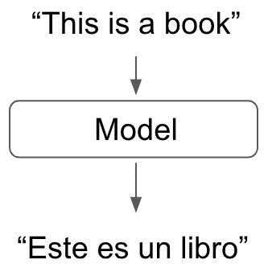
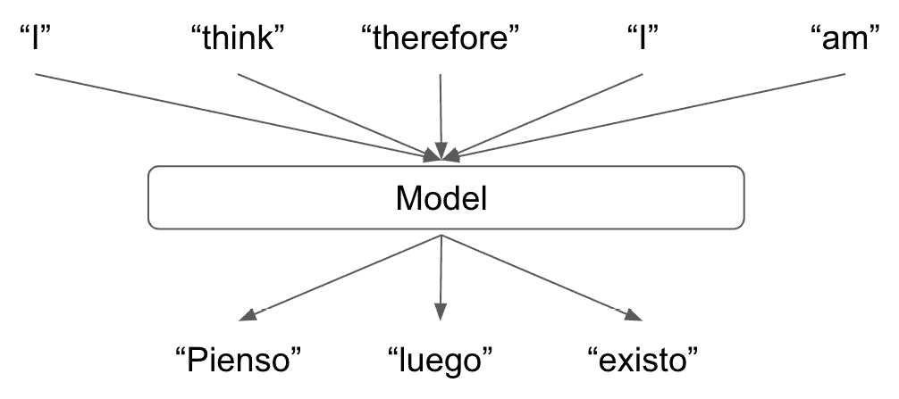
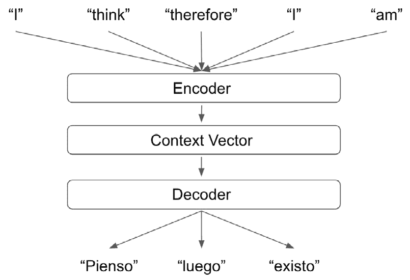
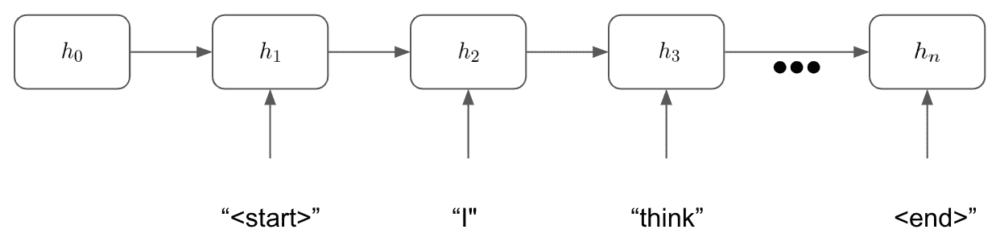
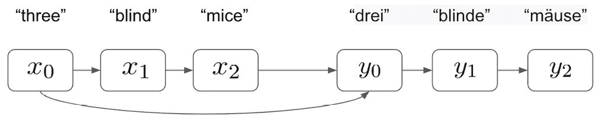
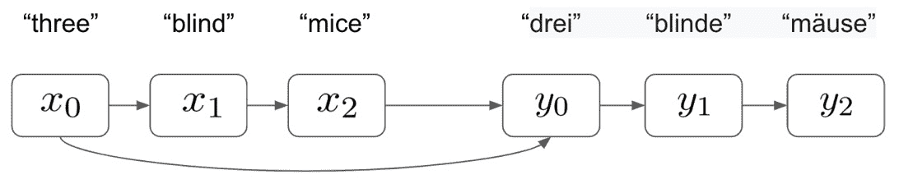
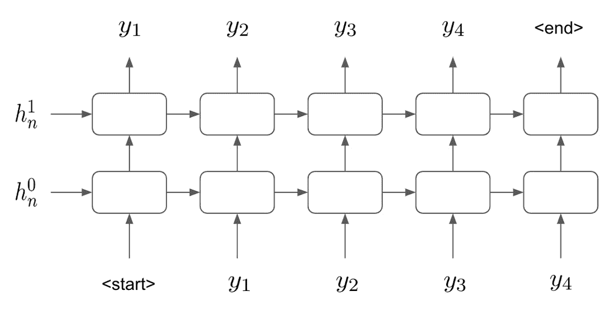
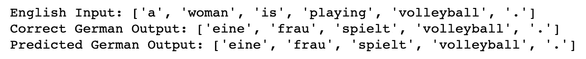
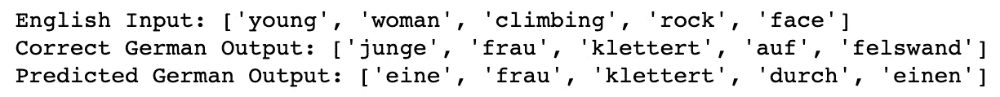

# “第 7 章”：使用序列到序列神经网络的文本翻译

在前两章中，我们使用神经网络对文本进行分类并执行情感分析。 两项任务都涉及获取 NLP 输入并预测一些值。 就我们的情感分析而言，这是一个介于 0 和 1 之间的数字，代表我们句子的情感。 就我们的句子分类模型而言，我们的输出是一个多类预测，其中我们的句子属于多个类别。 但是，如果我们不仅希望做出单个预测，还希望做出整个句子，该怎么办？ 在本章中，我们将构建一个序列到序列模型，该模型将一种语言的句子作为输入，并输出另一种语言的句子翻译。

我们已经探索了用于 NLP 学习的几种类型的神经网络架构，即 “第 5 章”，“循环神经网络和情感分析”中的循环神经网络，以及“第 6 章”，“使用 CNN 的文本分类”中的卷积神经网络。 在本章中，我们将再次使用这些熟悉的 RNN，而不仅仅是构建简单的 RNN 模型，我们还将 RNN 用作更大，更复杂的模型的一部分，以执行序列到序列的翻译。 通过使用我们在前几章中了解到的 RNN 的基础，我们可以展示如何扩展这些概念，以创建适合目的的各种模型。

在本章中，我们将介绍以下主题：

*   序列到序列模型理论
*   构建用于文本翻译的序列到序列神经网络
*   下一步

# 技术要求

本章的所有代码都可以在[这个页面](https://github.com/PacktPublishing/Hands-On-Natural-Language-Processing-with-PyTorch-1.x)中找到。

# 序列间模型理论

序列到序列模型与到目前为止我们所看到的常规神经网络结构非常相似。 主要区别在于，对于模型的输出，我们期望使用另一个序列，而不是二进制或多类预测。 这在翻译之类的任务中特别有用，我们可能希望将整个句子转换为另一种语言。

在以下示例中，我们可以看到我们的英语到西班牙语翻译将单词映射到单词：

图 7.1 –英语到西班牙语的翻译

输入句子中的第一个单词与输出句子中的第一个单词很好地映射。 如果所有语言都是这种情况，我们可以简单地通过训练有素的模型将句子中的每个单词逐个传递以获得输出句子，并且不需要任何序列到序列建模，如下所示：

图 7.2 –单词的英语到西班牙语翻译

但是，我们从的 NLP 经验中得知，语言并不像这样简单！ 一种语言中的单个单词可能会映射到其他语言中的多个单词，并且这些单词在语法正确的句子中出现的顺序可能并不相同。 因此，我们需要一个可以捕获整个句子的上下文并输出正确翻译的模型，而不是旨在直接翻译单个单词的模型。 这是序列到序列建模必不可少的地方，如下所示：

图 7.3 –用于翻译的序列到序列建模

为了训练一个序列到序列模型，该模型捕获输入句子的上下文并将其转换为输出句子，我们将实质上训练两个较小的模型，使我们能够做到这一点：

*   **编码器**模型，其中捕获句子的上下文并将其作为单个上下文向量输出
*   **解码器**，它使用原始句子的上下文向量表示并将其翻译成另一种语言

因此，实际上，我们完整的序列到序列翻译模型实际上将如下所示：

图 7.4 –完整的序列到序列模型

通过将模型分成单独的编码器和解码器元素，我们可以有效地模块化我们的模型。 这意味着，如果我们希望训练多个模型以将英语翻译成不同的语言，则无需每次都重新训练整个模型。 我们只需要训练多个不同的解码器就可以将上下文向量转换为输出语句。 然后，在进行预测时，我们可以简单地交换我们希望用于翻译的解码器：

图 7.5 –详细的模型布局

接下来，我们将检查序列到序列模型的编码器和解码器组件。

## 编码器

我们的序列到序列模型的编码器元素的目的是能够完全捕获我们输入句子的上下文并将其表示为向量。 我们可以通过使用 RNN 或更具体地说是 LSTM 来实现。 您可能从我们前面的章节中回忆过，RNN 接受顺序输入并在整个顺序中保持隐藏状态。 序列中的每个新单词都会更新隐藏状态。 然后，在序列的最后，我们可以使用模型的最终隐藏状态作为下一层的输入。

在我们的编码器的情况下，隐藏状态表示整个句子的上下文向量表示，这意味着我们可以使用 RNN 的隐藏状态输出来表示整个输入句子：

图 7.6 –检查编码器

我们使用最终的隐藏状态`h`n 作为上下文向量，然后使用训练有素的解码器对其进行解码。 也值得观察，在我们的序列到序列模型的上下文中，我们分别在输入句子的开头和结尾添加了“开始”和“结束”标记。 这是因为我们的输入和输出没有有限的长度，并且我们的模型需要能够学习句子何时结束。 我们的输入语句将始终以“ end”令牌结尾，该令牌向编码器发出信号，表明此时的隐藏状态将用作此输入语句的最终上下文向量表示形式。 类似地，在解码器步骤中，我们将看到我们的解码器将继续生成单词，直到它预测到“结束”令牌为止。 这使我们的解码器可以生成实际的输出语句，而不是无限长的令牌序列。

接下来，我们将研究解码器如何获取此上下文向量，并学习将其转换为输出语句。

## 解码器

我们的解码器从我们的编码器层获取最终隐藏状态，并将其解码为另一种语言的句子。 我们的解码器是 RNN，类似于我们的编码器，但是我们的编码器会根据当前的隐藏状态和句子中的当前单词来更新其隐藏状态，而解码器会在每次迭代时更新其隐藏状态并输出令牌， 当前隐藏状态和句子中的先前预测单词。 在下图中可以看到：

图 7.7 –检查解码器

首先，我们的模型将上下文向量作为编码器步骤`h0`的最终隐藏状态。 然后，我们的模型旨在根据给定的当前隐藏状态预测句子中的下一个单词，然后预测句子中的前一个单词。 我们知道我们的句子必须以“开始”标记开头，因此，在第一步中，我们的模型会尝试根据给定的先前隐藏状态`h0`来预测句子中的第一个单词， 句子（在这种情况下，是“开始”标记）。 我们的模型进行预测（`"pienso"`），然后更新隐藏状态以反映模型的新状态`h1`。 然后，在下一步中，我们的模型将使用新的隐藏状态和最后的预测单词来预测句子中的下一个单词。 这一直持续到模型预测出“ end”令牌为止，这时我们的模型停止生成输出字。

该模型背后的直觉与到目前为止我们所学的关于语言表示的知识一致。 给定句子中的单词取决于其前面的单词。 因此，要预测句子中的任何给定单词而不考虑之前已被预测的单词，这将是没有意义的，因为任何给定句子中的单词都不是彼此独立的。

我们像以前一样学习模型参数：通过向前传递，根据预测句子计算目标句子的损失，并通过网络反向传播此损失，并随即更新参数。 但是，使用此过程进行学习可能会非常缓慢，因为首先，我们的模型具有很小的预测能力。 由于我们对目标句子中单词的预测不是彼此独立的，因此，如果我们错误地预测目标句子中的第一个单词，则输出句子中的后续单词也不太可能是正确的。 为了帮助完成此过程，我们可以使用一种称为**教师强制**的技术。

## 使用教师强制

由于我们的模型最初并未做出良好的预测，因此我们会发现任何初始误差都会成倍增加。 如果我们在句子中的第一个预测单词不正确，那么句子的其余部分也可能不正确。 这是因为我们的模型所做的预测取决于之前所做的预测。 这意味着我们的模型所遭受的任何损失都可以成倍增加。 因此，我们可能会遇到爆炸梯度问题，这使得我们的模型很难学习任何东西：

图 7.8 –使用教师强制

但是，通过使用**教师强制**，我们使用正确的先前目标词来训练我们的模型，以便一个错误的预测不会抑制我们的模型从正确的预测中学习的能力。 这意味着，如果我们的模型在句子中的某一点做出了错误的预测，那么它仍然可以使用后续单词来做出正确的预测。 尽管我们的模型仍然会错误地预测单词，并且会损失损耗以更新梯度，但是现在，我们没有遭受梯度爆炸的困扰，并且我们的模型将更快地学习：

图 7.9 –更新损失

您可以考虑使用教师强制作为一种帮助我们的模型在每个时间步上独立于其先前预测进行学习的方式。 这样一来，早期阶段错误预测所导致的损失就不会转移到后续阶段。

通过组合编码器和解码器步骤，并应用教师强制来帮助我们的模型学习，我们可以构建一个序列到序列模型，该模型将允许我们将一种语言的序列翻译成另一种语言。 在下一节中，我们将说明如何使用 PyTorch 从头开始构建它。

# 建立用于文本翻译的序列到序列模型

为了建立我们的序列到序列模型进行翻译，我们将实现前面概述的编码器/解码器框架。 这将显示如何将模型的两半一起使用，以便使用编码器捕获数据的表示形式，然后使用我们的解码器将该表示形式转换为另一种语言。 为此，我们需要获取数据。

## 准备数据

到现在为止，我们对机器学习有了足够的了解，知道对于这样的任务，我们将需要一组带有相应标签的训练数据。 在这种情况下，我们将需要一种语言的句子以及另一种语言的相应翻译。 幸运的是，我们在上一章中使用的`Torchtext`库包含一个数据集，可让我们获取此信息。

`Torchtext`中的 **Multi30k** 数据集由大约 30,000 个句子以及相应的多种语言翻译组成。 对于此翻译任务，我们的输入句子将使用英语，而我们的输出句子将使用德语。 因此，我们经过全面训练的模型将允许我们**将英语句子翻译成德语**。

我们将从提取数据并对其进行预处理开始。 我们将再次使用`spacy`，其中包含内置词汇表，可用于标记数据：

1.  We start by loading our **spacy** tokenizers into Python. We will need to do this once for each language we are using since we will be building two entirely separate vocabularies for this task:

    spacy_german = spacy.load（‘de’）

    spacy_english = spacy.load（‘en’）

    重要的提示

    您可能需要通过执行以下操作从命令行安装德语词汇表（我们在上一章中安装了英语词汇表）：`python3 -m spacy download de`

2.  Next, we create a function for each of our languages to tokenize our sentences. Note that our tokenizer for our input English sentence reverses the order of the tokens:

    def tokenize_german（文字）：

    在 spacy_german 中返回[token.text 作为令牌。 令牌生成器（文本）]

    def tokenize_english（文本）：

    在 spacy_english 中返回[token.text 作为令牌。 tokenizer（文本）] [::-1]

    虽然并非必须反转输入句子的顺序，但已证明它可以提高模型的学习能力。 如果我们的模型由两个连接在一起的 RNN 组成，则可以证明反转输入句子时模型中的信息流得到改善。 例如，让我们以英语作为基本输入句子，但不作反述，如下所示：

    

    图 7.10 –反转输入字

    在这里，我们可以看到，为了正确预测第一个输出单词`y0`，我们从`x0`开始的第一个英语单词必须经过三个 RNN 层才能进行预测。 就学习而言，这意味着我们的梯度必须通过三个 RNN 层进行反向传播，同时保持通过网络的信息流。 现在，我们将其与的情况进行比较，在该情况下我们反转了输入句子：

    

    图 7.11 –反转输入语句

    现在我们可以看到输入句子中第一个真正单词与输出句子中相应单词之间的距离只是一个 RNN 层。 这意味着梯度只需要反向传播到一层，这意味着与这两个词之间的距离为三层时相比，我们网络的信息流和学习能力要大得多。

    如果我们要计算逆向和非逆向变体的输入单词与它们的输出对应单词之间的总距离，我们会发现它们是相同的。 但是，我们之前已经看到输出语句中最重要的单词是第一个单词。 这是因为输出句子中的单词取决于它们之前的单词。 如果我们错误地预测了输出句子中的第一个单词，那么我们句子中的其余单词很可能也会被错误地预测。 但是，通过正确预测第一个单词，我们可以最大程度地正确预测整个句子。 因此，通过最小化输出句子中第一个单词与其输入对应单词之间的距离，我们可以提高模型学习这种关系的能力。 这增加了该预测正确的机会，从而最大化了正确预测整个输出句子的机会。

3.  With our tokenizers constructed, we now need to define the fields for our tokenization. Notice here how we append start and end tokens to our sequences so that our model knows when to begin and end the sequence’s input and output. We also convert all our input sentences into lowercase for the sake of simplicity:

    源=字段（tokenize = tokenize_english，

    init_token =‘<sos>’，</sos>

    eos_token =‘<eos>’，</eos>

    较低=正确）

    TARGET = Field（tokenize = tokenize_german，

    init_token =‘<sos>’，</sos>

    eos_token =‘<eos>’，</eos>

    较低=正确）

4.  With our fields defined, our tokenization becomes a simple one-liner. The dataset containing 30,000 sentences has built-in training, validation, and test sets that we can use for our model:

    train_data，valid_data，test_data = Multi30k.splits（exts =（'.en'，'.de'），fields =（SOURCE，TARGET））

5.  We can examine individual sentences using the **examples** property of our dataset objects. Here, we can see that the source (**src**) property contains our reversed input sentence in English and that our target (**trg**) contains our non-reversed output sentence in German:

    打印（train_data.examples [0] .src）

    打印（train_data.examples [0] .trg）

    这给我们以下输出：

    

    图 7.12 –训练数据示例

6.  Now, we can examine the size of each of our datasets. Here, we can see that our training dataset consists of 29,000 examples and that each of our validation and test sets consist of 1,014 and 1,000 examples, respectively. In the past, we have used 80%/20% splits for the training and validation data. However, in instances like this, where our input and output fields are very sparse and our training set is of a limited size, it is often beneficial to train on as much data as there is available:

    print（“训练数据集大小：“ + str（len（train_data。示例）））

    print（“验证数据集大小：“ + str（len（valid_data。examples））））

    print（“测试数据集大小：“ + str（len（test_data。示例））））

    这将返回以下输出：

    

    图 7.13 –数据样本长度

7.  Now, we can build our vocabularies and check their size. Our vocabularies should consist of every unique word that was found within our dataset. We can see that our German vocabulary is considerably larger than our English vocabulary. Our vocabularies are significantly smaller than the true size of each vocabulary for each language (every word in the English dictionary). Therefore, since our model will only be able to accurately translate words it has seen before, it is unlikely that our model will be able to generalize well to all possible sentences in the English language. This is why training models like this accurately requires extremely large NLP datasets (such as those Google has access to):

    SOURCE.build_vocab（train_data，min_freq = 2）

    TARGET.build_vocab（train_data，min_freq = 2）

    打印（“英语（来源）词汇量：“ + str（len（SOURCE.vocab）））

    print（“德语（目标）词汇量：“ + str（len（TARGET.vocab））））

    这给出以下输出：

    

    图 7.14 –数据集的词汇量

8.  Finally, we can create our data iterators from our datasets. As we did previously, we specify the usage of a CUDA-enabled GPU (if it is available on our system) and specify our batch size:

    device = torch.device（如果 torch.cuda.is_available（）则为“ cuda”，否则为“ cpu”）

    batch_size = 32

    train_iterator，valid_iterator，test_iterator = BucketIterator.splits（

    （train_data，valid_data，test_data），

    batch_size = batch_size，

    设备=设备）

现在我们的数据已经过预处理，我们可以开始构建模型本身。

## 构建编码器

现在，我们准备开始构建我们的编码器：

1.  First, we begin by initializing our model by inheriting from our **nn.Module** class, as we’ve done with all our previous models. We initialize with a couple of parameters, which we will define later, as well as the number of dimensions in the hidden layers within our LSTM layers and the number of LSTM layers:

    编码器类（nn.Module）：

    def __init __（self，input_dims，emb_dims，hid_dims，n_layers，辍学）：

    super（）.__ init __（）

    self.hid_dims = hid_dims

    self.n_layers = n_layers

2.  Next, we define our embedding layer within our encoder, which is the length of the number of input dimensions and the depth of the number of embedding dimensions:

    self.embedding = nn.Embedding（input_dims，emb_dims）

3.  Next, we define our actual LSTM layer. This takes our embedded sentences from the embedding layer, maintains a hidden state of a defined length, and consists of a number of layers (which we will define later as 2). We also implement **dropout** to apply regularization to our network:

    self.rnn = nn.LSTM（emb_dims，hid_dims，n_layers，辍学=辍学）

    self.dropout = nn.Dropout（辍学）

4.  Then, we define the forward pass within our encoder. We apply the embeddings to our input sentences and apply dropout. Then, we pass these embeddings through our LSTM layer, which outputs our final hidden state. This will be used by our decoder to form our translated sentence:

    def forward（self，src）：

    嵌入式= self.dropout（self.embedding（src））

    输出（h，单元格）= self.rnn（嵌入式）

    返回 h，单元格

我们的编码器将包含两个 LSTM 层，这意味着我们的输出将输出两个隐藏状态。 这也意味着我们的整个 LSTM 层以及我们的编码器将看起来像，其中我们的模型输出两个隐藏状态：

图 7.15 –带有编码器的 LSTM 模型

现在我们已经构建了编码器，让我们开始构建解码器。

## 构建解码器

我们的解码器将从我们的编码器的 LSTM 层中获取最终的隐藏状态，并将其转换为另一种语言的输出语句。 我们首先以与编码器几乎完全相同的方式初始化解码器。 唯一的区别是我们还添加了一个全连接线性层。 该层将使用来自 LSTM 的最终隐藏状态，以便对句子中的正确单词进行预测：

类 Decoder（nn.Module）：

def __init __（self，output_dims，emb_dims，hid_dims，n_layers，辍学）：

super（）.__ init __（）

self.output_dims = output_dims

self.hid_dims = hid_dims

self.n_layers = n_layers

self.embedding = nn.Embedding（output_dims，emb_dims）

self.rnn = nn.LSTM（emb_dims，hid_dims，n_layers，辍学=辍学）

self.fc_out = nn.Linear（hid_dims，output_dims）

self.dropout = nn.Dropout（辍学）

除了增加了两个关键步骤外，我们的正向传播与编码器非常相似。 首先，从上一层取消输入，以使其为进入嵌入层的正确大小。 我们还添加了一个全连接层，该层采用了 RNN 层的输出隐藏层，并使用它来预测序列中的下一个单词：

def forward（自我，输入，h，单元格）：

输入= input.unsqueeze（0）

嵌入式= self.dropout（self.embedding（输入））

输出，（h，单元格）= self.rnn（嵌入式，（h，单元格））

pred = self.fc_out（output.squeeze（0））

返回 pred，h，单元格

同样，类似于我们的编码器，我们在解码器中使用了两层 LSTM 层。 我们从编码器获取最终的隐藏状态，并使用它们生成序列 Y1 中的第一个单词。 然后，我们更新隐藏状态，并使用它和 Y1 生成我们的下一个单词 Y2，重复此过程，直到我们的模型生成结束标记。 我们的解码器看起来像这样：

图 7.16 –带有解码器的 LSTM 模型

在这里，我们可以看到，分别定义编码器和解码器并不是特别复杂。 但是，当我们将这些步骤组合成一个更大的序列到序列模型时，事情开始变得有趣起来：

## 构建完整的序列到序列模型

现在，我们必须将模型的两半拼接在一起，以产生完整的序列到序列模型：

1.  We start by creating a new sequence-to-sequence class. This will allow us to pass our encoder and decoder to it as arguments:

    Seq2Seq（nn.Module）类：

    def __init __（自身，编码器，解码器，设备）：

    super（）.__ init __（）

    self.encoder =编码器

    self.decoder =解码器

    self.device =设备

2.  Next, we create the **forward** method within our **Seq2Seq** class. This is arguably the most complicated part of the model. We combine our encoder with our decoder and use teacher forcing to help our model learn. We start by creating a tensor in which we still store our predictions. We initialize this as a tensor full of zeroes, but we still update this with our predictions as we make them. The shape of our tensor of zeroes will be the length of our target sentence, the width of our batch size, and the depth of our target (German) vocabulary size:

    def forward（自我，src，trg，teacher_forcing_rate = 0.5）：

    batch_size = trg.shape [1]

    target_length = trg.shape [0]

    target_vocab_size = self.decoder.output_dims

    输出= torch.zeros（target_length，batch_size，target_vocab_size）.to（self.device）

3.  Next, we feed our input sentence into our encoder to get the output hidden states:

    h，单元格= self.encoder（src）

4.  Then, we must loop through our decoder model to generate an output prediction for each step in our output sequence. The first element of our output sequence will always be the **<start>** token. Our target sequences already contain this as the first element, so we just set our initial input equal to this by taking the first element of the list:

    输入= trg [0 ,:]

5.  接下来，我们遍历并做出预测。 我们将隐藏状态（从编码器的输出）传递到解码器，以及初始输入（即`<start>`令牌）。 这将返回我们序列中所有单词的预测。 但是，我们只对当前步骤中的单词感兴趣。 也就是说，序列中的下一个单词。 请注意，我们是如何从 1 而不是 0 开始循环的，所以我们的第一个预测是序列中的第二个单词（因为预测的第一个单词将始终是起始标记）。
6.  This output consists of a vector of the target vocabulary’s length, with a prediction for each word within the vocabulary. We take the **argmax** function to identify the actual word that is predicted by the model.

    然后，我们需要为下一步选择新的输入。 我们将教师强制率设置为 50%，这意味着 50% 的时间，我们将使用刚刚做出的预测作为解码器的下一个输入，而其他 50% 的时间，我们将采用真正的目标 。 正如我们之前所讨论的，这比仅依赖模型的预测可以帮助我们的模型更快地学习。

    然后，我们继续执行此循环，直到对序列中的每个单词有完整的预测为止：

    对于范围（1，target_length）中的 t：

    输出，h，单元格= self.decoder（输入，h，单元格）

    输出[t] =输出

    顶部= output.argmax（1）

    输入= trg [t]如果（random.random（）

    返回输出

7.  Finally, we create an instance of our Seq2Seq model that’s ready to be trained. We initialize an encoder and a decoder with a selection of hyperparameters, all of which can be changed to slightly alter the model:

    input_dimensions = len（SOURCE.vocab）

    output_dimensions = len（TARGET.vocab）

    encoder_embedding_dimensions = 256

    coder_embedding_dimensions = 256

    hidden_​​layer_dimensions = 512

    number_of_layers = 2

    encoder_dropout = 0.5

    coder_dropout = 0.5

8.  We then pass our encoder and decoder to our **Seq2Seq** model in order to create the complete model:

    encod =编码器（input_dimensions，\

    coder_embedding_dimensions，\

    hidden_​​layer_dimensions，\

    number_of_layers，encoder_dropout）

    decod =解码器（output_dimensions，\

    coder_embedding_dimensions，\

    hidden_​​layer_dimensions，\

    number_of_layers，decoder_dropout）

    型号= Seq2Seq（编码，解码，设备）.to（设备）

在此处尝试使用不同的参数进行试验，看看它如何影响模型的性能。 例如，尽管模型的整体最终性能可能会更好，但是在隐藏层中使用大量尺寸可能会使模型训练速度变慢。 或者，模型可能过拟合。 通常，需要进行实验才能找到性能最佳的模型。

在完全定义了 Seq2Seq 模型之后，我们现在就可以开始对其进行训练了。

## 训练进行模型

我们的模型将以在模型的所有部分中权重为 0 的初始化。 尽管理论上该模型应该能够在没有（零）权重的情况下进行学习，但事实表明，使用随机权重进行初始化可以帮助模型更快地学习。 让我们开始吧：

1.  Here, we will initialize our model with the weights of random samples from a normal distribution, with the values being between -0.1 and 0.1:

    def initialize_weights（m）：

    对于名称，m.named_pa​​rameters（）中的参数：

    nn.init.uniform_（param.data，-0.1，0.1）

    model.apply（initialize_weights）

2.  Next, as with all our other models, we define our optimizer and loss functions. We’re using cross-entropy loss as we are performing multi-class classification (as opposed to binary cross-entropy loss for a binary classification):

    优化程序= optim.Adam（model.parameters（））

    条件= nn.CrossEntropyLoss（ignore_index =TARGET。vocab.stoi[TARGET.pad_token]）

3.  Next, we define the training process within a function called **train()**. First, we set our model to train mode and set the epoch loss to`0`:

    def 火车（模型，迭代器，优化器，条件，剪辑）：

    model.train（）

    epoch_loss = 0

4.  We then loop through each batch within our training iterator and extract the sentence to be translated (**src**) and the correct translation of this sentence (**trg**). We then zero our gradients (to prevent gradient accumulation) and calculate the output of our model by passing our model function our inputs and outputs:

    对于我，在枚举（迭代器）中进行批处理：

    src = batch.src

    trg = batch.trg

    Optimizer.zero_grad（）

    输出=模型（src，trg）

5.  Next, we need to calculate the loss of our model’s prediction by comparing our predicted output to the true, correct translated sentence. We reshape our output data and our target data using the shape and view functions in order to create two tensors that can be compared to calculate the loss. We calculate the **loss** criterion between our output and **trg** tensors and then backpropagate this loss through the network:

    output_dims = output.shape [-1]

    输出=输出[1：]。view（-1，output_dims）

    trg = trg [1：]。视图（-1）

    损失=标准（输出，TRG）

    loss.backward（）

6.  We then implement gradient clipping to prevent exploding gradients within our model, step our optimizer in order to perform the necessary parameter updates via gradient descent, and finally add the loss of the batch to the epoch loss. This whole process is repeated for all the batches within a single training epoch, whereby the final averaged loss per batch is returned:

    torch.nn.utils.clip_grad_norm_（model.parameters（），剪辑）

    Optimizer.step（）

    epoch_loss + = loss.item（）

    返回 epoch_loss / len（迭代器）

7.  After, we create a similar function called **evaluate()**. This function will calculate the loss of our validation data across the network in order to evaluate how our model performs when translating data it hasn’t seen before. This function is almost identical to our **train()** function, with the exception of the fact that we switch to evaluation mode:

    model.eval（）

8.  Since we don’t perform any updates for our weights, we need to make sure to implement **no_grad** mode:

    使用 torch.no_grad（）：

9.  The only other difference is that we need to make sure we turn off teacher forcing when in evaluation mode. We wish to assess our model’s performance on unseen data, and enabling teacher forcing would use our correct (target) data to help our model make better predictions. We want our model to be able to make perfect, unaided predictions:

    输出=模型（src，trg，0）

10.  Finally, we need to create a training loop, within which our **train()** and **evaluate()** functions are called. We begin by defining how many epochs we wish to train for and our maximum gradient (for use with gradient clipping). We also set our lowest validation loss to infinity. This will be used later to select our best-performing model:

    时代= 10

    grad_clip = 1

    minimum_validation_loss = float（‘inf’）

11.  We then loop through each of our epochs and within each epoch, calculate our training and validation loss using our **train()** and **evaluate()** functions. We also time how long this takes by calling **time.time()** before and after the training process:

    对于范围内的纪元（纪元）：

    start_time = time.time（）

    train_loss =火车（模型，train_iterator，优化器，条件，grad_clip）

    valid_loss =评估（模型，valid_iterator，条件）

    end_time = time.time（）

12.  Next, for each epoch, we determine whether the model we just trained is the best-performing model we have seen thus far. If our model performs the best on our validation data (if the validation loss is the lowest we have seen so far), we save our model:

    如果有效损失

    minimum_validation_loss = valid_loss

    torch.save（model.state_dict（），seq2seq.pt）

13.  Finally, we simply print our output:

    print（f’Epoch：{epoch + 1：02} | Time：{np.round（end_time-start_time，0）} s’）

    打印（f’\ t 火车损失：{train_loss：.4f}’）

    print（f’\ t Val。Loss：{valid_loss：.4f}’）

    如果我们的训练工作正常，我们应该看到训练损失会随着时间而减少，就像这样：

图 7.17 –训练模型

在这里，我们可以看到我们的训练和验证损失似乎都随着时间而下降。 我们可以继续训练模型很多时间，理想情况下，直到验证损失达到最低值为止。 现在，我们可以评估性能最佳的模型，以查看进行实际翻译时的性能。

## 评估模型

为了评估我们的模型，我们将使用我们的测试数据集并通过我们的模型运行英语句子，以获得对德语翻译的预测。 然后，我们将能够将其与真实的预测进行比较，以查看我们的模型是否做出了准确的预测。 让我们开始吧！

1.  We start by creating a **translate()** function. This is functionally identical to the **evaluate()** function we created to calculate the loss over our validation set. However, this time, we are not concerned with the loss of our model, but rather the predicted output. We pass the model our source and target sentences and also make sure we turn teacher forcing off so that our model does not use these to make predictions. We then take our model’s predictions and use an **argmax** function to determine the index of the word that our model predicted for each word in our predicted output sentence:

    输出=模型（src，trg，0）

    preds = torch.tensor（[[x 输出中的[[torch.argmax（x）.item（）]]]

2.  Then, we can use this index to obtain the actual predicted word from our German vocabulary. Finally, we compare the English input to our model that contains the correct German sentence and the predicted German sentence. Note that here, we use **[1:-1]** to drop the start and end tokens from our predictions and we reverse the order of our English input (since the input sentences were reversed before they were fed into the model):

    print（‘英语输入：’+ str（[sOURCE.vocab.itos [x] for src 中的 x] [1：-1] [::-1]））

    print（‘正确的德语输出：’+ str（[trag 中的 x 的[TARGET.vocab。itos [x]] [1：-1]））

    print（‘预计的德语输出：’+ str（[preGET 中 x 的[TARGET.vocab。itos [x]] [1：-1]））

    通过这样做，我们可以将我们的预测输出与正确的输出进行比较，以评估我们的模型是否能够做出准确的预测。 从模型的预测中可以看出，我们的模型能够将英语句子翻译成德语，尽管还差强人意。 我们模型的某些预测与目标数据完全相同，这表明我们的模型完美地翻译了这些句子：

图 7.18 –翻译输出第一部分

在其他情况下，我们的模型仅需一个词即可完成。 在这种情况下，我们的模型会预测单词`hüten`而不是`mützen`； 但是，`hüten`实际上是`mützen`可接受的翻译，尽管这些词在语义上可能并不相同：

图 7.19 –翻译输出第二部分

我们还可以看到一些似乎被误解的示例。 在下面的示例中，我们预测的德语句子的英语等同词为`A woman climbs through one`，这不等于`Young woman climbing rock face`。 但是，该模型仍然设法翻译了英语句子（女性和攀岩）的关键要素：

图 7.20 –翻译输出第三部分

在这里，我们可以看到尽管我们的模型清楚地尝试了将英语翻译成德语的尝试，但它远非完美，并且会犯一些错误。 当然，它不能愚弄以德语为母语的人！ 接下来，我们将讨论几种改进序列到序列翻译模型的方法。

# 后续步骤

虽然我们已经证明序列到序列模型可以有效地执行语言翻译，但是从头开始训练的模型无论如何都不是完美的翻译器。 部分原因是由于我们的训练数据相对较小。 我们用 30,000 个英语/德语句子集训练了模型。 尽管这看起来可能很大，但是为了训练一个完美的模型，我们需要一个大几个数量级的训练集。

从理论上讲，我们需要为整个英语和德语中的每个单词提供几个示例，以使我们的模型真正理解其上下文和含义。 就上下文而言，我们训练中的 30,000 个英语句子仅包含 6,000 个独特单词。 据说说英语的人的平均词汇量在 20,000 到 30,000 个单词之间，这使我们了解到，要训练一个表现出色的模型，我们需要多少个例句。 这可能就是为什么最准确的翻译工具归能够访问大量语言数据的公司（例如 Google）所有的原因。

# 摘要

在本章中，我们介绍了如何从头开始构建序列到序列模型。 我们学习了如何分别对编码器和解码器组件进行编码，以及如何将它们集成到一个模型中，该模型能够将句子从一种语言翻译成另一种语言。

尽管我们的由编码器和解码器组成的序列到序列模型对于序列翻译很有用，但它已不再是最新技术。 在过去的几年中，已经完成了将序列到序列模型与注意力模型结合起来以实现最新性能的方法。

在下一章中，我们将讨论如何在序列到序列学习的上下文中使用注意力网络，并展示如何使用两种技术来构建聊天机器人。